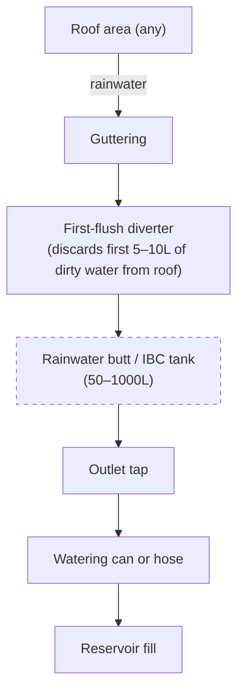

# Guide 03 — Water Quality
## Sources, Testing, Treatment, and Management

---

## 1. Why Starting Water Quality Matters

In hydroponics, water is the delivery vehicle for every nutrient your plants will ever receive. The quality of your source water directly affects:

- **EC baseline:** All tap water contains dissolved minerals. Your source water EC is a floor you start from — you add nutrients on top of it.
- **pH stability:** Waters high in bicarbonates (alkaline/hard water) resist pH adjustment and cause pH to "creep" back up, requiring more pH-down and more frequent corrections.
- **Nutrient interference:** High calcium, magnesium, chlorine, iron, or sodium in source water can interfere with your nutrient ratios or damage roots.
- **Pathogen introduction:** Untreated surface water can introduce Pythium, algae, and bacteria directly into your system.

**First step before mixing any nutrients:** Test your source water's EC and pH. This tells you your baseline and informs how much you need to adjust.

---

## 2. TDS (Total Dissolved Solids) and EC Baseline

### Testing Your Source Water

Before adding any nutrients, measure your tap water straight from the tap:

```
  WHAT TO LOOK FOR:

  Source water EC:    0.0–0.2 mS/cm   → Excellent (soft/RO/rainwater)
                      0.2–0.4 mS/cm   → Good (mild minerals, workable)
                      0.4–0.6 mS/cm   → Acceptable (hard water, monitor)
                      0.6–1.0 mS/cm   → Problematic (very hard water)
                      1.0+ mS/cm      → Consider RO or rainwater blending

  Source water pH:    6.5–7.5         → Typical tap range
                      7.5–9.0         → Alkaline/hard water — needs correction
                      < 6.5           → Acidic (unusual for tap, check)
```

### Why Source EC Matters

Your source water EC represents **minerals already present** that contribute to the plant's total dissolved solid load. When you add nutrients:

```
  Total EC = Source water EC + Nutrients EC

  Example 1 (soft water):
  Source EC: 0.1 mS/cm + Nutrients: 1.4 mS/cm = Final: 1.5 mS/cm ← near target

  Example 2 (hard water):
  Source EC: 0.6 mS/cm + Nutrients: 1.4 mS/cm = Final: 2.0 mS/cm ← too high for lettuce!

  Hard water fix: Add LESS nutrient concentrate to hit target EC, OR use RO/rainwater.
```

### Interpreting Your Local Water Report

Most municipal water suppliers publish annual water quality reports online. Look for:
- **Total Dissolved Solids (TDS)** or **conductivity** — your EC baseline
- **Hardness** (as CaCO₃ or mg/L Ca+Mg) — affects pH buffering
- **Chlorine/chloramine** concentration — affects roots
- **pH** — your starting point
- **Iron, manganese, copper** — can cause problems at high levels

---

## 3. Tap Water: Chlorine, Chloramine, and Hardness

### Chlorine vs Chloramine — Critical Difference

| Property | Chlorine (Cl₂) | Chloramine (NH₂Cl) |
|----------|---------------|-------------------|
| **Used by** | Older water systems, smaller utilities | Most modern municipal systems |
| **Removal method** | Leave water to stand 24h, or use activated carbon | **CANNOT be removed by standing** |
| **How to remove** | Aeration, activated carbon, UV | Vitamin C (ascorbic acid), sodium thiosulphate, activated carbon |
| **Harm to plants** | Damages roots and beneficial microbes above ~2mg/L | Same, but persists longer |
| **Detection** | Smell dissipates after standing | No smell change after standing |

### How to Identify Which Your Water Uses

1. Contact your water supplier's website/phone line and ask
2. Fill a glass, leave overnight — if it still smells or tests positive for chlorine, it's chloramine

### Chloramine Removal

```
  METHOD 1 — Vitamin C (Ascorbic Acid):
  Add 1 gram of ascorbic acid per 40 litres of water.
  Neutralises chloramine within minutes.
  Slightly lowers pH (small effect, adjust pH after).
  Buy food-grade vitamin C powder — very cheap.

  METHOD 2 — Sodium Thiosulphate:
  Standard photography/aquarium dechlorinator.
  Works in seconds.
  Very small dose — follow product instructions.

  METHOD 3 — Activated Carbon Filter:
  In-line carbon block filter on your tap.
  Removes chlorine, chloramine, and other organics.
  Best permanent solution if you refill regularly.
```

### Hard Water Management

Hard water contains excess calcium and magnesium carbonate (bicarbonates). Problems it causes:
1. **pH creep:** Bicarbonate acts as a buffer, resisting pH-down and causing pH to drift upward
2. **Excess calcium:** Can cause Ca:Mg imbalance; may need to reduce Ca in your nutrient mix
3. **Scale/deposits:** White crusty buildup on channels, fittings, and reservoir walls

```
  HARD WATER MANAGEMENT STRATEGIES:

  Strategy 1 — Reduce Ca in nutrient recipe:
  If source water Ca is >100mg/L, reduce calcium nitrate dose by 20–30%
  and verify EC/Ca levels with a more detailed water test.

  Strategy 2 — Acidify to neutralise bicarbonates:
  Adding phosphoric acid (pH down) consumes bicarbonate as well as lowering pH.
  Hard water will simply require more pH-down per litre — this is normal.

  Strategy 3 — Blend with RO or rainwater:
  50/50 blend of hard tap water with RO or rainwater halves the mineral load.
  Practical, cheap, and works well.

  Strategy 4 — Full RO:
  Most precise control but adds cost. See section 5.
```

---

## 4. Well Water Issues

If you use well water, test it thoroughly before use. Common problems:

| Contaminant | Problem | Solution |
|-------------|---------|---------|
| **High iron (>0.3mg/L)** | Clogs pumps/fittings, causes iron toxicity, brown staining | Sediment filter + iron removal filter; or RO |
| **High sulfur (rotten egg smell)** | Toxic to roots at high levels; affects pH | Activated carbon + aeration |
| **High hardness (Ca+Mg)** | pH creep, scale, excess Ca/Mg | Softener or RO |
| **Bacteria/E.coli** | Dangerous for edible crops | UV sterilisation or chlorination then dechlorination |
| **Low pH (acidic)** | Rare; corrosive | pH up to correct |
| **Nitrates (from agriculture)** | Adds to nutrient load unpredictably | Test and adjust nutrient recipe |

**Recommendation:** If using well water, buy a basic water test kit from a hardware store or send a sample to a lab before starting. This costs $15–$50 and can save you a season of problems.

---

## 5. Reverse Osmosis (RO) — When It's Worth It

### What RO Does

Reverse osmosis forces water through a semi-permeable membrane that removes 95–99% of all dissolved solids, heavy metals, chlorine, chloramine, bacteria, and viruses. The result is near-pure water (EC: 0.00–0.05 mS/cm) that you have complete control over.

### Pros and Cons

| Pros | Cons |
|------|------|
| Perfect baseline water (EC ~0.0) | Cost: $50–$200 for a basic unit |
| No chlorine/chloramine issues | Waste water: produces 3–4L waste per 1L RO water |
| No hard water complications | Slow output: 50–200 litres per day for home units |
| Maximum nutrient control | Removes beneficial Ca/Mg (add back via CalMag or Masterblend) |
| Consistent results season to season | Membrane replacement every 1–2 years |

### Is RO Worth It for This System?

```
  DECISION GUIDE:

  Your tap water EC < 0.3 mS/cm:     → RO unnecessary, tap water is fine
  Your tap water EC 0.3–0.6 mS/cm:   → RO useful but not essential; blend or adjust recipe
  Your tap water EC > 0.6 mS/cm:     → RO strongly recommended
  You use well water with iron/sulfur: → RO recommended
  You want maximum precision:         → RO recommended
```

### RO Setup for This System

A countertop or under-sink RO unit with a storage tank (10–20L) is sufficient for an 80L reservoir that needs full changes every 7–10 days.

- Fill reservoir with RO water
- Add nutrients from scratch (EC starts at ~0.0)
- No need to worry about baseline minerals interfering

---

## 6. Rainwater Harvesting

Outdoor systems have a natural advantage: **free, soft, near-pure water falls from the sky**.

### Rainwater Characteristics

- **EC:** 0.01–0.05 mS/cm (essentially mineral-free — excellent baseline)
- **pH:** 5.5–6.5 (slightly acidic due to dissolved CO₂ — often perfect for hydroponics)
- **Chlorine/chloramine:** None (natural water cycle)
- **Contaminants:** Dust, bird droppings, roof material runoff (if collected from a roof)

### Collection System



> **Key:** Cover the tank to prevent algae, debris, and mosquito breeding.

### Legality Note

Rainwater harvesting is legal and encouraged in most of Europe, UK, and Canada. In some US states (historically Colorado, Utah) it was restricted, though most states now permit domestic collection. **Check your local regulations** before investing in a large collection system.

### Using Rainwater in the System

- Test pH (usually 5.5–6.5 — may need little or no adjustment)
- Test EC (should be <0.1 mS/cm — excellent baseline)
- If collected from a roof, filter through a fine mesh before use
- Mix with tap water if you run low during dry periods

---

## 7. pH Testing Methods Compared

### pH Drops / Test Kits (Liquid)

```
  HOW IT WORKS: Add indicator drops to a water sample; colour matches pH chart.
  
  Pros:  Cheap ($5–$10), no calibration, no batteries, works forever
  Cons:  Subjective colour matching, ±0.2–0.5 accuracy, only tests point samples
  
  Best for: Backup verification, no electricity environments
```

### pH Test Strips

```
  HOW IT WORKS: Dip strip into solution; compare colour to chart.
  
  Pros:  Cheap ($5–$15 for 100 strips), no calibration
  Cons:  ±0.5–1.0 accuracy, affected by nutrients staining the strip
         Especially inaccurate in nutrient solution (colour masking)
  
  Best for: Emergency backup only. NOT recommended for regular use in hydroponics.
```

### Digital pH Meters (Recommended)

```
  HOW IT WORKS: Glass electrode measures H⁺ ion concentration electronically.
  
  Pros:  ±0.01–0.05 accuracy when calibrated, fast, easy to read
  Cons:  Requires calibration with buffer solution, electrode degrades over time,
         must store probe in storage solution (not water)
  
  Budget options:  Vivosun, Dr.meter (~$12–$20) — acceptable accuracy
  Mid-range:       Apera PH20, BlueLab (~$35–$60) — excellent accuracy and build quality
  Professional:    Hanna HI98100+ (~$80+) — lab grade
  
  Recommendation: Apera PH20 for this budget system — reliable, auto-calibrating.
```

### Calibrating a pH Meter

```
  CALIBRATION PROCEDURE (2-point calibration):

  Materials needed:
  - pH 4.0 buffer solution (usually red/orange)
  - pH 7.0 buffer solution (usually yellow)
  - Distilled or RO water for rinsing

  Steps:
  1. Remove electrode from storage cap, rinse with distilled water
  2. Submerge in pH 7.0 buffer — wait for reading to stabilise — press CAL
  3. Rinse electrode with distilled water
  4. Submerge in pH 4.0 buffer — wait for reading to stabilise — press CAL
  5. Rinse with distilled water before each measurement
  6. Store electrode in storage solution (KCl), never in distilled water

  Calibrate: once per week during active growing season
  Replace electrode: every 12–18 months (or when calibration drifts >0.3 pH)
```

---

## 8. EC Meters: Types, Calibration, and Use

### EC Meter Types

| Type | Accuracy | Cost | Notes |
|------|----------|------|-------|
| Basic pen meter (budget) | ±0.1 mS/cm | $10–$20 | Good enough for home use; single-point calibration |
| Mid-range digital | ±0.05 mS/cm | $20–$50 | Better accuracy, temperature compensation |
| Combination EC/pH | ±0.1 EC, ±0.05 pH | $30–$80 | Convenient but compromises on both |
| BlueLab Truncheon | ±0.1 mS/cm | $50+ | No display, LED colour indicators — durable |
| Professional inline | ±0.02 mS/cm | $100+ | Continuous monitoring, data logging |

### Calibration

EC meters use a calibration solution with a known conductivity (commonly 1.413 mS/cm or 2.76 mS/cm EC standard solutions).

```
  EC CALIBRATION PROCEDURE:

  1. Rinse probe with distilled water
  2. Submerge in calibration solution
  3. Wait for reading to stabilise
  4. Adjust meter reading to match standard value
  5. Rinse probe with distilled water before use

  Calibrate: once per month, or if readings seem inconsistent
```

### Temperature Compensation

EC readings change with temperature (warm water = higher EC reading for same concentration). Quality meters include **Automatic Temperature Compensation (ATC)**. Always check that your meter has ATC before buying.

---

## 9. pH Up and pH Down — Safe Handling

### pH Down (Acid)

Most commonly: **Phosphoric acid (H₃PO₄)** — sold as pH Down or pH Minus

```
  Concentration: Typically 25–81% solution (dilute before contact with skin)
  
  Pros:  Provides a small phosphorus supplement as a bonus
  Cons:  Can contribute excess P at high doses; corrosive
  
  Safe use:
  - Wear gloves and eye protection
  - Always add to WATER, never water to acid
  - Start with small doses: 1ml per 4L, stir, measure, repeat
  - Rinse skin immediately if contact occurs
  
  Other pH down options:
  - Citric acid: natural, safe, used by some organic growers
  - Nitric acid: faster acting but more hazardous — not recommended for beginners
  - Sulfuric acid: very effective but dangerous — not recommended
```

### pH Up (Base)

Most commonly: **Potassium hydroxide (KOH)** — sold as pH Up or pH Plus

```
  Concentration: Typically 1–25% solution
  
  Pros:  Adds a small K (potassium) supplement
  Cons:  Can contribute excess K at high doses; caustic
  
  Safe use:
  - Wear gloves and eye protection
  - Very caustic — corrosive to skin and eyes
  - Add small drops only: 1ml per 4L, stir, measure, repeat
  - Store upright in a cool, dark place
  - Rinse skin immediately if contact occurs
  
  Alternative: Sodium bicarbonate (baking soda) — gentle, cheap, but adds Na which
  can accumulate and stress plants. Acceptable for emergency use only.
```

### pH Adjustment Protocol

```
  ADJUSTING pH TO TARGET RANGE (5.8–6.2):

  1. Mix nutrient solution first (nutrients affect pH)
  2. Measure pH
  3. If pH > 6.5: add pH Down 1ml at a time, stir, wait 30 seconds, remeasure
  4. If pH < 5.5: add pH Up 1ml at a time, stir, wait 30 seconds, remeasure
  5. Repeat until target achieved
  6. Final check after 5 minutes (pH can drift slightly after initial adjustment)
  
  COMMON MISTAKE: Over-adjusting (pH swinging past target). Go slowly.
  COMMON MISTAKE: Adjusting before nutrients are mixed (nutrients change pH significantly).
```

---

## 10. Water Temperature Management Outdoors

### The Outdoor Heat Problem

An 80L reservoir in direct sun on a hot summer day can reach 28–35°C — a temperature range where:
- Dissolved oxygen drops dramatically
- Pythium (root rot) thrives
- Nutrient uptake becomes stressed
- Beneficial microbial balance shifts

### Management Strategies

```
  STRATEGY 1 — SHADE (Free, most effective):
  Position reservoir UNDER the NFT frame in the shade of the channels.
  Or wrap with shade cloth.
  
  STRATEGY 2 — INSULATION ($5–$20):
  Wrap reservoir in:
  - Reflective bubble wrap insulation (best — reflects + insulates)
  - Foam camping mat glued to exterior
  - Bury partially in the ground (1/3 depth underground = effective thermal mass)
  
  STRATEGY 3 — WHITE/REFLECTIVE PAINT (Free if you have paint):
  Paint exterior of reservoir white or silver.
  Reflects radiant heat — can reduce water temp 2–4°C vs black container.
  
  STRATEGY 4 — FROZEN BOTTLES (Free, temporary):
  Fill 500ml–1L plastic bottles with water, freeze.
  Drop into reservoir on hot days.
  Works well for short-term temperature spikes.
  Replace daily in peak summer.
  
  STRATEGY 5 — AQUARIUM CHILLER ($50–$200):
  Most effective, most expensive.
  Inline chiller maintains water at set temperature.
  Worth considering if summer temps regularly exceed 30°C.
```

---

## 11. Algae Prevention

Algae is not directly harmful to plants but it:
- Competes for nutrients
- Clogs irrigation lines and filters
- Can harbour pathogens
- Creates biofilm that coats channels and roots
- Depletes dissolved oxygen at night (algae respires without light)

### Cause

Algae needs two things: **light** and **nutrients**. Your reservoir and channels have both. The solution is eliminating the light.

```
  ALGAE PREVENTION CHECKLIST:

  [ ] Use OPAQUE channels (white or black PVC — not clear tubing)
  [ ] Keep reservoir lid firmly in place and light-tight
  [ ] Cover any exposed nutrient tubing with tape or black pipe insulation
  [ ] Wrap the reservoir in black plastic film or paint it black/dark green
  [ ] Remove any transparent or translucent components from nutrient contact
  [ ] Clean reservoir and channels on the schedule (see guide/08)
  
  If algae appears despite prevention:
  [ ] Do a full system clean and reservoir change
  [ ] Check for light leaks — seal all light entry points
  [ ] Consider adding a UV steriliser to the return line (overkill for most home systems)
```

### Hydrogen Peroxide Treatment

If algae is already present:

```
  H₂O₂ (Hydrogen Peroxide) TREATMENT:

  Use: 3% food-grade H₂O₂ (available at pharmacies)
  Dose: 2–3ml per litre of reservoir volume
  
  Process:
  1. Remove all plants from affected channels first
  2. Add H₂O₂ to reservoir at 2ml/L
  3. Run pump for 30 minutes (circulates through all channels)
  4. Drain and rinse thoroughly with plain water
  5. Refill with fresh nutrient solution
  6. Replant
  
  Note: H₂O₂ kills algae AND beneficial microbes AND can stress plant roots.
  Always remove plants before treatment and rinse completely after.
```

---

## 12. Reservoir Size Calculations

### Minimum Volume per Plant Site

```
  STRICT MINIMUM: 3L per plant site
  PRACTICAL MINIMUM: 5L per plant site (with daily monitoring)
  COMFORTABLE: 10L per plant site (weekly monitoring is sufficient)
  
  Our system (43 sites, 80L reservoir):
  80L ÷ 43 sites = 1.9L per site ← below strict minimum
  
  This is manageable ONLY with:
  - Daily EC/pH measurement and adjustment
  - Top-up with pH-corrected water every 1–2 days
  - Full reservoir change every 7 days maximum
  
  If you want more relaxed management: upgrade to 120–150L reservoir.
```

---

## 13. Full Water Change Protocol

### Step-by-Step Reservoir Change

```
  FREQUENCY: Every 7–14 days (minimum), or when any trigger condition occurs

  WHAT YOU NEED:
  - Pump-out pump or siphon hose
  - Bucket for old solution
  - Scrub brush / sponge
  - 10% bleach solution (1 part bleach : 9 parts water) OR 3% H₂O₂
  - Fresh water supply
  - Nutrient concentrates and pH adjustment
  - Clean EC/pH meters

  STEPS:
  1. Turn off the pump
  2. Remove the pump from the reservoir (so it doesn't run dry)
  3. Siphon or pump out old nutrient solution
  4. Wipe interior of reservoir with a clean cloth to remove biofilm and sediment
  5. Add 2–3L of 10% bleach solution, swirl to coat all surfaces
  6. Leave for 10–15 minutes (sterilisation contact time)
  7. Drain and TRIPLE rinse with fresh water (no bleach residue must remain)
  8. Inspect pump filter — clean or replace
  9. Inspect return pipe inlet — clear any debris
  10. Refill with fresh source water (or RO/rainwater)
  11. Add nutrients and adjust pH to target
  12. Verify EC and pH before restarting pump
  13. Restart pump, confirm flow in all channels
  14. Log the date of reservoir change
```

---

*Next: [`guide/04-lighting.md`](04-lighting.md) — Outdoor light, DLI targets, shade cloth, and seasons*
