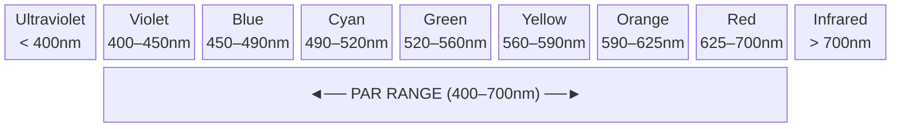
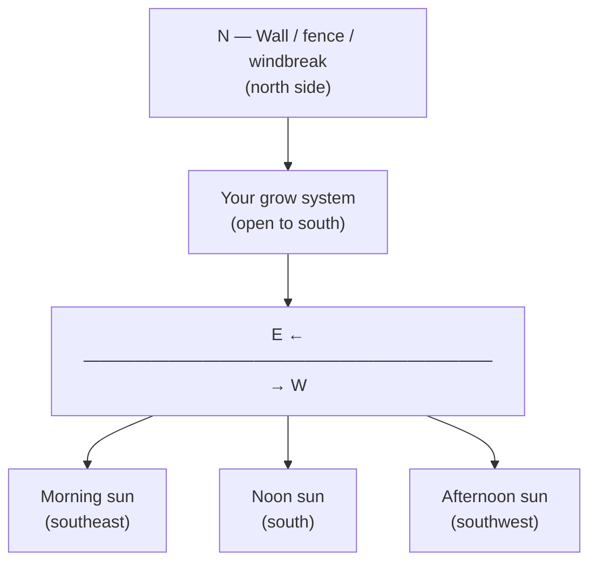
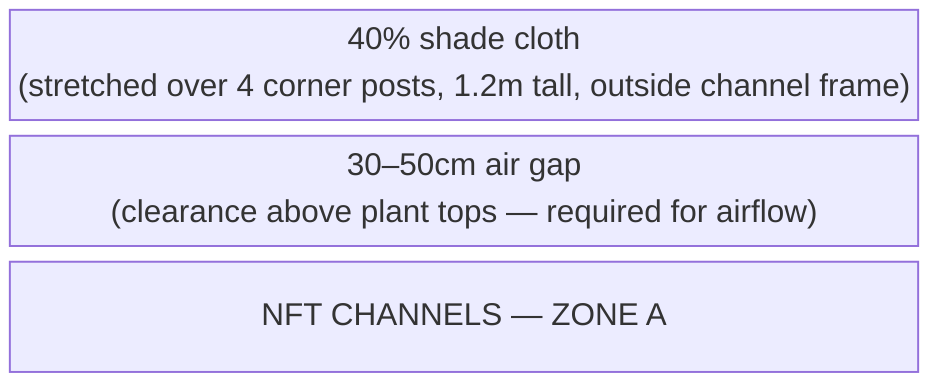

# Guide 04 — Lighting
## Outdoor Light, PAR, DLI, Shade Management, and Seasons

---

## 1. The Language of Plant Light

Before managing light for your plants, you need to understand the three key metrics used to describe it. These are not interchangeable — they measure very different things.

### PAR — Photosynthetically Active Radiation

PAR defines the **spectrum of light** that plants use for photosynthesis: wavelengths between **400nm (violet) and 700nm (red)**. This is not a measurement of intensity — it defines the type of light that matters.



| Wavelength range | Colour band | Notes |
|---|---|---|
| Below 400nm | Ultraviolet | Minor photosynthetic role; can stress plants |
| 400–700nm | **PAR range** | Photosynthetically active radiation |
| Above 700nm | Infrared | Mostly heat; minor photomorphogenetic effects |
| 440–470nm | Blue | Vegetative growth, compact internodes, stomatal opening |
| 640–680nm | Red | Flowering, fruiting, overall photosynthesis efficiency |
| 430nm + 680nm | — | Chlorophyll **a** absorption peaks |
| 453nm + 642nm | — | Chlorophyll **b** absorption peaks |

### PPFD — Photosynthetic Photon Flux Density

PPFD measures the **intensity of PAR light** hitting a surface at a given moment. It tells you how much photosynthetically useful light is arriving per second.

- **Units:** μmol/m²/s (micromoles of photons per square metre per second)
- **What it measures:** Instantaneous light intensity at a specific point

```
  PPFD REFERENCE VALUES:

  Outdoors, full sun (noon, summer): ~1,500–2,000 μmol/m²/s
  Outdoors, bright overcast:          ~200–600 μmol/m²/s
  Outdoors, shade/cloudy:             ~50–200 μmol/m²/s
  Indoors, window ledge:              ~100–500 μmol/m²/s (highly variable)

  Plant PPFD thresholds:
  Light compensation point (min useful): ~10–50 μmol/m²/s
  Light saturation point (max useful):
    Lettuce/herbs:   ~400–600 μmol/m²/s
    Tomatoes/peppers: ~800–1,200 μmol/m²/s
    Strawberries:     ~600–1,000 μmol/m²/s
```

> **Key insight:** On a clear summer day, outdoor PPFD at noon (1,500–2,000) **far exceeds the light saturation point** of most plants. The excess beyond what plants can use is converted to heat — this is why shade cloth helps in summer.

### DLI — Daily Light Integral

DLI is the **total quantity of PAR light delivered over an entire day**. It integrates PPFD over time — how many photons the plant receives across a full day. This is the most practically useful metric for crop planning.

- **Units:** mol/m²/day (moles of photons per square metre per day)
- **Why it matters:** You can have high PPFD but few hours of daylight (low DLI), or moderate PPFD across many hours (adequate DLI)

```
  DLI FORMULA:

  DLI = Average PPFD (μmol/m²/s) × Hours of light × 0.0036

  Example:
  Average outdoor PPFD: 400 μmol/m²/s (partly cloudy day)
  Hours of useful daylight: 10 hours

  DLI = 400 × 10 × 0.0036 = 14.4 mol/m²/day → adequate for lettuce
```

---

## 2. DLI Targets by Crop

These are the daily light requirements your plants need for optimal growth:

| Crop | Minimum DLI | Optimal DLI | Max Usable DLI |
|------|-------------|-------------|----------------|
| Lettuce (all types) | 8 mol/m²/day | 12–17 | 20 |
| Spinach | 8 | 12–16 | 20 |
| Basil | 12 | 15–20 | 25 |
| Cilantro/coriander | 8 | 12–16 | 18 |
| Mint | 8 | 12–16 | 20 |
| Parsley | 8 | 12–16 | 18 |
| Kale | 10 | 15–20 | 25 |
| Cherry tomatoes | 20 | 25–35 | 40 |
| Peppers | 20 | 25–35 | 40 |
| Strawberries | 15 | 20–30 | 35 |
| Radishes (bags) | 10 | 15–20 | 25 |
| Carrots (bags) | 10 | 15–20 | 25 |
| Microgreens | 10 | 12–20 | — |

### Seasonal DLI in a Temperate Climate

```
  APPROXIMATE DAILY LIGHT INTEGRAL BY MONTH (Temperate, 50–55°N latitude):

  Month       Avg hours daylight   Clear sky DLI   Typical overcast DLI
  ─────────────────────────────────────────────────────────────────────
  January          8.5h              12–15           4–6
  February         9.5h              15–18           5–8
  March           11.5h              20–25           8–12
  April           13.5h              28–35           12–18
  May             15.0h              35–45           15–22
  June            16.5h              40–50           18–25
  July            15.5h              38–48           16–24
  August          14.0h              32–42           14–20
  September       12.0h              22–28           10–15
  October         10.0h              14–18           6–10
  November         8.5h              8–12            3–6
  December         7.5h              6–10            2–5
  
  KEY CONCLUSIONS:
  - Lettuce and herbs: adequate light April–September
  - Tomatoes/peppers: adequate light May–August (peak season)
  - Strawberries: adequate light April–September
  - Winter growing outdoors: not viable without supplemental lighting
```

---

## 3. Minimum Sun Hours Per Crop

While DLI is more accurate, a simple sun hours estimate works for practical planning:

| Crop | Minimum Daily Sun Hours |
|------|------------------------|
| Lettuce, spinach | 4–6 hours direct sun (or more dappled light) |
| Herbs (basil, cilantro, parsley) | 6–8 hours |
| Mint | 4–6 hours (tolerates some shade) |
| Kale | 6–8 hours |
| Tomatoes | 8+ hours full sun — critical |
| Peppers | 8+ hours full sun — critical |
| Strawberries | 6–8 hours |
| Radishes/carrots | 6–8 hours |

> **Site selection rule:** Choose a location with **unobstructed southern sky** (Northern Hemisphere) for at least 8 hours. Avoid sites shaded by buildings, walls, or large trees during peak growing hours (10am–4pm).

---

## 4. Siting the System: Sun Mapping

### Southern Exposure (Northern Hemisphere)

The sun moves from east to west across the southern sky. Your system should face south, with no obstructions on the south, southeast, or southwest aspect during 10am–4pm.



### Obstruction Mapping

Walk your site at:
- **9am** (spring equinox): Note what is in shadow
- **12pm**: Note what is in shadow
- **3pm**: Note what is in shadow

If your site is in shadow at 12pm due to a building or tall fence, you either need to move the system or accept reduced yields.

**Height rule of thumb:** A wall or fence at a distance D from your system will cast a shadow with a length of approximately **D × (1/tan(sun altitude angle))**. At summer noon in the UK (~60°N), sun altitude is ~55°; shadow length = D × 0.7. At winter noon, it is ~10°; shadow length = D × 5.7 (this is why winter indoor growing requires much more space from walls).

---

## 5. Shade Cloth: Percentages, Timing, and Deployment

### Why Shade Cloth?

On a sunny July day, PPFD at noon can reach 1,800–2,000 μmol/m²/s. The light saturation point of lettuce is ~400–600 μmol/m²/s. The excess 1,200–1,400 μmol/m²/s is absorbed as heat — raising leaf temperature, accelerating transpiration (water loss), stressing plants, and triggering bolting (premature flowering) in leafy crops.

Shade cloth reduces PPFD to a level that maximises photosynthesis without heat stress.

### Shade Cloth Percentages

| Shade Level | PPFD Reduction | Recommended Use |
|-------------|---------------|-----------------|
| 30% | Reduces PPFD by ~30% | Light shade, spring/autumn, mild summers |
| 40% | Reduces PPFD by ~40% | Standard summer use — good all-around choice |
| 50% | Reduces PPFD by ~50% | Hot climates, afternoon shade for greens |
| 70% | Reduces PPFD by ~70% | Seedlings, sensitive plants — too dark for most crops |
| 90% | Reduces PPFD by ~90% | Mushrooms, propagation — not for growing food crops |

**Recommendation for this system:** **40% shade cloth** deployed over the entire Zone A during peak summer (June–August). Remove on overcast days or when average temperatures are below 22°C.

### Deployment Method



Install 4 posts at the corners of Zone A. Stretch 40% shade cloth over the top, securing with clips or wire. Clearance above plant tops: 30–50cm minimum for airflow. The cloth rolls up and stores when not needed. Use bamboo poles or conduit as shade frame supports.

### When to Deploy and Remove

```
  DEPLOY shade cloth when:
  - Daily high temperature exceeds 28°C consistently
  - Plants show heat stress signs (wilting at midday despite adequate water)
  - Lettuce/herbs are bolting (going to seed prematurely)
  - Leaf tip burn is increasing

  REMOVE shade cloth when:
  - Consecutive overcast days (DLI will drop below minimum without full sun)
  - September onwards — every bit of light matters as days shorten
  - Night temperatures drop below 15°C (plants need all the DLI they can get)
```

---

## 6. Heat Stress vs Light Stress: Distinguishing the Two

These can look similar but have different causes and solutions:

| Symptom | Heat Stress | Light Stress (excess) |
|---------|------------|----------------------|
| **Midday wilting** | Yes (despite wet roots) | Possible |
| **Leaf curl/cupping upward** | Yes | Yes |
| **Tip burn / brown edges** | Yes (Ca mobility issue + heat) | Less common |
| **Bolting (early seed stalk)** | Yes | Yes (long days trigger bolting) |
| **Recovery in evening** | Plants perk up when it cools | Plants perk up when light reduces |
| **Bleached/whitish patches on leaves** | Rare | Yes (sunscald) |
| **Root temperature** | Often high (warm reservoir) | Normal root temp |

**Test:** Check your reservoir water temperature. If it's above 24°C, heat is the primary stressor. Deploy shade AND insulate the reservoir.

---

## 7. Photoperiod Sensitivity

Many plants respond to the **length of the dark period** (night length) rather than day length — this is called **photoperiodism**.

### Crop Categories

| Category | What Triggers It | Crops |
|----------|-----------------|-------|
| **Short-day plants** | Flower when nights are LONG (late summer/autumn) | Strawberries, some basil varieties, Cannabis |
| **Long-day plants** | Flower when nights are SHORT (summer) | Spinach, lettuce, cilantro, dill |
| **Day-neutral plants** | Flower regardless of day length | Cherry tomatoes, most peppers, mint, kale |

### Implications for Your System

**Lettuce, spinach, cilantro (long-day plants):**
- In midsummer (June–July), the long days actively trigger bolting in these crops
- Shade cloth can help slightly, but ultimately these crops bolt in summer
- **Solution:** Plant in early spring and autumn — avoid trying to grow them through July
- Heat-tolerant/slow-bolt varieties exist — worth seeking out

**Strawberries:**
- **Everbearing/day-neutral varieties** (Albion, Seascape, Evie) — produce fruit regardless of day length — **best for NFT**
- **June-bearing varieties** — produce one crop in June/July triggered by short-day conditions of the previous autumn — not ideal for continuous production

**Tomatoes and peppers:** Day-neutral — flower and fruit based on plant maturity and temperature, not photoperiod. No photoperiod concerns.

---

## 8. Seasonal Light Strategy

### Spring (March–May) — Establishment Phase

```
  Light: Increasing, usually adequate from April
  Action:
  - Germinate seeds indoors in late February–March if nights are still cold
  - Transplant to NFT channels from mid-April
  - No shade cloth needed
  - Monitor for late frosts (protect with fleece overnight)
  - Best time to plant: lettuce, spinach, herbs, peas
```

### Summer (June–August) — Peak Production, Heat Management

```
  Light: Abundant — often excessive for sensitive crops
  Action:
  - Deploy 40% shade cloth from mid-June
  - Monitor for bolting in leafy greens — harvest promptly
  - Focus NFT channels on heat-tolerant crops: tomatoes, peppers, kale, mint
  - Succession-plant lettuce every 2–3 weeks (expect faster bolting in heat)
  - Keep reservoir shaded and insulated
  - Strawberries: peak fruiting — keep well watered, high EC for fruit quality
```

### Autumn (September–October) — Second Season

```
  Light: Declining but often excellent quality (lower sun angle, less heat)
  Action:
  - Remove shade cloth completely from September
  - Plant second crop of lettuce, spinach, herbs (autumn is ideal — no bolting)
  - Begin harvesting tomatoes/peppers before first frost
  - Watch night temperatures below 10°C — deploy frost fleece
  - Continue microgreens rotation through October with some cold tolerance
```

### Winter (November–February) — Shutdown / Planning

```
  Light: Insufficient for most crops outdoors
  Action:
  - Harvest final crops before hard frost
  - Winterise system (see guide/10)
  - Clean and store all components
  - Plan next season's crop rotation
  - Consider: a simple cold frame can extend lettuce production to November/December
```

---

## 9. Supplemental Lighting for Season Extension

If you want to extend your growing season beyond September outdoors, supplemental lighting is an option.

### When It Makes Sense

- You want to grow lettuce/herbs into November/December
- DLI has dropped below minimum for your target crop
- You have access to a sheltered spot (porch, lean-to, polytunnel)

### Options

| Option | Power | Coverage | Cost | Best For |
|--------|-------|----------|------|---------|
| LED grow strips | 10–30W | Small shelves | $20–$60 | Microgreens, small herb shelf |
| T5 fluorescent | 24–54W | 1–2 channels | $30–$80 | Lettuce channels under cover |
| LED quantum board | 100–200W | Multiple channels | $80–$200 | Serious season extension |
| CMH (ceramic metal halide) | 315W+ | Large area | $150–$300 | Semi-commercial extension |

### Target PPFD for Supplemental Lighting

- Lettuce/herbs: 200–400 μmol/m²/s at canopy level
- 16–18 hours of light per day total (natural + supplemental combined)

> **Budget consideration:** For a $100–$500 budget system, supplemental lighting is an optional upgrade. Focus on getting the outdoor system working perfectly first.

---

## 10. Microgreens Lighting (Zone B)

Microgreens have different light needs from mature crops:

```
  MICROGREENS LIGHT PHASES:

  Phase 1 — Blackout (days 1–4):
  Cover trays completely — no light.
  Darkness + humidity drives germination and initial stem elongation.
  Etiolated seedlings (long, pale) are normal at this stage.

  Phase 2 — Green-up (days 4–7):
  Uncover and place in bright light.
  Chlorophyll develops, cotyledons expand and green up.
  Outdoor: Place in partial shade first, then full light.
  Target DLI: 10–15 mol/m²/day
  
  Phase 3 — Growth to harvest (days 7–14):
  Full outdoor light (40% shade in summer to prevent heat stress on tender seedlings)
  Harvest when first true leaves appear.
```

---

*Next: [`guide/05-growing-media.md`](05-growing-media.md) — Net pots, clay pebbles, rockwool, coco, and germination*
