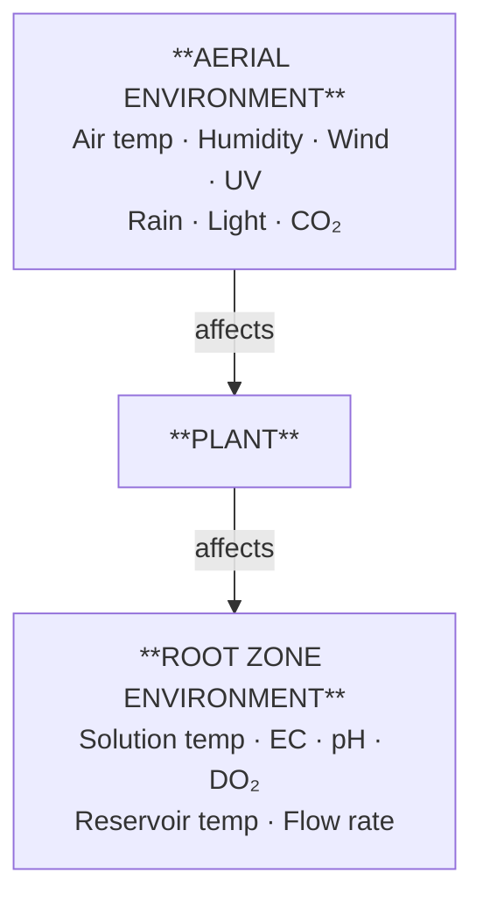
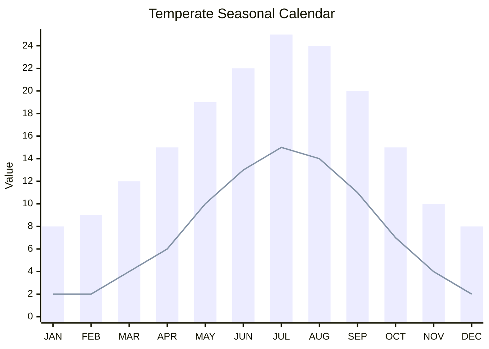
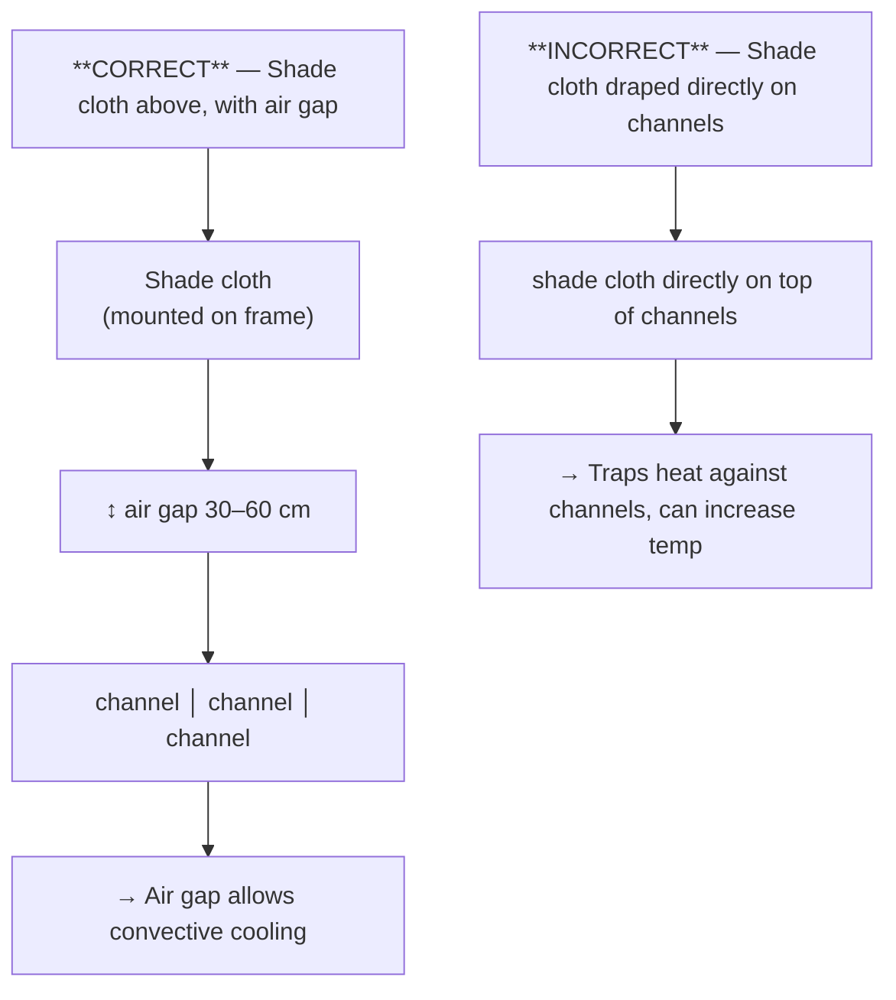
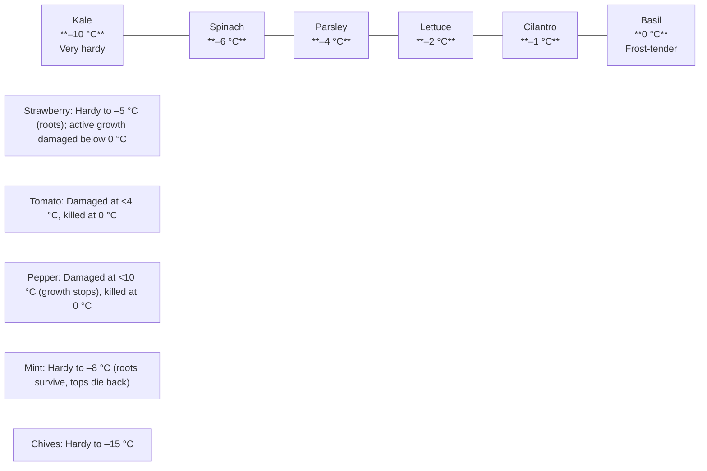
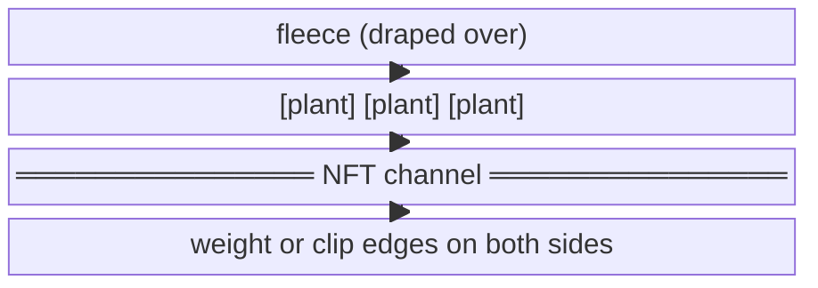
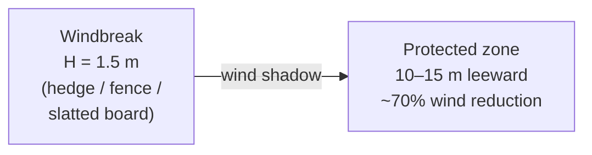
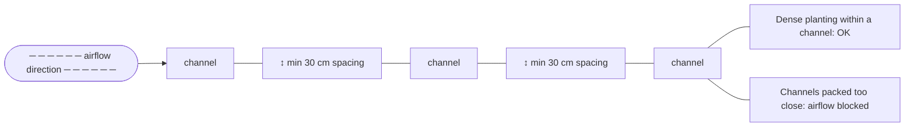

# Guide 10 — Climate Management for Outdoor Hydroponics

Managing climate is the single greatest challenge of outdoor hydroponic growing. Unlike a greenhouse or grow tent, an outdoor NFT system is fully exposed to ambient temperature swings, direct sun radiation on the reservoir, wind-driven evaporation, rain dilution, frost risk, and seasonal photoperiod changes. This guide covers every environmental factor in depth — how each affects your plants and nutrient solution, and exactly what to do about it.

---

## Table of Contents

1. [The Outdoor Climate Challenge](#1-the-outdoor-climate-challenge)
2. [Temperate Seasonal Calendar](#2-temperate-seasonal-calendar)
3. [Temperature Effects on the Hydroponic System](#3-temperature-effects-on-the-hydroponic-system)
4. [Summer Heat Management](#4-summer-heat-management)
5. [Cold and Frost Management](#5-cold-and-frost-management)
6. [Wind Management](#6-wind-management)
7. [Rain Management](#7-rain-management)
8. [Humidity and Airflow](#8-humidity-and-airflow)
9. [Season Extension Techniques](#9-season-extension-techniques)
10. [Putting It Together — Seasonal Action Plans](#10-putting-it-together--seasonal-action-plans)
11. [Climate Monitoring Setup](#11-climate-monitoring-setup)
12. [Quick-Reference Decision Tree](#12-quick-reference-decision-tree)

---

## 1. The Outdoor Climate Challenge

A hydroponic plant lives at the intersection of two environments:



Both environments must stay within acceptable ranges simultaneously. When one goes out of range, the plant compensates by drawing on its reserves — and if both go out of range at the same time (e.g., a heatwave + high EC), the plant crashes quickly.

### Key variables to monitor outdoors

| Variable | Acceptable Range (most crops) | Critical Threshold |
|---|---|---|
| Air temperature | 15–30 °C | <5 °C or >35 °C |
| Solution temperature | 18–22 °C | <10 °C or >26 °C |
| Relative humidity (RH) | 50–75% | <30% or >85% |
| Wind speed | 0–15 km/h | >25 km/h sustained |
| Reservoir dilution (rain EC drop) | <10% per event | >20% drop = re-dose |
| Daily light integral (DLI) | 12–25 mol/m²/day | <8 (low light stress) |

---

## 2. Temperate Seasonal Calendar

The following calendar applies to a **temperate maritime/continental climate** (e.g., UK, Northern Europe, Pacific NW USA, southern Australia highlands) with:
- Last frost: mid-March to mid-April
- First autumn frost: mid-October to early November
- Coldest months: December–February
- Hottest months: June–August
- Annual rainfall: 600–900 mm, distributed throughout year

Adjust frost dates ±4 weeks for your specific latitude and elevation.



> **Frost risk:** January–February = likely; March, November = possible; December = likely. Frost-free: April–October.
> **DLI estimate (mol/m²/day):** Jan 4 · Feb 7 · Mar 11 · Apr 16 · May 20 · Jun 22 · Jul 21 · Aug 18 · Sep 13 · Oct 9 · Nov 5 · Dec 3

### Grow window by zone

| Zone | Crop type | Outdoor grow window | Notes |
|---|---|---|---|
| NFT — leafy greens | Lettuce, spinach, kale | Mar–Nov (with protection) | Bolt risk Jun–Aug |
| NFT — herbs | Basil, cilantro | May–Sep | Frost-tender |
| NFT — fruiting | Tomatoes, peppers | May–Sep | Need 15°C+ nights |
| NFT — strawberries | Strawberries | Apr–Oct | Hardy, can overwinter |
| Microgreens | Any | Year-round (covered station) | Cold slows germination |
| Root veg bags | Radishes, carrots | Mar–Oct | Radishes fastest |

### Season phases

```
PHASE 1 — STARTUP (Mar–Apr)
  • Last frost risk present
  • Start with frost-tolerant crops: lettuce, kale, spinach, chives
  • Basil and tomatoes remain indoors until May
  • Use fleece or cold frame overnight
  • Target EC lower (0.8–1.2) — plants growing slowly in cool temps

PHASE 2 — FULL SEASON (May–Sep)
  • All crops viable outdoors
  • Peak productivity window
  • Heat management becomes priority from Jun
  • Monitor reservoir temperature daily in Jul–Aug

PHASE 3 — WIND-DOWN (Oct–Nov)
  • Frost risk returns — fleece nightly
  • Remove frost-tender crops (basil, tomatoes)
  • Keep frost-hardy crops going: kale, chives, parsley, spinach
  • Reduce EC as growth slows

PHASE 4 — WINTER REST (Dec–Feb)
  • NFT system drained and stored or kept in frost-free shed
  • Microgreens can continue indoors
  • Clean and maintain equipment
  • Plan next season
```

---

## 3. Temperature Effects on the Hydroponic System

Temperature affects every biological and chemical process in the system. Understanding the mechanisms helps you act correctly rather than guess.

### 3.1 Air Temperature vs. Root Zone Temperature

Air temperature and root zone (solution) temperature are NOT the same, and they affect the plant differently.

| Factor | Affected by Air Temp | Affected by Solution Temp |
|---|---|---|
| Stomatal opening/closing | ✅ | ❌ |
| Transpiration rate | ✅ | Partially |
| Photosynthesis rate | ✅ | Partially |
| Nutrient uptake rate | Partially | ✅ |
| Root respiration / O₂ demand | ❌ | ✅ |
| Dissolved oxygen in solution | ❌ | ✅ (inverse relationship) |
| Pathogen (Pythium) risk | ❌ | ✅ (>24°C = high risk) |
| pH stability | Partially | ✅ |

### 3.2 Dissolved Oxygen (DO₂) and Temperature

This is the most critical relationship in warm weather. Dissolved oxygen decreases as water temperature rises:

```
Temperature (°C)   DO₂ Saturation (mg/L)   Root health impact
─────────────────────────────────────────────────────────────
     10                  11.3              Excellent
     15                   9.9              Very good
     18                   9.1              Good (target)
     20                   8.8              Acceptable
     22                   8.5              Acceptable
     24                   8.2              Caution — Pythium risk rises
     26                   7.9              Stress — O₂ deficit possible
     28                   7.6              High stress — intervene
     30                   7.4              Critical — root death risk
     35                   6.9              System failure likely
─────────────────────────────────────────────────────────────
```

Plants need a minimum of ~5–6 mg/L DO₂ at the root surface. In warm water, you lose your safety margin quickly, and any blockage to the film (root matting, algae, poor slope) accelerates hypoxia.

**NFT advantage:** The falling-film design means water is constantly re-oxygenated at the channel surface and at the return-to-reservoir splash. This is why NFT tolerates warm weather better than DWC (deep water culture) — but it still has limits.

### 3.3 Nutrient Uptake and Temperature

Plant roots have optimal uptake at 18–22 °C:

```
Solution Temp    Uptake Efficiency    Notes
────────────────────────────────────────────────────────
< 10 °C          Very low             Roots cold-shocked, dormant
10–15 °C         Below optimal        Slow growth, possible deficiency signs
15–18 °C         Good                 Acceptable
18–22 °C         Optimal              ← Target range
22–25 °C         Declining            Begin heat mitigation
> 25 °C          Poor                 High pathogen risk, high EC sensitivity
> 30 °C          Very poor            Root death likely within days
────────────────────────────────────────────────────────
```

### 3.4 pH Drift and Temperature

Warmer solution accelerates biological activity (algae, bacteria) and degasses CO₂ faster, both of which shift pH. Expect:
- Every +5 °C → pH drift rate approximately doubles
- Algae blooms in warm, light-exposed reservoirs cause sharp pH rises (to 8+) during daylight
- Solution above 28 °C can shift 0.5 pH units per day

---

## 4. Summer Heat Management

### 4.1 Priority Stack

When heat stress occurs, intervene in this order (quickest/cheapest first):

```
HEAT INTERVENTION PRIORITY
──────────────────────────────────────────────────────────
Level 1 — Passive/free
  □ Add shade cloth (30–50%) over system
  □ Insulate reservoir with reflective foam board
  □ Increase aeration (add second air stone)
  □ Water plants overhead (foliar misting) in morning

Level 2 — Low cost ($10–$40)
  □ Freeze water bottles and float in reservoir
  □ Bury/shade supply line to reduce inline heating
  □ Top-dress reservoir with white paint or white lid

Level 3 — Moderate investment ($40–$150)
  □ Install dedicated reservoir shade box
  □ Run pump at night only (if daytime temp only concern)
  □ Insulate channels with foam pipe wrap

Level 4 — High investment ($150–$500+)
  □ Inline aquarium chiller (150–500W, cost ~$100–$300)
  □ Add misting system to channel structure
──────────────────────────────────────────────────────────
```

### 4.2 Shade Cloth

Shade cloth reduces both air and surface temperature around the system. Choose shade level based on crop:

| Shade % | Light transmitted | Best for | Temperature reduction |
|---|---|---|---|
| 20–30% | 70–80% | Fruiting crops (tomatoes, peppers) | ~2–4 °C |
| 40–50% | 50–60% | Leafy greens, herbs | ~4–6 °C |
| 60–70% | 30–40% | Very shade-tolerant crops only | ~6–8 °C |

**Positioning matters:**


Mount shade cloth on a simple PVC or timber frame at least 30–60 cm above the top of the channels, allowing air circulation beneath.

### 4.3 Reservoir Insulation and Covering

The reservoir is the biggest heat sink in the system. Direct sun on a black or dark reservoir can raise solution temperature by 10+ °C above ambient.

**Insulation methods (cheapest to best):**

1. **Reflective foam board** (e.g., Kingspan/Celotex offcuts) — wrap all reservoir walls and lid. Reduces solar gain by ~70%. Cost: ~$5–$15 from offcuts.

2. **Reservoir shade box** — build a simple timber frame box around the reservoir with a hinged lid. Paint white. Leave ~5 cm air gap on all sides. Reduces solar gain by ~90%.

3. **Buried reservoir** — sink the reservoir into the ground. Ground temperature stays ~12–15 °C year-round. Virtually eliminates solar heating. Best long-term solution.

4. **Aquarium chiller** — inline chiller on the return line from the channels to the reservoir. Maintains solution at 18–20 °C regardless of ambient. Expensive but reliable.

**Lid seal:** Always cover the reservoir completely to prevent:
- Evaporation loss (can lose 5–15 L/day in summer)
- Algae growth (light exclusion)
- Mosquito breeding
- Rain dilution (see Section 7)

### 4.4 Ice Bottle Method

For short heatwave events (1–3 days), fill 1.5 L plastic bottles with water, freeze overnight, and float in the reservoir. This is free and effective for moderate temperature reduction.

Typical impact: lowers reservoir temperature by 2–5 °C for 4–6 hours per bottle.

Calculation example:
- 80 L reservoir at 26 °C
- Target: 22 °C → need to remove ~4 °C × 80 L × 4.18 kJ/kg°C ≈ 1,338 kJ
- One frozen 1.5 L bottle stores ~500 kJ of cold
- You need ~3 bottles to drop 4 °C in an 80 L reservoir (plus ongoing ambient gain)

Use 3–6 bottles, replaced morning and evening during heatwaves.

### 4.5 Adjusting Nutrient Solution in Heat

In high temperatures, plants transpire more heavily, uptake water faster than nutrients, causing EC to rise (nutrient concentration). Simultaneously, oxygen depletion increases pH sensitivity.

**Heat management nutrient adjustments:**
- Reduce EC to the lower bound of the target range (e.g., lettuce: run at 1.0–1.2 instead of 1.2–1.8)
- Check pH twice daily (morning and afternoon) during heatwaves
- Top up reservoir with plain pH-adjusted water more frequently
- Do not add full nutrient dose when topping up — add half-strength until EC recovers

### 4.6 Crop Heat Thresholds

| Crop | Optimal air temp | Max tolerable | Signs of heat stress |
|---|---|---|---|
| Lettuce | 15–22 °C | 28 °C | Tip burn, bolting |
| Spinach | 10–20 °C | 26 °C | Rapid bolting |
| Kale | 15–22 °C | 30 °C | Wilting, yellowing |
| Basil | 20–30 °C | 35 °C | Wilting recovers at night |
| Tomatoes | 20–28 °C | 35 °C | Blossom drop at >32 °C |
| Peppers | 22–28 °C | 35 °C | Blossom drop, sunscald |
| Strawberries | 18–25 °C | 30 °C | Fruit softening, mould |
| Mint | 18–28 °C | 32 °C | Wilting |
| Radishes | 10–18 °C | 24 °C | Woody, pungent roots |

**Tip burn in lettuce** is caused by calcium deficiency at the leaf margins — but the root cause is usually heat-driven transpiration outpacing calcium uptake through the xylem. Solution: increase flow rate, lower EC, add shade, ensure good root aeration.

---

## 5. Cold and Frost Management

### 5.1 How Cold Damages Hydroponic Plants

Cold affects plants in two ways:

**Chilling injury (0–10 °C):** Cell metabolism slows, nutrient uptake nearly stops, roots become susceptible to rot, and chilling-sensitive crops (basil, tomatoes) develop cellular damage even without actual freezing.

**Frost injury (<0 °C):** Ice crystals form inside cells, rupturing cell walls. This is fatal within hours for most crops. Root zone freezing is equally damaging — ice in channels ruptures roots and can crack PVC fittings.

### 5.2 Frost Hardiness by Crop



> Light frost threshold ≈ –1 °C

### 5.3 Protecting the System from Cold

#### Horticultural Fleece (Frost Cloth)

The most cost-effective protection. A single layer of 17 g/m² fleece raises the temperature by approximately 2–4 °C underneath. A double layer provides 4–6 °C protection.

**How to use:**
1. Drape fleece over channels in the evening before a forecast frost
2. Weight or clip the edges so it doesn't blow away
3. Remove in the morning once temperature rises above 5 °C (leave it on in daytime and plants overheat)
4. Never leave fleece on in full sun — it acts as a solar trap and can scorch plants



#### Protecting the Reservoir in Cold

- Solution temperature below 10 °C severely limits plant growth
- Solution temperature below 4 °C risks Pythium explosion and root death
- At 0 °C, solution can begin to freeze, potentially cracking uninsulated reservoirs

**Cold protection for the reservoir:**
- Insulate reservoir with 50 mm foam board on all sides
- Cover the reservoir lid with a fleece or blanket overnight
- Submersible aquarium heater (25–100W depending on reservoir size) — set to 15 °C minimum
  - 80 L reservoir, ambient 2 °C → a 50W heater is typically sufficient
  - Cost: ~$15–$30 for an aquarium heater
- Never let the reservoir freeze — if system is not in active use, drain it fully

#### Channel and Pipe Protection

Thin PVC channels and supply hoses are vulnerable to frost cracking. In temperatures below -5 °C:
- Drain channels fully if not growing (or harvest remaining crops first)
- Lag water supply hoses with foam pipe insulation
- Lag or insulate the pump supply line from reservoir to channels

### 5.4 Minimum Operational Temperatures

| System component | Do NOT operate below | Action if below threshold |
|---|---|---|
| Pump (submersible) | -5 °C (solution) | Add aquarium heater to reservoir |
| PVC channels | -10 °C (empty) | Drain if storing empty |
| Supply hoses | -5 °C | Insulate or bring inside |
| Timer/controllers | Manufacturer spec (usually 0 °C) | Move to weatherproof box |
| Reservoir (HDPE) | -20 °C (empty) | Generally very frost-hardy when empty |

### 5.5 Extended Cold Spells

For a cold spell lasting more than 3 days below 5 °C:

```
COLD SPELL PROTOCOL

Day 1: Deploy fleece over all channels nightly, add aquarium heater
       to reservoir, harvest any near-mature crops

Day 3+: Assess whether to continue or harvest-and-pause
        → If plants are actively stressed (yellowing, no new growth)
          → Harvest what you can, reduce EC to 0.6, run pump 1h/day only
        → If plants are coping (some growth, healthy colour)
          → Continue with nightly fleece, check reservoir temp daily

Extended (>7 days below 5°C): Consider moving containers inside
  to a garage, shed, or under a cold frame until conditions improve
```

---

## 6. Wind Management

### 6.1 How Wind Affects the System

Wind is often underestimated as a stressor. Its effects are multiple and cumulative:

**Direct plant effects:**
- Mechanical damage (stem snapping, leaf tearing) at >30 km/h
- Increased transpiration — plants lose water faster than they can uptake it, causing wilting even in adequate moisture
- "Wind rock" — plants in net pots are only supported by the rim and roots; strong gusts can unseat them

**Reservoir and solution effects:**
- Evaporation rate doubles or triples in strong wind, concentrating the nutrient solution (EC rises)
- Evaporative cooling of the reservoir (useful in summer, problematic in cold weather)

**Structural effects:**
- Channels can be displaced or have fittings stressed
- Lightweight A-frame structures can tip in severe gusts

### 6.2 Wind Speed Reference

```
WIND SPEED SCALE (Beaufort)

Force  Speed (km/h)  Description     Hydroponic impact
─────────────────────────────────────────────────────────
  1–2    1–12        Light breeze    Beneficial — good airflow
  3–4   13–28        Gentle/moderate Slightly increased transpiration
  5      29–38        Fresh breeze    Increased EC, secure fleece/covers
  6      39–49        Strong breeze  Possible mechanical damage, windbreak needed
  7–8   50–74        Near gale/gale  Do not operate unprotected system
  9+    >75           Severe gale+    Secure or dismantle
─────────────────────────────────────────────────────────
```

### 6.3 Wind Management Strategies

#### Windbreaks

A physical windbreak reduces wind speed dramatically on the leeward side. The protected zone extends approximately 10× the height of the windbreak downwind.



**Options:**
- **Existing fence/wall:** Best option if available — site system on the leeward side
- **Slatted wood fence panel:** 50% permeability is better than solid — solid walls create turbulence
- **Willow hurdles or bamboo screening:** Natural, permeable, ~60% wind reduction
- **Established hedging** (privet, laurel): Best long-term but 2–3 years to establish
- **Temporary windbreak netting:** Green mesh netting on stakes, ~40% reduction, $10–$20

#### Securing the Structure

- Anchor the main frame to the ground with stakes or ground anchors
- Use zip ties or clips to secure supply hoses and drain lines (they act as sails in wind)
- Weight the reservoir or secure it with strapping to the frame
- Use a covered reservoir lid that clips or fastens (not just resting on top)

#### Managing Wind-Driven EC Rise

In sustained windy conditions (Force 4–5), monitor EC more frequently:
- Check EC morning and evening
- Top up with plain pH-adjusted water if EC rises >10% above target
- If away for a weekend in windy weather, lower starting EC by 10–15% as a buffer

---

## 7. Rain Management

### 7.1 Rain and Reservoir Dilution

Rain falling into an open reservoir dilutes the nutrient solution, dropping EC. If you lose 10 L of nutrient solution at EC 2.0 and replace it with 10 L of rainwater at EC 0.0 in an 80 L reservoir:

```
New EC = (70L × 2.0 + 10L × 0.0) / 80L = 1.75
```

A 12% drop in EC is generally acceptable. But in a sustained downpour where 20–30 L enters the reservoir, EC can drop to inadequate levels. Additionally:

- Rain pH is typically 5.5–6.5, which may shift reservoir pH
- If using a captured rainwater source, large rain events can flush roof debris, bird droppings, etc. into a poorly maintained collection barrel

### 7.2 Rain Management Strategy

**Primary defence — cover your reservoir completely:**

```mermaid
flowchart TD
    subgraph A["Option A — Rigid lid with pipe cutouts"]
        A1["LID (wood / polycarbonate)\nwith cutouts for inlet and outlet pipes"]
        A2["Reservoir"]
        A3["Foam seal around pipe holes prevents ingress"]
        A1 --> A2 --> A3
    end

    subgraph B["Option B — Polycarbonate sheet on frame above reservoir"]
        B1["Polycarbonate roof (on timber frame)"]
        B2["↕ 10 cm air gap"]
        B3["Reservoir"]
        B4["Rain deflected sideways; air can circulate"]
        B1 --> B2 --> B3 --> B4
    end

    subgraph C["Option C — Reservoir inside garden box / planter"]
        C1["Completely enclosed structure"]
        C2["Only pipe entry points remain"]
        C1 --> C2
    end
```



**Secondary defence — overflow/drainage:**

If rain does enter, have an overflow hole or drain hole 2–3 cm below the max fill line so excess water exits to the ground rather than flooding the system.

### 7.3 After a Rain Event

Run through this quick checklist after any significant rain event (>10 mm):

```
POST-RAIN CHECKLIST
□ Check reservoir EC — if dropped >15%, add nutrient solution
□ Check reservoir pH — may have shifted; adjust if outside 5.5–6.5
□ Check channels for pooling or debris washed in
□ Check supply and drain hoses for displacement
□ Check timer/electrics for water ingress
□ Check plant foliage for disease signs (wet foliage + warm = Botrytis risk)
□ If strawberry fruiting — inspect for grey mould (Botrytis cinerea)
```

### 7.4 Benefiting from Rain

Rainwater is often excellent quality for hydroponics:
- EC typically 0.01–0.10 (very soft, good starting water)
- Free of chlorine and chloramines
- Naturally slightly acidic (pH 5.5–6.5)

Harvest roof runoff into a covered water butt and use it to top up the reservoir or prepare fresh nutrient batches. A 1 m² of roof area collects approximately 1 L per mm of rainfall.

**Caution:** Avoid collecting runoff from:
- Treated timber roofs (preservative leach)
- Asbestos cement roofs
- Roofs with moss killer treatments applied in the last 3 months

---

## 8. Humidity and Airflow

### 8.1 Why Humidity Matters

Humidity directly affects:

**Transpiration rate:** Low humidity (dry air) causes plants to transpire rapidly, pulling nutrients up via the xylem. This is good for nutrient delivery but increases demand on the root zone. Very low humidity (<30% RH) causes wilting even when roots have adequate water.

**Disease pressure:** High humidity (>80% RH) creates conditions for fungal diseases — powdery mildew, Botrytis (grey mould), and damping off. Outdoor systems in autumn are especially at risk when day/night temperature swings cause condensation.

**Fruit quality:** High humidity during fruit ripening (strawberries, tomatoes) significantly increases Botrytis and cracking risk.

### 8.2 Humidity by Crop

| Crop | Optimal RH | Risk if too high | Risk if too low |
|---|---|---|---|
| Lettuce / leafy greens | 60–75% | Tip burn, Botrytis | Wilting, tip burn |
| Basil | 50–70% | Powdery mildew | Wilting, leaf drop |
| Tomatoes (flowering) | 40–70% | Blossom drop, Botrytis | Poor fruit set |
| Tomatoes (fruiting) | 50–70% | Botrytis, cracking | Leathery skin |
| Strawberries | 50–70% | Grey mould on fruit | Fruit dehydration |
| Microgreens | 60–80% | Damping off | Tip drying |

### 8.3 Improving Airflow Around the System

Natural airflow (gentle breeze) is beneficial — it:
- Reduces boundary layer humidity around leaves
- Strengthens stems (thigmomorphogenesis)
- Helps prevent fungal disease
- Improves CO₂ availability to leaf surfaces

**Design for airflow:**


**Orientation:**
- Orient channels so they run perpendicular to the prevailing wind, or at 45° to it — this maximises airflow passing between channels
- Avoid placing channels in stagnant corners or against south-facing walls that trap heat and reduce air movement

### 8.4 Managing High Humidity Events

During periods of persistent high humidity (>80% RH), especially in late summer and autumn:

1. **Increase plant spacing** where possible — thin out crowded channels
2. **Remove any yellowing or damaged leaves immediately** — they are Botrytis infection points
3. **Avoid overhead watering** (use base feeding only)
4. **Harvest regularly** — don't let leaves accumulate and decay on the plant
5. **Apply bicarbonate spray** for powdery mildew prevention: 5 g sodium bicarbonate per litre, spray on leaves in morning. See Guide 07 for full disease management.

---

## 9. Season Extension Techniques

### 9.1 Cold Frames

A cold frame is a low-profile, transparent-lidded box placed over plants. It is the simplest, cheapest season extension tool.

```
COLD FRAME (cross-section)
  ┌─────────────────────────────────┐
  │  polycarbonate or glass lid     │ ← opens on hinges
  ├─────────────────────────────────┤
  │                                 │
  │   [plant] [plant] [plant]       │ ← NFT channel inside
  │                                 │
  └─────────────────────────────────┘
  Timber or polycarbonate sides, 30–60cm high
```

**Performance:**
- Adds approximately 4–8 °C overnight versus ambient
- Extends season by 4–6 weeks in spring and autumn
- Cost: ~$30–$80 for a timber DIY cold frame, or use 4 straw bales + old window glass

**Important:** Vent cold frames on sunny days — temperatures inside can reach 40 °C+ even in early spring.

### 9.2 Polytunnels

A polytunnel (hoop tunnel) provides significant season extension and weather protection for the entire system.

```
MINI HOOP TUNNEL (cross-section)
      ╭─────────polythene film──────────╮
     ╱                                   ╲
    │    [ch]      [ch]      [ch]         │
    │                                     │
  ██████████████████████████████████████████
  Ground

  Hoops: 25mm poly pipe or metal conduit, 2m long
  Film: 200 micron UV-stabilised polytunnel film
```

**Performance:**
- Adds 5–12 °C versus ambient overnight
- Extends season by 6–10 weeks each end
- Provides rain protection (keeps foliage dry)
- Cost: ~$40–$120 for a DIY hoop tunnel over a 3 m × 1.5 m bed

**Construction:**
1. Drive 60 cm ground stakes at 1 m intervals along both sides of the bed
2. Push poly pipe hoops over stakes on each side to form arches
3. Drape and secure polytunnel film, leave ends open for ventilation during day
4. Roll up or clip ends closed at night

### 9.3 Fleece Tunnels

Lighter than polythene, fleece tunnels allow air and moisture exchange while providing ~4 °C of frost protection. Best for spring startup and autumn wind-down. Can be left on during day if temperatures stay below 20 °C.

### 9.4 Moving Crops Indoors for Winter

For year-round production of some crops, consider a simple indoor setup during the off-season:

- Small 4-pot DWC bucket or kratky jar
- Full-spectrum LED grow light (50–100W panel)
- Herbs: basil, mint, chives, parsley — can produce indoors year-round
- Microgreens: already recommended as indoor station in Zone B

A 50W LED panel running 16 h/day ≈ 0.05 kW × 16 h = 0.8 kWh/day ≈ $0.15–$0.20/day electricity.

---

## 10. Putting It Together — Seasonal Action Plans

### Spring Startup (March–April)

```
WEEK 1–2 (early March, frost still possible):
□ Inspect and clean system after winter storage
□ Check all fittings, hoses, and pump
□ Set up reservoir; fill with water; run pump to check function
□ Mix first nutrient batch at low EC (0.8) and pH 6.0
□ Seed: kale, spinach, lettuce, chives in propagation trays indoors
□ Begin microgreens on Zone B station

WEEK 3–4 (late March):
□ Transplant kale, spinach, lettuce once seedlings have 2 true leaves
□ Begin frost protection plan: fleece ready to deploy nightly
□ Check weather forecast daily — deploy fleece when frost expected
□ Seed: basil, cilantro INDOORS (do not transplant until May)

MONTH 2 (April):
□ Increase EC to 1.0–1.2 as plant growth accelerates
□ Seed tomatoes and peppers indoors under lights
□ Plant strawberry crowns if new season starts
□ Continue overnight fleece for frost-tender transplants
```

### Full Season (May–September)

```
MAY:
□ Last frost should be past — transplant tomatoes, peppers, basil outdoors
□ Set up shade cloth frame (install but don't deploy until needed)
□ Check reservoir temperature — should be 16–20°C
□ Increase EC for fruiting crops in their channel (1.8–2.4)

JUNE–JULY:
□ Daily reservoir temperature check (aim <22°C)
□ Begin shade cloth deployment over leafy greens
□ Monitor pH twice daily during heat
□ Float ice bottles in reservoir during heatwaves
□ Pollinate tomatoes/peppers by hand (tap flower clusters in morning)

AUGUST:
□ Peak harvest period
□ Watch for tip burn on lettuce (heat + calcium)
□ Sow second-succession lettuce/spinach for autumn harvest
□ Check strawberry fruit daily — harvest to prevent Botrytis

SEPTEMBER:
□ Remove shade cloth as temperatures moderate
□ Harvest and remove frost-tender crops before first forecast frost
□ Consider succession sowing of cold-tolerant crops for autumn
```

### Autumn Wind-Down (October–November)

```
OCTOBER:
□ Deploy fleece nightly as temperatures approach 5°C at night
□ Begin removing basil, cucumber, last tomatoes
□ Reduce EC to 1.0–1.2 for cool-season crops
□ Check for Botrytis in high-humidity periods

NOVEMBER:
□ First hard frost likely — harvest remaining crops
□ Drain and clean reservoir
□ Flush channels with plain water, then dilute H₂O₂ rinse (1 mL/L)
□ Store pump in frost-free place if not winterising in place
□ Begin winter maintenance (see Guide 08)
```

### Winter (December–February)

```
□ System stored or frost-protected
□ Continue microgreens indoors (Zone B)
□ Maintain small indoor herb DWC or kratky if desired
□ Order/source next season's seeds and nutrients
□ Plan crop rotation and channel assignments
□ Maintain, repair, or upgrade equipment
```

---

## 11. Climate Monitoring Setup

### 11.1 Minimum Monitoring Kit

For a functional outdoor system, you need at minimum:

| Instrument | What it measures | Minimum spec | Cost |
|---|---|---|---|
| Min/max thermometer | Air temperature range overnight | Digital, outdoor-rated | $5–$15 |
| EC/pH meter | Solution quality | Combo pen (e.g., Apera PC60) | $50–$120 |
| Aquarium thermometer | Reservoir/solution temp | Waterproof digital | $5–$15 |
| Soil/humidity probe | Ambient RH and temp | Basic digital hygrometer | $8–$15 |

Total minimum: ~$70–$165

### 11.2 Optional / Upgrade Monitoring

| Instrument | Benefit | Cost |
|---|---|---|
| WiFi temperature/humidity logger (e.g., Govee) | Remote alerts on phone | $15–$30 |
| Dissolved oxygen meter | Directly measures root zone O₂ | $100–$300 |
| Weather station with data logger | Wind speed, rainfall, solar radiation | $40–$200 |
| Inline EC/pH monitor with alarm | Continuous monitoring, sends alerts | $150–$400 |

### 11.3 Logbook Integration

Record in your daily logbook (template in Guide 08):

```
DATE: ___________
Time of check: _______ AM / PM

Air temp (current): ___°C    Min/max overnight: ___/___°C
Solution temp: ___°C
Reservoir EC: ___          Reservoir pH: ___
RH: ___%

Weather observations:
  □ Clear    □ Cloudy    □ Rain (mm: ___)    □ Wind (strength: ___)
  □ Frost overnight    □ Heatwave (>30°C)

Actions taken today:
  □ Topped up reservoir (__L plain water)
  □ Adjusted pH (added ___ mL of ___)
  □ Deployed fleece
  □ Deployed shade cloth
  □ Added ice bottles
  □ Other: ________________________________
```

---

## 12. Quick-Reference Decision Tree

```
┌──────────────────────────────────────────────────────────────────┐
│              DAILY OUTDOOR CLIMATE CHECK                          │
└──────────────────────────┬───────────────────────────────────────┘
                           ▼
         Is solution temperature above 24°C?
              │                    │
             YES                   NO
              │                    │
              ▼                    ▼
    Implement heat protocol    Is solution temp below 15°C?
    (shade, ice, lower EC,          │              │
     increase aeration)            YES              NO
                                    │               │
                                    ▼               ▼
                             Implement cold       CHECK WIND
                             protocol             Is wind > Force 4
                             (fleece, heater,     (28+ km/h)?
                              harvest tender)          │        │
                                                      YES       NO
                                                       │         │
                                                       ▼         ▼
                                                Check EC for   CHECK RAIN
                                                wind-driven    Has it rained
                                                concentration  significantly?
                                                top up water        │       │
                                                if EC +10%         YES      NO
                                                                    │        │
                                                                    ▼        ▼
                                                             Check EC,    All good
                                                             pH after     — log and
                                                             rain; re-    continue
                                                             dose if
                                                             needed
```

---

## Summary

| Season | Primary risk | Key action |
|---|---|---|
| Spring | Frost, slow growth | Fleece, low EC, cold-tolerant crops first |
| Summer | Heat, DO₂ depletion | Shade cloth, reservoir insulation, ice, check EC |
| Autumn | Frost, Botrytis | Fleece, harvest timing, reduce EC |
| Winter | Freeze, system damage | Drain, store, maintain |

The outdoor environment is unpredictable, but with systematic monitoring, a stocked toolkit (fleece, shade cloth, ice), and a daily 10-minute check routine, a temperate outdoor NFT system can produce continuously for 8–9 months of the year and be a rewarding, low-cost food source.

> **Next:** [Guide 11 — DIY Build Guide →](./11-build-guide.md)

> **See also:** [Guide 13 — Automation and Data Logging](./13-automation.md) — automate temperature and humidity monitoring with 24/7 alerts, so you never miss a frost event or heatwave spike again.
