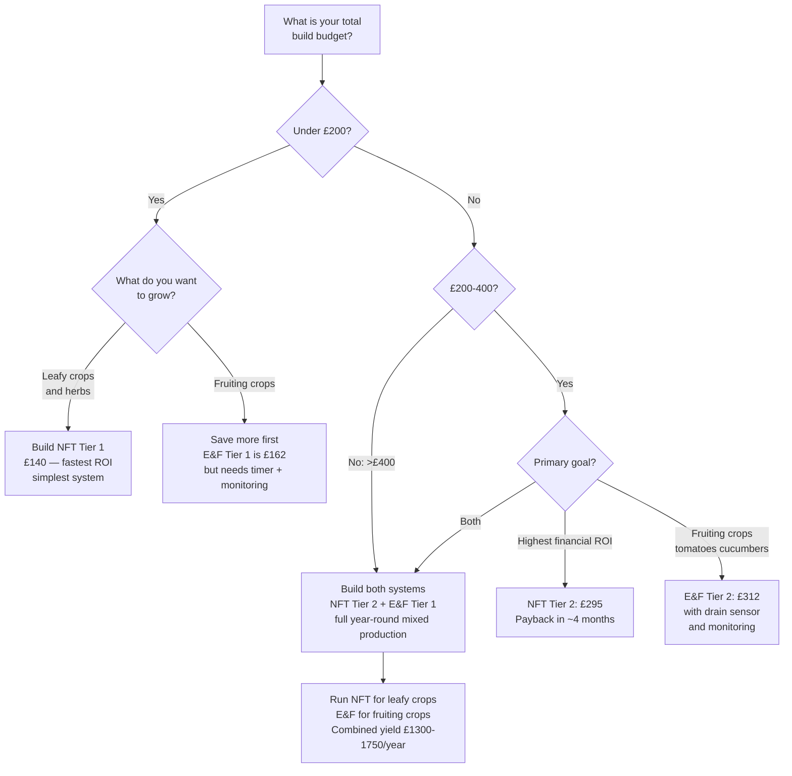

# Comparison Guide 04 — Cost and ROI: NFT vs Ebb & Flow
## Build costs, running costs, yield value, and payback period for each system

---

## Table of Contents

- [Introduction](#introduction)
- [1. What the Cost Comparison Covers](#1-what-the-cost-comparison-covers)
- [2. NFT Build Costs](#2-nft-build-costs)
  - [Tier 1 — Minimal NFT ($120–180)](#tier-1--minimal-nft-120180)
  - [Tier 2 — Standard NFT ($250–350)](#tier-2--standard-nft-250350)
  - [Tier 3 — Full 3-Zone NFT ($400–550)](#tier-3--full-3-zone-nft-400550)
- [3. Ebb & Flow Build Costs](#3-ebb--flow-build-costs)
  - [Tier 1 — Minimal E&F ($150–220)](#tier-1--minimal-ef-150220)
  - [Tier 2 — Standard E&F ($300–400)](#tier-2--standard-ef-300400)
  - [Tier 3 — Full 3-Table E&F ($500–700)](#tier-3--full-3-table-ef-500700)
- [4. Running Costs](#4-running-costs)
  - [Electricity](#electricity)
  - [Nutrients](#nutrients)
  - [Consumables](#consumables)
  - [Annual Running Cost Summary](#annual-running-cost-summary)
- [5. Yield Value](#5-yield-value)
  - [NFT Yield Valuation](#nft-yield-valuation)
  - [E&F Yield Valuation](#ef-yield-valuation)
  - [Combined Two-System Yield](#combined-two-system-yield)
- [6. Payback Period Analysis](#6-payback-period-analysis)
  - [NFT Payback](#nft-payback)
  - [E&F Payback](#ef-payback)
  - [Important Caveats](#important-caveats)
- [7. Cost Comparison Table: NFT vs E&F](#7-cost-comparison-table-nft-vs-ef)
- [8. Where Each System Saves (and Where It Costs More)](#8-where-each-system-saves-and-where-it-costs-more)
  - [NFT Cost Advantages](#nft-cost-advantages)
  - [E&F Cost Advantages](#ef-cost-advantages)
  - [Hidden Costs to Budget For](#hidden-costs-to-budget-for)
- [9. Prioritising Spend: Where Money Has the Most Impact](#9-prioritising-spend-where-money-has-the-most-impact)
- [10. Decision Guide: System Choice vs Budget](#10-decision-guide-system-choice-vs-budget)

---

[↑ Back to TOC](#table-of-contents)

## Introduction

ROI analysis on a home hydroponic system is complicated by the fact that the primary return is not money saved on groceries — it is access to quality, freshness, and variety that supermarkets cannot provide. A vine-ripened hydroponic tomato picked 30 minutes before eating is not the same product as a £3 supermarket punnet. The cost comparison in this guide is therefore both a financial analysis and a value analysis.

The financial figures used throughout are conservative, based on UK retail prices (2025) for components and produce. Adjust the produce values for your local retail prices — in many urban areas, specialty lettuces, heritage tomatoes, and fresh herbs command considerably higher prices than the figures used here.

---

[↑ Back to TOC](#table-of-contents)

## 1. What the Cost Comparison Covers

**Included:**
- All hardware: pipes/tables, reservoir, pump, timer, fittings, media, net pots, frame materials
- Nutrients: Masterblend 4-18-38, calcium nitrate, Epsom salt
- Consumables: pH adjustment chemicals, calibration solution, replacement filter media
- Electricity: pump running cost at UK average electricity rate (28p/kWh, 2025)
- Automation: entry-level float switch and temperature monitoring

**Excluded:**
- Labour time (significant but impossible to price universally)
- Seeds (trivial — typically £2–5/season for most crops)
- Structures (greenhouse, polytunnel, pergola) that the system may sit under — these are shared infrastructure
- Water cost (hydroponic water use is low; <500 L/season for a 3-zone system)

---

[↑ Back to TOC](#table-of-contents)

## 2. NFT Build Costs

### Tier 1 — Minimal NFT ($120–180)

A single 3-channel system, 1.2 m channels, one grow zone.

| Item | Qty | Unit cost | Total |
|---|---|---|---|
| 100mm PVC pressure pipe, 1.2m | 3 | £8 | £24 |
| 50mm hole saw (one-time) | 1 | £10 | £10 |
| 110mm end caps | 6 | £1.50 | £9 |
| 25mm PVC tank connector (inlet) | 3 | £2 | £6 |
| 19mm return barb fittings | 3 | £1.50 | £4.50 |
| 50mm net pots (×50 pack) | 1 | £8 | £8 |
| 19mm braided tubing, 3m | 1 | £5 | £5 |
| 19mm barb manifold (3-way) | 1 | £4 | £4 |
| Submersible pump 500 L/h | 1 | £15 | £15 |
| 80L reservoir (storage box) | 1 | £12 | £12 |
| Channel support frame (timber batten + brackets) | — | £15 | £15 |
| Clay pebbles, 10L | 1 | £8 | £8 |
| Rockwool cubes (×100) | 1 | £8 | £8 |
| pH up + pH down (250 mL each) | 2 | £6 | £12 |
| **Tier 1 total** | | | **£140.50** |

Nutrients not included — see Running Costs section.

### Tier 2 — Standard NFT ($250–350)

Three 3-channel zones on a tiered frame, 1.2 m channels, 45 planting sites total.

| Item | Qty | Unit cost | Total |
|---|---|---|---|
| All Tier 1 items (×3 zones) | — | — | £280 |
| 100L reservoir (larger) | 1 | £18 | +£6 upgrade |
| Digital pH / EC combo meter | 1 | £35 | £35 |
| 800 L/h pump (handles 3 zones) | 1 | £22 | +£7 upgrade |
| Tiered timber frame (lumber, screws, L-brackets) | — | £45 | £45 |
| Float switch (return tank monitoring) | 1 | £5 | £5 |
| ESP8266 + SHT31 (temperature alerting) | 1 | £12 | £12 |
| Calibration solution set (pH 4.0, 7.0; EC 1.41) | 1 | £12 | £12 |
| **Tier 2 total** | | | **~£295** |

### Tier 3 — Full 3-Zone NFT ($400–550)

Three zones, larger channels (125 mm), proper insulated reservoir, Atlas Scientific probes.

| Item | Qty | Unit cost | Total |
|---|---|---|---|
| All Tier 2 items | — | — | £295 |
| Upgrade to 125 mm channels (×9) | — | — | +£35 |
| Upgrade to Atlas EZO-pH + probe | 1 | £75 | +£40 |
| Upgrade to Atlas EZO-EC + probe | 1 | £70 | +£35 |
| ESP32 (replaces ESP8266) | 1 | £10 | +£2 |
| DS18B20 waterproof probe (water temp) | 1 | £4 | £4 |
| Insulated reservoir cover (cut-to-fit foam board) | — | £8 | £8 |
| Reservoir float switch | 1 | £5 | £5 |
| Proper outdoor enclosure for electronics | 1 | £18 | £18 |
| **Tier 3 total** | | | **~£440** |

---

[↑ Back to TOC](#table-of-contents)

## 3. Ebb & Flow Build Costs

### Tier 1 — Minimal E&F ($150–220)

Single flood table (60×90 cm), one grow zone.

| Item | Qty | Unit cost | Total |
|---|---|---|---|
| Flood table (HDPE or liner-in-frame, 60×90 cm) | 1 | £45 | £45 |
| 1.5" bulkhead overflow fitting | 1 | £8 | £8 |
| 1" bulkhead drain fitting | 1 | £6 | £6 |
| 1.5" standpipe (overflow height set) | 1 | £4 | £4 |
| 19mm braided hose, 2m | 1 | £5 | £5 |
| 19mm barb × threaded fitting | 2 | £2 | £4 |
| Submersible pump 800 L/h | 1 | £18 | £18 |
| Mechanical timer (15-min increments) | 1 | £8 | £8 |
| 100L reservoir | 1 | £14 | £14 |
| LECA clay pebbles, 25L | 1 | £18 | £18 |
| pH up + pH down (250 mL each) | 2 | £6 | £12 |
| Flood table support frame (timber) | — | £20 | £20 |
| **Tier 1 total** | | | **£162** |

### Tier 2 — Standard E&F ($300–400)

Two flood tables, proper digital timer, basic monitoring.

| Item | Qty | Unit cost | Total |
|---|---|---|---|
| All Tier 1 items | — | — | £162 |
| Second flood table (60×90 cm) | 1 | £45 | £45 |
| Second table fittings (as above) | — | — | £18 |
| Upgrade to digital timer (programmable to 1-min) | 1 | £18 | +£10 |
| 150L reservoir (shared) | 1 | £22 | +£8 |
| pH / EC combo meter | 1 | £35 | £35 |
| Float switch in table (drain confirmation) | 1 | £5 | £5 |
| Float switch in reservoir | 1 | £5 | £5 |
| ESP8266 + SHT31 | 1 | £12 | £12 |
| Calibration solution set | 1 | £12 | £12 |
| **Tier 2 total** | | | **~£312** |

### Tier 3 — Full 3-Table E&F ($500–700)

Three flood tables, Atlas Scientific probes, relay-based pump safety cutoff, full logging.

| Item | Qty | Unit cost | Total |
|---|---|---|---|
| All Tier 2 items (3 tables) | — | — | £390 |
| Third flood table + fittings | — | £63 | £63 |
| Upgrade to Atlas EZO-pH + probe | 1 | £75 | +£40 |
| Upgrade to Atlas EZO-EC + probe | 1 | £70 | +£35 |
| ESP32 (replaces ESP8266) | 1 | £10 | +£2 |
| Float switch in each table (3 total) | 3 | £5 | +£10 |
| DS18B20 waterproof probe | 1 | £4 | £4 |
| 5V relay module (pump safety cutoff) | 1 | £8 | £8 |
| 200L reservoir | 1 | £30 | +£8 |
| Outdoor electronics enclosure | 1 | £18 | £18 |
| **Tier 3 total** | | | **~£578** |

---

[↑ Back to TOC](#table-of-contents)

## 4. Running Costs

### Electricity

**NFT pump (continuous operation):**
- Typical pump: 25–40W (500–1000 L/h submersible)
- Hours per day: 24 (continuous)
- Annual kWh: 35W × 24 × 180 days (growing season) = 151 kWh
- Cost at 28p/kWh: **£42/year**

**E&F pump (intermittent operation):**
- Typical pump: 40–60W (800–1200 L/h submersible)
- Hours per day: 4 cycles × 20 min = 80 min = 1.33 hours/day
- Annual kWh: 50W × 1.33 × 180 days = 12 kWh
- Cost at 28p/kWh: **£3.40/year**

**E&F vs NFT electricity:** E&F uses dramatically less electricity because the pump only runs intermittently. Over a 10-year system life, the electricity saving for E&F is approximately £380 at current rates.

**Automation electronics (ESP32 + sensors):**
- Approximately 2–3W continuous
- Annual kWh: 2.5W × 24 × 365 = 22 kWh
- Cost: **£6/year** (shared between both systems if run from one board)

### Nutrients

Using the Masterblend 4-18-38 system (most cost-effective option for both systems):

**Costs per kg (bulk, 2025 UK pricing):**
- Masterblend 4-18-38: £12–18/kg
- Calcium nitrate: £4–6/kg
- Epsom salt (magnesium sulphate): £2–4/kg

**Annual consumption (3-zone outdoor system, 7-month season):**

| Nutrient | NFT (7 months) | E&F (7 months) |
|---|---|---|
| Masterblend 4-18-38 | ~600 g | ~700 g |
| Calcium nitrate | ~600 g | ~700 g |
| Epsom salt | ~300 g | ~350 g |

NFT uses slightly less nutrients because there is no media salt accumulation requiring solution disposal; E&F uses more because of more frequent full changes and the media flush protocol.

**Annual nutrient cost:**
- NFT: approximately £18–25/year
- E&F: approximately £22–30/year

### Consumables

| Item | NFT annual | E&F annual |
|---|---|---|
| pH up + pH down | £12–18 | £12–18 |
| Probe calibration solution | £8 | £8 |
| Rockwool cubes (for seedlings) | £8–12 | £8–12 |
| Net pots (replace cracked ones) | £3–5 | £3–5 (smaller quantity) |
| LECA top-up (loss to removal) | — | £6–10 |
| Replacement pump seals/impeller | £5 (every 2–3 years) | £3 (less wear, intermittent) |
| pH meter replacement electrode | £15 (every 18–24 months) | £15 (every 18–24 months) |
| **Annual consumables total** | **£35–50** | **£40–55** |

### Annual Running Cost Summary

| System | Electricity | Nutrients | Consumables | **Total/year** |
|---|---|---|---|---|
| NFT (3 zones) | £42 | £22 | £42 | **£106** |
| E&F (3 tables) | £4 | £26 | £47 | **£77** |
| Both combined | £46 | £48 | £89 | **£183** |

E&F is significantly cheaper to run annually, primarily due to the huge electricity saving from intermittent pump operation.

---

[↑ Back to TOC](#table-of-contents)

## 5. Yield Value

Yield values use conservative UK supermarket retail prices for equivalent quality produce (not budget supermarket prices — hydroponic produce at this quality level is priced above budget-tier).

### NFT Yield Valuation

A standard 3-zone NFT system (6 channels per zone, 1.2 m channels, 30 planting sites total, 5 plants/channel):

**Leafy crop cycles per zone per season (7 months, March–October):**
- Average cycle length: 5 weeks
- Cycles per zone: ~6 per season

**Lettuce:**
- 5 plants × 300 g = 1,500 g per channel harvest
- 6 channels × 1,500 g = 9 kg per zone per cycle
- 6 cycles × 9 kg = 54 kg per zone per season
- 3 zones (not all lettuce; some allocated to herbs and other crops): approximately 100 kg total leafy crop mix per season
- Value at £3/head (250–350 g): approximately 300–350 heads
- **Retail value: £900–1,050/season**

**Herbs (one zone allocated primarily to herbs):**
- Basil, coriander, chives, mint over the season
- Approximately 12–15 harvests from succession planting
- Fresh herb retail value £2–4 per pack (30 g)
- Estimated yield per zone per season: 3–5 kg mixed herbs
- **Retail value: £200–300/season**

**NFT total annual yield value: £1,100–1,350**

### E&F Yield Valuation

A standard 3-table E&F system (one table each: tomatoes, cucumbers, courgettes/peppers):

**Tomatoes (1 indeterminate plant per table):**
- Season yield: 2.5–4 kg cherry tomatoes or 3–5 kg beef tomatoes
- Retail value: cherry tomatoes £5–8/250g punnet = £50–130/kg
- Conservative valuation at £6/250g: 3 kg yield = **£72**
- Beef tomato at £4/kg: 4 kg = **£16**

**Cucumbers (1 plant per table):**
- Season yield: 10–15 cucumbers
- Retail value: specialty/ridge cucumbers £1.00–1.50 each
- Conservative: 12 cucumbers × £1.20 = **£14.40**

**Courgettes (1 plant per table):**
- Season yield: 20–25 fruits (harvested young at 15–20 cm)
- Retail value: £0.80–1.20 each at farm shop pricing
- Conservative: 22 × £0.90 = **£19.80**

**E&F leafy crops (shoulder seasons, before/after fruiting):**
- March–April and October: 4–6 weeks of lettuce / spinach per table
- 3 tables × 8 heads per table × 2 shoulder seasons = 48 heads
- Value at £3/head = **£144**

**E&F total annual yield value: approximately £270–350**

This is significantly lower than NFT because:
1. The fruiting crops have a lower value per unit than fresh herbs and specialty lettuces
2. One plant per table is a very low planting density by comparison
3. The highest-value E&F crop — cherry tomatoes — requires a grower who values them highly (home-grown flavour vs supermarket pricing)

**However**: the subjective value of home-grown vine-ripened tomatoes and cucumbers is much higher than retail price implies. Many growers consider this the primary reason to build an E&F system.

### Combined Two-System Yield

| Source | Annual yield value |
|---|---|
| NFT leafy crops | £900–1,050 |
| NFT herbs | £200–300 |
| E&F fruiting crops | £100–250 |
| E&F shoulder-season leafy | £100–150 |
| **Total combined** | **£1,300–1,750** |

---

[↑ Back to TOC](#table-of-contents)

## 6. Payback Period Analysis

### NFT Payback

| Tier | Build cost | Annual running cost | Annual yield value | Annual net | Payback period |
|---|---|---|---|---|---|
| Tier 1 | £140 | £106 | £600 (smaller system) | £494 | 3.4 months |
| Tier 2 | £295 | £106 | £1,100 | £994 | 3.6 months |
| Tier 3 | £440 | £106 | £1,350 | £1,244 | 4.3 months |

NFT has an extremely fast payback because leafy crops and herbs have high retail value per kg and short crop cycles.

### E&F Payback

| Tier | Build cost | Annual running cost | Annual yield value | Annual net | Payback period |
|---|---|---|---|---|---|
| Tier 1 | £162 | £77 | £150 (1 table) | £73 | 27 months |
| Tier 2 | £312 | £77 | £300 (2 tables) | £223 | 17 months |
| Tier 3 | £578 | £77 | £350 (3 tables) | £273 | 25 months |

E&F payback is slower because fruiting crops, while highly valued by the grower, have a lower market retail price per unit than fresh herbs and salads.

### Important Caveats

**These calculations assume:**
- Full utilisation of planting sites throughout the season (no crop failures, no extended gaps)
- Retail price comparison at good-quality greengrocer or farm shop pricing, not budget supermarket pricing
- Seven-month outdoor growing season (March/April to October in UK)

**What the numbers don't capture:**
- **Freshness premium**: home-grown produce is consumed within hours of harvest; this is genuinely impossible to purchase
- **Variety access**: heritage tomato varieties, unusual herbs, and specialty salad mixes unavailable in most supermarkets
- **Learning curve losses**: first-season growers typically lose some crop to pH errors, pest outbreaks, and equipment issues; realistic first-year yield is 50–70% of the mature-system estimates above
- **Labour**: tending the system takes 20–30 minutes per day for both systems combined; this is not a passive investment

**Most honest summary:** NFT pays back quickly and clearly in financial terms. E&F pays back more slowly in financial terms but delivers produce (tomatoes, cucumbers, courgettes) that has a value beyond supermarket pricing.

---

[↑ Back to TOC](#table-of-contents)

## 7. Cost Comparison Table: NFT vs E&F

| Category | NFT (Tier 2) | E&F (Tier 2) | Winner |
|---|---|---|---|
| Build cost | £295 | £312 | NFT (marginally) |
| Annual electricity | £42 | £4 | E&F |
| Annual nutrients | £22 | £26 | NFT |
| Annual consumables | £42 | £47 | NFT |
| Annual running total | £106 | £77 | **E&F** |
| Annual yield value | £1,100 | £300 | **NFT** |
| Payback period | 3.6 months | 17 months | **NFT** |
| Crop variety range | Leafy, herbs | Fruiting + leafy | **E&F** |
| System complexity | Low | Medium | NFT |
| Maintenance time | Lower | Higher (flush protocol) | NFT |
| 10-year net value | £9,740 | £2,230 | **NFT** |

---

[↑ Back to TOC](#table-of-contents)

## 8. Where Each System Saves (and Where It Costs More)

### NFT Cost Advantages

- **Low electricity use relative to yield**: continuous pump but small pump (25–40W) yields high crop value
- **No growing media purchase**: 10 L of clay pebbles for net pot fill vs 25 L per E&F table; not replaced each season
- **No media flush consumables**: no flush water, no waste disposal
- **Simple pump**: a 25W pump in NFT lasts longer than a larger E&F pump because it never cycles on/off (thermal stress from cycling shortens motor life)
- **Faster crop cycles**: more cycles per season means lower cost per harvest

### E&F Cost Advantages

- **Dramatically lower electricity**: 1.33 hours/day pump operation vs 24 hours in NFT; 90%+ electricity saving on the pump
- **Timer failure is the only critical electrical cost**: but if prevented by automation, the running cost of the E&F pump circuit is negligible
- **Higher crop value per plant (fruiting)**: one tomato plant in E&F over a season provides more subjective value per table-square-metre to many growers than lettuce, even if the financial ROI is lower

### Hidden Costs to Budget For

| Hidden cost | NFT | E&F |
|---|---|---|
| Probe replacement | pH probe electrode: £15 every 18–24 months | Same |
| Pump replacement | Every 3–5 years: £15–25 | Every 4–6 years: £18–30 (but less thermal stress) |
| LECA top-up | Minimal | £6–10/year as some media is lost or discarded |
| Overflow fitting replacement | — | £6–8 every 2–3 years (silicone gaskets perish) |
| Channel replacement | Every 5–8 years (UV degradation if exposed PVC) | — |
| Table liner repair or replacement | — | Every 3–5 years if liner develops micro-leaks |
| Backup pump | Strongly recommended: £15–25 for same model | Same |
| Backup timer (E&F) | — | Critical to have a spare: £8–18 |

---

[↑ Back to TOC](#table-of-contents)

## 9. Prioritising Spend: Where Money Has the Most Impact

For growers building on a budget, the following spend hierarchy maximises yield and reliability:

**Highest impact per pound spent:**

1. **A quality pump** (not the cheapest): a reliable 500–800 L/h pump saves crop losses worth many times its cost difference over the cheapest option. Budget £18–25, not £8–10.

2. **A calibrated EC/pH meter** ($35+): guessing EC and pH is the most common cause of crop failure in new hydroponic systems. A quality combo meter pays for itself in one prevented crop loss.

3. **Float switches** ($5 each): the single highest value-for-money automation component. A £5 float switch and a $10 ESP8266 can alert you to a pump failure (NFT) or drain failure (E&F) before you lose a full crop.

4. **A backup pump** (spare, same model): pump failures happen. A spare pump on the shelf means recovery in 20 minutes instead of losing the crop while waiting for delivery.

5. **A backup timer** (E&F only): timer failure is the highest-severity E&F failure mode. A £10 spare mechanical timer on the shelf is cheap insurance.

6. **Insulation for the reservoir**: in hot summers, water temperature above 26°C causes root disease. £8 of foam board insulation prevents far more costly losses.

**Lowest impact per pound spent (avoid early):**
- Automated pH dosing (peristaltic pumps): very easy to overdose; not suitable until you have a season of manual experience
- Premium Atlas Scientific probes before you know your system well: the probes are excellent but regular calibration and comparison against your hand meter is more important in year one than probe accuracy
- Multiple grow lights for outdoor systems: fix the outdoor environment first (site selection, shade cloth, timing) before spending on artificial lighting

---

[↑ Back to TOC](#table-of-contents)

## 10. Decision Guide: System Choice vs Budget

**Summary recommendations:**

| Situation | Recommendation |
|---|---|
| Budget under £200, want maximum yield per £ | NFT Tier 1 |
| Budget £250–350, want best financial ROI | NFT Tier 2 |
| Budget £250–350, want tomatoes and cucumbers | E&F Tier 2 (accept slower ROI) |
| Budget £500+, want year-round mixed production | NFT Tier 2 + E&F Tier 1/2 combined |
| Already have NFT, want to expand to fruiting crops | Add E&F Tier 1 or 2 |
| Already have E&F, want faster leafy crop turnover | Add NFT Tier 1 or 2 |
| Running cost minimisation is the priority | E&F (90% lower electricity) |
| Simplicity and fastest setup are the priority | NFT |

---

*This is the final comparison guide. Return to the [main README](../../README.md) for the full guide library.*
