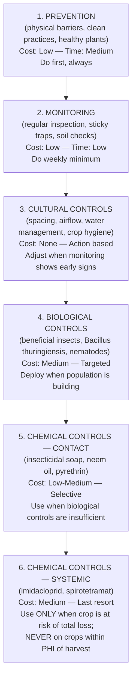

# Guide 07 — Pests and Disease
## Identification, Treatment, IPM, and Prevention

---

## Table of Contents

- [1. The Outdoor E&F Vulnerability Profile](#1-the-outdoor-ef-vulnerability-profile)
  - [E&F vs NFT — Risk Comparison](#ef-vs-nft-risk-comparison)
  - [The Three Primary Risks in E&F](#the-three-primary-risks-in-ef)
- [2. Integrated Pest Management (IPM) Framework](#2-integrated-pest-management-ipm-framework)
  - [The IPM Hierarchy](#the-ipm-hierarchy)
  - [Monitoring Schedule](#monitoring-schedule)
  - [Action Thresholds](#action-thresholds)
- [3. Common Pests](#3-common-pests)
  - [Fungus Gnats — Priority Pest #1 in E&F](#fungus-gnats-priority-pest-1-in-ef)
  - [Aphids](#aphids)
  - [Whitefly](#whitefly)
  - [Spider Mites](#spider-mites)
  - [Thrips](#thrips)
  - [Slugs and Snails](#slugs-and-snails)
  - [Caterpillars and Leaf Miners](#caterpillars-and-leaf-miners)
- [4. Common Diseases](#4-common-diseases)
  - [Pythium (Root Rot)](#pythium-root-rot)
  - [Fusarium Wilt](#fusarium-wilt)
  - [Powdery Mildew](#powdery-mildew)
  - [Botrytis (Grey Mould)](#botrytis-grey-mould)
  - [Algae on LECA Surface](#algae-on-leca-surface)
  - [Damping Off](#damping-off)
- [5. Pesticide PHI Reference](#5-pesticide-phi-reference)
  - [Understanding PHI (Pre-Harvest Interval)](#understanding-phi-pre-harvest-interval)
  - [PHI Table — Common Products](#phi-table-common-products)
- [6. Beneficial Insects](#6-beneficial-insects)
  - [Encouraging Beneficials Outdoors](#encouraging-beneficials-outdoors)
  - [Purchased Beneficial Insects](#purchased-beneficial-insects)
- [7. Sterilisation Protocol After Disease Outbreak](#7-sterilisation-protocol-after-disease-outbreak)
  - [When Full Sterilisation Is Required](#when-full-sterilisation-is-required)
  - [Complete System Sterilisation — Step by Step](#complete-system-sterilisation-step-by-step)
  - [Post-Outbreak Replanting Rules](#post-outbreak-replanting-rules)


## Table of Contents

- [1. The Outdoor E&F Vulnerability Profile](#1-the-outdoor-ef-vulnerability-profile)
  - [E&F vs NFT — Risk Comparison](#ef-vs-nft-risk-comparison)
  - [The Three Primary Risks in E&F](#the-three-primary-risks-in-ef)
- [2. Integrated Pest Management (IPM) Framework](#2-integrated-pest-management-ipm-framework)
  - [The IPM Hierarchy](#the-ipm-hierarchy)
  - [Monitoring Schedule](#monitoring-schedule)
  - [Action Thresholds](#action-thresholds)
- [3. Common Pests](#3-common-pests)
  - [Fungus Gnats — Priority Pest #1 in E&F](#fungus-gnats-priority-pest-1-in-ef)
  - [Aphids](#aphids)
  - [Whitefly](#whitefly)
  - [Spider Mites](#spider-mites)
  - [Thrips](#thrips)
  - [Slugs and Snails](#slugs-and-snails)
  - [Caterpillars and Leaf Miners](#caterpillars-and-leaf-miners)
- [4. Common Diseases](#4-common-diseases)
  - [Pythium (Root Rot)](#pythium-root-rot)
  - [Fusarium Wilt](#fusarium-wilt)
  - [Powdery Mildew](#powdery-mildew)
  - [Botrytis (Grey Mould)](#botrytis-grey-mould)
  - [Algae on LECA Surface](#algae-on-leca-surface)
  - [Damping Off](#damping-off)
- [5. Pesticide PHI Reference](#5-pesticide-phi-reference)
  - [Understanding PHI (Pre-Harvest Interval)](#understanding-phi-pre-harvest-interval)
  - [PHI Table — Common Products](#phi-table-common-products)
- [6. Beneficial Insects](#6-beneficial-insects)
  - [Encouraging Beneficials Outdoors](#encouraging-beneficials-outdoors)
  - [Purchased Beneficial Insects](#purchased-beneficial-insects)
- [7. Sterilisation Protocol After Disease Outbreak](#7-sterilisation-protocol-after-disease-outbreak)
  - [When Full Sterilisation Is Required](#when-full-sterilisation-is-required)
  - [Complete System Sterilisation — Step by Step](#complete-system-sterilisation-step-by-step)
  - [Post-Outbreak Replanting Rules](#post-outbreak-replanting-rules)


[↑ Back to TOC](#table-of-contents)

[↑ Back to TOC](#table-of-contents)

## 1. The Outdoor E&F Vulnerability Profile

Every hydroponic system has a characteristic risk profile — the combination of pests and diseases most likely to cause problems given how the system works. Understanding your specific risk profile is the first step toward effective prevention.

### E&F vs NFT — Risk Comparison

| Risk Factor | NFT | E&F | Notes |
|-------------|-----|-----|-------|
| **Fungus gnats** | Low | **HIGH** | LECA media stays moist — ideal fungus gnat habitat |
| **Pythium (root rot)** | Medium | **HIGH if over-flooded** | Standing water in media creates Pythium conditions |
| **Root-to-root disease spread via water** | High (continuous film) | **LOWER** | Solution in reservoir between floods — less continuous root contact |
| **Algae on media surface** | Low (channels enclosed) | **Medium** | LECA surface exposed to light — algae grows readily |
| **Aphids** | High | High | Outdoor exposure equal in both systems |
| **Whitefly** | High | High | Especially on fruiting crops |
| **Spider mites** | High (dry heat) | Medium-High | LECA media slightly higher humidity than NFT |
| **Botrytis** | Medium | Medium | Dense canopy in flood tables increases risk |
| **Powdery mildew** | Medium | **Higher** (courgettes, cucumbers) | Wide canopy crops in E&F create humid microclimate |
| **Fusarium** | Medium | Medium | Root zone conditions similar once media is established |
| **Damping off (seedlings)** | Medium | Medium | Same germination media risks |
| **Slugs/snails** | Low (elevated channels) | **Medium** | Tables closer to ground level — easier slug access |

### The Three Primary Risks in E&F

**Risk 1 — Fungus Gnats (Sciarid Flies):**
Fungus gnat larvae live in moist organic substrate. LECA is inorganic but the moist conditions and any organic material (dead roots, root exudates, algae) that accumulate in an E&F flood table create a suitable habitat. Fungus gnats are the #1 insect pest specific to E&F flood tables — they rarely cause significant damage in NFT.

**Risk 2 — Pythium via Over-Flooding:**
Pythium thrives in warm, wet, low-oxygen conditions. In E&F, the risk is not the flood phase itself (flooding for 15–30 minutes is fine) but the **failure to drain fully** between floods. A partially blocked drain fitting, compacted media, or overly frequent flood schedule can create standing water in the lower LECA layer — precisely the warm, wet, anaerobic conditions Pythium needs.

**Risk 3 — Algae on LECA Surface:**
In NFT, the channel surface is largely shielded from light. In an E&F flood table, the LECA surface is open and exposed to full outdoor light. Green or blue-green algae grows readily on moist LECA under direct sunlight. Algae itself rarely damages plants directly but:
- It competes for nutrients in the media
- Green algae decomposes to create a nutrient film that feeds fungus gnats
- It can partially block overflow fittings if allowed to grow into drain areas
- Blue-green algae (cyanobacteria) produces toxins that can harm roots

---

[↑ Back to TOC](#table-of-contents)

[↑ Back to TOC](#table-of-contents)

## 2. Integrated Pest Management (IPM) Framework

IPM is a systematic approach that prioritises prevention, monitoring, and targeted intervention over routine pesticide application. It is the correct management philosophy for a food-growing system where you will be eating the produce.

### The IPM Hierarchy



> **IPM is not about zero pesticides.** It is about using the **least disruptive intervention** that achieves effective control. The hierarchy above is not a strict sequential ladder — you should be doing Prevention and Monitoring simultaneously and continuously. Cultural and Biological controls should be your primary active responses. Chemical controls are the exception, not the rule.

### Monitoring Schedule

| Frequency | Action |
|-----------|--------|
| **Daily** | Visual check of all plants for wilting, discolouration, unusual growth; check flood cycle running correctly |
| **Every 2–3 days** | Check undersides of leaves on fruiting crops (spider mites, whitefly eggs); check LECA surface for fungus gnats |
| **Weekly** | Check sticky yellow traps; inspect roots of any struggling plants; check drain fittings for partial blockage |
| **Every 2 weeks** | Check overflow fittings for algae accumulation; assess media surface algae levels |

**Sticky trap placement for E&F:**

```
  STICKY TRAP DEPLOYMENT — FLOOD TABLES:

  Type: Yellow sticky traps (8cm × 12cm minimum)
  Number: 2 per flood table (1 per 0.36 m²)
  Height: 10–15cm above the plant canopy (not at media level)
  Position: One at each end of the table — captures insects entering from either direction

  What to look for:
  ─ Fungus gnats: tiny black flies (2–3mm), legs dangling when flying
    High numbers on traps = active infestation in media
  ─ Whitefly: tiny white-winged insects (1–2mm)
  ─ Aphids: winged forms caught on trap = infestation nearby
  ─ Thrips: tiny torpedo-shaped insects (1–1.5mm)

  Change traps every 2–3 weeks or when >50 insects per trap
```

### Action Thresholds

IPM action thresholds define when to escalate from monitoring to active control:

| Pest/Disease | Low (monitor) | Medium (cultural/biological action) | High (chemical action warranted) |
|-------------|---------------|-------------------------------------|----------------------------------|
| Fungus gnats | <5/trap/week | 5–20/trap/week | >20/trap/week or larvae visible in media |
| Aphids | 1–5 per plant | Colonies forming on 2+ plants | >50% of plants colonised |
| Whitefly | <5 adults per plant | Sticky honeydew on leaves | Dense populations, sooty mould forming |
| Spider mites | Occasional stippling | Webbing visible | Heavy webbing, >30% leaf damage |
| Pythium | — | One plant showing wilting | Two or more plants wilting |
| Powdery mildew | <10% leaf area | 10–30% leaf area | >30% leaf area |

---

[↑ Back to TOC](#table-of-contents)

[↑ Back to TOC](#table-of-contents)

## 3. Common Pests

---

### Fungus Gnats — Priority Pest #1 in E&F

**Identification:**

Fungus gnats (*Sciaridae* species — primarily *Bradysia* spp.) are 2–3mm long with dark grey/black bodies, long legs, and clear wings held flat over the body when at rest. Adult flies are relatively harmless — they are annoying and can spread disease between plants when they walk on roots. The **larvae** are the problem.

```
  FUNGUS GNAT LIFE CYCLE IN E&F FLOOD TABLES:

  Adult female:
  ─ Attracted to moist media surface
  ─ Lays 100–200 eggs in the top 2–3cm of LECA or at media surface
  ─ Eggs hatch in 3–5 days at 20°C

  Larvae (the damaging stage):
  ─ Transparent to white, 5–6mm long with black head capsule
  ─ Live in the top 5–7cm of media
  ─ Feed on: root tips, root hairs, decaying organic material, algae in media
  ─ Root tip damage = nutrient and water uptake impairment
  ─ On seedlings: larvae girdle (encircle and cut) stem at soil level = death
  ─ Larval stage: 10–14 days

  Pupa:
  ─ 4–5 days in media

  Total life cycle: 17–28 days at 20–25°C
  → Multiple overlapping generations possible during growing season
```

**Why E&F has higher fungus gnat risk than NFT:**

- LECA surface in a flood table is 0.72 m² of moist, periodically flooded media — ideal egg-laying habitat
- Any algae growing on the LECA surface provides organic food for larvae
- Flood cycles keep the upper media perpetually damp between floods — no dry period to kill eggs and young larvae
- Table height is close to ground — fungus gnats from surrounding soil fly directly onto table

**Control methods (in order of preference):**

```
  LEVEL 1 — PREVENTION AND CULTURAL CONTROL:
  ─ Cover LECA surface between net pots with black weed fabric or mesh
    (prevents adults from accessing media to lay eggs)
  ─ Keep flood cycles on schedule — never flood more than necessary
    (reducing media moisture reduces egg-laying appeal)
  ─ Control algae on LECA surface (algae = larval food source)
  ─ Yellow sticky traps at canopy level for early detection

  LEVEL 2 — BIOLOGICAL CONTROL:
  ─ Bacillus thuringiensis var. israelensis (Bti) — apply as drench to media
    Commercial product: Gnatrol, Vectobac
    How: Mix to label rate, pour over media surface before a flood cycle
    Bti produces toxins that kill fungus gnat larvae when ingested
    Not harmful to plants, beneficial insects, or humans
    Reapply every 7–10 days for 3–4 weeks to break the cycle
  ─ Beneficial nematodes (Steinernema feltiae):
    Apply as media drench — nematodes parasitise larvae in the media
    Effective at media temperatures above 14°C
    Single application can suppress population for 4–6 weeks

  LEVEL 3 — PHYSICAL/CHEMICAL CONTROL:
  ─ Sticky yellow cards at media level (in addition to canopy-level cards)
    catches adults before they lay eggs
  ─ Neem oil drench (azadirachtin):
    Mix 5ml neem oil + 1ml dish soap per litre of pH-adjusted water
    Apply as media drench; azadirachtin disrupts larval development
    Repeat weekly for 3–4 weeks
  ─ Pyrethrin spray (contact insecticide for adults):
    Spray media surface and air above table at dusk when adults are active
    Knocks down adult population but does not affect larvae
    PHI: check product label; most pyrethrins allow harvest after 1 day
```

**Signs of fungus gnat infestation:**
- Adult flies visible hovering over media or running on media surface
- Sticky traps showing >5 gnats per trap per week
- Seedlings wilting or dying at media surface for no apparent reason
- Roots of affected plants show damaged tips or brown discolouration near the media surface

---

### Aphids

**Identification:** 1–3mm pear-shaped insects in green, black, grey, or brown. Found in colonies on growing tips, undersides of young leaves, and flower buds. Produce sticky honeydew.

**E&F context:** Aphids colonise above-ground plant tissue and are not directly affected by the flood system. All outdoor crops are at risk. Fruiting crops on Table 2 (particularly peppers and aubergines) are especially attractive.

**Control:**

```
  PREVENTION:
  ─ Inspect all transplants before placing on flood tables — do not import aphids
  ─ Encourage or introduce beneficial insects (see Section 6)
  ─ Maintain airflow around plants (crowding + stagnant air = aphid outbreaks)

  EARLY INFESTATION (colonies forming):
  ─ Knock off colonies with a strong jet of water from a hosepipe
    Direct jet at affected growing tips and leaf undersides
    Repeat every 2–3 days — very effective at low population levels
  ─ Squish by hand (gloves recommended if sensitive)

  ESTABLISHED INFESTATION:
  ─ Insecticidal soap spray (1% soap solution, e.g. castile soap + water)
    Kills by contact — covers insects in soapy film
    Apply to all leaf surfaces; repeat every 3–4 days for 2–3 weeks
    Not harmful to most beneficials once dry
  ─ Neem oil spray (2% dilution):
    Systemic deterrent — aphids avoid treated plants
    Also kills by contact
  ─ Pyrethrin spray: last resort for severe infestation (see PHI table)

  BIOLOGICAL:
  ─ Lacewings (larvae): release near infested plants; each larva eats 200+ aphids
  ─ Parasitic wasps (Aphidius spp.): sold commercially for greenhouse use;
    also naturally present outdoors — mummified (bronze, swollen) aphids
    indicate natural parasitism is occurring
```

---

### Whitefly

**Identification:** Tiny (1–2mm) white-winged insects on leaf undersides. When disturbed, they fly up in a cloud. Yellow sticky traps are very effective for monitoring. Larvae (scales) are flat, oval, and semi-transparent — often overlooked.

**E&F context:** Whitefly is a particular problem on tomatoes, peppers, cucumbers, and aubergines in Zone A Table 2. The dense canopy of fruiting crops in a flood table provides shelter.

**Control:**

```
  PREVENTION AND MONITORING:
  ─ Yellow sticky traps at canopy height — change when >20 whitefly per trap
  ─ Inspect leaf undersides on all Table 2 crops weekly

  CULTURAL:
  ─ Remove heavily infested leaves (bag and dispose — do not compost)
  ─ Avoid excess nitrogen — lush soft growth attracts whitefly

  BIOLOGICAL:
  ─ Parasitic wasp Encarsia formosa: commercially available sachets;
    parasitises whitefly scales; effective when deployed early
  ─ Lacewings, ladybirds: also consume whitefly

  CHEMICAL:
  ─ Insecticidal soap or neem oil (same as aphids — see above)
  ─ Yellow sticky traps in large numbers can suppress population
  ─ Pyrethrin: effective knockdown but re-infestation common from eggs
```

---

### Spider Mites

**Identification:** Tiny (0.4–0.5mm) arachnids — not insects. Appear as fine speckling on upper leaf surface (chlorophyll removed at feeding sites). Webbing between leaves in severe infestations. Found on undersides of leaves.

**E&F context:** Spider mites thrive in hot, dry conditions. The slightly higher humidity around E&F flood tables (due to periodic flooding) provides some natural suppression. Most risk during hot dry periods in July/August, particularly on tomatoes, cucumbers, and aubergines.

**Control:**

```
  PREVENTION:
  ─ Maintain adequate flood frequency in summer (moist LECA moderates humidity)
  ─ Regularly mist leaf undersides on Table 2 crops during hot spells
    (spider mites avoid high humidity)

  CULTURAL:
  ─ Remove heavily infested leaves
  ─ Strong water jet on leaf undersides (knocks mites off)

  BIOLOGICAL:
  ─ Predatory mite Phytoseiulus persimilis:
    Commercially available; released onto infested plants
    Consumes spider mites rapidly in warm conditions
    Effective between 20–30°C
  ─ Neoseiulus californicus: works at slightly lower temperatures (15–28°C)

  CHEMICAL:
  ─ Neem oil spray (2%) on leaf undersides — highly effective
  ─ Insecticidal soap spray
  ─ Avoid pyrethrins — these kill the natural predatory mites that suppress spider mites
```

---

### Thrips

**Identification:** Tiny (1–1.5mm) torpedo-shaped insects in yellow, brown, or black. Cause silver streaking and stippling on leaves; distort growing tips. Caught on yellow and blue sticky traps.

**Control:**

```
  CULTURAL:
  ─ Remove and destroy infested growing tips
  ─ Blue sticky traps supplement yellow traps for thrips monitoring

  BIOLOGICAL:
  ─ Amblyseius cucumeris (predatory mite): commercially available sachets;
    feeds on thrips larvae
  ─ Orius (pirate bug): natural outdoor predator; encourage by planting flowers

  CHEMICAL:
  ─ Spinosad: biological insecticide derived from soil bacteria;
    effective on thrips larvae; PHI typically 1–3 days
  ─ Insecticidal soap: less effective on thrips than on aphids/whitefly
    but safe to use as a suppression measure
```

---

### Slugs and Snails

**Identification:** Obvious. Ragged holes in leaves, silvery slime trails. Active at night and in wet conditions.

**E&F context:** Flood tables sit closer to ground level than elevated NFT channel rigs — slugs and snails can access plants more easily. The moist LECA surface is also an attractive habitat.

**Control:**

```
  PREVENTION:
  ─ Copper tape: apply as a band around the table legs and base
    Slugs and snails dislike crossing copper
  ─ Gritty/sharp material barrier: diatomaceous earth or sharp gravel
    around the base of the table frame

  PHYSICAL:
  ─ Hand-picking at night with a torch: most effective direct control
    Check under table frame and around reservoir — slugs shelter there

  BAIT:
  ─ Ferrous phosphate slug pellets (Sluggo, Ferroform):
    Safe for use around food crops, pets, and wildlife
    Avoid metaldehyde pellets — toxic to birds, hedgehogs, and pets
  ─ Beer traps: shallow containers sunk near the tables; slugs attracted
    to fermentation smell, fall in and drown
```

---

### Caterpillars and Leaf Miners

**Identification:** Caterpillars: visible larvae feeding on leaves; irregular chewed holes. Leaf miners: distinctive serpentine pale tunnels within the leaf tissue.

**Control:**

```
  CATERPILLARS:
  ─ Hand-pick larvae and eggs (check leaf undersides for egg clusters)
  ─ Bacillus thuringiensis var. kurstaki (Btk):
    Spray on leaves; larvae eat Btk-treated leaf tissue and die
    Not harmful to humans or beneficial insects
    PHI: 0 days for most formulations

  LEAF MINERS:
  ─ Remove and destroy infested leaves (larvae inside leaf cannot be sprayed)
  ─ Yellow sticky traps catch adult flies before egg-laying
  ─ Beneficial parasitic wasps (Dacnusa sibirica, Diglyphus isaea):
    commercially available for greenhouse/polytunnel use
```

---

[↑ Back to TOC](#table-of-contents)

[↑ Back to TOC](#table-of-contents)

## 4. Common Diseases

---

### Pythium (Root Rot)

**What it is:** *Pythium* is an oomycete (water mould) that attacks roots in warm, wet, low-oxygen conditions. It produces zoospores that swim through water to find stressed roots. In E&F systems, it is the most dangerous disease because it spreads through the flood water to the entire table in a single cycle.

**E&F-specific risk factors:**

```
  CONDITIONS THAT CREATE PYTHIUM IN E&F:

  1. OVER-FLOODING (most common cause):
     ─ Flood duration too long (>30–45 minutes)
     ─ Media not draining completely between floods
     ─ Result: root zone spends too long anaerobic between floods

  2. BLOCKED DRAIN:
     ─ Partial blockage of drain fitting or overflow standpipe
     ─ Table does not fully empty after flood cycle
     ─ Standing water in lower media layer = permanent anaerobic zone

  3. HIGH SOLUTION TEMPERATURE:
     ─ Reservoir temperature above 24°C
     ─ Warm water holds less dissolved oxygen
     ─ Pythium zoospores are more active and motile at higher temperatures

  4. OVER-CROWDED PLANTS:
     ─ Dense canopy + high temperature + humidity = foliar Pythium entry
     ─ Any wound on stem at media surface is a Pythium entry point

  DRAIN CONFIRMATION CHECK — do this weekly:
  ─ After a flood cycle, observe the drain fittings
  ─ Flow should be STRONG for first 3–5 minutes, then trickle to nothing
  ─ Table should be visually dry (no standing water visible) within 10 minutes
  ─ If drain takes >15 minutes: blockage risk — clean drain fitting immediately
```

**Symptoms:**
- Wilting during or after a flood cycle (roots cannot absorb water/oxygen)
- Roots brown, slimy, and mushy (not the dry caramel brown of desiccation)
- Foul smell from roots
- Progression: one plant → multiple plants → entire table if not caught early

**Control:**

```
  IMMEDIATE RESPONSE:
  1. Remove affected plant from table immediately — do not leave it in place
  2. Identify and fix the cause (flood duration, drain blockage, temp)
  3. Treat remaining plants in table with:
     ─ Hydrogen peroxide drench (3% solution):
       Run a flood cycle with 3% H2O2 added to the flood water
       Kills Pythium zoospores in the water column
       Wait 24 hours before returning to normal nutrient solution
     ─ Or: Trichoderma-based biocontrol product (RootShield, Plant Doctor)
       Apply as drench according to label — Trichoderma colonises roots
       and outcompetes Pythium
  4. Inspect drain and overflow fittings — clean and unblock
  5. Monitor closely for 7–10 days — if spread continues, consider
     full table sterilisation (Section 7)

  PREVENTION MEASURES:
  ─ Monitor reservoir temperature — keep below 22°C
  ─ Confirm drain completion after every flood cycle (especially in summer)
  ─ Never increase flood frequency without confirming complete drainage first
  ─ Add beneficial bacteria (Bacillus subtilis products) to reservoir monthly
    as a preventive — they compete with Pythium in the water
```

---

### Fusarium Wilt

**What it is:** *Fusarium oxysporum* is a soil-borne fungal pathogen that infects roots and vascular tissue. Unlike Pythium (water-borne), Fusarium infects via the root system and blocks the plant's vascular system. It is slower-progressing than Pythium but is generally incurable in individual plants.

**Symptoms:**
- Yellowing of lower leaves progressing upward
- Wilting on one side of the plant first (vascular blockage is often asymmetric)
- If you cut the stem near the base: brown/orange discolouration of vascular tissue (distinct from healthy white/green)
- Eventual plant death

**E&F-specific notes:**

In E&F, Fusarium can enter via:
- Infected propagation media (e.g., contaminated coco coir or old unsterilised LECA)
- Infected transplants brought in from soil
- Previous season's crop residue if sterilisation was incomplete

**Control:**

```
  RESPONSE:
  1. Remove infected plant and net pot immediately — bag and dispose
  2. Do NOT return the LECA from that pot to the table without sterilisation
  3. Disinfect the empty net pot position with 10% bleach solution
  4. Fusarium-resistant varieties: where available, use resistant tomato/pepper
     varieties (labelled 'F' in seed catalogues)

  PREVENTION:
  ─ Full LECA sterilisation between fruiting crop seasons (see Section 7)
  ─ Do not import plants from unknown sources into the system
  ─ Maintain optimal EC and pH — stressed plants are more susceptible
  ─ Trichoderma-based biocontrol products (applied preventively) reduce
    Fusarium colonisation of roots
```

---

### Powdery Mildew

**What it is:** A group of fungal diseases (*Erysiphe*, *Podosphaera*, *Leveillula* spp.) that grow as white powdery patches on the upper surface of leaves. Unlike most other fungal diseases, powdery mildew does NOT need wet leaf surfaces to infect — it spreads in warm, dry conditions with moderate humidity.

**E&F-specific risk:**

Courgettes and cucumbers grown in E&F flood tables are particularly susceptible:
- Large horizontal leaf canopy on flood tables creates humid microclimates between leaves and the media surface
- High-density planting on a flat table (vs vertical-growing NFT) increases leaf-to-leaf contact

**Symptoms:**
- White powdery patches on upper leaf surface
- Affected leaves yellow and die
- Does not affect roots or reservoir

**Control:**

```
  PREVENTION:
  ─ Space plants adequately — do not crowd cucumbers or courgettes
  ─ Orient plants to maximise airflow through the canopy
  ─ Remove dense lower leaves on courgettes to improve air circulation
  ─ Avoid overhead irrigation (use flood table, not sprinklers)

  EARLY TREATMENT (white patches on <10% of leaf area):
  ─ Baking soda spray: 1 tsp baking soda + 1 tsp mild soap per litre water
    Spray upper and lower leaf surfaces; repeat weekly
  ─ Potassium bicarbonate spray: more effective than baking soda;
    commercially available as Armicarb, Kaligreen
  ─ Neem oil spray (2%): anti-fungal properties; repeat weekly

  ESTABLISHED INFECTION (>10% leaf area):
  ─ Remove and bag severely infected leaves (do not compost)
  ─ Apply sulfur-based fungicide: Kumulus, Thiovit
    Note: do NOT apply sulfur when temperatures exceed 30°C — phytotoxic
  ─ Bicarbonate sprays continue in rotation with sulfur

  RESISTANT VARIETIES:
  ─ Select powdery mildew resistant (PMR) cucumber and courgette varieties
    for summer planting — this is the most effective long-term solution
```

---

### Botrytis (Grey Mould)

**What it is:** *Botrytis cinerea* is a common fungal disease that causes grey fluffy mould on flowers, fruits, stems, and leaves. It requires high humidity and cool temperatures to sporulate — most active in autumn or when outdoor temperature drops.

**Symptoms:**
- Grey fuzzy mould on flowers, damaged stems, or ripening fruits
- Brown lesions that quickly develop grey sporulating covering
- Spreads rapidly in dense humid canopies

**Control:**

```
  PREVENTION:
  ─ Maintain airflow around plants — remove dead/dying leaves promptly
  ─ Avoid wetting leaves during flood cycles (water enters from below)
  ─ Keep fruit off media surface — prop up trailing strawberries
  ─ Remove spent flowers promptly on tomatoes, peppers, and strawberries
    (spent petals are the most common Botrytis entry point)

  TREATMENT:
  ─ Remove all affected material — bag immediately to prevent spore dispersal
  ─ Allow infected wounds to dry in air — cut cleanly above infection point
  ─ Bicarbonate sprays help suppress sporulation
  ─ Trichoderma products: some formulations active against Botrytis
  ─ Copper-based fungicide (Bordeaux mixture): effective but check PHI
    before applying to crops near harvest
```

---

### Algae on LECA Surface

Algae growth on the moist, exposed LECA surface is not a disease in the traditional sense, but it is a management challenge specific to open E&F flood tables and should be actively controlled.

**Types of algae:**

| Type | Appearance | Risk |
|------|-----------|------|
| Green algae | Bright green mat on LECA surface | Low direct harm; feeds fungus gnats; blocks light to media |
| Blue-green algae (cyanobacteria) | Blue-green slime, strong smell | Produces toxins; more harmful to roots and reservoir |
| Brown algae (diatoms) | Brown film on LECA and table surfaces | Low harm; indicates early algae colonisation |

**Prevention:**

```
  ALGAE PREVENTION IN E&F FLOOD TABLES:

  1. LIGHT EXCLUSION (most effective):
     ─ Cover LECA surface between net pots with black weed fabric or silage wrap
     ─ Cut holes for net pots — cover all exposed media surface
     ─ Black cover also prevents fungus gnat egg-laying (dual benefit)
     ─ Aluminium foil (dull side up) works as a reflective alternative
       that keeps media cool while blocking light

  2. OVERFLOW FITTING MAINTENANCE:
     ─ Algae grows preferentially in the overflow standpipe — it is always moist
     ─ Clean the inside of the overflow fitting weekly with a small bottle brush
     ─ Do not allow algae to form a partial plug in the standpipe

  3. RESERVOIR ALGAE PREVENTION:
     ─ The reservoir in this system is naturally shaded by the flood tables
     ─ Keep all reservoir lids and covers in place — no light into the reservoir
     ─ Even small amounts of light in the reservoir cause algae blooms
```

**Treatment when algae is established:**

```
  MINOR ALGAE (green film on LECA surface):
  ─ Cover immediately with black weed fabric (light exclusion kills it within 2 weeks)
  ─ Run an H2O2 flood cycle (3% hydrogen peroxide in flood water)
    Kills algae on contact; safe for plants when diluted correctly

  SIGNIFICANT ALGAE (thick mat, blue-green present):
  ─ Remove and clean affected LECA sections manually
  ─ Scrub overflow fitting and drain area with 10% bleach solution
  ─ Rinse thoroughly before next flood cycle
  ─ Apply black cover to entire table surface
  ─ Consider partial LECA sterilisation if blue-green algae is persistent
```

---

### Damping Off

**What it is:** A collective term for seedling death caused by *Pythium*, *Fusarium*, or *Rhizoctonia* at or just below the media surface. Seedlings collapse at the stem base.

**Prevention:**

```
  PREVENTION (most important — damping off cannot be cured):
  ─ Use sterile propagation media (rockwool, Rapid Rooter — not reused coco)
  ─ Do not over-water germination trays — cubes should be moist, not wet
  ─ Ensure adequate airflow around seedlings once humidity dome is removed
  ─ Do not start flood cycles too early — wait until seedlings are 3–4cm
    with visible root emergence before placing in flood table
  ─ Use dilute nutrient solution during germination (EC 0.4–0.6) —
    high EC stresses young seedlings and increases susceptibility
```

---

[↑ Back to TOC](#table-of-contents)

[↑ Back to TOC](#table-of-contents)

## 5. Pesticide PHI Reference

### Understanding PHI (Pre-Harvest Interval)

The **Pre-Harvest Interval (PHI)** is the minimum number of days that must pass between the last pesticide application and harvest of any part of the treated plant. PHI is legally required on all registered pesticide labels.

**Why it matters in continuous-harvest systems:**

In a continuously-harvested system (lettuce, herbs, cut-and-come-again crops, cherry tomatoes), PHI management is critical — you may be harvesting from the same plant every few days. An 14-day PHI effectively means you cannot use that product on a plant you intend to harvest within 2 weeks.

> **Rule:** If you are within the PHI of any pesticide application, do NOT harvest. This is not negotiable — PHI exists to protect human health.

### PHI Table — Common Products

| Product | Active Ingredient | Target Pests | PHI | Notes |
|---------|-------------------|-------------|-----|-------|
| Insecticidal soap | Potassium fatty acids | Aphids, whitefly, mites | 0 days | Contact only; no residual; safe near harvest |
| Neem oil | Azadirachtin + neem oil | Aphids, whitefly, fungus gnats, mites | 0–1 day | Check label; most formulations allow same-day harvest |
| Pyrethrin | Pyrethrin I & II | Aphids, whitefly, caterpillars | 1 day (most formulations) | Degrades rapidly in UV light; effective residual 1–2 days |
| Bacillus thuringiensis (Bt) | Bt toxin | Caterpillars, fungus gnat larvae | 0 days | Biological; no harvest interval |
| Spinosad | Spinosyn A+D | Thrips, caterpillars | 1–3 days | Check label by crop |
| Hydrogen peroxide (3%) | H2O2 | Pythium, algae, root rot | 0 days | Breaks down to water + oxygen |
| Copper hydroxide | Copper | Downy mildew, Pythium, Botrytis | 0–7 days | Check label; some formulations have 7-day PHI |
| Sulfur | Sulfur | Powdery mildew | 1–7 days | Check label; do not apply above 30°C |
| Potassium bicarbonate | Potassium bicarbonate | Powdery mildew | 0 days | OMRI-listed; safest fungicide option |
| Imidacloprid | Neonicotinoid | Aphids, whitefly | 7–21 days | **Last resort only** — harmful to bees; significant PHI |
| Spirotetramat | Ketoenol | Whitefly, aphids | 3–7 days | Systemic; check label for edible crops |

> **Always read the label.** PHI can vary by crop and formulation. When in doubt, use the longer PHI or choose a product with a shorter interval.

---

[↑ Back to TOC](#table-of-contents)

[↑ Back to TOC](#table-of-contents)

## 6. Beneficial Insects

In an outdoor growing system, beneficial insects are your most powerful long-term pest control asset. They are free, self-reproducing, and require no PHI considerations.

### Encouraging Beneficials Outdoors

The most effective thing you can do is create habitat for beneficial insects near your growing area:

```
  HABITAT PLANTINGS THAT ATTRACT BENEFICIALS:

  Within 2 metres of your flood tables if possible:

  Marigolds (Tagetes spp.):
  ─ Attract hoverflies (aphid predators) and parasitic wasps
  ─ Also deter some soil pests
  ─ Plant at the corners of Zone A

  Sweet alyssum (Lobularia maritima):
  ─ Small white flowers attract tiny parasitic wasps
  ─ Excellent companion for flood table borders
  ─ Self-seeds readily

  Phacelia (Phacelia tanacetifolia):
  ─ Blue flowers highly attractive to hoverflies, lacewings, parasitic wasps
  ─ Fast-growing; can be used as a sacrificial aphid banker plant

  Dill, fennel, coriander (allowed to flower):
  ─ Umbel flowers support large populations of beneficial insects
  ─ Allow 1–2 herb plants to flower each season for this purpose

  Avoid:
  ─ Pesticide-treated plants near the system (kills beneficials)
  ─ Excessive tidy-up — beneficial insects overwinter in plant debris,
    dead stems, and hollow stalks
```

### Purchased Beneficial Insects

When natural populations are insufficient or an infestation is established, commercially available beneficials can be deployed:

| Beneficial | Target pest | Conditions | Application |
|------------|-------------|-----------|-------------|
| *Phytoseiulus persimilis* | Spider mites | 20–30°C, >60% humidity | Sachets hung on plants |
| *Neoseiulus californicus* | Spider mites | 15–28°C | Sachets or loose on foliage |
| *Encarsia formosa* | Whitefly | 18–25°C, good light | Hanging cards near plants |
| *Aphidius colemani* | Aphids | 15–25°C | Sachets on plants; release early |
| *Steinernema feltiae* | Fungus gnats | >12°C soil temp | Media drench — billions per pack |
| *Amblyseius cucumeris* | Thrips, spider mites | 15–28°C | Sachets on plants |
| Lacewing eggs/larvae | Aphids, whitefly | Outdoor temps | Bottle or sachet release |

> **Timing:** Release beneficial insects **early** — before pest populations are high. Beneficials are most effective when there is just enough prey to sustain them. Releasing predatory mites into a severe spider mite outbreak does not produce instant results — the predator population takes 2–3 weeks to build.

---

[↑ Back to TOC](#table-of-contents)

[↑ Back to TOC](#table-of-contents)

## 7. Sterilisation Protocol After Disease Outbreak

### When Full Sterilisation Is Required

Not every pest or disease event requires full system sterilisation. Use this decision guide:

```
  REQUIRES FULL STERILISATION:
  ─ Pythium confirmed in 2+ plants on the same table
  ─ Fusarium confirmed (vascular discolouration) in any plant
  ─ Blue-green algae (cyanobacteria) confirmed in media or reservoir
  ─ Disease persists after targeted treatment for 2+ weeks
  ─ End of a fruiting crop season (Table 2 — routine sterilisation)

  DOES NOT REQUIRE FULL STERILISATION:
  ─ Aphid, whitefly, or spider mite infestation (above-ground — treat plants)
  ─ Fungus gnat infestation (treat with Bti/nematodes, cover media — no table teardown)
  ─ Powdery mildew (foliar — treat plants, improve airflow)
  ─ Single plant showing Pythium symptoms (remove that plant only — watch others)
  ─ Minor green algae on LECA surface (cover with black fabric)
```

### Complete System Sterilisation — Step by Step

```mermaid
flowchart TD
    A["DECISION: Full sterilisation required"]
    B["Step 1 — Remove all plants<br/>Pull all net pots; bag diseased material<br/>Dispose — do not compost"]
    C["Step 2 — Drain reservoir completely<br/>Pump all solution to drain (do not reuse diseased solution)"]
    D["Step 3 — Remove all LECA from flood table<br/>Scoop into buckets; note — LECA is sterilised separately"]
    E["Step 4 — Disassemble overflow and drain fittings<br/>Unscrew standpipes and fittings<br/>These are primary disease vectors — must be cleaned individually"]
    F["Step 5 — Scrub flood table<br/>Wash inside with warm soapy water<br/>Apply 10% bleach solution — let sit 15 minutes<br/>Rinse × 3 with clean water"]
    G["Step 6 — Sterilise fittings<br/>Soak overflow and drain fittings in 10% bleach for 30 min<br/>Scrub all internal surfaces with bottle brush<br/>Rinse × 3"]
    H["Step 7 — Sterilise reservoir<br/>Empty and scrub interior with 10% bleach<br/>Pay attention to reservoir lid, pump inlet, and corners<br/>Rinse × 5 — bleach in reservoir will re-enter system on next flood"]
    I["Step 8 — Sterilise LECA<br/>Follow full protocol (Guide 05 Section 12):<br/>10% bleach soak 30–60 min<br/>Triple rinse<br/>pH 5.5 re-conditioning soak 12–24h"]
    J["Step 9 — Sterilise pump<br/>Submerge pump in 5% bleach solution for 30 min<br/>Run briefly in clean water to flush internal passages<br/>Inspect impeller for root debris"]
    K["Step 10 — Dry and inspect all components<br/>Allow 24–48 hours drying time<br/>Inspect fittings for cracks, wear, or embedded biofilm<br/>Replace any fittings that cannot be fully cleaned"]
    L["Step 11 — Rebuild system<br/>Reassemble fittings<br/>Refill with sterilised LECA<br/>Fill reservoir with fresh water — check pH and EC before planting"]
    M["Step 12 — Wait 24 hours before replanting<br/>Run 2–3 flush flood cycles with plain pH-adjusted water<br/>Confirm drain is functioning correctly<br/>Plant new transplants only — do not reuse plants from outbreak"]

    A --> B --> C --> D --> E --> F --> G --> H --> I --> J --> K --> L --> M
```



**Overflow fittings — why they are critical disease vectors:**

The overflow standpipe is in constant contact with the flood solution and is the last point of contact before solution returns to the reservoir. In a disease outbreak:
- Pythium zoospores accumulate on the standpipe inner surface
- Biofilm (bacterial + fungal) builds up inside the fitting
- An incompletely cleaned fitting will reintroduce disease to the reservoir immediately on the first post-sterilisation flood

Scrub the inside of all fittings with a long bottle brush. Consider replacing plastic standpipes entirely after a severe Pythium outbreak — they are inexpensive and the biofilm risk inside a plastic tube is difficult to fully eliminate.

### Post-Outbreak Replanting Rules

```
  RULES FOR REPLANTING AFTER STERILISATION:

  1. Wait at least 24 hours after completing sterilisation
     before introducing any new plants

  2. Run 2–3 flush flood cycles with plain pH 6.0 water
     Confirms drains are working; removes any bleach residue from media
     Check pH of drain water after flush — should be 6.0–6.5

  3. Use only FRESH transplants:
     ─ Do not reuse plants that were on the table during the outbreak
     ─ Do not move plants from Zone B or Zone C into Zone A
       unless they were not exposed to the disease
     ─ Start from clean rockwool-germinated seedlings only

  4. Add beneficial bacteria preventively:
     ─ Bacillus subtilis product (Serenade, Cease, Rhapsody)
       diluted into first nutrient fill
     ─ These bacteria compete with and suppress Pythium and Fusarium
       in the root zone

  5. Monitor closely for the first 2 weeks:
     ─ Daily root inspection (lift net pots and check)
     ─ Confirm drain completion after each flood cycle
     ─ Reduce flood frequency initially (2× per day for first week)
       to reduce any remaining anaerobic risk
```

---


[↑ Back to TOC](#table-of-contents)


[↑ Back to TOC](#table-of-contents)

*Next: [`guide/ebb-and-flow/08-system-maintenance.md`](08-system-maintenance.md) — Routine maintenance, cleaning schedules, and seasonal tasks*
