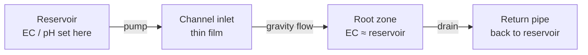
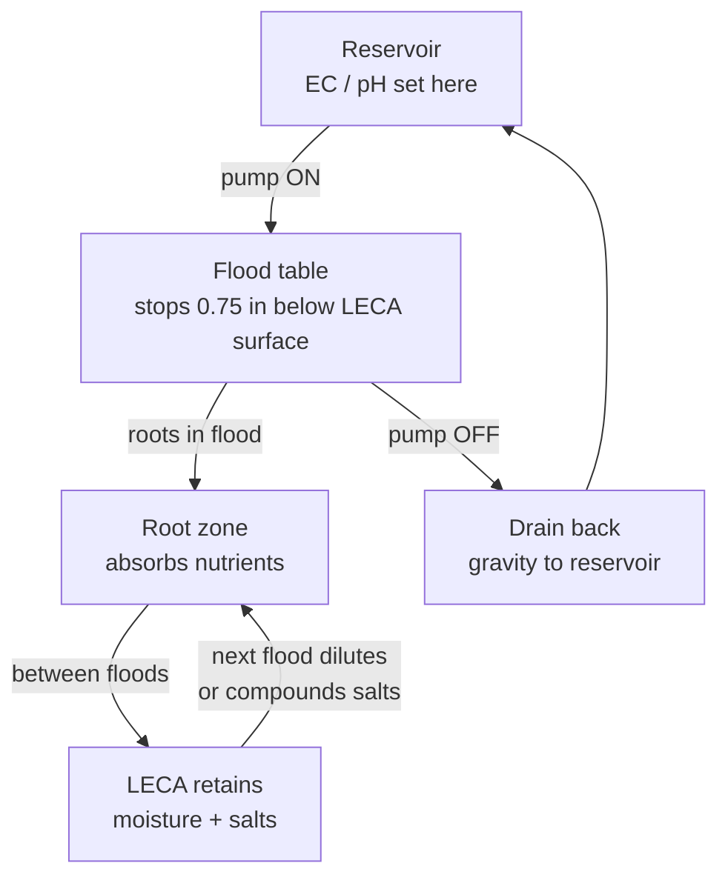

# Comparison Guide 01 — Nutrient Management: NFT vs Ebb & Flow
## How the two systems handle feeding, EC, pH, salt, and solution changes differently

---

## Table of Contents

- [Introduction](#introduction)
- [1. How Each System Delivers Nutrients](#1-how-each-system-delivers-nutrients)
  - [NFT: Thin Continuous Film](#nft-thin-continuous-film)
  - [Ebb & Flow: Flood-Drain Cycles](#ebb-flow-flood-drain-cycles)
- [2. EC Management](#2-ec-management)
  - [Target Ranges Side-by-Side](#target-ranges-side-by-side)
  - [The Media EC Problem (E&F Only)](#the-media-ec-problem-ef-only)
  - [How to Test Correctly in Each System](#how-to-test-correctly-in-each-system)
- [3. pH Management](#3-ph-management)
  - [Drift Patterns and Causes](#drift-patterns-and-causes)
  - [Buffering Behaviour](#buffering-behaviour)
  - [Correction Frequency](#correction-frequency)
- [4. Salt Accumulation](#4-salt-accumulation)
  - [Why E&F Accumulates Salts Faster](#why-ef-accumulates-salts-faster)
  - [The Monthly Media Flush Protocol (E&F)](#the-monthly-media-flush-protocol-ef)
  - [NFT: No Media, No Flush](#nft-no-media-no-flush)
- [5. Nutrient Solution Changes](#5-nutrient-solution-changes)
  - [Reservoir Volume and Change Frequency](#reservoir-volume-and-change-frequency)
  - [Top-Up vs Full Change](#top-up-vs-full-change)
  - [Disposing of Old Solution](#disposing-of-old-solution)
- [6. Nutrient Recipes: Are They Interchangeable?](#6-nutrient-recipes-are-they-interchangeable)
  - [Masterblend in Both Systems](#masterblend-in-both-systems)
  - [Calcium and Magnesium Needs](#calcium-and-magnesium-needs)
  - [Adjusting for Fruiting Crops (E&F)](#adjusting-for-fruiting-crops-ef)
- [7. Deficiency and Toxicity Patterns](#7-deficiency-and-toxicity-patterns)
  - [Common NFT Deficiency Patterns](#common-nft-deficiency-patterns)
  - [Common E&F Deficiency Patterns](#common-ef-deficiency-patterns)
  - [Why the Same Symptom Can Mean Different Things](#why-the-same-symptom-can-mean-different-things)
- [8. Monitoring Regimen Comparison](#8-monitoring-regimen-comparison)
- [9. Quick-Reference Decision Table](#9-quick-reference-decision-table)

---

## Introduction

Both NFT and Ebb & Flow use the same nutrient chemistry — the 17 essential elements dissolved in water — but they interact with those nutrients in fundamentally different ways. In NFT, roots sit directly in flowing solution; there is no media to absorb, buffer, or accumulate minerals. In Ebb & Flow, every litre of nutrient solution that floods the table and drains back leaves a residue in the LECA. That residue is cumulative.

This guide compares how you manage nutrients in practice across both systems: what you measure, how often, what drifts, what accumulates, and where the failure modes differ.

[↑ Back to TOC](#table-of-contents)

---

## 1. How Each System Delivers Nutrients

### NFT: Thin Continuous Film

Both NFT pumps run 24 hours a day. There is no overnight off-cycle. A film about 1/16–1/8 in (2–3 mm) deep flows along the bottom of each channel. Roots hang through the film, and the rest of the root mass hangs in moist air, which is where most of the oxygen uptake happens. If a pump stops in warm weather, roots dry in 15–30 minutes.

This design uses two NFT reservoirs. The greens tank (20 US gal / 76 L) feeds CH1–CH3 at EC 0.8–1.8 mS/cm. The fruiting tank (10 US gal / 38 L) feeds CH4 only, so tomato and pepper EC targets never land on the lettuce.

Key delivery characteristics:
- **Contact is constant** — roots touch solution at all times
- **Solution moves fast** — 0.26–0.53 US gpm (1–2 L/min) per channel
- **No media reservoir** — net pots hold a little clay pebble, but the root zone is not a flood bed. What the plant gets is what is in its reservoir
- **Root zone EC = that loop’s reservoir EC** — greens and fruiting are measured separately

Because there is no lag between reservoir and root zone, NFT responds quickly to nutrient changes — both beneficial corrections and mistakes.

### Ebb & Flow: Flood-Drain Cycles

In Ebb and Flow, the pump floods each 4 ft × 2 ft (1.22 m × 0.61 m) table until the overflow standpipe stops the water about 3/4 in (2 cm) below the top of the LECA. The flood holds 15–30 minutes, then the pump stops and the table drains by gravity. Vegetative crops get 3 floods a day. Fruiting crops get 4. Four is the ceiling. A fifth flood keeps the root zone too wet.

Each table holds 25 US gal (95 L) of LECA at a 5 in (13 cm) depth. After drain-back, that LECA still holds enough moisture for 8–24 hours. It is not a 20–25 L bed, and the flood is not a 3–5 cm deep pool on top of the media.

Key delivery characteristics:
- **Contact is intermittent** — roots get a full soak only during the flood
- **Media acts as a sponge** — as water leaves between floods, salts left in the LECA become more concentrated
- **Media EC is not reservoir EC** — that is the central Ebb and Flow measurement problem (Section 2)

[↑ Back to TOC](#table-of-contents)

---

## 2. EC Management

### Target Ranges Side-by-Side

| Stage | NFT greens tank (mS/cm) | NFT CH4 fruiting tank (mS/cm) | Ebb and Flow reservoir (mS/cm) |
|---|---|---|---|
| Seedling / transplant | 0.8–1.2 | 1.0–1.4 | 0.8–1.2 |
| Vegetative leafy | 1.0–1.6 | — | 1.2–1.8 |
| Tomato or pepper fruiting | Do not use this tank | Tomato 2.5–3.5; pepper 2.0–3.0 | Tomato 2.5–3.5; pepper 2.0–3.0 |
| Lettuce ceiling | 1.8 | Not in this tank | 1.8 on Table 3 |

CH4 has its own 10 US gal (38 L) reservoir. Do not average a tomato target and a lettuce target into one NFT number.

Media EC in Ebb and Flow runs higher than the reservoir. Flush when the gap exceeds **0.5 mS/cm**. Treat **+1.0 mS/cm** as urgent. A gap of 0.5–1.0 is not “fine.” Keep media EC from climbing past about 3.0 mS/cm in vegetative growth or 3.5 mS/cm in fruiting, where lockout starts.

NFT needs one reading per reservoir (two reservoirs). Ebb and Flow needs the reservoir reading and a media reading.

### The Media EC Problem (E&F Only)

Between floods, the LECA surface area is large relative to the volume of solution retained. As the plant transpires and water evaporates from the media surface, the remaining moisture becomes increasingly concentrated with the mineral salts that didn't evaporate.

This effect compounds with every cycle:

1. Flood at reservoir EC 1.6 — media wets to ~1.6
2. Plant transpires, water evaporates — media EC rises to ~2.0
3. Next flood at 1.6 — media partially dilutes, settles at ~1.9
4. Further transpiration — media EC rises to ~2.4
5. Over days without correction — continues to rise

Hot weather, high VPD, and large fruiting plants with high transpiration rates all accelerate this drift. A media EC of 3.5+ can cause wilting even when the reservoir EC looks perfectly correct.

**Prevention**:
- Run reservoir EC at the lower end of target ranges, especially in summer
- Monitor media EC weekly with a probe pushed 2 in (5 cm) deep into the LECA
- Flush when media EC is **+0.5 mS/cm** or more above reservoir EC. Treat **+1.0 mS/cm** as urgent (see Section 4)

### How to Test Correctly in Each System

**NFT:**
1. Take reservoir sample (50–100 mL from mid-depth, away from inlet/outlet)
2. Rinse meter probe with RO or distilled water before use
3. Read EC and pH
4. Done — one test, one value

**E&F:**
1. Take reservoir sample as above
2. Take media sample: push probe 2 in (5 cm) into LECA in the centre of the table, in the root zone (not at the edge)
3. Alternatively, collect runoff from the table's drain port at the end of a flood cycle
4. Compare reservoir EC vs media EC
5. Flush at **+0.5 mS/cm**. Treat **+1.0 mS/cm** as urgent — flush the same day

[↑ Back to TOC](#table-of-contents)

---

## 3. pH Management

### Drift Patterns and Causes

pH drift is a feature of all recirculating hydroponic systems, but the direction and speed differ between NFT and E&F.

**NFT pH drift:**
- Typically drifts **upward** (alkaline) as plants uptake more cations (NH₄⁺, K⁺, Ca²⁺, Mg²⁺) than anions, leaving excess OH⁻ in solution
- Can also drift upward if CO₂ is being degassed from the reservoir (especially in warm, sunny weather with exposed reservoir surface)
- Rate: typically 0.1–0.3 pH units per day in a healthy, actively growing system
- With leafy crops at peak growth, upward drift of 0.4–0.5/day is possible

**E&F pH drift:**
- Also typically upward, but the media buffer slows the apparent rate
- LECA is pH-neutral after pre-soaking and has minimal buffering; rockwool and coco coir can introduce initial pH shifts in the first week
- Drift in the reservoir may appear slower than NFT because not all solution is in the reservoir — some is retained in the media
- After a flush (when media solution returns to reservoir), you may see a pH spike or drop depending on what had accumulated in the media

### Buffering Behaviour

In NFT, each reservoir is the buffer for its own loop. The greens tank is **20 US gal (76 L)**; the fruiting tank is **10 US gal (38 L)**. A plant-driven pH shift in one loop does not dilute into the other. Correct the tank that drifted.

In E&F, roughly 15–20% of total solution volume is retained in the media at any time. When you correct the reservoir pH, the media retains its old pH. The full correction only propagates through the entire system after 2–3 flood cycles. This means:

- Do not over-correct expecting immediate results — wait for the next 2–3 flood cycles
- If pH is 6.2 in the reservoir and you want 5.8, adding pH down for 5.8 may create a dip to 5.5 in the reservoir once the media slowly homogenises
- Make gradual corrections of 0.2–0.3 units; test again after 3–4 flood cycles

### Correction Frequency

| System | Check frequency | Correction method |
|---|---|---|
| NFT | Twice daily (morning and late afternoon) | Add pH up/down to reservoir, circulates immediately |
| E&F | Once daily (after morning flood cycle) | Add pH up/down to reservoir; full equilibration takes 2–3 flood cycles |

For both systems, the target pH range is **5.5–6.5**, with the sweet spot at **5.8–6.2** for most crops.

[↑ Back to TOC](#table-of-contents)

---

## 4. Salt Accumulation

### Why E&F Accumulates Salts Faster

Every evaporation cycle in E&F leaves behind dissolved minerals. The LECA particle surfaces are porous, giving a very high total surface area — roughly 200 m²/kg of media. This large surface area adsorbs minerals efficiently, which is excellent for short-term plant uptake but becomes a problem over time as adsorbed salts accumulate faster than flood cycles can wash them.

Contributing factors:
- **High temperatures** increase evaporation rate → more concentration per cycle
- **Long dry periods between floods** allow more concentration (this is why over-spacing flood cycles in summer is risky)
- **High-EC nutrient solution** — running at 2.4 when 1.8 would suffice accelerates accumulation
- **Mature media** — LECA that has been used for multiple seasons has higher starting mineral content

Visible signs of salt accumulation:
- White or pale orange crystalline crust on the surface of LECA (especially at the table edges)
- LECA turning progressively paler/more mineral-coated compared to freshly rinsed media
- Media EC consistently running 1.5+ mS/cm above reservoir EC

### The Monthly Media Flush Protocol (E&F)

This protocol should be run once per month during the growing season, and at the start and end of every season.

**Equipment needed:**
- RO or low-EC tap water (EC < 0.5)
- pH down (to bring flush water to pH 5.8–6.0)
- Measuring jugs
- EC/pH meter

**Procedure:**
1. Mix flush water to EC 0.3–0.5 and pH 5.8. Do not use plain RO water — the extreme low EC causes osmotic stress.
2. Disconnect or bypass the reservoir inlet so the flood pump pulls from a separate flush bucket.
3. Flood the table fully (to the overflow fitting level) with flush water.
4. Allow to sit for 10–15 minutes — this dissolves accumulated salt crystals back into solution.
5. Drain fully back to a waste bucket (do not return to the reservoir — this water is heavily contaminated with accumulated salts).
6. Flood again with fresh flush water.
7. Drain again to waste.
8. Flood a third time with standard nutrient solution at target EC.
9. Drain back to reservoir (this is your first normal feed cycle post-flush).
10. Check reservoir EC after the cycle — it will likely have risen 0.1–0.3 mS/cm from media bleed-off. Adjust if needed.

**Post-flush expectations:**
- Media EC should be within 0.3 mS/cm of reservoir EC the day after flushing
- Plants may show a brief uptake surge in the following 24–48 hours as they recover from the flush
- Some temporary wilting is normal during the flush itself (osmotic shock from low-EC water) — this resolves within hours

### NFT: No Media, No Flush

NFT has no growing media in the channels (only small net pot inserts at each planting site). There is no adsorptive surface area to accumulate salts between plants, no media flush protocol, and no media EC to monitor.

The only accumulation risk in NFT is:
- **Residue on channel walls** — this is cleaned between crop cycles with a 10% bleach solution or hydrogen peroxide soak, not a mineral flush
- **Reservoir mineral build-up** — after 3–4 weeks, the reservoir itself should be fully changed to reset the dissolved mineral profile (see Section 5)

This is one of the genuine operational simplicity advantages of NFT over E&F.

[↑ Back to TOC](#table-of-contents)

---

## 5. Nutrient Solution Changes

### Reservoir Volume and Change Frequency

| System | Typical reservoir volume | Recommended full change frequency |
|---|---|---|
| NFT greens tank | 20 US gal (76 L) | Every 7 days |
| NFT fruiting tank (CH4) | 10 US gal (38 L) | Every 5–7 days |
| Ebb and Flow | 45 US gal (170 L) recommended | Every 10–14 days, or after any media flush |

E&F uses a larger reservoir because solution is stored both in the reservoir and in the media (up to 15–20% of total volume is always in the LECA). The larger volume also helps buffer the media EC fluctuations described above.

The shorter change interval for E&F exists because:
1. Salt accumulation in media accelerates solution degradation faster
2. Flush events return contaminated (high-salt) water to the reservoir
3. Fruiting crops (tomatoes, cucumbers, courgettes) common in E&F consume nutrients unevenly, causing element imbalance faster than leafy crops

### Top-Up vs Full Change

For both systems, you should distinguish between:
- **Top-up**: adding fresh nutrient solution (at target EC) to replace volume lost to plant uptake and evaporation — done daily or as needed
- **Full change**: emptying the entire reservoir, cleaning it, and refilling with fresh solution — done on schedule or when the solution becomes unmanageable

**Top-up rule (both systems):**
- EC at or above target: add plain water, pH-adjusted to 5.8–6.2.
- EC below target: add nutrient stock, then recheck EC and pH.
Do not always top up at full-strength EC, and do not always top up with plain water.

**When a full change is due (either system):**
- EC has risen despite not adding nutrients (indicates element imbalance — certain minerals accumulating as plants preferentially take up others)
- pH correction is consuming more acid/alkali than usual (indicates buffering capacity is exhausted)
- Solution has been running for more than the scheduled interval
- Algae or biological contamination is visible
- After a pest or disease event (sterilise reservoir, tubing, and pump before refilling)

### Disposing of Old Solution

Old nutrient solution is a mild fertiliser. Options:
- **Garden irrigation**: dilute 1:3 with plain water and use on non-edible garden beds or lawns. Do not use on edible root vegetables.
- **Compost accelerant**: nutrient-rich liquid speeds decomposition in compost heaps
- **Drain to sewer**: legal in most jurisdictions for domestic-scale systems (check local rules). Flush the drain with water after.
- **Do not** pour undiluted old solution repeatedly onto the same garden patch — salt build-up will damage soil over time.

[↑ Back to TOC](#table-of-contents)

---

## 6. Nutrient Recipes: Are They Interchangeable?

### PPE and Storage

Wear **gloves**, **eye protection**, and a **dust mask** when handling dry salts, phosphoric acid (pH Down), or potassium hydroxide (pH Up). Store nutrient concentrates, acids, and pesticides in a **latched box**, away from children and pets. A garden that is good for children still locks the chemicals.

### Masterblend in Both Systems

The Masterblend 4-18-38 three-part formula works in both systems at the same base ratio. Per **1 US gal (3.8 L)**:

- Masterblend 4-18-38: **2.4 g (0.63 g/L)**
- Calcium nitrate: **2.4 g (0.63 g/L)**
- Epsom salt: **1.2 g (0.32 g/L)**

That is the usual “2.4 grams per gallon” recipe. It is not 2.4 grams per litre. Per litre, that dose is about a four-times overdose. In typical tap water this base lands near EC 1.4–1.6 mS/cm, which suits vegetative greens.

**Adjustments for Ebb and Flow:**
- The same gram-per-gallon recipe is the starting point. Hold reservoir EC on the crop target, and flush the LECA when media EC runs more than 0.5 mS/cm above the reservoir.
- Fruiting tomatoes on Table 1 use the same fruiting band as the NFT CH4 tank: reservoir EC 2.5–3.5 mS/cm. They do not sit at 1.8–2.2 while the crop guide says 2.5–3.5.

### Calcium and Magnesium Needs

Calcium and magnesium requirements differ slightly:

**NFT:**
- Calcium needs are moderate; blossom end rot (calcium deficiency) is uncommon in NFT because continuous flow means a constant calcium supply even at high crop densities
- Magnesium deficiency (interveinal chlorosis on older leaves) is the more common deficiency

**E&F:**
- Calcium demands are higher in fruiting crops (tomatoes, cucumbers, peppers)
- The intermittent nature of flood-drain means that during dry periods between floods, calcium mobility through the plant slows — making blossom end rot more common, especially in summer when flood intervals may be longer than intended
- During fruit swell, you can raise calcium nitrate by about 1.1–1.5 g per US gal (0.3–0.4 g/L) above the base recipe if blossom end rot shows and pH is already in range

### Adjusting for Fruiting Crops (E&F)

E&F supports fruiting crops that NFT cannot sustain (cucumbers, courgettes, aubergine, large tomato varieties). These crops have specific nutrient requirements at different growth stages:

**Tomatoes — fruiting stage (Ebb and Flow Table 1, or NFT CH4):**
- Scale the whole recipe until reservoir EC is 2.5–3.5 mS/cm. Do not chase that EC by dumping 2.4 g into each litre.
- If you need a nudge at fruit swell: drop Masterblend slightly, add about 1.5 g potassium sulphate per US gal (0.4 g/L), and raise calcium nitrate by about 1.5 g per US gal (0.4 g/L). Recheck EC after every addition.

**Cucumbers — fruiting stage (Table 1, Ebb and Flow only):**
- Higher magnesium: Epsom can go to about 1.6 g per US gal (0.42 g/L) if older leaves yellow between the veins and EC is otherwise on target
- Reservoir EC 2.2–2.8 mS/cm in peak fruiting
- Sensitive to sodium. Use lower-EC water if tap EC is already high

**Courgettes (Table 2):**
- Reservoir EC 1.8–2.4 mS/cm
- From first fruit set, add about 1.1 g potassium sulphate per US gal (0.3 g/L) if fruit set is weak and EC is in range

[↑ Back to TOC](#table-of-contents)

---

## 7. Deficiency and Toxicity Patterns

### Common NFT Deficiency Patterns

| Deficiency | Visual symptom | Primary cause in NFT |
|---|---|---|
| Nitrogen | Uniform yellowing, oldest leaves first | EC too low; solution too old; high temperatures increasing uptake |
| Iron | Interveinal chlorosis on young leaves (yellow between green veins) | pH above 6.5 locks out iron; iron precipitates at high pH |
| Magnesium | Interveinal chlorosis on older leaves | Low magnesium in recipe; pH outside range; calcium antagonism |
| Calcium | Tip burn on lettuce; blossom end rot on tomato (rare in NFT) | pH below 5.5; low transpiration; high ammonium competing with calcium |
| Phosphorus | Purple/red colouring on undersides of leaves and stems | pH below 5.5; cold root zone; solution too old |

**NFT-specific note:** Iron deficiency is the most common micronutrient problem in NFT because the solution pH can creep up quickly (as described in Section 3). Iron becomes nearly insoluble above pH 6.8. A pH spike to 7.0+ even for a few days can trigger iron chlorosis.

### Common E&F Deficiency Patterns

| Deficiency | Visual symptom | Primary cause in E&F |
|---|---|---|
| Calcium | Blossom end rot (dark, sunken patch on fruit base); tip burn | Long dry periods between floods; high media EC reducing calcium uptake |
| Magnesium | Interveinal chlorosis on older leaves | Salt accumulation in media competing with magnesium uptake |
| Potassium | Brown leaf edges (scorch); poor fruit set | High-sodium water source; old solution with depleted potassium |
| Nitrogen | Uniform pale/yellowing | Solution too old; media EC high but nutrient profile depleted |
| Iron | Young leaf chlorosis | pH drift in media (may not match reservoir pH) |

**E&F-specific note:** Calcium is the most common deficiency in E&F. This is because calcium moves with the transpiration stream — during the period between floods when no water is moving, calcium transport slows. In summer heat with high VPD, the plant may transpire faster than calcium can be delivered even when the reservoir EC and calcium level are correct. Raise floods from 3× to the **4× daily ceiling**, add 40% shade when afternoons hold above 85°F (29°C), and check media EC. Do not add a fifth flood.

### Why the Same Symptom Can Mean Different Things

**Brown leaf tips / tip burn:**
- **In NFT (lettuce):** Usually calcium deficiency from pH creep; check pH first
- **In E&F (lettuce):** Usually calcium deficiency from under-flooding or high media EC; check flood frequency and media EC first

**Interveinal chlorosis on young leaves:**
- **In NFT:** Almost always iron; check pH (is it above 6.5?)
- **In E&F:** Could be iron (pH), but also check if media EC is very high (multi-element lockout)

**Overall stunting and dark green, thick leaves:**
- **In both systems:** Phosphorus excess or pH below 5.2; check pH immediately

[↑ Back to TOC](#table-of-contents)

---

## 8. Monitoring Regimen Comparison

| Task | NFT frequency | E&F frequency | Notes |
|---|---|---|---|
| Reservoir EC check | Twice daily | Once daily | E&F reservoir changes more slowly |
| Reservoir pH check | Twice daily | Once daily | E&F reservoir changes more slowly |
| Media EC check (E&F only) | — | Weekly | Push probe into LECA root zone |
| Nutrient top-up | As needed (daily in summer) | As needed (daily in summer) | Top up at target EC |
| pH correction | As needed | As needed, gradual | E&F: wait 2–3 flood cycles for equilibration |
| Full solution change | Greens tank every 7 days; CH4 tank every 5–7 days | Every 10–14 days | Ebb and Flow: also after a media flush returns salty water to the tank |
| Media flush (E&F only) | — | Monthly | See Section 4 for protocol |
| Reservoir clean | With each full change | With each full change | Scrub with dilute hydrogen peroxide |
| Channel/table clean | Between crop cycles | Between crop cycles | NFT: bleach soak; E&F: bleach + LECA rinse |

[↑ Back to TOC](#table-of-contents)

---

## 9. Quick-Reference Decision Table

| Scenario | NFT action | E&F action |
|---|---|---|
| EC too high in reservoir | Remove some solution, top up with RO/plain water | Same; also check media EC — may need flush |
| EC too low in reservoir | Add concentrated nutrient mix | Same; media will also be low — do not over-correct |
| pH too high (>6.5) | Add pH down directly to reservoir | Add pH down to reservoir; wait 3 flood cycles to equilibrate |
| pH too low (<5.5) | Add pH up directly to reservoir | Add pH up to reservoir; wait 3 flood cycles |
| Media EC ≥0.5 mS/cm above reservoir (E&F only) | N/A | Flush. At +1.0 mS/cm, flush the same day |
| Blossom end rot on fruit | Rare — check pH and calcium | Increase flood frequency; check media EC; increase calcium nitrate |
| Iron chlorosis on young leaves | Check pH (is it above 6.5?) | Check reservoir pH and media pH (media pH may differ from reservoir) |
| Salt crust on media surface (E&F only) | N/A | Flush is overdue; run monthly flush protocol |
| Solution change overdue | Full reservoir drain and refill | Full reservoir drain and refill; follow with media flush |

---

*Next: [Comparison Guide 02 — Crops: NFT vs Ebb & Flow](02-crops.md) — which system suits which plants, yield comparisons, and crop scheduling differences*

[↑ Back to TOC](#table-of-contents)

---

<!-- copyright -->
*Copyright (c) 2026 UncleJS. Licensed under [CC BY-NC-SA 4.0](https://creativecommons.org/licenses/by-nc-sa/4.0/) — free to share and adapt for non-commercial purposes with attribution and ShareAlike.*
