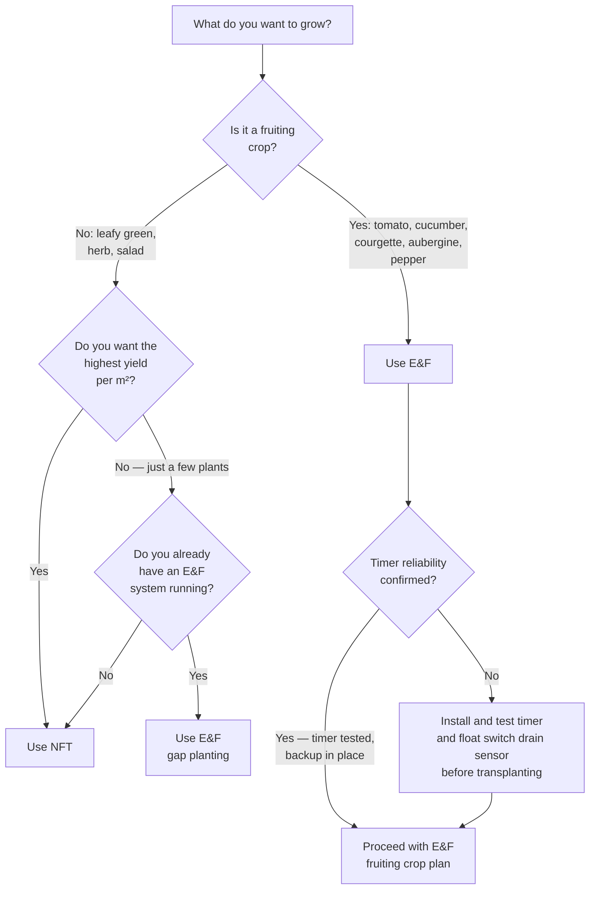

# Comparison Guide 02 — Crops: NFT vs Ebb & Flow
## Which plants thrive in each system, why, and how to plan a mixed-system grow

---

## Table of Contents

- [Introduction](#introduction)
- [1. Why System Design Determines Crop Choice](#1-why-system-design-determines-crop-choice)
  - [Root Mass and Support](#root-mass-and-support)
  - [Water Stress Tolerance](#water-stress-tolerance)
  - [Nutrient Delivery Rhythm](#nutrient-delivery-rhythm)
- [2. NFT Crop Library](#2-nft-crop-library)
  - [Excellent in NFT](#excellent-in-nft)
  - [Marginal in NFT](#marginal-in-nft)
  - [Not Suitable for NFT](#not-suitable-for-nft)
- [3. Ebb & Flow Crop Library](#3-ebb--flow-crop-library)
  - [Excellent in E&F](#excellent-in-ef)
  - [Marginal in E&F](#marginal-in-ef)
  - [Not Suitable for E&F](#not-suitable-for-ef)
- [4. Side-by-Side Crop Comparison Table](#4-side-by-side-crop-comparison-table)
- [5. Yield Estimates and Cycle Times](#5-yield-estimates-and-cycle-times)
  - [Leafy Crops](#leafy-crops)
  - [Herbs](#herbs)
  - [Fruiting Crops (E&F)](#fruiting-crops-ef)
- [6. Succession Planning](#6-succession-planning)
  - [NFT Succession (12-month calendar)](#nft-succession-12-month-calendar)
  - [E&F Succession (12-month calendar)](#ef-succession-12-month-calendar)
  - [Mixed-System Succession Strategy](#mixed-system-succession-strategy)
- [7. Spacing and Plant Density](#7-spacing-and-plant-density)
- [8. Transplanting and Root Transition](#8-transplanting-and-root-transition)
  - [Starting Seeds for NFT](#starting-seeds-for-nft)
  - [Starting Seeds for E&F](#starting-seeds-for-ef)
  - [Moving Plants Between Systems](#moving-plants-between-systems)
- [9. Crop-Specific Problem Hotspots](#9-crop-specific-problem-hotspots)
- [10. Decision Guide: Which System for Which Crop?](#10-decision-guide-which-system-for-which-crop)

---

[↑ Back to TOC](#table-of-contents)

## Introduction

Crop choice is one of the starkest differences between NFT and Ebb & Flow. Both systems can grow most leafy greens, herbs, and fruiting crops to some degree, but each excels in a different category. NFT is the superior tool for high-turnover leafy crops and compact herbs. E&F opens the door to fruiting crops — cucumbers, courgettes, aubergine, and large-root tomatoes — that NFT physically cannot support.

This guide covers which crops belong in which system, why, how to plan year-round production across both, and how to avoid the most common crop selection mistakes.

---

[↑ Back to TOC](#table-of-contents)

## 1. Why System Design Determines Crop Choice

### Root Mass and Support

NFT channels are typically 100–125 mm diameter PVC pipes with 50 mm net pot holes every 20–30 cm. The net pot is suspended in the hole; the root mass hangs through the pot into the channel below. This arrangement physically limits:

- **Maximum root mass**: large root balls (tomatoes, cucumbers) block flow in the channel, creating anaerobic zones and flooding upstream
- **Plant weight**: the net pot rim bears the plant's weight; heavy plants (>500 g canopy) can dislodge the pot or crack the channel
- **Plant height**: tall plants growing from a channel create leverage that pulls at the net pot mounting point; indeterminate tomatoes over 1 m tall require external support structures not present in standard NFT builds

Ebb & Flow tables address all three constraints. Plants grow in LECA filling the entire table volume (20–25 L per standard 60×90 cm table). Root systems spread freely through the media. Plant weight is supported by the media itself, not by a fitting. The table can accommodate external bamboo stakes, netting, and cages for tall indeterminate varieties.

### Water Stress Tolerance

NFT provides a continuous thin film of solution 24 hours a day (with only brief off periods). Plants almost never experience water stress. This suits crops that are highly intolerant of even brief dry periods:
- Lettuce (bolts rapidly under water stress)
- Spinach (bolts and turns bitter)
- Baby leaf crops (arugula, mustard, pak choi)
- Fast-growing herbs (basil, coriander)

E&F provides solution only during flood periods (typically 3–6 times per day). Between floods, the plant relies on moisture stored in the LECA. This creates a mild, regular cycle of slight stress and relief that benefits:
- Tomatoes (mild water stress cycles improve fruit sugar concentration)
- Cucumbers (regular dry periods reduce Pythium risk)
- Peppers (mild stress improves capsaicin production)
- Strawberries (mild stress concentration improves flavour)

However, if floods are missed — due to timer failure, power cut, or scheduling error — E&F plants experience genuine drought stress much faster than NFT plants. Fruiting crops in high summer with 4-hour flood intervals can show wilting within 1.5–2 hours of a missed cycle.

### Nutrient Delivery Rhythm

Leafy crops grow fast and need consistent, high-nitrogen nutrition throughout their short (4–8 week) cycle. The continuous delivery in NFT is ideal: roots see fresh solution at all times, nitrogen is never limiting, and the grower can adjust EC daily to match growth rate.

Fruiting crops need more complex nutrition over a longer cycle (8–20 weeks): high nitrogen during vegetative growth, reduced nitrogen and increased potassium and calcium from flower set through fruit swelling, and a final flush. The intermittent flood cycle in E&F allows the grower to change the nutrient profile on a schedule that decouples nicely from the plant's root uptake — change the reservoir, and the new profile gradually reaches the roots over the next 3–4 flood cycles.

---

[↑ Back to TOC](#table-of-contents)

## 2. NFT Crop Library

### Excellent in NFT

**Lettuce (all types)**
- Best crop for NFT; extremely fast cycle (4–6 weeks from transplant)
- Ideal channel spacing: 20–25 cm
- EC: 1.2–1.8 mS/cm; pH: 5.8–6.2
- One 6-channel system (6 × 1.2 m) can produce 24–30 heads per 6-week cycle
- Varieties: butterhead, romaine, little gem, oakleaf, batavia

**Spinach**
- 5–6 weeks; cooler temperatures preferred (15–20°C day)
- Sensitive to EC above 2.0 — keep at 1.4–1.8
- Harvest as baby leaf (cut-and-come-again) or full head

**Pak choi / bok choy**
- Fast (4–5 weeks); slightly warmer than spinach (18–24°C)
- One of the highest-yielding crops per unit area in NFT

**Basil**
- Thrives in NFT in warm weather (>20°C consistently)
- 30 cm spacing; tall plants may need light bamboo support
- EC: 1.6–2.0; pH: 5.8–6.2
- Warning: basil bolts quickly; succession plant every 2–3 weeks

**Coriander**
- Shorter window than basil; succession plant every 2 weeks
- Slow to establish if water temperature above 24°C

**Mint (in individual net pots)**
- Grows vigorously in NFT; keep in large net pots (80–100 mm) to contain roots
- Very long productive period; harvest top 1/3 every 2–3 weeks

**Chives**
- Multi-cut; very low maintenance; stays productive for months
- One of the most space-efficient herbs in NFT

**Kale (baby leaf)**
- 4–5 weeks cut-and-come-again harvest
- Poor as full-size plant in NFT (root mass too large after 8+ weeks)

**Arugula / rocket**
- Very fast (3–4 weeks); highest yield per week of any crop in a warm NFT system
- Cut-and-come-again gives 2–3 harvests per planting

### Marginal in NFT

**Cherry tomatoes (compact varieties only)**
- Possible in large-diameter channels (125 mm) with strong support frames
- Root mass often blocks channels after week 6; channel cleaning becomes frequent
- Recommend E&F instead unless NFT channel diameter is ≥160 mm
- Varieties: Tumbling Tom, Maskotka (bred for containers, smaller root mass)

**Strawberries**
- Work well in NFT for short season (6–10 weeks)
- Root system stays compact; everbearing varieties better than June-bearing
- Timing: produce best in spring and autumn; summer heat causes poor fruit set

**Dwarf peppers**
- Compact varieties in 80 mm net pots; limited root volume means lower yield
- Much better in E&F

**Watercress**
- Thrives in continuously flowing water — NFT is an ideal environment
- Keep EC very low (0.8–1.2); needs cool water (< 18°C ideally)
- Excellent flavour in cold-season NFT

### Not Suitable for NFT

| Crop | Reason |
|---|---|
| Indeterminate tomatoes (beef, vine) | Root mass blocks channels; plant weight too high for net pot mounting |
| Cucumbers | Large root ball; heavy fruiting body; must be supported; E&F is strongly preferred |
| Courgettes / zucchini | Enormous root system; massive leaf canopy; E&F only |
| Aubergine / eggplant | Deep tap root; needs media support; E&F only |
| Root vegetables (carrots, radish, beetroot) | Grows into the channel; incompatible with flowing film |
| Potatoes | Tuber growth incompatible with channel; E&F Dutch bucket is the correct system |
| Beans (climbing) | Structural load too high for channel mounting; roots fill channel rapidly |
| Brassicas (full head — cabbage, broccoli) | 10–14 week cycle with large root mass; channel blocking from week 6 |

---

[↑ Back to TOC](#table-of-contents)

## 3. Ebb & Flow Crop Library

### Excellent in E&F

**Tomatoes (all types)**
- E&F is the premier outdoor hydroponic system for tomatoes
- Indeterminate varieties require vertical string or bamboo support (install before planting)
- Flood frequency: 3× daily vegetative → 5× daily fruiting (hot weather)
- EC: 1.8–2.2 mS/cm reservoir; media EC 2.2–2.8 mS/cm acceptable during fruiting
- Varieties: Gardener's Delight, Sungold, Moneymaker, Alicante, Shirley

**Cucumbers**
- Very high yield in E&F; one plant per 60×90 cm table is typical
- Aggressive root system uses all available media volume
- 5× daily flood at peak summer; never skip a cycle — wilting in 1.5 hours in 28°C+ heat
- EC: 2.0–2.4 mS/cm; high magnesium requirement
- Train vertically; prune to a single leader; remove side shoots below knee height

**Courgettes / zucchini**
- One plant per table maximum; enormous canopy (1.5 m diameter)
- High flood frequency (5×/day) during fruiting
- EC: 1.6–2.0 mS/cm — lower than tomatoes; sensitive to salt stress
- Harvest fruit when 15–20 cm long; if allowed to mature, reduces further fruit set dramatically

**Aubergine / eggplant**
- 12–16 week season; warm season only (>18°C night temperature)
- Medium flood frequency (3–4×/day)
- EC: 2.0–2.4 mS/cm; moderate calcium requirement
- Prune to 2–3 main stems; thin fruit clusters to 4–6 per plant

**Peppers (all types)**
- Excellent in E&F; longer productive period than in NFT
- EC: 1.8–2.2 mS/cm; slightly stress-tolerant (can cope with missed flood)
- Moderate flood frequency (3×/day); increase to 4× at peak summer
- Harvest: sweet peppers improve if left to colour; chilli varieties most flavourful when fully ripe

**Strawberries**
- Better in E&F than NFT for summer production due to larger root volume
- Runners can be trained along media surface
- EC: 1.2–1.6 mS/cm; stress-cycle sensitive (good mild stress between floods improves fruit sweetness)

**Lettuce and leafy greens**
- Work well in E&F but slower and lower yield per area than NFT
- Flood frequency can be reduced (2–3×/day) for leafy crops to reduce moisture and Pythium risk
- Better suited to NFT if the grower only wants leafy crops

### Marginal in E&F

**Basil**
- Works, but slower establishment than NFT
- High moisture in LECA media increases Pythium and fungus gnat risk for basil
- Reduce flood frequency to 2×/day for basil; allow media to dry more between cycles

**Spinach**
- Produces well but the table footprint is large relative to yield
- Better suited to NFT for high-density baby leaf production

**Root herbs (oregano, thyme, sage)**
- Mediterranean herbs evolved in dry conditions; prefer well-drained media between waterings
- In E&F, use 3-4 cm media depth maximum; very long dry interval between floods (1–2×/day)
- High Pythium risk if overwatered

### Not Suitable for E&F

| Crop | Reason |
|---|---|
| Root vegetables (carrots, beetroot) | Flood-drain cycle incompatible with taproot/tuber formation in LECA; Dutch bucket or soil is correct |
| Potatoes | Tuber formation requires distinct wet/dry cycles in specific media; E&F tables are not optimised for this |
| Watercress | Requires continuous flowing water; standing flood and drain is not suitable |
| Very slow brassicas (cabbage, swede) | Long season ties up large table area; poor ROI |

---

[↑ Back to TOC](#table-of-contents)

## 4. Side-by-Side Crop Comparison Table

| Crop | NFT suitability | E&F suitability | Recommended system | Key reason |
|---|---|---|---|---|
| Butterhead lettuce | ★★★★★ | ★★★☆☆ | NFT | Speed, density, continuous delivery |
| Romaine lettuce | ★★★★★ | ★★★☆☆ | NFT | As above |
| Spinach | ★★★★★ | ★★★☆☆ | NFT | High density, cut-and-come-again |
| Pak choi | ★★★★★ | ★★★★☆ | NFT (marginal preference) | Speed in NFT; but E&F works fine |
| Arugula / rocket | ★★★★★ | ★★★☆☆ | NFT | Fastest crop; best in continuous flow |
| Kale (baby) | ★★★★☆ | ★★★☆☆ | NFT | Cut-and-come-again density |
| Basil | ★★★★★ | ★★★☆☆ | NFT | Speed; lower Pythium risk in dry channels |
| Coriander | ★★★★☆ | ★★★☆☆ | NFT | Short succession cycle suits NFT |
| Mint | ★★★★☆ | ★★★★☆ | Either | Both work; control roots carefully in either |
| Chives | ★★★★★ | ★★★★☆ | NFT | High turnover; minimal space per plant |
| Watercress | ★★★★★ | ★☆☆☆☆ | NFT | Needs continuous flow |
| Strawberry | ★★★☆☆ | ★★★★☆ | E&F | Better root volume; mild stress cycle suits fruit |
| Cherry tomato | ★★☆☆☆ | ★★★★★ | E&F | Root mass incompatible with NFT channels |
| Beef / vine tomato | ★☆☆☆☆ | ★★★★★ | E&F | Only practical system for full-size tomatoes |
| Cucumber | ★☆☆☆☆ | ★★★★★ | E&F | Root mass, plant weight, support needs |
| Courgette | ★☆☆☆☆ | ★★★★★ | E&F | Only practical system |
| Aubergine | ★☆☆☆☆ | ★★★★★ | E&F | Only practical system |
| Sweet pepper | ★★☆☆☆ | ★★★★★ | E&F | Root volume and cycle length suit E&F |
| Chilli pepper | ★★★☆☆ | ★★★★☆ | E&F (mild preference) | Both work; E&F yields more per plant |

---

[↑ Back to TOC](#table-of-contents)

## 5. Yield Estimates and Cycle Times

### Leafy Crops

The following estimates are for a 3-zone outdoor system in a temperate climate (UK/northern Europe), assuming good summer light (DLI 15–25 mol/m²/day) and temperature 18–25°C.

| Crop | System | Days transplant→harvest | Yield per plant | Plants per 1.2 m channel / per table |
|---|---|---|---|---|
| Butterhead lettuce | NFT | 28–35 | 200–350 g | 5–6 per channel |
| Romaine lettuce | NFT | 35–45 | 300–450 g | 4–5 per channel |
| Spinach | NFT | 28–35 | 150–250 g | 6 per channel |
| Pak choi | NFT | 25–35 | 200–400 g | 5 per channel |
| Arugula (cut) | NFT | 21–28 | 100–200 g/cut × 3 | 8 per channel |
| Kale (baby, cut) | NFT | 28–35 | 150–300 g/cut × 2 | 6 per channel |
| Butterhead lettuce | E&F | 35–45 | 200–350 g | 6–8 per 60×90 cm table |
| Pak choi | E&F | 30–40 | 200–400 g | 6 per table |

**NFT vs E&F for leafy crops**: NFT channels use ~0.15 m² floor space per 1.2 m length; a 6-channel system gives 0.9 m² planting area. A single E&F table (60×90 cm) gives 0.54 m² but yields slightly fewer plants per m² for most leafy crops due to wider spacing. **NFT produces more leafy crop per unit area**.

### Herbs

| Herb | System | Days to first harvest | Harvest frequency | Notes |
|---|---|---|---|---|
| Basil | NFT | 21–28 | Every 14–21 days | Cut above 2nd node pair; do not let flower |
| Coriander | NFT | 21–28 | Cut-and-come-again | Short-lived; succession plant every 3 weeks |
| Mint | NFT or E&F | 28–35 | Every 21–28 days | Harvest top 30–40%; allow recovery |
| Chives | NFT | 28–35 | Every 21–28 days | Cut to 3 cm above base; regrows 3–5 times |
| Parsley | E&F | 35–42 | Every 14–21 days | Deep root; better in E&F than NFT |
| Thyme | E&F (dry) | 42–56 | Every 28–35 days | Very dry between floods; harvest before flowering |
| Oregano | E&F (dry) | 42–56 | Every 28–35 days | As thyme |

### Fruiting Crops (E&F)

| Crop | Season start (transplant) | First harvest | End of season | Total yield per plant |
|---|---|---|---|---|
| Cherry tomato | Late April – May | 10–12 weeks after transplant | October (frost) | 2–4 kg |
| Beef tomato | Late April – May | 12–14 weeks | October | 3–6 kg |
| Cucumber | Late May | 8–10 weeks | September | 8–15 fruits |
| Courgette | Late May | 6–8 weeks | September | 15–30 fruits |
| Aubergine | Late April – May | 12–14 weeks | September | 6–10 fruits |
| Sweet pepper | Late April | 14–16 weeks | October | 20–40 fruits |
| Chilli | Late April | 12–14 weeks | October | 50–200 pods (variety-dependent) |

---

[↑ Back to TOC](#table-of-contents)

## 6. Succession Planning

### NFT Succession (12-month calendar)

NFT's short crop cycles allow continuous year-round production of leafy crops, weather and light permitting. The table below assumes an outdoor NFT system in a temperate climate (UK/northern Europe).

| Month | Zone A (fastest) | Zone B (medium) | Zone C (slow / perennial) |
|---|---|---|---|
| January | — (dormant or indoor seedlings) | — | Mint, chives (dormant) |
| February | Seedlings under lights | Seedlings under lights | Mint revival |
| March | Spinach, pak choi (cold-hardy) | Lettuce starts | Chives, mint |
| April | Lettuce #1 (sow early April) | Spinach, arugula | Basil seedlings started indoors |
| May | Lettuce #2; arugula | Basil transplant (after last frost) | Chives, mint |
| June | Lettuce #3; pak choi | Basil (peak); coriander #1 | Chives, mint |
| July | Arugula; lettuce #4 | Coriander #2; basil succession | Chives, mint |
| August | Lettuce #5; spinach (heat-tolerant) | Basil #3; pak choi | Chives, mint |
| September | Lettuce #6 | Spinach (return); arugula | Chives |
| October | Spinach, pak choi | Kale (baby leaf) | Chives (slow down) |
| November | Pak choi (cold-tolerant) | Kale | — (prep for winter) |
| December | — (system clean; winter break) | — | — |

**Succession rule for NFT leafy crops**: Sow the next batch in rockwool cubes on the day you harvest the current batch. With 28–35 day cycles, stagger sowings every 14 days to maintain continuous harvest.

### E&F Succession (12-month calendar)

E&F succession is dominated by the fruiting crop season. Tables occupied by tomatoes, cucumbers, and courgettes for 16–22 weeks are unavailable for other crops during that time.

| Month | Zone A (table 1) | Zone B (table 2) | Zone C (table 3) |
|---|---|---|---|
| January | — | — | — |
| February | Seedlings started indoors | Seedlings started indoors | — |
| March | Lettuce / spinach (early E&F) | Lettuce / spinach | Peppers started in propagator |
| April | Tomato transplant (late April) | Cucumber transplant (late April) | Lettuce; pepper/chilli established |
| May | Tomatoes (vegetative) | Cucumbers (vegetative) | Courgette transplant |
| June–August | Tomatoes (fruiting) | Cucumbers (fruiting, high yield) | Courgettes (fruiting); pepper harvest |
| September | Tomatoes (late season) | Cucumber end; lettuce in gap | Courgette end |
| October | Tomato clear (frost) | Lettuce / spinach | Leafy greens |
| November | Table clean; prep for winter | Table clean | Table clean |
| December | — | — | — |

**Note:** Cucumbers are typically the highest-yield crop per unit time in E&F. If table space is limited, prioritise cucumbers over courgettes.

### Mixed-System Succession Strategy

Running NFT and E&F in parallel gives you year-round production of leafy crops AND a high-yield fruiting season. The two systems do not compete for resources (they share only water infrastructure and monitoring time).

**Optimal mixed-system allocation:**
- **NFT**: all leafy crops and herbs year-round
- **E&F**: fruiting crops May–October; leafy overflow crops in shoulder seasons (March–April and October–November)

This gives 52 weeks of lettuce, herbs, and spinach from NFT, plus 20+ weeks of high-value tomatoes, cucumbers, and courgettes from E&F. This is the highest-productivity configuration of the two-system setup described in this repository.

---

[↑ Back to TOC](#table-of-contents)

## 7. Spacing and Plant Density

**NFT channel spacing:**

| Crop | Net pot size | Hole spacing |
|---|---|---|
| Lettuce (butterhead) | 50 mm | 20 cm |
| Lettuce (romaine) | 50 mm | 25 cm |
| Spinach | 50 mm | 15–20 cm |
| Pak choi | 50 mm | 20 cm |
| Arugula | 50 mm | 15 cm |
| Basil | 80 mm | 30 cm |
| Chives | 50 mm | 15 cm |
| Mint | 80–100 mm | 25 cm |
| Cherry tomato | 80 mm | 40–50 cm |

**E&F table spacing (per 60×90 cm table):**

| Crop | Plants per table | Notes |
|---|---|---|
| Tomato (indeterminate) | 1 | One plant fills the table root zone completely |
| Tomato (compact) | 2 | Two plants at 30 cm spacing along the long axis |
| Cucumber | 1 | One plant is enough; root fills table |
| Courgette | 1 | Canopy extends well beyond table edges |
| Aubergine | 1–2 | Two compact varieties at 30 cm spacing |
| Pepper / chilli | 2–3 | 20–25 cm spacing |
| Lettuce | 6–8 | 20 cm grid on media surface |
| Pak choi | 6 | 20 cm spacing |
| Herbs (mixed) | 4–6 | 20–25 cm spacing depending on variety |

---

[↑ Back to TOC](#table-of-contents)

## 8. Transplanting and Root Transition

### Starting Seeds for NFT

1. **Media**: use rockwool cubes (25×25 mm or 36×36 mm). Soak in pH 5.5 water for 30 minutes before sowing. Do not use soil plugs — soil particles shed into NFT channels and clog pumps.
2. **Germination**: sow 1–2 seeds per cube; cover with propagator lid to maintain humidity; keep at 20–22°C.
3. **Light**: seedlings need light from emergence; 16h photoperiod under fluorescent or LED if indoors.
4. **Transplant timing**: transplant to NFT channel when first true leaf is visible and roots are protruding 5–10 mm from the base of the cube. Typically 7–14 days after germination.
5. **Net pot installation**: place the rockwool cube inside the net pot; fill the space around it with clay pebbles; set into the channel hole so the bottom of the net pot sits 5–10 mm above the film surface (not submerged).

### Starting Seeds for E&F

1. **Media**: use rockwool cubes OR coco coir plugs. Coco coir is preferable for E&F because it transitions better into LECA (less osmotic shock at transplant).
2. **Germination**: as for NFT; same temperature and humidity requirements.
3. **Transplant timing**: for E&F, you can transplant slightly later — when the second true leaf is visible and roots are 1–2 cm out of the plug. A slightly more established plant handles the flood-drain transition better than a very young seedling.
4. **LECA bed preparation**: pre-soak LECA for 24 hours in pH 6.0 water, then drain. Fill the table to the required depth. Make a planting pocket in the LECA surface (3–5 cm deep) for each plug.
5. **Post-transplant**: run flood cycles 4–5× daily for the first week to help roots establish in the LECA; reduce to normal frequency after week 1.

### Moving Plants Between Systems

Moving an established plant from E&F to NFT (or vice versa) is generally not recommended because:
- NFT roots are long, fine, and unbranched (adapted to hang in a film); transplanting into LECA causes mechanical damage
- E&F roots are densely branched (adapted to explore media); transplanting into a net pot causes shock and root loss

If you need to transfer (e.g., system fault repair), handle as follows:
- Remove the plant with as much root intact as possible
- Rinse roots gently with pH-adjusted water to remove LECA/rockwool debris
- Replant quickly; run extra flood cycles (E&F) or confirm flow is established (NFT) before leaving unattended
- Expect a 3–7 day recovery period with slowed growth

---

[↑ Back to TOC](#table-of-contents)

## 9. Crop-Specific Problem Hotspots

| Crop | System | Most common problem | Prevention |
|---|---|---|---|
| Lettuce | NFT | Tip burn (calcium) | Check pH; increase flow rate; ensure good air circulation |
| Lettuce | E&F | Pythium (root rot) | Reduce flood frequency; ensure drain is complete |
| Basil | NFT | Bolting (premature flowering) | Succession plant every 2–3 weeks; pinch flowers immediately |
| Basil | E&F | Fungus gnats; Pythium | Reduce flood frequency; treat with Bacillus thuringiensis israelensis |
| Tomato | E&F | Blossom end rot | Increase flood frequency in heat; check calcium levels; check media EC |
| Tomato | E&F | Blossom drop | Temperature above 30°C or below 10°C at night; pollinate by hand (vibrate flowers) |
| Cucumber | E&F | Powdery mildew | Air circulation; remove crowded leaves; use potassium bicarbonate |
| Cucumber | E&F | Bitter fruit | Water stress (missed flood cycles); keep flood schedule consistent |
| Courgette | E&F | Blossom end rot (immature fruits) | Under-pollination is the most common cause — not nutrient deficiency; hand pollinate |
| Pepper | E&F | Slow fruit set | Temperature too low; night temperature must be >15°C for reliable fruit set |
| Strawberry | NFT/E&F | Poor fruit (small, tasteless) | Mild water stress is good; do not over-feed; reduce EC during fruiting |
| Spinach | NFT | Bolting | Heat; day length; grow in spring and autumn; avoid July/August unless shaded |
| Mint | NFT | Spreading roots blocking channels | Use large net pot (100 mm); check channel flow monthly; remove and divide annually |

---

[↑ Back to TOC](#table-of-contents)

## 10. Decision Guide: Which System for Which Crop?

**Summary decision rules:**
1. **Tomatoes, cucumbers, courgettes, aubergine, or peppers** → E&F always
2. **Lettuce, spinach, arugula, pak choi, basil, coriander, chives** → NFT for highest density and speed
3. **Strawberries** → E&F in summer; NFT acceptable for short shoulder-season runs
4. **Mint, parsley, thyme, oregano** → either system; Mediterranean herbs prefer drier intervals (E&F with low flood frequency)
5. **If you have both systems** → put all fruiting crops in E&F, all leafy crops and herbs in NFT; use E&F tables in spring and autumn for additional leafy crop overflow

---

[↑ Back to TOC](#table-of-contents)

*Next: [Comparison Guide 03 — Automation: NFT vs Ebb & Flow](03-automation.md) — how sensor requirements, failure modes, and automation priorities differ between the two systems*

---

<!-- copyright -->
*Copyright (c) 2026 UncleJS. Licensed under [CC BY-NC 4.0](https://creativecommons.org/licenses/by-nc/4.0/) — free to share and adapt for non-commercial purposes with attribution.*
