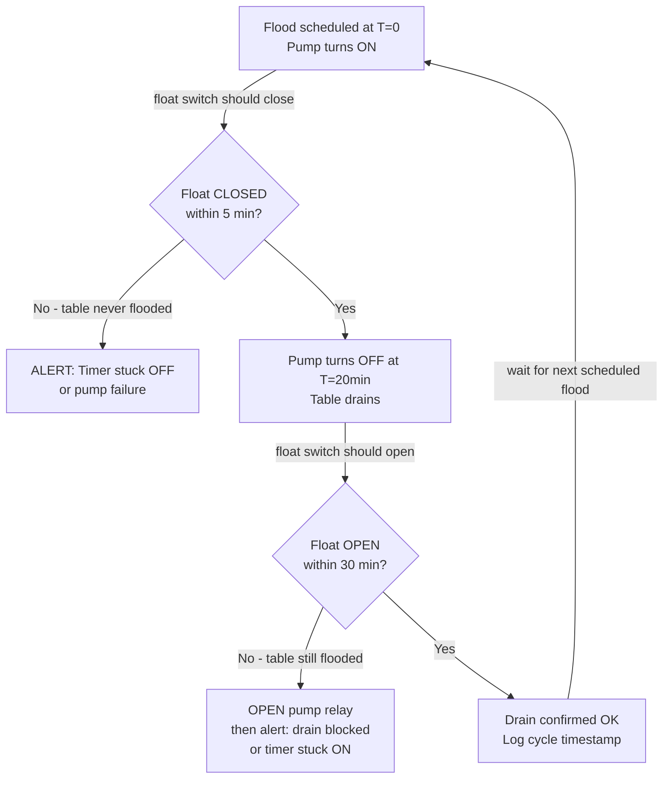
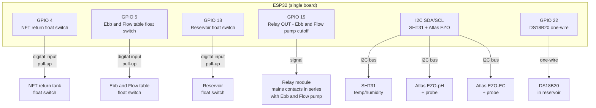
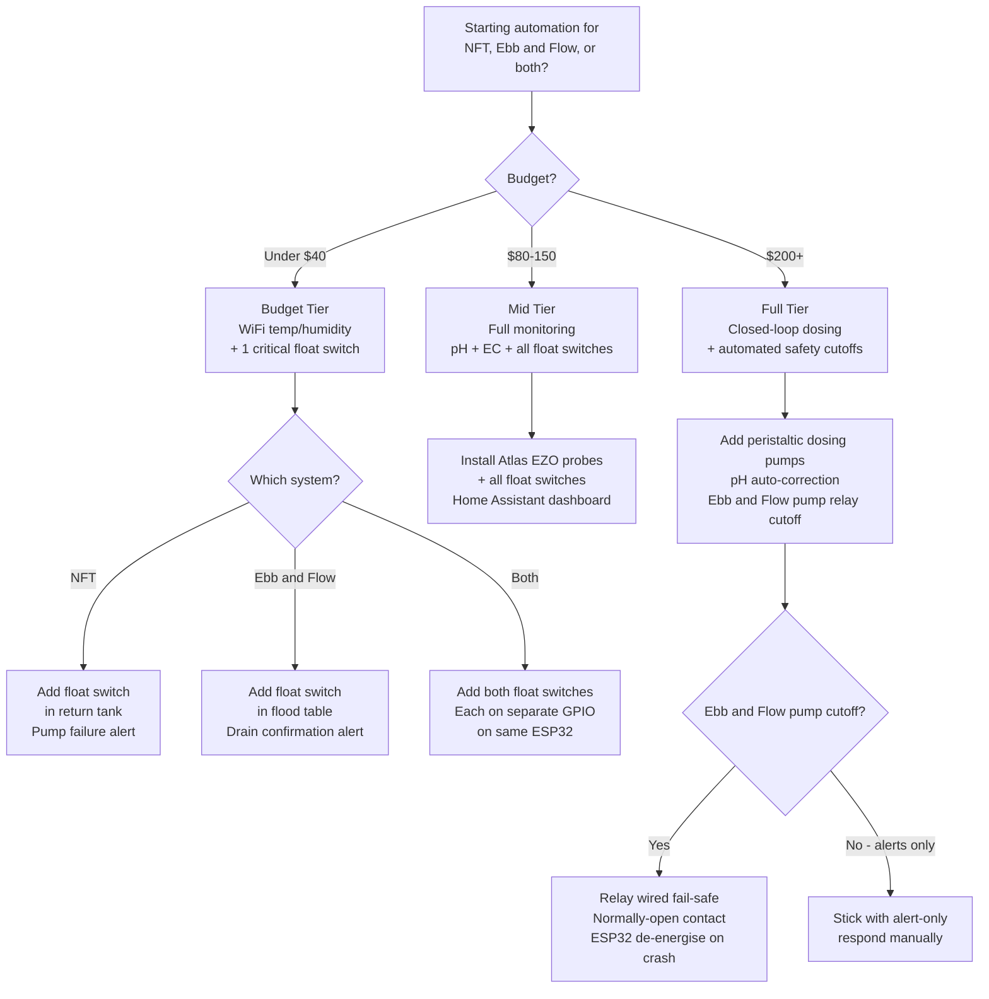

# Comparison Guide 03 — Automation: NFT vs Ebb & Flow
## How sensor priorities, failure modes, and automation architecture differ between the two systems

[](../../README.md)
[](https://creativecommons.org/licenses/by-nc-sa/4.0/)


---

## Table of Contents

- [Introduction](#introduction)
- [1. What Automation Is Solving in Each System](#1-what-automation-is-solving-in-each-system)
  - [NFT Failure Mode Hierarchy](#nft-failure-mode-hierarchy)
  - [E&F Failure Mode Hierarchy](#ef-failure-mode-hierarchy)
  - [Different Problems, Different Priorities](#different-problems-different-priorities)
- [2. Essential Monitoring (Both Systems)](#2-essential-monitoring-both-systems)
  - [Temperature](#temperature)
  - [EC and pH](#ec-and-ph)
  - [Reservoir Level](#reservoir-level)
- [3. NFT-Specific Automation](#3-nft-specific-automation)
  - [Flow Confirmation: The #1 NFT Sensor](#flow-confirmation-the-1-nft-sensor)
  - [Pump Health Monitoring](#pump-health-monitoring)
  - [Water Temperature](#water-temperature)
  - [NFT Automation Priority Stack](#nft-automation-priority-stack)
- [4. E&F-Specific Automation](#4-ef-specific-automation)
  - [Drain Confirmation: The #1 E&F Sensor](#drain-confirmation-the-1-ef-sensor)
  - [Timer Failure Detection](#timer-failure-detection)
  - [Flood Cycle Logging](#flood-cycle-logging)
  - [Stuck-ON Detection and Auto-Shutoff](#stuck-on-detection-and-auto-shutoff)
  - [E&F Automation Priority Stack](#ef-automation-priority-stack)
- [5. Shared Automation Architecture](#5-shared-automation-architecture)
  - [Budget Tier ($15–40): WiFi Monitoring](#budget-tier-1540-wifi-monitoring)
  - [Mid Tier ($80–150): ESP32 Sensor Network](#mid-tier-80150-esp32-sensor-network)
  - [Full Tier ($200–400): Closed-Loop Control](#full-tier-200400-closed-loop-control)
- [6. Wiring and Relay Control](#6-wiring-and-relay-control)
  - [Controlling Pumps from a Microcontroller](#controlling-pumps-from-a-microcontroller)
  - [Safety Rules for Mains Relay Circuits](#safety-rules-for-mains-relay-circuits)
  - [ESP32 Wiring Diagram: Combined NFT + E&F System](#esp32-wiring-diagram-combined-nft-ef-system)
- [7. Alert Logic Comparison](#7-alert-logic-comparison)
  - [NFT Alert Conditions](#nft-alert-conditions)
  - [E&F Alert Conditions](#ef-alert-conditions)
  - [Shared Alert Conditions](#shared-alert-conditions)
- [8. Dashboard Design for a Two-System Setup](#8-dashboard-design-for-a-two-system-setup)
- [9. Automation Decision Guide](#9-automation-decision-guide)

---


## Introduction

Both NFT and Ebb & Flow benefit from automation, but what they need automated — and why — is fundamentally different. NFT is a continuously running system where the greatest risk is pump stoppage; detecting that the pump has failed is the single most valuable automation task. E&F is a timed system where the greatest risk is **a timer that fails ON** — a pump that runs continuously instead of cycling, flooding the table permanently and causing root rot within 2–4 hours.

This guide maps the automation priorities, sensor types, wiring patterns, and alert logic for each system, and then shows how to build a unified controller for a two-system grow.

[↑ Back to TOC](#table-of-contents)

---


## 1. What Automation Is Solving in Each System

### NFT Failure Mode Hierarchy

In NFT, the solution film flows continuously. The failure modes, ranked by severity:

| Severity | Failure | Time to damage | Detectable by |
|---|---|---|---|
| Critical | Pump stops (no flow) | 15–30 minutes in warm weather | Flow sensor on that loop’s return |
| Critical | Return pipe blocks (roots, debris) | 2–4 hours | Water level sensor in catch tank |
| High | pH drift outside 5.5–6.5 | 24–48 hours | pH probe in reservoir |
| High | EC crash or spike | 12–24 hours | EC probe in reservoir |
| High | Reservoir runs dry | 4–8 hours | Float switch in reservoir |
| Medium | Water temperature above 77°F (25°C) | 24–48 hours | Temperature probe in each reservoir |
| Low | Algae growth (light leak) | Weeks | Visual inspection |

The pattern: **flow is everything** in NFT. If solution is moving, the system is functional. If it stops, damage begins within minutes to hours.

### E&F Failure Mode Hierarchy

In E&F, the pump runs on a timer. The failure modes, ranked by severity:

| Severity | Failure | Time to damage | Detectable by |
|---|---|---|---|
| Critical | Timer stuck ON (pump runs continuously) | 2–4 hours root rot | Float switch in table (drain confirmation) |
| Critical | Flood not draining (blockage at drain port) | 2–4 hours root rot | Float switch in table (drain confirmation) |
| High | Timer stuck OFF (pump never runs) | 8–24 hours (moist LECA buffer) | Flood cycle counter (expected flood not detected) |
| High | Reservoir runs dry | 1–2 floods skipped | Float switch in reservoir |
| High | pH drift outside 5.5–6.5 | 24–48 hours | pH probe in reservoir |
| High | EC spike in media | Days to weeks | Media EC measurement |
| Medium | Water temperature extremes | 24–48 hours | Temperature probe |
| Low | Salt crust accumulation | Weeks | EC trend analysis |

The pattern: **drain confirmation is everything** in E&F. Knowing that the table is draining correctly after each flood cycle is the single most critical automation task. Timer failure (stuck ON) or a blocked drain that prevents drain-back will cause root rot faster than almost any other fault.

### Different Problems, Different Priorities

| Priority | NFT sensor | E&F sensor |
|---|---|---|
| #1 | Flow confirmation (return pipe) | Drain confirmation (table float switch) |
| #2 | Reservoir level | Flood cycle counter / timer health |
| #3 | pH / EC | pH / EC |
| #4 | Water temperature | Reservoir level |
| #5 | Air temperature | Air temperature / VPD |

**Do not swap these priorities between systems.** A grower who installs only a temperature sensor and pH logger on an E&F system has missed the most critical sensor. A grower who installs drain confirmation logic on NFT has also missed the most critical sensor (flow at the return).

[↑ Back to TOC](#table-of-contents)

---


## 2. Essential Monitoring (Both Systems)

The following sensors are high-value in both NFT and E&F.

### Temperature

**Air temperature and humidity** (measures VPD — Vapour Pressure Deficit):
- Sensor: DHT22 or SHT31 (SHT31 is more accurate and stable)
- Location: inside the canopy zone, shaded from direct sun, at canopy height
- Alert: air temperature above 32°C or below 5°C; relative humidity above 85% (disease risk)

**Water / solution temperature:**
- Sensor: DS18B20 waterproof probe
- Location: submerged in reservoir
- Target: 64–72°F (18–22°C)
- Alert: above 77°F (25°C) (dissolved oxygen drops, Pythium risk rises); below 54°F (12°C) (nutrient uptake slows severely)

### EC and pH

Automated EC and pH monitoring requires submersible probes in the reservoir. Options:
- **Atlas Scientific** EZO-EC and EZO-pH circuit boards with their probe set ($100–150 combined) — highest quality; I2C interface; Raspberry Pi and ESP32 compatible
- **Gravity Analog** EC/pH probes from DFRobot (~$20–30 each) — lower accuracy; adequate for monitoring and alerts; not suitable for closed-loop dosing without calibration

**Calibration requirement:** All EC and pH probes require calibration on initial setup and every 4–8 weeks. Keep calibration solution on hand and log calibration dates.

**Reservation:** Automated EC/pH dosing (peristaltic pump + relay) is in the Full Tier ($200–400) and should not be attempted without thorough manual operation experience first.

### Reservoir Level

- Sensor: float switch (plastic ball float, normally-open, closes when level drops)
- Location: mounted on reservoir wall at the minimum safe level (approximately 20–25% of reservoir volume)
- Action on trigger: alert only (automated top-up is Full Tier; valve failure risk)
- Alternative: ultrasonic distance sensor (HC-SR04) for continuous level reading rather than binary alert

[↑ Back to TOC](#table-of-contents)

---


## 3. NFT-Specific Automation

### Flow Confirmation: The #1 NFT Sensor

The highest-value sensor in NFT is confirmation that solution is flowing through the channels and returning to the reservoir. Without this, a silent pump failure can go unnoticed for hours.

**Implementation options:**

**Option A — Float switch in return tank:**
Mount a float switch in the return/collection tank at the base of the channels. If the pump is running, water constantly returns; if the pump stops, the return tank level drops below the float switch trigger point within 5–10 minutes.
- Cost: $3–8 (float switch)
- Pin: one digital input on ESP32 or microcontroller
- Alert trigger: float switch signals LOW when it should be HIGH (pump is supposed to be running but return tank is empty)

**Option B — Flow sensor on return pipe:**
A Hall-effect flow sensor (YF-S201 or similar) on the return pipe gives a pulse count proportional to flow rate.
- Cost: $6–15
- More precise than a float switch; can detect partial blockage (reduced flow rate) as well as total stoppage
- Alert trigger: flow rate drops below threshold during pump-on hours

**Option C — Simple pump current monitor:**
A non-invasive AC current clamp (SCT-013) on the pump mains lead detects whether the pump is drawing current. If current drops to zero, the pump has stopped.
- Cost: $8–15
- Does not confirm water is actually flowing (pump could be running but no water — air lock), but catches most failure modes

**Recommended for a first build:** Option A (float switch in return tank). It is the cheapest, simplest to wire, and catches the most critical failure (pump stopped or pipe blocked).

### Pump Health Monitoring

NFT pumps run 24/7. Monitoring pump health:
- **Expected on-time**: near-continuous. Any period of >15 minutes where the pump is confirmed off (and not scheduled off) is an alert.
- **Current draw trend**: a healthy pump draws consistent current. Rising current draw over weeks indicates a clogged impeller; falling current indicates cavitation or failing bearings.
- **Runtime counter**: log total pump runtime hours. Most submersible pumps have a rated lifetime of 3,000–10,000 hours; replace at 80% of rated lifetime proactively.

### Water Temperature

Water temperature affects dissolved oxygen in the solution. For NFT, where roots are partially air-exposed, the dissolved oxygen in the thin film is critical.

Dissolved oxygen saturation at key temperatures:
- 61°F (16°C) → 10.0 mg/L
- 68°F (20°C) → 9.1 mg/L
- 75°F (24°C) → 8.3 mg/L
- 82°F (28°C) → 7.7 mg/L
- 90°F (32°C) → 7.1 mg/L

Below 7.5 mg/L, root-zone oxygen stress begins. Above 77°F (25°C) reservoir temperature, pythium risk rises. The aim is 64–72°F (18–22°C).

**When the tank is hot:**
- Shade it and wrap it. Black body, white exterior, reflective foam.
- Run an air stone in that reservoir.
- Both NFT pumps already run 24 hours a day. Do not add an overnight-off timer to “cool” the channel. A stopped channel dries roots in 15–30 minutes.

### NFT Automation Priority Stack

NFT has two loops. Fit the flow and level sensors on both the 20 US gal (76 L) greens tank and the 10 US gal (38 L) fruiting tank. One EC probe cannot serve both targets.

1. **Flow sensor on each return** → the pump on that loop stopped ($10 each)
2. **Float switch in each reservoir** → low water ($5 each)
3. **DS18B20 in each reservoir** → water temperature ($3 each)
4. **Canopy temperature and humidity** → $4–$8 (R72–R144)
5. **pH probe in each reservoir** → $20–$80 (R360–R1,440)
6. **EC probe in each reservoir** → $20–$80 (R360–R1,440). Greens target 0.8–1.8 mS/cm. CH4 fruiting target is 2.0–3.5 mS/cm. Do not dose both from one setpoint.
7. **Automated top-up valve** on each tank (full tier)
8. **Automated pH dosing** with a peristaltic pump (full tier)

[↑ Back to TOC](#table-of-contents)

---


## 4. E&F-Specific Automation

### Drain Confirmation: The #1 E&F Sensor

After every flood cycle, the table must drain completely. If the drain port is blocked, the table stays flooded; roots are submerged continuously; root rot begins within 2–4 hours in warm conditions.

**The drain confirmation sensor** is a float switch mounted in the table itself, positioned to detect whether the table is drained between flood cycles.

**Installation:**
1. Choose a float switch rated for the solution temperature range (most plastic float switches work to 40°C — fine for outdoor use)
2. Mount on the inside wall of the flood table, about 1¼–1½ in (3–4 cm) above the table floor — below the flood waterline but above any residual puddle; keep a small pocket in the LECA clear so the float moves freely
3. Wire as normally-open: when the table is dry, the switch is open; when flooded, the float rises and closes the circuit

**Logic:**
```
Expected state at T minutes after pump-OFF:
  - T = 0:  table flooded (switch CLOSED) → normal
  - T = 5:  table draining (switch may still be CLOSED) → normal
  - T = 15: table should be draining (switch transitioning) → monitor
  - T = 30: table should be drained (switch OPEN) → if still CLOSED → ALERT
```

**Alert and cutoff:** If the float is still CLOSED 30 minutes after pump-off, open the pump relay first, then send the alert. An alert alone leaves a stuck-ON pump running. Causes:
- Drain port is blocked (most common)
- Overflow fitting has failed and is holding solution
- Timer fired again before drain was complete (scheduling error)

### Timer Failure Detection

Ebb and Flow uses a digital timer with 1-minute steps, in a weatherproof box. A mechanical timer is not the outdoor default. Timer failures:
- **Stuck ON**: pump runs continuously → table permanently flooded → root rot
- **Stuck OFF**: pump never runs → plants dehydrate. Moist LECA still buffers **8–24 hours**; wilt in under 2 hours is not the normal case

**Detection using the drain confirmation float switch:**

- **Stuck ON**: the float never returns to OPEN. Open the pump relay. Do not wait for the next cycle.
- **Stuck OFF**: the float never closes during the flood window. Alert. Moist LECA still buffers 8–24 hours. That is not a 90-minute wilt.

Both failure modes are detectable from a single float switch, provided the microcontroller knows the flood schedule.



### Flood Cycle Logging

Log every flood cycle with:
- Timestamp of pump ON
- Timestamp of float switch CLOSED (table flooded) — or ALERT if it never closed
- Timestamp of float switch OPEN (table drained) — or ALERT if it never opened
- Duration from pump-ON to table-drained

This log provides:
- Cumulative flood cycle count (maintenance scheduling reference)
- Drain duration trend (gradually increasing drain time may indicate partial blockage building up before it becomes a full blockage)
- Missed cycle detection

### Stuck-ON Detection and Auto-Shutoff

For growers who want an automated safety response (not just an alert):

If the float switch remains CLOSED for more than 45 minutes after pump-off time, the microcontroller can:
1. Cut power to the pump via relay (overriding the timer)
2. Send an alert
3. Lock out the pump until the operator acknowledges and resets

This requires a normally-open relay in series with the pump mains circuit, controlled by the ESP32.

**Caution**: any relay-based pump cutoff should be designed fail-safe: if the ESP32 loses power or crashes, the relay should **de-energise** (default to pump OFF), not hold the pump ON.

### E&F Automation Priority Stack

From highest to lowest value-for-money:

1. **Float switch in flood table** → drain confirmation + timer failure detection ($5)
2. **DS18B20 in reservoir** → water temperature alert ($3)
3. **DHT22/SHT31 at canopy** → air temperature and humidity ($4–8)
4. **Float switch in reservoir** → low water level alert ($5)
5. **Flood cycle logger** → timestamp every flood/drain event (software only, uses float switch data)
6. **Relay for pump cutoff** → auto-shutoff if drain fails ($6–15 for relay module)
7. **pH probe in reservoir** → pH monitoring ($20–80)
8. **EC probe in reservoir** → EC monitoring ($20–80)
9. **Second float switch in table** → set at overflow level; double-confirmation of flooding ($5)
10. **Automated pH/EC dosing** → Full Tier only

[↑ Back to TOC](#table-of-contents)

---


## 5. Shared Automation Architecture

The following tiers apply equally to both systems. Where sensors or logic differ between systems, they are noted.

### Budget Tier ($15–40): WiFi Monitoring

**Goal:** Know the temperature and humidity in real time from your phone.

**Hardware:**
- 1× ESP8266 (D1 Mini) or ESP32 — $4–8
- 1× SHT31 temperature/humidity sensor — $4–8
- 1× DS18B20 waterproof probe — $3–5
- USB power supply and enclosure

**Software:** ESPHome (flashes over USB; configures via YAML; integrates directly into Home Assistant)

**What you get:**
- Real-time temperature and humidity graph on phone
- Alert if temperature goes above 32°C or below 5°C
- Solution temperature trend
- No mains wiring required

**NFT addition:** add a $5 float switch at the return tank, wire to a digital input — now you have pump failure alerting too.

**E&F addition:** add a $5 float switch in the flood table, wire to a digital input — now you have drain confirmation alerting.

### Mid Tier ($80–150): ESP32 Sensor Network

**Goal:** Full monitoring of all parameters; alerting via MQTT/Home Assistant/Telegram.

**Hardware (per system):**
- 1× ESP32 development board — $8–12
- 1× SHT31 sensor
- 1× DS18B20 probe
- 1× Atlas Scientific EZO-pH circuit + probe — $60–80 (or DFRobot analog pH probe — $20)
- 1× Atlas Scientific EZO-EC circuit + probe — $55–75 (or DFRobot analog EC probe — $20)
- 2× float switches (reservoir + return tank or table)
- Junction box, DIN rail, waterproof connectors

**Software:** ESPHome + Home Assistant (free, self-hosted on a Raspberry Pi or similar)

**What you get:**
- All parameters logged and graphed in Home Assistant dashboard
- Threshold alerts delivered via Telegram or email
- Historical data for trend analysis (identifying gradual EC drift, deteriorating pump performance)
- NFT: pump failure alert within 5 minutes
- E&F: drain failure alert within 30 minutes; missed flood alert

**Combined NFT + E&F:** run two ESP32 boards (one per system); both report to the same Home Assistant instance.

### Full Tier ($200–400): Closed-Loop Control

**Goal:** Automated pH correction, EC top-up, and pump safety cutoff.

**Additional hardware:**
- 2× peristaltic dosing pumps (pH up and pH down) — $15–25 each
- 1× peristaltic dosing pump (nutrient concentrate) — $15–25
- 2× mains relay modules (5V coil, 10A contacts) — $8–15 each
- Food-grade silicone tubing
- Calibrated dosing reservoirs for pH up, pH down, nutrient concentrate

**Software:** Custom ESPHome YAML + Home Assistant automations, or Node-RED for more complex logic

**What you get:**
- pH maintained within ±0.2 units of target automatically
- EC maintained by automated nutrient top-up when level drops below target
- E&F: automatic pump cutoff if drain confirmation sensor does not clear within 45 minutes
- Detailed automated logging with anomaly detection

**Cautions at Full Tier:**
- Over-dosing pH chemicals is a real risk with automated dosing; always set a maximum dose limit per correction cycle
- Test all automations in manual override mode before enabling autonomous operation
- Physical manual overrides (isolating valves, manual switches) are mandatory alongside all automated systems

[↑ Back to TOC](#table-of-contents)

---


## 6. Wiring and Relay Control

### Controlling Pumps from a Microcontroller

ESP32 GPIO pins output 3.3V at up to 12 mA — far too low to directly switch a mains pump. Use a relay module:

- **5V single-channel relay module** (SRD-05VDC-SL-C): coil driven by ESP32 GPIO via a transistor on the module board; contacts switch up to 10A/250VAC
- **Solid-state relay (SSR)**: better for frequent switching; no mechanical wear; 3–32V DC input, 24–380V AC output; use for automated dosing pumps

**Wiring:**
```
ESP32 GPIO → relay module IN pin (signal)
ESP32 5V  → relay module VCC
ESP32 GND → relay module GND

Relay module NO/COM contacts in series with pump mains live wire
```

**Fail-safe design:** wire the relay as normally-open (NO), so that if ESP32 loses power, the relay opens and the pump stops. Never wire the relay normally-closed for a pump that should default to OFF.

### Safety Rules for Mains Relay Circuits

1. **Always use a fused spur** between the mains socket and your relay circuit — fuse rated at 1.5× the pump's rated current
2. **Never expose live mains terminals** — use a proper enclosure; all mains-side wiring inside a junction box
3. **No mains wiring inside the ESP32 enclosure** — mains in one box; ESP32 and low-voltage in another; connect via relays mounted in the mains box
4. **Earth all metal enclosures**
5. **Label all relay circuits** with the pump/device they control
6. **Test relay switching** with a multimeter on the contact circuit BEFORE connecting pump mains

### ESP32 Wiring Diagram: Combined NFT + E&F System



[↑ Back to TOC](#table-of-contents)

---


## 7. Alert Logic Comparison

### NFT Alert Conditions

| Condition | Trigger | Action |
|---|---|---|
| Pump failure | Return tank float LOW for >10 min during pump-on hours | Alert: Critical |
| Reservoir low | Reservoir float LOW | Alert: High — top up required |
| Water temperature high | DS18B20 > 77°F (25°C) | Alert: High |
| Water temperature low | DS18B20 < 54°F (12°C) | Alert: Medium — nutrient uptake slowing |
| Air temperature high | SHT31 > 32°C | Alert: High |
| Air temperature low | SHT31 < 3°C | Alert: Critical — frost risk |
| pH high | EZO-pH > 6.8 | Alert: High |
| pH low | EZO-pH < 5.2 | Alert: High |
| EC high | EZO-EC > user threshold | Alert: Medium |
| EC low | EZO-EC < user threshold | Alert: Medium |

### E&F Alert Conditions

| Condition | Trigger | Action |
|---|---|---|
| Drain failure | Table float CLOSED for >30 min after pump-off time | Alert: Critical; optionally cut pump power |
| Missed flood | Table float never CLOSED during expected flood window | Alert: High |
| Timer stuck ON | Table float CLOSED continuously for >1 hour during non-flood period | Alert: Critical + auto pump cutoff |
| Reservoir low | Reservoir float LOW | Alert: High — top up required |
| Water temperature high | DS18B20 > 26°C | Alert: High |
| Water temperature low | DS18B20 < 12°C | Alert: Medium |
| Air temperature high | SHT31 > 32°C | Alert: High |
| Air temperature low | SHT31 < 3°C | Alert: Critical — frost risk |
| pH high | EZO-pH > 6.8 | Alert: High |
| pH low | EZO-pH < 5.2 | Alert: High |

### Shared Alert Conditions

| Condition | Both systems | Notes |
|---|---|---|
| WiFi connection lost | Reconnect attempt; alert after 15 min offline | Consider SMS fallback if WiFi is unreliable outdoors |
| Power cut restored | Log timestamp; check all sensors on resume | Pumps and timers may need manual restart after power cut |
| Sensor read error | Alert: sensor offline | Distinguish hardware fault from genuine limit breach |

[↑ Back to TOC](#table-of-contents)

---


## 8. Dashboard Design for a Two-System Setup

A Home Assistant dashboard for a combined NFT + E&F system should include:

**Status panel (top row):**
- NFT pump status: RUNNING / ALERT
- E&F last flood: timestamp of last confirmed flood cycle
- E&F drain status: OK / DRAINING / ALERT
- Reservoir level: OK / LOW for each system

**Environment panel (middle row):**
- Air temperature and humidity (shared outdoor sensor or per-zone)
- Water temperature (per system)
- VPD calculated value (high VPD on Ebb and Flow = deploy 40% shade and keep floods at the 4× ceiling; never add a 5th flood)

**Chemistry panel (bottom row):**
- EC (per system reservoir)
- pH (per system reservoir)
- EC trend graph (7-day rolling chart — identifies drift before it becomes a problem)
- pH trend graph

**E&F cycle log:**
- Last 10 flood cycles with timestamps, flood duration, and drain duration
- Flag any cycle where drain took >45% longer than the average of the previous 5 cycles (early blockage warning)

**Alerts panel:**
- All active alerts with timestamp
- Acknowledge button for non-critical alerts
- History log of past alerts

[↑ Back to TOC](#table-of-contents)

---


## 9. Automation Decision Guide



**The minimum viable automation for a new grower with both systems:**
- 1× ESP32
- 1× SHT31
- 1× DS18B20
- 1× float switch in NFT return tank
- 1× float switch in E&F flood table
- 1× float switch in shared/each reservoir
- Total hardware cost: $25–35
- Covers the two most critical failure modes in each system

This configuration, running ESPHome and Home Assistant, gives you 24/7 monitoring with phone alerts for less than the cost of replacing one batch of tomato plants lost to an undetected timer failure.

---


*Next: [Comparison Guide 04 — Cost and ROI: NFT vs Ebb & Flow](04-cost.md) — build costs, running costs, yield value, and payback period for each system*

[↑ Back to TOC](#table-of-contents)

---

<!-- copyright -->
*Copyright (c) 2026 UncleJS. Licensed under [CC BY-NC-SA 4.0](https://creativecommons.org/licenses/by-nc-sa/4.0/) — free to share and adapt for non-commercial purposes with attribution and ShareAlike.*
