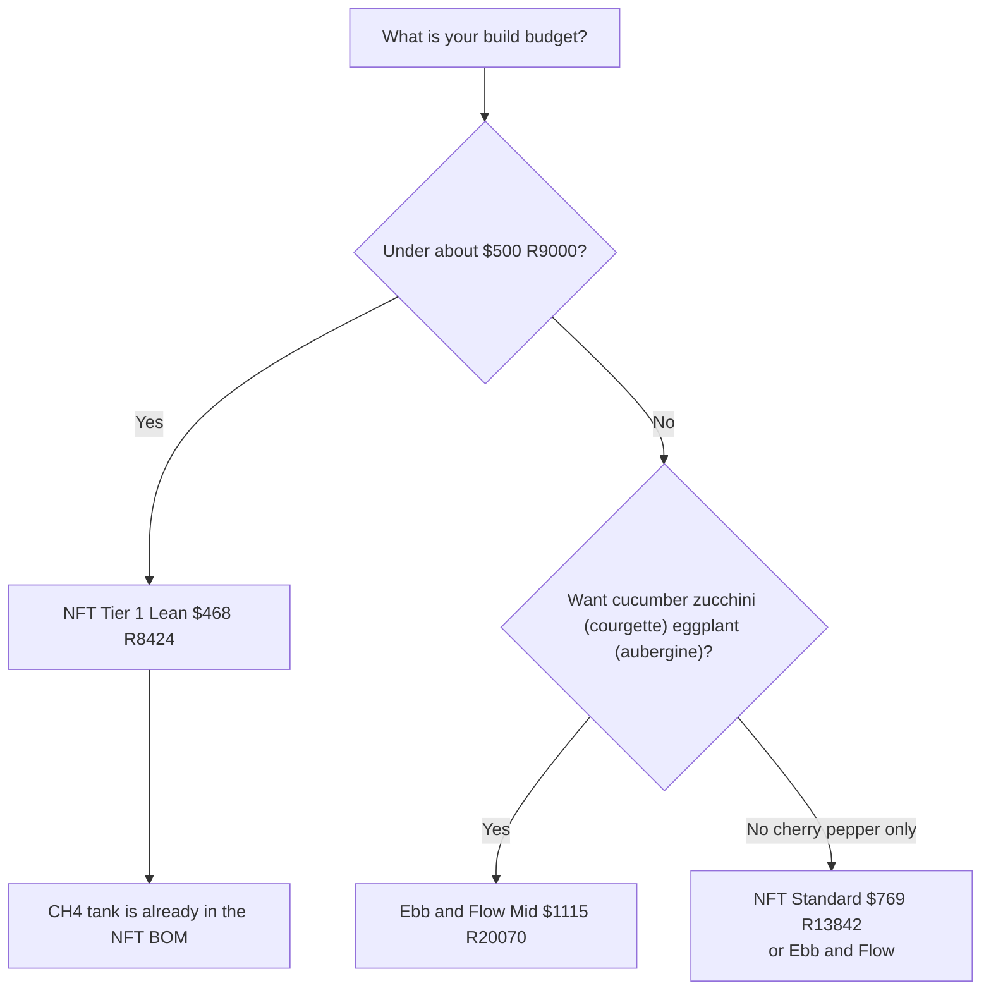

# Comparison Guide 04 — Cost and ROI: NFT vs Ebb and Flow
## Build costs, running costs, yield value, and payback for each system

Numbers match [design-constants.md](../design-constants.md). Line-item bills of materials live in [NFT Guide 12](../nft/12-budget-and-sourcing.md) and [Ebb and Flow Guide 12](../ebb-and-flow/12-budget-and-sourcing.md). If this file and a Guide 12 disagree, Guide 12 wins.

---

## Table of Contents

- [Introduction](#introduction)
- [1. What the cost comparison covers](#1-what-the-cost-comparison-covers)
- [2. NFT build costs](#2-nft-build-costs)
- [3. Ebb and Flow build costs](#3-ebb-and-flow-build-costs)
- [4. Running costs](#4-running-costs)
- [5. Yield value](#5-yield-value)
- [6. Payback](#6-payback)
- [7. Side-by-side](#7-side-by-side)
- [8. Where each system spends](#8-where-each-system-spends)
- [9. Spend priorities](#9-spend-priorities)
- [10. Decision guide](#10-decision-guide)

---

[↑ Back to TOC](#table-of-contents)

## Introduction

The return on a home system is freshness and crop choice as much as grocery savings. A vine-ripe cherry tomato picked the same hour you eat it is not the same product as a store punnet.

Prices are **US dollars with South African rand in brackets**, at the planning rate **$1 = R18** (3 October 2026). Electricity in the worked examples is **$0.15/kWh (R2.70/kWh)**. The climate is inland mid-USA at about **38°N**, season mid-April through mid-October (SA: mid-October through mid-April), about **180 outdoor growing days**.

Both systems described here are the full design: NFT with **two reservoirs**, or Ebb and Flow with **three 4 ft × 2 ft tables**. This guide does not price a smaller alternate machine.

---

[↑ Back to TOC](#table-of-contents)

## 1. What the cost comparison covers

**Included:** frames, channels or tables, reservoirs, pumps, fittings, LECA or clay pebbles, net pots, timer (Ebb and Flow), GFCI protection, meters, nutrients for the first fill, Zone B and Zone C hardware at the Mid tier when a “full three-zone” total is quoted.

**Excluded:** labor, seeds, greenhouses or pergolas, and land.

Water use for a full season is on the order of **400–800 US gal (1,500–3,000 L)**, not under 500 L. Cost of that water is local and small next to nutrients and LECA.

---

[↑ Back to TOC](#table-of-contents)

## 2. NFT build costs

The NFT bill of materials is in [Guide 12](../nft/12-budget-and-sourcing.md). Copy the Lean / Standard / Optimized (or Budget / Mid / Premium) totals from the top of that file. The design that file must price is:

- Four **8 ft (2.44 m)** channels, **40** sites
- Greens tank **20 US gal (76 L)** and pump **160–210 US gph (600–800 L/h)**
- Fruiting tank **10 US gal (38 L)** and pump **50–100 US gph (200–400 L/h)**
- Manifold **1 in (25 mm)** for CH1–CH3 only; **1/2 in (13 mm)** inlets
- No overnight pump timer as a required BOM line
- Zone B and Zone C as in the constants file

Copied from [NFT Guide 12](../nft/12-budget-and-sourcing.md):

| Tier | Zone A (two loops) | Full three zones |
|------|--------------------|------------------|
| **Tier 1 Lean** | **$322 (R5,796)** | **$468 (R8,424)** |
| **Tier 2 Standard** | **$548 (R9,864)** | **$769 (R13,842)** |
| **Tier 3 Optimized** | **$767 (R13,806)** | **$1,080 (R19,440)** |

The second reservoir and second pump are not optional on the fruiting channel. A one-tank NFT build is a different, lower-EC design and is not this guide set.

---

[↑ Back to TOC](#table-of-contents)

## 3. Ebb and Flow build costs

Copied from [Ebb and Flow Guide 12](../ebb-and-flow/12-budget-and-sourcing.md):

| Tier | Zone A | Full three zones (A + B + C) |
|------|--------|------------------------------|
| **Budget** | **$543 (R9,774)** | **$726 (R13,068)** |
| **Mid** | **$867 (R15,606)** | **$1,130 (R20,340)** |
| **Premium** | **$1,274 (R22,932)** | **$1,639 (R29,502)** |

Zone B alone is $89 / $140 / $203 (R1,602 / R2,520 / R3,654). Zone C alone is $94 / $123 / $162 (R1,692 / R2,214 / R2,916).

LECA is the cost driver: buy **90 US gal (340 L)** for three tables at **5 in (13 cm)** depth. Each table needs a **1½ in (40 mm) overflow** and a **1 in (25 mm) drain**. The outdoor timer is digital, 1-minute steps, in a weatherproof box on a **120 V GFCI** (SA: 230 V, 30 mA earth-leakage). A mechanical timer is not the recommended outdoor control.

---

[↑ Back to TOC](#table-of-contents)

## 4. Running costs

Season length for the electricity examples: **180 days**.

### Electricity

**NFT (both pumps continuous):**
- Greens pump about 15 W, fruiting pump about 8 W, total about 23 W
- Season energy: 0.023 kW × 24 h × 180 ≈ **99 kWh**
- Cost at $0.15/kWh: about **$15 (R270)** per season

**Ebb and Flow (intermittent):**
- Pump about 35 W
- Four floods × 20 minutes = 80 minutes per day ≈ 1.33 h
- Season energy: 0.035 kW × 1.33 × 180 ≈ **8.4 kWh**
- Cost: about **$1.30 (R23)** per season

**Optional ESP32 stack:** about 2.5 W continuous ≈ 22 kWh/year ≈ **$3.30 (R59)** if left on year-round.

### Nutrients

Base recipe per **1 US gal (3.8 L):** 2.4 g Masterblend + 2.4 g calcium nitrate + 1.2 g Epsom (0.63 / 0.63 / 0.32 g/L). Never 2.4 g/L.

Planning spend for a full season of Masterblend + calcium nitrate + Epsom + pH reagents:

| System | Nutrients and pH chemistry |
|--------|----------------------------|
| NFT, both tanks | about $25–$40 (R450–R720) |
| Ebb and Flow | about $30–$50 (R540–R900) |

Ebb and Flow spends a little more because media flushes send solution to waste and the 45 US gal (170 L) tank is larger.

### Consumables

| Item | NFT | Ebb and Flow |
|------|-----|--------------|
| Calibration solution | $8 (R144) | $8 (R144) |
| Rockwool or plugs | $10 (R180) | $10 (R180) |
| Net pots / LECA top-up | $5 (R90) | $10 (R180) |
| Pump wear allowance | $5 (R90) | $3 (R54) |
| Probe electrode (amortized) | $8 (R144) | $8 (R144) |
| **About** | **$35–$50 (R630–R900)** | **$40–$60 (R720–R1,080)** |

### Season running total (Guide 12 mid estimates)

Guide 12 wins on these figures. Do not invent a cheaper second track.

| System | Mid season running (Guide 12) | Notes |
|--------|-------------------------------|-------|
| NFT Tier 2 Standard | **$247 (R4,446)** | Electricity, nutrients, water, consumables, Zone B lights — [NFT Guide 12 §9.4](../nft/12-budget-and-sourcing.md) |
| Ebb and Flow Mid | **$286 (R5,148)** | Same scope — [E&F Guide 12 §9.5](../ebb-and-flow/12-budget-and-sourcing.md) |

Electricity alone is small ($15–$80 / R270–R1,440 depending on Zone B LED hours). Nutrients and consumables dominate the season total. LECA and the second NFT loop are the capital differences.

---

[↑ Back to TOC](#table-of-contents)

## 5. Yield value

Values use mid-USA specialty retail planning prices, not loss-leader supermarket prices. Adjust for your city.

### NFT (one season)

| Crop group | Planning yield | Value band |
|------------|----------------|------------|
| Lettuce and leafy greens (CH1, CH3) | about 80–120 heads | $200–$360 (R3,600–R6,480) |
| Herbs (CH2) | continuous cut | $80–$150 (R1,440–R2,700) |
| Cherry tomato and pepper (CH4) | 4–6 lb (1.8–2.7 kg) per plant × 4–5 plants | $80–$180 (R1,440–R3,240) |
| Zone B microgreens | many trays | $60–$120 (R1,080–R2,160) |
| Zone C bags | 43 lb (20 kg) | $80–$110 (R1,440–R1,980) |
| **About** | | **$500–$920 (R9,000–R16,560)** |

### Ebb and Flow (one season)

From Guide 12 planning figures:

| Crop group | Planning yield | Value band |
|------------|----------------|------------|
| Zone A fruiting and leafy | about 33–42 lb (15–19 kg) | $235–$400 (R4,230–R7,200) |
| Zone B | many trays | $60–$120 (R1,080–R2,160) |
| Zone C | 43 lb (20 kg) | $80–$110 (R1,440–R1,980) |
| **About** | | **$375–$630 (R6,750–R11,340)** |

Ebb and Flow wins on cucumber, zucchini (courgette), and eggplant (aubergine). NFT wins on leafy density and herb turnover. Cherry tomato and pepper can sit on either the NFT CH4 tank or an Ebb and Flow table.

---

[↑ Back to TOC](#table-of-contents)

## 6. Payback

Using Mid-tier three-zone capital and Guide 12 Mid running / payback stories:

| System | Build | Running (Guide 12 mid) | Guide 12 payback story |
|--------|-------|------------------------|------------------------|
| NFT Tier 2 Standard | **$769 (R13,842)** | **$247 (R4,446)** | Conservative grocery offset ~$500 → net ~$253 → **~3.0 seasons** |
| Ebb and Flow Mid | **$1,130 (R20,340)** | **$286 (R5,148)** | Optimistic net ~$314 → **~3.6 seasons**; conservative net ~$114 → **~10 seasons** |

First season yield is often 40–60% of a mature year while you learn. Treat payback as a planning story, not a guarantee. Full arithmetic lives in each Guide 12.

---

[↑ Back to TOC](#table-of-contents)

## 7. Side-by-side

| Item | NFT | Ebb and Flow |
|------|-----|--------------|
| Mid / Standard three-zone capital | **$769 (R13,842)** | **$1,130 (R20,340)** |
| Biggest cost | second pump/tank, meters, frame | LECA, 90 US gal (340 L) |
| Pump hours | 24 h × 2 pumps | about 1.3 h/day |
| Season running (Guide 12 mid) | **$247 (R4,446)** | **$286 (R5,148)** |
| Fruiting crops | cherry tomato and pepper on CH4 only | tomato, pepper, cucumber, zucchini (courgette), eggplant (aubergine) |
| Failure that kills a crop | pump stop, 15–30 minutes | timer stuck ON, 2–4 hours |

---

[↑ Back to TOC](#table-of-contents)

## 8. Where each system spends

**NFT spends less on media** and more on continuous pumping and a second loop if you want fruiting EC.

**Ebb and Flow spends more on LECA and fittings**, then runs cheap. The drain-confirmation float that opens the pump relay is cheap insurance next to a lost fruiting crop.

**Hidden costs for both:** a spare pump, calibration solution, shade cloth for 90–100°F (32–38°C) afternoons, and a latched box for dry salts and acids.

---

[↑ Back to TOC](#table-of-contents)

## 9. Spend priorities

1. **A reliable pump** (or two, on NFT) on a **GFCI**.
2. **Digital timer and drain-confirmation cutoff** on Ebb and Flow before the first fruiting plant.
3. **pH and EC meters** you calibrate.
4. **Enough LECA** (90 US gal / 340 L) on Ebb and Flow. Under-filling tables to save money causes uneven floods.
5. **Shade cloth 40%** before the first June (SA: December) heat wave.
6. **Backup pump** on the shelf.

Do not put a mechanical outdoor timer on the Ebb and Flow bill as the “Budget” safety plan.

---

[↑ Back to TOC](#table-of-contents)

## 10. Decision guide

| Situation | Build |
|-----------|-------|
| About $468 (R8,424) | NFT Tier 1 Lean, full three zones |
| About $769 (R13,842) | NFT Tier 2 Standard (recommended) |
| Cucumber, zucchini (courgette), eggplant (aubergine) | Ebb and Flow Mid, $1,130 (R20,340) |
| Both systems | NFT Standard plus Ebb and Flow Budget Zone A when the budget allows |

---

> **Previous:** [Comparison Guide 03 — Automation](03-automation.md)

[↑ Back to TOC](#table-of-contents)

> **Next:** return to the [README](../../README.md) or [design constants](../design-constants.md)

---

<!-- copyright -->
*Copyright (c) 2026 UncleJS. Licensed under [CC BY-NC-SA 4.0](https://creativecommons.org/licenses/by-nc-sa/4.0/) — free to share and adapt for non-commercial purposes with attribution and ShareAlike.*
