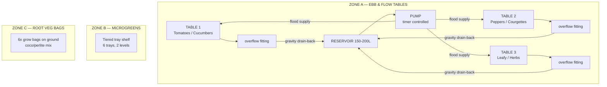
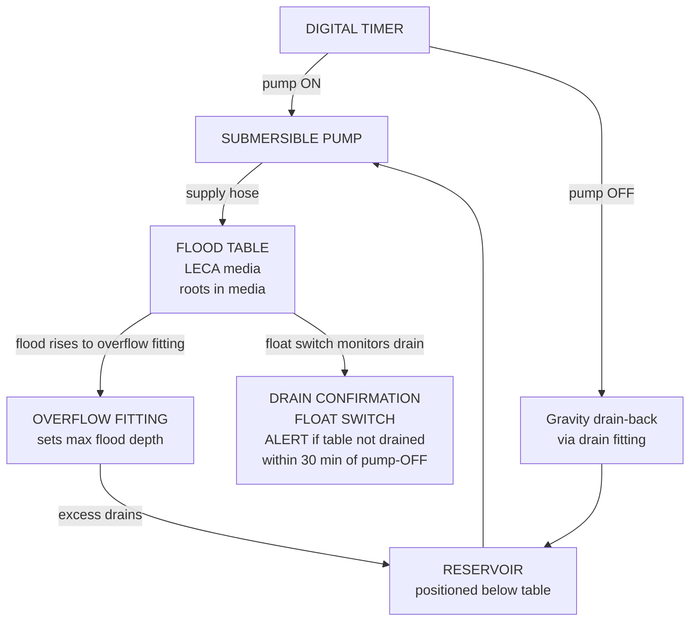

# Ebb & Flow System — Overview & Build Plan
## Outdoor Flood-and-Drain | Medium Backyard Scale | DIY Build

---

## Table of Contents

- [System Summary](#system-summary)
- [Zone Design](#zone-design)
  - [Zone A — Ebb & Flow Flood Tables](#zone-a-ebb-flow-flood-tables)
  - [Zone B — Microgreens Station](#zone-b-microgreens-station)
  - [Zone C — Root Veg Grow Bags](#zone-c-root-veg-grow-bags)
- [System Architecture Diagrams](#system-architecture-diagrams)
- [Component Inventory](#component-inventory)
- [Seasonal Grow Calendar](#seasonal-grow-calendar)
- [4-Week Build Timeline](#4-week-build-timeline)
  - [Week 1 — Procurement & Preparation](#week-1-procurement-preparation)
  - [Week 2 — Build Frames & Tables](#week-2-build-frames-tables)
  - [Week 3 — Plumbing, Timer & Testing](#week-3-plumbing-timer-testing)
  - [Week 4 — LECA, Nutrients & First Plants](#week-4-leca-nutrients-first-plants)
- [Daily Quick-Start Checklist](#daily-quick-start-checklist)
- [Success Criteria](#success-criteria)
- [Guide Index](#guide-index)

---

## System Summary

A **medium-scale outdoor Ebb & Flow (flood-and-drain)** system for a temperate backyard, designed for a £200–£600 DIY budget. The system uses a **three-zone hybrid design** that prioritises fruiting crops alongside fast leafy greens:

| Zone | Method | Crops |
|------|--------|-------|
| **Zone A — Flood Tables** | Timed flood-drain cycles, LECA media | Tomatoes, cucumbers, courgettes, aubergine, peppers, lettuce, herbs |
| **Zone B — Microgreens Station** | Tray-based, coco coir media, manual/wicking | Sunflower, pea shoots, radish, broccoli, amaranth, wheatgrass |
| **Zone C — Root Veg Grow Bags** | Passive grow bags, coco/perlite media, manual fertigation | Radishes, carrots, beetroot |

**Critical difference from NFT:** Ebb & Flow uses a timer to control flood cycles. A timer that fails ON (pump runs continuously) will flood roots permanently and cause root rot within 2–4 hours. **A drain confirmation sensor is strongly recommended** before the first crop goes in — see [Guide 13 — Automation](13-automation.md).

[↑ Back to TOC](#table-of-contents)

---

## Zone Design

### Zone A — Ebb & Flow Flood Tables

| Property | Value |
|----------|-------|
| Tables | 3 flood tables (60 × 90 cm each) |
| Media | LECA clay pebbles, 20–25 L per table, 10–15 cm depth |
| Flood depth | 3–5 cm (set by overflow standpipe height) |
| Flood cycle | 3–5× daily (vegetative); 4–6× daily (fruiting, summer) |
| Flood duration | 20–30 minutes per cycle |
| Pump | 800–1,200 L/h submersible |
| Timer | Digital programmable, 1-minute resolution minimum |
| Reservoir | 150–200 L food-grade container, positioned below table drain level |
| Table level | Must be **perfectly level** — use a spirit level; even 5 mm deviation causes uneven flooding |
| Drain-back | Gravity — reservoir must be lower than table drain port |

**Table assignment:**
- **Table 1** — Long-season fruiting: indeterminate tomatoes or cucumbers (1 plant per table)
- **Table 2** — Medium-season fruiting: peppers, aubergine, or courgette (1–2 plants per table)
- **Table 3** — Fast crops: lettuce, herbs, pak choi, or shoulder-season leafy greens; convert to fruiting crop if demand warrants

### Zone B — Microgreens Station

| Property | Value |
|----------|-------|
| Trays | 6 × 25 cm × 50 cm standard grow trays |
| Levels | 2-tier DIY timber shelf |
| Media | Coco coir (~1–2 cm layer) |
| Watering | Manual misting, 2× daily |
| Typical harvest cycle | 7–14 days depending on variety |

### Zone C — Root Veg Grow Bags

| Property | Value |
|----------|-------|
| Bags | 6 bags: 3 × 20 L (radishes/beetroot), 3 × 30 L deep (carrots) |
| Media | 60% coco coir + 30% perlite + 10% vermiculite |
| Watering | Manual fertigation, 1–2× daily |
| Drainage | Bags on slatted rack or gravel tray |

[↑ Back to TOC](#table-of-contents)

---

## System Architecture Diagrams

**Three-zone overview:**

**OUTDOOR HYBRID GROW STATION**

**Single table flood-drain cycle (side view):**

[↑ Back to TOC](#table-of-contents)

---

## Component Inventory

| Component | Quantity | Notes |
|-----------|----------|-------|
| Flood table (60 × 90 cm, HDPE or lined) | 3 | Must be food-safe; check for levelness |
| 1.5" bulkhead overflow fitting | 3 | One per table; sets max flood depth |
| 1" bulkhead drain fitting | 3 | One per table; gravity drain-back |
| 1.5" standpipe (overflow height) | 3 | Cut to desired flood depth (3–5 cm) |
| Flood table support frame (timber) | 3 | Level is critical — build with spirit level |
| 19 mm braided hose | ~4 m | Pump to table flood inlets |
| 19 mm barb × threaded fittings | 6 | Table inlet connections |
| Submersible pump (800–1,200 L/h) | 1 | With filter sponge |
| Digital timer (1-minute resolution) | 1 | Backup mechanical timer: strongly recommended |
| 150–200 L food-grade reservoir | 1 | Must sit lower than table drain outlets |
| LECA clay pebbles | 75 L | ~25 L per table; pre-soak 24h before use |
| pH meter | 1 | Calibrate monthly |
| EC/TDS meter | 1 | Calibrate monthly; also use for media EC |
| pH Up (KOH solution) | 1 bottle | |
| pH Down (phosphoric acid) | 1 bottle | |
| Float switch (drain confirmation) | 3 | One per table; mounts inside table wall |
| Float switch (reservoir level) | 1 | Alerts to low reservoir |
| ESP32 or ESP8266 + SHT31 | 1 set | Temperature monitoring + float switch alerts |
| Rockwool starter cubes | 30 | Seedling germination |
| Coco coir plugs | 30 | Alternative to rockwool for transplanting to LECA |
| Grow bags 20 L | 3 | Zone C |
| Grow bags 30 L deep | 3 | Zone C — carrots |
| Coco coir (10 L brick or loose) | 2 | Zones B & C |
| Perlite (5 L) | 1 | Zone C media blend |
| Vermiculite (2 L) | 1 | Zone C blend |
| Standard grow trays (25 × 50 cm) | 6 | Zone B microgreens |
| Microgreen seeds (variety pack) | — | See [Guide 06 — Crops](06-crops.md) |
| Nutrients (Masterblend trio or GH Flora) | — | See [Guide 02 — Nutrients](02-nutrient-solution.md) |
| Shade cloth 40% (2 × 3 m) | 1 | Summer heat; also reduces rain dilution |
| Frost fleece / horticultural fleece | 1 roll | Cold protection for fruiting crops |
| Bamboo canes or tomato string | 12 | Vertical support for indeterminate plants |
| Spare timer (mechanical, backup) | 1 | Critical: timer failure is highest-severity E&F fault |

[↑ Back to TOC](#table-of-contents)

---

## Seasonal Grow Calendar

| Month | Activity | Crops to Start |
|-------|----------|----------------|
| **Jan–Feb** | System prep, source materials, build planning | Tomatoes and peppers started indoors under lights (8–10 weeks before last frost) |
| **Mar** | Build & test tables; level check; water test | Lettuce, herbs in rockwool (indoor germination); tomato/pepper seedlings developing |
| **Apr** | LECA pre-soak; table planting begins | Shoulder-season leafy crops (lettuce, pak choi) in tables; tomato/pepper hardening off |
| **Late Apr** | Transplant tomatoes and peppers after last frost | Tomatoes and peppers to Tables 1 & 2 |
| **May** | Full system operational; fruiting crops establishing | Cucumbers transplanted (after last frost — warmer than tomatoes) |
| **Jun** | Fruiting crops in vegetative growth; increase flood frequency with rising heat | Courgettes transplanted if not already; Zone B microgreens rolling harvest |
| **Jul** | Peak production; hand-pollinate; watch for missed floods in heat | Radishes, carrots in grow bags |
| **Aug** | Fruiting peak continues; monitor media EC weekly; heat management | Late succession leafy crops in Table 3 |
| **Sep** | Fruiting crops slowing; courgettes and cucumbers first to finish | Shoulder-season lettuce and spinach in freed tables |
| **Oct** | Final tomato and pepper harvest before first frost; clear LECA | Leafy crops continue until frost |
| **Nov** | LECA sterilisation (bleach soak + rinse); table clean; system winterisation | — |
| **Dec** | Review season; plan next year; order seeds | — |

**Key dates to track:**
- Last frost (spring): typically late March – mid-April in UK/northern Europe — do not transplant fruiting crops before this
- First frost (autumn): typically mid-October – early November — fruiting crops must be cleared before this
- Longest day: 21 June — peak flood frequency needed; peak heat management period

**E&F-specific seasonal notes:**
- Increase flood frequency from 3× to 5× daily when daytime air temperature consistently exceeds 25°C
- Monitor media EC weekly from June onwards — salt accumulation accelerates in summer heat
- Run monthly media flush in July, August, and September (see [Guide 02 — Nutrients](02-nutrient-solution.md))
- Check overflow fitting gaskets at the start of each season — silicone perishes over winter

[↑ Back to TOC](#table-of-contents)

---

## 4-Week Build Timeline

### Week 1 — Procurement & Preparation
- [ ] Finalise bill of materials (see [Guide 12 — Budget & Sourcing](12-budget-and-sourcing.md))
- [ ] Order/purchase all components — note: LECA needs 24h pre-soak before use
- [ ] Select and prepare build site — flat ground; reservoir must be positioned lower than table drains
- [ ] Source timber for flood table support frames
- [ ] Check water supply access and electrical outlet proximity
- [ ] Start tomato and pepper seeds indoors if not already (8–10 weeks before last frost)

### Week 2 — Build Frames & Tables
- [ ] Build flood table support frames — use a spirit level; tables must be perfectly level
- [ ] Set tables on frames; recheck level after setting
- [ ] Install overflow fittings (1.5" bulkhead) — tighten to finger-tight + quarter turn; do not over-tighten
- [ ] Install drain fittings (1" bulkhead) — as above
- [ ] Set standpipe height (3–5 cm above table floor)
- [ ] Position reservoir below table drain outlets — confirm gravity drain-back path is clear
- [ ] Set up Zone B microgreens shelf
- [ ] Set up Zone C grow bags with media

### Week 3 — Plumbing, Timer & Testing
- [ ] Connect pump → hoses → table flood inlets
- [ ] Seal all joints (thread tape on threaded fittings; silicone on bulkheads)
- [ ] Fill reservoir with plain water; run pump manually — check for leaks at all fittings
- [ ] Test flood: confirm water rises to overflow standpipe height, then stops
- [ ] Test drain: confirm table fully empties within 15–20 minutes of pump off
- [ ] Set timer — start with 3 flood cycles per day at 20-minute duration
- [ ] Install float switch in each table (drain confirmation) — see [Guide 13 — Automation](13-automation.md)
- [ ] Install float switch in reservoir (low level alert)
- [ ] Test timer: observe a full flood cycle start to finish; confirm drain is complete before next cycle

### Week 4 — LECA, Nutrients & First Plants
- [ ] Pre-soak LECA for 24 hours in pH 6.0 water; rinse; fill tables to 10–15 cm depth
- [ ] Mix first nutrient solution (see [Guide 02 — Nutrients](02-nutrient-solution.md))
- [ ] Calibrate and baseline pH and EC meters
- [ ] Run two flood cycles with nutrient solution; check media EC is close to reservoir EC
- [ ] Transplant hardened-off seedlings (lettuce, herbs first; fruiting crops after last frost)
- [ ] Run 4–5 flood cycles daily for the first week to help transplants establish in LECA
- [ ] Begin daily monitoring log
- [ ] Sow first microgreens trays (Zone B)
- [ ] Fill and plant root veg grow bags (Zone C)

[↑ Back to TOC](#table-of-contents)

---

## Daily Quick-Start Checklist

Once the system is running, use this each morning:

- [ ] Confirm last overnight flood cycle completed and table has drained (check drain confirmation sensor or physically inspect)
- [ ] Check reservoir level — top up with pH-adjusted nutrient solution if below minimum mark
- [ ] Measure and record reservoir pH (target: 5.5–6.5; ideal 5.8–6.2)
- [ ] Measure and record reservoir EC (target: varies by crop and stage — see [Guide 02](02-nutrient-solution.md))
- [ ] Weekly: push EC probe 5–8 cm into LECA — compare media EC to reservoir EC (should be <1.0 mS/cm difference)
- [ ] Inspect overflow fittings — confirm standpipes are seated; no debris in drain ports
- [ ] Visually scan each table — check for waterlogging, wilting plants, or salt crust on LECA surface
- [ ] Inspect plants for yellowing, wilting, or pest damage; check undersides of leaves
- [ ] Check Zone B microgreens trays — mist lightly if surface is dry
- [ ] Check Zone C grow bags — water/fertigate as needed
- [ ] Confirm timer is set and correct — check programmed flood times have not been reset by power cut
- [ ] Log any observations, adjustments, or concerns

**After a power cut:** timers may reset to 12:00. Check and re-programme the timer before leaving the system unattended.

[↑ Back to TOC](#table-of-contents)

---

## Success Criteria

By the end of the first growing season:

1. At least **2 kg of tomatoes** harvested from Table 1 (or equivalent yield from cucumbers)
2. Continuous fruiting from Table 2 crops (peppers, courgettes, or aubergine) from July through September
3. **Zero root rot events** caused by timer failure or drain blockage — confirmed by drain sensor log
4. Media EC maintained within 1.0 mS/cm of reservoir EC throughout the season (monthly flush protocol followed)
5. At least **3–4 full microgreens tray harvests** per month from Zone B
6. At least **one successful root vegetable crop** from Zone C
7. pH stable within 5.5–6.5 and EC within crop target ranges for **80%+ of operational days**
8. Flood cycle timer never missed for more than one cycle without detection and correction

[↑ Back to TOC](#table-of-contents)

---

## Guide Index

| # | File | Topic |
|---|------|-------|
| 00 | `00-system-overview.md` ← *you are here* | System design, inventory, build timeline, grow calendar |
| — | [`zones.md`](../../zones.md) | Full zone layout, spatial diagrams, dimensions |
| 01 | [01-ebb-flow-basics.md](01-ebb-flow-basics.md) | Flood-drain principle, overflow fittings, timer failure modes |
| 02 | [02-nutrient-solution.md](02-nutrient-solution.md) | Nutrients, EC, pH, media flush protocol |
| 03 | [03-water-quality.md](03-water-quality.md) | Water sources, testing, treatment |
| 04 | [04-lighting.md](04-lighting.md) | Outdoor light, DLI, shade, seasons |
| 05 | [05-growing-media.md](05-growing-media.md) | LECA preparation, media depth, germination |
| 06 | [06-crops.md](06-crops.md) | Per-crop guide including tomatoes, cucumbers, courgettes |
| 07 | [07-pests-and-disease.md](07-pests-and-disease.md) | IPM, pests, diseases — E&F specific risks |
| 08 | [08-system-maintenance.md](08-system-maintenance.md) | Daily/weekly/seasonal schedules |
| 09 | [09-troubleshooting.md](09-troubleshooting.md) | Symptom → cause → fix; drain and timer failure trees |
| 10 | [10-climate-management.md](10-climate-management.md) | Heat, cold, wind, rain, seasonal management |
| 11 | [11-build-guide.md](11-build-guide.md) | Full step-by-step build instructions |
| 12 | [12-budget-and-sourcing.md](12-budget-and-sourcing.md) | BOM, costs, sourcing, ROI |
| 13 | [13-automation.md](13-automation.md) | Drain confirmation sensor, flood cycle logging, ESP32 |

[↑ Back to TOC](#table-of-contents)

---

<!-- copyright -->
*Copyright (c) 2026 UncleJS. Licensed under [CC BY-NC-SA 4.0](https://creativecommons.org/licenses/by-nc-sa/4.0/) — free to share and adapt for non-commercial purposes with attribution and ShareAlike.*
