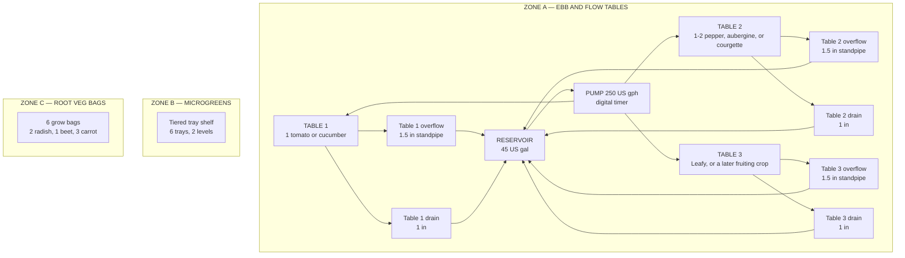
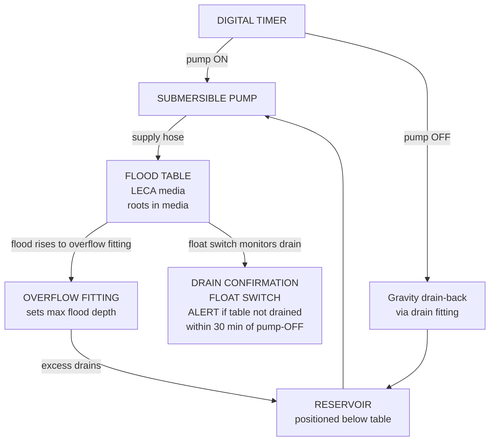

# Ebb & Flow System — Overview & Build Plan
## Outdoor Flood-and-Drain | Medium Backyard Scale | DIY Build

---

## Table of Contents

- [System Summary](#system-summary)
- [Zone Design](#zone-design)
  - [Zone A — Ebb & Flow Flood Tables](#zone-a-ebb-flow-flood-tables)
  - [Zone B — Microgreens Station](#zone-b-microgreens-station)
  - [Zone C — Root Veg Grow Bags](#zone-c-root-veg-grow-bags)
- [System Architecture Diagrams](#system-architecture-diagrams)
- [Component Inventory](#component-inventory)
- [Seasonal Grow Calendar](#seasonal-grow-calendar)
- [4-Week Build Timeline](#4-week-build-timeline)
  - [Week 1 — Procurement & Preparation](#week-1-procurement-preparation)
  - [Week 2 — Build Frames & Tables](#week-2-build-frames-tables)
  - [Week 3 — Plumbing, Timer & Testing](#week-3-plumbing-timer-testing)
  - [Week 4 — LECA, Nutrients & First Plants](#week-4-leca-nutrients-first-plants)
- [Daily Quick-Start Checklist](#daily-quick-start-checklist)
- [Success Criteria](#success-criteria)
- [Guide Index](#guide-index)

---

## System Summary

A **medium-scale outdoor Ebb & Flow (flood-and-drain)** system for an inland mid-USA backyard at about **38°N**, USDA zones **6b–7a**. Hardware cost is in [Guide 12 — Budget and Sourcing](12-budget-and-sourcing.md). Dimensions, doses, and dates follow [Design constants](../design-constants.md). The spatial layout, including this Ebb and Flow Zone A, is in [zones.md](../../zones.md). The system uses a **three-zone hybrid design** that prioritises fruiting crops alongside fast leafy greens:

| Zone | Method | Crops |
|------|--------|-------|
| **Zone A — Flood Tables** | Timed flood-drain cycles, LECA media | Tomatoes, cucumbers, courgettes, aubergine, peppers, lettuce, herbs |
| **Zone B — Microgreens Station** | Tray-based, coco coir media, manual/wicking | Sunflower, pea shoots, radish, broccoli, amaranth, wheatgrass |
| **Zone C — Root Veg Grow Bags** | Passive grow bags, 60% coco / 30% perlite / 10% vermiculite, manual fertigation | Radishes, carrots, beetroot |

**Critical difference from NFT:** Ebb & Flow uses a timer to control flood cycles. A timer that fails ON (pump runs continuously) will flood roots permanently and cause root rot within 2–4 hours. **A drain confirmation sensor is strongly recommended** before the first crop goes in — see [Guide 13 — Automation](13-automation.md). A missed flood is a different fault: moist LECA buffers **8–24 hours**.

**Electrical:** 120 V outdoor GFCI (SA: 230 V, 30 mA earth-leakage). Put the timer and plugs in a weatherproof box.

[↑ Back to TOC](#table-of-contents)

---

## Zone Design

### Zone A — Ebb & Flow Flood Tables

| Property | Value |
|----------|-------|
| Tables | 3 flood tables, each 4 ft × 2 ft (1.22 m × 0.61 m), perfectly level |
| Media | LECA, 5 in (13 cm) deep. 25 US gal (95 L) per table. 75 US gal (284 L) in three tables. Buy 90 US gal (340 L) to cover rinse loss |
| Flood level | About ¾ in (2 cm) below the LECA surface, set by the overflow standpipe |
| Flood cycle | 3× daily (vegetative); 4× daily (fruiting). 4× is the ceiling |
| Flood duration | 15–30 minutes per cycle. In a heatwave, shorten the duration; do not add a 5th flood |
| Pump | 250 US gph (950 L/h) recommended. Range 200–300 US gph (760–1,140 L/h). About 35 W (range 25–45 W) |
| Timer | Digital, 1-minute resolution, in a weatherproof box |
| Reservoir | 45 US gal (170 L) recommended. Acceptable range 40–50 US gal (151–189 L). Sits below the drains |
| Table level | Must be **perfectly level** — use a spirit level; even ¼ in (6 mm) of tilt causes uneven flooding |
| Overflow | 1½ in (40 mm) bulkhead and standpipe, one per table |
| Drain | 1 in (25 mm) bulkhead, one per table. Gravity return — the reservoir must be lower than the drain port |
| Full change | Every 10–14 days, sooner if EC will not hold, the solution smells, or roots slime |

**Table assignment:**
- **Table 1** — Indeterminate tomato or cucumber, 1 plant
- **Table 2** — Pepper, aubergine, or courgette, 1–2 plants
- **Table 3** — Lettuce, herbs, pak choi, or a later fruiting crop

### Zone B — Microgreens Station

| Property | Value |
|----------|-------|
| Shelf | 24 in × 20 in (61 cm × 51 cm), two tiers, about 36 in (91 cm) tall |
| Trays | 6 trays, each 10 in × 20 in (25 cm × 50 cm) |
| Media | Coco coir, 1–1¼ in (2.5–3 cm) deep |
| Water | Plain water, pH 5.8–6.2. No nutrients on the standard crops |
| Sunflower and pea only | Optional EC 0.4–0.8 mS/cm if the grow runs long |
| Watering | Mist twice a day |
| Typical harvest cycle | 7–14 days depending on variety |

### Zone C — Root Veg Grow Bags

| Property | Value |
|----------|-------|
| Bags | 2 × 5 US gal (19 L) radish; 1 × 5 US gal (19 L) beetroot; 3 × 10 US gal (38 L) carrot |
| Media | 60% coco coir + 30% perlite + 10% vermiculite. No garden soil |
| Fertigation EC | Ceiling 2.0 mS/cm. Beetroot does not get a higher target |
| Planning yield, one season | Radish 15 lb (6.8 kg); beetroot 8 lb (3.6 kg); carrot 20 lb (9.1 kg). Zone C total 43 lb (20 kg) |
| Watering | Manual fertigation, 1–2× daily |
| Drainage | Bags on a slatted rack or gravel tray |

[↑ Back to TOC](#table-of-contents)

---

## System Architecture Diagrams

**Three-zone overview:**

**OUTDOOR HYBRID GROW STATION**

**Single table flood-drain cycle (side view):**

[↑ Back to TOC](#table-of-contents)

---

## Component Inventory

| Component | Quantity | Notes |
|-----------|----------|-------|
| Flood table, 4 ft × 2 ft (1.22 m × 0.61 m), HDPE or lined | 3 | Must be food-safe; check for levelness |
| 1½ in (40 mm) bulkhead overflow fitting | 3 | One per table; sets max flood depth |
| 1 in (25 mm) bulkhead drain fitting | 3 | One per table; gravity drain-back |
| 1½ in (40 mm) standpipe (overflow height) | 3 | Cut so the flood stops about ¾ in (2 cm) below a 5 in (13 cm) LECA surface — about 4¼ in (11 cm) above the table floor |
| Flood table support frame (timber) | 3 | Level is critical — build with a spirit level |
| ¾ in (19 mm) braided hose | about 13 ft (4 m) | Pump to table flood inlets |
| ¾ in (19 mm) barb × threaded fittings | 6 | Table inlet connections |
| Submersible pump, 250 US gph (950 L/h), about 35 W | 1 | Acceptable range 200–300 US gph (760–1,140 L/h). With filter sponge |
| Digital timer, 1-minute resolution, weatherproof box | 1 | Outdoor default. A mechanical timer is not the outdoor timer |
| Food-grade reservoir, 45 US gal (170 L) | 1 | Acceptable range 40–50 US gal (151–189 L). Must sit lower than the table drains |
| LECA clay pebbles | 90 US gal (340 L) to buy | 25 US gal (95 L) per table; 75 US gal (284 L) in the three tables. Pre-soak 24 h at pH 5.8 |
| pH meter | 1 | Calibrate monthly |
| EC/TDS meter | 1 | Calibrate monthly; also use for media EC |
| pH Up (KOH solution) | 1 bottle | |
| pH Down (phosphoric acid) | 1 bottle | |
| Float switch (drain confirmation) | 3 | One per table; mounts inside table wall |
| Float switch (reservoir level) | 1 | Alerts to low reservoir |
| ESP32 or ESP8266 + SHT31 | 1 set | Temperature monitoring + float switch alerts |
| Rockwool starter cubes | 30 | Seedling germination |
| Coco coir plugs | 30 | Alternative to rockwool for transplanting to LECA |
| Grow bags, 5 US gal (19 L) | 3 | Zone C — two radish, one beetroot |
| Grow bags, 10 US gal (38 L) | 3 | Zone C — carrot |
| Coco coir | as needed | Zones B and C. Zone B depth is 1–1¼ in (2.5–3 cm) |
| Perlite | as needed | Zone C media blend, 30% by volume |
| Vermiculite | as needed | Zone C blend, 10% by volume |
| Standard grow trays, 10 in × 20 in (25 cm × 50 cm) | 6 | Zone B microgreens |
| Microgreen seeds (variety pack) | — | See [Guide 06 — Crops](06-crops.md) |
| Nutrients (Masterblend trio or GH Flora) | — | See [Guide 02 — Nutrients](02-nutrient-solution.md) |
| Shade cloth 40%, about 6.5 ft × 10 ft (2 m × 3 m) | 1 | Deploy when afternoon highs hold above 85°F (29°C). Also cuts rain dilution |
| Frost fleece / horticultural fleece | 1 roll | Cold protection for fruiting crops |
| Bamboo canes or tomato string | 12 | Vertical support for indeterminate plants |
| Spare digital timer | 1 | Timer failure is a high-severity fault. The primary automatic safety action is the drain-confirmation float (Guide 13), not a second timer that only restarts a stopped pump |

[↑ Back to TOC](#table-of-contents)

---

## Seasonal Grow Calendar

| Month | Activity | Crops to Start |
|-------|----------|----------------|
| **January (SA: July)** | Deep winter. System stays shut down. Review last season and order seeds | — |
| **February (SA: August)** | Source materials and plan the build | Tomatoes and peppers indoors under lights, 8–10 weeks before the 15 April last frost (SA: 15 October) |
| **March (SA: September)** | Build and test tables; level check; plain-water test | Lettuce and herbs in rockwool indoors; tomato and pepper seedlings developing |
| **April (SA: October)** | Outdoor season opens mid-month. Pre-soak LECA at pH 5.8 | Leafy crops (lettuce, pak choi) on Table 3. Harden fruiting transplants |
| **Late April (SA: late October)** | Transplant after the 15 April last frost (SA: 15 October) | 1 tomato or 1 cucumber on Table 1. Peppers on Table 2 when nights allow |
| **May (SA: November)** | Full system operational; fruiting crops establishing | Cucumber on Table 1 if that is the Table 1 crop — it wants warmer nights than tomato |
| **June (SA: December)** | Fruiting crops in vegetative growth. Deploy 40% shade when afternoon highs hold above 85°F (29°C) | Courgette on Table 2 if that is the Table 2 crop. Zone B rolling harvest |
| **July (SA: January)** | Peak production. Hand-pollinate. A missed flood still has an 8–24 hour LECA buffer | Radish, beetroot, and carrot in the Zone C bags |
| **August (SA: February)** | Fruiting peak. Summer afternoon highs 90–100°F (32–38°C). Monitor media EC weekly | Late succession leafy crops on Table 3 |
| **September (SA: March)** | Shoulder season. Fruiting slows. Courgette and cucumber finish first | Shoulder leafy crops in any freed table |
| **October (SA: April)** | First fall frost planning date 20 October (SA: 20 April). Final tomato and pepper harvest. Clear fruiting LECA | Leafy crops until frost. Season closes mid-October (SA: mid-April) |
| **November (SA: May)** | LECA sterilisation (bleach soak, plants out, then rinse). Table clean. Winterise | — |
| **December (SA: June)** | Stay shut down through deep winter. Plan next year | — |

**Key dates to track (inland mid-USA, about 38°N, USDA 6b–7a):**
- Last spring frost (planning): 15 April (SA: 15 October). Do not transplant fruiting crops before this
- First fall frost (planning): 20 October (SA: 20 April). Clear fruiting crops before this
- Outdoor season: mid-April through mid-October (SA: mid-October through mid-April)
- Longest day: 21 June (SA: 21 December). Fruiting floods are already at the 4× ceiling; manage heat with shade, not with a 5th flood
- Long-axis facing: south (SA: north)

**E&F-specific seasonal notes:**
- Vegetative floods are 3× per day. Fruiting floods are 4× per day. That is the ceiling
- Heatwave at 90–100°F (32–38°C): keep 4 floods, shorten the duration if needed, and use 40% shade. Do not drop from 4 floods to 2, and do not add a 5th
- From June (SA: December), check media EC weekly. Flush when media EC is more than 0.5 mS/cm above the reservoir. Treat +1.0 mS/cm as urgent. See [Guide 02 — Nutrients](02-nutrient-solution.md)
- Full reservoir change every 10–14 days
- Check overflow gaskets at the start of each season — silicone perishes over winter

[↑ Back to TOC](#table-of-contents)

---

## 4-Week Build Timeline

### Week 1 — Procurement & Preparation
- [ ] Finalise bill of materials (see [Guide 12 — Budget & Sourcing](12-budget-and-sourcing.md))
- [ ] Order/purchase all components — note: LECA needs 24h pre-soak before use
- [ ] Select and prepare build site — flat ground; reservoir must be positioned lower than table drains
- [ ] Source timber for flood table support frames
- [ ] Check water supply access and electrical outlet proximity
- [ ] Start tomato and pepper seeds indoors if not already (8–10 weeks before last frost)

### Week 2 — Build Frames & Tables
- [ ] Build flood table support frames — use a spirit level; tables must be perfectly level
- [ ] Set tables on frames; recheck level after setting
- [ ] Install overflow fittings, 1½ in (40 mm) bulkhead — tighten to finger-tight plus a quarter turn; do not over-tighten
- [ ] Install drain fittings, 1 in (25 mm) bulkhead — as above
- [ ] Set standpipe height so the flood stops about ¾ in (2 cm) below the LECA surface. On a 5 in (13 cm) bed that is about 4¼ in (11 cm) above the table floor
- [ ] Position reservoir below table drain outlets — confirm gravity drain-back path is clear
- [ ] Set up Zone B microgreens shelf
- [ ] Set up Zone C grow bags with media

### Week 3 — Plumbing, Timer & Testing
- [ ] Connect pump → hoses → table flood inlets
- [ ] Seal all joints (thread tape on threaded fittings; silicone on bulkheads)
- [ ] Fill reservoir with plain water; run pump manually — check for leaks at all fittings
- [ ] Test flood: confirm water rises to overflow standpipe height, then stops
- [ ] Test drain: confirm table fully empties within 15–20 minutes of pump off
- [ ] Set the digital timer — start with 3 flood cycles per day at 20 minutes. Fruiting crops may later move to 4 floods per day. Do not programme a 5th flood
- [ ] Install float switch in each table (drain confirmation) — see [Guide 13 — Automation](13-automation.md)
- [ ] Install float switch in reservoir (low level alert)
- [ ] Test timer: observe a full flood cycle start to finish; confirm drain is complete before next cycle

### Week 4 — LECA, Nutrients & First Plants
- [ ] Pre-soak LECA for 24 hours in pH 5.8 water (acceptable soak band 5.5–6.0); rinse; fill each table to 5 in (13 cm)
- [ ] Mix first nutrient solution (see [Guide 02 — Nutrients](02-nutrient-solution.md))
- [ ] Calibrate and baseline pH and EC meters
- [ ] Run two flood cycles with nutrient solution; check media EC is close to reservoir EC
- [ ] Transplant hardened-off seedlings (lettuce, herbs first; fruiting crops after last frost)
- [ ] Run 3 floods per day while transplants establish. Move a fruiting table to 4 floods per day only after plants are growing. 4× per day is the ceiling
- [ ] Begin daily monitoring log
- [ ] Sow first microgreens trays (Zone B)
- [ ] Fill and plant root veg grow bags (Zone C)

[↑ Back to TOC](#table-of-contents)

---

## Daily Quick-Start Checklist

Once the system is running, use this each morning:

- [ ] Confirm last overnight flood cycle completed and table has drained (check drain confirmation sensor or physically inspect)
- [ ] Check reservoir level. If EC is at or above target, top up with plain water adjusted to pH 5.8–6.2. If EC is below target, add nutrient stock, then recheck EC and pH
- [ ] Measure and record reservoir pH (working window 5.8–6.2; acceptable band 5.5–6.5)
- [ ] Measure and record reservoir EC (target varies by crop and stage — see [Guide 02](02-nutrient-solution.md))
- [ ] Weekly: push the EC probe 2 in (5 cm) into the LECA. Flush when media EC is more than 0.5 mS/cm above the reservoir. Treat +1.0 mS/cm as urgent
- [ ] Inspect overflow fittings — confirm standpipes are seated; no debris in drain ports
- [ ] Visually scan each table — check for waterlogging, wilting plants, or salt crust on LECA surface
- [ ] Inspect plants for yellowing, wilting, or pest damage; check undersides of leaves
- [ ] Check Zone B microgreens trays — mist lightly if surface is dry
- [ ] Check Zone C grow bags — water/fertigate as needed
- [ ] Confirm timer is set and correct — check programmed flood times have not been reset by power cut
- [ ] Log any observations, adjustments, or concerns

**After a power cut:** timers may reset to 12:00. Check and re-programme the timer before leaving the system unattended.

[↑ Back to TOC](#table-of-contents)

---

## Success Criteria

By the end of the first growing season:

1. A harvest from the single Table 1 plant (indeterminate tomato or cucumber) through the mid-April to mid-October season (SA: mid-October to mid-April)
2. Continuous fruiting from the Table 2 crop (pepper, courgette, or aubergine, 1–2 plants) from July through September (SA: January through March)
3. **Zero root rot events** caused by a pump stuck ON or a blocked drain — confirmed by the drain-sensor log. Stuck-ON root rot risk is 2–4 hours
4. Media EC kept to within 0.5 mS/cm of reservoir EC, with an urgent flush if the gap reaches +1.0 mS/cm
5. At least **3–4 full microgreens tray harvests** per month from Zone B, on plain pH 5.8–6.2 water
6. A Zone C season in the planning range: radish 15 lb (6.8 kg), beetroot 8 lb (3.6 kg), carrot 20 lb (9.1 kg)
7. pH inside the working window 5.8–6.2 (acceptable band 5.5–6.5) and EC inside the crop target for **80%+ of operational days**
8. A missed flood detected and corrected inside the 8–24 hour LECA buffer

[↑ Back to TOC](#table-of-contents)

---

## Guide Index

| # | File | Topic |
|---|------|-------|
| 00 | `00-system-overview.md` ← *you are here* | System design, inventory, build timeline, grow calendar |
| — | [`design-constants.md`](../design-constants.md) | Single source of truth for dimensions, doses, dates, and prices |
| — | [`zones.md`](../../zones.md) | Spatial reference, including the Ebb and Flow layout |
| 01 | [01-ebb-flow-basics.md](01-ebb-flow-basics.md) | Flood-drain principle, overflow fittings, timer failure modes |
| 02 | [02-nutrient-solution.md](02-nutrient-solution.md) | Nutrients, EC, pH, media flush protocol |
| 03 | [03-water-quality.md](03-water-quality.md) | Water sources, testing, treatment |
| 04 | [04-lighting.md](04-lighting.md) | Outdoor light, DLI, shade, seasons |
| 05 | [05-growing-media.md](05-growing-media.md) | LECA preparation, media depth, germination |
| 06 | [06-crops.md](06-crops.md) | Per-crop guide including tomatoes, cucumbers, courgettes |
| 07 | [07-pests-and-disease.md](07-pests-and-disease.md) | IPM, pests, diseases — E&F specific risks |
| 08 | [08-system-maintenance.md](08-system-maintenance.md) | Daily/weekly/seasonal schedules |
| 09 | [09-troubleshooting.md](09-troubleshooting.md) | Symptom → cause → fix; drain and timer failure trees |
| 10 | [10-climate-management.md](10-climate-management.md) | Heat, cold, wind, rain, seasonal management |
| 11 | [11-build-guide.md](11-build-guide.md) | Full step-by-step build instructions |
| 12 | [12-budget-and-sourcing.md](12-budget-and-sourcing.md) | BOM, costs, sourcing, ROI |
| 13 | [13-automation.md](13-automation.md) | Drain confirmation sensor, flood cycle logging, ESP32 |

[↑ Back to TOC](#table-of-contents)

---

> **Next:** [Guide 01 — Ebb and Flow Basics](01-ebb-flow-basics.md)

<!-- copyright -->
*Copyright (c) 2026 UncleJS. Licensed under [CC BY-NC-SA 4.0](https://creativecommons.org/licenses/by-nc-sa/4.0/) — free to share and adapt for non-commercial purposes with attribution and ShareAlike.*
