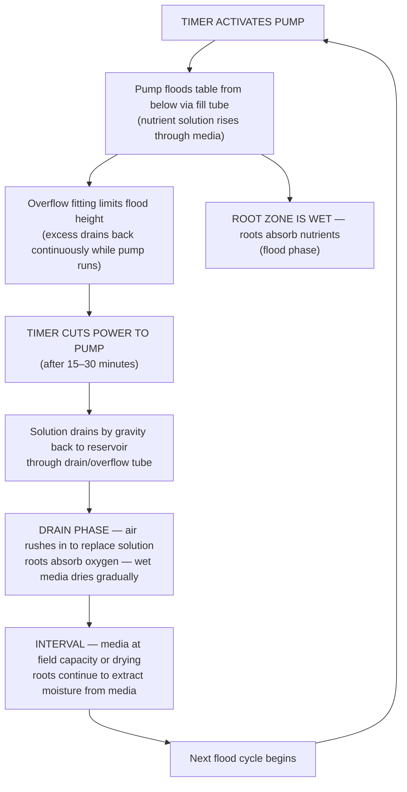
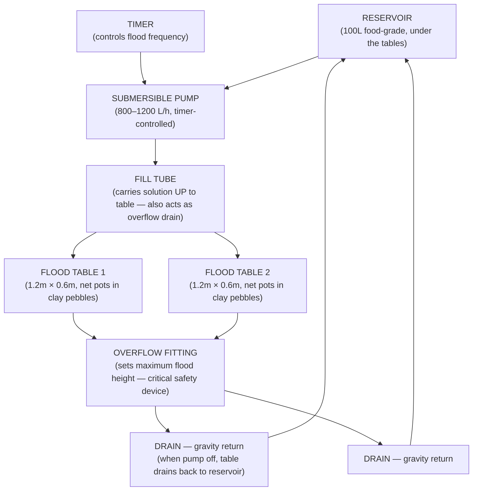
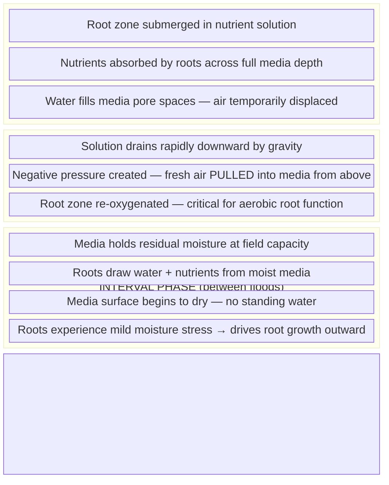

# Guide 01 — Ebb & Flow Basics
## How Flood-and-Drain Hydroponics Works

---

## Table of Contents

- [1. History and Origin](#1-history-and-origin)
- [2. Core Principle: The Flood-and-Drain Cycle](#2-core-principle-the-flood-and-drain-cycle)
- [3. Anatomy of an Ebb & Flow System](#3-anatomy-of-an-ebb-flow-system)
  - [Component Descriptions](#component-descriptions)
- [4. The Overflow Fitting — The Critical Safety Device](#4-the-overflow-fitting-the-critical-safety-device)
  - [How It Sets Flood Depth](#how-it-sets-flood-depth)
  - [Fill Tube vs Overflow Tube](#fill-tube-vs-overflow-tube)
- [5. Flood Frequency and Duration Science](#5-flood-frequency-and-duration-science)
  - [The Core Variables](#the-core-variables)
  - [Calculating Your Schedule](#calculating-your-schedule)
  - [Media-Specific Guidelines](#media-specific-guidelines)
- [6. Root Zone Dynamics During Flood and Drain](#6-root-zone-dynamics-during-flood-and-drain)
  - [The Wet-Dry Cycle Is the Point](#the-wet-dry-cycle-is-the-point)
  - [Anaerobic Risk](#anaerobic-risk)
- [7. Ebb & Flow vs Other Systems Comparison](#7-ebb-flow-vs-other-systems-comparison)
- [8. Why Ebb & Flow Suits a Wider Crop Range](#8-why-ebb-flow-suits-a-wider-crop-range)
  - [Strengths for Heavier Crops](#strengths-for-heavier-crops)
  - [Limitations](#limitations)
- [9. Timer Science: Mechanical vs Digital Timers](#9-timer-science-mechanical-vs-digital-timers)
  - [Mechanical (Analogue) Timers](#mechanical-analogue-timers)
  - [Digital Timers](#digital-timers)
  - [Redundancy Strategy](#redundancy-strategy)
- [10. What Happens During Pump or Timer Failure](#10-what-happens-during-pump-or-timer-failure)
  - [Failure Mode A — Pump Stuck ON (Flood Won't Drain)](#failure-mode-a-pump-stuck-on-flood-wont-drain)
  - [Failure Mode B — Pump or Timer Stuck OFF (No Floods)](#failure-mode-b-pump-or-timer-stuck-off-no-floods)
  - [Emergency Protocol](#emergency-protocol)
- [11. Scaling: Adding Tables and Channels](#11-scaling-adding-tables-and-channels)
- [12. Pros and Cons Summary](#12-pros-and-cons-summary)
- [13. Key Numbers Reference Card](#13-key-numbers-reference-card)


[↑ Back to TOC](#table-of-contents)

## 1. History and Origin

Ebb & Flow — also called flood-and-drain — is one of the oldest formalised hydroponic methods, with roots that pre-date modern hydroponics science. Flood irrigation itself goes back to ancient Egypt and Mesopotamia, where controlled inundation of grow beds was the foundation of agriculture. The hydroponic interpretation emerged alongside other technique-based growing systems in the 1970s and 1980s, developed in parallel with NFT and DWC as commercial greenhouse operators sought methods suited to heavier, more varied crops.

Unlike NFT, which was developed by a single researcher (Dr. Allen Cooper) and published with precision, Ebb & Flow evolved empirically across commercial greenhouse operations in the Netherlands, Germany, and North America. Dutch growers in particular refined the technique during the 1980s for tomato, pepper, and cucumber production in rockwool slabs — a commercial application that remains dominant in high-end greenhouse production today.

The home and hobby hydroponic market adopted Ebb & Flow extensively from the 1990s onward because it is forgiving, versatile, and requires only modest technical knowledge. A timer, a pump, a flood table, and a reservoir are all you need. The flood-and-drain cycle is easy to understand, easy to adjust, and tolerates a wider range of crops, media, and management styles than NFT.

**Why this system uses Ebb & Flow for Zone A:** The outdoor grow tables in this system need to handle everything from fast-cycling lettuce to long-season tomatoes and cucumbers. The media volume in each flood table provides structural support for heavy plants, buffers nutrient and pH swings, and accommodates a range of root architectures that an NFT channel simply cannot support.

---


[↑ Back to TOC](#table-of-contents)

## 2. Core Principle: The Flood-and-Drain Cycle

The defining mechanism of Ebb & Flow is simple: the grow table is periodically flooded with nutrient solution from below, then drained back to the reservoir by gravity.



**Three simultaneous benefits:**
1. **Nutrient delivery** — flooding delivers a fresh charge of nutrients directly to the root zone throughout the media volume
2. **Oxygenation** — the drain phase creates negative pressure that draws fresh air into the media pore spaces, re-oxygenating the root zone
3. **Media buffering** — unlike NFT (where roots hang in air between cycles), flood table media holds moisture between floods, giving plants a reservoir of water and nutrients to draw from

**Why flooding from below matters:** Top-down irrigation creates dry zones and uneven wetting. Bottom-up flooding ensures the entire media column is wetted uniformly, from bottom to top, forcing out stale air as the water rises and drawing in fresh oxygen as it drains.

---


[↑ Back to TOC](#table-of-contents)

## 3. Anatomy of an Ebb & Flow System

Every Ebb & Flow system — from a single tray on a balcony to a multi-table commercial setup — shares the same fundamental components:



### Component Descriptions

| Component | Function | Notes |
|-----------|----------|-------|
| **Reservoir** | Holds nutrient solution | 100L food-grade, shaded, under flood tables |
| **Submersible pump** | Pumps solution up to flood tables during flood cycle | 800–1200 L/h; must be timer-controlled |
| **Timer** | Controls flood cycle frequency and duration | Digital preferred; 15-min increments minimum |
| **Fill tube (inlet fitting)** | Carries solution from pump to table bottom | 19–25mm barbed fitting through table base |
| **Overflow fitting** | Sets maximum flood depth; allows return to reservoir during flood | Standpipe height = maximum flood level |
| **Flood tables** | Shallow watertight trays where plants grow | Food-safe plastic or timber-lined pond liner |
| **Growing media** | Clay pebbles (LECA) primary; holds plants, buffers moisture | 75–100mm depth typical |
| **Net pots** | Hold individual plants in media | 50mm (greens/herbs), 75–100mm (fruiting) |
| **Drain lines** | Return drained solution from table to reservoir | Gravity-fed; no pump needed for drain |

---


[↑ Back to TOC](#table-of-contents)

## 4. The Overflow Fitting — The Critical Safety Device

The overflow fitting is the most important component in an Ebb & Flow system. Without it, leaving the pump running would flood the table until it overflows onto the floor, drowning roots in permanently standing water. The overflow fitting prevents this in two ways simultaneously.

### How It Sets Flood Depth

The overflow fitting is a standpipe — a vertical tube inserted through the base of the flood table. Its height above the table floor directly determines the maximum flood depth:

```
  OVERFLOW FITTING — HOW IT WORKS:

  Table cross-section (side view):

    ┌─────────────────────────────────────┐  ← table rim
    │                                     │
    │  ← flood level (set by overflow)    │  ← top of overflow standpipe
    │  ← ← ← ← ← ← ← ← ← ← ← ← ← ← ←  │
    │   CLAY PEBBLES / MEDIA              │
    │         roots in media              │
    │                                     │
    │  ← ← bottom of table ← ← ← ←      │
    └──────┬──────────────────────┬───────┘
           │                      │
      FILL TUBE               OVERFLOW TUBE
      (pump pushes          (drains at max level
       solution IN)          continuously back
                              to reservoir)

  While pump runs:
  - Solution enters via fill tube
  - Rises to overflow height
  - Any excess immediately exits via overflow back to reservoir
  - Flood depth is PRECISELY controlled by overflow standpipe height

  When pump stops:
  - No more inflow
  - All solution drains DOWN through the fill tube OR overflow tube
  - Table empties completely by gravity
```

### Fill Tube vs Overflow Tube

Most Ebb & Flow tables use **two fittings through the table base**, not one:

| Fitting | Role During Flood | Role During Drain |
|---------|-----------------|------------------|
| **Fill/inlet fitting** | Solution pumped IN from below | Gravity drain path when pump off |
| **Overflow fitting** | Sets max flood height; overflow returns to reservoir | Also drains — but primarily sets level |

The overflow standpipe height is adjustable — by using a taller or shorter standpipe, you change your flood depth. For this system:
- **Leafy greens / herbs:** flood depth 2–3cm above clay pebble surface
- **Fruiting crops (tomatoes, peppers, cucumbers):** flood depth 3–5cm above clay pebble surface

> **Critical rule:** The overflow fitting must always be lower than the table rim by at least 3–5cm. If the overflow fails or gets blocked, the table must not overflow onto the floor — a blocked overflow with a pump running will simply fill to the rim and overflow. Keep the overflow fitting clear of roots and debris.

---


[↑ Back to TOC](#table-of-contents)

## 5. Flood Frequency and Duration Science

### The Core Variables

Flood frequency (how often per day you flood) and flood duration (how long each flood lasts) are determined by three interacting factors:

```
  FLOOD SCHEDULE DETERMINANTS:

  1. GROWING MEDIA
     Clay pebbles (LECA):  Drains fast, dries fast → needs more frequent flooding
                           Typical: 3–4× per day in warm weather
     Coco coir:            Retains water well → needs less frequent flooding
                           Typical: 2–3× per day
     Mixed (coco + clay):  Intermediate → start at 3× per day

  2. PLANT STAGE / SIZE
     Seedling (small root zone): 2× per day (media stays moist longer)
     Established vegetative:     3× per day
     Large fruiting crop:        4× per day (high transpiration rate)

  3. TEMPERATURE / EVAPOTRANSPIRATION
     Cool day (<20°C):     2× per day (slower drying)
     Warm day (20–28°C):   3× per day
     Hot day (>28°C):      4× per day (rapid transpiration)
```

### Calculating Your Schedule

A flood cycle must be long enough to fully wet the media column from bottom to top before the pump stops. Insufficient duration = dry pockets in the upper media. Too long = no benefit (overflow handles the max level anyway, but pump wears unnecessarily).

```
  FLOOD DURATION CALCULATION:

  Table dimensions: 1.2m × 0.6m = 0.72 m² surface area
  Media depth: 100mm = 0.1m
  Media volume: 0.72 × 0.1 = 0.072 m³ = 72L
  Porosity of clay pebbles: ~40% air space
  Volume to fill pore space: 72L × 0.4 = ~29L

  Pump output at head pressure (approx 0.5m lift): ~700 L/h = 11.7 L/min

  Time to fill pore space: 29L ÷ 11.7 L/min ≈ 2.5 minutes

  Add buffer for distribution and wetting lag: ×3–4 multiplier

  Minimum flood duration: ~8–10 minutes
  Recommended flood duration: 15–20 minutes (safe margin + complete wetting)
  Maximum useful duration: 30 minutes (diminishing returns after full saturation)

  Note: Most timers have 15-minute minimum increments — 15 minutes is the
  standard practical flood duration for this system.
```

### Media-Specific Guidelines

| Media | Flood Duration | Flood Frequency | Notes |
|-------|---------------|----------------|-------|
| Clay pebbles (LECA) only | 15–20 min | 3–4× per day | Fast drain; needs more floods |
| Coco coir only | 15 min | 2–3× per day | Retains moisture; risk of overwatering |
| 70% clay / 30% coco | 15–20 min | 3× per day | Good compromise |
| Rockwool slabs | 10–15 min | 3–5× per day | Commercial use; very fast drain |

**First-season rule:** Start at 3× per day for 15 minutes. Observe media moisture 1 hour after a flood — if it feels completely dry (bone dry), increase frequency. If still saturated (no air space), decrease frequency. Adjust in increments of one flood per day.

---


[↑ Back to TOC](#table-of-contents)

## 6. Root Zone Dynamics During Flood and Drain

### The Wet-Dry Cycle Is the Point

The most important thing to understand about Ebb & Flow is that the **alternating wet and dry phases are both required for healthy roots** — not just tolerated. This is not a system that keeps roots continuously wet (like DWC), nor one that barely wets roots (like Kratky). It deliberately cycles between the two states:



**The oxygen exchange mechanism:** As solution drains from the media, it creates a partial vacuum that actively draws fresh atmospheric air down through the media from the top. This is far more efficient at oxygen delivery than dissolved oxygen alone — it is the same principle as watering a potted plant and seeing air bubbles emerge. In Ebb & Flow, this happens deliberately and repeatedly, several times per day.

### Anaerobic Risk

The flood phase temporarily displaces air from the root zone. This is safe for 15–30 minutes because:
- Roots can tolerate brief anaerobic conditions
- Dissolved oxygen in the flood solution continues to supply root metabolism during the flood

The risk arises when:
- **Flood duration is too long** (>45–60 min): Dissolved O₂ depleted, root suffocation begins
- **Media is compacted or clogged**: Poor drainage → standing water → anaerobic zone
- **Flood frequency is too high with slow-draining media**: Media never fully dries, O₂ debt accumulates
- **Reservoir temperature is high** (>24°C): Less dissolved O₂ in flood solution

**Signs of chronic oxygen deficiency:**
- Roots turning brown (not the slimy Pythium brown — a dry, caramelised brown)
- Wilting despite adequate flood cycles
- Slow growth, yellowing starting from lower leaves
- Foul smell from media between floods (not just after a flood)

---


[↑ Back to TOC](#table-of-contents)

## 7. Ebb & Flow vs Other Systems Comparison

| Feature | Ebb & Flow | NFT | DWC | Kratky | Wick |
|---------|-----------|-----|-----|--------|------|
| **Complexity** | Medium | Medium | Medium | Very low | Very low |
| **Water usage** | Medium | Low | Medium | Very low | Low |
| **Oxygenation** | Good (flood-drain cycle) | Excellent (natural) | Good (air pump) | OK (air gap) | Poor |
| **Pump required** | Yes (timed) | Yes (continuous) | Air pump | No | No |
| **Timer required** | Yes — critical | Optional | No | No | No |
| **Power failure risk** | Medium (media buffers) | High (roots dry fast) | Medium | None | None |
| **Best for** | Tomatoes, peppers, cucumbers, lettuce | Leafy greens, herbs | Lettuce, basil | Lettuce | Herbs |
| **Root veg** | Possible (grow bags better) | Poor | Poor | Poor | Poor |
| **Heavy/tall plants** | Excellent — media provides support | Poor — needs extra support | Poor | Poor | Poor |
| **Media needed** | Yes — significant volume | Minimal | Minimal | None | Yes |
| **Media cost** | Higher (clay pebbles) | Low | Low | None | Moderate |
| **Salt buildup risk** | Yes — media can accumulate salts | Low (flow washes salts) | Low | High | Moderate |
| **Disease spread risk** | Medium (recirculating) | Medium (recirculating) | High | None | Low |
| **Scalability** | Good (add tables) | Excellent (add channels) | Moderate | Low | Low |
| **Beginner friendly** | Yes | Moderate | Moderate | Very | Very |
| **Commercial use** | Very common (greenhouse tomatoes) | Very common (lettuce) | Common | Rare | Rare |

---


[↑ Back to TOC](#table-of-contents)

## 8. Why Ebb & Flow Suits a Wider Crop Range

### Strengths for Heavier Crops

Ebb & Flow's primary advantage over NFT is its suitability for **fruiting and structurally heavy crops**:

**Tomatoes, peppers, cucumbers, courgettes:**
- These plants develop root balls 20–40cm in diameter at maturity
- They need structural support in the root zone — clay pebbles provide this; NFT channels do not
- High transpiration rates mean high water demand — media volume provides a buffer between flood cycles
- Heavy fruit loads need the plant anchored at the base — net pots in deep media are stable; NFT plants wobble

**Why media depth matters for fruiting crops:**

```
  ROOT ZONE COMPARISON:

  NFT channel (75–100mm square PVC):
  ─ Root zone volume: minimal (plant sits in net pot, roots hang into channel)
  ─ Support: poor — large plants need external support structures
  ─ Moisture buffer: virtually none (roots exposed to air between pump cycles)
  ─ Maximum crop: lettuce, herbs, small strawberries

  Ebb & Flow flood table (1.2m × 0.6m × 100mm media depth):
  ─ Root zone volume per plant: large (roots spread through 72L of media per table)
  ─ Support: excellent — clay pebbles hold the root ball firmly
  ─ Moisture buffer: significant — media holds moisture for hours between floods
  ─ Maximum crop: full-size tomatoes, cucumbers, peppers
```

**Lettuce and herbs also grow well** — E&F is not only for fruiting crops. Leafy crops in clay pebbles grow at least as fast as in NFT, with the added advantage that pump failure does not immediately endanger them (media holds moisture for hours, not minutes).

### Limitations

Ebb & Flow is not ideal for every scenario:
- **Root vegetables:** Roots need to grow into deep, uniform media without obstruction from fittings — grow bags (Zone C) remain the better choice
- **Very small operations:** The setup cost (trays, fittings, pump, timer, reservoir) is higher than a simple Kratky jar
- **Minimalist setups:** Media cost and volume is significant — not suited to growers wanting to minimise inputs

---


[↑ Back to TOC](#table-of-contents)

## 9. Timer Science: Mechanical vs Digital Timers

The timer is not an accessory in Ebb & Flow — it **is** the system's brain. A timer failure is equivalent to a pump failure in NFT. Understanding timer types and their failure modes is essential.

### Mechanical (Analogue) Timers

```
  MECHANICAL TIMER CHARACTERISTICS:

  How it works:   Rotating dial with physical ON/OFF pins/tabs
  Minimum increment: 15 minutes (most models) — critical limitation
  Failure modes:
    - Pins accidentally knocked off their set positions
    - Motor wears over time — timer runs slow or fast
    - Internal spring failure — timer stops at random position
    - Pins stick in ON or OFF position during wet/outdoor conditions

  Outdoor suitability: Poor — contact corrosion in damp conditions
  Cost: $5–$15
  Verdict: Acceptable indoors, not recommended for outdoor E&F systems
```

### Digital Timers

```
  DIGITAL TIMER CHARACTERISTICS:

  How it works:   Electronic clock with programmable ON/OFF events
  Minimum increment: 1 minute (most models) — flexible scheduling
  Failure modes:
    - Power loss resets schedule (requires battery backup or reprogramming)
    - Display failure — schedule runs correctly but you cannot read/verify it
    - Relay contact wear — timer activates but pump doesn't start
    - Software freeze — rare but documented in cheap units

  Outdoor suitability: Use IP44-rated or outdoor-specific units; protect from rain
  Cost: $10–$30
  Verdict: Recommended — 1-minute increments allow precise schedule adjustment
```

### Redundancy Strategy

For an outdoor system, a single timer failure can destroy an entire crop. Recommended protections:

1. **Log your timer settings:** Write down the flood schedule (start times, duration) — if the timer resets due to power cut, you can reprogram immediately
2. **Battery backup timer:** Some digital timers have a small battery that holds the programme during brief power outages — worth the small extra cost
3. **Smart plug alternative:** A WiFi smart plug (e.g., Tapo, Kasa) controlled via a phone app allows remote monitoring and manual override — also alerts you if power draw drops unexpectedly
4. **Physical inspection rule:** Check that the pump is actually running during each flood cycle (at least once per day) — you cannot rely on the timer display alone

---


[↑ Back to TOC](#table-of-contents)

## 10. What Happens During Pump or Timer Failure

Ebb & Flow has two distinct failure modes, each with different consequences and response timelines.

### Failure Mode A — Pump Stuck ON (Flood Won't Drain)

This occurs if the timer fails in the ON position, the timer programme is corrupted, or the pump is wired directly without a timer.

```
  PUMP STUCK ON — TIMELINE:

  0 min:      Table floods to overflow level — overflow runs continuously back to reservoir
              (system is working as designed for a continuous flood)
  30–60 min:  Roots have been fully submerged for an extended period
              Dissolved oxygen in solution depletes
  1–2 hours:  Root suffocation begins — roots lose ability to absorb nutrients
  2–4 hours:  Visible wilting despite roots being in water (oxygen starvation)
  4–8 hours:  Pythium begins to colonise stressed root zone
  8–24 hours: Root rot advancing — plants may not recover

  IMMEDIATE RESPONSE:
  1. Cut power to pump manually
  2. Verify tables drain (overflow/drain fittings not blocked)
  3. Inspect roots — trim and treat if early rot detected
  4. Diagnose timer failure and repair or replace before next flood
```

### Failure Mode B — Pump or Timer Stuck OFF (No Floods)

This is the more common failure mode — the pump stops and no further floods occur.

```
  PUMP STUCK OFF — TIMELINE (clay pebble media, warm day):

  0 hours:    Last flood occurred normally — media at field capacity
  2–4 hours:  Media draining to residual moisture — roots still well supplied
  4–8 hours:  Media beginning to dry — roots drawing on residual moisture
  8–12 hours: Media significantly dry — plants begin mild stress (wilting in heat)
  12–24 hours: Significant root zone desiccation — visible wilting and stress
  24–48 hours: Severe stress — young seedlings may not recover
  48+ hours:  Established plants likely damaged; recovery uncertain

  NOTE: Clay pebbles buffer MUCH longer than NFT (where roots dry in 15 minutes).
  This is a critical advantage of Ebb & Flow over NFT for power failure resilience.

  IMMEDIATE RESPONSE:
  1. Manually flood tables using a watering can — pour solution over media surface
  2. Diagnose pump/timer failure
  3. If extended failure (>24h): inspect roots for desiccation and disease
```

### Emergency Protocol

- Keep a spare pump (same model or compatible)
- Know the manual override on your timer (most have a manual ON button)
- Keep a watering can accessible at all times during the growing season
- If away from home: a WiFi smart plug on the pump circuit can alert you to power draw anomalies

---


[↑ Back to TOC](#table-of-contents)

## 11. Scaling: Adding Tables and Channels

The flood table design in this system (2× 1.2m × 0.6m tables sharing one 100L reservoir) is a deliberate starting point, not a fixed limit.

```
  SCALING OPTIONS:

  Current system:
  ─ 2 flood tables (1.2m × 0.6m each) = 1.44 m² total grow area
  ─ 1 × 100L reservoir
  ─ 1 × 800–1200 L/h pump

  Scale up Option 1 — Larger reservoir:
  ─ Upgrade to 150–200L reservoir
  ─ Same 2 tables — more nutrient buffer, less frequent full changes
  ─ No pump upgrade needed

  Scale up Option 2 — Add a third table:
  ─ Add 1 × 1.2m × 0.6m table
  ─ Upgrade reservoir to 150L minimum
  ─ Check pump output — may need 1200–1500 L/h pump
  ─ Ensure flood manifold can supply all tables simultaneously

  Scale up Option 3 — Dedicated fruiting table:
  ─ Separate the current mixed table into:
    Table A (leafy greens, herbs) — 2–3 floods/day at low EC
    Table B (tomatoes/peppers) — 3–4 floods/day at high EC
  ─ Independent timers for each table — allows different flood schedules
  ─ Both tables still share the reservoir (or separate reservoirs for best control)

  Rule of thumb:
  ─ Allow 10L reservoir volume per large plant (tomato/pepper/cucumber)
  ─ Allow 5L reservoir volume per medium plant (lettuce, herbs)
  ─ Minimum reservoir: 80L for 2 tables at moderate density
```

When adding tables, also consider:
- **Manifold sizing:** A shared 25mm supply line can feed 2 tables; upgrade to 32mm for 3+
- **Drain capacity:** All tables must drain simultaneously without overwhelming the reservoir capacity
- **Timer complexity:** Independent timers per table allow stage-specific schedules — worth the small extra cost

---


[↑ Back to TOC](#table-of-contents)

## 12. Pros and Cons Summary

| Advantage | Detail |
|-----------|--------|
| Wide crop range | From lettuce to tomatoes to cucumbers — one system handles all |
| Media buffers failures | Clay pebbles hold moisture for hours — pump failure is not immediately catastrophic |
| Media supports heavy plants | Root balls anchored in LECA — no external support for short plants |
| Simple mechanics | Timer + pump — nothing complex or fragile in the flood/drain mechanism |
| Good oxygenation | Drain phase actively re-oxygenates root zone each cycle |
| Outdoor temp tolerance | Media depth insulates root zone from rapid temperature swings |
| Reusable media | Clay pebbles last for years with proper sterilisation |
| Easy root inspection | Lift net pot to check roots at any time |

| Disadvantage | Detail |
|-------------|--------|
| Timer dependency | Timer failure = either flooding or drought |
| Salt accumulation | Clay pebbles accumulate nutrient salts over time — needs flush protocol |
| Media cost | LECA is more expensive than a no-media system |
| Algae risk in media | Wet clay pebbles exposed to light grow algae — tables should be shaded |
| More infrastructure | Tables, fittings, timer, pump — higher initial setup vs Kratky |
| Pythium risk if flooded too long | Standing water in media creates disease risk if flood duration is excessive |
| Reservoir management | Shared reservoir means disease can spread; requires clean management |
| pH/EC harder to isolate | Media buffers changes — good normally, but masks problems if you do not test regularly |

---


[↑ Back to TOC](#table-of-contents)

## 13. Key Numbers Reference Card

| Parameter | Value |
|-----------|-------|
| Flood table dimensions (each) | 1.2m × 0.6m |
| Flood depth | 2–5cm above media surface |
| Flood duration | 15–30 minutes |
| Flood frequency | 2–4× per day (varies by media, temp, plant size) |
| Interval between floods | 4–12 hours (varies) |
| Pump capacity | 800–1200 L/h submersible |
| Reservoir size | 100L food-grade |
| Media depth in table | 75–100mm clay pebbles |
| Overflow fitting height | = desired flood depth above table floor |
| Net pot sizes | 50mm (greens/herbs), 75–100mm (fruiting crops) |
| Media pump failure buffer | 8–24 hours (vs 15–30 min for NFT) |
| Optimal solution temperature | 18–22°C |
| Reservoir change interval | Every 7–14 days |

---


[↑ Back to TOC](#table-of-contents)

*Next: [`guide/ebb-and-flow/02-nutrient-solution.md`](02-nutrient-solution.md) — EC, pH, macros, micros, mixing, and schedules*
