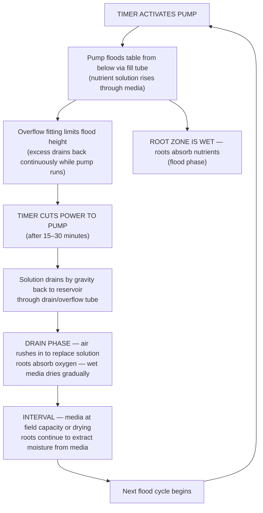
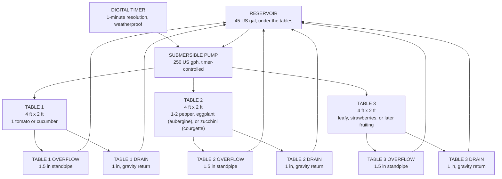
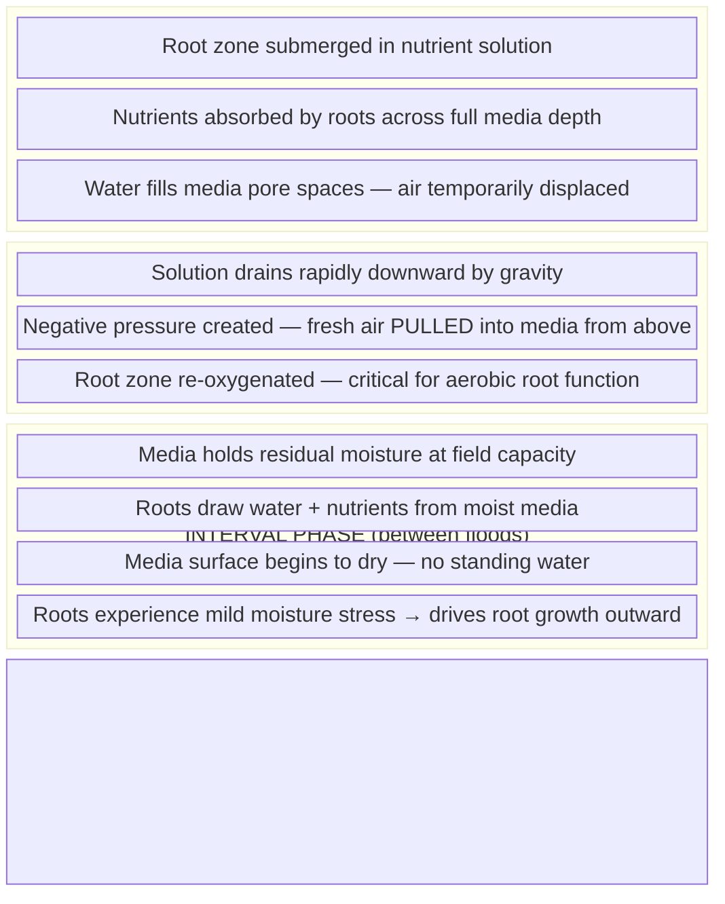

# Guide 01 — Ebb & Flow Basics
## How Flood-and-Drain Hydroponics Works

[](../../README.md)
[](https://creativecommons.org/licenses/by-nc-sa/4.0/)


---

## Table of Contents

- [1. History and Origin](#1-history-and-origin)
- [2. Core Principle: The Flood-and-Drain Cycle](#2-core-principle-the-flood-and-drain-cycle)
- [3. Anatomy of an Ebb & Flow System](#3-anatomy-of-an-ebb-flow-system)
  - [Component Descriptions](#component-descriptions)
- [4. The Overflow Fitting — The Critical Safety Device](#4-the-overflow-fitting-the-critical-safety-device)
  - [How It Sets Flood Depth](#how-it-sets-flood-depth)
  - [Fill Tube vs Overflow Tube](#fill-tube-vs-overflow-tube)
- [5. Flood Frequency and Duration Science](#5-flood-frequency-and-duration-science)
  - [The Core Variables](#the-core-variables)
  - [Calculating Your Schedule](#calculating-your-schedule)
  - [Media-Specific Guidelines](#media-specific-guidelines)
- [6. Root Zone Dynamics During Flood and Drain](#6-root-zone-dynamics-during-flood-and-drain)
  - [The Wet-Dry Cycle Is the Point](#the-wet-dry-cycle-is-the-point)
  - [Anaerobic Risk](#anaerobic-risk)
- [7. Ebb & Flow vs Other Systems Comparison](#7-ebb-flow-vs-other-systems-comparison)
- [8. Why Ebb & Flow Suits a Wider Crop Range](#8-why-ebb-flow-suits-a-wider-crop-range)
  - [Strengths for Heavier Crops](#strengths-for-heavier-crops)
  - [Limitations](#limitations)
- [9. Timer Science: Mechanical vs Digital Timers](#9-timer-science-mechanical-vs-digital-timers)
  - [Mechanical (Analog) Timers](#mechanical-analog-timers)
  - [Digital Timers](#digital-timers)
  - [Redundancy Strategy](#redundancy-strategy)
- [10. What Happens During Pump or Timer Failure](#10-what-happens-during-pump-or-timer-failure)
  - [Failure Mode A — Pump Stuck ON (Flood Won't Drain)](#failure-mode-a-pump-stuck-on-flood-wont-drain)
  - [Failure Mode B — Pump or Timer Stuck OFF (No Floods)](#failure-mode-b-pump-or-timer-stuck-off-no-floods)
  - [Emergency Protocol](#emergency-protocol)
- [11. Scaling: Adding Tables and Channels](#11-scaling-adding-tables-and-channels)
- [12. Pros and Cons Summary](#12-pros-and-cons-summary)
- [13. Key Numbers Reference Card](#13-key-numbers-reference-card)


[↑ Back to TOC](#table-of-contents)

## 1. History and Origin

Ebb & Flow — also called flood-and-drain — is one of the oldest formalized hydroponic methods, with roots that pre-date modern hydroponics science. Flood irrigation itself goes back to ancient Egypt and Mesopotamia, where controlled inundation of grow beds was the foundation of agriculture. The hydroponic interpretation emerged alongside other technique-based growing systems in the 1970s and 1980s, developed in parallel with NFT and DWC as commercial greenhouse operators sought methods suited to heavier, more varied crops.

Unlike NFT, which was developed by a single researcher (Dr. Allen Cooper) and published with precision, Ebb & Flow evolved empirically across commercial greenhouse operations in the Netherlands, Germany, and North America. Dutch growers in particular refined the technique during the 1980s for tomato, pepper, and cucumber production in rockwool slabs — a commercial application that remains dominant in high-end greenhouse production today.

The home and hobby hydroponic market adopted Ebb & Flow extensively from the 1990s onward because it is forgiving, versatile, and requires only modest technical knowledge. A timer, a pump, a flood table, and a reservoir are all you need. The flood-and-drain cycle is easy to understand, easy to adjust, and tolerates a wider range of crops, media, and management styles than NFT.

**Why this system uses Ebb & Flow for Zone A:** The outdoor grow tables in this system need to handle everything from fast-cycling lettuce to long-season tomatoes and cucumbers. The media volume in each flood table provides structural support for heavy plants, buffers nutrient and pH swings, and accommodates a range of root architectures that an NFT channel simply cannot support.


---


[↑ Back to TOC](#table-of-contents)

## 2. Core Principle: The Flood-and-Drain Cycle

The defining mechanism of Ebb & Flow is simple: the grow table is periodically flooded with nutrient solution from below, then drained back to the reservoir by gravity.



**Three simultaneous benefits:**
1. **Nutrient delivery** — flooding delivers a fresh charge of nutrients directly to the root zone throughout the media volume
2. **Oxygenation** — the drain phase creates negative pressure that draws fresh air into the media pore spaces, re-oxygenating the root zone
3. **Media buffering** — unlike NFT (where roots hang in air between cycles), flood table media holds moisture between floods, giving plants a reservoir of water and nutrients to draw from

**Why flooding from below matters:** Top-down irrigation creates dry zones and uneven wetting. Bottom-up flooding ensures the entire media column is wetted uniformly, from bottom to top, forcing out stale air as the water rises and drawing in fresh oxygen as it drains.


---


[↑ Back to TOC](#table-of-contents)

## 3. Anatomy of an Ebb & Flow System

Every Ebb & Flow system — from a single tray on a balcony to a multi-table commercial setup — shares the same fundamental components:



### Component Descriptions

| Component | Function | Notes |
|-----------|----------|-------|
| **Reservoir** | Holds nutrient solution | 45 US gal (170 L) recommended, range 40–50 US gal (151–189 L). Food-grade, shaded, under the tables |
| **Submersible pump** | Pumps solution up to the flood tables | 250 US gph (950 L/h) recommended, range 200–300 US gph (760–1,140 L/h), about 35 W. Timer-controlled |
| **Timer** | Controls flood frequency and duration | Digital, 1-minute resolution, in a weatherproof box. Not a mechanical timer |
| **Fill tube (inlet fitting)** | Carries solution from the pump to the table | ¾–1 in (19–25 mm) barbed fitting through the table base. This is not the overflow |
| **Overflow fitting** | Sets maximum flood depth; returns excess while the pump runs | 1½ in (40 mm) bulkhead and standpipe, one per table |
| **Flood tables** | Shallow watertight trays where plants grow | 3 tables, each 4 ft × 2 ft (1.22 m × 0.61 m), perfectly level. Food-safe plastic or a timber frame with pond liner |
| **Growing media** | LECA holds plants and buffers moisture | 5 in (13 cm) deep. 25 US gal (95 L) per table |
| **Net pots** | Hold individual plants in the media | 2 in (50 mm) for greens and herbs; 3–4 in (75–100 mm) for fruiting crops |
| **Drain** | Returns solution when the pump is off | 1 in (25 mm) bulkhead, one per table. Gravity. No drain pump |


---


[↑ Back to TOC](#table-of-contents)

## 4. The Overflow Fitting — The Critical Safety Device

The overflow fitting is the most important component in an Ebb & Flow system. Without it, leaving the pump running would flood the table until it overflows onto the floor, drowning roots in permanently standing water. The overflow fitting prevents this in two ways simultaneously.

### How It Sets Flood Depth

The overflow fitting is a standpipe — a vertical tube inserted through the base of the flood table. Its height above the table floor directly determines the maximum flood depth:

```
  OVERFLOW FITTING — HOW IT WORKS:

  Table cross-section (side view):

    ┌─────────────────────────────────────┐  ← table rim
    │                                     │
    │   CLAY PEBBLES / MEDIA (surface)    │
    │  ← flood level (set by overflow)    │  ← top of overflow standpipe
    │     about 3/4 in (2 cm) BELOW       │     (capillarity wets the top layer)
    │     the media surface               │
    │         roots in media              │
    │                                     │
    │  ← ← bottom of table ← ← ← ←      │
    └──────┬──────────────────────┬───────┘
           │                      │
      FILL TUBE               OVERFLOW TUBE
      (pump pushes          (drains at max level
       solution IN)          continuously back
                              to reservoir)

  While pump runs:
  - Solution enters via fill tube
  - Rises to overflow height
  - Any excess immediately exits via overflow back to reservoir
  - Flood depth is PRECISELY controlled by overflow standpipe height

  When pump stops:
  - No more inflow
  - All solution drains DOWN through the fill tube OR overflow tube
  - Table empties completely by gravity
```

### Fill Tube vs Overflow Tube

Most Ebb & Flow tables use **two fittings through the table base**, not one:

| Fitting | Role During Flood | Role During Drain |
|---------|-----------------|------------------|
| **Fill/inlet fitting** | Solution pumped IN from below | Gravity drain path when pump off |
| **Overflow fitting** | Sets max flood height; overflow returns to reservoir | Also drains — but primarily sets level |

The overflow standpipe height is adjustable — a taller or shorter standpipe changes the flood level. For this system:
- **All crops, all three tables:** flood to about ¾ in (2 cm) below the LECA surface. On the 5 in (13 cm) bed the standpipe stands about 4¼ in (11 cm) above the table floor. Capillary action wets the top layer.
- **Never flood above the media surface:** floating pebbles, surface algae, and oxygen starvation follow, and the water volume can run the reservoir down.

> **Critical rule:** The design flood is the level about ¾ in (2 cm) below the media surface. It is not a 3–5 cm deep flood. Keep the top of each standpipe at least 1¼–2 in (3–5 cm) below the table rim so a blocked overflow still has freeboard before water spills on the floor. Keep each overflow clear of roots and debris. Each table has its own 1½ in (40 mm) overflow and its own 1 in (25 mm) drain.


---


[↑ Back to TOC](#table-of-contents)

## 5. Flood Frequency and Duration Science

### The Core Variables

Flood frequency (how often per day you flood) and flood duration (how long each flood lasts) are determined by three interacting factors:

```
  FLOOD SCHEDULE DETERMINANTS:

  1. GROWING MEDIA
     LECA (this build):    Drains fast. Design schedule below.
                           Vegetative: 3× per day
                           Fruiting:   4× per day. This is the ceiling
     Coco coir:            Holds water. Not the flood-table fill in this build
                           (Zone B and Zone C only)
     Mixed coco + LECA:    If you ever blend coarse chips into a table, stay at
                           3× per day. Do not add floods to "make up" for coco

  2. PLANT STAGE / SIZE
     Seedling and vegetative:  3× per day
     Fruiting:                 4× per day (high transpiration). That is the last step

  3. TEMPERATURE / EVAPOTRANSPIRATION
     Cool day, below 68°F (20°C):     keep 3×; shorten duration if the media stays saturated
     Warm day, 68–82°F (20–28°C):     3× vegetative, 4× fruiting
     Heatwave, 90–100°F (32–38°C):    keep 4 floods, shorten them if needed,
                                      and deploy 40% shade. Do not drop 4 to 2.
                                      Do not add a 5th flood
```

### Calculating Your Schedule

A flood cycle must be long enough to fully wet the media column from bottom to top before the pump stops. Insufficient duration = dry pockets in the upper media. Too long = no benefit (overflow handles the max level anyway, but pump wears unnecessarily).

```
  FLOOD DURATION CALCULATION:

  Table: 4 ft × 2 ft (1.22 m × 0.61 m), about 8 ft² (0.74 m²)
  Media depth: 5 in (13 cm)
  Bulk LECA: 25 US gal (95 L) per table
  Pore space between pebbles: about 40%
  Water to fill that pore space: about 10 US gal (38 L) per table
  Flood stops 3/4 in (2 cm) below the surface, so the real volume is a little less

  Pump: 250 US gph (950 L/h) at modest head, about 4 US gal/min (15 L/min)
  Time to fill one table's pore space: about 2–3 minutes
  Three tables together: about 30 US gal (114 L) out of the 45 US gal (170 L) reservoir

  Add a multiplier of about 3–4 for distribution and wetting lag.

  Useful flood duration: 15–30 minutes
  The digital timer resolves to 1 minute, so 15 minutes is a choice, not a
  timer limit. Shorten toward 15 minutes in a heatwave if roots stay wet
  too long. Do not lengthen past 30 minutes hoping to replace a missed flood.
```

### Media-Specific Guidelines

| Media | Flood Duration | Flood Frequency | Notes |
|-------|---------------|----------------|-------|
| LECA only (this build) | 15–30 min | 3× vegetative, 4× fruiting | 4× is the ceiling |
| Coco coir only | — | Not used as flood-table fill | Holds water; Zone B and Zone C only |
| 80% LECA / 20% coarse coco chips | 15–20 min | 3× per day | Do not push this mix to 4× |
| Rockwool slabs | 10–15 min | 3–4× per day | Commercial reference only. Not a 5th flood |

**First-season rule:** Start at 3 floods per day for 15–20 minutes. One hour after a flood, the LECA should be moist inside the pebbles, not bone dry and not still full of free water. Fruiting crops may move to 4 floods per day. That is the last step. If a heatwave at 90–100°F (32–38°C) still stresses plants at 4 floods, shorten the duration and put on 40% shade.


---


[↑ Back to TOC](#table-of-contents)

## 6. Root Zone Dynamics During Flood and Drain

### The Wet-Dry Cycle Is the Point

The most important thing to understand about Ebb & Flow is that the **alternating wet and dry phases are both required for healthy roots** — not just tolerated. This is not a system that keeps roots continuously wet (like DWC), nor one that barely wets roots (like Kratky). It deliberately cycles between the two states:



**The oxygen exchange mechanism:** As solution drains from the media, it creates a partial vacuum that actively draws fresh atmospheric air down through the media from the top. This is far more efficient at oxygen delivery than dissolved oxygen alone — it is the same principle as watering a potted plant and seeing air bubbles emerge. In Ebb & Flow, this happens deliberately and repeatedly, several times per day.

### Anaerobic Risk

The flood phase temporarily displaces air from the root zone. This is safe for 15–30 minutes because:
- Roots can tolerate brief anaerobic conditions
- Dissolved oxygen in the flood solution continues to supply root metabolism during the flood

The risk arises when:
- **Flood duration is too long** (>45–60 min): Dissolved O₂ depleted, root suffocation begins
- **Media is compacted or clogged**: Poor drainage → standing water → anaerobic zone
- **Flood frequency is too high with slow-draining media**: Media never fully dries, O₂ debt accumulates
- **Reservoir temperature is high**, above 77°F (25°C): less dissolved oxygen in the flood solution. The aim is 64–72°F (18–22°C)

**Signs of chronic oxygen deficiency:**
- Roots turning brown (not the slimy Pythium brown — a dry, caramelized brown)
- Wilting despite adequate flood cycles
- Slow growth, yellowing starting from lower leaves
- Foul smell from media between floods (not just after a flood)


---


[↑ Back to TOC](#table-of-contents)

## 7. Ebb & Flow vs Other Systems Comparison

| Feature | Ebb & Flow | NFT | DWC | Kratky | Wick |
|---------|-----------|-----|-----|--------|------|
| **Complexity** | Medium | Medium | Medium | Very low | Very low |
| **Water usage** | Medium | Low | Medium | Very low | Low |
| **Oxygenation** | Good (flood-drain cycle) | Excellent (natural) | Good (air pump) | OK (air gap) | Poor |
| **Pump required** | Yes (timed) | Yes (continuous) | Air pump | No | No |
| **Timer required** | Yes — critical | Optional | No | No | No |
| **Power failure risk** | Medium (media buffers) | High (roots dry fast) | Medium | None | None |
| **Best for** | Tomatoes, peppers, cucumbers, lettuce | Leafy greens, herbs | Lettuce, basil | Lettuce | Herbs |
| **Root veg** | Possible (grow bags better) | Poor | Poor | Poor | Poor |
| **Heavy/tall plants** | Excellent — media provides support | Poor — needs extra support | Poor | Poor | Poor |
| **Media needed** | Yes — significant volume | Minimal | Minimal | None | Yes |
| **Media cost** | Higher (clay pebbles) | Low | Low | None | Moderate |
| **Salt buildup risk** | Yes — media can accumulate salts | Low (flow washes salts) | Low | High | Moderate |
| **Disease spread risk** | Medium (recirculating) | Medium (recirculating) | High | None | Low |
| **Scalability** | Good (add tables) | Excellent (add channels) | Moderate | Low | Low |
| **Beginner friendly** | Yes | Moderate | Moderate | Very | Very |
| **Commercial use** | Very common (greenhouse tomatoes) | Very common (lettuce) | Common | Rare | Rare |


---


[↑ Back to TOC](#table-of-contents)

## 8. Why Ebb & Flow Suits a Wider Crop Range

### Strengths for Heavier Crops

Ebb & Flow's primary advantage over NFT is its suitability for **fruiting and structurally heavy crops**:

**Tomatoes, peppers, cucumbers, zucchinis (courgettes):**
- These plants develop root balls 8–16 in (20–40 cm) across at maturity
- They need structural support in the root zone — LECA provides this; an NFT channel does not
- High transpiration means high water demand — the 5 in (13 cm) bed buffers the gap between floods
- Heavy fruit needs the plant anchored — one tomato or cucumber on Table 1, and 1–2 plants on Table 2, each in a 3–4 in (75–100 mm) net pot

**Why media depth matters for fruiting crops:**

```
  ROOT ZONE COMPARISON:

  NFT channel (3–4 in / 76–102 mm square PVC):
  ─ Root zone volume: minimal (plant sits in a net pot, roots hang into the channel)
  ─ Support: poor — large plants need external support
  ─ Moisture buffer: short — a stopped NFT channel is a 15–30 minute problem in warm weather
  ─ Crop fit: lettuce, herbs, and a separate fruiting channel

  Ebb and Flow flood table, 4 ft × 2 ft (1.22 × 0.61 m), LECA 5 in (13 cm):
  ─ Media per table: 25 US gal (95 L). Table 1 holds 1 plant. Table 2 holds 1–2
  ─ Support: LECA holds the root ball
  ─ Moisture buffer: moist LECA holds 8–24 hours after a missed flood
  ─ Crop fit: a full-size tomato or cucumber on Table 1; pepper, eggplant (aubergine), or zucchini (courgette) on Table 2
```

**Lettuce and herbs also grow well** — E&F is not only for fruiting crops. Leafy crops in clay pebbles grow at least as fast as in NFT, with the added advantage that pump failure does not immediately endanger them (media holds moisture for hours, not minutes).

### Limitations

Ebb & Flow is not ideal for every scenario:
- **Root vegetables:** Roots need to grow into deep, uniform media without obstruction from fittings — grow bags (Zone C) remain the better choice
- **Very small operations:** The setup cost (trays, fittings, pump, timer, reservoir) is higher than a simple Kratky jar
- **Minimalist setups:** Media cost and volume is significant — not suited to growers wanting to minimize inputs


---


[↑ Back to TOC](#table-of-contents)

## 9. Timer Science: Mechanical vs Digital Timers

The timer is not an accessory in Ebb & Flow — it **is** the system's brain. A timer failure is equivalent to a pump failure in NFT. Understanding timer types and their failure modes is essential.

### Mechanical (Analog) Timers

```
  MECHANICAL TIMER CHARACTERISTICS:

  How it works:   Rotating dial with physical ON/OFF pins/tabs
  Minimum increment: often 15 minutes — too coarse for a 15–30 minute flood you may need to shorten
  Failure modes:
    - Pins accidentally knocked off their set positions
    - Motor wears over time — timer runs slow or fast
    - Internal spring failure — timer stops at random position
    - Pins stick in ON or OFF position during wet/outdoor conditions

  Outdoor suitability: Poor — contact corrosion in damp conditions
  Cost: $5–$15 (R90–R270)
  Verdict: Not the outdoor timer for this system
```

### Digital Timers

```
  DIGITAL TIMER CHARACTERISTICS:

  How it works:   Electronic clock with programmable ON/OFF events
  Minimum increment: 1 minute (most models) — flexible scheduling
  Failure modes:
    - Power loss resets schedule (requires battery backup or reprogramming)
    - Display failure — schedule runs correctly but you cannot read/verify it
    - Relay contact wear — timer activates but pump doesn't start
    - Software freeze — rare but documented in cheap units

  Outdoor suitability: Weatherproof box, outdoor-rated plugs. 120 V GFCI (SA: 230 V, 30 mA earth-leakage)
  Cost: $10–$30 (R180–R540)
  Verdict: This is the timer. 1-minute resolution is the requirement, not a 15-minute step
```

### Redundancy Strategy

For an outdoor system, a single timer failure can destroy an entire crop. Recommended protections:

1. **Log your timer settings:** Write down the flood schedule (start times, duration) — if the timer resets due to power cut, you can reprogram immediately
2. **Battery backup timer:** Some digital timers have a small battery that holds the program during brief power outages — worth the small extra cost
3. **Smart plug cutoff (required Tier 1):** A WiFi smart plug on the pump (e.g., Tapo, Kasa) must **cut pump power** if draw stays high for >35 minutes (stuck-ON), then alert. Remote monitoring and manual override are extras — alert alone is not the safety action
4. **Physical inspection rule:** Check that the pump is actually running during each flood cycle (at least once per day) — you cannot rely on the timer display alone


---


[↑ Back to TOC](#table-of-contents)

## 10. What Happens During Pump or Timer Failure

Ebb & Flow has two distinct failure modes, each with different consequences and response timelines.

### Failure Mode A — Pump Stuck ON (Flood Won't Drain)

This occurs if the timer fails in the ON position, the timer program is corrupted, or the pump is wired directly without a timer.

```
  PUMP STUCK ON — TIMELINE:

  0 min:      Each table floods to its own overflow. Excess returns to the reservoir.
              The level is correct, but the roots never get a drain phase.
  30–60 min:  Roots stay submerged. Dissolved oxygen in the solution falls.
  2–4 hours:  Root rot risk. This is the action window. Wilting can show even
              though the roots are in water, because the problem is oxygen, not drought.
  After 4 h:  Pythium colonizes the stressed root zone. Recovery gets unlikely.

  A drain-confirmation float that opens the pump relay when the table is still
  up after the pump should be off is the primary safety device. A second timer
  that only restarts a stopped pump does not cover this fault.

  IMMEDIATE RESPONSE:
  1. Cut power to the pump
  2. Confirm each table's own drain and overflow are clear
  3. Inspect roots — trim and treat if rot has started
  4. Repair or replace the timer before the next flood
```

### Failure Mode B — Pump or Timer Stuck OFF (No Floods)

This is the more common failure mode — the pump stops and no further floods occur.

```
  PUMP STUCK OFF — TIMELINE (LECA, warm day):

  0 hours:     Last flood finished normally. Media is at field capacity.
  8–24 hours:  Moist LECA still supplies the roots. This is the normal buffer.
               The pebble surface can look dry while the insides still hold water.
  After 24 h:  The buffer is used up. Visible stress, then desiccation.
               Seedlings fail first. Established plants may still recover if
               you flood as soon as you are back.

  NFT contrast: a stopped channel in warm weather is a 15–30 minute problem.
  That number is not the Ebb and Flow buffer.

  IMMEDIATE RESPONSE:
  1. Flood each table by hand with nutrient solution
  2. Find the pump or timer fault
  3. If the gap was longer than 24 hours, check roots for drying and disease
```

### Emergency Protocol

- Keep a spare pump (same model or compatible)
- Know the manual override on your timer (most have a manual ON button)
- Keep a watering can accessible at all times during the growing season
- If away from home: the required WiFi smart plug on the pump circuit must cut power on stuck-ON (>35 min continuous draw), then alert — do not rely on alert-only monitoring


---


[↑ Back to TOC](#table-of-contents)

## 11. Scaling: Adding Tables and Channels

This build is three 4 ft × 2 ft (1.22 m × 0.61 m) tables on one 45 US gal (170 L) reservoir and one 250 US gph (950 L/h) pump. That is the system these guides describe. Anything below is an optional later change, not a second design.

```
  THIS BUILD:

  ─ 3 tables × 4 ft × 2 ft = 24 ft² (2.2 m²)
  ─ LECA 5 in (13 cm): 25 US gal (95 L) per table, 75 US gal (284 L) placed,
    buy 90 US gal (340 L)
  ─ Reservoir 45 US gal (170 L), acceptable 40–50 US gal (151–189 L)
  ─ Pump 250 US gph (950 L/h), acceptable 200–300 US gph (760–1,140 L/h), about 35 W
  ─ About 10 US gal (38 L) of solution leaves the reservoir per table at full flood
  ─ Three tables at once: about 30 US gal (114 L) out, about 15 US gal (57 L) still
    in a 45 US gal reservoir. The pump stays submerged.

  Optional later — more reservoir on the same three tables:
  ─ A larger tank than 50 US gal (189 L) adds buffer. It is not required.
  ─ The pump does not have to change.

  Optional later — a fourth table:
  ─ Another 4 ft × 2 ft table needs about another 10 US gal (38 L) of flood volume
    and another 25 US gal (95 L) of LECA.
  ─ The 45 US gal reservoir is sized for three tables. A fourth table needs a
    larger reservoir so the pump does not suck air.
  ─ Recheck the pump against the 200–300 US gph (760–1,140 L/h) band before
    buying a bigger one.

  Flood timing on a shared reservoir:
  ─ Table 3 (leafy, or a later fruiting crop) can stay at 3 floods/day while
    Tables 1 and 2 run 4 floods/day in fruit.
  ─ Valves or a second digital timer can do that.
  ─ EC is still one number. All three tables share the reservoir. You cannot
    run lettuce at 1.2 mS/cm and tomato at 3.0 mS/cm in the same tank.
  ─ Set EC for the crops that are actually in the tables. When Tables 1 and 2
    are fruiting, either accept that Table 3 leafy crops sit at the high end
    of their range, or use Table 3 for a later fruiting crop.
```

When you add hardware, also check:
- **Manifold:** this build feeds three tables from a 1 in (25 mm) supply. A fourth table or a long run wants 1¼ in (32 mm)
- **Drains:** each table keeps its own 1 in (25 mm) drain and its own 1½ in (40 mm) overflow. They must all be able to return without the reservoir overflowing
- **Timers:** a second digital timer is reasonable. A mechanical timer is still not the outdoor default


---


[↑ Back to TOC](#table-of-contents)

## 12. Pros and Cons Summary

| Advantage | Detail |
|-----------|--------|
| Wide crop range | From lettuce to tomatoes to cucumbers — one system handles all |
| Media buffers failures | Clay pebbles hold moisture for hours — pump failure is not immediately catastrophic |
| Media supports heavy plants | Root balls anchored in LECA — no external support for short plants |
| Simple mechanics | Timer + pump — nothing complex or fragile in the flood/drain mechanism |
| Good oxygenation | Drain phase actively re-oxygenates root zone each cycle |
| Outdoor temp tolerance | Media depth insulates root zone from rapid temperature swings |
| Reusable media | Clay pebbles last for years with proper sterilization |
| Easy root inspection | Lift net pot to check roots at any time |

| Disadvantage | Detail |
|-------------|--------|
| Timer dependency | Timer failure = either flooding or drought |
| Salt accumulation | Clay pebbles accumulate nutrient salts over time — needs flush protocol |
| Media cost | LECA is more expensive than a no-media system |
| Algae risk in media | Wet clay pebbles exposed to light grow algae — tables should be shaded |
| More infrastructure | Tables, fittings, timer, pump — higher initial setup vs Kratky |
| Pythium risk if flooded too long | Standing water in media creates disease risk if flood duration is excessive |
| Reservoir management | Shared reservoir means disease can spread; requires clean management |
| pH/EC harder to isolate | Media buffers changes — good normally, but masks problems if you do not test regularly |


---


[↑ Back to TOC](#table-of-contents)

## 13. Key Numbers Reference Card

| Parameter | Value |
|-----------|-------|
| Flood tables | 3, each 4 ft × 2 ft (1.22 m × 0.61 m), perfectly level |
| Table 1 | Indeterminate tomato or cucumber, 1 plant |
| Table 2 | Pepper, eggplant (aubergine), or zucchini (courgette), 1–2 plants |
| Table 3 | Lettuce, herbs, pak choi, strawberries, or a later fruiting crop |
| Flood level | About ¾ in (2 cm) below the LECA surface |
| Flood duration | 15–30 minutes. Shorten in a heatwave; do not add a 5th flood |
| Vegetative floods | 3× per day |
| Fruiting floods | 4× per day. This is the ceiling |
| Pump | 250 US gph (950 L/h), range 200–300 US gph (760–1,140 L/h), about 35 W |
| Reservoir | 45 US gal (170 L), range 40–50 US gal (151–189 L) |
| LECA | 5 in (13 cm). 25 US gal (95 L) per table. Buy 90 US gal (340 L) |
| Overflow | 1½ in (40 mm), one per table. Standpipe about 4¼ in (11 cm) on this bed |
| Drain | 1 in (25 mm), one per table |
| Timer | Digital, 1-minute resolution, weatherproof box |
| Net pots | 2 in (50 mm) greens and herbs; 3–4 in (75–100 mm) fruiting |
| Missed-flood buffer | Moist LECA holds 8–24 hours |
| Stuck pump ON | Root rot risk in 2–4 hours |
| Solution temperature | Aim 64–72°F (18–22°C). Act above 77°F (25°C) |
| Reservoir change | Every 10–14 days |
| pH | Working window 5.8–6.2. Acceptable band 5.5–6.5 |

---


---

> **Previous:** [Guide 00 — System Overview](00-system-overview.md)


[↑ Back to TOC](#table-of-contents)

> **Next:** [Guide 02 — Nutrient Solution](02-nutrient-solution.md)

<!-- copyright -->
*Copyright (c) 2026 UncleJS. Licensed under [CC BY-NC-SA 4.0](https://creativecommons.org/licenses/by-nc-sa/4.0/) — free to share and adapt for non-commercial purposes with attribution and ShareAlike.*
