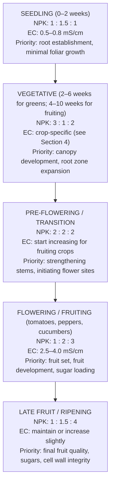
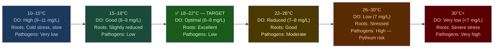
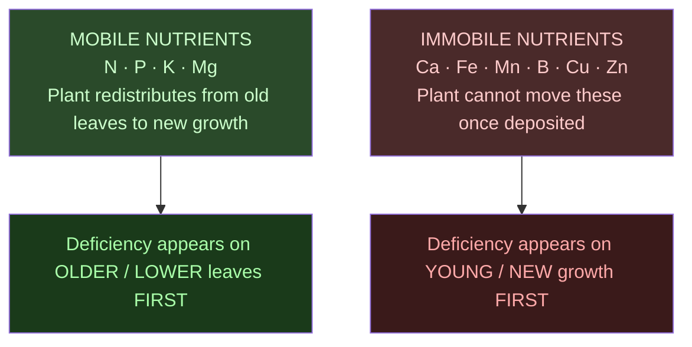

# Guide 02 — Nutrient Solution
## EC, pH, Macros, Micros, Mixing, and Schedules

---

## Table of Contents

- [1. Why Nutrients Matter in Ebb & Flow Hydroponics](#1-why-nutrients-matter-in-ebb-flow-hydroponics)
- [2. The 17 Essential Plant Nutrients](#2-the-17-essential-plant-nutrients)
  - [Macronutrients (needed in large quantities)](#macronutrients-needed-in-large-quantities)
  - [Secondary Macronutrients (needed in moderate quantities)](#secondary-macronutrients-needed-in-moderate-quantities)
  - [Micronutrients (needed in trace quantities — but still essential)](#micronutrients-needed-in-trace-quantities-but-still-essential)
- [3. NPK at Each Growth Stage](#3-npk-at-each-growth-stage)
- [4. EC — Electrical Conductivity in E&F Systems](#4-ec-electrical-conductivity-in-ef-systems)
  - [What EC Measures](#what-ec-measures)
  - [Why E&F Tolerates Slightly Higher EC](#why-ef-tolerates-slightly-higher-ec)
  - [EC Target Ranges by Crop](#ec-target-ranges-by-crop)
- [5. pH — Management in Media vs Solution](#5-ph-management-in-media-vs-solution)
  - [Target pH Range](#target-ph-range)
  - [How Clay Pebbles Affect pH](#how-clay-pebbles-affect-ph)
  - [pH Drift Patterns in E&F](#ph-drift-patterns-in-ef)
- [6. Two-Part vs Three-Part vs One-Part Nutrients](#6-two-part-vs-three-part-vs-one-part-nutrients)
- [7. Masterblend Trio — Mixing Recipe for E&F](#7-masterblend-trio-mixing-recipe-for-ef)
  - [Components](#components)
  - [Standard Mixing Recipe (per litre of water)](#standard-mixing-recipe-per-litre-of-water)
  - [Masterblend Dose Scaling](#masterblend-dose-scaling)
- [8. General Hydroponics Flora Series Schedule](#8-general-hydroponics-flora-series-schedule)
- [9. Nutrient Solution Temperature](#9-nutrient-solution-temperature)
  - [Optimal: 18–22°C](#optimal-1822c)
- [10. Reservoir Top-Up vs Full Change — E&F Specifics](#10-reservoir-top-up-vs-full-change-ef-specifics)
  - [The Salt Accumulation Problem in E&F Media](#the-salt-accumulation-problem-in-ef-media)
  - [Media Flush Protocol](#media-flush-protocol)
- [11. Visual Nutrient Deficiency and Toxicity Guide](#11-visual-nutrient-deficiency-and-toxicity-guide)
  - [Mobility of Nutrients — Key Diagnostic Clue](#mobility-of-nutrients-key-diagnostic-clue)
  - [Deficiency Quick Reference](#deficiency-quick-reference)
  - [Toxicity Signs](#toxicity-signs)
- [12. Organic Hydroponics in E&F — Advantages and Challenges](#12-organic-hydroponics-in-ef-advantages-and-challenges)
  - [Why E&F Suits Organic Better Than NFT](#why-ef-suits-organic-better-than-nft)
  - [Common Organic Nutrient Sources](#common-organic-nutrient-sources)
- [13. Water Volume Calculator Reference](#13-water-volume-calculator-reference)
  - [Reservoir Volume and E&F Flood Cycling](#reservoir-volume-and-ef-flood-cycling)


[↑ Back to TOC](#table-of-contents)

## 1. Why Nutrients Matter in Ebb & Flow Hydroponics

In any hydroponic system, the nutrient solution is the entire food supply for your plants. There is no soil microbiome to buffer deficiencies, no organic matter reservoir to draw on — every element the plant needs must be present in the solution at the right concentration and pH.

Ebb & Flow adds a layer of complexity not found in NFT or DWC: **the media itself interacts with your nutrient solution**. Clay pebbles have a modestly alkaline surface (especially when new) and a small cation exchange capacity. Coco coir, if used, has a high cation exchange capacity that actively strips calcium and magnesium from solution. This means:

- Your reservoir EC does not perfectly predict the EC in the root zone
- pH in the media may differ from pH in the reservoir by 0.2–0.5 units
- Salt residues from previous flood cycles accumulate in media pore spaces over time

**The practical consequence:** You must manage both reservoir chemistry AND media chemistry — not just the reservoir alone. This guide covers both.

---


[↑ Back to TOC](#table-of-contents)

## 2. The 17 Essential Plant Nutrients

Plants require 17 elements to complete their life cycle:

### Macronutrients (needed in large quantities)

| Nutrient | Symbol | Primary Role | Deficiency Signs |
|----------|--------|-------------|-----------------|
| **Nitrogen** | N | Vegetative growth, chlorophyll, protein synthesis | Yellowing from older leaves upward, stunted growth |
| **Phosphorus** | P | Root development, energy transfer (ATP), flowering | Purple/reddish stems and leaf undersides, poor roots |
| **Potassium** | K | Water regulation, enzyme activation, fruit quality | Brown leaf edges (scorch), weak stems, poor fruit |

### Secondary Macronutrients (needed in moderate quantities)

| Nutrient | Symbol | Primary Role | Deficiency Signs |
|----------|--------|-------------|-----------------|
| **Calcium** | Ca | Cell wall strength, root development | Tip burn, blossom end rot in tomatoes/peppers |
| **Magnesium** | Mg | Chlorophyll centre, enzyme cofactor | Interveinal chlorosis on older leaves |
| **Sulfur** | S | Amino acid synthesis, enzyme function | Uniform yellowing of young leaves |

### Micronutrients (needed in trace quantities — but still essential)

| Nutrient | Symbol | Primary Role | Deficiency Signs |
|----------|--------|-------------|-----------------|
| **Iron** | Fe | Chlorophyll synthesis | Interveinal chlorosis on young leaves (yellow with green veins) |
| **Manganese** | Mn | Photosynthesis, enzyme activation | Similar to Fe — interveinal chlorosis, brown spots |
| **Zinc** | Zn | Enzyme function, hormone synthesis | Small leaves, short internodes, distorted growth |
| **Copper** | Cu | Enzyme function, photosynthesis | Wilting of young leaves, bluish-green discolouration |
| **Boron** | B | Cell wall formation, pollen viability | Distorted, brittle young leaves; poor fruit set |
| **Molybdenum** | Mo | Nitrogen metabolism, enzyme function | Cupped/cupping leaves, marginal scorch |
| **Chlorine** | Cl | Osmosis, photosynthesis | Wilting, bronzing of leaves |
| **Nickel** | Ni | Urease enzyme | Tip necrosis of young leaves (rare) |
| **Silicon** | Si | Cell wall reinforcement, pest resistance | Not essential but highly beneficial |

> **Key insight:** In E&F systems, salt accumulation in clay pebbles can lock out micronutrients even when reservoir concentrations are correct. If you see micronutrient symptoms despite correct reservoir pH and EC, schedule a media flush (see Section 10).

---


[↑ Back to TOC](#table-of-contents)

## 3. NPK at Each Growth Stage

The ratio of N:P:K required changes across the plant's life cycle. This is especially important in E&F because the system supports crops across multiple stages simultaneously:



**E&F note on mixed tables:** If your flood table contains both leafy greens (EC 1.0–1.4 mS/cm) and fruiting crops (EC 2.5–4.0 mS/cm), you have an EC conflict. The standard solution is to dedicate separate tables to different crop categories — leafy greens on Table 1, fruiting crops on Table 2 — allowing independent flood schedules and EC management.

---


[↑ Back to TOC](#table-of-contents)

## 4. EC — Electrical Conductivity in E&F Systems

### What EC Measures

EC (electrical conductivity) measures the total dissolved salt concentration in the nutrient solution. Units: **mS/cm** (millisiemens per centimetre).

```
  EC vs TDS CONVERSION (approximate):

  1.0 mS/cm ≈ 500–700 ppm TDS (conversion factor varies: 0.5–0.7 depending on meter)

  Always work in mS/cm for precision. If your meter reads ppm, divide by 500
  to get approximate EC in mS/cm.
```

### Why E&F Tolerates Slightly Higher EC

In NFT, roots are bathed continuously in the nutrient solution — any osmotic stress from high EC is immediately felt. In Ebb & Flow, the root zone alternates between flood (full nutrient exposure) and a dry/moist phase where the media moderates direct salt contact. This means:

- Clay pebble media dilutes EC slightly at the root surface during the drain phase
- Plant roots can partially escape high-EC zones by growing toward lower-salt areas within the media
- Media moisture buffering means brief EC spikes in the reservoir do not immediately stress roots

**Practical result:** E&F growers can generally run EC 0.2–0.5 mS/cm higher than equivalent NFT crops without stress, particularly for fruiting crops. However, this should not be used as an excuse for sloppy EC management — the media will accumulate salts over time (see Section 10).

### EC Target Ranges by Crop

| Crop | Seedling | Vegetative | Fruiting | Maximum |
|------|----------|-----------|---------|---------|
| Lettuce | 0.6–0.8 | 0.8–1.4 | 1.2–1.8 | 2.0 |
| Spinach | 0.8–1.0 | 1.4–2.0 | 1.8–2.2 | 2.5 |
| Basil | 0.8–1.0 | 1.0–1.8 | 1.4–2.0 | 2.2 |
| Cilantro/parsley | 0.8–1.0 | 1.2–1.6 | — | 1.8 |
| Mint | 0.8–1.0 | 1.2–1.6 | — | 2.0 |
| Kale | 1.0–1.2 | 1.6–2.2 | 2.0–2.5 | 2.8 |
| Cherry tomatoes | 0.8–1.2 | 2.0–2.8 | 2.8–4.0 | 4.5 |
| Peppers | 0.8–1.2 | 2.0–2.8 | 2.8–3.8 | 4.2 |
| Cucumbers | 1.0–1.4 | 2.0–2.5 | 2.5–3.5 | 4.0 |
| Courgette/zucchini | 1.0–1.2 | 1.8–2.4 | 2.4–3.2 | 3.8 |
| Aubergine/eggplant | 1.0–1.4 | 2.0–2.8 | 2.8–3.5 | 4.0 |
| Strawberries | 0.8–1.0 | 1.2–1.8 | 1.6–2.2 | 2.5 |
| Radishes (bags) | 0.8–1.0 | 1.2–1.8 | 1.6–2.2 | 2.5 |
| Carrots (bags) | 0.6–0.8 | 1.0–1.4 | 1.4–2.0 | 2.2 |

> **Mixed table note:** When running a flood table with multiple crop types at different stages, set EC to the **lower end** of the most sensitive crop's range. For a lettuce/herb table, target 1.0–1.4 mS/cm. For a dedicated fruiting table, run the fruiting EC for the dominant crop.

---


[↑ Back to TOC](#table-of-contents)

## 5. pH — Management in Media vs Solution

### Target pH Range

The target pH range for E&F hydroponics is the same as all hydroponic systems: **5.5–6.5**, with an optimal window of **5.8–6.3** where all essential nutrients are simultaneously available.

### How Clay Pebbles Affect pH

New clay pebbles have an alkaline surface residue (pH 7.0–8.0). This alkalinity slowly leaches into your nutrient solution during each flood cycle, causing pH to rise. This is why clay pebble preparation (pre-soak in pH 5.5 water for 24h) is essential before first use — see Guide 05.

Even with prepared pebbles, some pH rise will occur during early use:

```
  pH EFFECT OF CLAY PEBBLES OVER TIME:

  Week 1–2 (new pebbles):   pH creep of +0.3–0.8 per day — may need daily adjustment
  Week 3–4:                 pH creep of +0.2–0.4 per day — normal ongoing drift
  Month 2+:                 Surface alkalinity stabilises — pH creep reduces
                            Ongoing pH management is standard for any system

  Response: Check pH daily. Adjust with pH Down as needed.
  If pH is rising faster than 0.5 per day, re-soak clay pebbles and do a full
  reservoir change — residual alkalinity is too high.
```

### pH Drift Patterns in E&F

pH drift in E&F follows the same plant-driven patterns as other hydroponic systems, with an added media component:

- **pH rising:** Plants consuming anions (NO₃⁻, H₂PO₄⁻) + clay pebble alkalinity leaching → pH climbs. Most common in vegetative growth with new pebbles.
- **pH falling:** Plants consuming cations (NH₄⁺, K⁺, Ca²⁺, Mg²⁺) → pH falls. More common in fruiting stage.
- **Stable pH:** Balance between plant uptake and media buffering — the best-case scenario.

**E&F-specific tip:** Because media buffers pH somewhat, your reservoir pH can read 6.0 while the media pH (measured by pressing a pH probe into wet media) may read 6.4–6.8. If you see signs of micronutrient deficiency (especially iron and manganese lockout) despite correct reservoir pH, the media pH may be the culprit. Flush the media (see Section 10) and verify with a soil probe.

**Nutrient availability by pH (reference):**

| Nutrient | Best availability |
|----------|-------------------|
| N | 5.5–7.5 |
| P | 5.5–7.0 |
| K, Ca, Mg, S | 5.5–8.0 |
| Fe, Mn, Zn, Cu | 5.0–6.5 (locked out above ~6.5) |
| B | 5.5–6.5 |
| Mo | 6.5–8.0 (locked out below ~6.0) |

**Optimal window: pH 5.8–6.3 maximises simultaneous availability of all nutrients.**

---


[↑ Back to TOC](#table-of-contents)

## 6. Two-Part vs Three-Part vs One-Part Nutrients

| System | Example | Pros | Cons |
|--------|---------|------|------|
| **One-part / all-in-one** | GH MaxiGro/MaxiBloom | Simple, one container | Cannot adjust NPK ratio independently |
| **Two-part** | Canna Aqua Vega/Flores | Adjust growth/bloom ratio | Two containers to manage |
| **Three-part** | GH Flora Series | Full NPK control at every stage | Three bottles, schedule required |
| **Masterblend trio** | MasterBlend + CalNit + Epsom | Cheapest per litre, professional-grade | Dry salts, requires digital scale |

**Recommendation for this E&F system:** Masterblend trio for cost and precision, or GH Flora Series for liquid convenience. Either gives excellent results. Avoid all-in-one products for fruiting crops — you cannot adjust the N:P:K ratio to shift from vegetative to fruiting phase.

---


[↑ Back to TOC](#table-of-contents)

## 7. Masterblend Trio — Mixing Recipe for E&F

This is the most cost-effective professional nutrient system available. The mixing procedure is identical to NFT; only the target EC values differ for E&F.

### Components

| Component | Chemical | Analysis |
|-----------|----------|----------|
| MasterBlend 4-18-38 | Potassium nitrate + trace elements | N-P-K + complete micronutrients |
| Calcium Nitrate | Ca(NO₃)₂ | 15.5-0-0 + 19% Ca |
| Magnesium Sulphate | MgSO₄ (Epsom Salt) | 10% Mg, 13% S |

### Standard Mixing Recipe (per litre of water)

```
  STANDARD VEGETATIVE MIX (EC ~1.4–1.6 mS/cm):

  1. Calcium Nitrate:      0.6g per litre
  2. MasterBlend 4-18-38:  0.6g per litre
  3. Epsom Salt:           0.3g per litre

  MIXING ORDER (critical — always in this sequence):

  Step 1: Fill reservoir with 50% of target water volume
  Step 2: Add Calcium Nitrate — stir until dissolved
  Step 3: Add remaining water (dilutes Ca before adding sulphate/phosphate)
  Step 4: Add Epsom Salt — stir until dissolved
  Step 5: Add MasterBlend — stir until dissolved
  Step 6: Adjust pH to 5.8–6.2
  Step 7: Measure EC — should read ~1.4–1.6 mS/cm

  ⚠ NEVER mix Calcium Nitrate and MasterBlend directly — they will precipitate.
    Always dissolve in water separately using the order above.

  E&F SPECIFIC NOTE: Your source water EC plus the mineral leaching from new clay
  pebbles will contribute additional EC. Subtract your source water EC from your
  target before measuring how much nutrient to add.
  Example: Source water EC = 0.3 mS/cm → add nutrients to reach (1.5 - 0.3) = 1.2 mS/cm
  Final reading after adding nutrients: 1.5 mS/cm total.
```

### Masterblend Dose Scaling

| Target EC | Calcium Nitrate | MasterBlend | Epsom Salt |
|-----------|----------------|-------------|-----------|
| 0.8 mS/cm (seedling) | 0.3g/L | 0.3g/L | 0.15g/L |
| 1.2 mS/cm (light veg) | 0.45g/L | 0.45g/L | 0.22g/L |
| 1.6 mS/cm (standard veg) | 0.6g/L | 0.6g/L | 0.3g/L |
| 2.0 mS/cm (tomatoes veg) | 0.75g/L | 0.75g/L | 0.37g/L |
| 2.5 mS/cm (tomatoes early fruit) | 0.95g/L | 0.95g/L | 0.47g/L |
| 3.5 mS/cm (tomatoes peak fruit) | 1.35g/L | 1.35g/L | 0.67g/L |

> **Always verify with your EC meter.** These are starting points — your source water EC and media mineral leaching both affect the final reading.

---


[↑ Back to TOC](#table-of-contents)

## 8. General Hydroponics Flora Series Schedule

For those preferring a liquid system. This is the most documented nutrient schedule in hobby hydroponics.

| Stage | FloraGro | FloraBloom | FloraMicro | EC Target |
|-------|----------|-----------|-----------|---------|
| Seedling/clone | 1.25ml/L | 1.25ml/L | 0.5ml/L | 0.6–0.8 |
| Early vegetative | 3ml/L | 1ml/L | 2ml/L | 1.0–1.4 |
| Late vegetative | 4ml/L | 2ml/L | 3ml/L | 1.4–1.8 |
| Pre-flower / transition | 3ml/L | 3ml/L | 3ml/L | 1.8–2.4 |
| Early bloom | 2ml/L | 4ml/L | 3ml/L | 2.0–2.8 |
| Mid bloom (fruiting crops) | 1ml/L | 5ml/L | 3ml/L | 2.4–3.2 |
| Late bloom / ripening | 0ml/L | 6ml/L | 3ml/L | 2.8–3.8 |
| Flush (final week) | 0ml/L | 0ml/L | 0ml/L | 0.2–0.4 |

> Always add FloraMicro first when mixing multiple components. The flush week (plain water only) in the final week before harvest reduces residual salts in the media and plant tissue — more important in E&F than in NFT because of salt accumulation in clay pebbles.

---


[↑ Back to TOC](#table-of-contents)

## 9. Nutrient Solution Temperature

### Optimal: 18–22°C

Solution temperature affects dissolved oxygen content, root enzyme activity, and pathogen pressure. This is doubly important in E&F because the reservoir sits under the flood tables and can heat rapidly on warm days.



**E&F advantage:** The reservoir is positioned under the flood tables, naturally shaded by the table structure. This is a significant design advantage over NFT (where the reservoir is typically in full sun beside the channels). The tables act as a roof over the reservoir — use this to your advantage by ensuring the tables overhang the reservoir fully.

**Temperature management strategies:** Shade and insulate the reservoir exterior. Keep the lid on tightly. Paint the reservoir white or wrap with reflective insulation. If summer ambient temperatures regularly exceed 30°C, consider a small aquarium chiller.

---


[↑ Back to TOC](#table-of-contents)

## 10. Reservoir Top-Up vs Full Change — E&F Specifics

### The Salt Accumulation Problem in E&F Media

This is the most important nutrient management issue specific to Ebb & Flow that does not apply to NFT or DWC. Every time your table floods, nutrients enter the clay pebbles. Every time it drains, some dissolved nutrients are left behind in the micro-pore structure of the clay. Over weeks and months, salts accumulate in the media:

```
  SALT ACCUMULATION MECHANISM:

  Flood cycle 1:   Media holds small amount of dissolved salts after drain
  Flood cycle 5:   Residual salt level building in pore spaces
  Flood cycle 50:  Visible white salt crust on surface of clay pebbles
  Flood cycle 100: EC in media significantly higher than reservoir EC
                   ─ Plants show tip burn, nutrient excess symptoms
                   ─ Root tips browning from osmotic stress
                   ─ pH in media diverging from reservoir pH

  DETECTION:
  Press a calibrated EC probe into the wet media immediately after a flood.
  Compare to reservoir EC.
  If media EC > reservoir EC + 0.5 mS/cm: media flush is needed.
  If media EC > reservoir EC + 1.0 mS/cm: immediate media flush required.
```

### Media Flush Protocol

```
  MEDIA FLUSH PROCEDURE (monthly minimum, or when EC test triggers it):

  1. Do a full reservoir change (fresh plain water, no nutrients)
  2. Run 3–4 extra flood cycles with plain pH-adjusted water (pH 6.0, no nutrients)
     — flood every 30 minutes for 2 hours — more cycles than normal
  3. This flushes accumulated salts from media pore spaces back into reservoir
  4. Drain reservoir (now contains dissolved salt waste) and dispose
  5. Refill with fresh nutrient solution
  6. Resume normal flood schedule
  7. Optional: after flush, measure EC in media (should now match reservoir)

  NOTE: During flush day, plants receive no nutrients — this is acceptable.
  Doing a media flush every 4 weeks prevents chronic salt accumulation.
  Commercial growers flush at every reservoir change (weekly/bi-weekly).
```

**Reservoir change frequency for E&F:**

```
  WHEN TO DO A FULL RESERVOIR CHANGE:

  Trigger 1: EC rising above target despite correct top-up (salts concentrating)
  Trigger 2: pH swings >0.5 per day with mature media (signs of imbalance)
  Trigger 3: Solution older than 7–10 days
  Trigger 4: Visible discolouration (brown, green, slimy)
  Trigger 5: After any disease outbreak
  Trigger 6: Before introducing new seedlings to a table

  Recommended schedule: Full change every 7 days; media flush every 3–4 weeks.
```

---


[↑ Back to TOC](#table-of-contents)

## 11. Visual Nutrient Deficiency and Toxicity Guide

### Mobility of Nutrients — Key Diagnostic Clue



### Deficiency Quick Reference

| Symptom | Location | Most Likely Cause | E&F-Specific Note |
|---------|----------|-------------------|--------------------|
| Overall yellowing | Older leaves first | Nitrogen deficiency | Also check EC isn't too low from excessive dilution top-ups |
| Purple/red stems | Any | Phosphorus deficiency | Common at low temps or in new media (pH too high) |
| Brown leaf edges/scorch | Older leaf tips | Potassium deficiency OR salt excess | In E&F: check media EC — may be salt accumulation not K deficit |
| Yellow between green veins | Older leaves | Magnesium deficiency | Coco coir users: CEC stripping Mg — add CalMag supplement |
| Yellow between green veins | Young leaves | Iron deficiency | Check media pH — may be higher than reservoir pH |
| Brown/dead leaf tips | Young leaves | Calcium deficiency | Ensure flood frequency is adequate — Ca requires continuous delivery |
| Distorted/brittle young leaves | Growing tip | Boron deficiency | Check pH < 6.5 (B locks out above 6.5) |
| Crispy brown everywhere | Any | Nutrient burn (EC too high) | Check media EC — may be salt accumulation even if reservoir EC correct |
| Dark green, slowed fruiting | Mature leaves | Nitrogen excess | Reduce N ratio — switch to bloom formula |

### Toxicity Signs

| Toxicity | Signs | E&F-Specific Note |
|---------|-------|-------------------|
| Nitrogen excess | Dark green, soft growth, delayed flowering | More common when media EC higher than reservoir |
| Iron excess | Dark lesions on roots | Usually pH too low; excess Fe at pH < 5.5 |
| General salt burn | Brown tips/edges, wilting despite wet roots | Most common E&F toxicity — flush media |
| Manganese excess | Brown spots, interveinal chlorosis | pH too low; keep above 5.5 |

---


[↑ Back to TOC](#table-of-contents)

## 12. Organic Hydroponics in E&F — Advantages and Challenges

### Why E&F Suits Organic Better Than NFT

Unlike NFT's thin film (minimal media surface for microbial colonisation), E&F systems with deep clay pebble or coco media have large surface areas that support thriving beneficial microbial communities:

| Aspect | NFT | E&F (clay pebbles) |
|--------|-----|---------------------|
| Media surface area for microbes | Minimal | Large — excellent microbial habitat |
| Organic particle clogging risk | High (narrow channels) | Low (open media, large pore spaces) |
| Microbial stability | Poor — flow washes microbes | Good — stable colonisation on clay |
| EC meter accuracy | Unreliable with organics | Same issue — but visual plant observation helps |
| Biofilm management | Difficult | Manageable with monthly flush |

**The verdict:** E&F with clay pebbles is genuinely compatible with organic hydroponics. The media acts as a biofilter, breaking down organic nutrients into plant-available forms. This is the principle behind aquaponics and RDWC systems with biofiltration — applied here to a flood table.

### Common Organic Nutrient Sources

- **Fish emulsion/hydrolysate (2-4-1):** Excellent vegetative N source; 5ml/L in nutrient solution
- **Seaweed extract:** Micronutrients, cytokinins, growth regulators; 2ml/L supplement
- **Bat guano:** High P for fruiting stage
- **Worm castings extract (worm tea):** Broad-spectrum nutrition + beneficial microbe inoculant
- **Molasses:** Feeds beneficial bacteria in media; 1ml/L once per week

**Key organic practice for E&F:** After establishing an organic cycle, add an **air stone to the reservoir** — aeration keeps the microbial population aerobic. Without it, anaerobic bacteria will outcompete beneficials within days in a warm outdoor reservoir.

---


[↑ Back to TOC](#table-of-contents)

## 13. Water Volume Calculator Reference

### Reservoir Volume and E&F Flood Cycling

The 100L reservoir in this system is sized for the two 1.2m × 0.6m flood tables. Understanding why this volume matters:

```
  E&F RESERVOIR SIZING CONSIDERATIONS:

  Volume consumed per flood cycle:
  ─ Table volume: 1.2m × 0.6m × 0.05m (flood depth) = 0.036 m³ = 36L per table
  ─ Two tables flooded simultaneously: ~72L per flood event
  ─ Note: not all 72L is consumed — it drains back. BUT the pump must push
    72L up to the tables before overflow controls level. The reservoir must
    have MINIMUM 80L to flood both tables without running dry.

  100L reservoir buffer analysis:
  ─ Tables full: ~72L in tables, ~28L remaining in reservoir
  ─ Pump continues running until timer cuts — safe margin
  ─ After drain: 100L back in reservoir (minus plant uptake and evaporation)

  Daily water consumption:
  ─ Plant transpiration + evaporation: ~2–5L per day in warm weather
  ─ At 3 floods/day with 2 tables: steady state, same water recycled
  ─ Top up reservoir daily with pH-adjusted plain water to replace losses

  MASTERBLEND RECIPE FOR 100L FILL (standard vegetative mix, EC ~1.4–1.6 mS/cm):

  Calcium Nitrate:   0.6g/L × 100L = 60g
  MasterBlend:       0.6g/L × 100L = 60g
  Epsom Salt:        0.3g/L × 100L = 30g

  For fruiting crops (EC ~2.5 mS/cm):
  Calcium Nitrate:   0.95g/L × 100L = 95g
  MasterBlend:       0.95g/L × 100L = 95g
  Epsom Salt:        0.47g/L × 100L = 47g

  Always verify EC with meter after mixing — before running first flood.
  Weigh all dry nutrients on a digital scale. Volume estimation is inaccurate.
```

---


[↑ Back to TOC](#table-of-contents)

*Next: [`guide/ebb-and-flow/03-water-quality.md`](03-water-quality.md) — Sources, testing, treatment, and management*

---

<!-- copyright -->
*Copyright (c) 2026 UncleJS. Licensed under [CC BY-NC 4.0](https://creativecommons.org/licenses/by-nc/4.0/) — free to share and adapt for non-commercial purposes with attribution.*
