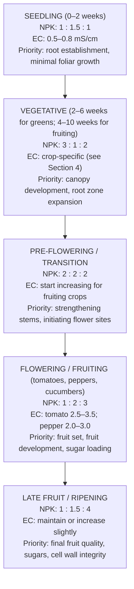
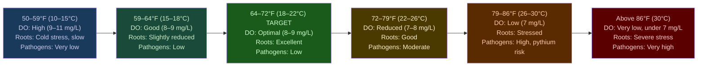
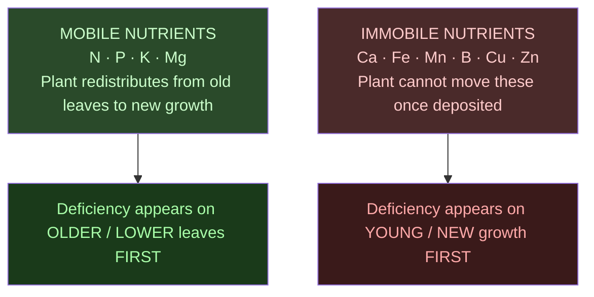

# Guide 02 — Nutrient Solution
## EC, pH, Macros, Micros, Mixing, and Schedules

[](../../README.md)
[](https://creativecommons.org/licenses/by-nc-sa/4.0/)


---

## Table of Contents

- [1. Why Nutrients Matter in Ebb & Flow Hydroponics](#1-why-nutrients-matter-in-ebb-flow-hydroponics)
- [2. The 17 Essential Plant Nutrients](#2-the-17-essential-plant-nutrients)
  - [Macronutrients (needed in large quantities)](#macronutrients-needed-in-large-quantities)
  - [Secondary Macronutrients (needed in moderate quantities)](#secondary-macronutrients-needed-in-moderate-quantities)
  - [Micronutrients (needed in trace quantities — but still essential)](#micronutrients-needed-in-trace-quantities-but-still-essential)
- [3. NPK at Each Growth Stage](#3-npk-at-each-growth-stage)
- [4. EC — Electrical Conductivity in E&F Systems](#4-ec-electrical-conductivity-in-ef-systems)
  - [What EC Measures](#what-ec-measures)
  - [Why E&F Tolerates Slightly Higher EC](#why-ef-tolerates-slightly-higher-ec)
  - [EC Target Ranges by Crop](#ec-target-ranges-by-crop)
- [5. pH — Management in Media vs Solution](#5-ph-management-in-media-vs-solution)
  - [Target pH Range](#target-ph-range)
  - [How Clay Pebbles Affect pH](#how-clay-pebbles-affect-ph)
  - [pH Drift Patterns in E&F](#ph-drift-patterns-in-ef)
- [6. Two-Part vs Three-Part vs One-Part Nutrients](#6-two-part-vs-three-part-vs-one-part-nutrients)
- [7. Masterblend Trio — Mixing Recipe for E&F](#7-masterblend-trio-mixing-recipe-for-ef)
  - [Personal Protective Equipment and Storage](#personal-protective-equipment-and-storage)
  - [Components](#components)
  - [Standard Mixing Recipe (per US gallon)](#standard-mixing-recipe-per-us-gallon)
  - [Masterblend Dose Scaling](#masterblend-dose-scaling)
- [8. General Hydroponics Flora Series Schedule](#8-general-hydroponics-flora-series-schedule)
- [9. Nutrient Solution Temperature](#9-nutrient-solution-temperature)
  - [Target Solution Temperature](#target-solution-temperature)
- [10. Reservoir Top-Up vs Full Change — E&F Specifics](#10-reservoir-top-up-vs-full-change-ef-specifics)
  - [Top-Up Rule](#top-up-rule)
  - [The Salt Accumulation Problem in E&F Media](#the-salt-accumulation-problem-in-ef-media)
  - [Media Flush Protocol](#media-flush-protocol)
- [11. Visual Nutrient Deficiency and Toxicity Guide](#11-visual-nutrient-deficiency-and-toxicity-guide)
  - [Mobility of Nutrients — Key Diagnostic Clue](#mobility-of-nutrients-key-diagnostic-clue)
  - [Deficiency Quick Reference](#deficiency-quick-reference)
  - [Toxicity Signs](#toxicity-signs)
- [12. Organic Hydroponics in E&F — Advantages and Challenges](#12-organic-hydroponics-in-ef-advantages-and-challenges)
  - [Why E&F Suits Organic Better Than NFT](#why-ef-suits-organic-better-than-nft)
  - [Common Organic Nutrient Sources](#common-organic-nutrient-sources)
- [13. Water Volume Calculator Reference](#13-water-volume-calculator-reference)
  - [Reservoir Volume and E&F Flood Cycling](#reservoir-volume-and-ef-flood-cycling)

---


## 1. Why Nutrients Matter in Ebb & Flow Hydroponics

In any hydroponic system, the nutrient solution is the entire food supply for your plants. There is no soil microbiome to buffer deficiencies, no organic matter reservoir to draw on — every element the plant needs must be present in the solution at the right concentration and pH.

Ebb & Flow adds a layer of complexity not found in NFT or DWC: **the media itself interacts with your nutrient solution**. Clay pebbles have a modestly alkaline surface (especially when new) and a small cation exchange capacity. Coco coir, if used, has a high cation exchange capacity that actively strips calcium and magnesium from solution. This means:

- Your reservoir EC does not perfectly predict the EC in the root zone
- pH in the media may differ from pH in the reservoir by 0.2–0.5 units
- Salt residues from previous flood cycles accumulate in media pore spaces over time

**The practical consequence:** You must manage both reservoir chemistry AND media chemistry — not just the reservoir alone. This guide covers both.

[↑ Back to TOC](#table-of-contents)

---


## 2. The 17 Essential Plant Nutrients

Plants require 17 elements to complete their life cycle:

### Macronutrients (needed in large quantities)

| Nutrient | Symbol | Primary Role | Deficiency Signs |
|----------|--------|-------------|-----------------|
| **Nitrogen** | N | Vegetative growth, chlorophyll, protein synthesis | Yellowing from older leaves upward, stunted growth |
| **Phosphorus** | P | Root development, energy transfer (ATP), flowering | Purple/reddish stems and leaf undersides, poor roots |
| **Potassium** | K | Water regulation, enzyme activation, fruit quality | Brown leaf edges (scorch), weak stems, poor fruit |

### Secondary Macronutrients (needed in moderate quantities)

| Nutrient | Symbol | Primary Role | Deficiency Signs |
|----------|--------|-------------|-----------------|
| **Calcium** | Ca | Cell wall strength, root development | Tip burn, blossom end rot in tomatoes/peppers |
| **Magnesium** | Mg | Chlorophyll centre, enzyme cofactor | Interveinal chlorosis on older leaves |
| **Sulfur** | S | Amino acid synthesis, enzyme function | Uniform yellowing of young leaves |

### Micronutrients (needed in trace quantities — but still essential)

| Nutrient | Symbol | Primary Role | Deficiency Signs |
|----------|--------|-------------|-----------------|
| **Iron** | Fe | Chlorophyll synthesis | Interveinal chlorosis on young leaves (yellow with green veins) |
| **Manganese** | Mn | Photosynthesis, enzyme activation | Similar to Fe — interveinal chlorosis, brown spots |
| **Zinc** | Zn | Enzyme function, hormone synthesis | Small leaves, short internodes, distorted growth |
| **Copper** | Cu | Enzyme function, photosynthesis | Wilting of young leaves, bluish-green discolouration |
| **Boron** | B | Cell wall formation, pollen viability | Distorted, brittle young leaves; poor fruit set |
| **Molybdenum** | Mo | Nitrogen metabolism, enzyme function | Cupped/cupping leaves, marginal scorch |
| **Chlorine** | Cl | Osmosis, photosynthesis | Wilting, bronzing of leaves |
| **Nickel** | Ni | Urease enzyme | Tip necrosis of young leaves (rare) |
| **Silicon** | Si | Cell wall reinforcement, pest resistance | Not essential but highly beneficial |

> **Key insight:** In E&F systems, salt accumulation in clay pebbles can lock out micronutrients even when reservoir concentrations are correct. If you see micronutrient symptoms despite correct reservoir pH and EC, schedule a media flush (see Section 10).

[↑ Back to TOC](#table-of-contents)

---


## 3. NPK at Each Growth Stage

The ratio of N:P:K required changes across the plant's life cycle. This is especially important in E&F because the system supports crops across multiple stages simultaneously:



**E&F note on shared solution:** Table 1 is one indeterminate tomato or one cucumber. Table 2 is pepper, aubergine, or courgette, 1–2 plants. Table 3 is leafy greens or a later fruiting crop. All three tables share the 45 US gal (170 L) reservoir, so they share one EC. Separate tables let you pick crops that can live on that one number. They do not give you two ECs. When Tables 1 and 2 are fruiting, run the fruiting target and either keep Table 3 leafy crops at the high end of their range or switch Table 3 to a later fruiting crop. Flood counts can still differ: 3× per day vegetative, 4× per day fruiting, and 4× is the ceiling.

[↑ Back to TOC](#table-of-contents)

---


## 4. EC — Electrical Conductivity in E&F Systems

### What EC Measures

EC (electrical conductivity) measures the total dissolved salt concentration in the nutrient solution. Units: **mS/cm** (millisiemens per centimetre).

```
  EC vs TDS CONVERSION (approximate):

  1.0 mS/cm ≈ 500–700 ppm TDS (conversion factor varies: 0.5–0.7 depending on meter)

  Always work in mS/cm for precision. If your meter reads ppm, divide by 500
  to get approximate EC in mS/cm.
```

### Why E&F Tolerates Slightly Higher EC

In NFT, roots are bathed continuously in the nutrient solution — any osmotic stress from high EC is immediately felt. In Ebb & Flow, the root zone alternates between flood (full nutrient exposure) and a dry/moist phase where the media moderates direct salt contact. This means:

- Clay pebble media dilutes EC slightly at the root surface during the drain phase
- Plant roots can partially escape high-EC zones by growing toward lower-salt areas within the media
- Media moisture buffering means brief EC spikes in the reservoir do not immediately stress roots

**Practical result:** E&F growers can generally run EC 0.2–0.5 mS/cm higher than equivalent NFT crops without stress, particularly for fruiting crops. However, this should not be used as an excuse for sloppy EC management — the media will accumulate salts over time (see Section 10).

### EC Target Ranges by Crop

| Crop | Seedling | Vegetative | Fruiting | Maximum |
|------|----------|-----------|---------|---------|
| Lettuce | 0.6–0.8 | 0.8–1.4 | 1.2–1.8 | 2.0 |
| Spinach | 0.8–1.0 | 1.4–2.0 | 1.8–2.2 | 2.5 |
| Basil | 0.8–1.0 | 1.0–1.8 | 1.4–2.0 | 2.2 |
| Cilantro/parsley | 0.8–1.0 | 1.2–1.6 | — | 1.8 |
| Mint | 0.8–1.0 | 1.2–1.6 | — | 2.0 |
| Kale | 1.0–1.2 | 1.6–2.2 | 2.0–2.5 | 2.8 |
| Cherry tomatoes | 0.8–1.2 | 2.0–2.8 | 2.5–3.5 | 3.5 |
| Peppers | 0.8–1.2 | 2.0–2.8 | 2.0–3.0 | 3.0 |
| Cucumbers | 1.0–1.4 | 2.0–2.5 | 2.2–2.8 | 2.8 |
| Courgette/zucchini | 1.0–1.2 | 1.8–2.4 | 2.4–3.2 | 3.8 |
| Aubergine/eggplant | 1.0–1.4 | 2.0–2.8 | 2.8–3.5 | 4.0 |
| Strawberries | 0.8–1.0 | 1.2–1.8 | 1.6–2.2 | 2.5 |
| Radishes (bags) | 0.8–1.0 | 1.2–1.6 | 1.4–1.8 | 2.0 |
| Beetroot (bags) | 0.8–1.0 | 1.2–1.6 | 1.4–2.0 | 2.0 |
| Carrots (bags) | 0.6–0.8 | 1.0–1.4 | 1.4–1.8 | 2.0 |

> **Shared-reservoir note:** Zone C fertigation stops at 2.0 mS/cm. Beetroot does not get a higher target. On the flood tables, one reservoir means one EC. A lettuce and herb season on Table 3, with Tables 1 and 2 not yet fruiting, sits around 1.0–1.6 mS/cm. Once Table 1 is fruiting, the tank moves to that crop's fruiting EC.

[↑ Back to TOC](#table-of-contents)

---


## 5. pH — Management in Media vs Solution

### Target pH Range

The working window is **5.8–6.2**. The acceptable band is **5.5–6.5**. Mix to the working window.

### How Clay Pebbles Affect pH

New clay pebbles have an alkaline surface residue (pH 7.0–8.0). This alkalinity slowly leaches into the nutrient solution during each flood cycle and pulls pH up. Pre-soak LECA for 24 hours at **pH 5.8** before first use (acceptable soak band 5.5–6.0). Use 5.8 everywhere you mix a soak or a working solution. See [Guide 05 — Growing Media](05-growing-media.md).

Even with prepared pebbles, some pH rise will occur during early use:

```
  pH EFFECT OF CLAY PEBBLES OVER TIME:

  Week 1–2 (new pebbles):   pH creep of +0.3–0.8 per day — may need daily adjustment
  Week 3–4:                 pH creep of +0.2–0.4 per day — normal ongoing drift
  Month 2+:                 Surface alkalinity stabilises — pH creep reduces
                            Ongoing pH management is standard for any system

  Response: Check pH daily. Adjust with pH Down as needed.
  If pH is rising faster than 0.5 per day, re-soak clay pebbles and do a full
  reservoir change — residual alkalinity is too high.
```

### pH Drift Patterns in E&F

pH drift in E&F follows the same plant-driven patterns as other hydroponic systems, with an added media component:

- **pH rising:** Plants consuming anions (NO₃⁻, H₂PO₄⁻) + clay pebble alkalinity leaching → pH climbs. Most common in vegetative growth with new pebbles.
- **pH falling:** Plants consuming cations (NH₄⁺, K⁺, Ca²⁺, Mg²⁺) → pH falls. More common in fruiting stage.
- **Stable pH:** Balance between plant uptake and media buffering — the best-case scenario.

**E&F-specific tip:** Media can sit above the reservoir. A reservoir at pH 6.0 can hide media at 6.4–6.8. Sample 2 in (5 cm) into wet LECA, just after a flood. Iron and manganese lockout with a correct reservoir pH is a reason to flush (Section 10) and check that sample.

**Nutrient availability by pH (reference):**

| Nutrient | Best availability |
|----------|-------------------|
| N | 5.5–7.5 |
| P | 5.5–7.0 |
| K, Ca, Mg, S | 5.5–8.0 |
| Fe, Mn, Zn, Cu | 5.0–6.5 (locked out above ~6.5) |
| B | 5.5–6.5 |
| Mo | 6.5–8.0 (locked out below ~6.0) |

**Working window: pH 5.8–6.2.** That is the band this system is mixed to. The wider acceptable band is 5.5–6.5.

[↑ Back to TOC](#table-of-contents)

---


## 6. Two-Part vs Three-Part vs One-Part Nutrients

| System | Example | Pros | Cons |
|--------|---------|------|------|
| **One-part / all-in-one** | GH MaxiGro/MaxiBloom | Simple, one container | Cannot adjust NPK ratio independently |
| **Two-part** | Canna Aqua Vega/Flores | Adjust growth/bloom ratio | Two containers to manage |
| **Three-part** | GH Flora Series | Full NPK control at every stage | Three bottles, schedule required |
| **Masterblend trio** | MasterBlend + calcium nitrate + Epsom | Lowest cost per US gallon, professional-grade | Dry salts, needs a digital scale and PPE |

**Recommendation for this E&F system:** Masterblend trio for cost and precision, or GH Flora Series for liquid convenience. Either gives excellent results. Avoid all-in-one products for fruiting crops — you cannot adjust the N:P:K ratio to shift from vegetative to fruiting phase.

[↑ Back to TOC](#table-of-contents)

---


## 7. Masterblend Trio — Mixing Recipe for E&F

This is the lowest-cost professional nutrient system in these guides. The ratio is the same one used for the NFT reservoirs. Only the target EC and the tank volume change. Doses below are **per US gallon**, then the same dose per litre in brackets. The base figure of 2.4 g belongs with one US gallon. The matching per-litre amount is 0.63 g.

### Personal Protective Equipment and Storage

Dry salts and the pH chemicals are the hazard in this guide. Wear the kit before you open a bag or a bottle.

- **Gloves**, **eye protection**, and a **dust mask** when you handle dry Masterblend, calcium nitrate, or Epsom salt.
- The same three items when you handle **pH Down (phosphoric acid)** or **pH Up (potassium hydroxide)**. Acid and hydroxide are corrosive even when you only pour them.
- Add acid or hydroxide to water. Do not add water to a jug of concentrated acid or hydroxide.
- Store nutrient concentrates, acids, and any pesticides in a **latched box**, away from children and pets.
- If you describe this garden as a good project for children, also say the chemicals stay locked.

Keep the box shut between mixing sessions. Weigh salts on a digital scale. Do not scoop by eye.

### Components

| Component | Chemical | Analysis |
|-----------|----------|----------|
| MasterBlend 4-18-38 | Potassium nitrate + trace elements | N-P-K + complete micronutrients |
| Calcium Nitrate | Ca(NO₃)₂ | 15.5-0-0 + 19% Ca |
| Magnesium Sulphate | MgSO₄ (Epsom Salt) | 10% Mg, 13% S |

### Standard Mixing Recipe (per US gallon)

Per **1 US gal (3.8 L)**, vegetative, EC about 1.4–1.6 mS/cm:

- Masterblend 4-18-38: **2.4 g (0.63 g/L)**
- Calcium nitrate: **2.4 g (0.63 g/L)**
- Epsom salt: **1.2 g (0.32 g/L)**

```
  MIXING ORDER (always this sequence):

  Step 1: Fill the reservoir with about half the target water volume
  Step 2: Dissolve calcium nitrate completely
  Step 3: Add the rest of the water (dilute the calcium before sulphate and phosphate)
  Step 4: Dissolve Epsom salt
  Step 5: Dissolve Masterblend
  Step 6: Adjust pH to 5.8–6.2
  Step 7: Read EC. The vegetative base should land near 1.4–1.6 mS/cm
          before you scale it for a fruiting target

  NEVER pour calcium nitrate and Masterblend into the same dry cup.
  They precipitate. Dissolve them in water, in the order above.

  SOURCE WATER: nutrients sit on top of the EC already in the tap.
  Example: source EC 0.3 mS/cm, target 1.5 mS/cm.
  The salts need to contribute about 1.2 mS/cm. The meter, after mixing,
  should read about 1.5 mS/cm total.

  For the 45 US gal (170 L) reservoir at the vegetative base:
  Masterblend      2.4 g × 45 = 108 g
  Calcium nitrate  2.4 g × 45 = 108 g
  Epsom salt       1.2 g × 45 = 54 g
```

### Masterblend Dose Scaling

Keep the 2 : 2 : 1 ratio (Masterblend : calcium nitrate : Epsom). Raise or lower the **whole** recipe to hit the crop EC. Do not change the ratio to chase one element unless you are in a deficiency correction.

Doses are per 1 US gal (3.8 L). The gram-per-litre figure is the same dose, not a different recipe.

| Target EC | Masterblend | Calcium nitrate | Epsom salt |
|-----------|-------------|-----------------|------------|
| 0.8 mS/cm (seedling) | 1.3 g (0.34 g/L) | 1.3 g (0.34 g/L) | 0.6 g (0.17 g/L) |
| 1.2 mS/cm (light veg) | 1.9 g (0.50 g/L) | 1.9 g (0.50 g/L) | 1.0 g (0.26 g/L) |
| 1.4–1.6 mS/cm (base veg) | 2.4 g (0.63 g/L) | 2.4 g (0.63 g/L) | 1.2 g (0.32 g/L) |
| 2.0 mS/cm | 3.2 g (0.85 g/L) | 3.2 g (0.85 g/L) | 1.6 g (0.42 g/L) |
| 2.5 mS/cm (early fruit) | 4.0 g (1.06 g/L) | 4.0 g (1.06 g/L) | 2.0 g (0.53 g/L) |
| 3.5 mS/cm (peak fruit) | 5.6 g (1.48 g/L) | 5.6 g (1.48 g/L) | 2.8 g (0.74 g/L) |

> **Verify with the EC meter.** Source-water EC and new LECA both move the reading. Zone C fertigation still stops at 2.0 mS/cm. The 3.5 mS/cm row is for a fruiting flood table, not for beetroot.

[↑ Back to TOC](#table-of-contents)

---


## 8. General Hydroponics Flora Series Schedule

For those preferring a liquid system. This is the most documented nutrient schedule in hobby hydroponics.

Doses are per US gallon, with the per-litre figure in brackets. Add FloraMicro first.

| Stage | FloraGro | FloraBloom | FloraMicro | EC Target |
|-------|----------|-----------|-----------|---------|
| Seedling/clone | 4.7 ml (1.25 ml/L) | 4.7 ml (1.25 ml/L) | 1.9 ml (0.5 ml/L) | 0.6–0.8 |
| Early vegetative | 11.4 ml (3 ml/L) | 3.8 ml (1 ml/L) | 7.6 ml (2 ml/L) | 1.0–1.4 |
| Late vegetative | 15.1 ml (4 ml/L) | 7.6 ml (2 ml/L) | 11.4 ml (3 ml/L) | 1.4–1.8 |
| Pre-flower / transition | 11.4 ml (3 ml/L) | 11.4 ml (3 ml/L) | 11.4 ml (3 ml/L) | 1.8–2.4 |
| Early bloom | 7.6 ml (2 ml/L) | 15.1 ml (4 ml/L) | 11.4 ml (3 ml/L) | 2.0–2.8 |
| Mid bloom (fruiting crops) | 3.8 ml (1 ml/L) | 18.9 ml (5 ml/L) | 11.4 ml (3 ml/L) | 2.4–3.2 |
| Late bloom / ripening | 0 | 22.7 ml (6 ml/L) | 11.4 ml (3 ml/L) | 2.8–3.8* |
| Flush (final week) | 0 | 0 | 0 | 0.2–0.4 |

\*GH Flora label schedule. For this design, do not exceed crop caps: tomato fruiting **2.5–3.5**, pepper fruiting **2.0–3.0**. If the bottle schedule would push tomato above 3.5, stop at the crop cap.

> Always add FloraMicro first when mixing multiple components. The flush week (plain water only) in the final week before harvest reduces residual salts in the media and plant tissue — more important in E&F than in NFT because of salt accumulation in clay pebbles.

[↑ Back to TOC](#table-of-contents)

---


## 9. Nutrient Solution Temperature

### Target Solution Temperature

Aim for **64–72°F (18–22°C)**. Above **77°F (25°C)**, dissolved oxygen falls and pythium risk rises. That 77°F (25°C) line is the heat action point for this system. The reservoir sits under the tables and can still heat on a 90–100°F (32–38°C) afternoon.



**E&F advantage:** The reservoir is positioned under the flood tables, naturally shaded by the table structure. This is a significant design advantage over NFT (where the reservoir is typically in full sun beside the channels). The tables act as a roof over the reservoir — use this to your advantage by ensuring the tables overhang the reservoir fully.

**Temperature management:** Shade and insulate the reservoir. Keep the lid on. Paint the outside white or wrap it in reflective insulation. If the solution itself holds above 77°F (25°C), treat that as the action line: more shade, insulation, and a small aquarium chiller if afternoons stay at 90–100°F (32–38°C). Flood count stays at 4 on fruiting tables. Shorten the flood if you need to. Do not add a 5th.

[↑ Back to TOC](#table-of-contents)

---


## 10. Reservoir Top-Up vs Full Change — E&F Specifics

### Top-Up Rule

Read EC before you add anything.

- **EC at or above target:** add plain water, pH-adjusted to 5.8–6.2. Do not add stock on top of a solution that is already strong.
- **EC below target:** add nutrient stock, then recheck EC and pH.
- Do not top up every time at full target EC, and do not top up every time with plain water. The meter chooses.

A falling level with a rising EC means the plants took water faster than salts. Plain water is the right top-up. A falling level with a falling EC means the plants took salts. Stock is the right top-up.

### The Salt Accumulation Problem in E&F Media

This is the most important nutrient management issue specific to Ebb & Flow that does not apply to NFT or DWC. Every time your table floods, nutrients enter the clay pebbles. Every time it drains, some dissolved nutrients are left behind in the micro-pore structure of the clay. Over weeks and months, salts accumulate in the media:

```
  SALT ACCUMULATION MECHANISM:

  Flood cycle 1:   Media holds small amount of dissolved salts after drain
  Flood cycle 5:   Residual salt level building in pore spaces
  Flood cycle 50:  Visible white salt crust on surface of clay pebbles
  Flood cycle 100: EC in media significantly higher than reservoir EC
                   ─ Plants show tip burn, nutrient excess symptoms
                   ─ Root tips browning from osmotic stress
                   ─ pH in media diverging from reservoir pH

  DETECTION:
  Just after a flood, push a calibrated EC probe 2 in (5 cm) into wet LECA.
  Compare with the reservoir.
  Media EC more than 0.5 mS/cm above the reservoir: flush.
  Media EC 1.0 mS/cm or more above the reservoir: flush the same day.
  A gap of 0.5–1.0 is not "always normal." It is already past the flush trigger.
```

### Media Flush Protocol

```
  MEDIA FLUSH PROCEDURE (monthly minimum, or when EC test triggers it):

  1. Do a full reservoir change (fresh plain water, no nutrients)
  2. Run 3–4 extra flood cycles with plain water at pH 5.8 (no nutrients)
     — flood every 30 minutes for 2 hours — more cycles than normal
  3. This flushes accumulated salts from media pore spaces back into reservoir
  4. Drain reservoir (now contains dissolved salt waste) and dispose
  5. Refill with fresh nutrient solution
  6. Resume normal flood schedule
  7. Optional: after flush, measure EC in media (should now match reservoir)

  NOTE: During flush day, plants receive no nutrients — this is acceptable.
  Doing a media flush every 4 weeks prevents chronic salt accumulation.
  Commercial growers flush at every reservoir change (weekly/bi-weekly).
```

**Reservoir change frequency for E&F:**

```
  WHEN TO DO A FULL RESERVOIR CHANGE:

  Trigger 1: EC rising above target despite correct top-up (salts concentrating)
  Trigger 2: pH swings >0.5 per day with mature media (signs of imbalance)
  Trigger 3: Solution older than 10–14 days
  Trigger 4: The solution smells, or roots slime
  Trigger 5: Visible discolouration (brown, green, slimy)
  Trigger 6: After any disease outbreak
  Trigger 7: Before introducing new seedlings to a table

  Schedule: full reservoir change every 10–14 days.
  Also change sooner on any trigger above.
  Flush the media when the +0.5 mS/cm test says so, not on a looser "monthly is fine" rule
  that ignores the probe.
```

[↑ Back to TOC](#table-of-contents)

---


## 11. Visual Nutrient Deficiency and Toxicity Guide

### Mobility of Nutrients — Key Diagnostic Clue



### Deficiency Quick Reference

| Symptom | Location | Most Likely Cause | E&F-Specific Note |
|---------|----------|-------------------|--------------------|
| Overall yellowing | Older leaves first | Nitrogen deficiency | Also check EC isn't too low from excessive dilution top-ups |
| Purple/red stems | Any | Phosphorus deficiency | Common at low temps or in new media (pH too high) |
| Brown leaf edges/scorch | Older leaf tips | Potassium deficiency OR salt excess | In E&F: check media EC — may be salt accumulation not K deficit |
| Yellow between green veins | Older leaves | Magnesium deficiency | Coco coir users: CEC stripping Mg — add CalMag supplement |
| Yellow between green veins | Young leaves | Iron deficiency | Check media pH — may be higher than reservoir pH |
| Brown/dead leaf tips | Young leaves | Calcium deficiency | Ensure flood frequency is adequate — Ca requires continuous delivery |
| Distorted/brittle young leaves | Growing tip | Boron deficiency | Check pH < 6.5 (B locks out above 6.5) |
| Crispy brown everywhere | Any | Nutrient burn (EC too high) | Check media EC — may be salt accumulation even if reservoir EC correct |
| Dark green, slowed fruiting | Mature leaves | Nitrogen excess | Reduce N ratio — switch to bloom formula |

### Toxicity Signs

| Toxicity | Signs | E&F-Specific Note |
|---------|-------|-------------------|
| Nitrogen excess | Dark green, soft growth, delayed flowering | More common when media EC higher than reservoir |
| Iron excess | Dark lesions on roots | Usually pH too low; excess Fe at pH < 5.5 |
| General salt burn | Brown tips/edges, wilting despite wet roots | Most common E&F toxicity — flush media |
| Manganese excess | Brown spots, interveinal chlorosis | pH too low; keep above 5.5 |

[↑ Back to TOC](#table-of-contents)

---


## 12. Organic Hydroponics in E&F — Advantages and Challenges

### Why E&F Suits Organic Better Than NFT

Unlike NFT's thin film (minimal media surface for microbial colonisation), E&F systems with deep clay pebble or coco media have large surface areas that support thriving beneficial microbial communities:

| Aspect | NFT | E&F (clay pebbles) |
|--------|-----|---------------------|
| Media surface area for microbes | Minimal | Large — excellent microbial habitat |
| Organic particle clogging risk | High (narrow channels) | Low (open media, large pore spaces) |
| Microbial stability | Poor — flow washes microbes | Good — stable colonisation on clay |
| EC meter accuracy | Unreliable with organics | Same issue — but visual plant observation helps |
| Biofilm management | Difficult | Manageable with monthly flush |

**The verdict:** E&F with clay pebbles is genuinely compatible with organic hydroponics. The media acts as a biofilter, breaking down organic nutrients into plant-available forms. This is the principle behind aquaponics and RDWC systems with biofiltration — applied here to a flood table.

### Common Organic Nutrient Sources

- **Fish emulsion/hydrolysate (2-4-1):** Vegetative nitrogen. 19 ml per US gal (5 ml/L)
- **Seaweed extract:** Micronutrients and growth regulators. 7.6 ml per US gal (2 ml/L)
- **Bat guano:** High P for fruiting stage
- **Worm castings extract (worm tea):** Broad-spectrum nutrition + beneficial microbe inoculant
- **Molasses:** Feeds beneficial bacteria in the media. 3.8 ml per US gal (1 ml/L) once per week

**Key organic practice for E&F:** After establishing an organic cycle, add an **air stone to the reservoir** — aeration keeps the microbial population aerobic. Without it, anaerobic bacteria will outcompete beneficials within days in a warm outdoor reservoir.

[↑ Back to TOC](#table-of-contents)

---


## 13. Water Volume Calculator Reference

### Reservoir Volume and E&F Flood Cycling

The reservoir is **45 US gal (170 L)**, acceptable range **40–50 US gal (151–189 L)**, under three 4 ft × 2 ft (1.22 m × 0.61 m) tables.

```
  WHY 45 US GAL:

  Each table holds 25 US gal (95 L) of LECA, 5 in (13 cm) deep.
  Pore space is about 40%, and the flood stops 3/4 in (2 cm) below the surface.
  Water out per table at full flood: about 10 US gal (38 L).
  Three tables at once: about 30 US gal (114 L) out of the reservoir.
  Remaining in a 45 US gal tank: about 15 US gal (57 L). The pump stays covered.
  That water drains back. It is not used up. Daily loss is transpiration and
  evaporation, often 1–2 US gal (4–8 L) in warm weather.

  TOP-UP (see the rule above):
  ─ EC at or above target → plain water at pH 5.8–6.2
  ─ EC below target → nutrient stock, then recheck EC and pH

  MASTERBLEND FOR A 45 US GAL (170 L) FILL
  Vegetative base, EC about 1.4–1.6 mS/cm. Per US gal: 2.4 g + 2.4 g + 1.2 g.

  Masterblend       2.4 g × 45 = 108 g
  Calcium nitrate   2.4 g × 45 = 108 g
  Epsom salt        1.2 g × 45 = 54 g

  Early fruit, EC about 2.5 mS/cm (same ratio, scaled):
  Masterblend       4.0 g × 45 = 180 g
  Calcium nitrate   4.0 g × 45 = 180 g
  Epsom salt        2.0 g × 45 = 90 g

  Zone C is not this tank. Beetroot and the other bags stop at 2.0 mS/cm.

  Verify EC after mixing, before the first flood.
  Weigh salts on a digital scale. Wear gloves, eye protection, and a dust mask.
```

---


[↑ Back to TOC](#table-of-contents)

---

> **Previous:** [Guide 01 — Ebb and Flow Basics](01-ebb-flow-basics.md)
> **Next:** [Guide 03 — Water Quality](03-water-quality.md)

<!-- copyright -->
*Copyright (c) 2026 UncleJS. Licensed under [CC BY-NC-SA 4.0](https://creativecommons.org/licenses/by-nc-sa/4.0/) — free to share and adapt for non-commercial purposes with attribution and ShareAlike.*
