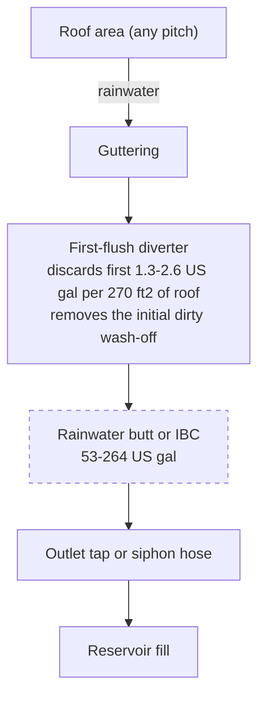

# Guide 03 — Water Quality
## Sources, Testing, Treatment, and Management

[](../../README.md)
[](https://creativecommons.org/licenses/by-nc-sa/4.0/)


---

## Table of Contents

- [1. Why Starting Water Quality Matters](#1-why-starting-water-quality-matters)
- [2. TDS (Total Dissolved Solids) and EC Baseline](#2-tds-total-dissolved-solids-and-ec-baseline)
  - [Testing Your Source Water](#testing-your-source-water)
  - [Why Source EC Matters](#why-source-ec-matters)
  - [Interpreting Your Local Water Report](#interpreting-your-local-water-report)
- [3. Tap Water: Chlorine, Chloramine, and Hardness](#3-tap-water-chlorine-chloramine-and-hardness)
  - [Chlorine vs Chloramine — Critical Difference](#chlorine-vs-chloramine-critical-difference)
  - [Hard Water Management in E&F](#hard-water-management-in-ef)
- [4. Well Water Issues](#4-well-water-issues)
- [5. Reverse Osmosis (RO) — When It's Worth It](#5-reverse-osmosis-ro-when-its-worth-it)
  - [What RO Does](#what-ro-does)
  - [Is RO Worth It for This System?](#is-ro-worth-it-for-this-system)
- [6. Rainwater Harvesting](#6-rainwater-harvesting)
  - [Rainwater Characteristics](#rainwater-characteristics)
  - [Collection System](#collection-system)
- [7. pH Testing Methods Compared](#7-ph-testing-methods-compared)
  - [Digital pH Meters (Recommended)](#digital-ph-meters-recommended)
  - [Calibrating a pH Meter](#calibrating-a-ph-meter)
- [8. EC Meters: Types, Calibration, and Use](#8-ec-meters-types-calibration-and-use)
  - [EC Meter Types](#ec-meter-types)
  - [Testing in E&F: Reservoir vs Media EC](#testing-in-ef-reservoir-vs-media-ec)
- [9. pH Up and pH Down — Safe Handling](#9-ph-up-and-ph-down-safe-handling)
  - [pH Adjustment Protocol for E&F](#ph-adjustment-protocol-for-ef)
- [10. Water Temperature Management Outdoors](#10-water-temperature-management-outdoors)
  - [The Outdoor Heat Problem](#the-outdoor-heat-problem)
  - [E&F Reservoir Positioning Advantage](#ef-reservoir-positioning-advantage)
  - [Management Strategies](#management-strategies)
- [11. Algae Prevention in E&F Systems](#11-algae-prevention-in-ef-systems)
  - [E&F Algae Risk Profile](#ef-algae-risk-profile)
  - [Prevention Checklist](#prevention-checklist)
  - [Treatment](#treatment)
- [12. Salt Accumulation and Flush Scheduling](#12-salt-accumulation-and-flush-scheduling)
  - [EC Monitoring Protocol](#ec-monitoring-protocol)
- [13. Full Water Change Protocol](#13-full-water-change-protocol)
  - [Step-by-Step Reservoir Change](#step-by-step-reservoir-change)


[↑ Back to TOC](#table-of-contents)

## 1. Why Starting Water Quality Matters

In all hydroponic systems, the quality of your source water determines your baseline. In Ebb & Flow specifically, water quality issues compound in a way that is unique to media-based systems: poor source water not only affects the reservoir chemistry but also accumulates in the clay pebble or coco coir media over repeated flood cycles. A problem that might cause one week of stress in an NFT system can persist for months as mineral deposits in flood table media.

Your source water directly affects:

- **EC baseline:** All tap water contains dissolved minerals. These contribute to total EC before you add a single nutrient. The baseline must be known and subtracted when targeting reservoir EC.
- **pH stability:** Hard (bicarbonate-rich) water resists pH adjustment and continuously pushes pH upward — requiring more pH-down and more frequent corrections in both the reservoir and the media.
- **Nutrient interference:** High calcium or magnesium in source water may create Ca:Mg imbalance, especially when combined with media buffering effects.
- **Pathogen introduction:** Any untreated surface water or collected roof water can introduce Pythium, algae, and bacteria that spread to every plant in the flood cycle.
- **Media deposit risk:** Every flood cycle leaves some source water minerals behind in the media pore spaces — hard water with high mineral content accelerates salt accumulation.

**First step before filling the reservoir for the first time:** Test your source water's EC and pH. This information determines how you mix nutrients, how you manage pH, and whether you need pre-treatment.


---


[↑ Back to TOC](#table-of-contents)

## 2. TDS (Total Dissolved Solids) and EC Baseline

### Testing Your Source Water

Before adding any nutrients, measure your tap water straight from the tap:

```
  WHAT TO LOOK FOR:

  Source water EC:    0.0–0.2 mS/cm   → Excellent (soft/RO/rainwater)
                      0.2–0.4 mS/cm   → Good (mild minerals, workable)
                      0.4–0.6 mS/cm   → Acceptable (hard water — monitor media accumulation)
                      0.6–1.0 mS/cm   → Problematic — consider RO or rainwater blending
                      1.0+ mS/cm      → RO or rainwater essential

  Source water pH:    6.5–7.5         → Typical tap range
                      7.5–9.0         → Hard/alkaline — needs correction every fill
                      < 6.5           → Acidic (unusual for tap)
```

### Why Source EC Matters

Your source water EC is a floor you start from — all nutrients are added on top of it:

```
  TOTAL EC = SOURCE WATER EC + NUTRIENTS EC

  Example 1 (soft water):
  Source EC: 0.1 mS/cm + Nutrients: 1.5 mS/cm = Final: 1.6 mS/cm ← near target

  Example 2 (hard water):
  Source EC: 0.6 mS/cm + Nutrients: 1.5 mS/cm = Final: 2.1 mS/cm ← too high for lettuce

  E&F ADDITIONAL CONCERN:
  Hard water top-ups over several days:
  ─ Each top-up adds more Ca/Mg minerals to the media
  ─ Reservoir EC can stay in range while the media climbs
  ─ Flush when media EC is more than 0.5 mS/cm above the reservoir
  ─ At +1.0 mS/cm, flush the same day
  ─ A 0.5–1.0 gap is the flush trigger. It is not a normal gap you can ignore
  ─ Top up with plain pH 5.8–6.2 water only when EC is at or above target.
    Add stock only when EC is low.
```

### Interpreting Your Local Water Report

Most municipal water suppliers publish annual quality reports. Look for:
- **Total Dissolved Solids (TDS)** or **electrical conductivity** — your EC baseline
- **Hardness** (as CaCO₃ or mg/L Ca+Mg) — affects pH buffering and media accumulation
- **Chlorine/chloramine** — affects roots and beneficial microbes
- **pH** — your starting point before nutrient addition
- **Iron, manganese, copper** — can cause problems at elevated levels


---


[↑ Back to TOC](#table-of-contents)

## 3. Tap Water: Chlorine, Chloramine, and Hardness

### Chlorine vs Chloramine — Critical Difference

| Property | Chlorine (Cl₂) | Chloramine (NH₂Cl) |
|----------|---------------|-------------------|
| **Used by** | Older water systems | Most modern municipal systems |
| **Removal method** | Leave to stand 24h, or activated carbon | **Cannot be removed by standing** |
| **How to remove** | Aeration, activated carbon, UV | Vitamin C (ascorbic acid), sodium thiosulfate, activated carbon |
| **Harm to plants** | Damages roots and microbes above ~2mg/L | Same, but persists longer |
| **Detection** | Smell dissipates after standing | No smell change after standing |

**E&F relevance:** In NFT, fresh water flows constantly through the system, diluting chlorine accumulation. In E&F, each flood cycle introduces the full chlorine/chloramine load of your source water directly to the root zone, then some of it stays in the media between floods. Over time, residual chlorine can stress or damage beneficial microbes in the media, especially for organic growers.

**Chloramine removal:**
```
  METHOD 1 — Vitamin C (Ascorbic Acid):
  Add 1 g per 10.6 US gal (40 L). Neutralizes chloramine within minutes.
  Slightly lowers pH — adjust pH after adding.
  Buy food-grade vitamin C powder — inexpensive.

  METHOD 2 — Sodium Thiosulfate:
  Standard aquarium dechlorinator. Works in seconds.

  METHOD 3 — Activated Carbon Filter:
  In-line carbon block filter on your fill hose.
  Best permanent solution for frequent reservoir refilling.
```

### Hard Water Management in E&F

Hard water causes the same problems as in NFT (pH creep, scale, excess Ca/Mg) but with an additional E&F-specific problem: calcium carbonate scale deposits inside the clay pebble pore structure. Over a growing season this can:
- Permanently clog media pore spaces (reducing aeration and drainage)
- Create pH micro-zones inside the media that differ from the reservoir
- Require acid soaking of clay pebbles at season end to remove deposits

```
  HARD WATER MANAGEMENT STRATEGIES FOR E&F:

  Strategy 1 — Reduce Ca in nutrient recipe:
  If source water Ca > 100 mg/L, reduce Calcium Nitrate dose by 20–30%.
  Verify with a full water test or local water quality report.

  Strategy 2 — Acidify to neutralize bicarbonates:
  Phosphoric acid (pH Down) consumes bicarbonate as well as lowering pH.
  Hard water simply needs more pH Down per US gallon. That is normal.

  Strategy 3 — Blend with RO or rainwater:
  50/50 blend halves the mineral load. Most practical and cost-effective.

  Strategy 4 — Obey the media EC trigger:
  Flush when media EC is more than 0.5 mS/cm above the reservoir.
  Urgent at +1.0 mS/cm. Hard water reaches that gap sooner.
  Do not wait out a 0.5–1.0 gap because a calendar says "next month."

  Strategy 5 — End-of-season acid soak:
  Soak clay pebbles in pH 4.0–4.5 water for 24h to dissolve calcium carbonate.
  Follow with thorough rinsing and standard pH re-conditioning.
```


---


[↑ Back to TOC](#table-of-contents)

## 4. Well Water Issues

If you use well water, test it thoroughly before use. Common problems in well water relevant to E&F:

| Contaminant | Problem | E&F-Specific Risk | Solution |
|-------------|---------|-------------------|---------|
| **High iron (>0.3mg/L)** | Staining, pump blockage, iron toxicity | Iron deposits in clay pebbles — can clog media permanently | Sediment filter + iron removal; or RO |
| **High sulfur (rotten egg smell)** | Toxic to roots at high levels | Anaerobic smell masked by flood cycle noise | Activated carbon + aeration |
| **High hardness (Ca+Mg)** | pH creep, scale | Accelerated media mineral accumulation | Softener or RO; more frequent flushes |
| **Bacteria / E. coli** | Dangerous for edible crops | Flood cycle spreads pathogens to all plants | UV sterilization or chlorination then dechlorination |
| **Nitrates (from agriculture)** | Adds to nutrient load unpredictably | EC baseline higher than expected | Test and adjust nutrient recipe accordingly |
| **Low pH (acidic)** | Corrosive | Leaches minerals from clay pebbles faster | pH Up to correct; test media EC weekly |

**Recommendation:** If you use well water, buy a basic test kit or send a sample to a lab before the first fill. $15–$50 (R270–R900) is small next to a lost season.


---


[↑ Back to TOC](#table-of-contents)

## 5. Reverse Osmosis (RO) — When It's Worth It

### What RO Does

Reverse osmosis forces water through a semi-permeable membrane that removes 95–99% of all dissolved solids, heavy metals, chlorine, chloramine, bacteria, and viruses. The result is near-pure water (EC: 0.00–0.05 mS/cm) with maximum nutrient control.

| Pros | Cons |
|------|------|
| Perfect baseline water (EC ~0.0) | Cost: $50–$200 (R900–R3,600) for a basic unit |
| No chlorine/chloramine issues | Waste water: about 3–4 US gal waste per 1 US gal of RO water (3–4 L per 1 L) |
| No hard water scale in clay pebbles | Slow output: about 13–53 US gal/day (50–200 L/day) for home units |
| Maximum nutrient precision | Removes Ca/Mg — must add back via CalMag or Masterblend |
| Consistent results season to season | Membrane replacement every 1–2 years |

### Is RO Worth It for This System?

```
  DECISION GUIDE:

  Tap water EC < 0.3 mS/cm:      → RO unnecessary — tap water is fine
  Tap water EC 0.3–0.6 mS/cm:    → RO useful but not essential; blend or adjust recipe
  Tap water EC > 0.6 mS/cm:      → RO strongly recommended
  Hard water (CaCO₃ > 250 mg/L): → RO strongly recommended (prevents clay pebble scaling)
  Well water with iron/sulfur:    → RO recommended
  You are organic growing in E&F: → RO or rainwater preferred (chloramine harms microbes)
```

A full change of the 45 US gal (170 L) reservoir every 10–14 days is the schedule. A countertop RO unit with a 3–5 US gal (10–20 L) storage tank can feed that fill if you collect over a day or two. Store it covered, then use it for the reservoir.


---


[↑ Back to TOC](#table-of-contents)

## 6. Rainwater Harvesting

Outdoor systems have a natural advantage: free, soft, near-pure water falls from the sky. For an outdoor E&F system, rainwater is arguably the ideal source water.

### Rainwater Characteristics

- **EC:** 0.01–0.05 mS/cm — essentially mineral-free, perfect baseline
- **pH:** 5.5–6.5 — slightly acidic due to dissolved CO₂, often within ideal hydroponic range
- **Chlorine/chloramine:** None — natural water cycle
- **Contaminants:** Dust, bird droppings, roof material leachate (first-flush diverter removes most)

### Collection System



**Collection system rules:**
- Cover the tank — prevents algae, debris, and mosquito breeding
- Use a first-flush diverter — the first few liters from a roof carry bird droppings and dust; these should not enter your tank
- Use a fine mesh filter (200 micron) at the tank outlet before adding to your reservoir
- Test pH and EC when you first start using a new collection system

**Legality note:** This worked example is an inland mid-USA site at about 38°N. Rainwater harvesting is legal in nearly all US states (a few western states restricted it in the past). In South Africa, check the local by-law before you plumb a large tank. Confirm the rule where you live before you buy a big cistern.


---


[↑ Back to TOC](#table-of-contents)

## 7. pH Testing Methods Compared

### Digital pH Meters (Recommended)

```
  HOW IT WORKS: Glass electrode measures H⁺ ion concentration electronically.

  Accuracy:    ±0.01–0.05 pH when calibrated
  Speed:       Reading stable in 10–30 seconds
  Key issue:   Requires regular calibration and storage in electrode storage solution

  Budget:      Vivosun, Dr.meter, about $12–$20 (R216–R360) — acceptable, short electrode life
  Mid-range:   Apera PH20, Bluelab, about $35–$60 (R630–R1,080) — accurate and durable
  Professional: Hanna HI98100 and similar, about $80 and up (R1,440 and up) — lab grade

  Recommendation: Apera PH20 for this system — auto-calibrating, reliable.

  NEVER store the electrode in distilled water or dry air — this destroys the
  glass membrane. Always store in electrode storage solution (KCl) or the cap
  that comes with the meter filled with storage solution.
```

**pH drops / test kits:** About $5–$10 (R90–R180), no calibration, fine as a backup. Accuracy ±0.2–0.5 — rough checks only.

**pH test strips:** Not recommended for nutrient solution — colored solution masks color comparison. ±0.5–1.0 accuracy. Use only as absolute last resort.

### Calibrating a pH Meter

```
  CALIBRATION PROCEDURE (2-point calibration):

  Materials:
  ─ pH 4.0 buffer solution (usually red/orange)
  ─ pH 7.0 buffer solution (usually yellow)
  ─ Distilled or RO water for rinsing

  Steps:
  1. Remove electrode from storage cap — rinse with distilled water
  2. Submerge in pH 7.0 buffer — wait for reading to stabilize — press CAL
  3. Rinse electrode with distilled water
  4. Submerge in pH 4.0 buffer — wait for reading to stabilize — press CAL
  5. Rinse with distilled water before each measurement
  6. Return to storage solution after use

  Calibrate: weekly during active growing season
  Replace electrode: every 12–18 months (or when calibration drifts >0.3 pH)

  E&F NOTE: Test reservoir pH AND media pH separately.
  Media pH test: press the probe 2 in (5 cm) into moist LECA immediately after a flood.
  Media pH often reads 0.2–0.5 higher than the reservoir. The working window is still 5.8–6.2.
```


---


[↑ Back to TOC](#table-of-contents)

## 8. EC Meters: Types, Calibration, and Use

### EC Meter Types

| Type | Accuracy | Cost | Notes |
|------|----------|------|-------|
| Basic pen meter | ±0.1 mS/cm | $10–$20 (R180–R360) | Enough for home use; single-point calibration |
| Mid-range digital | ±0.05 mS/cm | $20–$50 (R360–R900) | Better accuracy, automatic temperature compensation |
| Combination EC/pH | ±0.1 EC, ±0.05 pH | $30–$80 (R540–R1,440) | Convenient; acceptable accuracy for both |
| Bluelab Truncheon | ±0.1 mS/cm | $50+ (R900+) | No display; LED indicators — durable |
| Professional inline | ±0.02 mS/cm | $100+ (R1,800+) | Continuous monitoring with data logging |

**Critical feature:** Always buy a meter with **Automatic Temperature Compensation (ATC)**. EC readings change with temperature — a meter without ATC will give inaccurate readings in outdoor conditions where water temperature fluctuates.

### Testing in E&F: Reservoir vs Media EC

This is unique to media-based systems. Your management routine should include both measurements:

```
  E&F EC TESTING PROTOCOL:

  Test 1 — RESERVOIR (daily):
  ─ Dip probe directly into reservoir
  ─ This is your nutrient solution concentration
  ─ Target: crop-specific EC range (see Guide 02, Section 4)

  Test 2 — MEDIA EC (weekly):
  ─ Immediately after a flood (media fully wet)
  ─ Push the EC probe 2 in (5 cm) into the LECA
  ─ Read while the probe is in wet media
  ─ Compare with the reservoir

  INTERPRETING MEDIA EC:
  Within 0.3 mS/cm of the reservoir:     normal variation
  More than 0.5 mS/cm above reservoir:   flush (Guide 02, Section 10)
  1.0 mS/cm or more above reservoir:     urgent — flush the same day
  More than 0.5 mS/cm below reservoir:   media looks depleted — check dry zones
  A gap of 0.5–1.0 above the reservoir is not "always normal." It is the flush.
```


---


[↑ Back to TOC](#table-of-contents)

## 9. pH Up and pH Down — Safe Handling

**pH Down (Acid)** — most commonly **phosphoric acid (H₃PO₄)**, sold as pH Down or pH Minus.

```
  Concentration: Typically 25–81% solution — corrosive; dilute before skin contact.

  Safe use:
  ─ Wear gloves, eye protection, and a dust mask. Phosphoric acid is in the same PPE rule as the dry salts (Guide 02)
  ─ Always add acid TO WATER, never water to acid
  ─ Start with about 1 ml per 1 US gal (3.8 L), stir, wait 30 seconds, remeasure
  ─ Rinse skin immediately if it gets on you
  ─ Store the bottle in a latched box, away from children and pets

  Citric acid: natural, safe, used by organic growers — gentler and less corrosive.
  Not recommended for E&F: citric acid can feed bacterial growth in warm reservoirs.
```

**pH Up (Base)** — most commonly **potassium hydroxide (KOH)**, sold as pH Up or pH Plus.

```
  Concentration: Typically 1–25% solution — caustic, corrosive to skin and eyes.

  Safe use:
  ─ Wear gloves, eye protection, and a dust mask. Potassium hydroxide is caustic
  ─ Add about 1 ml per 1 US gal (3.8 L), stir, remeasure
  ─ Store upright, in the same latched box as the acid and the dry salts, away from children and pets
  ─ Rinse skin immediately if it gets on you

  Alternative: Sodium bicarbonate (baking soda) — gentle, cheap, but adds Na which
  can accumulate in clay pebbles over time and stress roots. Emergency use only.
```

### pH Adjustment Protocol for E&F

```
  ADJUSTING RESERVOIR pH TO TARGET (5.8–6.2):

  1. Mix complete nutrient solution first (nutrients change pH significantly)
  2. Measure pH
  3. pH > 6.5: add pH Down 1ml at a time, stir, wait 30 seconds, remeasure
  4. pH < 5.5: add pH Up 1ml at a time, stir, wait 30 seconds, remeasure
  5. Repeat until within target range
  6. Final check after 5 minutes
  7. Run first flood cycle — then test media pH immediately after flood
  8. If media pH > 6.5: increase pH Down dose slightly on next reservoir fill

  E&F NOTE: After mixing and adjusting reservoir, check pH again after the FIRST flood.
  New clay pebbles may have released alkalinity into the solution during the flood,
  pushing pH back up. This is normal in weeks 1–4 with new media. Adjust and recheck.
```


---


[↑ Back to TOC](#table-of-contents)

## 10. Water Temperature Management Outdoors

### The Outdoor Heat Problem

An outdoor reservoir in this climate can reach the high 80s °F (about 28–35°C) on a bare tank. Summer afternoon air is 90–100°F (32–38°C). At those solution temperatures:
- Dissolved oxygen drops sharply (from about 9 mg/L at 68°F / 20°C to under 7 mg/L at 86°F / 30°C)
- Pythium and other water molds thrive exponentially
- Nutrient uptake by roots becomes impaired
- Beneficial microbial balance is disrupted

### E&F Reservoir Positioning Advantage

The E&F reservoir sits **under the flood tables**. The tables shade it. Expect it to run about 5–11°F (3–6°C) cooler than the same tank in full sun. The aim is still **64–72°F (18–22°C)**. Above **77°F (25°C)**, treat dissolved oxygen and pythium as the problem to solve.

Maximize this advantage:
- Ensure the flood tables fully overhang the reservoir on all sides
- Use a lid on the reservoir (also prevents light entry and algae)
- Orient tables so the prevailing shade from nearby walls or fences protects the under-table space

### Management Strategies

```
  STRATEGY 1 — MAXIMIZE NATURAL SHADE (free):
  As above — use table overhang. Add shade cloth to reservoir sides if gaps exist.

  STRATEGY 2 — INSULATION, about $5–$20 (R90–R360):
  Wrap reservoir exterior in:
  ─ Reflective bubble wrap insulation (best — reflects + insulates)
  ─ Foam camping mat glued to exterior
  ─ Partially bury reservoir in the ground (1/3 depth = effective thermal mass)

  STRATEGY 3 — WHITE/REFLECTIVE PAINT (free if you have paint):
  Paint the outside of the reservoir white or silver.
  That can cut water temperature about 4–7°F (2–4°C) compared with a black tank.

  STRATEGY 4 — FROZEN BOTTLES (free, temporary):
  Freeze 1 US pint–1 US qt (about 0.5–1 L) bottles of water.
  Drop them in through the lid on hot days.
  Each 1 US qt (1 L) bottle absorbs roughly 80 kcal as it melts — useful for a short spike.
  Replace daily in peak summer.

  STRATEGY 5 — AQUARIUM CHILLER, about $50–$200 (R900–R3,600):
  Most effective, most expensive.
  An inline chiller holds a set temperature.
  Consider one if the solution itself stays above 77°F (25°C) through the 90–100°F (32–38°C) afternoons.
```


---


[↑ Back to TOC](#table-of-contents)

## 11. Algae Prevention in E&F Systems

### E&F Algae Risk Profile

Algae requires two things: **light** and **nutrients**. Your reservoir and flood tables have both. E&F presents specific algae challenges that differ from NFT:

**Higher risk areas in E&F:**
- **Clay pebble surface:** Pebbles at the surface of the flood table are intermittently wet and exposed to light — ideal algae habitat
- **Table edges and overflow fittings:** Wet surfaces in light breed algae quickly
- **Reservoir lid gaps:** Any light entering the reservoir enables algae growth

**Consequences in E&F:**
- Algae mat on clay pebble surface can block air exchange into the media
- Algae in overflow fittings partially blocks the drain — flood levels rise unexpectedly
- Algae in the reservoir depletes dissolved oxygen at night, stressing roots during the overnight period between flood cycles

### Prevention Checklist

```
  ALGAE PREVENTION FOR E&F:

  [ ] Cover clay pebble surface in flood tables with a black or silver plastic sheet
      (cut holes for net pots) — eliminates surface algae completely
  [ ] Keep reservoir lid light-tight — seal all gaps with black tape or foam
  [ ] Use opaque (black or white) flood tables — not clear or translucent
  [ ] Clean overflow fittings weekly — algae builds up inside the standpipe housing
  [ ] Ensure all return lines and hoses are opaque black — not clear vinyl
  [ ] Avoid overhead lighting that directly illuminates flood table media surface
```

### Treatment

If algae is already established:

```
  H₂O₂ (Hydrogen Peroxide) TREATMENT:

  Product: 3% food-grade H₂O₂ (available at pharmacies)
  Dose: 8–11 ml per US gal (2–3 ml/L) of reservoir volume
  This is a cleaning step. Do not run it through a live root zone.

  Procedure:
  1. Remove all plants from affected tables
  2. Add H₂O₂ to the reservoir at 8–11 ml per US gal (2–3 ml/L)
  3. Run 2–3 flood cycles (circulates through tables and media)
  4. Let sit for 30 minutes between cycles
  5. Drain reservoir completely
  6. Flush media with plain water — 2–3 flood cycles with plain water
  7. Drain again — the H₂O₂ degrades to water and oxygen within hours
  8. Refill with fresh nutrient solution
  9. Replant

  CAUTION: H₂O₂ kills algae, beneficial microbes, AND can stress plant roots.
  Always remove plants before treatment. Rinse completely before replanting.
  For organic growers: H₂O₂ treatment destroys your beneficial microbe colony —
  you will need to re-inoculate after treatment (worm tea, Hydroguard).
```


---


[↑ Back to TOC](#table-of-contents)

## 12. Salt Accumulation and Flush Scheduling

The most important water management practice unique to E&F is **monitoring and managing salt accumulation in the growing media**. This does not occur in NFT (solution flows continuously, washing salts), but is a significant concern in any media-based system.

### EC Monitoring Protocol

```
  WEEKLY EC CHECK ROUTINE:

  Day and timing: Any day, immediately after a flood cycle ends

  Step 1: Test RESERVOIR EC → record value
  Step 2: Push the EC probe 2 in (5 cm) into the LECA in several places
          (at least 3 spots: near the inlet, middle of the table, near that table's drain)
          Record each value
  Step 3: Calculate average media EC

  DECISION TABLE:
  ────────────────────────────────────────────────────────────────────
  Media EC vs Reservoir EC     Action
  ────────────────────────────────────────────────────────────────────
  Within 0.3 mS/cm             Normal — no flush
  Up to 0.5 mS/cm above        Watch. Flush as soon as it passes 0.5
  More than 0.5 above          Flush. Do not call 0.5–1.0 "always normal"
  1.0 or more above            Urgent — flush today; inspect roots for tip burn
  ────────────────────────────────────────────────────────────────────

  Record in a log: date, reservoir EC, media EC, any symptoms observed.
  Trends over weeks tell you whether your flush frequency is adequate.
```


---


[↑ Back to TOC](#table-of-contents)

## 13. Full Water Change Protocol

### Step-by-Step Reservoir Change

```
  FREQUENCY: Every 10–14 days.
  Also change sooner if EC will not hold, the solution smells, or roots slime.
  The other triggers are in Guide 02, Section 10 (not the temperature section of this guide).

  WHAT YOU NEED:
  ─ Siphon hose or small submersible utility pump
  ─ Bucket for old solution disposal
  ─ Scrub brush / sponge / microfiber cloth
  ─ 10% bleach solution (1 part bleach : 9 parts water)
  ─ Fresh water supply (tap, RO, or rainwater)
  ─ Nutrient concentrates and pH adjustment chemicals
  ─ Calibrated EC and pH meters
  ─ Gloves and eye protection

  STEPS:
  1.  Turn off the pump (prevent dry-running during drain)
  2.  Remove the pump from the reservoir
  3.  Siphon or pump out all old nutrient solution
  4.  Wipe interior walls and floor of reservoir with a cloth
      ─ Remove biofilm, algae patches, and mineral deposits
  5.  Add about 0.5–0.8 US gal (2–3 L) of 10% bleach solution, swirl to coat all surfaces
  6.  Leave 10–15 minutes (sterilization contact time)
  7.  Drain bleach solution completely
  8.  Triple rinse: fill with fresh water, slosh, drain — repeat 3 times
      (No bleach residue must remain — it kills plant roots and beneficial microbes)
  9.  Clean pump filter/strainer — remove accumulated debris
  10. Inspect all fittings and drain lines — clear any partial blockages
  11. If this is also a media flush day (see Guide 02, Section 10):
      ─ Fill reservoir with plain pH-adjusted water
      ─ Run 3–4 flood cycles before adding nutrients
      ─ Drain reservoir after flush cycles
  12. Refill reservoir with fresh source water
  13. Add nutrients (Masterblend or Flora Series) to target EC
  14. Adjust pH to 5.8–6.2
  15. Verify final EC and pH before restarting pump
  16. Restart pump — confirm flow reaching all tables
  17. Log the date of reservoir change and any observations
```

---


---

> **Previous:** [Guide 02 — Nutrient Solution](02-nutrient-solution.md)


[↑ Back to TOC](#table-of-contents)

> **Next:** [Guide 04 — Lighting](04-lighting.md)

<!-- copyright -->
*Copyright (c) 2026 UncleJS. Licensed under [CC BY-NC-SA 4.0](https://creativecommons.org/licenses/by-nc-sa/4.0/) — free to share and adapt for non-commercial purposes with attribution and ShareAlike.*
