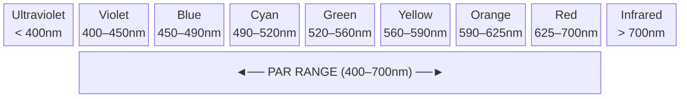
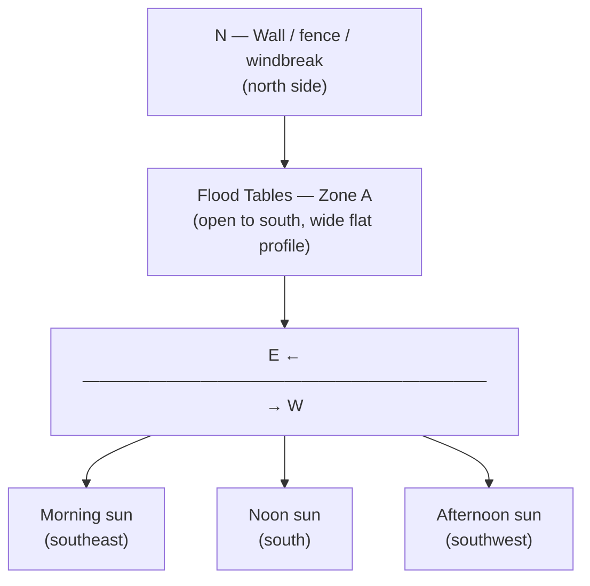
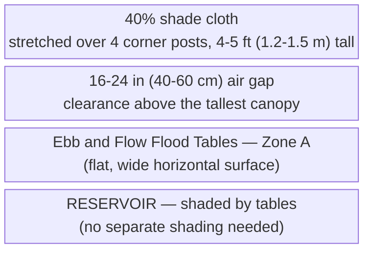

# Guide 04 — Lighting
## Outdoor Light, PAR, DLI, Shade Management, and Seasons

[](../../README.md)
[](https://creativecommons.org/licenses/by-nc-sa/4.0/)


---

## Table of Contents

- [1. The Language of Plant Light](#1-the-language-of-plant-light)
  - [PAR — Photosynthetically Active Radiation](#par-photosynthetically-active-radiation)
  - [PPFD — Photosynthetic Photon Flux Density](#ppfd-photosynthetic-photon-flux-density)
  - [DLI — Daily Light Integral](#dli-daily-light-integral)
- [2. DLI Targets by Crop](#2-dli-targets-by-crop)
  - [Seasonal DLI at the Worked Site](#seasonal-dli-at-the-worked-site)
- [3. Minimum Sun Hours Per Crop](#3-minimum-sun-hours-per-crop)
- [4. Siting the System: Sun Mapping](#4-siting-the-system-sun-mapping)
  - [Southern Exposure (Northern Hemisphere)](#southern-exposure-northern-hemisphere)
  - [Obstruction Mapping](#obstruction-mapping)
  - [Flood Table Geometry and Light Distribution](#flood-table-geometry-and-light-distribution)
- [5. Shade Cloth: Percentages, Timing, and Deployment](#5-shade-cloth-percentages-timing-and-deployment)
  - [Why Shade Cloth?](#why-shade-cloth)
  - [Shade Cloth Percentages](#shade-cloth-percentages)
  - [Deployment Method for Flood Tables](#deployment-method-for-flood-tables)
  - [When to Deploy and Remove](#when-to-deploy-and-remove)
- [6. Heat Stress vs Light Stress: Distinguishing the Two](#6-heat-stress-vs-light-stress-distinguishing-the-two)
- [7. Photoperiod Sensitivity](#7-photoperiod-sensitivity)
  - [Crop Categories](#crop-categories)
  - [Implications for Your System](#implications-for-your-system)
- [8. Seasonal Light Strategy](#8-seasonal-light-strategy)
  - [Spring (March–May) — Establishment Phase](#spring-marchmay-establishment-phase)
  - [Summer (June–August) — Peak Production, Heat Management](#summer-juneaugust-peak-production-heat-management)
  - [Autumn (September–October) — Second Season](#autumn-septemberoctober-second-season)
  - [Winter (November–February) — Shutdown / Planning](#winter-novemberfebruary-shutdown-planning)
- [9. Supplemental Lighting for Season Extension](#9-supplemental-lighting-for-season-extension)
  - [When It Makes Sense](#when-it-makes-sense)
  - [Options](#options)
  - [Target PPFD for Supplemental Lighting](#target-ppfd-for-supplemental-lighting)
  - [Wattage and Sizing for Flood Tables](#wattage-and-sizing-for-flood-tables)
  - [Photoperiod Recommendations](#photoperiod-recommendations)
  - [Cost-Benefit Summary](#cost-benefit-summary)
- [10. Microgreens Lighting (Zone B)](#10-microgreens-lighting-zone-b)

---


## 1. The Language of Plant Light

Before managing light for your plants, you need to understand the three key metrics used to describe it. These are not interchangeable — they measure very different things.

### PAR — Photosynthetically Active Radiation

PAR defines the **spectrum of light** that plants use for photosynthesis: wavelengths between **400nm (violet) and 700nm (red)**. This is not a measurement of intensity — it defines the type of light that matters.



| Wavelength range | Colour band | Notes |
|---|---|---|
| Below 400nm | Ultraviolet | Minor photosynthetic role; can stress plants |
| 400–700nm | **PAR range** | Photosynthetically active radiation |
| Above 700nm | Infrared | Mostly heat; minor photomorphogenetic effects |
| 440–470nm | Blue | Vegetative growth, compact internodes, stomatal opening |
| 640–680nm | Red | Flowering, fruiting, overall photosynthesis efficiency |
| 430nm + 680nm | — | Chlorophyll **a** absorption peaks |
| 453nm + 642nm | — | Chlorophyll **b** absorption peaks |

### PPFD — Photosynthetic Photon Flux Density

PPFD measures the **intensity of PAR light** hitting a surface at a given moment. It tells you how much photosynthetically useful light is arriving per second.

- **Units:** μmol/m²/s (micromoles of photons per square metre per second)
- **What it measures:** Instantaneous light intensity at a specific point

```
  PPFD REFERENCE VALUES:

  Outdoors, full sun (noon, summer): ~1,500–2,000 μmol/m²/s
  Outdoors, bright overcast:          ~200–600 μmol/m²/s
  Outdoors, shade/cloudy:             ~50–200 μmol/m²/s
  Indoors, window ledge:              ~100–500 μmol/m²/s (highly variable)

  Plant PPFD thresholds:
  Light compensation point (min useful): ~10–50 μmol/m²/s
  Light saturation point (max useful):
    Lettuce/herbs:          ~400–600 μmol/m²/s
    Tomatoes/peppers:       ~800–1,200 μmol/m²/s
    Cucumbers/courgettes:   ~700–1,000 μmol/m²/s
    Strawberries:           ~600–1,000 μmol/m²/s
```

> **Key insight:** On a clear summer day, outdoor PPFD at noon (1,500–2,000) **far exceeds the light saturation point** of most plants. The excess beyond what plants can use is converted to heat — this is why shade cloth helps in summer.

### DLI — Daily Light Integral

DLI is the **total quantity of PAR light delivered over an entire day**. It integrates PPFD over time — how many photons the plant receives across a full day. This is the most practically useful metric for crop planning.

- **Units:** mol/m²/day (moles of photons per square metre per day)
- **Why it matters:** You can have high PPFD but few hours of daylight (low DLI), or moderate PPFD across many hours (adequate DLI)

```
  DLI FORMULA:

  DLI = Average PPFD (μmol/m²/s) × Hours of light × 0.0036

  Example:
  Average outdoor PPFD: 400 μmol/m²/s (partly cloudy day)
  Hours of useful daylight: 10 hours

  DLI = 400 × 10 × 0.0036 = 14.4 mol/m²/day → adequate for lettuce
```

[↑ Back to TOC](#table-of-contents)

---


## 2. DLI Targets by Crop

These are the daily light requirements your plants need for optimal growth. The E&F system supports a broader crop range than NFT, including cucumbers, courgettes, and aubergines, which have higher DLI needs.

| Crop | Minimum DLI | Optimal DLI | Max Usable DLI |
|------|-------------|-------------|----------------|
| Lettuce (all types) | 8 mol/m²/day | 12–17 | 20 |
| Spinach | 8 | 12–16 | 20 |
| Basil | 12 | 15–20 | 25 |
| Cilantro/coriander | 8 | 12–16 | 18 |
| Mint | 8 | 12–16 | 20 |
| Parsley | 8 | 12–16 | 18 |
| Kale | 10 | 15–20 | 25 |
| Cherry tomatoes | 20 | 25–35 | 40 |
| Peppers (sweet/chilli) | 20 | 25–35 | 40 |
| Cucumbers | 20 | 25–35 | 40 |
| Courgettes/Zucchini | 18 | 22–32 | 38 |
| Aubergine/Eggplant | 18 | 22–30 | 38 |
| Strawberries | 15 | 20–30 | 35 |
| Radishes (bags) | 10 | 15–20 | 25 |
| Carrots (bags) | 10 | 15–20 | 25 |
| Microgreens | 10 | 12–20 | — |

### Seasonal DLI at the Worked Site

The worked climate is inland mid-USA, about **38°N**, USDA zones **6b–7a** (Kansas City, St. Louis, Louisville, Richmond). It is not a coastal site at the same latitude. The South African month is a six-month shift so a southern-hemisphere reader can use the same season. It is not a second climate dataset.

```
  CLEAR-SKY DLI — INLAND ~38°N

  Season                         Months (SA)                         Clear-sky DLI
  ─────────────────────────────────────────────────────────────────────────────────
  Winter                         Dec–Feb (SA: Jun–Aug)               10–15 mol/m²/day
  Spring and fall (shoulder)     Mar–May and Sep–Nov
                                 (SA: Sep–Nov and Mar–May)           25–35 mol/m²/day
  Summer                         Jun–Aug (SA: Dec–Feb)               45–55 mol/m²/day

  Outdoor season: mid-April through mid-October
                  (SA: mid-October through mid-April)
  Summer afternoon highs: 90–100°F (32–38°C) in June–August
                          (SA: December–February)
  Winter lows in this band: 0–15°F (−18 to −9°C)

  WHAT THAT MEANS FOR CROPS:
  - Lettuce and herbs: useful light from the April opening through October
    (SA: October through April)
  - Table 1 tomato or cucumber, and Table 2 pepper, aubergine, or courgette:
    the summer band (45–55) covers their optimal DLI. Shoulder light
    (25–35) is enough to establish and to finish
  - Do not run the outdoor tables through December–February
    (SA: June–August) without a real cover and a reason. Clear-sky winter
    DLI is 10–15, and the nights are far below fruiting temperatures
```

[↑ Back to TOC](#table-of-contents)

---


## 3. Minimum Sun Hours Per Crop

While DLI is more accurate, a simple sun hours estimate works for practical planning:

| Crop | Minimum Daily Sun Hours |
|------|------------------------|
| Lettuce, spinach | 4–6 hours direct sun (or more dappled light) |
| Herbs (basil, cilantro, parsley) | 6–8 hours |
| Mint | 4–6 hours (tolerates some shade) |
| Kale | 6–8 hours |
| Tomatoes | 8+ hours full sun — critical |
| Peppers | 8+ hours full sun — critical |
| Cucumbers | 8+ hours full sun — critical |
| Courgettes/Zucchini | 8+ hours full sun — very productive with maximum light |
| Aubergine/Eggplant | 8+ hours full sun — needs heat and light to fruit well |
| Strawberries | 6–8 hours |
| Radishes/carrots | 6–8 hours |

> **Site selection rule:** Face the long axis **south** (SA: **north**). You want an unobstructed sky on that side for at least 8 hours. Avoid shade from buildings, walls, or large trees between 10am and 4pm. Table 1 (one tomato or one cucumber) and Table 2 (pepper, aubergine, or courgette) turn that light into yield.

[↑ Back to TOC](#table-of-contents)

---


## 4. Siting the System: Sun Mapping

### South Facing (SA: North Facing)

In this mid-USA example the sun travels across the southern sky. Face the tables south, with the south, southeast, and southwest open from 10am to 4pm. In South Africa, face them north, and keep the north, northeast, and northwest open for the same hours. The working aisle in the site plan is on the south side of the US layout.



### Obstruction Mapping

Walk your site at:
- **9am** (spring equinox): Note what is in shadow
- **12pm**: Note what is in shadow
- **3pm**: Note what is in shadow

If your site is in shadow at 12pm due to a building or tall fence, you either need to move the system or accept reduced yields.

**Height rule of thumb:** A wall or fence at distance D casts a shadow about **D × (1/tan(sun altitude))**. At this site, about 38°N, summer noon sun altitude is roughly 75°, so the shadow is about **D × 0.27**. Winter noon altitude is roughly 29°, so the shadow is about **D × 1.8**. A fence that is harmless in June can cover the tables in December. That is one reason the outdoor season closes in mid-October (SA: mid-April) and stays shut through deep winter.

### Flood Table Geometry and Light Distribution

The flood tables in this system, each 4 ft × 2 ft (1.22 m × 0.61 m) and perfectly level, spread light differently from a row of NFT channels:

```
  E&F FLOOD TABLE LIGHT PROFILE vs NFT CHANNELS:

  NFT CHANNELS (slightly sloped, narrow profile):
  ─ Plants grow in a line along the channel
  ─ Greens are spaced about 9 in (229 mm) apart
  ─ Low-angle morning and evening sun hits them from the side
  ─ The high end of the channel sits a little above the low end

  EBB AND FLOW TABLES (flat, 4 ft × 2 ft):
  ─ Table 1 is one tomato or one cucumber. Table 2 is 1–2 plants.
    Table 3 holds the leafy crop or a later fruiting crop
  ─ Every plant on a table sits at the same height
  ─ Low sun hits the outer plants more than the middle
  ─ A tall plant shades whatever is south of it (SA: north of it)

  ADVANTAGE — Reservoir shading:
  ─ The reservoir sits UNDER the flood tables
  ─ Tables naturally shade the reservoir — reducing algae growth and heat gain
  ─ No additional reservoir shading needed (unlike NFT where reservoir is exposed)

  ADVANTAGE — Water surface reflectance during flood:
  ─ When tables are flooded, the water surface briefly reflects light
  ─ This reflected light illuminates the undersides of lower leaves
  ─ The effect is small across a 15–30 minute flood, and it adds a little DLI
  ─ Most noticeable in low-canopy crops (lettuce, herbs)
```

**Spacing to prevent mutual shading in flood tables:**

On wide flat tables, tall plants can shade smaller neighbours in a way that does not occur in single-file NFT channels.

| Crop combination on same table | Shading risk | Recommendation |
|-------------------------------|--------------|----------------|
| Lettuce + lettuce | Low on Table 3 | About 8–10 in (20–25 cm) is enough |
| Lettuce + basil | Low | Put the taller basil at the north end (SA: south end) |
| Tomato + pepper | High | Do not share a table. Tomato is the Table 1 plant. Pepper is Table 2 |
| Cucumber + courgette | High | Cucumber is Table 1. Courgette is Table 2. One crop family per table |
| Fruiting + leafy | High | Leafy crops stay on Table 3, or Table 3 becomes a later fruiting crop |

> **Practical rule:** Table 1 is the tall crop (one indeterminate tomato or one cucumber). Put that table on the north side of the group (SA: south side) so it does not shade Table 3. Table 2 is pepper, aubergine, or courgette, 1–2 plants. Table 3 is lettuce, herbs, pak choi, or a later fruiting crop.

[↑ Back to TOC](#table-of-contents)

---


## 5. Shade Cloth: Percentages, Timing, and Deployment

### Why Shade Cloth?

On a sunny July day, PPFD at noon can reach 1,800–2,000 μmol/m²/s. The light saturation point of lettuce is ~400–600 μmol/m²/s. The excess 1,200–1,400 μmol/m²/s is absorbed as heat — raising leaf temperature, accelerating transpiration (water loss), stressing plants, and triggering bolting (premature flowering) in leafy crops.

Shade cloth reduces PPFD to a level that maximises photosynthesis without heat stress. In E&F flood tables, heat stress is compounded by the fact that the clay pebble media surface has a large exposed area — LECA heats up quickly in direct summer sun, warming the root zone from above.

### Shade Cloth Percentages

| Shade Level | PPFD Reduction | Recommended Use |
|-------------|---------------|-----------------|
| 30% | Reduces PPFD by ~30% | Light shade, spring/autumn, mild summers |
| 40% | Reduces PPFD by ~40% | Standard summer use — good all-around choice |
| 50% | Reduces PPFD by ~50% | Hot climates, afternoon shade for greens |
| 70% | Reduces PPFD by ~70% | Seedlings, sensitive plants — too dark for most crops |
| 90% | Reduces PPFD by ~90% | Mushrooms, propagation — not for growing food crops |

**Recommendation for this system:** **40% shade cloth** over the Zone A tables when afternoon highs hold above **85°F (29°C)**. In this climate that is the June–August stretch (SA: December–February), including heatwaves at 90–100°F (32–38°C). Take it off on a run of overcast days, and take it off once highs no longer hold above 85°F (29°C).

### Deployment Method for Flood Tables

Flood tables need a different shade frame than NFT channels. Each table is 2 ft (0.61 m) wide and sits lower, so a simple overhead frame is the practical fix.



**Installation for flood tables:**

1. Install 4 corner posts at the corners of the Zone A footprint — 4–5 ft (1.2–1.5 m) above the table. Table 1 carries the tall plant (one tomato or one cucumber), so the cloth has to clear that canopy
2. For tomatoes and cucumbers, a trellis or support structure is often already in place — attach shade cloth to the outer face of the trellis frame
3. Stretch 40% shade cloth over the top, securing with clips, bungee cords, or wire
4. Leave the south face open (SA: the north face) or cover it with mesh only, so low-angle morning and evening light still reaches the plants in the shoulder seasons
5. On tables with fruiting crops at different heights, consider a horizontal shade panel above the canopy rather than a tent-style enclosure — this avoids blocking side-light to lower plants

**Anchoring on open flood tables:**

Unlike NFT channels (which are structural tubes), flood tables have a flat open surface. Shade cloth must be anchored externally — do not use the table edges for tension:
- Use ground stakes on the table perimeter
- Attach to a pergola, fence, or wall where available
- A simple PVC conduit frame, 1 in (25 mm) conduit in ground anchors, is cheap and works. See [Guide 12 — Budget and Sourcing](12-budget-and-sourcing.md) for cost

### When to Deploy and Remove

```
  DEPLOY 40% shade cloth when:
  - Afternoon highs hold above 85°F (29°C)
  - A heatwave is running at 90–100°F (32–38°C). Keep 4 floods on fruiting
    tables and shorten the duration if the media stays wet. Do not add a 5th
    flood and do not drop from 4 floods to 2
  - Lettuce or herbs on Table 3 are bolting
  - Leaf tip burn is increasing
  - The LECA surface is hot to the touch at noon

  REMOVE shade cloth when:
  - Several overcast days in a row (DLI will fall below the crop minimum)
  - Afternoon highs no longer hold above 85°F (29°C). In this climate that
    is after August (SA: after February), into the shoulder
  - Fruit is in the last ripening stretch and nights have cooled. Light
    then does more for flavour than shade does for heat
```

[↑ Back to TOC](#table-of-contents)

---


## 6. Heat Stress vs Light Stress: Distinguishing the Two

These can look similar but have different causes and solutions:

| Symptom | Heat Stress | Light Stress (excess) |
|---------|------------|----------------------|
| **Midday wilting** | Yes (despite wet roots after flood) | Possible |
| **Leaf curl/cupping upward** | Yes | Yes |
| **Tip burn / brown edges** | Yes (Ca mobility issue + heat) | Less common |
| **Bolting (early seed stalk)** | Yes | Yes (long days trigger bolting) |
| **Recovery in evening** | Plants perk up when it cools | Plants perk up when light reduces |
| **Bleached/whitish patches on leaves** | Rare | Yes (sunscald) |
| **Root temperature** | Often high (warm LECA media) | Normal root temp |
| **LECA surface dry between floods** | Yes — large surface area heats fast | No |

**Test:** Check solution temperature. The aim is **64–72°F (18–22°C)**. Above **77°F (25°C)**, heat is the stressor: dissolved oxygen falls and pythium risk rises. Also feel the LECA at noon. A hot surface warms roots even when the flood water is cooler.

> **E&F advantage:** The reservoir sits under the tables, so it is already shaded. If the solution still climbs past 77°F (25°C), wrap the tank. Shade cloth does not replace that, and it does not change the flood ceiling.

[↑ Back to TOC](#table-of-contents)

---


## 7. Photoperiod Sensitivity

Many plants respond to the **length of the dark period** (night length) rather than day length — this is called **photoperiodism**.

### Crop Categories

| Category | What Triggers It | Crops |
|----------|-----------------|-------|
| **Short-day plants** | Flower when nights are LONG (late summer/autumn) | Strawberries (June-bearing), some basil varieties |
| **Long-day plants** | Flower when nights are SHORT (summer) | Spinach, lettuce, cilantro, dill |
| **Day-neutral plants** | Flower regardless of day length | Cherry tomatoes, most peppers, mint, kale, cucumbers, courgettes, aubergine |

### Implications for Your System

**Lettuce, spinach, cilantro (long-day plants):**
- In midsummer (June–July), the long days actively trigger bolting in these crops
- Shade cloth helps slightly by reducing perceived light intensity, but does not shorten the photoperiod
- **Solution:** Plant in early spring and autumn — avoid trying to grow them through July
- Heat-tolerant/slow-bolt varieties exist — worth seeking out for the summer slot

**Strawberries:**
- **Everbearing/day-neutral varieties** (Albion, Seascape, Evie) — produce fruit regardless of day length — **best for E&F flood tables**
- **June-bearing varieties** — produce one crop in June/July triggered by short-day conditions of the previous autumn — not ideal for continuous production
- If you grow strawberries, they are a later fruiting crop on Table 3, not a second crop beside the pepper on Table 2. Pull runners so they do not root into the LECA beside the crown

**Cucumbers, courgettes, aubergine (day-neutral):**
- These crops are not photoperiod-sensitive — they flower and fruit based on temperature and plant maturity
- All three are vigorous growers; their primary limitation in a temperate climate is temperature, not photoperiod
- Cucumber (Table 1) and courgette (Table 2) produce from the warm part of the mid-April to mid-October season (SA: mid-October to mid-April) and stop at frost

**Tomatoes and peppers:** Day-neutral — flower and fruit based on plant maturity and temperature, not photoperiod. No photoperiod concerns.

[↑ Back to TOC](#table-of-contents)

---


## 8. Seasonal Light Strategy

### Spring (March–May) — Establishment Phase

```
  Light: shoulder band, 25–35 mol/m²/day on a clear day
  Last spring frost (planning): 15 April (SA: 15 October)
  Outdoor season opens: mid-April (SA: mid-October)

  Action:
  - Germinate indoors in February–March (SA: August–September) while nights
    are still cold. Winter lows in this band are 0–15°F (−18 to −9°C)
  - Transplant leafy crops to Table 3 from mid-April, after frost risk
  - No shade cloth yet. Highs are not holding above 85°F (29°C)
  - Fleece the LECA on a late frost night
  - Table 1: one indeterminate tomato, or one cucumber. Tomato can go out
    after 15 April. Cucumber prefers warmer nights, often May (SA: November)
  - Table 2: pepper, aubergine, or courgette, 1–2 plants, after nights settle
  - Do not put the tomato on Table 2. Table 2 is the pepper / aubergine /
    courgette table
  - The 5 in (13 cm) LECA bed buffers a cool night better than bare NFT roots
```

### Summer (June–August) — Peak Production, Heat Management

```
  Light: clear-sky DLI 45–55 mol/m²/day. Often more than lettuce can use
  Air: afternoon highs 90–100°F (32–38°C)

  Action:
  - 40% shade when afternoon highs hold above 85°F (29°C). That includes
    a heatwave. Keep it on the whole Zone A block on those days
  - Fruiting floods stay at 4× per day. Shorten the duration if roots stay
    wet. Keep the 4 floods. Do not drop them to 2
  - Watch Table 3 for bolting. Harvest lettuce promptly
  - Succession-plant Table 3 every 2–3 weeks, or switch it to a later
    fruiting crop if the shared reservoir EC is now a fruiting target
  - If the LECA surface is hot, the answer is shade and solution temperature
    (aim 64–72°F / 18–22°C; act above 77°F / 25°C), not a 5th flood
  - The reservoir stays under the tables
  - Table 1 cucumber, or Table 2 courgette: harvest every 2–3 days
  - Check each table's own overflow and drain weekly. Algae in the standpipe
    raises the flood level
```

### Autumn (September–October) — Second Season

```
  Light: back in the 25–35 mol/m²/day shoulder band. Lower sun, less heat
  First fall frost (planning): 20 October (SA: 20 April)
  Season closes: mid-October (SA: mid-April)

  Action:
  - Remove 40% shade once afternoon highs no longer hold above 85°F (29°C)
  - A second leafy planting on Table 3 suits this light
  - Clear Table 1 (tomato or cucumber) and Table 2 (pepper, aubergine, or
    courgette) before the 20 October frost. Cucumber and courgette are
    finished once nights fall below 41°F (5°C)
  - A pepper can be lifted, washed, and potted to come indoors. The table
    itself does not overwinter outdoors
  - Fleece the tables if nights drop below 50°F (10°C) while you still
    have a crop to finish
  - Zone B can keep turning through October (SA: April) with cool-season trays
```

### Winter (November–February) — Shutdown / Planning

```
  Light: clear-sky DLI 10–15 mol/m²/day in December–February
         (SA: June–August)
  Nights: 0–15°F (−18 to −9°C) in this band

  Action:
  - The outdoor season is already closed. Do not try to hold fruiting crops
  - Drain the 45 US gal (170 L) reservoir. Clean the reservoir and the pump
  - Sterilise LECA (Guide 05). Plants out before any bleach soak
  - Clean each table's overflow and drain. They are not a shared fitting
  - Store the digital timer, pump, and meters indoors
  - Next year, Table 1 is again one tomato or one cucumber. Table 2 is
    again pepper, aubergine, or courgette, 1–2 plants
  - Order seed and nutrients. Prices are in Guide 12
  - A cold frame on Table 3 might stretch lettuce into November
    (SA: May). It will not carry the table through a 0°F (−18°C) night
```

[↑ Back to TOC](#table-of-contents)

---


## 9. Supplemental Lighting for Season Extension

If you want to extend your growing season beyond September outdoors, supplemental lighting is an option — primarily for leafy greens and herbs.

### When It Makes Sense

- You want to grow lettuce/herbs into November/December
- DLI has dropped below minimum for your target crop
- You have access to a sheltered spot (porch, lean-to, polytunnel, cold frame over the table)

### Options

| Option | Power | Coverage | Cost | Best For |
|--------|-------|----------|------|---------|
| LED grow strips | 10–30W | Small shelves | $20–$60 (R360–R1,080) | Microgreens, small herb shelf |
| T5 fluorescent | 24–54W | 1 flood table | $30–$80 (R540–R1,440) | Lettuce on Table 3 under cover |
| LED quantum board | 100–200W | One 4 ft × 2 ft table | $80–$200 (R1,440–R3,600) | Serious season extension |
| CMH (ceramic metal halide) | 315W+ | Large area | $150–$300 (R2,700–R5,400) | Semi-commercial extension |

### Target PPFD for Supplemental Lighting

- Lettuce/herbs: 200–400 μmol/m²/s at canopy level
- Fruiting crops (tomatoes/peppers): 400–600 μmol/m²/s at canopy level — **not recommended** (uneconomical)
- 16–18 hours of light per day total (natural + supplemental combined)

### Wattage and Sizing for Flood Tables

Flood tables have a much larger canopy area than NFT channels — sizing supplemental lighting accordingly is important.

```
  SIZING SUPPLEMENTAL LIGHT FOR ONE FLOOD TABLE
  4 ft × 2 ft (1.22 m × 0.61 m)

  Table area: about 8 ft² (0.74 m²)

  TARGET: 200–400 μmol/m²/s (PPFD) for lettuce/herbs

  LED quantum board (typical efficacy: 2.5 μmol/J):
    To deliver 300 μmol/m²/s over 0.74 m²:
    Power needed = (300 × 0.74) / 2.5 ≈ 89 W
    → A single 100 W LED quantum board covers one 4 ft × 2 ft table.
    → Three tables side by side want three boards, or you only light Table 3.

  T5 fluorescent (typical efficacy: 1.5 μmol/J):
    Same target: (300 × 0.74) / 1.5 ≈ 148 W
    → A 4-tube T5 fixture (4 × 54 W = 216 W) covers one table with margin.

  HANGING HEIGHTS (measured from canopy top):
  ─────────────────────────────────────────────────────────────────
  Light type         Recommended height    Notes
  LED quantum board  14–20 in (35–50 cm)   Wider beam covers a 2 ft table better
  T5 fluorescent     6–10 in (15–25 cm)    Low heat — can hang close
  LED grow strips    4–6 in (10–15 cm)     Microgreens shelves only
  CMH 315 W          28–40 in (70–100 cm)  High heat — needs clearance

  NOTE: Each flood table is 2 ft (0.61 m) wide. An NFT channel is about 3–4 in (76–102 mm).
  Choose lights with a wide beam angle or use multiple units to avoid
  bright centre / dark edge uneven distribution on wide tables.
```

### Photoperiod Recommendations

```
  COMBINING NATURAL + SUPPLEMENTAL LIGHT:

  Lettuce/herbs need 14–18 hours total light, target DLI ≥ 15 mol/m²/day.

  EXAMPLE — DECEMBER AT THIS SITE (~38°N):
    Clear-sky winter DLI is 10–15 mol/m²/day. Overcast days are lower.
    The outdoor tables are shut for December–February (SA: June–August).
    This example is only for a covered Table 3 or an indoor shelf.

    A 100 W LED quantum board at 300 μmol/m²/s over 0.74 m²:
    DLI contribution = 300 × 3600 × hours / 1,000,000
    At 10 hours: 300 × 36,000 / 1,000,000 = 10.8 mol/m²/day

    Schedule: lights on at 06:00, off at 22:00 (16 hours total).
    If natural light enters during the day, reduce artificial hours accordingly.
    Use a timer — never rely on manually switching lights.

  FRUITING CROPS (tomatoes, peppers, cucumbers):
    Not recommended for supplemental growing — the wattage and heat required
    make it uneconomical for a budget system. Focus supplemental lighting on
    lettuce, herbs, and microgreens only.
```

### Cost-Benefit Summary

```
  IS SUPPLEMENTAL LIGHTING WORTH IT?

  FOR LETTUCE/HERBS (YES — if you have a sheltered spot):
    One 100 W LED board: about $80–$120 (R1,440–R2,160)
    Electricity at the worked rate of $0.15/kWh (R2.70/kWh):
    100 W × 10 h/day × 90 days = 90 kWh × $0.15 = $13.50 (R243)
    That can add a couple of months of lettuce on a covered Table 3.
    It does not make December–February an outdoor fruiting season.

  FOR MICROGREENS (YES — excellent ROI):
    LED grow strips: $20–$60 (R360–R1,080)
    Electricity: negligible (10–30 W)
    Enables year-round microgreens production indoors.
    → Pays for itself in 2–4 weeks of production.

  FOR FRUITING CROPS (NO — not cost-effective):
    Would need 200+ W per table, plus heating.
    Electricity cost exceeds the value of the produce.
    Grow the Table 1 and Table 2 crops in the outdoor season only:
    mid-April through mid-October (SA: mid-October through mid-April).
```

> **Cost:** Hardware prices for the whole system are in [Guide 12 — Budget and Sourcing](12-budget-and-sourcing.md). Supplemental light is an optional extra, not part of the outdoor build. A cold frame or low tunnel over Table 3 in autumn extends lettuce without a lamp. Planning exchange rate: $1 = R18, frozen 3 October 2026. Worked electricity price: $0.15/kWh (R2.70/kWh).

[↑ Back to TOC](#table-of-contents)

---


## 10. Microgreens Lighting (Zone B)

Microgreens have different light needs from mature crops. Zone B is a 24 in × 20 in (61 cm × 51 cm) shelf, two tiers, about 36 in (91 cm) tall, with 6 trays of 10 in × 20 in (25 cm × 50 cm). Coco is 1–1¼ in (2.5–3 cm) deep. Standard trays get plain water at pH 5.8–6.2. Only sunflower and pea may see an optional EC of 0.4–0.8 mS/cm if the grow runs long. Light on the shelf depends on where it sits relative to the flood tables.

```
  MICROGREENS LIGHT PHASES:

  Phase 1 — Blackout (days 1–4):
  Cover trays completely — no light.
  Darkness + humidity drives germination and initial stem elongation.
  Etiolated seedlings (long, pale) are normal at this stage.

  Phase 2 — Green-up (days 4–7):
  Uncover and place in bright light.
  Chlorophyll develops, cotyledons expand and green up.
  Outdoor: Place in partial shade first, then full light.
  Target DLI: 10–15 mol/m²/day

  Phase 3 — Growth to harvest (days 7–14):
  Full outdoor light. Use the same 40% shade cloth when afternoon highs hold above 85°F (29°C)
  Harvest when first true leaves appear.
  Target DLI: 12–20 mol/m²/day
```

**Positioning Zone B relative to flood tables:**

The 2-tier shelf for microgreens should be positioned where it receives direct light without being shaded by the flood tables or taller crops growing on them. In summer, the lower tier of the shelf may receive less light than the upper tier — rotate trays between tiers every 2–3 days to equalise exposure.

```
  ZONE B SHELF LIGHT CONSIDERATIONS:

  - Do not put the shelf directly north of the tables
    (SA: directly south). The Table 1 tomato or cucumber is the tall plant
    and will shade the lower shelf
  - East or west placement relative to the flood tables is preferable
  - In autumn/winter, the shelf can be moved under artificial lights or
    onto a windowsill for season extension — microgreens work well indoors
  - In summer, when highs hold above 85°F (29°C), the same 40% cloth
    used on Zone A is enough for these trays. Dappled tree shade also works
```

| Shelf tier | Summer, highs above 85°F (29°C) | Shoulder season |
|------------|----------------------------------|-----------------|
| Upper tier | 40% shade | Full light |
| Lower tier | 40% shade, or the building's own shadow | Full light where the Table 1 plant does not shade it |

---


[↑ Back to TOC](#table-of-contents)

---

> **Previous:** [Guide 03 — Water Quality](03-water-quality.md)
> **Next:** [Guide 05 — Growing Media](05-growing-media.md)

<!-- copyright -->
*Copyright (c) 2026 UncleJS. Licensed under [CC BY-NC-SA 4.0](https://creativecommons.org/licenses/by-nc-sa/4.0/) — free to share and adapt for non-commercial purposes with attribution and ShareAlike.*
