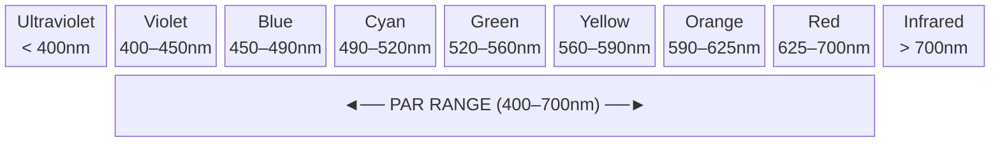
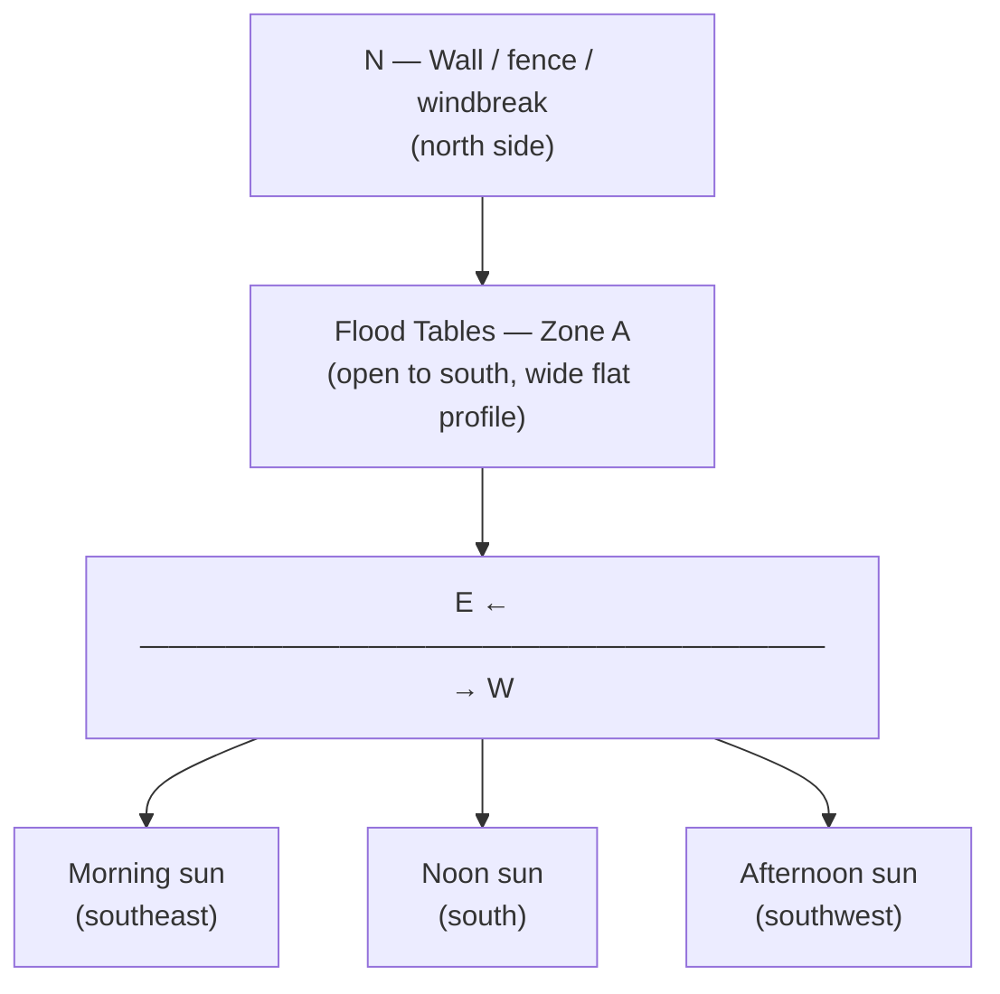
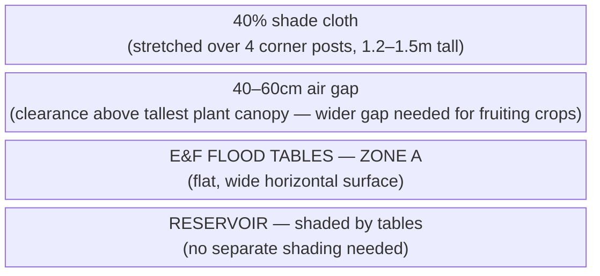

# Guide 04 — Lighting
## Outdoor Light, PAR, DLI, Shade Management, and Seasons

---

## Table of Contents

- [1. The Language of Plant Light](#1-the-language-of-plant-light)
  - [PAR — Photosynthetically Active Radiation](#par-photosynthetically-active-radiation)
  - [PPFD — Photosynthetic Photon Flux Density](#ppfd-photosynthetic-photon-flux-density)
  - [DLI — Daily Light Integral](#dli-daily-light-integral)
- [2. DLI Targets by Crop](#2-dli-targets-by-crop)
  - [Seasonal DLI in a Temperate Climate](#seasonal-dli-in-a-temperate-climate)
- [3. Minimum Sun Hours Per Crop](#3-minimum-sun-hours-per-crop)
- [4. Siting the System: Sun Mapping](#4-siting-the-system-sun-mapping)
  - [Southern Exposure (Northern Hemisphere)](#southern-exposure-northern-hemisphere)
  - [Obstruction Mapping](#obstruction-mapping)
  - [Flood Table Geometry and Light Distribution](#flood-table-geometry-and-light-distribution)
- [5. Shade Cloth: Percentages, Timing, and Deployment](#5-shade-cloth-percentages-timing-and-deployment)
  - [Why Shade Cloth?](#why-shade-cloth)
  - [Shade Cloth Percentages](#shade-cloth-percentages)
  - [Deployment Method for Flood Tables](#deployment-method-for-flood-tables)
  - [When to Deploy and Remove](#when-to-deploy-and-remove)
- [6. Heat Stress vs Light Stress: Distinguishing the Two](#6-heat-stress-vs-light-stress-distinguishing-the-two)
- [7. Photoperiod Sensitivity](#7-photoperiod-sensitivity)
  - [Crop Categories](#crop-categories)
  - [Implications for Your System](#implications-for-your-system)
- [8. Seasonal Light Strategy](#8-seasonal-light-strategy)
  - [Spring (March–May) — Establishment Phase](#spring-marchmay-establishment-phase)
  - [Summer (June–August) — Peak Production, Heat Management](#summer-juneaugust-peak-production-heat-management)
  - [Autumn (September–October) — Second Season](#autumn-septemberoctober-second-season)
  - [Winter (November–February) — Shutdown / Planning](#winter-novemberfebruary-shutdown-planning)
- [9. Supplemental Lighting for Season Extension](#9-supplemental-lighting-for-season-extension)
  - [When It Makes Sense](#when-it-makes-sense)
  - [Options](#options)
  - [Target PPFD for Supplemental Lighting](#target-ppfd-for-supplemental-lighting)
  - [Wattage and Sizing for Flood Tables](#wattage-and-sizing-for-flood-tables)
  - [Photoperiod Recommendations](#photoperiod-recommendations)
  - [Cost-Benefit Summary](#cost-benefit-summary)
- [10. Microgreens Lighting (Zone B)](#10-microgreens-lighting-zone-b)


[↑ Back to TOC](#table-of-contents)

## 1. The Language of Plant Light

Before managing light for your plants, you need to understand the three key metrics used to describe it. These are not interchangeable — they measure very different things.

### PAR — Photosynthetically Active Radiation

PAR defines the **spectrum of light** that plants use for photosynthesis: wavelengths between **400nm (violet) and 700nm (red)**. This is not a measurement of intensity — it defines the type of light that matters.



| Wavelength range | Colour band | Notes |
|---|---|---|
| Below 400nm | Ultraviolet | Minor photosynthetic role; can stress plants |
| 400–700nm | **PAR range** | Photosynthetically active radiation |
| Above 700nm | Infrared | Mostly heat; minor photomorphogenetic effects |
| 440–470nm | Blue | Vegetative growth, compact internodes, stomatal opening |
| 640–680nm | Red | Flowering, fruiting, overall photosynthesis efficiency |
| 430nm + 680nm | — | Chlorophyll **a** absorption peaks |
| 453nm + 642nm | — | Chlorophyll **b** absorption peaks |

### PPFD — Photosynthetic Photon Flux Density

PPFD measures the **intensity of PAR light** hitting a surface at a given moment. It tells you how much photosynthetically useful light is arriving per second.

- **Units:** μmol/m²/s (micromoles of photons per square metre per second)
- **What it measures:** Instantaneous light intensity at a specific point

```
  PPFD REFERENCE VALUES:

  Outdoors, full sun (noon, summer): ~1,500–2,000 μmol/m²/s
  Outdoors, bright overcast:          ~200–600 μmol/m²/s
  Outdoors, shade/cloudy:             ~50–200 μmol/m²/s
  Indoors, window ledge:              ~100–500 μmol/m²/s (highly variable)

  Plant PPFD thresholds:
  Light compensation point (min useful): ~10–50 μmol/m²/s
  Light saturation point (max useful):
    Lettuce/herbs:          ~400–600 μmol/m²/s
    Tomatoes/peppers:       ~800–1,200 μmol/m²/s
    Cucumbers/courgettes:   ~700–1,000 μmol/m²/s
    Strawberries:           ~600–1,000 μmol/m²/s
```

> **Key insight:** On a clear summer day, outdoor PPFD at noon (1,500–2,000) **far exceeds the light saturation point** of most plants. The excess beyond what plants can use is converted to heat — this is why shade cloth helps in summer.

### DLI — Daily Light Integral

DLI is the **total quantity of PAR light delivered over an entire day**. It integrates PPFD over time — how many photons the plant receives across a full day. This is the most practically useful metric for crop planning.

- **Units:** mol/m²/day (moles of photons per square metre per day)
- **Why it matters:** You can have high PPFD but few hours of daylight (low DLI), or moderate PPFD across many hours (adequate DLI)

```
  DLI FORMULA:

  DLI = Average PPFD (μmol/m²/s) × Hours of light × 0.0036

  Example:
  Average outdoor PPFD: 400 μmol/m²/s (partly cloudy day)
  Hours of useful daylight: 10 hours

  DLI = 400 × 10 × 0.0036 = 14.4 mol/m²/day → adequate for lettuce
```

---


[↑ Back to TOC](#table-of-contents)

## 2. DLI Targets by Crop

These are the daily light requirements your plants need for optimal growth. The E&F system supports a broader crop range than NFT, including cucumbers, courgettes, and aubergines, which have higher DLI needs.

| Crop | Minimum DLI | Optimal DLI | Max Usable DLI |
|------|-------------|-------------|----------------|
| Lettuce (all types) | 8 mol/m²/day | 12–17 | 20 |
| Spinach | 8 | 12–16 | 20 |
| Basil | 12 | 15–20 | 25 |
| Cilantro/coriander | 8 | 12–16 | 18 |
| Mint | 8 | 12–16 | 20 |
| Parsley | 8 | 12–16 | 18 |
| Kale | 10 | 15–20 | 25 |
| Cherry tomatoes | 20 | 25–35 | 40 |
| Peppers (sweet/chilli) | 20 | 25–35 | 40 |
| Cucumbers | 20 | 25–35 | 40 |
| Courgettes/Zucchini | 18 | 22–32 | 38 |
| Aubergine/Eggplant | 18 | 22–30 | 38 |
| Strawberries | 15 | 20–30 | 35 |
| Radishes (bags) | 10 | 15–20 | 25 |
| Carrots (bags) | 10 | 15–20 | 25 |
| Microgreens | 10 | 12–20 | — |

### Seasonal DLI in a Temperate Climate

```
  APPROXIMATE DAILY LIGHT INTEGRAL BY MONTH (Temperate, 50–55°N latitude):

  Month       Avg hours daylight   Clear sky DLI   Typical overcast DLI
  ─────────────────────────────────────────────────────────────────────
  January          8.5h              12–15           4–6
  February         9.5h              15–18           5–8
  March           11.5h              20–25           8–12
  April           13.5h              28–35           12–18
  May             15.0h              35–45           15–22
  June            16.5h              40–50           18–25
  July            15.5h              38–48           16–24
  August          14.0h              32–42           14–20
  September       12.0h              22–28           10–15
  October         10.0h              14–18           6–10
  November         8.5h              8–12            3–6
  December         7.5h              6–10            2–5

  KEY CONCLUSIONS:
  - Lettuce and herbs: adequate light April–September
  - Tomatoes/peppers/cucumbers: adequate light May–August (peak season)
  - Courgettes/aubergines: best May–August; marginal in April and September
  - Strawberries: adequate light April–September
  - Winter growing outdoors: not viable without supplemental lighting
```

> **Latitude matters:** The table above is calibrated for **50–55°N latitude** (UK, northern Europe, southern Canada). If you are at a **lower latitude** (30–45°N — southern US, Mediterranean, Japan), expect higher DLI year-round and a longer viable outdoor season. If you are at a **higher latitude** (55–65°N — Scandinavia, northern Canada), expect more extreme seasonal swings. Adjust your planting calendar and supplemental lighting plans accordingly.

---


[↑ Back to TOC](#table-of-contents)

## 3. Minimum Sun Hours Per Crop

While DLI is more accurate, a simple sun hours estimate works for practical planning:

| Crop | Minimum Daily Sun Hours |
|------|------------------------|
| Lettuce, spinach | 4–6 hours direct sun (or more dappled light) |
| Herbs (basil, cilantro, parsley) | 6–8 hours |
| Mint | 4–6 hours (tolerates some shade) |
| Kale | 6–8 hours |
| Tomatoes | 8+ hours full sun — critical |
| Peppers | 8+ hours full sun — critical |
| Cucumbers | 8+ hours full sun — critical |
| Courgettes/Zucchini | 8+ hours full sun — very productive with maximum light |
| Aubergine/Eggplant | 8+ hours full sun — needs heat and light to fruit well |
| Strawberries | 6–8 hours |
| Radishes/carrots | 6–8 hours |

> **Site selection rule:** Choose a location with **unobstructed southern sky** (Northern Hemisphere) for at least 8 hours. Avoid sites shaded by buildings, walls, or large trees during peak growing hours (10am–4pm). For courgettes and cucumbers grown in E&F flood tables, maximum sun exposure translates directly to yield — these are high-light, high-energy crops.

---


[↑ Back to TOC](#table-of-contents)

## 4. Siting the System: Sun Mapping

### Southern Exposure (Northern Hemisphere)

The sun moves from east to west across the southern sky. Your system should face south, with no obstructions on the south, southeast, or southwest aspect during 10am–4pm.



### Obstruction Mapping

Walk your site at:
- **9am** (spring equinox): Note what is in shadow
- **12pm**: Note what is in shadow
- **3pm**: Note what is in shadow

If your site is in shadow at 12pm due to a building or tall fence, you either need to move the system or accept reduced yields.

**Height rule of thumb:** A wall or fence at a distance D from your system will cast a shadow with a length of approximately **D × (1/tan(sun altitude angle))**. At summer noon in the UK (~55°N), sun altitude is ~55°; shadow length = D × 0.7. At winter noon, it is ~10°; shadow length = D × 5.7.

### Flood Table Geometry and Light Distribution

The Ebb & Flow flood tables in this system (1.2m × 0.6m, flat horizontal surface) have distinct light characteristics compared to NFT channels:

```
  E&F FLOOD TABLE LIGHT PROFILE vs NFT CHANNELS:

  NFT CHANNELS (slightly sloped, narrow profile):
  ─ Plants grow in a line along the channel
  ─ Each plant is spaced 20–25cm apart
  ─ Low-angle morning/evening sun hits plants from the side easily
  ─ Channel slope means plants at the elevated end are slightly higher

  E&F FLOOD TABLES (flat, wide horizontal surface):
  ─ Plants are distributed across a 1.2m × 0.6m area
  ─ ALL plants sit at the same height — perfectly even light distribution
  ─ Low sun angles hit the outer rows more than the centre
  ─ Wide table = taller crops in the centre can shade shorter neighbours

  ADVANTAGE — Reservoir shading:
  ─ The reservoir sits UNDER the flood tables
  ─ Tables naturally shade the reservoir — reducing algae growth and heat gain
  ─ No additional reservoir shading needed (unlike NFT where reservoir is exposed)

  ADVANTAGE — Water surface reflectance during flood:
  ─ When tables are flooded, the water surface briefly reflects light
  ─ This reflected light illuminates the undersides of lower leaves
  ─ Effect is small (5–10 min flood cycle) but contributes to overall DLI
  ─ Most noticeable in low-canopy crops (lettuce, herbs)
```

**Spacing to prevent mutual shading in flood tables:**

On wide flat tables, tall plants can shade smaller neighbours in a way that does not occur in single-file NFT channels.

| Crop combination on same table | Shading risk | Recommendation |
|-------------------------------|--------------|----------------|
| Lettuce + lettuce | None | Pack tightly — 20cm spacing fine |
| Lettuce + basil | Low | Basil grows taller — place at north end of table |
| Tomatoes + peppers | Medium | Place tallest (tomatoes) on north side |
| Cucumbers + courgettes | High | Do not mix on the same table — both are vigorous |
| Fruiting crops + leafy greens | High | Separate onto different tables — Table 1 vs Table 2 |

> **Practical rule:** Orient tall crops (tomatoes, cucumbers) to the north end of the flood table so they do not shade the shorter crops growing to the south. Better still, dedicate Table 2 entirely to fruiting crops and keep Table 1 for leafy greens and herbs.

---


[↑ Back to TOC](#table-of-contents)

## 5. Shade Cloth: Percentages, Timing, and Deployment

### Why Shade Cloth?

On a sunny July day, PPFD at noon can reach 1,800–2,000 μmol/m²/s. The light saturation point of lettuce is ~400–600 μmol/m²/s. The excess 1,200–1,400 μmol/m²/s is absorbed as heat — raising leaf temperature, accelerating transpiration (water loss), stressing plants, and triggering bolting (premature flowering) in leafy crops.

Shade cloth reduces PPFD to a level that maximises photosynthesis without heat stress. In E&F flood tables, heat stress is compounded by the fact that the clay pebble media surface has a large exposed area — LECA heats up quickly in direct summer sun, warming the root zone from above.

### Shade Cloth Percentages

| Shade Level | PPFD Reduction | Recommended Use |
|-------------|---------------|-----------------|
| 30% | Reduces PPFD by ~30% | Light shade, spring/autumn, mild summers |
| 40% | Reduces PPFD by ~40% | Standard summer use — good all-around choice |
| 50% | Reduces PPFD by ~50% | Hot climates, afternoon shade for greens |
| 70% | Reduces PPFD by ~70% | Seedlings, sensitive plants — too dark for most crops |
| 90% | Reduces PPFD by ~90% | Mushrooms, propagation — not for growing food crops |

**Recommendation for this system:** **40% shade cloth** deployed over Zone A flood tables during peak summer (June–August). Remove on overcast days or when average temperatures are below 22°C.

### Deployment Method for Flood Tables

Flood tables present a different shade cloth challenge than NFT channels. The tables are wider (0.6m) and sit lower to the ground, making a simple overhead frame the most practical solution.



**Installation for flood tables:**

1. Install 4 corner posts at the corners of the Zone A footprint — 1.2–1.5m above the table surface (extra height needed for tall fruiting crops like tomatoes and cucumbers)
2. For tomatoes and cucumbers, a trellis or support structure is often already in place — attach shade cloth to the outer face of the trellis frame
3. Stretch 40% shade cloth over the top, securing with clips, bungee cords, or wire
4. Leave the south-facing vertical face open (or covered with mesh only) to allow low-angle morning and evening light to reach plants — critical in spring and autumn
5. On tables with fruiting crops at different heights, consider a horizontal shade panel above the canopy rather than a tent-style enclosure — this avoids blocking side-light to lower plants

**Anchoring on open flood tables:**

Unlike NFT channels (which are structural tubes), flood tables have a flat open surface. Shade cloth must be anchored externally — do not use the table edges for tension:
- Use ground stakes on the table perimeter
- Attach to a pergola, fence, or wall where available
- A simple PVC conduit frame (25mm diameter conduit in ground anchors) is low-cost and effective

### When to Deploy and Remove

```
  DEPLOY shade cloth when:
  - Daily high temperature exceeds 28°C consistently
  - Plants show heat stress signs (wilting at midday despite adequate water)
  - Lettuce/herbs are bolting (going to seed prematurely)
  - Leaf tip burn is increasing
  - LECA surface is visibly hot to the touch at noon

  REMOVE shade cloth when:
  - Consecutive overcast days (DLI will drop below minimum without full sun)
  - September onwards — every bit of light matters as days shorten
  - Night temperatures drop below 15°C consistently
  - Fruiting crops are in final ripening phase — maximum light improves fruit quality and sugar content
```

---


[↑ Back to TOC](#table-of-contents)

## 6. Heat Stress vs Light Stress: Distinguishing the Two

These can look similar but have different causes and solutions:

| Symptom | Heat Stress | Light Stress (excess) |
|---------|------------|----------------------|
| **Midday wilting** | Yes (despite wet roots after flood) | Possible |
| **Leaf curl/cupping upward** | Yes | Yes |
| **Tip burn / brown edges** | Yes (Ca mobility issue + heat) | Less common |
| **Bolting (early seed stalk)** | Yes | Yes (long days trigger bolting) |
| **Recovery in evening** | Plants perk up when it cools | Plants perk up when light reduces |
| **Bleached/whitish patches on leaves** | Rare | Yes (sunscald) |
| **Root temperature** | Often high (warm LECA media) | Normal root temp |
| **LECA surface dry between floods** | Yes — large surface area heats fast | No |

**Test:** Check your reservoir water temperature. If it's above 24°C, heat is the primary stressor. In E&F, also check the temperature of the LECA surface at noon — if the media surface is hot to the touch, root zone temperature will be elevated even if the flood solution is cool.

> **E&F-specific advantage:** The reservoir sits under the flood tables in this system, which naturally shades it from direct sun and helps maintain lower solution temperatures compared to exposed reservoirs. If your reservoir temperature is still climbing above 22°C, wrap it with insulation foam or a reflective cover.

---


[↑ Back to TOC](#table-of-contents)

## 7. Photoperiod Sensitivity

Many plants respond to the **length of the dark period** (night length) rather than day length — this is called **photoperiodism**.

### Crop Categories

| Category | What Triggers It | Crops |
|----------|-----------------|-------|
| **Short-day plants** | Flower when nights are LONG (late summer/autumn) | Strawberries (June-bearing), some basil varieties |
| **Long-day plants** | Flower when nights are SHORT (summer) | Spinach, lettuce, cilantro, dill |
| **Day-neutral plants** | Flower regardless of day length | Cherry tomatoes, most peppers, mint, kale, cucumbers, courgettes, aubergine |

### Implications for Your System

**Lettuce, spinach, cilantro (long-day plants):**
- In midsummer (June–July), the long days actively trigger bolting in these crops
- Shade cloth helps slightly by reducing perceived light intensity, but does not shorten the photoperiod
- **Solution:** Plant in early spring and autumn — avoid trying to grow them through July
- Heat-tolerant/slow-bolt varieties exist — worth seeking out for the summer slot

**Strawberries:**
- **Everbearing/day-neutral varieties** (Albion, Seascape, Evie) — produce fruit regardless of day length — **best for E&F flood tables**
- **June-bearing varieties** — produce one crop in June/July triggered by short-day conditions of the previous autumn — not ideal for continuous production
- In E&F, strawberries are grown in net pots in LECA on the flood table — runners can be removed promptly to maintain productivity

**Cucumbers, courgettes, aubergine (day-neutral):**
- These crops are not photoperiod-sensitive — they flower and fruit based on temperature and plant maturity
- All three are vigorous growers; their primary limitation in a temperate climate is temperature, not photoperiod
- Cucumbers and courgettes can be very productive from May–September — they will continue until frost

**Tomatoes and peppers:** Day-neutral — flower and fruit based on plant maturity and temperature, not photoperiod. No photoperiod concerns.

---


[↑ Back to TOC](#table-of-contents)

## 8. Seasonal Light Strategy

### Spring (March–May) — Establishment Phase

```
  Light: Increasing, usually adequate from April
  Action:
  - Germinate seeds indoors in late February–March if nights are still cold
  - Transplant to flood tables from mid-April (after last frost risk)
  - No shade cloth needed
  - Monitor for late frosts — protect LECA surface with fleece overnight
  - Best time to plant: lettuce, spinach, herbs
  - Start fruiting crop seedlings (tomatoes, peppers, cucumbers) indoors in March
    for transplant to Table 2 in May
  - E&F advantage: media volume in flood tables buffers cold nights better
    than NFT (LECA holds warmth longer than bare roots in a channel)
```

### Summer (June–August) — Peak Production, Heat Management

```
  Light: Abundant — often excessive for sensitive crops
  Action:
  - Deploy 40% shade cloth over flood tables from mid-June
  - Monitor for bolting in leafy greens on Table 1 — harvest promptly
  - Table 2 (fruiting crops): remove shade cloth on non-peak heat days
    — tomatoes, cucumbers, and courgettes want maximum light
  - Succession-plant lettuce on Table 1 every 2–3 weeks
  - Monitor LECA surface temperature — if hot, increase flood frequency
    (more floods cool the media and replenish moisture)
  - Keep reservoir under the tables — it stays naturally shaded
  - Cucumbers and courgettes: peak growth — these are extremely productive
    in good light; harvest every 2–3 days to maintain plant energy
  - Strawberries: peak fruiting — keep well watered, high EC for fruit quality
  - Check flood drain fittings weekly — algae can partially block overflow
    in warm weather
```

### Autumn (September–October) — Second Season

```
  Light: Declining but often excellent quality (lower sun angle, less heat)
  Action:
  - Remove shade cloth completely from September
  - Plant second crop of lettuce, spinach, herbs on Table 1 (autumn is ideal)
  - Harvest final tomatoes/cucumbers/courgettes before first frost
    (courgettes and cucumbers are frost-sensitive — harvest all before night
    temps drop below 5°C)
  - Peppers: can often be brought indoors in pots for overwintering
  - Strawberries: allow to set runners in autumn for next year's plants
  - Watch night temperatures below 10°C — deploy frost fleece over tables
  - Continue microgreens rotation through October with cold-tolerant varieties
```

### Winter (November–February) — Shutdown / Planning

```
  Light: Insufficient for most crops outdoors
  Action:
  - Harvest final crops before hard frost
  - Drain reservoir completely — clean reservoir and pump
  - Remove and clean all LECA media (sterilisation protocol — see Guide 05)
  - Flush flood table fittings and drain lines
  - Store timer, pump, and small components indoors
  - Plan next season's crop rotation (Table 1 vs Table 2 allocation)
  - Order seeds, replacement media, nutrients for next season
  - Consider: a cold frame over Table 1 can extend lettuce production
    to November/December with no supplemental lighting
```

---


[↑ Back to TOC](#table-of-contents)

## 9. Supplemental Lighting for Season Extension

If you want to extend your growing season beyond September outdoors, supplemental lighting is an option — primarily for leafy greens and herbs.

### When It Makes Sense

- You want to grow lettuce/herbs into November/December
- DLI has dropped below minimum for your target crop
- You have access to a sheltered spot (porch, lean-to, polytunnel, cold frame over the table)

### Options

| Option | Power | Coverage | Cost | Best For |
|--------|-------|----------|------|---------|
| LED grow strips | 10–30W | Small shelves | $20–$60 | Microgreens, small herb shelf |
| T5 fluorescent | 24–54W | 1 flood table zone | $30–$80 | Lettuce on Table 1 under cover |
| LED quantum board | 100–200W | Full flood table | $80–$200 | Serious season extension |
| CMH (ceramic metal halide) | 315W+ | Large area | $150–$300 | Semi-commercial extension |

### Target PPFD for Supplemental Lighting

- Lettuce/herbs: 200–400 μmol/m²/s at canopy level
- Fruiting crops (tomatoes/peppers): 400–600 μmol/m²/s at canopy level — **not recommended** (uneconomical)
- 16–18 hours of light per day total (natural + supplemental combined)

### Wattage and Sizing for Flood Tables

Flood tables have a much larger canopy area than NFT channels — sizing supplemental lighting accordingly is important.

```
  SIZING SUPPLEMENTAL LIGHT FOR AN E&F FLOOD TABLE (1.2m × 0.6m):

  Table surface area: 1.2 × 0.6 = 0.72 m²
  Effective canopy area (plants spread out across table): ~0.72 m²

  TARGET: 200–400 μmol/m²/s (PPFD) for lettuce/herbs

  LED quantum board (typical efficacy: 2.5 μmol/J):
    To deliver 300 μmol/m²/s over 0.72 m²:
    Power needed = (300 × 0.72) / 2.5 ≈ 86 W
    → A single 100 W LED quantum board covers one flood table comfortably.
    → Two flood tables side-by-side: one 200 W board, or two 100 W boards.

  T5 fluorescent (typical efficacy: 1.5 μmol/J):
    Same target: (300 × 0.72) / 1.5 ≈ 144 W
    → A 4-tube T5 fixture (4 × 54 W = 216 W) covers one table with margin.

  HANGING HEIGHTS (measured from canopy top):
  ─────────────────────────────────────────────────────────────────
  Light type         Recommended height    Notes
  LED quantum board  35–50 cm              Wider beam angle covers wide table better
  T5 fluorescent     15–25 cm              Low heat — can hang close
  LED grow strips    10–15 cm              Good for microgreens shelves only
  CMH 315 W          70–100 cm             High heat — needs ventilation clearance

  NOTE: E&F flood tables are WIDER than NFT channels (0.6m vs ~0.1m).
  Choose lights with a wide beam angle or use multiple units to avoid
  bright centre / dark edge uneven distribution on wide tables.
```

### Photoperiod Recommendations

```
  COMBINING NATURAL + SUPPLEMENTAL LIGHT:

  Lettuce/herbs need 14–18 hours total light, target DLI ≥ 15 mol/m²/day.

  EXAMPLE — NOVEMBER (50–55°N):
    Natural daylight: ~8.5 hours, overcast DLI: 3–6 mol/m²/day
    Shortfall: need ~10–12 mol/m²/day from supplemental light

    A 100 W LED quantum board at 300 μmol/m²/s over 0.72 m²:
    DLI contribution = 300 × 3600 × hours / 1,000,000
    At 10 hours supplemental: 300 × 36,000 / 1,000,000 = 10.8 mol/m²/day ✓

    Schedule: lights on at 06:00, off at 22:00 (16 hours total).
    If natural light enters during the day, reduce artificial hours accordingly.
    Use a timer — never rely on manually switching lights.

  FRUITING CROPS (tomatoes, peppers, cucumbers):
    Not recommended for supplemental growing — the wattage and heat required
    make it uneconomical for a budget system. Focus supplemental lighting on
    lettuce, herbs, and microgreens only.
```

### Cost-Benefit Summary

```
  IS SUPPLEMENTAL LIGHTING WORTH IT?

  FOR LETTUCE/HERBS (YES — if you have a sheltered spot):
    One 100 W LED board: ~$80–$120
    Electricity: 100 W × 10 h/day × 90 days (Oct–Dec) = 90 kWh ≈ $15–$25
    Extends harvest by 2–3 months → ~5–8 kg extra lettuce/herbs
    Retail value of extended harvest: $50–$100
    → Pays for itself in Season 1 if you value fresh winter greens.

  FOR MICROGREENS (YES — excellent ROI):
    LED grow strips: $20–$60
    Electricity: negligible (10–30 W)
    Enables year-round microgreens production indoors.
    → Pays for itself in 2–4 weeks of production.

  FOR FRUITING CROPS (NO — not cost-effective):
    Would need 200+ W per table, plus heating.
    Electricity cost exceeds the value of the produce.
    → Grow fruiting crops in their natural season (May–September) only.
```

> **Budget consideration:** For a $100–$500 budget system, supplemental lighting is an optional upgrade. Focus on getting the outdoor system working perfectly first. The flood tables are well-suited to a cold frame or low tunnel covering in autumn — this extends the season without the cost of artificial lighting.

---


[↑ Back to TOC](#table-of-contents)

## 10. Microgreens Lighting (Zone B)

Microgreens have different light needs from mature crops. Zone B consists of 6 trays on a 2-tier shelf — light access depends on shelf positioning relative to the flood tables.

```
  MICROGREENS LIGHT PHASES:

  Phase 1 — Blackout (days 1–4):
  Cover trays completely — no light.
  Darkness + humidity drives germination and initial stem elongation.
  Etiolated seedlings (long, pale) are normal at this stage.

  Phase 2 — Green-up (days 4–7):
  Uncover and place in bright light.
  Chlorophyll develops, cotyledons expand and green up.
  Outdoor: Place in partial shade first, then full light.
  Target DLI: 10–15 mol/m²/day

  Phase 3 — Growth to harvest (days 7–14):
  Full outdoor light (40% shade in summer to prevent heat stress on tender seedlings)
  Harvest when first true leaves appear.
  Target DLI: 12–20 mol/m²/day
```

**Positioning Zone B relative to flood tables:**

The 2-tier shelf for microgreens should be positioned where it receives direct light without being shaded by the flood tables or taller crops growing on them. In summer, the lower tier of the shelf may receive less light than the upper tier — rotate trays between tiers every 2–3 days to equalise exposure.

```
  ZONE B SHELF LIGHT CONSIDERATIONS:

  - Avoid placing the shelf directly to the north of the flood tables
    (tall crops on Table 2 will shade the lower shelf)
  - East or west placement relative to the flood tables is preferable
  - In autumn/winter, the shelf can be moved under artificial lights or
    onto a windowsill for season extension — microgreens work well indoors
  - In summer, move the upper tier to a slightly shaded position to prevent
    heat stress on tender seedlings — a 30% shade cloth or dappled light
    under a tree works well for Zone B in summer
```

| Shelf tier | Summer recommendation | Spring/Autumn recommendation |
|------------|----------------------|------------------------------|
| Upper tier | Light partial shade (30% shade) | Full light — no shade |
| Lower tier | Dappled shade or natural building shadow | Full light where possible |

---


[↑ Back to TOC](#table-of-contents)

*Next: [`guide/ebb-and-flow/05-growing-media.md`](05-growing-media.md) — Clay pebbles, coco coir, rockwool, perlite, and germination*
