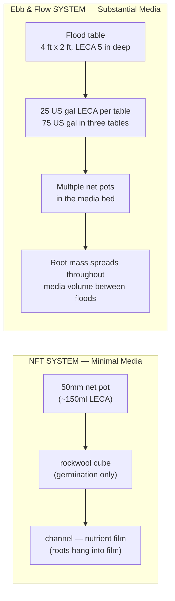
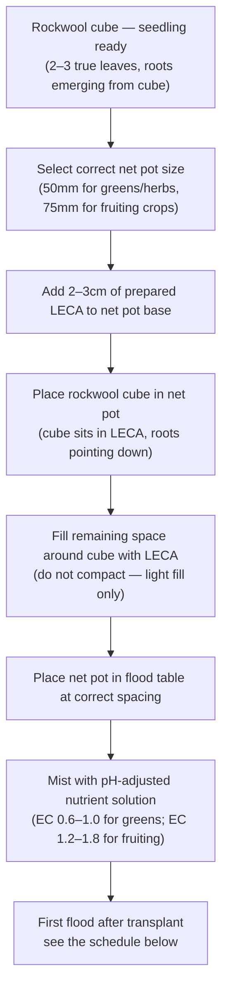

# Guide 05 — Growing Media
## Clay Pebbles, Coco Coir, Rockwool, Perlite, and Germination

[](../../README.md)
[](https://creativecommons.org/licenses/by-nc-sa/4.0/)


---

## Table of Contents

- [1. Why Ebb & Flow Needs Substantial Media](#1-why-ebb-flow-needs-substantial-media)
- [2. Clay Pebbles (LECA) — The Primary E&F Media](#2-clay-pebbles-leca-the-primary-ef-media)
  - [What LECA Is](#what-leca-is)
  - [Why LECA Is Ideal for Ebb & Flow](#why-leca-is-ideal-for-ebb-flow)
  - [Properties at a Glance](#properties-at-a-glance)
- [3. Clay Pebble Preparation — Critical Step](#3-clay-pebble-preparation-critical-step)
  - [The Rinse and Pre-Soak Protocol](#the-rinse-and-pre-soak-protocol)
  - [What Happens If You Skip This](#what-happens-if-you-skip-this)
- [4. Media Depth in Flood Tables](#4-media-depth-in-flood-tables)
  - [Standard Depths by Crop](#standard-depths-by-crop)
  - [How Depth Affects Flood Frequency](#how-depth-affects-flood-frequency)
- [5. Coco Coir Use in Ebb & Flow](#5-coco-coir-use-in-ebb-flow)
  - [Where Coco Coir Works in E&F](#where-coco-coir-works-in-ef)
  - [Where Coco Coir Does NOT Work in E&F](#where-coco-coir-does-not-work-in-ef)
  - [Flood Frequency Adjustment with Coco](#flood-frequency-adjustment-with-coco)
- [6. Rockwool Cubes for Germination and Seedlings](#6-rockwool-cubes-for-germination-and-seedlings)
  - [Rockwool Properties](#rockwool-properties)
  - [pH Conditioning — Mandatory](#ph-conditioning-mandatory)
  - [Germination Protocol](#germination-protocol)
- [7. Perlite — Limited Use in E&F Flood Tables](#7-perlite-limited-use-in-ef-flood-tables)
- [8. Vermiculite — Zone C Grow Bags Only](#8-vermiculite-zone-c-grow-bags-only)
- [9. What NOT to Use in Flood Tables](#9-what-not-to-use-in-flood-tables)
- [10. Germination Methods: Side-by-Side Comparison](#10-germination-methods-side-by-side-comparison)
  - [Paper Towel Method](#paper-towel-method)
  - [Rockwool Starter Cubes](#rockwool-starter-cubes)
  - [Rapid Rooter Plugs](#rapid-rooter-plugs)
  - [Direct Germination in LECA Net Pots](#direct-germination-in-leca-net-pots)
- [11. Transitioning Seedlings into Flood Tables](#11-transitioning-seedlings-into-flood-tables)
  - [From Rockwool Cube to LECA Net Pot](#from-rockwool-cube-to-leca-net-pot)
  - [First Flood After Transplant](#first-flood-after-transplant)
  - [Depth Requirements by Crop](#depth-requirements-by-crop)
- [12. Media Reuse and Sterilisation](#12-media-reuse-and-sterilisation)
  - [Salt Accumulation in E&F vs NFT](#salt-accumulation-in-ef-vs-nft)
  - [Full Sterilisation Protocol](#full-sterilisation-protocol)
  - [Assessment Before Reuse](#assessment-before-reuse)
- [13. Quick Reference: Media Selection Guide](#13-quick-reference-media-selection-guide)

---


## 1. Why Ebb & Flow Needs Substantial Media

One of the most important differences between Ebb & Flow and NFT is **media volume**. NFT is specifically designed to use minimal media — plants are supported by small net pots with just enough clay pebbles to anchor a seedling, and once roots reach the nutrient film, the media is essentially structural only.

Ebb & Flow is different. In a flood table, the media is not incidental to the system — it **is** the system's root zone.



**Why media volume matters in E&F:**

| Function | NFT (minimal media) | E&F (substantial media) |
|----------|--------------------|-----------------------|
| **Root support** | Net pot only — needs external support for tall plants | Media anchors full root ball — cucumbers, tomatoes stable |
| **Moisture buffer** | None — roots dry in 15 min if pump fails | 8–24 hours of moisture reserve in media |
| **Structural support** | Poor — heavy crops need canes/strings | Good — LECA holds root ball firmly in place |
| **Temperature buffer** | Roots at ambient temperature | Media mass moderates rapid temperature swings |
| **Media volume per table** | About 1 US cup (150 ml) of LECA in a net pot | 25 US gal (95 L) of LECA, 5 in (13 cm) deep, on each 4 ft × 2 ft table |

**Practical media volume for this system:**

```
  ZONE A — FLOOD TABLES:

  Each table: 4 ft × 2 ft (1.22 m × 0.61 m), perfectly level
  One depth on every table: 5 in (13 cm)

  Bulk LECA per table:     25 US gal (95 L)
  Three tables:            75 US gal (284 L)
  Buy:                     90 US gal (340 L), to cover rinse loss

  The bag rating is bulk volume, pore space included.
  There is no separate "leafy depth" and "fruiting depth" in this build.
  Table 1 (one tomato or one cucumber), Table 2 (1–2 pepper, aubergine,
  or courgette), and Table 3 (leafy, or a later fruiting crop) all use
  the same 5 in bed.

  Hardware cost, including media, is in Guide 12.
```

> **The media is a long-term investment.** Clay pebbles last many years with proper sterilisation. The purchase is 90 US gal (340 L) up front, then the same LECA comes back each season.

[↑ Back to TOC](#table-of-contents)

---


## 2. Clay Pebbles (LECA) — The Primary E&F Media

### What LECA Is

LECA stands for **Lightweight Expanded Clay Aggregate**. It is kiln-fired clay that has been expanded into lightweight, porous balls at temperatures above 1,200°C. The firing process creates a honeycomb internal structure and a hard outer shell. This combination gives LECA its defining property: it holds moisture internally while maintaining large air gaps between pebbles.

### Why LECA Is Ideal for Ebb & Flow

LECA's behaviour during the flood-and-drain cycle is nearly perfect for E&F:

```
  LECA BEHAVIOUR DURING THE FLOOD/DRAIN CYCLE:

  FLOOD PHASE (pump on, 15–20 minutes):
  ─ Water rises through LECA column from below
  ─ LECA absorbs water rapidly — porous structure fills within minutes
  ─ Air displaced upward as water rises
  ─ Roots submerged in nutrient solution — nutrient uptake occurs

  DRAIN PHASE (pump off, first 5–10 minutes):
  ─ Free water drains rapidly through LECA pore spaces
  ─ LECA drains FAST — much faster than coco or soil
  ─ Negative pressure pulls fresh air into media from above
  ─ Root zone re-oxygenated immediately
  ─ LECA retains moisture in its internal pores — roots still supplied

  INTERVAL PHASE (between floods):
  ─ The pebble surface can look dry while the insides still hold water
  ─ Moist LECA buffers a missed flood for 8–24 hours
  ─ A dry-looking surface is not the missed-flood clock. The buffer is 8–24 hours
  ─ Roots draw on the water inside the pebbles between floods
```

The speed of LECA's drainage is its most important property for E&F. Media that drains slowly (coco, soil) creates long anaerobic periods after flooding — acceptable for passive systems but dangerous in an active E&F flood cycle where you may flood 3–4 times per day.

### Properties at a Glance

| Property | Value |
|----------|-------|
| pH (raw) | ~7.0–8.0 (alkaline surface — must be pre-treated) |
| pH (after preparation) | ~6.5–7.0 |
| Reusable | Yes — indefinite lifespan with correct sterilisation |
| Drainage speed | Excellent — free drainage within 5 minutes |
| Water retention | Moderate (internal pores hold moisture; surface dries) |
| Root aeration | Excellent — air gaps between pebbles |
| Structural support | Very good — heavy plants stable in LECA |
| Cost | About $6–$11 per US gal (R108–R198). Confirm the current price in Guide 12 |
| Typical size | 4–16mm diameter balls |
| Weight (dry) | About 2.5–4.2 lb per US gal (300–500 g/L) |
| Salt accumulation | Yes — accumulates over time; requires periodic flush |

[↑ Back to TOC](#table-of-contents)

---


## 3. Clay Pebble Preparation — Critical Step

Raw LECA from the bag has two problems that must be addressed before it goes into your flood tables:

1. **Clay dust and fine particles** — will clog your drain fittings and pump
2. **Alkaline surface residue** — will spike your reservoir pH to 7.5–8.0 on first flood

**This is not optional preparation.** Skipping it will cause immediate problems.

### The Rinse and Pre-Soak Protocol

```
  CLAY PEBBLE PREPARATION — STEP BY STEP:

  Equipment needed:
  - A tub or colander big enough to submerge the pebbles you are washing
    (this wash tub is not the table volume — each table takes 25 US gal / 95 L)
  - Hosepipe or tap with good pressure
  - pH meter
  - pH Down solution
  - Clean water

  STEP 1 — INITIAL RINSE (removes dust):
    Place pebbles in colander or bucket
    Rinse under running water, turning/agitating pebbles continuously
    Continue until water runs CLEAR (not milky or orange-brown)
    This takes 3–5 full bucket changes for new LECA
    Do NOT skip this — clay dust will clog the 1 in (25 mm) drain

  STEP 2 — FIRST SOAK (pH buffering):
    Fill the tub with water adjusted to pH 5.8 (use pH Down).
    The acceptable soak band is 5.5–6.0. This build uses 5.8 every time.
    Submerge pebbles completely — weigh down if they float
    Soak for 12 hours minimum, 24 hours preferred
    Clay pebbles float initially — this is normal; they sink as they absorb water

  STEP 3 — CHECK PH OF SOAK WATER:
    After soaking, test the pH of the soak water with your pH meter
    If pH > 7.0: drain, re-fill with fresh pH 5.8 water, soak another 12 hours
    If pH 6.0–7.0: acceptable — do one more rinse and use
    If pH < 6.0: pebbles are ready — just rinse and use

  STEP 4 — FINAL RINSE:
    Rinse pebbles one last time with clean water
    Do not rinse with pH-adjusted water at this stage — just remove surface residue

  STEP 5 — FILL TABLES:
    Fill every table to 5 in (13 cm)
    Place net pots into media
    System is ready for first flood cycle
```

### What Happens If You Skip This

```
  SCENARIO — Unprepared LECA, first flood cycle:

  Hour 0:   Fresh LECA, dry from bag, goes into flood table
  Hour 1:   First flood — pump runs for 15 minutes
            Fine clay dust from pebbles enters reservoir with drain water
            Alkaline residue from pebble surface dissolves into solution
  Hour 2:   Check reservoir pH — reads 7.8–8.2 (was set to 6.0 before)
  Hour 3:   Iron, manganese, zinc begin to precipitate at pH 7.5+
            Plants will show nutrient lockout within days (yellowing)
  Day 1–3:  Clay particles accumulate in pump filter
            Pump flow rate reduced — inadequate flood volume
  Day 3–7:  Drain fitting partially blocked by clay sediment
            Table takes longer to drain — anaerobic conditions developing
  Week 2:   Pump filter completely blocked — pump burns out
```

> **There is no shortcut here.** One hour of preparation saves days of troubleshooting.

[↑ Back to TOC](#table-of-contents)

---


## 4. Media Depth in Flood Tables

This build uses **one depth on every table: 5 in (13 cm)**. Table 1 is not the leafy table, and it is not a deeper bed than Table 3.

### Depth and Planting in This Build

```
  MEDIA DEPTH — ALL THREE TABLES:

  Depth:               5 in (13 cm)
  Bulk LECA:           25 US gal (95 L) per table
  Flood level:         about 3/4 in (2 cm) below the LECA surface
  Standpipe:           about 4 1/4 in (11 cm) above the table floor
  Overflow:            1 1/2 in (40 mm), one per table
  Drain:               1 in (25 mm), one per table

  TABLE 1 — one indeterminate tomato, or one cucumber
  Net pot:             3–4 in (75–100 mm)
  Floods:              3× per day vegetative, 4× per day fruiting
                       4× is the ceiling

  TABLE 2 — pepper, aubergine, or courgette, 1–2 plants
  Net pot:             3–4 in (75–100 mm)
  Same depth, same flood ceiling. A courgette is one of those 1–2 plants,
  not a reason to deepen the bed or add a 5th flood.

  TABLE 3 — lettuce, herbs, pak choi, or a later fruiting crop
  Net pot:             2 in (50 mm) for leafy crops; 3 in (75 mm) if you
                       later put a fruiting crop here
  Floods:              3× per day while the crop is vegetative
```

### How This Depth Fills

The pump is 250 US gph (950 L/h), about 35 W. Pore space in LECA is about 40%, so each table holds roughly 10 US gal (38 L) of water at full flood.

| Item | Value |
|------|-------|
| Bulk LECA | 25 US gal (95 L) per table |
| Water in the pore space | about 10 US gal (38 L) |
| Time to move that water at 250 US gph | about 2–3 minutes, plus wetting lag |
| Flood duration | 15–30 minutes |

> **Do not vary the depth to change the flood count.** Vegetative crops get 3 floods a day. Fruiting crops get 4. In a heatwave at 90–100°F (32–38°C), keep 4 floods, shorten them if needed, and use 40% shade. A deeper bed is a different system. This one is 5 in (13 cm).

[↑ Back to TOC](#table-of-contents)

---


## 5. Coco Coir Use in Ebb & Flow

Coco coir is the primary media for Zone C grow bags and the germination substrate for Zone B microgreens. Its role in Zone A flood tables is more limited and specific.

### Where Coco Coir Works in E&F

**1. Seedling starter cubes (germination):**
Coco coir cubes (similar to rockwool cubes but organic) work well for germinating seeds before transplanting into LECA flood tables. They are biodegradable and pH-friendly.

**2. Top-dressing layer to reduce evaporation:**
A thin layer, well under ¾ in (2 cm), spread on the LECA between net pots can slow surface evaporation in hot weather. It is not the Zone B depth, and it is not a reason to flood less often than the 3× / 4× schedule. Zone B coco is a separate thing: 1–1¼ in (2.5–3 cm) in trays, with plain pH 5.8–6.2 water.

**3. Net pot fill medium alongside LECA:**
Some growers fill the upper portion of net pots with a coco/LECA mix — the coco retains moisture higher in the pot and is beneficial for seedlings that haven't yet developed a root system reaching the media bed.

### Where Coco Coir Does NOT Work in E&F

**As a primary flood table fill media:**
Coco coir should **not** be used to fill the main flood table volume in an active E&F flood system.

```
  WHY COCO COIR FAILS AS PRIMARY E&F FLOOD TABLE MEDIA:

  Problem 1 — Slow drainage:
  ─ Coco holds 8–9× its weight in water
  ─ After flooding, coco takes 30–60 minutes to drain adequately
  ─ With 3–4 floods per day, the media never fully drains
  ─ Chronically wet root zone → Pythium risk, oxygen deficit

  Problem 2 — Drain clogging:
  ─ Fine coco fibres wash out of the media during flood cycles
  ─ Fine particles accumulate in drain fittings over time
  ─ Partially blocked drains create standing water → anaerobic conditions

  Problem 3 — Compaction over time:
  ─ Coco fibres mat together after repeated wetting/drying cycles
  ─ Compacted coco has reduced air porosity
  ─ Root penetration becomes difficult — plants become pot-bound in the mat

  EXCEPTION: A coarse coco chip (coconut shell chips, 5–10mm size) has
  better drainage properties and can be blended with LECA at up to 20%.
  Fine coco coir (standard bagged/compressed coco) should not be used.
```

### Flood Frequency Adjustment with Coco

If you are using any coco in your flood table media mix (e.g., coco chips blended with LECA), **reduce flood frequency**:

| Media composition | Flood frequency in this build |
|------------------|-------------------------------|
| 100% LECA (the design) | 3× per day vegetative, 4× per day fruiting. 4× is the ceiling |
| 80% LECA / 20% coarse coco chips | Not the design. If you experiment, stay at 3×. Do not add a 5th flood |
| 100% coco, fine or chip | Do not use it as the flood-table fill |

[↑ Back to TOC](#table-of-contents)

---


## 6. Rockwool Cubes for Germination and Seedlings

Rockwool is manufactured from volcanic basalt rock, spun into fibres at very high temperatures. Despite being designed for building insulation, it was adapted for horticulture and remains one of the most reliable germination media for hydroponic systems including E&F.

### Rockwool Properties

| Property | Value |
|----------|-------|
| pH (raw/unconditioned) | ~7.5–8.0 — must be conditioned before use |
| pH (after conditioning) | ~5.5–6.5 |
| Sterile | Yes — no pathogens, no weed seeds |
| Water retention | Excellent — holds ~80% water by volume |
| Air porosity | Good — ~20% air at saturation |
| Reusable | Limited — starter cubes typically single-use |
| Biodegradable | No — dispose of in general waste |
| Cost | Very low — ~$0.10–$0.30 per starter cube |

### pH Conditioning — Mandatory

Raw rockwool has a pH of 7.5–8.0 due to calcium and limestone in its composition. Placing unconditioned rockwool into your system will cause root-zone alkalinity and immediate nutrient lockout.

```
  ROCKWOOL CONDITIONING PROCEDURE:

  1. Mix a bucket of water adjusted to pH 5.8 (use pH Down). Same target as the LECA pre-soak.
  2. Submerge rockwool cubes fully — soak for 1–2 hours
  3. Check water pH after soaking:
     - If pH has risen above 6.2 → drain, refill with fresh pH 5.8 water,
       soak another hour
     - If pH remains below 6.0 → cubes are ready
  4. Remove cubes, gently squeeze to ~70% saturation (not dripping)
  5. Cubes are now ready for seeding

  After conditioning, aim to keep the cubes in the working window, pH 5.8–6.2. The acceptable band is 5.5–6.5.
  Check your reservoir pH on first use — a rise indicates cubes need more soaking.
```

### Germination Protocol

```
  SEED TO TRANSPLANT-READY SEEDLING:

  Day 1:
  ─ Use conditioned 25mm or 36mm rockwool cubes
  ─ Place 1–2 seeds per cube (1 for large seeds, 2 for small — thin later)
  ─ Depth: large seeds 5mm deep, small seeds 2–3mm, surface seeds = surface
  ─ Place cubes in a tray with about ⅜ in (1 cm) of pH 5.8 water (EC 0.4 mS/cm)
  ─ Cover tray with plastic wrap or humidity dome
  ─ Temperature: 68–77°F (20–25°C) for most crops (see Guide 06 for per-crop temps)

  Days 2–5:
  ─ Check daily — cubes should feel moist but not waterlogged
  ─ Germination visible (seed coat lifting) from day 2–7

  Days 5–7:
  ─ Remove humidity dome once seedlings emerge
  ─ Move to light immediately (or seedlings etiolate rapidly)

  Days 7–21 (transplant readiness):
  ─ Ready to transplant to flood table when:
     • Seedling has 2–3 true leaves
     • Roots visibly emerging from base or sides of cube
     • Plant is 4–8cm tall (crop dependent)
  ─ Do not wait too long — roots emerging from the cube base that coil
    around the tray become damaged during transplanting
```

[↑ Back to TOC](#table-of-contents)

---


## 7. Perlite — Limited Use in E&F Flood Tables

Perlite is expanded volcanic glass (amorphous silica) that has been heated to ~870°C, expanding into lightweight, highly porous granules. It has excellent drainage and aeration properties.

**Use in Zone A flood tables:** Perlite is **not recommended as a primary flood table fill medium**. Its extremely light weight means it floats during flood cycles, migrating to the overflow fitting and potentially blocking it. Partially blocking the overflow fitting is one of the more dangerous failure modes in an E&F system — it can cause the table to flood beyond the intended level.

```
  PERLITE IN FLOOD TABLES — RISKS:

  Low density (bulk density ~80–120 kg/m³) means perlite:
  ─ Floats when flood water rises
  ─ Migrates to the lowest point (overflow/drain fitting)
  ─ Can partially block the overflow standpipe
  ─ If overflow is blocked, flood level rises beyond set height
  ─ In worst case: overflow completely blocked + pump stuck on = flooded table

  SAFE USE OF PERLITE IN E&F:
  ─ Mixed into net pot upper zone (not in the open table bed)
  ─ Zone C grow bags (no overflow fittings to block)
  ─ Germination trays with drainage holes (not recirculating)
```

**Perlite in Zone C grow bags:** Perlite is excellent in the coco/perlite/vermiculite mix for Zone C root vegetable grow bags. The recommended mix is 60% coco / 30% perlite / 10% vermiculite — perlite provides drainage and prevents the coco from compacting around the developing root vegetables.

[↑ Back to TOC](#table-of-contents)

---


## 8. Vermiculite — Zone C Grow Bags Only

Vermiculite is a naturally occurring mineral that expands when heated. Unlike perlite (which drains freely), vermiculite holds moisture and creates a sponge-like microenvironment around roots.

| Property | Value |
|----------|-------|
| Water retention | High — holds moisture between watering |
| Aeration | Moderate (less than perlite) |
| Nutrient holding | Some — modest CEC |
| pH | Slightly alkaline (7.0–7.5) |
| Cost | About $6–$9 per US gal (R108–R162) |

**In E&F flood tables:** Do not use vermiculite in flood tables. Its high moisture retention creates the same problem as coco — the media never fully dries between floods, leading to chronic oxygen deficit and Pythium risk. Additionally, fine vermiculite particles wash through LECA pore spaces and clog drain fittings.

**In Zone C grow bags:** Vermiculite at 10% in the coco/perlite blend helps prevent dry pockets forming around root vegetables. The moisture retention is beneficial in a hand-irrigated grow bag context where you want the media to hold water between manual watering sessions.

[↑ Back to TOC](#table-of-contents)

---


## 9. What NOT to Use in Flood Tables

This section covers media types that are inappropriate for Zone A flood tables specifically. The overflow and drain fittings in a flood table are vulnerable to clogging — any fine-particle media that disperses when flooded is a serious risk.

| Media | Problem in flood tables | Verdict |
|-------|------------------------|---------|
| **Garden/potting soil** | Fine particles enter flood water, clog pump and drain fittings; introduces fungal pathogens and weed seeds; compacts when saturated | Never use |
| **Fine coco coir (standard)** | Fine fibres wash into drain water, block overflow fittings; retains too much moisture for flood frequency needed | Never as primary media |
| **Peat moss** | Extremely fine particles, pH 3.5–4.5, decomposes unevenly, floats initially — will block overflow fittings | Never use |
| **Sand** | Heavy, compacts when wet, creates anaerobic zones, no nutrient holding | Avoid |
| **Perlite (loose in table)** | Floats during flood — migrates to and blocks overflow fitting | Do not use loose in table |
| **Vermiculite (loose in table)** | Fine particles wash into drain lines; over-retains moisture | Do not use in flood tables |
| **Compost** | Pathogen risk, decomposes and creates organic sludge in reservoir — triggers algae bloom and Pythium | Never use |
| **Gravel (construction)** | Inconsistent pH (limestone content), no aeration, heavy | Avoid |
| **Anything that floats freely** | Will migrate to overflow fitting and block it — creates flood-level safety failure | Never use in flood tables |

> **The overflow fitting test:** Before adding any new media to your flood tables, place a handful in a bucket of water and observe what happens. If particles disperse or the material floats freely, it should not go in your flood tables.

[↑ Back to TOC](#table-of-contents)

---


## 10. Germination Methods: Side-by-Side Comparison

E&F supports a wider range of germination approaches than NFT because the media volume in the flood table can accommodate different seedling plug sizes.

| Method | Difficulty | Speed | Cost | Best For |
|--------|------------|-------|------|---------|
| **Rockwool starter cubes** | Easy (after conditioning) | Medium | Low | All E&F crops — most reliable |
| **Rapid Rooter plugs** | Very easy | Medium | Low-medium | Beginners, fruiting crops |
| **Coco coir cubes** | Easy | Medium | Low | Organic-preferred growers |
| **Direct into LECA net pot** | Moderate | Slow | Very low | Herbs, kale, mint (robust seeds) |
| **Paper towel germination** | Easy | Fast | Very low | Seed viability testing only — not a transplant method |
| **Soil seed starting** | Easy | Slow | Low | Only if root washing before transplant |

### Paper Towel Method

Useful only for testing seed viability before committing to a batch. Place seeds on damp paper towel, fold, seal in a bag, leave in a warm spot. Check after 3–5 days. Do not attempt to transplant paper-towel germinated seeds into flood tables — the tiny radicle is too fragile.

### Rockwool Starter Cubes

The most reliable method for E&F. Condition to pH 5.8, sow 1–2 seeds per cube, cover with a humidity dome, keep at 68–77°F (20–25°C). Transplant when roots emerge from the cube base and the seedling has 2–3 true leaves. Drop the whole cube into the net pot.

### Rapid Rooter Plugs

Pre-formed germination plugs made from composted organic materials. No pH conditioning needed (naturally ~5.5–6.0). Excellent for beginners and for fruiting crops (tomatoes, peppers, cucumbers) where avoiding root disturbance at transplant is important.

### Direct Germination in LECA Net Pots

For robust, fast-germinating crops (herbs, kale, mint), seeds can be germinated directly in the net pot filled with prepared LECA:

```
  DIRECT LECA GERMINATION PROCEDURE:

  1. Prepare LECA (rinse, pre-soak, pH adjust) — see Section 3
  2. Fill a 2 in (50 mm) net pot to within ¼ in (5 mm) of the rim with prepared LECA
  3. Create a small depression in the top of the media
  4. Place 2–3 seeds in the depression
  5. Cover with ¼ in (5 mm) of LECA
  6. Lightly mist with pH-adjusted water (pH 5.8–6.2, EC 0.4)
  7. Place net pots in a tray with ¼ in (5 mm) of water
  8. Cover with a humidity dome
  9. Do NOT use flood cycles until germination is visible — fine seeds
     can be displaced by flood water before a root anchor is established
  10. Once seedlings are about 1¼–1½ in (3–4 cm) tall with roots through the
      net pot mesh, start the vegetative schedule of 3 floods a day

  SUCCESS RATE: Lower than rockwool (60–70% vs 90%+ for rockwool)
  Use this method for cheap/plentiful seeds (herbs, kale) where
  some losses are acceptable.
```

[↑ Back to TOC](#table-of-contents)

---


## 11. Transitioning Seedlings into Flood Tables

### From Rockwool Cube to LECA Net Pot

This is the standard transplant method: seedlings germinated in rockwool cubes are moved into net pots in the flood table.



**Key transplanting rules:**
- Do not bury the rockwool cube below the LECA surface — the top of the cube should be visible at or just above the media surface
- Do not compact LECA around the cube — roots need to penetrate freely
- Handle the stem carefully — do not squeeze or damage at the base
- The rockwool cube stays in the pot permanently — roots will grow through it and into the LECA

### First Flood After Transplant

The timing of the first flood after transplant is important. Seedlings need time to establish before being fully submerged.

```
  POST-TRANSPLANT FLOOD SCHEDULE:

  Day 0 (transplant day):
  ─ Mist all net pots thoroughly with dilute nutrient solution
  ─ Do NOT run a full flood cycle on day of transplant
  ─ Keep media lightly moist by hand-watering to the base of net pots

  Day 1:
  ─ Run ONE flood cycle at a shorter duration (10 minutes)
  ─ Keep the water about ½–¾ in (1–2 cm) below the base of the net pots
    on this day only, so new roots are not held under water before they
    have grown out of the cube
  ─ The design flood, from day 2 on, is about ¾ in (2 cm) below the LECA surface

  Day 2–3:
  ─ Move to 3 floods per day at the normal 15–30 minute duration
  ─ Flood level now at the design setting, about ¾ in (2 cm) below the media surface
  ─ Plants should show signs of new growth — leaf expansion

  Day 4–7:
  ─ Full schedule: 3× per day for a vegetative crop, up to 4× per day once a fruiting crop is established. Four is the ceiling
  ─ Plant is now fully established in the flood table
```

### Depth Requirements by Crop

The bed is 5 in (13 cm) on every table. Roots use that depth. Do not specify a deeper bed for tomato or cucumber.

| Crop | Where | Net pot | Notes |
|------|-------|---------|-------|
| Lettuce, herbs, pak choi | Table 3 | 2 in (50 mm) | Roots spread through the 5 in bed |
| Kale, spinach | Table 3 | 2 in (50 mm); 3 in (75 mm) for a large kale | Same bed depth |
| Tomato or cucumber | Table 1, 1 plant | 3–4 in (75–100 mm) | One plant. Same 5 in bed |
| Pepper, aubergine, or courgette | Table 2, 1–2 plants | 3–4 in (75–100 mm) | Same 5 in bed |
| Strawberries | Table 3, later fruiting crop | 3 in (75 mm) | Replaces the leafy crop for that run. Crown stays above the flood |

[↑ Back to TOC](#table-of-contents)

---


## 12. Media Reuse and Sterilisation

### Salt Accumulation in E&F vs NFT

LECA in an E&F flood table accumulates **more mineral salt than LECA in an NFT system**. This is because:

- In NFT, the continuous flowing film actively carries excess salts away from the root zone — salts don't have time to deposit in the minimal media volume
- In E&F, nutrient solution floods the media, is absorbed by plants and media, then drains — but some salt remains deposited on pebble surfaces
- With 3–4 floods per day, salt deposition on LECA surfaces builds up over weeks

Signs of salt accumulation:
- White or yellow crystalline deposits on LECA surface (visible between net pots)
- Rising EC in the reservoir despite adding plain water
- Plants showing nutrient toxicity symptoms (burnt tips, dark green leaves)
- pH drifting upward despite regular correction

**Preventive flushing:** Every 2–3 weeks during the growing season, run one flood cycle with plain pH-adjusted water (no nutrients). This dissolves surface salt deposits and carries them to the reservoir, where they can be managed through a partial water change.

### Full Sterilisation Protocol

After removing a crop — especially after a heavy fruiting crop like tomatoes or cucumbers — full media sterilisation is required before replanting.

```
  E&F CLAY PEBBLE STERILISATION PROTOCOL:

  Step 1 — Remove all plants and root debris:
  ─ Pull plants from net pots
  ─ Remove all visible root material from LECA
  ─ Roots will be tangled throughout the media — use a fork or hands to
    work through and pull out root masses
  ─ Large root balls from tomatoes/cucumbers: may need to remove media
    section by section to fully clear roots

  Step 2 — Remove LECA from flood table:
  ─ Scoop all LECA into buckets or a mesh bag
  ─ Inspect flood table: clean drain fittings and overflow standpipe with
    a bottle brush — these accumulate root debris and biofilm
  ─ Flush the table with clean water to remove sediment

  Step 3 — Rinse LECA under running water:
  ─ Rinse in colander or mesh bag until water runs clear
  ─ Remove any remaining root fragments or organic debris

  Step 4 — Bleach soak:
  ─ Prepare a 10% bleach solution (100ml bleach per 1L water)
  ─ Submerge all LECA completely in bleach solution
  ─ Soak for 30 MINUTES MINIMUM (up to 1 hour for heavily used media)
  ─ Stir/agitate halfway through to ensure even exposure

  Step 5 — Triple rinse:
  ─ Drain bleach solution (do not pour down a sink near your garden — bleach
    kills beneficial soil organisms)
  ─ Rinse LECA with clean water × 3
  ─ Between rinses: squeeze and agitate to release bleach from internal pores
  ─ Final rinse water should have no bleach odour

  Step 6 — pH re-conditioning soak:
  ─ Soak in pH 5.8 water for 12–24 hours (bleach raises surface pH)
  ─ Test soak water pH after soaking — should be 6.0–7.0
  ─ If still above 7.0: repeat pH soak

  Step 7 — Dry and inspect before storage:
  ─ Spread LECA in sunlight for 1–2 hours minimum (UV kills remaining pathogens)
  ─ Inspect pebbles: discard any that are cracked, significantly degraded,
    or have permanent discolouration (brown staining that won't rinse off)
  ─ Store dry in a sealed bag or bucket

  Note: Properly sterilised LECA can be reused indefinitely — it is one of
  the most cost-effective aspects of an E&F system over time.
```

### Assessment Before Reuse

Before refilling flood tables with previously used LECA:

| Check | Pass | Fail — action |
|-------|------|----------------|
| Colour | Reddish-brown (normal) to grey | Black (anaerobic residue) — extra bleach soak |
| Smell | Neutral / slightly earthy | Sour or sulphurous — anaerobic contamination, discard batch |
| pH of soak water | 6.0–7.0 | Above 7.5 — repeat pH conditioning soak |
| Structural integrity | Round, firm pebbles | Crumbling or significantly degraded — replace |
| Visible residue | Clean surface | White salt crust — repeat water rinse |
| Drain fitting test | Rinse water flows freely through drain | Slow drain — clean drain fittings before refilling |

[↑ Back to TOC](#table-of-contents)

---


## 13. Quick Reference: Media Selection Guide

| Zone | Location | Primary media | Secondary media | Notes |
|------|----------|---------------|-----------------|-------|
| Zone A — Table 1 | One indeterminate tomato or one cucumber | LECA, 5 in (13 cm), 25 US gal (95 L) | Rockwool or Rapid Rooter | 3–4 in (75–100 mm) net pot. 3× vegetative, 4× fruiting |
| Zone A — Table 2 | Pepper, aubergine, or courgette, 1–2 plants | LECA, 5 in (13 cm), 25 US gal (95 L) | Rockwool or Rapid Rooter | 3–4 in (75–100 mm) net pots. Same flood ceiling |
| Zone A — Table 3 | Lettuce, herbs, pak choi, or a later fruiting crop | LECA, 5 in (13 cm), 25 US gal (95 L) | Rockwool cubes | 2 in (50 mm) net pots for leafy crops. 3× per day |
| Zone B | 6 trays, 10 in × 20 in (25 cm × 50 cm), two-tier shelf | Coco, 1–1¼ in (2.5–3 cm) | None | Plain water, pH 5.8–6.2. Optional EC 0.4–0.8 only for sunflower and pea |
| Zone C | 2 × 5 US gal radish, 1 × 5 US gal beet, 3 × 10 US gal carrot | 60% coco + 30% perlite + 10% vermiculite | None | Fertigation EC ceiling 2.0 mS/cm. Beetroot does not go higher |
| Propagation | Germination tray | Rockwool cubes or Rapid Rooter plugs | — | Condition rockwool at pH 5.8 |

---


[↑ Back to TOC](#table-of-contents)

---

> **Previous:** [Guide 04 — Lighting](04-lighting.md)
> **Next:** [Guide 06 — Crops](06-crops.md)

<!-- copyright -->
*Copyright (c) 2026 UncleJS. Licensed under [CC BY-NC-SA 4.0](https://creativecommons.org/licenses/by-nc-sa/4.0/) — free to share and adapt for non-commercial purposes with attribution and ShareAlike.*
