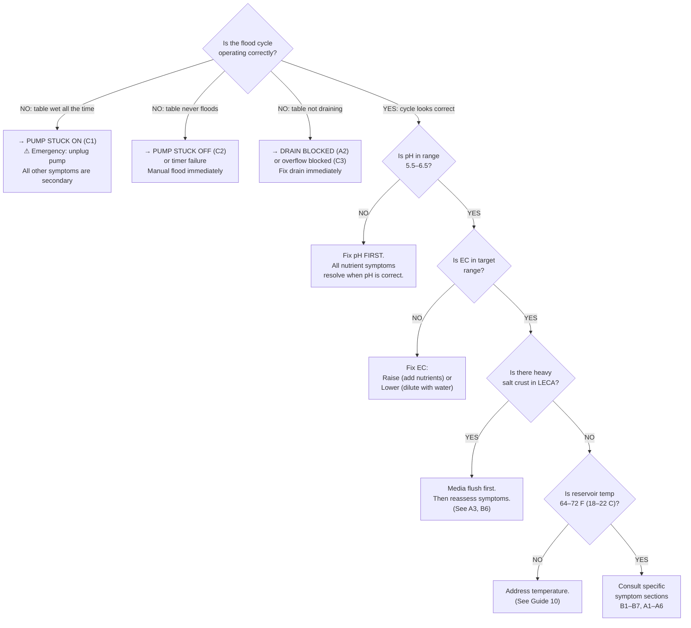
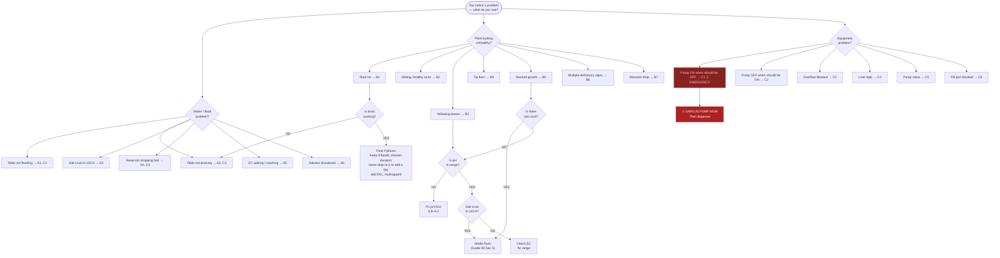

# Guide 09 — Troubleshooting
## Symptom → Cause → Fix Decision Trees

[](../../README.md)
[](https://creativecommons.org/licenses/by-nc-sa/4.0/)


---

## Table of Contents

- [How to Use This Guide](#how-to-use-this-guide)
- [SECTION A: Water and Solution Problems](#section-a-water-and-solution-problems)
  - [A1: FLOOD NOT REACHING TARGET DEPTH](#a1-flood-not-reaching-target-depth)
  - [A2: SLOW DRAIN OR TABLE NOT DRAINING FULLY](#a2-slow-drain-or-table-not-draining-fully)
  - [A3: SALT CRUST BUILDING UP IN LECA](#a3-salt-crust-building-up-in-leca)
  - [A4: RESERVOIR LEVEL DROPPING FASTER THAN EXPECTED](#a4-reservoir-level-dropping-faster-than-expected)
  - [A5: EC SPIKING OR CRASHING UNEXPECTEDLY](#a5-ec-spiking-or-crashing-unexpectedly)
  - [A6: SOLUTION TURNS BROWN, GREEN, OR SLIMY](#a6-solution-turns-brown-green-or-slimy)
- [SECTION B: Plant Problems](#section-b-plant-problems)
  - [B1: ROOT ROT (BROWN SLIMY ROOTS)](#b1-root-rot-brown-slimy-roots)
  - [B2: WILTING — ROOTS LOOK HEALTHY](#b2-wilting-roots-look-healthy)
  - [B3: YELLOWING LEAVES](#b3-yellowing-leaves)
  - [B4: TIP BURN AND BROWN LEAF EDGES](#b4-tip-burn-and-brown-leaf-edges)
  - [B5: STUNTED GROWTH](#b5-stunted-growth)
  - [B6: NUTRIENT DEFICIENCY FROM SALT LOCKOUT IN MEDIA](#b6-nutrient-deficiency-from-salt-lockout-in-media)
  - [B7: BLOSSOM DROP (TOMATOES / PEPPERS)](#b7-blossom-drop-tomatoes-peppers)
- [SECTION C: System and Equipment Problems](#section-c-system-and-equipment-problems)
  - [C1: TIMER FAILURE — PUMP STUCK ON](#c1-timer-failure-pump-stuck-on)
  - [C2: TIMER FAILURE — PUMP STUCK OFF](#c2-timer-failure-pump-stuck-off)
  - [C3: OVERFLOW FITTING BLOCKED](#c3-overflow-fitting-blocked)
  - [C4: TABLE LINER LEAK](#c4-table-liner-leak)
  - [C5: PUMP CAVITATION OR NOISE](#c5-pump-cavitation-or-noise)
  - [C6: FILL PORT PARTIAL BLOCKAGE](#c6-fill-port-partial-blockage)
- [SECTION D: Multiple Simultaneous Symptoms](#section-d-multiple-simultaneous-symptoms)
  - [Key Principle](#key-principle)
  - [D1: Wilting + Table Wet (Not Draining)](#d1-wilting-table-wet-not-draining)
  - [D2: Wilting + Table Dry (No Recent Flood)](#d2-wilting-table-dry-no-recent-flood)
  - [D3: Yellowing + Stunted Growth + Salt Crust](#d3-yellowing-stunted-growth-salt-crust)
  - [D4: EC Rising + Reservoir Dropping Fast](#d4-ec-rising-reservoir-dropping-fast)
  - [D5: Multiple Plants Affected vs. One Plant](#d5-multiple-plants-affected-vs-one-plant)
- [SECTION E: Master Decision Flowchart](#section-e-master-decision-flowchart)


[↑ Back to TOC](#table-of-contents)

## How to Use This Guide

Find your symptom in the relevant section. Follow the decision tree to identify the most likely cause, then apply the fix. Always start with the most common cause before assuming something unusual.

**Seeing multiple symptoms at once?** Skip to **Section D: Multiple Simultaneous Symptoms** — it is faster than working through individual sections when several things look wrong.

**Golden rule for Ebb & Flow — check in this order:**
1. **Flood cycle status first** — is the table flooding and draining correctly?
2. **pH second** — most plant symptoms are pH-related
3. **EC third** — over- or under-feeding, or salt lockout
4. **Temperature** — root zone and reservoir temperature
5. **Pest or disease** — only after ruling out chemistry and mechanics

The most common E&F error is misdiagnosing a flood cycle problem as a nutrient deficiency. If the flood/drain cycle is wrong, nutrients cannot reach the roots regardless of solution quality.


---


[↑ Back to TOC](#table-of-contents)

## SECTION A: Water and Solution Problems

---

### A1: FLOOD NOT REACHING TARGET DEPTH

```
  SYMPTOM: Water level in table is visibly lower than expected during flood.
  Expected flood level: about ¾ in (2 cm) below the LECA surface (set by the overflow standpipe).

  MOST COMMON CAUSES (in order of likelihood):

  1. RESERVOIR TOO LOW — insufficient volume to flood the table
     Sign: Reservoir level is clearly low before flood starts.
     Fix: Top up the reservoir immediately. Each table is 4 ft × 2 ft
          (1.22 m × 0.61 m) with 5 in (13 cm) of LECA. Flooding to the
          standpipe, about ¾ in (2 cm) below the LECA surface, draws roughly
          8–10 US gal (30–38 L) of free water per table. Three tables need
          about 25–30 US gal (95–114 L) above the pump. Keep the reservoir
          at its 45 US gal (170 L) operating level (range 40–50 US gal /
          151–189 L).

  2. PUMP TOO WEAK / IMPELLER PARTIALLY BLOCKED
     Sign: Pump sounds strained; flood rises slowly and levels off below target.
     Fix: Remove pump, inspect impeller for calcium or debris.
          Scrub with toothbrush in clean water. Retest flow rate.
          Target pump: 250 US gph (950 L/h), range 200–300 US gph (760–1,140 L/h),
          about 35 W. It should fill all three tables within 5–10 minutes.

  3. FILL PORT PARTIALLY CLOGGED
     Sign: Pump runs fine when tested in a bucket, but table fills slowly.
     Fix: Remove fill/return inlet tube from table port. Inspect for root
          debris or algae growth narrowing the opening. Clear with a thin brush.
          Check the barbed fitting is fully seated (not partially pulled out).

  4. FILL/RETURN HOSE KINKED
     Sign: Visible bend or kink in supply hose between pump and table inlet.
     Fix: Re-route hose with gentle curves. Secure with cable ties to prevent
          kinking. Replace hose if kink has created a permanent crease.

  5. OVERFLOW STANDPIPE TOO SHORT (set too low)
     Sign: Table drains out at a height LOWER than expected, before fully flooding.
     This is not really "not reaching depth" — the overflow is set incorrectly.
     Fix: Fit a taller 1½ in (40 mm) overflow standpipe so the waterline sits
          about ¾ in (2 cm) below the LECA surface.
          See the overflow standpipe height in Guide 11
          ([Setting Flood Depth with Overflow Height](11-build-guide.md#setting-flood-depth-with-overflow-height)).
```

---

### A2: SLOW DRAIN OR TABLE NOT DRAINING FULLY

```
  SYMPTOM: After pump stops, water remains in table for >30 minutes.
  Or: significant standing water (deeper than ¼ in / 6 mm) is still present at the next flood cycle.

  ⚠ THIS IS A HIGH-PRIORITY PROBLEM: roots sitting in stagnant solution
    rapidly become anaerobic. Pythium onset can begin within 2–4 hours.

  MOST COMMON CAUSES:

  1. DRAIN FITTING CLOGGED (most common cause)
     Sign: Standing water in table; drain fitting looks blocked with root debris
           or LECA pieces.
     Fix: Remove pump from timer (stop flooding). Manually clear drain fitting.
          Push a thin rod or flexible brush through the drain standpipe to dislodge
          blockage. Flush with clean water. Install a drain screen if not present.
          A small piece of fine mesh (window screen material) over the drain
          inlet prevents LECA entering the drain pipe.

  2. OVERFLOW STANDPIPE NOT FULLY SEATED IN FITTING
     Sign: The standpipe has risen up or tilted; the overflow opening is now
           ABOVE the normal overflow height, not below the flood surface.
     Fix: Press overflow standpipe firmly down into the bulkhead fitting socket.
          Ensure it seats in the rubber grommet. Test with water.

  3. DRAIN PIPE SLOPE INSUFFICIENT
     Sign: Water drains slowly but never fully clears; possible pool in drain pipe.
     Fix: The gravity drain pipe from table to reservoir must slope downhill
          continuously. Add shims or re-route pipe to ensure no flat or
          uphill sections. Minimum slope: 1:40 (about 1 in drop per 40 in, or 2.5 cm per 1 m).

  4. TABLE NOT LEVEL — POOLING IN LOW CORNER
     Sign: After drain, one corner of table retains water but rest is dry.
     Fix: Re-check table with spirit level. Add shims under table legs to
          level it. Unlike NFT, E&F tables must be perfectly LEVEL to ensure
          even flood distribution and complete drain.

  5. DRAIN PIPE DIAMETER TOO SMALL
     Sign: Drain empties very slowly (water level drops but takes >45 minutes).
     Fix: Each table already uses a 1 in (25 mm) drain. If that line is
          necked down, restore 1 in (25 mm) all the way to the reservoir.
          The overflow is the separate 1½ in (40 mm) standpipe. It sets flood
          height. It is not a substitute for the drain.
```

---

### A3: SALT CRUST BUILDING UP IN LECA

```
  SYMPTOM: White or gray powdery/crusty deposits on LECA surface, table walls,
  or around net pots. Can range from light dusting to thick mineral crust.

  E&F SPECIFIC CONTEXT:
  Salt crust is a normal consequence of the flood/drain cycle.
  Each cycle deposits a small mineral residue as water evaporates from LECA surfaces.
  The question is: how much crust is acceptable, and when does it become a problem?

  SEVERITY GUIDE:

  LIGHT crust (fine dusting on top LECA only):
  → Normal. Monitor. Flush at next scheduled media flush.

  MODERATE crust (visible buildup on net pot rims, table walls, media surface):
  → Schedule media flush within 1 week. Check EC — is it rising? Check water hardness.
  → If using hard tap water (EC > 0.5): consider RO or rainwater blending.

  HEAVY crust (thick white layer, LECA clumping, orange or yellow tinging):
  → Flush immediately. Plants may show deficiency symptoms (see B6).
  → Orange tinge: iron precipitate (pH too high — check and lower to 5.8–6.0)
  → Yellow: sulfur accumulation — check nutrient formula
  → Run 3–5 plain water flush cycles (see Guide 08 Section 5)

  ROOT CAUSE INVESTIGATION:
  □ Test source water hardness: EC above 0.4 mS/cm = high mineral load
  □ Compare flush frequency to build rate: if crust returns in <2 weeks after
    a flush, water source is the primary driver — switch water sources
  □ Check flood frequency: more floods per day deposit more residue.
    Vegetative crops stay at 3 floods a day. Fruiting stays at 4.
    Four is the ceiling. Do not add a fifth, and do not drop to 2 as a heat plan.
```

---

### A4: RESERVOIR LEVEL DROPPING FASTER THAN EXPECTED

```
  SYMPTOM: Reservoir needs topping up more than once per day, or is dropping
  more than 4 US gal (15 L) per day despite cool conditions.

  CAUSES AND DIAGNOSIS:

  1. LINER LEAK (most serious cause)
     Sign: Reservoir drops even overnight when transpiration is minimal.
           Check ground around and under tables — is it always damp?
           Reservoir drops but table reaches normal flood depth (solution
           is going somewhere other than back to reservoir).
     Fix: Empty table completely. Inspect liner for cracks, pinholes, or
          seepage around bulkhead flanges. Repair with pond liner tape or
          aquatic silicone. Allow 24h cure. Retest with plain water.

  2. HIGH TRANSPIRATION + OPEN TABLE EVAPORATION (expected in hot/windy conditions)
     Sign: Reservoir drops more during hot days than cool nights.
           This is a proportional relationship — each degree of extra heat
           and each km/h of extra wind increases evaporative loss.
     Fix: Add windbreak (see Guide 10). Consider a loose shade cloth cover
          over tables during hottest part of day. Increase top-up frequency.

  3. RAIN COLLECTING IN TABLES MASKING ACTUAL SOLUTION LOSS
     Sign: Reservoir drops by about 2½ US gal (10 L) overnight after rain, but you attribute
           it to evaporation. Actually: solution in tables was diluted by
           rain and extra water volume kept the reservoir appearing correct
           until the next flood flushed it.
     Counter-intuitive effect: rain can cause reservoir DROPS if the tables
     collect rainwater and dilute the solution being returned.
     Fix: Monitor EC closely after rain. Install a simple lid or slope cover
          over tables to prevent rain collection if this is recurring.

  4. PUMP RUNNING LONGER THAN EXPECTED (timer fault)
     Sign: Reservoir drops during what should be an off period.
           Pump audible when it should be off.
     Fix: Verify timer operation. See C1 (pump stuck on).
```

---

### A5: EC SPIKING OR CRASHING UNEXPECTEDLY

```
  EC SPIKE (sudden rise of >0.3 mS/cm between readings):

  Most likely: Evaporation concentrated the solution.
    → Check: has it been hot and dry? Table surface evaporation is faster
      in E&F than NFT. Top up with plain water before adjusting nutrients.

  Also possible: Hard water top-up accumulation.
    → If topping up with hard tap water daily, mineral accumulation builds up.
    → Fix: Do a partial drain (30%) and replace with softer water. Then
      switch top-up source to RO or rainwater for ongoing management.

  Also possible: Salts being released from LECA as it dehydrates in hot weather.
    → Less likely but possible if LECA has a large salt crust accumulated.
    → Fix: Media flush (see Guide 08 Section 5) then monitor EC recovery.

  ─────────────────────────────────────────────────────────

  EC CRASH (sudden drop of >0.3 mS/cm between readings):

  Most likely: RAIN COLLECTED IN OPEN TABLES
    → Check weather history. Rain falling into open flood tables dilutes the
      solution being returned to the reservoir significantly.
    → If EC has dropped below 0.8 mS/cm: add nutrients to restore target.
    → Prevention: cover tables during rain events or fit sloped covers.

  Also possible: Large plain-water top-up was added recently.
    → Normal dilution effect. Re-dose nutrients to target.

  Also possible: Reservoir change was done and the concentration was set too low.
    → Recheck against target EC for your current crop. Increase nutrient dose.
```

---

### A6: SOLUTION TURNS BROWN, GREEN, OR SLIMY

```
  GREEN: Algae bloom
    Sign: Reservoir water turns green; may also see green coating on table walls
    Cause: Light reaching reservoir or into table standing water
    Fix: (1) Check reservoir cover — any light leaks? Seal them.
         (2) Check table — if tables are open to sky and algae is growing in
             LECA above the flood line: this is surface algae, relatively harmless
             but unsightly. A piece of black polythene over LECA between flood
             cycles reduces this.
         (3) Full reservoir flush + sterilization (see Guide 08 Section 5)
         (4) Long-term: consider covering reservoir exterior with opaque wrap

  BROWN: Typically root organic matter or Pythium development
    Sign: Solution color has a tan or brown tinge; may also smell musty
    Cause: Root material breaking down in solution — possible early Pythium
    Fix: Check roots immediately. If roots are white or pale: organic matter
         only — do a full reservoir change and flush. If roots are brown and
         slimy: active Pythium — see Guide 07 for treatment protocol.
         Also check: are any roots blocking the drain fitting and decomposing?

  SLIMY / THICK CONSISTENCY:
    Sign: Solution feels viscous when handling; coating on reservoir walls
    Cause: Bacterial biofilm in reservoir — solution is overdue for a change
    Fix: Full drain, sterilize reservoir (10% bleach, triple rinse), refill fresh.
         Increase reservoir change frequency. Consider adding beneficial bacteria
         (e.g., Hydroguard/Bacillus amyloliquefaciens) to colonize the biofilm sites.
```


---


[↑ Back to TOC](#table-of-contents)

## SECTION B: Plant Problems

---

### B1: ROOT ROT (BROWN SLIMY ROOTS)

```
  SYMPTOM: Roots are brown, soft, mushy, and often foul-smelling.
  In severe cases: wilting despite solution being present in table.

  ⚠ E&F ROOT ROT IS ALMOST ALWAYS FLOOD-CYCLE-RELATED.
    Before assuming Pythium, verify the drain cycle is working correctly.

  DIAGNOSIS DECISION TREE:

  Is table draining completely between floods?
  └─ NO: Fix the drain first (see A2). Root rot is secondary to the drainage failure.
         A pump stuck ON rots roots in 2–4 hours. If the Guide 13 drain float
         is still up after the pump should be off, open the pump relay.
  └─ YES: Drainage is correct. Root rot is likely from:
         (a) Solution temperature above 77°F (25°C) — that is the pythium action line.
             The target band is 64–72°F (18–22°C).
         (b) A fifth flood, or floods that never finish draining
         (c) Pythium already established — the environmental trigger was earlier

  TREATMENT — EARLY STAGE (brown tips, musty smell, some white roots remain):
  1. Keep floods at 3 per day and shorten them. Do not add a fifth. Do not use
     a drop to 2 floods as the heat plan — heat gets 40% shade and shorter floods.
  2. Increase dissolved oxygen: add an air stone to the reservoir
  3. A 3% hydrogen-peroxide flush is a cleaning step. Remove the plants, or
     hand-water them, before the flush. Do not run that dose through a live
     root zone. Hydroguard (Bacillus) can go into a live reservoir.
  4. If solution temperature is above 77°F (25°C): shade the reservoir and use ice bottles
  5. Run a half-strength nutrient solution for 1 week to reduce stress

  TREATMENT — SEVERE STAGE (most roots brown/black, wilting plants):
  1. Remove affected plants. Trim all dead root material with sterilized scissors.
  2. Rinse roots in a 0.3% hydrogen-peroxide solution (about 2 tsp / 10 ml of 3%
     peroxide per 1 US qt / 0.95 L) for 30 seconds, then rinse in water.
  3. Replace table media: remove all LECA, sterilize (see Guide 08 Section 5).
  4. Full reservoir drain and sterilization.
  5. Replant on the vegetative schedule of 3 floods a day, shortened, until roots
     are white again. Fruiting returns to 4. Never 5.
  6. Remaining plants in the same table: monitor closely for spread.
```

---

### B2: WILTING — ROOTS LOOK HEALTHY

```
  SYMPTOM: Plants wilting during the day but roots appear white and healthy.

  CAUSES AND DIAGNOSIS:

  1. FLOOD FREQUENCY TOO LOW — roots drying out between floods
     Sign: Wilting worsens mid-afternoon (hottest/driest point). LECA is bone dry
           several hours after flood. Wilting recovers after next flood.
     Fix: Vegetative crops flood 3 times a day. Fruiting crops flood 4 times a day.
          Four is the ceiling. If the schedule is already at 4, do not add a fifth.
          On a heatwave, keep the 4 floods, shorten them, and deploy 40% shade.

  2. FLOOD NOT REACHING ROOT ZONE — roots not being contacted
     Sign: Flood runs but plants are still wilting. Check flood depth — is
           water reaching base of net pots? Roots must reach the flood zone.
     Fix: Raise the 1½ in (40 mm) overflow standpipe so the waterline is about
          ¾ in (2 cm) below the LECA surface. Roots in the open bed must reach
          that waterline during the flood.

  3. HIGH EVAPOTRANSPIRATION STRESS
     Sign: Hot day above 85°F (29°C), sunny and windy. Even with correct flooding,
           the plant can lose water faster than the roots can absorb it.
     Fix: Deploy 40% shade cloth. Reduce wind on the prevailing-wind side.
          Keep 4 floods if the crop is fruiting. Shorten them. Do not add a fifth.

  4. EC TOO HIGH — osmotic stress
     Sign: Wilting despite regular flooding. EC is above 3.5 mS/cm.
           Roots present but plant cannot take up water against osmotic gradient.
     Fix: Dilute solution (partial drain + plain water top-up) to bring EC
          into correct range for your crop.

  5. ROOT ZONE TEMPERATURE TOO HIGH
     Sign: Solution temperature above 77°F (25°C). Roots look healthy but dissolved
           oxygen is falling and pythium risk is rising. That is the action line.
     Fix: Cool the reservoir back toward 64–72°F (18–22°C). See Guide 10.
```

---

### B3: YELLOWING LEAVES

```
  SYMPTOM: Leaves turning yellow. The pattern of yellowing matters.

  DIAGNOSTIC PATTERN GUIDE:

  OLD LEAVES YELLOW FIRST (lower leaves, older growth):
  → Mobile nutrient deficiency (N, P, K, Mg)
  → Most common: NITROGEN (N) deficiency
     Sign: Uniform pale yellow across all older leaves
     Cause in E&F: EC too low; or salt lockout preventing N uptake; or
                   flood frequency too low (N not reaching roots)
     Fix: Check EC (raise if low). Check salt crust (flush if heavy).
          Verify flood cycle is correctly reaching root zone.

  NEW LEAVES YELLOW FIRST (young growth, growing tips):
  → Immobile nutrient deficiency (Ca, Fe, Mn, Zn)
  → Most common: CALCIUM (Ca) deficiency (also causes tip burn — see B4)
     Cause in E&F: pH too high (>6.5) causing Ca lockout; or salt crust
                   in media blocking Ca ion movement
     Fix: Lower pH to 5.8–6.0. Perform media flush.

  INTERVEINAL CHLOROSIS (veins stay green, tissue between yellows):
  → MAGNESIUM (Mg) deficiency (older leaves) or IRON (Fe) deficiency (new leaves)
  → Mg: Check EC, check salt crust, verify Epsom Salt is in your formula
  → Fe: Check pH (iron precipitates above 6.5) — lower pH to 5.8–6.2

  UNIFORM OVERALL YELLOWING (whole plant, all ages):
  → pH out of range (outside 5.0–7.0), or solution change is overdue
  → Test pH first — this is the most common cause of whole-plant yellowing
  → If pH is correct: EC crash (see A5)

  YELLOWING WITH MOTTLED SPOTS:
  → Possible virus (tobacco mosaic, cucumber mosaic) or spider mite damage
  → Check for pests under leaves before diagnosing nutrient problem
```

---

### B4: TIP BURN AND BROWN LEAF EDGES

```
  SYMPTOM: Brown or burnt tips and edges on leaves, particularly lettuce
  and other leafy greens. Inner wrapper leaves most affected.

  CAUSES IN E&F:

  1. LOW CALCIUM / CALCIUM LOCKOUT (most common cause in E&F)
     Context: Calcium moves with water flow. In E&F, calcium reaches roots
     only during flood cycles. If flood frequency is low or flood depth
     insufficient, inner growing leaves receive less calcium.
     Fix: Flood 3 times a day in vegetative growth and 4 times a day in fruit.
          Four is the ceiling.
          Ensure flood depth reaches all root levels. Lower pH to 5.8–6.0
          to improve Ca availability. Consider Ca-EDTA supplement.

  2. HIGH EC / OSMOTIC STRESS
     Sign: Leaf edges crispy; EC reading is above target.
     Fix: Dilute solution — partial drain, replace with plain water.

  3. HIGH TEMPERATURE + LOW HUMIDITY
     Sign: Tip burn occurs on hot days; lower margins crispy.
     The "VPD" (vapor pressure deficit) is too high: plants
     transpire faster than calcium can be translocated to tips.
     Fix: 40% shade cloth when afternoon highs hold above 85°F (29°C), plus a
          windbreak on the prevailing-wind side. Keep the 4 fruiting floods and
          shorten them. Do not add a fifth.

  4. AMMONIUM TOXICITY (if using a nutrient formula with high NH₄)
     Sign: Brown leaf margins, reduced growth; distinctive ammonia-
           sharp smell from solution.
     Fix: Switch to nitrate-dominant formula (Masterblend, GH Maxi series).
          Do not use urea-based fertilizers in E&F.
```

---

### B5: STUNTED GROWTH

```
  SYMPTOM: Plants much smaller or slower than expected for their age.

  DIAGNOSIS:

  Is pH in range (5.5–6.5)?
  └─ NO: Nutrient lockout — fix pH first. Most stunting is pH-related.

  Is EC in target range for your crop?
  └─ NO LOW: Underfed. Raise EC to target. Check flood cycle is reaching roots.
  └─ NO HIGH: Salt stress. Dilute solution.

  Is flood frequency correct?
  └─ Check: are roots reaching flood zone? Are roots white?
     If roots are sparse and not reaching the table base: roots are not
     getting adequate nutrient exposure between dry cycles.
     Fix: Increase flood depth OR increase frequency to 3–4× per day.

  Is there heavy salt crust in media?
  └─ YES: Salt lockout (see B6). Perform media flush.

  Is root zone temperature correct?
  └─ Below 61°F (16°C): a cold root zone slows uptake, especially phosphorus.
     Insulate the reservoir. Stay on 3 vegetative floods. Do not add a fifth.
  └─ Above 77°F (25°C): pythium risk rises. Cool the reservoir toward 64–72°F (18–22°C).

  Has the plant suffered any pest/disease setback?
  └─ Root rot, aphid infestations, or caterpillar damage all cause stunting
     that looks like a nutrient or flood problem. Inspect roots and foliage.
```

---

### B6: NUTRIENT DEFICIENCY FROM SALT LOCKOUT IN MEDIA

```
  SYMPTOM: Multiple nutrient deficiency symptoms appearing simultaneously —
  yellowing, tip burn, purple tinge, interveinal chlorosis — despite
  correct EC and pH in the reservoir. This combination is the signature
  of SALT LOCKOUT in the LECA media.

  MECHANISM:
  When mineral salts accumulate in LECA (from hard water top-ups, evaporation,
  and residual flood deposits), they create a high-salt zone in the media.
  This locks out plant uptake: nutrients in the solution cannot move through
  the media to the roots effectively. The reservoir reads fine; the roots are
  starving.

  DIAGNOSIS:
  □ Is there visible salt crust on LECA surface and around net pots?
  □ Has the media been flushed in the last 4 weeks?
  □ Is source water EC > 0.4 mS/cm (hard water)?
  □ Have multiple plants shown similar symptoms at the same time?

  If YES to two or more: salt lockout is the primary diagnosis.

  FIX:
  1. Perform immediate media flush (Guide 08 Section 5) — 3–5 plain water
     flood cycles until runoff EC is near zero
  2. After flush: refill reservoir with fresh nutrient solution
  3. Run normal flood schedule and observe plants for 3–5 days
  4. Deficiency symptoms should visibly improve within 5–7 days
  5. Prevent recurrence: flush monthly, consider softer water source
```

---

### B7: BLOSSOM DROP (TOMATOES / PEPPERS)

```
  SYMPTOM: Flowers form then drop without setting fruit.

  CAUSES:

  1. TEMPERATURE EXTREMES
     Night temperatures below 50°F (10°C) or day temperatures above 90°F (32°C)
     prevent pollination and fruit set.
     Fix: Fleece at night below 54°F (12°C). Deploy 40% shade when afternoon
          highs hold above 85°F (29°C).

  2. POOR POLLINATION
     Outdoors, wind provides some pollination for tomatoes/peppers.
     If in a sheltered spot with wind blocked, pollination may be inadequate.
     Fix: Gently shake flower clusters each morning (vibrating flowers helps
          release pollen). A soft toothbrush run across open flowers works well.

  3. EC TOO HIGH OR LOW
     Out-of-range EC causes blossom stress: flowers abort rather than set.
     Fix: Check EC — tomato fruiting 2.5–3.5 mS/cm; pepper fruiting 2.0–3.0 mS/cm. Do not run peppers at the tomato ceiling.

  4. FLOOD STRESS DURING FLOWERING
     Inconsistent flood cycles during bloom (missed floods, over-flooding)
     disrupts calcium and boron translocation — both essential for fruit set.
     Fix: Keep a consistent schedule: 3 floods a day while vegetative, 4 once
          fruit is setting. On a hot day, keep those 4 and shorten them.
          Do not add a fifth flood.

  5. CALCIUM AND BORON DEFICIENCY
     Blossom end rot (dark sunken areas at fruit base) = calcium deficiency.
     If flowers dropping before setting: boron may be limiting.
     Fix: Lower pH to 5.8–6.0. Consider adding calcium in chelated form.
          Boron: a complete formula already carries the trace the crop needs.
          Do not add a separate boron dose unless a tissue test asks for it.
```


---


[↑ Back to TOC](#table-of-contents)

## SECTION C: System and Equipment Problems

---

### C1: TIMER FAILURE — PUMP STUCK ON

```
  SYMPTOM: Pump is running outside its scheduled flood window.
  Table is flooded continuously and not draining. Or: reservoir level
  drops much faster than expected and table is always wet.

  ⚠ THIS IS THE HIGHEST-SEVERITY E&F FAILURE MODE.
    Permanent flooding = root asphyxiation. Root rot begins within 2–4 hours.
    ACT IMMEDIATELY.

  IMMEDIATE ACTION:
  1. Unplug pump manually from the power socket NOW
  2. Verify table can drain: overflow fitting should allow table to drain
     even with pump off (gravity drain back to reservoir)
  3. If table does not drain (overflow also blocked): see C3

  DIAGNOSIS:
  □ Is the timer display showing incorrect time? (Timer lost power = reset to 00:00)
     Fix: Reset to current time and reschedule. Fit a timer with backup battery
          to retain settings through power cuts.
  □ Is a mechanical pin timer stuck in the ON position?
     Fix: Unplug it. The outdoor timer is a digital 1-minute timer in a
          weatherproof box. A mechanical timer is not the outdoor control.
  □ Is the digital timer settings corrupted?
     Fix: Factory reset timer, reprogram schedule, verify correct current time.
  □ Is a Tier 1/4 smart plug relay stuck closed?
     Fix: Power cycle smart plug at wall socket. Check app for relay status.

  AFTER FIX:
  1. Shorten the next day's floods. Stay at 3 (vegetative) or 4 (fruiting).
     Do not add a fifth.
  2. Inspect roots: if brown and slimy, begin root rot treatment (see B1)
  3. The primary safety device is the Guide 13 drain float. If the float is
     still up after the pump should be off, it opens the pump relay.
     A second timer that only restarts a stopped pump does not stop a stuck-ON flood.

  PREVENTION:
  Use the digital 1-minute timer in its weatherproof box, on a 120 V outdoor
  GFCI (SA: 230 V, 30 mA earth-leakage). Test the timer and the GFCI weekly
  (Guide 08). Root rot from a stuck-ON pump starts in 2–4 hours.
```

---

### C2: TIMER FAILURE — PUMP STUCK OFF

```
  SYMPTOM: Table has not flooded within its scheduled window.
  LECA is completely dry. Plants may be wilting.

  DIAGNOSIS:

  □ Is the timer showing correct time and schedule?
     Fix: If timer reset to 00:00 (power cut): reset time, reprogram schedule.
  □ Is the pump plugged in?
     Fix: Check the plug, the breaker, and the 120 V outdoor GFCI
          (SA: 230 V, 30 mA earth-leakage). Reset it if it has tripped.
  □ Is the pump impeller jammed?
     Test: Remove pump from reservoir, place in a bucket of water, plug in.
     If no output: disassemble and clear impeller.
     If impeller is clear but still no output: pump motor has failed.
     Fix: Replace pump. Keep a spare pump (see Guide 11 Build Checklist).
  □ Is the reservoir empty?
     Fix: Reservoir is too low for pump to prime. Top up immediately.
          Ensure fill mark is maintained.

  IMMEDIATE RECOVERY — MANUAL FLOOD:
  If you need to flood immediately while diagnosing:
  1. Unplug timer, plug pump directly into power socket
  2. Monitor table fill manually (watch overflow — do not leave unattended)
  3. When flood reaches overflow height, unplug pump, allow drain
  4. Repair timer/pump before re-automating

  PLANTS THAT MISSED A FLOOD:
  Moist LECA holds 8–24 hours. Wilt in 1½–2 hours is not the normal buffer.
  Most plants recover once the next flood runs. Spray foliage with plain water
  if the leaves are soft while the root zone rehydrates.
  A second timer that only recovers a stuck-OFF pump is a convenience.
  It is not the safety device. The safety device cuts a pump that stayed on.
```

---

### C3: OVERFLOW FITTING BLOCKED

```
  SYMPTOM: Table floods beyond expected depth and continues rising;
  or drainage is extremely slow; or table never drains below a certain level.

  ⚠ BLOCKED OVERFLOW = UNCONTROLLED FLOOD DEPTH.
    If overflow is blocked AND pump is running, table will fill to the rim
    and overflow onto the floor/ground. Act before this happens.

  IMMEDIATE ACTION:
  1. Stop pump (unplug timer)
  2. Investigate overflow fitting

  CAUSES AND FIXES:

  1. DEBRIS IN OVERFLOW STANDPIPE
     Most common cause: a piece of LECA, a root, or organic debris has
     entered and lodged in the standpipe.
     Fix: Remove standpipe from fitting. Clear with a thin rod or pipe cleaner.
          Flush with water. Refit. Install a mesh screen cage around standpipe
          base to prevent LECA entering.

  2. ALGAE OR BIOFILM NARROWING THE OVERFLOW
     Sign: Slow drain through overflow rather than sudden blockage.
          Visible green or gray slime inside standpipe.
     Fix: Remove standpipe. Scrub interior with brush and dilute bleach
          (1:10 bleach:water). Rinse thoroughly. Refit.
          Perform overflow inspection monthly (see Guide 08 Section 4).

  3. STANDPIPE PUSHED DOWN TOO FAR INTO FITTING
     Sign: Overflow level has apparently risen — table fills higher than
          before the last maintenance.
     Actually: standpipe was pushed down during cleaning, reducing its
     effective height above the fitting base.
     Fix: Pull standpipe up to correct height (mark it with a permanent
          marker for reference). Verify flood depth is at target.

  4. RUBBER GROMMET IN BULKHEAD HAS FAILED
     Sign: Water bypasses the standpipe; flows around the fitting seal.
          Drain is fast but not via the standpipe path.
     Fix: Replace rubber grommet in the bulkhead fitting.
          Source: plumbing or hydroponics suppliers. The overflow bulkhead is
          1½ in (40 mm). The drain bulkhead is 1 in (25 mm). Match the washer
          to that fitting.
```

---

### C4: TABLE LINER LEAK

```
  SYMPTOM: Ground or structure below/around table is wet; reservoir level
  drops even overnight when evaporation is minimal; EC readings seem stable
  but water volume is disappearing.

  DIAGNOSIS:

  STEP 1 — CONFIRM IT IS A LINER LEAK (not evaporation or normal loss):
  □ Mark reservoir level at night, check in morning before any flood cycle
  □ If the reservoir has dropped more than ¾ US gal (3 L) overnight in cool conditions: a leak is likely
  □ Inspect ground below the flood tables — is there a damp patch?
  □ After removing LECA: look at liner surface for wet spots, staining,
    or visible cracks/pinholes

  STEP 2 — LOCATE THE LEAK:
  □ Fill the table with plain water to 2 in (5 cm) depth (no media)
  □ Watch for 10 minutes — where does water appear on the outside?
  □ Most common leak sites:
     - Around bulkhead fitting flanges (fitting over-tightened or under-tightened)
     - In liner folds at corners (fold stress cracking)
     - Along the liner edge where it was stapled/clamped to timber frame

  STEP 3 — REPAIR:
  For a pinhole or small crack:
  □ Drain table, dry liner completely (allow 4–8h in sun if possible)
  □ Apply PVC pond liner repair tape or patch (available at pond suppliers)
  □ OR apply aquatic-grade silicone — allow 48h cure before refilling

  For a failed bulkhead seal:
  □ Remove bulkhead fitting, dry liner around hole completely
  □ Apply silicone to both flanges, refit, tighten lock nut firmly
  □ Allow 24h cure before refilling

  For severe liner damage (cracking across large area):
  □ Replace the liner. This is typically a 1–2 hour job for a DIY timber table.
  □ Source new pond liner from a pond/water garden supplier:
    0.5 mm EPDM or 0.75 mm PVC — both food-safe and durable
```

---

### C5: PUMP CAVITATION OR NOISE

```
  SYMPTOM: Pump is running but making unusual noise — rattling, grinding,
  sucking air sounds, or vibration. Output may be reduced.

  CAUSES:

  1. RESERVOIR LEVEL TOO LOW — pump drawing air
     Sign: Gurgling, sucking sound. Pump output is aerated (bubbly).
     Fix: Top up reservoir immediately. Pump must be fully submerged.
          Mark minimum operating level on reservoir exterior.

  2. DEBRIS IN IMPELLER
     Sign: Grinding or rattling sound. Output is reduced.
     Fix: Remove pump, disassemble impeller housing, remove debris
          (LECA fragments, root material, mineral deposits).
          Inspect impeller blades for damage. Replace impeller if cracked.

  3. CALCIUM DEPOSITS ON IMPELLER (hard water areas)
     Sign: Pump progressively noisier over weeks; output declining.
     Fix: Soak impeller in 5–10% citric acid solution (1 teaspoon per
          200 ml warm water) for 30–60 minutes. Rinse thoroughly.
          Scrub with toothbrush. Citric acid dissolves calcium carbonate.

  4. PUMP VIBRATING AGAINST RESERVOIR WALL
     Sign: Vibration noise transmitted through reservoir wall.
     Fix: Wrap pump in a small piece of foam or cloth to dampen vibration.
          Ensure pump is positioned on reservoir floor, not propped up.
```

---

### C6: FILL PORT PARTIAL BLOCKAGE

```
  SYMPTOM: Table fills slower than usual. One table fills much slower than
  the other. Flood depth is lower than before for the same pump schedule.

  CAUSE: Root ingress into the fill/return fitting, or debris from LECA
  has entered and partially blocked the inlet port.

  FIX:
  1. Stop pump (off period)
  2. Remove inlet hose from fill port fitting
  3. Inspect inside fill port — is there a visible root or debris?
  4. Clear with a thin wire or pipe cleaner
  5. If fitting is also partially separated from the liner (suction during
     drain can pull fittings): reseat and re-silicone the fitting base
  6. Reconnect inlet hose. Test flood depth on next cycle.

  PREVENTION:
  - Position fill port inlet at one end of the table; position net pots
    so roots grow away from the fill port rather than toward it
  - Install a coarse mesh screen over the inside face of the fill port
    to prevent root ingress
```


---


[↑ Back to TOC](#table-of-contents)

## SECTION D: Multiple Simultaneous Symptoms

### Key Principle

When you see two or more problems at the same time, always look for a single root cause. In Ebb & Flow, the flood cycle underpins almost everything — a single flood cycle fault can produce a cascade of secondary symptoms within 24–48 hours.



---

### D1: Wilting + Table Wet (Not Draining)

**Diagnosis:** Root asphyxiation from permanent flooding. Roots cannot breathe in stagnant water.

**Priority:** Emergency. Unplug pump. Clear drain. Allow roots to dry.
Refer to: **C1, C3, A2, B1** in that order.

---

### D2: Wilting + Table Dry (No Recent Flood)

**Diagnosis:** Flood cycle failure or pump failure. Plants desiccating.

**Priority:** High. Perform manual flood immediately. Then diagnose flood failure.
Refer to: **C2** — timer/pump failure.

---

### D3: Yellowing + Stunted Growth + Salt Crust

```
  This triad is the classic signature of salt lockout in E&F media.

  CAUSE: Heavy salt accumulation in LECA preventing nutrient uptake
  despite correct reservoir chemistry.

  VERIFY: Check EC and pH — they will look CORRECT in the reservoir.
  That is what makes salt lockout confusing: the solution is fine,
  but the media is blocking it from reaching the roots.

  FIX:
  1. Media flush: 3–5 plain water flood cycles (Guide 08 Section 5)
  2. After flush: do a full reservoir change with fresh nutrient mix
  3. Allow 5–7 days for plant recovery before adjusting further
  4. Long-term: implement monthly flush schedule; consider softer water
```

---

### D4: EC Rising + Reservoir Dropping Fast

```
  CAUSE: Liner leak. Solution is escaping into the ground rather than
  returning to the reservoir. The EC appears to rise because you are
  losing water volume (diluting the plant uptake signal), and the reservoir
  drops from actual solution loss, not just evaporation.

  VERIFY:
  □ Is ground below table consistently wet?
  □ Does reservoir drop even overnight (low evaporation period)?
  □ Does EC spike even on cool/cloudy days (when evaporation is low)?

  FIX: Trace and repair liner leak (see C4).
```

---

### D5: Multiple Plants Affected vs. One Plant

```
  MULTIPLE PLANTS SHOWING SAME SYMPTOMS:
  → System-level cause: flood cycle, EC, pH, temperature, salt crust
  → Start with Section A (water problems) before Section B (plant problems)
  → If all tables affected equally: reservoir chemistry or pump issue
  → If only one table affected: that table's specific drain/overflow fitting

  ONE PLANT SHOWING SYMPTOMS, OTHERS HEALTHY:
  → Individual plant issue: root disease at that plant, blocked net pot,
    localized pest infestation, poor transplant (root ball too dense)
  → Remove the affected plant for inspection
  → If roots are brown/slimy: Pythium; treat roots and reintroduce
  → If roots are white but plant is struggling: check that the net pot
    has adequate contact with flood zone; LECA may be too tightly packed
    preventing solution from reaching the root zone
```


---


[↑ Back to TOC](#table-of-contents)

## SECTION E: Master Decision Flowchart

Use this when you are unsure where to start.



---


> **Previous:** [Guide 08 — System Maintenance](./08-system-maintenance.md)


[↑ Back to TOC](#table-of-contents)

> **Next:** [Guide 10 — Climate Management](./10-climate-management.md)


---

<!-- copyright -->
*Copyright (c) 2026 UncleJS. Licensed under [CC BY-NC-SA 4.0](https://creativecommons.org/licenses/by-nc-sa/4.0/) — free to share and adapt for non-commercial purposes with attribution and ShareAlike.*
