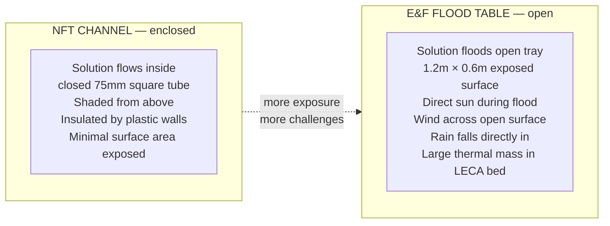
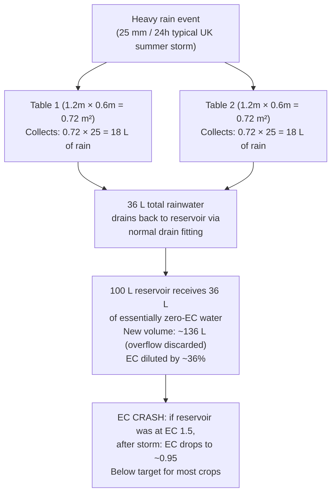

# Guide 10 — Climate Management for Outdoor Ebb & Flow
## Temperature, Heat, Frost, Wind, Rain, and Seasons

---

## Table of Contents

- [1. Why Climate Matters Differently in Ebb & Flow](#1-why-climate-matters-differently-in-ebb-flow)
- [2. Temperature — The Critical Variable](#2-temperature-the-critical-variable)
  - [Solution Temperature Targets](#solution-temperature-targets)
  - [How E&F Tables Respond to Temperature Differently from NFT](#how-ef-tables-respond-to-temperature-differently-from-nft)
  - [Reservoir Thermal Profile — 100L Under-Table](#reservoir-thermal-profile-100l-under-table)
- [3. Managing Heat — Summer Strategies](#3-managing-heat-summer-strategies)
  - [Shade Cloth for Flood Tables](#shade-cloth-for-flood-tables)
  - [Reservoir Cooling Strategies](#reservoir-cooling-strategies)
  - [Flood Cycle Adjustments for Heat](#flood-cycle-adjustments-for-heat)
- [4. Managing Cold — Frost Protection](#4-managing-cold-frost-protection)
  - [Frost Risk Assessment](#frost-risk-assessment)
  - [Protection Measures](#protection-measures)
  - [Reservoir Freeze Risk — 100L Thermal Mass](#reservoir-freeze-risk-100l-thermal-mass)
- [5. Wind — The Often-Overlooked Factor](#5-wind-the-often-overlooked-factor)
  - [Wind Effects on Ebb & Flow Specifically](#wind-effects-on-ebb-flow-specifically)
  - [Windbreak Options](#windbreak-options)
- [6. Rain — A Unique Challenge for Open Flood Tables](#6-rain-a-unique-challenge-for-open-flood-tables)
  - [Rain Dilution Mechanisms](#rain-dilution-mechanisms)
  - [Rain Management Strategies](#rain-management-strategies)
- [7. Seasonal Calendar — Outdoor Ebb & Flow (Temperate)](#7-seasonal-calendar-outdoor-ebb-flow-temperate)
  - [Spring (March–May)](#spring-marchmay)
  - [Summer (June–August)](#summer-juneaugust)
  - [Autumn (September–October)](#autumn-septemberoctober)
  - [Winter (November–February)](#winter-novemberfebruary)
- [8. Flood Cycle Frequency by Season and Temperature](#8-flood-cycle-frequency-by-season-and-temperature)
- [9. EC and pH Management by Season](#9-ec-and-ph-management-by-season)
- [10. Emergency Action Plans](#10-emergency-action-plans)
  - [Heatwave Protocol (>30°C forecast)](#heatwave-protocol-30c-forecast)
  - [Frost Warning Protocol (<3°C forecast)](#frost-warning-protocol-3c-forecast)
  - [Storm Protocol (Heavy Rain + Wind)](#storm-protocol-heavy-rain-wind)


[↑ Back to TOC](#table-of-contents)

## 1. Why Climate Matters Differently in Ebb & Flow

An NFT system houses nutrient solution in enclosed channels — sheltered, shaded by the channel walls, and flowing continuously. An Ebb & Flow system uses open flood tables: wide, shallow trays exposed to the sky. This fundamental difference in geometry creates a very different climate exposure profile.



Key differences for climate management:

| Factor | NFT | Ebb & Flow |
|---|---|---|
| Surface area exposed to sun/wind | Low (enclosed channels) | High (open 0.72 m² per table) |
| Rain ingress risk | Very low | High — rain falls directly into table |
| Wind evaporation | Low | Significant — open surface |
| Thermal mass in grow zone | Very low (thin film) | High — LECA bed holds heat/cold |
| Reservoir position | Usually beside frame | Often under table (different thermal profile) |
| Temperature swings | Rapid (small water volume) | Dampened (LECA acts as thermal buffer) |

These differences mean that an E&F grower in the same backyard as an NFT grower faces significantly more climate management challenges during rain events and heatwaves, but benefits from better thermal buffering during brief cold snaps.

---


[↑ Back to TOC](#table-of-contents)

## 2. Temperature — The Critical Variable

### Solution Temperature Targets

```
  SOLUTION TEMPERATURE TARGETS FOR E&F:

  Optimal range:     16–22°C (roots most active, maximum nutrient uptake)
  Acceptable range:  13–24°C (some stress; growth slows at edges)
  Warning zone:      10–13°C (cold slows growth significantly)
                     24–26°C (Pythium risk rising; reduce flood frequency)
  Critical:          Below 10°C (near growth shutdown; phosphorus lockout)
                     Above 26°C (Pythium onset likely; take immediate action)

  KEY TARGETS DIFFER FROM AIR TEMPERATURE:
  On a hot summer day (32°C air), an under-table reservoir may reach only 24–26°C
  due to shading from the table above. But the LECA bed itself, flooded with warm
  solution 3× per day, can warm to 26–28°C in sun-exposed table sections.
  Monitor both reservoir temperature AND, periodically, the LECA near the roots.
```

### How E&F Tables Respond to Temperature Differently from NFT

In NFT, the thin nutrient film in enclosed channels heats and cools rapidly with air temperature. A 30°C day can push solution temp to 28°C in hours in an unshaded NFT channel.

In Ebb & Flow, the LECA bed acts as a significant thermal mass:

- **During flood:** LECA absorbs heat from warm flood solution, or gives heat to cool solution
- **Between floods:** LECA surface loses heat by evaporation (cooling effect) and loses or gains from air temperature
- **Net effect:** Temperature changes in the root zone are slower and more damped than in NFT
- **Downside:** When LECA heats up (sustained heatwave), it releases that heat during flood cycles and the table can stay warm even after the air cools

```
  E&F THERMAL BUFFER EFFECT — illustrative values:

  Air temp:      08:00  12:00  15:00  18:00  22:00
                 16°C   28°C   32°C   25°C   18°C

  NFT solution:  17°C   25°C   29°C   23°C   18°C  ← Fast response to air
  E&F LECA:      16°C   21°C   24°C   22°C   19°C  ← Damped by thermal mass
  E&F reservoir: 16°C   19°C   22°C   21°C   18°C  ← Under-table, most stable

  E&F advantage: Peak LECA temp is 5°C LOWER than peak NFT solution temp.
  This is a meaningful difference for Pythium risk (critical at >22°C).
```

### Reservoir Thermal Profile — 100L Under-Table

A 100L reservoir positioned below or beside the flood tables has a distinctive thermal profile compared to an 80L NFT reservoir positioned at the end of open channels.

**Under-table placement (recommended):**
- Shaded by table above — up to 4–6°C cooler than ambient on hot days
- Thermal mass of 100 kg of water is very slow to heat or cool
- 100L takes approximately 4× longer to change temperature by 1°C compared to 25L
- This is a significant natural advantage in both summer (stays cooler) and winter (stays warmer)

**Beside-table placement:**
- More accessible for maintenance
- More exposed to direct sun if not shaded — can heat faster in summer
- Wrap with reflective bubble wrap insulation or build a shade box if using this placement

---


[↑ Back to TOC](#table-of-contents)

## 3. Managing Heat — Summer Strategies

### Shade Cloth for Flood Tables

Shade cloth is the most cost-effective intervention for both plants and flood table thermal management. For E&F, it serves a double purpose: protecting plant foliage AND reducing table surface heating during flood cycles.

| Shade % | Effect | Best for |
|---|---|---|
| 20–30% | Reduces intense midday sun; minimal growth penalty | Tomatoes, peppers, cucumbers in midsummer |
| 40–50% | Significant reduction; acceptable for all E&F crops | Mixed table in prolonged heatwave |
| 60%+ | Strong shade; risk of reduced yield in fruiting crops | Lettuce/greens only; do not use for fruiting crops |

**Deployment:**
- Use a removable shade frame or hoops over the flood tables
- Deploy only from 11:00–16:00 when needed (all-day shade reduces yield unnecessarily)
- If automated: a shade cloth on a timer rail can deploy at a set temperature threshold

**Effect on EC:** Shade cloth reduces evaporation from the open table surface. This means EC rises more slowly on shaded days — adjust top-up frequency accordingly. A 40% shade cloth can reduce evaporative water loss from the table by 30–40%.

### Reservoir Cooling Strategies

```
  RESERVOIR COOLING OPTIONS (in order of cost/effort):

  1. SHADE THE RESERVOIR (cost: $0)
     If reservoir is beside the table (not under it), shade it.
     A piece of cardboard, plywood, or shade cloth over the reservoir
     can prevent direct sun and reduce reservoir temp by 4–6°C.

  2. INSULATE RESERVOIR WALLS (cost: $5–$10)
     Wrap reservoir with bubble wrap insulation or foam camping mat.
     Fix with tape or cable ties. Reduces both heating (summer) and
     cooling (winter) of reservoir. Particularly effective for
     under-table reservoirs where insulation holds cool temperatures.

  3. ICE BOTTLES (cost: ~$2 in electricity per week)
     Fill 2–3 large (2L) plastic bottles with water and freeze them.
     Place 1–2 in reservoir when temperature approaches 22°C.
     Each 2L frozen bottle provides ~600 kJ of cooling as it melts.
     For a 100L reservoir, this typically lowers temp by 2–4°C
     for 4–6 hours. Rotate bottles: keep 2 in freezer, 1 in reservoir.
     Advantage: zero electricity cost during cooling (just freezer runtime).

  4. AQUARIUM CHILLER (cost: $60–$150)
     For serious heat management: an aquarium chiller set to 20°C
     maintains solution temperature precisely. Overkill for most gardens
     but effective in very hot climates.

  5. REDUCE FLOOD FREQUENCY IN HEAT (cost: $0)
     Fewer floods per day means less warm solution circulating through
     the LECA bed. In a heatwave, reducing from 4× to 2× per day
     (with longer flood duration to compensate) reduces heat load.
     This must be balanced against higher transpiration demand.
```

### Flood Cycle Adjustments for Heat

```
  FLOOD FREQUENCY IN HEATWAVES (>30°C ambient):

  Normal schedule:    3× per day (e.g., 07:00, 12:00, 18:00)
  Heatwave schedule:  4× per day, shorter floods, early morning and late evening
                      e.g., 06:00 (20 min), 10:00 (15 min),
                            16:00 (15 min), 20:00 (20 min)

  AVOID flooding between 12:00–14:00 during peak heat.
  Warm solution from the reservoir (even at 22°C) heated by noon sun
  will flood into LECA already warmed by direct sun, compounding
  the heat stress. Instead, schedule floods for early morning and
  late afternoon/evening when solution is coolest.

  NOTE: More frequent shorter floods are BETTER than fewer long floods
  in heat stress conditions. The key is frequent wetting of roots
  (oxygen access) rather than prolonged immersion.
```

---


[↑ Back to TOC](#table-of-contents)

## 4. Managing Cold — Frost Protection

### Frost Risk Assessment

```
  FROST RISK THRESHOLDS FOR E&F CROPS:

  Air temp    Risk level    Action
  ──────────────────────────────────────────────────────────
  5–8°C       None          Growth slows; no damage
  3–5°C       Low           Deploy fleece on tender crops (basil, tomatoes)
  0–3°C       Moderate      Fleece all tables. Check reservoir temp.
  -2–0°C      High          Full fleece protection. Consider reservoir heater.
  Below -2°C  Critical      All tender crops must be covered or moved indoors.
                            LECA in flood table may freeze if exposed.
  Below -5°C  Severe        Drain system if cannot provide frost protection.
```

### Protection Measures

**Horticultural fleece:**
- Primary protection for plants; raises effective temperature by 2–4°C
- Drape over plants and anchor at table edges with clips
- Fleece does NOT protect the reservoir — it insulates plants only
- Multiple layers: each additional layer adds ~1°C protection

**Cloche and cover frames:**
- Polycarbonate or polythene covers over the table on a hoop frame
- Provides 4–8°C protection vs. a single fleece layer
- Keeps rain out (secondary benefit — see Section 6)
- Can be ventilated during mild days by lifting one end

**Reservoir heater:**
- A 50–100W aquarium heater in the reservoir maintains solution above 15°C
- Cost to run: ~$0.07–$0.14/hour (50–100W at 14p/kWh typical)
- In E&F, warm solution circulated during flood cycles also warms the LECA root zone
- Set heater thermostat to 16°C — it only activates when needed
- This makes flood cycles an active warming mechanism in cold weather

### Reservoir Freeze Risk — 100L Thermal Mass

A 100L reservoir is very difficult to freeze. At 0°C ambient air temperature, it would take many hours (typically 12–24h) to freeze through. This makes the E&F reservoir more frost-resilient than a smaller NFT reservoir.

```
  FREEZING TIME ESTIMATES FOR RESERVOIR:

  Reservoir volume    Time to freeze (at -5°C ambient, no insulation)
  ─────────────────────────────────────────────────────────────────
  10 L (small NFT)    ~2–4 hours
  30 L                ~6–10 hours
  80 L (large NFT)    ~16–24 hours
  100 L (this E&F)    ~20–30 hours

  CONCLUSION: The 100L E&F reservoir provides substantially more thermal
  inertia against overnight freezing than smaller reservoirs.
  A single night at -2°C is unlikely to freeze a 100L reservoir
  even without insulation — but ALWAYS use a heater below 0°C to be safe.

  NOTE: Flood cycle pipes and fittings are more vulnerable than the
  reservoir itself. Any pipe exposed to frost can freeze and crack.
  Insulate exposed pipes or drain them if prolonged freezing is forecast.
```

---


[↑ Back to TOC](#table-of-contents)

## 5. Wind — The Often-Overlooked Factor

### Wind Effects on Ebb & Flow Specifically

Wind has a disproportionately large impact on outdoor Ebb & Flow compared to NFT, for two reasons:

1. **Open table surface evaporation:** Wind passing over an open flood table dramatically increases evaporative water loss. A 20 km/h wind can triple evaporation rate from the table surface compared to still conditions. This causes rapid EC concentration and increased daily water consumption.

2. **Desiccation between floods:** In E&F, plants experience a dry period between flood cycles when roots are not in contact with solution. Wind accelerates leaf transpiration during this period, increasing the risk of wilt stress — particularly for leafy crops.

```
  WIND IMPACT ON E&F — QUANTIFIED EXAMPLE:

  Still day (5 km/h wind), 22°C:
  → Evaporation from 2× tables (1.44 m² surface): ~1.5 L/day
  → Total daily water loss: ~5–7 L (transpiration + evaporation)

  Moderate wind day (25 km/h), 22°C:
  → Evaporation from tables: ~4–5 L/day (3× increase)
  → Total daily water loss: ~10–15 L

  Strong wind day (50 km/h), 22°C:
  → Evaporation from tables: ~8–10 L/day
  → Potential for wilt stress even with correct flood frequency
  → Total daily water loss: ~18–25 L

  ACTION: On windy days, top up reservoir more frequently. Monitor EC
  daily. Consider adding a midday flood cycle to compensate for
  increased desiccation between normal flood cycles.
```

### Windbreak Options

| Option | Effectiveness | Cost | Notes |
|---|---|---|---|
| Fence or wall (existing) | Excellent (100% block) | $0 | Best if available — position system in lee of existing structure |
| Dense hedge (established) | Very good (70–80% wind reduction) | $0–$30 (plants) | Requires 1–2 years to establish from planting |
| Polycarbonate windbreak panel | Good (60–70%) | $20–$40 | Rigid, permanent. Blocks light if facing south. Position to west or north. |
| Shade cloth as windbreak | Moderate (40–50%) | $10–$20 | Doubles as shade; reduces light too. Use 30% shade cloth on windward side. |
| Temporary hessian screen | Moderate (50%) | $5–$15 | Cheap and quick for seasonal use. Biodegrades in 2–3 years. |

**Important:** A windbreak on the prevailing wind side (typically southwest or west in the UK) should be positioned 3–5× its own height away from the tables. Closer than this creates turbulence that can be worse than no windbreak.

---


[↑ Back to TOC](#table-of-contents)

## 6. Rain — A Unique Challenge for Open Flood Tables

### Rain Dilution Mechanisms

Rain falling into open flood tables is the most significant climate challenge unique to Ebb & Flow. NFT channels are largely protected from rain ingress by their enclosed design; E&F flood tables are completely exposed.



This 36% EC dilution from a single moderate rainstorm is a significant management event. Heavy rain (50 mm) would cause even more severe dilution.

### Rain Management Strategies

**Strategy 1: Monitor and re-dose after rain (simplest)**

No physical modification required. Accept rain dilution as an occasional event. After each rain event:
1. Test EC — if below 0.8 mS/cm, re-dose nutrients to target
2. Test pH — rain is typically slightly acidic (pH 5.5–6.5) which may slightly lower reservoir pH
3. The diluted solution is not harmful — just below target EC. Plants tolerate brief EC dips.

This is the simplest approach and adequate for typical UK summer weather (a few heavy rain days per month).

**Strategy 2: Simple sloped rain deflectors**

Fit a simple polythene sheet on a slight slope over each table, positioned to deflect rain away from the table surface while allowing the plants to access natural light from the sides.

```
  SLOPED DEFLECTOR DESIGN:

  Frame: Two hoops of 20 mm alkathene pipe over the table
  Sheet: Clear polythene (150 µm thickness) draped over hoops
  Slope: ~15° angle so rain runs off to one side
  Clearance: Leave 15–20 cm gap at each end for airflow and light

  Plant headroom: hoops must be 30–40 cm above tallest plants at harvest.
  For tomatoes (>1.2m): vertical supports and individual plant covers
  are more practical than a table-wide deflector.

  CLEAR vs OPAQUE POLYTHENE:
  Clear: allows most light through; risk of greenhouse effect in sun
  Opaque white: diffuses light; cooler; better for leafy greens
  Use clear for fruiting crops (need maximum light); white for greens.
```

**Strategy 3: Partial table covers with open access**

Install permanent covers over roughly 60% of the table surface (particularly over the LECA areas between plants) while leaving plant access holes open. This reduces rain ingress significantly without blocking light to plants.

**Flood cycle adjustment after heavy rain:**

After a heavy rain event, the tables may already be at or beyond flood depth from rain alone. Skip the next 1–2 scheduled flood cycles to allow normal drain. If the timer is not aware of rain events, manually override the next flood cycle after heavy rain (>10 mm in 1h).

---


[↑ Back to TOC](#table-of-contents)

## 7. Seasonal Calendar — Outdoor Ebb & Flow (Temperate)

### Spring (March–May)

```
  MARCH — COMMISSIONING:
  [ ] Take system out of winter storage — inspect liner, fittings, pump
  [ ] Prepare reservoir: sterilise, refill with fresh nutrient solution
  [ ] LECA: sterilise (if stored from last year), rinse thoroughly, refill tables
  [ ] Test flood/drain cycle with plain water before nutrient solution
  [ ] Begin with 2× flood per day (morning + afternoon) — cool conditions,
      low transpiration demand
  [ ] Start seedlings indoors (still frost risk outdoors)
  [ ] Deploy Zone B microgreens station — conditions suitable indoors

  APRIL:
  [ ] Monitor last frost date for your area — typically mid-April in S England,
      late April or May in Scotland and N England
  [ ] Begin transitioning cold-hardy crops outdoors after last frost date:
      lettuce, spinach, kale, herbs (except basil)
  [ ] Keep basil, tomatoes, peppers, cucumbers INDOORS until night temps
      consistently above 12°C
  [ ] Increase flood to 3× per day as plants establish and temps warm

  MAY:
  [ ] Plant tomatoes, peppers, cucumbers, strawberries outdoors
      (after last frost — after mid-May most of UK is safe)
  [ ] Deploy shade cloth if warm spells arrive (>25°C)
  [ ] Begin monitoring EC closely — spring growth is nutrient-hungry
  [ ] Prepare windbreak if prevailing wind is strong at this site
```

### Summer (June–August)

```
  JUNE:
  [ ] Full summer flood schedule: 3–4× per day
  [ ] First lettuce harvest likely — begin succession planting cycle
  [ ] Monitor for aphids on warm days — first major pest pressure
  [ ] Check EC daily — evaporation concentrates solution fast
  [ ] Begin managing shade cloth deployment on >28°C days

  JULY:
  [ ] Peak maintenance intensity period
  [ ] Flood tables: 4× per day possible in hot spells
  [ ] Reservoir: top up morning AND evening if hot
  [ ] Salt crust check weekly — maximum accumulation rate in hot/dry summer
  [ ] Watch for spider mites (hot, dry conditions) on tomatoes/peppers
  [ ] Tomatoes and peppers: pollinate by hand or vibrate flowers daily
  [ ] First tomato and strawberry harvests

  AUGUST:
  [ ] Same as July
  [ ] Begin transitioning to autumn crops: plant new lettuce, spinach,
      kale seedlings for autumn harvest
  [ ] Remove spent summer crops (bolted lettuce, old basil) and replant
  [ ] Monitor night temperatures — if dropping to 15°C, reduce flood to 3× per day
```

### Autumn (September–October)

```
  SEPTEMBER:
  [ ] Cool weather reduces evaporation — reduce top-up frequency
  [ ] Flood schedule: 2–3× per day as temps drop
  [ ] Last tomatoes and peppers ripening — harvest before first frost
  [ ] Bring tender crops indoors if frost forecast
  [ ] Deploy fleece covers for cold nights (<5°C)
  [ ] Autumn crops: kale, spinach, hardy herbs thriving in cooler conditions

  OCTOBER:
  [ ] First frost possible — have fleece ready to deploy within 1 hour's notice
  [ ] Harvest all remaining tomatoes, peppers, cucumbers before first hard frost
  [ ] Continue with cold-hardy crops: kale, spinach, parsley, chives
  [ ] Flood schedule: 2× per day maximum
  [ ] Watch for Botrytis (grey mould) in cool, humid conditions on leafy crops
  [ ] Begin end-of-season review planning
```

### Winter (November–February)

```
  NOVEMBER:
  [ ] Final harvest of all remaining crops
  [ ] Full winterisation (see Guide 08 Section 6)
  [ ] System breakdown, clean, and storage
  [ ] Order seeds for next season

  DECEMBER–FEBRUARY:
  [ ] Plan next season's crop rotations and succession schedule
  [ ] Service/replace any equipment that showed problems this season
  [ ] Replace worn flood table liner or fittings
  [ ] Order replacement media (LECA) if existing batch is too salt-laden
      to be worth sterilising
  [ ] Optionally: maintain Zone B microgreens indoors during winter
      (no outdoor system needed; just the shelf + LED)
```

---


[↑ Back to TOC](#table-of-contents)

## 8. Flood Cycle Frequency by Season and Temperature

This table gives recommended flood cycle frequency based on ambient temperature. These are starting points — adjust based on your crops, plant size, and weather conditions.

```
  FLOOD FREQUENCY GUIDE BY CONDITIONS:

  Condition                 Floods/day  Duration  Notes
  ─────────────────────────────────────────────────────────────────────
  Winter storage            0           —         System shutdown
  Early spring (<10°C)      1           20 min    Minimal plant demand
  Spring (10–15°C)          2           20 min    Morning + afternoon
  Mild (15–20°C)            2–3         20–25 min Standard schedule
  Warm (20–25°C)            3           20–25 min Add midday flood
  Hot (25–30°C)             3–4         15–20 min Early AM + late PM floods
  Heatwave (>30°C)          4           15 min    Avoid 12:00–14:00 flood
  Cold snap (10–15°C after  2           20 min    Reduce immediately
    warm spell)
  Post-heavy-rain           1–2         Normal    Skip cycles if table flooded
```

**Minimum dry time between flood cycles:**
The LECA must have at least 4–6 hours of air-dry time in every 24-hour period to maintain adequate root zone oxygenation. Four floods per day means roughly 4–5 hours between floods. This is the practical maximum for most situations. More than 4 floods per day creates near-continuous wet conditions and dramatically increases Pythium risk.

---


[↑ Back to TOC](#table-of-contents)

## 9. EC and pH Management by Season

```
  EC TARGETS BY SEASON:

  Season          Leafy Greens/Herbs  Fruiting Crops    Note
  ──────────────────────────────────────────────────────────────────────
  Spring          1.0–1.4             1.4–2.0           Young plants: keep low
  Early Summer    1.2–1.6             2.0–2.8           Increasing demand
  Peak Summer     1.4–1.8             2.5–3.5           Peak growth; watch EC
                                                         spikes from evaporation
  Late Summer     1.2–1.6             2.0–2.5           Slowing growth
  Autumn          1.0–1.4             1.4–2.0           Cool weather = lower demand
  ──────────────────────────────────────────────────────────────────────
  NOTE: In hot weather, EC tends to spike upward from evaporation.
  Your management is primarily DILUTION (adding water) rather than raising EC.
  In cool weather, EC tends to drop as plant uptake slows.
  Your management is primarily TOPPING UP nutrients.

  pH MANAGEMENT:
  Target: 5.8–6.2 year-round. Seasonal adjustments are minor.

  Spring: pH tends to be more stable (less plant metabolic activity, lower
          transpiration, less ion exchange in LECA)

  Summer: pH drifts more aggressively. In hot weather:
          - Plants consume more nitrate → pH rises faster (see Guide 09 A1)
          - Algae growth in open tables (if light reaches solution) raises pH
          - Check and adjust pH daily in peak summer

  Autumn: pH drift slows as plant activity reduces.
          Watch for pH crash in late autumn: decaying root material and
          dying plant tissue release organic acids. Do a full reservoir
          change when you transition to autumn crops.
```

---


[↑ Back to TOC](#table-of-contents)

## 10. Emergency Action Plans

### Heatwave Protocol (>30°C forecast)

```
  PRE-HEATWAVE (day before, evening):
  □ Check reservoir temperature — is it below 22°C?
     If above 20°C: freeze ice bottles now and add one at bedtime
  □ Check reservoir level — fill to maximum operating level
  □ Top up nutrient solution to target EC — evaporation will concentrate it
  □ Prepare shade cloth — is it ready to deploy quickly?
  □ Check EC and pH — adjust to correct range before heat arrives

  DURING HEATWAVE (each hot day):
  □ Deploy shade cloth by 10:00 (before peak heat)
  □ Add ice bottle to reservoir if temp exceeds 22°C
  □ Monitor reservoir level morning AND afternoon — top up with plain water
  □ Add midday flood cycle if you can (manual override if possible)
  □ Do NOT flood between 12:00–14:00 — solution at peak temperature
  □ Check plants for wilting at 14:00 — if wilting occurs and EC is correct:
     increase flood frequency next day
  □ If solution temp reaches 26°C: add second ice bottle, increase shade

  POST-HEATWAVE (evening, and next morning):
  □ Measure EC and pH — evaporation concentration will have occurred
  □ Top up with plain water as needed to reduce EC to target
  □ Remove ice bottles from reservoir
  □ Remove shade cloth if temperatures are back to normal
  □ Inspect roots on next post-flood inspection — root rot may have begun
     during the heat stress period
```

### Frost Warning Protocol (<3°C forecast)

```
  PRE-FROST (afternoon before):
  □ Deploy horticultural fleece over all flood tables before sunset
  □ Close or cover Zone B microgreens shelf if outdoors
  □ Confirm reservoir heater is operational (if fitted) — set to 16°C
  □ Reduce flood frequency: run a flood cycle just before sunset so
     roots and LECA are warm before overnight
  □ Ensure reservoir has adequate solution (not run low)

  FROST NIGHT:
  □ Do NOT run flood cycles during frost conditions overnight:
     - Exposing flooded roots to freezing conditions via cold solution flow
       is more harmful than leaving roots in insulated LECA
     - Set timer to no-flood from midnight to 07:00 on frost nights
  □ The 100L reservoir thermal mass will typically stay above 10°C
     through a single -2°C night even without a heater

  FROST MORNING:
  □ Check plants before removing fleece — are they firm and upright?
     If frosted (limp, translucent leaves): do NOT remove fleece immediately.
     Allow slow rewarming under fleece.
  □ Check reservoir temperature — if below 14°C: run a flood cycle to
     circulate and begin warming the LECA bed
  □ Resume normal flood schedule once air temp is above 5°C

  SEVERE FROST FORECAST (<-3°C for multiple nights):
  □ Move all tender plants (tomatoes, peppers, basil) indoors
  □ Drain flood tables completely
  □ Either: drain and store pump indoors; or keep running with heater
    in reservoir to prevent pipe freezing
```

### Storm Protocol (Heavy Rain + Wind)

```
  PRE-STORM (hours before):
  □ Test EC and note baseline reading
  □ Secure all loose items: label sticks, spray bottles, tools
  □ Check shade cloth and covers are secured — wind will tear unsecured covers
  □ If deploying rain deflectors: fit them before rain starts
  □ Set timer to reduced flood frequency (1× per day) for the storm period:
     rain into tables may flood them beyond overflow height

  DURING STORM:
  □ If very heavy rain: consider turning pump OFF temporarily
     Rain alone may flood tables to overflow level → no pump needed during downpour
  □ Monitor overflow fittings — heavy debris in rain can block overflow

  POST-STORM:
  □ Test EC — expect significant drop if heavy rain entered tables
  □ Re-dose nutrients if EC has dropped >0.3 mS/cm below target
  □ Test pH — rain is typically slightly acidic; pH may have dropped
  □ Inspect overflow fittings for debris blockage
  □ Check all fittings for any loosening from wind vibration
  □ Resume normal flood schedule only after confirming tables are fully
     drained from rain water (look for standing water above LECA before
     running a new flood cycle)
```

---


[↑ Back to TOC](#table-of-contents)

*Next: [`guide/ebb-and-flow/11-build-guide.md`](11-build-guide.md) — Complete step-by-step build instructions for the outdoor Ebb & Flow system*

---

<!-- copyright -->
*Copyright (c) 2026 UncleJS. Licensed under [CC BY-NC 4.0](https://creativecommons.org/licenses/by-nc/4.0/) — free to share and adapt for non-commercial purposes with attribution.*
