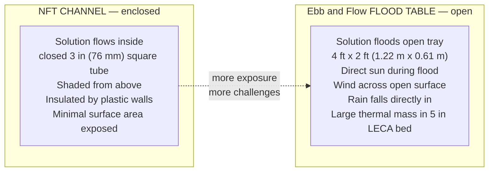
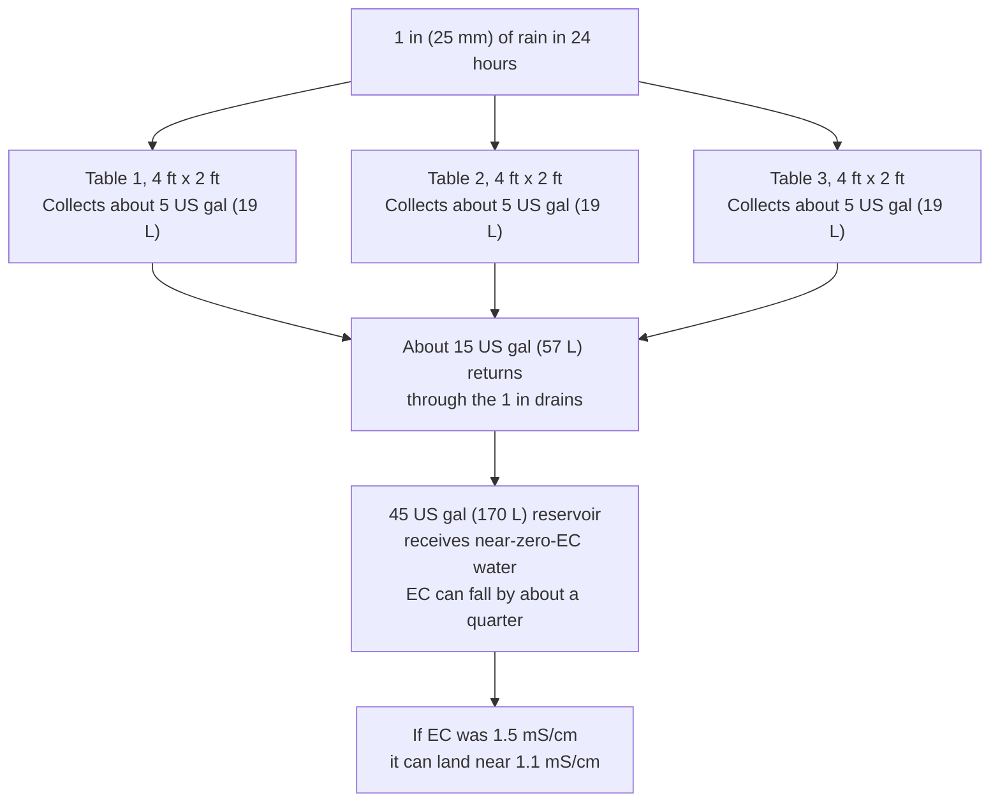

# Guide 10 — Climate Management for Outdoor Ebb & Flow
## Temperature, Heat, Frost, Wind, Rain, and Seasons

[](../../README.md)
[](https://creativecommons.org/licenses/by-nc-sa/4.0/)


---

## Table of Contents

- [1. Why Climate Matters Differently in Ebb & Flow](#1-why-climate-matters-differently-in-ebb-flow)
- [2. Temperature — The Critical Variable](#2-temperature-the-critical-variable)
  - [Solution Temperature Targets](#solution-temperature-targets)
  - [How E&F Tables Respond to Temperature Differently from NFT](#how-ef-tables-respond-to-temperature-differently-from-nft)
  - [Reservoir Thermal Profile — 45 US gal Under-Table](#reservoir-thermal-profile--45-us-gal-under-table)
- [3. Managing Heat — Summer Strategies](#3-managing-heat-summer-strategies)
  - [Shade Cloth for Flood Tables](#shade-cloth-for-flood-tables)
  - [Reservoir Cooling Strategies](#reservoir-cooling-strategies)
  - [Flood Cycle Adjustments for Heat](#flood-cycle-adjustments-for-heat)
- [4. Managing Cold — Frost Protection](#4-managing-cold-frost-protection)
  - [Frost Risk Assessment](#frost-risk-assessment)
  - [Protection Measures](#protection-measures)
  - [Reservoir Freeze Risk — 45 US gal Thermal Mass](#reservoir-freeze-risk--45-us-gal-thermal-mass)
- [5. Wind — The Often-Overlooked Factor](#5-wind-the-often-overlooked-factor)
  - [Wind Effects on Ebb & Flow Specifically](#wind-effects-on-ebb-flow-specifically)
  - [Windbreak Options](#windbreak-options)
- [6. Rain — A Unique Challenge for Open Flood Tables](#6-rain-a-unique-challenge-for-open-flood-tables)
  - [Rain Dilution Mechanisms](#rain-dilution-mechanisms)
  - [Rain Management Strategies](#rain-management-strategies)
- [7. Seasonal Calendar — Outdoor Ebb & Flow (Temperate)](#7-seasonal-calendar-outdoor-ebb-flow-temperate)
  - [Spring (March–May)](#spring-marchmay)
  - [Summer (June–August)](#summer-juneaugust)
  - [Autumn (September–October)](#autumn-septemberoctober)
  - [Winter (November–February)](#winter-novemberfebruary)
- [8. Flood Cycle Frequency by Season and Temperature](#8-flood-cycle-frequency-by-season-and-temperature)
- [9. EC and pH Management by Season](#9-ec-and-ph-management-by-season)
- [10. Emergency Action Plans](#10-emergency-action-plans)
  - [Heatwave Protocol (afternoons holding above 85°F / 29°C)](#heatwave-protocol-afternoons-holding-above-85f--29c)
  - [Frost Warning Protocol (forecast below 37°F / 3°C)](#frost-warning-protocol-forecast-below-37f--3c)
  - [Storm Protocol (Heavy Rain + Wind)](#storm-protocol-heavy-rain-wind)

---


## 1. Why Climate Matters Differently in Ebb & Flow

An NFT system houses nutrient solution in enclosed channels — sheltered, shaded by the channel walls, and flowing continuously. An Ebb & Flow system uses open flood tables: wide, shallow trays exposed to the sky. This fundamental difference in geometry creates a very different climate exposure profile.



Key differences for climate management:

| Factor | NFT | Ebb & Flow |
|---|---|---|
| Surface area exposed to sun/wind | Low (enclosed channels) | High (open 8 sq ft / 0.74 m² per table) |
| Rain ingress risk | Very low | High — rain falls directly into table |
| Wind evaporation | Low | Significant — open surface |
| Thermal mass in grow zone | Very low (thin film) | High — LECA bed holds heat/cold |
| Reservoir position | Usually beside frame | Often under table (different thermal profile) |
| Temperature swings | Rapid (small water volume) | Dampened (LECA acts as thermal buffer) |

These differences mean that an E&F grower in the same backyard as an NFT grower faces significantly more climate management challenges during rain events and heatwaves, but benefits from better thermal buffering during brief cold snaps.

[↑ Back to TOC](#table-of-contents)

---


## 2. Temperature — The Critical Variable

### Solution Temperature Targets

```
  SOLUTION TEMPERATURE TARGETS FOR E&F:

  Target band:       64–72°F (18–22°C)
  Action line:       Above 77°F (25°C). Dissolved oxygen falls and pythium risk rises.
                     Keep the 4 fruiting floods, shorten them, and deploy 40% shade.
                     Do not drop to 2 floods. Do not add a fifth.
  Cold slowdown:     Below 50°F (10°C) growth nearly stops and phosphorus uptake falls.

  KEY TARGETS DIFFER FROM AIR TEMPERATURE:
  Summer afternoon highs in this climate are 90–100°F (32–38°C) in June–August
  (SA: December–February). An under-table reservoir stays cooler than the air.
  The action line is still the solution, not the air: 77°F (25°C).
  Monitor reservoir temperature and, periodically, the LECA near the roots.
```

### How E&F Tables Respond to Temperature Differently from NFT

In NFT, the thin nutrient film in enclosed channels heats and cools rapidly with air temperature. A 86°F (30°C) day can push solution temperature to 82°F (28°C) in hours in an unshaded NFT channel.

In Ebb & Flow, the LECA bed acts as a significant thermal mass:

- **During flood:** LECA absorbs heat from warm flood solution, or gives heat to cool solution
- **Between floods:** LECA surface loses heat by evaporation (cooling effect) and loses or gains from air temperature
- **Net effect:** Temperature changes in the root zone are slower and more damped than in NFT
- **Downside:** When LECA heats up (sustained heatwave), it releases that heat during flood cycles and the table can stay warm even after the air cools

```
  E&F THERMAL BUFFER EFFECT — illustrative values:

  Air temp:      08:00       12:00       15:00       18:00       22:00
                 61°F (16°C) 82°F (28°C) 90°F (32°C) 77°F (25°C) 64°F (18°C)

  NFT solution:  63°F (17°C) 77°F (25°C) 84°F (29°C) 73°F (23°C) 64°F (18°C)  ← Fast response to air
  E&F LECA:      61°F (16°C) 70°F (21°C) 75°F (24°C) 72°F (22°C) 66°F (19°C)  ← Damped by thermal mass
  E&F reservoir: 61°F (16°C) 66°F (19°C) 72°F (22°C) 70°F (21°C) 64°F (18°C)  ← Under-table, most stable

  E&F advantage: peak LECA temperature stays several degrees below peak NFT solution temperature.
  Pythium risk still rises once solution temperature passes 77°F (25°C). That is the action line.
```

### Reservoir Thermal Profile — 45 US gal Under-Table

A 45 US gal (170 L) reservoir (acceptable range 40–50 US gal / 151–189 L) sitting below the drains has a slower thermal swing than a small tank in the sun.

**Under-table placement (recommended):**
- Shaded by the table above — often 7–11°F (4–6°C) cooler than ambient on hot days
- About 375 lb (170 kg) of water is slow to heat or cool
- This buffer helps in summer and in a brief cold snap. It does not make outdoor running safe through December–February (SA: June–August), when winter lows in this band are 0–15°F (−18 to −9°C).

**Beside-table placement:**
- More accessible for maintenance
- More exposed to direct sun if not shaded — can heat faster in summer
- Wrap with reflective bubble wrap insulation or build a shade box if using this placement

[↑ Back to TOC](#table-of-contents)

---


## 3. Managing Heat — Summer Strategies

### Shade Cloth for Flood Tables

Shade cloth is the most cost-effective intervention for both plants and flood table thermal management. For E&F, it serves a double purpose: protecting plant foliage AND reducing table surface heating during flood cycles.

| Shade % | Effect | Best for |
|---|---|---|
| 40% | The cloth for this system. Deploy when afternoon highs hold above 85°F (29°C) | All three tables in a heatwave |

**Deployment:**
- Use a removable shade frame or hoops over the flood tables
- Deploy only from 11:00–16:00 when needed (all-day shade reduces yield unnecessarily)
- If automated: a shade cloth on a timer rail can deploy at a set temperature threshold

**Effect on EC:** Shade cloth reduces evaporation from the open table surface. This means EC rises more slowly on shaded days — adjust top-up frequency accordingly. A 40% shade cloth can reduce evaporative water loss from the table by 30–40%.

### Reservoir Cooling Strategies

```
  RESERVOIR COOLING OPTIONS (in order of cost/effort):

  1. SHADE THE RESERVOIR (cost: $0 / R0)
     If the reservoir sits beside the table, shade it.
     A board or the same 40% cloth can keep direct sun off the tank
     and drop reservoir temperature by 7–11°F (4–6°C).

  2. INSULATE RESERVOIR WALLS (cost: $5–$10 / R90–R180)
     Wrap the reservoir with bubble wrap or a foam camping mat.
     Fix with tape or cable ties. Slows both summer heating and winter cooling.

  3. ICE BOTTLES (freezer cost only, at $0.15/kWh / R2.70/kWh)
     Freeze 2–3 bottles of about ½ US gal (2 L).
     Place 1–2 in the reservoir as solution temperature approaches 77°F (25°C).
     On a 45 US gal (170 L) fill, one frozen bottle typically lowers the tank
     a couple of degrees for a few hours. Rotate bottles.

  4. AQUARIUM CHILLER (cost: $60–$150 / R1,080–R2,700)
     Set it to hold the target band of 64–72°F (18–22°C).
     Most gardens in this climate will not need one if the tank is shaded.

  5. HEATWAVE FLOOD RULE (cost: $0 / R0)
     Keep 4 floods a day. Shorten them if the solution is warm.
     Deploy 40% shade when afternoon highs hold above 85°F (29°C).
     Do not drop from 4 floods to 2. Do not add a fifth flood.
```

### Flood Cycle Adjustments for Heat

One rule for heat. Fruiting crops already flood 4 times a day, and 4 is the ceiling. A heatwave keeps those 4 floods. Shorten each one if you need to. Put 40% shade cloth on when afternoon highs hold above 85°F (29°C). Never schedule a fifth flood. Never use a drop to 2 floods as the heat plan.

```
  FLOODS WHEN THE AIR IS HOT:

  Vegetative crops:   3 floods a day
  Fruiting crops:     4 floods a day, including during a heatwave
  Heatwave example:   06:00 (15 min), 10:00 (15 min),
                      16:00 (15 min), 20:00 (15 min)

  Skip the 12:00–14:00 window. Solution that is already near 72°F (22°C)
  should not be pushed through sun-heated LECA at the hottest hour.
  If solution temperature crosses 77°F (25°C), that is the action line:
  shade, ice bottles, and shorter floods. The flood count stays at 4.
```

[↑ Back to TOC](#table-of-contents)

---


## 4. Managing Cold — Frost Protection

### Frost Risk Assessment

```
  FROST RISK FOR THIS CLIMATE (USDA 6b–7a, about 38°N):

  Planning last spring frost: April 15 (SA: October 15)
  Planning first fall frost:  October 20 (SA: April 20)
  Outdoor season:             mid-April through mid-October
                              (SA: mid-October through mid-April)
  Winter lows in this band:   0–15°F (−18 to −9°C)

  Air temp              Risk        Action
  ────────────────────────────────────────────────────────────────
  41–46°F (5–8°C)       Low         Growth slows
  37–41°F (3–5°C)       Watch       Fleece basil and the fruiting vine
  32–37°F (0–3°C)       Moderate    Fleece all tables. Check solution temperature.
  Below 32°F (0°C)      High        Cover tender crops or end the outdoor season
  0–15°F (−18 to −9°C)  Winter      Do not run the outdoor system.
                                    December–February (SA: June–August) is shutdown.
```

### Protection Measures

**Horticultural fleece:**
- Primary protection for plants; raises effective temperature by 4–7°F (2–4°C)
- Drape over plants and anchor at table edges with clips
- Fleece does NOT protect the reservoir — it insulates plants only
- Multiple layers: each additional layer adds about 2°F (1°C) of protection

**Cloche and cover frames:**
- Polycarbonate or polythene covers over the table on a hoop frame
- Provides 7–14°F (4–8°C) of protection compared with a single fleece layer
- Keeps rain out (secondary benefit — see Section 6)
- Can be ventilated during mild days by lifting one end

**Reservoir heater:**
- A 50–100 W aquarium heater can hold solution near the bottom of the target band during a shoulder-season night
- Cost to run at $0.15/kWh (R2.70/kWh): about $0.01–$0.02 per hour (R0.14–R0.27 per hour)
- Warm solution circulated during a flood also warms the LECA
- Set the thermostat to 64°F (18°C). It only runs when the tank falls below that.
- A heater does not make December–February (SA: June–August) an outdoor season. Winter lows of 0–15°F (−18 to −9°C) are a shutdown.

### Reservoir Freeze Risk — 45 US gal Thermal Mass

A 45 US gal (170 L) fill is slow to freeze compared with a small tank. At 23°F (−5°C) ambient, with no insulation, a tank this size takes many hours to freeze through. Pipes and fittings freeze first.

```
  FREEZING TIME ESTIMATES (at 23°F / −5°C ambient, no insulation):

  Reservoir                         Rough time to freeze
  ─────────────────────────────────────────────────────────
  3 US gal (10 L)                   2–4 hours
  8 US gal (30 L)                   6–10 hours
  21 US gal (80 L)                  16–24 hours
  45 US gal (170 L), this system    30–45 hours

  A single night just below freezing is unlikely to freeze the full
  45 US gal (170 L) tank. Exposed pipes can still split. Drain or
  insulate them if a hard freeze is forecast. Do not leave the system
  outdoors through the winter lows of 0–15°F (−18 to −9°C).

  NOTE: Flood cycle pipes and fittings are more vulnerable than the
  reservoir itself. Any pipe exposed to frost can freeze and crack.
  Insulate exposed pipes or drain them if prolonged freezing is forecast.
```

[↑ Back to TOC](#table-of-contents)

---


## 5. Wind — The Often-Overlooked Factor

### Wind Effects on Ebb & Flow Specifically

Wind has a disproportionately large impact on outdoor Ebb & Flow compared to NFT, for two reasons:

1. **Open table surface evaporation:** Wind passing over an open flood table dramatically increases evaporative water loss. A 12 mph (20 km/h) wind can triple evaporation from the table surface compared with still air. EC rises, and the reservoir needs more top-up.

2. **Desiccation between floods:** In E&F, plants experience a dry period between flood cycles when roots are not in contact with solution. Wind accelerates leaf transpiration during this period, increasing the risk of wilt stress — particularly for leafy crops.

```
  WIND IMPACT ON E&F — QUANTIFIED EXAMPLE:

  Still day (3 mph / 5 km/h), 72°F (22°C):
  → Evaporation from two tables (about 16 sq ft / 1.5 m²): ~0.4 US gal (1.5 L)/day
  → Total daily water loss: about 1–2 US gal (4–7 L)

  Moderate wind (15 mph / 25 km/h), 72°F (22°C):
  → Evaporation from the tables: about 1–1.3 US gal (4–5 L)/day
  → Total daily water loss: about 3–4 US gal (11–15 L)

  Strong wind (30 mph / 50 km/h), 72°F (22°C):
  → Evaporation from the tables: about 2–2.5 US gal (8–10 L)/day
  → Total daily water loss: about 5–7 US gal (18–25 L)

  ACTION: On windy days, top up more often and watch EC.
  If the crop is fruiting, keep 4 floods and shorten them.
  Do not add a fifth flood to "catch up" with the wind.
```

### Windbreak Options

| Option | Effectiveness | Cost | Notes |
|---|---|---|---|
| Fence or wall (existing) | Excellent (100% block) | $0 (R0) | Best if it already stands on the prevailing-wind side |
| Dense hedge (established) | Very good (70–80% wind reduction) | $0–$30 (R0–R540) | Takes 1–2 years to establish |
| Polycarbonate windbreak panel | Good (60–70%) | $20–$40 (R360–R720) | Rigid. Do not block the south face (SA: north face) that the tables look toward |
| 40% shade cloth as a screen | Moderate | $10–$20 (R180–R360) | Same cloth used for heat. Put it on the prevailing-wind side |
| Temporary hessian screen | Moderate (50%) | $5–$15 (R90–R270) | Seasonal. Lasts 2–3 years |

**Wind.** On the central plains the prevailing wind is often from the south or southwest. Put the windbreak on that prevailing-wind side, 3–5 times its own height away from the tables. Closer than that, the screen throws turbulence onto the beds. The site plan also keeps a wind break on the north edge, about 12 in (30 cm) clear of the frame, for the cold north wind. Long-axis of the tables faces south (SA: north).

[↑ Back to TOC](#table-of-contents)

---


## 6. Rain — A Unique Challenge for Open Flood Tables

### Rain Dilution Mechanisms

Rain falling into open flood tables is the most significant climate challenge unique to Ebb & Flow. NFT channels are largely protected from rain ingress by their enclosed design; E&F flood tables are completely exposed.



An inch of rain is a real EC event on these open tables. Two inches (50 mm) dilutes the tank further.

### Rain Management Strategies

**Strategy 1: Monitor and re-dose after rain (simplest)**

No physical modification required. Accept rain dilution as an occasional event. After each rain event:
1. Test EC — if below 0.8 mS/cm, re-dose nutrients to target
2. Test pH — rain is typically slightly acidic (pH 5.5–6.5) which may slightly lower reservoir pH
3. The diluted solution is not harmful — just below target EC. Plants tolerate brief EC dips.

This is enough for a normal summer in this inland band, which has a handful of heavy rain days a month rather than a maritime drizzle season.

**Strategy 2: Simple sloped rain deflectors**

Fit a simple polythene sheet on a slight slope over each table, positioned to deflect rain away from the table surface while allowing the plants to access natural light from the sides.

```
  SLOPED DEFLECTOR DESIGN:

  Frame: Two hoops of ¾ in (20 mm) pipe over the table
  Sheet: Clear polythene about 6 mil (150 µm) draped over the hoops
  Slope: about 15° so rain runs off to one side
  Clearance: Leave a 6–8 in (15–20 cm) gap at each end for airflow and light

  Plant headroom: hoops must clear the canopy by 12–16 in (30–40 cm).
  Table 1 is one indeterminate tomato or one cucumber. A vine that tall
  needs a trellis and its own cover. A table-wide sheet will not clear it.

  CLEAR vs OPAQUE POLYTHENE:
  Clear: allows most light through; risk of greenhouse effect in sun
  Opaque white: diffuses light; cooler; better for leafy greens
  Use clear for fruiting crops (need maximum light); white for greens.
```

**Strategy 3: Partial table covers with open access**

Install permanent covers over roughly 60% of the table surface (particularly over the LECA areas between plants) while leaving plant access holes open. This reduces rain ingress significantly without blocking light to plants.

**Flood cycle adjustment after heavy rain:**

After a heavy rain, the tables may already be at flood depth. Let them drain through the 1 in (25 mm) fittings before the next pump cycle. Skip the next flood if more than ⅜ in (10 mm) fell in an hour. Do not add a flood to "make up" for the skipped one, and do not go to 5 floods the next day.

[↑ Back to TOC](#table-of-contents)

---


## 7. Seasonal Calendar — Inland Mid-USA, about 38°N

Worked climate: USDA zones 6b–7a (Kansas City, St. Louis, Louisville, Richmond). Not the Pacific coast at the same latitude. South African months are a six-month shift of the same season, not a second climate.

Clear-sky DLI: summer 45–55 mol/m²/day, spring and fall 25–35 mol/m²/day, winter 10–15 mol/m²/day. Shade cloth is 40%, deployed when afternoon highs hold above 85°F (29°C).

### Spring — March through May (SA: September through November)

```
  MARCH (SA: SEPTEMBER) — STILL IN STORAGE:
  [ ] Outdoor beds stay empty. Winter lows in this band are 0–15°F (−18 to −9°C)
  [ ] Zone B microgreens can run indoors
  [ ] Order seed and check the pump and the digital timer

  APRIL (SA: OCTOBER) — SEASON OPENS:
  [ ] Planning last spring frost: April 15 (SA: October 15)
  [ ] Outdoor season starts mid-April (SA: mid-October)
  [ ] After that frost date, set Table 3 with lettuce, herbs, or pak choi
  [ ] Vegetative floods: 3 times a day
  [ ] Keep the Table 1 vine and Table 2 pepper, aubergine, or courgette
      indoors until nights hold above 54°F (12°C)

  MAY (SA: NOVEMBER):
  [ ] Plant Table 1: one indeterminate tomato or one cucumber
  [ ] Plant Table 2: one or two pepper, aubergine, or courgette plants
  [ ] Fruiting floods: 4 times a day. That count is the ceiling
  [ ] Face the long axis south (SA: north)
  [ ] 40% shade only if a warm spell holds afternoons above 85°F (29°C)
```

### Summer — June through August (SA: December through February)

```
  JUNE (SA: DECEMBER):
  [ ] Fruiting tables stay at 4 floods. Leafy Table 3 can stay at 3
  [ ] Clear-sky DLI is 45–55 mol/m²/day. Watch for tip burn on lettuce
  [ ] Afternoon highs start toward 90°F (32°C). Have 40% cloth ready
  [ ] Change the 45 US gal (170 L) reservoir every 10–14 days

  JULY (SA: JANUARY):
  [ ] Afternoon highs 90–100°F (32–38°C)
  [ ] Heat rule: keep 4 floods, shorten them, deploy 40% shade above 85°F (29°C)
  [ ] If solution temperature crosses 77°F (25°C), cool the reservoir
  [ ] Top up morning and evening. EC rises from evaporation
  [ ] Hand-pollinate the Table 1 vine and the Table 2 flowers

  AUGUST (SA: FEBRUARY):
  [ ] Same heat rule. Do not add a fifth flood. Do not drop to 2
  [ ] Sow the next Table 3 lettuce for the fall window
  [ ] Remove bolted lettuce and spent basil
```

### Autumn — September through October (SA: March through April)

```
  SEPTEMBER (SA: MARCH):
  [ ] Clear-sky DLI falls toward 25–35 mol/m²/day
  [ ] Fruit still on the vine stays at 4 floods. New leafy plantings stay at 3
  [ ] Fleece nights that fall below 41°F (5°C)

  OCTOBER (SA: APRIL):
  [ ] Planning first fall frost: October 20 (SA: April 20)
  [ ] Outdoor season closes mid-October (SA: mid-April)
  [ ] Harvest the vine and Table 2 before a hard frost
  [ ] Winterise after the last harvest (Guide 08)
```

### Winter — November through February (SA: May through August)

```
  NOVEMBER (SA: MAY):
  [ ] Beds empty, LECA cleaned and stored dry, pump indoors
  [ ] Do not run outdoor ebb and flow through December–February
      (SA: June–August)

  DECEMBER–FEBRUARY (SA: JUNE–AUGUST):
  [ ] Winter lows 0–15°F (−18 to −9°C). Clear-sky DLI 10–15 mol/m²/day
  [ ] Plan next year's one vine, Table 2 crop, and Table 3 succession
  [ ] Zone B can stay indoors under the LED
```

[↑ Back to TOC](#table-of-contents)

---


## 8. Flood Cycle Frequency by Season and Temperature

This table gives recommended flood cycle frequency based on ambient temperature. These are starting points — adjust based on your crops, plant size, and weather conditions.

```
  FLOOD COUNT — ONE RULE:

  Crop stage                         Floods/day   Duration
  ─────────────────────────────────────────────────────────────────
  Winter shutdown                     0            Beds empty
  Vegetative (Table 3, young plants)  3            15–30 min
  Fruiting (Table 1 and Table 2)      4            15–30 min
  Heatwave, fruiting                  4            Shorter, 15 min
  Heatwave extras                     40% shade when afternoons hold above 85°F (29°C)
  Solution above 77°F (25°C)          Still 4      Cool the reservoir. Do not add a 5th
  After heavy rain                    Skip one     Resume the same count the next day
```

Four floods a day is the ceiling. A fifth flood is not a heat strategy and not a recovery strategy. Dropping from 4 to 2 is not the heat plan. Vegetative crops stay at 3. Moist LECA holds a missed flood for 8–24 hours, so one skipped cycle after rain is not an emergency.

[↑ Back to TOC](#table-of-contents)

---


## 9. EC and pH Management by Season

```
  EC TARGETS BY SEASON:

  Season          Leafy Greens/Herbs  Fruiting Crops    Note
  ──────────────────────────────────────────────────────────────────────
  Spring          1.0–1.4             1.4–2.0           Young plants: keep low
  Early Summer    1.2–1.6             2.0–2.8           Increasing demand
  Peak Summer     1.4–1.8             2.5–3.5           Peak growth; watch EC
                                                         spikes from evaporation
  Late Summer     1.2–1.6             2.0–2.5           Slowing growth
  Autumn          1.0–1.4             1.4–2.0           Cool weather = lower demand
  ──────────────────────────────────────────────────────────────────────
  NOTE: In hot weather, EC tends to spike upward from evaporation.
  Your management is primarily DILUTION (adding water) rather than raising EC.
  In cool weather, EC tends to drop as plant uptake slows.
  Your management is primarily TOPPING UP nutrients.

  pH MANAGEMENT:
  Target: 5.8–6.2 year-round. Seasonal adjustments are minor.

  Spring: pH tends to be more stable (less plant metabolic activity, lower
          transpiration, less ion exchange in LECA)

  Summer: pH drifts more aggressively. In hot weather:
          - Plants consume more nitrate → pH rises faster (see Guide 09 A1)
          - Algae growth in open tables (if light reaches solution) raises pH
          - Check and adjust pH daily in peak summer

  Autumn: pH drift slows as plant activity reduces.
          Watch for pH crash in late autumn: decaying root material and
          dying plant tissue release organic acids. Do a full reservoir
          change when you transition to autumn crops.
```

[↑ Back to TOC](#table-of-contents)

---


## 10. Emergency Action Plans

### Heatwave Protocol (afternoons holding above 85°F / 29°C)

```
  THE DAY BEFORE:
  □ Solution temperature should sit in 64–72°F (18–22°C)
  □ If it is already near 77°F (25°C), freeze the ice bottles
  □ Fill the reservoir to the 45 US gal (170 L) operating mark
  □ 40% shade cloth is staged and can go on by mid-morning

  EACH HOT DAY:
  □ Deploy 40% shade when the afternoon will hold above 85°F (29°C)
  □ Fruiting floods stay at 4. Shorten them. Do not add a 12:00 flood
  □ Do not drop the schedule to 2 floods
  □ If solution temperature crosses 77°F (25°C): ice bottles, more shade,
     and a shorter flood. That temperature is the pythium action line
  □ Top up with plain water if EC is at or above target.
     Add nutrient stock only if EC has fallen below target

  THE NEXT MORNING:
  □ Recheck EC and pH
  □ Take the cloth off when afternoons fall back below 85°F (29°C)
  □ Look at roots. Stuck water plus heat is how pythium starts
```

### Frost Warning Protocol (forecast below 37°F / 3°C)

```
  PRE-FROST (afternoon before):
  □ Deploy horticultural fleece over all flood tables before sunset
  □ Close or cover Zone B microgreens shelf if outdoors
  □ If a heater is fitted for a shoulder-season night, set it to 64°F (18°C)
  □ Reduce flood frequency: run a flood cycle just before sunset so
     roots and LECA are warm before overnight
  □ Ensure reservoir has adequate solution (not run low)

  FROST NIGHT:
  □ Do NOT run flood cycles during frost conditions overnight:
     - Exposing flooded roots to freezing conditions via cold solution flow
       is more harmful than leaving roots in insulated LECA
     - Set timer to no-flood from midnight to 07:00 on frost nights
  □ The 45 US gal (170 L) tank usually stays above 50°F (10°C)
     through a single night just below freezing. It will not survive
     a run of 0–15°F (−18 to −9°C) nights. That is shutdown weather.

  FROST MORNING:
  □ Check plants before removing fleece — are they firm and upright?
     If frosted (limp, translucent leaves): do NOT remove fleece immediately.
     Allow slow rewarming under fleece.
  □ If solution temperature is below 57°F (14°C), run one flood to move
     warmer reservoir water into the LECA, then return to 3 or 4 floods
  □ Resume the normal count once air temperature is above 41°F (5°C)

  HARD FROST (below 27°F / −3°C for several nights), OR ANY NIGHT IN THE 0–15°F BAND:
  □ Move all tender plants (tomatoes, peppers, basil) indoors
  □ Drain flood tables completely
  □ Either: drain and store pump indoors; or keep running with heater
    in reservoir to prevent pipe freezing
```

### Storm Protocol (Heavy Rain + Wind)

```
  PRE-STORM (hours before):
  □ Test EC and note baseline reading
  □ Secure all loose items: label sticks, spray bottles, tools
  □ Check shade cloth and covers are secured — wind will tear unsecured covers
  □ If deploying rain deflectors: fit them before rain starts
  □ Leave the flood count alone. If rain is already filling the tables,
     skip the next pump cycle. Do not switch the season to 1 flood a day.

  DURING STORM:
  □ If very heavy rain: consider turning pump OFF temporarily
     Rain alone may flood tables to overflow level → no pump needed during downpour
  □ Monitor overflow fittings — heavy debris in rain can block overflow

  POST-STORM:
  □ Test EC — expect significant drop if heavy rain entered tables
  □ Re-dose nutrients if EC has dropped >0.3 mS/cm below target
  □ Test pH — rain is typically slightly acidic; pH may have dropped
  □ Inspect overflow fittings for debris blockage
  □ Check all fittings for any loosening from wind vibration
  □ Resume normal flood schedule only after confirming tables are fully
     drained from rain water (look for standing water above LECA before
     running a new flood cycle)
```

---


> **Previous:** [Guide 09 — Troubleshooting](./09-troubleshooting.md)
> **Next:** [Guide 11 — Build Guide](./11-build-guide.md)

[↑ Back to TOC](#table-of-contents)

---

<!-- copyright -->
*Copyright (c) 2026 UncleJS. Licensed under [CC BY-NC-SA 4.0](https://creativecommons.org/licenses/by-nc-sa/4.0/) — free to share and adapt for non-commercial purposes with attribution and ShareAlike.*
