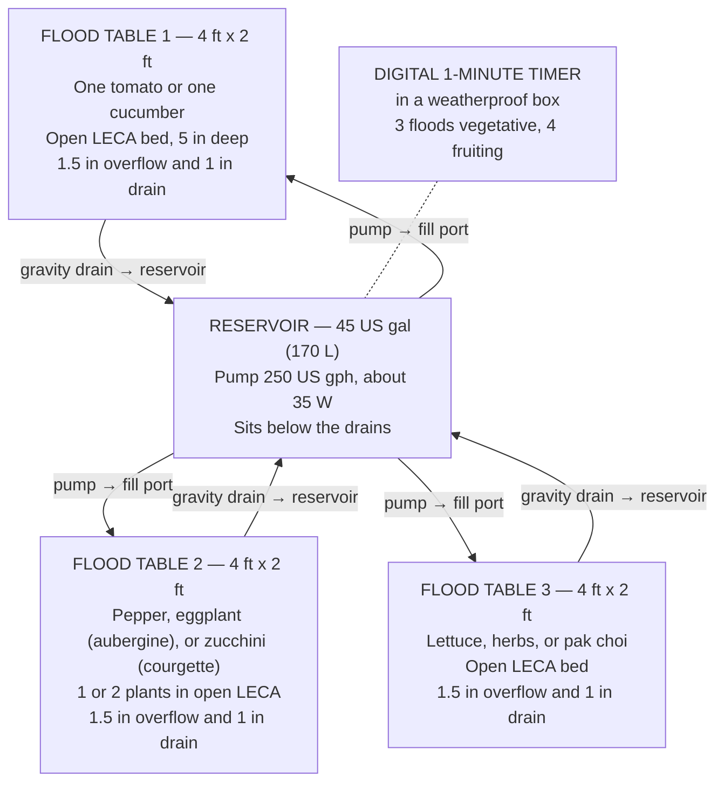
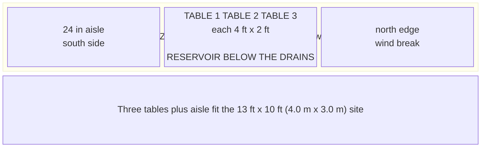
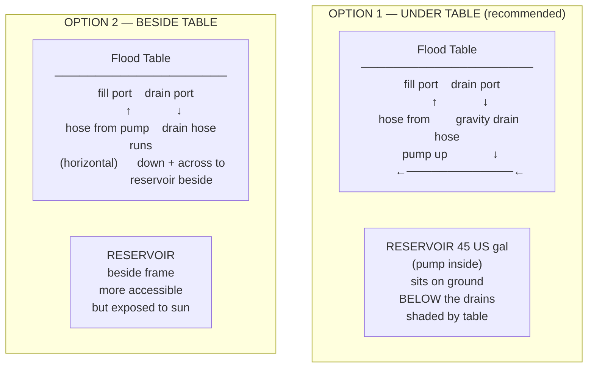
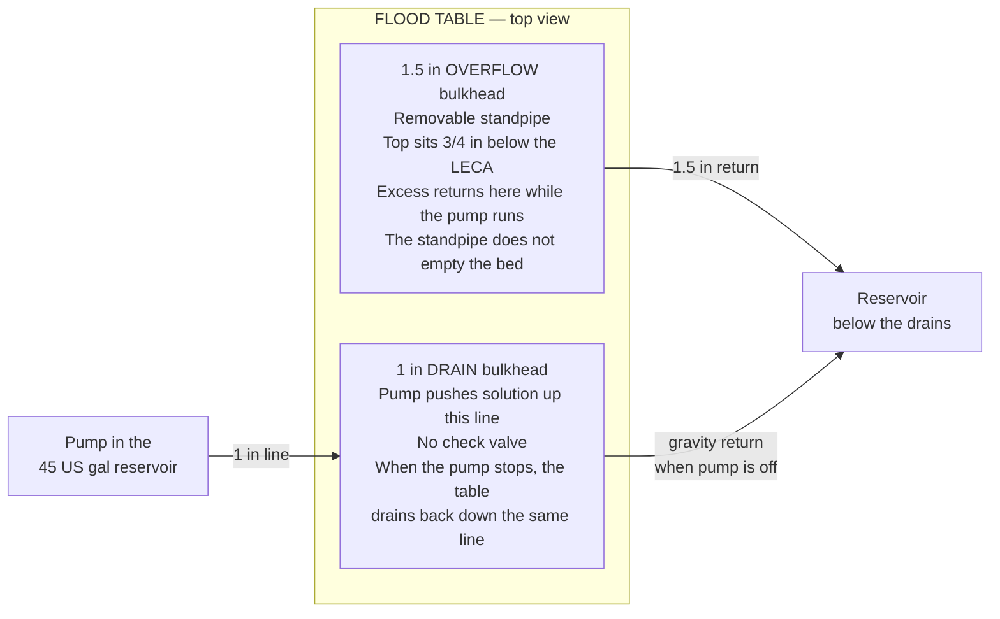
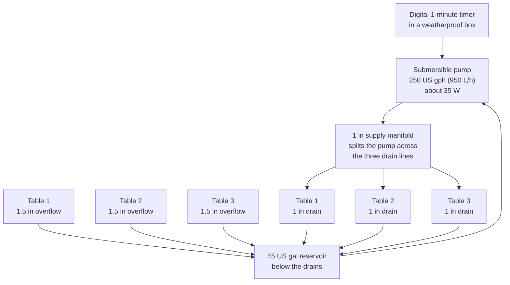
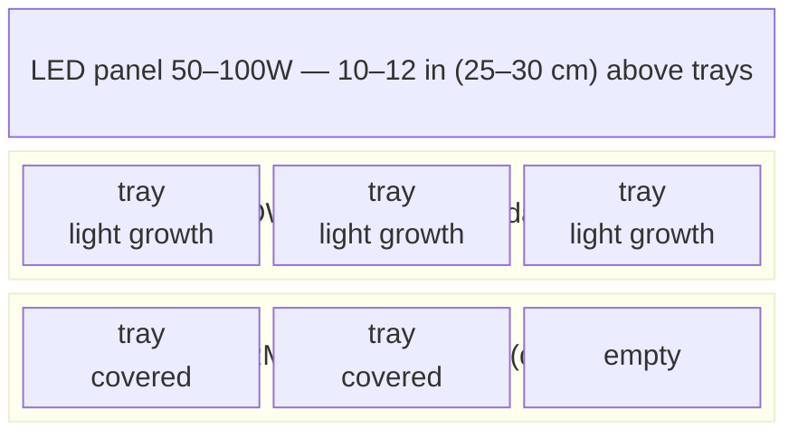

# Guide 11 — Build Guide
## Step-by-Step Instructions for the Outdoor Ebb & Flow System

[](../../README.md)
[](https://creativecommons.org/licenses/by-nc-sa/4.0/)


---

## Table of Contents

- [1. System Overview Recap](#1-system-overview-recap)
- [2. Tools Required](#2-tools-required)
  - [Essential Tools](#essential-tools)
  - [Useful But Optional](#useful-but-optional)
- [3. Safety and Prep Notes](#3-safety-and-prep-notes)
- [4. Step 1 — Site Preparation](#4-step-1-site-preparation)
  - [4.1 Site Selection Criteria](#41-site-selection-criteria)
  - [4.2 Orientation](#42-orientation)
  - [4.3 Marking Out](#43-marking-out)
- [5. Step 2 — Building or Sourcing the Flood Tables](#5-step-2-building-or-sourcing-the-flood-tables)
  - [Option A — Buy a Ready-Made Flood Table](#option-a-buy-a-ready-made-flood-table)
  - [Option B — DIY Timber + Pond Liner Table](#option-b-diy-timber-pond-liner-table)
  - [Levelling the Tables](#levelling-the-tables)
- [6. Step 3 — Reservoir Setup and Positioning](#6-step-3-reservoir-setup-and-positioning)
  - [Under-Table vs. Beside-Table Reservoir](#under-table-vs-beside-table-reservoir)
  - [Reservoir Preparation](#reservoir-preparation)
- [7. Step 4 — Installing Overflow and Drain Fittings](#7-step-4-installing-overflow-and-drain-fittings)
  - [The Two-Fitting System Explained](#the-two-fitting-system-explained)
  - [Setting Flood Depth with Overflow Height](#setting-flood-depth-with-overflow-height)
  - [Installing Bulkhead Fittings](#installing-bulkhead-fittings)
- [8. Step 5 — Plumbing](#8-step-5-plumbing)
  - [Plumbing Overview Diagram](#plumbing-overview-diagram)
  - [Supply Side (Pump to Tables)](#supply-side-pump-to-tables)
  - [Drain Side (Tables to Reservoir)](#drain-side-tables-to-reservoir)
  - [Pipe Sizing Reference](#pipe-sizing-reference)
- [9. Step 6 — Timer Setup](#9-step-6-timer-setup)
  - [Mechanical vs Digital Timer](#mechanical-vs-digital-timer)
  - [Setting Flood Times](#setting-flood-times)
  - [Testing the Timer](#testing-the-timer)
- [10. Step 7 — System Test (Water Only)](#10-step-7-system-test-water-only)
  - [Water Test Procedure](#water-test-procedure)
  - [Common Test Failures and Fixes](#common-test-failures-and-fixes)
- [11. Step 8 — Media Preparation](#11-step-8-media-preparation)
  - [Rinsing and Pre-Soaking LECA](#rinsing-and-pre-soaking-leca)
  - [Filling Tables with LECA](#filling-tables-with-leca)
- [12. Step 9 — First Nutrient Solution Fill](#12-step-9-first-nutrient-solution-fill)
- [13. Step 10 — Planting](#13-step-10-planting)
  - [Transplanting Seedlings into LECA](#transplanting-seedlings-into-leca)
  - [Spacing by Crop](#spacing-by-crop)
  - [First 48 Hours Protocol](#first-48-hours-protocol)
- [14. Step 11 — Zone B Microgreens Station](#14-step-11-zone-b-microgreens-station)
  - [Materials](#materials)
  - [Seeding and Watering](#seeding-and-watering)
- [15. Step 12 — Zone C Root Veg Grow Bags](#15-step-12-zone-c-root-veg-grow-bags)
  - [Materials](#materials)
  - [Media Mix](#media-mix)
  - [Direct Sowing](#direct-sowing)
- [16. Common Build Mistakes and How to Avoid Them](#16-common-build-mistakes-and-how-to-avoid-them)
  - [Mistake 1 — Table Not Level](#mistake-1-table-not-level)
  - [Mistake 2 — Overflow Standpipe Too High](#mistake-2-overflow-standpipe-too-high)
  - [Mistake 3 — Overflow Standpipe Too Low](#mistake-3-overflow-standpipe-too-low)
  - [Mistake 4 — Drain Too Slow (Drain Pipe Undersized or Running Flat)](#mistake-4-drain-too-slow-drain-pipe-undersized-or-running-flat)
  - [Mistake 5 — Reservoir Positioned at Same Height as Table Drain](#mistake-5-reservoir-positioned-at-same-height-as-table-drain)
  - [Mistake 6 — Skipping the Water Test](#mistake-6-skipping-the-water-test)
  - [Mistake 7 — Using a Mechanical Timer Outdoors](#mistake-7-using-a-mechanical-timer-outdoors)
  - [Mistake 8 — LECA Not Pre-Rinsed and Pre-Soaked](#mistake-8-leca-not-pre-rinsed-and-pre-soaked)
- [17. Build Checklist](#17-build-checklist)


[↑ Back to TOC](#table-of-contents)

## 1. System Overview Recap

Before building, confirm the full three-zone system you are constructing:

**Zone A — Ebb & Flow Tables**



**Zone B — Microgreens Station**


**Zone C — Root Veg Grow Bags**


**System specifications:**
- 3 flood tables, each 4 ft × 2 ft (1.22 m × 0.61 m), perfectly level. Long axis faces south (SA: north).
- Table 1: one indeterminate tomato or one cucumber. Table 2: pepper, eggplant (aubergine), or zucchini (courgette), 1–2 plants. Table 3: lettuce, herbs, pak choi, or a later fruiting crop.
- Media: LECA, 5 in (13 cm) deep. 25 US gal (95 L) per table. Buy 90 US gal (340 L) for the system so rinse loss is covered.
- Flood level: about ¾ in (2 cm) below the LECA surface, set by the 1½ in (40 mm) overflow standpipe.
- Drain: a separate 1 in (25 mm) bulkhead on each table. The pump fills through this line and, with no check valve, the table drains back down it when the pump stops.
- Flood duration: 15–30 minutes. Vegetative: 3 times a day. Fruiting: 4 times a day. Four is the ceiling.
- Reservoir: 45 US gal (170 L), range 40–50 US gal (151–189 L), below the drains.
- Pump: 250 US gph (950 L/h), range 200–300 US gph (760–1,140 L/h), about 35 W (range 25–45 W).
- Timer: digital, 1-minute resolution, in a weatherproof box. Not a mechanical timer.
- These are open LECA beds. There is no table lid and no net-pot holes drilled in a lid.

Estimated total build time: **8–12 hours** spread over 2–3 weekends.


---


[↑ Back to TOC](#table-of-contents)

## 2. Tools Required

### Essential Tools

| Tool | Purpose | Notes |
|---|---|---|
| Tape measure | All measurements | Steel, 16 ft (5 m) minimum |
| Pencil / marker | Marking cut lines | Permanent marker for PVC and liner |
| Spirit level | Setting table level | Critical — tables MUST be level for E&F |
| Handsaw or circular saw | Cutting timber frame | Or mitre saw for accuracy |
| Jigsaw | Cutting liner and PVC sheet | Needed for DIY table construction |
| Electric drill | Pilot holes, screwing frame | 10–18V cordless |
| Step drill / hole cutter | Bulkhead holes in the table floor | 1½ in (40 mm) overflow and 1 in (25 mm) drain. No lid, so no net-pot hole saw |
| Screwdriver (flat + Philips) | Assembly | Or drill bits |
| Adjustable spanner | Tightening bulkhead lock nuts | Or large slip-joint pliers |
| Rubber mallet | Seating fittings and bulkheads | Avoids cracking plastic |
| Utility knife / Stanley knife | Cutting pond liner | Sharp blade; use with steel rule |
| Sandpaper (120 grit) | Deburring all cut edges | Prevents root snags |
| Bucket (10 L) | Mixing, testing, cleaning | |
| Silicone sealant gun | Sealing bulkhead flanges | With aquatic/pond-safe silicone |
| Safety glasses | All cutting operations | Non-negotiable |
| Work gloves | Handling liner and fittings | Liner can have sharp edges |

### Useful But Optional

| Tool | Why useful |
|---|---|
| Mitre saw | Clean, accurate timber cuts for table frame |
| Digital level / angle finder | Precise level verification |
| Cable ties (bag of 100) | Securing hoses, tidying wiring |
| Heat gun | Bending any PVC pipe if needed |
| Pipe cutters, ¾–1½ in (19–40 mm) | Clean cuts on supply and drain pipe |
| Wheel (hand truck / trolley) | Moving the filled reservoir when maintenance required |


---


[↑ Back to TOC](#table-of-contents)

## 3. Safety and Prep Notes

1. **Wear safety glasses for all cutting.** Timber and PVC generate chips; liner trimming produces sharp edges.
2. **Test the system with plain water before nutrient solution.** This catches all leaks before they cost anything.
3. **Outdoor power is a 120 V GFCI outlet (SA: 230 V, on a 30 mA earth-leakage breaker).** The digital timer sits in a weatherproof box. Use an outdoor-rated lead.
4. **Use only food-safe materials** in contact with nutrient solution:
   - HDPE, LDPE, or HDPE containers — ✅
   - EPDM pond liner — ✅ (food safe grade)
   - PVC irrigation pipe — ✅
   - EPDM rubber gaskets/grommets — ✅
   - Galvanized metal in contact with solution — ❌ (zinc toxicity)
   - Copper fittings or pipe — ❌ (copper toxicity to roots)
   - Timber treated with creosote or oil-based preservatives — ❌ (leaches toxins)
   - Pressure-treated timber in contact with solution — ❌
5. **Tables MUST be perfectly level.** Unlike NFT channels (which need a precise slope), E&F tables must be level to ensure even flood distribution and complete drainage. An unlevel table creates a permanently wet low corner — a Pythium incubator.
6. **Reservoir must be LOWER than the table drain outlet.** Gravity is the drain mechanism. If the drain port on the table is below reservoir water level, siphon drainage will not occur and the drain will fail.


---


[↑ Back to TOC](#table-of-contents)

## 4. Step 1 — Site Preparation

### 4.1 Site Selection Criteria

```
  SITE EVALUATION CHECKLIST

  □ Sunlight: Does the spot receive ≥6 hours direct sun per day?
    → Leafy greens: 4–6 h acceptable
    → Tomatoes/peppers: 6–8 h required

  □ Proximity to power: 120 V outdoor GFCI within 30 ft (9 m)?
    (SA: 230 V outlet on a 30 mA earth-leakage breaker.)
    → Outdoor-rated leads are fine if they stay dry

  □ Proximity to water: Can you fill a 45 US gal (170 L) reservoir without a long carry?
    → Hose access preferred

  □ Level ground: Is the ground reasonably flat?
    → Tables require precise levelling — your frame/support must provide this
    → If ground has >5° slope, plan for deeper legs on the uphill side

  □ Drainage: Will overflow and drain runoff water drain away?
    → Avoid positioning tables over sealed paving with no drain
    → Excess solution runoff and overflow must be able to soak away or drain

  □ Reservoir clearance below the table: the tank sits below the drains.
    → A 45 US gal (170 L) tank is often about 20–24 in (51–61 cm) tall.
      Leave that height under the table, plus a little room to lift the lid.

  □ Accessibility: the beds are open LECA, 2 ft (0.61 m) wide.
    → A comfortable standing height for the table top is 30–36 in (76–91 cm).
    → You can reach the middle of a 2 ft bed from one side.
```

### 4.2 Orientation

Face the long axis south (SA: north). On the central plains the prevailing wind is often from the south or southwest, so keep a windbreak on that side. The site plan also puts a wind break on the north edge, about 12 in (30 cm) clear of the frame.

- Leave a 24 in (61 cm) working aisle on the south side
- The reservoir sits below the drains, where you can still lift the lid

### 4.3 Marking Out

Mark out the full footprint before building:




---


[↑ Back to TOC](#table-of-contents)

## 5. Step 2 — Building or Sourcing the Flood Tables

The flood table is the heart of the E&F system. You have two options: buy a purpose-made flood table (easier but more expensive) or build a DIY timber + pond liner table (cheaper, customisable, more work).

### Option A — Buy a Ready-Made Flood Table

**What to look for:**
- Food-grade polypropylene or ABS plastic construction
- Pre-drilled or moulded fill port and drain port positions
- Raised border to contain flood water (at least 4 in (10 cm) deep internal dimension)
- Flat, level base (check with a spirit level in-store if possible)
- Size: 4 ft × 2 ft (1.22 m × 0.61 m). That is the table in this build.

| Type | Typical cost | Notes |
|---|---|---|
| Economy PP flood tray | $25–$40 (R450–R720) each | Functional; walls at least ⅛ in (3 mm); UV stability varies |
| Mid-range dedicated hydro flood table | $45–$70 (R810–R1,260) each | Better UV stability; often includes fittings |
| Premium (commercial grade) | $80–$150 (R1,440–R2,700) each | Permanent installations; thick walls |

**Ready-made table preparation:**
1. Inspect for any cracks or thin spots before purchasing
2. Confirm fitting port positions are suitable for your plumbing layout
3. If pre-drilled: confirm port sizes match your bulkhead fittings
4. If no pre-drilled ports: drill yourself with a step drill (see Step 4)

### Option B — DIY Timber + Pond Liner Table

A DIY table is cheaper than buying ready-made and allows custom sizing. The key is a watertight pond liner inside a sturdy timber frame.

**Materials for one 4 ft × 2 ft (1.22 m × 0.61 m) table:**

| Component | Specification | Notes |
|---|---|---|
| Timber — sides (long) | 2× 1×6 board, 6 in × 1 in × 4 ft (150 mm × 25 mm × 1.22 m) | 6 in side gives room for 5 in (13 cm) of LECA |
| Timber — sides (short) | 2× 1×6 board, 6 in × 1 in × 2 ft (150 mm × 25 mm × 0.61 m) | |
| Timber — base support | 3× 2×2, 2 in × 2 in × 2 ft (50 mm × 50 mm × 0.61 m) | Ribs about every 16 in (40 cm) |
| Plywood base | 1× ⅜ in (9 mm) exterior ply, 4 ft × 2 ft | Sits on the ribs |
| Pond liner | 1× EPDM or PVC, about 5 ft 8 in × 3 ft 8 in (1.73 m × 1.12 m) | Overlap all sides |
| Liner tape | 1× roll pond liner tape | For sealing overlap joints |
| Exterior timber preservative | water-based | Coat all external timber surfaces |

**Table frame assembly:**

```
  ASSEMBLY SEQUENCE:

  1. Cut timber to length. Sand all edges.

  2. Assemble the box frame:
     → Two long sides (48 in / 1,200 mm) + two short sides (24 in / 600 mm)
     → Use 3 in (75 mm) wood screws at each corner (2 screws per corner)
     → Apply PVA wood glue at every joint before screwing
     → Check frame is square: measure both diagonals — must be equal

  3. Attach base support ribs:
     → Three 2 in × 2 in (50 × 50 mm) cross-supports at 16 in (400 mm) spacing
     → Screw from outside long face into rib ends
     → Ribs must be flush with or slightly below the bottom edge of frame

  4. Fit plywood base:
     → Lay ⅜ in (9 mm) ply on the support ribs
     → Screw or nail ply to ribs at 6 in (150 mm) spacing (prevents bow when flooded)
     → Check with spirit level — ply must be flat

  5. Treat exterior timber:
     → Apply water-based wood preservative to all EXTERNAL surfaces
     → Do not apply to internal surfaces that will contact pond liner

  6. Allow preservative to dry fully before fitting liner
```

**Pond liner installation:**

```
  LINER INSTALLATION:

  1. Measure and cut liner: table internal width + 2× (depth + 4 in / 10 cm overlap)
     Example: 48 in × 24 in (1200 × 600 mm) table, 6 in (150 mm) deep:
     Liner size: (1200 + 2×(150+100)) = 1,700 mm × (600 + 2×(150+100)) = 1,100 mm
     Cut: about 67 in × 43 in (1,700 × 1,100 mm)

  2. Lay liner centrally in the table box, pressing it into the base corners.
     Take care to fold corners neatly (like wrapping a present — diagonal fold,
     not a bunched gather). Each corner fold should be flat and tight.

  3. The liner extends up all four sides and over the top edge of the timber.
     Use stainless steel staples (NOT galvanized) to tack the liner over
     the top edge of the timber frame. Space staples 4 in (100 mm) apart.

  4. Apply pond liner tape over the stapled edge on top of the timber.
     This protects the liner edge from UV and prevents it lifting.

  5. Fill the table with plain water to check for pooling in corners.
     Any pooled corners indicate the liner has not seated flat — press
     it flat and re-fold. Drain and recheck before fitting fittings.
```

### Levelling the Tables

**This is the most critical step in E&F table construction.** An unlevel table creates:
- Uneven flood distribution (one end deeper than the other)
- Pooling in the low corner after drain (never fully drains)
- Roots in the low corner perpetually wet — Pythium develops rapidly

```
  LEVELLING PROCEDURE:

  1. Place table on its support structure (table legs, workbench, stand,
     or reservoir-top platform)

  2. Place a spirit level across the width (short axis): should read level.
     Adjust support under whichever end is high.

  3. Place spirit level across the length (long axis): should read level.
     Adjust further.

  4. Check both axes again after any adjustment (adjusting one axis
     often affects the other).

  5. Confirm level with the table loaded: partially fill with water.
     Water surface should reach all four corners at the same moment
     when a thin flood is running.

  6. For fine adjustment: use shims (thin plastic strips, folded card,
     rubber pads) under the table support legs.

  7. Once level: mark each leg position with a pencil mark on the
     ground or stand surface so you can re-check quickly after any
     disturbance.

  TARGET: within 1/16 in (2 mm) across the 4 ft (1.22 m) length
```


---


[↑ Back to TOC](#table-of-contents)

## 6. Step 3 — Reservoir Setup and Positioning

### Under-Table vs. Beside-Table Reservoir



| Factor | Under-table | Beside-table |
|---|---|---|
| Gravity drain | Excellent — straight down | Good — needs careful routing |
| Temperature stability | Better — shaded by table | Worse — in open air |
| Maintenance access | Harder — crawl under | Easy — stand beside |
| Space efficiency | Better — no extra footprint | Worse — adds about 2 ft (60 cm) to width |
| Pump head height | Less (shorter lift to table) | More (pump lifts through longer route) |

**Recommendation:** Under-table for temperature benefits and space efficiency. Build the table support frame tall enough to leave 24–28 in (60–70 cm) clearance below the table base.

### Reservoir Preparation

1. **Choose a food-grade HDPE container** of 45 US gal (170 L), in the range 40–50 US gal (151–189 L). A low rectangular tank, about 32 in × 24 in × 20 in (81 cm × 61 cm × 51 cm), fits under the tables more easily than a tall barrel.

2. **Prepare lid access points:**
   - Pump power cable exit: ½ in (12 mm) slit (not round hole — allows cable out but resists water ingress)
   - Supply pipe outlet: ¾ in (20 mm) hole for pump output hose going to table fill ports
   - Fill/inspection port: 6 in (150 mm) circular hole with a loose-fitting cap for EC/pH sampling, top-ups, and cleaning without removing the full lid
   - Air pump tube entry (optional): ⅜ in (8 mm) hole

3. **Light-proof the reservoir:**
   Wrap exterior with black polythene sheet, then a layer of white reflective bubble wrap insulation over the top. Black inner layer blocks light (prevents algae); white outer layer reflects solar heat (keeps solution cool). Secure with tape or cable ties.

4. **Mark fill levels:**
   With the reservoir in position and filled to operating level (leave about 4 in (10 cm) from top), mark the external wall with permanent marker at the waterline. Add about 2.5 US gal (10 L) increment marks going down. This lets you track daily consumption at a glance.

5. **Install pump:**
   Place the submersible pump on the reservoir floor. Route the power cable through the lid. Connect the 1 in supply hose to the pump outlet. The pump stays submerged — mark the minimum waterline 2 in (5 cm) above the pump on the outside of the 45 US gal (170 L) tank.


---


[↑ Back to TOC](#table-of-contents)

## 7. Step 4 — Installing Overflow and Drain Fittings

### The Two-Fitting System Explained

Every flood table has two floor fittings, and they are not the same size.



**1 in (25 mm) drain:** One bulkhead per table, in the floor. The pump fills the table through this line. There is no check valve, so when the pump stops the bed empties back down the same line into the reservoir.

**1½ in (40 mm) overflow:** One bulkhead and a removable standpipe per table, also in the floor, at the opposite end. The top of the standpipe is the flood ceiling, about ¾ in (2 cm) below the LECA surface. While the pump runs, anything above that lip returns to the reservoir. The standpipe does not drain the bed below its lip. The 1 in line does that.

### Setting Flood Depth with Overflow Height

```
  OVERFLOW STANDPIPE HEIGHT:

  LECA depth: 5 in (13 cm)
  Flood ceiling: about ¾ in (2 cm) below the LECA surface
  Standpipe height above the table floor: 5 in − ¾ in = 4¼ in (11 cm)

  Capillary action wets the top ¾ in. The waterline stays below the
  surface so the pebbles do not float and algae has less light.

  NOTES:
  1. Mark 4¼ in (11 cm) on the standpipe with a permanent marker.
     After cleaning, put it back to that mark.

  2. The standpipe must be removable: you should be able to lift it out
     to do media flushes and table cleaning.

  3. Label the standpipe height with a permanent marker on the tube
     so you can return to the same setting after cleaning.

  4. Too tall (at or above the LECA surface): media fully submerged,
     LECA floats, surface algae, anaerobic conditions → root rot
  5. Too short: only the bottom of the bed is wetted → insufficient hydration
```

### Installing Bulkhead Fittings

Each table needs one 1½ in (40 mm) overflow bulkhead and one 1 in (25 mm) drain bulkhead. Three tables need three of each. They are not six identical 1 in fittings.

```
  BULKHEAD FITTING INSTALLATION PROCEDURE:

  Materials:
  - 1× 1½ in (40 mm) bulkhead and standpipe per table (overflow)
  - 1× 1 in (25 mm) bulkhead per table (drain / fill return)
  - EPDM or PTFE flat washers (one per fitting face)
  - Pond-safe silicone sealant
  - Step drill or appropriate hole cutter

  Steps:

  1. MARK FITTING POSITIONS:
     1 in drain: near one short end, in the table floor
     1½ in overflow: opposite end or the opposite corner, also in the floor
     Both holes are in the bottom. A side-wall hole will not drain the bed.

  2. DRILL THE HOLE:
     Step-drill to the bulkhead body, not to the pipe's nominal bore.
     A 1 in (25 mm) bulkhead usually wants about a 1¼ in (32 mm) hole.
     A 1½ in (40 mm) bulkhead wants a larger hole. Test-fit before silicone.

  3. PREPARE THE FITTING:
     Slide the rubber/EPDM washer onto the fitting body (this goes
     between the fitting flange and the table surface, inside the table).

  4. INSERT FITTING:
     Push fitting body through hole from INSIDE the table.
     The flange and washer sit inside the table, against the table floor.

  5. APPLY SILICONE:
     Apply a bead of pond-safe silicone around BOTH the inside flange
     (between washer and table floor) and the outside face of the fitting
     where the lock nut will seat.

  6. FIT LOCK NUT:
     Thread the lock nut onto the fitting body from the OUTSIDE.
     Hand-tighten first, then use an adjustable spanner to tighten a
     further ¾ turn. Do NOT overtighten — overtightening cracks the
     table base or the fitting body.

  7. CURE:
     Allow silicone to cure for 24 hours before testing.

  8. FOR THE OVERFLOW PORT SPECIFICALLY:
     Install the bulkhead fitting as above.
     Then thread or push-fit the overflow standpipe into the fitting
     from inside the table. The standpipe should be removable.
     Use a rubber grommet if the standpipe is loose in the fitting.
```


---


[↑ Back to TOC](#table-of-contents)

## 8. Step 5 — Plumbing

### Plumbing Overview Diagram



### Supply Side (Pump to Tables)

The pump pushes solution from the reservoir to all three flood tables simultaneously. The pump must be able to fill all tables to overflow within the flood cycle time (typically 5–10 min for a 15–30 min cycle).

**Flow rate calculation:**

```
  PUMP SIZING FOR 3 TABLES:

  Each table: 4 ft × 2 ft (1.22 m × 0.61 m)
  LECA: 5 in (13 cm). Standpipe: 4¼ in (11 cm)
  Free water to flood one table to the standpipe: about 8–10 US gal (30–38 L)
  Three tables: about 25–30 US gal (95–114 L) per flood

  RESERVOIR CHECK (45 US gal / 170 L fill):
  45 − 30 = about 15 US gal (57 L) still in the tank at full flood.
  The pump stays submerged. The acceptable tank range is 40–50 US gal
  (151–189 L). Below 40 US gal the pump can suck air on a full flood.

  PUMP:
  250 US gph (950 L/h), range 200–300 US gph (760–1,140 L/h).
  About 35 W (range 25–45 W).
  At roughly 20 in (50 cm) of lift, a pump at the low end of that range
  still fills all three tables inside a 15–30 minute flood.
  A ball valve on each branch evens the three tables if one fills first.
```

**Supply plumbing assembly:**

1. Connect the pump outlet to 1 in (25 mm) hose.
2. Split that hose with two 1 in tees, or one 3-way manifold, so each table has its own branch.
3. Each branch connects to that table's 1 in (25 mm) drain bulkhead. No check valve.
4. Clip every barb.
5. Keep the runs short and the bends gentle.

**Flow rate balancing:**
If one table fills much faster than the others (due to hose length differences — the table nearest the pump usually fills first), add a small in-line ball valve on each faster table's supply branch. Throttle until all three tables fill at roughly equal rates.

### Drain Side (Tables to Reservoir)

When the pump stops, solution returns down the 1 in (25 mm) line by gravity. The 1½ in (40 mm) overflow only carries water while the pump is running and the level is at the standpipe lip.

**Critical requirements:**
- Drain hose must slope continuously downhill from table drain port to reservoir entry — no flat or uphill sections
- Drain hose must be large enough to empty all three tables in <30 minutes

**Assembly:**

1. The 1 in (25 mm) drain line from each table runs downhill all the way to the reservoir. That same line is the fill line.
2. The 1½ in (40 mm) overflow on each table has its own return hose, also downhill, into the reservoir.
3. Under the table, both hoses drop almost straight down.
4. If the reservoir sits beside the tables, keep every run falling. A flat section holds a puddle in the pipe.
5. Both returns can splash into the open reservoir. The splash adds oxygen.

### Pipe Sizing Reference

| Application | Size | Notes |
|---|---|---|
| Pump to manifold | 1 in (25 mm) | Match the pump outlet |
| Manifold to each table drain | 1 in (25 mm) | Keep each branch under 5 ft (1.5 m) |
| Overflow standpipe and its return | 1½ in (40 mm) | One per table. Sets the flood ceiling |
| Drain / fill return | 1 in (25 mm) | One per table. Empties the bed when the pump stops |


---


[↑ Back to TOC](#table-of-contents)

## 9. Step 6 — Timer Setup

### Mechanical vs Digital Timer

| Type | Pros | Cons | Role in this build |
|---|---|---|---|
| Mechanical pin timer | Cheap, about $5–$10 (R90–R180) | 30-minute pins. Cannot run a 15-minute flood cleanly. A stuck pin holds the pump on | Not the outdoor timer |
| Digital timer, 1-minute steps | Multiple programs. Battery keeps the schedule through a power cut | About $10–$20 (R180–R360) | This is the outdoor timer. It lives in a weatherproof box |
| Smart plug | Cuts pump power if the pump runs too long (stuck-ON), then alerts | Needs WiFi, and a weatherproof box | Required Tier 1 cutoff. See Guide 13. It does not replace the digital timer |

**Recommendation:** Digital timer, 1-minute resolution, in a weatherproof box, on a 120 V outdoor GFCI (SA: 230 V, 30 mA earth-leakage). A mechanical timer is not the outdoor control. A pump stuck ON rots roots in 2–4 hours. The Guide 13 drain float opens the pump relay if the float is still up after the pump should be off.

### Setting Flood Times

```
  FLOOD PROGRAMS:

  VEGETATIVE (Table 3, and any young transplant):
  3 floods a day. Example: 07:00, 12:00, 18:00, 20 minutes each.

  FRUITING (Table 1 vine, Table 2):
  4 floods a day. Example: 06:30, 10:00, 15:30, 20:00.
  Keep the midday gap. See Guide 10.

  HEATWAVE (afternoons above 85°F / 29°C):
  Still 4 floods. Shorten them to about 15 minutes.
  Example: 06:00, 10:00, 16:00, 20:00.
  Add 40% shade. Do not add a 05:00 fifth flood.
  Do not drop the day to 2 floods.

  DURATION:
  - Long enough for the water to reach the 1½ in standpipe, plus about 5 minutes.
  - Stop by 30 minutes.
  - Four floods a day is the ceiling.
```

### Testing the Timer

Before any nutrient solution is involved, test the timer with plain water:
1. Set timer to activate in 5 minutes (for test)
2. Confirm pump turns on and table floods to overflow depth
3. Confirm pump turns off after the set duration
4. Confirm table drains fully within 30 minutes of pump stopping
5. After confirming this cycle works: set the actual operational schedule


---


[↑ Back to TOC](#table-of-contents)

## 10. Step 7 — System Test (Water Only)

**Do not add nutrients until the water test is complete and passes all checks.**

### Water Test Procedure

```
  FULL WATER TEST SEQUENCE

  Step 1: Fill the reservoir with plain tap water to 45 US gal (170 L)
    → Pump must be fully submerged — verify before powering on

  Step 2: Power on pump manually (bypass timer — direct plug)
    → Listen: pump should hum quietly, no grinding or air-sucking
    → Watch all three fill ports: water should appear within 30 seconds

  Step 3: Observe flood rising in all three tables
    → Are the tables flooding at roughly equal rates?
    → If one fills much faster: throttle that table's supply valve

  Step 4: Watch overflow operation
    → When flood level reaches overflow standpipe top: water should
      exit via drain hose. If level continues rising: standpipe is not
      seated correctly or drain hose is blocked.
    → Flood depth at overflow: measure with ruler against the table
      floor (no LECA yet). It should match your standpipe height —
      about 4¼ in (11 cm) for a 5 in (13 cm) LECA bed
      (¾ in / 2 cm below the surface). Adjust standpipe if needed.

  Step 5: Check all joints for leaks for 10 full minutes
    → Fill port bulkhead: inner and outer flange
    → Overflow/drain bulkhead: inner and outer flange
    → All hose connections
    → Reservoir supply and return connections
    → Mark any drips with tape. Drain table. Dry. Reseal. Retest.

  Step 6: Check drain operation
    → Power off pump
    → Table should begin draining immediately via gravity through drain hose
    → Time to fully drain (LECA not yet in table — just open table):
       should be <10 minutes for an empty table
    → With LECA in table, drain time increases to 15–25 minutes (acceptable)
    → If no drain occurs: check drain hose is sloping downhill; check
      drain hose is not blocked; check reservoir is positioned lower than
      table drain port

  Step 7: Run 2 full flood/drain cycles on plain water
    → Each cycle: flood to overflow, wait 5 min, power off, wait for full drain
    → Inspect joints again after second cycle
    → No leaks = pass

  Step 8: Discard test water
    → Plain water has picked up any manufacturing residue from new fittings
    → Rinse reservoir, all hoses, and table surfaces once with clean water
    → System is now ready for media and nutrient fill
```

### Common Test Failures and Fixes

| Problem observed | Likely cause | Fix |
|---|---|---|
| No flow at fill port | Pump not primed; valve closed | Confirm pump is submerged; check no hose kinked |
| One table fills, other does not | Hose to second table kinked or disconnected | Re-route hose; check all connections |
| Flood level exceeds standpipe height | Standpipe not seated; overflow drain blocked | Reseat standpipe in bulkhead grommet; clear drain |
| Leak at bulkhead flange | Silicone not cured; lock nut too loose or too tight | Remove, re-silicone, allow 24h; retighten to 3/4 turn past hand-tight |
| No gravity drain | Drain hose running uphill at some point | Re-route drain hose with continuous downhill slope |
| Drain very slow (>45 min) | Drain hose too small; standpipe partially blocking drain bore | Use 1 in (25 mm) drain hose matching the design bulkhead; ensure standpipe doesn't block drain fitting exit |
| Pump noisy / grinding | Running dry; debris in impeller | Ensure fully submerged; clean impeller |


---


[↑ Back to TOC](#table-of-contents)

## 11. Step 8 — Media Preparation

### Rinsing and Pre-Soaking LECA

New LECA (clay pebbles) comes coated in fine clay dust and often has a slightly alkaline pH (8.0–9.0). This must be washed out before use — failing to do so will cause immediate pH spikes in your reservoir.

```
  LECA PREPARATION PROCEDURE:

  Each table is 4 ft × 2 ft (1.22 m × 0.61 m), filled 5 in (13 cm) deep.
  That is 25 US gal (95 L) of LECA per table.
  Three tables are 75 US gal (284 L).
  Buy 90 US gal (340 L). The extra covers dust and pebbles lost in the rinse.

  RINSING STEPS:

  1. Fill a clean bucket or large tub with LECA (max half full)
  2. Add tap water to cover the LECA by 4 in (10 cm)
  3. Stir vigorously for 2 minutes — water turns reddish-brown
  4. Drain through a colander or mesh bag
  5. Repeat until rinse water runs mostly clear (typically 4–6 rinses)

  PRE-SOAKING:
  After rinsing, soak LECA in pH-adjusted water for 24 hours:
  Fill bucket with rinsed LECA and add pH-adjusted water (pH 5.5–6.0).
  This pre-charges the LECA pores with water and begins neutralizing
  the alkaline clay surface.

  FINAL CHECK:
  After 24h soak, measure pH of soaking water.
  If >7.0: continue soaking with fresh pH-adjusted water for another 12h.
  If 6.0–7.0: acceptable — proceed to table filling.
```

### Filling Tables with LECA

1. After passing the water test and rinsing LECA, drain the test water from the reservoir.
2. These are open beds. There is no lid and no ring of holes to drop pots through. Set any net pots into the LECA after the bed is in, or nest them as you pour.
3. Pour pre-soaked LECA to 5 in (13 cm). Leave about 1 in (3 cm) of wall above the pebbles.
4. Level the LECA surface — gently rake with fingers to distribute evenly.
5. Run one test flood cycle to confirm LECA doesn't pile up on one side (the table is level) and drain returns correctly with LECA in place. Observe drain time — add 5 min to plain-table drain time (LECA slows drain slightly due to surface tension).
6. Confirm the 1½ in overflow standpipe sits about ¾ in (2 cm) below the LECA surface (see [Setting Flood Depth with Overflow Height](#setting-flood-depth-with-overflow-height)).


---


[↑ Back to TOC](#table-of-contents)

## 12. Step 9 — First Nutrient Solution Fill

After a successful water test and LECA installation, mix the first nutrient batch.

**First fill is the vegetative base**, aimed at about 1.4–1.6 mS/cm. Per 1 US gal (3.8 L): 2.4 g Masterblend 4-18-38, 2.4 g calcium nitrate, 1.2 g Epsom salt (0.63 / 0.63 / 0.32 g/L). For the 45 US gal (170 L) reservoir:

| Component | Amount for 45 US gal (170 L) | Rate |
|---|---|---|
| Masterblend 4-18-38 | 108 g | 2.4 g/US gal (0.63 g/L) |
| Calcium nitrate | 108 g | 2.4 g/US gal (0.63 g/L) |
| Epsom salt | 54 g | 1.2 g/US gal (0.32 g/L) |

> **Note:** This is the vegetative base. Raise or lower the whole recipe together when the crop needs a different EC. Keep the ratio. The 2.4 g figure is per US gallon, which is 0.63 g per liter.

**Mixing order (always in this sequence — never mix Stock A and B together in concentrate):**
1. Fill the reservoir with about 43 US gal (163 L) of water already in the pH 5.8–6.2 band. The two mixing buckets bring it to 45 US gal (170 L).
2. In a separate bucket, dissolve Calcium Nitrate in about ½ US gal (2 L) of water. Stir until clear. Pour into reservoir.
3. In the same bucket (rinsed), dissolve Masterblend in about ½ US gal (2 L) of water. Stir until clear. Pour into reservoir.
4. Add Epsom Salt directly to reservoir and stir.
5. Measure EC. The vegetative base should land near 1.4–1.6 mS/cm. Adjust the whole recipe up or down if it does not.
6. Measure pH — adjust to 5.8–6.0 with pH Down or pH Up.
7. Start pump. Run one complete flood cycle and drain. EC and pH will shift slightly as LECA interacts with new solution — re-test after first flood cycle and adjust again.
8. Record in logbook: date, EC, pH, reservoir level, nutrient recipe used.


---


[↑ Back to TOC](#table-of-contents)

## 13. Step 10 — Planting

### Transplanting Seedlings into LECA

LECA is an open, free-draining medium. Seedlings raised in rockwool cubes, coco plugs, or Rapid Rooters transplant easily into LECA.

```
  TRANSPLANT PROCEDURE:

  1. Select net pot for the crop:
     2 in (50 mm) net pots: lettuce, herbs, spinach, kale, basil, strawberries
     3 in (75 mm) net pots: tomatoes, peppers
     4 in (100 mm) net pots: cucumbers (large root system)

  2. Moisten the seedling plug/cube before handling.

  3. Place the seedling plug in the bottom of the net pot.
     The plug should fit snugly — if too small, add a small handful
     of rinsed LECA around it to stabilize.

  4. Fill around the plug with rinsed, pre-soaked LECA.
     Pack gently — not compressed, but not rattling loose.
     The LECA holds the plug and provides structure.

  5. Nest the filled net pot into an open LECA pocket in the bed
     (no lid holes). Scoop a pocket, set the pot in, and backfill
     LECA around the rim so the pot rim sits flush with the LECA
     surface or just above. The base of the net pot must stay in
     LECA contact — not hanging in open air (roots need capillary moisture).

  6. After planting all seedlings, start the vegetative flood schedule:
     3 floods per day, 15–30 minutes each, at the design flood level
     (about ¾ in / 2 cm below the LECA surface). The first cycle wets
     the bed and lets you check that every net pot stays seated
     (flood turbulence can dislodge unsecured pots).
```

### Spacing by Crop

| Crop | Net pot spacing | Net pot size | Notes |
|---|---|---|---|
| Lettuce (butterhead) | 8–10 in (20–25 cm) | 2 in (50 mm) | Dense spacing OK for cut-and-come |
| Lettuce (romaine) | 10 in (25 cm) | 2 in (50 mm) | Needs more space for full head |
| Spinach | 6 in (15 cm) | 2 in (50 mm) | Can be dense; harvest frequently |
| Kale | 10 in (25 cm) | 2 in (50 mm) | Grows large — allow space |
| Basil | 8 in (20 cm) | 2 in (50 mm) | Pinch flowers to keep productive |
| Chives / Parsley | 6 in (15 cm) | 2 in (50 mm) | Multiple plants per pot acceptable |
| Cherry tomatoes | 16–24 in (40–60 cm) | 3 in (75 mm) | Tall vertical growth — trellis needed |
| Peppers | 14–18 in (35–45 cm) | 3 in (75 mm) | Moderate height; trellis helpful |
| Cucumbers | 18–24 in (45–60 cm) | 4 in (100 mm) | Very vigorous; allow maximum space |
| Strawberries | 10–12 in (25–30 cm) | 2–3 in (50–75 mm) | Runners can be trained or removed |

### First 48 Hours Protocol

```
  FIRST 48 HOURS POST-TRANSPLANT:

  Hour 0 (transplant):
  □ All seedlings planted in pre-soaked LECA net pots
  □ Solution EC: 1.0–1.2 (gentler for transplant stress)
  □ Solution pH: 5.8–6.0
  □ Start the vegetative schedule: 3 floods per day from this point
  □ First flood at design level (¾ in / 2 cm below LECA surface)

  Hour 6:
  □ Check plants — mild wilting is normal (transplant shock)
  □ Mist foliage gently with plain water if wilting is significant
  □ Check no net pots have shifted position

  Hour 24:
  □ Confirm the 3× schedule is running (do not add a fourth or fifth cycle)
  □ Check EC and pH — record in logbook
  □ Plants should be recovering — wilting reducing

  Hour 48:
  □ Roots should be extending into LECA below the net pot
  □ Stay on 3 floods per day while roots establish
  □ Move to 4× only after a fruiting crop is established. Four is the ceiling
  □ If still wilting 30 minutes after a completed flood: check pot seating,
    EC, and shade — do not add an extra flood cycle
  □ After day 3: gradually increase EC to standard target over 1 week
```

---


[↑ Back to TOC](#table-of-contents)

## 14. Step 11 — Zone B Microgreens Station

This zone is identical to the NFT system Zone B and is not affected by the E&F system's flood/drain mechanics.

### Materials

| Item | Qty | Notes |
|---|---|---|
| Seedling trays, 10 in × 20 in (25 cm × 50 cm) | 6 | Standard 1020 trays |
| Solid tray liners | 6 | Bottom watering |
| Coco coir | Enough for 1–1¼ in (2.5–3 cm) in each tray | Standard crops get pH-adjusted water only |
| Shelving unit | 1 | 24 in × 20 in (61 cm × 51 cm), two tiers, about 36 in (91 cm) tall |
| LED grow panel (50–100 W) | 1 | Full-spectrum; 10–12 in (25–30 cm) above the trays |
| Timer | 1 | 16h on / 8h off for LED panel |
| Spray bottle | 1 | For initial surface moisture at sowing |
| Watering can (fine rose) | 1 | For bottom watering after germination |

### Seeding and Watering

1. Expand coco coir brick with 5–6 L water; mix to moist but not dripping consistency.
2. Fill the solid liner to 1–1¼ in (2.5–3 cm). Level and lightly firm the surface. Standard crops get pH-adjusted water only, pH 5.8–6.2, no nutrients. Sunflower and pea shoots may use EC 0.4–0.8 mS/cm if the grow runs long.
3. Pre-soak large seeds (sunflower, peas) for 8–12 h.
4. Spread seeds densely and evenly — touching but not piled.
5. Cover with inverted solid tray as blackout lid for 2–4 days.
6. Once sprouts lift the lid: move to LED panel under 16h light cycle.
7. Mist twice a day. After germination you can also bottom-water with about ⅜ in (1 cm) in the outer tray.
8. Harvest when the cotyledons are fully open, 2–3 in (5–8 cm) tall.




---


[↑ Back to TOC](#table-of-contents)

## 15. Step 12 — Zone C Root Veg Grow Bags

### Materials

| Item | Qty | Notes |
|---|---|---|
| Fabric grow bags, 5 US gal (19 L) | 3 | Two for radish, one for beet (beetroot) |
| Fabric grow bags, 10 US gal (38 L) | 3 | Carrot |
| Coco coir | 60% of the mix by volume | No garden soil |
| Perlite | 30% by volume | |
| Vermiculite | 10% by volume | |
| Drip trays / saucers | 6 | Catch runoff |
| Watering can (fine rose) | 1 | |

### Media Mix

```
  ZONE C MIX (by volume, same ratio in every bag):

  Component          Proportion
  ─────────────────────────────
  Coco coir          60%
  Perlite            30%
  Vermiculite        10%
  Garden soil        none
```

A 5 US gal (19 L) bag takes about 3 US gal (11 L) coco, 1½ US gal (6 L) perlite, and ½ US gal (2 L) vermiculite. A 10 US gal (38 L) bag takes double. Fertigation EC stays at or below 2.0 mS/cm. Beet (beetroot) does not get a higher target. Moisten dry coco before it goes in the bag. Fill to about 1 in (3 cm) from the top.

### Direct Sowing

Root vegetables do not transplant well — sow seeds directly into the bags.

- **Radishes** (two 5 US gal bags): ⅜ in (1 cm) deep, 1 in (3 cm) apart. Harvest 25–35 days. Planning yield 15 lb (6.8 kg).
- **Beetroot** (one 5 US gal bag): ¾ in (2 cm) deep, 2 in (5 cm) apart. Thin to one plant per 4 in (10 cm). Planning yield 8 lb (3.6 kg).
- **Carrots** (three 10 US gal bags): ⅜ in (1 cm) deep, 1–2 in (3–5 cm) apart. Thin to 2 in (5 cm). Planning yield 20 lb (9.1 kg).

Zone C planning total is 43 lb (20 kg). **Watering:** if the top ¾ in (2 cm) is dry, water until a little drains. Keep fertigation at or below 2.0 mS/cm.


---


[↑ Back to TOC](#table-of-contents)

## 16. Common Build Mistakes and How to Avoid Them

### Mistake 1 — Table Not Level

**What happens:** Solution pools in one corner during flood. That corner never fully drains. Roots in the low corner sit in permanent water — anaerobic conditions develop within days. Pythium follows.

**Prevention:** Check level across both axes with a spirit level before fitting any fittings. Recheck after LECA is added (weight can shift level slightly). Use shims under table support legs for fine adjustment. Re-verify level at the start of each season.

### Mistake 2 — Overflow Standpipe Too High

**What happens:** Solution floods table too deeply, completely submerging the LECA and roots. Roots are denied oxygen during the long period roots are submerged. Even if the table eventually drains, the reduced dry time causes progressive root suffocation and Pythium onset.

**Prevention:** Set the 1½ in standpipe so the waterline is about ¾ in (2 cm) below the LECA surface, 4¼ in (11 cm) off the floor in a 5 in bed. Do not raise it to the pebble surface.

### Mistake 3 — Overflow Standpipe Too Low

**What happens:** The table floods only the bottom inch of a 5 in (13 cm) bed. Roots higher in the LECA never see water.

**Prevention:** The standpipe top sits about ¾ in (2 cm) below the top of the LECA, not a token inch off the floor. Capillary action wets the layer above the waterline.

### Mistake 4 — Drain Too Slow (Drain Pipe Undersized or Running Flat)

**What happens:** Table empties but takes 45–60 minutes to drain fully. In a 4× per day schedule, the table is still draining when the next flood cycle starts. Eventually the table is wet most of the time. Root rot follows.

**Prevention:** Keep the drain at 1 in (25 mm) all the way to the reservoir, falling the whole way. The overflow is 1½ in (40 mm) and is not the drain. After the LECA is in, the bed should be empty within 30 minutes of the pump stopping.

### Mistake 5 — Reservoir Positioned at Same Height as Table Drain

**What happens:** Gravity drain stops working. When the pump turns off, solution in the drain hose cannot flow because it has nowhere to go — the reservoir entry point is at the same height. The table retains a permanent layer of solution at the drain fitting level.

**Prevention:** The reservoir water surface stays at least 8 in (20 cm) below the table drain. Under the table, that happens on its own. Beside the table, measure it before you commit to the layout.

### Mistake 6 — Skipping the Water Test

**What happens:** LECA is installed, nutrients are mixed, plants are planted — and then a bulkhead fitting weeps, dripping nutrient solution onto the ground. Or a drain hose runs uphill at one point, creating a trap that never drains. Problems that plain-water testing would have caught in minutes cause days of remediation.

**Prevention:** Always complete the full water test (Step 7) before adding LECA or nutrients. Run two full flood/drain cycles. Inspect every joint.

### Mistake 7 — Using a Mechanical Timer Outdoors

**What happens:** A mechanical pin timer is not the outdoor control. A stuck pin, or a power cut that leaves the pin on, holds the pump on. Roots start to rot in 2–4 hours.

**Prevention:** Use the digital 1-minute timer in a weatherproof box, on the 120 V outdoor GFCI (SA: 230 V, 30 mA earth-leakage). Unplug the timer and plug it back in. The program should still be there. The primary automatic safety, in Guide 13, opens the pump relay if the drain float is still up after the pump should be off. A second timer that only restarts a stopped pump does not fix a stuck-ON flood.

### Mistake 8 — LECA Not Pre-Rinsed and Pre-Soaked

**What happens:** Unrinsed LECA introduces fine clay dust into the solution (brown murk), and the alkaline surface of new LECA causes immediate pH spikes to 7.5–8.0. Young transplants show stress within 24 hours.

**Prevention:** Rinse LECA until water runs mostly clear (4–6 wash cycles). Soak in pH-adjusted water for 24 hours. Test soak-water pH before using LECA — it should be below 7.0.


---


[↑ Back to TOC](#table-of-contents)

## 17. Build Checklist

Use this as a final sign-off before moving to nutrient operation.

```
  ZONE A — EBB & FLOW TABLES

  SITE AND STRUCTURE:
  □ Site selected; sunlight and access confirmed
  □ Table support structure built or confirmed level
  □ All three tables positioned and levelled (spirit level across both axes)
  □ Level re-verified after support structure weighted

  TABLE FABRICATION (DIY) OR SOURCE (BOUGHT):
  □ Timber frame built and preservative-treated (if DIY)
  □ Pond liner fitted and folded at corners (if DIY)
  □ No pooling in corner test confirmed (if DIY)

  FITTINGS:
  □ 1 in (25 mm) drain bulkhead fitted on each table; silicone cured 24 h; no weeping
  □ 1½ in (40 mm) overflow bulkhead fitted on each table; silicone cured 24 h; no weeping
  □ Overflow standpipe at 4¼ in (11 cm), about ¾ in (2 cm) below a 5 in LECA bed
  □ Three overflow fittings and three drain fittings. Not six identical 1 in bulkheads

  RESERVOIR:
  □ Reservoir food-grade; light-proofed (wrapped black + white)
  □ Reservoir positioned correctly (below or beside table)
  □ Reservoir drain outlet LOWER than table drain port ✓
  □ Pump installed in reservoir; power cable exited through lid
  □ Fill level marks drawn on reservoir exterior
  □ Minimum pump submersion level marked

  PLUMBING:
  □ 1 in supply: pump → manifold → each table's 1 in drain (no check valve)
  □ 1½ in overflow return from each table, downhill into the reservoir
  □ Both runs fall the whole way. No flat sections
  □ No hose kinks; all barbed connections seated and clipped

  TIMER AND ELECTRICS:
  □ Digital 1-minute timer in a weatherproof box
  □ Timer on a 120 V outdoor GFCI (SA: 230 V, 30 mA earth-leakage)
  □ Initial flood schedule programmed and verified
  □ Timer settings survive power-off test (unplug → replug → check)

  WATER TEST:
  □ Reservoir filled with plain water to operating level
  □ Pump runs and all three tables flood (even rate)
  □ Flood reaches overflow standpipe and holds at correct depth
  □ All joints and bulkheads inspected — no leaks after 10 min
  □ Table drains completely within 30 min of pump off
  □ Two complete flood/drain cycles completed without issues
  □ Test water discarded; reservoir rinsed

  MEDIA AND NUTRIENTS:
  □ LECA rinsed (water ran clear) and pre-soaked 24h
  □ LECA soak-water pH below 7.0 before using
  □ Open bed: no lid, no net-pot holes drilled in a lid
  □ LECA filled to 5 in (13 cm) and levelled. Bought volume is 90 US gal (340 L)
  □ Flood/drain test with LECA in place completed
  □ Drain time with LECA in place: <30 min ✓
  □ EC and pH meters calibrated (not just rinsed — calibrated)
  □ First nutrient batch is the vegetative base (2.4 g + 2.4 g + 1.2 g per US gal): EC ______; pH ______
  □ One post-nutrient flood cycle completed; EC/pH re-tested

  PLANTING:
  □ Seedlings transplanted into net pots with LECA
  □ First 48-hour protocol running
  □ Flood schedule set to correct seasonal frequency

  ZONE B — MICROGREENS STATION:
  □ Shelving unit assembled and positioned
  □ LED panel mounted and timer set (16h on / 8h off)
  □ First trays filled with coco and in blackout stage

  ZONE C — ROOT VEG BAGS:
  □ Two 5 US gal radish bags, one 5 US gal beet bag, three 10 US gal carrot bags
  □ Mix is 60% coco, 30% perlite, 10% vermiculite. No garden soil. EC ceiling 2.0 mS/cm
  □ Bags in drip trays, on permeable surface
  □ First seeds sown direct

  GENERAL:
  □ Daily monitoring schedule confirmed (Guide 08)
  □ Logbook started (date, EC, pH, flood schedule, reservoir level)
  □ Spare pump ordered or sourced
  □ Spare bulkhead fittings (2× per table type) on hand
  □ Spare overflow standpipes (2×) labeled with correct height
  □ Timer battery backup tested
  □ Shade cloth and frost fleece ready to deploy
```

---


> **Previous:** [Guide 10 — Climate Management](./10-climate-management.md)


[↑ Back to TOC](#table-of-contents)

> **Next:** [Guide 12 — Budget and Sourcing](./12-budget-and-sourcing.md)


---

<!-- copyright -->
*Copyright (c) 2026 UncleJS. Licensed under [CC BY-NC-SA 4.0](https://creativecommons.org/licenses/by-nc-sa/4.0/) — free to share and adapt for non-commercial purposes with attribution and ShareAlike.*
