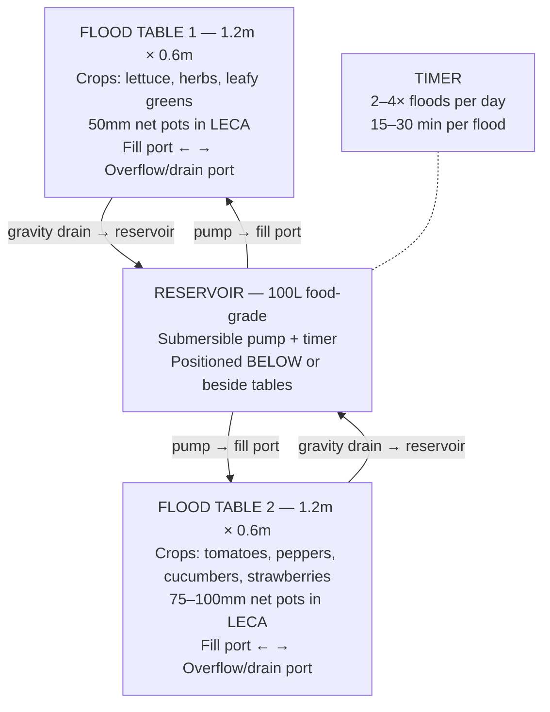
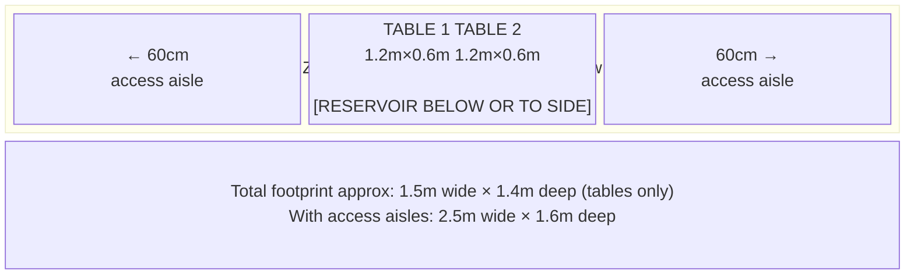
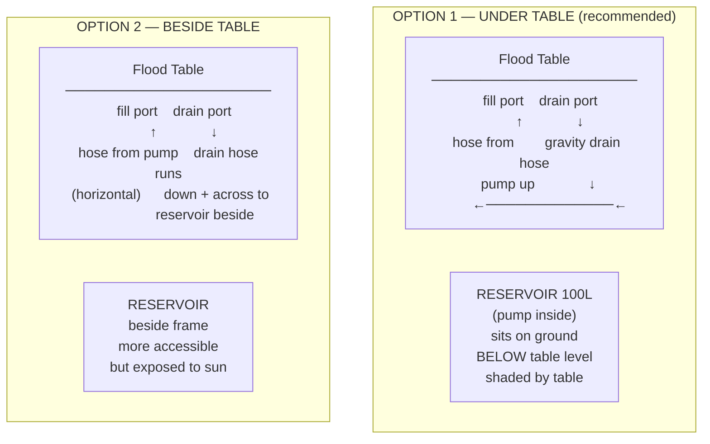
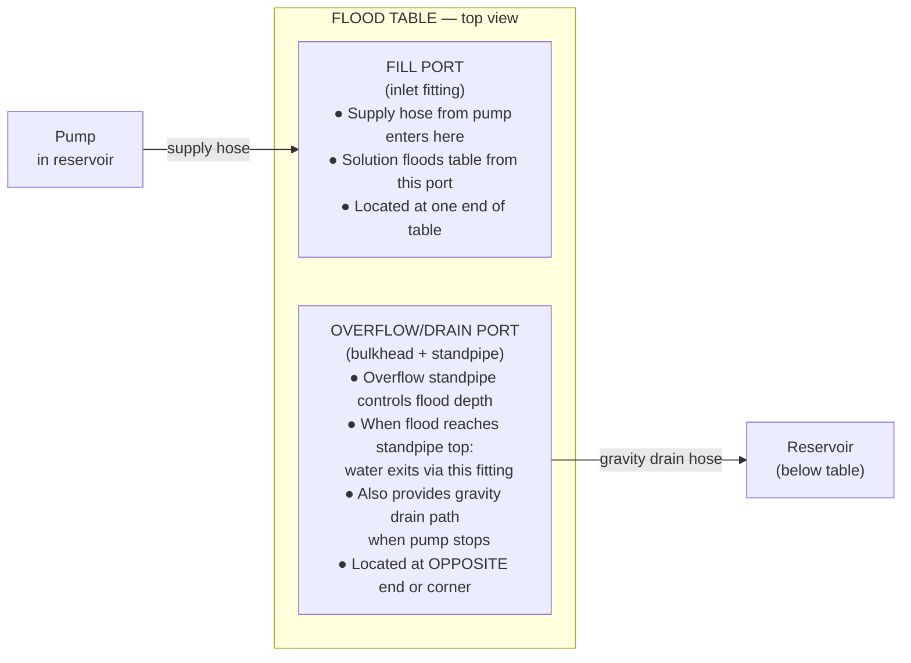
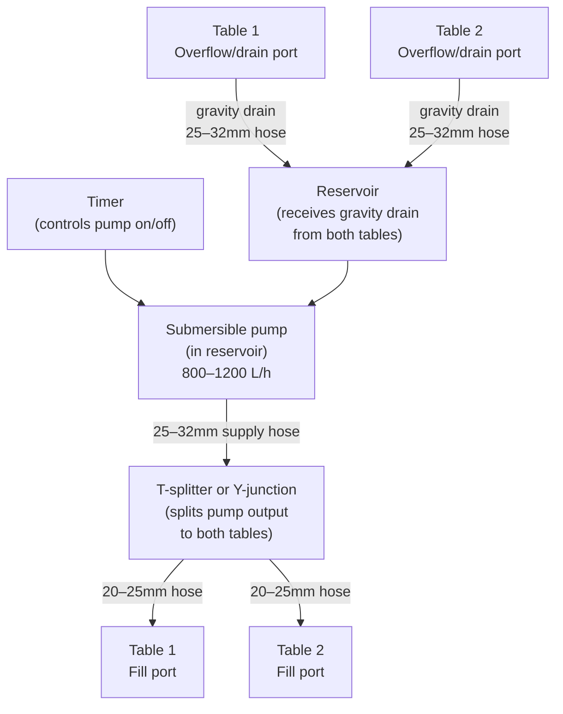
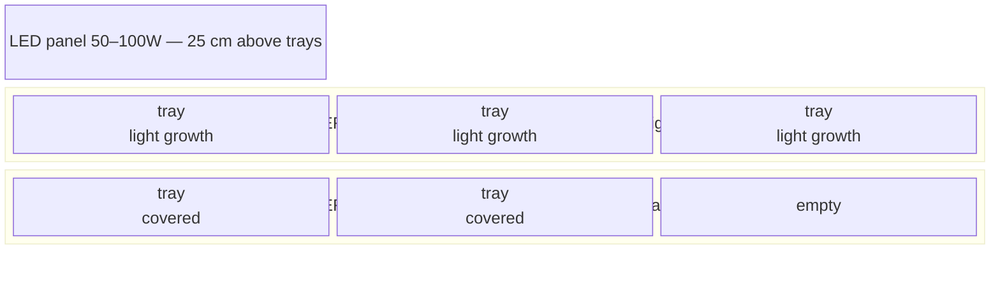

# Guide 11 — Build Guide
## Step-by-Step Instructions for the Outdoor Ebb & Flow System

---

## Table of Contents

- [1. System Overview Recap](#1-system-overview-recap)
- [2. Tools Required](#2-tools-required)
  - [Essential Tools](#essential-tools)
  - [Useful But Optional](#useful-but-optional)
- [3. Safety and Prep Notes](#3-safety-and-prep-notes)
- [4. Step 1 — Site Preparation](#4-step-1-site-preparation)
  - [4.1 Site Selection Criteria](#41-site-selection-criteria)
  - [4.2 Orientation](#42-orientation)
  - [4.3 Marking Out](#43-marking-out)
- [5. Step 2 — Building or Sourcing the Flood Tables](#5-step-2-building-or-sourcing-the-flood-tables)
  - [Option A — Buy a Ready-Made Flood Table](#option-a-buy-a-ready-made-flood-table)
  - [Option B — DIY Timber + Pond Liner Table](#option-b-diy-timber-pond-liner-table)
  - [Levelling the Tables](#levelling-the-tables)
- [6. Step 3 — Reservoir Setup and Positioning](#6-step-3-reservoir-setup-and-positioning)
  - [Under-Table vs. Beside-Table Reservoir](#under-table-vs-beside-table-reservoir)
  - [Reservoir Preparation](#reservoir-preparation)
- [7. Step 4 — Installing Overflow and Drain Fittings](#7-step-4-installing-overflow-and-drain-fittings)
  - [The Two-Fitting System Explained](#the-two-fitting-system-explained)
  - [Setting Flood Depth with Overflow Height](#setting-flood-depth-with-overflow-height)
  - [Installing Bulkhead Fittings](#installing-bulkhead-fittings)
- [8. Step 5 — Plumbing](#8-step-5-plumbing)
  - [Plumbing Overview Diagram](#plumbing-overview-diagram)
  - [Supply Side (Pump to Tables)](#supply-side-pump-to-tables)
  - [Drain Side (Tables to Reservoir)](#drain-side-tables-to-reservoir)
  - [Pipe Sizing Reference](#pipe-sizing-reference)
- [9. Step 6 — Timer Setup](#9-step-6-timer-setup)
  - [Mechanical vs Digital Timer](#mechanical-vs-digital-timer)
  - [Setting Flood Times](#setting-flood-times)
  - [Testing the Timer](#testing-the-timer)
- [10. Step 7 — System Test (Water Only)](#10-step-7-system-test-water-only)
  - [Water Test Procedure](#water-test-procedure)
  - [Common Test Failures and Fixes](#common-test-failures-and-fixes)
- [11. Step 8 — Media Preparation](#11-step-8-media-preparation)
  - [Rinsing and Pre-Soaking LECA](#rinsing-and-pre-soaking-leca)
  - [Filling Tables with LECA](#filling-tables-with-leca)
- [12. Step 9 — First Nutrient Solution Fill](#12-step-9-first-nutrient-solution-fill)
- [13. Step 10 — Planting](#13-step-10-planting)
  - [Transplanting Seedlings into LECA](#transplanting-seedlings-into-leca)
  - [Spacing by Crop](#spacing-by-crop)
  - [First 48 Hours Protocol](#first-48-hours-protocol)
- [14. Step 11 — Zone B Microgreens Station](#14-step-11-zone-b-microgreens-station)
  - [Materials](#materials)
  - [Seeding and Watering](#seeding-and-watering)
- [15. Step 12 — Zone C Root Veg Grow Bags](#15-step-12-zone-c-root-veg-grow-bags)
  - [Materials](#materials)
  - [Media Mix](#media-mix)
  - [Direct Sowing](#direct-sowing)
- [16. Common Build Mistakes and How to Avoid Them](#16-common-build-mistakes-and-how-to-avoid-them)
  - [Mistake 1 — Table Not Level](#mistake-1-table-not-level)
  - [Mistake 2 — Overflow Standpipe Too High](#mistake-2-overflow-standpipe-too-high)
  - [Mistake 3 — Overflow Standpipe Too Low](#mistake-3-overflow-standpipe-too-low)
  - [Mistake 4 — Drain Too Slow (Drain Pipe Undersized or Running Flat)](#mistake-4-drain-too-slow-drain-pipe-undersized-or-running-flat)
  - [Mistake 5 — Reservoir Positioned at Same Height as Table Drain](#mistake-5-reservoir-positioned-at-same-height-as-table-drain)
  - [Mistake 6 — Skipping the Water Test](#mistake-6-skipping-the-water-test)
  - [Mistake 7 — Using a Mechanical Timer Without Battery Backup](#mistake-7-using-a-mechanical-timer-without-battery-backup)
  - [Mistake 8 — LECA Not Pre-Rinsed and Pre-Soaked](#mistake-8-leca-not-pre-rinsed-and-pre-soaked)
- [17. Build Checklist](#17-build-checklist)


[↑ Back to TOC](#table-of-contents)

## 1. System Overview Recap

Before building, confirm the full three-zone system you are constructing:

**Zone A — Ebb & Flow Tables**



**Zone B — Microgreens Station**


**Zone C — Root Veg Grow Bags**


**System specifications:**
- 2 flood tables: each 1.2 m × 0.6 m (adjustable — see Step 2)
- Flood depth: 2–5 cm above LECA surface (set by overflow standpipe height)
- Flood duration: 15–30 minutes per cycle
- Flood frequency: 2–4 × per day (timer-controlled)
- Reservoir: 100 L HDPE food-grade, positioned below or beside tables
- Pump: 800–1200 L/h submersible (sufficient to flood both tables in 5–10 min)
- Media: LECA (clay pebbles) — 40 L total for 2 tables at ~15 cm media depth
- Net pots: 50 mm for greens/herbs; 75–100 mm for fruiting crops

Estimated total build time: **8–12 hours** spread over 2–3 weekends.

---


[↑ Back to TOC](#table-of-contents)

## 2. Tools Required

### Essential Tools

| Tool | Purpose | Notes |
|---|---|---|
| Tape measure | All measurements | Steel, 5 m minimum |
| Pencil / marker | Marking cut lines | Permanent marker for PVC and liner |
| Spirit level | Setting table level | Critical — tables MUST be level for E&F |
| Handsaw or circular saw | Cutting timber frame | Or mitre saw for accuracy |
| Jigsaw | Cutting liner and PVC sheet | Needed for DIY table construction |
| Electric drill | Pilot holes, screwing frame | 10–18V cordless |
| Hole saw set | Net pot holes in table lid/rim | 50 mm for 50mm net pots; 75 mm and 100 mm for fruiting |
| Step drill / hole cutter | Bulkhead fitting holes | 32–40 mm range for standard bulkheads |
| Screwdriver (flat + Philips) | Assembly | Or drill bits |
| Adjustable spanner | Tightening bulkhead lock nuts | Or large slip-joint pliers |
| Rubber mallet | Seating fittings and bulkheads | Avoids cracking plastic |
| Utility knife / Stanley knife | Cutting pond liner | Sharp blade; use with steel rule |
| Sandpaper (120 grit) | Deburring all cut edges | Prevents root snags |
| Bucket (10 L) | Mixing, testing, cleaning | |
| Silicone sealant gun | Sealing bulkhead flanges | With aquatic/pond-safe silicone |
| Safety glasses | All cutting operations | Non-negotiable |
| Work gloves | Handling liner and fittings | Liner can have sharp edges |

### Useful But Optional

| Tool | Why useful |
|---|---|
| Mitre saw | Clean, accurate timber cuts for table frame |
| Digital level / angle finder | Precise level verification |
| Cable ties (bag of 100) | Securing hoses, tidying wiring |
| Heat gun | Bending any PVC pipe if needed |
| Pipe cutters (22–32 mm) | Clean cuts on supply/drain pipes |
| Wheel (hand truck / trolley) | Moving filled 100L reservoir when maintenance required |

---


[↑ Back to TOC](#table-of-contents)

## 3. Safety and Prep Notes

1. **Wear safety glasses for all cutting.** Timber and PVC generate chips; liner trimming produces sharp edges.
2. **Test the system with plain water before nutrient solution.** This catches all leaks before they cost anything.
3. **All outdoor electrical connections must be weatherproofed.** Use outdoor-rated extension leads and timer enclosures with minimum IP44 rating.
4. **Use only food-safe materials** in contact with nutrient solution:
   - HDPE, LDPE, or HDPE containers — ✅
   - EPDM pond liner — ✅ (food safe grade)
   - PVC irrigation pipe — ✅
   - EPDM rubber gaskets/grommets — ✅
   - Galvanised metal in contact with solution — ❌ (zinc toxicity)
   - Copper fittings or pipe — ❌ (copper toxicity to roots)
   - Timber treated with creosote or oil-based preservatives — ❌ (leaches toxins)
   - Pressure-treated timber in contact with solution — ❌
5. **Tables MUST be perfectly level.** Unlike NFT channels (which need a precise slope), E&F tables must be level to ensure even flood distribution and complete drainage. An unlevel table creates a permanently wet low corner — a Pythium incubator.
6. **Reservoir must be LOWER than the table drain outlet.** Gravity is the drain mechanism. If the drain port on the table is below reservoir water level, siphon drainage will not occur and the drain will fail.

---


[↑ Back to TOC](#table-of-contents)

## 4. Step 1 — Site Preparation

### 4.1 Site Selection Criteria

```
  SITE EVALUATION CHECKLIST

  □ Sunlight: Does the spot receive ≥6 hours direct sun per day?
    → Leafy greens: 4–6 h acceptable
    → Tomatoes/peppers: 6–8 h required

  □ Proximity to power: GFCI/RCD-protected outdoor outlet within 10 m?
    → Extension leads OK if outdoor-rated and kept dry

  □ Proximity to water: Can you fill a 100 L reservoir without a 50 m carry?
    → Hose access preferred

  □ Level ground: Is the ground reasonably flat?
    → Tables require precise levelling — your frame/support must provide this
    → If ground has >5° slope, plan for deeper legs on the uphill side

  □ Drainage: Will overflow and drain runoff water drain away?
    → Avoid positioning tables over sealed paving with no drain
    → Excess solution runoff and overflow must be able to soak away or drain

  □ Reservoir clearance below table: If going under-table,
    is there at least 40–50 cm clear height below table base?
    → For a 100 L reservoir ~45 cm tall when full, you need this clearance.

  □ Accessibility: Can you reach all net pots comfortably to plant and harvest?
    → Ideal table height above ground: 75–90 cm for standing access
    → Table width: 1.2 m means maximum 60 cm reach from either side
```

### 4.2 Orientation

In E&F, table orientation matters less than for NFT channels because the table is a flat horizontal surface — all sides receive similar light. However:

- Position so you can access both long sides of each table (for planting and harvest)
- Position with prevailing wind at the narrow end of the table to minimise open surface wind exposure
- Ensure the reservoir position (below or beside) is on the side that gives you access for maintenance

### 4.3 Marking Out

Mark out the full footprint before building:



---


[↑ Back to TOC](#table-of-contents)

## 5. Step 2 — Building or Sourcing the Flood Tables

The flood table is the heart of the E&F system. You have two options: buy a purpose-made flood table (easier but more expensive) or build a DIY timber + pond liner table (cheaper, customisable, more work).

### Option A — Buy a Ready-Made Flood Table

**What to look for:**
- Food-grade polypropylene or ABS plastic construction
- Pre-drilled or moulded fill port and drain port positions
- Raised border to contain flood water (at least 10 cm deep internal dimension)
- Flat, level base (check with a spirit level in-store if possible)
- Size: 120 cm × 60 cm is the standard hydroponics flood table size

| Type | Typical cost | Notes |
|---|---|---|
| Economy PP flood tray (China-sourced) | $25–$40 each | Functional; check thickness (min 3 mm); UV stability varies |
| Mid-range dedicated hydro flood table | $45–$70 each | Better UV stability; often includes fittings |
| Premium (commercial grade) | $80–$150 each | For permanent installations; thick walls; long lifespan |

**Ready-made table preparation:**
1. Inspect for any cracks or thin spots before purchasing
2. Confirm fitting port positions are suitable for your plumbing layout
3. If pre-drilled: confirm port sizes match your bulkhead fittings
4. If no pre-drilled ports: drill yourself with a step drill (see Step 4)

### Option B — DIY Timber + Pond Liner Table

A DIY table is cheaper than buying ready-made and allows custom sizing. The key is a watertight pond liner inside a sturdy timber frame.

**Materials for one 1.2 m × 0.6 m table (internal dimensions):**

| Component | Specification | Notes |
|---|---|---|
| Timber — sides (long) | 2× PAR timber 150 mm × 25 mm × 1,200 mm | 150 mm gives 15 cm internal depth |
| Timber — sides (short) | 2× PAR timber 150 mm × 25 mm × 600 mm | |
| Timber — base support | 3× PAR timber 50 mm × 50 mm × 600 mm | Cross-support ribs every ~40 cm |
| Plywood base | 1× 9 mm exterior ply, 1,200 mm × 600 mm | Sits on support ribs |
| Pond liner | 1× EPDM or PVC, 1,600 mm × 1,100 mm | 20 cm overlap on all sides |
| Liner tape | 1× roll pond liner tape | For sealing overlap joints |
| Exterior timber preservative | water-based | Coat all external timber surfaces |

**Table frame assembly:**

```
  ASSEMBLY SEQUENCE:

  1. Cut timber to length. Sand all edges.

  2. Assemble the box frame:
     → Two long sides (1,200mm) + two short sides (600mm)
     → Use 75mm wood screws at each corner (2 screws per corner)
     → Apply PVA wood glue at every joint before screwing
     → Check frame is square: measure both diagonals — must be equal

  3. Attach base support ribs:
     → Three 50×50mm cross-supports at 400mm spacing
     → Screw from outside long face into rib ends
     → Ribs must be flush with or slightly below the bottom edge of frame

  4. Fit plywood base:
     → Lay 9mm ply on the support ribs
     → Screw or nail ply to ribs at 150mm spacing (prevents bow when flooded)
     → Check with spirit level — ply must be flat

  5. Treat exterior timber:
     → Apply water-based wood preservative to all EXTERNAL surfaces
     → Do not apply to internal surfaces that will contact pond liner

  6. Allow preservative to dry fully before fitting liner
```

**Pond liner installation:**

```
  LINER INSTALLATION:

  1. Measure and cut liner: table internal width + 2× (depth + 10cm overlap)
     Example: 1200mm × 600mm table, 150mm deep:
     Liner size: (1200 + 2×(150+100)) = 1,700 mm × (600 + 2×(150+100)) = 1,100 mm
     Cut: 1,700 mm × 1,100 mm

  2. Lay liner centrally in the table box, pressing it into the base corners.
     Take care to fold corners neatly (like wrapping a present — diagonal fold,
     not a bunched gather). Each corner fold should be flat and tight.

  3. The liner extends up all four sides and over the top edge of the timber.
     Use stainless steel staples (NOT galvanised) to tack the liner over
     the top edge of the timber frame. Space staples 100mm apart.

  4. Apply pond liner tape over the stapled edge on top of the timber.
     This protects the liner edge from UV and prevents it lifting.

  5. Fill the table with plain water to check for pooling in corners.
     Any pooled corners indicate the liner has not seated flat — press
     it flat and re-fold. Drain and recheck before fitting fittings.
```

### Levelling the Tables

**This is the most critical step in E&F table construction.** An unlevel table creates:
- Uneven flood distribution (one end deeper than the other)
- Pooling in the low corner after drain (never fully drains)
- Roots in the low corner perpetually wet — Pythium develops rapidly

```
  LEVELLING PROCEDURE:

  1. Place table on its support structure (table legs, workbench, stand,
     or reservoir-top platform)

  2. Place a spirit level across the width (short axis): should read level.
     Adjust support under whichever end is high.

  3. Place spirit level across the length (long axis): should read level.
     Adjust further.

  4. Check both axes again after any adjustment (adjusting one axis
     often affects the other).

  5. Confirm level with the table loaded: partially fill with water.
     Water surface should reach all four corners at the same moment
     when a thin flood is running.

  6. For fine adjustment: use shims (thin plastic strips, folded card,
     rubber pads) under the table support legs.

  7. Once level: mark each leg position with a pencil mark on the
     ground or stand surface so you can re-check quickly after any
     disturbance.

  TARGET: ±2 mm across the full 1.2 m table length (0.1° deviation maximum)
```

---


[↑ Back to TOC](#table-of-contents)

## 6. Step 3 — Reservoir Setup and Positioning

### Under-Table vs. Beside-Table Reservoir



| Factor | Under-table | Beside-table |
|---|---|---|
| Gravity drain | Excellent — straight down | Good — needs careful routing |
| Temperature stability | Better — shaded by table | Worse — in open air |
| Maintenance access | Harder — crawl under | Easy — stand beside |
| Space efficiency | Better — no extra footprint | Worse — adds 60 cm to width |
| Pump head height | Less (shorter lift to table) | More (pump lifts through longer route) |

**Recommendation:** Under-table for temperature benefits and space efficiency. Build the table support frame tall enough to leave 45–50 cm clearance below the table base.

### Reservoir Preparation

1. **Choose a food-grade HDPE container.** 100 L capacity. A square footprint (typically 50×50×45 cm) fits neatly under standard table dimensions.

2. **Prepare lid access points:**
   - Pump power cable exit: 12 mm slit (not round hole — allows cable out but resists water ingress)
   - Supply pipe outlet: 20 mm hole for pump output hose going to table fill ports
   - Fill/inspection port: 150 mm circular hole with a loose-fitting cap for EC/pH sampling, top-ups, and cleaning without removing the full lid
   - Air pump tube entry (optional): 8 mm hole

3. **Light-proof the reservoir:**
   Wrap exterior with black polythene sheet, then a layer of white reflective bubble wrap insulation over the top. Black inner layer blocks light (prevents algae); white outer layer reflects solar heat (keeps solution cool). Secure with tape or cable ties.

4. **Mark fill levels:**
   With the reservoir in position and filled to operating level (leave 10 cm from top), mark the external wall with permanent marker at the waterline. Add 10 L increment marks going down. This lets you track daily consumption at a glance.

5. **Install pump:**
   Place the submersible pump on the reservoir floor. Route the power cable through the lid cable exit. Connect supply hose to pump outlet. The pump should be fully submerged at all times — mark the minimum safe water level (pump top +5 cm) on the reservoir exterior.

---


[↑ Back to TOC](#table-of-contents)

## 7. Step 4 — Installing Overflow and Drain Fittings

### The Two-Fitting System Explained

Every E&F flood table requires exactly two fittings:



**Fill port:** Where the pump pushes solution into the table. Typically a simple bulkhead fitting with a barbed hose connection. Position at one end of the table or one corner.

**Overflow/drain port:** The second bulkhead fitting carries a removable standpipe (a vertical tube). The standpipe height above the table floor determines maximum flood depth. When solution reaches the top of the standpipe it exits via the fitting to the drain hose. When the pump stops, the entire table volume drains through this same fitting by gravity.

### Setting Flood Depth with Overflow Height

```
  OVERFLOW STANDPIPE HEIGHT GUIDE:

  Target flood depth: 2–5 cm above the LECA media surface
  (not above the table floor — above the top of the LECA bed)

  LECA fill depth in table: typically 12–15 cm
  Table internal depth: 15–20 cm (DIY) or 15 cm (bought table)

  STANDPIPE HEIGHT CALCULATION:
  Standpipe height above table floor = LECA depth + desired flood above LECA

  Examples:
  LECA depth 12 cm + 3 cm flood above = standpipe 15 cm tall
  LECA depth 15 cm + 3 cm flood above = standpipe 18 cm tall

  NOTES:
  1. Start conservative: set standpipe for 2 cm above LECA surface first.
     Watch roots over 2 weeks. If roots look dry between floods:
     increase standpipe height to flood deeper (up to 5 cm).

  2. The standpipe must be removable: you should be able to lift it out
     to do media flushes and table cleaning.

  3. Label the standpipe height with a permanent marker on the tube
     so you can return to the same setting after cleaning.

  4. Too tall: roots always submerged = anaerobic conditions → root rot
  5. Too short: roots barely reach flood zone → insufficient hydration
```

### Installing Bulkhead Fittings

Each table needs two bulkhead fittings (fill port + overflow/drain port). For 2 tables: 4 bulkhead fittings total.

```
  BULKHEAD FITTING INSTALLATION PROCEDURE:

  Materials:
  - 2× bulkhead fittings per table (25 mm or 32 mm thread size)
  - EPDM or PTFE flat washers (one per fitting face)
  - Pond-safe silicone sealant
  - Step drill or appropriate hole cutter

  Steps:

  1. MARK FITTING POSITIONS:
     Fill port: near one short end of the table, close to the table wall
     Overflow port: opposite end or diagonally opposite corner
     Both ports must be in the BOTTOM of the table (so drain can happen
     by gravity). Do NOT put ports in the side walls of the table.

  2. DRILL THE HOLE:
     Use a step drill to create a hole exactly sized for the bulkhead
     fitting body. For a 25mm (1") bulkhead: drill ~32mm hole.
     Test fit the fitting before proceeding.

  3. PREPARE THE FITTING:
     Slide the rubber/EPDM washer onto the fitting body (this goes
     between the fitting flange and the table surface, inside the table).

  4. INSERT FITTING:
     Push fitting body through hole from INSIDE the table.
     The flange and washer sit inside the table, against the table floor.

  5. APPLY SILICONE:
     Apply a bead of pond-safe silicone around BOTH the inside flange
     (between washer and table floor) and the outside face of the fitting
     where the lock nut will seat.

  6. FIT LOCK NUT:
     Thread the lock nut onto the fitting body from the OUTSIDE.
     Hand-tighten first, then use an adjustable spanner to tighten a
     further ¾ turn. Do NOT overtighten — overtightening cracks the
     table base or the fitting body.

  7. CURE:
     Allow silicone to cure for 24 hours before testing.

  8. FOR THE OVERFLOW PORT SPECIFICALLY:
     Install the bulkhead fitting as above.
     Then thread or push-fit the overflow standpipe into the fitting
     from inside the table. The standpipe should be removable.
     Use a rubber grommet if the standpipe is loose in the fitting.
```

---


[↑ Back to TOC](#table-of-contents)

## 8. Step 5 — Plumbing

### Plumbing Overview Diagram



### Supply Side (Pump to Tables)

The pump pushes solution from the reservoir to both flood tables simultaneously. The pump must be able to fill both tables to overflow within the flood cycle time (typically 5–10 min for a 15–30 min cycle).

**Flow rate calculation:**

```
  PUMP SIZING FOR 2 TABLES:

  Each table: 1.2m × 0.6m = 0.72 m²
  LECA fill depth: ~12–15 cm
  Volume of void space in LECA (approx 40% of bed volume):
    0.72 × 0.14 × 0.4 = ~4.0 L void per table
  Flood volume (void + flood above LECA at 3cm):
    4.0 + (0.72 × 0.03) = ~4.0 + 2.2 = ~6.2 L per table
  Total for 2 tables: ~12–14 L

  Time to fill (target 5–8 min to flood):
  Required pump flow rate = 14 L ÷ 6 min = ~2.4 L/min = 144 L/h minimum

  HOWEVER: pump also lifts solution (head height).
  For under-table reservoir → table base: ~50 cm head height
  An 800 L/h pump at 50 cm head delivers roughly 600 L/h = 10 L/min
  This fills both tables in well under 2 minutes — actually faster than needed.

  CONCLUSION: Any pump rated 800–1200 L/h is more than adequate.
  Use a ball valve or flow restrictor on the supply line if fill rate is
  too fast (which can cause turbulence that disturbs LECA).
```

**Supply plumbing assembly:**

1. Connect pump output (typically 25 mm barbed outlet) to a 25 mm hose.
2. Route hose to a T-junction (25 mm × 25 mm × 25 mm) positioned between the two tables.
3. From each T-junction branch, run 20 mm hose to the fill port bulkhead fitting on each table.
4. Secure all barbed connections with hose clips.
5. Keep supply hoses as short as possible and route with gentle curves (no tight bends).

**Flow rate balancing:**
If one table fills much faster than the other (due to hose length differences), add a small in-line ball valve on the faster table's supply branch. Throttle it until both tables fill at roughly equal rates.

### Drain Side (Tables to Reservoir)

The drain is entirely gravity-fed. No pump required — when the flood pump stops, solution flows back through the drain/overflow fitting under gravity.

**Critical requirements:**
- Drain hose must slope continuously downhill from table drain port to reservoir entry — no flat or uphill sections
- Drain hose must be large enough to empty both tables in <30 minutes

**Assembly:**

1. Connect a 25–32 mm hose to each table overflow/drain bulkhead fitting.
2. Route each hose down and toward the reservoir, maintaining a continuous downhill slope.
3. For under-table reservoir: hoses drop almost vertically — very efficient drain.
4. For beside-table reservoir: hoses route down and across. Use a drain manifold (25mm T-junction) to combine both hoses into a single return before entering the reservoir.
5. The return hose end drops into the open reservoir through the fill/inspection port (simplest, good oxygenation from splash) or connects to a bulkhead fitting in the reservoir side wall.

### Pipe Sizing Reference

| Application | Minimum ID | Recommended | Notes |
|---|---|---|---|
| Pump to T-splitter | 20 mm | 25 mm | Match pump outlet size |
| T-splitter to table fill port | 16 mm | 20 mm | Max 1.5 m hose length |
| Table overflow/drain port | 20 mm | 25 mm | Larger drains faster |
| Combined drain header | 25 mm | 32 mm | For both tables draining simultaneously |
| Drain return to reservoir | 25 mm | 32 mm | |

---


[↑ Back to TOC](#table-of-contents)

## 9. Step 6 — Timer Setup

### Mechanical vs Digital Timer

| Type | Pros | Cons | Recommended for |
|---|---|---|---|
| Mechanical pin timer | Cheap ($5–$10); no electricity to operate timer itself; continues after power cut (spring driven) | Minimum 30 min interval (pins represent 30 min slots); cannot do 15 min floods precisely | Budget builds only |
| Digital timer (single-channel) | Precise to 1 minute; multiple programs; retains settings after power cut (with battery backup) | Costs $10–$20; requires battery backup for retention | Most builds — recommended |
| Smart plug timer (WiFi) | Phone app control; energy monitoring (detects pump failure); remote override | Requires WiFi; battery backup essential for schedule retention | Tier 1+ automation — highly recommended |

**Recommendation:** Use a digital timer with battery backup. This is critical for E&F — a power cut resetting a mechanical timer to 00:00 and leaving the pump on 24/7 until you notice is the most common catastrophic failure mode.

### Setting Flood Times

```
  RECOMMENDED FLOOD SCHEDULE EXAMPLES:

  SPRING START (cool conditions, 10–15°C):
  Schedule: 2 floods/day
  Program:  ON 07:00 for 20 min, ON 16:00 for 20 min

  STANDARD (mild conditions, 15–22°C):
  Schedule: 3 floods/day
  Program:  ON 07:00 for 20 min, ON 12:00 for 20 min, ON 18:00 for 20 min

  SUMMER (warm conditions, 22–28°C):
  Schedule: 4 floods/day
  Program:  ON 06:30 for 20 min, ON 10:00 for 15 min,
            ON 15:30 for 15 min, ON 20:00 for 20 min
  (Avoids 12:00–14:00 peak heat — see Guide 10)

  HEATWAVE (>30°C):
  As above but add 05:00 pre-dawn cool flood
  Program:  ON 05:00 for 15 min, ON 09:00 for 15 min,
            ON 16:00 for 15 min, ON 21:00 for 20 min

  RULES FOR SETTING FLOOD DURATION:
  - Minimum flood duration: long enough for table to reach overflow height
    Test: time how long the table takes to flood to overflow. Add 5 min buffer.
  - Maximum flood duration: 30 min (longer reduces dry period between floods)
  - Minimum dry period between floods: at least 4 hours per Guide 10
  - Never exceed 4 floods per day in routine operation
```

### Testing the Timer

Before any nutrient solution is involved, test the timer with plain water:
1. Set timer to activate in 5 minutes (for test)
2. Confirm pump turns on and table floods to overflow depth
3. Confirm pump turns off after the set duration
4. Confirm table drains fully within 30 minutes of pump stopping
5. After confirming this cycle works: set the actual operational schedule

---


[↑ Back to TOC](#table-of-contents)

## 10. Step 7 — System Test (Water Only)

**Do not add nutrients until the water test is complete and passes all checks.**

### Water Test Procedure

```
  FULL WATER TEST SEQUENCE

  Step 1: Fill reservoir with plain tap water to operating level (90 L)
    → Pump must be fully submerged — verify before powering on

  Step 2: Power on pump manually (bypass timer — direct plug)
    → Listen: pump should hum quietly, no grinding or air-sucking
    → Watch both fill ports: water should appear within 30 seconds

  Step 3: Observe flood rising in both tables
    → Are both tables flooding at roughly equal rates?
    → If one fills much faster: throttle that table's supply valve

  Step 4: Watch overflow operation
    → When flood level reaches overflow standpipe top: water should
      exit via drain hose. If level continues rising: standpipe is not
      seated correctly or drain hose is blocked.
    → Flood depth at overflow: measure with ruler. Should be 2–3 cm
      above LECA surface (no LECA yet — measure against table floor).
      Adjust standpipe height if needed.

  Step 5: Check all joints for leaks for 10 full minutes
    → Fill port bulkhead: inner and outer flange
    → Overflow/drain bulkhead: inner and outer flange
    → All hose connections
    → Reservoir supply and return connections
    → Mark any drips with tape. Drain table. Dry. Reseal. Retest.

  Step 6: Check drain operation
    → Power off pump
    → Table should begin draining immediately via gravity through drain hose
    → Time to fully drain (LECA not yet in table — just open table):
       should be <10 minutes for an empty table
    → With LECA in table, drain time increases to 15–25 minutes (acceptable)
    → If no drain occurs: check drain hose is sloping downhill; check
      drain hose is not blocked; check reservoir is positioned lower than
      table drain port

  Step 7: Run 2 full flood/drain cycles on plain water
    → Each cycle: flood to overflow, wait 5 min, power off, wait for full drain
    → Inspect joints again after second cycle
    → No leaks = pass

  Step 8: Discard test water
    → Plain water has picked up any manufacturing residue from new fittings
    → Rinse reservoir, all hoses, and table surfaces once with clean water
    → System is now ready for media and nutrient fill
```

### Common Test Failures and Fixes

| Problem observed | Likely cause | Fix |
|---|---|---|
| No flow at fill port | Pump not primed; valve closed | Confirm pump is submerged; check no hose kinked |
| One table fills, other does not | Hose to second table kinked or disconnected | Re-route hose; check all connections |
| Flood level exceeds standpipe height | Standpipe not seated; overflow drain blocked | Reseat standpipe in bulkhead grommet; clear drain |
| Leak at bulkhead flange | Silicone not cured; lock nut too loose or too tight | Remove, re-silicone, allow 24h; retighten to 3/4 turn past hand-tight |
| No gravity drain | Drain hose running uphill at some point | Re-route drain hose with continuous downhill slope |
| Drain very slow (>45 min) | Drain hose too small; standpipe partially blocking drain bore | Upgrade to 32mm drain hose; ensure standpipe doesn't block drain fitting exit |
| Pump noisy / grinding | Running dry; debris in impeller | Ensure fully submerged; clean impeller |

---


[↑ Back to TOC](#table-of-contents)

## 11. Step 8 — Media Preparation

### Rinsing and Pre-Soaking LECA

New LECA (clay pebbles) comes coated in fine clay dust and often has a slightly alkaline pH (8.0–9.0). This must be washed out before use — failing to do so will cause immediate pH spikes in your reservoir.

```
  LECA PREPARATION PROCEDURE:

  Amount needed for 2 tables (each 1.2m × 0.6m × 12cm deep, 40% void):
  Volume: 2 × 1.2 × 0.6 × 0.12 = 0.173 m³ = 173 L
  But LECA is sold by volume in a bag — buy 40 L of LECA
  (LECA is much less dense than its volume: 40L bag fills ~35L of space)
  For both tables at 12cm depth: you will need approximately 2× 20L bags = 40L total.

  RINSING STEPS:

  1. Fill a clean bucket or large tub with LECA (max half full)
  2. Add tap water to cover LECA by 10 cm
  3. Stir vigorously for 2 minutes — water turns reddish-brown
  4. Drain through a colander or mesh bag
  5. Repeat until rinse water runs mostly clear (typically 4–6 rinses)

  PRE-SOAKING:
  After rinsing, soak LECA in pH-adjusted water for 24 hours:
  Fill bucket with rinsed LECA and add pH-adjusted water (pH 5.5–6.0).
  This pre-charges the LECA pores with water and begins neutralising
  the alkaline clay surface.

  FINAL CHECK:
  After 24h soak, measure pH of soaking water.
  If >7.0: continue soaking with fresh pH-adjusted water for another 12h.
  If 6.0–7.0: acceptable — proceed to table filling.
```

### Filling Tables with LECA

1. After passing the water test and rinsing LECA, drain the test water from the reservoir.
2. Place net pots in the table holes BEFORE adding LECA. This is easier than pushing them through LECA after filling.
3. Pour pre-soaked LECA into the table around the net pots. Aim for 12–15 cm deep. Leave ~3 cm clear above LECA to the top of the table walls.
4. Level the LECA surface — gently rake with fingers to distribute evenly.
5. Run one test flood cycle to confirm LECA doesn't pile up on one side (the table is level) and drain returns correctly with LECA in place. Observe drain time — add 5 min to plain-table drain time (LECA slows drain slightly due to surface tension).
6. Confirm overflow standpipe is at the correct height above LECA surface (see Step 4).

---


[↑ Back to TOC](#table-of-contents)

## 12. Step 9 — First Nutrient Solution Fill

After a successful water test and LECA installation, mix the first nutrient batch.

**For 100 L reservoir at EC ~1.0–1.4 (conservative first fill for young transplants):**

| Component | Amount for 100 L | Rate |
|---|---|---|
| MasterBlend 4-18-38 | 45 g | 0.45 g/L |
| Calcium Nitrate (Ca(NO₃)₂) | 45 g | 0.45 g/L |
| Epsom Salt (MgSO₄·7H₂O) | 22.5 g | 0.23 g/L |

> **Note:** This is a reduced-strength first fill for seedlings and young transplants. Once plants are established (2–3 weeks), increase to 0.6 g/L each component (60g + 60g + 30g for 100L) for EC ~1.4–1.6.

**Mixing order (always in this sequence — never mix Stock A and B together in concentrate):**
1. Fill reservoir with 90 L of pre-pH-adjusted water.
2. In a separate bucket, dissolve Calcium Nitrate in 2 L of water. Stir until clear. Pour into reservoir.
3. In the same bucket (rinsed), dissolve Masterblend in 2 L of water. Stir until clear. Pour into reservoir.
4. Add Epsom Salt directly to reservoir and stir.
5. Measure EC — target 1.0–1.4 mS/cm for first fill.
6. Measure pH — adjust to 5.8–6.0 with pH Down or pH Up.
7. Start pump. Run one complete flood cycle and drain. EC and pH will shift slightly as LECA interacts with new solution — re-test after first flood cycle and adjust again.
8. Record in logbook: date, EC, pH, reservoir level, nutrient recipe used.

---


[↑ Back to TOC](#table-of-contents)

## 13. Step 10 — Planting

### Transplanting Seedlings into LECA

LECA is an open, free-draining medium. Seedlings raised in rockwool cubes, coco plugs, or Rapid Rooters transplant easily into LECA.

```
  TRANSPLANT PROCEDURE:

  1. Select net pot for the crop:
     50 mm net pots: lettuce, herbs, spinach, kale, basil, strawberries
     75 mm net pots: tomatoes, peppers
     100 mm net pots: cucumbers (large root system)

  2. Moisten the seedling plug/cube before handling.

  3. Place the seedling plug in the bottom of the net pot.
     The plug should fit snugly — if too small, add a small handful
     of rinsed LECA around it to stabilise.

  4. Fill around the plug with rinsed, pre-soaked LECA.
     Pack gently — not compressed, but not rattling loose.
     The LECA holds the plug and provides structure.

  5. Lower the filled net pot into the hole in the table.
     The net pot rim should sit flush with the LECA surface or just above.
     The base of the net pot should be at the LECA level, NOT hanging
     in open air (roots need LECA contact for capillary moisture).

  6. After planting all seedlings, run one flood cycle immediately.
     This wets the LECA fully and brings moisture to all root zones.
     During first flood: check all net pots are seated correctly
     (flood turbulence can dislodge unsecured pots).
```

### Spacing by Crop

| Crop | Net pot spacing | Net pot size | Notes |
|---|---|---|---|
| Lettuce (butterhead) | 20–25 cm | 50 mm | Dense spacing OK for cut-and-come |
| Lettuce (romaine) | 25 cm | 50 mm | Needs more space for full head |
| Spinach | 15 cm | 50 mm | Can be dense; harvest frequently |
| Kale | 25 cm | 50 mm | Grows large — allow space |
| Basil | 20 cm | 50 mm | Pinch flowers to keep productive |
| Chives / Parsley | 15 cm | 50 mm | Multiple plants per pot acceptable |
| Cherry tomatoes | 40–60 cm | 75 mm | Tall vertical growth — trellis needed |
| Peppers | 35–45 cm | 75 mm | Moderate height; trellis helpful |
| Cucumbers | 45–60 cm | 100 mm | Very vigorous; allow maximum space |
| Strawberries | 25–30 cm | 50–75 mm | Runners can be trained or removed |

### First 48 Hours Protocol

```
  FIRST 48 HOURS POST-TRANSPLANT:

  Hour 0 (transplant):
  □ All seedlings planted in pre-soaked LECA net pots
  □ Solution EC: 1.0–1.2 (gentler for transplant stress)
  □ Solution pH: 5.8–6.0
  □ Run flood cycle immediately after planting

  Hour 6:
  □ Check plants — mild wilting is normal (transplant shock)
  □ Mist foliage gently with plain water if wilting is significant
  □ Check no net pots have shifted position

  Hour 24:
  □ Run normal flood cycle (do not add extra cycles yet)
  □ Check EC and pH — record in logbook
  □ Plants should be recovering — wilting reducing

  Hour 48:
  □ Roots should be extending into LECA below the net pot
  □ If plants are standing upright and new growth is beginning:
    switch to normal flood schedule
  □ If still wilting: run an extra flood cycle today; check EC not too high
  □ After day 3: gradually increase EC to standard target over 1 week
```

---


[↑ Back to TOC](#table-of-contents)

## 14. Step 11 — Zone B Microgreens Station

This zone is identical to the NFT system Zone B and is not affected by the E&F system's flood/drain mechanics.

### Materials

| Item | Qty | Notes |
|---|---|---|
| Seedling trays (10×20 in / 53×27 cm) | 6–8 | Standard 1020 trays; reusable |
| Solid tray liners | 6–8 | Fits inside standard tray; for bottom watering |
| Coco coir brick (500 g) | 2–3 | Expands to ~8–10 L; enough for several fills |
| Perlite | 1–2 L | Optional; mix 10% into coco for drainage |
| Microgreens seeds | Assorted | Sunflower, radish, pea shoots, broccoli, mustard |
| Shelving unit | 1 | Metal wire or timber; two tiers minimum |
| LED grow panel (50–100W) | 1 | Full-spectrum; 25–30 cm above tray surface |
| Timer | 1 | 16h on / 8h off for LED panel |
| Spray bottle | 1 | For initial surface moisture at sowing |
| Watering can (fine rose) | 1 | For bottom watering after germination |

### Seeding and Watering

1. Expand coco coir brick with 5–6 L water; mix to moist but not dripping consistency.
2. Fill solid liner to 2–3 cm depth. Level and lightly firm surface.
3. Pre-soak large seeds (sunflower, peas) for 8–12 h.
4. Spread seeds densely and evenly — touching but not piled.
5. Cover with inverted solid tray as blackout lid for 2–4 days.
6. Once sprouts lift the lid: move to LED panel under 16h light cycle.
7. Bottom-water only (fill outer tray with 1 cm water; let coco absorb).
8. Harvest when cotyledons are fully open, 5–8 cm tall.



---


[↑ Back to TOC](#table-of-contents)

## 15. Step 12 — Zone C Root Veg Grow Bags

### Materials

| Item | Qty | Notes |
|---|---|---|
| Fabric grow bags (15–25 L) | 6–8 | Breathable fabric; prevents root circling |
| Coco coir (50 L bag, loose) | 1 | Or use 5× 500g bricks |
| Perlite (30 L bag) | 1 | |
| Vermiculite (10 L bag) | 1 | |
| Slow-release fertiliser | 1 | e.g., Osmocote Plus; or use liquid feeds |
| Drip trays / saucers | 6–8 | Catches runoff; prevents nutrient loss |
| Watering can (fine rose) | 1 | |

### Media Mix

```
  ZONE C MIX (per 15L bag):

  Component          Volume    Proportion
  ─────────────────────────────────────────
  Coco coir          9 L       60%
  Perlite            4.5 L     30%
  Vermiculite        1.5 L     10%
  Slow-release fert  30–40 ml  Season-long nutrition
  ─────────────────────────────────────────
  Total:             ~15 L
```

Mix all components in a large tub. Moisten slightly before filling bags (dry coco is hydrophobic — pre-moisten with pH-adjusted water before packing into bags). Fill bags to 3 cm from the top. Firm gently.

### Direct Sowing

Root vegetables do not transplant well — sow seeds directly into the bags.

- **Radishes:** 1 cm deep, 3 cm spacing. Germination 3–5 days. Harvest 25–35 days.
- **Carrots:** 1 cm deep, 3–5 cm apart. Thin to 5 cm once established. Harvest 70–80 days.
- **Beetroot:** 2 cm deep, 5 cm apart. Thin to 1 plant per 10 cm. Harvest 55–70 days.

**Watering:** Check moisture with finger 2 cm into media. If dry: water until slight drainage. If moist: hold off. Target consistent moisture — neither waterlogged nor bone dry.

---


[↑ Back to TOC](#table-of-contents)

## 16. Common Build Mistakes and How to Avoid Them

### Mistake 1 — Table Not Level

**What happens:** Solution pools in one corner during flood. That corner never fully drains. Roots in the low corner sit in permanent water — anaerobic conditions develop within days. Pythium follows.

**Prevention:** Check level across both axes with a spirit level before fitting any fittings. Recheck after LECA is added (weight can shift level slightly). Use shims under table support legs for fine adjustment. Re-verify level at the start of each season.

### Mistake 2 — Overflow Standpipe Too High

**What happens:** Solution floods table too deeply, completely submerging the LECA and roots. Roots are denied oxygen during the long period roots are submerged. Even if the table eventually drains, the reduced dry time causes progressive root suffocation and Pythium onset.

**Prevention:** Start with a conservative standpipe height (2 cm above LECA). Observe plants for 2 weeks. Increase height slowly only if plants show symptoms of dryness between floods.

### Mistake 3 — Overflow Standpipe Too Low

**What happens:** Table floods to only 1 cm depth. Only the bottom of the LECA is wetted. Roots in upper LECA layers are never reached by the flood. Plants in net pots sitting high in the LECA receive insufficient moisture — equivalent to under-flooding.

**Prevention:** Verify standpipe height against LECA surface level (not table floor) before first nutrient fill. The standpipe top should be 2–5 cm above the top of the LECA bed.

### Mistake 4 — Drain Too Slow (Drain Pipe Undersized or Running Flat)

**What happens:** Table empties but takes 45–60 minutes to drain fully. In a 4× per day schedule, the table is still draining when the next flood cycle starts. Eventually the table is wet most of the time. Root rot follows.

**Prevention:** Use 32 mm minimum drain pipe. Ensure continuous downhill slope from table drain port to reservoir. After LECA installation, time the drain — it must complete in <30 minutes.

### Mistake 5 — Reservoir Positioned at Same Height as Table Drain

**What happens:** Gravity drain stops working. When the pump turns off, solution in the drain hose cannot flow because it has nowhere to go — the reservoir entry point is at the same height. The table retains a permanent layer of solution at the drain fitting level.

**Prevention:** The reservoir entry point (top of reservoir water surface, or bulkhead fitting on reservoir wall) must be LOWER than the table drain port by at least 20 cm. For under-table reservoirs, this is automatic. For beside-table reservoirs, confirm this geometry before finalising the layout.

### Mistake 6 — Skipping the Water Test

**What happens:** LECA is installed, nutrients are mixed, plants are planted — and then a bulkhead fitting weeps, dripping nutrient solution onto the ground. Or a drain hose runs uphill at one point, creating a trap that never drains. Problems that plain-water testing would have caught in minutes cause days of remediation.

**Prevention:** Always complete the full water test (Step 7) before adding LECA or nutrients. Run two full flood/drain cycles. Inspect every joint.

### Mistake 7 — Using a Mechanical Timer Without Battery Backup

**What happens:** A power cut at 3 AM resets the mechanical timer to 12:00 (or the pin position at the time of the cut). The pump runs continuously from when power is restored. By morning, the table has been flooded for 6+ hours. Roots begin to rot.

**Prevention:** Use a digital timer with battery backup. Test that the schedule survives a power cut by unplugging and re-plugging the timer — schedule should be retained. Keep a digital timer as the primary control even if you also have a manual backup.

### Mistake 8 — LECA Not Pre-Rinsed and Pre-Soaked

**What happens:** Unrinsed LECA introduces fine clay dust into the solution (brown murk), and the alkaline surface of new LECA causes immediate pH spikes to 7.5–8.0. Young transplants show stress within 24 hours.

**Prevention:** Rinse LECA until water runs mostly clear (4–6 wash cycles). Soak in pH-adjusted water for 24 hours. Test soak-water pH before using LECA — it should be below 7.0.

---


[↑ Back to TOC](#table-of-contents)

## 17. Build Checklist

Use this as a final sign-off before moving to nutrient operation.

```
  ZONE A — EBB & FLOW TABLES

  SITE AND STRUCTURE:
  □ Site selected; sunlight and access confirmed
  □ Table support structure built or confirmed level
  □ Both tables positioned and levelled (spirit level across both axes)
  □ Level re-verified after support structure weighted

  TABLE FABRICATION (DIY) OR SOURCE (BOUGHT):
  □ Timber frame built and preservative-treated (if DIY)
  □ Pond liner fitted and folded at corners (if DIY)
  □ No pooling in corner test confirmed (if DIY)

  FITTINGS:
  □ Fill port bulkhead fitted; silicone cured 24h; no weeping
  □ Overflow/drain port bulkhead fitted; silicone cured 24h; no weeping
  □ Overflow standpipe inserted; height set at LECA depth +2–3 cm
  □ All 4 bulkhead fittings (2 per table × 2 tables) complete

  RESERVOIR:
  □ Reservoir food-grade; light-proofed (wrapped black + white)
  □ Reservoir positioned correctly (below or beside table)
  □ Reservoir drain outlet LOWER than table drain port ✓
  □ Pump installed in reservoir; power cable exited through lid
  □ Fill level marks drawn on reservoir exterior
  □ Minimum pump submersion level marked

  PLUMBING:
  □ Supply hose: pump → T-splitter → both table fill ports
  □ All supply hose connections secured with hose clips
  □ Drain hoses: both tables → reservoir; continuous downhill slope
  □ Drain hose minimum 25 mm ID; combined drain 32 mm ID
  □ No hose kinks; all barbed connections seated and clipped

  TIMER AND ELECTRICS:
  □ Digital timer with battery backup installed in waterproof enclosure
  □ Timer connected to GFCI/RCD-protected outdoor outlet
  □ Initial flood schedule programmed and verified
  □ Timer settings survive power-off test (unplug → replug → check)

  WATER TEST:
  □ Reservoir filled with plain water to operating level
  □ Pump runs and both tables flood (even rate)
  □ Flood reaches overflow standpipe and holds at correct depth
  □ All joints and bulkheads inspected — no leaks after 10 min
  □ Table drains completely within 30 min of pump off
  □ Two complete flood/drain cycles completed without issues
  □ Test water discarded; reservoir rinsed

  MEDIA AND NUTRIENTS:
  □ LECA rinsed (water ran clear) and pre-soaked 24h
  □ LECA soak-water pH below 7.0 before using
  □ Net pots placed in table holes before LECA added
  □ LECA filled to 12–15 cm depth; levelled
  □ Flood/drain test with LECA in place completed
  □ Drain time with LECA in place: <30 min ✓
  □ EC and pH meters calibrated (not just rinsed — calibrated)
  □ First nutrient batch mixed: EC ______; pH ______
  □ One post-nutrient flood cycle completed; EC/pH re-tested

  PLANTING:
  □ Seedlings transplanted into net pots with LECA
  □ First 48-hour protocol running
  □ Flood schedule set to correct seasonal frequency

  ZONE B — MICROGREENS STATION:
  □ Shelving unit assembled and positioned
  □ LED panel mounted and timer set (16h on / 8h off)
  □ First trays filled with coco and in blackout stage

  ZONE C — ROOT VEG BAGS:
  □ Bags filled with coco/perlite/vermiculite mix
  □ Bags in drip trays, on permeable surface
  □ First seeds sown direct

  GENERAL:
  □ Daily monitoring schedule confirmed (Guide 08)
  □ Logbook started (date, EC, pH, flood schedule, reservoir level)
  □ Spare pump ordered or sourced
  □ Spare bulkhead fittings (2× per table type) on hand
  □ Spare overflow standpipes (2×) labelled with correct height
  □ Timer battery backup tested
  □ Shade cloth and frost fleece ready to deploy
```

---


[↑ Back to TOC](#table-of-contents)

*Next: [`guide/ebb-and-flow/12-budget-and-sourcing.md`](12-budget-and-sourcing.md) — Bill of materials, costs, where to buy, and ROI*

---

<!-- copyright -->
*Copyright (c) 2026 UncleJS. Licensed under [CC BY-NC 4.0](https://creativecommons.org/licenses/by-nc/4.0/) — free to share and adapt for non-commercial purposes with attribution.*
