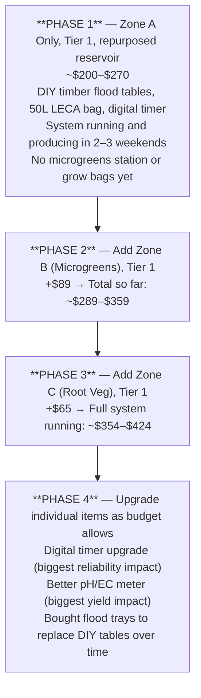
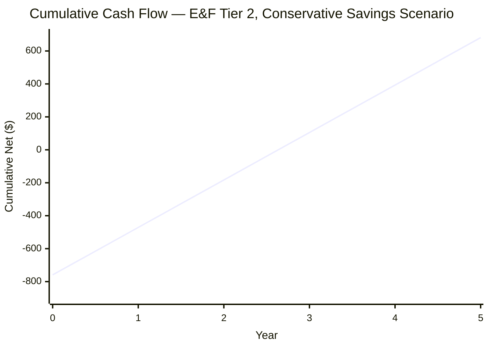

# Guide 12 — Budget and Sourcing
## Bill of Materials, Costs, Where to Buy, and ROI

[](../../README.md)
[](https://creativecommons.org/licenses/by-nc-sa/4.0/)


---

## Table of Contents

- [1. Build Tier Overview](#1-build-tier-overview)
- [2. Zone A — Flood Table System BOM](#2-zone-a-flood-table-system-bom)
  - [2.1 Flood Tables](#21-flood-tables)
  - [2.2 Bulkhead Fittings and Overflow System](#22-bulkhead-fittings-and-overflow-system)
  - [2.3 Reservoir](#23-reservoir)
  - [2.4 Pump and Aeration](#24-pump-and-aeration)
  - [2.5 Plumbing](#25-plumbing)
  - [2.6 Electrical and Timer](#26-electrical-and-timer)
  - [2.7 Monitoring and Testing](#27-monitoring-and-testing)
  - [2.8 Growing Media (Zone A)](#28-growing-media-zone-a)
  - [2.9 Nutrients](#29-nutrients)
  - [2.10 Climate and Protection](#210-climate-and-protection)
  - [Zone A Total (Flood Table System)](#zone-a-total-flood-table-system)
- [3. Zone B — Microgreens Station BOM](#3-zone-b-microgreens-station-bom)
- [4. Zone C — Root Veg Grow Bags BOM](#4-zone-c-root-veg-grow-bags-bom)
- [5. Consumables and Ongoing Supplies](#5-consumables-and-ongoing-supplies)
  - [Per Season (8–9 month outdoor season)](#per-season-89-month-outdoor-season)
- [6. Tier Totals Summary](#6-tier-totals-summary)
  - [Full 3-Zone System (All Zones)](#full-3-zone-system-all-zones)
  - [How to Achieve the $150–$600 Stated Range](#how-to-achieve-the-150600-stated-range)
  - [What You Get for Each Tier — Snapshot](#what-you-get-for-each-tier-snapshot)
- [7. Where to Buy](#7-where-to-buy)
  - [7.1 E&F-Specific Items — Where They Differ from NFT](#71-ef-specific-items-where-they-differ-from-nft)
  - [7.2 Online — General](#72-online-general)
  - [7.3 Online — Hydroponics Specialist](#73-online-hydroponics-specialist)
  - [7.4 Local — Hardware and DIY Stores](#74-local-hardware-and-diy-stores)
  - [7.5 Local — Garden Centres and Pond Suppliers](#75-local-garden-centres-and-pond-suppliers)
  - [7.6 Buying Used and Secondhand](#76-buying-used-and-secondhand)
  - [7.7 Nutrients — Sourcing the Masterblend Trio](#77-nutrients-sourcing-the-masterblend-trio)
- [8. Cost-Saving Strategies](#8-cost-saving-strategies)
  - [8.1 DIY Flood Tables vs. Bought — The Real Trade-Off](#81-diy-flood-tables-vs-bought-the-real-trade-off)
  - [8.2 Repurpose Food-Grade Containers as Reservoirs](#82-repurpose-food-grade-containers-as-reservoirs)
  - [8.3 LECA Reuse Across Seasons](#83-leca-reuse-across-seasons)
  - [8.4 Buy Nutrients in Bulk](#84-buy-nutrients-in-bulk)
  - [8.5 Standpipe DIY vs. Bought](#85-standpipe-diy-vs-bought)
  - [8.6 One-Pump vs. Two-Pump Setup](#86-one-pump-vs-two-pump-setup)
- [9. Running Costs](#9-running-costs)
  - [9.1 Electricity](#91-electricity)
  - [9.2 Water](#92-water)
  - [9.3 Nutrient Costs (Masterblend Trio)](#93-nutrient-costs-masterblend-trio)
  - [9.4 LECA Recharge Costs](#94-leca-recharge-costs)
  - [9.5 Full Annual Running Cost Summary](#95-full-annual-running-cost-summary)
- [10. Yield Estimates and ROI](#10-yield-estimates-and-roi)
  - [10.1 Zone A — E&F Flood Table Expected Yields](#101-zone-a-ef-flood-table-expected-yields)
  - [10.2 Zone B — Microgreens Yield](#102-zone-b-microgreens-yield)
  - [10.3 Zone C — Root Veg Yield](#103-zone-c-root-veg-yield)
  - [10.4 Total Annual Yield Value](#104-total-annual-yield-value)
- [11. Payback Period Analysis](#11-payback-period-analysis)
  - [11.1 Tier 2 — Mid Build Payback](#111-tier-2-mid-build-payback)
  - [11.2 Tier 1 — Budget Build Payback](#112-tier-1-budget-build-payback)
  - [11.3 E&F vs. NFT Payback Comparison](#113-ef-vs-nft-payback-comparison)
  - [11.4 Payback Summary Chart](#114-payback-summary-chart)
  - [11.5 Non-Financial Value](#115-non-financial-value)
- [Quick Reference — Budget at a Glance](#quick-reference-budget-at-a-glance)

---


## 1. Build Tier Overview

Three tiers are defined based on total budget and the trade-offs at each level:

```
TIER 1 — BUDGET ($150–$250)
  Philosophy: Get the system running with minimal spend.
              DIY timber flood tables, basic hardware, budget pump.
  Trade-offs: More DIY labour, mechanical timer risk, less precision.
  Best for:   First-time builders happy with weekend workshop projects.
              Growers testing E&F before a bigger investment.

TIER 2 — MID ($250–$400)  ← Recommended
  Philosophy: Solid, purpose-built components.
              Bought commercial flood trays, digital timer with battery backup,
              quality pump with filter, premium LECA.
  Trade-offs: Higher upfront cost, much faster and more reliable build.
  Best for:   Most growers — the best balance of cost and dependability.

TIER 3 — PREMIUM ($400–$600)
  Philosophy: Best-available components for maximum longevity and yield.
              Heavy-duty or FRP flood tables, dual timers, automation-ready.
  Trade-offs: High upfront cost; some items are "nice to have."
  Best for:   Serious growers, permanent installations, second builds.
```

Items are priced in USD with approximate GBP/EUR equivalents in brackets. Prices are based on typical 2024–2025 retail prices; check current pricing at purchase time.

> **E&F vs. NFT cost drivers:** The key cost differences in Ebb & Flow versus NFT are: (1) flood tables instead of PVC channels — whether bought or DIY; (2) bulkhead fittings (4 total, more robust than NFT drain barbs); (3) larger pump (800–1200 L/h vs. 600–800 L/h); (4) larger reservoir (100 L vs. 80 L); (5) significantly more LECA (40–50 L total vs. ~10 L for NFT); and (6) the digital timer is mandatory, not optional — a power cut resetting an E&F timer is a root-rot event within hours.

[↑ Back to TOC](#table-of-contents)

---


## 2. Zone A — Flood Table System BOM

### 2.1 Flood Tables

The flood tables are the largest variable cost item in the E&F system. You can buy purpose-made polypropylene flood trays or build timber + pond liner tables for considerably less.

#### 2.1A — Bought Ready-Made Flood Tables (Option A)

| Item | Tier 1 (Budget) | Tier 2 (Mid) | Tier 3 (Premium) |
|---|---|---|---|
| **Economy PP flood tray 50×100cm (2×)** | $50 — 2× budget economy tray | — | — |
| **Mid-range dedicated hydro flood table 60×120cm (2×)** | — | $100 — 2× purpose-built hydro tray | — |
| **Heavy-duty / FRP commercial flood table 60×120cm (2×)** | — | — | $200 — 2× commercial grade |
| **Flood table subtotal (Option A)** | **$50** | **$100** | **$200** |

#### 2.1B — DIY Timber + Pond Liner Tables (Option B)

| Item | Tier 1 (Budget) | Tier 2 (Mid) | Tier 3 (Premium) |
|---|---|---|---|
| **Timber (150mm × 25mm PAR sides, per table × 2)** | $14 — basic pine | $20 — exterior treated | $30 — smooth hardwood |
| **Timber (50mm × 50mm base ribs, per table × 2)** | $6 | $8 | $10 |
| **Plywood base 9mm exterior (per table × 2)** | $16 — basic ply | $22 — good exterior ply | $28 — marine ply |
| **EPDM pond liner 1.7m × 1.1m (per table × 2)** | $20 — PVC liner, thinner grade | $36 — EPDM 0.75mm (2 pieces) | $48 — EPDM 1.0mm, premium |
| **Pond liner tape (1 roll)** | $6 | $8 | $10 |
| **Screws + wood glue** | $5 | $6 | $7 |
| **Water-based timber preservative** | $6 | $10 | $14 |
| **DIY table subtotal (Option B)** | **$73** | **$110** | **$147** |

> **Which to choose:** Option B (DIY) saves $27–$53 at all tiers versus Option A for equivalent quality. Option A saves 4–6 hours of workshop time. The BOM below uses Option B costs for Tier 1 (maximum savings) and Option A costs for Tier 2 and 3 (time efficiency). Mix and match to suit your situation.

### 2.2 Bulkhead Fittings and Overflow System

Each table requires 2 bulkhead fittings (fill port + overflow/drain port). Total: 4 bulkhead fittings for the full system.

| Item | Tier 1 | Tier 2 | Tier 3 |
|---|---|---|---|
| **25mm bulkhead fittings (4× — fill + drain per table)** | $12 — irrigation bulkheads | $16 — dedicated hydro bulkheads | $22 — brass-body or reinforced PP |
| **EPDM rubber washers/gaskets (4×)** | $4 | $5 | $6 |
| **Overflow standpipes — 25mm PVC pipe, cut to height (4×)** | $4 — DIY cut from PVC offcut | $6 — pre-cut or purpose-bought standpipes | $10 — adjustable height standpipes |
| **Silicone sealant (pond-safe, tube)** | $4 | $5 | $6 |
| **Bulkhead/overflow subtotal** | **$24** | **$32** | **$44** |

### 2.3 Reservoir

| Item | Tier 1 | Tier 2 | Tier 3 |
|---|---|---|---|
| **100L food-grade HDPE container** | $0 — repurposed food barrel | $30 — purpose-bought 100L HDPE bin | $45 — dedicated 100L hydro reservoir |
| **Reflective foam insulation (reservoir wrap)** | $0 — foil bubble wrap offcut | $10 — Kingspan / foam board cut | $18 — purpose-cut foam box |
| **Black polythene wrap (light-proofing layer)** | $3 — black bin liner + tape | $4 | $0 — reservoir already opaque |
| **Lid gasket / foam seal strips** | $3 | $4 | $5 |
| **Reservoir subtotal** | **$6** | **$48** | **$68** |

### 2.4 Pump and Aeration

| Item | Tier 1 | Tier 2 | Tier 3 |
|---|---|---|---|
| **Submersible pump 800–1200 L/h** | $20 — no-name 800 L/h aquarium pump | $32 — Jebao/Hygger 1000 L/h with filter | $42 — adjustable flow 1200 L/h, pre-filter |
| **Air pump 4–6 L/min (reservoir aeration)** | $8 | $12 | $18 |
| **Air stone (2×)** | $3 | $4 | $6 |
| **Airline tubing (2m)** | $2 | $3 | $3 |
| **Non-return valve (air line)** | $2 | $2 | $3 |
| **Pump and aeration subtotal** | **$35** | **$53** | **$72** |

> **Why larger pump than NFT?** The E&F pump must fill both 1.2m × 0.6m tables (combined void volume ~12–14 L) within 5–10 minutes of each flood cycle. An NFT pump runs continuously but at low flow; the E&F pump runs in short bursts and must deliver meaningful volume quickly. An 800 L/h pump at 50 cm head delivers ~600 L/h (10 L/min) — enough to fill both tables in under 2 minutes.

### 2.5 Plumbing

| Item | Tier 1 | Tier 2 | Tier 3 |
|---|---|---|---|
| **25mm LDPE supply hose (3m)** | $5 | $6 | $7 |
| **32mm flexible drain hose (3m)** | $6 | $8 | $10 |
| **25mm T-junction / Y-splitter (supply side)** | $3 — irrigation T | $4 | $5 |
| **32mm T-junction (drain manifold)** | $3 | $4 | $5 |
| **25mm inline ball valves (2×, one per table supply)** | $6 — tap valves | $8 — proper ball valves | $12 — quality brass ball valves |
| **Barbed hose fittings + reducers (assorted pack)** | $5 | $7 | $9 |
| **Hose clips (bag of 20)** | $4 | $5 | $6 |
| **PTFE tape (roll)** | $1 | $1 | $1 |
| **Cable ties (bag of 100)** | $2 | $3 | $3 |
| **Plumbing subtotal** | **$35** | **$46** | **$58** |

### 2.6 Electrical and Timer

The timer is the most critical electrical component in an E&F system. A power cut or timer failure that leaves the pump running permanently will flood the table for hours — the primary cause of catastrophic root rot in E&F systems.

| Item | Tier 1 | Tier 2 | Tier 3 |
|---|---|---|---|
| **Outdoor extension lead (10m, IP44)** | $12 | $18 | $25 |
| **Digital timer with battery backup (primary)** | $10 — basic digital, battery backup | $16 — dual-program digital timer | $22 — commercial-grade 7-day digital |
| **Mechanical timer (backup, secondary)** | $0 — skip (risk acknowledged) | $0 | $8 — backup mechanical as failsafe |
| **GFCI/RCD adaptor** | $10 | $12 | $15 |
| **Weatherproof enclosure for timer** | $5 — waterproof box, basic | $9 — IP65 rated enclosure | $15 — lockable IP65 enclosure |
| **Electrical subtotal** | **$37** | **$55** | **$85** |

> **Timer note for Tier 1:** Using only a mechanical timer in E&F is acknowledged as a risk. Mechanical timers have 30-minute minimum intervals, cannot always be set for 15-minute floods precisely, and if the spring loses tension or pins shift, the pump may run continuously. If cost is the constraint, a single digital timer with battery backup ($10–$16) is the most important upgrade in the entire system. Prioritise this over better LECA or a larger pump.

### 2.7 Monitoring and Testing

| Item | Tier 1 | Tier 2 | Tier 3 |
|---|---|---|---|
| **pH pen (basic)** | $10 — cheap Amazon pen | $30 — Apera pH20 or equivalent | $50 — Apera PC60 combo |
| **EC pen** | $10 — separate basic pen | $20 — separate mid-range | $0 — included in PC60 above |
| **Calibration sachets (pH 4.0 + 7.0, EC 1413)** | $5 | $8 | $10 |
| **Digital aquarium thermometer (reservoir)** | $5 | $8 | $12 |
| **Outdoor min/max thermometer (air)** | $5 | $10 | $15 |
| **WiFi temp/humidity logger (Govee or similar)** | $0 | $0 | $20 |
| **Monitoring subtotal** | **$35** | **$76** | **$107** |

### 2.8 Growing Media (Zone A)

E&F uses significantly more LECA than NFT. Each 1.2m × 0.6m table requires ~20 L of LECA at 12–15 cm depth. Two tables = 40–50 L total. This is the largest per-unit media cost difference between E&F and NFT systems.

| Item | Tier 1 | Tier 2 | Tier 3 |
|---|---|---|---|
| **LECA / clay pebbles (50L bag)** | $25 — budget no-name LECA | $35 — Hydrotops or quality brand | $45 — Canna Aqua Pebbles or premium |
| **Rockwool cubes 25mm (block of 50)** | $6 | $8 | $10 |
| **50mm net pots (pack of 25)** | $5 | $6 | $7 |
| **75–100mm net pots (pack of 10)** | $4 | $5 | $6 |
| **Growing media subtotal** | **$40** | **$54** | **$68** |

### 2.9 Nutrients

| Item | Tier 1 | Tier 2 | Tier 3 |
|---|---|---|---|
| **MasterBlend 4-18-38 (500g)** | $15 | $15 | $15 |
| **Calcium Nitrate (500g)** | $8 | $8 | $8 |
| **Epsom Salt (500g food grade)** | $3 | $3 | $3 |
| **pH Down (phosphoric acid solution, 250mL)** | $6 | $8 | $10 |
| **pH Up (potassium hydroxide solution, 250mL)** | $5 | $6 | $8 |
| **Nutrients subtotal** | **$37** | **$40** | **$44** |

### 2.10 Climate and Protection

| Item | Tier 1 | Tier 2 | Tier 3 |
|---|---|---|---|
| **Shade cloth 40–50% (2m × 1.5m)** | $8 | $12 | $16 |
| **Horticultural fleece 17g/m² (3m × 2m)** | $6 | $8 | $10 |
| **Fleece/shade cloth pegs or clips (bag of 20)** | $3 | $4 | $5 |
| **Freeze water bottles (DIY — free)** | $0 | $0 | $0 |
| **Aquarium heater 50W (winter)** | $0 — skip (winterise system) | $0 | $20 |
| **Climate subtotal** | **$17** | **$24** | **$51** |

---

### Zone A Total (Flood Table System)

Using Option B (DIY tables) for Tier 1 and Option A (bought tables) for Tier 2 and 3:

| Category | Tier 1 | Tier 2 | Tier 3 |
|---|---|---|---|
| Flood tables | $73 (DIY) | $100 (bought) | $200 (commercial) |
| Bulkheads + overflow | $24 | $32 | $44 |
| Reservoir | $6 | $48 | $68 |
| Pump & aeration | $35 | $53 | $72 |
| Plumbing | $35 | $46 | $58 |
| Electrical & timer | $37 | $55 | $85 |
| Monitoring | $35 | $76 | $107 |
| Growing media | $40 | $54 | $68 |
| Nutrients | $37 | $40 | $44 |
| Climate | $17 | $24 | $51 |
| **Zone A TOTAL** | **$339** | **$528** | **$797** |

> **Note:** The stated $150–$600 range applies to phased builds and single-zone starts. See Section 6 for how to reach the target ranges by phasing. A Zone A-only Tier 1 build using a repurposed reservoir and all-DIY tables can reach ~$200–$250.

[↑ Back to TOC](#table-of-contents)

---


## 3. Zone B — Microgreens Station BOM

This zone is identical to the NFT system Zone B — the microgreens station has no dependence on the E&F flood/drain mechanics and the costs are the same.

| Item | Tier 1 | Tier 2 | Tier 3 |
|---|---|---|---|
| **Seedling trays 10×20" (pack of 10)** | $8 | $12 | $15 |
| **Solid liner trays (pack of 10)** | $6 | $8 | $10 |
| **Coco coir bricks (3×500g)** | $8 | $10 | $12 |
| **Perlite (5L bag)** | $5 | $6 | $8 |
| **Shelving unit (2-tier, metal wire)** | $15 — secondhand / flea market | $25 — new wire shelf | $40 — powder-coated grow rack |
| **LED grow panel (50–100W full-spectrum)** | $20 — no-name grow strip | $40 — MARS Hydro or Spider Farmer | $65 — Samsung LM301H quantum board |
| **Digital timer (indoor, LED panel)** | $8 | $10 | $12 |
| **Spray bottle** | $2 | $3 | $4 |
| **Watering can (fine rose)** | $5 | $8 | $12 |
| **Microgreens seeds assortment (100g each × 3 varieties)** | $12 | $18 | $25 |
| **Zone B TOTAL** | **$89** | **$140** | **$203** |

[↑ Back to TOC](#table-of-contents)

---


## 4. Zone C — Root Veg Grow Bags BOM

The E&F system uses larger grow bags than the NFT guide specifies — 3× 20L bags and 3× 30L deep bags — to support the deeper root vegetables best suited to soil-free growing (carrots, beetroot, parsnips).

| Item | Tier 1 | Tier 2 | Tier 3 |
|---|---|---|---|
| **Fabric grow bags 20L (pack of 3)** | $6 (3×) — thin non-woven | $9 (3×) — quality felt fabric | $14 (3×) — thick felt, handles |
| **Fabric grow bags 30L deep (pack of 3)** | $9 (3×) — thin non-woven | $14 (3×) — quality felt, deep | $20 (3×) — thick felt, deep handle bags |
| **Coco coir loose (50L bag)** | $12 | $15 | $18 |
| **Perlite (30L bag)** | $10 | $12 | $15 |
| **Vermiculite (10L bag)** | $6 | $8 | $10 |
| **Slow-release fertiliser (Osmocote 500g)** | $8 | $12 | $15 |
| **Drip saucers (pack of 6–8)** | $6 | $9 | $13 |
| **Root veg seed assortment** | $8 | $12 | $18 |
| **Zone C TOTAL** | **$65** | **$91** | **$123** |

[↑ Back to TOC](#table-of-contents)

---


## 5. Consumables and Ongoing Supplies

These costs recur each growing season (or more frequently for nutrients and seeds).

### Per Season (8–9 month outdoor season)

| Item | Low estimate | Mid estimate | High estimate |
|---|---|---|---|
| **MasterBlend 4-18-38 (500g lasts ~3 months at moderate use)** | $30 (2×) | $45 (3×) | $60 (4×) |
| **Calcium Nitrate (proportional to above)** | $16 | $24 | $32 |
| **Epsom Salt** | $3 | $6 | $9 |
| **pH Down** | $10 | $15 | $20 |
| **pH Up** | $6 | $10 | $14 |
| **Calibration sachets (replace annually)** | $5 | $8 | $10 |
| **Rockwool/Rapid Rooter plugs (per succession)** | $6/succession × 4 = $24 | Same | Same |
| **LECA annual recharge (rinse + reuse; buy ~5L replacement)** | $5 | $8 | $10 |
| **Seeds (all zones, per season)** | $20 | $35 | $50 |
| **Pest/disease treatments (preventive)** | $10 | $20 | $30 |
| **Microgreens coco coir top-up** | $8 | $12 | $16 |
| **Root veg slow-release fert top-up** | $6 | $8 | $10 |
| **Annual consumables TOTAL** | **~$143** | **~$215** | **~$285** |

**Average ongoing cost: ~$175–$220 per full season.**

> **E&F consumable note:** LECA is reusable indefinitely with proper cleaning (bleach soak, triple rinse, sun dry). Unlike rockwool in NFT channels, LECA in E&F tables does not compact or degrade significantly. The ~$5–$10 annual top-up is for replacement of pebbles that crack or are lost during cleaning — not a full replacement. This makes the E&F growing media cost lower over time than NFT rockwool cubes despite the higher initial LECA investment.

[↑ Back to TOC](#table-of-contents)

---


## 6. Tier Totals Summary

### Full 3-Zone System (All Zones)

| Tier | Zone A | Zone B | Zone C | Total Build Cost |
|---|---|---|---|---|
| **Tier 1 — Budget** | $339 | $89 | $65 | **$493** |
| **Tier 2 — Mid** | $528 | $140 | $91 | **$759** |
| **Tier 3 — Premium** | $797 | $203 | $123 | **$1,123** |

### How to Achieve the $150–$600 Stated Range

The stated budget range is achievable by **phasing the build:**



This phased approach lets you start with a functional system at ~$200 and expand as confidence and results justify further investment.

### What You Get for Each Tier — Snapshot

```
TIER 1 ($150–$250 for Zone A start):
  ✓ Two DIY timber + pond liner flood tables (custom-sized, workshop project)
  ✓ Repurposed 100L food barrel as reservoir
  ✓ Basic 800 L/h pump
  ✓ Digital timer with battery backup (minimum viable — do not skip)
  ✓ 50L bag of budget LECA
  ✗ No automation-ready fittings
  ✗ Basic pH/EC monitoring only

TIER 2 ($250–$400):
  ✓ Two purpose-made commercial flood trays (60×120cm)
  ✓ Purpose-bought 100L insulated reservoir
  ✓ Quality 1000 L/h pump with pre-filter
  ✓ Dual-program digital timer with battery backup
  ✓ Premium 50L LECA bag
  ✓ Solid mid-range pH/EC monitoring
  ✗ No automation sensors or smart devices yet

TIER 3 ($400–$600):
  ✓ Heavy-duty or FRP flood tables (permanent-grade)
  ✓ Dedicated hydroponic reservoir with foam insulation box
  ✓ Adjustable 1200 L/h pump with filter basket
  ✓ Commercial 7-day digital timer + mechanical backup
  ✓ Premium LECA (Canna Aqua Pebbles)
  ✓ Combo pH/EC meter
  ✓ Pre-wired sensor ports for automation add-ons (Guide 13)
  ✓ Aquarium heater for winter reservoir temp management
```

[↑ Back to TOC](#table-of-contents)

---


## 7. Where to Buy

### 7.1 E&F-Specific Items — Where They Differ from NFT

The following items are specific to E&F and less commonly stocked at general hardware stores. Source these first to avoid build delays.

| Item | Best source | Notes |
|---|---|---|
| **Flood trays / growing tables** | Hydroponics specialist online; Amazon | Search "flood and drain tray 120×60" or "ebb and flow table" — many cheap China-sourced options; check internal depth (min 10–15 cm) |
| **Bulkhead fittings (25–32mm)** | Hydroponics specialist; irrigation supplier; online | Also called "tank connectors." Available in PP or brass. Irrigation supply companies (drip-tape suppliers) often stock cheapest. |
| **Pond liner (EPDM)** | Garden centre; pond supply specialist; online | Specify EPDM (rubber, flexible, fish-safe). PVC liners are cheaper but stiffer and less durable. Buy slightly larger than calculated — cutting down is easy, piecing short is hard. |
| **LECA / clay pebbles (50L bag)** | Hydroponics specialist; Amazon; garden centre | Search "clay pebbles 50L" or "LECA 50L." Avoid very cheap bags with no brand — inconsistent sizing and excessive dust. Reputable brands: Plagron, Canna, Platinium. |
| **Digital timer with battery backup** | Amazon; hardware store; hydroponics specialist | Look specifically for "battery backup" or "battery reserve" in the product description. Not all digital timers retain settings after a power cut — this is the most important timer spec for E&F. |
| **Overflow standpipes** | DIY from 25mm PVC pipe (cut to height); or hydroponics specialist | Many hydro shops sell adjustable-height standpipes for common flood tray sizes. Or buy a 1m length of 25mm PVC conduit (~$3) and cut to the height you need. |

### 7.2 Online — General

| Platform | Best for | Tips |
|---|---|---|
| **Amazon** | Pumps, timers, meters, net pots, grow bags, LECA bags, LED panels, seeds | Check sold/fulfilled-by-Amazon for quality assurance; read recent reviews; filter for "battery backup" specifically on timer listings |
| **eBay** | Secondhand reservoirs, used pumps, bulk nutrient chemicals, IBC totes, pond liner offcuts | Pond liner offcuts from garden pond installers regularly appear cheap on eBay |
| **Alibaba / AliExpress** | Very cheap flood trays, net pots, bulkhead fittings in bulk | 3–6 week shipping; unpredictable quality — good for low-risk items like net pots and standpipes |
| **Etsy** | Seeds (heirloom and specialty microgreen varieties) | Small suppliers often have better germination rates than mass-market seeds |

### 7.3 Online — Hydroponics Specialist

| Retailer | Region | Strength |
|---|---|---|
| **HTG Supply** | USA | Full E&F range, competitive pricing, flood trays in stock |
| **Growers House** | USA | Commercial-grade equipment at consumer prices |
| **Hydroponics UK** | UK | Flood trays, bulkhead fittings, LECA, nutrients |
| **Nutriculture** | UK | E&F system manufacturer; direct sales of fittings |
| **AutoPot** | UK/EU/AU | Gravity-fed systems but excellent range of fittings |
| **Canna Wholesale** | EU/UK/AU | Premium LECA (Canna Aqua Pebbles), nutrients |
| **Bunnings** (online + stores) | Australia/NZ | PVC pipe, pond liner, containers, hardware |

### 7.4 Local — Hardware and DIY Stores

```
WHAT TO BUY LOCALLY (hardware / DIY store)
  ✓ Timber (150mm × 25mm and 50mm × 50mm PAR)
  ✓ Plywood (9mm exterior or marine)
  ✓ Screws, wood glue, silicone sealant (aquatic/pond-safe)
  ✓ PVC pipe (25mm, 32mm) for drain hose and standpipes
  ✓ Hose clips, PTFE tape, cable ties
  ✓ Outdoor extension lead (IP44 minimum)
  ✓ Step drill bit set (needed for bulkhead fitting holes)
  ✓ Utility knife and steel rule (for liner cutting)
  ✓ Buckets (10–20L for LECA rinsing)

  Store types: Home Depot, Lowe's (USA); B&Q, Screwfix, Wickes (UK);
               Bauhaus, OBI (EU); Bunnings (AU/NZ)
```

### 7.5 Local — Garden Centres and Pond Suppliers

| Item | Why source locally | Notes |
|---|---|---|
| EPDM pond liner | Can inspect quality; buy exact size | Specialist pond suppliers have better grades than DIY stores |
| Seeds (herbs, leafy greens, tomatoes) | Wider variety selection | Buy F1 hybrid for predictable performance |
| Shade cloth | Often on-shelf seasonally | 40–50% shade most versatile |
| Horticultural fleece | Seasonally available | 17 g/m² standard; 30 g/m² for frost protection |
| Epsom Salt | Cheaper than hydro shops as "garden Epsom" | Same compound; available in bulk bags |
| Slow-release fertiliser | Branded options in stock | Osmocote widely available |

### 7.6 Buying Used and Secondhand

| Item | Where to find | What to check |
|---|---|---|
| **100L food-grade barrel** | Facebook Marketplace, Craigslist, farms, breweries | Must be food-grade HDPE (fork-and-cup symbol or #2 HDPE); no chemical previous use; must have a sealable lid |
| **IBC tote (1000L — for large systems)** | eBay, Gumtree, farm supply | Food-grade only; rinse × 3 before use; can cut down to 100L section |
| **Flood tables / growing trays** | eBay, Facebook Marketplace, hydro shop clearance | Inspect for cracks and thin spots before buying; test drain port integrity |
| **Shelving units (Zone B)** | Facebook Marketplace, charity shops | Metal wire shelving ideal |
| **Aquarium pumps** | eBay, aquarium clubs | Test in water; impeller wear reduces output |
| **pH/EC meters** | eBay | Risky secondhand — probe drift; better to buy new |

### 7.7 Nutrients — Sourcing the Masterblend Trio

| Supplier | Location | Notes |
|---|---|---|
| **MasterBlend directly** | USA (ships internationally) | 2.27 kg bags ($28–$40 USD) last 1–2 seasons for small system |
| **Amazon** | Global | Small 500g or 1 kg bags suitable for trials |
| **Hydroponics UK** | UK | Stocks Masterblend and CN; 500g–1 kg bags |
| **Local pool/chemical supply** | Regional | Calcium Nitrate available as bulk fertiliser chemical |
| **Brewing supply shops** | Local/online | Epsom Salt in bulk (1–5 kg), food/pharma grade |

**Cheapest route for UK growers:** Masterblend from Amazon UK or Hydroponics UK; Calcium Nitrate from a local garden or farm supply; Epsom Salt from Wilko or Aldi (5 kg health/bath salt, food grade, same compound).

[↑ Back to TOC](#table-of-contents)

---


## 8. Cost-Saving Strategies

### 8.1 DIY Flood Tables vs. Bought — The Real Trade-Off

At Tier 1, DIY timber + pond liner tables cost $73 for both tables versus $50 for two economy bought trays. Wait — bought trays are cheaper at Tier 1? Yes, in this case. The DIY advantage appears at Tier 2 and 3: DIY tables at quality materials cost $110 vs. $100 for mid-range bought trays — roughly equivalent. At Tier 3, DIY with marine ply and 1.0mm EPDM costs $147 versus $200 for commercial-grade trays.

```
WHEN DIY TABLES WIN:
  ✓ Non-standard sizes (narrower, longer, deeper than 120×60cm)
  ✓ When quality timber and pond liner are locally cheap
  ✓ Tier 3 equivalent built for Tier 2 budget with patience
  ✓ Workshop hobby value — building is part of the pleasure

WHEN BOUGHT TABLES WIN:
  ✓ Time is more valuable than money — bought tables save 4–6 hours
  ✓ When economy flood trays are available for $20–$25 each (budget Tier 1)
  ✓ For growers without basic woodworking tools or space
  ✓ Commercial settings needing food-grade certified trays
```

### 8.2 Repurpose Food-Grade Containers as Reservoirs

The 100L reservoir is the second-largest variable cost item. Spending $0 on a repurposed food barrel versus $30–$45 on a purpose-built reservoir saves 6–10% of your total Tier 1 build cost.

**Where to find free or cheap food-grade 100L containers:**
- Restaurants and industrial kitchens (ingredient barrels, 20–120L)
- Bakeries (shortening and oil containers, 20–40L — need multiple if under 100L)
- Breweries and home-brew clubs (fermentation vessels, often 50–200L)
- Facebook Marketplace "free" section
- Farm supply stores (feed mixing containers)

Verify food-grade: look for the fork-and-cup symbol, "HDPE" / "#2" recycling code, or ask the supplier for food-grade confirmation.

### 8.3 LECA Reuse Across Seasons

LECA is the most expensive single growing media purchase in E&F but also the most durable. Properly cleaned LECA can be reused across many seasons with zero performance loss.

```
ANNUAL LECA CLEANING AND REUSE PROCEDURE:

End of season:
1. Remove net pots with spent plant roots.
2. Shake or pull large root masses out of LECA.
3. Collect all LECA into large buckets or mesh bags.

Cleaning:
4. Rinse with clean water — initial rinse removes loose organic matter.
5. Soak in 1:10 bleach (sodium hypochlorite) solution for 45–60 minutes.
   This kills any pathogens, including Pythium, Fusarium, and bacteria.
6. Drain bleach solution.
7. Rinse thoroughly × 3 with clean water (no bleach smell remaining).
8. Soak in pH-adjusted water (pH 5.5–6.0) for 12–24h to neutralise
   any residual alkalinity from dried nutrient salts on LECA surface.
9. Drain and spread LECA on a clean surface in direct sun.
   UV exposure is an additional sterilisation step.
10. Store dry in sealed bags until next season.

Cost of this procedure: ~$0.50 (bleach) per full cycle
Versus buying new LECA: $25–$45 per season
SAVING: $24–$44 per season from year 2 onward
```

### 8.4 Buy Nutrients in Bulk

The per-gram cost of Masterblend drops sharply with pack size:

| Pack size | Approx cost | Cost per gram |
|---|---|---|
| 100g | $8 | $0.080/g |
| 500g | $15 | $0.030/g |
| 1 kg | $22 | $0.022/g |
| 2.27 kg | $35 | $0.015/g |

Buying a 2.27 kg pack instead of a 100g pack reduces nutrient cost by ~80%. Share bulk orders with a neighbouring grower or community garden if you cannot use 2.27 kg in one season.

### 8.5 Standpipe DIY vs. Bought

Adjustable standpipes from hydroponics shops cost $8–$15 each. A length of 25mm PVC conduit from the hardware store costs ~$3 per metre. For four standpipes at two heights, you need less than 1 metre of pipe — total material cost under $3. Use a permanent marker to label height on each standpipe. This is one of the easiest and most effective DIY substitutions in the entire build.

### 8.6 One-Pump vs. Two-Pump Setup

The E&F specification uses a single pump serving both tables via a T-splitter. An alternative is one pump per table — which adds redundancy but doubles pump cost and electrical connections. At Tier 1 and 2, the single-pump approach with a spare pump on hand (cost ~$20) is more cost-effective than a two-pump baseline setup. The spare pump takes less than 5 minutes to swap in. Keep one spare pump in your shed.

[↑ Back to TOC](#table-of-contents)

---


## 9. Running Costs

### 9.1 Electricity

The E&F pump runs on a timer — typically 3–4 cycles per day of 15–20 minutes each. This is significantly less than the NFT pump which runs 18+ hours per day. However, the E&F pump is larger (higher wattage).

| Device | Wattage | Hours/day | kWh/day | kWh/month | Cost/month* |
|---|---|---|---|---|---|
| Submersible pump 1000 L/h (cycled) | 20–30W | ~1.5h (4 cycles × 20 min) | 0.04–0.06 | 1.2–1.8 | $0.12–$0.18 |
| Air pump (4 L/min, continuous) | 3–5W | 24h | 0.07–0.12 | 2.1–3.6 | $0.21–$0.36 |
| Zone B LED panel (50W) | 50W | 16h | 0.80 | 24 | $2.40 |
| Monitoring devices (Govee, etc.) | <2W | 24h | 0.05 | 1.5 | $0.15 |
| **Total** | | | | | **$2.88–$3.09/month** |

*Based on $0.10/kWh (mid-range US residential). UK/EU at £0.24–€0.30/kWh would be ~2–3× higher (~$7–$10/month).

> **E&F vs. NFT electricity comparison:** The E&F pump costs dramatically less to run than the NFT pump — $0.12–$0.18/month vs. $0.54–$0.81/month for the NFT pump — because the E&F pump runs only ~1.5 hours per day versus ~18 hours for NFT. This partially offsets the higher upfront cost of the larger E&F pump. Over a full season, the E&F system saves approximately $4–$6 in pump electricity versus NFT.

**Annual electricity cost:** ~$35–$90 depending on location and LED usage.

### 9.2 Water

| Season | Evaporation + plant uptake | Top-up frequency | Annual water use |
|---|---|---|---|
| Spring/autumn | 3–8 L/day | Every 3–5 days | ~1,200–2,400 L |
| Summer peak | 10–20 L/day | Daily top-up | ~2,400–4,000 L |

Tap water at typical rates ($0.003–$0.008/L): **$4–$32/season**. Using harvested rainwater: **$0** (and better for pH stability if your tap water is alkaline).

### 9.3 Nutrient Costs (Masterblend Trio)

At the standard mixing rate of 0.6 g/L and 100 L reservoir, changed every 7–10 days:

```
Per reservoir change (standard vegetative EC ~1.4–1.6):
  Masterblend:     0.6 g/L × 100L = 60g
  Calcium Nitrate: 60g
  Epsom Salt:      30g
  Total:           150g of nutrients per full reservoir change

At 2.27kg Masterblend pack ($35):
  Cost per 60g Masterblend = 60 × ($35 ÷ 2270) = $0.93
  Calcium Nitrate 60g at $15/500g = $1.80
  Epsom Salt 30g at $5/1000g = $0.15
  ──────────────────────────────────────────────
  Total per reservoir fill: ~$2.88

At 36 changes per season (every ~7 days for 9 months):
  ~36 × $2.88 = ~$104/season (full reservoir changes)
  With partial top-ups (more common), actual cost closer to $65–$85
```

**Typical nutrient cost: $65–$105/season** (slightly higher than NFT due to larger reservoir volume).

### 9.4 LECA Recharge Costs

The E&F system has one ongoing cost the NFT system does not: annual LECA cleaning and partial replacement.

| Item | Annual cost |
|---|---|
| Bleach for LECA sterilisation (3L bottle lasts ~4 seasons) | ~$1 |
| Replacement LECA (5–10L for cracked/lost pebbles) | $5–$10 |
| pH adjustment chemicals for LECA pre-soak | ~$2 |
| **Annual LECA recharge total** | **~$8–$13** |

### 9.5 Full Annual Running Cost Summary

| Category | Low | Mid | High |
|---|---|---|---|
| Electricity | $35 | $55 | $90 |
| Water | $4 | $15 | $32 |
| Nutrients (Masterblend trio) | $65 | $85 | $105 |
| pH adjustment chemicals | $10 | $20 | $30 |
| Seeds (all zones) | $20 | $35 | $50 |
| LECA recharge (annual cleaning + partial replacement) | $8 | $10 | $13 |
| Microgreens coco top-up | $8 | $12 | $16 |
| Pest/disease treatments | $5 | $15 | $30 |
| Misc replacements (hose clip, fitting, fuse) | $5 | $15 | $30 |
| **Annual running total** | **$160** | **$262** | **$396** |

**Realistic mid-range annual running cost: ~$220–$265.**

[↑ Back to TOC](#table-of-contents)

---


## 10. Yield Estimates and ROI

### 10.1 Zone A — E&F Flood Table Expected Yields

> **E&F yield advantage for fruiting crops:** The Ebb & Flow system has a meaningful yield advantage over NFT for large fruiting plants (tomatoes, cucumbers, courgettes, peppers). In E&F, these plants grow in 75–100mm net pots packed with LECA — a much larger root zone than the constrained NFT channel. Larger root zone = larger plant = higher per-plant yield. For leafy greens and herbs, yields are comparable to NFT.

> **First-season adjustment:** If this is your first hydroponic grow, expect to achieve **40–60% of the yields listed below.** The E&F system has additional variables (flood depth tuning, drain confirmation, LECA bed establishment) that take one season to optimise. By your second full season, the system typically out-performs NFT for fruiting crops significantly.

#### Table 1 — Leafy Greens and Herbs (lettuce, herbs, spinach, kale)

```
Succession planting: 5 weeks seed-to-harvest (lettuce head)
Net pots at 25cm spacing on 1.2m × 0.6m table: approx 20–24 sites
Heads per site per season: 7 harvests (efficiency-adjusted)
Total heads per season from Table 1: ~20 sites × 6 harvests = 120 heads

If split: 12 lettuce sites + 8 herb sites
  Lettuce yield: 12 sites × 6 harvests = 72 heads × 150–200g = 11–14 kg
  Herbs (basil): 8 sites × 25g/week × 20 weeks = 4 kg cut
```

**Lettuce value:** 72 heads × $3.00 = **$216**
**Herb value:** ~4 kg basil at $0.10/g = **$400** (if consumed — high per-gram value)

#### Table 2 — Fruiting Crops (tomatoes, peppers, cucumbers, strawberries)

```
Cherry tomatoes (indeterminate): 3 plants at 40cm spacing in 75mm net pots
  E&F yield per plant: 3–5 kg per season (larger root zone vs. NFT)
  3 plants × 4 kg = 12 kg
  Supermarket: cherry tomatoes $5/250g = $20/kg
  Value: 12 kg × $20/kg = $240

Cucumbers (2 plants in 100mm net pots):
  E&F yield per plant: 8–15 fruit per plant per season
  2 plants × 10 fruit × 300g = 6 kg
  Supermarket: cucumbers $1.50–$2.50 each = ~$5/kg
  Value: 6 kg × $5 = $30

Peppers (2 plants in 75mm net pots):
  Yield per plant: 8–20 peppers depending on variety
  2 plants × 12 peppers × 150g = 3.6 kg
  Value at $5/kg = $18

Strawberries (5 plants in 50–75mm net pots):
  300–500g per plant per season
  5 plants × 400g = 2 kg
  Value at $5/400g = $25
```

#### Zone A Yield Summary

| Crop / Area | Yield (kg/season) | Supermarket value |
|---|---|---|
| Lettuce (Table 1, 12 sites) | 11–14 kg | $165–$210 |
| Herbs / basil (Table 1, 8 sites) | ~4 kg cut | $300–$400 |
| Cherry tomatoes (Table 2) | ~12 kg | $220–$280 |
| Cucumbers (Table 2) | ~6 kg | $25–$40 |
| Peppers (Table 2) | ~3.6 kg | $15–$25 |
| Strawberries (Table 2) | ~2 kg | $20–$30 |
| **Zone A TOTAL** | **~38–42 kg** | **$745–$985** |

### 10.2 Zone B — Microgreens Yield

```
Standard tray (10×20"): ~150–250g finished microgreens per harvest
Harvest time: 7–14 days from sow to harvest
Running 3 trays staggered:
  → Harvest every 3–4 days
  → ~200g per harvest × 2.5 harvests/week = 500g/week
  → 40 weeks × 500g = 20 kg/season

Supermarket microgreens: $3–$6 per 50g punnet
At $4/50g = $80/kg
Value: 20 kg × $40/kg (wholesale equivalent, conservative) = $800/season
```

### 10.3 Zone C — Root Veg Yield

```
Radishes (3× 20L bags, 15 plants/bag = 45 plants):
  → 25–35 days per succession, 6–8 successions per season
  → 45 plants × 30g = 1.35 kg per succession × 7 = 9.5 kg/season
  Value at $10/kg = $95

Carrots (2× 30L deep bags, 12 plants/bag = 24 plants):
  → One main succession + one follow-up
  → 24 plants × 120g = 2.9 kg per succession × 2 = 5.8 kg
  Value at $3/kg = $17

Beetroot (1× 30L deep bag, 10 plants):
  → 10 plants × 250g = 2.5 kg
  Value at $2.50/kg = $6
```

### 10.4 Total Annual Yield Value

| Zone / Crop | Yield (kg/season) | Value (supermarket price) |
|---|---|---|
| Leafy greens (Table 1) | 11–14 kg | $165–$210 |
| Herbs (Table 1) | ~4 kg cut | $300–$400 |
| Fruiting crops (Table 2) | ~23–24 kg | $280–$375 |
| **Zone A subtotal** | **~38–42 kg** | **$745–$985** |
| Microgreens (Zone B) | ~20 kg | $600–$800 |
| Radishes (Zone C) | ~9.5 kg | $85–$110 |
| Carrots + Beetroot (Zone C) | ~8 kg | $20–$30 |
| **Zone C subtotal** | **~17.5 kg** | **$105–$140** |
| **GRAND TOTAL** | **~75–80 kg** | **$1,450–$1,925/season** |

> **Important caveat:** These are supermarket retail equivalent values — the money you save on your grocery bill, not money you earn. Microgreens in particular will exceed typical household consumption unless you sell, gift, or donate surplus. The fruiting crop yields from E&F flood tables are meaningfully higher than NFT equivalents due to the larger root zone — this is the primary yield argument for choosing E&F over NFT for tomato and cucumber growers.

[↑ Back to TOC](#table-of-contents)

---


## 11. Payback Period Analysis

### 11.1 Tier 2 — Mid Build Payback

```
TIER 2 FULL BUILD (3 ZONES)

Total build cost:          $759
Annual running cost:       $262 (mid estimate)
Annual yield value:        $1,000–$1,500 (conservative household use)

Net value per season:      $1,200 (mid) - $262 (running) = $938/season
Break-even (payback):      $759 ÷ $938 = ~0.8 seasons
                           → Paid off within first season (optimistic)
```

Accounting for the fact that one household cannot consume all of the projected value, using a conservative grocery-saving estimate:

```
Conservative household savings: $550/season
Running cost: $262/season
Net annual benefit: $288/season

Payback on $759 build: $759 ÷ $288 = ~2.6 seasons (≈ 3 years)
```

### 11.2 Tier 1 — Budget Build Payback

```
TIER 1 FULL BUILD

Total build cost:          $493
Annual running cost:       $160 (low estimate)
Conservative savings:      $450/season
Net benefit:               $450 - $160 = $290/season
Payback:                   $493 ÷ $290 = ~1.7 seasons
```

### 11.3 E&F vs. NFT Payback Comparison

The E&F system costs more to build than an equivalent NFT system (Tier 2: $759 vs. $671 for NFT) but generates higher value from fruiting crops due to the larger root zone. The payback periods are broadly similar:

| Metric | E&F Tier 2 | NFT Tier 2 |
|---|---|---|
| Build cost | $759 | $671 |
| Annual running cost | ~$262 | ~$247 |
| Conservative savings/season | ~$550 | ~$500 |
| Net benefit/season | ~$288 | ~$253 |
| Payback period | ~2.6 seasons | ~2.7 seasons |
| Fruiting crop yield advantage | **Higher** (larger root zone) | Lower |
| Leafy green yield | Comparable | Comparable |

E&F is the better choice if your priority is fruiting crops (tomatoes, cucumbers, courgettes). NFT is marginally cheaper and easier to build if leafy greens and herbs are your focus.

### 11.4 Payback Summary Chart



> Assumes no major equipment replacement in 5 years. Pump may need replacement at year 2–3 (~$25–$40). Pond liner on DIY tables should last 5–10 years with UV protection.

### 11.5 Non-Financial Value

The ROI analysis captures only direct grocery savings. The full value of the E&F system also includes:

- **Food quality:** Flood-table-grown tomatoes and cucumbers are harvested at peak ripeness, with significantly better flavour and nutrition than supermarket equivalents picked unripe
- **Food security:** Year-round production of herbs and microgreens; seasonal glut of fruiting crops that can be preserved
- **Skill development:** E&F systems teach root zone management, flood cycle optimisation, and drain-system troubleshooting — transferable skills
- **Educational value:** The flood/drain mechanism is highly visual and engaging for children learning about plants and systems
- **Mental health:** Growing food — especially tending fruiting plants from flower to harvest — is consistently linked to stress reduction in research literature
- **Carbon footprint:** Eliminating the packaging, transport refrigeration, and food miles associated with supermarket tomatoes and cucumbers

[↑ Back to TOC](#table-of-contents)

---


## Quick Reference — Budget at a Glance

```mermaid
xychart-beta
    title "E&F System Build Cost by Tier and Zone"
    x-axis ["Zone A (Flood Tables)", "Zone B (Microgreens)", "Zone C (Root Veg)", "TOTAL BUILD"]
    y-axis "Cost ($)" 0 --> 1200
    bar [339, 89, 65, 493]
    bar [528, 140, 91, 759]
    bar [797, 203, 123, 1123]
```



| | Tier 1 Budget | Tier 2 Mid | Tier 3 Premium |
|---|---|---|---|
| **Build cost** | ~$493 | ~$759 | ~$1,123 |
| **Annual running** | ~$160 | ~$262 | ~$396 |
| **Annual value saved** | ~$550–$900 | ~$800–$1,300 | ~$1,000–$1,600 |
| **Break-even** | ~1.5–2 yr | ~2–3 yr | ~2.5–3.5 yr |

---


*Next: [Guide 13 — Budget-Friendly Automation and Data Logging →](./13-automation.md)*

[↑ Back to TOC](#table-of-contents)

---

<!-- copyright -->
*Copyright (c) 2026 UncleJS. Licensed under [CC BY-NC-SA 4.0](https://creativecommons.org/licenses/by-nc-sa/4.0/) — free to share and adapt for non-commercial purposes with attribution and ShareAlike.*
