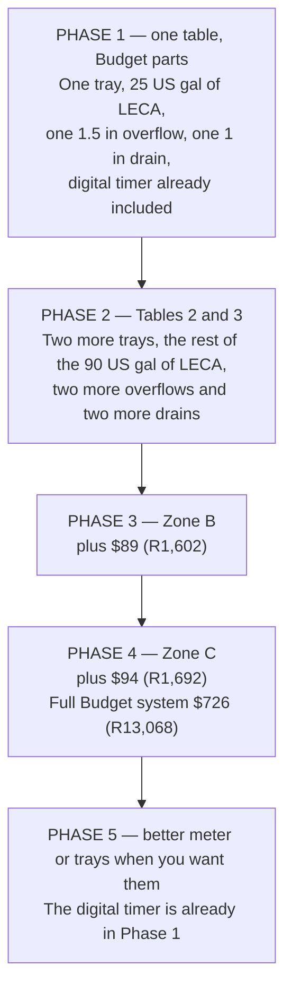
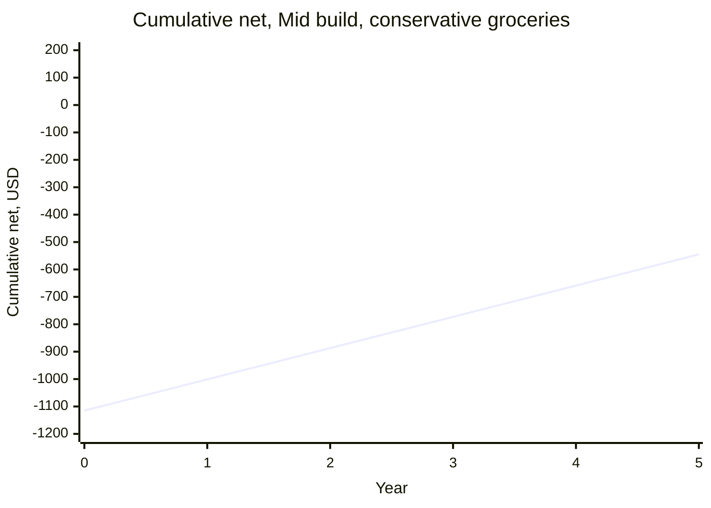

# Guide 12 — Budget and Sourcing
## Bill of Materials, Costs, Where to Buy, and ROI

[](../../README.md)
[](https://creativecommons.org/licenses/by-nc-sa/4.0/)


---

## Table of Contents

- [1. Build Tier Overview](#1-build-tier-overview)
- [2. Zone A — Flood Table System BOM](#2-zone-a-flood-table-system-bom)
  - [2.1 Flood Tables](#21-flood-tables)
    - [2.1A — Bought Ready-Made Flood Tables (Option A)](#21a-bought-ready-made-flood-tables-option-a)
    - [2.1B — DIY Timber + Pond Liner Tables (Option B)](#21b-diy-timber-pond-liner-tables-option-b)
  - [2.2 Bulkhead Fittings and Overflow System](#22-bulkhead-fittings-and-overflow-system)
  - [2.3 Reservoir](#23-reservoir)
  - [2.4 Pump and Aeration](#24-pump-and-aeration)
  - [2.5 Plumbing](#25-plumbing)
  - [2.6 Electrical and Timer](#26-electrical-and-timer)
  - [2.7 Monitoring and Testing](#27-monitoring-and-testing)
  - [2.8 Growing Media (Zone A)](#28-growing-media-zone-a)
  - [2.9 Nutrients](#29-nutrients)
  - [2.10 Climate and Protection](#210-climate-and-protection)
  - [Zone A Total (Flood Table System)](#zone-a-total-flood-table-system)
- [3. Zone B — Microgreens Station BOM](#3-zone-b-microgreens-station-bom)
- [4. Zone C — Root Veg Grow Bags BOM](#4-zone-c-root-veg-grow-bags-bom)
- [5. Consumables and Ongoing Supplies](#5-consumables-and-ongoing-supplies)
  - [Per Season (8–9 month outdoor season)](#per-season-89-month-outdoor-season)
- [6. Tier Totals Summary](#6-tier-totals-summary)
  - [Full 3-Zone System (All Zones)](#full-3-zone-system-all-zones)
  - [Phasing the Build to Spread the Cost](#phasing-the-build-to-spread-the-cost)
  - [What You Get for Each Tier — Snapshot](#what-you-get-for-each-tier-snapshot)
- [7. Where to Buy](#7-where-to-buy)
  - [7.1 E&F-Specific Items — Where They Differ from NFT](#71-ef-specific-items-where-they-differ-from-nft)
  - [7.2 Online — General](#72-online-general)
  - [7.3 Online — Hydroponics Specialist](#73-online-hydroponics-specialist)
  - [7.4 Local — Hardware and DIY Stores](#74-local-hardware-and-diy-stores)
  - [7.5 Local — Garden Centers and Pond Suppliers](#75-local-garden-centers-and-pond-suppliers)
  - [7.6 Buying Used and Secondhand](#76-buying-used-and-secondhand)
  - [7.7 Nutrients — Sourcing the Masterblend Trio](#77-nutrients-sourcing-the-masterblend-trio)
- [8. Cost-Saving Strategies](#8-cost-saving-strategies)
  - [8.1 DIY Flood Tables vs. Bought — The Real Trade-Off](#81-diy-flood-tables-vs-bought-the-real-trade-off)
  - [8.2 Repurpose Food-Grade Containers as Reservoirs](#82-repurpose-food-grade-containers-as-reservoirs)
  - [8.3 LECA Reuse Across Seasons](#83-leca-reuse-across-seasons)
  - [8.4 Buy Nutrients in Bulk](#84-buy-nutrients-in-bulk)
  - [8.5 Standpipe DIY vs. Bought](#85-standpipe-diy-vs-bought)
  - [8.6 One-Pump vs. Two-Pump Setup](#86-one-pump-vs-two-pump-setup)
- [9. Running Costs](#9-running-costs)
  - [9.1 Electricity](#91-electricity)
  - [9.2 Water](#92-water)
  - [9.3 Nutrient Costs (Masterblend Trio)](#93-nutrient-costs-masterblend-trio)
  - [9.4 LECA Recharge Costs](#94-leca-recharge-costs)
  - [9.5 Full Annual Running Cost Summary](#95-full-annual-running-cost-summary)
- [10. Yield Estimates and ROI](#10-yield-estimates-and-roi)
  - [10.1 Zone A — E&F Flood Table Expected Yields](#101-zone-a-ef-flood-table-expected-yields)
    - [Table 3 — leafy greens and herbs](#table-3-leafy-greens-and-herbs)
    - [Table 1 — one vine](#table-1-one-vine)
    - [Table 2 — one or two fruiting plants](#table-2-one-or-two-fruiting-plants)
    - [Zone A yield summary](#zone-a-yield-summary)
  - [10.2 Zone B — Microgreens Yield](#102-zone-b-microgreens-yield)
  - [10.3 Zone C — Root Veg Yield](#103-zone-c-root-veg-yield)
  - [10.4 Total Annual Yield Value](#104-total-annual-yield-value)
- [11. Payback Period Analysis](#11-payback-period-analysis)
  - [11.1 Tier 2 — Mid Build Payback](#111-tier-2-mid-build-payback)
  - [11.2 Tier 1 — Budget Build Payback](#112-tier-1-budget-build-payback)
  - [11.3 E&F vs. NFT Payback Comparison](#113-ef-vs-nft-payback-comparison)
  - [11.4 Payback Summary Chart](#114-payback-summary-chart)
  - [11.5 Non-Financial Value](#115-non-financial-value)
- [Quick Reference — Budget at a Glance](#quick-reference-budget-at-a-glance)


[↑ Back to TOC](#table-of-contents)

## 1. Build Tier Overview

Planning rate: **$1 = R18.00**, frozen 3 October 2026. Rand figures are that rate rounded to the nearest rand. Electricity in the running-cost section is **$0.15/kWh (R2.70/kWh)**.

LECA is the cost driver. The three tables need 75 US gal (284 L) of pebbles at 5 in (13 cm), and you buy **90 US gal (340 L)** so the rinse has something to waste.

| Tier | Zone A | Full three-zone (A + B + C) |
|---|---|---|
| **Budget** | **$543 (R9,774)** | **$726 (R13,068)** |
| **Mid** | **$867 (R15,606)** | **$1,130 (R20,340)** |
| **Premium** | **$1,274 (R22,932)** | **$1,639 (R29,502)** |

Zone B is $89 / $140 / $203 (R1,602 / R2,520 / R3,654). Zone C is $94 / $123 / $162 (R1,692 / R2,214 / R2,916). The line-item tables below add up to these totals. Bought flood trays are used for the Zone A total. DIY timber tables are listed as an option and are not in the total.

```
BUDGET — $543 Zone A (R9,774), $726 for all three zones (R13,068)
  Economy trays, repurposed 45 US gal tank, 250 US gph pump,
  digital 1-minute timer in a weatherproof box, smart-plug cutoff, 90 US gal of budget LECA.

MID — $867 Zone A (R15,606), $1,130 for all three zones (R20,340)
  Purpose-built trays, bought reservoir, the same pump class with a pre-filter,
  the same digital timer, smart-plug cutoff, better LECA. This is the build most people should price.

PREMIUM — $1,274 Zone A (R22,932), $1,639 for all three zones (R29,502)
  Commercial trays, insulated reservoir, combo meter, premium LECA.
  The timer is still the digital 1-minute unit in a weatherproof box; smart-plug cutoff stays required.
  A mechanical timer is not an upgrade.
```

> **What actually moves the price:** 90 US gal (340 L) of LECA, then the three 4 ft × 2 ft tables, then the 45 US gal (170 L) reservoir and the 250 US gph (950 L/h) pump at about 35 W. Each table takes a 1½ in (40 mm) overflow and a 1 in (25 mm) drain. The digital timer is in the budget tier already. A stuck-ON pump rots roots in 2–4 hours, so the timer is not the place to save money.


---


[↑ Back to TOC](#table-of-contents)

## 2. Zone A — Flood Table System BOM

### 2.1 Flood Tables

The flood tables are the largest variable cost item in the E&F system. You can buy purpose-made polypropylene flood trays or build timber + pond liner tables for considerably less.

#### 2.1A — Bought Ready-Made Flood Tables (Option A)

| Item | Tier 1 (Budget) | Tier 2 (Mid) | Tier 3 (Premium) |
|---|---|---|---|
| **Economy PP flood tray, 4 ft × 2 ft (3×)** | $75 (R1,350) | — | — |
| **Mid-range hydro flood table, 4 ft × 2 ft (3×)** | — | $150 (R2,700) | — |
| **Heavy-duty commercial flood table, 4 ft × 2 ft (3×)** | — | — | $300 (R5,400) |
| **Flood table subtotal (Option A)** | **$75** | **$150** | **$300** |

#### 2.1B — DIY Timber + Pond Liner Tables (Option B)

| Item | Tier 1 (Budget) | Tier 2 (Mid) | Tier 3 (Premium) |
|---|---|---|---|
| **Timber (6 in × 1 in / 150 mm × 25 mm PAR sides, per table × 3)** | $21 — basic pine | $30 — exterior treated | $45 — smooth hardwood |
| **Timber (2 in × 2 in / 50 mm × 50 mm base ribs, per table × 3)** | $9 | $12 | $15 |
| **Plywood base ⅜ in (9 mm) exterior (per table × 3)** | $24 — basic ply | $33 — good exterior ply | $42 — marine ply |
| **EPDM pond liner 5.6 ft × 3.6 ft (1.7 m × 1.1 m, per table × 3)** | $30 — PVC liner, thinner grade | $54 — EPDM 1/32 in (0.75 mm) (3 pieces) | $72 — EPDM 0.04 in (1.0 mm), premium |
| **Pond liner tape (2 rolls)** | $12 | $16 | $20 |
| **Screws + wood glue** | $7 | $8 | $10 |
| **Water-based timber preservative** | $6 | $10 | $14 |
| **DIY table subtotal (Option B)** | **$109** | **$163** | **$218** |

> **Which to choose:** With three tables, Option A (bought) is actually cheaper at Tier 1 ($75 vs. $109) and Tier 2 ($150 vs. $163); DIY only wins on price at Tier 3 ($218 vs. $300). DIY still earns its keep for custom sizing and build quality. The BOM below uses Option A costs at all tiers. Mix and match to suit your situation.

### 2.2 Bulkhead Fittings and Overflow System

Each table has two different fittings. The overflow is 1½ in (40 mm), with a standpipe. The drain is 1 in (25 mm). The pump fills through the drain line and, with no check valve, the bed empties back down that line. Three tables means three of each size, not six identical 1 in bulkheads.

| Item | Tier 1 | Tier 2 | Tier 3 |
|---|---|---|---|
| **1½ in (40 mm) overflow bulkheads (3×)** | $18 | $24 | $33 |
| **1 in (25 mm) drain bulkheads (3×)** | $12 | $16 | $21 |
| **EPDM washers, both sizes (6×)** | $6 | $8 | $9 |
| **1½ in overflow standpipes (3×)** | $8 | $12 | $18 |
| **Silicone sealant (pond-safe, tube)** | $4 | $5 | $6 |
| **Fittings subtotal** | **$48 (R864)** | **$65 (R1,170)** | **$87 (R1,566)** |

### 2.3 Reservoir

| Item | Tier 1 | Tier 2 | Tier 3 |
|---|---|---|---|
| **45 US gal (170 L) food-grade HDPE, range 40–50 US gal (151–189 L)** | $0 — repurposed food barrel | $45 — purpose-bought bin | $65 — dedicated hydro reservoir |
| **Reflective foam insulation (reservoir wrap)** | $0 — foil bubble wrap offcut | $10 — Kingspan / foam board cut | $18 — purpose-cut foam box |
| **Black polyethylene wrap (light-proofing layer)** | $3 — black bin liner + tape | $4 | $0 — reservoir already opaque |
| **Lid gasket / foam seal strips** | $3 | $4 | $5 |
| **Reservoir subtotal** | **$6** | **$63** | **$88** |

### 2.4 Pump and Aeration

| Item | Tier 1 | Tier 2 | Tier 3 |
|---|---|---|---|
| **Submersible pump, 250 US gph (950 L/h), about 35 W. Range 200–300 US gph (760–1,140 L/h), 25–45 W** | $20 — no-name in that flow band | $32 — branded pump with a pre-filter | $42 — adjustable flow, pre-filter |
| **Air pump 4–6 L/min (reservoir aeration)** | $8 | $12 | $18 |
| **Air stone (2×)** | $3 | $4 | $6 |
| **Airline tubing (6.5 ft / 2 m)** | $2 | $3 | $3 |
| **Non-return valve (air line)** | $2 | $2 | $3 |
| **Pump and aeration subtotal** | **$35** | **$53** | **$72** |

> **Why this pump?** It has to lift about 25–30 US gal (95–114 L) into three 4 ft × 2 ft tables during a 15–30 minute flood, through about 20 in (50 cm) of head. 250 US gph (950 L/h) at about 35 W does that. It does not run all day.

### 2.5 Plumbing

| Item | Tier 1 | Tier 2 | Tier 3 |
|---|---|---|---|
| **1 in (25 mm) LDPE supply hose (13 ft / 4 m)** | $6 | $7 | $8 |
| **1¼ in (32 mm) flexible drain hose (13 ft / 4 m)** | $8 | $10 | $13 |
| **1 in (25 mm) T-junctions × 2 (supply manifold)** | $6 — irrigation Ts | $8 | $10 |
| **1¼ in (32 mm) T-junctions × 2 (drain manifold)** | $6 | $8 | $10 |
| **1 in (25 mm) inline ball valves (3×, one per table supply)** | $9 — tap valves | $12 — proper ball valves | $18 — quality brass ball valves |
| **Barbed hose fittings + reducers (assorted pack)** | $5 | $7 | $9 |
| **Hose clips (bag of 20)** | $4 | $5 | $6 |
| **PTFE tape (roll)** | $1 | $1 | $1 |
| **Cable ties (bag of 100)** | $2 | $3 | $3 |
| **Plumbing subtotal** | **$47** | **$61** | **$78** |

### 2.6 Electrical and Timer

The timer is the most critical electrical component in an E&F system. A power cut or timer failure that leaves the pump running permanently will flood the table for hours — the primary cause of catastrophic root rot in E&F systems.

| Item | Tier 1 | Tier 2 | Tier 3 |
|---|---|---|---|
| **Outdoor extension lead (33 ft / 10 m, IP44)** | $12 | $18 | $25 |
| **Digital timer with battery backup (primary)** | $10 — basic digital, battery backup | $16 — dual-program digital timer | $22 — commercial-grade 7-day digital |
| **Second digital timer** | $0 — one digital timer is the control | $0 | $8 — a spare digital timer, not a mechanical one |
| **Smart plug on the pump (stuck-ON cutoff)** | $15 — cuts power if pump runs >35 min, then alerts | $15 — same required cutoff | $15 — same required cutoff |
| **120 V outdoor GFCI adaptor (SA: 230 V, 30 mA earth-leakage)** | $10 | $12 | $15 |
| **Weatherproof enclosure for timer** | $5 — waterproof box, basic | $9 — IP65 rated enclosure | $15 — lockable IP65 enclosure |
| **Electrical subtotal** | **$52 (R936)** | **$70 (R1,260)** | **$100 (R1,800)** |

> **Timer and cutoff note:** Every tier uses a digital 1-minute timer in a weatherproof box, on a 120 V outdoor GFCI (SA: 230 V, 30 mA earth-leakage). A mechanical pin timer is not the outdoor recommendation at any tier. The smart plug on the pump is **required** stuck-ON cutoff at every build tier (Guide 13 Tier 1): cut power on >35 min continuous draw, then alert. Guide 13 Tier 2 adds three table floats that open a pump relay if a table is still flooded after pump-off. A second timer that only restarts a stopped pump is not the safety device.

### 2.7 Monitoring and Testing

| Item | Tier 1 | Tier 2 | Tier 3 |
|---|---|---|---|
| **pH pen (basic)** | $10 — cheap Amazon pen | $30 — Apera pH20 or equivalent | $50 — Apera PC60 combo |
| **EC pen** | $10 — separate basic pen | $20 — separate mid-range | $0 — included in PC60 above |
| **Calibration sachets (pH 4.0 + 7.0, EC 1413)** | $5 | $8 | $10 |
| **Digital aquarium thermometer (reservoir)** | $5 | $8 | $12 |
| **Outdoor min/max thermometer (air)** | $5 | $10 | $15 |
| **WiFi temp/humidity logger (Govee or similar)** | $0 | $0 | $20 |
| **Monitoring subtotal** | **$35** | **$76** | **$107** |

### 2.8 Growing Media (Zone A)

LECA is the largest line in the build. Each 4 ft × 2 ft table, 5 in (13 cm) deep, takes 25 US gal (95 L). Three tables are 75 US gal (284 L). Buy **90 US gal (340 L)** so rinse loss is covered. That purchase is the cost driver at every tier.

| Item | Tier 1 | Tier 2 | Tier 3 |
|---|---|---|---|
| **LECA, 90 US gal (340 L)** | $170 — budget pebbles | $240 — named brand | $315 — premium pebbles |
| **Rockwool cubes, 1 in (25 mm), block of 50** | $6 | $8 | $10 |
| **2 in (51 mm) net pots (pack of 25)** | $5 | $6 | $7 |
| **3–4 in (76–102 mm) net pots (pack of 10)** | $4 | $5 | $6 |
| **Growing media subtotal** | **$185 (R3,330)** | **$259 (R4,662)** | **$338 (R6,084)** |

### 2.9 Nutrients

| Item | Tier 1 | Tier 2 | Tier 3 |
|---|---|---|---|
| **MasterBlend 4-18-38 (500g)** | $15 | $15 | $15 |
| **Calcium Nitrate (500g)** | $8 | $8 | $8 |
| **Epsom Salt (500g food grade)** | $3 | $3 | $3 |
| **pH Down (phosphoric acid solution, 250mL)** | $6 | $8 | $10 |
| **pH Up (potassium hydroxide solution, 250mL)** | $5 | $6 | $8 |
| **Nutrients subtotal** | **$37** | **$40** | **$44** |

### 2.10 Climate and Protection

| Item | Tier 1 | Tier 2 | Tier 3 |
|---|---|---|---|
| **40% shade cloth, about 10 ft × 6 ft (3 m × 2 m)** | $12 | $16 | $22 |
| **Horticultural fleece 0.5 oz/yd² / 17 g/m² (13 ft × 6.5 ft / 4 m × 2 m)** | $8 | $10 | $13 |
| **Fleece/shade cloth pegs or clips (bag of 20)** | $3 | $4 | $5 |
| **Freeze water bottles (DIY — free)** | $0 | $0 | $0 |
| **Aquarium heater 50W (winter)** | $0 — skip (winterize system) | $0 | $20 |
| **Climate subtotal** | **$23** | **$30** | **$60** |

---

### Zone A Total (Flood Table System)

Using Option A (bought tables) at all tiers:

| Category | Budget | Mid | Premium |
|---|---|---|---|
| Flood tables | $75 (R1,350) | $150 (R2,700) | $300 (R5,400) |
| 1½ in overflow and 1 in drain | $48 (R864) | $65 (R1,170) | $87 (R1,566) |
| Reservoir, 45 US gal | $6 (R108) | $63 (R1,134) | $88 (R1,584) |
| Pump, 250 US gph, and aeration | $35 (R630) | $53 (R954) | $72 (R1,296) |
| Plumbing | $47 (R846) | $61 (R1,098) | $78 (R1,404) |
| Electrical, digital timer, and smart-plug cutoff | $52 (R936) | $70 (R1,260) | $100 (R1,800) |
| Monitoring | $35 (R630) | $76 (R1,368) | $107 (R1,926) |
| Growing media, including 90 US gal LECA | $185 (R3,330) | $259 (R4,662) | $338 (R6,084) |
| Nutrients | $37 (R666) | $40 (R720) | $44 (R792) |
| Climate, including 40% shade | $23 (R414) | $30 (R540) | $60 (R1,080) |
| **Zone A total** | **$543 (R9,774)** | **$867 (R15,606)** | **$1,274 (R22,932)** |

> **Note:** LECA, at 90 US gal (340 L), is the dominant line. One table first is **25 US gal (95 L)** of LECA (the full 5 in / 13 cm bed) plus one tray, one 1½ in overflow, and one 1 in drain. That is a start, not the system in the total above.


---


[↑ Back to TOC](#table-of-contents)

## 3. Zone B — Microgreens Station BOM

This zone is identical to the NFT system Zone B — the microgreens station has no dependence on the E&F flood/drain mechanics and the costs are the same.

| Item | Tier 1 | Tier 2 | Tier 3 |
|---|---|---|---|
| **Seedling trays 10×20" (pack of 10)** | $8 | $12 | $15 |
| **Solid liner trays (pack of 10)** | $6 | $8 | $10 |
| **Coco coir bricks (3×500g)** | $8 | $10 | $12 |
| **Perlite (5L bag)** | $5 | $6 | $8 |
| **Shelving unit (2-tier, metal wire)** | $15 — secondhand / flea market | $25 — new wire shelf | $40 — powder-coated grow rack |
| **LED grow panel (50–100W full-spectrum)** | $20 — no-name grow strip | $40 — MARS Hydro or Spider Farmer | $65 — Samsung LM301H quantum board |
| **Digital timer (indoor, LED panel)** | $8 | $10 | $12 |
| **Spray bottle** | $2 | $3 | $4 |
| **Watering can (fine rose)** | $5 | $8 | $12 |
| **Microgreens seeds assortment (100g each × 3 varieties)** | $12 | $18 | $25 |
| **Zone B total** | **$89 (R1,602)** | **$140 (R2,520)** | **$203 (R3,654)** |


---


[↑ Back to TOC](#table-of-contents)

## 4. Zone C — Root Veg Grow Bags BOM

Same bags in either guide set. Two 5 US gal (19 L) bags for radish, one 5 US gal (19 L) bag for beet (beetroot), three 10 US gal (38 L) bags for carrot. Media by volume is 60% coco, 30% perlite, 10% vermiculite. No garden soil. Fertigation stays at or below 2.0 mS/cm. Beet (beetroot) does not get a higher target.

| Item | Budget | Mid | Premium |
|---|---|---|---|
| **5 US gal (19 L) fabric bags (3×)** | $9 | $12 | $16 |
| **10 US gal (38 L) fabric bags (3×)** | $15 | $18 | $24 |
| **Coco coir, about 60% of the bag volume** | $22 | $28 | $36 |
| **Perlite, about 30%** | $16 | $20 | $24 |
| **Vermiculite, about 10%** | $10 | $12 | $16 |
| **Fertilizer for fertigation at or below 2.0 mS/cm** | $8 | $12 | $15 |
| **Drip saucers (6×)** | $6 | $9 | $13 |
| **Radish, beet, and carrot seed** | $8 | $12 | $18 |
| **Zone C total** | **$94 (R1,692)** | **$123 (R2,214)** | **$162 (R2,916)** |


---


[↑ Back to TOC](#table-of-contents)

## 5. Consumables and Ongoing Supplies

These costs recur each growing season (or more frequently for nutrients and seeds).

### Per Season (8–9 month outdoor season)

| Item | Low estimate | Mid estimate | High estimate |
|---|---|---|---|
| **MasterBlend 4-18-38 (500g lasts ~2 months at moderate use)** | $45 (3×) | $60 (4×) | $90 (6×) |
| **Calcium Nitrate (proportional to above)** | $24 | $36 | $48 |
| **Epsom Salt** | $5 | $9 | $14 |
| **pH Down** | $10 | $15 | $20 |
| **pH Up** | $6 | $10 | $14 |
| **Calibration sachets (replace annually)** | $5 | $8 | $10 |
| **Rockwool/Rapid Rooter plugs (per succession)** | $6/succession × 4 = $24 | Same | Same |
| **LECA annual recharge (rinse + reuse; buy ~2.5–4 US gal / 10–15 L replacement)** | $8 | $12 | $15 |
| **Seeds (all zones, per season)** | $20 | $35 | $50 |
| **Pest/disease treatments (preventive)** | $10 | $20 | $30 |
| **Microgreens coco coir top-up** | $8 | $12 | $16 |
| **Root veg slow-release fert top-up** | $6 | $8 | $10 |
| **Annual consumables TOTAL** | **~$171** | **~$249** | **~$341** |

**Average ongoing cost: ~$210–$260 per full season.**

> **E&F consumable note:** LECA is reusable indefinitely with proper cleaning (bleach soak, triple rinse, sun dry). Unlike rockwool in NFT channels, LECA in E&F tables does not compact or degrade significantly. The ~$5–$10 annual top-up is for replacement of pebbles that crack or are lost during cleaning — not a full replacement. This makes the E&F growing media cost lower over time than NFT rockwool cubes despite the higher initial LECA investment.


---


[↑ Back to TOC](#table-of-contents)

## 6. Tier Totals Summary

### Full 3-Zone System (All Zones)

| Tier | Zone A | Zone B | Zone C | Total build |
|---|---|---|---|---|
| **Budget** | $543 (R9,774) | $89 (R1,602) | $94 (R1,692) | **$726 (R13,068)** |
| **Mid** | $867 (R15,606) | $140 (R2,520) | $123 (R2,214) | **$1,130 (R20,340)** |
| **Premium** | $1,274 (R22,932) | $203 (R3,654) | $162 (R2,916) | **$1,639 (R29,502)** |

### Phasing the Build to Spread the Cost

The full three-table build cost can be spread across a season by **phasing:**



Phasing spreads the same Budget bill. The finished three-zone Budget total is still $726 (R13,068). The digital timer is in the first phase.

### What You Get for Each Tier — Snapshot

```
BUDGET — $543 Zone A (R9,774):
  ✓ Three economy trays, 4 ft × 2 ft
  ✓ Repurposed 45 US gal (170 L) barrel
  ✓ 250 US gph pump, about 35 W
  ✓ Digital 1-minute timer in a weatherproof box
  ✓ Smart plug on the pump — required stuck-ON cutoff
  ✓ 90 US gal (340 L) of budget LECA
  ✓ 1½ in overflow and 1 in drain on each table

MID — $867 Zone A (R15,606):
  ✓ Three purpose-built trays
  ✓ Bought 45 US gal reservoir with insulation
  ✓ 250 US gph pump with a pre-filter
  ✓ The same class of digital timer
  ✓ Smart plug on the pump — required stuck-ON cutoff
  ✓ 90 US gal of better LECA
  ✓ Mid-range pH and EC pens

PREMIUM — $1,274 Zone A (R22,932):
  ✓ Commercial trays
  ✓ Dedicated reservoir and a foam box
  ✓ Adjustable pump in the 200–300 US gph band
  ✓ Digital timer, plus a spare digital timer
  ✓ Smart plug on the pump — required stuck-ON cutoff (Guide 13 Tier 2 float+relay is next)
  ✓ 90 US gal of premium LECA
  ✓ Combo pH/EC meter
```


---


[↑ Back to TOC](#table-of-contents)

## 7. Where to Buy

### 7.1 E&F-Specific Items — Where They Differ from NFT

The following items are specific to E&F and less commonly stocked at general hardware stores. Source these first to avoid build delays.

| Item | Best source | Notes |
|---|---|---|
| **Flood trays, 4 ft × 2 ft (1.22 m × 0.61 m)** | Hydroponics specialist; Amazon | Internal depth has to clear 5 in (13 cm) of LECA plus about 1 in (2.5 cm) of wall |
| **1½ in (40 mm) overflow and 1 in (25 mm) drain bulkheads** | Hydroponics or irrigation supplier | Buy both sizes. A box of identical 1 in fittings does not include the overflow |
| **Pond liner (EPDM)** | Garden center; pond supply specialist; online | Specify EPDM (rubber, flexible, fish-safe). PVC liners are cheaper but stiffer and less durable. Buy slightly larger than calculated — cutting down is easy, piecing short is hard. |
| **LECA, enough to make 90 US gal (340 L)** | Hydroponics specialist; Amazon; garden center | Bags are often sold as about 13 US gal (50 L). Seven of those cover 90 US gal with a little spare. Avoid no-name dust |
| **Digital timer with battery backup** | Amazon; hardware store; hydroponics specialist | Look specifically for "battery backup" or "battery reserve" in the product description. Not all digital timers retain settings after a power cut — this is the most important timer spec for E&F. |
| **1½ in (40 mm) overflow standpipes** | Cut from 1½ in PVC, or buy adjustable standpipes | Cut to 4¼ in (11 cm) so the lip sits about ¾ in (2 cm) below a 5 in LECA bed. A 3 ft (0.9 m) stick is enough for three standpipes and a spare, about $3 (R54) |

### 7.2 Online — General

| Platform | Best for | Tips |
|---|---|---|
| **Amazon** | Pumps, timers, meters, net pots, grow bags, LECA bags, LED panels, seeds | Check sold/fulfilled-by-Amazon for quality assurance; read recent reviews; filter for "battery backup" specifically on timer listings |
| **eBay** | Secondhand reservoirs, used pumps, bulk nutrient chemicals, IBC totes, pond liner offcuts | Pond liner offcuts from garden pond installers regularly appear cheap on eBay |
| **Alibaba / AliExpress** | Very cheap flood trays, net pots, bulkhead fittings in bulk | 3–6 week shipping; unpredictable quality — good for low-risk items like net pots and standpipes |
| **Etsy** | Seeds (heirloom and specialty microgreen varieties) | Small suppliers often have better germination rates than mass-market seeds |

### 7.3 Online — Hydroponics Specialist

| Retailer | Region | Strength |
|---|---|---|
| **HTG Supply** | USA | Full E&F range, competitive pricing, flood trays in stock |
| **Growers House** | USA | Commercial-grade equipment at consumer prices |
| **HTG Supply and Growers House** | USA | Already listed above. Start here for trays, both bulkhead sizes, and LECA |
| **Local irrigation supplier** | USA, and the SA equivalent | 1½ in and 1 in bulkheads are ordinary tank connectors |
| **Canna and similar pebble brands** | Hydro shops | Premium LECA in the Premium tier |
| **Bunnings** (online + stores) | Australia/NZ | PVC pipe, pond liner, containers, hardware |

### 7.4 Local — Hardware and DIY Stores

```
WHAT TO BUY LOCALLY (hardware / DIY store)
  ✓ 1×6 and 2×2 timber, ⅜ in exterior plywood
  ✓ Screws, wood glue, pond-safe silicone
  ✓ 1 in and 1½ in PVC for the drain line and the overflow standpipes
  ✓ Hose clips, PTFE tape, cable ties
  ✓ Outdoor extension lead
  ✓ Step drill for the two bulkhead sizes
  ✓ Utility knife for liner
  ✓ Buckets, 3–5 US gal (11–19 L), for rinsing LECA

  Stores: Home Depot or Lowe's. In South Africa, the builders' merchant that stocks PVC and pond liner.
```

### 7.5 Local — Garden Centers and Pond Suppliers

| Item | Why source locally | Notes |
|---|---|---|
| EPDM pond liner | Can inspect quality; buy exact size | Specialist pond suppliers have better grades than DIY stores |
| Seeds (herbs, leafy greens, tomatoes) | Wider variety selection | Buy F1 hybrid for predictable performance |
| Shade cloth | Often on the shelf in summer | This system uses 40% |
| Horticultural fleece | Seasonally available | 17 g/m² standard; 30 g/m² for frost protection |
| Epsom Salt | Cheaper than hydro shops as "garden Epsom" | Same compound; available in bulk bags |
| Slow-release fertilizer | Branded options in stock | Osmocote widely available |

### 7.6 Buying Used and Secondhand

| Item | Where to find | What to check |
|---|---|---|
| **40–50 US gal (151–189 L) food-grade barrel** | Marketplace, farms, breweries | Food-grade HDPE. The target fill is 45 US gal (170 L) |
| **IBC tote** | Farm supply | Food-grade only. Far larger than this reservoir. Rinse it if you cut a section down into the 40–50 US gal range |
| **Flood tables / growing trays** | eBay, Facebook Marketplace, hydro shop clearance | Inspect for cracks and thin spots before buying; test drain port integrity |
| **Shelving units (Zone B)** | Facebook Marketplace, charity shops | Metal wire shelving ideal |
| **Aquarium pumps** | eBay, aquarium clubs | Test in water; impeller wear reduces output |
| **pH/EC meters** | eBay | Risky secondhand — probe drift; better to buy new |

### 7.7 Nutrients — Sourcing the Masterblend Trio

| Supplier | Location | Notes |
|---|---|---|
| **MasterBlend directly** | USA (ships internationally) | 2.27 kg bags ($28–$40 USD) last 1–2 seasons for small system |
| **Amazon** | Global | Small 500g or 1 kg bags suitable for trials |
| **Farm or hydro shop** | USA, and the SA equivalent | Calcium nitrate as a straight fertilizer. Masterblend from the hydro shop or by mail |
| **Local pool/chemical supply** | Regional | Calcium Nitrate available as bulk fertilizer chemical |
| **Brewing supply shops** | Local/online | Epsom Salt in bulk (1–5 kg), food/pharma grade |

**Cheapest route:** Masterblend by mail or from a hydro shop, calcium nitrate from a farm supplier, Epsom salt as food-grade magnesium sulfate from a grocery or pharmacy. The vegetative dose is 2.4 g + 2.4 g + 1.2 g per US gallon (0.63 / 0.63 / 0.32 g/L).


---


[↑ Back to TOC](#table-of-contents)

## 8. Cost-Saving Strategies

### 8.1 DIY Flood Tables vs. Bought — The Real Trade-Off

At Tier 1, DIY timber + pond liner tables cost $109 for all three tables versus $75 for three economy bought trays. Wait — bought trays are cheaper at Tier 1? Yes, in this case. The same holds at Tier 2: DIY at quality materials costs $163 vs. $150 for mid-range bought trays — roughly equivalent. The DIY advantage only appears at Tier 3, where DIY with marine ply and 0.04 in (1.0 mm) EPDM costs $218 versus $300 for commercial-grade trays.

```
WHEN DIY TABLES WIN:
  ✓ Non-standard sizes (narrower, longer, deeper than 4 ft × 2 ft / 120 × 60 cm)
  ✓ When quality timber and pond liner are locally cheap
  ✓ Tier 3 equivalent built for Tier 2 budget with patience
  ✓ Workshop hobby value — building is part of the pleasure

WHEN BOUGHT TABLES WIN:
  ✓ Time is more valuable than money — bought tables save 4–6 hours
  ✓ When economy flood trays are available for $20–$25 each (budget Tier 1)
  ✓ For growers without basic woodworking tools or space
  ✓ Commercial settings needing food-grade certified trays
```

### 8.2 Repurpose Food-Grade Containers as Reservoirs

The 45 US gal (170 L) reservoir is one of the larger variable lines. A repurposed food barrel at $0 (R0) against a $45–$65 (R810–R1,170) purpose-built tank is most of the gap between Budget and Mid on that row.

**Where to find a food-grade 40–50 US gal (151–189 L) container:**
- Restaurants and kitchens (ingredient barrels in that size)
- Breweries and home-brew clubs
- Facebook Marketplace "free" section
- Farm supply stores (feed mixing containers)

Verify food-grade: look for the fork-and-cup symbol, "HDPE" / "#2" recycling code, or ask the supplier for food-grade confirmation.

### 8.3 LECA Reuse Across Seasons

LECA is the most expensive single growing media purchase in E&F but also the most durable. Properly cleaned LECA can be reused across many seasons with zero performance loss.

```
ANNUAL LECA CLEANING AND REUSE PROCEDURE:

End of season:
1. Remove net pots with spent plant roots.
2. Shake or pull large root masses out of LECA.
3. Collect all LECA into large buckets or mesh bags.

Cleaning:
4. Rinse with clean water — initial rinse removes loose organic matter.
5. Soak in 1:10 bleach (sodium hypochlorite) solution for 45–60 minutes.
   This kills any pathogens, including Pythium, Fusarium, and bacteria.
6. Drain bleach solution.
7. Rinse thoroughly × 3 with clean water (no bleach smell remaining).
8. Soak in pH-adjusted water (pH 5.5–6.0) for 12–24h to neutralize
   any residual alkalinity from dried nutrient salts on LECA surface.
9. Drain and spread LECA on a clean surface in direct sun.
   UV exposure is an additional sterilization step.
10. Store dry in sealed bags until next season.

Cost of this procedure: ~$0.50 (bleach) per full cycle
Versus buying new LECA: $25–$45 per season
SAVING: $24–$44 per season from year 2 onward
```

### 8.4 Buy Nutrients in Bulk

The per-gram cost of Masterblend drops sharply with pack size:

| Pack size | Approx cost | Cost per gram |
|---|---|---|
| 100g | $8 | $0.080/g |
| 500g | $15 | $0.030/g |
| 1 kg | $22 | $0.022/g |
| 2.27 kg | $35 | $0.015/g |

Buying a 2.27 kg pack instead of a 100g pack reduces nutrient cost by ~80%. Share bulk orders with a neighbouring grower or community garden if you cannot use 2.27 kg in one season.

### 8.5 Standpipe DIY vs. Bought

Adjustable 1½ in standpipes from a hydro shop cost about $8–$15 (R144–R270) each. A stick of 1½ in PVC is about $3 (R54) and covers three standpipes cut to 4¼ in (11 cm), plus a spare. Mark the height. The drain fittings stay 1 in (25 mm). Do not cut the overflow from 1 in pipe.

### 8.6 One-Pump vs. Two-Pump Setup

The E&F specification uses a single pump serving all three tables via a supply manifold. An alternative is one pump per table — which adds redundancy but triples pump cost and electrical connections. At Tier 1 and 2, the single-pump approach with a spare pump on hand (cost ~$20) is more cost-effective than a multi-pump baseline setup. The spare pump takes less than 5 minutes to swap in. Keep one spare pump in your shed.


---


[↑ Back to TOC](#table-of-contents)

## 9. Running Costs

### 9.1 Electricity

The pump runs 3 floods a day on vegetative crops and 4 on fruiting crops, 15–30 minutes each. It does not run overnight.

| Device | Wattage | Hours/day | kWh/month | Cost/month at $0.15/kWh (R2.70/kWh) |
|---|---|---|---|---|
| Pump, about 35 W (range 25–45 W), 4 floods | 25–45 W | about 1.3–2 h | 1.1–2.7 | $0.17–$0.41 (R3–R7) |
| Air pump | 3–5 W | 24 h | 2.2–3.6 | $0.32–$0.54 (R6–R10) |
| Zone B LED, 50 W | 50 W | 16 h | 24 | $3.60 (R65) |
| Logger | under 2 W | 24 h | about 1.4 | $0.22 (R4) |
| **Month with the LED on** | | | | **about $4.30–$4.80 (R77–R86)** |

**Outdoor season electricity** (mid-April to mid-October, SA: mid-October to mid-April), including the LED: about $30–$80 (R540–R1,440) depending on how long Zone B stays lit. The worked price is $0.15/kWh (R2.70/kWh).

### 9.2 Water

| Season | Evaporation + uptake | Top-up | Water for the outdoor season |
|---|---|---|---|
| Spring and fall | 1–2 US gal (4–8 L)/day | Every few days | about 300–600 US gal (1,100–2,300 L) |
| Summer peak | 3–5 US gal (11–19 L)/day | Daily | about 600–1,000 US gal (2,300–3,800 L) |

At a few tenths of a cent per liter, tap water is about **$4–$32 (R72–R576)** for the season. Rainwater is $0 (R0) if you already catch it.

### 9.3 Nutrient Costs (Masterblend Trio)

Vegetative base, per US gallon: 2.4 g Masterblend, 2.4 g calcium nitrate, 1.2 g Epsom salt (0.63 / 0.63 / 0.32 g/L). The reservoir changes every 10–14 days.

```
One 45 US gal (170 L) change, vegetative base, EC about 1.4–1.6:
  Masterblend:      2.4 g × 45 = 108 g
  Calcium nitrate:  108 g
  Epsom salt:       54 g

At a 2.27 kg Masterblend pack for $35 (R630):
  108 g Masterblend = 108 × ($35 / 2270) = $1.67 (R30)
  108 g calcium nitrate at $15 / 500 g = $3.24 (R58)
  54 g Epsom salt at $5 / 1,000 g = $0.27 (R5)
  One fill: about $5.18 (R93)

Outdoor season, mid-April to mid-October, is about 15–18 full changes
at a 10–14 day interval: about $80–$95 (R1,440–R1,710) if every change
is a full vegetative batch. Partial top-ups, and fruiting EC that is
not a full extra set of salts every time, land nearer $80–$140
(R1,440–R2,520) for the year.
```

**Planning nutrient cost: $80–$140 (R1,440–R2,520) per outdoor season.** Top up with plain water when EC is at or above target. Add stock only when EC is below target.

### 9.4 LECA Recharge Costs

The E&F system has one ongoing cost the NFT system does not: annual LECA cleaning and partial replacement.

| Item | Annual cost |
|---|---|
| Bleach for LECA sterilization (3L bottle lasts ~4 seasons) | ~$1 |
| Replacement LECA, about 3–4 US gal (11–15 L) of cracked or lost pebbles | $8–$15 (R144–R270) |
| pH adjustment chemicals for LECA pre-soak | ~$2 |
| **Annual LECA recharge total** | **~$11–$18** |

### 9.5 Full Annual Running Cost Summary

| Category | Low | Mid | High |
|---|---|---|---|
| Electricity at $0.15/kWh (R2.70/kWh) | $30 (R540) | $50 (R900) | $80 (R1,440) |
| Water | $4 (R72) | $15 (R270) | $32 (R576) |
| Nutrients, vegetative base scaled to the crop | $80 (R1,440) | $110 (R1,980) | $140 (R2,520) |
| pH chemicals | $10 (R180) | $20 (R360) | $30 (R540) |
| Seeds | $20 (R360) | $35 (R630) | $50 (R900) |
| LECA top-up after the rinse-and-reuse | $11 (R198) | $14 (R252) | $18 (R324) |
| Microgreen coco | $8 (R144) | $12 (R216) | $16 (R288) |
| Pest and disease products | $5 (R90) | $15 (R270) | $30 (R540) |
| Clips, a fitting, a fuse | $5 (R90) | $15 (R270) | $30 (R540) |
| **Season running total** | **$173 (R3,114)** | **$286 (R5,148)** | **$426 (R7,668)** |

**Planning running cost for a full outdoor season: about $286 (R5,148) in the middle of that range.**


---


[↑ Back to TOC](#table-of-contents)

## 10. Yield Estimates and ROI

### 10.1 Zone A — E&F Flood Table Expected Yields

> **One plant owns Table 1.** That table is a single indeterminate tomato or a single cucumber in 5 in (13 cm) of LECA. Table 2 is one or two pepper, eggplant (aubergine), or zucchini (courgette) plants. Table 3 is lettuce, herbs, pak choi, or strawberries. The root zone is the whole bed, which is why one vine is the plan.

> **First season:** expect about 40–60% of the weights below while you learn the overflow height and the drain.

#### Table 3 — leafy greens and herbs

A 4 ft × 2 ft bed at about 8–10 in (20–25 cm) spacing holds roughly 8–12 lettuce sites, or a mix of lettuce and herbs. Five successions in the mid-April to mid-October season (SA: mid-October to mid-April):

```
8 lettuce sites × 5 cuts × about 6 oz (170 g) = about 15 lb (6.8 kg)
Herbs on the remaining sites, cut through the season = about 4 lb (1.8 kg)
```

**Lettuce value:** about $60–$90 (R1,080–R1,620). **Herb value,** if you use it: about $80–$120 (R1,440–R2,160). Herbs are priced like the bunches you would have bought, not like a commercial dried crop.

#### Table 1 — one vine

```
One indeterminate tomato in the whole bed: about 10–15 lb (4.5–6.8 kg)
  Grocery cherry tomatoes run about $8–$10/lb ($18–$22/kg)
  Value: about $80–$150 (R1,440–R2,700)

Or one cucumber instead of the tomato: about 8–12 lb (3.6–5.4 kg)
  Value: about $15–$30 (R270–R540)
```

The budget uses the tomato, because that is the crop that justifies the bed.

#### Table 2 — one or two fruiting plants

```
One or two peppers, or one eggplant (aubergine), or one zucchini (courgette).
Planning weight: about 4–8 lb (1.8–3.6 kg)
Value: about $15–$40 (R270–R720)
```

#### Zone A yield summary

| Crop | Yield | Grocery value |
|---|---|---|
| Lettuce, Table 3 | about 15 lb (6.8 kg) | $60–$90 (R1,080–R1,620) |
| Herbs, Table 3 | about 4 lb (1.8 kg) cut | $80–$120 (R1,440–R2,160) |
| Tomato, Table 1 (one plant) | 10–15 lb (4.5–6.8 kg) | $80–$150 (R1,440–R2,700) |
| Pepper, eggplant (aubergine), or zucchini (courgette), Table 2 | 4–8 lb (1.8–3.6 kg) | $15–$40 (R270–R720) |
| **Zone A** | **about 33–42 lb (15–19 kg)** | **about $235–$400 (R4,230–R7,200)** |

### 10.2 Zone B — Microgreens Yield

```
Six trays, each 10 in × 20 in (25 cm × 50 cm).
Coco depth 1–1¼ in (2.5–3 cm). Mist twice a day.
Standard crops: pH-adjusted water only, pH 5.8–6.2. No nutrients.
Sunflower and pea only: optional EC 0.4–0.8 mS/cm if the grow runs long.

A hard rotation can reach about 44 lb (20 kg).
Household grocery value for what you actually eat: about $150–$250
(R2,700–R4,500). A shop punnet price is higher and is not the planning number.
```

### 10.3 Zone C — Root Veg Yield

```
Radish, two 5 US gal (19 L) bags:     15 lb (6.8 kg)
Beetroot, one 5 US gal (19 L) bag:     8 lb (3.6 kg)
Carrot, three 10 US gal (38 L) bags:  20 lb (9.1 kg)
Zone C total:                         43 lb (20 kg)
Grocery value:                        about $80–$110 (R1,440–R1,980)
```

### 10.4 Total Annual Yield Value

| Zone | Yield | Value |
|---|---|---|
| Table 3 lettuce and herbs | about 19 lb (8.6 kg) | $140–$210 (R2,520–R3,780) |
| Table 1 tomato, one plant | 10–15 lb (4.5–6.8 kg) | $80–$150 (R1,440–R2,700) |
| Table 2 | 4–8 lb (1.8–3.6 kg) | $15–$40 (R270–R720) |
| **Zone A** | **about 33–42 lb (15–19 kg)** | **about $235–$400 (R4,230–R7,200)** |
| Zone B microgreens | about 44 lb (20 kg) if you run the trays hard | $150–$250 (R2,700–R4,500) at a household price, not a punnet price |
| Radish | 15 lb (6.8 kg) | included below |
| Beet (beetroot) | 8 lb (3.6 kg) | included below |
| Carrot | 20 lb (9.1 kg) | included below |
| **Zone C** | **43 lb (20 kg)** | **about $80–$110 (R1,440–R1,980)** |
| **All three zones** | | **about $465–$760 (R8,370–R13,680) of groceries** |

> **These are grocery prices you did not pay.** They are not sales. A household will not eat every microgreen tray. Zone C is the number to remember: 43 lb (20 kg), about $80–$110 (R1,440–R1,980).


---


[↑ Back to TOC](#table-of-contents)

## 11. Payback Period Analysis

### 11.1 Tier 2 — Mid Build Payback

```
MID BUILD, ALL THREE ZONES

Build:                     $1,130 (R20,340)
Running cost, mid:         $286 (R5,148)
Grocery value, mid-range:  about $600 (R10,800) if the household eats most of it

Optimistic net:            $600 − $286 = $314 (R5,652) a season
Payback:                   $1,130 / $314 ≈ 3.6 seasons
```

A household that eats less of the microgreens and herbs:

```
Conservative groceries:    $400 (R7,200)
Running cost:              $286 (R5,148)
Net:                       $114 (R2,052) a season
Payback on $1,130:         about 10 seasons
```

The honest range is several seasons to about a decade, depending on how much of the harvest replaces a shop trip. LECA, bought once at 90 US gal (340 L), is most of the build and then mostly a cleaning job.

### 11.2 Tier 1 — Budget Build Payback

```
BUDGET BUILD, ALL THREE ZONES

Build:                     $726 (R13,068)
Running cost, low:         $173 (R3,114)
Conservative groceries:    $400 (R7,200)
Net:                       $227 (R4,086) a season
Payback:                   $726 / $227 ≈ 3 seasons
```

### 11.3 E&F vs. NFT Payback Comparison

The extra money in this build, next to an NFT bench, is mostly the 90 US gal (340 L) of LECA and the three flood tables. One tomato or one cucumber gets the whole of Table 1. That is the crop argument for ebb and flow. Leafy greens and herbs do not need a bed this deep. Payback here is the Budget and Mid arithmetic above, not a second system's price list.

### 11.4 Payback Summary Chart



> The line uses the conservative net of $114 (R2,052) a year on a $1,130 (R20,340) Mid build, so year 5 is still negative. The optimistic net of $314 (R5,652) would cross zero in year 4. A replacement pump is about $25–$40 (R450–R720). Nutrient concentrates, acids, and pesticides stay in a latched box.

### 11.5 Non-Financial Value

The ROI analysis captures only direct grocery savings. The full value of the E&F system also includes:

- **Food quality:** Flood-table-grown tomatoes and cucumbers are harvested at peak ripeness, with significantly better flavor and nutrition than supermarket equivalents picked unripe
- **Food security:** Year-round production of herbs and microgreens; seasonal glut of fruiting crops that can be preserved
- **Skill development:** E&F systems teach root zone management, flood cycle optimization, and drain-system troubleshooting — transferable skills
- **Educational value:** The flood and drain is easy to watch, and children can follow a plant from seed to harvest. Nutrient concentrates, acids, and pesticides stay in a latched box, away from children and pets.
- **Mental health:** Growing food — especially tending fruiting plants from flower to harvest — is consistently linked to stress reduction in research literature
- **Carbon footprint:** Eliminating the packaging, transport refrigeration, and food miles associated with supermarket tomatoes and cucumbers


---


[↑ Back to TOC](#table-of-contents)

## Quick Reference — Budget at a Glance

```mermaid
xychart-beta
    title "Ebb and flow build cost by tier and zone"
    x-axis ["Zone A (Flood Tables)", "Zone B (Microgreens)", "Zone C (Root Veg)", "TOTAL BUILD"]
    y-axis "Cost, USD" 0 --> 1800
    bar [528, 89, 94, 711]
    bar [852, 140, 123, 1115]
    bar [1259, 203, 162, 1624]
```



| | Budget | Mid | Premium |
|---|---|---|---|
| **Build** | $726 (R13,068) | $1,130 (R20,340) | $1,639 (R29,502) |
| **Zone A only** | $543 (R9,774) | $867 (R15,606) | $1,274 (R22,932) |
| **Season running** | $173 (R3,114) | $286 (R5,148) | $426 (R7,668) |
| **Zone C groceries** | $80–$110 (R1,440–R1,980) | same harvest | same harvest |
| **Break-even, conservative** | about 3 seasons | several seasons to about 10 | longer, because the build is higher |

---


> **Previous:** [Guide 11 — Build Guide](./11-build-guide.md)


[↑ Back to TOC](#table-of-contents)

> **Next:** [Guide 13 — Automation](./13-automation.md)


---

<!-- copyright -->
*Copyright (c) 2026 UncleJS. Licensed under [CC BY-NC-SA 4.0](https://creativecommons.org/licenses/by-nc-sa/4.0/) — free to share and adapt for non-commercial purposes with attribution and ShareAlike.*
