# Guide 13 — Budget-Friendly Automation and Data Logging
## Timers, Sensors, ESP32, Dashboards, and Alerts for Ebb & Flow

[](../../README.md)
[](https://creativecommons.org/licenses/by-nc-sa/4.0/)


Manual monitoring works. But Ebb & Flow systems carry a silent failure mode that makes continuous data logging more important than in almost any other hydroponics method: **timer failure causing permanent flooding.** In NFT, a pump failure dries the roots in 15–30 minutes — visible and bad, but quickly spotted. In E&F, a timer or pump stuck in the ON state floods the table continuously. Roots sit submerged in stagnant, oxygen-depleted solution. Root rot begins within 2–4 hours. By the time you notice, the plants look fine from above — the damage is invisible until it is catastrophic.

The primary automatic safety action is a stuck-ON cutoff. If the drain float is still up after the pump should be off, open the pump relay. Roots rot in 2–4 hours when a flood does not end. A second timer that only restarts a pump which failed to start is a convenience. It is not the safety story.

This guide covers every level of E&F automation — from a $15 (R270) smart plug that confirms the pump is actually cycling, to a full ESP32-based sensor network with drain confirmation, flood-cycle logging, EC/pH dashboards, and dosing — in the same DIY spirit as the rest of the build. Prices below use $1 = R18, frozen 3 October 2026.

---

## Table of Contents

- [1. Why Automate?](#1-why-automate)
  - [1.1 The Problem with Manual-Only Monitoring](#11-the-problem-with-manual-only-monitoring)
  - [1.2 The E&F-Specific Risks Manual Monitoring Misses](#12-the-ef-specific-risks-manual-monitoring-misses)
  - [1.3 What Automation Adds](#13-what-automation-adds)
- [2. Automation Tiers Overview](#2-automation-tiers-overview)
- [3. Tier 0 — Manual Baseline](#3-tier-0-manual-baseline)
- [4. Tier 1 — Off-the-Shelf Smart Devices](#4-tier-1-off-the-shelf-smart-devices)
  - [Cost: $15–$60 | Skill: None | Time: 15–30 minutes to set up](#cost-1560-skill-none-time-1530-minutes-to-set-up)
  - [4.1 Smart Plug on the Pump — Flood Cycle Confirmation](#41-smart-plug-on-the-pump-flood-cycle-confirmation)
  - [4.2 Battery-Backup Digital Timer (Upgrade if Needed)](#42-battery-backup-digital-timer-upgrade-if-needed)
  - [4.3 WiFi Temperature and Humidity Logger](#43-wifi-temperature-and-humidity-logger)
  - [4.4 WiFi Camera (Optional)](#44-wifi-camera-optional)
  - [4.5 Tier 1 Summary](#45-tier-1-summary)
- [5. Tier 2 — ESP32 Sensor Node](#5-tier-2-esp32-sensor-node)
  - [Cost: $30–$80 | Skill: Basic wiring, firmware flashing | Time: 3–5 hours](#cost-3080-skill-basic-wiring-firmware-flashing-time-35-hours)
  - [5.1 Why ESP32?](#51-why-esp32)
  - [5.2 E&F-Specific Tier 2 Sensor Additions](#52-ef-specific-tier-2-sensor-additions)
  - [5.3 Flood Cycle Counter Logic](#53-flood-cycle-counter-logic)
  - [5.4 Reservoir Level Sensor — Why It Is Critical in E&F](#54-reservoir-level-sensor-why-it-is-critical-in-ef)
  - [5.5 What the Tier 2 Node Does](#55-what-the-tier-2-node-does)
- [6. Tier 3 — Multi-Sensor Network + Dashboard](#6-tier-3-multi-sensor-network-dashboard)
  - [Cost: $80–$160 | Skill: Moderate wiring, networking | Time: 6–12 hours](#cost-80160-skill-moderate-wiring-networking-time-612-hours)
  - [6.1 The Drain Confirmation Sensor — The Most Important E&F Sensor](#61-the-drain-confirmation-sensor-the-most-important-ef-sensor)
  - [6.2 Drain Confirmation Sensor — Float Switch](#62-drain-confirmation-sensor-float-switch)
  - [6.3 Additional Tier 3 Sensors](#63-additional-tier-3-sensors)
  - [6.4 Rain Sensor — An E&F-Specific Addition](#64-rain-sensor-an-ef-specific-addition)
  - [6.5 EC and pH Probes — Installation in E&F](#65-ec-and-ph-probes-installation-in-ef)
  - [6.6 Dashboard — Grafana + InfluxDB](#66-dashboard-grafana-influxdb)
- [7. Tier 4 — Automated Control](#7-tier-4-automated-control)
  - [Cost: $150–$300 | Skill: Intermediate electronics, basic plumbing | Time: 12–18 hours](#cost-150300-skill-intermediate-electronics-basic-plumbing-time-1218-hours)
  - [7.1 What Tier 4 Automates](#71-what-tier-4-automates)
  - [7.2 Stuck-ON Cutoff — the Primary Safety Action](#72-stuck-on-cutoff--the-primary-safety-action)
  - [7.3 Automated pH Dosing — E&F Adaptation](#73-automated-ph-dosing-ef-adaptation)
  - [7.4 Automated EC Dosing in E&F — Media Salt Accumulation](#74-automated-ec-dosing-in-ef-media-salt-accumulation)
  - [7.5 Automated Dosing Full Flow](#75-automated-dosing-full-flow)
- [8. Sensor Reference — What to Measure and Why](#8-sensor-reference-what-to-measure-and-why)
  - [8.1 Complete E&F Sensor Matrix](#81-complete-ef-sensor-matrix)
  - [8.2 Sensor Priority Rationale for E&F](#82-sensor-priority-rationale-for-ef)
  - [8.3 Sensor Selection Tips](#83-sensor-selection-tips)
- [9. ESP32 Hardware Guide](#9-esp32-hardware-guide)
  - [9.1 Which ESP32 Board?](#91-which-esp32-board)
  - [9.2 ESP32 Pin Layout for E&F Sensor Node](#92-esp32-pin-layout-for-ef-sensor-node)
  - [9.3 Float Switch Wiring Detail](#93-float-switch-wiring-detail)
  - [9.4 Power Budget](#94-power-budget)
- [10. Wiring Diagrams](#10-wiring-diagrams)
  - [10.1 Tier 2 — Basic E&F Sensor Node](#101-tier-2-basic-ef-sensor-node)
  - [10.2 Tier 3 — Adding EC/pH Probes and Rain Sensor](#102-tier-3-adding-ecph-probes-and-rain-sensor)
  - [10.3 Tier 4 — Relay Module and Dosing Pumps](#103-tier-4-relay-module-and-dosing-pumps)
- [11. Firmware and Software](#11-firmware-and-software)
  - [11.1 Firmware Options](#111-firmware-options)
  - [11.2 ESPHome — E&F Configuration](#112-esphome-ef-configuration)
  - [11.3 Drain Confirmation Alert Logic (Arduino/PlatformIO)](#113-drain-confirmation-alert-logic-arduinoplatformio)
  - [11.4 Sending Data to InfluxDB](#114-sending-data-to-influxdb)
- [12. Data Storage and Dashboards](#12-data-storage-and-dashboards)
  - [12.1 Storage Options](#121-storage-options)
  - [12.2 E&F-Specific InfluxDB + Grafana Setup](#122-ef-specific-influxdb-grafana-setup)
  - [12.3 What 30 Days of E&F Data Shows You](#123-what-30-days-of-ef-data-shows-you)
- [13. Alerts and Notifications](#13-alerts-and-notifications)
  - [13.1 E&F Alert Priority Matrix](#131-ef-alert-priority-matrix)
  - [13.2 Notification Channels](#132-notification-channels)
  - [13.3 Telegram Bot — Recommended Setup](#133-telegram-bot-recommended-setup)
- [14. Using Your Data — Pattern Recognition](#14-using-your-data-pattern-recognition)
  - [14.1 Flood Cycle Duration Trending Longer](#141-flood-cycle-duration-trending-longer)
  - [14.2 Reservoir Level Dropping Faster Than Expected](#142-reservoir-level-dropping-faster-than-expected)
  - [14.3 EC Rising Between Full Reservoir Changes](#143-ec-rising-between-full-reservoir-changes)
  - [14.4 Drain Confirmation Failures — Pattern Analysis](#144-drain-confirmation-failures-pattern-analysis)
  - [14.5 Flood Count Inconsistencies](#145-flood-count-inconsistencies)
  - [14.6 VPD — Vapour Pressure Deficit and Flood Frequency](#146-vpd-vapour-pressure-deficit-and-flood-frequency)
- [15. Weatherproofing and Power](#15-weatherproofing-and-power)
  - [15.1 Enclosure for ESP32 and Wiring](#151-enclosure-for-esp32-and-wiring)
  - [15.2 Timer Weatherproofing — The #1 Field Failure](#152-timer-weatherproofing-the-1-field-failure)
  - [15.3 Float Switch Cable Weatherproofing](#153-float-switch-cable-weatherproofing)
  - [15.4 Power Options](#154-power-options)
- [16. Automation BOM by Tier](#16-automation-bom-by-tier)
  - [Tier 1 — Off-the-Shelf ($62–$91)](#tier-1-off-the-shelf-6291)
  - [Tier 2 — ESP32 Sensor Node ($48–$65)](#tier-2-esp32-sensor-node-4865)
  - [Tier 3 — Full Monitoring ($95–$155, adds to Tier 2)](#tier-3-full-monitoring-95155-adds-to-tier-2)
  - [Tier 4 — Automated Control ($155–$235, adds to Tier 3)](#tier-4-automated-control-155235-adds-to-tier-3)
  - [Combined Tier Totals](#combined-tier-totals)
- [17. Common Pitfalls](#17-common-pitfalls)
  - [Pitfall 1 — Float Switch Placed at Wrong Height](#pitfall-1-float-switch-placed-at-wrong-height)
  - [Pitfall 2 — Reservoir Level Sensor False Low During Active Flood](#pitfall-2-reservoir-level-sensor-false-low-during-active-flood)
  - [Pitfall 3 — Dosing During Active Flood Cycle](#pitfall-3-dosing-during-active-flood-cycle)
  - [Pitfall 4 — Timer Set to Wrong Flood Duration](#pitfall-4-timer-set-to-wrong-flood-duration)
  - [Pitfall 5 — Skip Calibration on Inline pH/EC Probes](#pitfall-5-skip-calibration-on-inline-phec-probes)
  - [Pitfall 6 — Ignoring Drain EC vs. Reservoir EC Drift](#pitfall-6-ignoring-drain-ec-vs-reservoir-ec-drift)
  - [Pitfall 7 — Alert Fatigue from Turbulence False Positives](#pitfall-7-alert-fatigue-from-turbulence-false-positives)
  - [Pitfall 8 — A Stuck-OFF Restart Fighting the Stuck-ON Cutoff](#pitfall-8--a-stuck-off-restart-fighting-the-stuck-on-cutoff)
  - [Pitfall 9 — WiFi Outage Creates a Silent Monitoring Blackout](#pitfall-9-wifi-outage-creates-a-silent-monitoring-blackout)
  - [Pitfall 10 — Analog Sensor Noise Causing False Dosing Triggers](#pitfall-10-analog-sensor-noise-causing-false-dosing-triggers)
- [18. Upgrade Path — From Tier 1 to Tier 4](#18-upgrade-path-from-tier-1-to-tier-4)
  - [Upgrade Decision Flowchart](#upgrade-decision-flowchart)
- [Summary — What Each Tier Gives You](#summary-what-each-tier-gives-you)

---


## 1. Why Automate?

### 1.1 The Problem with Manual-Only Monitoring

Your E&F system generates data 24 hours a day. With manual monitoring you capture approximately two data points per day — a morning check and maybe an evening walk-past. That is 2 out of 1,440 minutes, or **0.14% observability.**

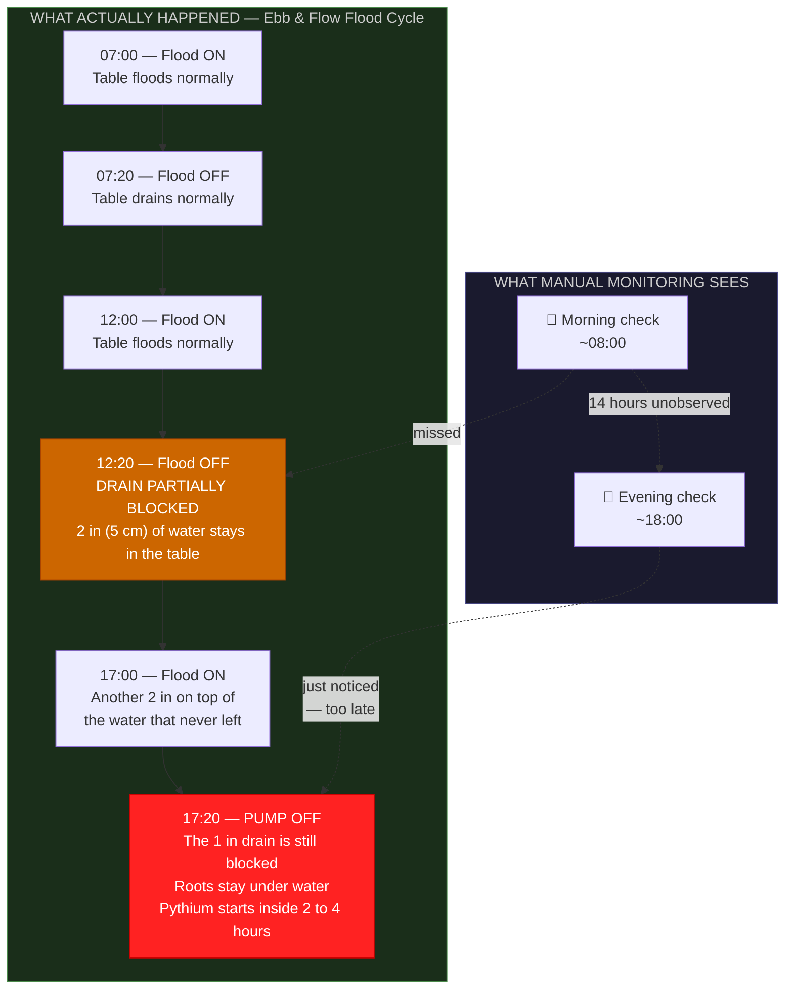

The partial drain failure at 12:20 was invisible to both manual checks. A drain confirmation sensor would have flagged it at 13:05 (45 minutes after flood end with water still present in table). That is a 6-hour head start on resolving the issue before Pythium had time to establish.

### 1.2 The E&F-Specific Risks Manual Monitoring Misses

| Risk | Time to damage | Visible from above? | Manual check catches it? |
|---|---|---|---|
| Pump stuck ON — permanent flood | 2–4 hours | ❌ Leaves look fine initially | Only if you check during the stuck ON period |
| Drain partially blocked — residual water | 1–3 days | ❌ No visible sign | Only if you feel the LECA below the surface |
| Reservoir empty — incomplete floods | Hours to days | ❌ Plants may look fine (stored moisture in LECA) | Only if you check reservoir level |
| Timer failure — skipped flood cycles | Moist LECA holds 8–24 hours | Slight wilting is late | Only if you count cycles manually |
| EC accumulation in LECA between reservoir changes | Weeks | Leaf tip burn eventually | Only if you EC-test the LECA itself |
| Rain diluting open reservoir | Hours | ❌ | Only if you test EC after rain |

### 1.3 What Automation Adds

```
MANUAL ONLY:
  → You know what the system looked like twice a day
  → You react after damage is visible

WITH TIER 1 (smart plug + WiFi thermometer):
  → You know if the pump cycled every time it should have
  → You get frost and heat alerts at 3 AM
  → You react when damage is beginning, not after it has happened

WITH TIER 2 (ESP32 + reservoir level + flood counter):
  → You know if each flood cycle is completing
  → You know reservoir level in real time
  → You see 24/7 temperature data with trends

WITH TIER 3 (+ drain confirmation sensor + EC/pH):
  → You know if each table DRAINED after each flood
  → You know EC and pH continuously
  → You catch drain blockages within 45 minutes — before Pythium establishes

WITH TIER 4 (dosing, plus the stuck-ON cutoff):
  → If the drain float is still up after the pump should be off, the controller opens the pump relay
  → A backup timer that only recovers a stuck-OFF pump is secondary
  → EC and pH can dose automatically, outside an active flood
  → You check the dashboard once a day and top up stock bottles weekly
```

[↑ Back to TOC](#table-of-contents)

---


## 2. Automation Tiers Overview

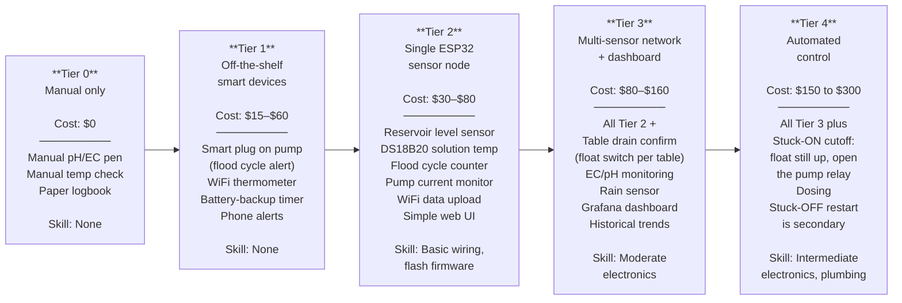

Each tier builds on the previous. You can pause at any tier and run the system indefinitely from there. Start at Tier 1 for your first season — understand the system behaviour — then add complexity when you're ready.

[↑ Back to TOC](#table-of-contents)

---


## 3. Tier 0 — Manual Baseline

This is your current setup as documented in Guides 08 and 10. It works — but it requires discipline and physical presence, and has meaningful gaps for E&F specifically.

**What you already have:**
- Handheld pH pen (calibrated monthly)
- Handheld EC pen (calibrated monthly)
- Aquarium thermometer (reservoir water temp)
- Min/max thermometer (air temp)
- Paper logbook
- Visual inspection of table drain after each cycle

**What manual monitoring cannot tell you:**
- Whether the table drained fully between flood cycles (the single most important E&F data point)
- Whether the pump actually fired on schedule overnight
- Whether the reservoir level is sufficient for a complete flood
- Whether an overnight frost is approaching
- Whether afternoon sun spiked the solution temperature

**The one manual check that matters most in E&F:**

```
DAILY DRAIN CONFIRMATION CHECK (manual, Tier 0):

After the last flood cycle of the day (or ~30 min after it ends):
  1. Push your hand 5–8cm into the LECA in each table.
  2. The LECA should feel damp but not wet.
     No free liquid should collect in your palm.
  3. If free water is present 30+ min after flood end:
     → Drain fitting may be partially blocked
     → Standpipe may be seated incorrectly
     → Drain hose may have developed an uphill section
     → Address immediately — do not run another flood cycle
       until this is resolved.

This check takes 30 seconds and is the most important Tier 0
automation step in the entire E&F guide.
```

[↑ Back to TOC](#table-of-contents)

---


## 4. Tier 1 — Off-the-Shelf Smart Devices

### Cost: $15–$60 | Skill: None | Time: 15–30 minutes to set up

### 4.1 Smart Plug on the Pump — Flood Cycle Confirmation

**Recommended: TP-Link Tapo P110 or Shelly Plug S** (~$12–$18)

This is the single most important Tier 1 addition for an E&F system. In NFT, a smart plug tells you if the pump has failed (pump runs continuously — absence of power is a failure). In E&F, the smart plug tells you something more nuanced: **is the pump cycling correctly?**

Plug your submersible pump into the smart plug. The smart plug logs power draw over time. You should see regular spikes corresponding to flood cycles:

```
EXPECTED SMART PLUG POWER PATTERN (normal E&F operation):

Time:   06:00  07:00  08:00  12:00  13:00  18:00  19:00
Power:  OFF    ON→OFF OFF    ON→OFF OFF    ON→OFF OFF
Watts:  0W     25W→0W 0W     25W→0W 0W     25W→0W 0W
         |      |             |             |
         |    flood          flood         flood
         |   cycle 1        cycle 2       cycle 3

ALERT CONDITIONS:
1. Pump ON for >35 min continuously → timer may have failed (stuck ON)
   → This is the #1 E&F silent killer: permanent flooding
2. Expected cycle did not occur (0W at scheduled ON time for >5 min)
   → Pump failure, timer failure, or power cut
3. Power draw 50% below normal during cycle
   → Pump impeller wear or filter blocked — output reduced
```

**Setup:**
- Plug the smart plug into the 120 V outdoor GFCI (SA: 230 V, 30 mA earth-leakage breaker)
- Plug pump into the smart plug (not the timer — the timer connects to the smart plug, and the smart plug connects to the pump, so the smart plug sees the actual pump cycling)
- Set alert: if consumption stays >5W for >35 consecutive minutes → send notification

> **Wiring order: GFCI outlet → Timer → Smart plug → Pump**
> This way: the timer controls when the pump can receive power (as designed), AND the smart plug monitors whether the pump is actually drawing current during those windows. If the timer malfunctions and the pump runs continuously, the smart plug sees >35 min of continuous draw and alerts you.

### 4.2 Battery-Backup Digital Timer (Upgrade if Needed)

If your current timer does not have battery backup, this is the first $10–$16 you spend on automation. See Guide 12, Section 2.6 for the full argument. No additional setup — simply replace the existing timer with one that retains its programme through a power cut.

**Test procedure:**
1. Programme your flood schedule.
2. Unplug the timer from the wall for 30 seconds.
3. Re-plug.
4. Confirm the programme is unchanged.
5. If the programme reverted to factory defaults: the timer does not have true battery backup — replace it.

### 4.3 WiFi Temperature and Humidity Logger

**Recommended: Govee H5075 or H5179** (~$15–$25)

Features and placement for E&F:

```
GOVEE SENSOR PLACEMENT (E&F specific)

Location 1 — Air temperature (ambient):
  Mount on the table frame, shaded side, at plant height (~90cm)
  NOT in direct sun (reads artificially high)
  NOT directly above reservoir (reads warm and humid)
  Alert: HIGH >30°C, LOW <3°C, HUMIDITY >85%

Location 2 — Reservoir water temperature:
  Use Govee H5179 (has waterproof probe)
  Hang probe into reservoir through inspection port
  Alert: HIGH >24°C (stress begins), LOW <10°C (plant growth slows)

Why reservoir temperature matters in E&F:
  Warm solution during flooding carries less dissolved oxygen.
  In E&F, the dry period between floods is the oxygen recovery period
  for roots. If the solution is warm AND floods are too frequent,
  roots never fully recover DO levels. Temperature monitoring
  directly informs flood schedule decisions.
```

### 4.4 WiFi Camera (Optional)

A cheap WiFi camera (~$20–$30, e.g., Wyze Cam, TP-Link Tapo C100) pointed at the system gives you:
- Visual confirmation that all three tables are flooding and draining (you can see the surface change between dry LECA and flooded)
- Remote check of plant health without visiting the system
- Time-lapse documentation of crop growth
- Night-vision view for nocturnal pest detection (slugs, snails)

For E&F specifically, a camera angled to show the drain hose exit into the reservoir confirms drain flow — you can see whether solution is actively draining back after a flood cycle.

### 4.5 Tier 1 Summary

| Device | Cost | E&F-specific value |
|---|---|---|
| TP-Link Tapo P110 smart plug | $15 | Flood cycle monitoring; stuck-ON detection; pump failure alert |
| Battery-backup digital timer | $12–$16 | Prevents timer reset → permanent flood |
| Govee H5075 (air temp/humidity) | $15 | 24/7 temp + humidity, frost + heat alerts |
| Govee H5179 (water temp probe) | $20 | Reservoir water temp, warm-solution flood alert |
| WiFi camera (optional) | $25 | Visual drain confirmation; pest detection |
| **Tier 1 total** | **$62–$91** | |

[↑ Back to TOC](#table-of-contents)

---


## 5. Tier 2 — ESP32 Sensor Node

### Cost: $30–$80 | Skill: Basic wiring, firmware flashing | Time: 3–5 hours

### 5.1 Why ESP32?

The ESP32 is a $5–$8 microcontroller with built-in WiFi, dozens of GPIO pins, low power consumption, and a massive open-source ecosystem. It outperforms Arduino (no WiFi), Raspberry Pi (overkill and power-hungry), and commercial IoT sensors (expensive, locked ecosystems) for this use case.

```
PLATFORM COMPARISON

                    Arduino Uno    ESP32          Raspberry Pi 4
                    ───────────    ──────────     ──────────────
Cost                $5–$25         $5–$8          $35–$75
WiFi built-in       ❌              ✅              ✅
Analog inputs       6              Up to 18       0 (needs ADC)
Power consumption   ~50 mA         ~80 mA active  ~600 mA (always on)
                                   ~10 µA sleep
Outdoor suitability Good           Best           Poor (heat sensitivity)
OTA firmware update ❌              ✅              ✅
VERDICT: ESP32 is the best fit for E&F sensor nodes.
```

### 5.2 E&F-Specific Tier 2 Sensor Additions

The Tier 2 sensor set for E&F differs from NFT in two critical ways:
1. **Reservoir level sensor** is promoted to highest priority (empty reservoir = no flood = root desiccation without warning)
2. **Flood cycle counter** confirms the timer is actually firing — something NFT does not need because the NFT pump runs continuously

| Sensor | Measurement | E&F priority | Cost |
|---|---|---|---|
| DS18B20 waterproof probe | Solution temperature | HIGH | $2–$4 |
| JSN-SR04T waterproof ultrasonic | Reservoir water level | **CRITICAL** | $3–$6 |
| ACS712 / SCT-013 current sensor | Pump current draw (flood cycle confirmation) | HIGH | $3–$6 |
| DHT22 / SHT30 | Air humidity + temperature | MEDIUM | $3–$6 |
| LDR photoresistor | Light level (relative) | LOW | $0.50 |

**Total sensor cost: ~$12–$23**

### 5.3 Flood Cycle Counter Logic

The flood cycle counter is the key Tier 2 feature unique to E&F automation. It counts pump-on events per day and alerts if fewer than the expected number occur.

```
FLOOD CYCLE COUNTER — HOW IT WORKS:

The ACS712 current sensor is wired in-line with the pump power cable.
When the pump runs it draws about 35 W (range 25–45 W).
On 120 V that is roughly 0.2–0.4 A. On 230 V (SA) it is roughly 0.1–0.2 A.

The ESP32 monitors current every 5 seconds:
  IF current > threshold (e.g., >0.05A) → pump is ON
  IF current ≤ threshold → pump is OFF

The firmware maintains a daily counter:
  counter increments each time pump transitions from OFF → ON
  counter resets at midnight

ALERTS:
  IF counter at 09:00 = 0 → no morning flood occurred (expected 1 by 09:00)
     → ALERT: "Morning flood not detected — check timer and pump"
  IF counter at 18:00 < 2 → fewer floods than expected today
     → ALERT: "Flood count low — only N floods by 18:00 (expected 3)"
  IF pump ON for >35 min without OFF event → stuck ON
     → CRITICAL ALERT: "Pump running >35 min — possible timer failure"
```

### 5.4 Reservoir Level Sensor — Why It Is Critical in E&F

In NFT, the reservoir level slowly drops over days and weeks as solution is consumed. The system still runs — just at lower levels — until the pump eventually draws air. In E&F, a low reservoir means the pump floods the tables with less than the required volume: the LECA bed is only partially flooded. Roots in the upper bed never reach moisture. The plant looks healthy until it suddenly wilts. The difference is that in E&F, the flood/drain cycle creates a discrete event where a low reservoir has an immediate consequence (underflooding) rather than a gradual one.

```
RESERVOIR LEVEL ALERT THRESHOLDS (E&F system):

Measure level BETWEEN floods (all solution returned to the reservoir).
A full flood sends about 25–30 US gal (95–114 L) out to the three tables.
The 45 US gal (170 L) fill (range 40–50 US gal / 151–189 L) has to keep
the pump submerged at the bottom of that swing. Plan on about 15 US gal
(57 L) still in the tank at full flood.

Level > 90%:  GREEN   Normal operation
Level 80–90%: GREEN   Monitor; top up within 1–2 days
Level 75–80%: YELLOW  Top up today — flood margin shrinking
Level < 75%:  RED     ALERT — incomplete flood / pump exposure likely
Level < 60%:  CRITICAL — pump will draw air mid-flood; halt flood schedule
              Add "pump dry run protection" in firmware:
              IF level < 60% → do not activate pump next scheduled cycle
```

### 5.5 What the Tier 2 Node Does

```
EVERY 60 SECONDS, THE NODE:

  1. Reads solution temperature           ──→ Logs to WiFi endpoint
  2. Reads reservoir level (%)            ──→ Logs to WiFi endpoint
  3. Reads pump current draw              ──→ Logs to WiFi endpoint
  4. Reads air temp + humidity            ──→ Logs to WiFi endpoint
  5. Increments flood counter if          ──→ Logs cycle event
     pump transition detected

  ALERTS (Telegram / email):
  IF solution temp > 24°C                ──→ Send heat alert
  IF solution temp < 10°C                ──→ Send cold alert
  IF air temp < 3°C                      ──→ Send frost warning
  IF humidity > 85%                      ──→ Send disease risk alert
  IF reservoir level < 75%               ──→ Send low-level alert
  IF reservoir level < 60%               ──→ Send CRITICAL alert
  IF pump ON > 35 min continuous         ──→ Send CRITICAL: stuck-ON alert
  IF daily flood count < expected        ──→ Send timer warning

  Also serves a local web page at http://hydro-node.local showing
  current readings and a 24-hour chart of all parameters.
```

[↑ Back to TOC](#table-of-contents)

---


## 6. Tier 3 — Multi-Sensor Network + Dashboard

### Cost: $80–$160 | Skill: Moderate wiring, networking | Time: 6–12 hours

### 6.1 The Drain Confirmation Sensor — The Most Important E&F Sensor

The drain float is the sensor behind the primary safety action. It answers one question: is the bed still full after the pump should be off?

**Why this matters more than pH or EC sensors:**

A pump stuck ON, or a 1 in (25 mm) drain that does not empty, holds roots under water. Root rot starts in 2–4 hours. The plant still looks fine from above. The action is not another alert you might sleep through. If the float is still up after the pump should be off, open the pump relay.

### 6.2 Drain Confirmation Sensor — Float Switch

A float switch opens or closes depending on whether it is under water. Mount one in each flood table, low in the bed — about 1½ in (3–4 cm) above the floor. That is below the 4¼ in (11 cm) standpipe, so the float is up during a real flood, and down once the 1 in drain has emptied the bed. Keep a pocket in the 5 in (13 cm) LECA clear so the float can move.

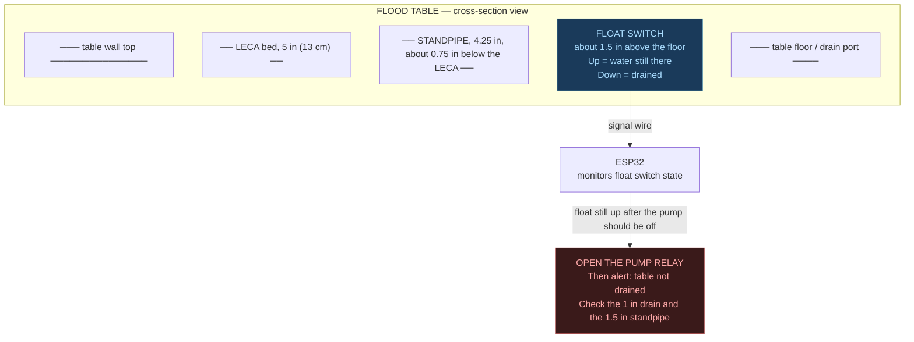

**Float switch specification:**
- Type: normally-open (NO) or normally-closed (NC) — either works; configure in firmware
- Rating: 12V DC or 24V DC (safe for ESP32 circuit)
- Material: PP or HDPE body (food safe, nutrient solution resistant)
- Mounting: drill a small hole in the table wall at the target height; feed cable through a waterproof gland; seal around gland with pond-safe silicone
- Cost: $3–$6 each ($9–$18 for three tables)

**Drain confirmation logic:**

```
DRAIN CONFIRMATION ALGORITHM:

Variable: flood_end_time (timestamp when pump turned OFF)
Variable: table_float[1], table_float[2], table_float[3] (current state of each float switch)

EVERY 60 SECONDS:
  time_since_flood_end = now() - flood_end_time

  FOR EACH table:
    IF table_float[i] == SUBMERGED AND the pump should already be off:
      → OPEN THE PUMP RELAY. This is the stuck-ON cutoff.
      → SEND ALERT: "Table [i] still flooded after the pump should be off"
      → LOG the event
      → Do not start another flood until that float is down

    IF table_float[i] == DRY AND time_since_flood_end > 5 minutes:
      → LOG "Table [i] drain confirmed at [timestamp]"
      → Normal operation continues

  IF ALL three tables confirm drain within 30 min: LOG "Full drain cycle OK"
```

### 6.3 Additional Tier 3 Sensors

| Sensor | Measurement | E&F-specific note | Cost |
|---|---|---|---|
| Float switch (per table × 3) | Table drain state | The #1 E&F sensor — see above | $3–$6 each |
| DFRobot SEN0161-V2 | Solution pH (continuous) | Media EC drift also monitored; see 6.4 | $30–$40 |
| DFRobot DFR0300 | Solution EC (continuous) | Place in sensor cell after reservoir, pre-tables | $40–$55 |
| Rain sensor (FC-37 or equivalent) | Rain detected (binary) | Open E&F tables can accumulate rain — triggers EC dilution alert | $2–$4 |
| Capacitive soil sensor (Zone C × 2) | Grow bag moisture | Optional Zone C monitoring | $2–$3 |

### 6.4 Rain Sensor — An E&F-Specific Addition

Unlike covered NFT channels, E&F flood tables are open-topped horizontal surfaces. During heavy rain, significant volumes of rainwater accumulate in the LECA bed. This dilutes the nutrient solution in the table and — if rain persists long enough to overflow through the drain fitting — dilutes the reservoir.

The rain sensor triggers an EC check reminder rather than an automated action:

```
RAIN SENSOR LOGIC:

IF rain_sensor = WET for > 10 minutes:
  → LOG: "Rain event detected at [timestamp]"
  → SEND NOTIFICATION: "Rain detected. Check reservoir EC
    after rain stops and adjust if EC has dropped > 0.2 mS/cm."
  → Record rain event duration

After rain stops:
  → WAIT 30 minutes (allow drainage)
  → IF automated EC monitoring (Tier 3+):
    Compare current EC to pre-rain EC
    IF EC drop > 0.2 mS/cm: ALERT "EC diluted by rain — top up nutrients"
```

### 6.5 EC and pH Probes — Installation in E&F

Inline EC and pH probes are placed in a sensor cell on the reservoir outflow line — the same position as NFT systems. Place the sensor cell between the pump output and the supply T-splitter so all solution passes the probes before entering the tables.

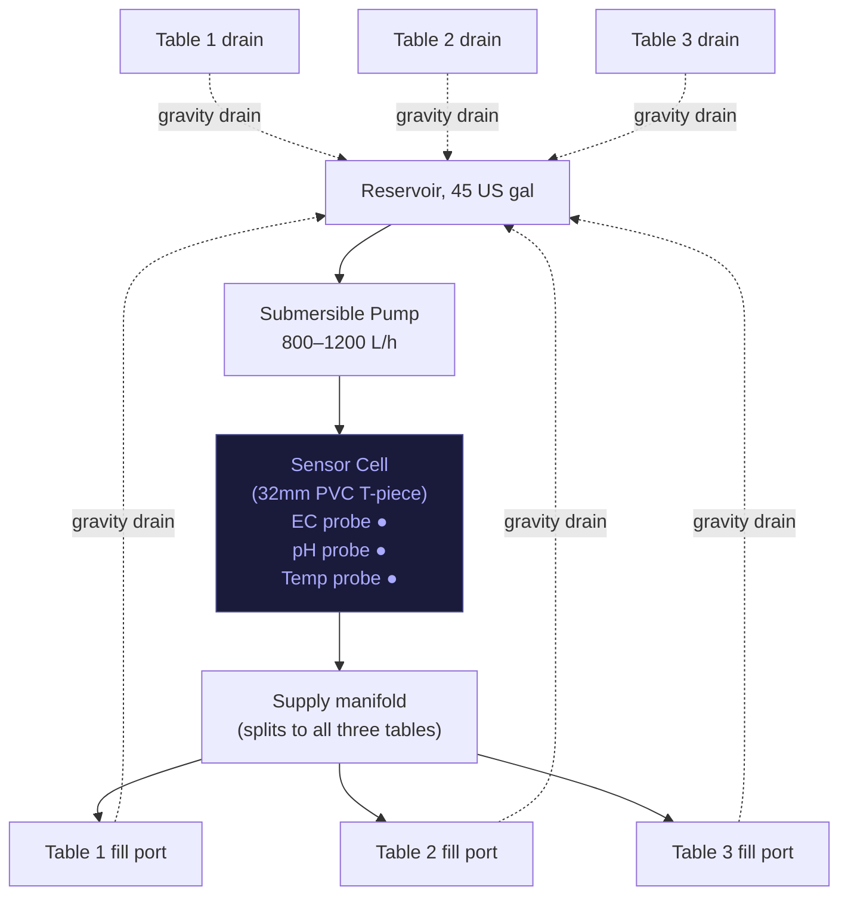

> **E&F probe monitoring note:** In E&F systems, EC and pH data is most useful between flood cycles — when the solution in the reservoir has stabilised after the previous flood return. During an active flood (pump running), turbulence and root zone interaction can cause short-term EC and pH fluctuations. Your firmware should flag active-flood periods and either discard those readings or display them separately from the stable reservoir readings.

### 6.6 Dashboard — Grafana + InfluxDB

The recommended free stack:

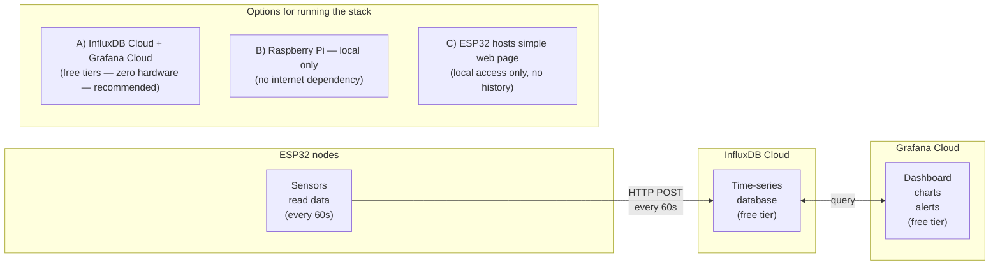

**E&F-specific dashboard panels:**

```
RECOMMENDED GRAFANA PANELS FOR E&F:

Panel 1: FLOOD CYCLE TIMELINE (last 24h)
  → Bar chart: each flood cycle shown as a block
  → Expected: 3–4 bars per day at scheduled times
  → Missing bar = missed flood (timer/pump failure)
  → Overly long bar = stuck-ON event

Panel 2: RESERVOIR LEVEL (last 7 days)
  → Line chart: 0–100%
  → Daily consumption rate visible
  → Top-up events visible as sudden level increase
  → Alert line at 75% (between-flood level; see Section 5.4)

Panel 3: DRAIN CONFIRMATION STATUS (last 24h)
  → Per-table green/red indicator
  → Table 1 drain confirmed / not confirmed
  → Table 2 drain confirmed / not confirmed
  → Table 3 drain confirmed / not confirmed

Panel 4: SOLUTION TEMPERATURE (last 7 days)
  → Line chart with DANGER threshold at 24°C

Panel 5: EC and pH (last 7 days)
  → Dual line chart with target band shading

Panel 6: RAIN EVENTS (last 30 days)
  → Event markers showing rain detection and
    associated EC level post-rain

Panel 7: ALERT LOG
  → Timestamped list of all alerts triggered
```

[↑ Back to TOC](#table-of-contents)

---


## 7. Tier 4 — Automated Control

### Cost: $150–$300 | Skill: Intermediate electronics, basic plumbing | Time: 12–18 hours

### 7.1 What Tier 4 Automates

| Function | How it works | Components | Cost |
|---|---|---|---|
| **pH auto-dosing** | Peristaltic pump dispenses pH Down/Up when pH drifts | Peristaltic pump + relay + pH probe | $25–$40 |
| **EC auto-dosing** | Peristaltic pump dispenses nutrient concentrate when EC drops | Peristaltic pump + relay + EC probe | $25–$40 |
| **Stuck-ON cutoff** | If the drain float is still up after the pump should be off, open the pump relay | Float input plus the pump relay | $10–$15 (R180–R270) |
| **Stuck-OFF restart** | Secondary. If a scheduled flood never starts, a second path can start the pump | Second relay. Not the safety device | included above |
| **Remote pump control** | Manually fire a flood cycle from phone | Smart plug with API / ESP32 relay | $0 (existing smart plug) |
| **Cooling fan** | Fan blows across reservoir surface when temp > 24°C | 12V fan + relay module | $8–$12 |
| **Reservoir auto top-up** | Float valve or solenoid opens water supply when level drops | Float valve or solenoid + level sensor | $15–$25 |

### 7.2 Stuck-ON Cutoff — the Primary Safety Action

The failure that rots roots is a pump that stays on. Root rot starts in 2–4 hours. The outdoor timer is already a digital 1-minute timer in a weatherproof box. Automation adds one action on top of that timer: if the drain float is still up after the pump should be off, open the pump relay.

A second path that only starts a pump which failed to start is useful, and it is secondary. It does not stop a flood that never ended.

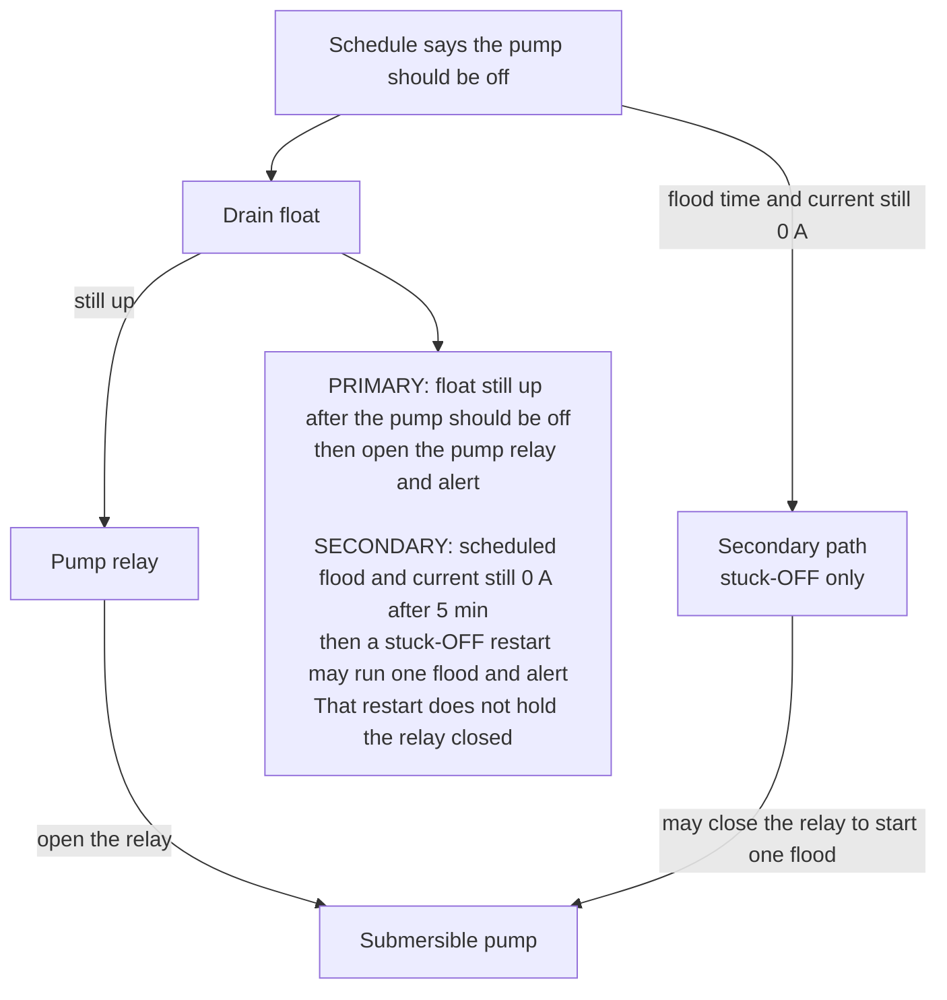

Opening the relay is the headline. The stuck-OFF restart is the footnote. Do not describe a backup timer that only recovers a stopped pump as the safety system.

### 7.3 Automated pH Dosing — E&F Adaptation

pH dosing logic is largely the same as NFT (see NFT Guide 13, Section 7.2 for full detail), but with two E&F-specific rules:

```
E&F pH DOSING SAFETY INTERLOCKS (additions beyond standard rules):

1. NEVER dose during an active flood cycle:
   IF flood_active == TRUE → hold all dosing
   Reason: Solution turbulence during flooding causes inaccurate pH reads.
   Wait until flood ends and reservoir has restabilised (5 min post-flood).

2. CHECK DRAIN CONFIRMATION before dosing:
   IF table_float[ANY] == SUBMERGED (table not drained) → hold dosing
   Reason: Undrained table means solution volume is split between
   reservoir and table. EC and pH readings are unrepresentative.
   Dosing against partial-volume readings causes overshooting.

3. MINIMUM RESERVOIR LEVEL for dosing:
   IF reservoir_level < 75% → halt all dosing
   Reason: Reservoir volume too small for reliable EC/pH calculations.
   Low volume = large dose effect = easy to overshoot.
```

### 7.4 Automated EC Dosing in E&F — Media Salt Accumulation

E&F EC dosing has one additional complexity not present in NFT: **salt accumulation in the LECA media between flood cycles.** LECA is porous and retains nutrient solution. Over many flood cycles, salt concentration in the LECA pores can exceed reservoir EC — especially in the upper layers that receive less frequent wetting.

```
EC MEDIA DRIFT MONITORING:

Standard EC probe (in sensor cell) reads RESERVOIR EC.
Media EC (EC within the LECA pores) can diverge from reservoir EC over weeks.

Symptoms of media salt accumulation:
  - Reservoir EC appears stable or normal
  - Plants show mild leaf tip burn (nutrient burn from concentrated media)
  - EC probe reads normal but plants show high-EC stress symptoms

Detection method (Tier 3+ manual check, monthly):
  1. After a flood cycle, collect 50mL of drain water from the drain hose
     before it re-enters the reservoir.
  2. Test EC of this drain water with your handheld pen.
  3. Compare to reservoir EC.

RESULT INTERPRETATION:
  Drain EC ≈ Reservoir EC:   Good — media EC matches reservoir
  Drain EC > Reservoir EC +0.3:  Salt accumulating in media
     Action: Run 2–3 "flush cycles" with plain pH-adjusted water
             to wash salts from LECA before next nutrient refill
  Drain EC > Reservoir EC +0.8:  Significant salt accumulation
     Action: Full media flush + reservoir change this week
```

### 7.5 Automated Dosing Full Flow

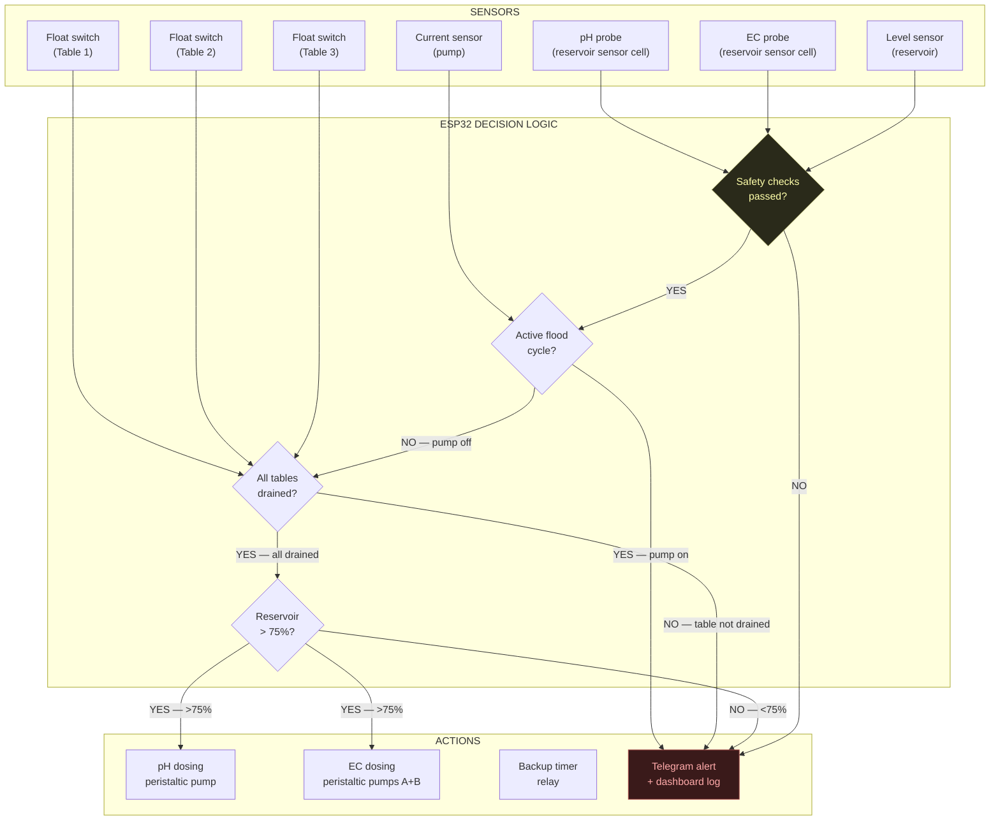

[↑ Back to TOC](#table-of-contents)

---


## 8. Sensor Reference — What to Measure and Why

### 8.1 Complete E&F Sensor Matrix

| Parameter | Sensor | Interface | Normal range | Alert threshold | Priority |
|---|---|---|---|---|---|
| **Table drain state** | Float switch (per table) | Digital GPIO | DRY between floods | SUBMERGED >45 min after flood end | **CRITICAL** |
| **Reservoir level** | JSN-SR04T waterproof ultrasonic | Trigger + Echo GPIO | 80–100% between floods | <75% WARNING; <60% CRITICAL | **CRITICAL** |
| **Flood cycle count** | ACS712 current sensor (event counting) | Analog ADC | 3–4 events/day | Fewer than expected; or ON >35 min continuous | HIGH |
| **Pump current** | ACS712 (5A) | Analog ADC | 0.08–0.15A during cycle | 0A during scheduled ON = failure | HIGH |
| **Solution temperature** | DS18B20 waterproof | OneWire digital | 16–24°C | >24°C WARNING; >28°C CRITICAL; <10°C WARNING | HIGH |
| **Air temperature** | DS18B20 or DHT22 | Digital GPIO | 10–30°C | <3°C frost WARNING | HIGH |
| **Air humidity** | DHT22 / SHT30 | Digital GPIO | 40–80% | >85% for >6h = disease risk | MEDIUM |
| **Solution pH** | DFRobot SEN0161-V2 | Analog ADC | 5.5–6.5 | <5.3 or >6.8 | MEDIUM |
| **Solution EC** | DFRobot DFR0300 | Analog ADC | 1.2–2.0 mS/cm | <0.8 or >2.5 mS/cm; also check drain EC vs reservoir EC monthly | MEDIUM |
| **Rain event** | FC-37 rain sensor | Digital GPIO | Dry | Rain detected → trigger EC check reminder | MEDIUM |
| **Light level** | BH1750 | I2C (SDA/SCL) | Varies by season | Sudden drop = cloud cover / shade cloth needed | LOW |
| **Grow bag moisture (Zone C)** | Capacitive soil sensor | Analog ADC | 40–70% | <30% = water needed | LOW |
| **Barometric pressure** | BME280 | I2C | 980–1030 hPa | Falling rapidly = incoming weather | LOW |

### 8.2 Sensor Priority Rationale for E&F

The E&F sensor priority order differs from NFT in two key ways:

```
NFT PRIORITY ORDER (top = most important):
  1. Solution temperature (Pythium risk)
  2. Pump current (failure = roots dry in 30 min)
  3. Reservoir level
  4. pH / EC

E&F PRIORITY ORDER:
  1. Table drain confirmation (failure = Pythium in 2–4 hours, invisible)
  2. Reservoir level (incomplete floods = gradual root desiccation)
  3. Pump current — specifically: STUCK ON detection (worse than no flood)
  4. Solution temperature
  5. pH / EC (important but plants tolerate short-term drift in E&F
     better than NFT due to LECA moisture buffer)
```

### 8.3 Sensor Selection Tips

**Float switch vs. ultrasonic level sensor in table:**

Both can be used as drain confirmation sensors. Float switches are cheaper ($3–$6) and simpler to wire. Ultrasonic sensors ($5–$10) provide continuous water level data within the table rather than a binary wet/dry state.

For most growers: use a float switch. It is entirely sufficient for drain confirmation. If you also want to know how deep the flood is reaching (useful for standpipe height optimisation), use a JSN-SR04T mounted in the table wall pointing down at the LECA surface.

**Current sensor — ACS712 vs. SCT-013:**

The ACS712 is an inline current sensor — the pump power wire passes through a hole in the IC. It requires the wire to be cut and threaded through, which some growers find daunting. The SCT-013 is a clamp sensor — it clips around the outside of the existing pump power cable without cutting anything. For Tier 2 DIY builders, the SCT-013 (~$5–$8) is often the easier starting point.

**Rain sensor — simple is fine:**

The FC-37 and similar rain sensors are very basic: a conductive pad that short-circuits slightly when wet. They are not reliable as rainfall quantity sensors, but they are entirely adequate as "is it currently raining?" binary detectors. Cost $2–$3. Protect from direct sun (UV degrades the pad) and replace every 2 seasons.

[↑ Back to TOC](#table-of-contents)

---


## 9. ESP32 Hardware Guide

### 9.1 Which ESP32 Board?

| Board | Cost | Pro | Con | Recommended for |
|---|---|---|---|---|
| ESP32-WROOM-32 DevKit | $5–$8 | Cheapest, most documented | No battery management | Tier 2–3 sensor nodes |
| ESP32-S3 DevKit | $7–$12 | More ADC channels, USB-C | Slightly more expensive | Tier 3 with many analog sensors |
| ESP32-C3 Super Mini | $3–$5 | Tiny, very cheap | Fewer pins, less power | Single-purpose float-switch node |
| LILYGO T-Display S3 | $15–$20 | Built-in LCD | Higher cost | Display node showing current cycle status |

**Recommended: ESP32-WROOM-32 DevKit** for the first build.

### 9.2 ESP32 Pin Layout for E&F Sensor Node

```mermaid
flowchart LR
    subgraph esp["ESP32-WROOM-32 DevKit"]
        PWR3["3.3V"] -->|"3.3V supply"| S1["DS18B20 probe<br/>(solution temp)"]
        PWR3 --> S2["DHT22<br/>(air temp + humidity)"]
        PWR3 --> S5["BH1750<br/>(light — I2C)"]
        PWR3 --> S8["Rain sensor FC-37<br/>(digital out)"]

        PWR5["5V"] -->|"5V supply"| S3["JSN-SR04T<br/>(reservoir level)"]
        PWR5 --> S4["ACS712 / SCT-013<br/>(pump current)"]
        PWR5 --> S6["DFRobot pH board"]
        PWR5 --> S7["DFRobot EC board"]

        G4["GPIO 4"] -->|"OneWire"| S1
        G15["GPIO 15"] -->|"data"| S2
        G16["GPIO 16"] -->|"TRIG"| S3
        G17["GPIO 17"] ---|"ECHO"| S3
        G34["GPIO 34<br/>(input-only)"] ---|"analog"| S4
        G35["GPIO 35<br/>(input-only)"] ---|"pH analog"| S6
        G32["GPIO 32"] ---|"EC analog"| S7
        G33["GPIO 33"] -->|"rain sensor"| S8
        G21["GPIO 21"] -->|"I2C SDA"| S5
        G22["GPIO 22"] -->|"I2C SCL"| S5

        G18["GPIO 18"] -->|"Float switch T1<br/>(pull-up to 3V3)"| FS1["Table 1<br/>float switch"]
        G19["GPIO 19"] -->|"Float switch T2<br/>(pull-up to 3V3)"| FS2["Table 2<br/>float switch"]
        G23["GPIO 23"] -->|"Float switch T3<br/>(pull-up to 3V3)"| FS3["Table 3<br/>float switch"]

        G25["GPIO 25"] -->|"Relay 1"| R1["pH pump<br/>(Tier 4)"]
        G26["GPIO 26"] -->|"Relay 2"| R2["EC-A pump<br/>(Tier 4)"]
        G27["GPIO 27"] -->|"Relay 3"| R3["EC-B pump<br/>(Tier 4)"]
        G14["GPIO 14"] -->|"Relay 4"| R4["Backup timer relay<br/>(Tier 4)"]

        VIN["VIN"] ---|"5V USB"| USB["USB phone charger"]
    end

    note["GPIO 34/35/36/39: INPUT ONLY — no internal pull-up<br/>GPIO 6–11: flash memory — DO NOT USE<br/>Float switches: use INPUT_PULLUP (internal 3.3V pull-up to avoid external resistor)"]
    style note fill:#2a1a1a,stroke:#8a4a4a,color:#ffaaaa
```

### 9.3 Float Switch Wiring Detail

Float switches are the simplest sensors in the E&F system. Two wires — signal and ground. Use the ESP32's internal pull-up resistor (INPUT_PULLUP mode) to avoid needing external resistors.

```
FLOAT SWITCH WIRING:

Float switch wire 1 → ESP32 GPIO 18 (Table 1), GPIO 19 (Table 2),
                      or GPIO 23 (Table 3)
Float switch wire 2 → GND

In firmware (Arduino/ESP-IDF):
  pinMode(18, INPUT_PULLUP);   // Table 1 (19 = Table 2, 23 = Table 3)
  int table1_state = digitalRead(18);
  // When float submerged: switch closes → pin reads LOW (0)
  // When float dry:       switch open   → pin reads HIGH (1) via pull-up

  bool table1_flooded = (table1_state == LOW);

Physical mounting:
  Drill 8–10mm hole in table WALL (not floor) at the desired
  trigger height (3–4cm above the table floor — well below the flood
  waterline, but high enough to read DRY once the table has drained;
  keep a small pocket in the LECA clear so the float moves freely).
  Feed cable through a PG7 cable gland.
  Apply pond-safe silicone around gland exterior.
  Allow 24h cure before testing with water.
  ENSURE float can move freely — nothing blocking it above or below.
```

### 9.4 Power Budget

```
POWER BUDGET — E&F Tier 3 Node

Component                   Current (mA)    Voltage
───────────────────────────────────────────────────────
ESP32 (WiFi active)         80–160          3.3V (from USB)
DS18B20 probe               3               3.3V
DHT22                       2.5             3.3V
JSN-SR04T                   15              5V
ACS712 / SCT-013            10              5V
BH1750                      1               3.3V
DFRobot pH board            5               5V
DFRobot EC board            5               5V
Rain sensor FC-37           <1              3.3V
Float switch × 2            <0.1 each       3.3V (via pull-up)
───────────────────────────────────────────────────────
Total:                      ~125–210 mA at 5V

Any USB phone charger (5V / 1A) is sufficient for Tier 2–3.
For Tier 4 with relay module and peristaltic pumps:
  Use a 5V / 2A charger for the ESP32 + relays.
  Use a SEPARATE 12V / 2A supply for peristaltic pumps.
  Never power 12V actuators from the ESP32's 5V rail.
```

[↑ Back to TOC](#table-of-contents)

---


## 10. Wiring Diagrams

### 10.1 Tier 2 — Basic E&F Sensor Node

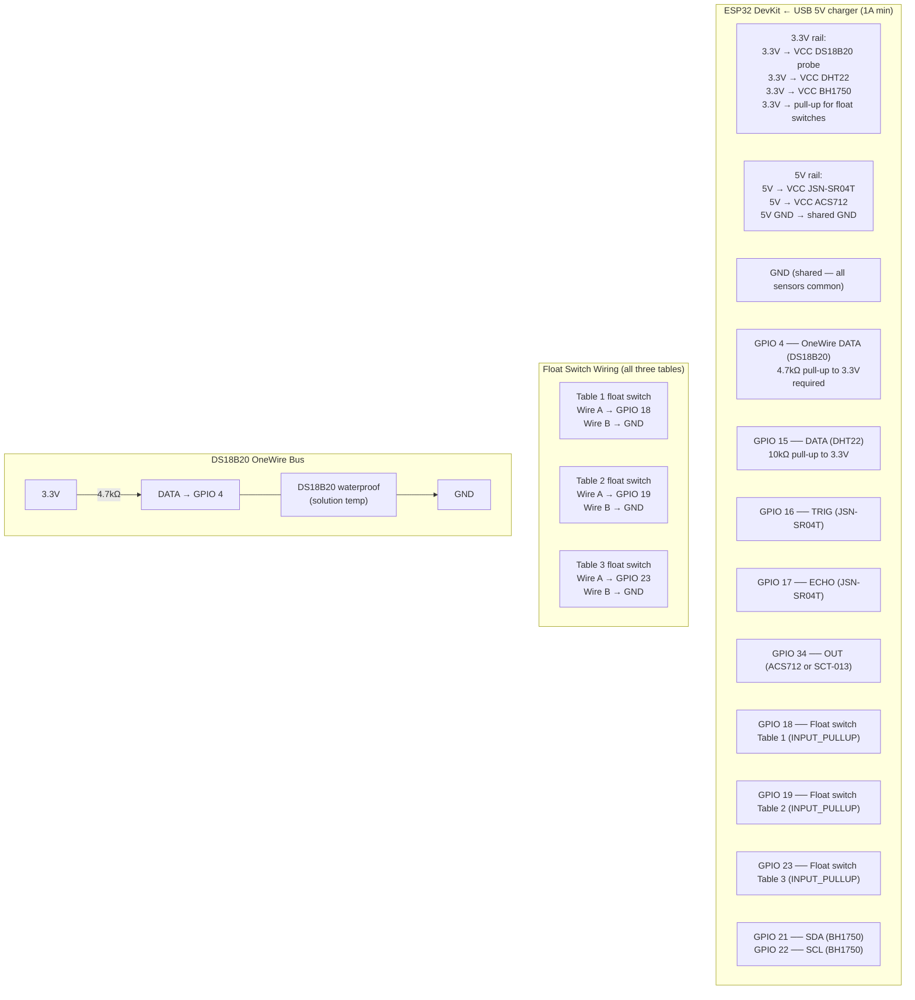

### 10.2 Tier 3 — Adding EC/pH Probes and Rain Sensor

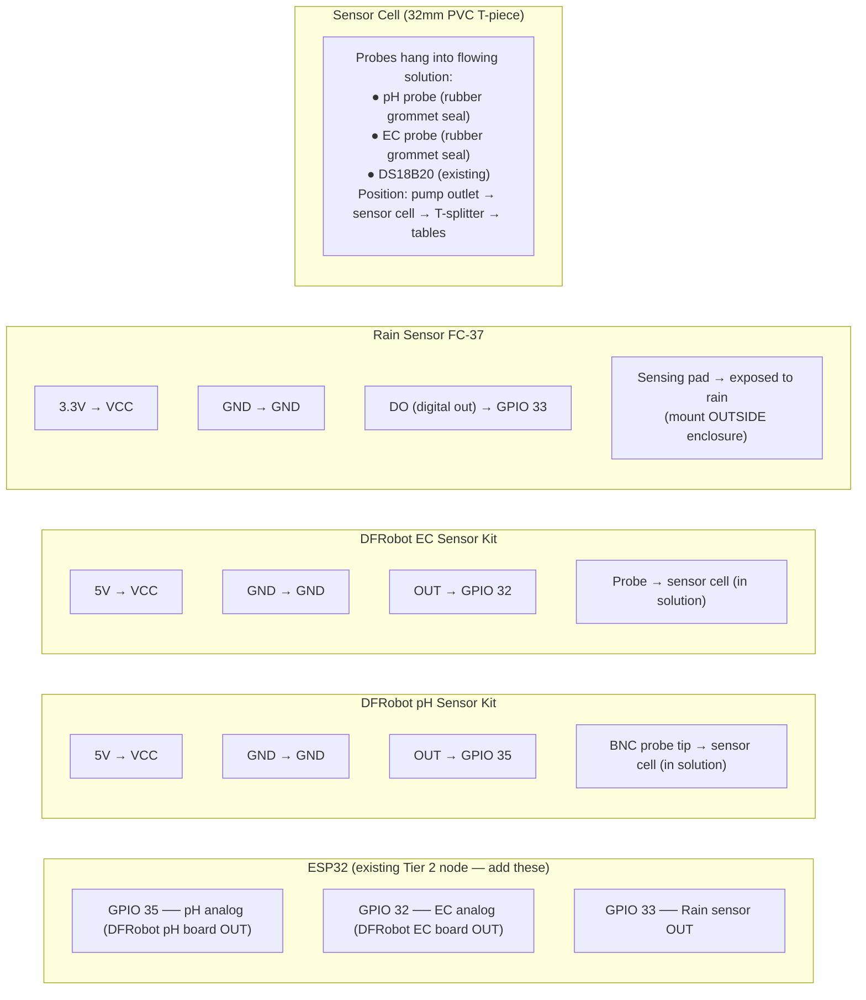

### 10.3 Tier 4 — Relay Module and Dosing Pumps

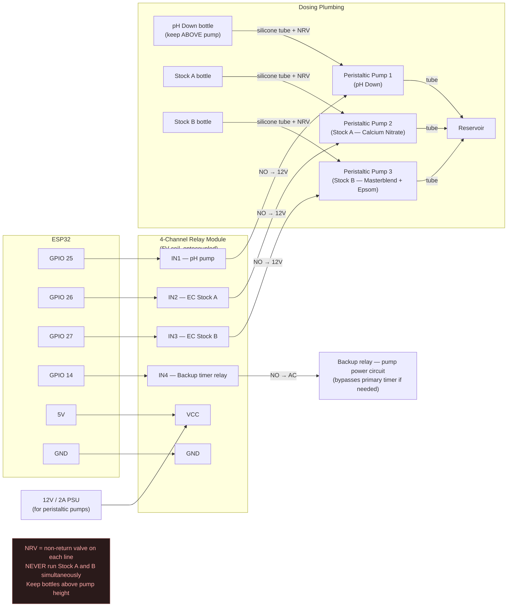

[↑ Back to TOC](#table-of-contents)

---


## 11. Firmware and Software

### 11.1 Firmware Options

| Firmware | Skill level | Features | Best for |
|---|---|---|---|
| **ESPHome** | Beginner | YAML config, Home Assistant integration, OTA updates | Tier 2–3, if using Home Assistant |
| **Tasmota** | Beginner | Web config, MQTT, rule engine | Tier 1–2, simple setups |
| **Custom Arduino / PlatformIO** | Intermediate | Full control, any logic | Tier 3–4, E&F-specific drain logic |
| **MicroPython** | Intermediate | Python on ESP32, rapid prototyping | Quick experiments and testing |

### 11.2 ESPHome — E&F Configuration

Example ESPHome YAML for a Tier 2/3 E&F node with flood cycle counter and drain confirmation logic:

```yaml
# ef-hydro-node.yaml — ESPHome config for Ebb & Flow sensor node

esphome:
  name: ef-hydro-node
  platform: ESP32
  board: esp32dev

wifi:
  ssid: "YourWiFiNetwork"
  password: "YourWiFiPassword"

web_server:
  port: 80

logger:
ota:
  password: "your-ota-password"

globals:
  - id: flood_count_today
    type: int
    initial_value: "0"
  - id: pump_was_on
    type: bool
    initial_value: "false"
  - id: flood_start_time
    type: int
    initial_value: "0"
  - id: flood_end_time
    type: int
    initial_value: "0"

# Dallas OneWire bus for DS18B20
dallas:
  - pin: GPIO4

sensor:
  # Solution temperature
  - platform: dallas
    address: 0x1234567890ABCDEF
    name: "Solution Temperature"
    unit_of_measurement: "°C"
    accuracy_decimals: 1

  # Reservoir level — JSN-SR04T ultrasonic
  - platform: ultrasonic
    trigger_pin: GPIO16
    echo_pin: GPIO17
    name: "Reservoir Level"
    update_interval: 30s
    unit_of_measurement: "%"
    filters:
      - lambda: |-
          float empty_cm = 45.0;
          float full_cm = 5.0;
          float pct = (empty_cm - x) / (empty_cm - full_cm) * 100.0;
          return clamp(pct, 0.0f, 100.0f);

  # Pump current — ACS712
  - platform: adc
    pin: GPIO34
    id: pump_current
    name: "Pump Current"
    unit_of_measurement: "A"
    update_interval: 5s
    attenuation: 11db
    filters:
      - calibrate_linear:
          - 1.65 -> 0
          - 2.15 -> 1.0
      - sliding_window_moving_average:
          window_size: 6

  # Flood cycle counter (updated by pump state changes)
  - platform: template
    name: "Flood Count Today"
    id: flood_counter
    lambda: "return id(flood_count_today);"
    update_interval: 60s
    unit_of_measurement: "cycles"

  # Air humidity and temperature
  - platform: dht
    pin: GPIO15
    model: DHT22
    temperature:
      name: "Air Temperature"
    humidity:
      name: "Air Humidity"
    update_interval: 30s

binary_sensor:
  # Table 1 float switch (LOW = submerged)
  - platform: gpio
    pin:
      number: GPIO18
      mode: INPUT_PULLUP
      inverted: true
    id: table1_float
    name: "Table 1 Flooded"
    on_press:
      - logger.log: "Table 1 float: SUBMERGED"
    on_release:
      - lambda: |-
          int time_since_flood = millis() - id(flood_end_time);
          if (time_since_flood > 2700000) {  // 45 minutes in ms
            ESP_LOGW("drain", "Table 1 drain confirmation: OK (>45 min wait)");
          } else {
            ESP_LOGI("drain", "Table 1 draining normally");
          }

  # Table 2 float switch
  - platform: gpio
    pin:
      number: GPIO19
      mode: INPUT_PULLUP
      inverted: true
    id: table2_float
    name: "Table 2 Flooded"

  # Table 3 float switch
  - platform: gpio
    pin:
      number: GPIO23
      mode: INPUT_PULLUP
      inverted: true
    id: table3_float
    name: "Table 3 Flooded"

  # Pump running detection (from current sensor)
  - platform: template
    name: "Pump Running"
    id: pump_running
    lambda: "return id(pump_current).state > 0.05;"
    on_press:
      - lambda: |-
          if (!id(pump_was_on)) {
            id(flood_count_today) += 1;
            id(flood_start_time) = millis();
            id(pump_was_on) = true;
          }
    on_release:
      - lambda: |-
          id(flood_end_time) = millis();
          id(pump_was_on) = false;
```

### 11.3 Drain Confirmation Alert Logic (Arduino/PlatformIO)

For growers using custom firmware, here is the drain confirmation check as a standalone function:

```cpp
// Drain confirmation check — call every 60 seconds from main loop

unsigned long flood_end_ms = 0;          // set when pump transitions OFF
const unsigned long DRAIN_TIMEOUT = 45UL * 60UL * 1000UL;  // 45 min in ms
const int FLOAT_PIN_T1 = 18;
const int FLOAT_PIN_T2 = 19;
const int FLOAT_PIN_T3 = 23;

void checkDrainConfirmation() {
  if (flood_end_ms == 0) return;  // no flood has occurred yet

  unsigned long elapsed = millis() - flood_end_ms;

  bool t1_flooded = (digitalRead(FLOAT_PIN_T1) == LOW);  // LOW = submerged
  bool t2_flooded = (digitalRead(FLOAT_PIN_T2) == LOW);
  bool t3_flooded = (digitalRead(FLOAT_PIN_T3) == LOW);

  if (elapsed > DRAIN_TIMEOUT) {
    if (t1_flooded) {
      sendAlert("DRAIN ALERT: Table 1 not drained 45 min after flood end. "
                "Check standpipe, drain hose, and drain fitting.");
      pauseNextFloodCycle(1);  // prevent next flood on table 1
    }
    if (t2_flooded) {
      sendAlert("DRAIN ALERT: Table 2 not drained 45 min after flood end.");
      pauseNextFloodCycle(2);
    }
    if (t3_flooded) {
      sendAlert("DRAIN ALERT: Table 3 not drained 45 min after flood end.");
      pauseNextFloodCycle(3);
    }
    if (!t1_flooded && !t2_flooded && !t3_flooded) {
      logEvent("Drain confirmed — all tables dry at " +
               String(elapsed / 60000) + " min post-flood.");
    }
  }
}

// Stuck-ON detection — call every 30 seconds
void checkStuckOn() {
  static unsigned long pump_on_start = 0;
  const unsigned long MAX_FLOOD_MS = 35UL * 60UL * 1000UL;  // 35 min

  bool pump_on = (analogRead(ACS712_PIN) > CURRENT_THRESHOLD);

  if (pump_on && pump_on_start == 0) {
    pump_on_start = millis();  // pump just turned on
  } else if (!pump_on) {
    pump_on_start = 0;         // pump off — reset
  } else if (pump_on && (millis() - pump_on_start > MAX_FLOOD_MS)) {
    sendCriticalAlert("CRITICAL: Pump has been running for >35 min. "
                      "Possible timer failure. Table may be permanently flooded. "
                      "Check system immediately.");
  }
}
```

### 11.4 Sending Data to InfluxDB

```cpp
// HTTP POST to InfluxDB Cloud — call after each sensor read cycle
void postToInfluxDB(float sol_temp, float air_temp, float humidity,
                    float res_level, float pump_amps,
                    bool t1_flooded, bool t2_flooded, bool t3_flooded,
                    int flood_count) {

  String body = "solution_temp,system=ef-1 value=" + String(sol_temp) + "\n"
              + "air_temp,system=ef-1 value=" + String(air_temp) + "\n"
              + "humidity,system=ef-1 value=" + String(humidity) + "\n"
              + "reservoir_level,system=ef-1 value=" + String(res_level) + "\n"
              + "pump_current,system=ef-1 value=" + String(pump_amps) + "\n"
              + "table1_flooded,system=ef-1 value=" + String(t1_flooded ? 1 : 0) + "\n"
              + "table2_flooded,system=ef-1 value=" + String(t2_flooded ? 1 : 0) + "\n"
              + "table3_flooded,system=ef-1 value=" + String(t3_flooded ? 1 : 0) + "\n"
              + "flood_count_today,system=ef-1 value=" + String(flood_count);

  // POST to: https://cloud2.influxdata.com/api/v2/write?org=YOUR_ORG&bucket=hydroponics
  // Header: Authorization: Token YOUR_TOKEN
  // Header: Content-Type: text/plain
}
```

[↑ Back to TOC](#table-of-contents)

---


## 12. Data Storage and Dashboards

### 12.1 Storage Options

| Option | Cost | Retention | Access | Skill | Best for |
|---|---|---|---|---|---|
| **Paper logbook** | $0 | Forever | Physical only | None | Tier 0 manual baseline |
| **Spreadsheet (manual)** | $0 | Forever | Your computer | Basic | Tier 0–1 |
| **Google Sheets (auto via IFTTT)** | $0 | Forever | Any browser | Basic | Tier 1 Govee data export |
| **InfluxDB Cloud + Grafana Cloud** | $0 (free tier) | 30 days | Any browser | Moderate | Tier 2–4 — recommended |
| **Home Assistant + InfluxDB (local)** | $35–$75 (Pi) | Forever | Local network | Moderate | Privacy-first growers |
| **SD card on ESP32** | $3 | Until card full | Physical card | Basic | Off-grid or no WiFi sites |

### 12.2 E&F-Specific InfluxDB + Grafana Setup

Setup steps (cloud, ~20–30 minutes):

```
INFLUXDB + GRAFANA CLOUD SETUP FOR E&F

Step 1: Create free InfluxDB Cloud account
  → https://cloud2.influxdata.com/signup
  → Create bucket: "ebb-and-flow"
  → Generate API token (write access for ESP32, read for Grafana)

Step 2: Configure ESP32 firmware
  → Enter InfluxDB URL, org, bucket, token
  → Data appears within 60s of first POST

Step 3: Create free Grafana Cloud account
  → https://grafana.com/auth/sign-up
  → Add InfluxDB as data source

Step 4: Build E&F dashboard panels
  Panel 1: FLOOD CYCLE STATUS
    → Stat panel: pump_running (NOW)
    → Time series: pump_current last 24h (see flood pulses)
    → Threshold: red if ON >35 min (stuck-ON detection)

  Panel 2: DRAIN CONFIRMATION
    → Stat panels: table1_flooded / table2_flooded / table3_flooded (NOW)
    → Green if DRY, red if FLOODED
    → Time series: all three states last 24h

  Panel 3: RESERVOIR LEVEL
    → Gauge: current level %
    → Time series: last 7 days (see daily consumption and top-ups)
    → Threshold: red zone <30%

  Panel 4: SOLUTION TEMPERATURE
    → Time series: last 7 days
    → Threshold band: green 16–24°C, yellow 10–16°C, red >24°C

  Panel 5: EC AND pH
    → Dual-axis time series: last 7 days
    → Target band shading for each parameter

  Panel 6: FLOOD COUNT TIMELINE
    → Bar chart: flood_count_today per day, last 30 days
    → Immediately shows days with fewer than expected floods

Step 5: Configure Grafana alerts
  → Pump ON >35 min → CRITICAL notification
  → Table flooded >45 min post-flood → CRITICAL notification
  → Reservoir <30% → WARNING notification
  → Daily flood count < expected → WARNING notification
```

### 12.3 What 30 Days of E&F Data Shows You

After one full month of continuous logging, you will be able to read:

- **Average flood cycle duration:** If this is trending longer over weeks, the drain fitting may be accumulating blockage
- **Reservoir consumption rate:** If L/day is suddenly higher than seasonal average, check for a slow leak at a bulkhead fitting
- **EC between reservoir changes:** If EC is drifting up faster than before, media salt accumulation may be beginning — schedule a flush cycle
- **Flood count consistency:** If the occasional flood cycle is being missed (fog in the data, not a complete outage), the timer may be on the edge of failure — replace it

[↑ Back to TOC](#table-of-contents)

---


## 13. Alerts and Notifications

### 13.1 E&F Alert Priority Matrix

The E&F alert priorities differ significantly from NFT because the primary failure modes are different:

```
E&F ALERT PRIORITIES

🔴 CRITICAL (wake you up at 3 AM — immediate action required)

  • Pump running past the end of the flood, or the drain float still up
    → Stuck ON. Root rot in 2–4 hours
    → Action: open the pump relay. That is the primary automatic safety action.
      Then clear the 1 in drain or the timer.

  • Table float still up after the pump should be off
    → Same cutoff. Open the pump relay. Inspect the 1 in drain and the 1½ in standpipe.

  • Reservoir level < 15%
    → Pump at risk of dry run → incomplete floods → pump damage
    → Action: Top up reservoir; check for leak

  • Solution temperature < 2°C
    → Freeze imminent → system damage
    → Action: Deploy fleece; activate heater

🟡 WARNING (action within 2–4 hours)

  • Flood count today < expected
    → Timer or pump may be failing; roots receiving fewer floods than needed
    → Action: Check timer programme; verify pump function

  • Reservoir level < 30%
    → Incomplete floods possible; top up today
    → Action: Top up reservoir

  • EC > target + 30% or < target - 30%
    → Nutrient imbalance; plants may show stress within 48h
    → Action: Test and adjust reservoir; check for rain dilution

  • Solution temperature > 24°C
    → Warm solution carries less DO; increased Pythium risk
    → Action: Deploy shade; add frozen water bottles to reservoir

  • Air temperature < 3°C
    → Frost risk; solution may approach 0°C overnight
    → Action: Deploy fleece; check if heater is operating

  • Rain detected + EC drop > 0.2 mS/cm post-rain
    → Tables accumulating rain dilution
    → Action: Test reservoir EC; top up nutrients if needed

🟢 INFORMATIONAL (check at convenience — daily digest)

  • Daily summary: flood count, min/max temp, avg EC/pH, reservoir consumption
  • Weekly drain confirmation log: were all drains confirmed this week?
  • LECA media EC check reminder (monthly)
  • Calibration due reminder (pH probe every 3–4 weeks)
  • Reservoir change reminder (based on nutrient consumption rate)
```

### 13.2 Notification Channels

| Channel | Cost | Latency | Setup effort | Best for |
|---|---|---|---|---|
| **Telegram bot** | Free | Instant | 10 min | All alert levels — best overall |
| **Email (Gmail SMTP)** | Free | 1–5 min | 15 min | Daily summaries, non-urgent alerts |
| **Pushover** | $5 one-time | Instant | 5 min | Push notifications with priority levels |
| **Home Assistant Companion** | Free | Instant | 5 min (if using HA) | Phone push notifications |
| **Discord webhook** | Free | Instant | 5 min | If you already use Discord |

### 13.3 Telegram Bot — Recommended Setup

1. Open Telegram, search for `@BotFather`
2. Send `/newbot`, follow prompts, name it "EbbFlowAlert" or similar
3. Save the bot token (format: `123456:ABC-DEF1234ghIkl-zyx57W2v1u123ew11`)
4. Start a chat with your new bot and send any message
5. Get your chat ID: visit `https://api.telegram.org/bot<YOUR_TOKEN>/getUpdates`
6. In ESP32 firmware, send alerts via HTTP GET:
   ```
   https://api.telegram.org/bot<TOKEN>/sendMessage?chat_id=<ID>&text=MESSAGE
   ```

**Example alert messages for E&F:**

```
🔴 STUCK-ON CRITICAL
Pump has been running for 37 minutes.
Timer failure suspected — table may be permanently flooded.
Action: Power off pump immediately, check timer.
System: ef-hydro-node | Time: 14:37:22

🔴 DRAIN FAILURE — TABLE 1
Table 1 float switch still SUBMERGED 47 min after flood end.
Drain fitting blockage suspected.
Next flood cycle for Table 1 has been paused.
Action: Inspect drain port and hose. Clear blockage before next flood.

🟡 RESERVOIR LOW
Reservoir level: 27% (threshold: 30%)
Estimated dry-flood risk: medium
Action: Top up reservoir today — add 30–40L.

🟢 DAILY SUMMARY — Mon 02 Mar
Floods today: 3 / 3 expected ✅
All drains confirmed ✅
Solution temp: min 16.2°C / max 21.8°C ✅
Air temp: min 7.1°C / max 17.4°C ✅
EC: avg 1.42 mS/cm ✅
pH: avg 5.94 ✅
Reservoir: 58% (consumed ~8L today)
Rain: no events
```

[↑ Back to TOC](#table-of-contents)

---


## 14. Using Your Data — Pattern Recognition

### 14.1 Flood Cycle Duration Trending Longer

```
PATTERN: Average flood cycle time increasing over weeks

Week 1:  Table fills to overflow in 4 min; drains in 18 min
Week 4:  Table fills to overflow in 4 min; drains in 24 min
Week 8:  Table fills to overflow in 4 min; drains in 31 min

MEANING: Drain fitting or hose is partially accumulating blockage.
         Root material, LECA dust, or algae is narrowing the drain bore.

ACTION:
  1. Power off system. Remove standpipe.
  2. Flush drain port with clean water — look for debris exit.
  3. If slow: use a narrow brush or bottle brush to clear drain hose.
  4. Inspect standpipe bottom — roots often grow into the standpipe bore.
  5. After clearing: run water test — drain time should return to Week 1.
  6. If not resolved: remove and inspect bulkhead fitting from outside.
     Remove and clean. Reseal if needed.

THRESHOLD: If drain time reaches 35 min → halt flood schedule until resolved.
           Never flood a table that took >35 min to drain in the previous cycle.
```

### 14.2 Reservoir Level Dropping Faster Than Expected

```
PATTERN: Reservoir drops 15L/day in cool weather (expected: 5–8L)

POSSIBLE CAUSES:
  A) Leak — slow drip from bulkhead fitting, hose joint, or table liner
  B) Evaporation spike — reservoir lid not sealing; unusually windy day
  C) Plant uptake spike — rapid growth phase (EC dropping simultaneously)
  D) Sensor drift — JSN-SR04T reading lower than actual level

DIAGNOSIS:

  First: Check EC simultaneously.
    - If EC RISING with level dropping → evaporation (water lost, nutrients stay)
    - If EC STABLE with level dropping → plant uptake (balanced consumption)
    - If EC FALLING with level dropping → rain dilution or leak from clean-water source

  Physical check:
    - Inspect all bulkhead fittings on all tables (inside and outside)
    - Run one flood cycle and watch all connections carefully
    - Check reservoir exterior for drips
    - Inspect drain hose connections at reservoir entry point

  Sensor check:
    - Mark reservoir level manually on the wall with a marker
    - Compare sensor reading to physical mark after 24h
    - If diverging: recalibrate JSN-SR04T (adjust empty_cm and full_cm in firmware)
```

### 14.3 EC Rising Between Full Reservoir Changes

```
PATTERN: Reservoir EC starts at 1.4, reaches 2.0 by day 5 without nutrient addition

MEANING: Plants consuming more water than nutrients (transpiration-heavy).
         Common in hot, dry, or windy conditions.

SHORT-TERM ACTION: Top up with plain pH-adjusted water to dilute EC back to target.

LONG-TERM PATTERN USE:
  If this happens consistently in weeks 3–4 of a crop cycle:
    → Plants are in high-transpiration fruiting or flowering phase
    → Consider reducing target EC slightly in this phase
    → Increase plain water top-up frequency
    → Check if shade cloth deployment reduces the issue

ALSO CHECK: Drain EC vs. Reservoir EC (monthly manual check)
  If drain water EC consistently > reservoir EC + 0.3:
    → Salt accumulating in LECA media
    → Schedule a flush cycle: 3 flood cycles with plain water,
      then reservoir change with fresh nutrient solution
```

### 14.4 Drain Confirmation Failures — Pattern Analysis

```
PATTERN: Table 1 drain confirmation failures appearing after a specific event

Example log:
  Feb 14: All drain confirmations OK
  Feb 15: Drain confirmation OK — 22 min drain
  Feb 16 AM: 2 drain failures (Table 1); cleared after 60 min each
  Feb 16 PM: Drain failures stopped

CORRELATE WITH:
  - Did you harvest and disturb LECA on Feb 15?
    → LECA may have settled unevenly, partially blocking standpipe base
  - Did standpipe get repositioned during planting?
    → Standpipe seated at an angle can partially block drain bore
  - Was there unusually heavy watering or rain on Feb 15?
    → Root mass may have shifted into drain path

RESOLUTION: Remove standpipe, inspect drain bore, clear any root/LECA
            obstruction. Re-seat standpipe vertically.

PATTERN: Consistent drain failure only in Table 2, never Table 1

MEANING: Table 2 drain hose has an intermittent high point. When solution
         fills the hose segment, it creates a hydraulic resistance that
         slows drain. Over time this section sags further.

ACTION: Re-route Table 2 drain hose with continuous downhill slope.
        Use a cable tie to secure hose above the low point temporarily.
```

### 14.5 Flood Count Inconsistencies

```
PATTERN: Flood count shows 2 floods on a day when 3 were scheduled

ONE-OFF EVENT: Power cut (check your smart plug energy log for a gap).
  → Timer retained programme (battery backup confirmed)
  → Normal; no action needed unless it becomes regular

RECURRING PATTERN: 3rd flood regularly missing on hot afternoons
MEANING: Smart plug may have a thermal cutout; timer may be
         timing out during peak heat; pump may overheat and cut out.

CHECK:
  - Look at pump current during the expected 3rd cycle period
  - If pump current 0A when timer should have fired: timer issue
  - If current normal but pump draws 0A after 3 min: pump thermal protection
    → Pump casing too hot (sun exposure); shade the pump/reservoir area
    → Consider adding a small fan near the pump housing

PATTERN: Flood count = 0 for a whole day

CRITICAL — immediate investigation:
  - Timer failure (battery dead? programme corrupted?)
  - Pump failure (impeller seized, capacitor failed)
  - 120 V outdoor GFCI tripped (SA: 230 V, 30 mA earth-leakage). Water may have reached the electrics.
  - Power outage lasted longer than timer battery backup
  → Manually run one flood cycle; if system responds: timer issue
  → If pump doesn't respond manually: pump or electrical failure
```

---

### 14.6 VPD — Vapour Pressure Deficit and Flood Frequency

VPD (Vapour Pressure Deficit) quantifies how hard the air is pulling moisture from plant leaves. In E&F, VPD is directly relevant to **flood frequency decisions**: high VPD means plants are transpiring rapidly, which can lead to salt accumulation in the LECA between floods. Low VPD means slow transpiration and potentially waterlogged media if flood frequency is too high.

**Target VPD range:**
| Growth stage | Target VPD |
|---|---|
| Seedling / cutting | 0.4–0.8 kPa |
| Vegetative growth | 0.8–1.2 kPa |
| Fruiting / flowering | 1.0–1.5 kPa |
| Above 1.8 kPa | Wilting risk — increase flood frequency temporarily |
| Below 0.4 kPa | Disease risk — reduce flood frequency; improve ventilation |

**Flood frequency adjustment guide based on VPD:**

| VPD (kPa) | Typical air temp | Recommended floods/day |
|---|---|---|
| < 0.6 | < 18°C | 2–3 |
| 0.6–1.0 | 18–22°C | 3–4 |
| 1.0–1.4 | 22–26°C | 4–5 |
| > 1.4 | > 26°C | 5–6 (or add shading) |

**ESPHome YAML — VPD as a derived sensor:**

```yaml
sensor:
  # Air temperature + humidity (from DHT22 — already in your config)
  - platform: dht
    pin: GPIO4
    model: DHT22
    temperature:
      name: "Air Temperature"
      id: air_temp
    humidity:
      name: "Air Humidity"
      id: air_humidity
    update_interval: 60s

  # VPD — calculated from air temp + humidity
  - platform: template
    name: "VPD"
    id: vpd
    unit_of_measurement: "kPa"
    icon: "mdi:water-percent"
    update_interval: 60s
    lambda: |-
      float T  = id(air_temp).state;
      float RH = id(air_humidity).state;
      if (isnan(T) || isnan(RH)) return NAN;
      // Tetens equation: SVP = 0.6108 * exp(17.27 * T / (T + 237.3))
      float svp = 0.6108f * expf(17.27f * T / (T + 237.3f));
      float vpd = svp * (1.0f - RH / 100.0f);
      return vpd;
    filters:
      - sliding_window_moving_average:
          window_size: 5

# VPD alerts
binary_sensor:
  - platform: template
    name: "VPD High — Increase Flood Frequency"
    device_class: problem
    lambda: |-
      return id(vpd).state > 1.4;
    filters:
      - delayed_on: 20min
    on_press:
      - logger.log: "VPD > 1.4 kPa — consider adding a flood cycle today"

  - platform: template
    name: "VPD Very High — Wilting Risk"
    device_class: problem
    lambda: |-
      return id(vpd).state > 1.8;
    filters:
      - delayed_on: 10min
    on_press:
      - logger.log: "ALERT: VPD > 1.8 kPa — wilting risk; add shade cloth"

  - platform: template
    name: "VPD Low — Disease Risk"
    device_class: problem
    lambda: |-
      return id(vpd).state < 0.4 && id(vpd).state > 0.0;
    filters:
      - delayed_on: 30min
    on_press:
      - logger.log: "WARNING: VPD < 0.4 kPa — mildew risk; improve airflow"
```

**Grafana — add VPD to your dashboard:**

Add a time-series panel for `vpd` alongside flood count:
- Green band: 0.8–1.4 kPa (healthy range for most fruiting crops)
- Yellow band: 0.4–0.8 kPa or 1.4–1.8 kPa (caution)
- Red band: <0.4 kPa or >1.8 kPa

This lets you correlate VPD spikes with EC rise (evaporation-driven concentration), drain confirmation failures (fast uptake on hot days), and flood count sufficiency — all from the same dashboard.

[↑ Back to TOC](#table-of-contents)

---


## 15. Weatherproofing and Power

### 15.1 Enclosure for ESP32 and Wiring

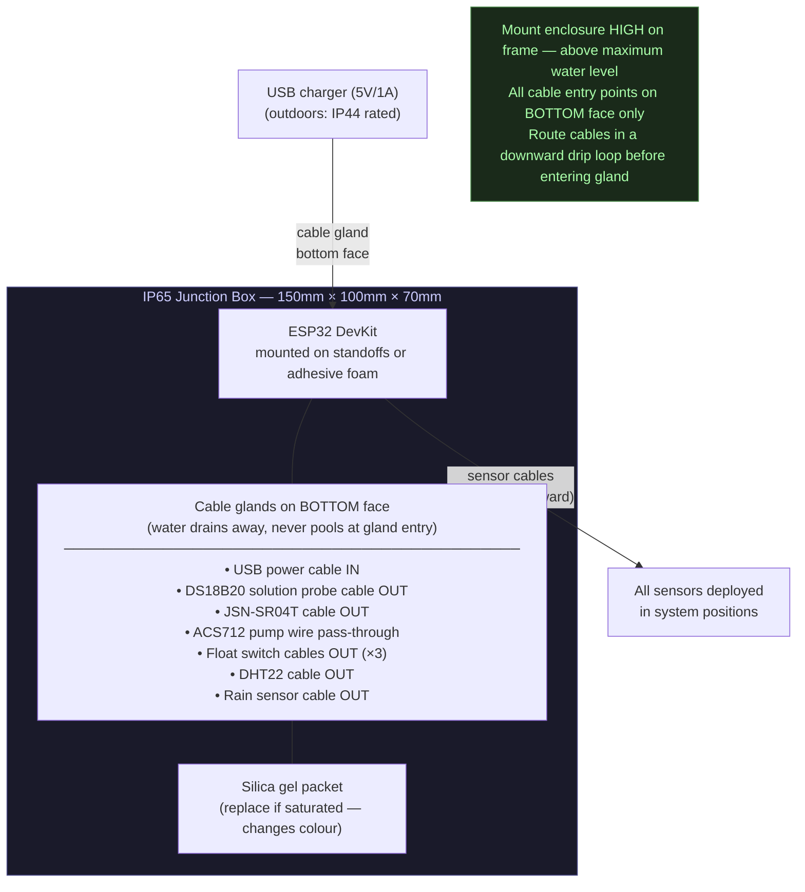

### 15.2 Timer Weatherproofing — The #1 Field Failure

Timer failure in rain is the most common catastrophic failure mode reported by E&F growers. Water ingress into the timer erases the programme or shorts the relay, leaving the pump in a random state (usually OFF, occasionally stuck ON).

```
TIMER WEATHERPROOFING RULES:

1. NEVER place a timer in direct rain exposure, even with an IP rating.
   "IP44" means splash-resistant — not rain-resistant when water runs along
   the power cable into the housing from above.

2. USE A DEDICATED WEATHERPROOF ENCLOSURE:
   → IP65-rated outdoor enclosure, minimum 200mm × 150mm × 100mm
   → Mount on vertical surface so rain runs OFF, not into
   → All cable entries at bottom of enclosure only
   → Leave ventilation gap at bottom for condensation escape

3. POWER CABLE DRIP LOOP:
   → The power cable entering the enclosure should dip BELOW the enclosure
     entry point before going up to the socket
   → Water running along the cable collects at the drip loop and
     falls away rather than entering the enclosure
   → This is the most important and cheapest weatherproofing measure

4. TEST QUARTERLY:
   → In spring: open enclosure, check for condensation, moisture marks,
     or rust on any metal contacts
   → Replace timer if any moisture ingress is detected — do not wait
     for a failure to act

5. DIGITAL TIMER BATTERY BACKUP:
   → Test battery backup every 3 months: unplug timer, check schedule retained
   → Replace battery annually (most use a standard CR2032 — $0.50)
   → A dead backup battery is functionally equivalent to no battery backup
```

### 15.3 Float Switch Cable Weatherproofing

The float switch cables exit through the table walls and must remain watertight at the point they pass through:

```
FLOAT SWITCH INSTALLATION — WATERPROOFING:

1. Use PG7 cable glands (rated IP68 when correctly installed)
2. Drill hole sized exactly for the cable gland thread in the TABLE WALL
   (not the floor — wall mounting allows cable to route downward)
3. Apply a small bead of pond-safe silicone around the outside of the
   gland flange where it seats against the table wall
4. Tighten gland nut firmly — the rubber seal inside the gland
   compresses around the cable, creating the waterproof seal
5. Apply a second bead of silicone over the exterior flange/gland junction
6. Allow 24h cure before testing
7. Route cable down the table exterior and into the main enclosure
   via a drip loop (cable goes DOWN below enclosure entry before going UP)
```

### 15.4 Power Options

| Power source | Cost | Runtime | Best for |
|---|---|---|---|
| USB wall charger + outdoor extension | $0 (existing) | Unlimited | Systems near mains power |
| USB power bank 20,000 mAh | $15–$25 | ~4–7 days (ESP32 @ 120 mA) | Remote locations, backup |
| 5W solar panel + LiPo battery | $15–$25 | Unlimited (with sun) | Off-grid sites |
| PoE splitter (if Ethernet available) | $10 | Unlimited | Wired permanent installs |

**Solar power note for E&F:**
A 5W solar panel with a TP4056 charge controller and a 3.7V 6000 mAh LiPo battery runs an ESP32 sensor node indefinitely in most climates. Using `esp_sleep_enable_timer_wakeup()` to deep-sleep between 60-second readings reduces average current to ~5–10 mA, extending battery life to weeks without sun. Note: the backup timer relay (Tier 4) cannot use deep sleep — the ESP32 must be awake to fire the relay on schedule.

[↑ Back to TOC](#table-of-contents)

---


## 16. Automation BOM by Tier

### Tier 1 — Off-the-Shelf ($62–$91)

| Item | Cost |
|---|---|
| TP-Link Tapo P110 smart plug (or Shelly Plug S) | $15 |
| Battery-backup digital timer (if not already owned) | $12–$16 |
| Govee H5075 temp/humidity logger (air) | $15 |
| Govee H5179 water temp probe (reservoir) | $20 |
| WiFi camera (optional) | $25 |
| **Tier 1 total** | **$62–$91** |

### Tier 2 — ESP32 Sensor Node ($48–$65)

| Item | Cost |
|---|---|
| ESP32-WROOM-32 DevKit | $6 |
| DS18B20 waterproof probe (solution temp) | $3 |
| DHT22 module (air temp + humidity) | $4 |
| JSN-SR04T waterproof ultrasonic (reservoir level) | $5 |
| ACS712 5A current sensor (pump current / flood cycle) | $4 |
| Float switch × 2 (drain confirmation, one per table) | $8 |
| BH1750 light sensor | $3 |
| 4.7kΩ + 10kΩ resistors (assorted pack) | $2 |
| Dupont jumper wires (40-pack) | $3 |
| Breadboard or proto board | $3 |
| IP65 junction box (150 × 100 × 70mm) | $6 |
| PG7 cable glands (10-pack, for box and float switches) | $3 |
| USB charger 5V / 1A + 2m micro-USB cable | $8 |
| **Tier 2 total** | **$58** |

### Tier 3 — Full Monitoring ($95–$155, adds to Tier 2)

| Item | Add to Tier 2 cost |
|---|---|
| DFRobot Gravity pH Sensor Kit SEN0161-V2 | $35 |
| DFRobot Gravity EC Sensor Kit DFR0300 | $45 |
| Rain sensor FC-37 | $3 |
| Capacitive soil moisture sensor × 2 (Zone C) | $4 |
| BME280 pressure/humidity sensor | $4 |
| pH calibration buffers (pH 4.0 + 7.0 sachets × 3 sets) | $6 |
| EC calibration solution (1413 µS/cm, 250 mL) | $5 |
| Sensor cell (32mm PVC T-piece + rubber grommets) | $4 |
| Raspberry Pi 4 for local dashboard (optional) | $55 |
| **Tier 3 total (Tier 2 + additions, no Pi)** | **~$165** |

### Tier 4 — Automated Control ($155–$235, adds to Tier 3)

| Item | Add to Tier 3 cost |
|---|---|
| 4-channel relay module (5V, optocoupled) | $5 |
| 12V DC peristaltic pump × 3 (pH Down, Stock A, Stock B) | $30 |
| 12V / 2A power supply (for peristaltic pumps) | $8 |
| Silicone dosing tube (2m per pump × 3) | $6 |
| Non-return valves (3×, one per dosing line) | $5 |
| Stock solution bottles (3× 1L opaque HDPE) | $5 |
| Physical kill switch (inline toggle — disables all relays) | $4 |
| 12V cooling fan 80mm (optional — reservoir cooling) | $6 |
| **Tier 4 total (Tier 3 + additions)** | **~$234** |

### Combined Tier Totals

| Tier | Standalone cost | Cumulative (building up from Tier 1) |
|---|---|---|
| Tier 1 | $62–$91 | $62–$91 |
| Tier 2 | $58 | $120–$149 |
| Tier 3 | $95–$155 | $165–$249 |
| Tier 4 | $69–$95 | $234–$344 |

[↑ Back to TOC](#table-of-contents)

---


## 17. Common Pitfalls

### Pitfall 1 — Float Switch Placed at Wrong Height

**Problem:** Float switch mounted at the wrong height breaks drain confirmation. Too high (at or above the standpipe tip) and it never submerges — drain confirmation reads OK even when the table is holding water. Too low (right at the table floor) and a small residual puddle keeps it reading SUBMERGED after an otherwise healthy drain — false alerts on every cycle.

**Prevention:**
```
CORRECT FLOAT SWITCH PLACEMENT:
  Height: 3–4 cm ABOVE the table floor
  → Below the flood waterline (standpipe tip is at media depth −2 cm,
    e.g. 10 cm) so the switch reads ON at full flood
  → Above any residual puddle so the switch reads OFF after drain
  NOT at or above standpipe height (water level never exceeds this
  in normal operation — switch would never submerge)
  NOT flush with the table floor (residual puddle = permanent ON)

  Verify placement:
  1. Run a test flood cycle.
  2. At flood peak (pump running, table flooded to overflow):
     float switch SHOULD be submerged = reads ON.
  3. After pump off, 20 min into drain:
     float switch SHOULD be dry = reads OFF.
  4. If float switch never reads OFF during a healthy drain:
     it is placed too low — raise it 2cm and re-test.
  5. If float switch never reads ON during a flood:
     it is placed too high — lower it and re-test.
```

### Pitfall 2 — Reservoir Level Sensor False Low During Active Flood

**Problem:** During an active flood cycle, the pump creates significant turbulence in the reservoir as all three tables drain simultaneously back into it. The JSN-SR04T ultrasonic level sensor can return false low readings when the water surface is turbulent.

**Prevention:**
- In firmware, discard reservoir level readings taken during active flood cycles (when pump_running == TRUE)
- Mount the sensor in a calm corner of the reservoir away from the drain return entry points
- Add a baffler (a piece of rigid foam or plastic sheet hung vertically in the reservoir) between the drain return splash zone and the sensor to calm the surface under the sensor

### Pitfall 3 — Dosing During Active Flood Cycle

**Problem:** Automated pH dosing fires during a flood cycle. The EC probe (in the sensor cell) reads solution that is flowing through the sensor cell at high speed — the reading is unrepresentative of actual reservoir EC. The dosing system reacts to the transient reading and over-doses.

**Prevention:** Add a flood-active interlock to all dosing logic:
```
if (pump_running == true) {
  // Do not dose. Do not read EC or pH for dosing purposes.
  // Log: "Dosing held — active flood cycle"
  return;
}
// Only dose when pump is OFF and reservoir has settled for >5 min
if (millis() - flood_end_ms > 300000) {  // 5 min post-flood
  runDosingLogic();
}
```

### Pitfall 4 — Timer Set to Wrong Flood Duration

**Problem:** Flood duration set too long on the timer. Instead of 20-minute floods, the timer is set to 2 hours (a common error when setting an unfamiliar digital timer). The table fills to overflow within 5 minutes and then runs overflow for the remaining 115 minutes — overflowing, splashing, and potentially running the reservoir empty.

**Prevention:**
- The ACS712 current sensor + stuck-ON alert (Tier 2) catches this within 35 minutes
- After every timer change, always physically observe the first flood cycle from start to overflow to confirm the duration is correct
- Set the timer duration to: [time to reach overflow + 5 minutes buffer], not longer

### Pitfall 5 — Skip Calibration on Inline pH/EC Probes

**Problem:** Inline probes are calibrated once, then left for months. Drift is gradual and invisible. Automated dosing acts on wrong data — pH actually 5.0 but probe reads 5.8, so no pH Up is added when it should be, and plants show phosphorus and iron deficiency from chronic low pH.

**Prevention:** Calibrate pH probes every 2–4 weeks, EC probes every 4–8 weeks. A calibration due reminder is included in the daily/weekly dashboard summary. The two-point pH calibration (pH 4.0 and 7.0 buffers) takes under 5 minutes once you have the buffers ready.

### Pitfall 6 — Ignoring Drain EC vs. Reservoir EC Drift

**Problem:** Reservoir EC maintained at 1.4 by automated dosing. Media EC (within the LECA pores) gradually accumulates to 2.8 over 8 weeks. Plants show tip burn and stunted growth. Grower checks reservoir EC (reads 1.4), checks pH (fine), tests solution temp (fine). Cannot diagnose the problem because the automated dosing is maintaining reservoir parameters perfectly while the media itself is concentrating salts.

**Prevention:** Monthly manual drain EC test (see Section 7.4). If drain water EC consistently exceeds reservoir EC by more than 0.3 mS/cm, schedule a flush cycle. Add a calendar reminder for the first of each month: "Test drain EC at next flood cycle."

### Pitfall 7 — Alert Fatigue from Turbulence False Positives

**Problem:** Reservoir level sensor fires "LOW LEVEL" alert 4 times a day during flood cycles due to turbulence false readings (see Pitfall 2). You start ignoring all reservoir level alerts. The day the reservoir actually runs low, you miss the critical alert.

**Prevention:** Use flood-active masking for all sensor readings that are affected by turbulence. In ESPHome: use `filters: - heartbeat: 5min` on the reservoir level sensor to average out transient turbulence dips. In custom firmware: maintain a running average over 3 minutes and only trigger alerts on the averaged value.

### Pitfall 8 — A Stuck-OFF Restart Fighting the Stuck-ON Cutoff

The primary action is still: if the drain float is still up after the pump should be off, open the pump relay. The stuck-OFF restart below is secondary, and it can fight that cutoff if both paths close the relay at once.

**Problem:** The Tier 4 backup timer relay (ESP32-controlled) fires simultaneously with the primary timer. Both the primary timer and the backup relay are trying to control the same pump simultaneously. Under certain relay configurations, this can cause a race condition where both signal ON but the pump receives an ambiguous control signal.

**Prevention:** Use the backup relay in NORMALLY OPEN (NO) configuration with the ESP32 holding it open (inactive) by default. The backup relay ONLY closes (activates pump) when:
1. The scheduled flood time has passed, AND
2. The pump current sensor confirms 0A draw (primary timer did not fire), AND
3. The ESP32 has waited a 5-minute grace period for the primary to respond.

If both primary and backup are trying to turn on the pump simultaneously — that is fine, both closing means pump definitely runs. The conflict to avoid is: backup holds pump ON after primary timer has turned it OFF (sticking the pump in ON state). The stuck-ON alert catches this regardless: any run > 35 min triggers a critical alert.

---

### Pitfall 9 — WiFi Outage Creates a Silent Monitoring Blackout

**Problem:** The ESP32 loses WiFi connection. Data stops flowing. No alerts are sent — including no stuck-ON alert if the pump fails open while the node is offline. Because you've been receiving alerts, silence feels like "nothing to report." But silence could mean the node is offline and the pump has been running for 6 hours.

This is especially dangerous in E&F because the stuck-ON failure (the most catastrophic mode) produces no unusual sound or visual sign. Continuous flooding looks exactly like a normal flood cycle until you physically walk over.

**Prevention — two layers:**

**Layer 1: ESP32 firmware auto-reconnect (ESPHome):**

```yaml
wifi:
  ssid: "YourWiFiNetwork"
  password: "YourWiFiPassword"
  fast_connect: true
  reboot_timeout: 15min   # reboot ESP32 if WiFi not recovered within 15 min
  ap:
    ssid: "EbbFlow-Fallback"
    password: "hydro1234"
```

**Layer 2: Server-side watchdog — Grafana data staleness alert (fastest to set up):**

In Grafana, create an alert on the flood cycle counter or any sensor:

```
Alert rule: "E&F ESP32 Node Offline"
  Query: last value of flood_count_today WHERE time > now()-10m
  Condition: IS NULL  (no data in last 10 minutes)
  Alert: send Telegram + email
  Message: "⚠️ E&F node offline — pump status unknown. Check WiFi and go verify pump state manually."
```

**Layer 2 (alternative): Python watchdog script — runs every 5 minutes:**

```python
#!/usr/bin/env python3
"""
hydro_watchdog.py — server-side dead-man monitor.
Run via cron or systemd timer every 5 minutes.
"""

import os, time, requests
from influxdb_client import InfluxDBClient

INFLUX_URL    = "https://us-east-1-1.aws.cloud2.influxdata.com"
INFLUX_TOKEN  = "your-influx-api-token"
INFLUX_ORG    = "your-org"
INFLUX_BUCKET = "hydroponics"

TELEGRAM_TOKEN   = "your-bot-token"
TELEGRAM_CHAT_ID = "your-chat-id"

TIMEOUT_MINUTES = 10
NODE_NAME       = "ebb-flow-1"
STATE_FILE      = "/tmp/ef_watchdog_alerted.flag"

def get_last_data_age_minutes():
    client = InfluxDBClient(url=INFLUX_URL, token=INFLUX_TOKEN, org=INFLUX_ORG)
    tables = client.query_api().query(f'''
        from(bucket: "{INFLUX_BUCKET}")
          |> range(start: -1h)
          |> filter(fn: (r) => r["node"] == "{NODE_NAME}")
          |> last()
    ''')
    client.close()
    if not tables or not tables[0].records:
        return 999
    age = time.time() - tables[0].records[-1].get_time().timestamp()
    return age / 60.0

def send_telegram(msg):
    requests.post(
        f"https://api.telegram.org/bot{TELEGRAM_TOKEN}/sendMessage",
        data={"chat_id": TELEGRAM_CHAT_ID, "text": msg}
    )

def main():
    age = get_last_data_age_minutes()
    if age > TIMEOUT_MINUTES:
        if not os.path.exists(STATE_FILE):
            send_telegram(
                f"⚠️ E&F WATCHDOG ALERT\n"
                f"Node '{NODE_NAME}' silent for {age:.0f} min.\n"
                f"Pump state unknown — GO CHECK MANUALLY.\n"
                f"A stuck-ON pump drains the reservoir in 4–6 hours."
            )
            open(STATE_FILE, "w").close()
    else:
        if os.path.exists(STATE_FILE):
            os.remove(STATE_FILE)
            send_telegram(f"✅ E&F node back online. Last data {age:.1f} min ago.")

if __name__ == "__main__":
    main()
```

**Run via cron:**
```bash
*/5 * * * * /usr/bin/python3 /home/pi/hydro_watchdog.py >> /var/log/hydro_watchdog.log 2>&1
```

**Or as a systemd timer (preferred):**
```ini
# /etc/systemd/system/ef-watchdog.timer
[Timer]
OnBootSec=2min
OnUnitActiveSec=5min
[Install]
WantedBy=timers.target
```

> **Why E&F makes this more urgent than NFT:** In NFT, a pump failure causes wilting — obvious within a few hours. In E&F, a stuck-ON pump causes invisible continuous flooding. You may not notice until root rot has established and plants begin wilting for a completely different reason. A 10-minute watchdog is the difference between a 10-minute response window and a 6-hour damage window.

---

### Pitfall 10 — Analog Sensor Noise Causing False Dosing Triggers

**Problem:** The ESP32's built-in ADC is noisy. pH readings can swing ±0.2–0.5 units reading-to-reading from electrical noise alone. In E&F, where dosing is automated, a noisy pH reading that momentarily dips to 5.1 triggers an unnecessary base dose. Repeated false doses can push pH above 7.0, locking out nutrients, before you notice.

**Prevention — software filtering (apply always):**

```yaml
sensor:
  - platform: adc
    pin: GPIO34
    name: "pH Sensor"
    id: ph_sensor
    attenuation: 11db
    samples: 20
    update_interval: 30s
    filters:
      - sliding_window_moving_average:
          window_size: 5
      - calibrate_linear:
          - 2.03 -> 4.0
          - 2.46 -> 7.0
```

**Prevention — hardware upgrade: ADS1115 external ADC ($3)**

For Tier 3–4 where pH and EC readings drive automated dosing, the ADS1115 16-bit external ADC provides dramatically cleaner readings than the ESP32's internal 12-bit ADC.

| | ESP32 internal ADC | ADS1115 external ADC |
|---|---|---|
| Resolution | 12-bit (4096 steps) | 16-bit (65536 steps) |
| Noise (typical) | ±15–30 mV | ±0.1–0.5 mV |
| Cost | Free | $2–$4 |
| Interface | Dedicated GPIO pin | I2C (shared bus) |
| Channels | 2 usable | 4 per module |

**ADS1115 wiring:**

```
ADS1115 module    →  ESP32
─────────────────────────────────────
VDD               →  3.3V
GND               →  GND
SCL               →  GPIO 22  (shared I2C bus)
SDA               →  GPIO 21  (shared I2C bus)
ADDR              →  GND      (I2C address 0x48)

ADS1115 inputs:
  A0  →  pH probe signal board OUT
  A1  →  EC probe signal board OUT
  A2  →  spare
  A3  →  spare
```

**ESPHome YAML — ADS1115 with pH and EC:**

```yaml
i2c:
  sda: GPIO21
  scl: GPIO22
  scan: true

ads1115:
  - address: 0x48

sensor:
  # pH via ADS1115 A0
  - platform: ads1115
    multiplexer: "A0_GND"
    gain: 4.096
    name: "pH"
    id: ph_sensor
    update_interval: 15s
    filters:
      - sliding_window_moving_average:
          window_size: 4
      - calibrate_linear:
          - 2.03 -> 4.0
          - 2.46 -> 7.0
    unit_of_measurement: "pH"

  # EC via ADS1115 A1
  - platform: ads1115
    multiplexer: "A1_GND"
    gain: 4.096
    name: "EC"
    id: ec_sensor
    update_interval: 15s
    filters:
      - sliding_window_moving_average:
          window_size: 4
      - calibrate_linear:
          - 0.33 -> 0.0
          - 1.20 -> 1.413
    unit_of_measurement: "mS/cm"
```

**E&F-specific note — never dose based on a single reading:**

Even with ADS1115, always use a sliding window average in the dosing decision logic. The ESPHome Tier 4 dosing lambdas already do this (they check `id(ph_sensor).state` which is the filtered value). Additionally, enforce a minimum inter-dose interval of 15 minutes regardless of pH reading — this prevents a single noisy spike from triggering back-to-back doses.

[↑ Back to TOC](#table-of-contents)

---


## 18. Upgrade Path — From Tier 1 to Tier 4

The system is explicitly designed to grow in stages. Never feel obligated to rush to a higher tier. Each tier provides meaningful value on its own.

```
RECOMMENDED UPGRADE TIMELINE

FIRST GROW (Month 1–2):
  Start with Tier 0 (manual)
  → Learn the E&F system: how fast does it fill? how long to drain?
  → Do the daily 30-second drain confirmation check manually
  → Record everything in the paper logbook
  → Understand what "normal" looks like before adding sensors

MONTH 2 (during first grow):
  Add Tier 1 (smart plug + battery timer + WiFi thermometer)
  Cost: +$62–$91
  → Flood cycle monitoring via smart plug power log
  → 24/7 temperature alerts
  → Pump failure and stuck-ON detection (most critical E&F alert)
  → This step alone prevents the most common E&F catastrophic failures

MONTH 3–4 (first harvest completed, confident now):
  Build Tier 2 (ESP32 + reservoir level + current sensor + float switches)
  Cost: +$58
  → Continuous reservoir level monitoring
  → Automated flood cycle counting
  → Drain confirmation sensors (the most important E&F sensor addition)
  → Set up InfluxDB + Grafana free cloud dashboard
  → Set up Telegram bot for alerts
  → This step transforms your visibility from 0.14% to 100%

SEASON 2 (second grow, experienced):
  Upgrade to Tier 3 (add pH + EC probes, rain sensor)
  Cost: +$95–$110 (without Raspberry Pi)
  → Continuous water quality monitoring
  → Full E&F dashboard with flood timeline, drain confirmation log,
    reservoir level trend, EC/pH history
  → Historical comparison: this season vs last season
  → Rain dilution detection with EC correlation

SEASON 2–3 (when daily pH adjustments become tedious):
  Upgrade to Tier 4 (automated dosing + backup timer relay)
  Cost: +$69–$95
  → pH and EC maintain themselves within target bands
  → Backup relay provides timer redundancy
  → You check the dashboard once a day
  → Top up stock bottles and reservoir weekly
  → The system runs itself with human oversight

TOTAL INVESTED OVER 2 SEASONS: ~$295–$435
  → Equivalent to a mid-range commercial hydroponic controller
  → But fully customisable, repairable, and tailored to E&F specifically
  → You understand every component and can diagnose any failure
```

### Upgrade Decision Flowchart

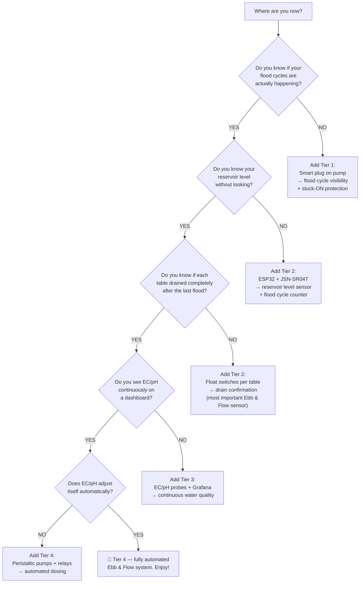

[↑ Back to TOC](#table-of-contents)

---


## Summary — What Each Tier Gives You

| Capability | Tier 0 | Tier 1 | Tier 2 | Tier 3 | Tier 4 |
|---|---|---|---|---|---|
| Temperature monitoring | 2×/day | 24/7 ✅ | 24/7 ✅ | 24/7 ✅ | 24/7 ✅ |
| Humidity monitoring | ❌ | 24/7 ✅ | 24/7 ✅ | 24/7 ✅ | 24/7 ✅ |
| Flood cycle confirmation | Manual count | Smart plug ✅ | Current sensor ✅ | ✅ | ✅ |
| Stuck-ON detection | Next check | Smart plug ✅ | Current sensor ✅ | ✅ | ✅ |
| Reservoir level | Visual | Visual | Sensor 24/7 ✅ | ✅ | ✅ |
| Drain confirmation (per table) | Manual 30s check | ❌ | Float switches ✅ | ✅ | ✅ |
| pH monitoring | 2×/day | 2×/day | 2×/day | 24/7 ✅ | 24/7 ✅ |
| EC monitoring | 2×/day | 2×/day | 2×/day | 24/7 ✅ | 24/7 ✅ |
| Rain dilution detection | ❌ | ❌ | ❌ | Rain sensor ✅ | ✅ |
| Phone alerts | ❌ | Smart plug app ✅ | Telegram ✅ | ✅ | ✅ |
| Dashboard | ❌ | App only | Basic web page | Full Grafana ✅ | Full Grafana ✅ |
| Historical data | Paper log | App (20 days) | 30+ days | 30+ days | 30+ days |
| Automated pH dosing | ❌ | ❌ | ❌ | ❌ | ✅ |
| Automated EC dosing | ❌ | ❌ | ❌ | ❌ | ✅ |
| Stuck-ON cutoff (open the pump relay) | ❌ | Alert only | Alert only | Float can trip it | ✅ relay opens |
| Stuck-OFF restart | ❌ | ❌ | ❌ | ❌ | Secondary |
| Daily time required | 10–15 min | 5–10 min | 5 min | 3–5 min | 1–2 min |

> A stuck-ON pump rots roots in 2–4 hours. The safety action is: if the drain float is still up after the pump should be off, open the pump relay. A smart plug that texts you is the Budget version of noticing. The float that opens the relay is the version that acts. A backup timer that only recovers a stuck-OFF pump is secondary. If you spend $60 (R1,080), spend it on a smart plug that can drop the pump. If you spend more, add the float and wire it to open that relay.

---

> **Previous:** [Guide 12 — Budget and Sourcing](./12-budget-and-sourcing.md)

[↑ Back to TOC](#table-of-contents)

---

<!-- copyright -->
*Copyright (c) 2026 UncleJS. Licensed under [CC BY-NC-SA 4.0](https://creativecommons.org/licenses/by-nc-sa/4.0/) — free to share and adapt for non-commercial purposes with attribution and ShareAlike.*
