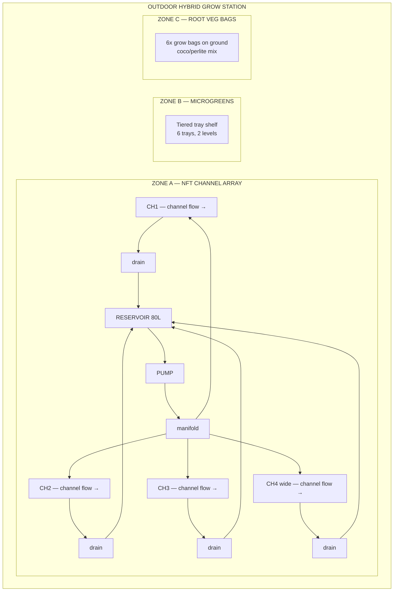
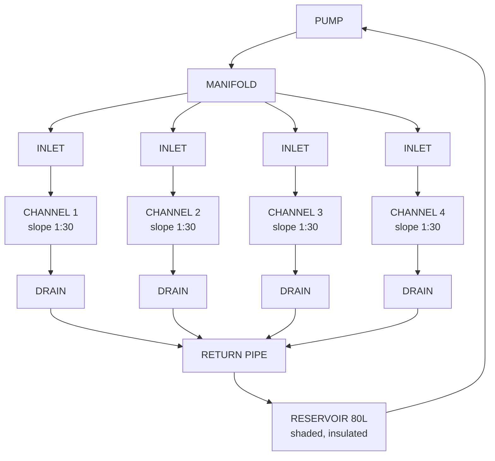

# NFT System — Overview & Build Plan
## Outdoor Nutrient Film Technique | Medium Backyard Scale | DIY Build

---

## Table of Contents

- [System Summary](#system-summary)
- [Zone Design](#zone-design)
  - [Zone A — NFT Channel Array](#zone-a--nft-channel-array)
  - [Zone B — Microgreens Station](#zone-b--microgreens-station)
  - [Zone C — Root Veg Grow Bags](#zone-c--root-veg-grow-bags)
- [System Architecture Diagrams](#system-architecture-diagrams)
- [Component Inventory](#component-inventory)
- [Seasonal Grow Calendar](#seasonal-grow-calendar)
- [4-Week Build Timeline](#4-week-build-timeline)
- [Daily Quick-Start Checklist](#daily-quick-start-checklist)
- [Success Criteria](#success-criteria)
- [Guide Index](#guide-index)

---

[↑ Back to TOC](#table-of-contents)

## System Summary

A **medium-scale outdoor Nutrient Film Technique (NFT)** system for a temperate backyard, designed for a £150–£500 DIY budget. Because NFT is not suitable for all crop types, this plan uses a **three-zone hybrid design**:

| Zone | Method | Crops |
|------|--------|-------|
| **Zone A — NFT Channels** | Continuous thin-film nutrient flow | Lettuce, spinach, kale, basil, coriander, mint, chives, parsley, cherry tomatoes, peppers, strawberries |
| **Zone B — Microgreens Station** | Tray-based, coco coir media, manual/wicking | Sunflower, pea shoots, radish, broccoli, amaranth, wheatgrass |
| **Zone C — Root Veg Grow Bags** | Passive grow bags, coco/perlite media, manual fertigation | Radishes, carrots, beetroot |

This hybrid approach delivers maximum crop diversity within a single outdoor footprint while respecting the biological constraints of each crop type.

---

[↑ Back to TOC](#table-of-contents)

## Zone Design

### Zone A — NFT Channel Array

| Property | Value |
|----------|-------|
| Channels | 4 total (3 standard + 1 wide) |
| Channel type | 75 mm square PVC tube (CH1–3) / 100 mm square PVC tube (CH4) |
| Channel length | 2.4 m each |
| Total plant sites | ~40 |
| Slope | 1:30 (approx. 8 cm drop over 2.4 m) |
| Flow rate | 1–2 L/min per channel |
| Pump | 600–800 L/h submersible |
| Reservoir | 80 L food-grade container, shaded |
| Net pot sizes | 50 mm (CH1–3), 75 mm (CH4) |

**Channel assignment:**
- **CH1** — Lettuce varieties (11 sites)
- **CH2** — Herbs: basil, coriander, parsley, chives (11 sites)
- **CH3** — Spinach, kale, mint (11 sites)
- **CH4** (wide) — Cherry tomatoes, peppers, strawberries (7 sites)

### Zone B — Microgreens Station

| Property | Value |
|----------|-------|
| Trays | 6 × 25 cm × 50 cm standard grow trays |
| Levels | 2-tier DIY timber shelf |
| Media | Coco coir (~1–2 cm layer) |
| Watering | Manual misting, 2× daily |
| Typical harvest cycle | 7–14 days depending on variety |

### Zone C — Root Veg Grow Bags

| Property | Value |
|----------|-------|
| Bags | 6 bags: 3 × 20 L (radishes/beetroot), 3 × 30 L deep (carrots) |
| Media | 60% coco coir + 30% perlite + 10% vermiculite |
| Watering | Manual fertigation, 1–2× daily |
| Drainage | Bags on slatted rack or gravel tray |

---

[↑ Back to TOC](#table-of-contents)

## System Architecture Diagrams

**Three-zone overview:**

**NFT flow diagram (side view):**

---

[↑ Back to TOC](#table-of-contents)

## Component Inventory

| Component | Quantity | Notes |
|-----------|----------|-------|
| 75 mm square PVC channel | 3 × 2.4 m | CH1, CH2, CH3 |
| 100 mm square PVC channel | 1 × 2.4 m | CH4 (tomatoes/strawberries) |
| PVC end caps | 8 | 2 per channel |
| Drain grommets + fittings | 4 | 19 mm or 25 mm barb fittings |
| Inlet fittings | 4 | 13 mm barb |
| Submersible pump (600–800 L/h) | 1 | With filter sponge |
| PVC manifold pipe (25 mm) | ~1 m | Split to 4 outlets |
| Irrigation tubing (13 mm) | ~4 m | Pump → manifold → inlets |
| Return pipe (25 mm PVC) | ~2 m | Drain fittings → reservoir |
| 80 L food-grade container | 1 | Reservoir, with lid |
| Timber frame materials | — | See [Guide 11 — Build](11-build-guide.md) |
| 50 mm net pots | 40 | CH1–3 (33 + spares) |
| 75 mm net pots | 10 | CH4 (7 + spares) |
| Clay pebbles / LECA | 10 L | Net pot fill |
| Rockwool starter cubes | 50 | Germination |
| Grow bags 20 L | 3 | Zone C |
| Grow bags 30 L deep | 3 | Zone C — carrots |
| Coco coir (10 L brick or loose) | 2 | Zones B & C |
| Perlite (5 L) | 1 | Zone C media blend |
| Vermiculite (2 L) | 1 | Zone C blend |
| Standard grow trays (25 × 50 cm) | 6 | Zone B microgreens |
| Microgreen seeds (variety pack) | — | See [Guide 06 — Crops](06-crops.md) |
| Nutrients (Masterblend trio or GH Flora) | — | See [Guide 02 — Nutrients](02-nutrient-solution.md) |
| pH meter | 1 | Calibrate monthly |
| EC/TDS meter | 1 | Calibrate monthly |
| pH Up (KOH solution) | 1 bottle | |
| pH Down (phosphoric acid) | 1 bottle | |
| Shade cloth 40% (2 × 3 m) | 1 | Summer heat management |
| Frost fleece / horticultural fleece | 1 roll | Cold protection |
| Digital timer (for pump, optional) | 1 | NFT runs near-continuously; timer mostly for overnight off |

---

[↑ Back to TOC](#table-of-contents)

## Seasonal Grow Calendar

| Month | Activity | Crops to Start |
|-------|----------|----------------|
| **Jan–Feb** | System prep, source materials, build planning | — |
| **Mar** | Build & test system; first seeds indoors | Lettuce, herbs (indoor germination) |
| **Apr** | Transplant greens & herbs to NFT channels | Lettuce, spinach, basil, coriander |
| **Apr–May** | Start tomatoes and peppers under shelter | Cherry tomatoes, sweet peppers |
| **May** | Full system operational | All greens, herbs, strawberries |
| **Jun** | Succession planting; microgreens rolling harvest | Radishes, carrots in grow bags |
| **Jul** | Peak production; heat management (shade cloth) | Heat-tolerant varieties; watch for bolting |
| **Aug** | Continue harvests; watch for late-season bolting | Late summer succession |
| **Sep** | Wind-down greens; harvest root veg | Root vegetable harvest |
| **Oct** | Final tomato/pepper harvest before first frost | — |
| **Nov** | System winterisation; deep clean; storage | — |
| **Dec** | Review season; plan next year | — |

**Key dates to track:**
- Last frost (spring): typically late March – mid-April in UK/northern Europe
- First frost (autumn): typically mid-October – early November
- Longest day: 21 June — peak light and heat management period

---

[↑ Back to TOC](#table-of-contents)

## 4-Week Build Timeline

### Week 1 — Procurement & Preparation
- [ ] Finalise bill of materials (see [Guide 12 — Budget & Sourcing](12-budget-and-sourcing.md))
- [ ] Order/purchase all components
- [ ] Select and prepare build site (clear, level, measure)
- [ ] Source timber or steel for frame
- [ ] Check water supply access and electrical outlet proximity

### Week 2 — Build Frame & Channels
- [ ] Build channel support frame (see [Guide 11 — Build](11-build-guide.md))
- [ ] Cut PVC channels to length
- [ ] Drill net pot holes in all channels
- [ ] Fit end caps, drain fittings, inlet fittings
- [ ] Prepare reservoir (drill pump hole, outlet, paint/insulate)

### Week 3 — Plumbing, Testing & Zones B/C
- [ ] Connect pump → manifold → channel inlets
- [ ] Connect drain fittings → return pipe → reservoir
- [ ] Seal all joints (thread tape, silicone)
- [ ] Fill with plain water; test pump operation
- [ ] Verify flow rate and slope on all four channels
- [ ] Fix any leaks or uneven flow
- [ ] Set up Zone B microgreens shelf
- [ ] Set up Zone C grow bags with media

### Week 4 — Nutrients, Seeds & First Plants
- [ ] Mix first nutrient solution (see [Guide 02 — Nutrients](02-nutrient-solution.md))
- [ ] Calibrate and baseline pH and EC meters
- [ ] Germinate first seeds in rockwool cubes
- [ ] Transplant rooted seedlings into channels
- [ ] Begin daily monitoring log
- [ ] Sow first microgreens trays (Zone B)
- [ ] Fill and plant root veg grow bags (Zone C)

---

[↑ Back to TOC](#table-of-contents)

## Daily Quick-Start Checklist

Once the system is running, use this each morning:

- [ ] Confirm pump is running — listen for flow; check return pipe
- [ ] Check reservoir level — top up with pH-adjusted water if below minimum mark
- [ ] Measure and record pH (target: 5.5–6.5; ideal 5.8–6.2)
- [ ] Measure and record EC (target: varies by crop — see [Guide 02](02-nutrient-solution.md))
- [ ] Visually scan all four channels for blockages, dry spots, or root mat overflow
- [ ] Inspect plants for yellowing, wilting, or pest damage
- [ ] Check Zone B microgreens trays — mist lightly if surface is dry
- [ ] Check Zone C grow bags — water/fertigate as needed
- [ ] Log any observations, adjustments, or concerns

---

[↑ Back to TOC](#table-of-contents)

## Success Criteria

By the end of the first growing season:

1. Regular harvests of at least **4 lettuce heads per week** from CH1
2. Continuous fresh herb supply (cut-and-come-again from CH2)
3. At least **2 kg of cherry tomatoes or peppers** per plant from CH4
4. **3–4 full microgreens tray harvests** per month from Zone B
5. At least **one successful root vegetable crop** from Zone C
6. pH stable within 5.5–6.5 and EC within crop target ranges for **80%+ of operational days**
7. Zero catastrophic pump failures as a result of preparation and monitoring

---

[↑ Back to TOC](#table-of-contents)

## Guide Index

| # | File | Topic |
|---|------|-------|
| 00 | `00-system-overview.md` ← *you are here* | System design, inventory, build timeline, grow calendar |
| — | [`zones.md`](../../zones.md) | Full zone layout, spatial diagrams, dimensions |
| 01 | [01-nft-basics.md](01-nft-basics.md) | How NFT works, science, pros/cons |
| 02 | [02-nutrient-solution.md](02-nutrient-solution.md) | Nutrients, EC, pH, mixing |
| 03 | [03-water-quality.md](03-water-quality.md) | Water sources, testing, treatment |
| 04 | [04-lighting.md](04-lighting.md) | Outdoor light, DLI, shade, seasons |
| 05 | [05-growing-media.md](05-growing-media.md) | Media types, net pots, germination |
| 06 | [06-crops.md](06-crops.md) | Per-crop growing guide |
| 07 | [07-pests-and-disease.md](07-pests-and-disease.md) | Pest & disease ID, treatment, IPM |
| 08 | [08-system-maintenance.md](08-system-maintenance.md) | Daily/weekly/monthly schedules |
| 09 | [09-troubleshooting.md](09-troubleshooting.md) | Symptom → cause → fix |
| 10 | [10-climate-management.md](10-climate-management.md) | Heat, cold, wind, rain, seasons |
| 11 | [11-build-guide.md](11-build-guide.md) | Step-by-step DIY build instructions |
| 12 | [12-budget-and-sourcing.md](12-budget-and-sourcing.md) | BOM, costs, sourcing, ROI |
| 13 | [13-automation.md](13-automation.md) | Automation, sensors, data logging, dashboards |

---

<!-- copyright -->
*Copyright (c) 2026 UncleJS. Licensed under [CC BY-NC 4.0](https://creativecommons.org/licenses/by-nc/4.0/) — free to share and adapt for non-commercial purposes with attribution.*
