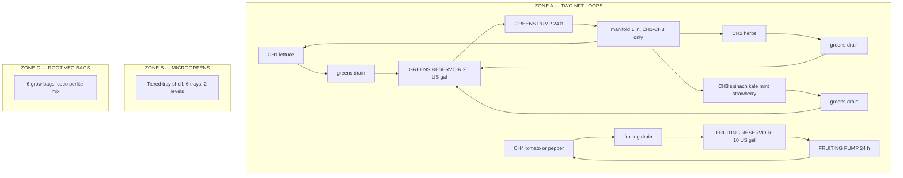
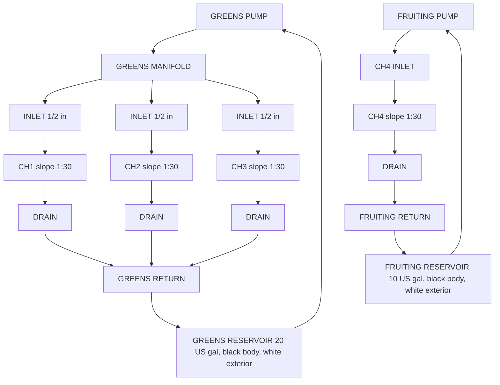

# NFT System — Overview & Build Plan
## Outdoor Nutrient Film Technique | Medium Backyard Scale | DIY Build

---

## Table of Contents

- [System Summary](#system-summary)
- [Zone Design](#zone-design)
  - [Zone A — NFT Channel Array](#zone-a-nft-channel-array)
  - [Zone B — Microgreens Station](#zone-b-microgreens-station)
  - [Zone C — Root Veg Grow Bags](#zone-c-root-veg-grow-bags)
- [System Architecture Diagrams](#system-architecture-diagrams)
- [Component Inventory](#component-inventory)
- [Seasonal Grow Calendar](#seasonal-grow-calendar)
- [4-Week Build Timeline](#4-week-build-timeline)
  - [Week 1 — Procurement & Preparation](#week-1-procurement-preparation)
  - [Week 2 — Build Frame & Channels](#week-2-build-frame-channels)
  - [Week 3 — Plumbing, Testing & Zones B/C](#week-3-plumbing-testing-zones-bc)
  - [Week 4 — Nutrients, Seeds & First Plants](#week-4-nutrients-seeds-first-plants)
- [Daily Quick-Start Checklist](#daily-quick-start-checklist)
- [Success Criteria](#success-criteria)
- [Guide Index](#guide-index)

---

## System Summary

A **medium-scale outdoor Nutrient Film Technique (NFT)** system for an inland mid-USA backyard, about **38°N**, USDA zones **6b–7a** (Kansas City, St. Louis, Louisville, Richmond). Dimensions, doses, and dates follow [Design Constants](../design-constants.md). The build is priced in [Guide 12 — Budget and Sourcing](12-budget-and-sourcing.md) in US dollars, with South African rand in brackets at the planning rate of $1 = R18. Because NFT is not suitable for all crop types, this plan uses a **three-zone hybrid design** on a **13 ft × 10 ft (4.0 m × 3.0 m)** site:

| Zone | Method | Crops |
|------|--------|-------|
| **Zone A — NFT Channels** | Two continuous thin-film loops | Lettuce, spinach, kale, basil, cilantro, mint, chives, parsley, strawberries on the greens loop; cherry tomatoes and peppers on their own loop |
| **Zone B — Microgreens Station** | Tray-based, coco coir media, manual misting | Sunflower, pea shoots, radish, broccoli, amaranth, wheatgrass |
| **Zone C — Root Veg Grow Bags** | Passive grow bags, 60% coco / 30% perlite / 10% vermiculite, manual fertigation | Radishes, carrots, beet (beetroot) |

This hybrid approach delivers crop diversity within one outdoor footprint while respecting the biological constraints of each crop type. Zone A is two loops that never share solution: greens (CH1–CH3) and fruiting (CH4).

[↑ Back to TOC](#table-of-contents)

---

## Zone Design

The zone map with spatial layout is in [zones.md](../../zones.md).

### Zone A — NFT Channel Array

| Property | Value |
|----------|-------|
| Site | 13 ft × 10 ft (4.0 m × 3.0 m) |
| Frame footprint | About 9 ft × 4 ft (2.7 m × 1.2 m), both reservoirs at the low end |
| Channels | 4 total: CH1–CH3 greens, CH4 fruiting |
| Channel length | 8 ft (2.44 m) each |
| CH1–CH3 | 3 in (76 mm) square, 2 in (51 mm) net pots, 9 in (229 mm) spacing, 11 sites each |
| CH4 | 4 in (102 mm) square, 3 in (76 mm) net pots, 7 holes at 12 in (305 mm) |
| Total plant sites | 40 (33 greens + 7 fruiting holes) |
| Slope | 1:30, a 3¼ in (83 mm) drop over 8 ft (2.44 m) |
| Posts | 36 in (91 cm) at the high (inlet) end, 32¾ in (83 cm) at the low (drain) end |
| Greens flow | 0.26–0.53 US gpm (1–2 L/min) per channel |
| Greens pump | 160–210 US gph (600–800 L/h), about 15 W, 24 hours a day |
| Greens reservoir | 20 US gal (76 L), black body, white exterior, shaded |
| Greens EC | 0.8–1.8 mS/cm. Lettuce stays at or below 1.8 |
| Greens full change | Every 7 days |
| Fruiting pump | 50–100 US gph (200–400 L/h), about 8 W, 24 hours a day, own reservoir |
| Fruiting reservoir | 10 US gal (38 L), black body, white exterior, shaded. Not teed into the greens manifold |
| Fruiting EC | Tomato fruiting 2.5–3.5 mS/cm. Pepper fruiting 2.0–3.0 mS/cm. These targets apply only in this tank |
| Fruiting full change | Every 5–7 days |
| Greens manifold | 1 in (25 mm) along the high end, CH1–CH3 only |
| Channel inlets | ½ in (13 mm) |
| Return | ¾–1 in (19–25 mm), gravity, each loop back to its own reservoir |
| Air pump | Recommended in both reservoirs |
| Dry-out window | 15–30 minutes in warm weather. That is the action time |

Both pumps run **24 hours a day**. There is no overnight off, and no 15 minutes on / 45 minutes off schedule.

**Channel assignment:**
- **CH1** — Lettuce (11 sites)
- **CH2** — Herbs: basil, cilantro, parsley, chives (11 sites)
- **CH3** — Spinach, kale, mint, plus strawberries in 3–4 of the 11 sites
- **CH4** — Cherry tomato and pepper only. 4–5 indeterminate cherry plants (skip holes) or up to 7 compact determinate plants. Not strawberries

### Zone B — Microgreens Station

| Property | Value |
|----------|-------|
| Shelf | 24 in × 20 in (61 cm × 51 cm), two tiers, about 36 in (91 cm) tall |
| Trays | 6 × 10 in × 20 in (25 cm × 50 cm) standard grow trays |
| Media | Coco coir, 1–1¼ in (2.5–3 cm) deep |
| Watering | Manual misting, twice a day |
| Solution | pH-adjusted water only, pH 5.8–6.2. No nutrients, except sunflower and pea may use EC 0.4–0.8 mS/cm if the grow runs long |
| Typical harvest cycle | 7–14 days depending on variety |

### Zone C — Root Veg Grow Bags

| Property | Value |
|----------|-------|
| Bags | 6 bags: two 5 US gal (19 L) radish, one 5 US gal (19 L) beet (beetroot), three 10 US gal (38 L) carrot |
| Media | 60% coco coir + 30% perlite + 10% vermiculite. No garden soil |
| Watering | Manual fertigation, 1–2× daily |
| EC ceiling | 2.0 mS/cm. Beet (beetroot) does not get a higher target |
| Drainage | Bags on a slatted rack or gravel tray |
| Planning yield, one season | Radish 15 lb (6.8 kg), beet (beetroot) 8 lb (3.6 kg), carrot 20 lb (9.1 kg) |

[↑ Back to TOC](#table-of-contents)

---

## System Architecture Diagrams

**Three-zone overview.** CH1–CH3 share one reservoir. CH4 has its own reservoir and is not teed into the greens manifold.

**OUTDOOR HYBRID GROW STATION**

**NFT flow diagram (side view):**

[↑ Back to TOC](#table-of-contents)

---

## Component Inventory

Costs for this list are in [Guide 12 — Budget and Sourcing](12-budget-and-sourcing.md), in US dollars with rand in brackets. This overview does not total the bill of materials.

| Component | Quantity | Notes |
|-----------|----------|-------|
| 3 in (76 mm) square PVC channel | 3 × 8 ft (2.44 m) | CH1, CH2, CH3 |
| 4 in (102 mm) square PVC channel | 1 × 8 ft (2.44 m) | CH4, cherry tomato and pepper only |
| PVC end caps | 8 | 2 per channel |
| Drain fittings | 4 | ¾–1 in (19–25 mm), one per channel |
| Inlet fittings | 4 | ½ in (13 mm). Three on the greens manifold, one on the CH4 supply |
| Greens submersible pump | 1 | 160–210 US gph (600–800 L/h), about 15 W, with filter sponge. Runs 24 hours a day |
| Fruiting submersible pump | 1 | 50–100 US gph (200–400 L/h), about 8 W. Own loop, 24 hours a day |
| Air pump with two air stones | 1 | One pump, two airlines, one stone in each reservoir |
| PVC manifold pipe, 1 in (25 mm) | About 3 ft (0.9 m) | High end, CH1–CH3 only. Do not tee CH4 into this pipe |
| Irrigation tubing, ½ in (13 mm) | About 13 ft (4 m) | Each pump to its inlets |
| Return pipe, ¾–1 in (19–25 mm) | About 6 ft (1.8 m) | Each loop returns to its own reservoir |
| Greens reservoir | 1 | 20 US gal (76 L), food-grade, black body, white exterior, lid, shaded |
| Fruiting reservoir | 1 | 10 US gal (38 L), food-grade, black body, white exterior, lid, shaded |
| Timber frame materials | — | Posts 36 in (91 cm) high end, 32¾ in (83 cm) low end. See [Guide 11 — Build](11-build-guide.md) |
| 2 in (51 mm) net pots | 40 | CH1–CH3 (33 sites plus spares), including the strawberry sites on CH3 |
| 3 in (76 mm) net pots | 10 | CH4 (7 holes plus spares) |
| Clay pebbles / LECA | 2.6 US gal (10 L) | Net pot fill |
| Rockwool starter cubes | 50 | Germination |
| Grow bags, 5 US gal (19 L) | 3 | Zone C: two radish, one beet (beetroot) |
| Grow bags, 10 US gal (38 L) | 3 | Zone C: carrots |
| Coco coir | About 30 US gal (114 L) loose, or bricks to match | Zones B and C. Zone B depth is 1–1¼ in (2.5–3 cm). Zone C alone needs about 27 US gal (102 L) at 60% of bag volume |
| Perlite | About 13.5 US gal (51 L) | Zone C only, 30% of the bag mix |
| Vermiculite | About 4.5 US gal (17 L) | Zone C only, 10% of the bag mix |
| Standard grow trays, 10 in × 20 in (25 cm × 50 cm) | 6 | Zone B microgreens |
| Microgreen seeds (variety pack) | — | See [Guide 06 — Crops](06-crops.md) |
| Nutrients (Masterblend trio or GH Flora) | — | See [Guide 02 — Nutrients](02-nutrient-solution.md) |
| pH meter | 1 | Calibrate monthly |
| EC/TDS meter | 1 | Calibrate monthly |
| pH Up (KOH solution) | 1 bottle | |
| pH Down (phosphoric acid) | 1 bottle | |
| Shade cloth 40% | 1 | About 13 ft × 10 ft (4.0 m × 3.0 m) to cover the site. Deploy when afternoon highs hold above 85°F (29°C) |
| Frost fleece / horticultural fleece | 1 roll | Cold protection inside the outdoor season |
| Pump timer | None for the NFT pumps | Both pumps run 24 hours a day. Do not schedule overnight off or 15 minutes on / 45 minutes off |

[↑ Back to TOC](#table-of-contents)

---

## Seasonal Grow Calendar

Worked climate: inland mid-USA, about 38°N, USDA 6b–7a. The month in brackets is the South African season, shifted six months. It is not a second climate dataset. Outdoor NFT runs **mid-April through mid-October (SA: mid-October through mid-April)**. Do not run unprotected outdoor NFT through December–February (SA: June–August).

| Month | Activity | Crops to Start |
|-------|----------|----------------|
| **January (SA: July)** | System stays shut down. Review last season and order long-lead parts | — |
| **February (SA: August)** | Still shut down outdoors. Start pepper seeds indoors late in the month if you want ripe fruit before frost | Peppers, indoors |
| **March (SA: September)** | Build and test if the site is workable. Germinate lettuce and herbs indoors | Lettuce, herbs (indoor germination) |
| **April (SA: October)** | Last spring frost about April 15 (SA: October 15). Transplant greens and herbs after that date | Lettuce, spinach, basil, cilantro |
| **April–May (SA: October–November)** | Start tomatoes under shelter and move CH4 out after frost risk passes | Cherry tomatoes, peppers |
| **May (SA: November)** | Full system operational | All greens, herbs, strawberries on CH3 |
| **June (SA: December)** | Succession planting. Summer highs 90–100°F (32–38°C). Deploy 40% shade when highs hold above 85°F (29°C) | Radishes, carrots, beet (beetroot) in grow bags |
| **July (SA: January)** | Peak production and heat management | Heat-tolerant varieties; watch for bolting |
| **August (SA: February)** | Continue harvests; watch for late-season bolting | Late summer succession |
| **September (SA: March)** | Shoulder season. Remove shade as highs fall. Harvest root veg as it matures | Root vegetable harvest |
| **October (SA: April)** | First fall frost about October 20 (SA: April 20). Final tomato and pepper harvest by mid-October (SA: mid-April) | — |
| **November (SA: May)** | System winterization, deep clean, storage | — |
| **December (SA: June)** | Outdoor NFT stays off. Plan next year | — |

**Key dates to track:**
- Last spring frost, planning: April 15 (SA: October 15)
- First fall frost, planning: October 20 (SA: April 20)
- Outdoor season: mid-April through mid-October (SA: mid-October through mid-April)
- Longest day: June 21 (SA: December 21) — peak light, and the start of the heat-management stretch through August (SA: February)

[↑ Back to TOC](#table-of-contents)

---

## 4-Week Build Timeline

### Week 1 — Procurement & Preparation
- [ ] Finalize the bill of materials (see [Guide 12 — Budget and Sourcing](12-budget-and-sourcing.md))
- [ ] Order or purchase all components
- [ ] Select and prepare the 13 ft × 10 ft (4.0 m × 3.0 m) site (clear, level, measure). Long axis faces south (SA: north)
- [ ] Source timber for the frame: high-end posts 36 in (91 cm), low-end posts 32¾ in (83 cm)
- [ ] Check water supply access and electrical outlet proximity (outdoor GFCI)

### Week 2 — Build Frame & Channels
- [ ] Build the channel support frame (see [Guide 11 — Build](11-build-guide.md))
- [ ] Cut PVC channels to 8 ft (2.44 m)
- [ ] Drill net pot holes: 11 per greens channel at 9 in (229 mm), 7 on CH4 at 12 in (305 mm)
- [ ] Fit end caps, drain fittings, and ½ in (13 mm) inlet fittings
- [ ] Prepare both reservoirs (pump and return holes, black body, white exterior)

### Week 3 — Plumbing, Testing & Zones B/C
- [ ] Connect the greens pump to the 1 in (25 mm) manifold and then to CH1–CH3 inlets only
- [ ] Connect the fruiting pump to CH4 on its own line. Do not tee it into the greens manifold
- [ ] Connect each drain to its own return pipe and its own reservoir
- [ ] Seal all joints (thread tape, silicone)
- [ ] Fill both reservoirs with plain water and test both pumps
- [ ] Verify slope (3¼ in / 83 mm drop) and flow on all four channels
- [ ] Fix any leaks or uneven flow
- [ ] Set up the Zone B microgreens shelf
- [ ] Set up Zone C grow bags with media

### Week 4 — Nutrients, Seeds & First Plants
- [ ] Mix the first nutrient solution for each reservoir (see [Guide 02 — Nutrients](02-nutrient-solution.md))
- [ ] Calibrate and baseline pH and EC meters
- [ ] Germinate the first seeds in rockwool cubes
- [ ] Transplant rooted seedlings into the channels
- [ ] Begin the daily monitoring log
- [ ] Sow the first microgreens trays (Zone B) on pH 5.8–6.2 water
- [ ] Fill and plant the root-veg grow bags (Zone C)

[↑ Back to TOC](#table-of-contents)

---

## Daily Quick-Start Checklist

Once the system is running, use this each morning:

- [ ] Confirm **both** pumps are running — listen for flow and check each return pipe
- [ ] Check both reservoir levels. If the level is low and EC is at or above target, top up with plain water adjusted to pH 5.8–6.2. If EC is below target, add nutrient stock, then recheck EC and pH
- [ ] Measure and record pH (working window 5.8–6.2; acceptable band 5.5–6.5)
- [ ] Measure and record EC for each tank (greens 0.8–1.8 mS/cm; fruiting tank only at the tomato or pepper fruiting target — see [Guide 02 — Nutrients](02-nutrient-solution.md))
- [ ] Visually scan all four channels for blockages, dry spots, or root-mat overflow. If a pump is off, roots in a warm channel dry in 15–30 minutes
- [ ] Inspect plants for yellowing, wilting, or pest damage
- [ ] Check Zone B microgreens trays — mist lightly if the surface is dry
- [ ] Check Zone C grow bags — water or fertigate as needed, and keep EC at or below 2.0 mS/cm
- [ ] Log any observations, adjustments, or concerns

[↑ Back to TOC](#table-of-contents)

---

## Success Criteria

By the end of the first growing season (mid-April through mid-October; SA: mid-October through mid-April):

1. Regular harvests of at least **4 lettuce heads per week** from CH1
2. Continuous fresh herb supply (cut-and-come-again from CH2)
3. **4–6 lb (1.8–2.7 kg) of cherry tomatoes per CH4 plant**
4. **3–4 full microgreens tray harvests** per month from Zone B
5. At least **one successful root vegetable crop** from Zone C (planning yields for a full set of bags: radish 15 lb / 6.8 kg, beet (beetroot) 8 lb / 3.6 kg, carrot 20 lb / 9.1 kg)
6. pH inside 5.5–6.5, with the working window 5.8–6.2, and EC inside the crop target for that tank, on **80%+ of operational days**
7. Zero catastrophic pump failures as a result of preparation and monitoring

[↑ Back to TOC](#table-of-contents)

---

## Guide Index

| # | File | Topic |
|---|------|-------|
| 00 | `00-system-overview.md` ← *you are here* | System design, inventory, build timeline, grow calendar |
| — | [`design-constants.md`](../design-constants.md) | Dimensions, doses, climate, and prices used by every guide |
| — | [`zones.md`](../../zones.md) | Full zone layout, spatial diagrams, dimensions |
| 01 | [01-nft-basics.md](01-nft-basics.md) | How NFT works, science, pros/cons |
| 02 | [02-nutrient-solution.md](02-nutrient-solution.md) | Nutrients, EC, pH, mixing |
| 03 | [03-water-quality.md](03-water-quality.md) | Water sources, testing, treatment |
| 04 | [04-lighting.md](04-lighting.md) | Outdoor light, DLI, shade, seasons |
| 05 | [05-growing-media.md](05-growing-media.md) | Media types, net pots, germination |
| 06 | [06-crops.md](06-crops.md) | Per-crop growing guide |
| 07 | [07-pests-and-disease.md](07-pests-and-disease.md) | Pest and disease ID, treatment, IPM |
| 08 | [08-system-maintenance.md](08-system-maintenance.md) | Daily, weekly, and monthly schedules |
| 09 | [09-troubleshooting.md](09-troubleshooting.md) | Symptom, cause, fix |
| 10 | [10-climate-management.md](10-climate-management.md) | Heat, cold, wind, rain, seasons |
| 11 | [11-build-guide.md](11-build-guide.md) | Step-by-step DIY build instructions |
| 12 | [12-budget-and-sourcing.md](12-budget-and-sourcing.md) | Bill of materials, costs, sourcing |
| 13 | [13-automation.md](13-automation.md) | Automation, sensors, data logging, dashboards |

[↑ Back to TOC](#table-of-contents)

> **Next:** [Guide 01 — NFT Basics](01-nft-basics.md)

<!-- copyright -->
*Copyright (c) 2026 UncleJS. Licensed under [CC BY-NC-SA 4.0](https://creativecommons.org/licenses/by-nc-sa/4.0/) — free to share and adapt for non-commercial purposes with attribution and ShareAlike.*
