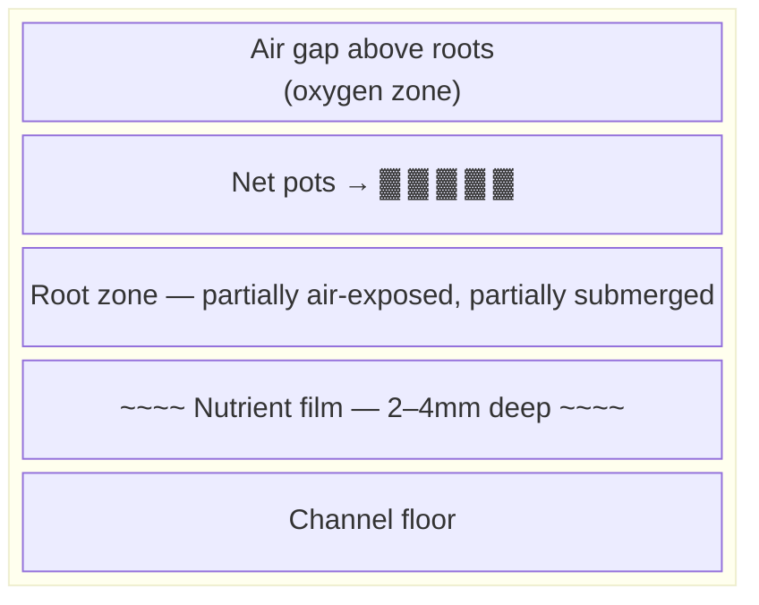
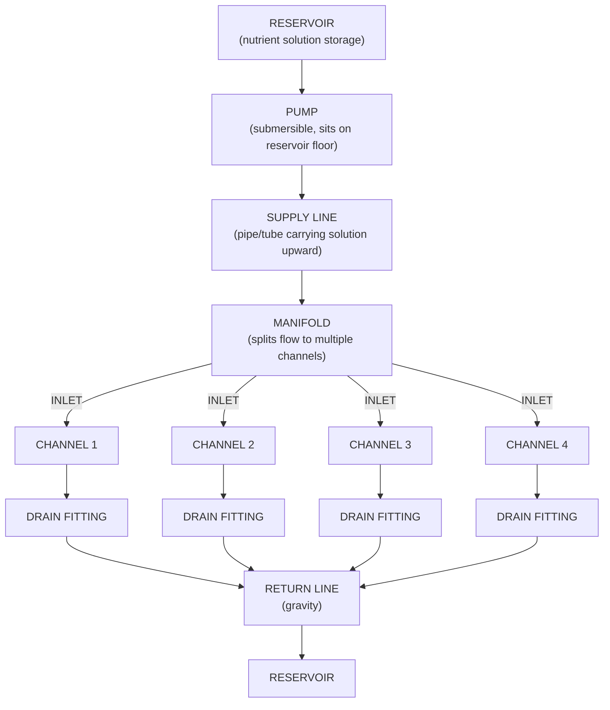
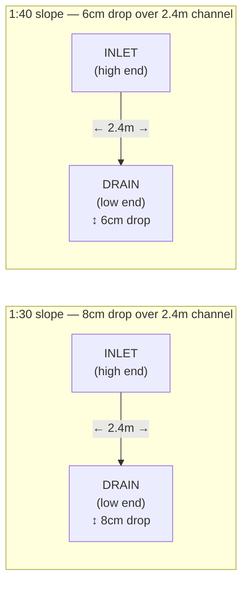
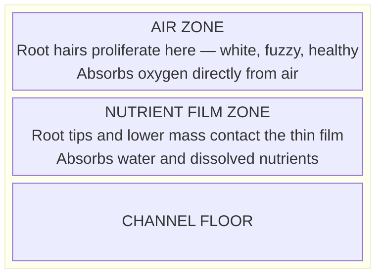

# Guide 01 — NFT Basics
## How Nutrient Film Technique Works

[](../../README.md)
[](https://creativecommons.org/licenses/by-nc-sa/4.0/)


---

## Table of Contents

- [1. History and Origin](#1-history-and-origin)
- [2. Core Principle: The Thin Film](#2-core-principle-the-thin-film)
- [3. Anatomy of an NFT System](#3-anatomy-of-an-nft-system)
  - [Component Descriptions](#component-descriptions)
- [4. Channel Slope: The Critical Variable](#4-channel-slope-the-critical-variable)
  - [Optimal Slope: 1:30 to 1:40](#optimal-slope-130-to-140)
  - [Slope Effects Table](#slope-effects-table)
- [5. Flow Rate Science](#5-flow-rate-science)
  - [Target: 1–2 Litres Per Minute Per Channel](#target-12-litres-per-minute-per-channel)
  - [Calculating Pump Requirements](#calculating-pump-requirements)
  - [Laminar vs Turbulent Flow](#laminar-vs-turbulent-flow)
- [6. Root Zone Oxygenation](#6-root-zone-oxygenation)
- [7. NFT vs Other Systems Comparison](#7-nft-vs-other-systems-comparison)
- [8. Why NFT Is Ideal for Leafy Crops — and Why It Fails for Root Veg](#8-why-nft-is-ideal-for-leafy-crops-and-why-it-fails-for-root-veg)
  - [Ideal for leafy crops because:](#ideal-for-leafy-crops-because)
  - [Poor for root vegetables because:](#poor-for-root-vegetables-because)
- [9. Pump Runtime: Continuous vs Timed](#9-pump-runtime-continuous-vs-timed)
  - [NFT is almost always run 24/7 (continuously)](#nft-is-almost-always-run-247-continuously)
  - [When a Timer Makes Sense](#when-a-timer-makes-sense)
- [10. What Happens During Pump Failure](#10-what-happens-during-pump-failure)
  - [Emergency Protocol for NFT Pump Failure](#emergency-protocol-for-nft-pump-failure)
- [11. Scaling: Modular Channel Design](#11-scaling-modular-channel-design)
- [12. Pros and Cons Summary](#12-pros-and-cons-summary)
  - [Pros](#pros)
  - [Cons](#cons)
- [13. Key Numbers Reference Card](#13-key-numbers-reference-card)

---


## 1. History and Origin

Nutrient Film Technique was developed by **Dr. Allen Cooper** at the Glasshouse Crops Research Institute in Littlehampton, England, in the late 1960s and early 1970s. Cooper published his findings in the 1970s, revolutionising commercial hydroponics by demonstrating that plants could thrive with their roots exposed to a continuous, very shallow stream of nutrient solution — no solid growing medium required.

The original NFT systems were built with aluminum channels and used relatively crude flow controls, but the core principle has remained essentially unchanged for over 50 years. Today NFT is one of the most widely used hydroponic methods in commercial lettuce and herb production globally, chosen for its simplicity, low water usage, excellent oxygenation, and easy root zone access.

[↑ Back to TOC](#table-of-contents)

---


## 2. Core Principle: The Thin Film

The defining characteristic of NFT is the **thin film** of nutrient solution that flows continuously along the floor of a slightly sloped channel. Here is what makes it work:



**Three simultaneous benefits for the root zone:**
1. **Nutrient delivery** — roots touching the film absorb water and minerals
2. **Oxygenation** — the air gap above the film oxygenates the root mass
3. **Simplicity** — no need to flood/drain; gravity + pump does all the work

**Why this matters:** Roots need both water/nutrients AND oxygen. Submerging roots fully (as in DWC without aeration) risks suffocation without an air pump. NFT's thin film naturally provides the air-water interface that maximises root health.

[↑ Back to TOC](#table-of-contents)

---


## 3. Anatomy of an NFT System

Every NFT system — from a 2-channel home setup to a commercial greenhouse — shares the same fundamental components:



### Component Descriptions

| Component | Function | Notes |
|-----------|----------|-------|
| **Reservoir** | Holds nutrient solution | Food-grade, shaded, 50–100L for medium system |
| **Submersible pump** | Circulates solution continuously | 400–800 L/h for 3–4 channels |
| **Supply line** | Carries solution from pump to manifold | 25mm PVC or flexible tubing |
| **Manifold** | Distributes flow evenly to all channels | 25mm main, 13mm branches |
| **Inlet fittings** | Deliver solution at the high end of each channel | Barbed or threaded fitting through end cap |
| **Channels** | The grow tubes where plants sit | 75–100mm square PVC |
| **Net pots** | Hold plants + minimal media | 50mm (greens), 75mm (fruiting) |
| **Drain fittings** | Exit point at low end of each channel | Gravity-fed |
| **Return line** | Carries drained solution back to reservoir | 25mm pipe, gravity only |

[↑ Back to TOC](#table-of-contents)

---


## 4. Channel Slope: The Critical Variable

The slope of the channel determines everything about how the thin film behaves. Too shallow and solution pools; too steep and solution rushes through without adequate contact.

### Optimal Slope: 1:30 to 1:40



### Slope Effects Table

| Slope | Effect | Use Case |
|-------|--------|---------|
| Less than 1:50 (too flat) | Solution pools, uneven distribution, root rot risk | Avoid |
| 1:40–1:30 (optimal) | Smooth thin film, good contact, good drainage | Standard use |
| 1:30–1:20 (slightly steep) | Film flows faster, less contact time — acceptable for long channels | Long channels >3m |
| Steeper than 1:20 | Solution rushes through, minimal root contact, dry spots at inlet | Avoid |

**Practical tip:** Set slope with a spirit level and shims under the frame. A 1:30 slope on a 2.4m channel = raise the inlet end 8cm higher than the drain end. This is a very gentle angle — not visually obvious but critical to measure correctly.

[↑ Back to TOC](#table-of-contents)

---


## 5. Flow Rate Science

### Target: 1–2 Litres Per Minute Per Channel

Flow rate (measured in litres per minute, L/min) determines how thick the film is and how fast nutrients are replenished at the root zone.

```
  FLOW RATE EFFECTS:

  0.5 L/min (too slow):
  ─ Film becomes intermittent, dry spots develop, roots desiccate

  1–2 L/min (optimal):
  ─ Continuous thin film, ~2–4mm depth, laminar flow
  ─ Roots stay moist, maximum air gap maintained

  3+ L/min (too fast):
  ─ Turbulent flow, film too deep, roots partially submerged
  ─ Reduced oxygenation, increased system noise
```

### Calculating Pump Requirements

For a 4-channel system at 1.5 L/min per channel:

```
  Total flow needed = 4 channels × 1.5 L/min = 6 L/min = 360 L/h

  Add 20–30% safety margin for head pressure (vertical lift from reservoir to manifold)

  Recommended pump: 500–700 L/h minimum for 4 channels
  (select 600–800 L/h for comfortable headroom)
```

**Head pressure note:** Every 1 metre of vertical lift reduces effective pump output by ~20%. If your pump must push solution 1m upward to reach the manifold, a 600 L/h pump may deliver only ~480 L/h at the outlet.

### Laminar vs Turbulent Flow

- **Laminar flow** (smooth, layered) is ideal for NFT — solution flows evenly across the channel floor
- **Turbulent flow** (rough, splashing) disrupts the film and reduces the air-water interface

Turbulence is caused by excessive flow rate, rough channel surfaces, debris in the channel, or kinked inlet tubes. Keep inlets smooth, flow rates controlled, and channels clean.

[↑ Back to TOC](#table-of-contents)

---


## 6. Root Zone Oxygenation

This is the biological engine behind NFT's effectiveness. The root system that develops in an NFT channel is divided into two distinct zones:



**Oxygen dissolved in water:** Water at 20°C holds approximately 9 mg/L of dissolved oxygen. Plant roots can deplete this quickly in a stagnant system. In NFT, the cascading return flow re-oxygenates the solution as it splashes back into the reservoir. The air gap ensures roots never run out of O₂ regardless of dissolved O₂ in the solution.

**Why this matters for temperature:** At 28°C, water only holds ~7.8 mg/L dissolved O₂. At 30°C, it drops to ~7.5 mg/L. This is why warm reservoirs increase root rot risk — less O₂ available in the film itself.

[↑ Back to TOC](#table-of-contents)

---


## 7. NFT vs Other Systems Comparison

| Feature | NFT | DWC | Ebb & Flow | Kratky | Wick |
|---------|-----|-----|-----------|--------|------|
| **Complexity** | Medium | Medium | Medium | Very low | Very low |
| **Water usage** | Low | Medium | Medium | Very low | Low |
| **Oxygenation** | Excellent (natural) | Good (air pump) | Good (flood cycle) | OK (air gap) | Poor |
| **Pump required** | Yes (continuous) | Air pump | Water pump + timer | No | No |
| **Power failure risk** | High (roots dry fast) | Medium | Medium | None | None |
| **Best for** | Leafy greens, herbs | Lettuce, basil | Tomatoes, peppers | Lettuce | Herbs |
| **Root veg** | Poor | Poor | OK | Poor | Poor |
| **Media needed** | Minimal | Minimal | Yes | None | Yes |
| **Scalability** | Excellent | Good | Moderate | Low | Low |
| **Commercial use** | Very common | Common | Less common | Rare | Rare |
| **Beginner friendly** | Moderate | Moderate | Moderate | Very | Very |

[↑ Back to TOC](#table-of-contents)

---


## 8. Why NFT Is Ideal for Leafy Crops — and Why It Fails for Root Veg

### Ideal for leafy crops because:
- Fast-growing, shallow root systems are perfectly served by the thin film
- High harvest frequency and succession planting work perfectly with the modular channel system
- Low EC requirements (0.8–1.6 mS/cm) mean simple, cheap nutrient management
- Multiple plants per channel maximise the return on the pump investment

### Poor for root vegetables because:
- Carrots, radishes, and beetroot develop a **tap root** that must grow downward into a substrate
- NFT channels are only 75–100mm tall — not enough depth for root development
- The thin film doesn't provide the structural support root veg need
- Root veg need a solid medium to form correct shapes; NFT produces deformed, stunted roots

**Solution:** Use grow bags with deep coco/perlite mix for root veg (Zone C in this system).

[↑ Back to TOC](#table-of-contents)

---


## 9. Pump Runtime: Continuous vs Timed

### NFT is almost always run 24/7 (continuously)

Unlike ebb-and-flow systems that flood and drain on a timer, NFT relies on a **continuous thin film**. If the pump stops, the film disappears within seconds and the roots — now hanging in air — begin to desiccate. This is the Achilles heel of NFT.

```
  ROOT DRY-OUT TIMELINE AFTER PUMP FAILURE:

  0–5 minutes:   Film disappears from channel floor
  5–15 minutes:  Root tips begin to dry, especially near inlet
  15–30 minutes: Significant root zone stress, plants begin to wilt
  30–60 minutes: Outer root hairs desiccate and die
  1–2 hours:     Serious root damage, plants may not recover
  2–4 hours:     Catastrophic root failure in established plants

  (Times vary by temperature, humidity, and plant size. Hot, dry, windy
  conditions dramatically shorten these windows.)
```

### When a Timer Makes Sense

Some growers use a timer in NFT — typically 15–30 min ON / 5 min OFF cycles — to:
- Reduce pump wear
- Lower electricity cost
- Increase dissolved oxygen in the film (re-exposure to air)

**This is risky for beginners.** If the timer fails in the OFF position, roots dry out. Only use timed NFT if you have a reliable backup alert system. **Recommendation: run 24/7.**

[↑ Back to TOC](#table-of-contents)

---


## 10. What Happens During Pump Failure

### Emergency Protocol for NFT Pump Failure

**Immediate steps (within 15 minutes):**
1. Identify the failure (power cut, tripped breaker, mechanical failure)
2. If power cut: use a watering can to manually pour nutrient solution through each channel inlet — this buys time
3. If pump failed: check impeller for debris, check power connection, have a spare pump if possible
4. If failure persists >30 minutes: move plants to a temporary container with water to keep roots moist

**Prevention:**
- Keep a spare pump (cost: ~$15–$25 for a basic spare)
- Use an outdoor-rated extension lead with surge protection
- Set a phone reminder to visually confirm pump operation every morning
- Consider a cheap WiFi smart plug — if the pump draws 0W, it sends an alert

[↑ Back to TOC](#table-of-contents)

---


## 11. Scaling: Modular Channel Design

NFT is highly modular. Each channel is independent — you can add or remove channels without changing the core reservoir/pump system (up to the pump's capacity).

```
  SCALING THE SYSTEM:

  Start:      1 reservoir + 2 channels = ~24 plant sites
  Expand to:  1 reservoir + 4 channels = ~48 plant sites  ← this system
  Grow to:    1 reservoir + 6 channels = ~72 plant sites  (upgrade pump)
  Commercial: Multiple reservoirs, 10–20 channels per zone

  Rule of thumb: 1 channel per 0.4–0.8 L/min pump capacity
```

When scaling, consider:
- **Reservoir size:** Scale up to maintain adequate solution volume (minimum 5–10L per channel)
- **Pump capacity:** Each added channel needs 1–2 L/min more flow
- **Manifold size:** Upgrade to 32mm if adding more than 6 channels
- **Return pipe:** Ensure drain pipe can handle combined flow from all channels

[↑ Back to TOC](#table-of-contents)

---


## 12. Pros and Cons Summary

### Pros

| Advantage | Detail |
|-----------|--------|
| Excellent oxygenation | Natural air gap eliminates need for air pump |
| Low water usage | Recirculating system, evaporation losses only |
| Low media cost | Only net pots + small amount of clay pebbles |
| Easy root inspection | Lift net pot to check roots anytime |
| Highly scalable | Add channels easily |
| Fast growth rates | Leafy crops 30–50% faster than soil |
| Clean, pest-resistant | No soil = no soil-borne pests |
| Easy harvest | Cut-and-come-again or full pull |

### Cons

| Disadvantage | Detail |
|-------------|--------|
| Power dependency | Pump failure = root desiccation within minutes |
| Not suitable for all crops | Root veg and large fruiting plants are poor fits |
| Channel blockage risk | Root mats can block flow; needs monitoring |
| Disease spread risk | Water recirculation can spread pathogens quickly |
| Temperature sensitivity | Reservoir water can overheat outdoors |
| Algae risk | Light entering channels grows algae; channels must be opaque |
| Limited buffering | Small reservoir = fast pH/EC swings |

[↑ Back to TOC](#table-of-contents)

---


## 13. Key Numbers Reference Card

| Parameter | Value |
|-----------|-------|
| Channel slope | 1:30 to 1:40 (2.5–3.3%) |
| Flow rate per channel | 1–2 L/min |
| Film depth | 2–4mm |
| Pump runtime | Continuous (24/7) |
| Reservoir size (4 channels) | 60–100L minimum |
| Root dry-out time (pump failure) | 15–30 min to stress, 2–4h to catastrophic loss |
| Optimal solution temp | 18–22°C |
| Net pot sizes | 50mm (greens/herbs), 75mm (fruiting crops) |
| Channel material | 75mm or 100mm square opaque PVC |

---


*Next: [`guide/nft/02-nutrient-solution.md`](02-nutrient-solution.md) — Nutrients, EC, pH, and mixing*

[↑ Back to TOC](#table-of-contents)

---

<!-- copyright -->
*Copyright (c) 2026 UncleJS. Licensed under [CC BY-NC-SA 4.0](https://creativecommons.org/licenses/by-nc-sa/4.0/) — free to share and adapt for non-commercial purposes with attribution and ShareAlike.*
