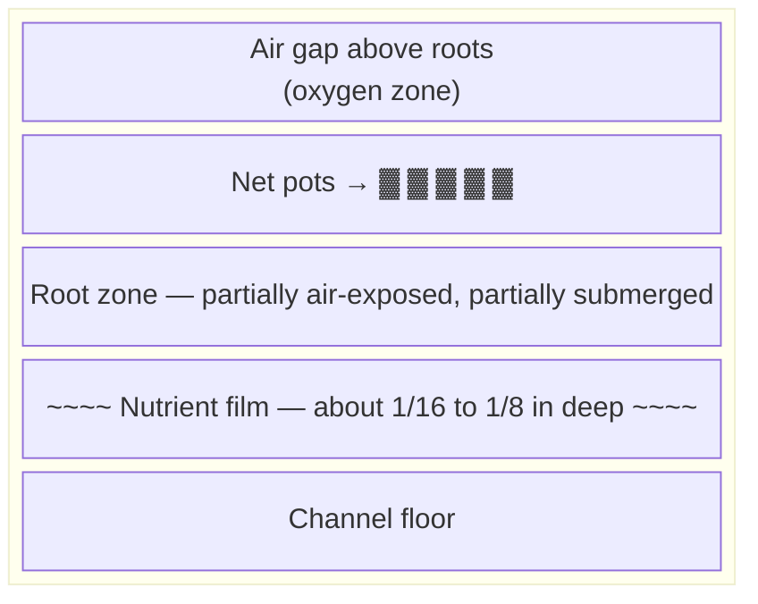
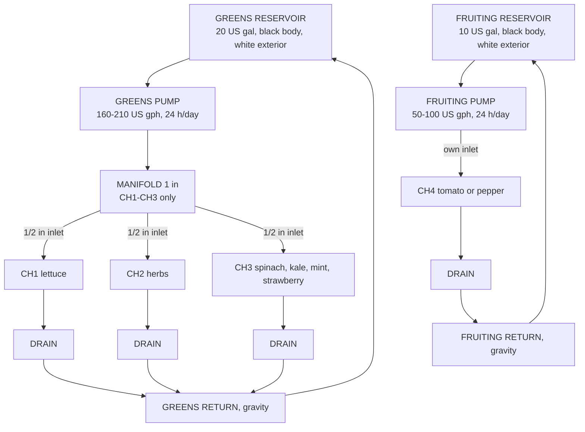
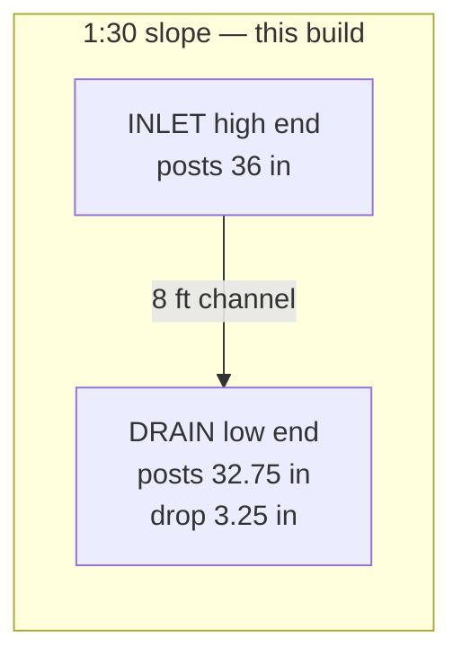
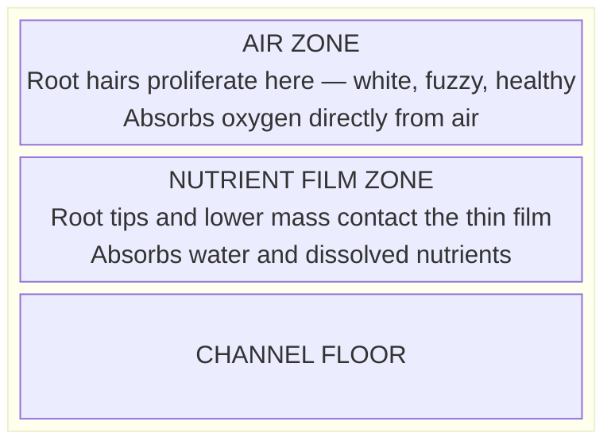

# Guide 01 — NFT Basics
## How Nutrient Film Technique Works

[](../../README.md)
[](https://creativecommons.org/licenses/by-nc-sa/4.0/)

Numbers in this guide follow [Design Constants](../design-constants.md). The zone map is in [zones.md](../../zones.md).

---

## Table of Contents

- [1. History and Origin](#1-history-and-origin)
- [2. Core Principle: The Thin Film](#2-core-principle-the-thin-film)
- [3. Anatomy of an NFT System](#3-anatomy-of-an-nft-system)
  - [Component Descriptions](#component-descriptions)
- [4. Channel Slope: The Critical Variable](#4-channel-slope-the-critical-variable)
  - [Design Slope: 1:30](#design-slope-130)
  - [Slope Effects Table](#slope-effects-table)
- [5. Flow Rate Science](#5-flow-rate-science)
  - [Target Flow per Greens Channel](#target-flow-per-greens-channel)
  - [Calculating Pump Requirements](#calculating-pump-requirements)
  - [Laminar vs Turbulent Flow](#laminar-vs-turbulent-flow)
- [6. Root Zone Oxygenation](#6-root-zone-oxygenation)
- [7. NFT vs Other Systems Comparison](#7-nft-vs-other-systems-comparison)
- [8. Why NFT Is Ideal for Leafy Crops — and Why It Fails for Root Veg](#8-why-nft-is-ideal-for-leafy-crops-and-why-it-fails-for-root-veg)
  - [Ideal for leafy crops because:](#ideal-for-leafy-crops-because)
  - [Poor for root vegetables because:](#poor-for-root-vegetables-because)
- [9. Pump Runtime: Continuous vs Timed](#9-pump-runtime-continuous-vs-timed)
  - [NFT runs 24/7 (continuously)](#nft-runs-247-continuously)
  - [When a Timer Makes Sense](#when-a-timer-makes-sense)
- [10. What Happens During Pump Failure](#10-what-happens-during-pump-failure)
  - [Emergency Protocol for NFT Pump Failure](#emergency-protocol-for-nft-pump-failure)
- [11. Scaling: Modular Channel Design](#11-scaling-modular-channel-design)
- [12. Pros and Cons Summary](#12-pros-and-cons-summary)
  - [Pros](#pros)
  - [Cons](#cons)
- [13. Key Numbers Reference Card](#13-key-numbers-reference-card)


[↑ Back to TOC](#table-of-contents)

## 1. History and Origin

Nutrient Film Technique was developed by **Dr. Allen Cooper** at the Glasshouse Crops Research Institute in Littlehampton, England, in the late 1960s and early 1970s. Cooper published his findings in the 1970s, revolutionizing commercial hydroponics by demonstrating that plants could thrive with their roots exposed to a continuous, very shallow stream of nutrient solution — no solid growing medium required.

The original NFT systems were built with aluminum channels and used relatively crude flow controls, but the core principle has remained essentially unchanged for over 50 years. Today NFT is one of the most widely used hydroponic methods in commercial lettuce and herb production globally, chosen for its simplicity, low water usage, excellent oxygenation, and easy root zone access.


---


[↑ Back to TOC](#table-of-contents)

## 2. Core Principle: The Thin Film

The defining characteristic of NFT is the **thin film** of nutrient solution that flows continuously along the floor of a slightly sloped channel. Here is what makes it work:



**Three simultaneous benefits for the root zone:**
1. **Nutrient delivery** — roots touching the film absorb water and minerals
2. **Oxygenation** — the air gap above the film oxygenates the root mass
3. **Simplicity** — no need to flood/drain; gravity + pump does all the work

**Why this matters:** Roots need both water/nutrients AND oxygen. Submerging roots fully (as in DWC without aeration) risks suffocation. NFT's thin film provides an air-water interface along the channel. An air pump is still recommended in both reservoirs of this build, so the stored solution stays oxygenated between passes through the channels.


---


[↑ Back to TOC](#table-of-contents)

## 3. Anatomy of an NFT System

Every NFT system — from a 2-channel home setup to a commercial greenhouse — shares the same fundamental components:

This build is two loops. CH1–CH3 share a greens reservoir. CH4 has its own reservoir and is not teed into the greens manifold.



### Component Descriptions

| Component | Function | Notes |
|-----------|----------|-------|
| **Greens reservoir** | Holds the CH1–CH3 solution | 20 US gal (76 L), food-grade, black body, white exterior, shaded |
| **Fruiting reservoir** | Holds the CH4 solution only | 10 US gal (38 L), same finish. Never shared with lettuce |
| **Greens pump** | Circulates the greens loop 24 hours a day | 160–210 US gph (600–800 L/h), about 15 W |
| **Fruiting pump** | Circulates CH4 24 hours a day | 50–100 US gph (200–400 L/h), about 8 W. Not teed into the greens manifold |
| **Air pump** | Aerates stored solution | Recommended in both reservoirs |
| **Greens manifold** | Splits flow to CH1–CH3 only | 1 in (25 mm) main, ½ in (13 mm) inlets |
| **Inlet fittings** | Deliver solution at the high end of each channel | ½ in (13 mm) barb or thread through the end cap |
| **Channels** | The grow tubes where plants sit | 8 ft (2.44 m). CH1–CH3 are 3 in (76 mm) square. CH4 is 4 in (102 mm) square |
| **Net pots** | Hold plants and a little media | 2 in (51 mm) on CH1–CH3, including strawberries. 3 in (76 mm) on CH4 |
| **Drain fittings** | Exit at the low end of each channel | Gravity-fed |
| **Return line** | Carries drained solution back to its own reservoir | ¾–1 in (19–25 mm), gravity only, one return per loop |


---


[↑ Back to TOC](#table-of-contents)

## 4. Channel Slope: The Critical Variable

The slope of the channel determines everything about how the thin film behaves. Too shallow and solution pools; too steep and solution rushes through without adequate contact.

### Design Slope: 1:30

This build uses **1:30**: a **3¼ in (83 mm)** drop over each **8 ft (2.44 m)** channel. The inlet-end posts are **36 in (91 cm)** and the drain-end posts are **32¾ in (83 cm)**. That post difference is the drop.



### Slope Effects Table

| Slope | Effect | Use Case |
|-------|--------|---------|
| Flatter than 1:50 | Solution pools, uneven distribution, root rot risk | Avoid |
| 1:40 | Smooth film, a bit less drop than this build | Acceptable on other rigs |
| **1:30 (this build)** | Smooth thin film, good contact, good drainage | 3¼ in (83 mm) over 8 ft (2.44 m) |
| 1:30–1:20 | Film flows faster, less contact time | Sometimes used on channels longer than 10 ft (3 m) |
| Steeper than 1:20 | Solution rushes through, minimal root contact, dry spots at the inlet | Avoid |

**Practical tip:** Set the slope with a spirit level and shims, then confirm the post heights: 36 in (91 cm) at the inlet and 32¾ in (83 cm) at the drain. The angle is gentle and easy to miss by eye, so measure it.


---


[↑ Back to TOC](#table-of-contents)

## 5. Flow Rate Science

### Target Flow per Greens Channel

Flow rate determines how thick the film is and how fast nutrients are replenished at the root zone. The greens loop (CH1–CH3) is designed for **0.26–0.53 US gpm (1–2 L/min)** in each channel. CH4 has its own smaller pump and is not part of that total.

```
  FLOW RATE EFFECTS (per channel):

  0.13 US gpm / 0.5 L/min (too slow):
  ─ Film becomes intermittent, dry spots develop, roots desiccate

  0.26–0.53 US gpm / 1–2 L/min (greens target):
  ─ Continuous thin film, about 1/16–1/8 in (2–4 mm) deep, laminar flow
  ─ Roots stay moist, air gap maintained

  0.8 US gpm / 3 L/min and above (too fast on a greens channel):
  ─ Turbulent flow, film too deep, roots partially submerged
  ─ Reduced oxygenation, increased system noise
```

### Calculating Pump Requirements

The greens pump feeds three channels. The fruiting pump feeds CH4 alone.

```
  GREENS LOOP (CH1–CH3):

  3 channels × 0.40 US gpm (1.5 L/min) = 1.2 US gpm (4.5 L/min)
                                       = 72 US gph (270 L/h) at the channels

  Add headroom for the lift from the reservoir up to the manifold.

  Design pump: 160–210 US gph (600–800 L/h), about 15 W
  Runtime: 24 hours a day

  FRUITING LOOP (CH4 only):

  Design pump: 50–100 US gph (200–400 L/h), about 8 W
  Runtime: 24 hours a day
  Do not tee this pump into the 1 in (25 mm) greens manifold.
```

**Head pressure note:** Every 3.3 ft (1 m) of vertical lift reduces effective pump output by roughly 20%. If the greens pump must lift solution 3.3 ft (1 m) to the manifold, a 160 US gph (600 L/h) pump may deliver about 125 US gph (480 L/h) at the outlet. The specified 160–210 US gph (600–800 L/h) range is there to cover that lift. The inlet posts are 36 in (91 cm), so measure the actual lift from the pump to the manifold rather than assuming the post height is the whole lift.

### Laminar vs Turbulent Flow

- **Laminar flow** (smooth, layered) is ideal for NFT — solution flows evenly across the channel floor
- **Turbulent flow** (rough, splashing) disrupts the film and reduces the air-water interface

Turbulence is caused by excessive flow rate, rough channel surfaces, debris in the channel, or kinked inlet tubes. Keep inlets smooth, flow rates controlled, and channels clean.


---


[↑ Back to TOC](#table-of-contents)

## 6. Root Zone Oxygenation

This is the biological engine behind NFT's effectiveness. The root system that develops in an NFT channel is divided into two distinct zones:



**Oxygen dissolved in water:** Water at 68°F (20°C) holds approximately 9 mg/L of dissolved oxygen. Plant roots can deplete this quickly in a stagnant tank. In NFT, the return stream re-oxygenates solution as it falls back into the reservoir, and an air pump in each reservoir keeps that store from going stale. The air gap in the channel is the root zone's main oxygen supply.

**Why this matters for temperature:** Aim for **64–72°F (18–22°C)**. Above **77°F (25°C)**, dissolved oxygen falls and pythium risk rises. That is the heat action line. At 82°F (28°C), water holds about 7.8 mg/L of dissolved oxygen. At 86°F (30°C), it is about 7.5 mg/L. Shade the reservoirs, keep the black body and white exterior, and act before the solution sits above 77°F (25°C).


---


[↑ Back to TOC](#table-of-contents)

## 7. NFT vs Other Systems Comparison

| Feature | NFT | DWC | Ebb & Flow | Kratky | Wick |
|---------|-----|-----|-----------|--------|------|
| **Complexity** | Medium | Medium | Medium | Very low | Very low |
| **Water usage** | Low | Medium | Medium | Very low | Low |
| **Oxygenation** | Excellent (natural) | Good (air pump) | Good (flood cycle) | OK (air gap) | Poor |
| **Pump required** | Yes (continuous) | Air pump | Water pump + timer | No | No |
| **Power failure risk** | High (roots dry fast) | Medium | Medium | None | None |
| **Best for** | Leafy greens, herbs; fruiting crops on their own tank | Lettuce, basil | Tomatoes, peppers, in a media bed | Lettuce | Herbs |
| **Root veg** | Poor | Poor | OK | Poor | Poor |
| **Media needed** | Minimal | Minimal | Yes | None | Yes |
| **Scalability** | Excellent | Good | Moderate | Low | Low |
| **Commercial use** | Very common | Common | Less common | Rare | Rare |
| **Beginner friendly** | Moderate | Moderate | Moderate | Very | Very |


---


[↑ Back to TOC](#table-of-contents)

## 8. Why NFT Is Ideal for Leafy Crops — and Why It Fails for Root Veg

### Ideal for leafy crops because:
- Fast-growing, shallow root systems are perfectly served by the thin film
- High harvest frequency and succession planting work perfectly with the modular channel system
- The greens loop runs at EC 0.8–1.8 mS/cm, so leafy crops share one simple tank. Lettuce stays at or below 1.8 mS/cm
- Multiple plants per channel maximize the return on the pump investment

### Poor for root vegetables because:
- Carrots, radishes, and beet (beetroot) develop a **tap root** that must grow downward into a substrate
- These channels are only 3 in (76 mm) or 4 in (102 mm) tall — not enough depth for a tap root
- The thin film doesn't provide the structural support root veg need
- Root veg need a solid medium to form correct shapes; NFT produces deformed, stunted roots

**Solution:** Use grow bags with the Zone C mix — 60% coco / 30% perlite / 10% vermiculite — for root veg.


---


[↑ Back to TOC](#table-of-contents)

## 9. Pump Runtime: Continuous vs Timed

### NFT runs 24/7 (continuously)

Unlike ebb-and-flow systems that flood and drain on a timer, NFT relies on a **continuous thin film**. If the pump stops, the film disappears within seconds and the roots — now hanging in air — begin to desiccate. This is the Achilles heel of NFT.

```
  ROOT DRY-OUT AFTER A PUMP STOPS (warm weather):

  The film leaves the channel floor within a few minutes.
  Root tips at the inlet start to dry soon after that.
  15–30 minutes: action window. Plants are already stressed.
                 Hand-water the channel or get the pump back on.
                 Do not wait out a longer "recovery" period.

  Hot, dry, windy weather sits at the short end of that 15–30 minute window.
  Treat 15–30 minutes as the action time. Get flow back, or hand-water.
```

### When a Timer Makes Sense

It does not, on this system. Both pumps run **24 hours a day**.

- Do not turn the pumps off overnight.
- Do not use 15 minutes on / 45 minutes off.
- A timer that fails in the OFF position leaves roots dry inside the 15–30 minute warm-weather window.

Electricity for these small pumps is part of the [Guide 12](12-budget-and-sourcing.md) running-cost notes, at the planning rate of $0.15/kWh (R2.70/kWh). Saving that by cycling the film off is the wrong trade. Dissolved oxygen is handled by the thin film plus an air pump in each reservoir, not by parking the channel dry.


---


[↑ Back to TOC](#table-of-contents)

## 10. What Happens During Pump Failure

### Emergency Protocol for NFT Pump Failure

**Immediate steps (within 15 minutes):**
1. Identify the failure (power cut, tripped breaker, mechanical failure)
2. If power cut: use a watering can to manually pour nutrient solution through each channel inlet — this buys time
3. If pump failed: check impeller for debris, check power connection, have a spare pump if possible
4. If failure persists >30 minutes: move plants to a temporary container with water to keep roots moist

**Prevention:**
- Keep a spare pump (about $15–$25 (R270–R450) for a basic spare)
- Use an outdoor-rated extension lead with surge protection
- Set a phone reminder to visually confirm pump operation every morning
- Consider a cheap WiFi smart plug — if the pump draws 0W, it sends an alert


---


[↑ Back to TOC](#table-of-contents)

## 11. Scaling: Modular Channel Design

NFT channels are modular, but this build is already two loops and they stay that way. CH4 is not an extra outlet on the greens pump.

```
  THIS BUILD — 40 SITES, TWO RESERVOIRS:

  Greens:   20 US gal (76 L) + CH1, CH2, CH3 = 33 sites
            11 sites per channel at 9 in (229 mm)
  Fruiting: 10 US gal (38 L) + CH4 = 7 holes at 12 in (305 mm)
            4–5 indeterminate cherry plants (skip holes),
            or up to 7 compact plants
  Total:    40 sites

  Greens pump:   160–210 US gph (600–800 L/h), 24 h/day
  Fruiting pump: 50–100 US gph (200–400 L/h), 24 h/day
  Manifold:      1 in (25 mm), CH1–CH3 only
```

If you later add a fifth greens channel, that is a new design, not a tee onto today's manifold:
- **Keep the loops separate.** Tomato fruiting EC does not go in the lettuce tank.
- **Reservoir volume:** a textbook greenhouse allows several gallons per site. This home build uses the 20 US gal (76 L) and 10 US gal (38 L) tanks and relies on daily EC and pH checks plus the change intervals in [Guide 02 — Nutrient Solution](02-nutrient-solution.md).
- **Pump capacity:** each added greens channel needs another 0.26–0.53 US gpm (1–2 L/min).
- **Manifold:** this 1 in (25 mm) manifold feeds three channels. A run of more than six greens channels wants a larger main, about 1¼ in (32 mm).
- **Return pipe:** each loop's ¾–1 in (19–25 mm) return has to carry that loop's combined flow back to its own reservoir.


---


[↑ Back to TOC](#table-of-contents)

## 12. Pros and Cons Summary

### Pros

| Advantage | Detail |
|-----------|--------|
| Excellent oxygenation | The film leaves an air gap at the roots. An air pump is still recommended in both reservoirs |
| Low water usage | Recirculating system, evaporation losses only |
| Low media cost | Only net pots + small amount of clay pebbles |
| Easy root inspection | Lift net pot to check roots anytime |
| Highly scalable | Add channels easily |
| Fast growth rates | Leafy crops 30–50% faster than soil |
| Clean, pest-resistant | No soil = no soil-borne pests |
| Easy harvest | Cut-and-come-again or full pull |

### Cons

| Disadvantage | Detail |
|-------------|--------|
| Power dependency | In warm weather, act within 15–30 minutes of a pump stop |
| Not suitable for all crops | Root veg and large fruiting plants are poor fits |
| Channel blockage risk | Root mats can block flow; needs monitoring |
| Disease spread risk | Water recirculation can spread pathogens quickly |
| Temperature sensitivity | Reservoir water can overheat outdoors |
| Algae risk | Light entering channels grows algae; channels must be opaque |
| Limited buffering | Small reservoir = fast pH/EC swings |


---


[↑ Back to TOC](#table-of-contents)

## 13. Key Numbers Reference Card

| Parameter | Value |
|-----------|-------|
| Channel length | 8 ft (2.44 m) |
| Channel slope | 1:30, a 3¼ in (83 mm) drop |
| Posts | 36 in (91 cm) high end, 32¾ in (83 cm) low end |
| Greens channels | CH1–CH3, 3 in (76 mm) square, 11 sites at 9 in (229 mm) |
| Fruiting channel | CH4, 4 in (102 mm) square, 7 holes at 12 in (305 mm) |
| Total sites | 40 |
| Greens flow | 0.26–0.53 US gpm (1–2 L/min) per channel |
| Film depth | About 1/16–1/8 in (2–4 mm) |
| Greens pump | 160–210 US gph (600–800 L/h), 24 hours a day |
| Fruiting pump | 50–100 US gph (200–400 L/h), 24 hours a day, own reservoir |
| Greens reservoir | 20 US gal (76 L), black body, white exterior |
| Fruiting reservoir | 10 US gal (38 L), black body, white exterior |
| Air pump | Recommended in both reservoirs |
| Manifold | 1 in (25 mm), CH1–CH3 only. Inlets ½ in (13 mm) |
| Dry-out action window | 15–30 minutes in warm weather |
| Solution temperature | Aim 64–72°F (18–22°C). Act above 77°F (25°C) |
| Net pots | 2 in (51 mm) on CH1–CH3, 3 in (76 mm) on CH4 |
| Greens EC | 0.8–1.8 mS/cm. Full change every 7 days |
| Fruiting EC | Tomato 2.5–3.5 mS/cm, pepper 2.0–3.0 mS/cm, this tank only. Change every 5–7 days |

---


> **Previous:** [Guide 00 — System Overview](00-system-overview.md)


[↑ Back to TOC](#table-of-contents)

> **Next:** [Guide 02 — Nutrient Solution](02-nutrient-solution.md)

<!-- copyright -->
*Copyright (c) 2026 UncleJS. Licensed under [CC BY-NC-SA 4.0](https://creativecommons.org/licenses/by-nc-sa/4.0/) — free to share and adapt for non-commercial purposes with attribution and ShareAlike.*
