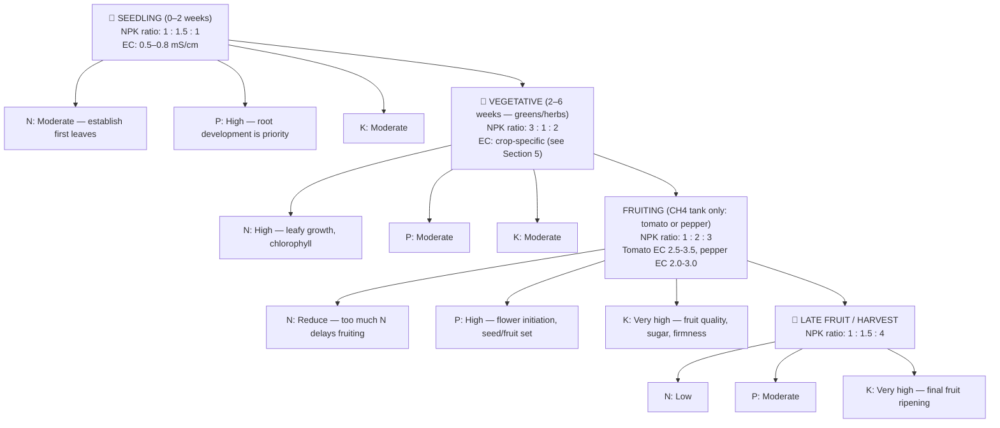
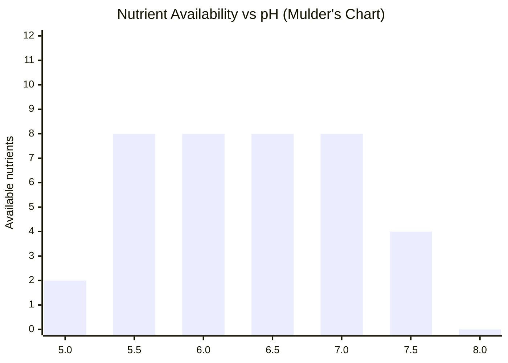
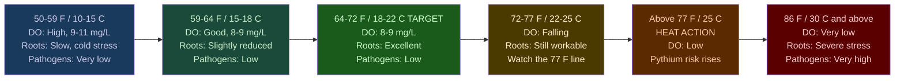
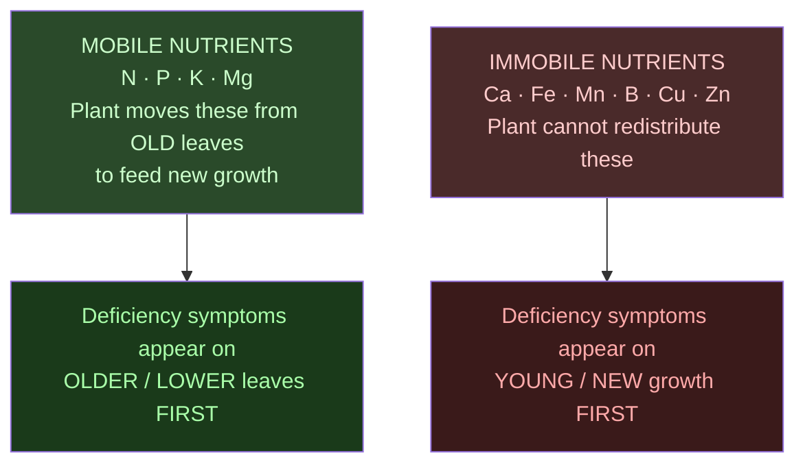

# Guide 02 — Nutrient Solution
## EC, pH, Macros, Micros, Mixing, and Schedules

[](../../README.md)
[](https://creativecommons.org/licenses/by-nc-sa/4.0/)

Doses, EC targets, and reservoir volumes follow [Design Constants](../design-constants.md). Zone layout is in [zones.md](../../zones.md).

---

## Table of Contents

- [1. Why Nutrients Matter in Hydroponics](#1-why-nutrients-matter-in-hydroponics)
- [2. The 17 Essential Plant Nutrients](#2-the-17-essential-plant-nutrients)
  - [Macronutrients (needed in large quantities)](#macronutrients-needed-in-large-quantities)
  - [Secondary Macronutrients (needed in moderate quantities)](#secondary-macronutrients-needed-in-moderate-quantities)
  - [Micronutrients (needed in trace quantities — but still essential)](#micronutrients-needed-in-trace-quantities-but-still-essential)
- [3. NPK at Each Growth Stage](#3-npk-at-each-growth-stage)
- [4. EC — Electrical Conductivity](#4-ec-electrical-conductivity)
  - [What EC Measures](#what-ec-measures)
  - [Why EC Matters](#why-ec-matters)
  - [EC Target Ranges by Crop](#ec-target-ranges-by-crop)
- [5. pH — The Key to Nutrient Availability](#5-ph-the-key-to-nutrient-availability)
  - [What pH Measures](#what-ph-measures)
  - [Target pH Range for Hydroponics: 5.5–6.5](#target-ph-range-for-hydroponics-5565)
  - [Nutrient Availability vs pH (Mulder's Chart Simplified)](#nutrient-availability-vs-ph-mulders-chart-simplified)
  - [Ideal pH by Crop](#ideal-ph-by-crop)
  - [pH Drift](#ph-drift)
- [6. Two-Part vs Three-Part vs One-Part Nutrients](#6-two-part-vs-three-part-vs-one-part-nutrients)
  - [One-Part / All-in-One](#one-part-all-in-one)
  - [Two-Part Systems](#two-part-systems)
  - [Three-Part Systems](#three-part-systems)
  - [The Masterblend Trio (Budget Champion)](#the-masterblend-trio-budget-champion)
- [7. Masterblend Trio — Mixing Recipe](#7-masterblend-trio-mixing-recipe)
  - [Components](#components)
  - [Standard Mixing Recipe (per 1 US gal)](#standard-mixing-recipe-per-1-us-gal)
  - [Masterblend Dose Scaling](#masterblend-dose-scaling)
- [8. General Hydroponics Flora Series Schedule](#8-general-hydroponics-flora-series-schedule)
  - [Mix Ratios (per US gallon)](#mix-ratios-per-us-gallon)
- [9. Nutrient Solution Temperature](#9-nutrient-solution-temperature)
  - [Solution temperature aim](#solution-temperature-aim)
- [10. Reservoir Top-Up vs Full Change](#10-reservoir-top-up-vs-full-change)
  - [Two Operations — Very Different Purposes](#two-operations-very-different-purposes)
- [11. Visual Nutrient Deficiency and Toxicity Guide](#11-visual-nutrient-deficiency-and-toxicity-guide)
  - [How to Identify Location of Symptoms (Key Diagnostic Clue)](#how-to-identify-location-of-symptoms-key-diagnostic-clue)
  - [Deficiency Quick Reference](#deficiency-quick-reference)
  - [Toxicity Signs](#toxicity-signs)
- [12. Organic Hydroponics](#12-organic-hydroponics)
  - [Key Differences](#key-differences)
  - [Common Organic Nutrient Sources](#common-organic-nutrient-sources)
  - [Simple Organic Nutrient Recipe (Vegetative Stage)](#simple-organic-nutrient-recipe-vegetative-stage)
  - [Why Organic Is Harder in NFT Specifically](#why-organic-is-harder-in-nft-specifically)
- [13. Water Volume Calculator Reference](#13-water-volume-calculator-reference)
  - [Reservoir Volume Needed](#reservoir-volume-needed)
  - [Solution Volume per Full Mix](#solution-volume-per-full-mix)


[↑ Back to TOC](#table-of-contents)

## 1. Why Nutrients Matter in Hydroponics

In soil, plants access nutrients through complex microbial activity, organic matter decomposition, and mineral weathering. The soil acts as a buffer — it holds reserves and slowly releases them. In hydroponics, **you are the soil**. Every nutrient the plant will ever receive comes directly from the solution you mix. There is no buffer, no reserve, no margin for error beyond what you build into your management routine.

This is both the power and the responsibility of hydroponics:
- **Power:** Complete control over what the plant gets, when it gets it, and in what ratios
- **Responsibility:** Get it wrong and plants suffer immediately — there is no soil to compensate


---


[↑ Back to TOC](#table-of-contents)

## 2. The 17 Essential Plant Nutrients

A plant needs 17 essential elements to finish its life cycle. Carbon, hydrogen, and oxygen are three of them, and the plant takes those from air and water, not from the nutrient bottle. The other 14 are mineral elements you dissolve into the solution. They are the tables below: nitrogen, phosphorus, potassium, calcium, magnesium, sulfur, iron, manganese, zinc, copper, boron, molybdenum, chlorine, and nickel.

Hydroponic lists sometimes call a longer mineral set "the 17" by adding silicon or other extras. Silicon is beneficial for cell walls and pest resistance. It is not one of the 17. Cobalt and sodium are not part of that list either. Do not count them in the 14 minerals you are required to dose.

### Macronutrients (needed in large quantities)

| Nutrient | Symbol | Primary Role | Deficiency Signs |
|----------|--------|-------------|-----------------|
| **Nitrogen** | N | Vegetative growth, chlorophyll, protein synthesis | Yellowing from older leaves upward (chlorosis), stunted growth |
| **Phosphorus** | P | Root development, energy transfer (ATP), flowering | Purple/reddish stems and leaf undersides, poor root growth |
| **Potassium** | K | Water regulation, enzyme activation, fruit quality | Brown leaf edges (scorch), weak stems, poor fruit development |

### Secondary Macronutrients (needed in moderate quantities)

| Nutrient | Symbol | Primary Role | Deficiency Signs |
|----------|--------|-------------|-----------------|
| **Calcium** | Ca | Cell wall strength, root development | Tip burn (necrosis of young leaf margins), blossom end rot in tomatoes |
| **Magnesium** | Mg | Chlorophyll center, enzyme cofactor | Interveinal chlorosis (yellowing between veins on older leaves) |
| **Sulfur** | S | Amino acid synthesis, enzyme function | Uniform yellowing of young leaves (similar to N but starts young) |

### Micronutrients (needed in trace quantities — but still essential)

| Nutrient | Symbol | Primary Role | Deficiency Signs |
|----------|--------|-------------|-----------------|
| **Iron** | Fe | Chlorophyll synthesis | Interveinal chlorosis on young leaves (yellow with green veins) |
| **Manganese** | Mn | Photosynthesis, enzyme activation | Similar to Fe — interveinal chlorosis, brown spots |
| **Zinc** | Zn | Enzyme function, hormone synthesis | Small leaves, short internodes, distorted growth |
| **Copper** | Cu | Enzyme function, photosynthesis | Wilting of young leaves, bluish-green discoloration |
| **Boron** | B | Cell wall formation, pollen viability | Distorted, thick, brittle young leaves; poor fruit set |
| **Molybdenum** | Mo | Nitrogen fixation, enzyme function | Cupped/cupping leaves, marginal scorch |
| **Chlorine** | Cl | Osmosis, photosynthesis | Wilting, bronzing of leaves |
| **Nickel** | Ni | Urease enzyme | Rare — tip necrosis of young leaves |

Silicon is beneficial, not one of the 17, and it is not in the Masterblend dose you weigh below. Cobalt and sodium are not essential for this system.

> **Key insight:** Micronutrient deficiencies are often caused not by absence from the solution but by **pH locking them out**. This is why pH control is non-negotiable.


---


[↑ Back to TOC](#table-of-contents)

## 3. NPK at Each Growth Stage

The ratio of N:P:K that plants need changes dramatically across their life cycle:




---


[↑ Back to TOC](#table-of-contents)

## 4. EC — Electrical Conductivity

### What EC Measures

EC (electrical conductivity) measures the **total dissolved salt concentration** in the nutrient solution. Pure water conducts virtually no electricity. As you dissolve nutrients (salts) in water, conductivity increases proportionally.

Units: **mS/cm** (millisiemens per centimeter) — some meters display as EC, others as TDS (total dissolved solids) in ppm.

```
  EC vs TDS CONVERSION (approximate):

  1.0 mS/cm ≈ 500–700 ppm TDS (conversion factor varies: 0.5–0.7 depending on meter)

  Always work in mS/cm for precision. If your meter only reads ppm, divide by 500 to
  get approximate EC in mS/cm.
```

### Why EC Matters

- **Too low:** Plants are nutrient-starved — thin, pale, slow growth
- **Too high:** Osmotic stress — roots cannot absorb water (like trying to drink seawater), leaf tip burn, wilting

### EC Target Ranges by Crop

| Crop | Where it grows | Seedling | Vegetative | Fruiting or mature | Ceiling |
|------|----------------|----------|-----------|--------------------|---------|
| Lettuce | CH1, greens tank | 0.6–0.8 | 0.8–1.2 | 1.0–1.6 | 1.8 |
| Spinach | CH3, greens tank | 0.8–1.0 | 1.2–1.6 | 1.4–1.8 | 1.8 |
| Basil | CH2, greens tank | 0.8–1.0 | 1.0–1.6 | 1.4–1.8 | 1.8 |
| Cilantro, parsley, chives | CH2, greens tank | 0.8–1.0 | 1.0–1.6 | — | 1.8 |
| Kale, mint | CH3, greens tank | 0.8–1.2 | 1.2–1.6 | 1.4–1.8 | 1.8 |
| Strawberries | CH3, 3–4 of the 11 sites, greens tank | 0.8–1.0 | 1.2–1.6 | 1.4–1.8 | 1.8 |
| Cherry tomatoes | CH4, fruiting tank only | 0.8–1.2 | 2.0–2.5 | 2.5–3.5 | 3.5 |
| Peppers | CH4, fruiting tank only | 0.8–1.2 | 1.8–2.2 | 2.0–3.0 | 3.0 |
| Radishes (bags) | Zone C | 0.8–1.0 | 1.2–1.6 | 1.6–2.0 | 2.0 |
| Beetroot (bags) | Zone C | 0.8–1.0 | 1.2–1.6 | 1.6–2.0 | 2.0 |
| Carrots (bags) | Zone C | 0.6–0.8 | 1.0–1.4 | 1.4–1.8 | 2.0 |

All values are mS/cm.

CH1–CH3 share the 20 US gal (76 L) greens tank, so that tank stays in **0.8–1.8 mS/cm** for the whole loop. Lettuce stays at or below 1.8 mS/cm, which is why spinach, kale, herbs, and strawberries on this loop do not get a higher target. CH1 is lettuce only. Herbs are CH2, not a mix inside the lettuce channel.

Tomato fruiting **2.5–3.5 mS/cm** and pepper fruiting **2.0–3.0 mS/cm** apply only in the 10 US gal (38 L) CH4 tank. If tomato and pepper share that tank, hold **2.5–3.0 mS/cm**, which sits inside both fruiting bands. Do not put those numbers in the greens tank.

Zone C fertigation ceiling is **2.0 mS/cm**. Beet (beetroot) does not get a higher target.


---


[↑ Back to TOC](#table-of-contents)

## 5. pH — The Key to Nutrient Availability

### What pH Measures

pH measures the **acidity or alkalinity** of the solution on a 0–14 scale:
- 0–6.9: Acidic
- 7.0: Neutral
- 7.1–14: Alkaline/Basic

### Target pH Range for Hydroponics: 5.5–6.5

The **working window is pH 5.8–6.2**. The **acceptable band is 5.5–6.5**. That wider band is where the essential nutrients are available together at usable levels. Outside 5.5–6.5, specific nutrients lock into forms the plant cannot absorb, even when those nutrients are in the water. Steer daily readings back into 5.8–6.2.

### Nutrient Availability vs pH (Mulder's Chart Simplified)



> **Key:** Each bar represents the number of major nutrients readily available at that pH level. The working window for this build is **pH 5.8–6.2**. The acceptable band is **5.5–6.5**.
>
> Detailed availability by nutrient:
>
> | Nutrient | Best availability |
> |----------|-------------------|
> | N | 5.5–7.5 |
> | P | 5.5–7.0 |
> | K | 5.5–8.0 |
> | Ca | 6.0–8.0 |
> | Mg | 5.5–7.5 |
> | S | 5.5–8.0 |
> | Fe, Mn | 5.0–6.5 (locked out above ~6.5) |
> | Zn, Cu | 5.0–6.5 (locked out above ~6.5) |
> | B | 5.5–6.5 |
> | Mo | 6.5–8.0 (locked out below ~6.0) |
>
> **Working window: pH 5.8–6.2. Acceptable band: pH 5.5–6.5.**

### Ideal pH by Crop

| Crop | Target pH |
|------|-----------|
| Greens loop (lettuce, herbs, spinach, kale, mint, strawberries) | Working window 5.8–6.2 |
| CH4 tomatoes or peppers | Working window 5.8–6.2 |
| Zone B microgreens (water only) | 5.8–6.2 |
| Zone C bags | Working window 5.8–6.2 |

**Both reservoirs and the grow-bag fertigation use pH 5.8–6.2.** The acceptable band, if a reading drifts, is 5.5–6.5. Adjust when the reading leaves 5.5–6.5, and steer back into 5.8–6.2.

### pH Drift

pH naturally drifts over time in a hydroponic system. Understanding the direction of drift tells you what the plants are doing:

- **pH rising:** Plants are consuming more **anions** (NO₃⁻, H₂PO₄⁻, SO₄²⁻), releasing OH⁻. Common in vegetative growth.
- **pH falling:** Plants are consuming more **cations** (NH₄⁺, K⁺, Ca²⁺, Mg²⁺), releasing H⁺. Common in fruiting stage.

Normal drift: ±0.2–0.5 pH per day is acceptable. Adjust when outside 5.5–6.5.


---


[↑ Back to TOC](#table-of-contents)

## 6. Two-Part vs Three-Part vs One-Part Nutrients

### One-Part / All-in-One
- **Example:** General Hydroponics MaxiGro / MaxiBloom, Masterblend (sort of)
- **Pros:** Simple, one bottle, beginner-friendly
- **Cons:** Can't adjust N:P:K ratio independently, some precipitation risk

### Two-Part Systems
- **Example:** General Hydroponics FloraDuo, Canna Aqua Vega/Flores
- **Pros:** Adjust growth/bloom ratio by changing mix ratio
- **Cons:** Slightly more complex

### Three-Part Systems
- **Example:** General Hydroponics Flora Series (FloraGro / FloraBloom / FloraMicro)
- **Pros:** Full NPK control at every stage, widely available, professional results
- **Cons:** Three bottles to manage, requires following a schedule

### The Masterblend Trio (Budget Champion)
- **Components:** MasterBlend 4-18-38 + Calcium Nitrate (15.5-0-0) + Magnesium Sulfate (Epsom Salt)
- **Pros:** Extremely cost-effective for a season of reservoir fills, professional-grade results, widely used by commercial growers. Price the salts in [Guide 12 — Budget and Sourcing](12-budget-and-sourcing.md) in US dollars with rand in brackets
- **Cons:** Dry salts, requires accurate weighing (digital scale needed), no pH buffering built in


---


[↑ Back to TOC](#table-of-contents)

## 7. Masterblend Trio — Mixing Recipe

This is the most cost-effective nutrient system available. Used by professional growers worldwide.

**PPE and storage (required):**
- Gloves, eye protection, and a dust mask when you handle dry salts, phosphoric acid (pH Down), or potassium hydroxide (pH Up).
- Weigh and mix outdoors or in a ventilated spot. Do not breathe the dust.
- Keep nutrient concentrates, acids, and pesticides in a **latched box**, out of the sun, away from children and pets. A garden that is good for children still locks the chemicals.

### Components

| Component | Chemical | Analysis |
|-----------|----------|----------|
| MasterBlend 4-18-38 | Potassium nitrate + trace mix | N-P-K + complete micronutrients |
| Calcium Nitrate | Ca(NO₃)₂ | 15.5-0-0 + 19% Ca |
| Magnesium Sulfate | MgSO₄ (Epsom Salt) | 10% Mg, 13% S |

### Standard Mixing Recipe (per 1 US gal)

Per **1 US gal (3.8 L)**, vegetative base, EC about **1.4–1.6 mS/cm**:

| Salt | Per 1 US gal | Per liter |
|------|----------------|-----------|
| Masterblend 4-18-38 | 2.4 g | 0.63 g/L |
| Calcium nitrate | 2.4 g | 0.63 g/L |
| Epsom salt | 1.2 g | 0.32 g/L |

Write the dose as **2.4 g/US gal (0.63 g/L)** for Masterblend and for calcium nitrate, and **1.2 g/US gal (0.32 g/L)** for Epsom salt. Keep that 2 : 2 : 1 ratio when you scale. Do not change the ratio to chase one element unless you are in a deficiency correction.

```
  MIXING ORDER (critical — always in this sequence):

  Mix one tank at a time. Name the tank before you start:
  greens = 20 US gal (76 L), fruiting = 10 US gal (38 L).

  Step 1: Fill that reservoir with 50% of its target water volume
  Step 2: Add calcium nitrate, stir until dissolved
  Step 3: Add the remaining water (dilute calcium before sulfate and phosphate)
  Step 4: Add Epsom salt, stir until dissolved
  Step 5: Add Masterblend, stir until dissolved
  Step 6: Adjust pH to 5.8–6.2
  Step 7: Measure EC — vegetative base about 1.4–1.6 mS/cm on either tank;
           fruiting targets (2.0–3.5) apply only to the CH4 tank

  NEVER mix calcium nitrate and Masterblend as dry salts in the same
  cup. They precipitate. Dissolve each in water, in the order above.
  NEVER pour a greens mix into the fruiting tank, or the reverse.
```

### Masterblend Dose Scaling

Scale the **whole** recipe. The grams below are per 1 US gal (3.8 L). The liter column is the same dose divided by 3.8, not a second recipe.

| Target EC | Masterblend | Calcium nitrate | Epsom salt |
|-----------|-------------|-----------------|------------|
| 0.8 mS/cm (seedling, greens) | 1.3 g/US gal (0.34 g/L) | 1.3 g/US gal (0.34 g/L) | 0.65 g/US gal (0.17 g/L) |
| 1.2 mS/cm (light veg) | 1.9 g/US gal (0.50 g/L) | 1.9 g/US gal (0.50 g/L) | 0.95 g/US gal (0.25 g/L) |
| 1.4–1.6 mS/cm (vegetative base) | 2.4 g/US gal (0.63 g/L) | 2.4 g/US gal (0.63 g/L) | 1.2 g/US gal (0.32 g/L) |
| 2.0 mS/cm (pepper fruiting, low end) | 3.2 g/US gal (0.84 g/L) | 3.2 g/US gal (0.84 g/L) | 1.6 g/US gal (0.42 g/L) |
| 2.5 mS/cm (tomato fruiting, low end) | 4.0 g/US gal (1.06 g/L) | 4.0 g/US gal (1.06 g/L) | 2.0 g/US gal (0.53 g/L) |
| 3.0 mS/cm (inside both fruiting bands) | 4.8 g/US gal (1.27 g/L) | 4.8 g/US gal (1.27 g/L) | 2.4 g/US gal (0.63 g/L) |
| 3.5 mS/cm (tomato fruiting ceiling) | 5.6 g/US gal (1.48 g/L) | 5.6 g/US gal (1.48 g/L) | 2.8 g/US gal (0.74 g/L) |

Rows are proportional to the vegetative base: 2.4 g Masterblend per 1 US gal at about 1.5 mS/cm, the middle of the 1.4–1.6 band. The 2.0–3.5 rows are for the **CH4 tank only**. The greens tank stops at 1.8 mS/cm.

> **Always verify with your EC meter.** Source-water EC sits underneath these doses. If the meter is already at target, do not add the next step of salts.


---


[↑ Back to TOC](#table-of-contents)

## 8. General Hydroponics Flora Series Schedule

For those preferring a liquid system. This is the most documented nutrient schedule in hobby hydroponics.

### Mix Ratios (per US gallon)

Milliliters per 1 US gal (3.8 L). The figure in brackets is the same dose per liter. EC is mS/cm. On this system, stop the greens tank at 1.8 mS/cm. Bloom rows above that are for the CH4 tank only, and they still have to land inside tomato fruiting 2.5–3.5 or pepper fruiting 2.0–3.0. Do not run the late-bloom row past those ceilings.

| Stage | FloraGro | FloraBloom | FloraMicro | EC Target |
|-------|----------|-----------|-----------|---------|
| Seedling/clone | 4.7 ml (1.25 ml/L) | 4.7 ml (1.25 ml/L) | 1.9 ml (0.5 ml/L) | 0.6–0.8 |
| Early vegetative | 11 ml (3 ml/L) | 3.8 ml (1 ml/L) | 7.6 ml (2 ml/L) | 1.0–1.4 |
| Late vegetative | 15 ml (4 ml/L) | 7.6 ml (2 ml/L) | 11 ml (3 ml/L) | 1.4–1.8 |
| Early bloom (CH4) | 7.6 ml (2 ml/L) | 15 ml (4 ml/L) | 11 ml (3 ml/L) | 2.0–2.5 |
| Mid bloom (CH4) | 3.8 ml (1 ml/L) | 19 ml (5 ml/L) | 11 ml (3 ml/L) | 2.5–3.0 |
| Late bloom (CH4) | 0 ml | 23 ml (6 ml/L) | 11 ml (3 ml/L) | 2.5–3.5, then cap at the crop ceiling (tomato 3.5 / pepper 3.0) |
| Flush (final week) | 0 ml | 0 ml | 0 ml | 0.2–0.4 |

> Always add FloraMicro first when mixing multiple components.


---


[↑ Back to TOC](#table-of-contents)

## 9. Nutrient Solution Temperature

### Solution temperature aim

Aim for **64–72°F (18–22°C)**. Above **77°F (25°C)** is the heat action line.

Nutrient solution temperature affects:
1. **Dissolved oxygen** — colder water holds more O₂ (critical for roots)
2. **Nutrient uptake rates** — root enzyme activity slows below 59°F (15°C) and above 82°F (28°C)
3. **Microbial activity** — warm water promotes pathogens. Above **77°F (25°C)**, dissolved oxygen falls and pythium risk rises. That is the heat action line for both reservoirs



**Outdoor challenge:** Reservoir temperature tracks the air. Summer afternoon highs in the worked climate are 90–100°F (32–38°C), June–August (SA: December–February). An unshaded dark tank can climb well past 77°F (25°C). Both reservoirs are a **black body with a white exterior**, shaded, ideally under the frame. Insulation, a partial bury, or an aquarium chiller are the next steps if shade and the white exterior cannot hold the aim of 64–72°F (18–22°C). See [Guide 10 — Climate Management](10-climate-management.md). Deploy 40% shade cloth when afternoon highs hold above 85°F (29°C).


---


[↑ Back to TOC](#table-of-contents)

## 10. Reservoir Top-Up vs Full Change

### Two Operations — Very Different Purposes

**Top-up (level has dropped):**
- Plants transpire, and the level in that reservoir falls. Decide from the EC reading, not from a single habit.
- **EC at or above target:** add plain water, pH-adjusted to 5.8–6.2. This restores volume without pushing the salt concentration higher.
- **EC below target:** add nutrient stock at the recipe ratio, then recheck EC and pH.
- Do not top up every time with nutrient stock at the full target EC. That stacks salts as water leaves. Do not top up every time with plain water either. A low EC needs stock.

**Full reservoir change:**
- Drain that reservoir completely
- Clean the interior (see [Guide 08 — System Maintenance](08-system-maintenance.md))
- Plants come out, or they are hand-watered on a tray, before a bleach or peroxide soak. NFT roots dry in 15–30 minutes in warm weather. Do not leave plants sitting in a stopped channel during the clean
- Refill with fresh nutrient solution for that loop
- Reset EC and pH from scratch
- This removes leftover salts and a drifting ratio

```
  WHEN TO DO A FULL CHANGE:

  Greens tank, 20 US gal (76 L): every 7 days
  Fruiting tank, 10 US gal (38 L): every 5–7 days

  Also change sooner when:
  - EC will not hold inside the target for that tank
  - pH swings more than about 0.5 in a day
  - The solution smells, or it looks brown, green, or slimy
  - Roots slime
  - After a disease outbreak
  - Before a new crop goes into that loop
```


---


[↑ Back to TOC](#table-of-contents)

## 11. Visual Nutrient Deficiency and Toxicity Guide

### How to Identify Location of Symptoms (Key Diagnostic Clue)



### Deficiency Quick Reference

| Symptom | Location | Most Likely Cause | Secondary Cause |
|---------|----------|-------------------|-----------------|
| Overall yellowing | Older leaves first | Nitrogen deficiency | Overwatering, root rot |
| Purple/red stems | Any | Phosphorus deficiency | Cold temperatures |
| Brown leaf edges/scorch | Older leaf tips | Potassium deficiency | Salt toxicity |
| Yellow between green veins | Older leaves | Magnesium deficiency | pH too high |
| Yellow between green veins | Young leaves | Iron deficiency | pH too high |
| Brown/dead leaf tips | Young leaves | Calcium deficiency | Low humidity, tip burn |
| Distorted/brittle young leaves | Growing tip | Boron deficiency | — |
| Small leaves, short internodes | Any | Zinc deficiency | — |
| Dark green, then purple | Older leaves | Phosphorus excess | — |
| Crispy, brown everywhere | Any | Nutrient burn (EC too high) | Excess salt |

### Toxicity Signs

| Toxicity | Signs |
|---------|-------|
| Nitrogen excess | Dark green leaves, delayed flowering, soft growth |
| Iron excess | Dark lesions on roots, interveinal chlorosis |
| Manganese excess | Brown spots, chlorosis |
| General salt burn | Brown leaf tips/edges, wilting despite wet roots |


---


[↑ Back to TOC](#table-of-contents)

## 12. Organic Hydroponics

It is possible to grow hydroponically with organic nutrient sources, though it is considerably more complex than using mineral salts.

### Key Differences

| Aspect | Mineral (synthetic) | Organic |
|--------|--------------------|---------| 
| **Nutrient form** | Immediately plant-available | Must be broken down by microbes |
| **Microbial system** | Not needed | Required (beneficial bacteria) |
| **EC control** | Precise | Difficult to measure accurately |
| **Reservoir hygiene** | Clean is standard | Organic material promotes biofilm |
| **Cost** | Low (Masterblend) | High (fish emulsion, seaweed, etc.) |
| **Results** | Consistent, fast | Variable, slower |
| **Certification** | Not organic | Can claim organic |

### Common Organic Nutrient Sources

- **Fish emulsion/hydrolysate:** High N, some P and K — excellent for vegetative
- **Seaweed extract:** Micronutrients, cytokinins, growth hormones — use as supplement
- **Bat guano:** High P — useful for fruiting stage
- **Molasses:** Feeds beneficial microbes, provides trace minerals
- **Worm castings extract (worm tea):** Broad-spectrum nutrients + microbial inoculant

### Simple Organic Nutrient Recipe (Vegetative Stage)

```
  BASIC ORGANIC FORMULA (per 1 US gal / 3.8 L):

  Fish hydrolysate (2-4-1 NPK):     19 ml/US gal (5 ml/L)
  Liquid seaweed extract (0-0-1):    7.6 ml/US gal (2 ml/L)

  A 2.6 US gal (10 L) jug is 50 ml fish hydrolysate and 20 ml seaweed.

  Mix fish hydrolysate into water first, stir well, then add seaweed.
  pH adjust to 5.8–6.2 with citric acid (down) or potassium bicarbonate (up).

  NOTE: EC meters read LOWER with organics than the actual nutrient content —
  organic molecules are partially non-ionic until broken down by microbes.
  Target EC 1.0–1.2 on the meter for a greens-loop trial (actual nutrient
  availability is higher). Do not push this into the CH4 fruiting band.

  Change an organic solution every 5 days at most — it degrades faster
  than mineral salts and can go anaerobic if it sits.
```

### Why Organic Is Harder in NFT Specifically

Organic hydroponics works best in media-based systems (deep water culture, flood-and-drain with expanded clay) where beneficial microbes colonize surfaces. In NFT, the thin film of flowing solution creates specific challenges:

- **Clogging:** Organic particles and biofilm accumulate in narrow NFT channels, especially the 3 in (76 mm) greens channels. Expect to flush channels with plain water on the greens-tank change (every 7 days). Plants come out or get hand-watered first if the flush includes peroxide or bleach, because roots dry in 15–30 minutes.
- **Inconsistent EC:** Standard EC meters measure ionic conductivity — organic nutrients are partially non-ionic, so readings understate actual nutrient content. You must rely more on plant appearance than meter readings.
- **Microbial balance:** The constant flow and thin film make it harder to establish a stable beneficial microbial community compared to a deep reservoir with media surfaces. Biofilm can go anaerobic in dead spots, producing hydrogen sulfide (rotten egg smell).
- **Reservoir hygiene:** Organic reservoirs need aeration (air stone running 24/7) to keep the microbial population aerobic. Without aeration, pathogenic anaerobes outcompete beneficial microbes within days.

> **Recommendation for beginners:** Start with Masterblend or GH Flora Series. Once you understand your system and crops, explore organic supplements as additives rather than replacing the mineral base. A practical middle ground is running mineral nutrients in NFT and reserving organic growing for Zone C (grow bags), where the soil-like media supports a healthy microbial ecosystem naturally.


---


[↑ Back to TOC](#table-of-contents)

## 13. Water Volume Calculator Reference

### Reservoir Volume Needed

This system has **two** reservoirs. They do not share solution.

```
  RESERVOIR SIZING — FROM THEORY TO THIS BUILD:

  TEXTBOOK RULE (commercial greenhouses):
  Allow 2.6–4.0 US gal (10–15 L) per active plant site for chemistry stability.

  If all 40 sites shared one tank at 2.6 US gal (10 L) each:
  40 × 2.6 US gal = 104 US gal (about 400 L). That is a commercial tank,
  not this backyard frame.

  THIS BUILD, TWO LOOPS:

  Greens, CH1–CH3, 33 sites:
    20 US gal (76 L)
    About 0.6 US gal (2.3 L) per site
    Pump 160–210 US gph (600–800 L/h), 24 hours a day
    Full change every 7 days
    EC 0.8–1.8 mS/cm

  Fruiting, CH4, 7 holes:
    10 US gal (38 L)
    About 1.4 US gal (5.4 L) per hole
    Pump 50–100 US gph (200–400 L/h), 24 hours a day
    Full change every 5–7 days
    Tomato fruiting EC 2.5–3.5 mS/cm, pepper fruiting 2.0–3.0 mS/cm

  Both tanks: black body, white exterior, shaded, air pump recommended.

  Why the smaller home volumes still work:
  - You check EC and pH daily and top up by the rule above
  - You change on the interval for that tank, sooner if EC will not hold
  - You do not have to fill all 40 sites on day one
  - Greens flow is 0.26–0.53 US gpm (1–2 L/min) per channel, so the
    20 US gal (76 L) tank turns over many times a day

  A larger tank would drift more slowly. Daily checks are already the
  practice this build is designed around.
```

### Solution Volume per Full Mix

Weigh salts on a digital scale. A tablespoon estimate is not accurate enough.

```
  GREENS TANK — 20 US gal (76 L), vegetative base, EC about 1.4–1.6:

  Masterblend:      2.4 g/US gal × 20 = 48 g    (0.63 g/L × 76 L = 48 g)
  Calcium nitrate:  2.4 g/US gal × 20 = 48 g
  Epsom salt:       1.2 g/US gal × 20 = 24 g

  FRUITING TANK — 10 US gal (38 L), same vegetative base, then scale:

  Masterblend:      2.4 g/US gal × 10 = 24 g
  Calcium nitrate:  2.4 g/US gal × 10 = 24 g
  Epsom salt:       1.2 g/US gal × 10 = 12 g
  Then raise the whole recipe, same ratio, until the meter reads the
  CH4 target (tomato 2.5–3.5, pepper 2.0–3.0). Use the scaling table.

  Seedling fills for the greens tank use the 0.8 or 1.2 mS/cm rows,
  not a different ratio. See Guide 11 for the first-fill sequence:
  [Guide 11 — Build](11-build-guide.md).

  SHOPPING, at these vegetative weights:
  - 2.2 lb (1 kg) Masterblend: about 20 greens-tank fills (48 g each)
  - 2.2 lb (1 kg) calcium nitrate: about 20 greens-tank fills
  - 2.2 lb (1 kg) Epsom salt: about 40 greens-tank fills
  Fruiting fills at a higher EC use more salt per 10 US gal (38 L).
```

---


> **Previous:** [Guide 01 — NFT Basics](01-nft-basics.md)


[↑ Back to TOC](#table-of-contents)

> **Next:** [Guide 03 — Water Quality](03-water-quality.md)

<!-- copyright -->
*Copyright (c) 2026 UncleJS. Licensed under [CC BY-NC-SA 4.0](https://creativecommons.org/licenses/by-nc-sa/4.0/) — free to share and adapt for non-commercial purposes with attribution and ShareAlike.*
