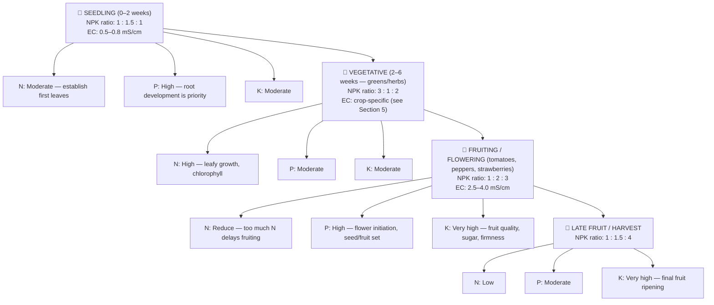
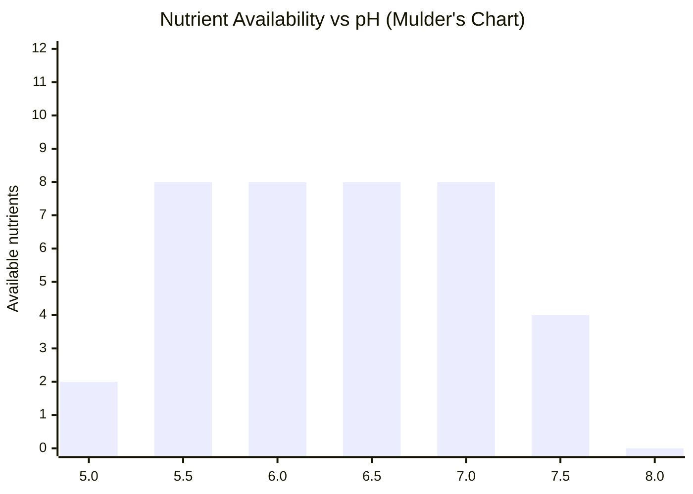
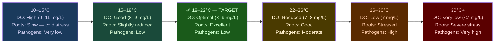
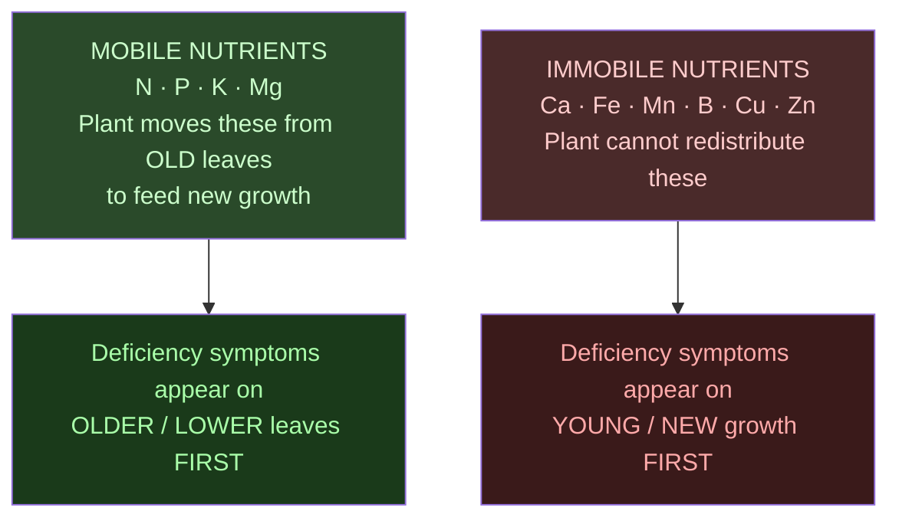

# Guide 02 — Nutrient Solution
## EC, pH, Macros, Micros, Mixing, and Schedules

---

## Table of Contents

- [1. Why Nutrients Matter in Hydroponics](#1-why-nutrients-matter-in-hydroponics)
- [2. The 17 Essential Plant Nutrients](#2-the-17-essential-plant-nutrients)
  - [Macronutrients (needed in large quantities)](#macronutrients-needed-in-large-quantities)
  - [Secondary Macronutrients (needed in moderate quantities)](#secondary-macronutrients-needed-in-moderate-quantities)
  - [Micronutrients (needed in trace quantities — but still essential)](#micronutrients-needed-in-trace-quantities-but-still-essential)
- [3. NPK at Each Growth Stage](#3-npk-at-each-growth-stage)
- [4. EC — Electrical Conductivity](#4-ec-electrical-conductivity)
  - [What EC Measures](#what-ec-measures)
  - [Why EC Matters](#why-ec-matters)
  - [EC Target Ranges by Crop](#ec-target-ranges-by-crop)
- [5. pH — The Key to Nutrient Availability](#5-ph-the-key-to-nutrient-availability)
  - [What pH Measures](#what-ph-measures)
  - [Target pH Range for Hydroponics: 5.5–6.5](#target-ph-range-for-hydroponics-5565)
  - [Nutrient Availability vs pH (Mulder's Chart Simplified)](#nutrient-availability-vs-ph-mulders-chart-simplified)
  - [Ideal pH by Crop](#ideal-ph-by-crop)
  - [pH Drift](#ph-drift)
- [6. Two-Part vs Three-Part vs One-Part Nutrients](#6-two-part-vs-three-part-vs-one-part-nutrients)
  - [One-Part / All-in-One](#one-part-all-in-one)
  - [Two-Part Systems](#two-part-systems)
  - [Three-Part Systems](#three-part-systems)
  - [The Masterblend Trio (Budget Champion)](#the-masterblend-trio-budget-champion)
- [7. Masterblend Trio — Mixing Recipe](#7-masterblend-trio-mixing-recipe)
  - [Components](#components)
  - [Standard Mixing Recipe (per 4 litres / ~1 US gallon of water)](#standard-mixing-recipe-per-4-litres-1-us-gallon-of-water)
  - [Masterblend Dose Scaling](#masterblend-dose-scaling)
- [8. General Hydroponics Flora Series Schedule](#8-general-hydroponics-flora-series-schedule)
  - [Mix Ratios (per litre of water)](#mix-ratios-per-litre-of-water)
- [9. Nutrient Solution Temperature](#9-nutrient-solution-temperature)
  - [Optimal: 18–22°C](#optimal-1822c)
- [10. Reservoir Top-Up vs Full Change](#10-reservoir-top-up-vs-full-change)
  - [Two Operations — Very Different Purposes](#two-operations-very-different-purposes)
- [11. Visual Nutrient Deficiency and Toxicity Guide](#11-visual-nutrient-deficiency-and-toxicity-guide)
  - [How to Identify Location of Symptoms (Key Diagnostic Clue)](#how-to-identify-location-of-symptoms-key-diagnostic-clue)
  - [Deficiency Quick Reference](#deficiency-quick-reference)
  - [Toxicity Signs](#toxicity-signs)
- [12. Organic Hydroponics](#12-organic-hydroponics)
  - [Key Differences](#key-differences)
  - [Common Organic Nutrient Sources](#common-organic-nutrient-sources)
  - [Simple Organic Nutrient Recipe (Vegetative Stage)](#simple-organic-nutrient-recipe-vegetative-stage)
  - [Why Organic Is Harder in NFT Specifically](#why-organic-is-harder-in-nft-specifically)
- [13. Water Volume Calculator Reference](#13-water-volume-calculator-reference)
  - [Reservoir Volume Needed](#reservoir-volume-needed)
  - [Solution Volume per Full Mix (80L reservoir)](#solution-volume-per-full-mix-80l-reservoir)


[↑ Back to TOC](#table-of-contents)

## 1. Why Nutrients Matter in Hydroponics

In soil, plants access nutrients through complex microbial activity, organic matter decomposition, and mineral weathering. The soil acts as a buffer — it holds reserves and slowly releases them. In hydroponics, **you are the soil**. Every nutrient the plant will ever receive comes directly from the solution you mix. There is no buffer, no reserve, no margin for error beyond what you build into your management routine.

This is both the power and the responsibility of hydroponics:
- **Power:** Complete control over what the plant gets, when it gets it, and in what ratios
- **Responsibility:** Get it wrong and plants suffer immediately — there is no soil to compensate

---


[↑ Back to TOC](#table-of-contents)

## 2. The 17 Essential Plant Nutrients

Plants require 17 elements to complete their life cycle. These are divided into three groups:

### Macronutrients (needed in large quantities)

| Nutrient | Symbol | Primary Role | Deficiency Signs |
|----------|--------|-------------|-----------------|
| **Nitrogen** | N | Vegetative growth, chlorophyll, protein synthesis | Yellowing from older leaves upward (chlorosis), stunted growth |
| **Phosphorus** | P | Root development, energy transfer (ATP), flowering | Purple/reddish stems and leaf undersides, poor root growth |
| **Potassium** | K | Water regulation, enzyme activation, fruit quality | Brown leaf edges (scorch), weak stems, poor fruit development |

### Secondary Macronutrients (needed in moderate quantities)

| Nutrient | Symbol | Primary Role | Deficiency Signs |
|----------|--------|-------------|-----------------|
| **Calcium** | Ca | Cell wall strength, root development | Tip burn (necrosis of young leaf margins), blossom end rot in tomatoes |
| **Magnesium** | Mg | Chlorophyll centre, enzyme cofactor | Interveinal chlorosis (yellowing between veins on older leaves) |
| **Sulfur** | S | Amino acid synthesis, enzyme function | Uniform yellowing of young leaves (similar to N but starts young) |

### Micronutrients (needed in trace quantities — but still essential)

| Nutrient | Symbol | Primary Role | Deficiency Signs |
|----------|--------|-------------|-----------------|
| **Iron** | Fe | Chlorophyll synthesis | Interveinal chlorosis on young leaves (yellow with green veins) |
| **Manganese** | Mn | Photosynthesis, enzyme activation | Similar to Fe — interveinal chlorosis, brown spots |
| **Zinc** | Zn | Enzyme function, hormone synthesis | Small leaves, short internodes, distorted growth |
| **Copper** | Cu | Enzyme function, photosynthesis | Wilting of young leaves, bluish-green discolouration |
| **Boron** | B | Cell wall formation, pollen viability | Distorted, thick, brittle young leaves; poor fruit set |
| **Molybdenum** | Mo | Nitrogen fixation, enzyme function | Cupped/cupping leaves, marginal scorch |
| **Chlorine** | Cl | Osmosis, photosynthesis | Wilting, bronzing of leaves |
| **Nickel** | Ni | Urease enzyme | Rare — tip necrosis of young leaves |
| **Silicon** | Si | Cell wall reinforcement, pest resistance | Not technically essential but highly beneficial |
| **Cobalt** | Co | Nitrogen fixation, vitamin B12 | Extremely rare deficiency |
| **Sodium** | Na | Osmotic adjustment | Rarely deficient |

> **Key insight:** Micronutrient deficiencies are often caused not by absence from the solution but by **pH locking them out**. This is why pH control is non-negotiable.

---


[↑ Back to TOC](#table-of-contents)

## 3. NPK at Each Growth Stage

The ratio of N:P:K that plants need changes dramatically across their life cycle:



---


[↑ Back to TOC](#table-of-contents)

## 4. EC — Electrical Conductivity

### What EC Measures

EC (electrical conductivity) measures the **total dissolved salt concentration** in the nutrient solution. Pure water conducts virtually no electricity. As you dissolve nutrients (salts) in water, conductivity increases proportionally.

Units: **mS/cm** (millisiemens per centimetre) — some meters display as EC, others as TDS (total dissolved solids) in ppm.

```
  EC vs TDS CONVERSION (approximate):
  
  1.0 mS/cm ≈ 500–700 ppm TDS (conversion factor varies: 0.5–0.7 depending on meter)
  
  Always work in mS/cm for precision. If your meter only reads ppm, divide by 500 to
  get approximate EC in mS/cm.
```

### Why EC Matters

- **Too low:** Plants are nutrient-starved — thin, pale, slow growth
- **Too high:** Osmotic stress — roots cannot absorb water (like trying to drink seawater), leaf tip burn, wilting

### EC Target Ranges by Crop

| Crop | Seedling | Vegetative | Fruiting | Maximum |
|------|----------|-----------|---------|---------|
| Lettuce | 0.6–0.8 | 0.8–1.2 | 1.0–1.6 | 1.8 |
| Spinach | 0.8–1.0 | 1.4–1.8 | 1.8–2.0 | 2.2 |
| Basil | 0.8–1.0 | 1.0–1.6 | 1.4–1.8 | 2.0 |
| Cilantro/parsley | 0.8–1.0 | 1.2–1.6 | — | 1.8 |
| Mint | 0.8–1.0 | 1.2–1.6 | — | 2.0 |
| Kale | 1.0–1.2 | 1.5–2.0 | 2.0–2.5 | 2.5 |
| Cherry tomatoes | 0.8–1.2 | 2.0–2.5 | 2.5–4.0 | 4.5 |
| Peppers | 0.8–1.2 | 1.8–2.5 | 2.5–3.5 | 4.0 |
| Strawberries | 0.8–1.0 | 1.2–1.6 | 1.4–2.0 | 2.2 |
| Radishes (bags) | 0.8–1.0 | 1.2–1.6 | 1.6–2.0 | 2.2 |
| Carrots (bags) | 0.6–0.8 | 1.0–1.4 | 1.4–1.8 | 2.0 |

> **Mixed channel note:** When running a channel with multiple crop types, set EC to the **lower end** of the most sensitive crop's range. In CH1 (lettuce + herbs), target 1.0–1.4 mS/cm.

---


[↑ Back to TOC](#table-of-contents)

## 5. pH — The Key to Nutrient Availability

### What pH Measures

pH measures the **acidity or alkalinity** of the solution on a 0–14 scale:
- 0–6.9: Acidic
- 7.0: Neutral
- 7.1–14: Alkaline/Basic

### Target pH Range for Hydroponics: 5.5–6.5

This range is critical because it is the window where **all essential nutrients are simultaneously available** at adequate levels. Outside this range, specific nutrients become chemically locked into forms the plant cannot absorb — even if those nutrients are present in the water.

### Nutrient Availability vs pH (Mulder's Chart Simplified)



> **Key:** Each bar represents the number of major nutrients readily available at that pH level. The range **5.8–6.3** maximises simultaneous availability of all nutrients.
>
> Detailed availability by nutrient:
>
> | Nutrient | Best availability |
> |----------|-------------------|
> | N | 5.5–7.5 |
> | P | 5.5–7.0 |
> | K | 5.5–8.0 |
> | Ca | 6.0–8.0 |
> | Mg | 5.5–7.5 |
> | S | 5.5–8.0 |
> | Fe, Mn | 5.0–6.5 (locked out above ~6.5) |
> | Zn, Cu | 5.0–6.5 (locked out above ~6.5) |
> | B | 5.5–6.5 |
> | Mo | 6.5–8.0 (locked out below ~6.0) |
>
> **Optimal window: pH 5.8–6.3 maximises all nutrient availability**

### Ideal pH by Crop

| Crop | Target pH |
|------|-----------|
| Most leafy greens | 5.5–6.5 (aim for 6.0) |
| Tomatoes | 5.5–6.5 (aim for 6.0–6.2) |
| Peppers | 5.5–6.5 (aim for 6.0) |
| Strawberries | 5.5–6.5 (aim for 5.8–6.2) |
| Herbs (basil, cilantro) | 5.5–6.5 (aim for 5.8–6.2) |

**For a mixed channel:** target **5.8–6.2** as a universal compromise.

### pH Drift

pH naturally drifts over time in a hydroponic system. Understanding the direction of drift tells you what the plants are doing:

- **pH rising:** Plants are consuming more **anions** (NO₃⁻, H₂PO₄⁻, SO₄²⁻), releasing OH⁻. Common in vegetative growth.
- **pH falling:** Plants are consuming more **cations** (NH₄⁺, K⁺, Ca²⁺, Mg²⁺), releasing H⁺. Common in fruiting stage.

Normal drift: ±0.2–0.5 pH per day is acceptable. Adjust when outside 5.5–6.5.

---


[↑ Back to TOC](#table-of-contents)

## 6. Two-Part vs Three-Part vs One-Part Nutrients

### One-Part / All-in-One
- **Example:** General Hydroponics MaxiGro / MaxiBloom, Masterblend (sort of)
- **Pros:** Simple, one bottle, beginner-friendly
- **Cons:** Can't adjust N:P:K ratio independently, some precipitation risk

### Two-Part Systems
- **Example:** General Hydroponics FloraDuo, Canna Aqua Vega/Flores
- **Pros:** Adjust growth/bloom ratio by changing mix ratio
- **Cons:** Slightly more complex

### Three-Part Systems
- **Example:** General Hydroponics Flora Series (FloraGro / FloraBloom / FloraMicro)
- **Pros:** Full NPK control at every stage, widely available, professional results
- **Cons:** Three bottles to manage, requires following a schedule

### The Masterblend Trio (Budget Champion)
- **Components:** MasterBlend 4-18-38 + Calcium Nitrate (15.5-0-0) + Magnesium Sulphate (Epsom Salt)
- **Pros:** Extremely cost-effective (a few dollars per growing season), professional-grade results, widely used by commercial growers
- **Cons:** Dry salts, requires accurate weighing (digital scale needed), no pH buffering built in

---


[↑ Back to TOC](#table-of-contents)

## 7. Masterblend Trio — Mixing Recipe

This is the most cost-effective nutrient system available. Used by professional growers worldwide.

### Components

| Component | Chemical | Analysis |
|-----------|----------|----------|
| MasterBlend 4-18-38 | Potassium nitrate + trace mix | N-P-K + complete micronutrients |
| Calcium Nitrate | Ca(NO₃)₂ | 15.5-0-0 + 19% Ca |
| Magnesium Sulphate | MgSO₄ (Epsom Salt) | 10% Mg, 13% S |

### Standard Mixing Recipe (per 4 litres / ~1 US gallon of water)

```
  STANDARD VEGETATIVE MIX (EC ~1.4–1.6 mS/cm):

  1. Calcium Nitrate:     2.4g per 4L (0.6g per litre)
  2. MasterBlend 4-18-38: 2.4g per 4L (0.6g per litre)
  3. Epsom Salt:          1.2g per 4L (0.3g per litre)

  MIXING ORDER (critical — always in this sequence):
  
  Step 1: Fill reservoir/container with 50% of your target water volume
  Step 2: Add Calcium Nitrate, stir until dissolved
  Step 3: Add remaining water (to dilute Ca before adding sulphate/phosphate)
  Step 4: Add Epsom Salt, stir until dissolved
  Step 5: Add MasterBlend, stir until dissolved
  Step 6: Adjust pH to 5.8–6.2
  Step 7: Measure EC — should read ~1.4–1.6 mS/cm
  
  ⚠ NEVER mix Calcium Nitrate and MasterBlend directly — they will precipitate
    (form insoluble solids). Always dissolve in water separately.
```

### Masterblend Dose Scaling

| Target EC | Calcium Nitrate | MasterBlend | Epsom Salt |
|-----------|----------------|-------------|-----------|
| 0.8 mS/cm (seedling) | 1.2g/4L | 1.2g/4L | 0.6g/4L |
| 1.2 mS/cm (light veg) | 1.8g/4L | 1.8g/4L | 0.9g/4L |
| 1.6 mS/cm (standard veg) | 2.4g/4L | 2.4g/4L | 1.2g/4L |
| 2.0 mS/cm (tomatoes veg) | 3.0g/4L | 3.0g/4L | 1.5g/4L |
| 3.0 mS/cm (tomatoes fruiting) | 4.5g/4L | 4.5g/4L | 2.2g/4L |

> **Always verify with your EC meter.** These are starting points — your source water EC affects the final reading.

---


[↑ Back to TOC](#table-of-contents)

## 8. General Hydroponics Flora Series Schedule

For those preferring a liquid system. This is the most documented nutrient schedule in hobby hydroponics.

### Mix Ratios (per litre of water)

| Stage | FloraGro | FloraBloom | FloraMicro | EC Target |
|-------|----------|-----------|-----------|---------|
| Seedling/clone | 1.25ml | 1.25ml | 0.5ml | 0.6–0.8 |
| Early vegetative | 3ml | 1ml | 2ml | 1.0–1.4 |
| Late vegetative | 4ml | 2ml | 3ml | 1.4–1.8 |
| Early bloom | 2ml | 4ml | 3ml | 1.8–2.4 |
| Mid bloom | 1ml | 5ml | 3ml | 2.0–2.8 |
| Late bloom/ripening | 0ml | 6ml | 3ml | 2.4–3.2 |
| Flush (final week) | 0ml | 0ml | 0ml | 0.2–0.4 |

> Always add FloraMicro FIRST when mixing multiple components.

---


[↑ Back to TOC](#table-of-contents)

## 9. Nutrient Solution Temperature

### Optimal: 18–22°C

Nutrient solution temperature affects:
1. **Dissolved oxygen** — colder water holds more O₂ (critical for roots)
2. **Nutrient uptake rates** — enzyme activity in roots slows below 15°C and above 28°C
3. **Microbial activity** — warm water promotes pathogen growth (Pythium thrives above 24°C)



**Outdoor challenge:** Reservoir water temperature tracks ambient temperature. A black or exposed reservoir in summer can reach 28–32°C — dangerous territory. Solutions: shade the reservoir, insulate it, paint it white, partially bury it, or use an aquarium chiller (see guide/10).

---


[↑ Back to TOC](#table-of-contents)

## 10. Reservoir Top-Up vs Full Change

### Two Operations — Very Different Purposes

**Daily top-up (common):**
- As plants transpire and the pump operates, reservoir level drops
- Top up with **pH-adjusted water only** (no nutrients)
- This restores volume without increasing nutrient concentration
- EC will rise slightly over time as water evaporates but nutrients remain

**Full reservoir change (weekly/bi-weekly):**
- Drain reservoir completely
- Clean reservoir interior (see guide/08)
- Refill with fresh nutrient solution
- Reset EC and pH from scratch
- Removes accumulated salt byproducts, prevents nutrient imbalance

```
  WHEN TO DO A FULL CHANGE:

  Trigger 1: EC creeping above target range despite correct top-up
  Trigger 2: pH swings become extreme (>0.5 per day drift)
  Trigger 3: Solution is >7–10 days old
  Trigger 4: Visible discolouration (brown/green/slimy)
  Trigger 5: After any disease outbreak
  Trigger 6: Before introducing new plants to a channel
  
  General rule: Full change every 7–14 days regardless.
```

---


[↑ Back to TOC](#table-of-contents)

## 11. Visual Nutrient Deficiency and Toxicity Guide

### How to Identify Location of Symptoms (Key Diagnostic Clue)



### Deficiency Quick Reference

| Symptom | Location | Most Likely Cause | Secondary Cause |
|---------|----------|-------------------|-----------------|
| Overall yellowing | Older leaves first | Nitrogen deficiency | Overwatering, root rot |
| Purple/red stems | Any | Phosphorus deficiency | Cold temperatures |
| Brown leaf edges/scorch | Older leaf tips | Potassium deficiency | Salt toxicity |
| Yellow between green veins | Older leaves | Magnesium deficiency | pH too high |
| Yellow between green veins | Young leaves | Iron deficiency | pH too high |
| Brown/dead leaf tips | Young leaves | Calcium deficiency | Low humidity, tip burn |
| Distorted/brittle young leaves | Growing tip | Boron deficiency | — |
| Small leaves, short internodes | Any | Zinc deficiency | — |
| Dark green, then purple | Older leaves | Phosphorus excess | — |
| Crispy, brown everywhere | Any | Nutrient burn (EC too high) | Excess salt |

### Toxicity Signs

| Toxicity | Signs |
|---------|-------|
| Nitrogen excess | Dark green leaves, delayed flowering, soft growth |
| Iron excess | Dark lesions on roots, interveinal chlorosis |
| Manganese excess | Brown spots, chlorosis |
| General salt burn | Brown leaf tips/edges, wilting despite wet roots |

---


[↑ Back to TOC](#table-of-contents)

## 12. Organic Hydroponics

It is possible to grow hydroponically with organic nutrient sources, though it is considerably more complex than using mineral salts.

### Key Differences

| Aspect | Mineral (synthetic) | Organic |
|--------|--------------------|---------| 
| **Nutrient form** | Immediately plant-available | Must be broken down by microbes |
| **Microbial system** | Not needed | Required (beneficial bacteria) |
| **EC control** | Precise | Difficult to measure accurately |
| **Reservoir hygiene** | Clean is standard | Organic material promotes biofilm |
| **Cost** | Low (Masterblend) | High (fish emulsion, seaweed, etc.) |
| **Results** | Consistent, fast | Variable, slower |
| **Certification** | Not organic | Can claim organic |

### Common Organic Nutrient Sources

- **Fish emulsion/hydrolysate:** High N, some P and K — excellent for vegetative
- **Seaweed extract:** Micronutrients, cytokinins, growth hormones — use as supplement
- **Bat guano:** High P — useful for fruiting stage
- **Molasses:** Feeds beneficial microbes, provides trace minerals
- **Worm castings extract (worm tea):** Broad-spectrum nutrients + microbial inoculant

### Simple Organic Nutrient Recipe (Vegetative Stage)

```
  BASIC ORGANIC FORMULA (per 10L of water):

  Fish hydrolysate (2-4-1 NPK):     5 ml/L  → 50 ml per 10L
  Liquid seaweed extract (0-0-1):    2 ml/L  → 20 ml per 10L

  Mix fish hydrolysate into water first, stir well, then add seaweed.
  pH adjust to 5.8–6.2 with citric acid (down) or potassium bicarbonate (up).

  NOTE: EC meters read LOWER with organics than the actual nutrient content —
  organic molecules are partially non-ionic until broken down by microbes.
  Target EC 1.0–1.2 on the meter (actual nutrient availability is higher).

  Change solution every 5 days maximum — organic solutions degrade faster
  than mineral salts and can develop anaerobic bacteria if left too long.
```

### Why Organic Is Harder in NFT Specifically

Organic hydroponics works best in media-based systems (deep water culture, flood-and-drain with expanded clay) where beneficial microbes colonise surfaces. In NFT, the thin film of flowing solution creates specific challenges:

- **Clogging:** Organic particles and biofilm accumulate in narrow NFT channels (especially the 75 mm channels in this system). Expect to flush channels weekly with plain water.
- **Inconsistent EC:** Standard EC meters measure ionic conductivity — organic nutrients are partially non-ionic, so readings understate actual nutrient content. You must rely more on plant appearance than meter readings.
- **Microbial balance:** The constant flow and thin film make it harder to establish a stable beneficial microbial community compared to a deep reservoir with media surfaces. Biofilm can go anaerobic in dead spots, producing hydrogen sulphide (rotten egg smell).
- **Reservoir hygiene:** Organic reservoirs need aeration (air stone running 24/7) to keep the microbial population aerobic. Without aeration, pathogenic anaerobes outcompete beneficial microbes within days.

> **Recommendation for beginners:** Start with Masterblend or GH Flora Series. Once you understand your system and crops, explore organic supplements as additives rather than replacing the mineral base. A practical middle ground is running mineral nutrients in NFT and reserving organic growing for Zone C (grow bags), where the soil-like media supports a healthy microbial ecosystem naturally.

---


[↑ Back to TOC](#table-of-contents)

## 13. Water Volume Calculator Reference

### Reservoir Volume Needed

This system is designed around an **80 L HDPE food-grade reservoir**. The maths below shows how we arrive at that number — it is not a compromise but the deliberate design choice for a home-scale NFT system with daily management.

```
  RESERVOIR SIZING — FROM THEORY TO PRACTICE:

  TEXTBOOK RULE (commercial greenhouses):
  Allow 10–15 litres per active plant site for maximum chemistry stability.

  Our system:
  Zone A: ~40 plant sites × 10L minimum = 400L (impractical for a home system)
  
  REDUCED RULE: 5L per site minimum + 30% buffer
  ~40 sites × 5L = 200L — still large for a home setup.

  HOME-SCALE DESIGN (this system):
  An 80L reservoir is the designed capacity for this specific build.
  It works well because:
  - You check EC/pH daily and adjust (part of the daily 10–15 min routine)
  - You do full solution changes every 7 days
  - You ramp up plant density gradually (not all 40 sites from day one)
  - Channels run at 1–2 L/min each — the 80L volume recirculates fully
    every 20–40 minutes, keeping conditions uniform

  The trade-off vs. a larger reservoir is more frequent monitoring —
  but daily checks are already best practice for any home system.
  
  This system uses: 80L reservoir — the designed capacity with daily management.
```

### Solution Volume per Full Mix (80L reservoir)

```
  MASTERBLEND RECIPE FOR 80L FILL (standard vegetative mix):

  Calcium Nitrate:  0.6g/L × 80L = 48g
  MasterBlend:      0.6g/L × 80L = 48g
  Epsom Salt:       0.3g/L × 80L = 24g

  Target EC: ~1.4–1.6 mS/cm (standard vegetative)

  For a lower-EC seedling fill (EC ~1.0–1.4), use the 0.45g/L rate instead:
  36g / 36g / 18g — see Guide 11 first fill instructions.
  For higher-EC fruiting crops, use the dose scaling table above.

  Always weigh on a digital scale. Tablespoon/teaspoon estimation is inaccurate.
  
  SHOPPING TIP: 1kg bags of each will last many reservoir fills.
  - 1kg Masterblend: ~20 reservoir fills (80L each)
  - 1kg Calcium Nitrate: ~20 reservoir fills
  - 1kg Epsom Salt: ~40 reservoir fills (cheap and widely available)
```

---


[↑ Back to TOC](#table-of-contents)

*Next: [`guide/nft/03-water-quality.md`](03-water-quality.md) — Water sources, testing, and treatment*

---

<!-- copyright -->
*Copyright (c) 2026 UncleJS. Licensed under [CC BY-NC 4.0](https://creativecommons.org/licenses/by-nc/4.0/) — free to share and adapt for non-commercial purposes with attribution.*
