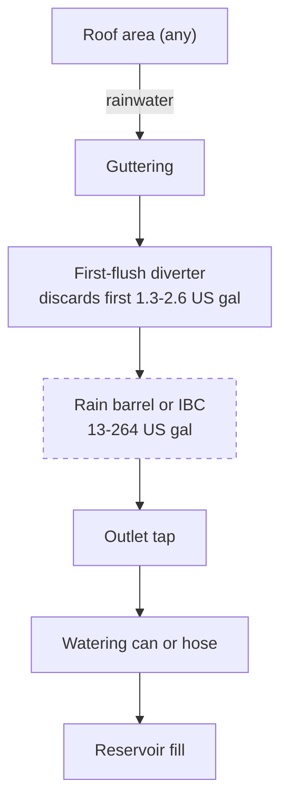

# Guide 03 — Water Quality
## Sources, Testing, Treatment, and Management

[](../../README.md)
[](https://creativecommons.org/licenses/by-nc-sa/4.0/)

Reservoir volumes, temperatures, and prices follow [Design Constants](../design-constants.md). Zone layout is in [zones.md](../../zones.md).

---

## Table of Contents

- [1. Why Starting Water Quality Matters](#1-why-starting-water-quality-matters)
- [2. TDS (Total Dissolved Solids) and EC Baseline](#2-tds-total-dissolved-solids-and-ec-baseline)
  - [Testing Your Source Water](#testing-your-source-water)
  - [Why Source EC Matters](#why-source-ec-matters)
  - [Interpreting Your Local Water Report](#interpreting-your-local-water-report)
- [3. Tap Water: Chlorine, Chloramine, and Hardness](#3-tap-water-chlorine-chloramine-and-hardness)
  - [Chlorine vs Chloramine — Critical Difference](#chlorine-vs-chloramine-critical-difference)
  - [How to Identify Which Your Water Uses](#how-to-identify-which-your-water-uses)
  - [Chloramine Removal](#chloramine-removal)
  - [Hard Water Management](#hard-water-management)
- [4. Well Water Issues](#4-well-water-issues)
- [5. Reverse Osmosis (RO) — When It's Worth It](#5-reverse-osmosis-ro-when-its-worth-it)
  - [What RO Does](#what-ro-does)
  - [Pros and Cons](#pros-and-cons)
  - [Is RO Worth It for This System?](#is-ro-worth-it-for-this-system)
  - [RO Setup for This System](#ro-setup-for-this-system)
- [6. Rainwater Harvesting](#6-rainwater-harvesting)
  - [Rainwater Characteristics](#rainwater-characteristics)
  - [Collection System](#collection-system)
  - [Legality Note](#legality-note)
  - [Using Rainwater in the System](#using-rainwater-in-the-system)
- [7. pH Testing Methods Compared](#7-ph-testing-methods-compared)
  - [pH Drops / Test Kits (Liquid)](#ph-drops-test-kits-liquid)
  - [pH Test Strips](#ph-test-strips)
  - [Digital pH Meters (Recommended)](#digital-ph-meters-recommended)
  - [Calibrating a pH Meter](#calibrating-a-ph-meter)
- [8. EC Meters: Types, Calibration, and Use](#8-ec-meters-types-calibration-and-use)
  - [EC Meter Types](#ec-meter-types)
  - [Calibration](#calibration)
  - [Temperature Compensation](#temperature-compensation)
- [9. pH Up and pH Down — Safe Handling](#9-ph-up-and-ph-down-safe-handling)
  - [pH Down (Acid)](#ph-down-acid)
  - [pH Up (Base)](#ph-up-base)
  - [pH Adjustment Protocol](#ph-adjustment-protocol)
- [10. Water Temperature Management Outdoors](#10-water-temperature-management-outdoors)
  - [The Outdoor Heat Problem](#the-outdoor-heat-problem)
  - [Management Strategies](#management-strategies)
- [11. Algae Prevention](#11-algae-prevention)
  - [Cause](#cause)
  - [Hydrogen Peroxide Treatment](#hydrogen-peroxide-treatment)
- [12. Reservoir Size Calculations](#12-reservoir-size-calculations)
  - [Minimum Volume per Plant Site](#minimum-volume-per-plant-site)
- [13. Full Water Change Protocol](#13-full-water-change-protocol)
  - [Step-by-Step Reservoir Change](#step-by-step-reservoir-change)


[↑ Back to TOC](#table-of-contents)

## 1. Why Starting Water Quality Matters

In hydroponics, water is the delivery vehicle for every nutrient your plants will ever receive. The quality of your source water directly affects:

- **EC baseline:** All tap water contains dissolved minerals. Your source water EC is a floor you start from — you add nutrients on top of it.
- **pH stability:** Waters high in bicarbonates (alkaline/hard water) resist pH adjustment and cause pH to "creep" back up, requiring more pH-down and more frequent corrections.
- **Nutrient interference:** High calcium, magnesium, chlorine, iron, or sodium in source water can interfere with your nutrient ratios or damage roots.
- **Pathogen introduction:** Untreated surface water can introduce Pythium, algae, and bacteria directly into your system.

**First step before mixing any nutrients:** Test your source water's EC and pH. This tells you your baseline and informs how much you need to adjust.


---


[↑ Back to TOC](#table-of-contents)

## 2. TDS (Total Dissolved Solids) and EC Baseline

### Testing Your Source Water

Before adding any nutrients, measure your tap water straight from the tap:

```
  WHAT TO LOOK FOR:

  Source water EC:    0.0–0.2 mS/cm   → Excellent (soft/RO/rainwater)
                      0.2–0.4 mS/cm   → Good (mild minerals, workable)
                      0.4–0.6 mS/cm   → Acceptable (hard water, monitor)
                      0.6–1.0 mS/cm   → Problematic (very hard water)
                      1.0+ mS/cm      → Consider RO or rainwater blending

  Source water pH:    6.5–7.5         → Typical tap range
                      7.5–9.0         → Alkaline/hard water — needs correction
                      < 6.5           → Acidic (unusual for tap, check)
```

### Why Source EC Matters

Your source water EC represents **minerals already present** that contribute to the plant's total dissolved solid load. When you add nutrients:

```
  Total EC = Source water EC + Nutrients EC

  Example 1 (soft water):
  Source EC: 0.1 mS/cm + Nutrients: 1.4 mS/cm = Final: 1.5 mS/cm ← near target

  Example 2 (hard water):
  Source EC: 0.6 mS/cm + Nutrients: 1.4 mS/cm = Final: 2.0 mS/cm ← too high for lettuce!

  Hard water fix: Add LESS nutrient concentrate to hit target EC, OR use RO/rainwater.
```

### Interpreting Your Local Water Report

Most municipal water suppliers publish annual water quality reports online. Look for:
- **Total Dissolved Solids (TDS)** or **conductivity** — your EC baseline
- **Hardness** (as CaCO₃ or mg/L Ca+Mg) — affects pH buffering
- **Chlorine/chloramine** concentration — affects roots
- **pH** — your starting point
- **Iron, manganese, copper** — can cause problems at high levels


---


[↑ Back to TOC](#table-of-contents)

## 3. Tap Water: Chlorine, Chloramine, and Hardness

### Chlorine vs Chloramine — Critical Difference

| Property | Chlorine (Cl₂) | Chloramine (NH₂Cl) |
|----------|---------------|-------------------|
| **Used by** | Older water systems, smaller utilities | Most modern municipal systems |
| **Removal method** | Leave water to stand 24h, or use activated carbon | **CANNOT be removed by standing** |
| **How to remove** | Aeration, activated carbon, UV | Vitamin C (ascorbic acid), sodium thiosulfate, activated carbon |
| **Harm to plants** | Damages roots and beneficial microbes above ~2mg/L | Same, but persists longer |
| **Detection** | Smell dissipates after standing | No smell change after standing |

### How to Identify Which Your Water Uses

1. Contact your water supplier's website/phone line and ask
2. Fill a glass, leave overnight — if it still smells or tests positive for chlorine, it's chloramine

### Chloramine Removal

```
  METHOD 1 — Vitamin C (Ascorbic Acid):
  Add 1 gram of ascorbic acid per 10.6 US gal (40 L) of water.
  Neutralizes chloramine within minutes.
  Slightly lowers pH (small effect, adjust pH after).
  Buy food-grade vitamin C powder — very cheap.

  METHOD 2 — Sodium Thiosulfate:
  Standard photography/aquarium dechlorinator.
  Works in seconds.
  Very small dose — follow product instructions.

  METHOD 3 — Activated Carbon Filter:
  In-line carbon block filter on your tap.
  Removes chlorine, chloramine, and other organics.
  Best permanent solution if you refill regularly.
```

### Hard Water Management

Hard water contains excess calcium and magnesium carbonate (bicarbonates). Problems it causes:
1. **pH creep:** Bicarbonate acts as a buffer, resisting pH-down and causing pH to drift upward
2. **Excess calcium:** Can cause Ca:Mg imbalance; may need to reduce Ca in your nutrient mix
3. **Scale/deposits:** White crusty buildup on channels, fittings, and reservoir walls

```
  HARD WATER MANAGEMENT STRATEGIES:

  Strategy 1 — Reduce Ca in nutrient recipe:
  If source water Ca is >100mg/L, reduce calcium nitrate dose by 20–30%
  and verify EC/Ca levels with a more detailed water test.

  Strategy 2 — Acidify to neutralize bicarbonates:
  Adding phosphoric acid (pH down) consumes bicarbonate as well as lowering pH.
  Hard water will simply require more pH-down per US gal (3.8 L) — this is normal.

  Strategy 3 — Blend with RO or rainwater:
  50/50 blend of hard tap water with RO or rainwater halves the mineral load.
  Practical, cheap, and works well.

  Strategy 4 — Full RO:
  Most precise control but adds cost. See section 5.
```


---


[↑ Back to TOC](#table-of-contents)

## 4. Well Water Issues

If you use well water, test it thoroughly before use. Common problems:

| Contaminant | Problem | Solution |
|-------------|---------|---------|
| **High iron (>0.3mg/L)** | Clogs pumps/fittings, causes iron toxicity, brown staining | Sediment filter + iron removal filter; or RO |
| **High sulfur (rotten egg smell)** | Toxic to roots at high levels; affects pH | Activated carbon + aeration |
| **High hardness (Ca+Mg)** | pH creep, scale, excess Ca/Mg | Softener or RO |
| **Bacteria/E.coli** | Dangerous for edible crops | UV sterilization or chlorination then dechlorination |
| **Low pH (acidic)** | Rare; corrosive | pH up to correct |
| **Nitrates (from agriculture)** | Adds to nutrient load unpredictably | Test and adjust nutrient recipe |

**Recommendation:** If using well water, buy a basic water test kit from a hardware store or send a sample to a lab before starting. This costs $15–$50 (R270–R900) and can save you a season of problems.


---


[↑ Back to TOC](#table-of-contents)

## 5. Reverse Osmosis (RO) — When It's Worth It

### What RO Does

Reverse osmosis forces water through a semi-permeable membrane that removes 95–99% of all dissolved solids, heavy metals, chlorine, chloramine, bacteria, and viruses. The result is near-pure water (EC: 0.00–0.05 mS/cm) that you have complete control over.

### Pros and Cons

| Pros | Cons |
|------|------|
| Perfect baseline water (EC ~0.0) | Cost: $50–$200 (R900–R3,600) for a basic unit |
| No chlorine/chloramine issues | Waste water: 3–4 US gal of waste per 1 US gal of RO water (3–4 L per 1 L) |
| No hard water complications | Slow output: 13–53 US gal/day (50–200 L/day) for home units |
| Maximum nutrient control | Removes beneficial Ca/Mg (add back via CalMag or Masterblend) |
| Consistent results season to season | Membrane replacement every 1–2 years |

### Is RO Worth It for This System?

```
  DECISION GUIDE:

  Your tap water EC < 0.3 mS/cm:     → RO unnecessary, tap water is fine
  Your tap water EC 0.3–0.6 mS/cm:   → RO useful but not essential; blend or adjust recipe
  Your tap water EC > 0.6 mS/cm:     → RO strongly recommended
  You use well water with iron/sulfur: → RO recommended
  You want maximum precision:         → RO recommended
```

### RO Setup for This System

A countertop or under-sink RO unit with a storage tank of 2.6–5.3 US gal (10–20 L) covers the two NFT reservoirs: the greens tank is 20 US gal (76 L) and changes every 7 days, and the fruiting tank is 10 US gal (38 L) and changes every 5–7 days. You do not fill both on the same hour unless you choose to.

- Fill reservoir with RO water
- Add nutrients from scratch (EC starts at ~0.0)
- No need to worry about baseline minerals interfering


---


[↑ Back to TOC](#table-of-contents)

## 6. Rainwater Harvesting

Outdoor systems have a natural advantage: **free, soft, near-pure water falls from the sky**.

### Rainwater Characteristics

- **EC:** 0.01–0.05 mS/cm (essentially mineral-free — excellent baseline)
- **pH:** 5.5–6.5 (slightly acidic due to dissolved CO₂ — often perfect for hydroponics)
- **Chlorine/chloramine:** None (natural water cycle)
- **Contaminants:** Dust, bird droppings, roof material runoff (if collected from a roof)

### Collection System



> **Key:** Cover the tank to prevent algae, debris, and mosquito breeding.

### Legality Note

In the inland mid-USA worked climate, domestic rainwater collection is generally allowed. A few states restricted it in the past (Colorado and Utah are the usual examples) and most now permit a household barrel. South African municipal bylaws differ by city. **Check the local rule** before you buy a large tank.

### Using Rainwater in the System

- Test pH (usually 5.5–6.5 — may need little or no adjustment)
- Test EC (should be <0.1 mS/cm — excellent baseline)
- If collected from a roof, filter through a fine mesh before use
- Mix with tap water if you run low during dry periods


---


[↑ Back to TOC](#table-of-contents)

## 7. pH Testing Methods Compared

### pH Drops / Test Kits (Liquid)

```
  HOW IT WORKS: Add indicator drops to a water sample; color matches pH chart.

  Pros:  Cheap, $5–$10 (R90–R180), no calibration, no batteries, works forever
  Cons:  Subjective color matching, ±0.2–0.5 accuracy, only tests point samples

  Best for: Backup verification, no electricity environments
```

### pH Test Strips

```
  HOW IT WORKS: Dip strip into solution; compare color to chart.

  Pros:  Cheap, $5–$15 (R90–R270) for 100 strips, no calibration
  Cons:  ±0.5–1.0 accuracy, affected by nutrients staining the strip
         Especially inaccurate in nutrient solution (color masking)

  Best for: Emergency backup only. NOT recommended for regular use in hydroponics.
```

### Digital pH Meters (Recommended)

```
  HOW IT WORKS: Glass electrode measures H⁺ ion concentration electronically.

  Pros:  ±0.01–0.05 accuracy when calibrated, fast, easy to read
  Cons:  Requires calibration with buffer solution, electrode degrades over time,
         must store probe in storage solution (not water)

  Budget options:  Vivosun, Dr.meter, about $12–$20 (R216–R360) — acceptable accuracy
  Mid-range:       Apera PH20, BlueLab, about $35–$60 (R630–R1,080) — stronger accuracy and build
  Professional:    Hanna HI98100 and similar, about $80 and up (R1,440 and up) — lab grade

  Recommendation: Apera PH20 for this budget system — reliable, auto-calibrating.
```

### Calibrating a pH Meter

```
  CALIBRATION PROCEDURE (2-point calibration):

  Materials needed:
  - pH 4.0 buffer solution (usually red/orange)
  - pH 7.0 buffer solution (usually yellow)
  - Distilled or RO water for rinsing

  Steps:
  1. Remove electrode from storage cap, rinse with distilled water
  2. Submerge in pH 7.0 buffer — wait for reading to stabilize — press CAL
  3. Rinse electrode with distilled water
  4. Submerge in pH 4.0 buffer — wait for reading to stabilize — press CAL
  5. Rinse with distilled water before each measurement
  6. Store electrode in storage solution (KCl), never in distilled water

  Calibrate: once per week during active growing season
  Replace electrode: every 12–18 months (or when calibration drifts >0.3 pH)
```


---


[↑ Back to TOC](#table-of-contents)

## 8. EC Meters: Types, Calibration, and Use

### EC Meter Types

| Type | Accuracy | Cost | Notes |
|------|----------|------|-------|
| Basic pen meter (budget) | ±0.1 mS/cm | $10–$20 (R180–R360) | Good enough for home use; single-point calibration |
| Mid-range digital | ±0.05 mS/cm | $20–$50 (R360–R900) | Better accuracy, temperature compensation |
| Combination EC/pH | ±0.1 EC, ±0.05 pH | $30–$80 (R540–R1,440) | Convenient but compromises on both |
| BlueLab Truncheon | ±0.1 mS/cm | $50+ (R900+) | No display, LED color indicators — durable |
| Professional inline | ±0.02 mS/cm | $100+ (R1,800+) | Continuous monitoring, data logging |

### Calibration

EC meters use a calibration solution with a known conductivity (commonly 1.413 mS/cm or 2.76 mS/cm EC standard solutions).

```
  EC CALIBRATION PROCEDURE:

  1. Rinse probe with distilled water
  2. Submerge in calibration solution
  3. Wait for reading to stabilize
  4. Adjust meter reading to match standard value
  5. Rinse probe with distilled water before use

  Calibrate: once per month, or if readings seem inconsistent
```

### Temperature Compensation

EC readings change with temperature (warm water = higher EC reading for same concentration). Quality meters include **Automatic Temperature Compensation (ATC)**. Always check that your meter has ATC before buying.


---


[↑ Back to TOC](#table-of-contents)

## 9. pH Up and pH Down — Safe Handling

### pH Down (Acid)

Most commonly: **Phosphoric acid (H₃PO₄)** — sold as pH Down or pH Minus

```
  Concentration: Typically 25–81% solution (dilute before contact with skin)

  Pros:  Provides a small phosphorus supplement as a bonus
  Cons:  Can contribute excess P at high doses; corrosive

  Safe use:
  - Wear gloves and eye protection
  - Always add to WATER, never water to acid
  - Start with small doses: 1 ml per 1 US gal (3.8 L), stir, measure, repeat
  - Rinse skin immediately if contact occurs

  Other pH down options:
  - Citric acid: natural, safe, used by some organic growers
  - Nitric acid: faster acting but more hazardous — not recommended for beginners
  - Sulfuric acid: very effective but dangerous — not recommended
```

### pH Up (Base)

Most commonly: **Potassium hydroxide (KOH)** — sold as pH Up or pH Plus

```
  Concentration: Typically 1–25% solution

  Pros:  Adds a small K (potassium) supplement
  Cons:  Can contribute excess K at high doses; caustic

  Safe use:
  - Wear gloves and eye protection
  - Very caustic — corrosive to skin and eyes
  - Add small drops only: 1 ml per 1 US gal (3.8 L), stir, measure, repeat
  - Store upright in a cool, dark place
  - Rinse skin immediately if contact occurs

  Alternative: Sodium bicarbonate (baking soda) — gentle, cheap, but adds Na which
  can accumulate and stress plants. Acceptable for emergency use only.
```

### pH Adjustment Protocol

```
  ADJUSTING pH TO TARGET RANGE (5.8–6.2):

  1. Mix nutrient solution first (nutrients affect pH)
  2. Measure pH
  3. If pH > 6.5: add pH Down 1ml at a time, stir, wait 30 seconds, remeasure
  4. If pH < 5.5: add pH Up 1ml at a time, stir, wait 30 seconds, remeasure
  5. Repeat until target achieved
  6. Final check after 5 minutes (pH can drift slightly after initial adjustment)

  COMMON MISTAKE: Over-adjusting (pH swinging past target). Go slowly.
  COMMON MISTAKE: Adjusting before nutrients are mixed (nutrients change pH significantly).
```


---


[↑ Back to TOC](#table-of-contents)

## 10. Water Temperature Management Outdoors

### The Outdoor Heat Problem

Both reservoirs — greens 20 US gal (76 L) and fruiting 10 US gal (38 L) — can climb past the heat action line if they sit in the sun. Summer afternoon highs in this climate are 90–100°F (32–38°C), June–August (SA: December–February). Solution above **77°F (25°C)** is already the action line: dissolved oxygen falls and pythium risk rises. A tank that reaches 82–95°F (28–35°C) is well past that line.

- Dissolved oxygen drops
- Pythium (root rot) is more likely
- Nutrient uptake becomes stressed

The aim is **64–72°F (18–22°C)** in both tanks.

### Management Strategies

```
  STRATEGY 1 — SHADE (most effective, and it is the design):
  Sit both reservoirs under the NFT frame, at the low end, out of direct sun.
  Deploy 40% shade cloth over the channels when afternoon highs hold
  above 85°F (29°C).

  STRATEGY 2 — INSULATION, about $5–$20 (R90–R360):
  Wrap each reservoir in:
  - Reflective bubble wrap (reflects and insulates)
  - A foam camping mat on the outside
  - Or bury about one third of the depth for thermal mass
  Keep the lid on.

  STRATEGY 3 — BLACK BODY, WHITE EXTERIOR (the specified finish):
  The tank body is black so light cannot reach the solution and grow algae.
  The exterior is white so it reflects radiant heat.
  A white coat over a black body can hold the water several degrees
  cooler than a bare black container in the same sun, on the order of
  4–7°F (2–4°C). Do not leave a bare black exterior in the sun, and do
  not use a clear or white-only wall that lets light through.

  STRATEGY 4 — FROZEN BOTTLES (temporary):
  Fill 17–34 fl oz (0.5–1 L) plastic bottles with water and freeze them.
  Float them in the reservoir on hot afternoons.
  Replace them daily in peak summer. This buys time. It is not a
  substitute for shade and the white exterior.

  STRATEGY 5 — AQUARIUM CHILLER, about $50–$200 (R900–R3,600):
  An inline chiller holds a set temperature.
  Consider it when shade, the white exterior, and insulation cannot
  keep the solution at or below 77°F (25°C).
```


---


[↑ Back to TOC](#table-of-contents)

## 11. Algae Prevention

Algae is not directly harmful to plants but it:
- Competes for nutrients
- Clogs irrigation lines and filters
- Can harbor pathogens
- Creates biofilm that coats channels and roots
- Depletes dissolved oxygen at night (algae respires without light)

### Cause

Algae needs two things: **light** and **nutrients**. Your reservoir and channels have both. The solution is eliminating the light.

```
  ALGAE PREVENTION CHECKLIST:

  [ ] Use opaque channels (not clear tubing)
  [ ] Keep each reservoir lid on and light-tight
  [ ] Cover any exposed nutrient tubing with tape or black pipe insulation
  [ ] Reservoir finish: black body, white exterior, shaded
  [ ] Remove any transparent or translucent part that touches nutrient solution
  [ ] Clean both reservoirs and the channels on the schedule in [Guide 08 — System Maintenance](08-system-maintenance.md)

  If algae appears despite prevention:
  [ ] Do a full system clean and reservoir change
  [ ] Check for light leaks — seal all light entry points
  [ ] Consider adding a UV sterilizer to the return line (overkill for most home systems)
```

### Hydrogen Peroxide Treatment

If algae is already present:

```
  H₂O₂ (Hydrogen Peroxide) TREATMENT:

  Use: 3% food-grade hydrogen peroxide (pharmacy grade)
  Dose: 7.6–11 ml per 1 US gal (2–3 ml/L)

  Worked volumes at 2 ml/L (7.6 ml/US gal):
  Greens tank, 20 US gal (76 L): about 150 ml
  Fruiting tank, 10 US gal (38 L): about 76 ml

  Process:
  1. Take the plants out, or hand-water them on a tray. Do this first.
     Roots in a stopped NFT channel dry in 15–30 minutes in warm weather.
  2. Add peroxide to the reservoir you are cleaning
  3. Run that loop's pump for 30 minutes so the dose reaches its channels
  4. Drain and rinse thoroughly with plain water
  5. Refill with fresh nutrient solution for that loop
  6. Replant

  Peroxide kills algae, beneficial microbes, and it stresses live roots.
  Do not run this dose through a planted channel. Rinse completely before
  the fresh solution goes in. Clean one loop at a time so the other loop
  can keep flowing.
```


---


[↑ Back to TOC](#table-of-contents)

## 12. Reservoir Size Calculations

### Minimum Volume per Plant Site

```
  TEXTBOOK MINIMUMS (one shared tank, commercial thinking):
  Strict:        0.8 US gal (3 L) per site
  Practical:     1.3 US gal (5 L) per site, with daily checks
  Comfortable:   2.6 US gal (10 L) per site

  THIS BUILD IS TWO TANKS:

  Greens: 20 US gal (76 L) for 33 sites
          20 / 33 = 0.61 US gal (2.3 L) per site
  Fruiting: 10 US gal (38 L) for 7 holes
          10 / 7 = 1.4 US gal (5.4 L) per hole

  The greens volume is under the textbook 0.8 US gal (3 L) per site.
  That is the designed home tank. It stays stable only if you:
  - Measure EC and pH in each tank every day
  - Top up by the EC rule: plain water at pH 5.8–6.2 when EC is
    at or above target; nutrient stock when EC is low
  - Change the greens tank every 7 days
  - Change the fruiting tank every 5–7 days
  - Change sooner if EC will not hold, the solution smells, or roots slime

  Do not merge the loops into one larger tank to chase the textbook
  volume. Tomato fruiting EC does not belong in the lettuce solution.
```


---


[↑ Back to TOC](#table-of-contents)

## 13. Full Water Change Protocol

### Step-by-Step Reservoir Change

```
  FREQUENCY:
  Greens tank, 20 US gal (76 L): every 7 days
  Fruiting tank, 10 US gal (38 L): every 5–7 days
  Sooner if EC will not hold, the solution smells, or roots slime.

  Change one loop at a time. Leave the other pump running.

  WHAT YOU NEED:
  - Pump-out pump or siphon hose
  - Bucket for old solution
  - Scrub brush or sponge
  - 10% bleach (1 part bleach to 9 parts water) OR 3% hydrogen peroxide
  - Fresh water
  - Nutrient salts and pH adjustment for THAT tank's recipe
  - Calibrated EC and pH meters
  - A tray and a watering can if plants will be hand-watered

  STEPS:
  1. Lift the plants out of the channels on this loop, or move them to a
     tray and hand-water the roots. Do this BEFORE the pump stops.
     Warm-weather roots dry in 15–30 minutes.
  2. Turn off only this loop's pump
  3. Lift that pump out of the reservoir so it cannot run dry
  4. Siphon or pump out the old solution
  5. Wipe the interior. Remove biofilm and sediment
  6. Add 0.5–0.8 US gal (2–3 L) of 10% bleach, or use the peroxide dose
     in Section 11. Swirl to coat the walls
  7. Leave 10–15 minutes of contact time. Plants are already out
  8. Drain and triple-rinse. No bleach smell may remain
  9. Clean or replace the pump sponge. Clear the return inlet
  10. Refill with fresh source water, RO water, or rainwater
  11. Add nutrients for this tank and set pH to 5.8–6.2
  12. Confirm EC is inside this tank's target before the pump starts
  13. Restart the pump, confirm flow, then put the plants back
  14. Log which reservoir you changed and the date
```

---


> **Previous:** [Guide 02 — Nutrient Solution](02-nutrient-solution.md)


[↑ Back to TOC](#table-of-contents)

> **Next:** [Guide 04 — Lighting](04-lighting.md)

<!-- copyright -->
*Copyright (c) 2026 UncleJS. Licensed under [CC BY-NC-SA 4.0](https://creativecommons.org/licenses/by-nc-sa/4.0/) — free to share and adapt for non-commercial purposes with attribution and ShareAlike.*
