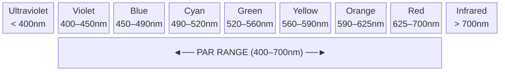
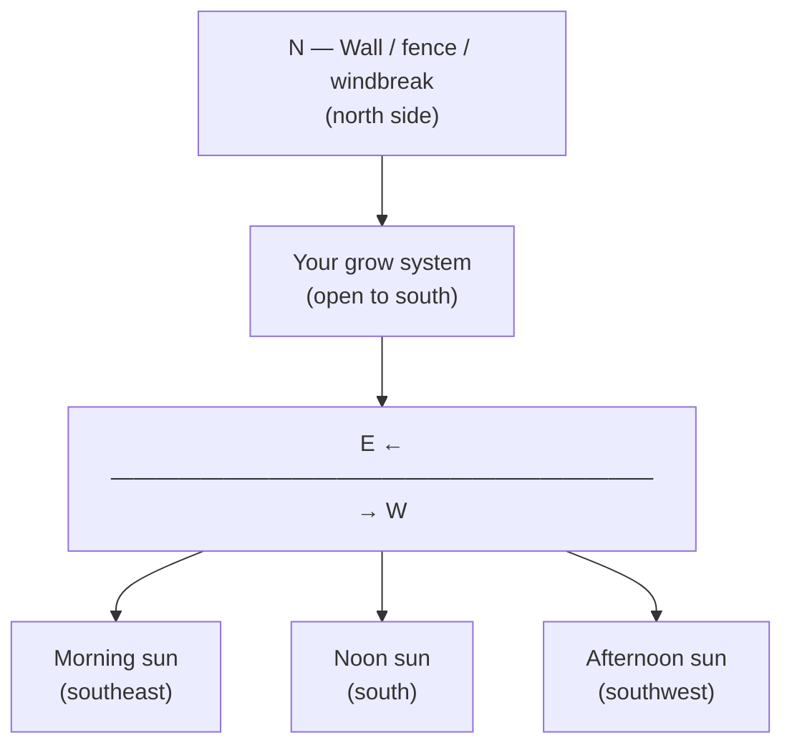
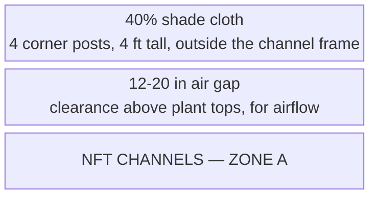

# Guide 04 — Lighting
## Outdoor Light, PAR, DLI, Shade Management, and Seasons

[](../../README.md)
[](https://creativecommons.org/licenses/by-nc-sa/4.0/)

The worked climate, DLI bands, and shade rule follow [Design Constants](../design-constants.md). Zone layout is in [zones.md](../../zones.md).

---

## Table of Contents

- [1. The Language of Plant Light](#1-the-language-of-plant-light)
  - [PAR — Photosynthetically Active Radiation](#par-photosynthetically-active-radiation)
  - [PPFD — Photosynthetic Photon Flux Density](#ppfd-photosynthetic-photon-flux-density)
  - [DLI — Daily Light Integral](#dli-daily-light-integral)
- [2. DLI Targets by Crop](#2-dli-targets-by-crop)
  - [Seasonal DLI in a Temperate Climate](#seasonal-dli-in-a-temperate-climate)
- [3. Minimum Sun Hours Per Crop](#3-minimum-sun-hours-per-crop)
- [4. Siting the System: Sun Mapping](#4-siting-the-system-sun-mapping)
  - [Southern Exposure (Northern Hemisphere)](#southern-exposure-northern-hemisphere)
  - [Obstruction Mapping](#obstruction-mapping)
- [5. Shade Cloth: Percentages, Timing, and Deployment](#5-shade-cloth-percentages-timing-and-deployment)
  - [Why Shade Cloth?](#why-shade-cloth)
  - [Shade Cloth Percentages](#shade-cloth-percentages)
  - [Deployment Method](#deployment-method)
  - [When to Deploy and Remove](#when-to-deploy-and-remove)
- [6. Heat Stress vs Light Stress: Distinguishing the Two](#6-heat-stress-vs-light-stress-distinguishing-the-two)
- [7. Photoperiod Sensitivity](#7-photoperiod-sensitivity)
  - [Crop Categories](#crop-categories)
  - [Implications for Your System](#implications-for-your-system)
- [8. Seasonal Light Strategy](#8-seasonal-light-strategy)
  - [Spring (March–May) — Establishment Phase](#spring-marchmay-establishment-phase)
  - [Summer (June–August) — Peak Production, Heat Management](#summer-juneaugust-peak-production-heat-management)
  - [Autumn (September–October) — Second Season](#autumn-septemberoctober-second-season)
  - [Winter (November–February) — Shutdown / Planning](#winter-novemberfebruary-shutdown-planning)
- [9. Supplemental Lighting for Season Extension](#9-supplemental-lighting-for-season-extension)
  - [When It Makes Sense](#when-it-makes-sense)
  - [Options](#options)
  - [Target PPFD for Supplemental Lighting](#target-ppfd-for-supplemental-lighting)
  - [Wattage & Hanging Height Per Channel](#wattage-hanging-height-per-channel)
  - [Photoperiod Recommendations](#photoperiod-recommendations)
  - [Cost-Benefit Summary](#cost-benefit-summary)
- [10. Microgreens Lighting (Zone B)](#10-microgreens-lighting-zone-b)

---


## 1. The Language of Plant Light

Before managing light for your plants, you need to understand the three key metrics used to describe it. These are not interchangeable — they measure very different things.

### PAR — Photosynthetically Active Radiation

PAR defines the **spectrum of light** that plants use for photosynthesis: wavelengths between **400nm (violet) and 700nm (red)**. This is not a measurement of intensity — it defines the type of light that matters.



| Wavelength range | Colour band | Notes |
|---|---|---|
| Below 400nm | Ultraviolet | Minor photosynthetic role; can stress plants |
| 400–700nm | **PAR range** | Photosynthetically active radiation |
| Above 700nm | Infrared | Mostly heat; minor photomorphogenetic effects |
| 440–470nm | Blue | Vegetative growth, compact internodes, stomatal opening |
| 640–680nm | Red | Flowering, fruiting, overall photosynthesis efficiency |
| 430nm + 680nm | — | Chlorophyll **a** absorption peaks |
| 453nm + 642nm | — | Chlorophyll **b** absorption peaks |

### PPFD — Photosynthetic Photon Flux Density

PPFD measures the **intensity of PAR light** hitting a surface at a given moment. It tells you how much photosynthetically useful light is arriving per second.

- **Units:** μmol/m²/s (micromoles of photons per square metre per second)
- **What it measures:** Instantaneous light intensity at a specific point

```
  PPFD REFERENCE VALUES:

  Outdoors, full sun (noon, summer): ~1,500–2,000 μmol/m²/s
  Outdoors, bright overcast:          ~200–600 μmol/m²/s
  Outdoors, shade/cloudy:             ~50–200 μmol/m²/s
  Indoors, window ledge:              ~100–500 μmol/m²/s (highly variable)

  Plant PPFD thresholds:
  Light compensation point (min useful): ~10–50 μmol/m²/s
  Light saturation point (max useful):
    Lettuce/herbs:   ~400–600 μmol/m²/s
    Tomatoes/peppers: ~800–1,200 μmol/m²/s
    Strawberries:     ~600–1,000 μmol/m²/s
```

> **Key insight:** On a clear summer day, outdoor PPFD at noon (1,500–2,000) **far exceeds the light saturation point** of most plants. The excess beyond what plants can use is converted to heat — this is why shade cloth helps in summer.

### DLI — Daily Light Integral

DLI is the **total quantity of PAR light delivered over an entire day**. It integrates PPFD over time — how many photons the plant receives across a full day. This is the most practically useful metric for crop planning.

- **Units:** mol/m²/day (moles of photons per square metre per day)
- **Why it matters:** You can have high PPFD but few hours of daylight (low DLI), or moderate PPFD across many hours (adequate DLI)

```
  DLI FORMULA:

  DLI = Average PPFD (μmol/m²/s) × Hours of light × 0.0036

  Example:
  Average outdoor PPFD: 400 μmol/m²/s (partly cloudy day)
  Hours of useful daylight: 10 hours

  DLI = 400 × 10 × 0.0036 = 14.4 mol/m²/day → adequate for lettuce
```

[↑ Back to TOC](#table-of-contents)

---


## 2. DLI Targets by Crop

These are the daily light requirements your plants need for optimal growth:

| Crop | Minimum DLI | Optimal DLI | Max Usable DLI |
|------|-------------|-------------|----------------|
| Lettuce (all types) | 8 mol/m²/day | 12–17 | 20 |
| Spinach | 8 | 12–16 | 20 |
| Basil | 12 | 15–20 | 25 |
| Cilantro | 8 | 12–16 | 18 |
| Mint | 8 | 12–16 | 20 |
| Parsley | 8 | 12–16 | 18 |
| Kale | 10 | 15–20 | 25 |
| Cherry tomatoes | 20 | 25–35 | 40 |
| Peppers | 20 | 25–35 | 40 |
| Strawberries | 15 | 20–30 | 35 |
| Radishes (bags) | 10 | 15–20 | 25 |
| Carrots (bags) | 10 | 15–20 | 25 |
| Microgreens | 10 | 12–20 | — |

### Seasonal DLI in the Worked Climate

The worked example is **inland mid-USA, about 38°N, USDA zones 6b–7a** (Kansas City, St. Louis, Louisville, Richmond). It is not the Pacific coast at the same latitude. Clear-sky DLI planning bands:

| Season | Months | Clear-sky DLI |
|--------|--------|----------------|
| Summer | June–August (SA: December–February) | 45–55 mol/m²/day |
| Spring and fall | March–May and September–November (SA: September–November and March–May) | 25–35 mol/m²/day |
| Winter | December–February (SA: June–August) | 10–15 mol/m²/day |

Day length at about 38°N is roughly 9.5 hours in December and about 14.8 hours in June. Overcast days deliver less than the clear-sky band, often around half, sometimes less. Use the clear-sky band for planning and a light meter if you need the day you actually have.

```
  WHAT THOSE BANDS MEAN FOR THIS SYSTEM:

  Outdoor season: mid-April through mid-October
                  (SA: mid-October through mid-April)

  Lettuce, herbs, spinach, kale, strawberries on CH1–CH3:
    Clear-sky light is enough from mid-April through mid-October.
    Summer DLI (45–55) is more than leafy crops can use at noon.
    That excess is heat. Shade is the response, not more plants.

  Cherry tomatoes and peppers on CH4:
    They want the high summer band. Fruit them June–August
    (SA: December–February), inside the outdoor season that
    ends at the first frost, about October 20 (SA: April 20).

  Winter, December–February (SA: June–August):
    Clear-sky DLI is only 10–15 mol/m²/day, and nights in this
    band fall to 0–15°F (−18 to −9°C). Do not run outdoor NFT.
```

The month in brackets is a six-month shift so a southern-hemisphere reader can use the same season. It is not a second climate dataset. Summer afternoon highs are 90–100°F (32–38°C). Last spring frost, for planning, is April 15 (SA: October 15). First fall frost is October 20 (SA: April 20).

[↑ Back to TOC](#table-of-contents)

---


## 3. Minimum Sun Hours Per Crop

While DLI is more accurate, a simple sun hours estimate works for practical planning:

| Crop | Minimum Daily Sun Hours |
|------|------------------------|
| Lettuce, spinach | 4–6 hours direct sun (or more dappled light) |
| Herbs (basil, cilantro, parsley) | 6–8 hours |
| Mint | 4–6 hours (tolerates some shade) |
| Kale | 6–8 hours |
| Tomatoes | 8+ hours full sun — critical |
| Peppers | 8+ hours full sun — critical |
| Strawberries | 6–8 hours |
| Radishes/carrots | 6–8 hours |

> **Site selection rule:** The worked build faces **south (SA: north)** and wants unobstructed sky in that direction for at least 8 hours. The site is 13 ft × 10 ft (4.0 m × 3.0 m). Avoid shade from buildings, walls, or large trees between 10am and 4pm. The wind break sits on the north edge (SA: the south edge), about 12 in (30 cm) clear of the frame.

[↑ Back to TOC](#table-of-contents)

---


## 4. Siting the System: Sun Mapping

### Southern Exposure (Northern Hemisphere)

In the worked climate the sun moves from east to west across the southern sky. Face the long axis **south**. Keep the south, southeast, and southwest open from 10am to 4pm. A South African site faces **north** instead, and the open sky is the north, northeast, and northwest. The wind break stays on the poleward edge: north in the worked example, south in South Africa.



### Obstruction Mapping

Walk your site at:
- **9am** (spring equinox): Note what is in shadow
- **12pm**: Note what is in shadow
- **3pm**: Note what is in shadow

If your site is in shadow at 12pm due to a building or tall fence, you either need to move the system or accept reduced yields.

**Height rule of thumb:** A wall or fence at a distance D from the system casts a shadow about **D × (1/tan(sun altitude))**. At about **38°N**:

- Summer noon (June), sun altitude is about 75°. Shadow length is about **0.26 × D**. A 6 ft (1.8 m) fence set 10 ft (3.0 m) to the south throws a shadow of roughly 2.6 ft (0.8 m), which a south-facing bed can clear.
- Equinox noon, altitude is about 52°. Shadow length is about **0.8 × D**.
- Winter noon (December), altitude is about 29°. Shadow length is about **1.8 × D**. A fence 10 ft (3.0 m) away throws a shadow near 18 ft (5.5 m). That is one reason outdoor NFT is shut down December–February (SA: June–August), not a reason to squeeze the summer bed against a tall south wall.

In South Africa, mirror the diagram: the low winter sun is to the north, so the wall you measure is on the north side of a north-facing bed.

[↑ Back to TOC](#table-of-contents)

---


## 5. Shade Cloth: Percentages, Timing, and Deployment

### Why Shade Cloth?

On a sunny July day, PPFD at noon can reach 1,800–2,000 μmol/m²/s. The light saturation point of lettuce is ~400–600 μmol/m²/s. The excess 1,200–1,400 μmol/m²/s is absorbed as heat — raising leaf temperature, accelerating transpiration (water loss), stressing plants, and triggering bolting (premature flowering) in leafy crops.

Shade cloth reduces PPFD to a level that maximises photosynthesis without heat stress.

### Shade Cloth Percentages

| Shade Level | PPFD Reduction | Recommended Use |
|-------------|---------------|-----------------|
| 30% | Reduces PPFD by ~30% | Light shade, spring/autumn, mild summers |
| 40% | Reduces PPFD by ~40% | Standard summer use — good all-around choice |
| 50% | Reduces PPFD by ~50% | Hot climates, afternoon shade for greens |
| 70% | Reduces PPFD by ~70% | Seedlings, sensitive plants — too dark for most crops |
| 90% | Reduces PPFD by ~90% | Mushrooms, propagation — not for growing food crops |

**Recommendation for this system:** **40% shade cloth** over Zone A when afternoon highs hold above **85°F (29°C)**. In this climate that is the June–August stretch (SA: December–February), when highs run 90–100°F (32–38°C). Roll it back on a cool overcast spell, and take it off once highs are no longer holding above 85°F (29°C).

### Deployment Method



Install 4 posts at the corners of Zone A, about 4 ft (1.2 m) tall, which is taller than the channel posts (36 in / 91 cm at the high end). Stretch 40% shade cloth over the top and secure it with clips or wire. Leave 12–20 in (30–50 cm) between the cloth and the plant tops so air can move. The cloth rolls up and stores. Bamboo or conduit is enough for the shade frame. These posts are not the channel-support posts.

### When to Deploy and Remove

```
  DEPLOY 40% shade cloth when:
  - Afternoon highs hold above 85°F (29°C). In this climate that is
    June–August (SA: December–February)
  - Plants wilt at midday even though the film is running
  - Lettuce or herbs are bolting
  - Leaf tip burn is increasing

  REMOVE shade cloth when:
  - Highs are no longer holding above 85°F (29°C)
  - Several overcast days in a row would drop DLI under the crop minimum
  - From September (SA: March) toward the October 20 frost
    (SA: April 20), unless a late heat spike returns
  - Night temperatures are falling through 59°F (15°C) and the plants
    need the full clear-sky DLI of the shoulder season (25–35)
```

[↑ Back to TOC](#table-of-contents)

---


## 6. Heat Stress vs Light Stress: Distinguishing the Two

These can look similar but have different causes and solutions:

| Symptom | Heat Stress | Light Stress (excess) |
|---------|------------|----------------------|
| **Midday wilting** | Yes (despite wet roots) | Possible |
| **Leaf curl/cupping upward** | Yes | Yes |
| **Tip burn / brown edges** | Yes (Ca mobility issue + heat) | Less common |
| **Bolting (early seed stalk)** | Yes | Yes (long days trigger bolting) |
| **Recovery in evening** | Plants perk up when it cools | Plants perk up when light reduces |
| **Bleached/whitish patches on leaves** | Rare | Yes (sunscald) |
| **Root temperature** | Often high (warm reservoir) | Normal root temp |

**Test:** Check both reservoir temperatures. If either is above **77°F (25°C)**, heat is the primary stressor. Deploy 40% shade if highs are above 85°F (29°C), and keep the black body / white exterior finish in the shade. The aim is 64–72°F (18–22°C).

[↑ Back to TOC](#table-of-contents)

---


## 7. Photoperiod Sensitivity

Many plants respond to the **length of the dark period** (night length) rather than day length — this is called **photoperiodism**.

### Crop Categories

| Category | What Triggers It | Crops |
|----------|-----------------|-------|
| **Short-day plants** | Flower when nights are LONG (late summer/autumn) | Strawberries, some basil varieties, Cannabis |
| **Long-day plants** | Flower when nights are SHORT (summer) | Spinach, lettuce, cilantro, dill |
| **Day-neutral plants** | Flower regardless of day length | Cherry tomatoes, most peppers, mint, kale |

### Implications for Your System

**Lettuce, spinach, cilantro (long-day plants):**
- In midsummer, June–July (SA: December–January), the long days trigger bolting
- 40% shade helps with heat. It does not turn a long day into a short day
- **Solution:** Sow the main leafy crops from mid-April (SA: mid-October) and again in the fall shoulder. Use bolt-resistant varieties if a few sites stay in through July (SA: January)
- Cilantro is the name used in this guide

**Strawberries:**
- They occupy 3–4 sites on **CH3**, in the greens tank, in 2 in (51 mm) pots. They are not on CH4
- **Everbearing / day-neutral varieties** (Albion, Seascape, Evie) fruit without a short-day trigger. Use those
- **June-bearing varieties** give one crop and are a poor fit for a continuous CH3 site

**Tomatoes and peppers:** Day-neutral. They flower from maturity and temperature, on CH4 only, in their own tank. No photoperiod trick is required.

[↑ Back to TOC](#table-of-contents)

---


## 8. Seasonal Light Strategy

### Spring (March–May; SA: September–November) — Establishment

```
  Light: clear-sky DLI in the spring band, 25–35 mol/m²/day,
         rising toward summer by late May (SA: late November)
  Action:
  - Last frost for planning is April 15 (SA: October 15)
  - Germinate indoors in March (SA: September) while nights are still cold
  - Transplant greens and herbs from mid-April (SA: mid-October),
    after that frost date
  - No shade cloth yet
  - Fleece on a late frost night. This is plant cover, not a pump timer.
    Both NFT pumps stay on 24 hours a day
  - Best first plantings: lettuce, spinach, herbs
```

### Summer (June–August; SA: December–February) — Peak Light and Heat

```
  Light: clear-sky DLI 45–55 mol/m²/day. More than lettuce can use at noon
  Air: afternoon highs 90–100°F (32–38°C)
  Action:
  - Deploy 40% shade when highs hold above 85°F (29°C)
  - Harvest leafy greens before they bolt
  - CH4 (tomato or pepper) is the heat-tolerant fruiting loop, on its
    own tank and its own EC
  - Kale and mint on CH3 tolerate the heat better than spinach and lettuce
  - Succession-sow lettuce every 2–3 weeks if you keep CH1 going
  - Both reservoirs stay shaded: black body, white exterior
  - Strawberries stay on CH3 in the greens tank (EC 0.8–1.8 mS/cm).
    Do not raise them to a tomato EC
```

### Autumn (September–October; SA: March–April) — Second Season

```
  Light: back in the spring/fall band, 25–35 mol/m²/day, with less heat
  Action:
  - Roll shade off unless a late spike holds highs above 85°F (29°C)
  - Sow a second round of lettuce, spinach, and herbs
  - Finish tomatoes and peppers before the first frost, about
    October 20 (SA: April 20). The outdoor season ends mid-October
    (SA: mid-April)
  - Nights heading below 50°F (10°C): frost fleece on the plants
  - Microgreens can continue through October (SA: April) with some
    cold tolerance. They still use pH 5.8–6.2 water
```

### Winter (November–February; SA: May–August) — Shutdown

```
  Light: December–February clear-sky DLI is 10–15 mol/m²/day
         (SA: June–August)
  Nights in this band: 0–15°F (−18 to −9°C)
  Action:
  - The last outdoor harvest is around the October 20 frost
    (SA: April 20), not deep winter
  - Do not run outdoor NFT through December–February
    (SA: June–August)
  - Winterise the frame. See [Guide 10 — Climate Management](10-climate-management.md)
  - Clean and store pumps, nets, and meters
  - Plan the next mid-April start (SA: mid-October)
```

[↑ Back to TOC](#table-of-contents)

---


## 9. Supplemental Lighting for Season Extension

Outdoor NFT stops for December–February (SA: June–August). Supplemental light is for a sheltered corner or an indoor microgreen shelf, not for keeping the outdoor channels running through a 0–15°F (−18 to −9°C) night.

### When It Makes Sense

- You want lettuce or herbs into November (SA: May) under a porch or cover, after the outdoor channels are done
- Measured DLI is under the crop minimum in that shelter
- You already have a spot that does not freeze: porch, lean-to, or a small cover

### Options

| Option | Power | Coverage | Cost | Best For |
|--------|-------|----------|------|---------|
| LED grow strips | 10–30W | Small shelves | $20–$60 (R360–R1,080) | Microgreens, small herb shelf |
| T5 fluorescent | 24–54W | 1–2 channels | $30–$80 (R540–R1,440) | Lettuce under cover |
| LED quantum board | 100–200W | Multiple channels | $80–$200 (R1,440–R3,600) | A sheltered extension, not outdoor winter NFT |
| CMH (ceramic metal halide) | 315W+ | Large area | $150–$300 (R2,700–R5,400) | More power and heat than this build needs |

### Target PPFD for Supplemental Lighting

- Lettuce/herbs: 200–400 μmol/m²/s at canopy level
- Fruiting crops (tomatoes/peppers): 400–600 μmol/m²/s at canopy level
- 16–18 hours of light per day total (natural + supplemental combined)

### Wattage & Hanging Height Per Channel

```
  SIZING SUPPLEMENTAL LIGHT FOR AN 8 ft (2.44 m) NFT CHANNEL:

  Each channel is 8 ft (2.44 m) long and about 4 in (10 cm) wide.
  The canopy spreads to about 12 in (30 cm), so the lit area is
  about 8 ft² (0.73 m²).

  TARGET: 200–400 μmol/m²/s (PPFD) for lettuce/herbs

  LED quantum board (typical efficacy: 2.5 μmol/J):
    To deliver 300 μmol/m²/s over 0.73 m² (about 8 ft²):
    Power needed = (300 × 0.73) / 2.5 ≈ 88 W
    → A single 100 W LED quantum board covers one channel comfortably.
    → Two channels side-by-side: one 200 W board, or two 100 W boards.

  T5 fluorescent (typical efficacy: 1.5 μmol/J):
    Same target: (300 × 0.73) / 1.5 ≈ 146 W
    → A 4-tube T5 fixture (4 × 54 W = 216 W) covers one channel with margin.
    → Less efficient than LED but cheaper upfront.

  HANGING HEIGHTS (from the canopy, not from the channel):
  ─────────────────────────────────────────────────────────────
  Light type         Recommended height              Notes
  LED quantum board  12–18 in (30–45 cm)             Closer is brighter and narrower
  T5 fluorescent     6–10 in (15–25 cm)              Low heat, can hang close
  LED grow strips    4–6 in (10–15 cm)               Microgreens shelves
  CMH 315 W          24–36 in (60–90 cm)             Hot. Needs clearance
```

### Photoperiod Recommendations

```
  COMBINING NATURAL + SUPPLEMENTAL LIGHT:

  Lettuce/herbs need 14–18 hours total light, target DLI ≥ 15 mol/m²/day.

  EXAMPLE — DECEMBER AT ABOUT 38°N, INDOORS OR UNDER COVER:
    Outdoor clear-sky DLI is only 10–15 mol/m²/day, and the outdoor
    channels are shut down. A sheltered lettuce crop still wants
    about 12–17 mol/m²/day.
    Daylight is about 9.5 hours. A bright overcast day can land
    under the lettuce minimum, so the lamp makes up the gap.

    A 100 W LED quantum board at 300 μmol/m²/s over 0.73 m² (about 8 ft²):
    DLI contribution = 300 × 3600 × hours / 1,000,000
    At 10 hours supplemental: 300 × 36,000 / 1,000,000 = 10.8 mol/m²/day ✓

    Schedule: lights on at 06:00, off at 22:00 (16 hours total).
    If some natural light enters during the day, reduce artificial hours accordingly.
    Use a timer — never rely on manually switching lights.

  FRUITING CROPS (tomatoes, peppers):
    Not recommended for supplemental growing — the wattage and heat required
    make it uneconomical for a budget system. Focus supplemental lighting on
    lettuce, herbs, and microgreens only.
```

### Cost-Benefit Summary

```
  IS SUPPLEMENTAL LIGHTING WORTH IT?

  FOR LETTUCE/HERBS (YES — if you have a sheltered spot):
    One 100 W LED board: about $80–$120 (R1,440–R2,160)
    Electricity at the planning rate of $0.15/kWh (R2.70/kWh):
    100 W × 10 h/day × 90 days = 90 kWh = $13.50 (R243)
    A sheltered extension might add 11–18 lb (5–8 kg) of lettuce and herbs
    Retail-equivalent value of that extra harvest: about $50–$100 (R900–R1,800)
    → Pays for itself in Season 1 if you value fresh winter greens.

  FOR MICROGREENS (YES — excellent ROI):
    LED grow strips: $20–$60 (R360–R1,080)
    Electricity: negligible (10–30 W)
    Enables year-round microgreens production indoors.
    → Pays for itself in 2–4 weeks of production.

  FOR FRUITING CROPS (NO — not cost-effective):
    Would need 200+ W per channel, plus heating.
    Electricity cost exceeds the value of the produce.
    → Grow CH4 fruiting crops in the outdoor season only:
      mid-April through mid-October (SA: mid-October through mid-April).
```

> **Budget:** Supplemental lighting is an optional add-on. Price it in [Guide 12 — Budget and Sourcing](12-budget-and-sourcing.md) in US dollars with rand in brackets. Get the outdoor two-loop system running through a full mid-April to mid-October season first (SA: mid-October to mid-April).

[↑ Back to TOC](#table-of-contents)

---


## 10. Microgreens Lighting (Zone B)

Microgreens have different light needs from mature crops:

```
  MICROGREENS LIGHT PHASES:

  Phase 1 — Blackout (days 1–4):
  Cover trays completely — no light.
  Darkness + humidity drives germination and initial stem elongation.
  Etiolated seedlings (long, pale) are normal at this stage.

  Phase 2 — Green-up (days 4–7):
  Uncover and place in bright light.
  Chlorophyll develops, cotyledons expand and green up.
  Outdoor: partial shade first, then full light.
  Target DLI: 10–15 mol/m²/day
  Water only, pH 5.8–6.2. Sunflower and pea may use EC 0.4–0.8 mS/cm
  if the tray runs long. Other microgreens stay on water.

  Phase 3 — Growth to harvest (days 7–14):
  Full outdoor light. Use the same 40% shade as Zone A when highs
  hold above 85°F (29°C), so the seedlings do not cook.
  Harvest when the first true leaves appear.
  Coco depth in the tray is 1–1¼ in (2.5–3 cm).
```

---


[↑ Back to TOC](#table-of-contents)

> **Previous:** [Guide 03 — Water Quality](03-water-quality.md)
> **Next:** [Guide 05 — Growing Media](05-growing-media.md)

<!-- copyright -->
*Copyright (c) 2026 UncleJS. Licensed under [CC BY-NC-SA 4.0](https://creativecommons.org/licenses/by-nc-sa/4.0/) — free to share and adapt for non-commercial purposes with attribution and ShareAlike.*
