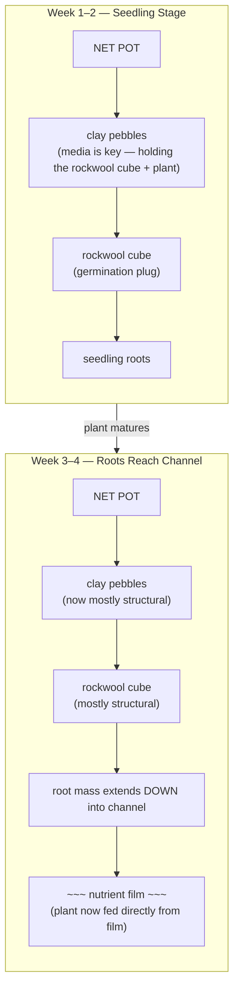
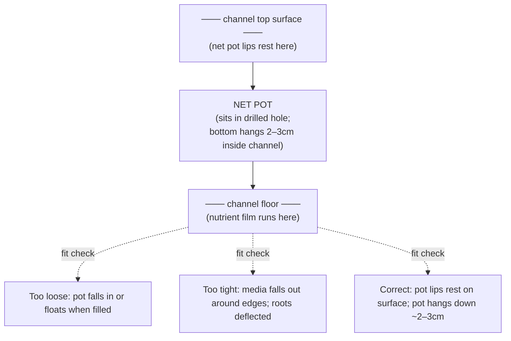

# Guide 05 — Growing Media
## Net Pots, Clay Pebbles, Rockwool, Coco Coir, and Germination

---

## Table of Contents

- [1. Why NFT Uses Minimal Media](#1-why-nft-uses-minimal-media)
- [2. Net Pot Sizes](#2-net-pot-sizes)
  - [Sizes for This System](#sizes-for-this-system)
  - [Net Pot Materials](#net-pot-materials)
  - [Hole Drilling](#hole-drilling)
- [3. Clay Pebbles (LECA — Lightweight Expanded Clay Aggregate)](#3-clay-pebbles-leca-lightweight-expanded-clay-aggregate)
  - [What They Are](#what-they-are)
  - [Properties](#properties)
  - [Preparation Before First Use](#preparation-before-first-use)
  - [How to Use in NFT](#how-to-use-in-nft)
  - [Reuse and Sterilisation](#reuse-and-sterilisation)
- [4. Rockwool (Mineral Wool / Stone Wool)](#4-rockwool-mineral-wool-stone-wool)
  - [What It Is](#what-it-is)
  - [Properties](#properties)
  - [Types](#types)
  - [Critical: pH Conditioning](#critical-ph-conditioning)
  - [How to Use for Seed Germination](#how-to-use-for-seed-germination)
  - [Health and Safety Note](#health-and-safety-note)
  - [Disposal](#disposal)
- [5. Rapid Rooter / Jiffy Plugs (Alternative to Rockwool)](#5-rapid-rooter-jiffy-plugs-alternative-to-rockwool)
  - [Comparison with Rockwool](#comparison-with-rockwool)
- [6. Coco Coir: The Zone C Media](#6-coco-coir-the-zone-c-media)
  - [Properties](#properties)
  - [Coco Coir Types](#coco-coir-types)
  - [Cal-Mag Warning](#cal-mag-warning)
  - [Media Mix for Zone C Grow Bags](#media-mix-for-zone-c-grow-bags)
- [7. Perlite](#7-perlite)
  - [Properties](#properties)
  - [Uses](#uses)
  - [Note on Dust](#note-on-dust)
- [8. Vermiculite](#8-vermiculite)
  - [Properties](#properties)
  - [Uses in This System](#uses-in-this-system)
- [9. What NOT to Use](#9-what-not-to-use)
- [10. Germination Methods: Side-by-Side Comparison](#10-germination-methods-side-by-side-comparison)
  - [Transplanting from Soil to NFT (If You Start in Soil)](#transplanting-from-soil-to-nft-if-you-start-in-soil)
- [11. Media Reuse and Sterilisation](#11-media-reuse-and-sterilisation)
  - [Clay Pebbles (Multi-season reuse)](#clay-pebbles-multi-season-reuse)
  - [Rockwool Cubes](#rockwool-cubes)
  - [Coco Coir (Zone C grow bags)](#coco-coir-zone-c-grow-bags)
- [12. Quick Reference: Media Selection Guide](#12-quick-reference-media-selection-guide)


[↑ Back to TOC](#table-of-contents)

## 1. Why NFT Uses Minimal Media

One of NFT's key advantages is that it requires **almost no growing media**. Unlike soil or media-bed hydroponics (such as ebb-and-flow or Dutch buckets), NFT plants are supported by net pots containing just enough material to:

1. **Anchor the plant** — hold it upright in the net pot
2. **Support the seedling** during the transition from germination plug to full NFT growth
3. **Maintain moisture** around the stem base (the plant's root system will quickly grow down into the channel film)

Once a plant's roots reach the nutrient film in the channel, the media becomes largely irrelevant — the plant is living from the water, not the media.



---


[↑ Back to TOC](#table-of-contents)

## 2. Net Pot Sizes

Net pots are mesh baskets that sit in the holes drilled in your NFT channels. The mesh allows roots to grow through while containing the media.

### Sizes for This System

| Size | Use Case | Channel |
|------|---------|---------|
| **50mm (2 inch)** | Lettuce, spinach, herbs, kale | CH1, CH2, CH3 (75mm channels) |
| **75mm (3 inch)** | Cherry tomatoes, peppers, strawberries | CH4 (100mm wide channel) |
| **25mm (1 inch)** | Cloning, propagation only | Not used in main channels |

### Net Pot Materials

- **Plastic net pots:** Standard, reusable, cheap (~$0.10–$0.30 each). Preferred choice.
- **Biodegradable net pots:** Hemp, coconut husk — useful for media bed systems but unnecessary for NFT
- **DIY net pots:** Cut-down plastic cups with holes drilled — works perfectly fine

### Hole Drilling

When building channels, holes must be drilled to fit net pots snugly:



Use a **hole saw drill bit** of the correct size:
- 50mm net pot: use a 46–48mm hole saw (pot lips hold it in)
- 75mm net pot: use a 71–73mm hole saw

---


[↑ Back to TOC](#table-of-contents)

## 3. Clay Pebbles (LECA — Lightweight Expanded Clay Aggregate)

### What They Are

LECA is kiln-fired clay that has been expanded into lightweight, porous balls. The manufacturing process creates a porous internal structure that holds moisture and nutrients in the clay matrix while maintaining air pockets between pebbles.

### Properties

| Property | Value |
|----------|-------|
| pH neutral | Yes (~7.0, but rinse before use) |
| Reusable | Yes — sterilise between crops |
| Drainage | Excellent |
| Water retention | Moderate (surface wicking, not absorption) |
| Root aeration | Excellent — air pockets between pebbles |
| Cost | ~$1.50–$3.00 per litre |
| Typical size | 4–16mm diameter balls |

### Preparation Before First Use

**Clay pebbles almost always have a high pH surface layer and fine dust that will spike your reservoir pH.**

```
  PREPARATION PROCEDURE:

  1. Place pebbles in a bucket or colander
  2. Rinse thoroughly under running water until water runs clear
     (removes clay dust and fine particles)
  3. Soak in pH-adjusted water (pH 5.5–6.0) for 12–24 hours
     (neutralises alkaline surface residue)
  4. Rinse again with clean water
  5. Ready to use

  Check: After soaking, test the soak water pH.
  If pH > 7.0: soak for another 12 hours and re-test.
  If pH < 6.5: pebbles are ready.

  SKIP THIS STEP and your reservoir pH will spike to 7.5–8.0 on first fill —
  locking out iron and other micronutrients immediately.
```

### How to Use in NFT

- Fill net pot 1/3 with clay pebbles
- Place rockwool/rapid rooter seedling plug in the centre
- Fill remaining space around the plug with more clay pebbles
- Do NOT compact or press down — light filling only

### Reuse and Sterilisation

```
  BETWEEN CROPS:

  1. Remove all root debris (pull roots out, rinse off clinging material)
  2. Soak in 10% bleach solution for 30 minutes
  3. Rinse THOROUGHLY — 5+ rinses with clean water (bleach residue kills plants)
  4. Re-soak in pH-adjusted water
  5. Check pH of soak water before reuse

  Life span: Indefinite — clay pebbles last for many years with proper cleaning.
```

---


[↑ Back to TOC](#table-of-contents)

## 4. Rockwool (Mineral Wool / Stone Wool)

### What It Is

Rockwool is manufactured from volcanic basalt rock and chalk, spun into fibres at very high temperatures and formed into blocks or cubes. It was originally developed as building insulation but was adapted for horticulture in the 1960s–70s (coincidentally around the same time as NFT).

### Properties

| Property | Value |
|----------|-------|
| pH neutral (after conditioning) | Yes — but naturally alkaline (~7.5–8.0 before prep) |
| Sterile | Yes — no pathogens, no weed seeds |
| Water retention | Excellent — holds ~80% water by volume |
| Air porosity | Good — ~20% air at saturation |
| Reusable | Yes but degrades over time |
| Biodegradability | Poor — does not decompose |
| Cost | Cheap — ~$0.10–$0.30 per starter cube |

### Types

- **Starter/propagation cubes** (25mm × 25mm, 36mm × 36mm): For germinating seeds — place one seed per cube
- **Grow blocks** (75mm × 75mm, 100mm × 100mm): For growing tomatoes, peppers in media-bed systems (not needed for this NFT system)
- **Slab/panel rockwool**: Large slabs used in commercial Dutch bucket systems — not relevant here

### Critical: pH Conditioning

Raw rockwool has a pH of ~7.5–8.0 due to the calcium and limestone in its composition. **Using unconditioned rockwool will create root-zone alkalinity that causes nutrient lockout immediately.**

```
  ROCKWOOL CONDITIONING PROCEDURE:

  1. Mix a bucket of water adjusted to pH 5.5 (use pH Down)
  2. Submerge rockwool cubes fully — soak for 1–2 hours
  3. Check water pH after soaking — if it has risen above 6.0, drain and resoak in
     fresh pH 5.5 water for another hour
  4. Remove cubes and gently squeeze to remove excess water (about 70% saturation is ideal)
  5. Cubes are ready to use

  After conditioning, cubes will hold pH around 5.5–6.5 in use.
  Check pH of your reservoir on first use — if it rises, cubes need more soaking.
```

### How to Use for Seed Germination

```
  SEED-TO-TRANSPLANT PROTOCOL:

  1. Use conditioned rockwool cubes (25–36mm)
  2. Make a small hole in the top of the cube (or use pre-made hole)
  3. Place 1–2 seeds per hole (thin to 1 seedling after germination)
  4. Cover hole with a small piece of rockwool or leave open
  5. Place cubes in a tray with a little water (pH 5.5–6.0, EC 0.4–0.6 mS/cm)
  6. Cover tray with plastic wrap or humidity dome to retain moisture
  7. Keep in warm location: 20–25°C for most crops
  8. Check daily — cubes should feel moist but not waterlogged
  9. Germination: 2–7 days depending on crop and temperature
  10. Once seedlings emerge, move to light
  11. Transplant to NFT channel net pots when:
      - Seedling has developed 2–3 true leaves AND
      - Roots are visibly emerging from the base/sides of the cube
      - Typically 1–3 weeks after germination
```

### Health and Safety Note

Rockwool fibres can irritate skin and lungs. Handle dry rockwool with gloves and avoid breaking cubes in a way that creates fibre dust. Once moistened, fibre release is minimal.

### Disposal

Rockwool is not biodegradable and should not go in compost. Bag and place in general waste. Some areas have specialist industrial disposal — check locally.

---


[↑ Back to TOC](#table-of-contents)

## 5. Rapid Rooter / Jiffy Plugs (Alternative to Rockwool)

Rapid Rooter plugs (by General Hydroponics) and Jiffy peat plugs are pre-formed germination plugs made from composted organic materials bound with a polymer.

### Comparison with Rockwool

| Feature | Rockwool | Rapid Rooter / Jiffy |
|---------|----------|---------------------|
| pH adjustment needed | Yes (required) | Minimal (naturally ~5.5–6.0) |
| Moisture retention | Excellent | Excellent |
| Biodegradable | No | Yes (Jiffy) / Partial (RR) |
| Cost | Cheaper | Slightly more expensive |
| Root development | Excellent | Excellent |
| Contamination risk | Near zero (sterile) | Slight (organic material) |
| Transplant ease | Easy | Easy |

**Rapid Rooter advantage:** No pH conditioning needed — just moisten with pH-adjusted nutrient solution (EC 0.4) and use. Excellent for beginners.

---


[↑ Back to TOC](#table-of-contents)

## 6. Coco Coir: The Zone C Media

Coco coir (coconut husk fibre) is the primary media for Zone C grow bags (root vegetables). It is not used in NFT channels — it would clog drains and retain too much moisture.

### Properties

| Property | Value |
|----------|-------|
| pH | Naturally slightly acidic: 5.5–6.8 |
| Water retention | High — holds 8–9× its weight in water |
| Air porosity | Good when blended with perlite (30–50% blend) |
| Nutrient content | Very low — essentially inert (must add all nutrients) |
| Reusability | Good — sterilise and reuse 2–3 times |
| Eco-friendly | Yes — by-product of coconut industry |
| Cation exchange capacity | High — buffers nutrients well |

### Coco Coir Types

- **Compressed blocks:** Expand when wetted (~5L block expands to ~60–70L). Very cost-effective.
- **Loose bagged coco:** Ready to use, convenient but more expensive per litre.
- **Coco perlite pre-mixed:** Some brands sell 70/30 coco/perlite — convenient for grow bags.
- **Buffered coco:** Pre-treated with calcium/magnesium to prevent CEC issues. Worth the slight extra cost.

### Cal-Mag Warning

Raw coco coir has a high cation exchange capacity (CEC) that causes it to **absorb calcium and magnesium from your nutrient solution**, creating deficiencies. This is especially problematic when using Masterblend without a cal-mag supplement.

```
  COCO BUFFERING PROCEDURE:

  Before first use:
  1. Expand/prepare coco coir fully
  2. Mix a strong Cal-Mag solution: 5ml Cal-Mag per litre of water
  3. Saturate the coco coir completely with this solution
  4. Let sit for 30–60 minutes
  5. Drain excess
  6. The coco CEC is now saturated with Ca and Mg — it will no longer strip these
     from your nutrient solution

  OR: Use pre-buffered coco coir (labelled as "buffered" or "pH and EC adjusted")
```

### Media Mix for Zone C Grow Bags

```
  RECOMMENDED MIX (per 20L bag):

  12L buffered coco coir (60%)
   6L perlite (30%)
   2L vermiculite (10%)

  WHY THIS RATIO:
  - Coco: main water/nutrient retention medium
  - Perlite: improves drainage and aeration, prevents compaction
  - Vermiculite: improves moisture retention for root veg (prevents dry pockets)
```

---


[↑ Back to TOC](#table-of-contents)

## 7. Perlite

Perlite is expanded volcanic glass (amorphous silica) that has been heated to ~870°C, causing it to expand like popcorn into lightweight, highly porous granules.

### Properties

| Property | Value |
|----------|-------|
| pH neutral | Yes (~7.0) |
| Water retention | Very low — drains freely |
| Aeration | Excellent — large air pores |
| Nutrient holding | Very low — almost inert |
| Weight | Extremely light |
| Cost | ~$1.50–$3.00 per litre |
| Reusable | Yes, but degrades over time (breaks down into fine dust) |

### Uses

- **Zone C media blend:** 30% perlite in coco mix for improved drainage and aeration
- **Microgreens tray: not used** (coco alone is sufficient)
- **NFT channels: not used** (media is minimal in NFT)

### Note on Dust

New perlite contains fine silica dust — rinse before use or wet it down before handling. Silica dust is a respiratory hazard in large quantities; brief handling outdoors is generally fine.

---


[↑ Back to TOC](#table-of-contents)

## 8. Vermiculite

Vermiculite is a naturally occurring mineral that expands when heated. Unlike perlite (which drains freely), vermiculite holds moisture and creates a sponge-like microenvironment.

### Properties

| Property | Value |
|----------|-------|
| Water retention | High — holds moisture between watering |
| Aeration | Moderate (less than perlite) |
| Nutrient holding | Some — modest CEC |
| pH | Slightly alkaline (7.0–7.5) |
| Cost | ~$1.50–$2.50 per litre |

### Uses in This System

- **Zone C grow bags:** 10% in coco/perlite blend — helps prevent dry pockets around root veg
- **Not used in NFT** — too moisture-retentive, not needed when film is continuous

---


[↑ Back to TOC](#table-of-contents)

## 9. What NOT to Use

| Media | Problem | Verdict |
|-------|---------|---------|
| **Garden/potting soil** | Bacteria, fungal pathogens, weed seeds, compacts in wet conditions — clogs pumps and drains | Never use in hydroponics |
| **Sand** | Compacts when wet, creates anaerobic zones, contains no nutrients, very heavy | Avoid |
| **Gravel (construction)** | Inconsistent pH, may leach limestone, heavy, no moisture retention | Avoid unless confirmed pH-neutral aquarium gravel |
| **Peat moss** | Very acidic (pH 3.5–4.5), decomposes unevenly, not sustainable | Avoid |
| **Compost** | Contamination risk, introduces pathogens, breaks down and clogs drains | Never use directly in NFT |
| **Aquarium gravel (decorative)** | May be pH-neutral, but no aeration, no moisture retention — poor media | Only acceptable in emergency |

---


[↑ Back to TOC](#table-of-contents)

## 10. Germination Methods: Side-by-Side Comparison

| Method | Difficulty | Speed | Cost | Best For |
|--------|------------|-------|------|---------|
| **Rockwool starter cubes** | Easy (after conditioning) | Medium | Low | All NFT crops |
| **Rapid Rooter plugs** | Very easy | Medium | Low-medium | Beginners, all crops |
| **Jiffy peat pellets** | Easy | Medium | Low | Non-hydro crops that will go to soil |
| **Soil seed starting mix** | Easy | Slow | Low | Crops to be transplanted (root washing required) |
| **Direct into coco coir tray** | Easy | Medium | Low | Microgreens (Zone B) |
| **Paper towel germination** | Easy | Fast | Very low | Checking viability — not a transplant method |

### Transplanting from Soil to NFT (If You Start in Soil)

If seedlings were started in soil and you want to move them to NFT channels, root washing is required to remove all soil (soil contamination in a hydroponic system can introduce pathogens and clog the system).

```
  ROOT WASHING PROCEDURE:

  1. Carefully unpot the seedling
  2. Hold roots under gentle running water
  3. Use your fingers to carefully tease soil off the roots
  4. Dip roots in a bucket of clean water and swirl — repeat 2–3 times
  5. Inspect: no visible soil should remain on roots
  6. Place plant in net pot with clay pebbles (no rockwool cube needed — roots are bare)
  7. Lower into NFT channel immediately — do not let roots dry out
  8. Monitor closely for 48 hours — transplant shock is more likely with bare-root plants
  
  NOTE: This is more stressful for plants than using rockwool/rapid rooter from the start.
  Starting in rockwool directly avoids the need for root washing entirely.
```

---


[↑ Back to TOC](#table-of-contents)

## 11. Media Reuse and Sterilisation

### Clay Pebbles (Multi-season reuse)

```
  1. Remove root debris — rinse under strong stream of water
  2. Inspect for cracked or deteriorated pebbles — remove and discard
  3. Soak in 10% bleach solution for 30 minutes
  4. Drain, rinse with clean water × 5
  5. Soak in pH 5.5 water overnight
  6. Rinse one final time
  7. Dry in sun before storage
  8. Store dry in a sealed bag/bucket
```

### Rockwool Cubes

- Small starter cubes: Generally single use — cost is minimal and reuse risk (pathogen retention) is not worth it
- Larger grow blocks: Can be sterilised with 10% bleach (30 min soak), triple rinsed, re-pH conditioned, and reused once

### Coco Coir (Zone C grow bags)

```
  After each crop:
  1. Remove all root material (pull out and shake off debris)
  2. Flush bag with 10% bleach solution, let sit 15 minutes
  3. Flush with clean water × 3
  4. Re-saturate with Cal-Mag solution (rebuffering — see Section 6)
  5. Check media is not compacted — break up any compressed zones
  6. Reusable for 2–3 seasons before it begins to break down

  Signs media needs replacing: compacted despite perlite, anaerobic smell,
  persistent root rot issues despite clean practices.
```

---


[↑ Back to TOC](#table-of-contents)

## 12. Quick Reference: Media Selection Guide

| Zone | Component | Media | Net Pot |
|------|-----------|-------|---------|
| Zone A — CH1 (lettuce) | NFT channel | Clay pebbles + rockwool cube | 50mm |
| Zone A — CH2 (herbs) | NFT channel | Clay pebbles + rockwool cube | 50mm |
| Zone A — CH3 (kale/spinach/mint) | NFT channel | Clay pebbles + rockwool cube | 50mm |
| Zone A — CH4 (tomatoes/strawberries) | NFT channel | Clay pebbles + rockwool cube | 75mm |
| Zone B (microgreens) | Tray | Coco coir (2–3cm layer) | None |
| Zone C (radishes/beetroot) | 20L grow bag | 60% coco + 30% perlite + 10% vermiculite | None |
| Zone C (carrots) | 30L deep grow bag | 60% coco + 30% perlite + 10% vermiculite | None |
| Propagation | Germination tray | Rockwool cubes or Rapid Rooter plugs | None |

---


[↑ Back to TOC](#table-of-contents)

*Next: [`guide/nft/06-crops.md`](06-crops.md) — Per-crop growing guide for every plant in this system*
