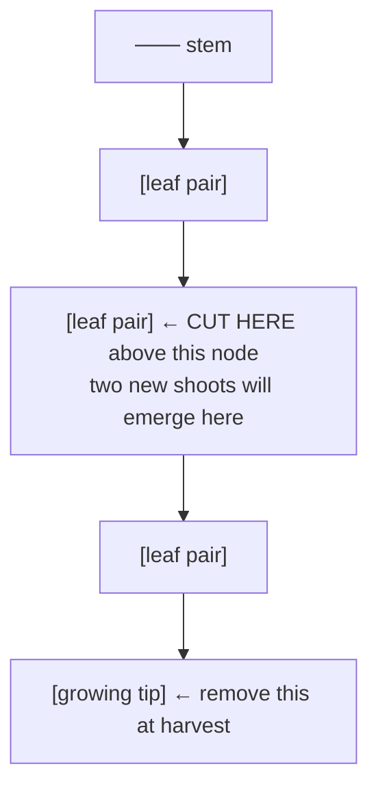
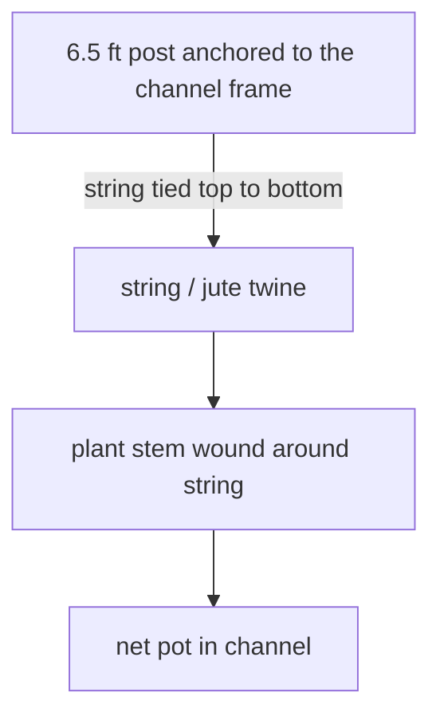

# Guide 06 — Crops
## Per-Crop Growing Guide for Every Plant in This System

[](../../README.md)
[](https://creativecommons.org/licenses/by-nc-sa/4.0/)

Channels, EC, bags, and yields follow [Design Constants](../design-constants.md). Zone layout is in [zones.md](../../zones.md).

---

## Table of Contents

- [How to Use This Guide](#how-to-use-this-guide)
- [Quick Reference — Zone, Channel & Crop Map](#quick-reference-zone-channel-crop-map)
- [LEAFY GREENS & HERBS (Zone A — NFT Channels)](#leafy-greens-herbs-zone-a-nft-channels)
  - [LETTUCE — Butter, Romaine, Loose-Leaf](#lettuce-butter-romaine-loose-leaf)
  - [SPINACH](#spinach)
  - [KALE](#kale)
  - [BASIL (Sweet / Thai / Purple)](#basil-sweet-thai-purple)
  - [CILANTRO](#cilantro)
  - [MINT](#mint)
  - [CHIVES](#chives)
  - [PARSLEY (Flat-Leaf / Curly)](#parsley-flat-leaf-curly)
- [FRUITING CROPS (Zone A — CH4 Only)](#fruiting-crops-zone-a-ch4-only)
  - [CHERRY TOMATOES](#cherry-tomatoes)
  - [PEPPERS (Sweet Bell / Chili)](#peppers-sweet-bell-chili)
- [STRAWBERRIES (Zone A — CH3, Greens Tank)](#strawberries-zone-a-ch3-greens-tank)
  - [STRAWBERRIES](#strawberries)
- [MICROGREENS (Zone B — Tray Station)](#microgreens-zone-b-tray-station)
  - [MICROGREENS — General Protocol](#microgreens-general-protocol)
  - [Equipment & Supplies](#equipment-supplies)
  - [Individual Crop Profiles](#individual-crop-profiles)
  - [Per-Tray Yield Estimates](#per-tray-yield-estimates)
  - [Succession Schedule — Staggered Production](#succession-schedule-staggered-production)
  - [Harvest](#harvest)
  - [Microgreens Troubleshooting](#microgreens-troubleshooting)
- [ROOT VEGETABLES (Zone C — Grow Bags)](#root-vegetables-zone-c-grow-bags)
  - [RADISHES](#radishes)
  - [CARROTS](#carrots)
  - [BEET (beetroot)](#beet-beetroot)
- [Crop Rotation and Succession Planning](#crop-rotation-and-succession-planning)
  - [Zone C — Root Vegetable Succession Planting](#zone-c-root-vegetable-succession-planting)
  - [Succession Planting Schedule (CH1 — Lettuce Example)](#succession-planting-schedule-ch1-lettuce-example)
  - [NFT Channel Rotation Between Seasons](#nft-channel-rotation-between-seasons)


[↑ Back to TOC](#table-of-contents)

## How to Use This Guide

Each crop entry includes:
- **Zone & System:** Where it grows in this setup
- **Conditions:** EC, pH, temperature, light
- **Timeline:** Days to germination and harvest
- **Spacing:** In-channel or bag spacing
- **Harvest method:** Cut-and-come-again or full pull
- **Common problems:** Specific to this crop
- **Succession planting:** How to maintain continuous supply

> **First-season expectations:** Timelines and yields below assume a tuned system with stable EC and pH. In the first season, expect slower growth, more losses, and lower yields while you learn the two loops. See [Guide 12 — Budget and Sourcing](12-budget-and-sourcing.md) for first-season yield adjustments, typically 40–60% of the planning figures.


---


[↑ Back to TOC](#table-of-contents)

## Quick Reference — Zone, Channel & Crop Map

| Zone | Channel | Channel Size | Crops | Net Pot | Sites |
|------|---------|-------------|-------|---------|-------|
| **A — greens** | CH1 | 3 in (76 mm) square, 8 ft (2.44 m) | Lettuce | 2 in (51 mm) | 11 at 9 in (229 mm) |
| **A — greens** | CH2 | 3 in (76 mm) square, 8 ft (2.44 m) | Basil, cilantro, parsley, chives | 2 in (51 mm) | 11 at 9 in (229 mm) |
| **A — greens** | CH3 | 3 in (76 mm) square, 8 ft (2.44 m) | Spinach, kale, mint, and strawberries in 3–4 sites | 2 in (51 mm) | 11 at 9 in (229 mm) |
| **A — fruiting** | CH4 | 4 in (102 mm) square, 8 ft (2.44 m) | Cherry tomato and pepper only | 3 in (76 mm) | 7 holes at 12 in (305 mm) |
| **B — trays** | — | 6 trays, 10 in × 20 in (25 cm × 50 cm) | Microgreens | — | Coco 1–1¼ in (2.5–3 cm) |
| **C — bags** | — | Two 5 US gal radish, one 5 US gal beet, three 10 US gal carrot | Radish, beet (beetroot), carrot | — | EC ceiling 2.0 mS/cm |

> **Total NFT sites: 40** (33 on CH1–CH3 plus 7 holes on CH4). Slope is 1:30, a 3¼ in (83 mm) drop. Posts are 36 in (91 cm) at the inlet and 32¾ in (83 cm) at the drain. The greens loop has its own 20 US gal (76 L) reservoir and a 160–210 US gph (600–800 L/h) pump, 24 hours a day, EC 0.8–1.8 mS/cm, changed every 7 days. CH4 has its own 10 US gal (38 L) reservoir and a 50–100 US gph (200–400 L/h) pump, 24 hours a day, and is not teed into the 1 in (25 mm) greens manifold. Tomato fruiting EC is 2.5–3.5 mS/cm and pepper fruiting EC is 2.0–3.0 mS/cm, in that tank only, changed every 5–7 days. Planning yield is 4–6 lb (1.8–2.7 kg) of cherry tomatoes per CH4 plant. Both reservoirs are a black body with a white exterior, and an air pump is recommended in each.


---


[↑ Back to TOC](#table-of-contents)

## LEAFY GREENS & HERBS (Zone A — NFT Channels)

---

### LETTUCE — Butter, Romaine, Loose-Leaf

**Zone:** CH1, greens tank | **Net Pot:** 2 in (51 mm) | **System:** NFT

| Parameter | Value |
|-----------|-------|
| EC | 0.8–1.6 mS/cm, ceiling 1.8 in the shared greens tank |
| pH | Working window 5.8–6.2 (acceptable 5.5–6.5) |
| Air Temperature | 59–75°F (15–24°C), ideal 64–72°F (18–22°C) |
| Water Temperature | Aim 64–72°F (18–22°C). Act above 77°F (25°C) |
| Light (DLI) | 12–17 mol/m²/day |
| Min Sun Hours | 4–6 hours |

**Timeline:**
```
  Germination:    3–7 days at 68°F (20°C), in the dark
  Seedling ready: 10–14 days after germination (2–3 true leaves, roots emerging)
  Transplant → harvest: 21–35 days (loose-leaf) / 35–50 days (head lettuce)
  Total seed-to-harvest: 5–8 weeks
```

**Spacing in channel:** 9 in (229 mm), 11 sites on the 8 ft (2.44 m) channel. Do not drill a 12th site.

**Varieties for outdoor NFT:**
- **Loose-leaf:** Oak leaf, Red Sails, Black Seeded Simpson — fastest, cut-and-come-again capable
- **Butter:** Tom Thumb, Buttercrunch — heads 30–40 days, very popular
- **Romaine:** Little Gem — compact, sweet, excellent outdoors
- **Bolt-resistant for summer:** Jericho (romaine), Nevada, Ithaca — critical if growing through warm weather

**Harvest method:**
- **Loose-leaf:** Cut outer leaves at ¾–1¼ in (2–3 cm) from the stem base so the plant regrows. Harvest every 5–7 days.
- **Head lettuce:** Pull entire plant (roots and all) when head is firm. Replace net pot immediately with a new seedling.

**Succession planting:** Start new seeds every 2–3 weeks to maintain continuous supply. Stagger 4–6 plants at different stages at all times.

**Common problems:**
- **Bolting** (a seed stalk): Triggered by air above 75°F (24°C) and by long days. Use bolt-resistant varieties, or the 40% shade cloth when highs hold above 85°F (29°C). Bolted lettuce is bitter. Harvest as the stalk starts.
- **Tip burn** (brown leaf edges): Usually a calcium-delivery problem, not an empty solution. Heat-driven transpiration outruns calcium moving to the leaf edge. Low humidity, poor airflow, and high EC make it worse. Fix: shade, airflow, a lower EC still inside 0.8–1.8, and an air pump in the greens reservoir. Jericho and Nevada resist it. See [Guide 09 — Troubleshooting](09-troubleshooting.md) and [Guide 10 — Climate Management](10-climate-management.md).
- **Slimy roots:** Pythium, from warm water. Get the greens tank back toward 64–72°F (18–22°C). A peroxide clean is in [Guide 07 — Pests and Disease](07-pests-and-disease.md) and [Guide 03 — Water Quality](03-water-quality.md): plants out or hand-watered first, because roots dry in 15–30 minutes.
- **Pale/yellowing leaves:** Nitrogen deficiency or pH out of range. Test and adjust.

---

### SPINACH

**Zone:** CH3, greens tank | **Net Pot:** 2 in (51 mm) | **System:** NFT

| Parameter | Value |
|-----------|-------|
| EC | 1.2–1.8 mS/cm. The shared greens tank does not go above 1.8 |
| pH | Working window 5.8–6.2 (acceptable 5.5–6.5) |
| Air Temperature | 50–70°F (10–21°C), ideal 59–64°F (15–18°C). Cool-season crop |
| Light (DLI) | 12–16 mol/m²/day |
| Min Sun Hours | 4–6 hours |

**Timeline:**
```
  Germination:    7–14 days. Prefers 50–59°F (10–15°C)
  Seedling ready: 14–21 days
  Harvest:        40–55 days from seed
```

**Spacing:** 9 in (229 mm), sharing CH3's 11 sites with kale, mint, and 3–4 strawberry sites

**Varieties:** Bloomsdale Long Standing (slow-bolt), Tyee (bolt-resistant hybrid), Corvair

**Harvest:** Outer leaves cut-and-come-again, or full plant. Responds well to cut-and-come-again.

**Season:** Spring and fall inside the outdoor season. Spinach handles a light frost and bolts fast once air holds above 75°F (24°C). Best windows: March–May (SA: September–November) and September through mid-October (SA: March through mid-April). Do not run the outdoor channels through December–February (SA: June–August).

**Common problems:**
- **Bolting in heat:** Spinach is extremely sensitive to heat and long days. Do not carry it through June–August (SA: December–February) without the 40% shade, and expect it to bolt anyway if highs sit at 90–100°F (32–38°C).
- **Yellow leaves:** Often magnesium. The Masterblend recipe already includes Epsom salt at 1.2 g/US gal (0.32 g/L) in the vegetative base. Confirm pH is 5.8–6.2 before adding more.
- **Poor germination:** Spinach prefers 50–59°F (10–15°C). Sow in the fall window, or refrigerate seed for 24 hours before the spring sowing.

---

### KALE

**Zone:** CH3, greens tank | **Net Pot:** 2 in (51 mm) | **System:** NFT

| Parameter | Value |
|-----------|-------|
| EC | 1.2–1.8 mS/cm. Kale does not get its own higher tank |
| pH | Working window 5.8–6.2 (acceptable 5.5–6.5) |
| Air Temperature | 50–86°F (10–30°C). Hardy, and it tolerates a light frost |
| Light (DLI) | 15–20 mol/m²/day |
| Min Sun Hours | 6–8 hours |

**Timeline:**
```
  Germination:    4–7 days
  Seedling ready: 14–21 days
  Harvest:        50–75 days from seed, then continuous cut-and-come-again
```

**Spacing:** CH3 holes stay at 9 in (229 mm). Kale gets large, so use fewer of the 11 sites and leave the rest to spinach, mint, or the 3–4 strawberry sites. Do not redrill the channel wider.

**Varieties:** Dwarf Blue Curled (compact, ideal for NFT), Cavolo Nero (black Tuscan kale), Red Russian (sweet)

**Harvest:** Always cut outer leaves first — the growing center continues to produce. Each plant can produce for 3–4 months with regular harvesting.

**Season:** Through the outdoor season, mid-April to mid-October (SA: mid-October to mid-April). Kale **tastes sweeter after a light frost**. The outdoor NFT frame is not run through December–February (SA: June–August).

**Common problems:**
- **Aphids:** Kale is a favorite target. Check leaf undersides. See [Guide 07 — Pests and Disease](07-pests-and-disease.md).
- **Caterpillars (cabbage white butterfly):** Kale is a brassica. Net the channel or use Bt, as described in [Guide 07 — Pests and Disease](07-pests-and-disease.md).

---

### BASIL (Sweet / Thai / Purple)

**Zone:** CH2, greens tank | **Net Pot:** 2 in (51 mm) | **System:** NFT

| Parameter | Value |
|-----------|-------|
| EC | 1.0–1.6 mS/cm, ceiling 1.8 with the rest of the greens tank |
| pH | Working window 5.8–6.2 (acceptable 5.5–6.5) |
| Air Temperature | 64–86°F (18–30°C). Warm season only. Cold-sensitive |
| Light (DLI) | 15–20 mol/m²/day |
| Min Sun Hours | 6–8 hours |

**Timeline:**
```
  Germination:    5–10 days. Needs at least 72–77°F (22–25°C)
  Seedling ready: 14–21 days
  Harvest:        28–45 days from seed, then continuous
```

**Spacing:** 9 in (229 mm), one of the 11 CH2 sites

**Varieties:** Genovese (classic Italian, best for pesto), Thai (robust, anise flavor), Purple Ruffles (ornamental and culinary), Lemon Basil

**Harvest:** Pinch growing tips above a leaf node (where two new branches will emerge). This encourages bushy growth and delays flowering. Never let basil flower — once flowering starts, leaf production slows and flavor declines.



**Season:** After the last frost, April 15 (SA: October 15), through the warm months, and finished before the first frost on about October 20 (SA: April 20). Damage below 50°F (10°C), death below 41°F (5°C). Start indoors in April (SA: October) and transplant after that frost date.

**Common problems:**
- **Cold damage:** A night below 50°F (10°C) blackens and wilts leaves. Cover the plants, or wait for warmer nights. The pump still runs.
- **Yellowing bottom leaves:** Normal as the plant ages. Also from EC above the greens ceiling, or from low nitrogen. Check the meter.
- **Bolting to flower:** Long hot days do this. Pinch on schedule. Cardinal is more bolt-tolerant.
- **Root rot:** Basil is quick to pick up pythium in warm water. Aim for 64–72°F (18–22°C) in the greens tank, and act above 77°F (25°C).

---

### CILANTRO

**Zone:** CH2, greens tank | **Net Pot:** 2 in (51 mm) | **System:** NFT

| Parameter | Value |
|-----------|-------|
| EC | 1.2–1.6 mS/cm, ceiling 1.8 with the greens tank |
| pH | Working window 5.8–6.2 (acceptable 5.5–6.5) |
| Air Temperature | 59–77°F (15–25°C). Bolts quickly in heat |
| Light (DLI) | 12–16 mol/m²/day |
| Min Sun Hours | 4–6 hours |

**Timeline:**
```
  Germination:    7–14 days (slow germinators)
  Harvest:        35–55 days from seed
  Window before bolting: 4–6 weeks once established
```

**Spacing:** 9 in (229 mm) on CH2. The plant is smaller than basil, and the hole spacing stays the same.

**Trick for germination:** Cilantro seeds are actually two seeds in a husk. Crush lightly between fingers or soak for 24h before sowing to improve germination rate.

**Harvest:** Cut top 1/3 of plant for leaf harvest. Succession planting is essential — cilantro has a short harvestable window before it bolts.

**Season:** Spring and fall are the reliable windows: March–May (SA: September–November) and September to mid-October (SA: March to mid-April). Summer plants need the 40% shade and a bolt-resistant variety (Leisure, Calypso), and they still race to flower in 90–100°F (32–38°C) afternoons.

**Uses for bolted plants:** When cilantro bolts, it produces seed sold as coriander. Let one or two plants finish and harvest the dried seed heads.

**Common problems:**
- **Bolting very quickly:** This is normal behavior — plant fewer per channel at once and succession sow every 2–3 weeks instead.
- **Slow germination:** See note on seed crushing above.

---

### MINT

**Zone:** CH3, greens tank | **Net Pot:** 2 in (51 mm) | **System:** NFT

| Parameter | Value |
|-----------|-------|
| EC | 1.2–1.6 mS/cm, ceiling 1.8 with the greens tank |
| pH | Working window 5.8–6.2 (acceptable 5.5–6.5) |
| Air Temperature | 59–77°F (15–25°C), and it tolerates a wider band |
| Light (DLI) | 12–16 mol/m²/day |
| Min Sun Hours | 4–6 hours (tolerates partial shade) |

**Timeline:**
```
  Germination:    7–14 days (or propagate from cuttings — faster)
  Harvest:        3–4 weeks from established plant, then continuous
```

**Spacing:** 9 in (229 mm) on CH3. Mint roots hard, so give it a site with a neighbor you can spare.

**Propagation from cuttings (preferred method):**
```
  1. Cut a 4–6 in (10–15 cm) stem from an existing mint plant
  2. Strip lower leaves
  3. Place stem in a glass of water (or straight into a moist rockwool cube)
  4. Roots emerge in 7–10 days in water
  5. Transfer to a 2 in (51 mm) net pot with clay pebbles once roots are ¾–1¼ in (2–3 cm)
```

**Root containment warning:** Mint in NFT will produce very vigorous root mats that can spread to fill the entire channel and block the drain fitting. Check root development weekly for established plants. Trim roots extending beyond the channel drain.

**Harvest:** Cut sprigs to just above a leaf node. Continuous harvest. Very productive crop.

**Common problems:**
- **Root blockage:** As above — monitor regularly.
- **Rust fungus:** Orange-brown pustules on leaves — remove affected leaves immediately, improve airflow, avoid wetting leaves.

---

### CHIVES

**Zone:** CH2, greens tank | **Net Pot:** 2 in (51 mm) | **System:** NFT

| Parameter | Value |
|-----------|-------|
| EC | 1.2–1.8 mS/cm. Stay at or below the greens ceiling of 1.8 |
| pH | Working window 5.8–6.2 (acceptable 5.5–6.5) |
| Air Temperature | 59–77°F (15–25°C) |
| Light (DLI) | 12–16 mol/m²/day |
| Min Sun Hours | 4–6 hours |

**Timeline:**
```
  Germination:    7–14 days
  First harvest:  60–90 days from seed
  Once established: Harvest continuously
```

**Spacing:** 9 in (229 mm). Usually a cluster of 4–6 seeds in one net pot, so it reads as a grass clump.

**Harvest:** Cut leaves at 2 in (5 cm) above the base. Regrowth takes 2–3 weeks. Low maintenance.

**Season:** Cold-tolerant inside the outdoor season, March through mid-October (SA: September through mid-April). The channels themselves are not run through December–February (SA: June–August).

---

### PARSLEY (Flat-Leaf / Curly)

**Zone:** CH2, greens tank | **Net Pot:** 2 in (51 mm) | **System:** NFT

| Parameter | Value |
|-----------|-------|
| EC | 1.2–1.6 mS/cm, ceiling 1.8 with the greens tank |
| pH | Working window 5.8–6.2 (acceptable 5.5–6.5) |
| Air Temperature | 59–77°F (15–25°C) |
| Light (DLI) | 12–16 mol/m²/day |
| Min Sun Hours | 4–6 hours |

**Timeline:**
```
  Germination:    14–28 days (very slow — parsley is notorious for slow germination)
  First harvest:  70–90 days from seed
  Then continuous
```

**Spacing:** 9 in (229 mm) on CH2

**Germination tip:** Soak seeds in warm water for 24 hours before sowing. Pre-germinating in a damp paper towel (then transfer to rockwool when radicle emerges) dramatically speeds up germination.

**Varieties:** Italian Flat Leaf (stronger flavor), Curled Moss (decorative, milder)

**Harvest:** Cut outer stems at base. Central growth continues. Plant produces for 5–6 months.

**Common problems:**
- **Very slow germination:** Normal — parsley contains inhibitor compounds. Soaking helps.
- **Yellow leaves:** Often iron deficiency from pH too high. Check pH.

---


---


[↑ Back to TOC](#table-of-contents)

## FRUITING CROPS (Zone A — CH4 Only)

CH4 is the only fruiting channel: 4 in (102 mm) square, 8 ft (2.44 m), 7 holes at 12 in (305 mm), 3 in (76 mm) net pots. It has its own 10 US gal (38 L) reservoir and its own 50–100 US gph (200–400 L/h) pump, running 24 hours a day. It is not teed into the greens manifold. Strawberries are not planted here. They use 3–4 sites on CH3.

Cherry tomato and pepper share this channel only if you accept one EC. Tomato fruiting is 2.5–3.5 mS/cm. Pepper fruiting is 2.0–3.0 mS/cm. A mixed fill sits at 2.5–3.0 mS/cm, inside both bands. Change this tank every 5–7 days.

---

### CHERRY TOMATOES

**Zone:** CH4 | **Net Pot:** 3 in (76 mm) | **System:** NFT, own reservoir

| Parameter | Value |
|-----------|-------|
| EC | Vegetative in this tank 2.0–2.5 mS/cm. Fruiting 2.5–3.5 mS/cm. Not used in the greens tank |
| pH | Working window 5.8–6.2 (acceptable 5.5–6.5) |
| Air Temperature | 68–82°F (20–28°C). Stress below 59°F (15°C) or above 90°F (32°C) |
| Light (DLI) | 25–35 mol/m²/day, with summer clear-sky often 45–55 |
| Min Sun Hours | 8+ hours |
| Planning yield | 4–6 lb (1.8–2.7 kg) of fruit per plant |

**Timeline:**
```
  Germination:    5–10 days. Needs 72–77°F (22–25°C)
  Seedling ready: 21–28 days
  First flowers:  5–7 weeks from transplant
  First fruit:    10–14 weeks from seed
  Harvest season: 3–4 months continuous harvest
```

**Spacing:** Holes are 12 in (305 mm), seven of them. Plant 4–5 indeterminate cherries and skip holes so the vines have room. Compact determinate plants can use all 7 holes.

**Varieties for outdoor NFT:** Tumbling Tom (bush/determinate — no staking needed), Sungold (indeterminate, exceptional flavor), Sweet Million, Black Cherry

**Indeterminate vs Determinate:**
- **Indeterminate:** Grow continuously up a cane/trellis until killed by frost. Higher total yield. Need support.
- **Determinate:** Set fruit all at once on a compact bush. Less support needed. Good for container/NFT.

**Support system:**


**Pollination:** Outdoors, wind and insects handle pollination. In still conditions or under cover, shake the plant gently when in flower, or use an electric toothbrush on flower clusters to release pollen. Poor pollination = blossom drop (see common problems).

**Stage-by-stage EC management (CH4 tank only):**
- Seedling through first flower: 2.0–2.5 mS/cm
- Flowering: 2.5–3.0 mS/cm
- Fruiting and harvest: 2.5–3.5 mS/cm. Do not push past 3.5
- A higher fruiting EC concentrates sugars. The ceiling is still 3.5 mS/cm
- Planning yield: 4–6 lb (1.8–2.7 kg) per plant

**Common problems:**
- **Blossom drop:** Flowers fall without fruit. Triggers include nights under 59°F (15°C), days over 90°F (32°C), low humidity, and poor pollination. Hand-pollinate and manage temperature. Shade at 40% when highs hold above 85°F (29°C).
- **Blossom end rot:** Dark, sunken scar at fruit base — calcium deficiency caused by pH fluctuation or inconsistent watering. Stabilize EC and pH.
- **Leaf curl:** Normal in heat (defense response). Concerning if accompanied by yellowing.
- **Yellowing lower leaves:** Natural (remove regularly) — or nutrient deficiency if severe and spreading upward.
- **Splitting fruit:** Inconsistent watering/EC — solution temperature and EC spikes crack fruit. Maintain consistency.

---

### PEPPERS (Sweet Bell / Chili)

**Zone:** CH4 | **Net Pot:** 3 in (76 mm) | **System:** NFT, own reservoir

| Parameter | Value |
|-----------|-------|
| EC | Fruiting 2.0–3.0 mS/cm in the CH4 tank only. Ceiling 3.0 |
| pH | Working window 5.8–6.2 (acceptable 5.5–6.5) |
| Air Temperature | 68–86°F (20–30°C). More heat-demanding than tomatoes |
| Light (DLI) | 25–35 mol/m²/day |
| Min Sun Hours | 8+ hours |

**Timeline:**
```
  Germination:    10–21 days. Needs 77–86°F (25–30°C). Slowest seed in this system
  Seedling ready: 4–6 weeks
  First flowers:  8–10 weeks from transplant
  First fruit (green): 12–16 weeks from seed
  Ripe colored fruit:  16–22 weeks from seed

  IMPORTANT: Start seeds indoors in late February or early March
  (SA: late August or early September) so fruit can ripen before the
  first frost, about October 20 (SA: April 20).
```

**Spacing:** 12 in (305 mm) holes. Compact plants can fill all 7. A large bell may need a skipped hole, same idea as an indeterminate tomato.

**Varieties:**
- **Sweet bell:** Californian Wonder, Lamuyo, Lipstick — large fruit, slow to ripen
- **Mini sweet:** Baby Bell mix — smaller fruit, faster production
- **Chili:** Cayenne (fast, prolific), Jalapeño (compact, reliable), Anaheim

**Support:** Less demanding than tomatoes but still benefit from a central stake when laden with fruit.

**Pollination:** As per tomatoes — wind/insect outdoors, manual shaking in still conditions.

**Common problems:**
- **Flower drop:** Peppers drop flowers when nights fall below 59°F (15°C). Fleece the plants. Do not turn the pump off.
- **Slow growth:** Peppers are naturally slower than tomatoes. Do not over-fertilize trying to speed them up — this causes vegetative lush growth at expense of fruiting.
- **Thin walls (small fruit):** Usually insufficient light or below-optimal temperature. Ensure 8+ hours full sun.
- **Blossom end rot:** Same as tomatoes — calcium deficiency, pH instability.

---


[↑ Back to TOC](#table-of-contents)

## STRAWBERRIES (Zone A — CH3, Greens Tank)

Strawberries are not a CH4 crop. Put them in **3–4 of the 11 sites on CH3**, in the same 2 in (51 mm) pots as the spinach, kale, and mint. They drink the greens solution: EC 0.8–1.8 mS/cm, changed every 7 days. Do not move them onto the tomato pump to chase a higher EC.

### STRAWBERRIES

**Zone:** CH3, 3–4 sites | **Net Pot:** 2 in (51 mm) | **System:** NFT, greens tank

| Parameter | Value |
|-----------|-------|
| EC | 1.2–1.8 mS/cm. Fruiting stays inside the greens ceiling of 1.8 |
| pH | Working window 5.8–6.2 (acceptable 5.5–6.5) |
| Air Temperature | 59–77°F (15–25°C) ideal. Tolerates 50–86°F (10–30°C) |
| Light (DLI) | 20–30 mol/m²/day |
| Min Sun Hours | 6–8 hours |

**Timeline:**
```
  From bare-root crowns:    First fruit 6–10 weeks
  From runners:             First fruit 4–8 weeks
  From seed:                8–12 months (not recommended — buy crowns or runners)

  Everbearing varieties:    Fruit June through mid-October
                            (SA: December through mid-April)
  June-bearing varieties:   One short crop. A poor fit for a CH3 site
```

**Recommended variety:** **Everbearing/day-neutral** — Albion, Seascape, Evie 2, Flamenco. These produce fruit regardless of day length, giving continuous harvest through summer and fall.

**Planting method:**
- Source **bare-root crowns** or **runners** from a garden center or online in spring
- No need to germinate from seed
- Set the crown in a 2 in (51 mm) net pot with clay pebbles. Roots hang into the CH3 film
- The crown (growing tip) must remain ABOVE the water level — never submerge it

**Runner management:**
```
  Strawberries produce runners — long stolons that produce new baby plants.
  In NFT, these will hang out of the channel and try to root anywhere.

  OPTIONS:
  1. Remove runners immediately to direct energy to fruit production (maximizes yield)
  2. Root runners in small pots of coco coir — free new plants for next season
  3. Do not let runners root back into the NFT channel or they will clog it
```

**Fruiting EC management:**
- Vegetative: 1.2–1.5 mS/cm
- Flowering and fruit: 1.6–1.8 mS/cm. Stop at 1.8. The greens tank also feeds lettuce
- Sweetness comes from consistent EC and light, not from borrowing the tomato tank

**Common problems:**
- **Gray mold (Botrytis):** Most common strawberry disease — gray fuzzy mold on fruit and leaves. Caused by high humidity and poor airflow. Remove infected fruit and leaves immediately, improve spacing and ventilation.
- **Crown rot:** Pythium/Phytophthora — caused by crown being submerged in water. Ensure crown is above the film level.
- **Slugs and snails:** Outdoor strawberries are prime targets. Copper tape around frame legs or iron phosphate bait.
- **Aphids:** Common on flower stems. Insecticidal soap spray.
- **Poor fruit set:** Weak pollination, or air below 59°F (15°C). Watch for bees. A gentle shake of the flower truss helps on a still day.

---


---


[↑ Back to TOC](#table-of-contents)

## MICROGREENS (Zone B — Tray Station)

---

### MICROGREENS — General Protocol

Microgreens are harvested at the seedling stage (7–14 days) when cotyledons are fully open and the first true leaves are just emerging. They are among the most nutrient-dense foods per gram of any crop — studies show they contain 4–40× the nutrient concentration of mature plants.

### Equipment & Supplies

```
  ZONE B EQUIPMENT LIST:

  Trays:           6 standard 10 in × 20 in (25 cm × 50 cm) trays, no drainage holes
  Drain trays:     6 matching trays WITH drainage holes (nest inside the solid trays)
  Humidity domes:  2–3 clear plastic domes (for blackout/germination phase)
  Growing media:   Coco coir, fine grade, pre-buffered, 1–1¼ in (2.5–3 cm) deep
                   About 4–7 lb (2–3 kg) per month at full production
  Spray bottle:    1 × fine mist, for initial watering before germination
  Scissors:        Sharp kitchen scissors or microgreens harvesting shears
  Scale:           Digital kitchen scale for seed weighing (0.1 g resolution)
  Labels:          Waterproof plant labels or masking tape + marker
  Storage:         Shallow containers + damp paper towel for fridge storage
```

**Media:** Coco coir, 1–1¼ in (2.5–3 cm) deep in a 10 in × 20 in (25 cm × 50 cm) tray
**Watering:** Bottom watering once the crop is growing (overhead water sits on the leaves and invites mold). Mist twice a day while the surface is the part that dries.
**No nutrient solution for the standard crops.** Seed reserves cover a 7–14 day cycle. Use plain water adjusted to pH 5.8–6.2. Sunflower and pea may take EC 0.4–0.8 mS/cm if the tray runs long. Radish, broccoli, amaranth, and wheatgrass stay on water.

### Individual Crop Profiles

| Crop | Soak Seeds | Germination | Light Days | Harvest Day | Flavor | Seed Density |
|------|-----------|------------|-----------|-------------|---------|-------------|
| **Sunflower shoots** | 4–8h | 1–2 days | 5–7 days | 10–14 days | Nutty, crunchy | 8.8 oz (250 g)/tray. Optional EC 0.4–0.8 |
| **Pea shoots** | 4–8h | 1–2 days | 4–6 days | 8–12 days | Sweet, fresh | 7.1 oz (200 g)/tray. Optional EC 0.4–0.8 |
| **Radish** | No | 1 day | 3–5 days | 6–10 days | Spicy, peppery | 1.1 oz (30 g)/tray. Water only |
| **Broccoli** | No | 1 day | 3–5 days | 7–10 days | Mild, earthy | 0.5 oz (15 g)/tray. Water only |
| **Amaranth** | No | 1–2 days | 4–6 days | 8–12 days | Earthy, mild | 0.3 oz (8 g)/tray. Water only |
| **Wheatgrass** | 8–12h | 1–2 days | 6–8 days | 10–14 days | Sweet, grassy | 8.8 oz (250 g)/tray. Water only |

### Per-Tray Yield Estimates

> **Note:** These are established-grower yields. First-time microgreens growers typically achieve 50–70% of these figures while learning seed density, watering, and harvest timing. Yields improve quickly — most growers hit full potential by their 3rd–4th tray cycle.

```
  EXPECTED YIELD PER TRAY (25×50 cm):

  Crop              Seed input              Harvest yield           Ratio     Seed cost / tray
  ──────────────────────────────────────────────────────────────────────────────────────────────
  Sunflower shoots  8.8 oz (250 g)          10.6–14.1 oz (300–400 g)  1.2–1.6×  $1.50–$2.50 (R27–R45)
  Pea shoots        7.1 oz (200 g)          8.8–12.3 oz (250–350 g)   1.2–1.8×  $1.00–$2.00 (R18–R36)
  Radish            1.1 oz (30 g)           5.3–7.1 oz (150–200 g)    5–7×      $0.50–$1.00 (R9–R18)
  Broccoli          0.5 oz (15 g)           3.5–5.3 oz (100–150 g)    7–10×     $1.00–$2.00 (R18–R36)
  Amaranth          0.3 oz (8 g)            2.8–4.2 oz (80–120 g)     10–15×    $0.50–$1.00 (R9–R18)
  Wheatgrass        8.8 oz (250 g)          10.6–14.1 oz (300–400 g)  1.2–1.6×  $0.50–$1.00 (R9–R18)

  Coco coir per tray: about $0.30–$0.50 (R5–R9)

  RETAIL EQUIVALENT (not a Guide 12 system total):
  Microgreens often sell at $14–$36/lb ($30–$80/kg), which is R540–R1,440/kg.
  One radish tray, about 5.3 oz (150 g), is roughly $5–$12 (R90–R216).
  At 2 trays a week, Zone B is about $10–$25 (R180–R450) a week of retail-equivalent greens.
```

### Succession Schedule — Staggered Production

```
  GOAL: Continuous microgreens harvest, 2–3 trays per week

  Run 4–6 trays in rotation, staggered by 3–4 days:

  Day 1:  Sow Tray 1 (radish) — blackout
  Day 4:  Sow Tray 2 (pea shoots) — blackout
          Tray 1 → move to light
  Day 7:  Sow Tray 3 (sunflower) — blackout
          Tray 2 → move to light
          Tray 1 → harvest (radish, 6–8 day crop)
  Day 10: Sow Tray 4 (broccoli) — blackout
          Tray 3 → move to light
          Tray 2 → harvest (pea shoots, 8–10 day crop)
  Day 14: Tray 3 → harvest (sunflower, 10–14 day crop)
          Clean and resow Trays 1 & 2

  Result: Harvesting every 3–4 days once the rotation is established.
  Ramp up slowly — start with 2 trays and add more as you build confidence.
```

### Harvest

Cut at soil level with sharp scissors. Rinse, spin or pat dry. Eat immediately or store in the fridge for 3–5 days.

After harvest, remove spent root mat from tray, compost, clean tray, and resow.

### Microgreens Troubleshooting

| Problem | Cause | Fix |
|---------|-------|-----|
| **White fuzzy mold on surface** | Too much moisture + poor airflow during blackout phase | Reduce misting frequency; ensure humidity dome is cracked slightly for airflow; spray with dilute hydrogen peroxide (3%, 1:10 with water) if mold appears |
| **Leggy, pale, stretched seedlings** | Blackout phase too long, or insufficient light after uncovering | Move to light promptly after 3–4 days; if growing indoors, use a grow light 6–8 in (15–20 cm) above the trays |
| **Uneven germination (patchy tray)** | Uneven seed distribution, dry spots, or old seed | Spread seeds evenly by hand; ensure media is uniformly moist before sowing; test seed viability — old seeds germinate poorly |
| **Seeds rotting instead of germinating** | Waterlogged media, especially with large seeds (sunflower, pea) | Use drain trays to prevent standing water; pre-soak large seeds but do not submerge media; ensure good drainage |
| **Bitter or strong off-flavor** | Harvested too late (true leaves well developed) or heat stress | Harvest when cotyledons are fully open and true leaves are still under ⅜ in (1 cm). Keep trays under 77°F (25°C) |
| **Slimy stems at base** | Bacterial growth from bottom watering standing too long | Do not leave trays sitting in water for more than 30 minutes; ensure trays drain fully |

---


---


[↑ Back to TOC](#table-of-contents)

## ROOT VEGETABLES (Zone C — Grow Bags)

---

### RADISHES

**Zone:** C | **Container:** 5 US gal (19 L) grow bag, two bags | **System:** 60% coco / 30% perlite / 10% vermiculite

| Parameter | Value |
|-----------|-------|
| EC | 1.2–2.0 mS/cm. Ceiling 2.0 |
| pH | Working window 5.8–6.2 (acceptable 5.5–6.5) |
| Air Temperature | 50–73°F (10–23°C). Cool-season crop |
| Light (DLI) | 15–20 mol/m²/day |
| Min Sun Hours | 6–8 hours |
| Planning yield | 15 lb (6.8 kg) for the two bags, one season |

**Timeline:**
```
  Germination:   3–5 days
  Harvest:       22–30 days from seed (fastest vegetable in this system)
  Best seasons:  March–May (SA: September–November) and September to mid-October (SA: March to mid-April)
```

**Spacing:** 2 in (5 cm) between plants, sown 2–3 in (5–8 cm) deep

**Varieties:** Cherry Belle (round, classic), French Breakfast (elongated, mild), Watermelon (pink interior). Daikon is too long for a 5 US gal (19 L) bag. Keep it out of this pair of bags.

**Sowing:** Direct sow (radishes dislike root disturbance). Thin to 2 in (5 cm) once the seedlings are up.

**Harvest:** Pull when the shoulder shows at the media line and the root is about ¾–1½ in (2–4 cm) across for the small varieties. Over-mature roots go pithy and hot. The planning yield for both bags is 15 lb (6.8 kg).

**Common problems:**
- **Pithy/hollow radishes:** Left in ground too long. Harvest promptly.
- **All tops, small roots:** Too much nitrogen, not enough light, or overcrowding. Thin properly.
- **Bolting:** Summer heat. Radishes are cool-season only.

---

### CARROTS

**Zone:** C | **Container:** 10 US gal (38 L) grow bag, three bags | **System:** 60% coco / 30% perlite / 10% vermiculite

| Parameter | Value |
|-----------|-------|
| EC | 1.0–1.8 mS/cm. Ceiling 2.0 |
| pH | Working window 5.8–6.2 (acceptable 5.5–6.5) |
| Air Temperature | 59–77°F (15–25°C), ideal 64–68°F (18–20°C) |
| Light (DLI) | 15–20 mol/m²/day |
| Min Sun Hours | 6 hours |
| Media | Fill the 10 US gal (38 L) bag. Use a short type (Chantenay, Paris Market) |
| Planning yield | 20 lb (9.1 kg) for the three bags, one season |

**Timeline:**
```
  Germination:   10–21 days (slow and erratic — keep media moist throughout)
  Harvest:       65–80 days from seed (shorter varieties), 70–90 days (long types)
```

**Spacing:** 2–3 in (5–8 cm) between plants

**Varieties for these bags:** Chantenay Red Core (short, tapered, the best fit), Paris Market (round), Nantes if the bag is filled to the top and you accept a medium root.

**Sowing:** Direct sow. Carrots dislike transplanting. Cover seed with ¼ in (5 mm) of media. Keep it moist for 2 weeks. A dry-out during germination kills the sprout.

**Thinning:**
```
  Stage 1: When seedlings reach 1¼ in (3 cm) — thin to ¾ in (2 cm)
  Stage 2: When seedlings reach 2 in (5 cm) — thin to 2–3 in (5–8 cm)
  Thinned seedlings can be eaten as microgreens/baby leaves.
  DO NOT skip thinning — crowded carrots produce forked/deformed roots.
```

**Fertigation:** As listed in [zones.md](../../zones.md). Water when the top ¾–1¼ in (2–3 cm) of media starts to dry. Keep EC at or below 2.0 mS/cm.

**Harvest:** Check once the shoulder shows. Pull a test root. Chantenay is ready around ½–¾ in (1–2 cm) across. A Nantes, if you grew one, is ready around 1¼–2 in (3–5 cm). Past that they crack and go pithy. Planning yield for the three bags is 20 lb (9.1 kg).

**Common problems:**
- **Forked/split roots:** Obstacle in media (rock, compacted zone), inconsistent watering, or late-season dry spell. Use fine, uniform coco mix and water consistently.
- **Green shoulders:** Top of carrot exposed to light turns green and bitter — cover media over the shoulder as carrots develop.
- **Slow germination:** Normal — keep media moist for 14–21 days without fail. Cover tray with plastic wrap during germination to retain moisture.

---

### BEET (beetroot)

**Zone:** C | **Container:** one 5 US gal (19 L) grow bag | **System:** 60% coco / 30% perlite / 10% vermiculite

| Parameter | Value |
|-----------|-------|
| EC | 1.4–2.0 mS/cm. Ceiling 2.0. Beet (beetroot) does not get a higher target |
| pH | Working window 5.8–6.2 (acceptable 5.5–6.5) |
| Air Temperature | 59–77°F (15–25°C) |
| Light (DLI) | 15–20 mol/m²/day |
| Min Sun Hours | 6 hours |
| Planning yield | 8 lb (3.6 kg) from this bag, one season |

**Timeline:**
```
  Germination:   5–10 days
  Harvest:       50–70 days from seed
```

**Spacing:** 3–4 in (8–10 cm)

**Varieties:** Boltardy (bolt-resistant, ideal for outdoor), Detroit Dark Red (classic), Chioggia (candy-stripe interior, Italian heirloom)

**Seed note:** What looks like one beet (beetroot) seed is actually a cluster of 2–4 seeds. Each cluster will produce 2–4 seedlings — thin to one per cluster.

**Harvest:** Pull from about 2 in (5 cm) across up to about 3 in (8 cm). Roots and leaves are both edible. Planning yield is 8 lb (3.6 kg).

**Common problems:**
- **Leggy seedlings:** Insufficient light during germination. Move to full light promptly once seeds sprout.
- **Purple/red stems and wilting:** This is normal beet (beetroot) appearance — do not confuse with phosphorus deficiency (which affects the leaves uniformly).


---


[↑ Back to TOC](#table-of-contents)

## Crop Rotation and Succession Planning

### Zone C — Root Vegetable Succession Planting

Root vegetables in grow bags benefit from staggered sowing to maintain a continuous harvest rather than a single glut followed by nothing.

```
  ZONE C SUCCESSION SCHEDULE:

  RADISHES (25–35 day crop — fastest turnaround):
    Sow a new batch every 2–3 weeks.
    With 2 grow bags dedicated to radishes, alternate:
      Bag 1: Sow Week 1 → harvest Week 4–5 → resow immediately
      Bag 2: Sow Week 3 → harvest Week 7–8 → resow immediately
    Result: Harvesting radishes every 2–3 weeks continuously.
    Final sowing: 5 weeks before the first frost, about October 20
    (SA: April 20), so the last radish is in before mid-October
    (SA: mid-April).

  CARROTS (70–80 day crop — plan 2–3 successions per season):
    Sow second batch when the first batch reaches the 4-week stage
    (seedlings established, first true leaves visible).
      Batch 1: Sow Week 1 → harvest Week 10–12
      Batch 2: Sow Week 4–5 → harvest Week 14–17
      Batch 3: Sow Week 9–10 → harvest Week 19–22
    Thin to 2–3 in (5–8 cm) when seedlings are 2 in (5 cm) tall.
    Late-sown carrots can be left in bags and harvested through early winter
    if protected with fleece.

  BEET / BEETROOT (55–70 day crop — plan 2–3 successions):
    Sow second batch when first batch is 3–4 weeks old.
      Batch 1: Sow Week 1 → harvest Week 8–10
      Batch 2: Sow Week 4 → harvest Week 12–14
      Batch 3: Sow Week 8 → harvest Week 16–18
    Each beet "seed" is a cluster. Thin to 1 plant per 4 in (10 cm).
    Baby roots at 2 in (5 cm) are a salad crop. Full size is about 3 in (8 cm).
    Keep fertigation at or below 2.0 mS/cm. Planning yield is 8 lb (3.6 kg).

  TIP: Label each sowing with the date using waterproof markers on plant tags.
  This removes guesswork about when each batch is ready.
```

### Succession Planting Schedule (CH1 — Lettuce Example)

```
  GOAL: 4+ lettuce heads per week continuously through the season

  SETUP: 11 sites in CH1, staggered. There is no 12th site.

  Week 1: Plant Group A (sites 1–4) — Buttercrunch
  Week 3: Plant Group B (sites 5–8) — Loose-leaf
  Week 5: Plant Group C (sites 9–11, three plants) — Romaine

  Week 7: Harvest Group A → replant those four sites
  Week 9: Harvest Group B → replant
  Week 11: Harvest Group C → replant
  ...through mid-October (SA: mid-April).

  Result: about 4 heads every two weeks from the groups of four,
  which matches the season success target of 4 lettuce heads a week
  once two groups overlap. Do not add a 12th hole to force even groups.
```

### NFT Channel Rotation Between Seasons

After a full channel crop completes:
1. Remove all plants and net pots
2. Flush and sterilize the channel ([Guide 08 — System Maintenance](08-system-maintenance.md)). Plants are already out. If you use bleach or peroxide, do not set new plants back until the rinse is done. A stopped channel dries roots in 15–30 minutes.
3. Clean and re-pH clay pebbles
4. Fresh rockwool cubes for next crop
5. Start new seedlings in parallel (always have seedlings ready to transplant when a site opens)

---


> **Previous:** [Guide 05 — Growing Media](05-growing-media.md)


[↑ Back to TOC](#table-of-contents)

> **Next:** [Guide 07 — Pests and Disease](07-pests-and-disease.md)

<!-- copyright -->
*Copyright (c) 2026 UncleJS. Licensed under [CC BY-NC-SA 4.0](https://creativecommons.org/licenses/by-nc-sa/4.0/) — free to share and adapt for non-commercial purposes with attribution and ShareAlike.*
