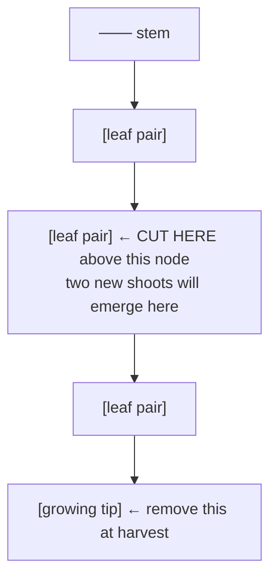
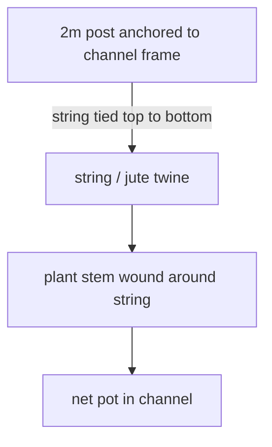

# Guide 06 — Crops
## Per-Crop Growing Guide for Every Plant in This System

[](../../README.md)
[](https://creativecommons.org/licenses/by-nc-sa/4.0/)


---

## Table of Contents

- [How to Use This Guide](#how-to-use-this-guide)
- [Quick Reference — Zone, Channel & Crop Map](#quick-reference-zone-channel-crop-map)
- [LEAFY GREENS & HERBS (Zone A — NFT Channels)](#leafy-greens-herbs-zone-a-nft-channels)
  - [LETTUCE — Butter, Romaine, Loose-Leaf](#lettuce-butter-romaine-loose-leaf)
  - [SPINACH](#spinach)
  - [KALE](#kale)
  - [BASIL (Sweet / Thai / Purple)](#basil-sweet-thai-purple)
  - [CILANTRO / CORIANDER](#cilantro-coriander)
  - [MINT](#mint)
  - [CHIVES](#chives)
  - [PARSLEY (Flat-Leaf / Curly)](#parsley-flat-leaf-curly)
- [FRUITING CROPS (Zone A — CH4, Wide Channel)](#fruiting-crops-zone-a-ch4-wide-channel)
  - [CHERRY TOMATOES](#cherry-tomatoes)
  - [PEPPERS (Sweet Bell / Chilli)](#peppers-sweet-bell-chilli)
  - [STRAWBERRIES](#strawberries)
- [MICROGREENS (Zone B — Tray Station)](#microgreens-zone-b-tray-station)
  - [MICROGREENS — General Protocol](#microgreens-general-protocol)
  - [Equipment & Supplies](#equipment-supplies)
  - [Individual Crop Profiles](#individual-crop-profiles)
  - [Per-Tray Yield Estimates](#per-tray-yield-estimates)
  - [Succession Schedule — Staggered Production](#succession-schedule-staggered-production)
  - [Harvest](#harvest)
  - [Microgreens Troubleshooting](#microgreens-troubleshooting)
- [ROOT VEGETABLES (Zone C — Grow Bags)](#root-vegetables-zone-c-grow-bags)
  - [RADISHES](#radishes)
  - [CARROTS](#carrots)
  - [BEETROOT](#beetroot)
- [Crop Rotation and Succession Planning](#crop-rotation-and-succession-planning)
  - [Zone C — Root Vegetable Succession Planting](#zone-c-root-vegetable-succession-planting)
  - [Succession Planting Schedule (CH1 — Lettuce Example)](#succession-planting-schedule-ch1-lettuce-example)
  - [NFT Channel Rotation Between Seasons](#nft-channel-rotation-between-seasons)

---


## How to Use This Guide

Each crop entry includes:
- **Zone & System:** Where it grows in this setup
- **Conditions:** EC, pH, temperature, light
- **Timeline:** Days to germination and harvest
- **Spacing:** In-channel or bag spacing
- **Harvest method:** Cut-and-come-again or full pull
- **Common problems:** Specific to this crop
- **Succession planting:** How to maintain continuous supply

> **First-season expectations:** Timelines and yields listed below assume a reasonably tuned system with stable EC/pH. In your first season, expect slower growth, more crop losses, and lower yields as you learn your system's behaviour. This is normal — see Guide 12 Section 10 for realistic first-season yield adjustments (typically 40–60% of listed figures).

[↑ Back to TOC](#table-of-contents)

---


## Quick Reference — Zone, Channel & Crop Map

| Zone | Channel | Channel Size | Crops | Net Pot Size | Plant Sites |
|------|---------|-------------|-------|-------------|-------------|
| **A — NFT** | CH1 | 75 mm square PVC | Lettuce (butter, romaine, loose-leaf) | 50 mm | 11 |
| **A — NFT** | CH2 | 75 mm square PVC | Herbs (basil, cilantro, chives, parsley) | 50 mm | 11 |
| **A — NFT** | CH3 | 75 mm square PVC | Spinach, kale, mint | 50 mm | 11 |
| **A — NFT** | CH4 | 100 mm square PVC | Tomatoes, peppers, strawberries | 75 mm | 7 |
| **B — Trays** | — | 25×50 cm trays | Microgreens (sunflower, pea, radish, broccoli, amaranth, wheatgrass) | — | — |
| **C — Grow bags** | — | 40 L grow bags | Radishes, carrots, beetroot | — | — |

> **Total NFT plant sites: ~40** (33 in 75 mm channels + 7 in 100 mm channel). All channels are 2.4 m long with a 1:30 slope (80 mm drop). The system runs on an 80 L reservoir with a 600–800 L/h submersible pump delivering 1–2 L/min per channel.

[↑ Back to TOC](#table-of-contents)

---


## LEAFY GREENS & HERBS (Zone A — NFT Channels)

---

### LETTUCE — Butter, Romaine, Loose-Leaf

**Zone:** CH1 | **Net Pot:** 50mm | **System:** NFT

| Parameter | Value |
|-----------|-------|
| EC | 0.8–1.6 mS/cm |
| pH | 5.5–6.5 (aim 6.0) |
| Air Temperature | 15–24°C (ideal 18–22°C) |
| Water Temperature | 18–22°C |
| Light (DLI) | 12–17 mol/m²/day |
| Min Sun Hours | 4–6 hours |

**Timeline:**
```
  Germination:    3–7 days (20°C, darkness)
  Seedling ready: 10–14 days after germination (2–3 true leaves, roots emerging)
  Transplant → harvest: 21–35 days (loose-leaf) / 35–50 days (head lettuce)
  Total seed-to-harvest: 5–8 weeks
```

**Spacing in channel:** 20cm between plants (12 plants per 2.4m channel)

**Varieties for outdoor NFT:**
- **Loose-leaf:** Oak leaf, Red Sails, Black Seeded Simpson — fastest, cut-and-come-again capable
- **Butter:** Tom Thumb, Buttercrunch — heads 30–40 days, very popular
- **Romaine:** Little Gem — compact, sweet, excellent outdoors
- **Bolt-resistant for summer:** Jericho (romaine), Nevada, Ithaca — critical if growing through warm weather

**Harvest method:**
- **Loose-leaf:** Cut outer leaves at 2–3cm from stem base — plant regrows. Harvest every 5–7 days.
- **Head lettuce:** Pull entire plant (roots and all) when head is firm. Replace net pot immediately with a new seedling.

**Succession planting:** Start new seeds every 2–3 weeks to maintain continuous supply. Stagger 4–6 plants at different stages at all times.

**Common problems:**
- **Bolting** (sending up a seed stalk): Triggered by temperatures above 24°C and/or long days. Switch to bolt-resistant varieties or shade in summer. Bolted lettuce tastes bitter — harvest immediately before/as bolt begins.
- **Tip burn** (brown leaf edges): Usually NOT a lack of calcium in the solution — caused by heat-driven transpiration outpacing calcium transport through the xylem to leaf margins. Worsened by low humidity, poor airflow, and high EC. Fix: add shade, increase airflow, lower EC, ensure good root aeration. Choose resistant varieties (Jericho, Nevada). See guide/09 Section B2 and guide/10 Section 4.
- **Slimy root zone:** Pythium root rot — caused by warm water. Reduce reservoir temp, treat with H₂O₂ (see guide/07).
- **Pale/yellowing leaves:** Nitrogen deficiency or pH out of range. Test and adjust.

---

### SPINACH

**Zone:** CH3 | **Net Pot:** 50mm | **System:** NFT

| Parameter | Value |
|-----------|-------|
| EC | 1.4–2.0 mS/cm |
| pH | 6.0–7.0 (accepts slightly higher pH than lettuce) |
| Air Temperature | 10–21°C (ideal 15–18°C) — COOL SEASON crop |
| Light (DLI) | 12–16 mol/m²/day |
| Min Sun Hours | 4–6 hours |

**Timeline:**
```
  Germination:    7–14 days (cooler than other crops — prefers 10–15°C to germinate)
  Seedling ready: 14–21 days
  Harvest:        40–55 days from seed
```

**Spacing:** 15–20cm

**Varieties:** Bloomsdale Long Standing (slow-bolt), Tyee (bolt-resistant hybrid), Corvair

**Harvest:** Outer leaves cut-and-come-again, or full plant. Responds well to cut-and-come-again.

**Season:** **Spring and autumn only** — spinach is very cold-tolerant (can handle light frost) but bolts rapidly in summer heat above 24°C. Best seasons: March–May and September–November.

**Common problems:**
- **Bolting in heat:** Spinach is extremely sensitive to heat and long days. Do not grow through summer outdoors without shade.
- **Yellow leaves:** Often magnesium deficiency — spinach has higher Mg needs than lettuce. Supplement with Epsom salt.
- **Poor germination:** Spinach seeds germinate better in cool conditions (10–15°C). Sow in autumn or refrigerate seeds for 24h before spring sowing to break dormancy.

---

### KALE

**Zone:** CH3 | **Net Pot:** 50mm | **System:** NFT

| Parameter | Value |
|-----------|-------|
| EC | 1.5–2.5 mS/cm |
| pH | 5.5–6.5 |
| Air Temperature | 10–30°C (very hardy — tolerates frost) |
| Light (DLI) | 15–20 mol/m²/day |
| Min Sun Hours | 6–8 hours |

**Timeline:**
```
  Germination:    4–7 days
  Seedling ready: 14–21 days
  Harvest:        50–75 days from seed, then continuous cut-and-come-again
```

**Spacing:** 25–30cm (kale gets large — fewer plants per channel)

**Varieties:** Dwarf Blue Curled (compact, ideal for NFT), Cavolo Nero (black Tuscan kale), Red Russian (sweet)

**Harvest:** Always cut outer leaves first — the growing centre continues to produce. Each plant can produce for 3–4 months with regular harvesting.

**Season:** Year-round in temperate climates. Kale actually **improves in flavour after light frost** — cold converts starches to sugars. One of the most productive crops for this system.

**Common problems:**
- **Aphids:** Kale is a favourite target. Check undersides of leaves regularly. See guide/07.
- **Caterpillars (cabbage white butterfly):** Kale is brassica family — very attractive to cabbage whites. Use netting or Bt spray (see guide/07).

---

### BASIL (Sweet / Thai / Purple)

**Zone:** CH2 | **Net Pot:** 50mm | **System:** NFT

| Parameter | Value |
|-----------|-------|
| EC | 1.0–1.6 mS/cm |
| pH | 5.5–6.5 (aim 6.0) |
| Air Temperature | 18–30°C — WARM SEASON only, cold-sensitive |
| Light (DLI) | 15–20 mol/m²/day |
| Min Sun Hours | 6–8 hours |

**Timeline:**
```
  Germination:    5–10 days (warm — needs 22–25°C minimum)
  Seedling ready: 14–21 days
  Harvest:        28–45 days from seed, then continuous
```

**Spacing:** 15–20cm

**Varieties:** Genovese (classic Italian — best for pesto), Thai (robust, anise flavour), Purple Ruffles (ornamental and culinary), Lemon Basil

**Harvest:** Pinch growing tips above a leaf node (where two new branches will emerge). This encourages bushy growth and delays flowering. Never let basil flower — once flowering starts, leaf production slows and flavour declines.



**Season:** Late May through September (outdoors, temperate). Very frost-sensitive — damage below 10°C, death below 5°C. Start indoors in April, transplant after last frost.

**Common problems:**
- **Cold damage:** Even brief cold nights below 10°C cause black/wilted leaves. Keep covered or delay transplanting until stable warm nights.
- **Yellowing bottom leaves:** Normal as plant matures. Also caused by overwatering (check EC is not too high) or nitrogen deficiency.
- **Bolting to flower:** Inevitable in long hot days — delay by pinching religiously. Some varieties (e.g. Cardinal) are more bolt-tolerant.
- **Root rot:** Basil is particularly susceptible to Pythium in warm water. Ensure reservoir temperature stays below 24°C.

---

### CILANTRO / CORIANDER

**Zone:** CH2 | **Net Pot:** 50mm | **System:** NFT

| Parameter | Value |
|-----------|-------|
| EC | 1.2–1.6 mS/cm |
| pH | 5.5–6.5 |
| Air Temperature | 15–25°C — bolts quickly in heat |
| Light (DLI) | 12–16 mol/m²/day |
| Min Sun Hours | 4–6 hours |

**Timeline:**
```
  Germination:    7–14 days (slow germinators)
  Harvest:        35–55 days from seed
  Window before bolting: 4–6 weeks once established
```

**Spacing:** 10–15cm (smaller plant footprint than basil)

**Trick for germination:** Cilantro seeds are actually two seeds in a husk. Crush lightly between fingers or soak for 24h before sowing to improve germination rate.

**Harvest:** Cut top 1/3 of plant for leaf harvest. Succession planting is essential — cilantro has a short harvestable window before it bolts.

**Season:** Spring and autumn are ideal. Summer growing is possible with partial shade and bolt-resistant varieties (Leisure, Calypso).

**Uses for bolted plants:** When cilantro bolts, it produces coriander seeds — a valuable spice in their own right. Allow one or two plants to bolt fully, harvest dried seed heads.

**Common problems:**
- **Bolting very quickly:** This is normal behaviour — plant fewer per channel at once and succession sow every 2–3 weeks instead.
- **Slow germination:** See note on seed crushing above.

---

### MINT

**Zone:** CH3 | **Net Pot:** 50mm | **System:** NFT

| Parameter | Value |
|-----------|-------|
| EC | 1.2–1.6 mS/cm |
| pH | 5.5–6.5 |
| Air Temperature | 15–25°C (tolerates wider range) |
| Light (DLI) | 12–16 mol/m²/day |
| Min Sun Hours | 4–6 hours (tolerates partial shade) |

**Timeline:**
```
  Germination:    7–14 days (or propagate from cuttings — faster)
  Harvest:        3–4 weeks from established plant, then continuous
```

**Spacing:** 20–25cm — mint has vigorous root growth

**Propagation from cuttings (preferred method):**
```
  1. Cut a 10–15cm stem from an existing mint plant
  2. Strip lower leaves
  3. Place stem in a glass of water (or straight into a moist rockwool cube)
  4. Roots emerge in 7–10 days in water
  5. Transfer to net pot with clay pebbles once roots are 2–3cm
```

**Root containment warning:** Mint in NFT will produce very vigorous root mats that can spread to fill the entire channel and block the drain fitting. Check root development weekly for established plants. Trim roots extending beyond the channel drain.

**Harvest:** Cut sprigs to just above a leaf node. Continuous harvest. Very productive crop.

**Common problems:**
- **Root blockage:** As above — monitor regularly.
- **Rust fungus:** Orange-brown pustules on leaves — remove affected leaves immediately, improve airflow, avoid wetting leaves.

---

### CHIVES

**Zone:** CH2 | **Net Pot:** 50mm | **System:** NFT

| Parameter | Value |
|-----------|-------|
| EC | 1.2–1.8 mS/cm |
| pH | 6.0–6.5 |
| Air Temperature | 15–25°C |
| Light (DLI) | 12–16 mol/m²/day |
| Min Sun Hours | 4–6 hours |

**Timeline:**
```
  Germination:    7–14 days
  First harvest:  60–90 days from seed
  Once established: Harvest continuously
```

**Spacing:** 15–20cm. Usually planted as a cluster (4–6 seeds per net pot) for a grass-like clump.

**Harvest:** Cut all leaves at 5cm above base — plant regrows within 2–3 weeks. Very low maintenance.

**Season:** One of the most cold-tolerant herbs — can be grown March through November. Can overwinter with protection.

---

### PARSLEY (Flat-Leaf / Curly)

**Zone:** CH2 | **Net Pot:** 50mm | **System:** NFT

| Parameter | Value |
|-----------|-------|
| EC | 1.2–1.6 mS/cm |
| pH | 5.5–6.5 |
| Air Temperature | 15–25°C |
| Light (DLI) | 12–16 mol/m²/day |
| Min Sun Hours | 4–6 hours |

**Timeline:**
```
  Germination:    14–28 days (very slow — parsley is notorious for slow germination)
  First harvest:  70–90 days from seed
  Then continuous
```

**Spacing:** 15–20cm

**Germination tip:** Soak seeds in warm water for 24h before sowing. Pre-germinating in a damp paper towel (then transfer to rockwool when radicle emerges) dramatically speeds up germination.

**Varieties:** Italian Flat Leaf (stronger flavour), Curled Moss (decorative, milder)

**Harvest:** Cut outer stems at base. Central growth continues. Plant produces for 5–6 months.

**Common problems:**
- **Very slow germination:** Normal — parsley contains inhibitor compounds. Soaking helps.
- **Yellow leaves:** Often iron deficiency from pH too high. Check pH.

---

[↑ Back to TOC](#table-of-contents)

---


## FRUITING CROPS (Zone A — CH4, Wide Channel)

---

### CHERRY TOMATOES

**Zone:** CH4 (wide) | **Net Pot:** 75mm | **System:** NFT

| Parameter | Value |
|-----------|-------|
| EC | 2.0–4.0 mS/cm (increase as fruit develops) |
| pH | 5.5–6.5 (aim 6.0) |
| Air Temperature | 20–28°C (ideal); stress below 15°C, above 32°C |
| Light (DLI) | 25–35 mol/m²/day |
| Min Sun Hours | 8+ hours — critical |

**Timeline:**
```
  Germination:    5–10 days (22–25°C required)
  Seedling ready: 21–28 days
  First flowers:  5–7 weeks from transplant
  First fruit:    10–14 weeks from seed
  Harvest season: 3–4 months continuous harvest
```

**Spacing:** 40–50cm (indeterminate varieties) — only 4–5 plants per 2.4m channel

**Varieties for outdoor NFT:** Tumbling Tom (bush/determinate — no staking needed), Sungold (indeterminate, exceptional flavour), Sweet Million, Black Cherry

**Indeterminate vs Determinate:**
- **Indeterminate:** Grow continuously up a cane/trellis until killed by frost. Higher total yield. Need support.
- **Determinate:** Set fruit all at once on a compact bush. Less support needed. Good for container/NFT.

**Support system:**


**Pollination:** Outdoors, wind and insects handle pollination. In still conditions or under cover, shake the plant gently when in flower, or use an electric toothbrush on flower clusters to release pollen. Poor pollination = blossom drop (see common problems).

**Stage-by-stage EC management:**
- Seedling (transplant to first flower): 2.0–2.5 mS/cm
- Flowering: 2.5–3.0 mS/cm
- Fruiting/harvest: 3.0–4.0 mS/cm
- Note: High EC in fruiting stage concentrates sugars and improves flavour

**Common problems:**
- **Blossom drop:** Flowers fall without setting fruit — temperature extremes (<15°C or >32°C), low humidity, poor pollination. Resolve by hand pollination and temperature management.
- **Blossom end rot:** Dark, sunken scar at fruit base — calcium deficiency caused by pH fluctuation or inconsistent watering. Stabilise EC and pH.
- **Leaf curl:** Normal in heat (defence response). Concerning if accompanied by yellowing.
- **Yellowing lower leaves:** Natural (remove regularly) — or nutrient deficiency if severe and spreading upward.
- **Splitting fruit:** Inconsistent watering/EC — solution temperature and EC spikes crack fruit. Maintain consistency.

---

### PEPPERS (Sweet Bell / Chilli)

**Zone:** CH4 (wide) | **Net Pot:** 75mm | **System:** NFT

| Parameter | Value |
|-----------|-------|
| EC | 1.8–3.5 mS/cm |
| pH | 5.5–6.5 |
| Air Temperature | 20–30°C (requires warmth — more heat-demanding than tomatoes) |
| Light (DLI) | 25–35 mol/m²/day |
| Min Sun Hours | 8+ hours |

**Timeline:**
```
  Germination:    10–21 days (needs 25–30°C — slowest germinators in this system)
  Seedling ready: 4–6 weeks
  First flowers:  8–10 weeks from transplant
  First fruit (green): 12–16 weeks from seed
  Ripe coloured fruit:  16–22 weeks from seed

  IMPORTANT: Start seeds EARLY — late February / early March indoors — to allow
  enough time for fruit ripening before first autumn frost.
```

**Spacing:** 35–45cm

**Varieties:**
- **Sweet bell:** Californian Wonder, Lamuyo, Lipstick — large fruit, slow to ripen
- **Mini sweet:** Baby Bell mix — smaller fruit, faster production
- **Chilli:** Cayenne (fast, prolific), Jalapeño (compact, reliable), Anaheim

**Support:** Less demanding than tomatoes but still benefit from a central stake when laden with fruit.

**Pollination:** As per tomatoes — wind/insect outdoors, manual shaking in still conditions.

**Common problems:**
- **Flower drop:** Most common problem — peppers are highly sensitive to temperature fluctuations. Below 15°C at night causes rapid flower drop. Protect with fleece.
- **Slow growth:** Peppers are naturally slower than tomatoes. Do not over-fertilise trying to speed them up — this causes vegetative lush growth at expense of fruiting.
- **Thin walls (small fruit):** Usually insufficient light or below-optimal temperature. Ensure 8+ hours full sun.
- **Blossom end rot:** Same as tomatoes — calcium deficiency, pH instability.

---

### STRAWBERRIES

**Zone:** CH4 (wide) — dedicated section or own channel | **Net Pot:** 75mm | **System:** NFT

| Parameter | Value |
|-----------|-------|
| EC | 1.2–2.0 mS/cm (higher EC during fruiting concentrates flavour) |
| pH | 5.5–6.5 (slightly more acidic than tomatoes — aim 5.8–6.0) |
| Air Temperature | 15–25°C (ideal); tolerates 10–30°C |
| Light (DLI) | 20–30 mol/m²/day |
| Min Sun Hours | 6–8 hours |

**Timeline:**
```
  From bare-root crowns:    First fruit 6–10 weeks
  From runners:             First fruit 4–8 weeks
  From seed:                8–12 months (not recommended — buy crowns or runners)

  Everbearing varieties:    Fruit June–October continuously
  June-bearing varieties:   Fruit 4–6 weeks in June/July only (avoid for NFT)
```

**Recommended variety:** **Everbearing/day-neutral** — Albion, Seascape, Evie 2, Flamenco. These produce fruit regardless of day length, giving continuous harvest through summer and autumn.

**Planting method:**
- Source **bare-root crowns** or **runners** from a garden centre or online in spring
- No need to germinate from seed
- Place crown in 75mm net pot with clay pebbles — roots should hang down into channel
- The crown (growing tip) must remain ABOVE the water level — never submerge it

**Runner management:**
```
  Strawberries produce runners — long stolons that produce new baby plants.
  In NFT, these will hang out of the channel and try to root anywhere.

  OPTIONS:
  1. Remove runners immediately to direct energy to fruit production (maximises yield)
  2. Root runners in small pots of coco coir — free new plants for next season
  3. Do not let runners root back into the NFT channel or they will clog it
```

**Fruiting EC management:**
- Vegetative phase: EC 1.2–1.5 mS/cm
- Flowering/fruiting: Increase to 1.6–2.0 mS/cm (slightly elevated EC stresses the plant mildly, concentrating sugars — improves sweetness)

**Common problems:**
- **Grey mould (Botrytis):** Most common strawberry disease — grey fuzzy mould on fruit and leaves. Caused by high humidity and poor airflow. Remove infected fruit and leaves immediately, improve spacing and ventilation.
- **Crown rot:** Pythium/Phytophthora — caused by crown being submerged in water. Ensure crown is above the film level.
- **Slugs and snails:** Outdoor strawberries are prime targets. Copper tape around frame legs or iron phosphate bait.
- **Aphids:** Common on flower stems. Insecticidal soap spray.
- **Poor fruit set:** Insufficient pollination or temperature below 15°C. Check for bee/insect activity.

---

[↑ Back to TOC](#table-of-contents)

---


## MICROGREENS (Zone B — Tray Station)

---

### MICROGREENS — General Protocol

Microgreens are harvested at the seedling stage (7–14 days) when cotyledons are fully open and the first true leaves are just emerging. They are among the most nutrient-dense foods per gram of any crop — studies show they contain 4–40× the nutrient concentration of mature plants.

### Equipment & Supplies

```
  ZONE B EQUIPMENT LIST:

  Trays:           4–6 standard 25×50 cm propagation trays (no drainage holes)
  Drain trays:     4–6 matching trays WITH drainage holes (nest inside the solid trays)
  Humidity domes:  2–3 clear plastic domes (for blackout/germination phase)
  Growing media:   Coco coir — fine grade, pre-buffered
                   Budget ~2–3 kg per month at full production
  Spray bottle:    1 × fine mist, for initial watering before germination
  Scissors:        Sharp kitchen scissors or microgreens harvesting shears
  Scale:           Digital kitchen scale for seed weighing (0.1 g resolution)
  Labels:          Waterproof plant labels or masking tape + marker
  Storage:         Shallow containers + damp paper towel for fridge storage
```

**Media:** Coco coir, 2–3 cm depth in a 25×50 cm tray
**Watering:** Bottom watering preferred once growing (prevents mould from overhead watering)
**No nutrient solution needed** — seeds contain sufficient reserves for the short microgreens lifecycle. Plain pH-adjusted water (pH 6.0) is sufficient.

### Individual Crop Profiles

| Crop | Soak Seeds | Germination | Light Days | Harvest Day | Flavour | Seed Density |
|------|-----------|------------|-----------|-------------|---------|-------------|
| **Sunflower shoots** | 4–8h | 1–2 days | 5–7 days | 10–14 days | Nutty, crunchy | 250g/tray |
| **Pea shoots** | 4–8h | 1–2 days | 4–6 days | 8–12 days | Sweet, fresh | 200g/tray |
| **Radish** | No | 1 day | 3–5 days | 6–10 days | Spicy, peppery | 30g/tray |
| **Broccoli** | No | 1 day | 3–5 days | 7–10 days | Mild, earthy | 15g/tray |
| **Amaranth** | No | 1–2 days | 4–6 days | 8–12 days | Earthy, mild | 8g/tray |
| **Wheatgrass** | 8–12h | 1–2 days | 6–8 days | 10–14 days | Sweet, grassy | 250g/tray |

### Per-Tray Yield Estimates

> **Note:** These are established-grower yields. First-time microgreens growers typically achieve 50–70% of these figures while learning seed density, watering, and harvest timing. Yields improve quickly — most growers hit full potential by their 3rd–4th tray cycle.

```
  EXPECTED YIELD PER TRAY (25×50 cm):

  Crop              Seed input    Harvest yield    Yield ratio    Cost/tray (seed only)
  ──────────────────────────────────────────────────────────────────────────────────────
  Sunflower shoots  250 g         300–400 g        1.2–1.6×       $1.50–$2.50
  Pea shoots        200 g         250–350 g        1.2–1.8×       $1.00–$2.00
  Radish            30 g          150–200 g        5–7×           $0.50–$1.00
  Broccoli          15 g          100–150 g        7–10×          $1.00–$2.00
  Amaranth          8 g           80–120 g         10–15×         $0.50–$1.00
  Wheatgrass        250 g         300–400 g        1.2–1.6×       $0.50–$1.00

  Coco coir cost per tray: ~$0.30–$0.50

  RETAIL VALUE (supermarket equivalent):
  Microgreens retail at $30–$80/kg depending on variety.
  A single tray of radish microgreens (150 g) ≈ $5–$12 retail value.
  At 2 trays/week, Zone B produces ~$10–$25/week in retail-equivalent greens.
```

### Succession Schedule — Staggered Production

```
  GOAL: Continuous microgreens harvest, 2–3 trays per week

  Run 4–6 trays in rotation, staggered by 3–4 days:

  Day 1:  Sow Tray 1 (radish) — blackout
  Day 4:  Sow Tray 2 (pea shoots) — blackout
          Tray 1 → move to light
  Day 7:  Sow Tray 3 (sunflower) — blackout
          Tray 2 → move to light
          Tray 1 → harvest (radish, 6–8 day crop)
  Day 10: Sow Tray 4 (broccoli) — blackout
          Tray 3 → move to light
          Tray 2 → harvest (pea shoots, 8–10 day crop)
  Day 14: Tray 3 → harvest (sunflower, 10–14 day crop)
          Clean and resow Trays 1 & 2

  Result: Harvesting every 3–4 days once the rotation is established.
  Ramp up slowly — start with 2 trays and add more as you build confidence.
```

### Harvest

Cut at soil level with sharp scissors. Rinse, spin or pat dry. Eat immediately or store in the fridge for 3–5 days.

After harvest, remove spent root mat from tray, compost, clean tray, and resow.

### Microgreens Troubleshooting

| Problem | Cause | Fix |
|---------|-------|-----|
| **White fuzzy mould on surface** | Too much moisture + poor airflow during blackout phase | Reduce misting frequency; ensure humidity dome is cracked slightly for airflow; spray with dilute hydrogen peroxide (3%, 1:10 with water) if mould appears |
| **Leggy, pale, stretched seedlings** | Blackout phase too long, or insufficient light after uncovering | Move to light promptly after 3–4 days; if growing indoors, use a grow light 15–20 cm above trays |
| **Uneven germination (patchy tray)** | Uneven seed distribution, dry spots, or old seed | Spread seeds evenly by hand; ensure media is uniformly moist before sowing; test seed viability — old seeds germinate poorly |
| **Seeds rotting instead of germinating** | Waterlogged media, especially with large seeds (sunflower, pea) | Use drain trays to prevent standing water; pre-soak large seeds but do not submerge media; ensure good drainage |
| **Bitter or strong off-flavour** | Harvested too late (true leaves well developed) or heat stress | Harvest earlier — when cotyledons are fully open but before true leaves exceed 1 cm; keep trays below 25°C |
| **Slimy stems at base** | Bacterial growth from bottom watering standing too long | Do not leave trays sitting in water for more than 30 minutes; ensure trays drain fully |

---

[↑ Back to TOC](#table-of-contents)

---


## ROOT VEGETABLES (Zone C — Grow Bags)

---

### RADISHES

**Zone:** C | **Container:** 20L grow bag | **System:** Coco/perlite/vermiculite media

| Parameter | Value |
|-----------|-------|
| EC | 1.2–2.0 mS/cm |
| pH | 6.0–6.5 |
| Air Temperature | 10–23°C — cool-season crop |
| Light (DLI) | 15–20 mol/m²/day |
| Min Sun Hours | 6–8 hours |

**Timeline:**
```
  Germination:   3–5 days
  Harvest:       22–30 days from seed (fastest vegetable in this system)
  Best seasons:  March–May and September–October
```

**Spacing:** 5cm between plants, 5–8cm depth for sowing

**Varieties:** Cherry Belle (round, classic), French Breakfast (elongated, mild), Watermelon (pink interior), Daikon (long white Japanese — needs 30L deep bag)

**Sowing:** Direct sow into grow bags (no transplanting — radishes dislike root disturbance). Thin seedlings to 5cm spacing once established.

**Harvest:** Pull entire root when shoulder (top of root) is visible at soil line and reaches expected size (2–4cm for small varieties). Over-ripe radishes become pithy and hot.

**Common problems:**
- **Pithy/hollow radishes:** Left in ground too long. Harvest promptly.
- **All tops, small roots:** Too much nitrogen, not enough light, or overcrowding. Thin properly.
- **Bolting:** Summer heat. Radishes are cool-season only.

---

### CARROTS

**Zone:** C | **Container:** 30L deep grow bag | **System:** Coco/perlite/vermiculite media

| Parameter | Value |
|-----------|-------|
| EC | 1.0–1.8 mS/cm |
| pH | 6.0–6.5 |
| Air Temperature | 15–25°C (ideal 18–20°C) |
| Light (DLI) | 15–20 mol/m²/day |
| Min Sun Hours | 6 hours |
| Media depth needed | 30–40cm minimum |

**Timeline:**
```
  Germination:   10–21 days (slow and erratic — keep media moist throughout)
  Harvest:       65–80 days from seed (shorter varieties), 70–90 days (long types)
```

**Spacing:** 5–8cm between plants

**Varieties for grow bags:** Chantenay Red Core (short, tapered — excellent for containers), Paris Market (round, ideal for shallow bags), Nantes (medium length, sweet)

**Sowing:** Direct sow (carrots dislike transplanting). Sow seeds thinly in rows, cover with 5mm of media. Keep consistently moist for 2 weeks (critical — drying out during germination kills emerging seedlings).

**Thinning:**
```
  Stage 1: When seedlings reach 3cm tall — thin to 2cm spacing
  Stage 2: When seedlings reach 5cm tall — thin to 5–8cm spacing
  Thinned seedlings can be eaten as microgreens/baby leaves.
  DO NOT skip thinning — crowded carrots produce forked/deformed roots.
```

**Fertigation:** As listed in zones.md — manual watering with nutrient solution. Water when top 2–3cm of media begins to dry out.

**Harvest:** Begin checking when shoulder (carrot top) is visible at media surface. Pull one test carrot to check size. Harvest when roots reach desired size — 1–2cm diameter for Chantenay, 3–5cm for Nantes. Do not leave in ground past maturity — carrots crack and turn pithy.

**Common problems:**
- **Forked/split roots:** Obstacle in media (rock, compacted zone), inconsistent watering, or late-season dry spell. Use fine, uniform coco mix and water consistently.
- **Green shoulders:** Top of carrot exposed to light turns green and bitter — cover media over the shoulder as carrots develop.
- **Slow germination:** Normal — keep media moist for 14–21 days without fail. Cover tray with plastic wrap during germination to retain moisture.

---

### BEETROOT

**Zone:** C | **Container:** 20L grow bag | **System:** Coco/perlite/vermiculite media

| Parameter | Value |
|-----------|-------|
| EC | 1.5–2.5 mS/cm |
| pH | 6.0–7.0 (more alkaline tolerant than other crops) |
| Air Temperature | 15–25°C |
| Light (DLI) | 15–20 mol/m²/day |
| Min Sun Hours | 6 hours |

**Timeline:**
```
  Germination:   5–10 days
  Harvest:       50–70 days from seed
```

**Spacing:** 8–10cm

**Varieties:** Boltardy (bolt-resistant, ideal for outdoor), Detroit Dark Red (classic), Chioggia (candy-stripe interior, Italian heirloom)

**Seed note:** What looks like one beetroot seed is actually a cluster of 2–4 seeds. Each cluster will produce 2–4 seedlings — thin to one per cluster.

**Harvest:** Pull when golf ball to tennis ball size (5–8cm diameter). Both roots AND leaves are edible — baby beet leaves are excellent in salads.

**Common problems:**
- **Leggy seedlings:** Insufficient light during germination. Move to full light promptly once seeds sprout.
- **Purple/red stems and wilting:** This is normal beetroot appearance — do not confuse with phosphorus deficiency (which affects the leaves uniformly).

[↑ Back to TOC](#table-of-contents)

---


## Crop Rotation and Succession Planning

### Zone C — Root Vegetable Succession Planting

Root vegetables in grow bags benefit from staggered sowing to maintain a continuous harvest rather than a single glut followed by nothing.

```
  ZONE C SUCCESSION SCHEDULE:

  RADISHES (25–35 day crop — fastest turnaround):
    Sow a new batch every 2–3 weeks.
    With 2 grow bags dedicated to radishes, alternate:
      Bag 1: Sow Week 1 → harvest Week 4–5 → resow immediately
      Bag 2: Sow Week 3 → harvest Week 7–8 → resow immediately
    Result: Harvesting radishes every 2–3 weeks continuously.
    Final sowing: 5 weeks before your expected first frost.

  CARROTS (70–80 day crop — plan 2–3 successions per season):
    Sow second batch when the first batch reaches the 4-week stage
    (seedlings established, first true leaves visible).
      Batch 1: Sow Week 1 → harvest Week 10–12
      Batch 2: Sow Week 4–5 → harvest Week 14–17
      Batch 3: Sow Week 9–10 → harvest Week 19–22
    Thin to 5 cm spacing when seedlings are 5 cm tall — do not skip this step.
    Late-sown carrots can be left in bags and harvested through early winter
    if protected with fleece.

  BEETROOT (55–70 day crop — plan 2–3 successions):
    Sow second batch when first batch is 3–4 weeks old.
      Batch 1: Sow Week 1 → harvest Week 8–10
      Batch 2: Sow Week 4 → harvest Week 12–14
      Batch 3: Sow Week 8 → harvest Week 16–18
    Remember: each beetroot "seed" is a cluster — thin to 1 plant per 10 cm.
    Harvest baby beets early (5 cm) for salads, or leave to full size (8 cm).

  TIP: Label each sowing with the date using waterproof markers on plant tags.
  This removes guesswork about when each batch is ready.
```

### Succession Planting Schedule (CH1 — Lettuce Example)

```
  GOAL: 4+ lettuce heads per week continuously through the season

  SETUP: 12 plant sites in CH1, stagger in 3 groups of 4:

  Week 1: Plant Group A (sites 1–4) — Buttercrunch
  Week 3: Plant Group B (sites 5–8) — Loose-leaf
  Week 5: Plant Group C (sites 9–12) — Romaine

  Week 7: Harvest Group A (7 weeks old) → immediately replant with new seedlings
  Week 9: Harvest Group B → replant
  Week 11: Harvest Group C → replant
  ...and so on through the season.

  Result: Harvesting one group of 4 plants every 2 weeks = ~4 heads/fortnight minimum.
```

### NFT Channel Rotation Between Seasons

After a full channel crop completes:
1. Remove all plants and net pots
2. Full channel flush and sterilise (see guide/08)
3. Clean and re-pH clay pebbles
4. Fresh rockwool cubes for next crop
5. Start new seedlings in parallel (always have seedlings ready to transplant when a site opens)

---


*Next: [`guide/nft/07-pests-and-disease.md`](07-pests-and-disease.md) — Identification, treatment, and IPM*

[↑ Back to TOC](#table-of-contents)

---

<!-- copyright -->
*Copyright (c) 2026 UncleJS. Licensed under [CC BY-NC-SA 4.0](https://creativecommons.org/licenses/by-nc-sa/4.0/) — free to share and adapt for non-commercial purposes with attribution and ShareAlike.*
