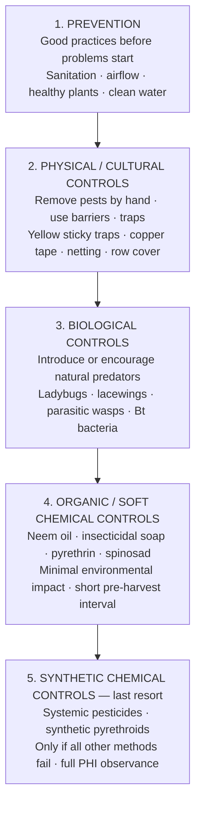
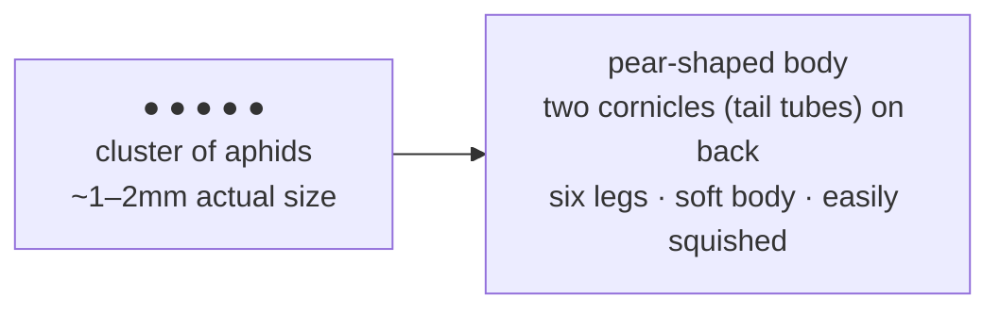
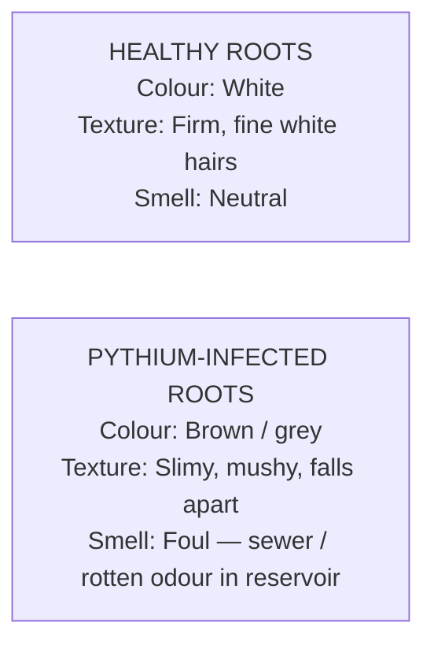

# Guide 07 — Pests and Disease
## Identification, Treatment, IPM, and Prevention

---

## Table of Contents

- [1. The Outdoor NFT Vulnerability Profile](#1-the-outdoor-nft-vulnerability-profile)
- [2. Integrated Pest Management (IPM) Framework](#2-integrated-pest-management-ipm-framework)
  - [Scouting Protocol](#scouting-protocol)
- [3. Common Pests](#3-common-pests)
  - [APHIDS](#aphids)
  - [FUNGUS GNATS (Bradysia spp.)](#fungus-gnats-bradysia-spp)
  - [SPIDER MITES (Tetranychus urticae)](#spider-mites-tetranychus-urticae)
  - [WHITEFLIES](#whiteflies)
  - [SLUGS AND SNAILS](#slugs-and-snails)
  - [CATERPILLARS / MOTHS](#caterpillars-moths)
  - [THRIPS](#thrips)
- [4. Common Diseases](#4-common-diseases)
  - [PYTHIUM ROOT ROT](#pythium-root-rot)
  - [POWDERY MILDEW](#powdery-mildew)
  - [BOTRYTIS (GREY MOULD)](#botrytis-grey-mould)
  - [FUSARIUM WILT](#fusarium-wilt)
  - [DOWNY MILDEW](#downy-mildew)
  - [DAMPING OFF](#damping-off)
- [5. Pesticide Pre-Harvest Interval (PHI) Reference](#5-pesticide-pre-harvest-interval-phi-reference)
- [6. Beneficial Insects: Attracting and Using Them](#6-beneficial-insects-attracting-and-using-them)
  - [Naturally Occurring Beneficials (Attract to Your Garden)](#naturally-occurring-beneficials-attract-to-your-garden)
  - [Purchased Biological Controls](#purchased-biological-controls)
- [7. Sterilisation Protocol After Disease Outbreak](#7-sterilisation-protocol-after-disease-outbreak)


[↑ Back to TOC](#table-of-contents)

## 1. The Outdoor NFT Vulnerability Profile

Growing outdoors exposes your system to the full range of garden pests and diseases. However, hydroponics has a different risk profile than soil growing:

**Lower risk than soil:**
- No soil-borne insects (wireworms, vine weevil larvae, nematodes)
- No soil-borne diseases (clubroot, Fusarium in soil — though Fusarium can still enter via water)
- Easier to spot problems early (plants are visible, accessible)

**Higher risk than indoor hydroponics:**
- Exposed to flying insects, crawling pests, airborne fungal spores
- Weather variability creates stress that lowers plant resistance
- Rain can splash pathogens from one part of the system to another
- Beneficial insects are present but so are destructive ones

**The recirculating water system risk:** Pathogens that enter your reservoir can spread to every plant on the system within hours. A single infected plant can infect all others via the shared nutrient solution. **Early identification and immediate action is critical.**

---


[↑ Back to TOC](#table-of-contents)

## 2. Integrated Pest Management (IPM) Framework

IPM is a systematic, evidence-based approach to pest management that prioritises prevention, monitoring, and targeted intervention — minimising chemical use while maximising effectiveness.



### Scouting Protocol

**Scout (inspect) your plants at least every 2–3 days.** Most pest infestations start small and are easily controlled if caught early; a week of neglect can turn a manageable problem into a crisis.

```
  DAILY SCOUT CHECKLIST (2 minutes):
  [ ] Check undersides of leaves on 3–4 plants per channel (where pests hide)
  [ ] Check stem bases and net pot areas for crawling insects
  [ ] Look for webbing (spider mites), sticky residue (aphids), or holes (caterpillars)
  [ ] Check yellow sticky traps (count insects — track trends)
  [ ] Smell the reservoir water (musty = algae or bacteria)
```

---


[↑ Back to TOC](#table-of-contents)

## 3. Common Pests

---

### APHIDS

**Identification:**
- Tiny (1–3mm) soft-bodied insects — green, black, white, or pink depending on species
- Found in clusters on growing tips, undersides of leaves, and stems
- Leaves may curl, yellow, or become sticky (from aphid honeydew excretion)
- Sticky black "sooty mould" may develop on honeydew residue



**Lifecycle:** Aphids reproduce asexually (females produce live young without mating) in warm conditions, creating explosive populations in days. A single aphid can produce 80 offspring per week.

**Damage:**
- Suck plant sap — weakens growth
- Excrete honeydew — attracts sooty mould, attracts ants (who farm aphids)
- Can transmit plant viruses

**Treatment escalation:**
```
  Level 1 — Physical (first response):
  ● Blast off with a strong jet of water (knock aphids off plant — they cannot return)
  ● Hand-pick heavily infested tips and dispose of in sealed bag (not compost)

  Level 2 — Soap spray:
  ● Insecticidal soap: 5ml castile soap per 1L water in a spray bottle
  ● Coat all surfaces, especially undersides of leaves
  ● Repeat every 3–5 days for 2–3 applications
  ● Note: soap can damage young leaves if too concentrated — test on one leaf first

  Level 3 — Neem oil:
  ● Mix 2ml neem oil + 1ml liquid soap (emulsifier) in 1L water
  ● Spray all plant surfaces — coats insects and prevents feeding/reproducing
  ● Apply in morning (avoid hot midday application — can burn leaves)
  ● Repeat every 5–7 days

  Level 4 — Biological:
  ● Introduce Aphidius colemani (parasitic wasp — lays eggs in aphids, larvae kill them)
  ● Release ladybugs (Adalia bipunctata) — each adult eats 50+ aphids per day
  ● Lacewings (Chrysoperla carnea) — larvae are voracious aphid predators
  ● Available from biological control suppliers; release in cool morning/evening

  Level 5 — Pyrethrin spray (if outbreak is severe and biologicals fail):
  ● Pyrethrin (from chrysanthemum flowers) — fast knockdown, breaks down in 1–2 days
  ● PHI: 0 days (can harvest same day — verify on product label)
  ● Kills beneficials too — use as last resort
```

**Prevention:**
- Grow companion plants near the system: nasturtiums (aphid trap plants), marigolds, chives
- Encourage natural predators: leave some clover/flowers nearby for wasps and ladybugs
- Inspect transplants carefully before introducing to the system

---

### FUNGUS GNATS (Bradysia spp.)

**Identification:**
- Tiny black flies (2–3mm) flying around media and soil
- Larvae (white, 5mm, black head) live in moist media and damage roots
- Plants may show unexplained wilting and yellowing despite good nutrient solution

**Damage:**
- Larvae chew through roots — creates entry points for root pathogens
- In NFT the channel itself is not vulnerable (no media) but net pot clay pebbles and rockwool cubes can harbour larvae in the moist media zone

**Treatment:**
```
  Level 1 — Yellow sticky traps:
  ● Hang yellow sticky cards near media level — catches adults (reduces breeding population)
  ● Check weekly — replace when covered

  Level 2 — Let media dry slightly:
  ● Fungus gnat larvae need moist conditions to survive
  ● In NFT channels: reduce or stop top-watering the net pot media (the film alone
    wets the roots) — let the upper media dry between reservoir top-ups
  ● In grow bags: allow surface 2cm to dry between waterings

  Level 3 — Bti (Bacillus thuringiensis var. israelensis):
  ● Bti is a naturally occurring bacteria that kills diptera larvae (fungus gnats, mosquitoes)
  ● Available as "Gnatrol" or "Gnatex" — mix into irrigation water
  ● Apply as drench to media in net pots and grow bags
  ● Safe for plants, humans, and beneficial insects
  ● Repeat weekly for 3–4 applications

  Level 4 — Beneficial nematodes (Steinernema feltiae):
  ● Microscopic worms applied as soil/media drench
  ● Actively seek and parasitise fungus gnat larvae
  ● Available from biological control suppliers — apply to moist media
  ● Requires consistent moisture to stay viable

  Level 5 — Diatomaceous earth (DE):
  ● Apply food-grade DE as a thin layer on top of media in net pots
  ● Cuts through the soft bodies of adult gnats and larvae
  ● Re-apply after watering (DE is effective only when dry)
```

---

### SPIDER MITES (Tetranychus urticae)

**Identification:**
- Tiny (0.5mm) eight-legged mites — not insects
- Found on undersides of leaves — look for fine webbing and tiny moving dots
- Leaves develop stippled/bronze appearance (thousands of feeding puncture marks)
- In severe infestations, leaves look bleached and papery

**Triggers:** Hot, dry conditions — spider mites thrive in low humidity and heat. The outdoor system is vulnerable during summer heat waves.

**Treatment:**
```
  Level 1 — Water spray:
  ● Strong water jet on undersides of leaves — disrupts and kills mites
  ● Repeat daily for 5–7 days

  Level 2 — Humidity increase:
  ● Mites hate humidity above 60%
  ● Misting the plant canopy (not the reservoir) reduces mite pressure
  ● Shade cloth also reduces heat stress that makes plants vulnerable

  Level 3 — Neem oil:
  ● As per aphid treatment — coats and disrupts mite lifecycle
  ● Apply every 5–7 days, 3 applications

  Level 4 — Biological predators:
  ● Phytoseiulus persimilis (predatory mite) — extremely effective against red spider mite
  ● Release when mite population is detected (requires some prey to survive)
  ● Available from biological suppliers — follow release instructions

  Level 5 — Spinosad:
  ● Derived from soil bacteria — effective against mites
  ● Apply as foliar spray per label instructions

  PHI: Neem = 0 days; spinosad = 1–3 days (check product label)
```

---

### WHITEFLIES

**Identification:**
- Tiny (1–2mm) white-winged insects that fly up in a cloud when disturbed
- Eggs and nymphs on leaf undersides (look like tiny white ovals/scales)
- Honeydew excretion (sticky residue), sooty mould

**Damage:** Sap-sucking; weakens plants; transmits viruses; sooty mould reduces photosynthesis.

**Treatment:**
```
  Level 1 — Yellow sticky traps:
  ● Whiteflies are strongly attracted to yellow — traps catch large numbers
  ● Replace when full

  Level 2 — Insecticidal soap or neem oil:
  ● As per aphid protocol — target undersides of leaves where nymphs sit

  Level 3 — Reflective mulch:
  ● Reflective silver material under/around the grow station confuses and deters whiteflies
  ● Can also use silver-painted timber around the zone base

  Level 4 — Encarsia formosa (parasitic wasp):
  ● Parasitises whitefly nymphs — one of the most effective biocontrols
  ● Available from biological suppliers — release when first adults spotted

  Level 5 — Pyrethrin:
  ● Fast knockdown but also kills beneficials — last resort
```

---

### SLUGS AND SNAILS

**Identification:**
- Irregular holes in leaves, especially at leaf margins
- Silver slime trails on channels, frame, and nearby surfaces
- Most active at night and after rain

**Damage:** Can strip a small lettuce plant overnight. Particularly damaging to seedlings and low-growing crops.

**Treatment:**
```
  Level 1 — Hand picking at night:
  ● Go out with a torch 1–2 hours after dark
  ● Pick slugs and snails into a bucket of salty water or drop in a container for birds

  Level 2 — Copper tape:
  ● Apply self-adhesive copper tape around the legs of the frame
  ● Slugs and snails dislike the mild electric sensation copper produces on contact with
    their slime — effective barrier when kept dry and untarnished

  Level 3 — Diatomaceous earth:
  ● Create a ring of food-grade DE around the base of the system
  ● Effective when dry — reapply after rain
  ● Also effective against ants and crawling insects

  Level 4 — Iron phosphate bait (Ferroxx, Sluggo):
  ● Safe for use around pets, wildlife, and edible crops
  ● Pellets are consumed by slugs/snails — they stop feeding and die
  ● Iron phosphate breaks down into fertiliser in the soil — ecologically benign
  ● Do NOT use metaldehyde slug pellets — toxic to hedgehogs, birds, and pets

  Level 5 — Beer trap:
  ● Small container sunk to ground level, filled with cheap beer
  ● Slugs are attracted to yeast smell, fall in and drown
  ● Empty and refill every 2–3 days
```

---

### CATERPILLARS / MOTHS

**Identification:**
- Ragged holes in leaves, often from leaf edges inward
- Caterpillar frass (dark pellet droppings) on or under plants
- White butterfly (cabbage white) eggs on leaf undersides (pale yellow, upright)

**Crops affected:** Primarily kale, broccoli (brassicas), but will eat lettuce and other crops too.

**Treatment:**
```
  Level 1 — Hand picking:
  ● Check leaf undersides for egg clusters — yellow oval eggs, wipe off
  ● Pick caterpillars by hand and relocate away from system or destroy

  Level 2 — Fine netting / row cover:
  ● 0.5mm or finer mesh netting draped over channels prevents butterflies
    from laying eggs on plants
  ● Ensures 100% prevention if deployed consistently

  Level 3 — Bt kurstaki (Bacillus thuringiensis var. kurstaki):
  ● Naturally occurring bacteria — when eaten by caterpillars, causes gut rupture
  ● Available as "DiPel", "Thuricide" — spray on leaf surfaces
  ● Effective only when caterpillars are actively feeding
  ● Safe for humans, birds, bees, and other beneficial insects
  ● PHI: 0 days
```

---

### THRIPS

**Identification:**
- 1–2mm slender, yellow/brown/black insects
- Silvery streaks and stippling on leaves (feeding damage)
- Tiny dark droppings visible on damaged leaves
- Distorted young leaves (damage during bud stage)

**Treatment:**
```
  Level 1 — Blue sticky traps (thrips prefer blue over yellow)
  Level 2 — Spinosad (very effective against thrips — spray foliage)
  Level 3 — Amblyseius cucumeris (predatory mite) — specifically targets thrips
  PHI for spinosad: 1–3 days
```

---


[↑ Back to TOC](#table-of-contents)

## 4. Common Diseases

---

### PYTHIUM ROOT ROT

**The #1 hydroponic disease threat.**

**Identification:**
- Roots turn brown/grey, slimy, and produce a foul smell
- Healthy roots: white, firm, slightly fuzzy
- Pythium-infected roots: brown, mushy, may fall apart when touched
- Plant symptoms: yellowing, wilting, stunted growth despite good solution



**Cause:** Pythium is an oomycete (water mould) that thrives in:
- Water temperatures above 24°C
- Low dissolved oxygen in solution
- High organic matter in reservoir
- Stressed plants (nutrient imbalance, pH issues)

**Treatment:**
```
  IMMEDIATE RESPONSE TO PYTHIUM:

  1. Remove affected plants from the channel
  2. Inspect roots — trim brown, mushy sections with sterile scissors
  3. Dip roots in 3% H₂O₂ solution for 30 seconds — rinse with clean water
  4. Do a full reservoir change (Pythium spores in the water will re-infect)
  5. Add H₂O₂ to new reservoir at 2ml/L
  6. Lower reservoir temperature (shade, insulate, frozen bottles)
  7. Increase aeration (turbulence in return line helps re-oxygenate solution)
  8. Return treated plants to channel
  
  If Pythium is severe:
  9. Remove ALL plants
  10. Full system sterilisation (see guide/08)
  11. Restart with fresh solution

  Preventive ongoing measure: Hydroguard (Bacillus amyloliquefaciens) added to
  reservoir — beneficial bacteria colonise roots and outcompete Pythium.
  Dose: 2ml per litre, add to each reservoir fill.
```

**Prevention:** Keep water below 24°C (ideally 18–22°C), maintain dissolved oxygen, keep reservoir clean, avoid overfeeding.

---

### POWDERY MILDEW

**Identification:**
- White/grey powdery coating on upper leaf surfaces
- Starts as small patches, spreads to cover leaves
- Affected leaves eventually yellow and die
- Distinct from downy mildew (which appears on UNDERSIDES)

**Crops affected:** Courgettes, cucumbers most severely — but also basil, strawberries, and others

**Cause:** Fungal spores spread by wind. Triggered by:
- High humidity + poor airflow
- Temperature fluctuations (cool nights after warm days)
- Dense planting that reduces air movement

**Treatment:**
```
  Level 1 — Remove infected leaves immediately (bag and bin — not compost)

  Level 2 — Potassium bicarbonate spray:
  ● 5g potassium bicarbonate per litre water
  ● Spray affected and surrounding leaves — changes surface pH to kill fungus
  ● Very effective, safe for food crops, PHI: 0 days

  Level 3 — Baking soda spray (sodium bicarbonate):
  ● 5g per litre water + a few drops of liquid soap
  ● Less effective than potassium bicarbonate but works as temporary measure
  ● Avoid excessive sodium accumulation with repeated use

  Level 4 — Neem oil:
  ● As per insect treatment — also anti-fungal properties
  ● Apply to all surfaces every 5–7 days

  Level 5 — Sulphur-based fungicide:
  ● Most effective for severe infections
  ● PHI: 1–14 days depending on product — check label
  ● Do NOT use sulphur on plants when temperature is above 32°C — can burn leaves
```

**Prevention:** Space plants well, ensure good airflow, avoid overhead watering. Grow resistant varieties where available.

---

### BOTRYTIS (GREY MOULD)

**Identification:**
- Grey-brown fuzzy mould on leaves, stems, and fruit
- Most commonly found on strawberries, but also tomatoes and others
- Affected tissue becomes water-soaked then collapses
- Spores are spread by air movement and water splashing

**Cause:** Botrytis cinerea is an opportunistic fungal pathogen that infects damaged, dying, or overcrowded plant tissue. Favoured by:
- High humidity (above 80%)
- Still, poorly ventilated air
- Dense planting
- Dead plant material left in the growing area

**Treatment:**
```
  1. Remove ALL infected tissue immediately — bag and bin
  2. Improve airflow around affected plants (increase spacing, prune lower leaves)
  3. Reduce humidity if possible (no overhead watering, ventilate)
  4. Apply potassium bicarbonate spray (as per powdery mildew)
  5. Remove dead and dying plant material from around the zone
  6. In severe cases: copper-based fungicide (Bordeaux mixture) — check PHI
```

**Prevention:** Greatest risk in humid, still outdoor conditions (late summer, under cover). Ensure plants are not overcrowded, prune to improve air movement, avoid wetting foliage when watering.

---

### FUSARIUM WILT

**Identification:**
- Wilting of one side or part of a plant despite adequate water
- Brown discolouration of stem tissue when cut — brown ring inside stem
- Eventually kills the plant
- Cannot be treated — prevention only

**In hydroponic systems:** Fusarium can spread through recirculating water, infecting multiple plants rapidly.

**Management:**
```
  1. Remove infected plant IMMEDIATELY — no treatment is effective
  2. Do a FULL system drain and sterilisation (see guide/08)
  3. Change nutrient solution
  4. Inspect and sterilise net pots and clay pebbles from adjacent sites
  5. Monitor remaining plants closely for 2 weeks

  Prevention:
  - Use clean, sterile media for each crop cycle
  - Never reuse media from a plant that died unexpectedly
  - Maintain good reservoir hygiene
  - Some varieties have Fusarium resistance (look for "F" in variety code,
    e.g. tomatoes labelled "VFN" = Verticillium, Fusarium, Nematode resistant)
```

---

### DOWNY MILDEW

**Identification:**
- Yellow patches on upper leaf surface
- Grey-purple downy growth on UNDERSIDES of leaves (key distinction from powdery mildew)
- Leaves eventually turn brown and die

**Affected crops:** Lettuce, basil, brassicas, strawberries

**Treatment:**
```
  1. Remove affected leaves immediately
  2. Improve airflow and reduce humidity
  3. Copper-based fungicide (Bordeaux mixture, copper hydroxide) — most effective
  4. Phosphite-based products (e.g., phosphorous acid) — systemic treatment
  PHI: copper fungicides typically 1–14 days — check product label
```

---

### DAMPING OFF

**Identification:**
- Seedlings collapse at soil/media level, stem appears pinched or rotten
- Often affects many seedlings simultaneously in the same tray
- Caused by Pythium, Fusarium, or Rhizoctonia attacking young seedlings

**Treatment:** Affected seedlings cannot be saved. The concern is preventing spread.

```
  1. Remove affected seedlings immediately
  2. Improve airflow and reduce humidity in germination area
  3. Drench remaining seedlings with dilute H₂O₂ solution (1ml/L) or Bti solution
  4. Avoid overwatering germination media — moist, not wet
  5. Use sterile media for each new seed batch
  6. If using rockwool: ensure it was fully pH-conditioned (alkaline pH promotes damping off)
```

---


[↑ Back to TOC](#table-of-contents)

## 5. Pesticide Pre-Harvest Interval (PHI) Reference

PHI is the number of days that must pass between the last application and harvest.

| Product | PHI | Notes |
|---------|-----|-------|
| Insecticidal soap | 0 days | Safe to harvest same day |
| Neem oil | 0 days | Safe to harvest same day |
| Pyrethrin (organic) | 0 days | Degrades within hours to days |
| Bt kurstaki (DiPel) | 0 days | Biological — safe immediately |
| Spinosad | 1–3 days | Check product label |
| Copper fungicide | 1–14 days | Highly variable by product |
| Potassium bicarbonate | 0 days | Safe to harvest same day |
| Sulphur fungicide | 1–14 days | Check product label |
| Synthetic pyrethroids | 1–7 days | Check product label |
| Systemic insecticides | 7–21+ days | Do NOT use on edible crops without extensive research |

> **Rule:** When in doubt, do not spray within 3 days of harvest. Wash all produce thoroughly. For anything systemic or unknown, err on the side of caution or discard the plant.

---


[↑ Back to TOC](#table-of-contents)

## 6. Beneficial Insects: Attracting and Using Them

### Naturally Occurring Beneficials (Attract to Your Garden)

| Insect | Prey | How to Attract |
|--------|------|---------------|
| Ladybirds (Adalia, Coccinella) | Aphids, scale | Plant fennel, dill, yarrow, marigolds |
| Lacewings (Chrysoperla) | Aphids, thrips, mites, eggs | Plant dill, fennel, coriander flowers |
| Parasitic wasps (Braconidae, Ichneumonidae) | Caterpillars, aphids, whitefly | Plant umbellifers (carrot family flowers), marigolds |
| Hoverflies (Syrphidae) | Aphids (larvae) | Plant marigolds, phacelia, buckwheat |
| Ground beetles | Slugs, soil pests | Provide ground cover, mulch, don't disturb ground |

**Companion planting zone:** Even a small pot of marigolds, nasturtiums, or phacelia placed near your grow station will attract beneficial insects and act as a trap crop for aphids.

### Purchased Biological Controls

Available from specialist suppliers (Koppert, Neudorff, BioBest):

| Agent | Target Pest | Application Method |
|-------|-------------|-------------------|
| Phytoseiulus persimilis | Spider mites | Release on affected plants |
| Amblyseius cucumeris | Thrips, broad mites | Sachets hung on plant stems |
| Encarsia formosa | Whitefly | Release cards hung near plants |
| Aphidius colemani | Aphids | Release in sachets or loose |
| Steinernema feltiae | Fungus gnats, thrips larvae | Drench media with water suspension |
| Bacillus amyloliquefaciens | Root pathogens (Pythium) | Add to reservoir (Hydroguard) |

---


[↑ Back to TOC](#table-of-contents)

## 7. Sterilisation Protocol After Disease Outbreak

When a significant pest outbreak or disease (especially Pythium, Fusarium, or severe mould) is detected:

```
  FULL SYSTEM STERILISATION PROCEDURE:

  1. Remove all plants from infected channels/zones
  2. Photograph the issue for future reference/diagnosis
  3. Dispose of infected plant material in sealed bag — not compost, not open air
  4. Drain reservoir completely
  5. Remove pump, fittings, net pots, clay pebbles — soak all in 10% bleach solution
     for 30 minutes
  6. Scrub interior of reservoir with 10% bleach, leave 15 minutes, drain, triple rinse
  7. Flush channels with 10% bleach solution — leave 15 minutes, flush with clean water × 3
  8. Rinse all components thoroughly (triple rinse minimum)
  9. Air dry all components in sunlight (UV assists sterilisation)
  10. Re-pH condition clay pebbles (see guide/05)
  11. Use FRESH rockwool cubes for replanting (do not reuse)
  12. Refill with fresh nutrient solution
  13. Monitor remaining plants on other channels closely for 7–14 days
  14. If outbreak was Pythium: add Hydroguard to new reservoir as preventive measure

  Time required: 3–4 hours
  Frequency: Any time significant disease is detected, or as part of end-of-season deep clean
```

---


[↑ Back to TOC](#table-of-contents)

*Next: [`guide/nft/08-system-maintenance.md`](08-system-maintenance.md) — Daily, weekly, monthly, and seasonal schedules*

---

<!-- copyright -->
*Copyright (c) 2026 UncleJS. Licensed under [CC BY-NC 4.0](https://creativecommons.org/licenses/by-nc/4.0/) — free to share and adapt for non-commercial purposes with attribution.*
