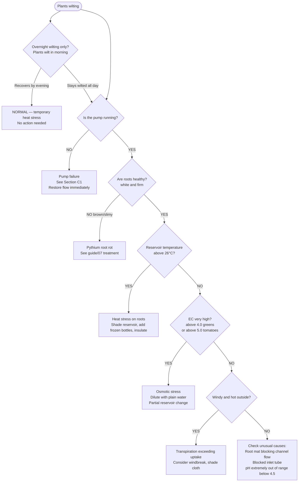
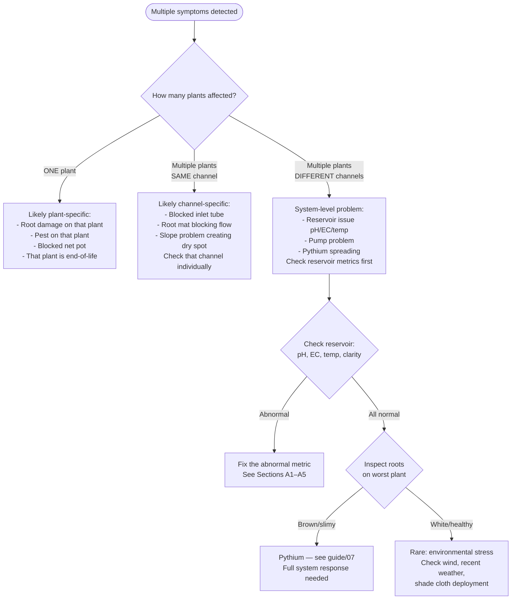
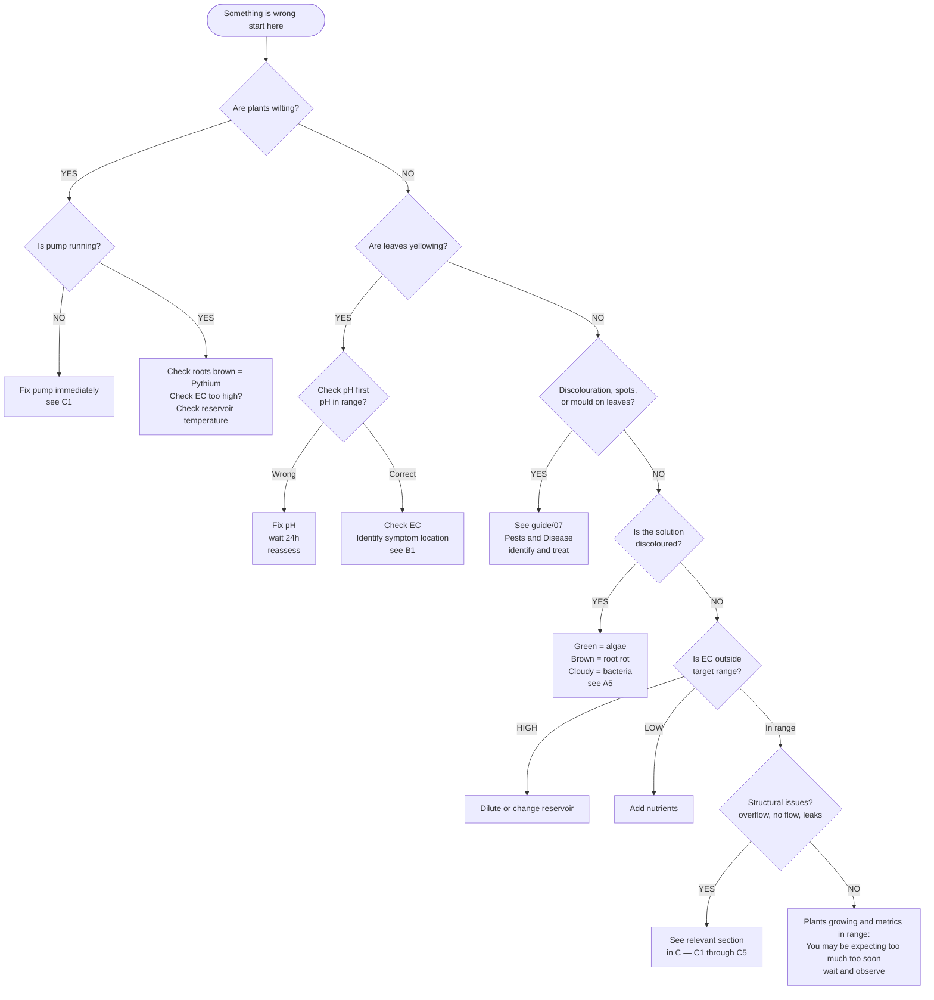

# Guide 09 — Troubleshooting
## Symptom → Cause → Fix Decision Trees

[](../../README.md)
[](https://creativecommons.org/licenses/by-nc-sa/4.0/)


---

## Table of Contents

- [How to Use This Guide](#how-to-use-this-guide)
- [SECTION A: Water and Solution Problems](#section-a-water-and-solution-problems)
  - [A1: pH DRIFTING UP (alkaline creep)](#a1-ph-drifting-up-alkaline-creep)
  - [A2: pH DRIFTING DOWN (acidic drop)](#a2-ph-drifting-down-acidic-drop)
  - [A3: EC DROPPING FASTER THAN EXPECTED](#a3-ec-dropping-faster-than-expected)
  - [A4: EC RISING ABOVE TARGET](#a4-ec-rising-above-target)
  - [A5: SOLUTION TURNS BROWN, GREEN, OR SLIMY](#a5-solution-turns-brown-green-or-slimy)
- [SECTION B: Plant Problems](#section-b-plant-problems)
  - [B1: YELLOWING LEAVES](#b1-yellowing-leaves)
  - [B2: BROWN OR CRISPY LEAF EDGES / TIP BURN](#b2-brown-or-crispy-leaf-edges-tip-burn)
  - [B3: WILTING](#b3-wilting)
  - [B4: STUNTED GROWTH](#b4-stunted-growth)
  - [B5: BOLTING (PREMATURE FLOWERING — GREENS/HERBS)](#b5-bolting-premature-flowering-greensherbs)
  - [B6: BLOSSOM DROP (TOMATOES / PEPPERS)](#b6-blossom-drop-tomatoes-peppers)
  - [B7: PURPLE LEAVES](#b7-purple-leaves)
  - [B8: WHITE CRUSTY DEPOSITS ON CHANNELS OR NET POTS](#b8-white-crusty-deposits-on-channels-or-net-pots)
- [SECTION C: System and Equipment Problems](#section-c-system-and-equipment-problems)
  - [C1: PUMP NOT FLOWING](#c1-pump-not-flowing)
  - [C2: CHANNELS OVERFLOWING OR POOLING](#c2-channels-overflowing-or-pooling)
  - [C3: DRY SPOTS IN CHANNELS](#c3-dry-spots-in-channels)
  - [C4: RESERVOIR OVERHEATING](#c4-reservoir-overheating)
  - [C5: FITTINGS LEAKING](#c5-fittings-leaking)
- [SECTION D: Multiple Simultaneous Symptoms](#section-d-multiple-simultaneous-symptoms)
  - [Key Principle](#key-principle)
  - [D1: Yellowing + Wilting (Multiple Plants)](#d1-yellowing-wilting-multiple-plants)
  - [D2: Brown Leaf Edges + Stunted Growth](#d2-brown-leaf-edges-stunted-growth)
  - [D3: Yellowing + Stunted Growth + Brown Edges (The Triad)](#d3-yellowing-stunted-growth-brown-edges-the-triad)
  - [D4: Multiple Plants Affected Simultaneously vs One Plant](#d4-multiple-plants-affected-simultaneously-vs-one-plant)
  - [D5: Rapid Onset (Problem Appeared Overnight or Within Hours)](#d5-rapid-onset-problem-appeared-overnight-or-within-hours)
- [SECTION E: Master Decision Flowchart](#section-e-master-decision-flowchart)

---


## How to Use This Guide

Find your symptom in the relevant section. Follow the decision tree to identify the most likely cause, then apply the fix. Always start with the most common cause before assuming something unusual.

**Seeing multiple symptoms at once?** Skip to **Section D: Multiple Simultaneous Symptoms** — it's faster than working through individual sections when several things look wrong.

**Golden rule:** When something goes wrong, check in this order:
1. **pH first** — most plant symptoms are pH-related
2. **EC second** — over/under feeding
3. **Temperature** — root zone temperature
4. **Pest or disease** — only after ruling out chemistry

[↑ Back to TOC](#table-of-contents)

---


## SECTION A: Water and Solution Problems

---

### A1: pH DRIFTING UP (alkaline creep)

```
  pH rising > 0.5 per day

  MOST COMMON CAUSES (in order of likelihood):

  1. PLANTS CONSUMING ANIONS (normal vegetative growth)
     Plants in heavy vegetative growth preferentially consume NO₃⁻, releasing OH⁻.
     → This is NORMAL behaviour. Just add pH Down more frequently.
     FIX: Add pH Down 1ml at a time until back in range 5.8–6.2. Expect to repeat daily.

  2. HARD TAP WATER / HIGH BICARBONATE
     Bicarbonate (HCO₃⁻) in tap water buffers the solution back up after you add pH Down.
     Sign: You need large amounts of pH Down to hold pH at target.
     FIX: (a) Add more pH Down as needed — hard water just requires more. 
          (b) Use RO or rainwater (lower bicarbonate, holds pH better).
          (c) Acidify tap water before using for top-ups.

  3. UNCONDITIONED ROCKWOOL OR CLAY PEBBLES
     Alkaline surface residue on new media leaching into solution.
     Sign: Happens in first 1–2 weeks with new media.
     FIX: Remove media, re-soak in pH 5.5 water for 12–24h. Rinse thoroughly.

  4. RESERVOIR RUNNING LOW (high concentration of alkaline minerals)
     As water evaporates, alkaline minerals concentrate.
     FIX: Top up with pH-adjusted water (no nutrients) — this dilutes the alkalinity.

  5. ALGAE IN RESERVOIR OR CHANNELS
     Algae consumes CO₂ during photosynthesis, raising pH.
     Sign: Visible green coating, solution smells or looks green.
     FIX: Eliminate light sources. Full system clean. See guide/07.
```

---

### A2: pH DRIFTING DOWN (acidic drop)

```
  pH falling > 0.5 per day

  MOST COMMON CAUSES:

  1. PLANTS CONSUMING CATIONS (fruiting stage)
     Plants consuming K⁺, Ca²⁺, Mg²⁺ during fruiting, releasing H⁺.
     This is NORMAL in tomato/pepper fruiting stage.
     FIX: Add pH Up as needed. Monitor more frequently.

  2. PHOSPHORIC ACID OVERDOSE
     Too much pH Down added — overshot the target.
     Sign: pH dropped very rapidly after you adjusted it.
     FIX: Add pH Up to bring back to 5.8–6.2. Go more slowly next time (1ml at a time).

  3. DECOMPOSING ORGANIC MATTER IN RESERVOIR
     Dead roots, organic matter releasing acids.
     Sign: Solution smells bad.
     FIX: Full reservoir change. Remove dead root material from channels.

  4. MICROBIAL ACTIVITY (acid-producing bacteria)
     Some bacteria produce organic acids — usually associated with warm, old solution.
     Sign: pH drop coincides with solution looking cloudy/discoloured.
     FIX: Full system sterilisation and reservoir change.
```

---

### A3: EC DROPPING FASTER THAN EXPECTED

```
  EC falling > 0.3 mS/cm per day

  MOST COMMON CAUSES:

  1. PLANTS ACTIVELY ABSORBING NUTRIENTS (healthy!)
     Fast-growing plants in peak vegetative stage consume EC rapidly.
     This is POSITIVE — your plants are thriving.
     FIX: Topping up with plain water will further dilute EC. Add a small nutrient dose.
          Prepare a 10× concentrate stock and add measured doses to maintain EC.

  2. RESERVOIR TOO SMALL FOR PLANT LOAD
     An 80L reservoir with 40+ plants will see rapid EC swings.
     FIX: Reduce plant count, OR change solution more frequently (every 5–7 days).
          NOTE: This system is designed around an 80L reservoir. Increasing to
          120–150L requires a larger container and proportionally more nutrients
          per fill. For most home growers, reducing plant density in peak summer
          or changing solution twice per week is more practical than upsizing.

  3. EVAPORATION RATE HIGH (hot day)
     Water evaporating faster than plants consume it — EC and all nutrients remain,
     but volume drops. EC per litre RISES (not drops) in this case.
     → EC dropping in hot weather means plants ARE eating the nutrients fast.
     FIX: As per point 1 above.

  4. METER CALIBRATION DRIFT
     If your EC meter hasn't been calibrated recently, it may read low.
     FIX: Recalibrate with standard solution. If reading is now correct, adjust nutrient dose.
```

---

### A4: EC RISING ABOVE TARGET

```
  EC rising despite regular top-up

  MOST COMMON CAUSES:

  1. TOPPING UP WITH NUTRIENT SOLUTION INSTEAD OF PLAIN WATER
     If you add nutrient solution for top-ups (instead of plain pH water),
     EC accumulates as water evaporates but nutrients stay.
     FIX: TOP UP WITH PLAIN pH-ADJUSTED WATER ONLY. Nutrients don't evaporate —
          only water does. Adding more nutrients on top-up spikes EC.

  2. SALT ACCUMULATION (solution is old)
     As plants absorb water, the remaining nutrient solution becomes more concentrated.
     After 7–10 days, EC naturally rises.
     FIX: Do a full reservoir change. The solution has run its course.

  3. HARD WATER TOP-UPS
     Hard tap water adds minerals each time you top up.
     FIX: Use RO or rainwater for top-ups.
```

---

### A5: SOLUTION TURNS BROWN, GREEN, OR SLIMY

```
  Discoloured or slimy reservoir/solution

  GREEN SOLUTION or GREEN COATING ON WALLS:
  → ALGAE BLOOM
  FIX: 
  1. Identify light source — seal it (tape, paint, opaque cover)
  2. Full reservoir change and sterilisation
  3. Flush channels with 1% H₂O₂
  4. Ensure reservoir lid is fully light-tight

  BROWN SOLUTION with foul smell:
  → ROOT ROT (Pythium) or bacterial decomposition
  FIX:
  1. Inspect roots in all channels — look for brown, slimy roots
  2. Reduce reservoir temperature immediately (shade, insulate)
  3. Full reservoir change with H₂O₂ treatment (2ml/L)
  4. Remove most affected plants
  5. Add Hydroguard to new solution
  6. See guide/07 Pythium treatment

  GREY/WHITE CLOUDY SOLUTION:
  → Microbial bloom — usually from organic matter decomposition
  FIX: Full reservoir change. Sterilise reservoir. Check for dead plant material.

  YELLOW-TINTED SOLUTION:
  → Can be normal with iron chelates (DTPA/EDDHA iron sources colour water)
  → Also: some nutrient brands naturally tint the solution
  FIX: If plants are healthy and EC/pH are fine, yellow tint from nutrients is harmless.
```

[↑ Back to TOC](#table-of-contents)

---


## SECTION B: Plant Problems

---

### B1: YELLOWING LEAVES

Yellowing (chlorosis) is the most common and most ambiguous plant symptom. Use the location of yellowing to diagnose:

```mermaid
flowchart TD
    Start([Which leaves are yellowing?])

    Start --> Old[Old / lower leaves first<br/>mobile nutrient deficiency]
    Start --> New[Young / new leaves first<br/>immobile nutrient deficiency]
    Start --> All[All leaves simultaneously]

    Old --> N[Uniform yellow whole leaf<br/>Nitrogen deficiency<br/>FIX: Check EC in range, check pH above 5.5,<br/>add Cal-mag or increase N in mix]
    Old --> Mg[Yellow between green veins interveinal<br/>Magnesium deficiency<br/>FIX: Add 0.3ml/L Epsom salt,<br/>check pH 6.0–6.5]
    Old --> P[Yellow with purple undersides<br/>Phosphorus deficiency<br/>FIX: Check pH above 5.5,<br/>adjust pH up, check EC]
    Old --> K[Brown scorched dry margins on leaf edges<br/>Potassium deficiency<br/>FIX: Check EC is in range,<br/>increase K in mix or raise overall Masterblend dose]

    New --> Fe[Yellow between green veins interveinal<br/>Iron deficiency<br/>FIX: pH too high above 6.5 — lower to 5.8–6.2,<br/>iron is present but locked out]
    New --> Mn[Similar interveinal pattern<br/>Manganese deficiency<br/>FIX: Check pH, Mn locks out above 6.5]
    New --> S[Uniform pale yellow in newest growth<br/>Sulfur deficiency<br/>FIX: Rare with Masterblend, check EC,<br/>may need Epsom salt]

    All --> Pythium[Root rot Pythium<br/>roots cannot supply nutrients<br/>FIX: Inspect roots, see guide/07]
    All --> pHOut[pH severely out of range<br/>below 4.5 or above 8.0<br/>FIX: Urgent pH correction,<br/>change reservoir solution]
    All --> PumpFail[Pump failure<br/>plants starving from no nutrient flow<br/>FIX: Restore pump immediately]
```



---

### B2: BROWN OR CRISPY LEAF EDGES / TIP BURN

```
  BROWN TIPS ON YOUNG LEAVES (esp. lettuce, kale):
  → Calcium deficiency / tip burn

  Most common cause: NOT a lack of calcium in solution.
  Usually caused by:
  1. Low humidity + high transpiration → Ca cannot move fast enough to leaf edges
  2. Poor airflow → humid pockets create uneven Ca uptake
  3. EC too high → osmotic stress reduces water/Ca movement

  FIX:
  - Ensure adequate airflow around plants (no stagnant air pockets)
  - Check EC is not above target
  - Check pH is 5.8–6.2 (Ca locks out below 5.5)
  - In severe cases: foliar spray with calcium nitrate solution (2g/L) directly on young leaves
  - Choose tip-burn resistant lettuce varieties (Jericho, Nevada)

  BROWN EDGES ON OLD LEAVES:
  → Potassium deficiency (scorched margins on mature leaves)
  FIX: Check EC and K ratio in your nutrient mix. If using Masterblend, increase overall dose.

  CRISPY BROWN EVERYWHERE (multiple plants simultaneously):
  → Nutrient burn — EC too high
  FIX: Measure EC. If above 3.0 for greens: dilute with plain water or change reservoir.

  SUNSCALD (bleached/white patches on upper leaf surfaces):
  → Direct sun exposure exceeding plant tolerance
  FIX: Deploy 40% shade cloth, especially in summer.
```

---

### B3: WILTING



---

### B4: STUNTED GROWTH

```
  PLANTS GROWING SLOWLY OR NOT AT ALL:

  STEP 1: Check age of plants
  - Lettuce at <2 weeks old: slow growth is normal — roots still establishing
  - Lettuce at >3 weeks with no acceleration: problem.

  STEP 2: Check EC
  - EC below target (e.g. 0.5 for lettuce when target is 1.0): UNDERFEEDING
    FIX: Add nutrients to reach target EC.

  STEP 3: Check pH
  - pH above 7.0: nutrient lockout of iron, manganese, zinc
    FIX: Lower pH to 5.8–6.2.
  - pH below 5.0: nutrient lockout of Ca, Mg, and others
    FIX: Raise pH.

  STEP 4: Check temperature
  - Air below 12°C: growth slows dramatically. Most crops stop below 10°C.
    FIX: Deploy frost fleece, or wait for warmer weather.

  STEP 5: Check light
  - Fewer than 4 sun hours for greens, fewer than 8 for tomatoes
    FIX: Relocate system or accept lower yields in poor light.

  STEP 6: Check roots
  - Root bound (roots packed so densely they block channel): thin out plant density
  - Damaged roots: treat root rot, reduce EC

  STEP 7: Seedling quality
  - Were seeds old? Poor germination = poor early vigour.
  - Were seedlings kept too cold during germination?
```

---

### B5: BOLTING (PREMATURE FLOWERING — GREENS/HERBS)

```
  LETTUCE, SPINACH, CILANTRO SENDING UP A FLOWER STALK:

  CAUSE: Bolting is triggered by:
  1. Long days (>14 hours daylight) — most common outdoor cause
  2. High temperatures (above 24°C consistently)
  3. Plant stress (erratic EC/pH, root damage, overcrowding)

  WHEN IS BOLTING NORMAL?
  - Lettuce in July: essentially inevitable with most varieties
  - Cilantro after 4–5 weeks in summer: very common
  - Spinach in long summer days: expected

  WHEN BOLTING STARTS:
  - Harvest IMMEDIATELY — flavour deteriorates rapidly once bolting begins
  - Lettuce becomes intensely bitter within 2–3 days of bolt stalk appearing
  - Cilantro bolt produces usable coriander seeds — let it bolt and harvest seeds

  PREVENTION:
  - Grow heat-tolerant / slow-bolt varieties (Jericho lettuce, Leisure cilantro)
  - Deploy shade cloth (reduces temperature, light intensity)
  - Grow in spring and autumn rather than through peak summer
  - Succession plant — always have fresh young plants ready to replace bolting ones
```

---

### B6: BLOSSOM DROP (TOMATOES / PEPPERS)

```
  FLOWERS FALLING OFF WITHOUT SETTING FRUIT:

  MOST COMMON CAUSES:

  1. TEMPERATURE TOO LOW (< 15°C at night)
     Most common cause in spring/early summer and autumn.
     FIX: Protect with fleece at night. Delay harvest expectations to warmer weeks.

  2. TEMPERATURE TOO HIGH (> 32°C during day)
     Pollen becomes non-viable above 32°C.
     FIX: Deploy shade cloth. Accept reduced fruit set in heat waves.

  3. POOR POLLINATION
     No wind or insects to move pollen (especially under cover).
     FIX: Hand pollinate — tap flower clusters gently, or vibrate with electric toothbrush
     on stem (simulates bee vibration, releases pollen).

  4. LOW HUMIDITY (< 40% RH)
     Pollen dries out and doesn't stick.
     FIX: Mist around (not on) plants in morning to raise local humidity.

  5. EC TOO HIGH OR TOO LOW
     Nutritional stress prevents successful fruit set.
     FIX: Ensure EC is within target range for fruiting stage.

  6. INSUFFICIENT LIGHT
     Below 20 DLI — fruiting crops need substantial light to support flowering.
     FIX: Site relocation for next season. Accept reduced production.
```

---

### B7: PURPLE LEAVES

```
  PURPLE STEMS AND LEAF UNDERSIDES:

  CAUSE 1 — Phosphorus deficiency
  Phosphorus is involved in energy transfer (ATP). Deficiency causes purple/red
  pigmentation (anthocyanins) as sugars accumulate in leaves.
  Most common cause: pH below 5.5 (P locks out in acidic conditions) or pH above 7.0.
  FIX: Check pH — if below 5.5, raise to 5.8–6.2. P availability improves immediately.

  CAUSE 2 — Cold stress
  Temperatures below 10°C cause anthocyanin accumulation — same purple appearance.
  Distinguish from P deficiency: cold-stressed plants show purple uniformly AND the
  symptom resolves when temperatures warm up.
  FIX: Protect with fleece, harvest and wait for warmer conditions.

  CAUSE 3 — Variety characteristic
  Purple basil, red/purple lettuce varieties — this is normal and desirable!
  No action needed.
```

---

### B8: WHITE CRUSTY DEPOSITS ON CHANNELS OR NET POTS

```
  WHITE/GREY CRUST ON CHANNEL SURFACES, FITTINGS, OR NET POT RIMS:

  CAUSE: Salt (mineral) buildup. Nutrient salts dissolved in water are left behind when
  water evaporates. Particularly visible at waterline and around net pot holes.

  RISK LEVEL: Cosmetic at low levels. At high levels can block drain fittings and
  increase local EC dramatically in the channel.

  FIX:
  1. Rinse channel with plain water (hose or watering can) — many deposits dissolve
  2. Persistent deposits: wipe with cloth soaked in dilute white vinegar (weak acid
     dissolves calcium carbonate deposits)
  3. Rinse thoroughly with plain water after vinegar treatment
  4. Reduce salt buildup: do more frequent full reservoir changes (every 7 vs 14 days)
  5. Use lower-mineral source water (RO or rainwater reduces scaling)
```

[↑ Back to TOC](#table-of-contents)

---


## SECTION C: System and Equipment Problems

---

### C1: PUMP NOT FLOWING

```
  PUMP APPEARS ON BUT NO FLOW / REDUCED FLOW:

  STEP 1: Is there power?
  - Check extension lead is plugged in and socket is on
  - Check for tripped circuit breaker (outdoor sockets often on their own circuit)
  - Test socket with a lamp

  STEP 2: Is pump making noise (humming)?
  YES (humming but no flow) → IMPELLER BLOCKED
  - Remove pump from reservoir
  - Disassemble pump head (usually 4 clips or twist-off)
  - Inspect impeller: debris (root fragments, clay pebbles, snails) jammed in it
  - Clear debris, reassemble, re-test

  NO (completely silent) → MECHANICAL FAILURE or POWER ISSUE
  - Test pump in a bucket of plain water
  - If silent: motor failed. Replace pump (keep a spare — ~$15)

  STEP 3: Pump runs but flow is weak?
  - CHECK FILTER SPONGE: if clogged, reduces flow dramatically
    FIX: Remove and rinse filter sponge in reservoir water (not tap)
  - CHECK HEAD PRESSURE: how high is the pump lifting water?
    Each metre of head reduces output ~20%. Reduce manifold height if possible.
  - CHECK FOR KINKED TUBING: straighten or replace kinked sections
  - CHECK MANIFOLD: one clogged outlet = reduced flow to one channel
    FIX: Remove each inlet tube in turn, check flow from each manifold branch.

  EMERGENCY TEMPORARY FIX IF PUMP FAILS:
  - Immediately hand-water each channel with a watering can (pour solution slowly
    from inlet end to drain end)
  - This buys 30–60 minutes while you fix or replace the pump
  - Have a spare pump ready — this is the most common hardware failure
```

---

### C2: CHANNELS OVERFLOWING OR POOLING

```
  WATER POOLING IN CHANNELS INSTEAD OF FLOWING TO DRAIN:

  CAUSE 1 — BLOCKED DRAIN FITTING
  Roots have grown into or over the drain hole at the low end of the channel.
  FIX: Remove drain fitting, clear root material, replace. Trim root mat inside channel.

  CAUSE 2 — INCORRECT SLOPE (too flat or negative)
  The drain end should be LOWER than the inlet end. If equal or reversed, water pools.
  FIX: Re-check slope with spirit level. Adjust frame height at drain end downward.
       Confirm 8cm drop over 2.4m (1:30 slope).

  CAUSE 3 — FLOW RATE TOO HIGH
  Pump delivering more than 2L/min per channel — water cannot drain fast enough.
  FIX: Add a flow restriction valve on the manifold to reduce flow to each channel.
       Alternatively reduce pump output (if it has a flow control).

  CAUSE 4 — DRAIN PIPE BLOCKED
  The return pipe from channels to reservoir is blocked or kinked.
  FIX: Inspect return pipe for kinks. Flush with water from the high end.
```

---

### C3: DRY SPOTS IN CHANNELS

```
  INLET END DRY / PLANTS AT INLET END WILTING:

  CAUSE 1 — FLOW RATE TOO LOW (< 0.8L/min)
  Solution runs out before reaching all plant sites.
  FIX: Increase pump output. Check for blockages reducing flow.

  CAUSE 2 — SLOPE TOO STEEP
  Solution flows too fast and reaches drain before wetting all roots adequately.
  FIX: Reduce slope angle slightly (aim for 1:30, not steeper than 1:20).

  CAUSE 3 — INLET BLOCKAGE
  Clay pebbles or debris blocking the inlet fitting, reducing flow into that channel.
  FIX: Remove inlet tube, clear blockage, replace.

  PLANTS AT DRAIN END DRY:
  More unusual — usually means channel is completely blocked mid-way (root mat dam).
  FIX: Remove net pots around blockage, clear root material, replace.
```

---

### C4: RESERVOIR OVERHEATING

```
  RESERVOIR TEMPERATURE ABOVE 24°C:

  IMMEDIATE FIXES (short-term):
  1. Shade the reservoir (move under NFT frame, drape with shade cloth or reflective foil)
  2. Wrap with white/silver reflective foam insulation
  3. Float 1–2 sealed 1L bottles of ice in the reservoir — replace daily
  4. Do a partial water change with cooler fresh water

  MEDIUM-TERM FIXES:
  5. Paint reservoir exterior WHITE (reflects radiant heat)
  6. Bury reservoir up to 1/3 depth in the ground (thermal mass of soil helps)
  7. Replace black reservoir with white/light-coloured container

  LONG-TERM FIX:
  8. Aquarium chiller (~$60–$150): inline chiller maintains set temperature regardless of weather
     Well worth investment if summer temps exceed 30°C regularly.
     Connect inline on return pipe before reservoir.
```

---

### C5: FITTINGS LEAKING

```
  DRIPPING AT CONNECTIONS OR FITTINGS:

  THREADED FITTINGS:
  FIX: Unscrew, apply PTFE (thread tape) in the direction of the thread (clockwise wrap).
       Re-tighten firmly but not over-tight (over-tightening cracks plastic fittings).

  BARBED FITTINGS IN GROMMETS:
  FIX: Remove fitting. Check grommet for cracks or deformation.
       Replace grommet if damaged. Re-insert with a small amount of plumber's silicone sealant.
       Re-push barbed fitting firmly through grommet.

  PUMP OUTPUT FITTING:
  FIX: Ensure pump outlet fitting is compatible size with tubing ID.
       Use hose clamp to secure tubing over pump outlet barb if slipping.

  CHANNEL END CAP:
  FIX: Check end cap is pushed fully on. Apply aquarium-grade silicone sealant around
       the inside edge of the end cap seal for a watertight bond.
       Allow 24h cure time before putting into service.
```

[↑ Back to TOC](#table-of-contents)

---


## SECTION D: Multiple Simultaneous Symptoms

Real-world problems rarely present as a single textbook symptom. When you're seeing **two or more symptoms at once**, use this section to narrow down the root cause faster than working through individual symptom sections.

### Key Principle

Multiple symptoms appearing **simultaneously across multiple plants** almost always indicate a **system-level problem** (reservoir, pump, temperature, pH) rather than a plant-specific issue (pest, individual nutrient deficiency). If only one plant is affected, check that plant individually using Sections A–C.

### D1: Yellowing + Wilting (Multiple Plants)

```
  MOST LIKELY: Root zone failure

  CHECK IN THIS ORDER:
  1. Pump running?        → NO: Pump failure (see C1). Roots drying out.
  2. Roots healthy?       → Brown/slimy: Pythium root rot (see guide/07).
  3. Reservoir temp?      → Above 26°C: Heat stress + low DO₂. Shade and cool reservoir.
  4. pH in range?         → Below 4.5 or above 7.5: Severe nutrient lockout.
                             Multiple elements become unavailable simultaneously.
  5. EC extremely high?   → Above 4.0 for greens: Osmotic stress causing both wilt
                             (can't take up water) and yellowing (nutrient imbalance).

  IF ALL METRICS ARE NORMAL:
  → Check for root mat blockage in channels (roots blocking flow to downstream plants).
  → Check each channel individually — one channel may have a blocked inlet.
```

### D2: Brown Leaf Edges + Stunted Growth

```
  MOST LIKELY: Nutrient lockout from pH or EC problem

  CHECK IN THIS ORDER:
  1. pH out of range?     → Below 5.0 or above 7.0: Ca, Mg, Fe all lock out.
                             Fix pH first, wait 48h, then reassess growth.
  2. EC too high?         → High EC causes osmotic stress (stunting) AND
                             calcium transport failure (tip burn).
                             Dilute with plain water or do full reservoir change.
  3. EC too low?          → Very low EC (<0.6) starves the plant overall.
                             Growth stalls AND leaf edges burn from nutrient deficiency.
  4. Solution age?        → Old solution (>14 days) accumulates salt byproducts
                             even if EC reads normal. Do a full change.

  IF ALL METRICS ARE NORMAL:
  → Root-bound plants in net pots (roots circling, not extending into channel).
  → Temperature stress (check air temp — cold nights stunt growth, hot days burn edges).
```

### D3: Yellowing + Stunted Growth + Brown Edges (The Triad)

```
  MOST LIKELY: Severe system-level failure

  This combination of all three major symptoms means the plant cannot access
  nutrients at all. The root cause is almost always one of:

  1. PYTHIUM ROOT ROT — roots are damaged and cannot function.
     → Inspect roots immediately. Brown, slimy = Pythium. See guide/07.

  2. pH SEVERELY OUT OF RANGE — below 4.5 or above 8.0.
     → Most nutrients become unavailable. Fix pH, do full reservoir change.

  3. PUMP FAILURE (partial) — flow reduced but not stopped.
     → Check flow rate at each channel drain. Should be 1–2 L/min.
     → Pump impeller may be partially blocked.

  4. COMPLETE NUTRIENT DEPLETION — EC reads very low (<0.4).
     → Solution is exhausted. Full reservoir change with fresh nutrients.

  ACTION: Do not try to diagnose further. Do a full reservoir change,
  inspect roots, verify pump flow, and restart. This resets everything.
```

### D4: Multiple Plants Affected Simultaneously vs One Plant



### D5: Rapid Onset (Problem Appeared Overnight or Within Hours)

```
  RAPID-ONSET SYMPTOMS (fine yesterday, bad today):

  Wilting across all plants:
  → PUMP FAILURE. Check pump immediately. See C1.

  Yellowing across all plants:
  → pH crash or spike overnight. Test pH immediately.
  → Chemical contamination (cleaning product, pesticide overspray, etc.)

  Brown/burned edges across all plants:
  → EC spiked (evaporation concentrated nutrients). Test EC.
  → Frost damage overnight. Check min temperature readings.

  Solution turned green/brown overnight:
  → Algae bloom (green) — light leak appeared. See A5.
  → Pythium explosion (brown) — reservoir was too warm. See guide/07.

  RULE: If something changed rapidly, something EXTERNAL changed rapidly.
  Think: weather event, power outage (pump off), accidental contamination,
  someone topped up with the wrong water, timer malfunction.
```

[↑ Back to TOC](#table-of-contents)

---


## SECTION E: Master Decision Flowchart



---


*Next: [`guide/nft/10-climate-management.md`](10-climate-management.md) — Heat, cold, wind, rain, and seasonal strategy*

[↑ Back to TOC](#table-of-contents)

---

<!-- copyright -->
*Copyright (c) 2026 UncleJS. Licensed under [CC BY-NC-SA 4.0](https://creativecommons.org/licenses/by-nc-sa/4.0/) — free to share and adapt for non-commercial purposes with attribution and ShareAlike.*
