# Guide 10 — Climate Management for Outdoor Hydroponics

[](../../README.md)
[](https://creativecommons.org/licenses/by-nc-sa/4.0/)


Managing climate is the single greatest challenge of outdoor hydroponic growing. Unlike a greenhouse or grow tent, an outdoor NFT system is fully exposed to ambient temperature swings, direct sun on **both reservoirs**, wind-driven evaporation, rain dilution, frost risk, and seasonal photoperiod changes. This guide covers every environmental factor in depth — how each affects your plants and nutrient solution, and exactly what to do about it.

---

## Table of Contents

- [1. The Outdoor Climate Challenge](#1-the-outdoor-climate-challenge)
  - [Key variables to monitor outdoors](#key-variables-to-monitor-outdoors)
- [2. Seasonal Calendar for This Site](#2-seasonal-calendar-for-this-site)
  - [Grow window by zone](#grow-window-by-zone)
  - [Season phases](#season-phases)
- [3. Temperature Effects on the Hydroponic System](#3-temperature-effects-on-the-hydroponic-system)
  - [3.1 Air Temperature vs. Root Zone Temperature](#31-air-temperature-vs-root-zone-temperature)
  - [3.2 Dissolved Oxygen (DO₂) and Temperature](#32-dissolved-oxygen-do₂-and-temperature)
  - [3.3 Nutrient Uptake and Temperature](#33-nutrient-uptake-and-temperature)
  - [3.4 pH Drift and Temperature](#34-ph-drift-and-temperature)
- [4. Summer Heat Management](#4-summer-heat-management)
  - [4.1 Priority Stack](#41-priority-stack)
  - [4.2 Shade Cloth](#42-shade-cloth)
  - [4.3 Reservoir Insulation and Covering](#43-reservoir-insulation-and-covering)
  - [4.4 Ice Bottle Method](#44-ice-bottle-method)
  - [4.5 Adjusting Nutrient Solution in Heat](#45-adjusting-nutrient-solution-in-heat)
  - [4.6 Crop Heat Thresholds](#46-crop-heat-thresholds)
- [5. Cold and Frost Management](#5-cold-and-frost-management)
  - [5.1 How Cold Damages Hydroponic Plants](#51-how-cold-damages-hydroponic-plants)
  - [5.2 Frost Hardiness by Crop](#52-frost-hardiness-by-crop)
  - [5.3 Protecting the System from Cold](#53-protecting-the-system-from-cold)
  - [5.4 Minimum Operational Temperatures](#54-minimum-operational-temperatures)
  - [5.5 Extended Cold Spells](#55-extended-cold-spells)
- [6. Wind Management](#6-wind-management)
  - [6.1 How Wind Affects the System](#61-how-wind-affects-the-system)
  - [6.2 Wind Speed Reference](#62-wind-speed-reference)
  - [6.3 Wind Management Strategies](#63-wind-management-strategies)
- [7. Rain Management](#7-rain-management)
  - [7.1 Rain and Reservoir Dilution](#71-rain-and-reservoir-dilution)
  - [7.2 Rain Management Strategy](#72-rain-management-strategy)
  - [7.3 After a Rain Event](#73-after-a-rain-event)
  - [7.4 Benefiting from Rain](#74-benefiting-from-rain)
- [8. Humidity and Airflow](#8-humidity-and-airflow)
  - [8.1 Why Humidity Matters](#81-why-humidity-matters)
  - [8.2 Humidity by Crop](#82-humidity-by-crop)
  - [8.3 Improving Airflow Around the System](#83-improving-airflow-around-the-system)
  - [8.4 Managing High Humidity Events](#84-managing-high-humidity-events)
- [9. Season Extension Techniques](#9-season-extension-techniques)
  - [9.1 Cold Frames](#91-cold-frames)
  - [9.2 Polytunnels](#92-polytunnels)
  - [9.3 Fleece Tunnels](#93-fleece-tunnels)
  - [9.4 Moving Crops Indoors for Winter](#94-moving-crops-indoors-for-winter)
- [10. Putting It Together — Seasonal Action Plans](#10-putting-it-together-seasonal-action-plans)
  - [Spring Startup (April)](#spring-startup-april)
  - [Full Season (May–September)](#full-season-mayseptember)
  - [Autumn Wind-Down (October)](#autumn-wind-down-october)
  - [Winter (December–February)](#winter-decemberfebruary)
- [11. Climate Monitoring Setup](#11-climate-monitoring-setup)
  - [11.1 Minimum Monitoring Kit](#111-minimum-monitoring-kit)
  - [11.2 Optional / Upgrade Monitoring](#112-optional-upgrade-monitoring)
  - [11.3 Logbook Integration](#113-logbook-integration)
- [12. Quick-Reference Decision Tree](#12-quick-reference-decision-tree)
- [Summary](#summary)

---


## 1. The Outdoor Climate Challenge

A hydroponic plant lives at the intersection of two environments:

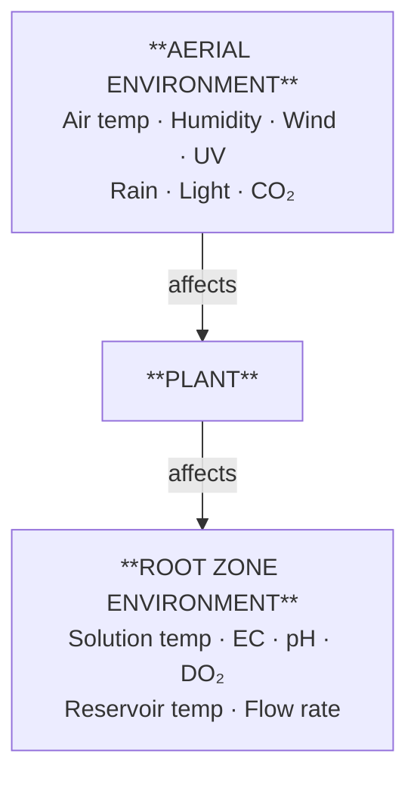

Both environments must stay within acceptable ranges simultaneously. When one goes out of range, the plant compensates by drawing on its reserves — and if both go out of range at the same time (e.g., a heatwave + high EC), the plant crashes quickly.

### Key variables to monitor outdoors

| Variable | Acceptable range (most crops) | Critical threshold |
|---|---|---|
| Air temperature | 59–86°F (15–30°C) | Below 41°F (5°C) or above 95°F (35°C) |
| Solution temperature | 64–72°F (18–22°C) | Below 50°F (10°C) or above 77°F (25°C) |
| Relative humidity (RH) | 50–75% | Below 30% or above 85% |
| Wind speed | 0–9 mph (0–15 km/h) | Above 16 mph (25 km/h) sustained |
| Reservoir dilution (rain EC drop) | Under 10% per event | Over 20% drop means re-dose that tank |
| Clear-sky DLI at this site | Summer 45–55; spring and fall 25–35; winter 10–15 mol/m²/day | Winter 10–15 is too low for outdoor fruiting |

Worked site: inland mid-USA, about 38°N, USDA zones 6b–7a (Kansas City, St. Louis, Louisville, Richmond). Not the Pacific coast at the same latitude. Summer clear-sky DLI of 45–55 mol/m²/day is more light than lettuce wants, which is one reason the shade cloth is 40% once afternoon highs hold above 85°F (29°C).

[↑ Back to TOC](#table-of-contents)

---


## 2. Seasonal Calendar for This Site

The worked climate is **inland mid-USA, about 38°N, USDA zones 6b–7a**. A South African reader uses the month in brackets, which is the same season shifted six months. It is not a second climate dataset.

| Item | Value |
|---|---|
| Last spring frost (planning) | April 15 (SA: October 15) |
| First fall frost (planning) | October 20 (SA: April 20) |
| Outdoor season | mid-April through mid-October (SA: mid-October through mid-April) |
| Summer afternoon highs | 90–100°F (32–38°C), June–August (SA: December–February) |
| Winter lows in this band | 0–15°F (−18 to −9°C) |
| Clear-sky DLI, summer | 45–55 mol/m²/day |
| Clear-sky DLI, spring and fall | 25–35 mol/m²/day |
| Clear-sky DLI, winter | 10–15 mol/m²/day |
| Shade cloth | 40%, when afternoon highs hold above 85°F (29°C) |
| Long-axis facing | South (SA: north) |
| Unprotected deep winter | Do not run outdoor NFT through December–February (SA: June–August) |

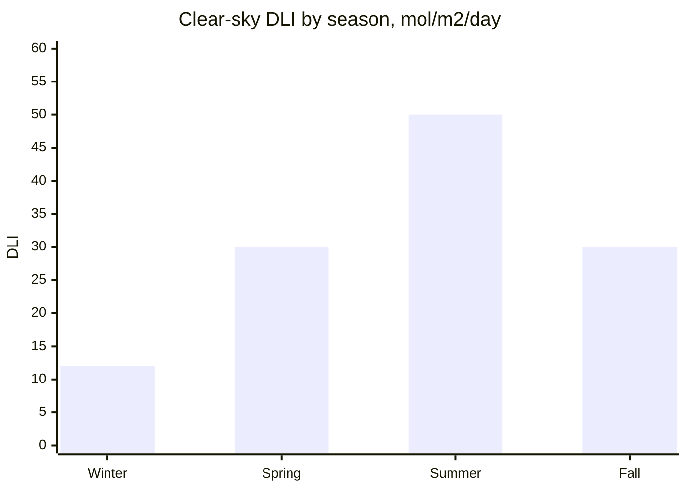

Winter bar is the middle of the 10–15 band. Spring and fall are the middle of 25–35. Summer is the middle of 45–55. These are outdoor clear-sky values, not the DLI under 40% shade.

### Grow window by zone

| Zone | Crop type | Outdoor grow window | Notes |
|---|---|---|---|
| NFT greens, CH1 | Lettuce, 11 sites | mid-April through mid-October (SA: mid-October through mid-April) | Bolt risk June–August (SA: December–February). EC 0.8–1.8 in the greens tank. |
| NFT greens, CH2 | Basil, cilantro, parsley, chives | After April 15, out before October 20 (SA: after October 15, out before April 20) | Basil is frost-tender. Same greens tank. |
| NFT greens, CH3 | Spinach, kale, mint, plus 3–4 strawberries | Leafy crops through the outdoor season | Strawberries are on CH3, not on CH4. |
| NFT fruiting, CH4 only | Cherry tomato and pepper | After last frost, finish before October 20 (SA: April 20) | Own 10 US gal (38 L) tank. Tomato EC 2.5–3.5, pepper EC 2.0–3.0. Those numbers never go in the greens tank. |
| Zone B microgreens | 6 trays | Indoors, year-round | Shelf can stay covered. Cold only slows a tray left outside. |
| Zone C bags | Radish, beetroot, carrot | Outdoor season | 5 US gal and 10 US gal bags. Fertigation EC ceiling 2.0 mS/cm. |

### Season phases

```
PHASE 1 — STARTUP (April; SA: October)
  • Planning last frost is April 15 (SA: October 15)
  • Start lettuce, kale, spinach, and chives once that date is past
  • Keep basil, tomato, and pepper indoors until nights stay above about 50°F (10°C)
  • Fleece is for a late frost, not for running the system in January
  • Greens EC can sit at the low end of 0.8–1.8 while growth is slow
  • Both NFT pumps run 24 hours. Do not use an overnight-off schedule.

PHASE 2 — FULL SEASON (May–September; SA: November–March)
  • All NFT crops can be outside
  • Heat is the main job from June (SA: December)
  • Shade cloth 40% when afternoon highs hold above 85°F (29°C)
  • Read both reservoir temperatures on hot afternoons
  • CH4 fruiting EC lives only in the 10 US gal (38 L) tank

PHASE 3 — WIND-DOWN (October; SA: April)
  • Planning first frost is October 20 (SA: April 20)
  • Fleece on frost nights in that week
  • Harvest basil, tomatoes, and peppers before that frost
  • Kale, chives, parsley, and spinach can finish the outdoor window
  • Then drain the NFT loops. Do not carry them into deep winter.

PHASE 4 — WINTER REST (December–February; SA: June–August)
  • Do not run unprotected NFT. Lows in this band are 0–15°F (−18 to −9°C).
  • Both tanks drained, pumps stored indoors
  • Zone B microgreens can continue indoors
  • Clean fittings, plan the next April (SA: October) start
```

[↑ Back to TOC](#table-of-contents)

---


## 3. Temperature Effects on the Hydroponic System

Temperature affects every biological and chemical process in the system. Understanding the mechanisms helps you act correctly rather than guess.

### 3.1 Air Temperature vs. Root Zone Temperature

Air temperature and root zone (solution) temperature are NOT the same, and they affect the plant differently.

| Factor | Affected by Air Temp | Affected by Solution Temp |
|---|---|---|
| Stomatal opening/closing | ✅ | ❌ |
| Transpiration rate | ✅ | Partially |
| Photosynthesis rate | ✅ | Partially |
| Nutrient uptake rate | Partially | ✅ |
| Root respiration / O₂ demand | ❌ | ✅ |
| Dissolved oxygen in solution | ❌ | ✅ (inverse relationship) |
| Pathogen (Pythium) risk | ❌ | ✅ (above 77°F (25°C) = high risk) |
| pH stability | Partially | ✅ |

### 3.2 Dissolved Oxygen (DO₂) and Temperature

This is the most critical relationship in warm weather. Dissolved oxygen decreases as water temperature rises:

```
Temperature              DO₂ saturation (mg/L)   Root health impact
───────────────────────────────────────────────────────────────────
50°F (10°C)                    11.3              Excellent
59°F (15°C)                     9.9              Very good
64°F (18°C)                     9.1              Good (low end of target)
68°F (20°C)                     8.8              Acceptable
72°F (22°C)                     8.5              Acceptable (high end of target)
75°F (24°C)                     8.2              Caution — approaching the heat line
79°F (26°C)                     7.9              Stress — oxygen deficit possible
82°F (28°C)                     7.6              High stress — intervene
86°F (30°C)                     7.4              Critical — root death risk
95°F (35°C)                     6.9              System failure likely
───────────────────────────────────────────────────────────────────
```

The heat action line for both tanks is 77°F (25°C). That sits between the 75°F (24°C) and 79°F (26°C) rows above. Above it, dissolved oxygen keeps falling and Pythium risk rises.

Plants need a minimum of ~5–6 mg/L DO₂ at the root surface. In warm water, you lose your safety margin quickly, and any blockage to the film (root matting, algae, poor slope) accelerates hypoxia.

**NFT advantage:** The falling-film design means water is constantly re-oxygenated at the channel surface and at the return-to-reservoir splash. This is why NFT tolerates warm weather better than DWC (deep water culture) — but it still has limits.

### 3.3 Nutrient Uptake and Temperature

Plant roots take up nutrients best at 64–72°F (18–22°C):

```
Solution temp              Uptake              Notes
──────────────────────────────────────────────────────────────────
Below 50°F (10°C)          Very low            Roots cold-shocked
50–59°F (10–15°C)          Below optimal       Slow growth, deficiency signs possible
59–64°F (15–18°C)          Good                Acceptable
64–72°F (18–22°C)          Optimal             Target for both tanks
72–77°F (22–25°C)          Declining           Start heat mitigation
Above 77°F (25°C)          Poor                Pythium risk rises. Dissolved oxygen falls.
Above 86°F (30°C)          Very poor           Root death likely within days
──────────────────────────────────────────────────────────────────
```

### 3.4 pH Drift and Temperature

Warmer solution accelerates biological activity (algae, bacteria) and degasses CO₂ faster, both of which shift pH. Expect:
- About every +9°F (+5°C), the pH drift rate roughly doubles
- Algae in a light-leaking tank can push pH to 8 or higher in daylight
- Solution above 82°F (28°C) can shift 0.5 pH units in a day
- Read pH in each tank. A drift in the greens tank does not describe the CH4 tank.

[↑ Back to TOC](#table-of-contents)

---


## 4. Summer Heat Management

### 4.1 Priority Stack

When heat stress occurs, intervene in this order (quickest/cheapest first):

```
HEAT INTERVENTION PRIORITY
──────────────────────────────────────────────────────────
Level 1 — Passive
  □ 40% shade cloth when afternoon highs hold above 85°F (29°C)
  □ Shade both reservoirs. Black body, white exterior.
  □ Confirm the air pump is bubbling in both tanks
  □ Mist foliage in the morning if leaves are heat-stressed. Do not mist fruit.

Level 2 — Low cost, about $10–$40 (R180–R720)
  □ Freeze water bottles and float them in the hot tank
  □ Shade the supply lines
  □ White exterior paint is the reflective coat. The body underneath stays black.

Level 3 — Moderate, about $40–$150 (R720–R2,700)
  □ A shade box over both tanks
  □ Foam wrap on channels if the plastic itself is hot to the touch
  □ Both NFT pumps stay on 24 hours. Do not turn a pump off overnight.
     A stopped channel dries in 15–30 minutes in this heat.

Level 4 — High, about $150–$500 (R2,700–R9,000)
  □ Inline chiller on one return, about $100–$300 (R1,800–R5,400), 150–500 W
  □ Misting on the frame, aimed at air around the plants, not into the tanks
──────────────────────────────────────────────────────────
Planning rate: $1 = R18, frozen 3 October 2026.
```

### 4.2 Shade Cloth

This build uses **40% shade cloth**, large enough to cover the 13 ft × 10 ft (4.0 m × 3.0 m) site. Deploy it when afternoon highs hold above 85°F (29°C). Summer clear-sky DLI is 45–55 mol/m²/day. Forty percent shade leaves roughly 27–33 mol/m²/day, which still feeds CH4 tomatoes and peppers and takes the edge off lettuce.

| Shade % | Light transmitted | Role on this site | Temperature reduction |
|---|---|---|---|
| 40% | About 60% | The cloth this build buys | About 7–11°F (4–6°C) |
| 20–30% | 70–80% | Not the design cloth | About 4–7°F (2–4°C) |
| 60–70% | 30–40% | Too dark for CH4 fruiting here | About 11–14°F (6–8°C) |

**Positioning matters:**
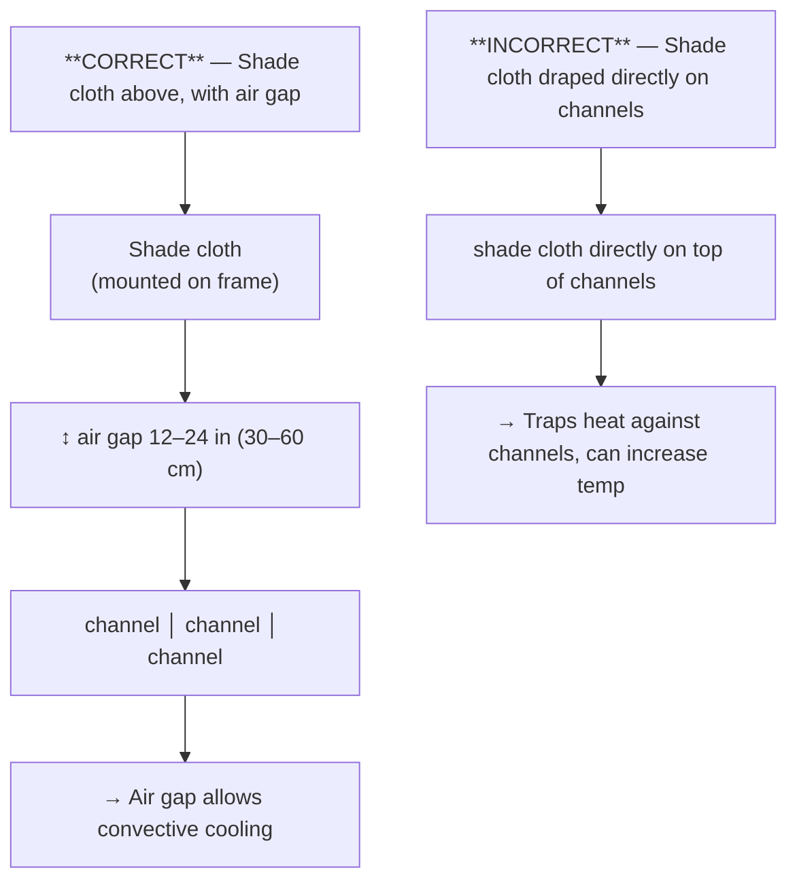

Mount the cloth on a simple frame at least 12–24 in (30–60 cm) above the channels so air can move underneath. Face the long axis south (SA: north). The working aisle is the 24 in (61 cm) strip on the south side. The wind break sits on the north edge, about 12 in (30 cm) clear of the frame.

### 4.3 Reservoir Insulation and Covering

Each reservoir is a heat sink. Direct sun on a dark exterior can lift solution temperature by 18°F (10°C) or more above the air. You have two tanks: greens 20 US gal (76 L), and CH4 fruiting 10 US gal (38 L). Shade both.

**Paint:** black body, white exterior. Black blocks the light that grows algae. White reflects solar heat. A black-only exterior overheats. A white-only wall lets light in.

**Insulation methods (cheapest to best):**

1. **Reflective foam board** offcuts — wrap walls and lids. Cuts a large share of solar gain. About $5–$15 (R90–R270) in offcuts.

2. **Shade box** — a simple timber box with a hinged lid, painted white on the outside, around each tank. Leave about 2 in (5 cm) of air gap. 

3. **Buried tank** — sink a reservoir partway into the ground if the site drains. Soil temperature lags the afternoon air and cuts solar gain.

4. **Aquarium chiller** — inline on that loop's return, before the water falls back into its own tank. Hold 64–72°F (18–22°C). Fit one chiller per loop if you chill both. Do not plumb the two returns together.

**Lid seal:** Cover each reservoir so you do not get:
- Evaporation of several US gallons a day in summer (a 20 US gal tank can lose 1–4 US gal / 5–15 L on a hot, windy day)
- Algae
- Mosquitoes
- Rain dilution (see Section 7)

An air pump is recommended in both tanks, especially once solution temperature climbs toward 77°F (25°C).

### 4.4 Ice Bottle Method

For a short heatwave (1–3 days), fill 1.5 US qt (1.4 L) bottles, freeze them, and float them in the tank that is hot. One bottle in the 10 US gal (38 L) fruiting tank moves the temperature more than the same bottle in the 20 US gal (76 L) greens tank.

Typical impact: a few degrees for 4–6 hours per bottle, then the afternoon sun wins again unless the cloth is up.

Worked example, greens tank only:
- 20 US gal (76 L) at 79°F (26°C)
- Target 72°F (22°C), a 7°F (4°C) drop
- Heat to remove is about 4°C × 76 kg × 4.18 kJ/kg°C ≈ 1,270 kJ
- One frozen 1.5 US qt (1.4 L) bottle stores on the order of 500 kJ
- About three bottles for that drop in the greens tank, and ongoing sun will put heat back
- The fruiting tank is half the volume, so the same three bottles go further there

Use several bottles, swapped morning and late afternoon, in whichever tank is over 77°F (25°C). This does not replace 40% shade.

### 4.5 Adjusting Nutrient Solution in Heat

In high temperatures, plants transpire more heavily, uptake water faster than nutrients, causing EC to rise (nutrient concentration). Simultaneously, oxygen depletion increases pH sensitivity.

**Heat management, one tank at a time:**
- Greens: run toward the lower part of 0.8–1.8 mS/cm, for example 1.0–1.2, while afternoons are 90–100°F (32–38°C). Lettuce still stays at or below 1.8.
- CH4 only: tomato fruiting stays inside 2.5–3.5 mS/cm, pepper inside 2.0–3.0 mS/cm. In a heatwave, use the low end of that crop's band. Do not drop the fruiting tank to the greens band, and do not raise the greens tank to match CH4.
- Check pH in both tanks morning and afternoon during a heatwave
- Top up by the EC you just measured. At or above that tank's target: plain water, pH 5.8–6.2. Below target: nutrient stock, then recheck EC and pH.

### 4.6 Crop Heat Thresholds

| Crop | Where it grows | Optimal air temp | Heat stress |
|---|---|---|---|
| Lettuce | CH1, greens tank | 59–72°F (15–22°C) | Tip burn and bolting above about 82°F (28°C) |
| Spinach | CH3 | 50–68°F (10–20°C) | Bolts quickly above about 79°F (26°C) |
| Kale | CH3 | 59–72°F (15–22°C) | Wilting, yellowing above about 86°F (30°C) |
| Basil | CH2 | 68–86°F (20–30°C) | Wilts in the afternoon, often recovers at night |
| Cherry tomato | CH4 only | 68–82°F (20–28°C) | Blossom drop above 90°F (32°C) |
| Pepper | CH4 only | 72–82°F (22–28°C) | Blossom drop, sunscald |
| Strawberry | CH3, 3–4 sites | 64–77°F (18–25°C) | Soft fruit, mould above about 86°F (30°C) |
| Mint | CH3 | 64–82°F (18–28°C) | Wilting |
| Radish | Zone C, 5 US gal bags | 50–64°F (10–18°C) | Woody, pungent roots above about 75°F (24°C) |

> **Tip:** Tip burn in lettuce is caused by calcium deficiency at the leaf margins — but the root cause is usually heat-driven transpiration outpacing calcium uptake through the xylem. Solution: increase flow rate, lower EC, add shade, ensure good root aeration.

[↑ Back to TOC](#table-of-contents)

---


## 5. Cold and Frost Management

### 5.1 How Cold Damages Hydroponic Plants

Cold affects plants in two ways:

**Chilling injury, 32–50°F (0–10°C):** Cell metabolism slows, nutrient uptake nearly stops, roots become susceptible to rot, and chilling-sensitive crops (basil on CH2, tomato and pepper on CH4) develop cellular damage even without ice.

**Frost injury, below 32°F (0°C):** Ice crystals form inside cells and rupture walls. That kills most of these crops within hours. Ice in a channel also ruptures roots and can crack fittings. Deep winter at this site is 0–15°F (−18 to −9°C). Do not run unprotected NFT through December–February (SA: June–August).

### 5.2 Frost Hardiness by Crop

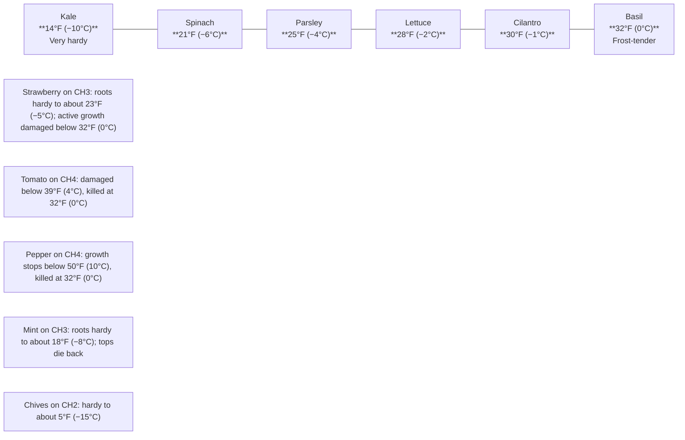

> Light frost is about 30°F (−1°C). Planning dates for this site are April 15 (SA: October 15) and October 20 (SA: April 20). Those are shoulder frosts. They are not a licence to run NFT at 0–15°F (−18 to −9°C).

### 5.3 Protecting the System from Cold

#### Horticultural Fleece (Frost Cloth)

The most cost-effective protection for a shoulder frost. A single layer of 17 g/m² fleece (about 0.5 oz/sq yd) raises the temperature underneath by about 4–7°F (2–4°C). A double layer gives about 7–11°F (4–6°C). That can cover a night near 32°F (0°C). It cannot carry an NFT system through 0–15°F (−18 to −9°C).

**How to use:**
1. Drape fleece over the channels on an evening when frost is forecast, around April 15 or October 20 (SA: October 15 or April 20)
2. Weight or clip the edges so it does not blow away
3. Remove it in the morning once the air is above 41°F (5°C). Left on in sun, it cooks the plants.
4. Never leave fleece on in full sun — it acts as a solar trap and can scorch plants

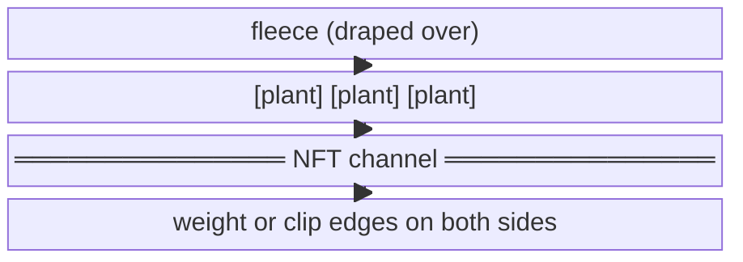

#### Protecting the Reservoir in Cold

- Solution below 50°F (10°C) severely limits growth
- Solution below 39°F (4°C) raises rot risk
- At 32°F (0°C) the solution can start to freeze and crack an uninsulated tank

**Cold protection for the two tanks:**
- Insulate with 2 in (50 mm) foam board on all sides
- Cover each lid on a shoulder-season night
- A submersible aquarium heater (25–100 W) can hold a tank near 59°F (15°C) during a short cold snap in April or October. About $15–$30 (R270–R540).
  - Greens tank is 20 US gal (76 L). Fruiting tank is 10 US gal (38 L). A 50 W heater is sized for the greens tank on a night around 36°F (2°C), not for a January night at 0–15°F (−18 to −9°C).
- If the system is not in active use, drain both tanks. Do not leave water in the channels over December–February (SA: June–August).

#### Channel and Pipe Protection

Thin PVC channels and supply hoses crack when they freeze. Below 23°F (−5°C):
- Harvest and drain. Do not keep circulating.
- Both pumps are a 24-hour runtime only while the system is actually growing. In a freeze, the correct move is to drain, not to cycle the pumps.
- Foam-lag hoses if a night near freezing is a one-off in the shoulder season. Deep winter is a drained system.

### 5.4 Minimum Operational Temperatures

| System component | Do not operate below | Action |
|---|---|---|
| Either submersible pump | Solution at 23°F (−5°C) | Drain. A heater is only for a shoulder snap, not deep winter. |
| PVC channels | 14°F (−10°C) if empty | Drain before storage |
| Supply hoses | 23°F (−5°C) | Insulate for one night, or bring inside |
| Plugs and any controller | Usually 32°F (0°C); follow the label | Weatherproof box, off the ground. Outdoor GFCI (SA: 30 mA earth-leakage). |
| HDPE reservoir, empty | About −4°F (−20°C) | Empty tanks tolerate cold. Full tanks do not. |

### 5.5 Extended Cold Spells

For more than 3 days with air below 41°F (5°C):

```
COLD SPELL PROTOCOL

Day 1: Fleece over the channels at night. A heater in a tank is reasonable
       if this is a shoulder snap around April 15 or October 20
       (SA: October 15 or April 20). Harvest anything that is ready.
       Both pumps stay on 24 hours while plants are still in the channels.
       Roots dry in 15–30 minutes if a pump is off.

Day 3: If plants are yellow and have stopped growing, harvest and drain
       that loop. Do not switch a pump to 1 hour a day. Do not use a
       15-minutes-on / 45-minutes-off cycle. Continuous flow, or a drained loop.
       If plants are still green and growing, keep nightly fleece and
       read both tank temperatures daily.

More than 7 days below 41°F (5°C), or any forecast into 0–15°F
(−18 to −9°C): drain both NFT loops. Zone B can move indoors.
Do not run unprotected NFT through December–February (SA: June–August).
```

[↑ Back to TOC](#table-of-contents)

---


## 6. Wind Management

### 6.1 How Wind Affects the System

Wind is often underestimated as a stressor. Its effects are multiple and cumulative:

**Direct plant effects:**
- Mechanical damage (stem snapping, leaf tearing) above about 19 mph (30 km/h)
- Increased transpiration — plants lose water faster than they can uptake it, causing wilting even in adequate moisture
- "Wind rock" — plants in net pots are only supported by the rim and roots; strong gusts can unseat them

**Reservoir and solution effects:**
- Evaporation rate doubles or triples in strong wind, concentrating the nutrient solution (EC rises)
- Evaporative cooling of the reservoir (useful in summer, problematic in cold weather)

**Structural effects:**
- Channels can shift and fittings can stress
- An A-frame is too steep for the 1:30 slope and is not part of this build. The elevated bench, with 36 in (91 cm) posts at the high end and 32¾ in (83 cm) posts at the low end, is the frame. Anchor that bench. Do not substitute an A-frame.

### 6.2 Wind Speed Reference

```
WIND SPEED SCALE (Beaufort)

Force   Speed                         Hydroponic impact
─────────────────────────────────────────────────────────────────────────
  1–2   1–7 mph (1–12 km/h)           Useful airflow
  3–4   8–17 mph (13–28 km/h)         Transpiration picks up. Check EC in both tanks.
  5     18–24 mph (29–38 km/h)        EC rises. Clip fleece and shade cloth.
  6     25–30 mph (39–49 km/h)        Wind break on the north edge should be in place.
  7–8   31–46 mph (50–74 km/h)        Do not leave the system uncovered
  9+    Above 47 mph (75 km/h)        Secure the bench or take cloth and fleece off so they do not become sails
─────────────────────────────────────────────────────────────────────────
```

### 6.3 Wind Management Strategies

#### Windbreaks

A physical windbreak reduces wind speed dramatically on the leeward side. The protected zone extends approximately 10× the height of the windbreak downwind.

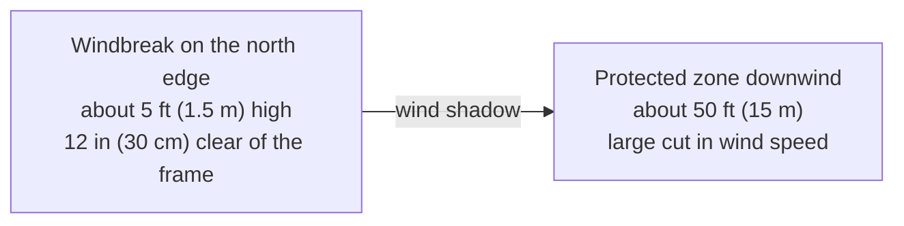

**Options:**
- **Existing fence/wall:** Best option if available — site system on the leeward side
- **Slatted wood fence panel:** 50% permeability is better than solid — solid walls create turbulence
- **Willow hurdles or bamboo screening:** Natural, permeable, ~60% wind reduction
- **Established hedging** (privet, laurel): Best long-term but 2–3 years to establish
- **Temporary windbreak netting:** mesh on stakes, about $10–$20 (R180–R360)

#### Securing the Structure

- Anchor the main frame to the ground with stakes or ground anchors
- Use zip ties or clips to secure supply hoses and drain lines (they act as sails in wind)
- Weight the reservoir or secure it with strapping to the frame
- Use a covered reservoir lid that clips or fastens (not just resting on top)

#### Managing Wind-Driven EC Rise

In sustained windy conditions (Force 4–5), monitor EC more frequently:
- Check EC morning and evening
- Top up with plain pH-adjusted water if EC rises >10% above target
- If away for a weekend in windy weather, lower starting EC by 10–15% as a buffer

[↑ Back to TOC](#table-of-contents)

---


## 7. Rain Management

### 7.1 Rain and Reservoir Dilution

Rain into an open tank dilutes that tank only. The greens tank and the CH4 tank do not share solution, so check both lids.

Worked example, greens tank at EC 1.4 mS/cm. You lose 2.6 US gal (10 L) of solution and 2.6 US gal (10 L) of rain at EC 0.0 falls in. The tank holds 20 US gal (76 L):

```
New EC = (66 L × 1.4 + 10 L × 0.0) / 76 L = 1.22
```

That is still inside 0.8–1.8. A downpour that adds 5–8 US gal (20–30 L) to the greens tank, or half that to the 10 US gal (38 L) fruiting tank, can drop EC below the target for that crop. Tomato fruiting EC is 2.5–3.5 mS/cm and pepper fruiting EC is 2.0–3.0 mS/cm, only in the 10 US gal (38 L) tank.

Also:

- Rain pH is typically 5.5–6.5, which may shift reservoir pH
- If using a captured rainwater source, large rain events can flush roof debris, bird droppings, etc. into a poorly maintained collection barrel

### 7.2 Rain Management Strategy

**Primary defence — cover your reservoir completely:**

```mermaid
flowchart TD
    subgraph A["Option A — Rigid lid with pipe cutouts"]
        A1["LID (wood / polycarbonate)<br/>with cutouts for inlet and outlet pipes"]
        A2["Reservoir"]
        A3["Foam seal around pipe holes prevents ingress"]
        A1 --> A2 --> A3
    end

    subgraph B["Option B — Polycarbonate sheet on frame above reservoir"]
        B1["Polycarbonate roof (on timber frame)"]
        B2["↕ 4 in (10 cm) air gap"]
        B3["Reservoir"]
        B4["Rain deflected sideways; air can circulate"]
        B1 --> B2 --> B3 --> B4
    end

    subgraph C["Option C — Reservoir inside garden box / planter"]
        C1["Completely enclosed structure"]
        C2["Only pipe entry points remain"]
        C1 --> C2
    end
```

**Secondary defence — overflow/drainage:**

If rain does enter, fit an overflow ¾–1¼ in (2–3 cm) below the max fill line on each tank so extra water leaves to the ground.

### 7.3 After a Rain Event

Run through this checklist after a significant rain, more than about 0.4 in (10 mm):

```
POST-RAIN CHECKLIST
□ Check EC in BOTH tanks. If a tank dropped more than 15% and is now below its target, add nutrient stock and recheck. If it is still at or above target, do not add nutrients.
□ Greens target 0.8–1.8 mS/cm. CH4 tomato 2.5–3.5 or pepper 2.0–3.0. Do not average them.
□ Check pH in both tanks. Working window 5.8–6.2. Acceptable band 5.5–6.5.
□ Check channels for pooling or debris washed in
□ Check supply and drain hoses for displacement
□ Check timer/electrics for water ingress
□ Check plant foliage for disease signs (wet foliage + warm = Botrytis risk)
□ If strawberry fruiting — inspect for grey mould (Botrytis cinerea)
```

### 7.4 Benefiting from Rain

Rainwater is often excellent quality for hydroponics:
- EC typically 0.01–0.10 (very soft, good starting water)
- Free of chlorine and chloramines
- Naturally slightly acidic (pH 5.5–6.5)

Harvest roof runoff into a covered barrel and use it to top up or to mix a fresh batch. One square foot of roof collects about 0.62 US gal per 1 in of rain (about 1 L per 1 mm on 1 m²).

> **Caution:** Avoid collecting runoff from:
> - Treated timber roofs (preservative leach)
> - Asbestos cement roofs
> - Roofs with moss killer treatments applied in the last 3 months

[↑ Back to TOC](#table-of-contents)

---


## 8. Humidity and Airflow

### 8.1 Why Humidity Matters

Humidity directly affects:

**Transpiration rate:** Low humidity (dry air) causes plants to transpire rapidly, pulling nutrients up via the xylem. This is good for nutrient delivery but increases demand on the root zone. Very low humidity (<30% RH) causes wilting even when roots have adequate water.

**Disease pressure:** High humidity (>80% RH) creates conditions for fungal diseases — powdery mildew, Botrytis (grey mould), and damping off. Outdoor systems in autumn are especially at risk when day/night temperature swings cause condensation.

**Fruit quality:** High humidity during fruit ripening (strawberries, tomatoes) significantly increases Botrytis and cracking risk.

### 8.2 Humidity by Crop

| Crop | Optimal RH | Risk if too high | Risk if too low |
|---|---|---|---|
| Lettuce / leafy greens | 60–75% | Tip burn, Botrytis | Wilting, tip burn |
| Basil | 50–70% | Powdery mildew | Wilting, leaf drop |
| Tomatoes (flowering) | 40–70% | Blossom drop, Botrytis | Poor fruit set |
| Tomatoes (fruiting) | 50–70% | Botrytis, cracking | Leathery skin |
| Strawberries | 50–70% | Grey mould on fruit | Fruit dehydration |
| Microgreens | 60–80% | Damping off | Tip drying |

### 8.3 Improving Airflow Around the System

Natural airflow (gentle breeze) is beneficial — it:
- Reduces boundary layer humidity around leaves
- Strengthens stems (thigmomorphogenesis)
- Helps prevent fungal disease
- Improves CO₂ availability to leaf surfaces

**Design for airflow:**
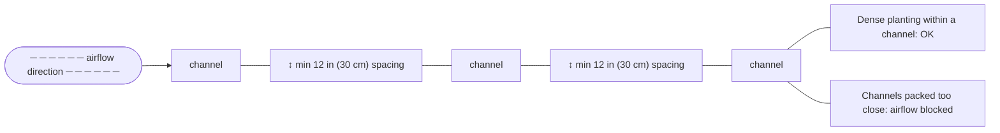

**Orientation:**
- Face the long axis south (SA: north). The working aisle is on the south side. The wind break is on the north edge, about 12 in (30 cm) clear of the frame.
- Do not shove the bench into a stagnant corner. A south-facing masonry wall at your back will trap afternoon heat in June–August (SA: December–February). Leave air moving between the channels.

### 8.4 Managing High Humidity Events

During periods of persistent high humidity (>80% RH), especially in late summer and autumn:

1. **Increase plant spacing** where possible — thin out crowded channels
2. **Remove any yellowing or damaged leaves immediately** — they are Botrytis infection points
3. **Avoid overhead watering** (use base feeding only)
4. **Harvest regularly** — don't let leaves accumulate and decay on the plant
5. **Bicarbonate spray** for powdery mildew: 19 g/US gal (5 g/L) of sodium bicarbonate, on leaves in the morning. See [Guide 07 — Pests and Disease](07-pests-and-disease.md). Fruiting foliage in this NFT build is tomato and pepper on CH4. Strawberries are on CH3.

[↑ Back to TOC](#table-of-contents)

---


## 9. Season Extension Techniques

### 9.1 Cold Frames

A cold frame is a low-profile, transparent-lidded box placed over plants. It is the simplest, cheapest season extension tool.

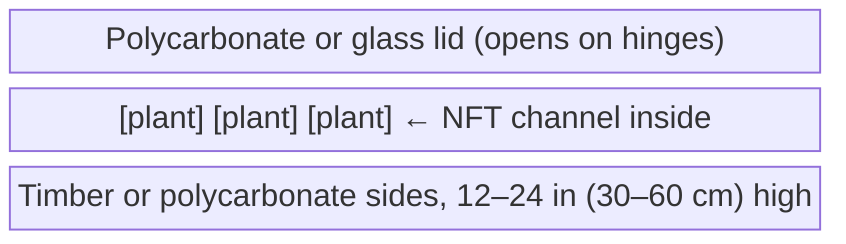

**Performance:**
- Adds about 7–14°F (4–8°C) overnight versus the air outside
- Can stretch the shoulder by a few weeks in April and October (SA: October and April)
- Cost: about $30–$80 (R540–R1,440) for a timber frame, or straw bales and an old window

> **Important:** Vent a cold frame on a sunny day. Inside temperature can pass 104°F (40°C) even in April (SA: October).

### 9.2 Polytunnels

A polytunnel (hoop tunnel) provides significant season extension and weather protection for the entire system.

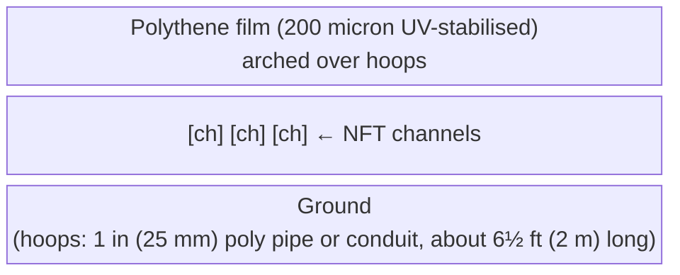

**Performance:**
- Adds about 9–22°F (5–12°C) versus the night air
- Can stretch each end of the outdoor season. It does not make December–February (SA: June–August) a safe NFT season at 0–15°F (−18 to −9°C).
- Keeps rain off foliage
- Cost: about $40–$120 (R720–R2,160) for a hoop cover over the 9 ft × 4 ft (2.7 m × 1.2 m) frame

**Construction:**
1. Drive 24 in (60 cm) stakes at about 3 ft (1 m) intervals along both sides of the bench
2. Push poly pipe hoops over stakes on each side to form arches
3. Drape and secure polytunnel film, leave ends open for ventilation during day
4. Roll up or clip ends closed at night

### 9.3 Fleece Tunnels

Fleece tunnels allow some air and moisture exchange and give about 7°F (4°C) of frost protection. Use them at the April start and the October wind-down (SA: October and April). Take them off once the day is above about 68°F (20°C).

### 9.4 Moving Crops Indoors for Winter

For year-round production of some crops, consider a simple indoor setup during the off-season:

- Small 4-pot DWC bucket or kratky jar
- Full-spectrum LED grow light (50–100W panel)
- Herbs: basil, mint, chives, parsley — can produce indoors year-round
- Microgreens: already recommended as indoor station in Zone B

A 50 W LED panel running 16 h/day uses 0.8 kWh/day. At $0.15/kWh (R2.70/kWh) that is $0.12/day (R2.16/day).

[↑ Back to TOC](#table-of-contents)

---


## 10. Putting It Together — Seasonal Action Plans

### Spring Startup (April)

US month first. South African month is six months later.

```
EARLY APRIL (SA: early October), before the planning frost of April 15:
□ Inspect both loops after winter storage. Two pumps, two tanks, two airlines.
□ Fill the greens tank, 20 US gal (76 L), and the fruiting tank, 10 US gal (38 L),
  with plain water. Confirm each pump. CH4 is not on the greens manifold.
□ Do not mix nutrients into a shared tank. There is no shared tank.
□ Seed kale, spinach, lettuce, and chives indoors
□ Zone B microgreens can already be running

AFTER APRIL 15 (SA: AFTER OCTOBER 15):
□ Transplant lettuce to CH1, herbs to CH2, spinach/kale/mint to CH3
□ Put strawberry crowns into 3–4 of the 11 CH3 sites, not into CH4
□ Fleece ready for a late frost. Both pumps run 24 hours under the fleece.
□ Keep basil, tomato, and pepper indoors until nights stay mild
□ Greens EC at the low end of 0.8–1.8 mS/cm, pH 5.8–6.2
□ Seed tomatoes and peppers indoors for CH4
```

### Full Season (May–September)

SA: November–March.

```
MAY (SA: NOVEMBER):
□ Planning frost is past. Transplant basil to CH2.
□ Transplant cherry tomato and pepper to CH4 only. 4–5 indeterminate cherries
  (skip holes) or up to 7 compact plants. 3 in (76 mm) pots, 12 in (305 mm) spacing.
□ Hang the 40% shade frame. Do not deploy the cloth until highs hold above 85°F (29°C).
□ Both tanks should sit near 64–72°F (18–22°C)
□ CH4 tank only: raise EC into the fruiting band.
  Tomato 2.5–3.5 mS/cm. Pepper 2.0–3.0 mS/cm.
  Greens stay 0.8–1.8 mS/cm in the 20 US gal (76 L) tank. The two tanks never share solution.

JUNE–AUGUST (SA: DECEMBER–FEBRUARY):
□ Afternoon highs 90–100°F (32–38°C)
□ Read both tank temperatures daily. Action line is 77°F (25°C).
□ 40% shade over the 13 ft × 10 ft (4.0 m × 3.0 m) site
□ pH in both tanks, morning and afternoon, during a heatwave
□ Ice bottles in whichever tank is hot. Air pump on in both.
□ Hand-pollinate CH4 flowers in the morning
□ Both pumps stay on 24 hours

AUGUST (SA: FEBRUARY), still inside that heat:
□ Peak harvest
□ Lettuce tip burn: heat plus calcium movement, not a reason to copy CH4 EC into the greens tank
□ Sow a later lettuce and spinach succession for September–October (SA: March–April)
□ Pick CH3 strawberries often so Botrytis does not take them

SEPTEMBER (SA: MARCH):
□ Take shade cloth off once highs are no longer holding above 85°F (29°C)
□ Plan the October 20 (SA: April 20) frost. Fruiting plants come out before it.
```

### Autumn Wind-Down (October)

SA: April.

```
OCTOBER (SA: APRIL):
□ Planning first frost is October 20 (SA: April 20)
□ Fleece on nights that approach 41°F (5°C)
□ Harvest basil (CH2), the last tomatoes and peppers (CH4), and any soft fruit
□ Greens EC can sit at 1.0–1.2 mS/cm, still inside 0.8–1.8, for the last leafy crops
□ CH4 fruiting EC stays in the CH4 tank until those plants are out.
  Then drain that 10 US gal (38 L) tank. Do not pour it into the greens tank.
□ Watch for Botrytis on CH3 strawberries in humid spells

LATE OCTOBER (SA: LATE APRIL):
□ Harvest what is left and drain both NFT loops
□ Plants out, or hand-watered, before any peroxide rinse.
  A dilute rinse is 0.13 US fl oz/US gal (1 mL/L). Do not run 3% H₂O₂ through a live crop.
□ Store both pumps and the air pump where they cannot freeze
□ Winter maintenance is in [Guide 08 — System Maintenance](08-system-maintenance.md)
```

### Winter (December–February)

SA: June–August.

```
□ Do not run unprotected NFT. Winter lows here are 0–15°F (−18 to −9°C).
□ Both tanks empty. Channels empty. Pumps indoors.
□ Zone B microgreens continue indoors
□ A small indoor herb jar is optional. It is not a substitute for leaving CH4 outside.
□ Order seed and nutrients for the April (SA: October) start
□ CH1 lettuce, CH2 herbs, CH3 spinach/kale/mint plus 3–4 strawberries, CH4 tomato and pepper
```

[↑ Back to TOC](#table-of-contents)

---


## 11. Climate Monitoring Setup

### 11.1 Minimum Monitoring Kit

For a functional outdoor system, you need at minimum:

| Instrument | What it measures | Minimum spec | Cost |
|---|---|---|---|
| Min/max thermometer | Overnight air range | Digital, outdoor-rated | $5–$15 (R90–R270) |
| EC/pH meter | Both tanks, separately | Combo pen | $50–$120 (R900–R2,160) |
| Aquarium thermometer | One per tank | Waterproof digital, buy two | $5–$15 (R90–R270) each |
| Hygrometer | Ambient RH and air temp | Basic digital | $8–$15 (R144–R270) |

Minimum kit: about $70–$165 (R1,260–R2,970), plus a second thermometer so each tank has its own probe. Planning rate $1 = R18, frozen 3 October 2026.

### 11.2 Optional / Upgrade Monitoring

| Instrument | Benefit | Cost |
|---|---|---|
| WiFi temperature and humidity logger | Phone alerts | $15–$30 (R270–R540) |
| Dissolved oxygen meter | Root-zone oxygen, either tank | $100–$300 (R1,800–R5,400) |
| Weather station | Wind, rain, light | $40–$200 (R720–R3,600) |
| Inline EC and pH, one cell per loop | Continuous readings. Two EC targets, not one. | $150–$400 (R2,700–R7,200) per loop if you buy two |

### 11.3 Logbook Integration

Record in the daily log from [Guide 08 — System Maintenance](08-system-maintenance.md):

```
DATE: ___________
Time of check: _______ AM / PM

Air temp now: ___°F (___°C)     Min/max: ___ / ___°F
Greens solution temp: ___°F (___°C)
CH4 solution temp: ___°F (___°C)
Greens EC: ___    target 0.8–1.8     Greens pH: ___
CH4 EC: ___       tomato 2.5–3.5 or pepper 2.0–3.0     CH4 pH: ___
RH: ___%
Both pumps ran 24 h: Y / N

Weather:
  □ Clear    □ Cloudy    □ Rain (___ in / ___ mm)    □ Wind
  □ Frost    □ Highs above 85°F (29°C) — 40% shade due

Actions:
  □ Topped up greens tank (___ US gal). EC was at/above target: plain water. Below: stock.
  □ Topped up CH4 tank the same way, using the CH4 target
  □ Fleece    □ 40% shade    □ Ice bottles, which tank: _______
```

[↑ Back to TOC](#table-of-contents)

---


## 12. Quick-Reference Decision Tree

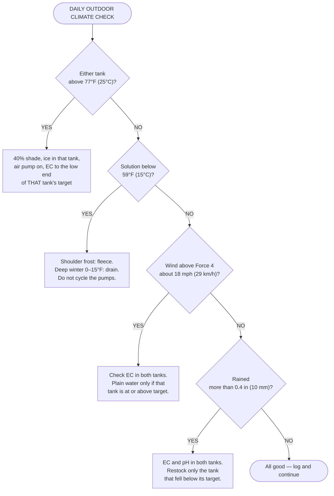

[↑ Back to TOC](#table-of-contents)

---


## Summary

| Season | Primary risk | Key action |
|---|---|---|
| April (SA: October) | Frost around April 15, slow growth | Fleece, greens EC at the low end of 0.8–1.8, hardy crops first |
| June–August (SA: December–February) | 90–100°F (32–38°C), low dissolved oxygen | 40% shade above 85°F (29°C), white exterior on a black tank, ice, two EC readings |
| October (SA: April) | Frost on October 20, Botrytis | Fleece, harvest CH4, then drain |
| December–February (SA: June–August) | 0–15°F (−18 to −9°C) | Do not run unprotected NFT. Drained tanks. Zone B indoors. |

Outdoor production at this site is the mid-April through mid-October window (SA: mid-October through mid-April), about six months. Fleece covers a frost night at either end. It does not extend NFT through deep winter.

[↑ Back to TOC](#table-of-contents)

---

> **Previous:** [Guide 09 — Troubleshooting](09-troubleshooting.md)
> **Next:** [Guide 11 — Build Guide](11-build-guide.md)

<!-- copyright -->
*Copyright (c) 2026 UncleJS. Licensed under [CC BY-NC-SA 4.0](https://creativecommons.org/licenses/by-nc-sa/4.0/) — free to share and adapt for non-commercial purposes with attribution and ShareAlike.*
