# Guide 11 — DIY Build Guide: Full System Construction

[](../../README.md)
[](https://creativecommons.org/licenses/by-nc-sa/4.0/)


This guide walks you through building the complete three-zone hydroponic system from scratch — from preparing the site through to planting your first crops. Every step includes dimensions, material specifications, ASCII diagrams, and safety notes.

Estimated total build time: **8–12 hours** spread over 2–3 weekends.

---

## Table of Contents

- [1. System Overview Recap](#1-system-overview-recap)
- [2. Tools Required](#2-tools-required)
  - [Essential Tools](#essential-tools)
  - [Useful But Optional](#useful-but-optional)
- [3. Safety and Prep Notes](#3-safety-and-prep-notes)
- [4. Step 1 — Site Preparation and Orientation](#4-step-1-site-preparation-and-orientation)
  - [4.1 Choosing the Site](#41-choosing-the-site)
  - [4.2 Orientation](#42-orientation)
  - [4.3 Marking Out the Footprint](#43-marking-out-the-footprint)
- [5. Step 2 — Frame Construction](#5-step-2-frame-construction)
  - [5.1 Elevated Bench](#51-elevated-bench)
  - [5.2 Why an A-Frame Is Not This Build](#52-why-an-a-frame-is-not-this-build)
- [6. Step 3 — Channel Preparation](#6-step-3-channel-preparation)
  - [6.1 Channel Material Choices](#61-channel-material-choices)
  - [6.2 Cutting Channels to Length](#62-cutting-channels-to-length)
  - [6.3 Drilling Net Pot Holes](#63-drilling-net-pot-holes)
  - [6.4 Fitting End Caps](#64-fitting-end-caps)
  - [6.5 Spray Bar (Optional Alternative to Direct Feed)](#65-spray-bar-optional-alternative-to-direct-feed)
- [7. Step 4 — Reservoir Setup](#7-step-4-reservoir-setup)
  - [7.1 Reservoir Selection](#71-reservoir-selection)
  - [7.2 Preparing the Reservoir](#72-preparing-the-reservoir)
  - [7.3 Drilling Bulkhead Holes in the Reservoir](#73-drilling-bulkhead-holes-in-the-reservoir)
- [8. Step 5 — Plumbing](#8-step-5-plumbing)
  - [8.1 Plumbing Overview](#81-plumbing-overview)
  - [8.2 Building the Supply Manifold](#82-building-the-supply-manifold)
  - [8.3 Supply Tubes](#83-supply-tubes)
  - [8.4 Drain System](#84-drain-system)
  - [8.5 Sealing and Testing Joints](#85-sealing-and-testing-joints)
- [9. Step 6 — Electrical and Timer Setup](#9-step-6-electrical-and-timer-setup)
  - [9.1 Safety First](#91-safety-first)
  - [9.2 Timer Setup](#92-timer-setup)
  - [9.3 Air Pump (Optional but Recommended)](#93-air-pump-optional-but-recommended)
- [10. Step 7 — System Test (Water Only)](#10-step-7-system-test-water-only)
  - [10.1 Water Test Procedure](#101-water-test-procedure)
  - [10.2 Common Test Failures and Fixes](#102-common-test-failures-and-fixes)
- [11. Step 8 — First Nutrient Solution Fill](#11-step-8-first-nutrient-solution-fill)
  - [11.1 Mixing the Nutrient Solution](#111-mixing-the-nutrient-solution)
- [12. Step 9 — Planting](#12-step-9-planting)
  - [12.1 Transplanting Seedlings](#121-transplanting-seedlings)
  - [12.2 Spacing by Crop](#122-spacing-by-crop)
  - [12.3 First 48 Hours After Planting](#123-first-48-hours-after-planting)
- [13. Step 10 — Zone B Microgreens Station](#13-step-10-zone-b-microgreens-station)
  - [13.1 Materials for Zone B](#131-materials-for-zone-b)
  - [13.2 Coco Coir Preparation](#132-coco-coir-preparation)
  - [13.3 Filling and Seeding Trays](#133-filling-and-seeding-trays)
  - [13.4 Shelf Layout](#134-shelf-layout)
- [14. Step 11 — Zone C Root Veg Grow Bags](#14-step-11-zone-c-root-veg-grow-bags)
  - [14.1 Materials for Zone C](#141-materials-for-zone-c)
  - [14.2 Growing Medium Mix](#142-growing-medium-mix)
  - [14.3 Sowing Root Veg Direct](#143-sowing-root-veg-direct)
  - [14.4 Grow Bag Layout](#144-grow-bag-layout)
- [15. Common Build Mistakes and How to Avoid Them](#15-common-build-mistakes-and-how-to-avoid-them)
  - [Mistake 1 — Insufficient slope](#mistake-1-insufficient-slope)
  - [Mistake 2 — Flow rate too high](#mistake-2-flow-rate-too-high)
  - [Mistake 3 — Light leaks into reservoir](#mistake-3-light-leaks-into-reservoir)
  - [Mistake 4 — Not deburring holes](#mistake-4-not-deburring-holes)
  - [Mistake 5 — Skipping the water test](#mistake-5-skipping-the-water-test)
  - [Mistake 6 — EC or pH meter uncalibrated](#mistake-6-ec-or-ph-meter-uncalibrated)
  - [Mistake 7 — Planting too early in spring](#mistake-7-planting-too-early-in-spring)
  - [Mistake 8 — Overcrowding channels](#mistake-8-overcrowding-channels)
  - [Mistake 9 — Letting the reservoir run low](#mistake-9-letting-the-reservoir-run-low)
  - [Mistake 10 — Not having a backup plan for pump failure](#mistake-10-not-having-a-backup-plan-for-pump-failure)
- [16. Build Checklist](#16-build-checklist)

---


## 1. System Overview Recap

Before building, confirm the full system you are constructing:

**Zone A — NFT Channel Array**

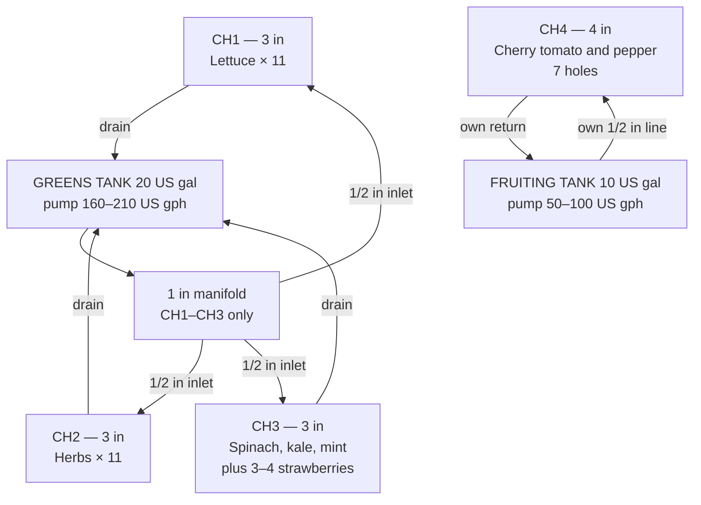

**Zone B — Microgreens Station**


**Zone C — Root Veg Grow Bags**


**System specifications:**
- CH1–CH3: 3 in (76 mm) square tube, 8 ft (2.44 m), 11 sites each, 2 in (51 mm) net pots, 9 in (229 mm) spacing
- CH4 only: 4 in (102 mm) square tube, 8 ft (2.44 m), 7 holes at 12 in (305 mm), 3 in (76 mm) net pots. Cherry tomato and pepper. Not strawberries.
- Slope: 1:30, a 3¼ in (83 mm) drop over 8 ft (2.44 m)
- Posts: 36 in (91 cm) at the high end, 32¾ in (83 cm) at the low end
- Greens tank: 20 US gal (76 L), pump 160–210 US gph (600–800 L/h), about 15 W, 24 hours a day, EC 0.8–1.8 mS/cm, change every 7 days
- Fruiting tank: 10 US gal (38 L), pump 50–100 US gph (200–400 L/h), about 8 W, 24 hours a day, own ½ in (13 mm) line, not on the greens manifold. Tomato EC 2.5–3.5 mS/cm or pepper EC 2.0–3.0 mS/cm. Change every 5–7 days.
- Greens manifold: 1 in (25 mm), CH1–CH3 only. Inlets ½ in (13 mm). Each return ¾–1 in (19–25 mm) back to its own tank.
- Air pump recommended in both tanks
- 40 sites in Zone A (33 + 7)
- Frame footprint about 9 ft × 4 ft (2.7 m × 1.2 m), including both tanks at the low end
- Site: 13 ft × 10 ft (4.0 m × 3.0 m). Working aisle 24 in (61 cm) on the south side. Wind break on the north edge, about 12 in (30 cm) clear of the frame.

[↑ Back to TOC](#table-of-contents)

---


## 2. Tools Required

### Essential Tools

| Tool | Purpose | Notes |
|---|---|---|
| Tape measure | All measurements | Steel, 16 ft (5 m) minimum |
| Pencil / marker | Marking cut lines | Permanent marker on PVC |
| Handsaw or circular saw | Cutting timber for frame | Or mitre saw for accuracy |
| Hacksaw or PVC pipe cutter | Cutting PVC channels and pipe | Pipe cutter gives cleaner cuts |
| Electric drill | Pilot holes, screwing frame | 10–18V cordless |
| Hole saw set | Net pot holes | 2 in (51 mm) for CH1–CH3; 3 in (76 mm) for CH4 |
| Step drill or spade bit | Reservoir holes | For ¾–1¼ in (19–32 mm) bulkhead fittings |
| Screwdriver (flat + Philips) | Assembly | Or drill bits |
| Spirit level | Setting the 1:30 slope | 24 in (60 cm) minimum |
| Rubber mallet | Seating fittings | Avoids cracking PVC |
| Utility knife / Stanley knife | Trimming, cutting pond liner | Sharp blade |
| Sandpaper (120 grit) | Deburring PVC cut edges | Prevents root snags |
| Bucket, about 2.5 US gal (10 L) | Mixing, testing, cleaning | |
| Safety glasses | All cutting operations | Non-negotiable |
| Work gloves | PVC edges are sharp | |

### Useful But Optional

| Tool | Why useful |
|---|---|
| Mitre saw | Clean, accurate timber cuts |
| Jigsaw | Curved cuts, lid cutouts |
| Heat gun | Bending PVC if needed |
| Cable ties (bag of 100) | Securing hoses, tidying wiring |
| Silicone sealant gun | Extra sealing around bulkheads |
| Digital angle finder | Setting precise slope on frame |

[↑ Back to TOC](#table-of-contents)

---


## 3. Safety and Prep Notes

1. **Wear safety glasses for all cutting.** PVC and timber generate chips that can permanently damage eyes.
2. **Deburr all PVC cuts.** After sawing, run sandpaper around the inside edge of every cut — rough edges snag roots and damage them.
3. **All outdoor electrical connections must be weatherproofed.** Mains are 120 V with an outdoor GFCI (SA: 230 V with a 30 mA earth-leakage breaker). Use an outdoor-rated extension lead. The NFT pumps run 24 hours. A timer is for the Zone B light, not for cycling these pumps.
4. **Test the system with plain water before using any nutrient solution.** This catches leaks before they cause problems.
5. **Use only food-grade or hydroponics-safe materials** in contact with nutrient solution:
   - HDPE (High-Density Polyethylene) or LDPE containers — ✅
   - Polypropylene fittings — ✅
   - PVC irrigation pipe — ✅
   - PVC conduit (grey, unplasticised) — ✅
   - Galvanised metal in contact with solution — ❌ (zinc toxicity)
   - Pressure-treated timber in contact with solution — ❌ (preservative leach)
   - Copper pipe — ❌ (copper toxicity to roots)

[↑ Back to TOC](#table-of-contents)

---


## 4. Step 1 — Site Preparation and Orientation

### 4.1 Choosing the Site

Before placing anything, evaluate potential sites against these criteria:

```
SITE EVALUATION CHECKLIST

□ Sunlight: Does the spot receive ≥6 hours direct sun per day?
  → For leafy greens: 4–6 h acceptable
  → For tomatoes/peppers: 6–8 h required

□ Proximity to power: Is there a GFCI-protected outdoor outlet within about 30 ft (10 m)?
  → SA: a 30 mA earth-leakage breaker. Extension leads must be outdoor-rated and kept dry.

□ Proximity to water: Can you fill a 20 US gal (76 L) tank and a 10 US gal (38 L) tank
  without carrying water more than about 150 ft (50 m)?
  → A hose is the easy path. A covered rain barrel also works.

□ Wind exposure: Is there a fence, wall, or hedge on the prevailing wind side?
  → If not, plan windbreak installation (see Guide 10)

□ Drainage: Does the area drain well?
  → Avoid standing water — channels will overflow eventually; puddles breed pests

□ Level ground: Is the ground reasonably flat?
  → You don't need perfectly flat — you'll build a levelled frame on top
  → But >5° slope in the ground complicates frame construction

□ Accessibility: Can you reach all four channels to plant and harvest?
  → This build's posts are 36 in (91 cm) at the high end and 32¾ in (83 cm) at the low end.
  → That is the working height. Do not raise the bench and then lose the 1:30 slope.
```

### 4.2 Orientation

**Face the long axis south (SA: north).** The working aisle, 24 in (61 cm), is on the south side. The wind break is on the north edge, about 12 in (30 cm) clear of the frame. Channels run east–west so the row faces the sun. If the site forces another rotation, keep the high end and the low end, and put 40% shade on when afternoon highs hold above 85°F (29°C).

**The supply end is the HIGH end.** Inlets at the 36 in (91 cm) posts, drains at the 32¾ in (83 cm) posts. Both tanks sit at the low end so the returns are short. The greens return and the CH4 return go to different tanks.

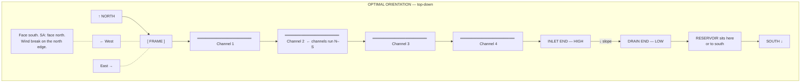

### 4.3 Marking Out the Footprint

Mark out the exact footprint of the frame on the ground before building:

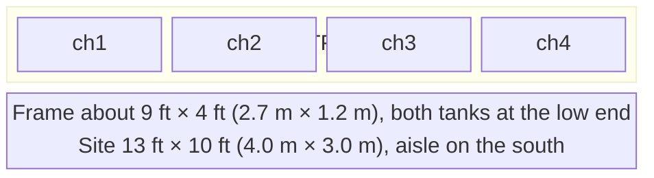

Mark corners with pegs or chalk. This avoids building the frame and discovering it doesn't fit.

[↑ Back to TOC](#table-of-contents)

---


## 5. Step 2 — Frame Construction

The frame supports the channels at the correct height and slope. This build is an elevated bench. An A-frame is too steep for NFT and is not part of this build.

### 5.1 Elevated Bench

Posts are 36 in (91 cm) at the high (inlet) end and 32¾ in (83 cm) at the low (drain) end. The difference is the 3¼ in (83 mm) drop of a 1:30 slope over 8 ft (2.44 m).

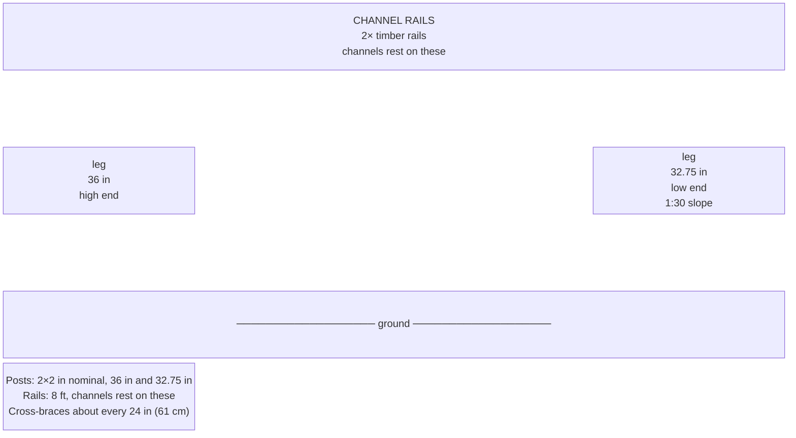

**Timber cut list (Zone A bench):**

| Piece | Qty | Section | Length | Notes |
|---|---|---|---|---|
| Post, high end | 2 | 2×2 in (45×45 mm) | 36 in (91 cm) | Inlet end |
| Post, low end | 2 | 2×2 in (45×45 mm) | 32.75 in (83 cm) | 36 − 3.25 = 32.75. This is the 1:30 drop. |
| Channel rail | 2 | 1×3 in (25×75 mm) | 8 ft (2.44 m) | Full channel length |
| Cross-brace, top | 3 | 2×2 in (45×45 mm) | 55 in (140 cm) | Joins the two rails. Frame is about 4 ft (1.2 m) wide. |
| Cross-brace, lower | 3 | 2×2 in (45×45 mm) | 55 in (140 cm) | Mid-height |
| Reservoir shelf | 1 | ¾ in (18 mm) plywood | 24 in × 24 in (61 cm × 61 cm) | Optional. Both tanks sit at the low end. The shelf must hold two containers, not one. |

**Assembly order:**
1. Cut all timber to length. Sand any rough edges.
2. On a flat surface, assemble one side frame: high post, low post, one 8 ft rail, and braces. Use 3 in (75 mm) screws and exterior wood glue. The low post is the 32.75 in piece.
3. Repeat for the other side frame.
4. Stand both side frames up, connect them with the remaining cross-braces.
5. Check for square using a tape measure diagonally (both diagonals should be equal).
6. Add temporary diagonal bracing (scrap timber) to hold square while glue dries.
7. Optionally: paint or treat exterior frame timber with a water-based preservative (NOT creosote or solvent-based near solution).

```
SLOPE CALCULATION
  Slope: 1:30 (1 in of drop per 30 in of run)
  Channel length: 8 ft = 96 in
  Total drop: 96 ÷ 30 = 3.2 in, built as 3.25 in (83 mm)

  High-end post: 36 in (91 cm)
  Low-end post:  36 − 3.25 = 32.75 in (83 cm)
  ─────────────────────────────────
  Difference:    3.25 in (83 mm)
```

> **Important:** Cut the low-end posts shorter. Check the drop with a tape before you drill the channels. 3¼ in (83 mm) over 8 ft (2.44 m) is the whole slope. Do not eyeball a steeper pitch.

### 5.2 Why an A-Frame Is Not This Build

An A-frame puts the channels on a steep triangle. A typical A-frame is closer to 30–40 degrees. NFT for this system is 1:30, which is a few degrees, not a roof pitch. An A-frame is too steep and is not part of this build. Do not mount the four channels on A-frame faces.

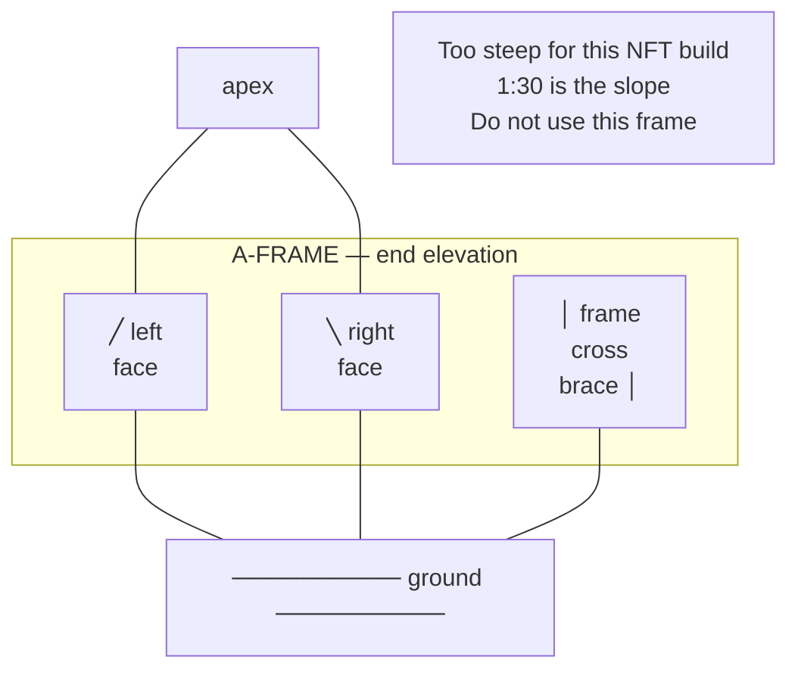

Leave the diagram as a warning. Build the bench in section 5.1.

[↑ Back to TOC](#table-of-contents)

---


## 6. Step 3 — Channel Preparation

### 6.1 Channel Material Choices

| Option | Material | Pro | Con |
|---|---|---|---|
| **3 in (76 mm) square tube** | uPVC | US trade size for CH1–CH3 | Needs end caps |
| **4 in (102 mm) square tube** | uPVC | US trade size for CH4 | One channel only |
| **Dedicated NFT channel** | Hydro-grade PVC | Purpose-built | About $2.50–$6 per ft ($8–$20/m), which is $45–$110 (R810–R1,980) |
| **Open rain gutter** | uPVC | Cheap | Open top grows algae. Not this build. |

**This build:** three lengths of 3 in (76 mm) square tube at 8 ft (2.44 m) for CH1–CH3, and one length of 4 in (102 mm) square tube at 8 ft (2.44 m) for CH4. Buy the US trade size. A hardware store will stock 8 ft or 10 ft sticks. Cut 10 ft sticks down to 8 ft.

### 6.2 Cutting Channels to Length

1. Mark 8 ft (2.44 m) from one end of each tube.
2. Wrap a piece of paper around the pipe at the mark — the paper edge gives a straight cutting guide.
3. Cut with a hacksaw or PVC pipe cutter. Keep the cut square.
4. Deburr both cut ends inside and outside with 120-grit sandpaper.
5. Repeat for all 4 channels.

### 6.3 Drilling Net Pot Holes

Net pot holes are drilled along the top face of each channel at regular spacing.

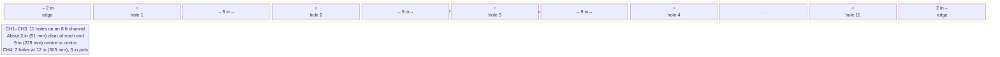

**Hole size:**
- 2 in (51 mm) hole saw and 2 in net pots for CH1, CH2, and CH3 (33 pots)
- 3 in (76 mm) hole saw and 3 in net pots for CH4 (7 pots)

**Drilling procedure:**
1. Mark hole centres with a ruler and permanent marker.
2. Create a small dimple with a punch or nail at each mark (prevents drill bit wandering).
3. Drill with the correct hole saw at slow speed — let the saw do the work, don't force.
4. Remove the cut disc (the "knockout") — it often stays inside the channel; shake it out.
5. Deburr every hole inside and outside with sandpaper wrapped around a finger.

### 6.4 Fitting End Caps

**High end (inlet):**
- Fit a PVC square end cap (same size as channel). Push firmly to seat.
- Drill a hole about ½ in (13 mm) in the top-centre of the end cap.
- Insert a ½ in (13 mm) barbed elbow. That is the inlet size on every channel, including CH4.
- Seal around the fitting with silicone sealant. Allow 24 h to cure.

**Low end (drain):**
- Fit a PVC end cap as above.
- Drill a ¾–1 in (19–25 mm) hole in the BOTTOM of the end cap. The drain is the low point.
- Insert a matching bulkhead or solvent-weld socket.
- Fit a short drain stub.
- CH1–CH3 return to the greens tank. CH4 returns to the fruiting tank. Do not join those two returns.

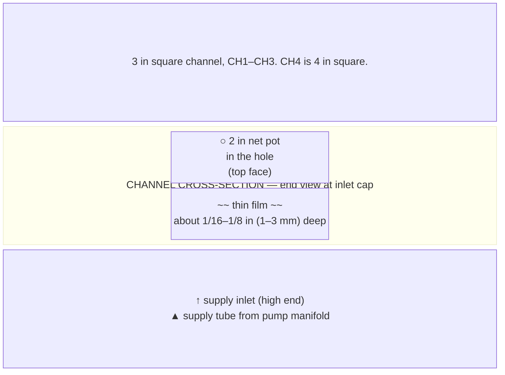

### 6.5 Spray Bar (Optional Alternative to Direct Feed)

Instead of a single inlet fitting per channel, some builders use a short spray bar (a length of ½ in (13 mm) tube with 3–4 micro holes) inserted into the high end. This distributes flow evenly across the channel width rather than a single stream that pools to one side.

To make a simple spray bar:
1. Cut a 2 in (50 mm) piece of ½ in (13 mm) irrigation tube.
2. Drill 3 small holes, about 1/32 in (1 mm), spaced ⅝ in (15 mm) apart along the side.
3. Insert into the inlet fitting at the channel high end, holes pointing down.
4. The water fans out across the channel base rather than channelling to one corner.

[↑ Back to TOC](#table-of-contents)

---


## 7. Step 4 — Reservoir Setup

### 7.1 Reservoir Selection

Two food-grade HDPE containers with lids. They never share solution.

- **Greens:** 20 US gal (76 L). CH1–CH3.
- **Fruiting:** 10 US gal (38 L). CH4 only, own pump.

Good options, priced at the 3 October 2026 planning rate ($1 = R18):
- **Storage tote, greens** — about $20–$40 (R360–R720) for a 20 US gal HDPE bin
- **Smaller tote, fruiting** — about $12–$25 (R216–R450) for a 10 US gal HDPE bin
- **Dedicated hydro reservoirs** — about $40–$80 (R720–R1,440) each if you buy purpose-made tanks
- **Used food barrels** — about $10–$25 (R180–R450) if they are food-grade HDPE and the right volume

An IBC tote is hundreds of gallons. It is the wrong size for either loop.

**Do NOT use:**
- Any container that previously held chemicals, paint, or non-food substances
- Metal containers (zinc, aluminium, galvanised steel — all toxic to roots)
- Thin-walled containers that bow when full. 20 US gal (76 L) of solution weighs about 167 lb (76 kg). The 10 US gal tank weighs about 84 lb (38 kg).

### 7.2 Preparing the Reservoir

**Lid preparation:**
Do this on **both** lids.

1. Mark holes for:
   - Pump cable exit (a slit about ½ in / 13 mm, not a round hole)
   - Greens lid: one hole for the line up to the 1 in (25 mm) manifold
   - Fruiting lid: one hole for the CH4 ½ in (13 mm) line. This line does not go to the greens manifold.
   - Air line entry on each lid. An air pump is recommended in both tanks.
   - A fill port, about 6 in (150 mm), with a cap, so you can top up and measure EC without lifting the whole lid
2. Cut holes with a jigsaw or step drill.
3. Seal around pipes with silicone sealant or foam gasketing to prevent light entry.

**Reservoir marking:**
1. Fill each tank to operating level, about 4 in (10 cm) below the rim, and mark the waterline.
2. Mark 2 US gal (about 8 L) steps down the greens tank, and 1 US gal (about 4 L) steps down the fruiting tank.
3. You can then see a day's use without a jug.

**Paint, both tanks:** black body, white exterior.

Light grows algae. A dark exterior absorbs heat. Do both layers:
- Black on the body, or a black liner inside, so no light gets through
- White paint, or a white/silver wrap, on the outside, so the afternoon sun reflects
- Do not stop at black paint only. Do not use a white-only container.
- Shade both tanks. See [Guide 10 — Climate Management](10-climate-management.md).

### 7.3 Drilling Bulkhead Holes in the Reservoir

The return drain from the channels empties back into the reservoir. You need a return inlet.

Two options:
- **Top-fill return (simplest):** Run a drain return pipe to the open top of the reservoir, through the inspection port. No drilling needed. Splash as the return hits the water increases oxygenation.
- **Bulkhead fitting (cleaner):** Drill a hole about 1¼ in (32 mm), 2 in (5 cm) below the max fill line. Insert a 1 in (25 mm) bulkhead. Silicone both flanges. Each loop gets its own return into its own tank.

For most DIY builds, the top-fill return is simpler and provides better oxygenation. Use the bulkhead fitting if you want a completely sealed lid with no open ports.

[↑ Back to TOC](#table-of-contents)

---


## 8. Step 5 — Plumbing

### 8.1 Plumbing Overview

Two loops. CH4 is not a fourth branch on the greens manifold.

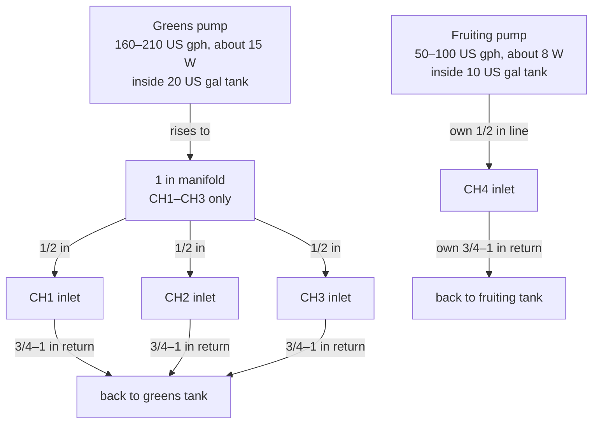

### 8.2 Building the Supply Manifold

The greens manifold is a 1 in (25 mm) header along the high end. It feeds CH1, CH2, and CH3 only.

**Materials for the greens manifold:**
- 1× 1 in (25 mm) PVC pipe, about 32 in (800 mm) long
- 3× ½ in (13 mm) outlets
- 3× inline ball valves, ½ in (13 mm), one per greens channel
- A reducer from the greens pump outlet up to the 1 in header
- An end cap on the far end of the header

**CH4 supply, separate:**
- ½ in (13 mm) tube from the fruiting pump directly to the CH4 inlet
- One valve on that line if you need to trim flow
- Do not tee this line into the 1 in manifold

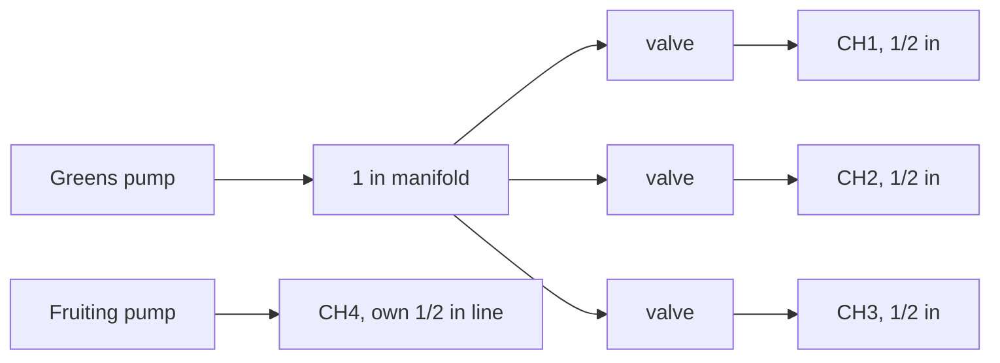

**Assembly:**
1. Drill or thread 3 holes in the 1 in manifold, one for each greens channel.
2. Fit threaded outlet fittings. Apply PTFE (Teflon) tape to all threads before assembly.
3. Fit ball valves to each outlet.
4. Run ½ in (13 mm) tube from each greens valve to that channel's inlet.
5. Connect the greens pump to the manifold. Run the fruiting pump's own ½ in line to CH4.

**Manifold mounting:** Attach the manifold to the high-end cross-brace of the frame using hose clips or cable ties. Position so each supply tube descends naturally to its channel inlet without sharp kinks.

### 8.3 Supply Tubes

From the valves to the inlets, use ½ in (13 mm) black UV-stable tube. Push it onto the barbs and fit hose clips.

**Routing:**
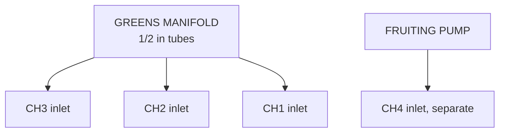

Keep each supply tube short, about 12–24 in (30–60 cm), so you do not add a lot of head.

### 8.4 Drain System

Each loop has its own return. Do not build one header that dumps CH4 into the greens tank.

**Greens return (CH1–CH3):**
- Three drain stubs, ¾–1 in (19–25 mm)
- A return pipe of the same size, sloped back to the 20 US gal tank

**Fruiting return (CH4):**
- Its own ¾–1 in (19–25 mm) line back to the 10 US gal tank
- No tee into the greens return

**Assembly:**
1. Lay the drain header pipe along the low end of the frame, underneath the channel drain stubs.
2. Mark and drill holes in the header at each stub position.
3. Insert reducing T-pieces. Apply solvent cement or use push-fit connectors.
4. Connect each channel drain stub to the corresponding T-piece using short hose lengths.
5. Slope each return slightly downhill, at least as steep as 1:40, so it does not pool. The channel slope itself stays 1:30.

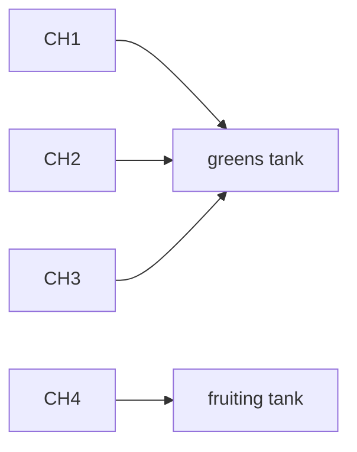

**Return to reservoir:** The return pipe can either:
- Drop directly into the open reservoir top (simplest; good oxygenation)
- Connect to a bulkhead fitting on the reservoir side (tidier but more work)

If dropping into the open top, place a splash guard (a small piece of cut PVC cap or plastic) under the return point to prevent water spraying outside the reservoir.

### 8.5 Sealing and Testing Joints

Before testing the full system, inspect every joint:
- Every threaded fitting: PTFE tape on all male threads
- Every push-fit: firmly seated, give it a pull to confirm
- Every barbed fitting with hose: secured with a hose clip
- Every bulkhead: silicone both flanges, nut tight
- Solvent-welded joints: must cure 1 hour at minimum (24 h recommended) before pressure

[↑ Back to TOC](#table-of-contents)

---


## 9. Step 6 — Electrical and Timer Setup

### 9.1 Safety First

Water and electricity are a dangerous combination. Treat all outdoor electrical work with extreme caution.

**Non-negotiable rules:**
1. **Use an outdoor GFCI.** If the socket is not protected, fit a GFCI adaptor. About $10–$20 (R180–R360). In South Africa the equivalent protection is a 30 mA earth-leakage breaker on 230 V.
2. **Use outdoor-rated extension leads.** These are UV-stabilised and have weatherproof socket covers.
3. **Keep all plugs and connectors elevated** — never let them sit in puddles. Use cable hooks to keep them off the ground and away from the reservoir.
4. **Never modify plugs or run bare wire outdoors.** Use proper waterproof cable connectors or weatherproof junction boxes.
5. **Do not plug in anything when wet** — hands, connections, or the outlet.

### 9.2 Timer Setup

Both NFT pumps run **24 hours a day**. Greens pump and fruiting pump. There is no overnight off, and there is no 15-minutes-on / 45-minutes-off schedule. A stopped channel dries in 15–30 minutes in warm weather, including for seedlings.

A timer belongs on the Zone B LED (16 h on / 8 h off), inside, not on these pumps.

**Housing:**
Plugs sit in a weatherproof box, off the ground, on the GFCI circuit. Do not leave an indoor timer in the rain. You do not need a pump timer to "save" the motors overnight.

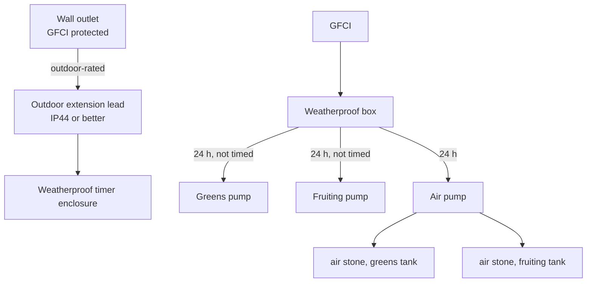

### 9.3 Air Pump (Recommended in Both Tanks)

An air pump with a stone in each reservoir raises dissolved oxygen, which matters once solution temperature climbs toward 77°F (25°C). Run it with the water pumps, 24 hours.

**Spec:** one air pump that can feed two lines, about 1–1.5 US gpm of air is unnecessary — a small 4–6 L/min pump with a T and two airlines is enough for a 20 US gal tank and a 10 US gal tank. About $8–$20 (R144–R360). Put a non-return valve on each airline. Keep the air pump above the waterline so a stopped pump does not siphon.

Two stones, one in each tank. Do not bubble only the greens tank and leave CH4 flat.

[↑ Back to TOC](#table-of-contents)

---


## 10. Step 7 — System Test (Water Only)

**Do not add nutrients until the water test is complete.** This is the most important step in the build.

### 10.1 Water Test Procedure

```
WATER TEST SEQUENCE

Step 1: Fill each tank with plain water
  → Greens: about 18 US gal (68 L) in the 20 US gal tank, with headroom
  → Fruiting: about 8 US gal (30 L) in the 10 US gal tank

Step 2: Power on BOTH pumps. They are not on a cycle timer.
  → Each pump should hum, not grind or suck air
  → Greens flow should show at CH1, CH2, and CH3 within about 30 seconds
  → CH4 flow comes from the fruiting pump only

Step 3: Check each channel for flow
  → Shine a torch into each channel at the low end
  → You should see a thin film of water moving toward the drain
  → Greens target: 0.26–0.53 US gpm (1–2 L/min) per channel
  → Time how long a 1 US qt (about 1 L) jug takes to fill at a drain

Step 4: Adjust the three greens valves so CH1–CH3 match
  → CH4 is balanced on its own valve, against its own smaller pump
  → Do not fully close a valve. Leave at least a crack open so the pump is not dead-headed.

Step 5: Check all joints for leaks
  → Watch all fittings for 10 full minutes
  → Pay special attention to: bulkhead flanges, barbed fittings, end cap inlets
  → Mark any drips with tape; dry the area; reseal with silicone; retest

Step 6: Check the drain return
  → Ensure all drains are flowing into the drain header
  → Ensure the header is draining into the reservoir (no backup)
  → Watch reservoir level — it should remain constant (not rising or falling)

Step 7: Verify slope
  → Look at the channel from the side — is there a visible downhill gradient?
  → Place a marble or ball bearing in the channel; it should roll slowly to the drain
  → If pooling occurs (water sitting still), the slope is insufficient in that section

Step 8: Run for 30 minutes
  → Leave the pump running for 30 continuous minutes
  → Inspect all joints again at the end
  → Check reservoir level — should still be at fill mark (no significant evaporation loss)

Step 9: Drain test water
  → Remove and discard the test water (it's picked up any residue from new fittings)
  → Rinse reservoir with clean water
  → System is now ready for first nutrient fill
```

### 10.2 Common Test Failures and Fixes

| Problem observed | Likely cause | Fix |
|---|---|---|
| No flow at channel inlet | Valve closed; pump not primed | Open valve; check pump is submerged; check power |
| Very slow flow | Valve too closed; supply tube kinked | Adjust valve; re-route tube |
| Flow unequal across channels | Valve adjustment needed | Throttle high-flow channels |
| Leak at end cap inlet | Silicone not cured; barb not seated | Remove, reapply silicone, allow 24 h |
| Leak at bulkhead | Lock nut loose; silicone failed | Tighten nut; reapply silicone on flange |
| Pool in middle of channel | Slope broken at that point | Re-level frame at that section |
| Drain backing up | Header slope insufficient; blockage | Re-angle header; clear any debris |
| Pump noisy/grinding | Running dry; debris in impeller | Ensure submerged; clean impeller |

[↑ Back to TOC](#table-of-contents)

---


## 11. Step 8 — First Nutrient Solution Fill

After a successful water test, prepare the first nutrient batch.

### 11.1 Mixing the Nutrient Solution

See [Guide 02 — Nutrient Solution](02-nutrient-solution.md) for the full scaling notes. The base recipe, per **1 US gal (3.8 L)**, at about EC 1.4–1.6, is:

| Component | Per 1 US gal | Per litre |
|---|---|---|
| Masterblend 4-18-38 | 2.4 g/US gal | 0.63 g/L |
| Calcium nitrate | 2.4 g/US gal | 0.63 g/L |
| Epsom salt | 1.2 g/US gal | 0.32 g/L |

The per-litre figure in that table is 0.63 g/L, which is the same dose as 2.4 g per US gallon. Do not scale the recipe as if 2.4 g belonged in each litre.

**Greens tank, 20 US gal (76 L), base fill:** 48 g Masterblend, 48 g calcium nitrate, 24 g Epsom salt. Then raise or lower the **whole** recipe until EC sits in **0.8–1.8 mS/cm**. Lettuce stays at or below 1.8. A first fill for seedlings can be the low end of that band. Do not change the ratio.

**Fruiting tank, 10 US gal (38 L), base fill:** 24 g, 24 g, and 12 g. Then raise the **whole** recipe to the CH4 target only: tomato **2.5–3.5 mS/cm**, or pepper **2.0–3.0 mS/cm**. Do not put that solution in the greens tank. Change the greens tank every 7 days and the fruiting tank every 5–7 days.

**Mixing order, each tank on its own:**
1. Fill the tank with water, leaving headroom.
2. Dissolve calcium nitrate in about 0.5 US gal (2 L). Add it.
3. Rinse the jug. Dissolve Masterblend the same way. Add it.
4. Add Epsom salt and stir.
5. Measure EC. Adjust by scaling the whole recipe, or by a plain-water top-up if you overshot.
6. Set pH to 5.8–6.2.
7. Start that pump. Confirm flow. Confirm the air stone in that tank.

**Record in your logbook:** Date, EC reading, pH reading, reservoir level, what you added.

[↑ Back to TOC](#table-of-contents)

---


## 12. Step 9 — Planting

### 12.1 Transplanting Seedlings

Seedlings should be ready to transplant when they have 2–3 true leaves and a well-developed root system.

**From rockwool cubes:**
1. Moisten the cube before transplanting.
2. Place the cube in a 2 in (51 mm) net pot for CH1–CH3, or a 3 in (76 mm) pot for CH4.
3. Fill around the cube with a small amount of clay pebbles (LECA) to stabilise.
4. Lower the net pot into the channel hole.
5. Ensure the bottom of the rockwool cube is level with or slightly below the base of the channel interior (roots should reach the film without hanging too far).

**From coco plugs or Rapid Rooter:**
1. Same process as rockwool — place plug in net pot, fill with LECA, insert into channel.

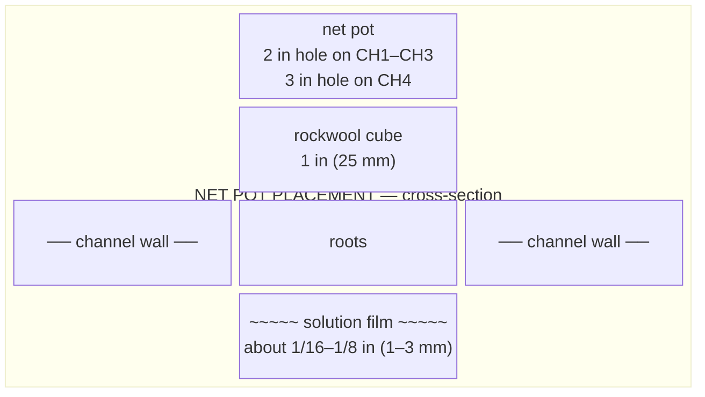

### 12.2 Spacing by Crop

The holes are already drilled. Use those sites. Do not redrill tighter spacing.

| Crop | Channel | Spacing already drilled | Net pot |
|---|---|---|---|
| Lettuce | CH1, 11 sites | 9 in (229 mm) | 2 in (51 mm) |
| Basil, cilantro, parsley, chives | CH2, 11 sites | 9 in (229 mm) | 2 in (51 mm) |
| Spinach, kale, mint | CH3 | 9 in (229 mm) | 2 in (51 mm) |
| Strawberry | CH3, 3–4 of the 11 sites | Same 9 in holes | 2 in (51 mm) |
| Cherry tomato | CH4 only | 12 in (305 mm), 7 holes. Use 4–5 indeterminate plants and skip holes, or up to 7 compact plants. | 3 in (76 mm) |
| Pepper | CH4 only | Same 12 in holes | 3 in (76 mm) |

### 12.3 First 48 Hours After Planting

The first 48 hours are the most critical for transplant survival.

```
FIRST 48 HOURS PROTOCOL

Hour 0 (planting):
□ Transplant into moistened net pots
□ Greens EC inside 0.8–1.8 (a seedling fill can sit near 0.8–1.2)
□ pH 5.8–6.2
□ Both pumps running 24 hours. Leave them on. Do not "switch to a timer" after 48 hours.

Hour 6:
□ Check plants have not wilted excessively
□ Gently mist foliage if wilting (reduces transpiration stress)
□ Check no net pots have dislodged

Hour 24:
□ Inspect roots — are they starting to extend into the film?
□ Check EC and pH — record in logbook
□ Check for any signs of stress (wilting, yellowing)

Hour 48:
□ Roots should be visible at the base of the channel
□ If plants are standing, keep both pumps on 24 hours. That is the normal runtime, not a special transplant mode.
□ If plants are still wilting, check flow and roots. Do not cycle the pump.
□ Move greens EC up within 0.8–1.8 once plants are established. CH4 fruiting EC waits until that tank is actually fruiting.
```

[↑ Back to TOC](#table-of-contents)

---


## 13. Step 10 — Zone B Microgreens Station

### 13.1 Materials for Zone B

| Item | Qty | Notes |
|---|---|---|
| Trays, 10 in × 20 in (25 cm × 50 cm) | 6 | The design count. A pack of 10 covers breakage. |
| Solid tray liners | 6 | One under each tray |
| Coco coir brick (500g) | 2–3 | Expands to ~8–10 L; enough for several fills |
| Perlite | 1–2 L | Optional; mix 10% into coco |
| Microgreens seeds | Assorted | Sunflower, radish, pea shoots, broccoli |
| Shelf | 1 | 24 in × 20 in (61 cm × 51 cm), two tiers, about 36 in (91 cm) tall |
| LED grow panel (50–100 W) | 1 | Full spectrum, 10–12 in (25–30 cm) above the trays. Timer: 16 h on / 8 h off. This timer is not for the NFT pumps. |
| Timer | 1 | For LED; 16h on / 8h off |
| Spray bottle | 1 | For initial surface moisture |
| Watering can (fine rose) | 1 | For watering |

### 13.2 Coco Coir Preparation

1. Place coco brick in a large bowl or bucket.
2. Add 5–6 L of water. The brick expands over 5–10 minutes. Break apart with hands.
3. Target consistency: moist enough to clump when squeezed, but no water drips out.
4. Mix in perlite if using (10% by volume).

### 13.3 Filling and Seeding Trays

1. Fill each tray with 1–1¼ in (2.5–3 cm) of prepared coco.
2. Level and lightly firm the surface (do not compact).
3. Pre-soak seeds for large-seeded varieties (sunflower, peas) for 8–12 h.
4. Spread seeds densely and evenly over the surface. Target: seeds touching but not piled.
5. Cover with a second inverted solid tray as a blackout lid.
6. Keep the trays at 64–72°F (18–22°C) for 2–4 days until sprouts emerge.
7. Once sprouts touch the lid and start to lift it, remove the lid and place under the LED.

**Watering:** Mist twice a day. Standard crops get pH-adjusted water only, pH 5.8–6.2. No nutrients. Sunflower and pea shoots may use EC 0.4–0.8 mS/cm if the grow runs long.

**After germination:** You can bottom-water with ½–¾ in (1–2 cm) in the liner so the surface stays drier. Still no nutrient solution on the standard trays.

### 13.4 Shelf Layout

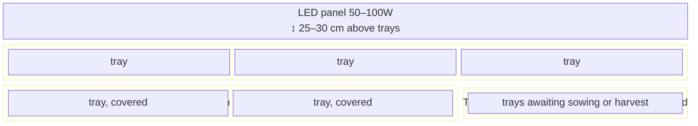

[↑ Back to TOC](#table-of-contents)

---


## 14. Step 11 — Zone C Root Veg Grow Bags

### 14.1 Materials for Zone C

| Item | Qty | Notes |
|---|---|---|
| Fabric bags, 5 US gal (19 L) | 3 | Two radish, one beetroot |
| Fabric bags, 10 US gal (38 L) | 3 | Carrot |
| Coco coir | Enough for 60% of about 45 US gal (170 L) of mix | No garden soil |
| Perlite | 30% of the mix | |
| Vermiculite | 10% of the mix | |
| Organic slow-release fertiliser | 1 | E.g., Osmocote; or use liquid feeds |
| Saucers / drip trays | 6–8 | Prevents soil run-off |
| Watering can | 1 | Fine rose for gentle watering |

### 14.2 Growing Medium Mix

For root vegetables in grow bags:

```
ZONE C MIX — same ratio in every bag

  Component        Share     5 US gal bag          10 US gal bag
  ──────────────────────────────────────────────────────────────
  Coco coir        60%       3.0 US gal (11 L)     6.0 US gal (23 L)
  Perlite          30%       1.5 US gal (6 L)      3.0 US gal (11 L)
  Vermiculite      10%       0.5 US gal (2 L)      1.0 US gal (4 L)
  ──────────────────────────────────────────────────────────────

Six bags: 2 × 5 US gal radish, 1 × 5 US gal beetroot, 3 × 10 US gal carrot.
About 45 US gal (170 L) of mix in total.
Fertigation EC ceiling is 2.0 mS/cm. Beetroot does not get a higher target.
No garden soil.
```

**Mixing:**
1. Expand the coco.
2. Mix coco, perlite, and vermiculite to 60/30/10 by volume.
3. Moisten slightly before filling. Dry coco sheds water.
4. Fill to about 1 in (3 cm) from the top. Firm gently. Do not pack it hard.

### 14.3 Sowing Root Veg Direct

Root vegetables do NOT transplant well. Sow seeds directly in the grow bags.

**Radish, two 5 US gal bags:** ½ in (1 cm) deep, about 1¼ in (3 cm) apart. Up in 3–5 days. Harvest in 25–35 days.
**Carrot, three 10 US gal bags:** ½ in (1 cm) deep, 1¼–2 in (3–5 cm) apart, then thin to about 2 in (5 cm). Harvest in 70–80 days.
**Beetroot, one 5 US gal bag:** ¾ in (2 cm) deep, about 2 in (5 cm) apart. Each "seed" is a cluster. Thin to one plant per 4 in (10 cm). Harvest in 55–70 days. Fertigation stays at or below 2.0 mS/cm.

**Watering regime:**
- Finger test about ¾ in (2 cm) into the mix
- If dry: water until slight drainage from bag bottom
- If moist: hold off
- Aim for consistent moisture — very wet or bone dry both cause root problems

### 14.4 Grow Bag Layout

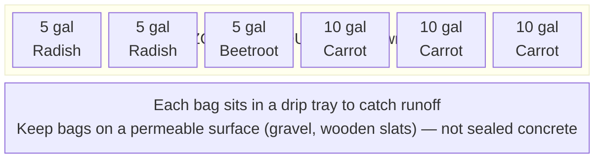

[↑ Back to TOC](#table-of-contents)

---


## 15. Common Build Mistakes and How to Avoid Them

These are the most frequently reported mistakes in DIY NFT builds, and how to prevent each one.

### Mistake 1 — Insufficient slope

**What happens:** Water pools in flat spots. Roots become waterlogged and anaerobic. Pythium and root rot follow within days.

**Prevention:** Always verify slope with a spirit level AND by running plain water and watching it flow. The marble/ball-bearing trick is a great visual check. Calculate the exact leg height difference (see Step 2) rather than guessing.

### Mistake 2 — Flow rate too high

**What happens:** Water rushes through the channel too fast, the film is too deep, air gaps are washed away, roots are submerged rather than misted. Nutrient uptake decreases; root rot risk increases.

**Prevention:** Aim for 1–2 L/min per channel. Measure this at commissioning with a timer and a 1 L container. Adjust manifold valves down until flow is correct. Open the valve slowly — a little goes a long way.

### Mistake 3 — Light leaks into reservoir

**What happens:** Algae blooms within 2–3 days. Green slime coats the reservoir walls, supply lines, and channels. pH spikes during the day (algae consumes CO₂, raising pH). DO₂ plummets at night (algae respiration consumes O₂). Pump clogs.

**Prevention:** The reservoir must be 100% opaque. Shine a torch inside with the lid on — you should see zero glow on the outside. Wrap, paint, or box the reservoir fully. Black liner inside + white reflective exterior is the ideal combination.

### Mistake 4 — Not deburring holes

**What happens:** Sharp plastic edges on net pot holes and pipe cuts snag roots, damaging them as they grow. Damaged roots are infection points for Pythium.

**Prevention:** After every cut with a hole saw, hacksaw, or drill — sand the edges with 120-grit paper. This takes 30 seconds and prevents hours of future problems.

### Mistake 5 — Skipping the water test

**What happens:** System is filled with nutrient solution, pump turned on — and there's a leak at a bulkhead fitting. Nutrient solution drains across the ground (or into the reservoir of a neighbour). Expensive nutrients wasted; time lost replanting.

**Prevention:** Always run Step 7 first. Plain water reveals all leaks before they cost anything. Run for 30 minutes minimum.

### Mistake 6 — EC or pH meter uncalibrated

**What happens:** pH is thought to be 6.0 but is actually 7.2. Plants show nutrient lockout within a week. Problem is invisible until plants show stress symptoms.

**Prevention:** Calibrate EC and pH meters before first use and every 2–4 weeks. Calibration sachets (pH 4.0 and 7.0 for pH meters; 1413 µS/cm for EC meters) are cheap and essential. See Guide 03 for full calibration protocol.

### Mistake 7 — Planting too early in spring

**What happens:** Basil, tomatoes, or peppers go outside before the planning last frost and a cold night kills them. Nights below 50°F (10°C) also stall them.

**Prevention:** At this site the planning last frost is April 15 (SA: October 15). Put frost-tender crops out after that date. CH4 is tomato and pepper only. If a forecast still shows frost, wait.

### Mistake 8 — Overcrowding channels

**What happens:** Extra plants are squeezed onto an 8 ft (2.44 m) channel beyond the 11 holes (or beyond the 7 holes on CH4). Air stops moving. Mildew shows up. Yield per plant falls.

**Prevention:** Follow spacing guidelines in Section 12.2. Fewer, healthier plants outperform many stressed ones.

### Mistake 9 — Letting the reservoir run low

**What happens:** Pump draws air, runs dry, overheats, and burns out. Or EC spikes because nutrient solution has been concentrated by evaporation and plant uptake.

**Prevention:** Check both waterlines daily. If EC in that tank is at or above its target, top up with plain water at pH 5.8–6.2. If EC is below target, add nutrient stock and recheck. A 2 US gal (8 L) drop in the greens tank, or a 1 US gal (4 L) drop in the fruiting tank, is already worth a top-up.

### Mistake 10 — Not having a backup plan for pump failure

**What happens:** One pump stops. In warm weather that loop's roots dry in 15–30 minutes. By the time you notice, the channel can be badly wilted. The other loop is unaffected only if you do not delay.

**Prevention:** Keep a spare greens pump (160–210 US gph, about 15 W) and a spare fruiting pump (50–100 US gph, about 8 W). A basic spare is about $10–$20 (R180–R360). Hand-water the stopped loop every 15–30 minutes until the replacement is in. Do not wait hours.

[↑ Back to TOC](#table-of-contents)

---


## 16. Build Checklist

Use this as a final sign-off before moving to nutrient operation.

```
ZONE A — NFT SYSTEM
□ Site selected; orientation confirmed
□ Frame built; slope verified (1:30 minimum)
□ All 4 channels cut, deburred, and net pot holes drilled
□ Inlet fittings and end caps fitted; silicone cured
□ Drain fittings and end caps fitted; silicone cured
□ Reservoir prepared: opaque, lid sealed, fill marks drawn
□ Pump installed in reservoir
□ Supply manifold built and mounted
□ Supply tubes connected; secured with hose clips
□ Drain header assembled; slope verified
□ All joints inspected; no dry-fitting — all sealed
□ Water test completed (Step 7); no leaks after 30 min
□ EC and pH meters calibrated
□ Plugs in a weatherproof box on a GFCI (SA: 30 mA earth-leakage). Both water pumps run 24 hours. No pump cycle timer.
□ Air pump feeding both tanks
□ First nutrient batch mixed; EC and pH confirmed

ZONE B — MICROGREENS STATION
□ Shelving unit in place
□ LED panel mounted at correct height; timer set
□ Trays and liners in place
□ Coco coir prepared and trays filled
□ First seeds sown and in blackout

ZONE C — ROOT VEG BAGS
□ Grow bags filled with coco/perlite/vermiculite mix
□ Bags positioned in drip trays
□ First seeds sown direct

GENERAL
□ Daily monitoring schedule confirmed (Guide 08)
□ Logbook started (date, initial EC, pH, reservoir level)
□ Pest/disease reference (Guide 07) reviewed
□ Spare pump sourced or ordered
□ Spare fittings: barbed ½ in connectors, hose clips, about 3 ft (1 m) of spare ½ in tube
□ 40% shade cloth about 13 ft × 10 ft (4.0 m × 3.0 m), and fleece, ready to deploy
```

---


[↑ Back to TOC](#table-of-contents)

---

> **Previous:** [Guide 10 — Climate Management](10-climate-management.md)
> **Next:** [Guide 12 — Budget and Sourcing](12-budget-and-sourcing.md)

<!-- copyright -->
*Copyright (c) 2026 UncleJS. Licensed under [CC BY-NC-SA 4.0](https://creativecommons.org/licenses/by-nc-sa/4.0/) — free to share and adapt for non-commercial purposes with attribution and ShareAlike.*
