# Guide 11 — DIY Build Guide: Full System Construction

This guide walks you through building the complete three-zone hydroponic system from scratch — from preparing the site through to planting your first crops. Every step includes dimensions, material specifications, ASCII diagrams, and safety notes.

Estimated total build time: **8–12 hours** spread over 2–3 weekends.

---

## Table of Contents

- [1. System Overview Recap](#1-system-overview-recap)
- [2. Tools Required](#2-tools-required)
  - [Essential Tools](#essential-tools)
  - [Useful But Optional](#useful-but-optional)
- [3. Safety and Prep Notes](#3-safety-and-prep-notes)
- [4. Step 1 — Site Preparation and Orientation](#4-step-1-site-preparation-and-orientation)
  - [4.1 Choosing the Site](#41-choosing-the-site)
  - [4.2 Orientation](#42-orientation)
  - [4.3 Marking Out the Footprint](#43-marking-out-the-footprint)
- [5. Step 2 — Frame Construction](#5-step-2-frame-construction)
  - [5.1 Frame Option A — Elevated Bench (Recommended)](#51-frame-option-a-elevated-bench-recommended)
  - [5.2 Frame Option B — A-Frame (Compact)](#52-frame-option-b-a-frame-compact)
- [6. Step 3 — Channel Preparation](#6-step-3-channel-preparation)
  - [6.1 Channel Material Choices](#61-channel-material-choices)
  - [6.2 Cutting Channels to Length](#62-cutting-channels-to-length)
  - [6.3 Drilling Net Pot Holes](#63-drilling-net-pot-holes)
  - [6.4 Fitting End Caps](#64-fitting-end-caps)
  - [6.5 Spray Bar (Optional Alternative to Direct Feed)](#65-spray-bar-optional-alternative-to-direct-feed)
- [7. Step 4 — Reservoir Setup](#7-step-4-reservoir-setup)
  - [7.1 Reservoir Selection](#71-reservoir-selection)
  - [7.2 Preparing the Reservoir](#72-preparing-the-reservoir)
  - [7.3 Drilling Bulkhead Holes in the Reservoir](#73-drilling-bulkhead-holes-in-the-reservoir)
- [8. Step 5 — Plumbing](#8-step-5-plumbing)
  - [8.1 Plumbing Overview](#81-plumbing-overview)
  - [8.2 Building the Supply Manifold](#82-building-the-supply-manifold)
  - [8.3 Supply Tubes](#83-supply-tubes)
  - [8.4 Drain System](#84-drain-system)
  - [8.5 Sealing and Testing Joints](#85-sealing-and-testing-joints)
- [9. Step 6 — Electrical and Timer Setup](#9-step-6-electrical-and-timer-setup)
  - [9.1 Safety First](#91-safety-first)
  - [9.2 Timer Setup](#92-timer-setup)
  - [9.3 Air Pump (Optional but Recommended)](#93-air-pump-optional-but-recommended)
- [10. Step 7 — System Test (Water Only)](#10-step-7-system-test-water-only)
  - [10.1 Water Test Procedure](#101-water-test-procedure)
  - [10.2 Common Test Failures and Fixes](#102-common-test-failures-and-fixes)
- [11. Step 8 — First Nutrient Solution Fill](#11-step-8-first-nutrient-solution-fill)
  - [11.1 Mixing the Nutrient Solution](#111-mixing-the-nutrient-solution)
- [12. Step 9 — Planting](#12-step-9-planting)
  - [12.1 Transplanting Seedlings](#121-transplanting-seedlings)
  - [12.2 Spacing by Crop](#122-spacing-by-crop)
  - [12.3 First 48 Hours After Planting](#123-first-48-hours-after-planting)
- [13. Step 10 — Zone B Microgreens Station](#13-step-10-zone-b-microgreens-station)
  - [13.1 Materials for Zone B](#131-materials-for-zone-b)
  - [13.2 Coco Coir Preparation](#132-coco-coir-preparation)
  - [13.3 Filling and Seeding Trays](#133-filling-and-seeding-trays)
  - [13.4 Shelf Layout](#134-shelf-layout)
- [14. Step 11 — Zone C Root Veg Grow Bags](#14-step-11-zone-c-root-veg-grow-bags)
  - [14.1 Materials for Zone C](#141-materials-for-zone-c)
  - [14.2 Growing Medium Mix](#142-growing-medium-mix)
  - [14.3 Sowing Root Veg Direct](#143-sowing-root-veg-direct)
  - [14.4 Grow Bag Layout](#144-grow-bag-layout)
- [15. Common Build Mistakes and How to Avoid Them](#15-common-build-mistakes-and-how-to-avoid-them)
  - [Mistake 1 — Insufficient slope](#mistake-1-insufficient-slope)
  - [Mistake 2 — Flow rate too high](#mistake-2-flow-rate-too-high)
  - [Mistake 3 — Light leaks into reservoir](#mistake-3-light-leaks-into-reservoir)
  - [Mistake 4 — Not deburring holes](#mistake-4-not-deburring-holes)
  - [Mistake 5 — Skipping the water test](#mistake-5-skipping-the-water-test)
  - [Mistake 6 — EC or pH meter uncalibrated](#mistake-6-ec-or-ph-meter-uncalibrated)
  - [Mistake 7 — Planting too early in spring](#mistake-7-planting-too-early-in-spring)
  - [Mistake 8 — Overcrowding channels](#mistake-8-overcrowding-channels)
  - [Mistake 9 — Letting the reservoir run low](#mistake-9-letting-the-reservoir-run-low)
  - [Mistake 10 — Not having a backup plan for pump failure](#mistake-10-not-having-a-backup-plan-for-pump-failure)
- [16. Build Checklist](#16-build-checklist)


[↑ Back to TOC](#table-of-contents)

## 1. System Overview Recap

Before building, confirm the full system you are constructing:

**Zone A — NFT Channel Array**

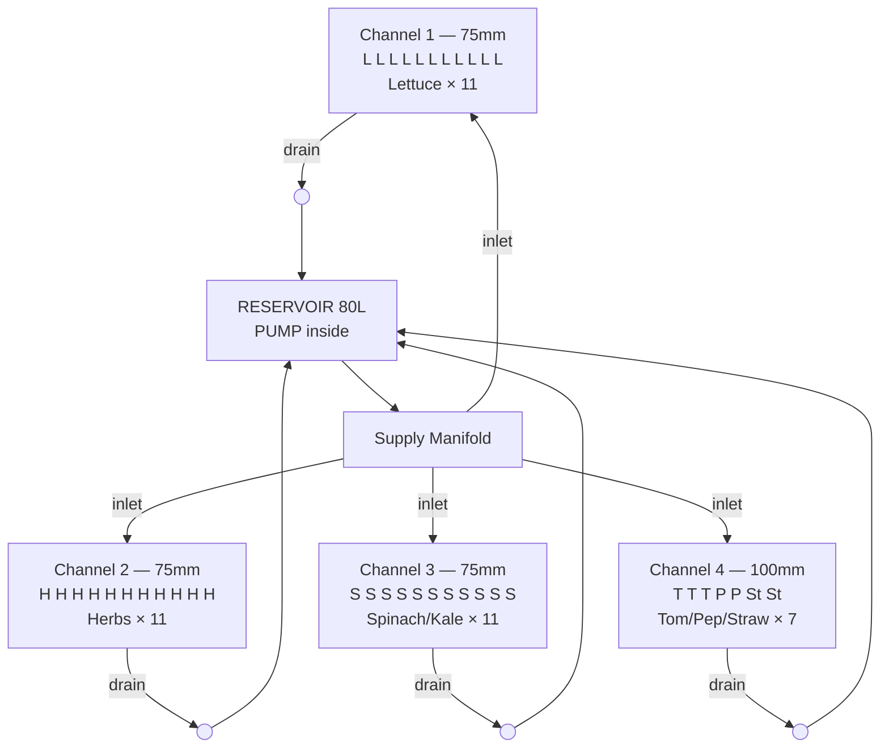

**Zone B — Microgreens Station**


**Zone C — Root Veg Grow Bags**


**System specifications:**
- 4 NFT channels: 3 × 75 mm square PVC + 1 × 100 mm square PVC
- Channel length: 2.4 m each
- Slope: 1:30 (80 mm drop over 2.4 m)
- Reservoir: 80 L HDPE food-grade bin or container
- Pump: 600–800 L/h submersible
- Flow per channel: 1–2 L/min (via adjustable manifold valves)
- ~40 plant sites in Zone A

---


[↑ Back to TOC](#table-of-contents)

## 2. Tools Required

### Essential Tools

| Tool | Purpose | Notes |
|---|---|---|
| Tape measure | All measurements | Steel, 5 m minimum |
| Pencil / marker | Marking cut lines | Permanent marker on PVC |
| Handsaw or circular saw | Cutting timber for frame | Or mitre saw for accuracy |
| Hacksaw or PVC pipe cutter | Cutting PVC channels and pipe | Pipe cutter gives cleaner cuts |
| Electric drill | Pilot holes, screwing frame | 10–18V cordless |
| Hole saw set | Net pot holes in channels | 50 mm bit for 50 mm net pots; 75 mm for tomato/pepper |
| Step drill / spade bit | Reservoir holes | For 20–32 mm bulkhead fittings |
| Screwdriver (flat + Philips) | Assembly | Or drill bits |
| Level (spirit level) | Setting channel slope | 60 cm bubble level minimum |
| Rubber mallet | Seating fittings | Avoids cracking PVC |
| Utility knife / Stanley knife | Trimming, cutting pond liner | Sharp blade |
| Sandpaper (120 grit) | Deburring PVC cut edges | Prevents root snags |
| Bucket (10 L) | Mixing, testing, cleaning | |
| Safety glasses | All cutting operations | Non-negotiable |
| Work gloves | PVC edges are sharp | |

### Useful But Optional

| Tool | Why useful |
|---|---|
| Mitre saw | Clean, accurate timber cuts |
| Jigsaw | Curved cuts, lid cutouts |
| Heat gun | Bending PVC if needed |
| Cable ties (bag of 100) | Securing hoses, tidying wiring |
| Silicone sealant gun | Extra sealing around bulkheads |
| Digital angle finder | Setting precise slope on frame |

---


[↑ Back to TOC](#table-of-contents)

## 3. Safety and Prep Notes

1. **Wear safety glasses for all cutting.** PVC and timber generate chips that can permanently damage eyes.
2. **Deburr all PVC cuts.** After sawing, run sandpaper around the inside edge of every cut — rough edges snag roots and damage them.
3. **All outdoor electrical connections must be weatherproofed.** Use outdoor-rated extension leads and waterproof enclosures for timers.
4. **Test the system with plain water before using any nutrient solution.** This catches leaks before they cause problems.
5. **Use only food-grade or hydroponics-safe materials** in contact with nutrient solution:
   - HDPE (High-Density Polyethylene) or LDPE containers — ✅
   - Polypropylene fittings — ✅
   - PVC irrigation pipe — ✅
   - PVC conduit (grey, unplasticised) — ✅
   - Galvanised metal in contact with solution — ❌ (zinc toxicity)
   - Pressure-treated timber in contact with solution — ❌ (preservative leach)
   - Copper pipe — ❌ (copper toxicity to roots)

---


[↑ Back to TOC](#table-of-contents)

## 4. Step 1 — Site Preparation and Orientation

### 4.1 Choosing the Site

Before placing anything, evaluate potential sites against these criteria:

```
SITE EVALUATION CHECKLIST

□ Sunlight: Does the spot receive ≥6 hours direct sun per day?
  → For leafy greens: 4–6 h acceptable
  → For tomatoes/peppers: 6–8 h required

□ Proximity to power: Is there a GFCI/RCD-protected outdoor outlet within 10m?
  → Extension leads are OK but must be outdoor-rated and kept dry

□ Proximity to water: Can you fill an 80L reservoir without carrying water 50m+?
  → Hose access is ideal; close to a butt also works

□ Wind exposure: Is there a fence, wall, or hedge on the prevailing wind side?
  → If not, plan windbreak installation (see Guide 10)

□ Drainage: Does the area drain well?
  → Avoid standing water — channels will overflow eventually; puddles breed pests

□ Level ground: Is the ground reasonably flat?
  → You don't need perfectly flat — you'll build a levelled frame on top
  → But >5° slope in the ground complicates frame construction

□ Accessibility: Can you comfortably reach all channels to plant and harvest?
  → Ideal channel height: 80–100 cm above ground for standing access
  → 60 cm minimum to avoid bending too low
```

### 4.2 Orientation

**Channels should run North–South** wherever possible. This means:
- Both sides of the channel receive roughly equal sun over the day
- Morning sun hits one side, afternoon sun hits the other
- Avoids one row permanently in shade of another

If North–South is not possible due to site constraints, East–West is acceptable — but shade cloth positioning may need to compensate.

**Supply manifold end should be at the HIGH end** (inlet at top, drain at bottom, water flows downhill). Orient so the low/drain end is closest to where the reservoir will sit, minimising return pipe length.


### 4.3 Marking Out the Footprint

Mark out the exact footprint of the frame on the ground before building:

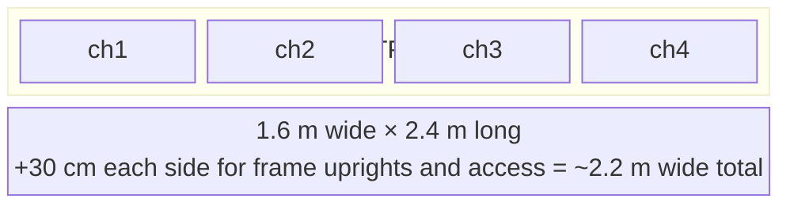

Mark corners with pegs or chalk. This avoids building the frame and discovering it doesn't fit.

---


[↑ Back to TOC](#table-of-contents)

## 5. Step 2 — Frame Construction

The frame supports the channels at the correct height and slope. Two design options are presented; choose based on your preferences.

### 5.1 Frame Option A — Elevated Bench (Recommended)

An elevated bench frame raises channels to a comfortable working height (~90 cm), with adjustable leg heights to create the slope.

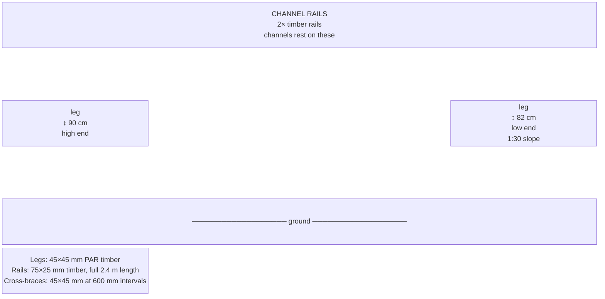

**Timber cut list (Zone A bench):**

| Piece | Qty | Dimension | Length | Notes |
|---|---|---|---|---|
| Leg, high end | 2 | 45×45 mm PAR | 900 mm | Vertical |
| Leg, low end | 2 | 45×45 mm PAR | 820 mm | 900 – 80 mm = 820 mm (1:30 slope) |
| Channel rail (long) | 2 | 75×25 mm | 2,400 mm | Runs full channel length |
| Cross-brace (top) | 3 | 45×45 mm | 1,400 mm | Connects the two rails |
| Cross-brace (lower) | 3 | 45×45 mm | 1,400 mm | Stabilises legs mid-height |
| Reservoir shelf | 1 | 18 mm plywood | 600×600 mm | Optional; holds reservoir below drain end |

**Assembly order:**
1. Cut all timber to length. Sand any rough edges.
2. On a flat surface, assemble one side frame: 2 legs + 1 long rail + cross-braces. Use 75 mm wood screws + PVA glue at each joint.
3. Repeat for the other side frame.
4. Stand both side frames up, connect them with the remaining cross-braces.
5. Check for square using a tape measure diagonally (both diagonals should be equal).
6. Add temporary diagonal bracing (scrap timber) to hold square while glue dries.
7. Optionally: paint or treat exterior frame timber with a water-based preservative (NOT creosote or solvent-based near solution).

```
SLOPE CALCULATION
  Desired slope: 1:30 (1mm drop per 30mm horizontal run)
  Channel length: 2,400 mm
  Total drop: 2,400 ÷ 30 = 80 mm

  High-end leg: 900 mm
  Low-end leg:  900 - 80 = 820 mm
  ─────────────────────────────────
  Difference:   80 mm
```

> **Important:** The slope is achieved by cutting the low-end legs shorter — the channel rails are horizontal on the frame, but the frame itself sits at an angle. Double-check slope with a spirit level + ruler before drilling anything into the frame permanently.

### 5.2 Frame Option B — A-Frame (Compact)

An A-frame creates a triangular structure where channels are mounted on both sloping sides. This uses less footprint and allows more channels in less space.

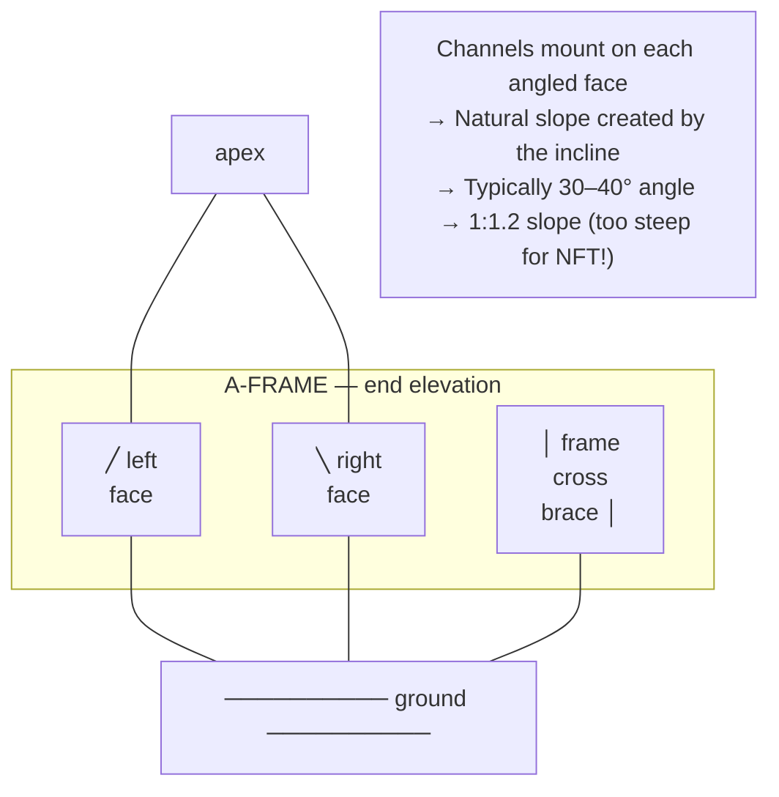

> **Caution:** The natural slope of a typical A-frame is far too steep for NFT (you want 1:30 to 1:40; an A-frame gives you something closer to 1:1). To use an A-frame for NFT, you must mount horizontal shelf boards at the correct offset and attach the channels to those boards — it becomes complicated. The elevated bench is much simpler for NFT.

**A-frame is better suited to:** Ebb-and-flow or kratky systems, not NFT.

---


[↑ Back to TOC](#table-of-contents)

## 6. Step 3 — Channel Preparation

### 6.1 Channel Material Choices

| Option | Material | Pro | Con |
|---|---|---|---|
| **PVC square downpipe** (75 mm) | uPVC | Cheap, widely available, easy to cut | Needs end caps + extra fittings |
| **PVC round gutter pipe** (100 mm) | uPVC | Very cheap, fits large net pots | Round = harder to seal; less stable |
| **Dedicated NFT channel** (55–100 mm) | Hydro-grade PVC/PP | Purpose-built, fits perfectly | More expensive ($8–$20/metre) |
| **Rain gutter channel** (100 mm half-round) | uPVC | Very cheap, zero cutting needed | Open top = algae, debris; must be covered |

**Recommended for this build:** 75 mm square PVC downpipe for channels 1–3, 100 mm square downpipe for channel 4. Available from plumbing/hardware stores.

### 6.2 Cutting Channels to Length

1. Mark 2,400 mm (2.4 m) from one end of each pipe with a permanent marker.
2. Wrap a piece of paper around the pipe at the mark — the paper edge gives a straight cutting guide.
3. Cut with a hacksaw or PVC pipe cutter. Keep the cut square.
4. Deburr both cut ends inside and outside with 120-grit sandpaper.
5. Repeat for all 4 channels.

### 6.3 Drilling Net Pot Holes

Net pot holes are drilled along the top face of each channel at regular spacing.


**Hole size:**
- 50 mm hole saw → use with 50 mm net pots (leafy greens, herbs)
- 75 mm hole saw → use with 75 mm net pots (tomatoes, peppers, channel 4)

**Drilling procedure:**
1. Mark hole centres with a ruler and permanent marker.
2. Create a small dimple with a punch or nail at each mark (prevents drill bit wandering).
3. Drill with the correct hole saw at slow speed — let the saw do the work, don't force.
4. Remove the cut disc (the "knockout") — it often stays inside the channel; shake it out.
5. Deburr every hole inside and outside with sandpaper wrapped around a finger.

### 6.4 Fitting End Caps

**High end (inlet):**
- Fit a PVC square end cap (same size as channel). Push firmly to seat.
- Drill a 12–16 mm hole in the top-centre of the end cap.
- Insert a 12 mm barbed elbow or straight fitting through the hole (inlet for supply tube).
- Seal around the fitting with silicone sealant. Allow 24 h to cure.

**Low end (drain):**
- Fit a PVC end cap as above.
- Drill a 25–32 mm hole in the BOTTOM of the end cap (not the top — the drain must be at the lowest point of the channel).
- Insert a 25 mm bulkhead fitting or solvent-weld socket.
- Fit a short 25 mm section of pipe as the drain stub.
- All NFT drain stubs collect into a shared drain pipe (see Step 5 — Plumbing).

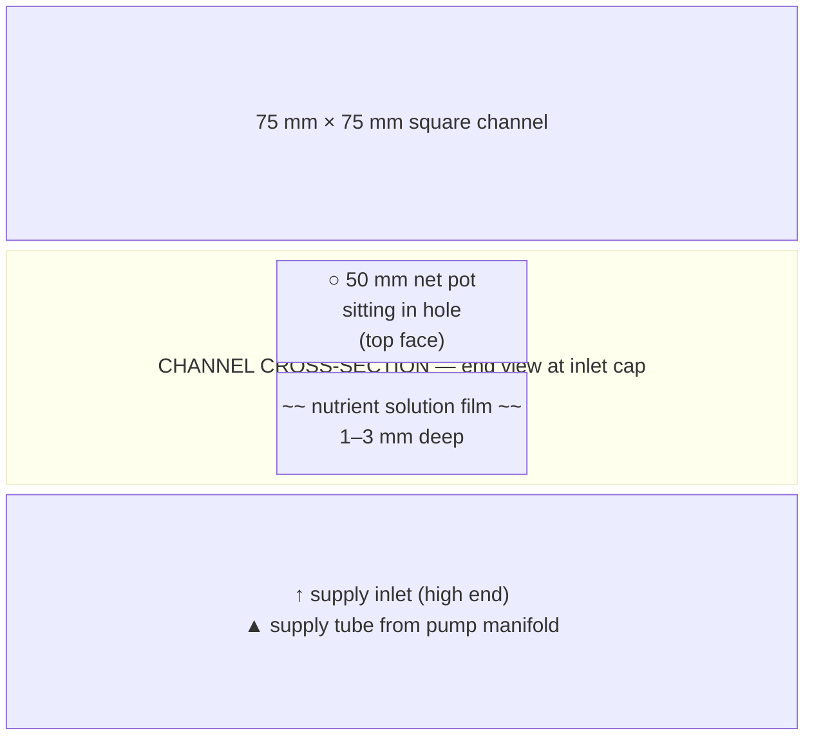

### 6.5 Spray Bar (Optional Alternative to Direct Feed)

Instead of a single inlet fitting per channel, some builders use a short spray bar (a length of 12 mm irrigation pipe with 3–4 micro holes) inserted into the high end. This distributes flow evenly across the channel width rather than a single stream that pools to one side.

To make a simple spray bar:
1. Cut a 50 mm piece of 12 mm irrigation pipe.
2. Drill 3 holes (1 mm diameter) spaced 15 mm apart along the side.
3. Insert into the inlet fitting at the channel high end, holes pointing down.
4. The water fans out across the channel base rather than channelling to one corner.

---


[↑ Back to TOC](#table-of-contents)

## 7. Step 4 — Reservoir Setup

### 7.1 Reservoir Selection

Ideal reservoir: A food-grade HDPE container with a lid, 80–120 L capacity.

Good options:
- **Large storage bin / Brute-style trash can** (80–120 L, HDPE) — ~$20–$40
- **IBC tote (1000 L)** — overkill for this system but very cheap used (~$30–$60)
- **Dedicated hydroponic reservoir** (square HDPE, with lid cutouts) — ~$40–$80
- **Food-grade plastic barrel** (100–120 L, previously food use) — ~$10–$25 used

**Do NOT use:**
- Any container that previously held chemicals, paint, or non-food substances
- Metal containers (zinc, aluminium, galvanised steel — all toxic to roots)
- Thin-walled containers that bow when full (80 L water = 80 kg — check the container holds its shape)

### 7.2 Preparing the Reservoir

**Lid preparation:**
1. Measure and mark holes for:
   - Pump power cable exit (12 mm slit, not a round hole — allows cable out but not water in)
   - Supply pipe exit (one 20 mm hole for the main pump output going to the manifold)
   - Air pump tube entry (one 8 mm hole if using an air stone)
   - Fill/inspection port (one 150 mm circular hole with a screw-on cap — for checking water level, topping up, and measuring EC/pH without removing the whole lid)
2. Cut holes with a jigsaw or step drill.
3. Seal around pipes with silicone sealant or foam gasketing to prevent light entry.

**Reservoir marking:**
1. With the reservoir filled to operating level (leave ~10 cm from top), mark the outside with a permanent marker at the waterline.
2. Make 10 L increment marks going down from there.
3. This allows you to track daily water usage without measuring.

**Painting or wrapping:**
If the reservoir is clear or translucent, light will penetrate and cause algae. Cover or paint it:
- **Option 1:** Wrap in black builder's plastic film, then wrap in white/silver reflective film on top (black blocks light, white reflects solar heat)
- **Option 2:** Paint with two coats of black non-toxic exterior paint, then one coat of white exterior paint on top
- **Option 3:** Build a reservoir shade box (see Guide 10 Section 4.3)

### 7.3 Drilling Bulkhead Holes in the Reservoir

The return drain from the channels empties back into the reservoir. You need a return inlet.

Two options:
- **Top-fill return (simplest):** Run a drain return pipe to the open top of the reservoir, through the inspection port. No drilling needed. Splash as the return hits the water increases oxygenation.
- **Bulkhead fitting (cleaner):** Drill a 32 mm hole 5 cm below the max fill line on the side wall. Insert a 25 mm bulkhead fitting. Thread on the lock nut inside. Apply silicone around both flanges. Connect drain return to this fitting.

For most DIY builds, the top-fill return is simpler and provides better oxygenation. Use the bulkhead fitting if you want a completely sealed lid with no open ports.

---


[↑ Back to TOC](#table-of-contents)

## 8. Step 5 — Plumbing

### 8.1 Plumbing Overview

The plumbing system routes water from the reservoir pump up to the channels and back again in a continuous loop.

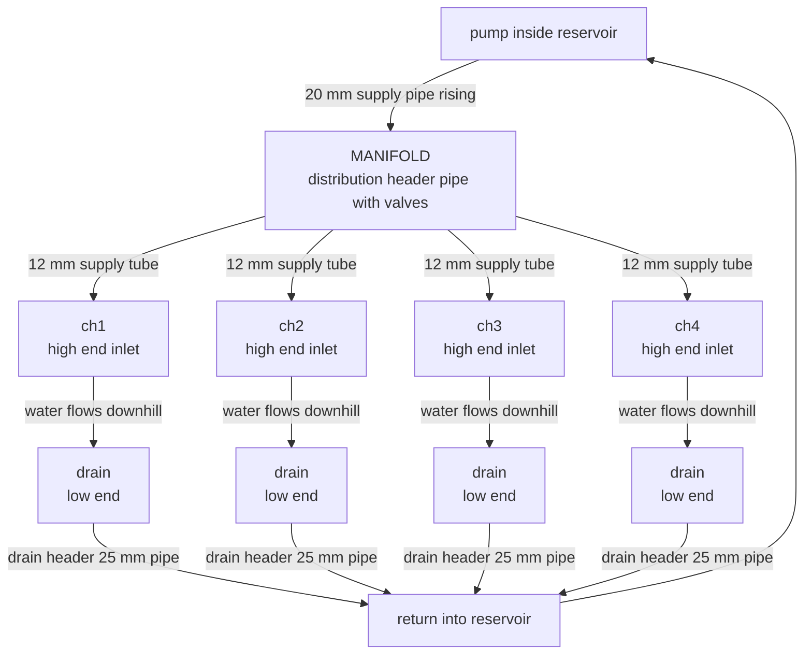

### 8.2 Building the Supply Manifold

The manifold is a short header pipe that distributes pump output to each channel.

**Materials for manifold:**
- 1× 32 mm PVC pipe, ~800 mm long (or 40–50 mm for better flow at higher channel count)
- 4× 12 mm threaded outlet fittings (or 12 mm barbed T-pieces)
- 4× inline ball valves (12 mm) — for flow adjustment per channel
- 1× 20 mm × 32 mm reducer (connects pump output to manifold)
- End cap for manifold pipe (one end is the inlet from pump, other end is capped)

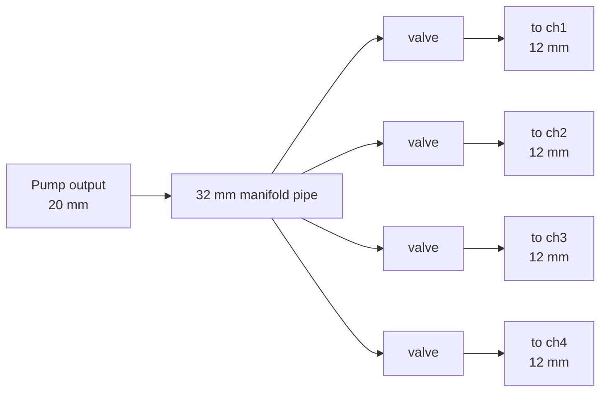

**Assembly:**
1. Drill or thread 4 holes in the manifold pipe at equal spacing.
2. Fit threaded outlet fittings. Apply PTFE (Teflon) tape to all threads before assembly.
3. Fit ball valves to each outlet.
4. Connect 12 mm irrigation tubing from each valve to the inlet fitting on the corresponding channel's high end.
5. Connect the pump output to the manifold inlet with the reducer.

**Manifold mounting:** Attach the manifold to the high-end cross-brace of the frame using hose clips or cable ties. Position so each supply tube descends naturally to its channel inlet without sharp kinks.

### 8.3 Supply Tubes

From the manifold valves to the channel inlets, use 12 mm ID irrigation tube (black, UV-stabilised). Cut to length with scissors or a utility knife. Push firmly onto barbed fittings. Secure with hose clips for a watertight connection.

**Routing:**
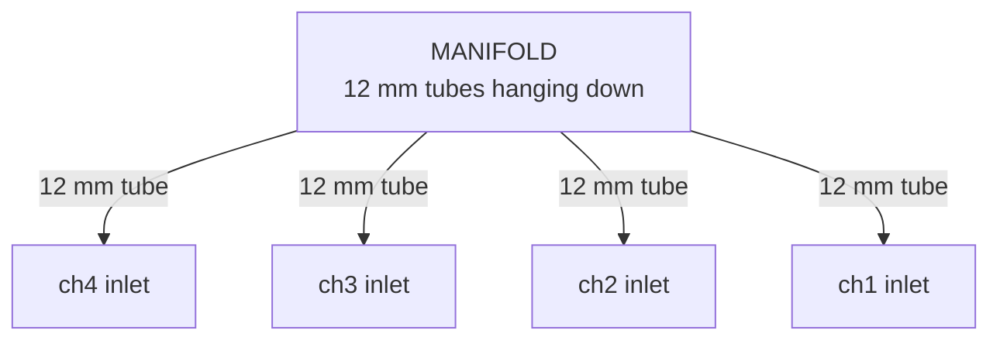

Keep supply tubes as short as possible (30–60 cm maximum) to minimise flow resistance.

### 8.4 Drain System

All channel drains collect into a common return header that flows back to the reservoir.

**Materials:**
- 4× 25 mm drain stub fittings (already fitted to channel end caps in Step 3)
- 1× 32 mm PVC pipe as drain header (~1.6 m length)
- 4× 32 mm × 25 mm reducing T-pieces (connects drain stubs to header)
- 1× 32 mm return pipe from header to reservoir (length depends on layout)

**Assembly:**
1. Lay the drain header pipe along the low end of the frame, underneath the channel drain stubs.
2. Mark and drill holes in the header at each stub position.
3. Insert reducing T-pieces. Apply solvent cement or use push-fit connectors.
4. Connect each channel drain stub to the corresponding T-piece using short hose lengths.
5. Run the header to the reservoir return point. Ensure the header pipe slopes slightly downhill (at least 1:40) to prevent pooling.

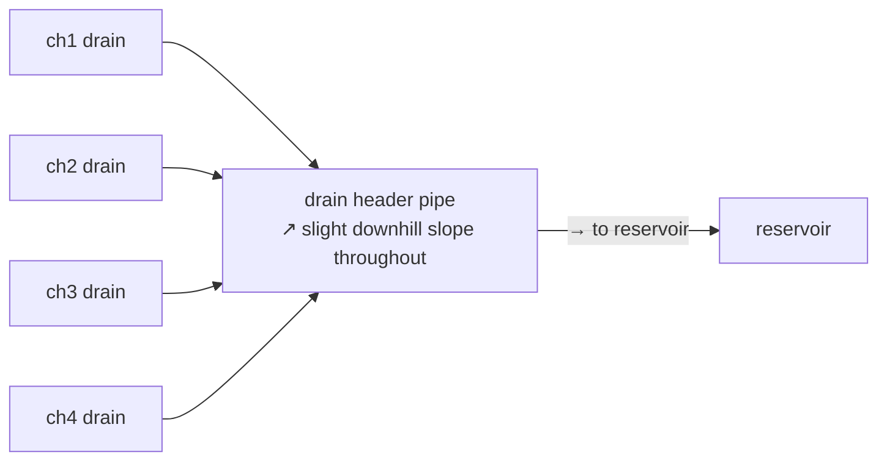

**Return to reservoir:** The return pipe can either:
- Drop directly into the open reservoir top (simplest; good oxygenation)
- Connect to a bulkhead fitting on the reservoir side (tidier but more work)

If dropping into the open top, place a splash guard (a small piece of cut PVC cap or plastic) under the return point to prevent water spraying outside the reservoir.

### 8.5 Sealing and Testing Joints

Before testing the full system, inspect every joint:
- Every threaded fitting: PTFE tape on all male threads
- Every push-fit: firmly seated, give it a pull to confirm
- Every barbed fitting with hose: secured with a hose clip
- Every bulkhead: silicone both flanges, nut tight
- Solvent-welded joints: must cure 1 hour at minimum (24 h recommended) before pressure

---


[↑ Back to TOC](#table-of-contents)

## 9. Step 6 — Electrical and Timer Setup

### 9.1 Safety First

Water and electricity are a dangerous combination. Treat all outdoor electrical work with extreme caution.

**Non-negotiable rules:**
1. **Always use a GFCI (RCD) protected outlet.** If your outdoor socket is not GFCI, fit one between the wall outlet and your extension lead. They cost ~$10–$20.
2. **Use outdoor-rated extension leads.** These are UV-stabilised and have weatherproof socket covers.
3. **Keep all plugs and connectors elevated** — never let them sit in puddles. Use cable hooks to keep them off the ground and away from the reservoir.
4. **Never modify plugs or run bare wire outdoors.** Use proper waterproof cable connectors or weatherproof junction boxes.
5. **Do not plug in anything when wet** — hands, connections, or the outlet.

### 9.2 Timer Setup

The pump needs a timer to run on a schedule (for intermittent pump mode — see Guide 01) or continuously. An outdoor-rated mechanical or digital timer is sufficient.

**Intermittent schedule (recommended for seedlings and cool weather):**
- 15 minutes on / 45 minutes off (or 30 min on / 30 min off)
- Use a digital timer with 15-minute minimum interval

**Continuous operation (recommended for established crops in warm weather):**
- Pump runs 24 h, but timer can still cut overnight (midnight–6 AM) to reduce wear

**Timer housing:**
Place the timer in a weatherproof enclosure or outdoor timer box. Do not leave a standard indoor timer exposed to rain.

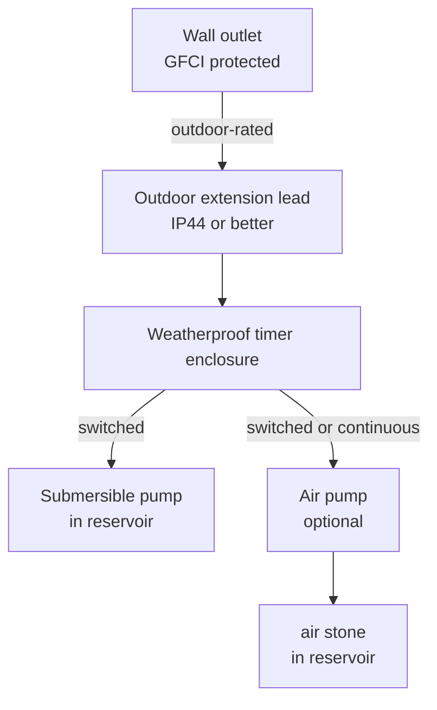

### 9.3 Air Pump (Optional but Recommended)

An air pump driving one or two air stones in the reservoir dramatically increases dissolved oxygen in the solution, especially during summer. This is the cheapest and most effective way to improve system resilience.

**Spec:** A 4–6 L/min air pump is sufficient for an 80 L reservoir. Cost: ~$8–$20.

Position air stones at the bottom of the reservoir. Run the airline along the frame to the reservoir, securing with cable ties. Keep the air pump above the reservoir water level (or use a non-return valve) to prevent back-siphoning.

---


[↑ Back to TOC](#table-of-contents)

## 10. Step 7 — System Test (Water Only)

**Do not add nutrients until the water test is complete.** This is the most important step in the build.

### 10.1 Water Test Procedure

```
WATER TEST SEQUENCE

Step 1: Fill reservoir with plain tap water to operating level
  → Target: 70–75 L in an 80 L reservoir (leave headroom)

Step 2: Power on pump (no timer — manual override for test)
  → Listen: pump should hum quietly, no grinding or air-sucking
  → Watch manifold: flow should appear at each channel inlet within 30s

Step 3: Check each channel for flow
  → Shine a torch into each channel at the low end
  → You should see a thin film of water moving toward the drain
  → Flow rate: roughly 1–2 L/min per channel (measure by timing
     how long it takes to fill a 1L container at the drain outlet)

Step 4: Adjust manifold valves
  → Open or close each valve until all 4 channels have roughly equal flow
  → Do not fully close any valve — minimum 10% open to prevent pump strain

Step 5: Check all joints for leaks
  → Watch all fittings for 10 full minutes
  → Pay special attention to: bulkhead flanges, barbed fittings, end cap inlets
  → Mark any drips with tape; dry the area; reseal with silicone; retest

Step 6: Check the drain return
  → Ensure all drains are flowing into the drain header
  → Ensure the header is draining into the reservoir (no backup)
  → Watch reservoir level — it should remain constant (not rising or falling)

Step 7: Verify slope
  → Look at the channel from the side — is there a visible downhill gradient?
  → Place a marble or ball bearing in the channel; it should roll slowly to the drain
  → If pooling occurs (water sitting still), the slope is insufficient in that section

Step 8: Run for 30 minutes
  → Leave the pump running for 30 continuous minutes
  → Inspect all joints again at the end
  → Check reservoir level — should still be at fill mark (no significant evaporation loss)

Step 9: Drain test water
  → Remove and discard the test water (it's picked up any residue from new fittings)
  → Rinse reservoir with clean water
  → System is now ready for first nutrient fill
```

### 10.2 Common Test Failures and Fixes

| Problem observed | Likely cause | Fix |
|---|---|---|
| No flow at channel inlet | Valve closed; pump not primed | Open valve; check pump is submerged; check power |
| Very slow flow | Valve too closed; supply tube kinked | Adjust valve; re-route tube |
| Flow unequal across channels | Valve adjustment needed | Throttle high-flow channels |
| Leak at end cap inlet | Silicone not cured; barb not seated | Remove, reapply silicone, allow 24 h |
| Leak at bulkhead | Lock nut loose; silicone failed | Tighten nut; reapply silicone on flange |
| Pool in middle of channel | Slope broken at that point | Re-level frame at that section |
| Drain backing up | Header slope insufficient; blockage | Re-angle header; clear any debris |
| Pump noisy/grinding | Running dry; debris in impeller | Ensure submerged; clean impeller |

---


[↑ Back to TOC](#table-of-contents)

## 11. Step 8 — First Nutrient Solution Fill

After a successful water test, prepare the first nutrient batch.

### 11.1 Mixing the Nutrient Solution

See Guide 02 for full Masterblend recipe and dose scaling table. Summary for first fill:

**For 80 L reservoir at EC ~1.0–1.4 (conservative first fill for seedlings/young transplants):**

| Component | Amount | Rate |
|---|---|---|
| MasterBlend 4-18-38 | 36 g | 0.45 g/L |
| Calcium Nitrate (Ca(NO₃)₂) | 36 g | 0.45 g/L |
| Epsom Salt (MgSO₄) | 18 g | 0.23 g/L |

> **Note:** This is a reduced-strength first fill suitable for seedlings and young transplants. Once plants are established (2–3 weeks after transplant), increase to the standard rate of 0.6 g/L each (48g MasterBlend, 48g Calcium Nitrate, 24g Epsom Salt for 80L) for EC ~1.4–1.6. See Guide 02, Section 7 for the full dose scaling table.

**Mixing order (always in this sequence):**
1. Fill reservoir with 75 L of water.
2. In a separate bucket, dissolve Calcium Nitrate in ~2 L of water. Stir until clear. Add to reservoir.
3. In the same bucket (rinsed), dissolve Masterblend in ~2 L of water. Stir until clear. Add to reservoir.
4. Add Epsom Salt directly to the reservoir and stir.
5. Measure EC with a calibrated meter — target 1.0–1.4 for seedlings.
6. Measure pH — adjust to 5.8–6.2 with pH Up or pH Down.
7. Power on pump. Check solution is circulating correctly.

**Record in your logbook:** Date, EC reading, pH reading, reservoir level, what you added.

---


[↑ Back to TOC](#table-of-contents)

## 12. Step 9 — Planting

### 12.1 Transplanting Seedlings

Seedlings should be ready to transplant when they have 2–3 true leaves and a well-developed root system.

**From rockwool cubes:**
1. Moisten the cube before transplanting.
2. Place cube inside a 50 mm net pot.
3. Fill around the cube with a small amount of clay pebbles (LECA) to stabilise.
4. Lower the net pot into the channel hole.
5. Ensure the bottom of the rockwool cube is level with or slightly below the base of the channel interior (roots should reach the film without hanging too far).

**From coco plugs or Rapid Rooter:**
1. Same process as rockwool — place plug in net pot, fill with LECA, insert into channel.

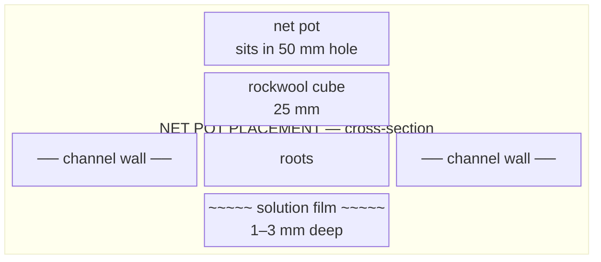

### 12.2 Spacing by Crop

| Crop | Recommended spacing | Net pot size |
|---|---|---|
| Lettuce (head) | 230 mm (one per hole at 11 sites) | 50 mm |
| Spinach | 115–150 mm (every other hole or new spacing) | 50 mm |
| Kale | 230 mm | 50 mm |
| Basil | 150–200 mm | 50 mm |
| Cilantro | 100–120 mm (dense) | 50 mm |
| Mint | 200 mm | 50 mm |
| Parsley | 150 mm | 50 mm |
| Cherry tomatoes | 400–600 mm | 75 mm |
| Peppers | 400 mm | 75 mm |
| Strawberries | 300 mm | 50–75 mm |

### 12.3 First 48 Hours After Planting

The first 48 hours are the most critical for transplant survival.

```
FIRST 48 HOURS PROTOCOL

Hour 0 (planting):
□ Transplant into moistened net pots
□ EC at 1.0–1.2 (reduce if very small seedlings; use 0.8)
□ pH at 5.8–6.0
□ Pump running continuously (no timer) for first 24–48h

Hour 6:
□ Check plants have not wilted excessively
□ Gently mist foliage if wilting (reduces transpiration stress)
□ Check no net pots have dislodged

Hour 24:
□ Inspect roots — are they starting to extend into the film?
□ Check EC and pH — record in logbook
□ Check for any signs of stress (wilting, yellowing)

Hour 48:
□ Roots should be visible at the base of the channel
□ If plants look healthy and are standing upright: switch to timer schedule
□ If plants still wilting: continue continuous pump for another 24h
□ Adjust EC up to 1.2–1.4 once plants are established
```

---


[↑ Back to TOC](#table-of-contents)

## 13. Step 10 — Zone B Microgreens Station

### 13.1 Materials for Zone B

| Item | Qty | Notes |
|---|---|---|
| Seedling trays (10×20") | 6–8 | Standard 1020 trays; reusable |
| Solid tray liners | 6–8 | Fits inside standard tray; for bottom watering |
| Coco coir brick (500g) | 2–3 | Expands to ~8–10 L; enough for several fills |
| Perlite | 1–2 L | Optional; mix 10% into coco |
| Microgreens seeds | Assorted | Sunflower, radish, pea shoots, broccoli |
| Shelving unit | 1 | Metal wire shelf or timber; two tiers minimum |
| LED grow panel (50–100W) | 1 | Full-spectrum; 25–30 cm above tray height |
| Timer | 1 | For LED; 16h on / 8h off |
| Spray bottle | 1 | For initial surface moisture |
| Watering can (fine rose) | 1 | For watering |

### 13.2 Coco Coir Preparation

1. Place coco brick in a large bowl or bucket.
2. Add 5–6 L of water. The brick expands over 5–10 minutes. Break apart with hands.
3. Target consistency: moist enough to clump when squeezed, but no water drips out.
4. Mix in perlite if using (10% by volume).

### 13.3 Filling and Seeding Trays

1. Fill solid liner tray with 2–3 cm of prepared coco.
2. Level and lightly firm the surface (do not compact).
3. Pre-soak seeds for large-seeded varieties (sunflower, peas) for 8–12 h.
4. Spread seeds densely and evenly over the surface. Target: seeds touching but not piled.
5. Cover with a second inverted solid tray as a blackout lid.
6. Keep at room temperature (18–22 °C) for 2–4 days until sprouts emerge.
7. Once sprouts touch the lid and start to lift it, remove the lid and place under the LED.

**Watering during germination:** Mist the surface lightly morning and evening. Do not flood.

**Watering after germination:** Bottom-water by filling the outer solid tray with 1–2 cm of water; allow the coco tray to absorb from below. This prevents damping off (top surface stays drier).

### 13.4 Shelf Layout

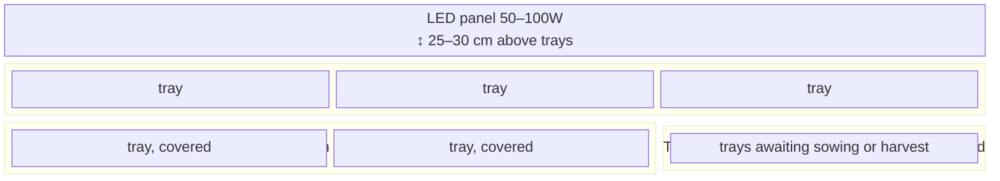

---


[↑ Back to TOC](#table-of-contents)

## 14. Step 11 — Zone C Root Veg Grow Bags

### 14.1 Materials for Zone C

| Item | Qty | Notes |
|---|---|---|
| Fabric grow bags (15–25 L) | 6–8 | Breathable fabric; prevents root circling |
| Coco coir (loose, 50 L bag) | 1 | Or use expanded bricks |
| Perlite (30 L bag) | 1 | |
| Vermiculite (10 L bag) | 1 | |
| Organic slow-release fertiliser | 1 | E.g., Osmocote; or use liquid feeds |
| Saucers / drip trays | 6–8 | Prevents soil run-off |
| Watering can | 1 | Fine rose for gentle watering |

### 14.2 Growing Medium Mix

For root vegetables in grow bags:

```
ZONE C MIX RECIPE (per bag, ~15L bag)

  Component              Volume    Purpose
  ────────────────────────────────────────────────────
  Coco coir              9 L       Water retention, base medium (60%)
  Perlite                4.5 L     Drainage, aeration, prevents compaction (30%)
  Vermiculite            1.5 L     Water retention, mineral buffer (10%)
  Slow-release fert.     30–40 ml  Season-long nutrition
  ────────────────────────────────────────────────────
  Total:                 ~15 L
```

**Mixing:**
1. Expand coco coir (brick × 1 per 2 bags).
2. Combine all dry components in a large tub. Mix thoroughly.
3. Moisten slightly before filling bags (dry coco is hydrophobic).
4. Fill grow bags to ~3 cm from the top. Firm gently — do not compact hard.

### 14.3 Sowing Root Veg Direct

Root vegetables do NOT transplant well. Sow seeds directly in the grow bags.

**Radishes:** 1 cm deep, 3 cm spacing. Germination: 3–5 days. Harvest: 25–35 days.
**Carrots:** 1 cm deep, 3–5 cm apart. Thin to 5 cm once established. Harvest: 70–80 days.
**Beetroot:** 2 cm deep, 5 cm apart. Each "seed" is actually a cluster — thin to 1 plant per 10 cm. Harvest: 55–70 days.

**Watering regime:**
- Check moisture with finger test: 2 cm into the medium
- If dry: water until slight drainage from bag bottom
- If moist: hold off
- Aim for consistent moisture — very wet or bone dry both cause root problems

### 14.4 Grow Bag Layout

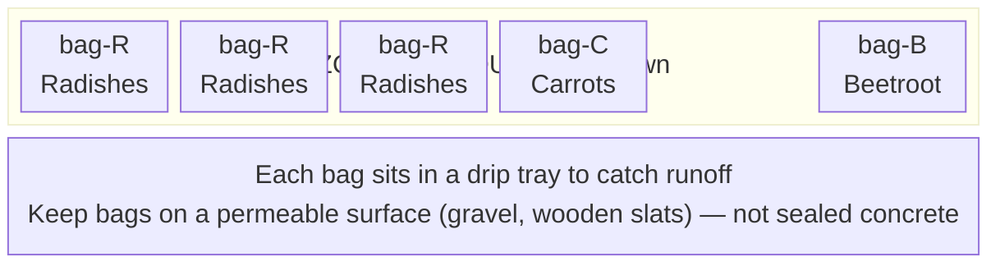

---


[↑ Back to TOC](#table-of-contents)

## 15. Common Build Mistakes and How to Avoid Them

These are the most frequently reported mistakes in DIY NFT builds, and how to prevent each one.

### Mistake 1 — Insufficient slope

**What happens:** Water pools in flat spots. Roots become waterlogged and anaerobic. Pythium and root rot follow within days.

**Prevention:** Always verify slope with a spirit level AND by running plain water and watching it flow. The marble/ball-bearing trick is a great visual check. Calculate the exact leg height difference (see Step 2) rather than guessing.

### Mistake 2 — Flow rate too high

**What happens:** Water rushes through the channel too fast, the film is too deep, air gaps are washed away, roots are submerged rather than misted. Nutrient uptake decreases; root rot risk increases.

**Prevention:** Aim for 1–2 L/min per channel. Measure this at commissioning with a timer and a 1 L container. Adjust manifold valves down until flow is correct. Open the valve slowly — a little goes a long way.

### Mistake 3 — Light leaks into reservoir

**What happens:** Algae blooms within 2–3 days. Green slime coats the reservoir walls, supply lines, and channels. pH spikes during the day (algae consumes CO₂, raising pH). DO₂ plummets at night (algae respiration consumes O₂). Pump clogs.

**Prevention:** The reservoir must be 100% opaque. Shine a torch inside with the lid on — you should see zero glow on the outside. Wrap, paint, or box the reservoir fully. Black liner inside + white reflective exterior is the ideal combination.

### Mistake 4 — Not deburring holes

**What happens:** Sharp plastic edges on net pot holes and pipe cuts snag roots, damaging them as they grow. Damaged roots are infection points for Pythium.

**Prevention:** After every cut with a hole saw, hacksaw, or drill — sand the edges with 120-grit paper. This takes 30 seconds and prevents hours of future problems.

### Mistake 5 — Skipping the water test

**What happens:** System is filled with nutrient solution, pump turned on — and there's a leak at a bulkhead fitting. Nutrient solution drains across the ground (or into the reservoir of a neighbour). Expensive nutrients wasted; time lost replanting.

**Prevention:** Always run Step 7 first. Plain water reveals all leaks before they cost anything. Run for 30 minutes minimum.

### Mistake 6 — EC or pH meter uncalibrated

**What happens:** pH is thought to be 6.0 but is actually 7.2. Plants show nutrient lockout within a week. Problem is invisible until plants show stress symptoms.

**Prevention:** Calibrate EC and pH meters before first use and every 2–4 weeks. Calibration sachets (pH 4.0 and 7.0 for pH meters; 1413 µS/cm for EC meters) are cheap and essential. See Guide 03 for full calibration protocol.

### Mistake 7 — Planting too early in spring

**What happens:** Basil, tomatoes, or peppers are placed in the outdoor system in April. A late frost kills them overnight. Or chronic cold (below 15 °C nights) prevents any growth and leaves them vulnerable to root rot.

**Prevention:** Check last frost date for your location. Plant frost-tender crops only after the last frost date. Use a local weather forecast site for soil/night temperature data. If in doubt, wait one more week.

### Mistake 8 — Overcrowding channels

**What happens:** 15 lettuce plants are crammed into a 2.4 m channel. When they are half-size, air cannot circulate between them. Humidity rises, powdery mildew appears, outer leaves yellow. Yields per plant are poor.

**Prevention:** Follow spacing guidelines in Section 12.2. Fewer, healthier plants outperform many stressed ones.

### Mistake 9 — Letting the reservoir run low

**What happens:** Pump draws air, runs dry, overheats, and burns out. Or EC spikes because nutrient solution has been concentrated by evaporation and plant uptake.

**Prevention:** Check the reservoir level daily (the waterline markings from Step 4 make this quick). Top up with plain pH-adjusted water when it drops 10 L (not with fresh nutrient solution unless EC has also dropped).

### Mistake 10 — Not having a backup plan for pump failure

**What happens:** Pump dies overnight. Roots dry out within 2–4 hours in warm weather. By morning, plants are wilting badly; a single-day outage can kill a full channel.

**Prevention:** Keep a spare submersible pump in your kit. They are inexpensive (~$10–$20). If you cannot source a spare, at minimum know where you can buy one locally same-day.

---


[↑ Back to TOC](#table-of-contents)

## 16. Build Checklist

Use this as a final sign-off before moving to nutrient operation.

```
ZONE A — NFT SYSTEM
□ Site selected; orientation confirmed
□ Frame built; slope verified (1:30 minimum)
□ All 4 channels cut, deburred, and net pot holes drilled
□ Inlet fittings and end caps fitted; silicone cured
□ Drain fittings and end caps fitted; silicone cured
□ Reservoir prepared: opaque, lid sealed, fill marks drawn
□ Pump installed in reservoir
□ Supply manifold built and mounted
□ Supply tubes connected; secured with hose clips
□ Drain header assembled; slope verified
□ All joints inspected; no dry-fitting — all sealed
□ Water test completed (Step 7); no leaks after 30 min
□ EC and pH meters calibrated
□ Timer installed in weatherproof enclosure; GFCI protected
□ Air pump and air stone installed (if using)
□ First nutrient batch mixed; EC and pH confirmed

ZONE B — MICROGREENS STATION
□ Shelving unit in place
□ LED panel mounted at correct height; timer set
□ Trays and liners in place
□ Coco coir prepared and trays filled
□ First seeds sown and in blackout

ZONE C — ROOT VEG BAGS
□ Grow bags filled with coco/perlite/vermiculite mix
□ Bags positioned in drip trays
□ First seeds sown direct

GENERAL
□ Daily monitoring schedule confirmed (Guide 08)
□ Logbook started (date, initial EC, pH, reservoir level)
□ Pest/disease reference (Guide 07) reviewed
□ Spare pump sourced or ordered
□ Spare fittings kit: 4× barbed connectors, 6× hose clips, 1 m spare 12 mm tubing
□ Shade cloth and fleece ready to deploy
```

---


[↑ Back to TOC](#table-of-contents)

> **Next:** [Guide 12 — Budget and Sourcing →](./12-budget-and-sourcing.md)

---

<!-- copyright -->
*Copyright (c) 2026 UncleJS. Licensed under [CC BY-NC 4.0](https://creativecommons.org/licenses/by-nc/4.0/) — free to share and adapt for non-commercial purposes with attribution.*
