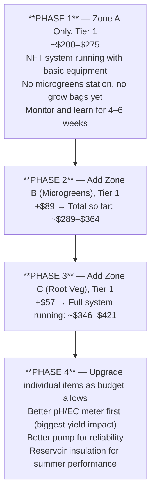
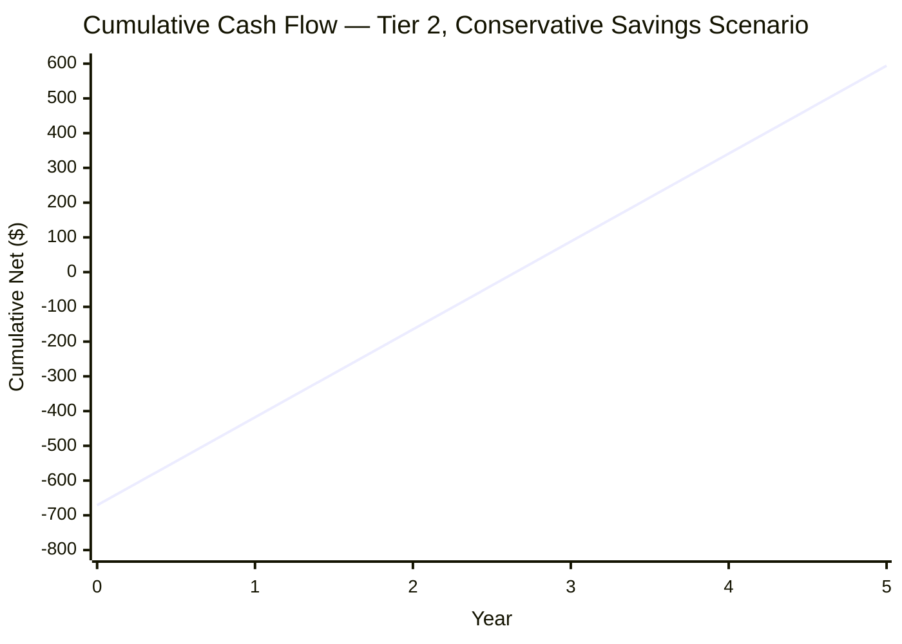

# Guide 12 — Budget, Sourcing, and ROI

This guide provides an itemised bill of materials (BOM) for all three build tiers, sourcing guidance, running cost estimates, and a realistic return-on-investment (ROI) calculation based on expected yields versus supermarket prices.

---


## 1. Build Tier Overview

Three tiers are defined based on total budget and the trade-offs at each level:

```
TIER 1 — LEAN ($100–$180)
  Philosophy: Get the system running with minimal spend.
              Maximise scavenging, repurposing, and basic parts.
  Trade-offs: More DIY labour, less precision, less monitoring.
  Best for:   First-time builders, low-risk trial before investing more.

TIER 2 — STANDARD ($180–$350)  ← Recommended
  Philosophy: Solid, reliable, purpose-built components.
              Good monitoring equipment, long-lasting materials.
  Trade-offs: Higher upfront cost, faster and easier build.
  Best for:   Most growers — the best balance of cost and reliability.

TIER 3 — OPTIMISED ($350–$500)
  Philosophy: Best-available components for maximum yield, longevity,
              and minimal intervention.
  Trade-offs: High upfront cost; some items are "nice to have."
  Best for:   Serious growers, second build, or gift-ready setup.
```

Items are priced in USD with approximate GBP/EUR equivalents in brackets. Prices are based on typical 2024–2025 retail prices; check current pricing at purchase time.

---


[↑ Back to TOC](#table-of-contents)

## 2. Zone A — NFT System BOM

### 2.1 Frame

| Item | Tier 1 (Lean) | Tier 2 (Standard) | Tier 3 (Optimised) |
|---|---|---|---|
| **Timber (45×45 PAR, 4×900mm legs + cross-braces)** | $8 — basic untreated pine | $12 — exterior grade treated | $18 — smooth hardwood or pre-painted |
| **Timber (75×25 rails, 2×2.4m)** | $6 — offcuts from timber yard | $10 — purpose-cut | $14 — hardwood |
| **Screws (75mm, box of 50)** | $4 | $5 | $6 |
| **Wood glue (PVA)** | $3 (shared bottle) | $3 | $3 |
| **Exterior paint or timber preservative** | $0 — skip or use leftover | $8 | $12 |
| **Ground anchors / pegs** | $0 — tent pegs or scrap | $5 | $10 |
| **Frame subtotal** | **$21** | **$43** | **$63** |

### 2.2 Channels

| Item | Tier 1 | Tier 2 | Tier 3 |
|---|---|---|---|
| **75mm square PVC downpipe (3×2.4m)** | $12 — from local hardware | $15 | $15 |
| **100mm square PVC downpipe (1×2.4m)** | $6 | $8 | $8 |
| **PVC end caps (8× — 2 per channel)** | $6 | $8 | $8 |
| **12mm barbed inlet fittings (4×)** | $4 — 3D-print or irrigation barbs | $5 | $6 |
| **25mm bulkhead drain fittings (4×)** | $8 — irrigation bulkheads | $10 | $12 |
| **Silicone sealant (tube)** | $4 | $5 | $6 |
| **50mm net pots (pack of 25)** | $5 | $6 | $7 |
| **75mm net pots (pack of 10)** | $3 | $4 | $5 |
| **Channels subtotal** | **$48** | **$61** | **$67** |

### 2.3 Reservoir

| Item | Tier 1 | Tier 2 | Tier 3 |
|---|---|---|---|
| **80–100L HDPE container** | $0 — repurposed food barrel | $25 — purpose-bought HDPE bin | $40 — dedicated hydro reservoir |
| **Reflective foam insulation (reservoir wrap)** | $0 — foil bubble wrap offcut | $8 — Kingspan/foam board | $15 — purpose-cut foam box |
| **Black paint (reservoir exterior)** | $0 — leftover paint | $5 | $0 — reservoir already opaque |
| **Lid gasket / foam seal strips** | $3 | $4 | $5 |
| **Reservoir subtotal** | **$3** | **$42** | **$60** |

### 2.4 Pump and Aeration

| Item | Tier 1 | Tier 2 | Tier 3 |
|---|---|---|---|
| **Submersible pump 600–800 L/h** | $12 — no-name aquarium pump | $20 — Jebao or Hygger brand | $35 — VicTsing/Uniclife adjustable flow |
| **Air pump 4–6 L/min** | $8 | $12 | $18 |
| **Air stone (2×)** | $3 | $4 | $6 |
| **Airline tubing (2m)** | $2 | $3 | $3 |
| **Non-return valve (air line)** | $2 | $2 | $3 |
| **Pump subtotal** | **$27** | **$41** | **$65** |

### 2.5 Plumbing

| Item | Tier 1 | Tier 2 | Tier 3 |
|---|---|---|---|
| **32mm PVC pipe (1.5m, manifold)** | $4 | $5 | $6 |
| **32mm PVC pipe (2m, drain header)** | $5 | $6 | $7 |
| **12mm irrigation tubing (5m)** | $5 | $6 | $6 |
| **12mm inline ball valves (4×)** | $8 — tap valves | $10 — proper ball valves | $14 — quality brass ball valves |
| **Reducing T-pieces 32×25mm (4×)** | $6 | $8 | $10 |
| **12–32mm reducers and adaptors (assorted)** | $6 | $8 | $10 |
| **Hose clips (bag of 20)** | $4 | $5 | $6 |
| **PTFE tape (roll)** | $1 | $1 | $1 |
| **Cable ties (bag of 100)** | $2 | $3 | $3 |
| **Plumbing subtotal** | **$41** | **$52** | **$63** |

### 2.6 Electrical

| Item | Tier 1 | Tier 2 | Tier 3 |
|---|---|---|---|
| **Outdoor extension lead (10m, IP44)** | $12 | $18 | $25 |
| **Digital timer (outdoor rated)** | $10 | $15 | $20 |
| **GFCI/RCD adaptor** | $10 | $12 | $15 |
| **Weatherproof enclosure (for timer)** | $0 — zip-lock bag in emergency | $8 | $15 |
| **Electrical subtotal** | **$32** | **$53** | **$75** |

### 2.7 Monitoring and Testing

| Item | Tier 1 | Tier 2 | Tier 3 |
|---|---|---|---|
| **pH pen (basic)** | $10 — cheap Amazon pen | $30 — Apera pH20 or similar | $50 — Apera PC60 combo |
| **EC pen** | $10 — separate basic pen | $20 — separate mid-range | $0 — included in PC60 above |
| **Calibration sachets (pH 4.0 + 7.0, EC 1413)** | $5 | $8 | $10 |
| **Digital aquarium thermometer** | $5 | $8 | $12 |
| **Outdoor min/max thermometer** | $5 | $10 | $15 |
| **WiFi temp/humidity logger (Govee or similar)** | $0 | $0 | $20 |
| **Monitoring subtotal** | **$35** | **$76** | **$107** |

### 2.8 Growing Media (Zone A)

| Item | Tier 1 | Tier 2 | Tier 3 |
|---|---|---|---|
| **Clay pebbles / LECA (5–10 L bag)** | $8 | $10 | $12 |
| **Rockwool cubes (25mm, block of 50)** | $6 | $8 | $10 |
| **Growing media subtotal** | **$14** | **$18** | **$22** |

### 2.9 Nutrients

| Item | Tier 1 | Tier 2 | Tier 3 |
|---|---|---|---|
| **MasterBlend 4-18-38 (500g)** | $15 | $15 | $15 |
| **Calcium Nitrate (500g)** | $8 | $8 | $8 |
| **Epsom Salt (500g food grade)** | $3 | $3 | $3 |
| **pH Down (phosphoric acid solution, 250mL)** | $6 | $8 | $10 |
| **pH Up (potassium hydroxide solution, 250mL)** | $5 | $6 | $8 |
| **Nutrients subtotal** | **$37** | **$40** | **$44** |

### 2.10 Climate / Protection

| Item | Tier 1 | Tier 2 | Tier 3 |
|---|---|---|---|
| **Shade cloth 40–50% (2m × 1.5m)** | $8 | $12 | $16 |
| **Horticultural fleece 17g/m² (3m × 2m)** | $6 | $8 | $10 |
| **Fleece/shade cloth pegs or clips (bag of 20)** | $3 | $4 | $5 |
| **Freeze water bottles (DIY — free)** | $0 | $0 | $0 |
| **Aquarium heater 50W (winter)** | $0 — skip (winterise system) | $0 | $20 |
| **Climate subtotal** | **$17** | **$24** | **$51** |

---

### Zone A Total (NFT System)

| Category | Tier 1 | Tier 2 | Tier 3 |
|---|---|---|---|
| Frame | $21 | $43 | $63 |
| Channels | $48 | $61 | $67 |
| Reservoir | $3 | $42 | $60 |
| Pump & aeration | $27 | $41 | $65 |
| Plumbing | $41 | $52 | $63 |
| Electrical | $32 | $53 | $75 |
| Monitoring | $35 | $76 | $107 |
| Growing media | $14 | $18 | $22 |
| Nutrients | $37 | $40 | $44 |
| Climate | $17 | $24 | $51 |
| **Zone A TOTAL** | **$275** | **$450** | **$617** |

> **Note:** Tier 1 comes in above the stated $100–$180 range for Zone A alone. The range applies to a single-zone minimal setup. The full 3-zone system has more components. See Section 6 for how to reach the target ranges by splitting the build phases.

---


[↑ Back to TOC](#table-of-contents)

## 3. Zone B — Microgreens Station BOM

| Item | Tier 1 | Tier 2 | Tier 3 |
|---|---|---|---|
| **Seedling trays 10×20" (pack of 10)** | $8 | $12 | $15 |
| **Solid liner trays (pack of 10)** | $6 | $8 | $10 |
| **Coco coir bricks (3×500g)** | $8 | $10 | $12 |
| **Perlite (5 L bag)** | $5 | $6 | $8 |
| **Shelving unit (2-tier, metal wire)** | $15 — secondhand / flea market | $25 — new wire shelf | $40 — powder-coated grow rack |
| **LED grow panel (50–100W full-spectrum)** | $20 — no-name grow strip | $40 — MARS Hydro or Spider Farmer | $65 — Samsung LM301H quantum board |
| **Digital timer (indoor)** | $8 | $10 | $12 |
| **Spray bottle** | $2 | $3 | $4 |
| **Watering can (fine rose)** | $5 | $8 | $12 |
| **Microgreens seeds assortment (100g each × 3 varieties)** | $12 | $18 | $25 |
| **Zone B TOTAL** | **$89** | **$140** | **$203** |

---


[↑ Back to TOC](#table-of-contents)

## 4. Zone C — Root Veg Grow Bags BOM

| Item | Tier 1 | Tier 2 | Tier 3 |
|---|---|---|---|
| **Fabric grow bags 15–25L (pack of 5–10)** | $8 (5×) — thin non-woven | $14 (10×) — quality felt fabric | $22 (10×) — thick felt, handles |
| **Coco coir loose (50 L bag)** | $12 | $15 | $18 |
| **Perlite (30 L bag)** | $10 | $12 | $15 |
| **Vermiculite (10 L bag)** | $6 | $8 | $10 |
| **Slow-release fertiliser (Osmocote 500g)** | $8 | $12 | $15 |
| **Drip saucers (pack of 5–10)** | $5 | $8 | $12 |
| **Root veg seed assortment** | $8 | $12 | $18 |
| **Zone C TOTAL** | **$57** | **$81** | **$110** |

---


[↑ Back to TOC](#table-of-contents)

## 5. Consumables and Ongoing Supplies

These are not one-time costs but will recur each growing season (or more frequently).

### Per Season (8–9 month outdoor season)

| Item | Low estimate | Mid estimate | High estimate |
|---|---|---|---|
| **MasterBlend 4-18-38 (500g lasts ~3 months at moderate use)** | $30 (2×) | $45 (3×) | $60 (4×) |
| **Calcium Nitrate (proportional to above)** | $16 | $24 | $32 |
| **Epsom Salt** | $3 | $6 | $9 |
| **pH Down** | $10 | $15 | $20 |
| **pH Up** | $6 | $10 | $14 |
| **Calibration sachets (replace annually)** | $5 | $8 | $10 |
| **Rockwool/Rapid Rooter plugs (per succession)** | $6/succession × 4 = $24 | Same | Same |
| **Clay pebbles (small top-up)** | $5 | $5 | $5 |
| **Seeds (all zones, per season)** | $20 | $35 | $50 |
| **Pest/disease treatments (preventive)** | $10 | $20 | $30 |
| **Microgreens coco coir top-up** | $8 | $12 | $16 |
| **Root veg slow-release fert top-up** | $6 | $8 | $10 |
| **Annual consumables TOTAL** | **~$143** | **~$212** | **~$280** |

**Average ongoing cost: ~$175–$200 per full season.**

---


[↑ Back to TOC](#table-of-contents)

## 6. Tier Totals Summary

### Full 3-Zone System (All Zones)

| Tier | Zone A | Zone B | Zone C | Total Build Cost |
|---|---|---|---|---|
| **Tier 1 — Lean** | $275 | $89 | $57 | **$421** |
| **Tier 2 — Standard** | $450 | $140 | $81 | **$671** |
| **Tier 3 — Optimised** | $617 | $203 | $110 | **$930** |

### How to Achieve the $100–$500 Stated Range

The stated budget range is achievable by **phasing the build:**



This phased approach lets you start with a functional system at ~$200 and expand as you gain confidence and see results.

---


[↑ Back to TOC](#table-of-contents)

## 7. Where to Buy

### 7.1 Online — General

| Platform | Best for | Tips |
|---|---|---|
| **Amazon** | Pumps, timers, meters, net pots, grow bags, LED panels, seeds | Check sold/fulfilled-by-Amazon for quality assurance; read recent reviews |
| **eBay** | Secondhand reservoirs, used pumps, bulk nutrient chemicals, IBC totes | New sellers can offer great prices; check return policy |
| **Alibaba / AliExpress** | Very cheap net pots, channels, fittings in bulk | 3–6 week shipping; unpredictable quality — good for non-critical items |
| **Etsy** | Seeds (especially heirloom/specialty microgreen varieties) | Small suppliers often have better variety and germination rates |

### 7.2 Online — Hydroponics Specialist

| Retailer | Region | Strength |
|---|---|---|
| **HTG Supply** | USA | Full hydroponics range, competitive pricing |
| **Growers House** | USA | Commercial-grade equipment at consumer prices |
| **Hydroponics UK** | UK | NFT channels, nutrients, growing media |
| **Nutriculture** | UK | NFT channel manufacturer, direct sales |
| **AutoPot** | UK/EU/AU | Gravity-fed systems but also NFT accessories |
| **Canna Wholesale** | EU/UK/AU | Premium nutrients, growing media |
| **Bunnings** (online + stores) | Australia/NZ | PVC pipe, containers, hardware |

### 7.3 Local — Hardware / DIY Stores

For structural materials, PVC pipe, and plumbing fittings, local hardware stores beat online on price (no shipping) and allow you to check quality in person.

```
WHAT TO BUY LOCALLY (hardware store)
  ✓ PVC downpipe (75mm, 100mm) — ask the plumbing aisle
  ✓ PVC end caps and fittings
  ✓ Timber for frame
  ✓ Screws, wood glue, silicone sealant
  ✓ PTFE tape
  ✓ Hose clips
  ✓ Extension lead
  ✓ Cable ties
  ✓ Spray bottle, buckets

  Store types: Home Depot, Lowe's (USA); B&Q, Screwfix, Wickes (UK);
               Bauhaus, OBI (EU); Bunnings (AU/NZ)
```

### 7.4 Local — Garden Centres and Plant Nurseries

| Item | Why garden centre | Notes |
|---|---|---|
| Seeds (lettuce, herbs, tomatoes) | Wider variety selection | Buy F1 hybrid for predictable performance |
| Seedling trays | Cheaper than online | Often multi-packs |
| Horticultural fleece | Often on-shelf | 17 g/m² or 30 g/m² |
| Shade cloth | Seasonal stock | 40–50% shade is most versatile |
| Epsom Salt | Cheaper than hydro shops | Sold as "garden Epsom" in bulk bags |
| Fertilisers (slow-release) | Branded options available | Osmocote is widely stocked |

### 7.5 Buying Used / Secondhand

| Item | Where to find | What to check |
|---|---|---|
| **Reservoir / food-grade barrels** | Facebook Marketplace, Craigslist, local farms | Must be food-grade HDPE; no chemical previous use |
| **IBC totes** | eBay, Gumtree, farm supply | Food-grade only; rinse thoroughly × 3 before use |
| **Shelving units** | Facebook Marketplace, charity shops | Metal wire shelving is ideal |
| **LED grow lights** | eBay, local classifieds | Test before committing; check LED degradation |
| **Aquarium pumps** | eBay, aquarium clubs | Test in water; impeller wear reduces output |
| **pH/EC meters** | eBay | Risky secondhand — calibration drift; better to buy new |

### 7.6 Nutrients — Sourcing the Masterblend Trio

| Supplier | Location | Notes |
|---|---|---|
| **MasterBlend directly** | USA (ships internationally) | 2.27 kg bags ($28–$40 USD) last 1–2 seasons for a small system |
| **Amazon** | Global | Small 500g or 1 kg bags suitable for trials |
| **Hydroponics UK** | UK | Stocks Masterblend and CN; 500g–1 kg bags |
| **Local pool/chemical supply** | Regional | Calcium Nitrate often available as bulk fert chemical |
| **Brewing supply shops** | Local/online | Epsom Salt in bulk (1–5 kg), food/pharma grade |

**Cheapest route for UK growers:** Masterblend from Amazon UK or Hydroponics UK; Calcium Nitrate from a local garden or farm supply; Epsom Salt from Wilko or Aldi (5 kg health/bath salt, food grade, same compound).

---


[↑ Back to TOC](#table-of-contents)

## 8. Cost-Saving Strategies

### 8.1 Repurpose Food-Grade Containers

The reservoir is the single biggest variable in cost. Spending $0 on a repurposed container versus $40 on a dedicated hydroponics reservoir saves $40 without affecting performance.

**Where to find free/cheap food-grade containers:**
- Restaurant kitchens (pickle barrels, 20–25 L food buckets)
- Bakeries (icing and shortening containers, 20 L)
- Breweries and home-brew shops (large fermentation vessels)
- Online "free" sections (Facebook Marketplace, Nextdoor, Gumtree)
- Food bank or church kitchens

Verify food-grade: look for the "fork and cup" symbol or "HDPE" / "#2" recycling symbol.

### 8.2 PVC Offcuts from Builders and Plumbers

Builders and plumbers often have short PVC pipe offcuts they discard. A 2.4 m NFT channel can sometimes be sourced for free or very cheaply this way. Ask at:
- Local plumbing merchant offcuts bins
- Building sites (ask site foreman)
- Plumbing contractors (ask on local community groups)

### 8.3 Buy Nutrients in Bulk

The per-gram cost of Masterblend drops sharply as pack size increases:

| Pack size | Approx cost | Cost per gram |
|---|---|---|
| 100g | $8 | $0.080/g |
| 500g | $15 | $0.030/g |
| 1 kg | $22 | $0.022/g |
| 2.27 kg | $35 | $0.015/g |

Buying a 2.27 kg pack instead of a 100g pack reduces nutrient cost by ~80%. Share bulk orders with a friend or neighbour if you cannot use 2.27 kg in one season.

### 8.4 Make Your Own pH Buffers

Commercial pH Down is dilute phosphoric or citric acid. You can substitute:
- **pH Down DIY:** Citric acid powder (food grade), 5 g per litre of water = pH ~2.5 stock solution. Add to reservoir in small amounts. Citric acid is ~$3–$5 per 500g at health food shops. Cost per use is a fraction of commercial pH Down.
- **pH Up DIY:** Baking soda (sodium bicarbonate) can raise pH but adds sodium to the solution, which can be problematic over time. Preferred: commercial potassium hydroxide-based pH Up — this adds potassium, which is a beneficial plant nutrient.

### 8.5 Seed Saving and Division

- Many herbs can be propagated by cuttings (basil, mint): no seed cost once established
- Strawberry runners can be pinned and rooted: free new plants each season
- Chives can be divided: one pot becomes many
- Lettuce: allow one plant to bolt and collect seed — ~100 seeds per plant

### 8.6 Reuse Growing Media

Clay pebbles (LECA) can be reused indefinitely if properly cleaned. After each crop:
1. Collect pebbles.
2. Rinse in a bucket of clean water.
3. Soak in 1:10 bleach solution for 30 minutes.
4. Rinse thoroughly × 3 with clean water.
5. Allow to dry in sun.
6. Reuse.

Rockwool cubes are single-use (they degrade and can harbour pathogens). Switch to Rapid Rooter or coco plugs (both biodegradable) for slightly easier disposal.

---


[↑ Back to TOC](#table-of-contents)

## 9. Running Costs

### 9.1 Electricity

| Device | Wattage | Hours/day | kWh/day | kWh/month | Cost/month* |
|---|---|---|---|---|---|
| Submersible pump (600W/h) | 8–15W | 18 h (on timer) | 0.18–0.27 | 5.4–8.1 | $0.54–$0.81 |
| Air pump (4 L/min) | 3–5W | 24 h | 0.07–0.12 | 2.1–3.6 | $0.21–$0.36 |
| Zone B LED panel (50W) | 50W | 16 h | 0.80 | 24 | $2.40 |
| Monitoring devices (Govee, etc.) | <2W | 24 h | 0.05 | 1.5 | $0.15 |
| **Total** | | | | | **$3.30–$3.72/month** |

*Based on $0.10/kWh (mid-range US residential). UK/EU at £0.24–€0.30/kWh would be ~2–3× higher (~$8–$11/month).

**Annual electricity cost:** ~$40–$100 depending on location and LED usage.

### 9.2 Water

Water usage varies significantly by temperature and crop. Typical outdoor NFT system:
- Evaporation and plant uptake: 3–8 L/day in spring/autumn; 8–20 L/day in summer
- Annual water use: approximately 1,500–3,000 L per season (1.5–3 m³)
- Tap water cost at typical rates ($0.003–$0.008/L): **$4–$24/season**
- Using harvested rainwater: **$0**

### 9.3 Nutrient Costs (Masterblend Trio)

At the standard mixing rate of 0.6 g/L and 80 L reservoir, changed every 7–10 days:

```
Per reservoir change (standard vegetative EC ~1.4–1.6):
  Masterblend:     0.6 g/L × 80L = 48g
  Calcium Nitrate: 48g
  Epsom Salt:      24g
  Total:           120g of nutrients

At 2.27kg Masterblend pack ($35):
  Cost per 48g Masterblend = 48 × ($35 ÷ 2270) = $0.74
  Calcium Nitrate 48g at $15/500g = $1.44
  Epsom Salt 24g at $5/1000g = $0.12
  ──────────────────────────────────
  Total per reservoir fill: ~$2.30

At 36 changes per season (every ~7 days for 9 months):
  ~36 × $2.30 = ~$83/season (full reservoir changes)
  With partial top-ups (more common), actual cost closer to $50–$70
```

**Typical nutrient cost: $50–$85/season.**

### 9.4 Full Annual Running Cost Summary

| Category | Low | Mid | High |
|---|---|---|---|
| Electricity | $40 | $65 | $100 |
| Water | $4 | $12 | $24 |
| Nutrients (Masterblend trio) | $50 | $70 | $85 |
| pH adjustment chemicals | $10 | $20 | $30 |
| Seeds (all zones) | $20 | $35 | $50 |
| Growing media top-up | $10 | $15 | $20 |
| Pest/disease treatments | $5 | $15 | $30 |
| Misc replacements (hose, fitting, fuse) | $5 | $15 | $30 |
| **Annual running total** | **$144** | **$247** | **$369** |

**Realistic mid-range annual running cost: ~$200–$250.**

---


[↑ Back to TOC](#table-of-contents)

## 10. Yield Estimates and ROI

### 10.1 Zone A — NFT Expected Yields

Yield estimates are based on moderately experienced management of the system. Actual yields will vary with genetics, season length, and growing conditions.

> **First-season adjustment:** If this is your first hydroponic grow, expect to achieve **40–60% of the yields listed below**. Transplant losses, pH/EC learning curve, pest surprises, and setup optimisation all reduce first-season output. This is normal. By your second full season, with a tuned system and practiced routine, you should approach the figures shown. Do not judge the system's viability on first-season results alone.

#### Lettuce (Channel 1, 11 sites, ~230mm spacing)

```
Succession planting: 5 weeks seed-to-harvest (mature head)
Heads per site per year: 52 weeks ÷ 5 weeks = ~10 successions
                         × 0.7 efficiency (gaps, failures) = 7 harvests/site
Total heads per season (8 months): 11 sites × 6 harvests = 66 heads
Average head weight: 150–200g
Total yield: ~10–13 kg of lettuce per season from Channel 1
```

**Supermarket value:** Organic baby gem / head lettuce: $2.50–$4.00 per head
**Season value of Channel 1 lettuce:** 66 heads × $3.00 = **$198**

#### Herbs (Channel 3, 11 sites)

Herbs are cut-and-come-again; yield is measured in continuous cuttings rather than discrete harvests.

```
Basil: 1 plant yields ~20–40g fresh cuttings per week once established
       11 sites × 25g/week × 20 weeks = 5,500g = 5.5 kg
       Supermarket: fresh basil ~$3/30g → $3 ÷ 30g = $0.10/g
       Value: 5,500g × $0.10 = $550 (if sold) / strong household value

Mint, chives, parsley: similar volume but lower per-gram retail value
Conservative herb value for Channel 3: ~$200–$400 season
```

#### Cherry Tomatoes (Channel 4, 3–4 plants)

```
Cherry tomato (indeterminate): 2–4 kg per plant per season outdoor
3 plants × 3 kg = 9 kg
Supermarket: cherry tomatoes $4–$6/250g = $16–$24/kg
Value: 9 kg × $6/250g = 9,000g ÷ 250g × $5.00 = $180
```

#### Strawberries (Channel 4, 4–6 plants)

```
Outdoor strawberry: 300–500g fruit per plant per season
5 plants × 400g = 2 kg
Supermarket: strawberries $4–$6 for 400g
Value: 2,000g ÷ 400g × $5.00 = $25
```

### 10.2 Zone B — Microgreens Yield

```
Standard tray (10×20"): ~150–250g finished microgreens per harvest
Harvest time: 7–14 days from sow to harvest
Running 3 trays staggered:
  → Harvest every 3–4 days
  → ~200g per harvest × 2.5 harvests/week = 500g/week
  → 40 weeks × 500g = 20 kg/season

Supermarket microgreens: $3–$6 per 50g punnet
At $4/50g = $80/kg
Value: 20 kg × $40/kg (wholesale equivalent, conservative) = $800/season
```

Microgreens have extremely high value-per-gram and are one of the best ROI crops in the system.

### 10.3 Zone C — Root Veg Yield

```
Radishes (8 bags, 12 plants/bag = ~96 plants):
  → 25–35 days per succession, 6–8 successions per season
  → 96 plants × 30g = 2.9 kg per succession × 7 = 20 kg/season
  Supermarket: $2/bunch (200g) = $10/kg
  Value: 20 kg × $10 = $200/season

Carrots (2 bags, ~20 plants/bag = 40 plants):
  → One main succession + one follow-up
  → 40 plants × 100g = 4 kg
  Value at $3/kg = $12

Beetroot (2 bags, ~16 plants):
  → 16 plants × 200g = 3.2 kg
  Value at $2.50/kg = $8
```

### 10.4 Total Annual Yield Value

| Zone / Crop | Yield (kg/season) | Value (supermarket price) |
|---|---|---|
| Lettuce (Ch. 1) | 10–13 kg | $165–$250 |
| Leafy greens (Ch. 2 — kale/spinach) | 6–10 kg | $60–$120 |
| Herbs (Ch. 3) | ~5.5 kg cut | $200–$400 |
| Fruiting crops (Ch. 4) | ~11 kg | $200–$250 |
| **Zone A subtotal** | **~33–40 kg** | **$625–$1,020** |
| Microgreens (Zone B) | ~20 kg | $600–$800 |
| Radishes (Zone C) | ~20 kg | $180–$220 |
| Carrots + Beetroot (Zone C) | ~7 kg | $20–$30 |
| **Zone C subtotal** | **~27 kg** | **$200–$250** |
| **GRAND TOTAL** | **~80–90 kg** | **$1,425–$2,070/season** |

> **Important caveat:** These are supermarket retail equivalent values — the money you save on your grocery bill, not money you earn. Not all this produce can be consumed by one household. Microgreens in particular will exceed typical household consumption unless you sell or donate surplus.

---


[↑ Back to TOC](#table-of-contents)

## 11. Payback Period Analysis

### 11.1 Tier 2 — Standard Build Payback

```
TIER 2 FULL BUILD (3 ZONES)

Total build cost:          $671
Annual running cost:       $247 (mid estimate)
Annual yield value:        $1,000–$1,500 (conservative; household consumption)

Net value per season:      $1,200 (mid) - $247 (running) = $953/season
Break-even (payback):      $671 ÷ $953 = ~0.7 seasons
                           → Paid off within first season
```

Even accounting for the fact that one household cannot consume $1,200 worth of produce, a more conservative estimate of $500 in groceries saved:

```
Conservative household savings: $500/season
Running cost: $247/season
Net annual benefit: $253/season

Payback on $671 build: $671 ÷ $253 = ~2.7 seasons (≈3 years)
```

### 11.2 Tier 1 — Lean Build Payback

```
TIER 1 FULL BUILD

Total build cost:          $421
Annual running cost:       $144 (low estimate)
Conservative savings:      $400/season
Net benefit:               $400 - $144 = $256/season
Payback:                   $421 ÷ $256 = ~1.6 seasons
```

### 11.3 Payback Summary Chart



> Assumes no major equipment replacement in 5 years. Pump may need replacement at year 2–3 (~$20–$35).

### 11.4 Non-Financial Value

The ROI analysis only captures direct grocery savings. The full value of the system also includes:

- **Food quality:** Fresh-cut herbs and salad contain significantly more vitamins than supermarket equivalents stored for days
- **Food security:** Year-round production of some staples regardless of store supply or price inflation
- **Skill development:** Hydroponic growing skills, understanding of plant nutrition, and ecosystem management
- **Educational value:** Especially for households with children
- **Mental health:** Growing food is consistently linked to stress reduction and wellbeing in research literature
- **Carbon footprint:** Eliminating packaging, transport, and refrigeration chain for your own fresh produce

---


[↑ Back to TOC](#table-of-contents)

## Quick Reference — Budget at a Glance

```mermaid
xychart-beta
    title "System Build Cost by Tier"
    x-axis ["Zone A (NFT)", "Zone B (Microgreens)", "Zone C (Root Veg)", "TOTAL BUILD"]
    y-axis "Cost ($)" 0 --> 1000
    bar [275, 89, 57, 421]
    bar [450, 140, 81, 671]
    bar [617, 203, 110, 930]
```



| | Tier 1 Lean | Tier 2 Standard | Tier 3 Optimised |
|---|---|---|---|
| **Annual running** | ~$144 | ~$247 | ~$369 |
| **Annual value saved** | ~$500–$800 | ~$700–$1,200 | ~$900–$1,500 |
| **Break-even** | ~1.5–2 yr | ~1.5–3 yr | ~2–3 yr |

---

> This completes the core guide series. For a full system overview and build timeline, see [PLAN.md](../PLAN.md).

> **Next:** [Guide 13 — Automation and Data Logging →](./13-automation.md) — budget-friendly sensor networks, ESP32 builds, dashboards, and automated pH/EC dosing from $15 to $300.
