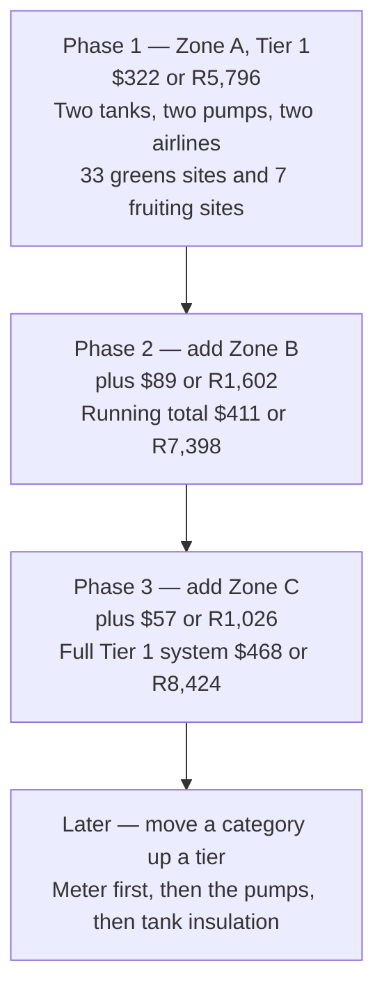
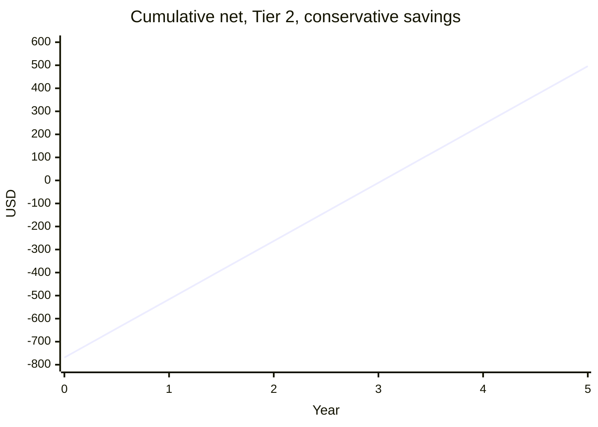

# Guide 12 — Budget, Sourcing, and ROI

[](../../README.md)
[](https://creativecommons.org/licenses/by-nc-sa/4.0/)


This guide provides an itemised bill of materials (BOM) for all three build tiers, sourcing guidance, running cost estimates, and a realistic return-on-investment (ROI) calculation based on expected yields versus supermarket prices.

---

## Table of Contents

- [1. Build Tier Overview](#1-build-tier-overview)
- [2. Zone A — NFT System BOM](#2-zone-a-nft-system-bom)
  - [2.1 Frame](#21-frame)
  - [2.2 Channels](#22-channels)
  - [2.3 Reservoir](#23-reservoir)
  - [2.4 Pump and Aeration](#24-pump-and-aeration)
  - [2.5 Plumbing](#25-plumbing)
  - [2.6 Electrical](#26-electrical)
  - [2.7 Monitoring and Testing](#27-monitoring-and-testing)
  - [2.8 Growing Media (Zone A)](#28-growing-media-zone-a)
  - [2.9 Nutrients](#29-nutrients)
  - [2.10 Climate / Protection](#210-climate-protection)
  - [Zone A Total (NFT System)](#zone-a-total-nft-system)
- [3. Zone B — Microgreens Station BOM](#3-zone-b-microgreens-station-bom)
- [4. Zone C — Root Veg Grow Bags BOM](#4-zone-c-root-veg-grow-bags-bom)
- [5. Consumables and Ongoing Supplies](#5-consumables-and-ongoing-supplies)
  - [Per Season (8–9 month outdoor season)](#per-season-89-month-outdoor-season)
- [6. Tier Totals Summary](#6-tier-totals-summary)
  - [Full 3-Zone System (All Zones)](#full-3-zone-system-all-zones)
  - [Phasing the Build](#phasing-the-build)
- [7. Where to Buy](#7-where-to-buy)
  - [7.1 Online — General](#71-online-general)
  - [7.2 Online — Hydroponics Specialist](#72-online-hydroponics-specialist)
  - [7.3 Local — Hardware / DIY Stores](#73-local-hardware-diy-stores)
  - [7.4 Local — Garden Centres and Plant Nurseries](#74-local-garden-centres-and-plant-nurseries)
  - [7.5 Buying Used / Secondhand](#75-buying-used-secondhand)
  - [7.6 Nutrients — Sourcing the Masterblend Trio](#76-nutrients-sourcing-the-masterblend-trio)
- [8. Cost-Saving Strategies](#8-cost-saving-strategies)
  - [8.1 Repurpose Food-Grade Containers](#81-repurpose-food-grade-containers)
  - [8.2 PVC Offcuts from Builders and Plumbers](#82-pvc-offcuts-from-builders-and-plumbers)
  - [8.3 Buy Nutrients in Bulk](#83-buy-nutrients-in-bulk)
  - [8.4 Make Your Own pH Buffers](#84-make-your-own-ph-buffers)
  - [8.5 Seed Saving and Division](#85-seed-saving-and-division)
  - [8.6 Reuse Growing Media](#86-reuse-growing-media)
- [9. Running Costs](#9-running-costs)
  - [9.1 Electricity](#91-electricity)
  - [9.2 Water](#92-water)
  - [9.3 Nutrient Costs (Masterblend Trio)](#93-nutrient-costs-masterblend-trio)
  - [9.4 Full Annual Running Cost Summary](#94-full-annual-running-cost-summary)
- [10. Yield Estimates and ROI](#10-yield-estimates-and-roi)
  - [10.1 Zone A — NFT Expected Yields](#101-zone-a-nft-expected-yields)
  - [10.2 Zone B — Microgreens Yield](#102-zone-b-microgreens-yield)
  - [10.3 Zone C — Root Veg Yield](#103-zone-c-root-veg-yield)
  - [10.4 Total Annual Yield Value](#104-total-annual-yield-value)
- [11. Payback Period Analysis](#11-payback-period-analysis)
  - [11.1 Tier 2 — Standard Build Payback](#111-tier-2-standard-build-payback)
  - [11.2 Tier 1 — Lean Build Payback](#112-tier-1-lean-build-payback)
  - [11.3 Payback Summary Chart](#113-payback-summary-chart)
  - [11.4 Non-Financial Value](#114-non-financial-value)
- [Quick Reference — Budget at a Glance](#quick-reference-budget-at-a-glance)

---


## 1. Build Tier Overview

Three tiers are defined based on total budget and the trade-offs at each level:

Planning rate: **$1 = R18**, frozen **3 October 2026**. Round rand to the nearest rand. These are planning prices, not a live quote.

Copy these totals. Later guides should use the same figures.

| Tier | Zone A (NFT, two loops) | Full three-zone build |
|---|---|---|
| **Tier 1 — Lean** | **$322 (R5,796)** | **$468 (R8,424)** |
| **Tier 2 — Standard** | **$548 (R9,864)** | **$769 (R13,842)** |
| **Tier 3 — Optimised** | **$767 (R13,806)** | **$1,080 (R19,440)** |

Zone A includes the second reservoir, the second pump, and the second airline. Zone B is $89 / $140 / $203 (R1,602 / R2,520 / R3,654). Zone C is $57 / $81 / $110 (R1,026 / R1,458 / R1,980).

```
TIER 1 — LEAN — full system $468 (R8,424)
  Philosophy: Get both loops running with scavenged tanks and basic parts.
  Trade-offs: More labour, a cheap meter, less insulation.
  Best for:   A first build, if you accept the shopping time.

TIER 2 — STANDARD — full system $769 (R13,842)  ← Recommended
  Philosophy: Bought tanks, named pumps, a meter you can calibrate.
  Trade-offs: Higher upfront cost, a faster build.
  Best for:   Most growers.

TIER 3 — OPTIMISED — full system $1,080 (R19,440)
  Philosophy: Better meter, logger, heater for shoulder nights, thicker bags.
  Trade-offs: Some of this is comfort, not yield.
  Best for:   A second season, or a setup you do not want to tinker with weekly.
```

Line items below are the sums behind those totals. Check shelf prices when you buy. The rate does not move with the shop.

[↑ Back to TOC](#table-of-contents)

---


## 2. Zone A — NFT System BOM

### 2.1 Frame

| Item | Tier 1 (Lean) | Tier 2 (Standard) | Tier 3 (Optimised) |
|---|---|---|---|
| **Posts, 2×2 in: two at 36 in (91 cm), two at 32.75 in (83 cm), plus braces** | $8 (R144) — untreated pine | $12 (R216) — exterior grade | $18 (R324) — pre-painted |
| **Rails, two at 8 ft (2.44 m)** | $6 (R108) — offcuts | $10 (R180) — cut to length | $14 (R252) — hardwood |
| **Screws, 3 in (75 mm), box of 50** | $4 (R72) | $5 (R90) | $6 (R108) |
| **Wood glue** | $3 (R54) | $3 (R54) | $3 (R54) |
| **Exterior paint or preservative for the timber, not the tanks** | $0 | $8 (R144) | $12 (R216) |
| **Ground anchors** | $0 — tent pegs | $5 (R90) | $10 (R180) |
| **Frame subtotal** | **$21 (R378)** | **$43 (R774)** | **$63 (R1,134)** |

### 2.2 Channels

| Item | Tier 1 | Tier 2 | Tier 3 |
|---|---|---|---|
| **3 in (76 mm) square tube, 8 ft (2.44 m), qty 3** | $12 (R216) | $18 (R324) | $22 (R396) |
| **4 in (102 mm) square tube, 8 ft (2.44 m), qty 1, CH4 only** | $6 (R108) | $10 (R180) | $12 (R216) |
| **End caps, 8 (two per channel)** | $6 (R108) | $8 (R144) | $8 (R144) |
| **½ in (13 mm) inlet barbs, 4** | $4 (R72) | $6 (R108) | $8 (R144) |
| **¾–1 in (19–25 mm) drain fittings, 4** | $8 (R144) | $10 (R180) | $12 (R216) |
| **Silicone** | $4 (R72) | $5 (R90) | $6 (R108) |
| **2 in net pots, pack of 50 (covers 33 sites on CH1–CH3)** | $8 (R144) | $10 (R180) | $12 (R216) |
| **3 in net pots, pack of 10 (covers 7 sites on CH4)** | $4 (R72) | $6 (R108) | $8 (R144) |
| **Channels subtotal** | **$52 (R936)** | **$73 (R1,314)** | **$88 (R1,584)** |

### 2.3 Reservoir

| Item | Tier 1 | Tier 2 | Tier 3 |
|---|---|---|---|
| **Greens tank, 20 US gal (76 L) HDPE** | $0 — food-grade reuse | $25 (R450) | $40 (R720) |
| **Fruiting tank, 10 US gal (38 L) HDPE** | $0 — food-grade reuse | $15 (R270) | $25 (R450) |
| **Foam wrap, both tanks** | $0 — foil offcut | $12 (R216) | $20 (R360) |
| **Black paint for the body (blocks light)** | $0 — leftover | $5 (R90) | $6 (R108) |
| **White exterior paint (reflects heat)** | $0 — leftover | $5 (R90) | $6 (R108) |
| **Lid seals, two tanks** | $4 (R72) | $6 (R108) | $8 (R144) |
| **Reservoir subtotal** | **$4 (R72)** | **$68 (R1,224)** | **$105 (R1,890)** |

Black body, white exterior, on both tanks. Do not buy "black paint only" and stop there. Do not buy a white-only tub and skip the black layer.

### 2.4 Pump and Aeration

| Item | Tier 1 | Tier 2 | Tier 3 |
|---|---|---|---|
| **Greens pump, 160–210 US gph (600–800 L/h), about 15 W, 24 h** | $12 (R216) | $22 (R396) | $35 (R630) |
| **Fruiting pump, 50–100 US gph (200–400 L/h), about 8 W, 24 h. Own line. Not on the greens manifold.** | $10 (R180) | $16 (R288) | $24 (R432) |
| **Air pump, one unit feeding both tanks** | $8 (R144) | $14 (R252) | $20 (R360) |
| **Air stones, one per tank** | $3 (R54) | $5 (R90) | $8 (R144) |
| **Airline tubing, two runs** | $3 (R54) | $4 (R72) | $5 (R90) |
| **Non-return valves, one per airline** | $3 (R54) | $4 (R72) | $5 (R90) |
| **T-splitter for the two airlines** | $2 (R36) | $2 (R36) | $3 (R54) |
| **Pump and air subtotal** | **$41 (R738)** | **$67 (R1,206)** | **$100 (R1,800)** |

### 2.5 Plumbing

| Item | Tier 1 | Tier 2 | Tier 3 |
|---|---|---|---|
| **1 in (25 mm) PVC manifold, about 3 ft, CH1–CH3 only** | $5 (R90) | $6 (R108) | $8 (R144) |
| **½ in (13 mm) line for CH4, from its own pump** | $3 (R54) | $4 (R72) | $5 (R90) |
| **Return pipe, ¾–1 in (19–25 mm), two loops** | $8 (R144) | $10 (R180) | $12 (R216) |
| **½ in inlet tubing, about 16 ft (5 m)** | $5 (R90) | $6 (R108) | $7 (R126) |
| **½ in ball valves, 4 (three greens, one fruiting)** | $8 (R144) | $12 (R216) | $16 (R288) |
| **Reducing tees for the greens return** | $6 (R108) | $8 (R144) | $10 (R180) |
| **Adaptors, assorted** | $6 (R108) | $8 (R144) | $10 (R180) |
| **Hose clips, bag of 20** | $4 (R72) | $5 (R90) | $6 (R108) |
| **PTFE tape** | $1 (R18) | $1 (R18) | $1 (R18) |
| **Cable ties** | $2 (R36) | $3 (R54) | $3 (R54) |
| **Plumbing subtotal** | **$48 (R864)** | **$63 (R1,134)** | **$78 (R1,404)** |

### 2.6 Electrical

| Item | Tier 1 | Tier 2 | Tier 3 |
|---|---|---|---|
| **Outdoor extension, about 30 ft (10 m)** | $12 (R216) | $18 (R324) | $25 (R450) |
| **GFCI adaptor (SA: 30 mA earth-leakage is the matching protection)** | $12 (R216) | $15 (R270) | $18 (R324) |
| **Weatherproof box for the plugs. Both NFT pumps run 24 h. Do not buy a cycle timer for them.** | $8 (R144) | $12 (R216) | $18 (R324) |
| **Electrical subtotal** | **$32 (R576)** | **$45 (R810)** | **$61 (R1,098)** |

### 2.7 Monitoring and Testing

| Item | Tier 1 | Tier 2 | Tier 3 |
|---|---|---|---|
| **pH pen** | $12 (R216) | $35 (R630) | $55 (R990) combo |
| **EC pen. You will read two tanks. One pen is enough if you rinse it.** | $12 (R216) | $22 (R396) | $0 — included in the combo |
| **Calibration sachets (pH 4.0, pH 7.0, EC 1.413)** | $6 (R108) | $8 (R144) | $12 (R216) |
| **Thermometers, one per tank** | $8 (R144) | $12 (R216) | $18 (R324) |
| **Outdoor min/max thermometer** | $6 (R108) | $10 (R180) | $15 (R270) |
| **WiFi temperature and humidity logger** | $0 | $0 | $22 (R396) |
| **Monitoring subtotal** | **$44 (R792)** | **$87 (R1,566)** | **$122 (R2,196)** |

### 2.8 Growing Media (Zone A)

| Item | Tier 1 | Tier 2 | Tier 3 |
|---|---|---|---|
| **Clay pebbles / LECA, about 1–2.5 US gal (5–10 L)** | $8 (R144) | $10 (R180) | $12 (R216) |
| **Rockwool cubes, 1 in (25 mm), block of 50** | $6 (R108) | $8 (R144) | $10 (R180) |
| **Growing media subtotal** | **$14 (R252)** | **$18 (R324)** | **$22 (R396)** |

### 2.9 Nutrients

| Item | Tier 1 | Tier 2 | Tier 3 |
|---|---|---|---|
| **Masterblend 4-18-38 (500 g). Dose is 2.4 g/US gal (0.63 g/L), not a per-litre guess.** | $15 (R270) | $15 (R270) | $15 (R270) |
| **Calcium nitrate (500 g)** | $8 (R144) | $8 (R144) | $8 (R144) |
| **Epsom salt, food grade (500 g)** | $3 (R54) | $3 (R54) | $3 (R54) |
| **pH Down, phosphoric acid, about 8 US fl oz (250 mL)** | $6 (R108) | $8 (R144) | $10 (R180) |
| **pH Up, potassium hydroxide, about 8 US fl oz (250 mL)** | $5 (R90) | $6 (R108) | $8 (R144) |
| **Nutrients subtotal** | **$37 (R666)** | **$40 (R720)** | **$44 (R792)** |

Lock the dry salts, the acid, and the hydroxide in a latched box, away from children and pets. A garden that is good for children still keeps the chemicals locked.

### 2.10 Climate / Protection

| Item | Tier 1 | Tier 2 | Tier 3 |
|---|---|---|---|
| **Shade cloth, 40%, about 13 ft × 10 ft (4.0 m × 3.0 m)** | $18 (R324) | $28 (R504) | $40 (R720) |
| **Fleece, about 10 ft × 6 ft (3 m × 2 m)** | $8 (R144) | $12 (R216) | $16 (R288) |
| **Clips** | $3 (R54) | $4 (R72) | $6 (R108) |
| **Frozen bottles** | $0 | $0 | $0 |
| **Aquarium heater, 50 W, shoulder nights only. Do not run NFT in deep winter.** | $0 | $0 | $22 (R396) |
| **Climate subtotal** | **$29 (R522)** | **$44 (R792)** | **$84 (R1,512)** |

---

### Zone A Total (NFT System)

| Category | Tier 1 | Tier 2 | Tier 3 |
|---|---|---|---|
| Frame | $21 (R378) | $43 (R774) | $63 (R1,134) |
| Channels | $52 (R936) | $73 (R1,314) | $88 (R1,584) |
| Reservoirs (two) | $4 (R72) | $68 (R1,224) | $105 (R1,890) |
| Pumps and air (two water pumps, two airlines) | $41 (R738) | $67 (R1,206) | $100 (R1,800) |
| Plumbing | $48 (R864) | $63 (R1,134) | $78 (R1,404) |
| Electrical | $32 (R576) | $45 (R810) | $61 (R1,098) |
| Monitoring | $44 (R792) | $87 (R1,566) | $122 (R2,196) |
| Growing media | $14 (R252) | $18 (R324) | $22 (R396) |
| Nutrients | $37 (R666) | $40 (R720) | $44 (R792) |
| Climate | $29 (R522) | $44 (R792) | $84 (R1,512) |
| **Zone A total** | **$322 (R5,796)** | **$548 (R9,864)** | **$767 (R13,806)** |

[↑ Back to TOC](#table-of-contents)

---


## 3. Zone B — Microgreens Station BOM

| Item | Tier 1 | Tier 2 | Tier 3 |
|---|---|---|---|
| **Trays, 10 in × 20 in (25 cm × 50 cm), pack of 10 (you use 6)** | $8 (R144) | $12 (R216) | $15 (R270) |
| **Solid liners, pack of 10** | $6 (R108) | $8 (R144) | $10 (R180) |
| **Coco coir bricks, 3 × 500 g. Depth in the tray is 1–1¼ in (2.5–3 cm).** | $8 (R144) | $10 (R180) | $12 (R216) |
| **Perlite, about 1.3 US gal (5 L)** | $5 (R90) | $6 (R108) | $8 (R144) |
| **Shelf, 24 in × 20 in (61 cm × 51 cm), two tiers, about 36 in (91 cm) tall** | $15 (R270) secondhand | $25 (R450) new wire | $40 (R720) coated rack |
| **LED panel, 50–100 W** | $20 (R360) | $40 (R720) | $65 (R1,170) |
| **Indoor timer for the LED only, 16 h on / 8 h off** | $8 (R144) | $10 (R180) | $12 (R216) |
| **Spray bottle. Mist twice a day.** | $2 (R36) | $3 (R54) | $4 (R72) |
| **Watering can** | $5 (R90) | $8 (R144) | $12 (R216) |
| **Seed, about 3.5 oz (100 g) each of three crops** | $12 (R216) | $18 (R324) | $25 (R450) |
| **Zone B total** | **$89 (R1,602)** | **$140 (R2,520)** | **$203 (R3,654)** |

Standard trays get pH-adjusted water only, pH 5.8–6.2. No nutrients. Sunflower and pea shoots may use EC 0.4–0.8 mS/cm if the grow runs long.

[↑ Back to TOC](#table-of-contents)

---


## 4. Zone C — Root Veg Grow Bags BOM

| Item | Tier 1 | Tier 2 | Tier 3 |
|---|---|---|---|
| **Bags: two 5 US gal (19 L) radish, one 5 US gal beetroot, three 10 US gal (38 L) carrot** | $8 (R144) | $14 (R252) | $22 (R396) |
| **Coco coir, 60% of the mix** | $12 (R216) | $15 (R270) | $18 (R324) |
| **Perlite, 30%** | $10 (R180) | $12 (R216) | $15 (R270) |
| **Vermiculite, 10%** | $6 (R108) | $8 (R144) | $10 (R180) |
| **Fertiliser. Fertigation EC ceiling is 2.0 mS/cm, including beetroot.** | $8 (R144) | $12 (R216) | $15 (R270) |
| **Drip saucers, six** | $5 (R90) | $8 (R144) | $12 (R216) |
| **Seed: radish, beetroot, carrot** | $8 (R144) | $12 (R216) | $18 (R324) |
| **Zone C total** | **$57 (R1,026)** | **$81 (R1,458)** | **$110 (R1,980)** |

No garden soil. One season, planning yields are in section 10.3: radish 15 lb (6.8 kg), beetroot 8 lb (3.6 kg), carrot 20 lb (9.1 kg), total 43 lb (20 kg), about $80–$110 (R1,440–R1,980).

[↑ Back to TOC](#table-of-contents)

---


## 5. Consumables and Ongoing Supplies

These are not one-time costs but will recur each growing season (or more frequently).

### Per Season (8–9 month outdoor season)

| Item | Low estimate | Mid estimate | High estimate |
|---|---|---|---|
| **Masterblend 4-18-38** | $30 (R540) | $45 (R810) | $60 (R1,080) |
| **Calcium nitrate** | $16 (R288) | $24 (R432) | $32 (R576) |
| **Epsom salt** | $3 (R54) | $6 (R108) | $9 (R162) |
| **pH Down** | $10 (R180) | $15 (R270) | $20 (R360) |
| **pH Up** | $6 (R108) | $10 (R180) | $14 (R252) |
| **Calibration sachets** | $5 (R90) | $8 (R144) | $10 (R180) |
| **Rockwool or plugs, four successions** | $24 (R432) | $24 (R432) | $24 (R432) |
| **Clay pebbles, small top-up** | $5 (R90) | $5 (R90) | $5 (R90) |
| **Seed, all zones** | $20 (R360) | $35 (R630) | $50 (R900) |
| **Pest and disease treatments** | $10 (R180) | $20 (R360) | $30 (R540) |
| **Microgreens coco top-up** | $8 (R144) | $12 (R216) | $16 (R288) |
| **Zone C fertiliser top-up** | $6 (R108) | $8 (R144) | $10 (R180) |
| **Season consumables** | **$143 (R2,574)** | **$212 (R3,816)** | **$280 (R5,040)** |

Outdoor season is mid-April through mid-October (SA: mid-October through mid-April), about six months. A mid figure is about $175–$200 (R3,150–R3,600) if you land between the low and mid columns. The salts, acid, and any pesticide stay in a latched box.

[↑ Back to TOC](#table-of-contents)

---


## 6. Tier Totals Summary

Copy-block. These are the figures to reuse.

| Tier | Zone A | Full three-zone (A + B + C) |
|---|---|---|
| **Tier 1 — Lean** | **$322 (R5,796)** | **$468 (R8,424)** |
| **Tier 2 — Standard** | **$548 (R9,864)** | **$769 (R13,842)** |
| **Tier 3 — Optimised** | **$767 (R13,806)** | **$1,080 (R19,440)** |

### Full 3-Zone System (All Zones)

| Tier | Zone A | Zone B | Zone C | Total build cost |
|---|---|---|---|---|
| **Tier 1 — Lean** | $322 (R5,796) | $89 (R1,602) | $57 (R1,026) | **$468 (R8,424)** |
| **Tier 2 — Standard** | $548 (R9,864) | $140 (R2,520) | $81 (R1,458) | **$769 (R13,842)** |
| **Tier 3 — Optimised** | $767 (R13,806) | $203 (R3,654) | $110 (R1,980) | **$1,080 (R19,440)** |

Rate: $1 = R18, frozen 3 October 2026. 322 × 18 = 5,796. 468 × 18 = 8,424. 548 × 18 = 9,864. 769 × 18 = 13,842. 767 × 18 = 13,806. 1,080 × 18 = 19,440.

### Phasing the Build

You can buy Zone A first and add the other zones later. The totals above are the full shopping list, not a promise that the NFT bench alone costs a hundred dollars.



Phase 2 total: 322 + 89 = 411, and 411 × 18 = 7,398. Phase 3 adds 57 to reach 468.

[↑ Back to TOC](#table-of-contents)

---


## 7. Where to Buy

### 7.1 Online — General

| Platform | Best for | Tips |
|---|---|---|
| **Amazon** | Pumps, timers, meters, net pots, grow bags, LED panels, seeds | Check sold/fulfilled-by-Amazon for quality assurance; read recent reviews |
| **eBay** | Secondhand reservoirs, used pumps, bulk nutrient chemicals, IBC totes | New sellers can offer great prices; check return policy |
| **Alibaba / AliExpress** | Very cheap net pots, channels, fittings in bulk | 3–6 week shipping; unpredictable quality — good for non-critical items |
| **Etsy** | Seeds (especially heirloom/specialty microgreen varieties) | Small suppliers often have better variety and germination rates |

### 7.2 Online — Hydroponics Specialist

| Retailer | Region | Strength |
|---|---|---|
| **HTG Supply** | USA | Full hydroponics range |
| **Growers House** | USA | Commercial-grade gear at consumer prices |
| **Home Depot / Lowe's** | USA | 3 in and 4 in tube, 8 ft sticks, ½ in and 1 in fittings |
| **Local hydro shop** | USA or South Africa | Net pots, Masterblend, meters |

### 7.3 Local — Hardware / DIY Stores

For structural materials, PVC pipe, and plumbing fittings, local hardware stores beat online on price (no shipping) and allow you to check quality in person.

```
WHAT TO BUY LOCALLY (hardware store)
  ✓ PVC downpipe (75mm, 100mm) — ask the plumbing aisle
  ✓ PVC end caps and fittings
  ✓ Timber for frame
  ✓ Screws, wood glue, silicone sealant
  ✓ PTFE tape
  ✓ Hose clips
  ✓ Extension lead
  ✓ Cable ties
  ✓ Spray bottle, buckets

  Store types: Home Depot and Lowe's in the US. In South Africa, a builders'
  warehouse for the tube and fittings, and a hydro shop for the salts and pots.
```

### 7.4 Local — Garden Centres and Plant Nurseries

| Item | Why garden centre | Notes |
|---|---|---|
| Seeds (lettuce, herbs, tomatoes) | Wider variety selection | Buy F1 hybrid for predictable performance |
| Seedling trays | Cheaper than online | Often multi-packs |
| Horticultural fleece | Often on-shelf | 17 g/m² or 30 g/m² |
| Shade cloth | Seasonal stock | 40–50% shade is most versatile |
| Epsom Salt | Cheaper than hydro shops | Sold as "garden Epsom" in bulk bags |
| Fertilisers (slow-release) | Branded options available | Osmocote is widely stocked |

### 7.5 Buying Used / Secondhand

| Item | Where to find | What to check |
|---|---|---|
| **Reservoir / food-grade barrels** | Facebook Marketplace, Craigslist, local farms | Must be food-grade HDPE; no chemical previous use |
| **IBC totes** | eBay, Gumtree, farm supply | Food-grade only; rinse thoroughly × 3 before use |
| **Shelving units** | Facebook Marketplace, charity shops | Metal wire shelving is ideal |
| **LED grow lights** | eBay, local classifieds | Test before committing; check LED degradation |
| **Aquarium pumps** | eBay, aquarium clubs | Test in water; impeller wear reduces output |
| **pH/EC meters** | eBay | Risky secondhand — calibration drift; better to buy new |

### 7.6 Nutrients — Sourcing the Masterblend Trio

| Supplier | Location | Notes |
|---|---|---|
| **Masterblend, direct or via a US hydro shop** | USA | A 5 lb (2.27 kg) bag at about $28–$40 (R504–R720) covers more than one season on this two-tank system |
| **Amazon or a farm supply** | USA | 500 g or 1 kg bags for a trial |
| **Pool or fertiliser supply** | USA or South Africa | Calcium nitrate is often a bulk fertiliser |
| **Brewing or pharmacy suppliers** | Either country | Food-grade Epsom salt, 2–10 lb (1–5 kg) |

**Practical route:** Masterblend and calcium nitrate from a hydro or farm supplier. Epsom salt from a grocery or pharmacy if the label is magnesium sulfate and food grade. Prices above use $1 = R18.

[↑ Back to TOC](#table-of-contents)

---


## 8. Cost-Saving Strategies

### 8.1 Repurpose Food-Grade Containers

The tanks are the biggest swing in the Zone A price. A repurposed food-grade pair at $0 versus bought tanks at about $40 (R720) for the greens tank and $25 (R450) for the fruiting tank is the Tier 1 versus Tier 2 difference in that row. Performance is the same if both are HDPE, black-bodied, and white outside.

**Where to find free/cheap food-grade containers:**
- Restaurant kitchens (pickle barrels, about 5–7 US gal / 20–25 L food buckets)
- Bakeries (icing and shortening containers, about 5 US gal / 20 L)
- Breweries and home-brew shops (large fermentation vessels)
- Online "free" sections (Facebook Marketplace, Nextdoor, Gumtree)
- Food bank or church kitchens

Verify food-grade: look for the "fork and cup" symbol or "HDPE" / "#2" recycling symbol.

### 8.2 PVC Offcuts from Builders and Plumbers

Builders and plumbers often have short PVC pipe offcuts they discard. An 8 ft (2.44 m) channel, or a longer stick you can cut down to 8 ft, can sometimes be sourced for free or very cheaply this way. Ask at:
- Local plumbing merchant offcuts bins
- Building sites (ask site foreman)
- Plumbing contractors (ask on local community groups)

### 8.3 Buy Nutrients in Bulk

The per-gram cost of Masterblend drops sharply as pack size increases:

| Pack size | Approx cost | Cost per gram |
|---|---|---|
| 3.5 oz (100 g) | $8 (R144) | $0.08/g |
| 1.1 lb (500 g) | $15 (R270) | $0.03/g |
| 2.2 lb (1 kg) | $22 (R396) | $0.022/g |
| 5 lb (2.27 kg) | $35 (R630) | $0.015/g |

Buying a 2.27 kg pack instead of a 100g pack reduces nutrient cost by ~80%. Share bulk orders with a friend or neighbour if you cannot use 2.27 kg in one season.

### 8.4 Make Your Own pH Buffers

Commercial pH Down is dilute phosphoric or citric acid. You can substitute:
- **pH Down DIY:** Food-grade citric acid, 19 g/US gal (5 g/L), makes a stock around pH 2.5. Add it in small amounts. Citric acid is about $3–$5 (R54–R90) per 1.1 lb (500 g). This is not the Masterblend dose.
- **pH Up DIY:** Baking soda (sodium bicarbonate) can raise pH but adds sodium to the solution, which can be problematic over time. Preferred: commercial potassium hydroxide-based pH Up — this adds potassium, which is a beneficial plant nutrient.

### 8.5 Seed Saving and Division

- Many herbs can be propagated by cuttings (basil, mint): no seed cost once established
- Strawberry runners can be pinned and rooted: free new plants each season
- Chives can be divided: one pot becomes many
- Lettuce: allow one plant to bolt and collect seed — ~100 seeds per plant

### 8.6 Reuse Growing Media

Clay pebbles (LECA) can be reused indefinitely if properly cleaned. After each crop:
1. Collect pebbles.
2. Rinse in a bucket of clean water.
3. Soak in 1:10 bleach solution for 30 minutes.
4. Rinse thoroughly × 3 with clean water.
5. Allow to dry in sun.
6. Reuse.

Rockwool cubes are single-use (they degrade and can harbour pathogens). Switch to Rapid Rooter or coco plugs (both biodegradable) for slightly easier disposal.

[↑ Back to TOC](#table-of-contents)

---


## 9. Running Costs

### 9.1 Electricity

| Device | Power | Hours/day | kWh/day | kWh/month | Cost/month |
|---|---|---|---|---|---|
| Greens pump, 160–210 US gph | about 15 W (range 10–20 W) | 24 h | 0.36 | 10.8 | $1.62 (R29) |
| Fruiting pump, 50–100 US gph | about 8 W (range 5–12 W) | 24 h | 0.19 | 5.8 | $0.86 (R16) |
| Air pump, both tanks | 4–6 W | 24 h | 0.12 | 3.6 | $0.54 (R10) |
| Zone B LED | 50 W | 16 h | 0.80 | 24 | $3.60 (R65) |
| Logger | under 2 W | 24 h | 0.05 | 1.4 | $0.22 (R4) |
| **While everything is on** | | | | | **about $6.84 (R123)** |

Rate: **$0.15/kWh (R2.70/kWh)**. The greens pump is about 15 W. Its flow is 160–210 US gph (600–800 L/h). Do not read the flow number as watts.

Outdoor pumps run the mid-April through mid-October season (SA: mid-October through mid-April), about six months, not through December–February (SA: June–August). Six months of both water pumps plus the air pump is about 6 × ($1.62 + $0.86 + $0.54) = 6 × $3.02 = **$18 (R325)**. The LED, if Zone B runs all year, is 12 × $3.60 = **$43 (R778)**. A year with the logger as well lands near **$65–$80 (R1,170–R1,440)** depending on how long the LED stays on.

### 9.2 Water

Water usage varies significantly by temperature and crop. Typical outdoor NFT system:
- Uptake and evaporation: about 1–2 US gal/day (4–8 L) in the shoulders, and 2–5 US gal/day (8–20 L) in June–August (SA: December–February), across both tanks
- A season is roughly 400–800 US gal (1,500–3,000 L)
- At a few tenths of a cent per gallon, budget **$4–$24 (R72–R432)** if you pay for tap water
- Harvested rainwater: **$0**

### 9.3 Nutrient Costs (Masterblend Trio)

Base recipe per 1 US gal (3.8 L), EC about 1.4–1.6: Masterblend **2.4 g/US gal (0.63 g/L)**, calcium nitrate **2.4 g/US gal (0.63 g/L)**, Epsom salt **1.2 g/US gal (0.32 g/L)**. Scale the whole recipe. Do not change the ratio.

```
Greens tank, 20 US gal (76 L), base fill, every 7 days:
  Masterblend 48 g, calcium nitrate 48 g, Epsom salt 24 g
  Then move the whole recipe to land inside 0.8–1.8 mS/cm.

Fruiting tank, 10 US gal (38 L), base fill, every 5–7 days:
  Masterblend 24 g, calcium nitrate 24 g, Epsom salt 12 g
  Then raise the whole recipe to tomato 2.5–3.5 or pepper 2.0–3.0.
  That is often close to double the base fill. Budget the fruiting
  tank as a second 48 g / 48 g / 24 g fill when it is in full fruit.

A 5 lb (2.27 kg) bag of Masterblend at $35 (R630):
  48 g costs 48 × ($35 / 2270) = $0.74 (R13)
  Calcium nitrate 48 g at $15 (R270) per 500 g = $1.44 (R26)
  Epsom salt 24 g at $5 (R90) per 1,000 g = $0.12 (R2)
  One greens base fill: about $2.30 (R41)
  One heavy fruiting fill: about the same again

About 26 greens changes in a six-month season, plus about 30 fruiting
changes: on the order of $50–$85 (R900–R1,530) of salts if you change
on schedule. Top-ups with plain water, when EC is already at target,
spend less than a full change.
```

### 9.4 Full Annual Running Cost Summary

| Category | Low | Mid | High |
|---|---|---|---|
| Electricity | $40 (R720) | $65 (R1,170) | $90 (R1,620) |
| Water | $4 (R72) | $12 (R216) | $24 (R432) |
| Nutrients | $50 (R900) | $70 (R1,260) | $85 (R1,530) |
| pH chemicals | $10 (R180) | $20 (R360) | $30 (R540) |
| Seed | $20 (R360) | $35 (R630) | $50 (R900) |
| Media top-up | $10 (R180) | $15 (R270) | $20 (R360) |
| Pest and disease | $5 (R90) | $15 (R270) | $30 (R540) |
| Hose, fitting, spare | $5 (R90) | $15 (R270) | $30 (R540) |
| **Season running total** | **$144 (R2,592)** | **$247 (R4,446)** | **$359 (R6,462)** |

A realistic middle is about **$200–$250 (R3,600–R4,500)** for the outdoor season plus a year of Zone B lights.

[↑ Back to TOC](#table-of-contents)

---


## 10. Yield Estimates and ROI

### 10.1 Zone A — NFT Expected Yields

Yield estimates are based on moderately experienced management of the system. Actual yields will vary with genetics, season length, and growing conditions.

> **First-season adjustment:** If this is your first hydroponic grow, expect to achieve **40–60% of the yields listed below**. Transplant losses, pH/EC learning curve, pest surprises, and setup optimisation all reduce first-season output. This is normal. By your second full season, with a tuned system and practiced routine, you should approach the figures shown. Do not judge the system's viability on first-season results alone.

#### Lettuce (Channel 1, 11 sites, 9 in / 229 mm spacing)

```
Seed to a mature head: about 5 weeks
Outdoor season: mid-April through mid-October, about 26 weeks
26 ÷ 5 = about 5 full turns, and with overlap you can plan 6 harvests per site
11 sites × 6 = 66 heads
Average head: 5–7 oz (150–200 g)
Channel 1: about 22–29 lb (10–13 kg)
```

**Shop price:** about $2.50–$4.00 a head ($45–$72, R810–R1,296, at the $3 example is 66 × $3 = $198, which is R3,564). Use **$165–$250 (R2,970–R4,500)** as the planning band so a lighter head still counts.

#### Herbs (Channel 2, 11 sites)

Herbs are cut-and-come-again. They are on **Channel 2**, not Channel 3.

```
Basil: about 0.7–1.4 oz (20–40 g) of cuttings per plant per week once established
11 sites × 0.9 oz (25 g) × 20 weeks ≈ 12 lb (5.5 kg)
Shop basil is often about $3 for 1 oz (30 g), near $0.10 per gram
Household value of that basil alone can look like several hundred dollars
Mint, chives, parsley, and cilantro on the same channel are worth less per ounce

Planning value for Channel 2 herbs: $200–$400 (R3,600–R7,200)
```

#### Leafy greens on Channel 3

Spinach, kale, and mint share CH3 with strawberries. Plan **6–10 kg, which is 13–22 lb**, worth about **$60–$120 (R1,080–R2,160)**, before the strawberry fruit below.

#### Strawberries (Channel 3, 3–4 of the 11 sites)

Strawberries are not on CH4.

```
About 11–18 oz (300–500 g) of fruit per plant
4 plants × 14 oz (400 g) ≈ 3.5 lb (1.6 kg)
Shop fruit is often $4–$6 for 14 oz (400 g)
Planning value: about $20–$30 (R360–R540)
```

#### Cherry tomatoes and peppers (Channel 4 only)

```
Planning yield: 4–6 lb (1.8–2.7 kg) of cherry tomatoes per plant
4 or 5 indeterminate plants (skip holes), or up to 7 compact plants
4 plants × 5 lb = 20 lb (9.1 kg) of tomatoes is a fair planning figure
Peppers share the same 7 holes and the same 10 US gal (38 L) tank
Shop cherry tomatoes often land near $4–$6 per 9 oz (250 g)

Planning value for CH4 fruit: $180–$250 (R3,240–R4,500)
Tomato EC 2.5–3.5 and pepper EC 2.0–3.0 apply only in this tank.
```

### 10.2 Zone B — Microgreens Yield

```
Tray size: 10 in × 20 in (25 cm × 50 cm). About 5–9 oz (150–250 g) per harvest.
Sow to harvest: 7–14 days. Six trays on the shelf; run about three in stagger.
About 7 oz (200 g) per harvest, a few harvests a week, on the order of 1 lb (500 g) a week.
Over a long indoor run that can reach about 44 lb (20 kg).

Shop punnets are often $3–$6 for 1.8 oz (50 g). A conservative household figure, not a retail fantasy, is **$600–$800 (R10,800–R14,400)** if you actually eat or share that much. Most households will not.
```

Microgreens have extremely high value-per-gram and are one of the best ROI crops in the system.

### 10.3 Zone C — Root Veg Yield

```
One season, both budget guides use these figures:

Radish, two 5 US gal (19 L) bags:     15 lb (6.8 kg)
Beetroot, one 5 US gal (19 L) bag:     8 lb (3.6 kg)
Carrot, three 10 US gal (38 L) bags:  20 lb (9.1 kg)
Zone C total:                         43 lb (20 kg)
Value:                                about $80–$110 (R1,440–R1,980)
```

Fertigation EC stays at or below 2.0 mS/cm. Beetroot does not get a higher target.

### 10.4 Total Annual Yield Value

| Zone / crop | Yield | Shop-price value |
|---|---|---|
| Lettuce, CH1 | 22–29 lb (10–13 kg) | $165–$250 (R2,970–R4,500) |
| Herbs, CH2 | about 12 lb (5.5 kg) cut | $200–$400 (R3,600–R7,200) |
| Spinach, kale, mint, CH3 | 13–22 lb (6–10 kg) | $60–$120 (R1,080–R2,160) |
| Strawberries, CH3, 3–4 sites | about 3.5 lb (1.6 kg) | $20–$30 (R360–R540) |
| Tomato and pepper, CH4 only | about 20 lb (9 kg) of tomatoes, plus peppers | $180–$250 (R3,240–R4,500) |
| **Zone A subtotal** | | **$625–$1,050 (R11,250–R18,900)** |
| Microgreens, Zone B | up to about 44 lb (20 kg) if you run trays all year | $600–$800 (R10,800–R14,400) |
| Radish | 15 lb (6.8 kg) | included below |
| Beetroot | 8 lb (3.6 kg) | included below |
| Carrot | 20 lb (9.1 kg) | included below |
| **Zone C total** | **43 lb (20 kg)** | **$80–$110 (R1,440–R1,980)** |

> **Important caveat:** These are supermarket retail equivalent values — the money you save on your grocery bill, not money you earn. Not all this produce can be consumed by one household. Microgreens in particular will exceed typical household consumption unless you sell or donate surplus.

[↑ Back to TOC](#table-of-contents)

---


## 11. Payback Period Analysis

### 11.1 Tier 2 — Standard Build Payback

```
TIER 2 FULL BUILD (3 ZONES)

Total build cost:          $769 (R13,842)
Season running cost:       $247 (R4,446), mid estimate
Yield value on paper:      well above what one household eats

Conservative groceries you actually offset: $500 (R9,000) a season
Running cost:              $247 (R4,446)
Net:                       $253 (R4,554) a season

Payback: $769 ÷ $253 ≈ 3.0 seasons
```

The paper value of every leaf and punnet is higher. Payback here uses food you would have bought, not food you would have thrown away.

### 11.2 Tier 1 — Lean Build Payback

```
TIER 1 FULL BUILD

Total build cost:          $468 (R8,424)
Season running cost:       $144 (R2,592), low estimate
Conservative savings:      $400 (R7,200) a season
Net:                       $256 (R4,608)
Payback:                   $468 ÷ $256 ≈ 1.8 seasons
```

### 11.3 Payback Summary Chart



Year 0 is the $769 build. Each later year adds $253 of net grocery offset ($500 saved minus $247 running). A pump may need replacing around year 2 or 3, about $22–$35 (R396–R630) for the greens pump or $16–$24 (R288–R432) for the fruiting pump. That dip is not drawn on the line.

### 11.4 Non-Financial Value

The ROI analysis only captures direct grocery savings. The full value of the system also includes:

- **Food quality:** Fresh-cut herbs and salad contain significantly more vitamins than supermarket equivalents stored for days
- **Food security:** Year-round production of some staples regardless of store supply or price inflation
- **Skill development:** Hydroponic growing skills, understanding of plant nutrition, and ecosystem management
- **Educational value:** A household with children can learn from the garden. Nutrient salts, acid, hydroxide, and any pesticide stay in a latched box, away from children and pets.
- **Mental health:** Growing food is consistently linked to stress reduction and wellbeing in research literature
- **Carbon footprint:** Eliminating packaging, transport, and refrigeration chain for your own fresh produce

[↑ Back to TOC](#table-of-contents)

---


## Quick Reference — Budget at a Glance

```mermaid
xychart-beta
    title "System Build Cost by Tier"
    x-axis ["Zone A (NFT)", "Zone B (Microgreens)", "Zone C (Root Veg)", "TOTAL BUILD"]
    y-axis "USD" 0 --> 1200
    bar [322, 89, 57, 468]
    bar [548, 140, 81, 769]
    bar [767, 203, 110, 1080]
```



| | Tier 1 Lean | Tier 2 Standard | Tier 3 Optimised |
|---|---|---|---|
| **Zone A** | $322 (R5,796) | $548 (R9,864) | $767 (R13,806) |
| **Full three-zone** | $468 (R8,424) | $769 (R13,842) | $1,080 (R19,440) |
| **Season running** | $144 (R2,592) | $247 (R4,446) | $359 (R6,462) |
| **Break-even, conservative** | about 2 seasons | about 3 seasons | about 3–4 seasons |

---

The constants behind these prices, including the exchange rate and the Zone C yields, are in [design constants](../design-constants.md). The guide index is the [README](../../README.md).

[↑ Back to TOC](#table-of-contents)

---

> **Previous:** [Guide 11 — Build Guide](11-build-guide.md)
> **Next:** [Guide 13 — Automation](13-automation.md)

<!-- copyright -->
*Copyright (c) 2026 UncleJS. Licensed under [CC BY-NC-SA 4.0](https://creativecommons.org/licenses/by-nc-sa/4.0/) — free to share and adapt for non-commercial purposes with attribution and ShareAlike.*
