# Guide 13 — Budget-Friendly Automation and Data Logging

Manual monitoring — the 10-minute daily walk-and-check — works. But it has hard limits: you can't check the system at 3 AM when a frost arrives, you can't spot the moment EC drifts past a threshold while you're at work, and you'll never notice the slow creep of reservoir temperature that precedes a Pythium outbreak unless you happen to check at the right time.

Automation and continuous data logging transform your system from reactive ("the plants look stressed — what happened?") to proactive ("the reservoir hit 24 °C at 2 PM yesterday, I need shade cloth before it happens again today"). This guide covers every level of automation — from a $15 WiFi thermometer to a full ESP32-based sensor network with dashboards, alerts, and automated dosing — all within the budget-conscious, DIY spirit of this project.

---

## Table of Contents

- [1. Why Automate?](#1-why-automate)
  - [1.1 The Problem with Manual-Only Monitoring](#11-the-problem-with-manual-only-monitoring)
  - [1.2 What Data Logging Gives You](#12-what-data-logging-gives-you)
  - [1.3 What Automation Gives You Beyond Logging](#13-what-automation-gives-you-beyond-logging)
- [2. Automation Tiers Overview](#2-automation-tiers-overview)
- [3. Tier 0 — Manual Baseline](#3-tier-0-manual-baseline)
- [4. Tier 1 — Off-the-Shelf Smart Devices](#4-tier-1-off-the-shelf-smart-devices)
  - [Cost: $15–$60 | Skill: None | Time: 15 minutes to set up](#cost-1560-skill-none-time-15-minutes-to-set-up)
  - [4.1 WiFi Temperature and Humidity Logger](#41-wifi-temperature-and-humidity-logger)
  - [4.2 WiFi Smart Plug with Energy Monitoring](#42-wifi-smart-plug-with-energy-monitoring)
  - [4.3 WiFi Camera (Optional)](#43-wifi-camera-optional)
  - [4.4 Tier 1 Summary](#44-tier-1-summary)
- [5. Tier 2 — ESP32 Sensor Node](#5-tier-2-esp32-sensor-node)
  - [Cost: $30–$80 | Skill: Basic soldering, firmware flashing | Time: 2–4 hours](#cost-3080-skill-basic-soldering-firmware-flashing-time-24-hours)
  - [5.1 Why ESP32 Over Arduino or Raspberry Pi?](#51-why-esp32-over-arduino-or-raspberry-pi)
  - [5.2 What Can a Single ESP32 Node Measure?](#52-what-can-a-single-esp32-node-measure)
  - [5.3 Recommended Starter Sensor Suite](#53-recommended-starter-sensor-suite)
  - [5.4 Flow Confirmation — The #1 NFT-Specific Sensor](#54-flow-confirmation-the-1-nft-specific-sensor)
  - [5.5 What This Node Can Do](#55-what-this-node-can-do)
- [6. Tier 3 — Multi-Sensor Network + Dashboard](#6-tier-3-multi-sensor-network-dashboard)
  - [Cost: $80–$160 | Skill: Moderate wiring, networking | Time: 6–10 hours](#cost-80160-skill-moderate-wiring-networking-time-610-hours)
  - [6.1 Additional Sensors (Beyond Tier 2)](#61-additional-sensors-beyond-tier-2)
  - [6.2 pH and EC Probes — Important Notes](#62-ph-and-ec-probes-important-notes)
  - [6.3 Dashboard — Grafana + InfluxDB](#63-dashboard-grafana-influxdb)
- [7. Tier 4 — Automated Control](#7-tier-4-automated-control)
  - [Cost: $150–$300 | Skill: Intermediate electronics, basic plumbing | Time: 10–16 hours](#cost-150300-skill-intermediate-electronics-basic-plumbing-time-1016-hours)
  - [7.1 What Can Be Automated?](#71-what-can-be-automated)
  - [7.2 Automated pH Dosing — Detailed Design](#72-automated-ph-dosing-detailed-design)
  - [7.3 Automated EC Dosing — Detailed Design](#73-automated-ec-dosing-detailed-design)
  - [7.4 Safety Interlocks (Critical)](#74-safety-interlocks-critical)
- [8. Sensor Reference — What to Measure and Why](#8-sensor-reference-what-to-measure-and-why)
  - [8.1 Complete Sensor Matrix](#81-complete-sensor-matrix)
  - [8.2 Sensor Selection Tips](#82-sensor-selection-tips)
- [9. ESP32 Hardware Guide](#9-esp32-hardware-guide)
  - [9.1 Which ESP32 Board?](#91-which-esp32-board)
  - [9.2 ESP32 Pin Layout for Sensor Node](#92-esp32-pin-layout-for-sensor-node)
  - [9.3 Power Supply](#93-power-supply)
- [10. Wiring Diagrams](#10-wiring-diagrams)
  - [10.1 Tier 2 — Basic Sensor Node](#101-tier-2-basic-sensor-node)
  - [10.2 Tier 4 — Adding Relay Module for Dosing](#102-tier-4-adding-relay-module-for-dosing)
- [11. Firmware and Software](#11-firmware-and-software)
  - [11.1 Firmware Options](#111-firmware-options)
  - [11.2 ESPHome — Recommended for Most Users](#112-esphome-recommended-for-most-users)
  - [11.3 Sending Data to InfluxDB (Without Home Assistant)](#113-sending-data-to-influxdb-without-home-assistant)
  - [11.4 Local-Only Option (No Cloud, No Internet)](#114-local-only-option-no-cloud-no-internet)
- [12. Data Storage and Dashboards](#12-data-storage-and-dashboards)
  - [12.1 Options Comparison](#121-options-comparison)
  - [12.2 Google Sheets — Simplest Auto-Logging](#122-google-sheets-simplest-auto-logging)
  - [12.3 InfluxDB + Grafana — The Power Combo](#123-influxdb-grafana-the-power-combo)
  - [12.4 Home Assistant — The Local Hub](#124-home-assistant-the-local-hub)
- [13. Alerts and Notifications](#13-alerts-and-notifications)
  - [13.1 Alert Priority Matrix](#131-alert-priority-matrix)
  - [13.2 Notification Channels](#132-notification-channels)
  - [13.3 Telegram Bot — Recommended Setup](#133-telegram-bot-recommended-setup)
- [14. Using Your Data — Pattern Recognition](#14-using-your-data-pattern-recognition)
  - [14.1 Temperature Patterns](#141-temperature-patterns)
  - [14.2 pH Patterns](#142-ph-patterns)
  - [14.3 EC Patterns](#143-ec-patterns)
  - [14.4 Correlation Analysis](#144-correlation-analysis)
  - [14.5 VPD — Vapour Pressure Deficit as a Derived Metric](#145-vpd-vapour-pressure-deficit-as-a-derived-metric)
- [15. Weatherproofing and Power](#15-weatherproofing-and-power)
  - [15.1 Enclosure for ESP32 and Wiring](#151-enclosure-for-esp32-and-wiring)
  - [15.2 Sensor Protection](#152-sensor-protection)
  - [15.3 Power Options](#153-power-options)
- [16. Automation BOM by Tier](#16-automation-bom-by-tier)
  - [Tier 1 — Off-the-Shelf ($50–$75)](#tier-1-off-the-shelf-5075)
  - [Tier 2 — ESP32 Sensor Node ($26–$50)](#tier-2-esp32-sensor-node-2650)
  - [Tier 3 — Full Monitoring ($80–$160, adds to Tier 2)](#tier-3-full-monitoring-80160-adds-to-tier-2)
  - [Tier 4 — Automated Control ($150–$300, adds to Tier 3)](#tier-4-automated-control-150300-adds-to-tier-3)
  - [Combined Tier Totals](#combined-tier-totals)
- [17. Common Pitfalls](#17-common-pitfalls)
  - [Pitfall 1 — Skipping Calibration](#pitfall-1-skipping-calibration)
  - [Pitfall 2 — Alert Fatigue](#pitfall-2-alert-fatigue)
  - [Pitfall 3 — WiFi Reliability and the Silent Blackout](#pitfall-3-wifi-reliability-and-the-silent-blackout)
  - [Pitfall 4 — Analog Sensor Noise on ESP32](#pitfall-4-analog-sensor-noise-on-esp32)
  - [Pitfall 5 — Over-Engineering Too Early](#pitfall-5-over-engineering-too-early)
  - [Pitfall 6 — Corrosion](#pitfall-6-corrosion)
  - [Pitfall 7 — Sensor Reading Garbage](#pitfall-7-sensor-reading-garbage)
- [18. Upgrade Path — From Tier 1 to Tier 4](#18-upgrade-path-from-tier-1-to-tier-4)
- [Summary — What Each Tier Gives You](#summary-what-each-tier-gives-you)


[↑ Back to TOC](#table-of-contents)

## 1. Why Automate?

### 1.1 The Problem with Manual-Only Monitoring

Your system generates data 24 hours a day. With manual monitoring you capture two data points per day — a morning reading and maybe an evening check. That's 2 out of 1,440 minutes, or **0.14% observability**.

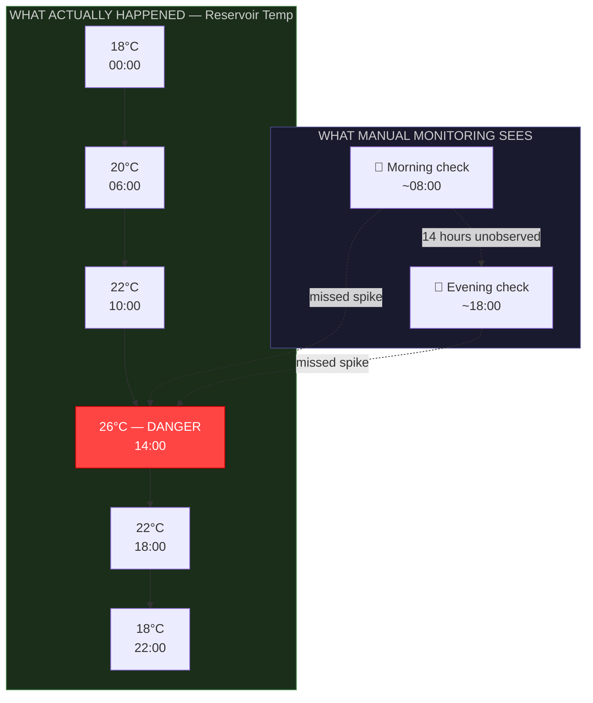

The dangerous 26°C spike at 2 PM was invisible to both manual checks.
Continuous logging would have caught it AND alerted you.

### 1.2 What Data Logging Gives You

| Benefit | Example |
|---|---|
| **Early warning** | pH drifting 0.1/day → act before it reaches 7.0 |
| **Pattern recognition** | Reservoir always peaks at 2 PM → install shade before it matters |
| **Root cause analysis** | Wilting at 4 PM? Check logs — EC spiked to 3.2 at noon from evaporation |
| **Season learning** | Compare July 2026 to July 2027 — was shade cloth timing better? |
| **Remote monitoring** | Check your system from work via phone dashboard |
| **Night-time coverage** | Frost at 4 AM? Get an alert, deploy fleece or heater remotely |
| **Trend analysis** | Nutrient consumption rate increasing → plants are growing fast, good |

### 1.3 What Automation Gives You Beyond Logging

Logging tells you what happened. Automation takes action:

- **Pump failure → automatic alert** (before roots dry out)
- **Reservoir temp > 24 °C → turn on a fan or chiller** automatically
- **pH drift > 6.5 → dose pH Down** automatically (Tier 4)
- **EC drop below target → dose concentrate** automatically (Tier 4)
- **Frost forecast → turn on reservoir heater** automatically

---


[↑ Back to TOC](#table-of-contents)

## 2. Automation Tiers Overview

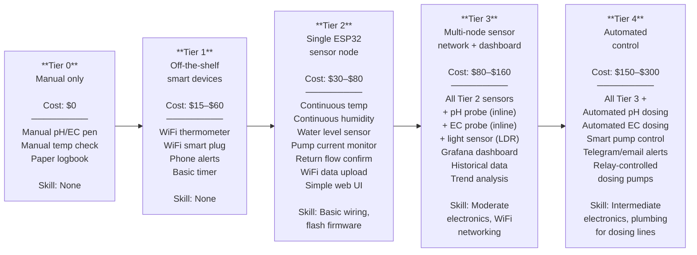

Each tier builds on the previous. You never have to skip ahead — start at Tier 1 and upgrade when you're ready.

---


[↑ Back to TOC](#table-of-contents)

## 3. Tier 0 — Manual Baseline

This is your current setup as documented in Guides 08 and 10. It works — but it requires discipline and physical presence.

**What you already have:**
- Handheld pH pen (calibrated monthly)
- Handheld EC pen (calibrated monthly)
- Aquarium thermometer (reservoir temp)
- Min/max thermometer (air temp)
- Paper logbook

**Limitations:**
- 2 readings per day at most
- No alerts — you discover problems on your next check
- No historical trends — paper logs are hard to analyse
- No remote access — you must be physically present

---


[↑ Back to TOC](#table-of-contents)

## 4. Tier 1 — Off-the-Shelf Smart Devices

### Cost: $15–$60 | Skill: None | Time: 15 minutes to set up

This is the easiest, fastest way to add 24/7 monitoring and alerts with zero technical skill. You buy consumer devices, download their app, and place them.

### 4.1 WiFi Temperature and Humidity Logger

**Recommended: Govee H5075 or H5179** (~$15–$25)

Features:
- Logs temperature and humidity every 2 seconds
- Stores up to 20 days of data locally; syncs to phone app over Bluetooth/WiFi
- Configurable high/low temperature and humidity alerts (push notification to phone)
- Accuracy: ±0.3 °C temperature, ±3% RH
- Battery powered (AAA or CR2032), lasts 6–12 months
- Water resistant but NOT waterproof — keep under cover

**Placement:**
```
GOVEE SENSOR PLACEMENT

Location 1 — Air temperature (ambient):
  Mount on the frame shaded side, at plant height (~90cm)
  NOT in direct sun (reads artificially high)
  NOT against reservoir (reads warm)

Location 2 — Near reservoir (optional second unit):
  Mount on the reservoir shade box exterior
  Captures reservoir ambient temperature
  Alert if box temp exceeds 30°C → reservoir is likely above 24°C

For reservoir WATER temperature:
  Use a waterproof Govee probe sensor (H5179 model)
  Or continue using the aquarium thermometer
```

**Setting alerts:**
- High temp alert: >30 °C (air) or >24 °C (water probe) → action: deploy shade, ice bottles
- Low temp alert: <3 °C → action: deploy fleece, check reservoir heater
- High humidity alert: >85% RH → action: ventilate, check for Botrytis

### 4.2 WiFi Smart Plug with Energy Monitoring

**Recommended: TP-Link Tapo P110 or Shelly Plug S** (~$12–$18)

Plug your submersible pump into this smart plug. Benefits:

1. **Pump failure detection:** If the pump draws 0W when it should be running → the smart plug sends an alert. You know the pump has failed before roots dry out.
2. **Power monitoring:** Track actual pump electricity consumption. Typical: 8–15W.
3. **Remote on/off:** Turn the pump on or off from your phone (useful for emergency shutoff if you're away and get a high-temp alert — stopping the pump stops warm solution circulation).
4. **Scheduling:** Replace the mechanical timer with the smart plug's built-in schedule.

**Setup:**
- Plug smart plug into the GFCI outlet
- Plug pump into smart plug
- Set schedule: 24h on (or 15-min-on/45-min-off cycle)
- Set power alert: if consumption = 0W during scheduled ON → send notification

### 4.3 WiFi Camera (Optional)

A cheap WiFi camera (~$20–$30, e.g., Wyze Cam, TP-Link Tapo C100) pointed at the system gives you:
- Visual confirmation that water is flowing (you can see the drain return splashing)
- Time-lapse growth tracking
- Remote plant health check (zoom in on leaves)
- Night vision for nocturnal pest detection (slugs, caterpillars)

### 4.4 Tier 1 Summary

| Device | Cost | What it provides |
|---|---|---|
| Govee H5075 (air temp/humidity) | $15 | 24/7 temp + RH logging, phone alerts |
| Govee H5179 (water temp probe) | $20 | Reservoir water temp logging |
| TP-Link Tapo P110 (smart plug) | $15 | Pump failure alert, remote control, scheduling |
| WiFi camera (optional) | $25 | Visual monitoring, time-lapse |
| **Tier 1 total** | **$50–$75** | |

---


[↑ Back to TOC](#table-of-contents)

## 5. Tier 2 — ESP32 Sensor Node

### Cost: $30–$80 | Skill: Basic soldering, firmware flashing | Time: 2–4 hours

This is where you build your own sensor system. The ESP32 is a $5–$8 microcontroller with built-in WiFi and Bluetooth, dozens of GPIO pins for sensors, low power consumption, and a massive open-source community. It's the best value platform for DIY IoT monitoring.

### 5.1 Why ESP32 Over Arduino or Raspberry Pi?

```
PLATFORM COMPARISON FOR HYDROPONIC MONITORING

                    Arduino Uno    ESP32          Raspberry Pi 4
                    ───────────    ──────────     ──────────────
Cost                $5–$25         $5–$8          $35–$75
WiFi built-in       ❌              ✅              ✅
Bluetooth           ❌              ✅              ✅
Analog inputs       6              Up to 18       0 (needs ADC)
Power consumption   ~50 mA         ~80 mA active  ~600 mA (always on)
                                   ~10 µA sleep
Can run headless    ✅              ✅              ✅ (but overkill)
Ideal for sensors   ✅              ✅ (best)       Overkill
Dashboard server    ❌              ✅ (basic)      ✅ (best)
SD card logging     With shield    ✅ (built-in)   ✅
OTA firmware update ❌              ✅              ✅
Outdoor suitability Good           Best            Poor (SD card, heat)
Community/guides    Huge           Large, growing  Huge

VERDICT: ESP32 is the best fit for sensor nodes (cheap, WiFi, low power,
         rugged). Raspberry Pi is best if you want to run a local
         dashboard server — but that's optional (you can use free cloud).
```

### 5.2 What Can a Single ESP32 Node Measure?

With one ESP32 board and a few sensors, you can continuously monitor:

| Sensor | Measurement | Why it matters | Cost |
|---|---|---|---|
| DS18B20 (waterproof) | Solution temperature | Pythium risk, DO₂ proxy | $2–$4 |
| DS18B20 (standard) | Air temperature | Heat/frost alerts | $2–$3 |
| DHT22 / SHT30 | Air humidity + temp | Disease risk, transpiration | $3–$6 |
| HC-SR04 / JSN-SR04T | Reservoir water level | Low-level alert, usage tracking | $2–$5 |
| ACS712 / SCT-013 | Pump current draw | Pump failure detection | $3–$6 |
| Float switch (NC) or YF-S201 | Return flow confirmation | **#1 NFT sensor** — confirms solution is actually flowing | $3–$15 |
| LDR (photoresistor) | Light level (relative) | Cloud cover, DLI estimation | $0.50 |

**Total sensor cost: ~$13–$25**
**ESP32 board: ~$5–$8**
**Supporting components (resistors, wires, breadboard): ~$5–$10**

### 5.3 Recommended Starter Sensor Suite

For your first ESP32 node, start with these four sensors — they cover the most critical variables:

```
ESP32 STARTER SENSOR KIT

1. DS18B20 waterproof probe  → Reservoir solution temperature
2. DHT22 module              → Air temperature + humidity
3. JSN-SR04T ultrasonic      → Reservoir water level (waterproof version)
4. ACS712 current sensor     → Pump power draw (failure detection)
5. Float switch (NC)         → Return tank flow confirmation (NFT #1 sensor)

Total cost: ESP32 ($6) + sensors ($18) + wires/resistors ($5) = ~$29
```

### 5.4 Flow Confirmation — The #1 NFT-Specific Sensor

The pump current sensor (ACS712) tells you the pump is **drawing power** — but not that solution is **actually flowing**. A pump can run with an air lock, a blocked inlet, or a broken impeller, drawing normal current while delivering zero flow. In NFT, where roots die within 1–2 hours of a dry film, confirming actual flow is the single highest-value sensor upgrade.

There are three ways to confirm flow:

---

**Option A — Float switch in the return/collection tank (recommended first build)**

Mount a float switch at the low-water mark in the return tank at the base of the NFT channels. When the pump is running, return water fills the tank and keeps the float up. If the pump fails or a channel blocks, the return tank drains within 5–10 minutes and the float drops.

- **Cost:** $3–$8
- **Wiring:** Single digital input with 10 kΩ pull-up to 3.3V
- **Alert:** Float LOW while pump is scheduled ON → pump failure or channel blockage
- **False positives:** Negligible — the return tank is always full during normal operation
- **Limitation:** Does not distinguish pump failure from pipe blockage, but both are critical

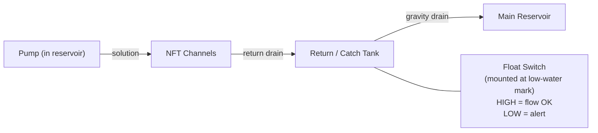

**Wiring to ESP32:**

```
Float switch    →  GPIO 25 (or any digital GPIO)
                   + 10kΩ pull-up to 3.3V
GND             →  GND
```

**ESPHome YAML — float switch in return tank:**

```yaml
binary_sensor:
  - platform: gpio
    pin:
      number: GPIO25
      mode: INPUT_PULLUP
    name: "Return Tank Float"
    id: return_tank_float
    device_class: moisture
    filters:
      - delayed_on: 5s    # debounce — ignore momentary turbulence
      - delayed_off: 30s  # only alert if float stays LOW for 30s
    on_press:
      # Float went HIGH (submerged) — flow confirmed
      - logger.log: "Return tank float: FLOW CONFIRMED"
    on_release:
      # Float went LOW (dry) — potential flow loss
      - logger.log: "ALERT: Return tank float LOW — check pump and channels!"

# Pump-failure template sensor combining float + current
  - platform: template
    name: "NFT Flow Failure"
    id: nft_flow_failure
    device_class: problem
    lambda: |-
      // Alert if pump is drawing current BUT return tank is empty
      // (pump running, no flow arriving back)
      // OR if pump current has dropped to zero
      bool pump_on   = id(pump_current).state > 0.05;
      bool flow_back = id(return_tank_float).state;  // HIGH = submerged = flow OK
      return pump_on && !flow_back;
    on_press:
      - logger.log: "CRITICAL: NFT flow failure — pump running but no return flow!"
```

---

**Option B — Hall-effect flow sensor on the return pipe (YF-S201)**

A YF-S201 (or YF-B10 for 1/2" pipe) measures actual flow rate by counting magnetic pulses from a spinning rotor in the flow path. Mounts inline on the return pipe from the channels to the reservoir.

- **Cost:** $6–$15
- **Wiring:** One digital interrupt pin on ESP32
- **Alert:** Flow rate drops below threshold (e.g., < 2 L/min) during pump-on hours
- **Advantage over float switch:** Can detect **partial blockage** — reduced flow rather than total stoppage
- **Disadvantage:** Requires cutting into the return pipe; rotor can jam with algae/debris after months of use

**ESPHome YAML — YF-S201 flow sensor:**

```yaml
sensor:
  - platform: pulse_counter
    pin:
      number: GPIO26
      mode: INPUT_PULLUP
    name: "Return Flow Rate"
    id: return_flow_rate
    unit_of_measurement: "L/min"
    update_interval: 30s
    filters:
      # YF-S201 outputs ~450 pulses/L (calibrate with measured volume)
      - multiply: 0.00222   # pulses → L/min at 30s window (450 pulses/L ÷ 60s × 30s window × 2)
      - sliding_window_moving_average:
          window_size: 3

binary_sensor:
  - platform: template
    name: "Flow Rate Low"
    device_class: problem
    lambda: |-
      // Alert if flow drops below 2 L/min when pump should be running
      return id(return_flow_rate).state < 2.0;
    filters:
      - delayed_on: 120s   # only alert if low flow persists for 2 minutes
```

> **Calibration note:** YF-S201 pulse factor varies by pressure and temperature. Calibrate by running a known volume (e.g., 5 L) into a bucket and counting pulses. `pulse_factor = pulses_counted / volume_litres`.

---

**Option C — SCT-013 clamp current sensor (no pipe cutting)**

A non-invasive AC current clamp that clips around the pump power cable without cutting anything. Detects whether the pump is drawing current. Cheaper than a flow sensor and easier to install than inline ACS712.

- **Cost:** $8–$15 (SCT-013-030 for loads up to 30A)
- **Wiring:** Analog input + 2× 10 kΩ burden resistors (voltage divider for ESP32 ADC)
- **Limitation:** Confirms pump is drawing power — does NOT confirm water is flowing (air lock not detected)
- **Best use case:** As an addition to the float switch, not a replacement

---

**Which option to choose:**

| Scenario | Recommended |
|---|---|
| First build — keep it simple | Option A (float switch, $3–$8) |
| Want to detect partial blockages | Option B (YF-S201, $6–$15) |
| Can't cut the return pipe | Option C (SCT-013, $8–$15) |
| Best protection | Option A + Option C together ($11–$23) |

Add this row to your sensor matrix in Section 8.1:

| Return flow confirmation | Float switch (NC) or YF-S201 | Digital GPIO / Pulse counter | GPIO 25–26 | Flow present/absent or L/min | Binary or ±5% | #1 NFT failure mode — pump stop |

---

### 5.5 What This Node Can Do

Once assembled and programmed:

```
EVERY 60 SECONDS, THE NODE:

  1. Reads solution temperature  ──→ Logs to WiFi endpoint
  2. Reads air temp + humidity   ──→ Logs to WiFi endpoint
  3. Reads water level           ──→ Logs to WiFi endpoint
  4. Reads pump current          ──→ Logs to WiFi endpoint
  5. Reads return tank float     ──→ Logs to WiFi endpoint

  IF solution temp > 24°C       ──→ Sends alert (Telegram/email)
  IF solution temp < 10°C       ──→ Sends alert
  IF air temp < 3°C             ──→ Sends alert (frost warning)
  IF humidity > 85%             ──→ Sends alert (disease risk)
  IF water level < 30%          ──→ Sends alert (top up needed)
  IF pump current = 0A          ──→ Sends alert (PUMP FAILURE)
  IF pump ON but float LOW      ──→ Sends alert (NO RETURN FLOW — check channels)

  Also serves a local web page at http://hydro.local showing
  current readings and a simple 24-hour chart.
```

---


[↑ Back to TOC](#table-of-contents)

## 6. Tier 3 — Multi-Sensor Network + Dashboard

### Cost: $80–$160 | Skill: Moderate wiring, networking | Time: 6–10 hours

Tier 3 adds inline pH and EC probes for continuous water quality monitoring, a light sensor for DLI tracking, and a proper data dashboard for historical analysis.

### 6.1 Additional Sensors (Beyond Tier 2)

| Sensor | Measurement | Cost | Notes |
|---|---|---|---|
| Gravity Analog pH Sensor Kit (DFRobot SEN0161-V2) | Solution pH (continuous) | $30–$40 | Requires calibration; probe lasts 12–18 months |
| Gravity Analog EC Sensor Kit (DFRobot DFR0300) | Solution EC (continuous) | $40–$55 | Temperature-compensated; requires calibration |
| BH1750 digital light sensor | Lux / light intensity | $2–$4 | Can estimate DLI over time |
| Soil moisture sensor (capacitive) | Zone C grow bag moisture | $2–$3 | Capacitive type only (resistive corrodes) |

### 6.2 pH and EC Probes — Important Notes

Inline pH and EC probes are the most valuable automation sensors but also the most maintenance-intensive.

**pH probe care:**
- Store the probe tip in KCl storage solution when not submerged (if removed from system)
- Calibrate every 2–4 weeks with pH 4.0 and 7.0 buffer solutions
- Probe lifespan: 12–18 months before drift becomes unacceptable
- Replacement probe: ~$15–$25
- Never let the probe dry out — the glass membrane must stay hydrated

**EC probe care:**
- Rinse with distilled water after calibration
- Calibrate every 4–8 weeks with 1413 µS/cm standard
- Probe lifespan: 2–3 years typically
- Less fragile than pH probes but still needs periodic attention

**Placement for inline monitoring:**

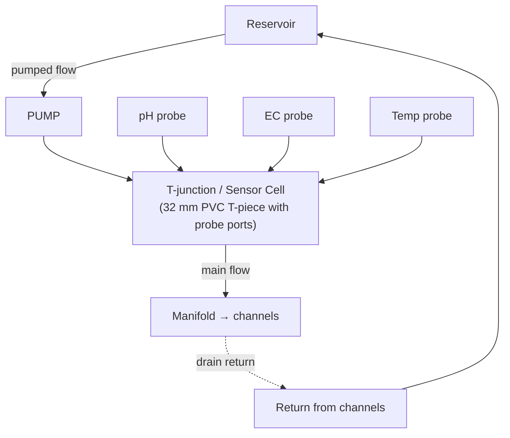

**Building a simple sensor cell:**
1. Use a 32 mm PVC T-piece.
2. Drill probe-diameter holes in the top of the T (or in a fitted end cap).
3. Insert probes through rubber grommets so they hang into the flowing solution.
4. Place the sensor cell between the pump output and the manifold inlet — all solution flows past the probes.
5. Ensure probes are fully submerged but not blocking flow.

### 6.3 Dashboard — Grafana + InfluxDB

A dashboard turns raw sensor data into visual charts, trend lines, and alerts. The recommended free stack:

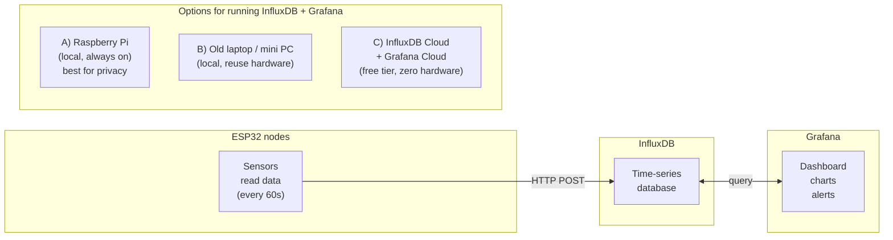

**Option C (free cloud) is recommended for beginners:**
- InfluxDB Cloud free tier: 30-day retention, 5 MB writes/5 min — more than enough
- Grafana Cloud free tier: 3 dashboards, 10,000 series — more than enough
- No hardware to maintain, accessible from any device with a browser

**What the dashboard shows:**

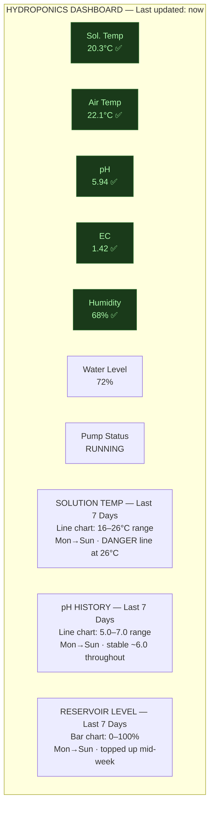

---


[↑ Back to TOC](#table-of-contents)

## 7. Tier 4 — Automated Control

### Cost: $150–$300 | Skill: Intermediate electronics, basic plumbing | Time: 10–16 hours

Tier 4 adds actuators — devices that take physical action based on sensor readings. The ESP32 doesn't just read and report; it controls.

### 7.1 What Can Be Automated?

| Function | How it works | Components | Cost |
|---|---|---|---|
| **pH auto-dosing** | Peristaltic pump dispenses pH Down/Up into reservoir when pH drifts | Peristaltic pump + relay + pH probe | $25–$40 |
| **EC auto-dosing** | Peristaltic pump dispenses nutrient concentrate when EC drops | Peristaltic pump + relay + EC probe | $25–$40 |
| **Reservoir top-up** | Solenoid valve on water supply opens when level drops | Float valve or solenoid + level sensor | $15–$25 |
| **Cooling fan** | Fan blows across reservoir surface when temp exceeds threshold | 12V fan + relay module | $8–$12 |
| **Reservoir heater** | Aquarium heater turns on when temp drops below threshold | Relay module (heater has its own thermostat, but relay adds remote control) | $5 (relay only; heater from Tier 2 budget) |
| **Grow light control** | LED panel switches based on light sensor or schedule | Relay module | $5 |
| **Misting** | Misting nozzles activate for foliar cooling in heatwaves | Solenoid + misting line | $20–$35 |

### 7.2 Automated pH Dosing — Detailed Design

This is the single highest-value automation you can add. pH drift is the most common daily intervention in hydroponics, and automating it saves daily effort while keeping pH tighter than manual dosing ever could.

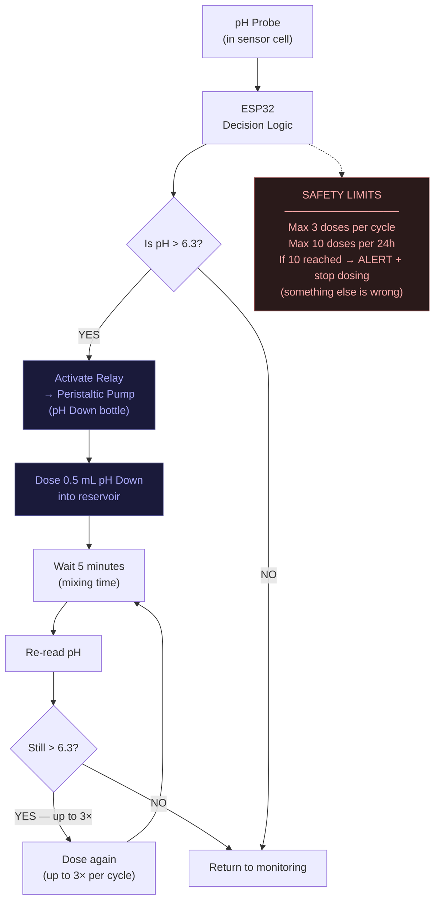

**Peristaltic pump details:**
- A peristaltic pump squeezes liquid through a silicone tube using a rotating mechanism. The liquid never contacts the pump motor — only the tube. This makes it ideal for corrosive chemicals like pH Down (phosphoric acid).
- Recommended: 12V DC peristaltic pump, 1–100 mL/min flow rate
- Cost: $8–$15 (AliExpress, Amazon)
- Controlled via a relay module connected to ESP32 GPIO pin

**Dosing calculation example:**
- Reservoir: 80 L
- Current pH: 6.5
- Target pH: 5.9
- pH Down stock: 85% phosphoric acid diluted to 10% working solution
- Typical dose: 0.5–1.0 mL per dose lowers 80 L by ~0.1–0.2 pH
- Always under-dose and re-check — you can add more but can't take it back

### 7.3 Automated EC Dosing — Detailed Design

EC dosing is more complex than pH because you're dosing two or three separate nutrient concentrates that must be added in the correct ratio and never mixed together in concentrated form.

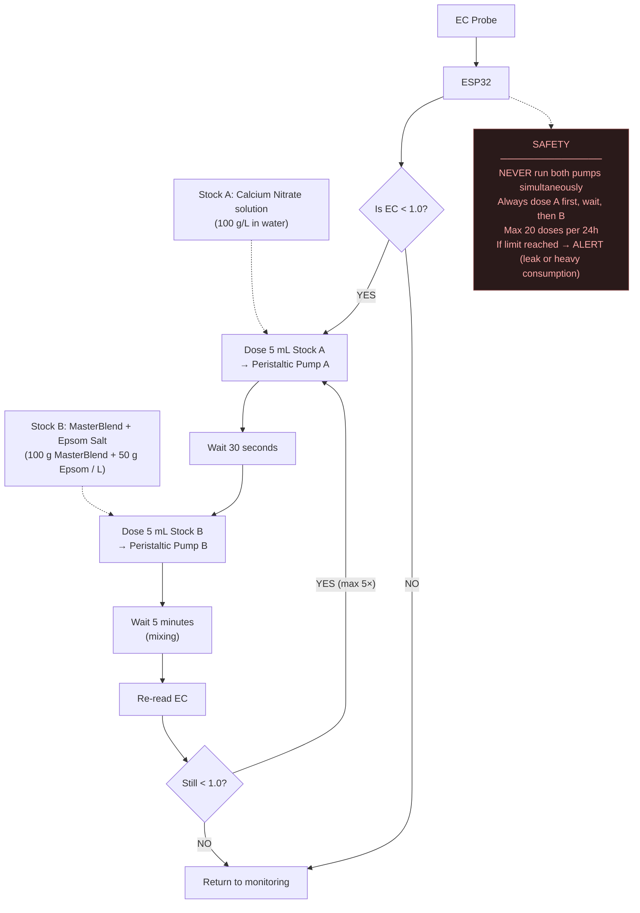

**Stock solution preparation:**
- Stock A (Calcium Nitrate): Dissolve 100 g Ca(NO₃)₂ in 1 L of water. Store in opaque bottle. Shelf life: 2–3 weeks.
- Stock B (MasterBlend + Epsom): Dissolve 100 g MasterBlend 4-18-38 + 50 g Epsom Salt in 1 L of water. Store in opaque bottle. Shelf life: 1–2 weeks.
- Label bottles clearly. Keep away from children and pets.

### 7.4 Safety Interlocks (Critical)

Automated dosing without safety limits is dangerous. A stuck relay or misread sensor could dump an entire bottle of acid into your reservoir.

**Mandatory safety rules for any automated dosing system:**

```
DOSING SAFETY INTERLOCKS

1. DOSE LIMIT per cycle:    Max 3 sequential doses before mandatory wait
2. DOSE LIMIT per 24h:     Max 10–20 doses total (pH) / 20–30 doses (EC)
3. MAXIMUM pH CHANGE:      If pH changes by >1.0 in 1 hour → HALT all dosing, ALERT
4. MAXIMUM EC CHANGE:      If EC changes by >0.5 in 1 hour → HALT all dosing, ALERT
5. LOW STOCK DETECTION:    If peristaltic pump runs but pH/EC doesn't change → bottle empty
6. WATCHDOG TIMER:         If ESP32 hasn't sent data in 5 minutes → alert (node crash)
7. MANUAL OVERRIDE:        Physical switch to disable all relays without software
8. NEVER dose into empty reservoir: If water level < 20% → halt dosing
9. LOG EVERY DOSE:         Record timestamp, volume, before/after reading
```

---


[↑ Back to TOC](#table-of-contents)

## 8. Sensor Reference — What to Measure and Why

### 8.1 Complete Sensor Matrix

| Parameter | Sensor | Interface | ESP32 Pin | Reads | Accuracy | Why measure? |
|---|---|---|---|---|---|---|
| Solution temp | DS18B20 (waterproof) | OneWire (digital) | Any GPIO | -55 to +125 °C | ±0.5 °C | Pythium risk, DO₂ proxy |
| Air temp + humidity | DHT22 or SHT30 | Digital | Any GPIO | -40–80 °C, 0–100% RH | ±0.5 °C / ±2% RH | Frost, heatwave, disease |
| Water level | JSN-SR04T (waterproof ultrasonic) | Trigger + Echo | 2 GPIO | 25–450 cm range | ±1 cm | Low reservoir alert |
| Pump current | ACS712 (5A module) | Analog | ADC pin | 0–5A | ±50 mA | Pump failure detection |
| Return flow | Float switch (NC) or YF-S201 | Digital / Pulse | Any GPIO | Present/absent or L/min | Binary / ±5% | **#1 NFT sensor** — confirms solution is flowing, not just pump drawing power |
| Solution pH | DFRobot SEN0161-V2 | Analog | ADC pin | 0–14 pH | ±0.1 pH | Nutrient availability |
| Solution EC | DFRobot DFR0300 | Analog | ADC pin | 0–20 mS/cm | ±5% | Nutrient concentration |
| Light intensity | BH1750 | I2C (digital) | SDA + SCL | 1–65535 lux | ±1 lux | DLI estimation |
| Grow bag moisture | Capacitive soil sensor | Analog | ADC pin | Relative % | Relative | Zone C watering trigger |
| Barometric pressure | BME280 | I2C (digital) | SDA + SCL | 300–1100 hPa | ±1 hPa | Weather trend prediction |

### 8.2 Sensor Selection Tips

**Temperature — DS18B20 is king:**
- The DS18B20 is the standard for hydroponics temperature. It costs $2, is waterproof (probe version), and you can run multiple probes on a single GPIO pin using the OneWire bus. This means one pin can read 5+ temperature probes simultaneously.
- Use the waterproof probe version for solution temp and the bare TO-92 package for air temp.

**Humidity — DHT22 vs. SHT30:**
- DHT22: $3, widely available, adequate accuracy. Use 10 kΩ pull-up resistor.
- SHT30: $5, I2C interface, better accuracy (±2% vs ±3%), faster reads. Preferred if you want cleaner data.

**Water level — JSN-SR04T over HC-SR04:**
- The HC-SR04 is the common cheap ultrasonic sensor, but it's NOT waterproof. In a humid outdoor environment near a reservoir, it corrodes quickly.
- The JSN-SR04T is the waterproof version with a sealed transducer on a cable. It's designed for liquid level measurement. Worth the extra $2.

**pH and EC probes — DFRobot kits:**
- DFRobot's Gravity series pH and EC sensor kits are the de facto standard for hobbyist hydroponic automation. They come with a signal conditioning board that outputs a clean analog voltage to the ESP32's ADC.
- They are NOT laboratory-grade but are accurate enough for hydroponic management (±0.1 pH, ±5% EC).
- Budget alternative: Atlas Scientific probes are more accurate and longer-lasting but cost 3–5× more. Not recommended unless you need lab-grade data.

---


[↑ Back to TOC](#table-of-contents)

## 9. ESP32 Hardware Guide

### 9.1 Which ESP32 Board?

| Board | Cost | Pro | Con | Recommended for |
|---|---|---|---|---|
| ESP32-WROOM-32 DevKit | $5–$8 | Cheapest, widely available | No battery management | Tier 2 sensor node |
| ESP32-S3 DevKit | $7–$12 | More ADC channels, USB-C | Slightly more expensive | Tier 3 with many analog sensors |
| ESP32-C3 Super Mini | $3–$5 | Tiny, very cheap | Fewer pins | Single-purpose nodes |
| LILYGO T-Display S3 | $15–$20 | Built-in LCD screen | Higher cost | Display node showing current values |

**Recommended: ESP32-WROOM-32 DevKit** for the first build. It's the most documented, cheapest, and has plenty of pins.

### 9.2 ESP32 Pin Layout for Sensor Node

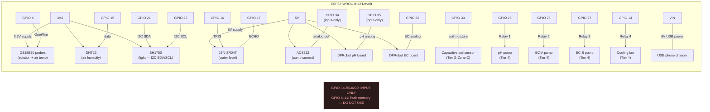

### 9.3 Power Supply

The ESP32 and sensors draw very little power:

```
POWER BUDGET

Component                   Current (mA)    Voltage
─────────────────────────────────────────────────────
ESP32 (WiFi active)         80–160          3.3V (from USB 5V)
DS18B20 × 2                 3               3.3V
DHT22                       2.5             3.3V
JSN-SR04T                   15              5V
ACS712                      10              5V
BH1750                      1               3.3V
DFRobot pH board            5               5V
DFRobot EC board            5               5V
─────────────────────────────────────────────────────
Total:                      ~120–200 mA at 5V

Any USB phone charger (5V / 1A minimum) is sufficient.
A 5V / 2A charger provides ample headroom for relays too.
```

For Tier 4 with relays and peristaltic pumps:
- Relay module: ~60 mA per relay coil (use a 4-channel relay module)
- Peristaltic pumps: ~200–300 mA each at 12V
- Separate 12V supply for peristaltic pumps (do NOT power from ESP32)

---


[↑ Back to TOC](#table-of-contents)

## 10. Wiring Diagrams

### 10.1 Tier 2 — Basic Sensor Node

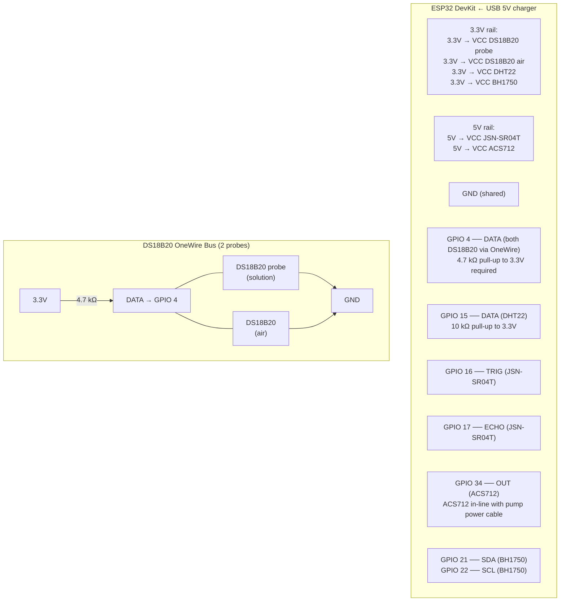

### 10.2 Tier 4 — Adding Relay Module for Dosing

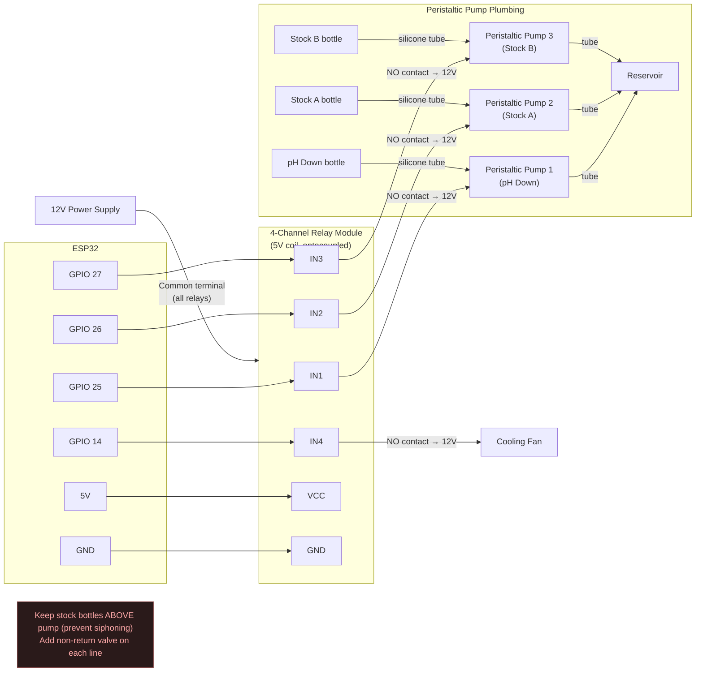

---


[↑ Back to TOC](#table-of-contents)

## 11. Firmware and Software

### 11.1 Firmware Options

You don't need to write code from scratch. Several open-source firmware projects support ESP32 + sensors with zero or minimal coding:

| Firmware | Skill level | Features | Best for |
|---|---|---|---|
| **ESPHome** | Beginner | YAML config, Home Assistant integration, OTA updates | Tier 2–3, if using Home Assistant |
| **Tasmota** | Beginner | Web-based config, MQTT, rule engine | Tier 1–2, simple setups |
| **Custom Arduino/PlatformIO** | Intermediate | Full control, any sensor, any logic | Tier 3–4, advanced customisation |
| **MicroPython** | Intermediate | Python on ESP32, rapid prototyping | Quick experiments |

### 11.2 ESPHome — Recommended for Most Users

ESPHome lets you define your entire sensor node in a YAML configuration file. No C++ coding. It compiles firmware, flashes it to the ESP32, and provides over-the-air updates.

**Example ESPHome configuration for a Tier 2 node:**

```yaml
# hydro-node.yaml — ESPHome configuration for hydroponics sensor node

esphome:
  name: hydro-node
  platform: ESP32
  board: esp32dev

wifi:
  ssid: "YourWiFiNetwork"
  password: "YourWiFiPassword"

# Enable web server for local access at http://hydro-node.local
web_server:
  port: 80

# Enable logging
logger:

# Enable over-the-air updates
ota:
  password: "your-ota-password"

# --- SENSORS ---

# Dallas OneWire bus (DS18B20 temperature probes)
dallas:
  - pin: GPIO4

sensor:
  # Solution temperature (waterproof DS18B20 probe)
  - platform: dallas
    address: 0x1234567890ABCDEF   # Replace with your probe's unique address
    name: "Solution Temperature"
    unit_of_measurement: "°C"
    accuracy_decimals: 1
    filters:
      - sliding_window_moving_average:
          window_size: 5
          send_every: 1

  # Air temperature (second DS18B20)
  - platform: dallas
    address: 0xFEDCBA0987654321   # Replace with your probe's unique address
    name: "Air Temperature"
    unit_of_measurement: "°C"

  # Air humidity (DHT22)
  - platform: dht
    pin: GPIO15
    model: DHT22
    temperature:
      name: "DHT Air Temperature"
    humidity:
      name: "Air Humidity"
      unit_of_measurement: "%"
    update_interval: 30s

  # Reservoir water level (JSN-SR04T ultrasonic)
  - platform: ultrasonic
    trigger_pin: GPIO16
    echo_pin: GPIO17
    name: "Reservoir Level"
    update_interval: 60s
    unit_of_measurement: "%"
    filters:
      # Convert distance (cm) to percentage
      # Adjust 40 (empty) and 5 (full) to your reservoir dimensions
      - lambda: |-
          float empty_cm = 40.0;
          float full_cm = 5.0;
          float pct = (empty_cm - x) / (empty_cm - full_cm) * 100.0;
          return clamp(pct, 0.0f, 100.0f);

  # Pump current (ACS712 via ADC)
  - platform: adc
    pin: GPIO34
    name: "Pump Current"
    id: pump_current
    unit_of_measurement: "A"
    update_interval: 10s
    attenuation: 11db
    filters:
      - calibrate_linear:
          - 1.65 -> 0      # 0A = mid-point voltage (2.5V at 5V, ~1.65V via divider)
          - 2.15 -> 1.0    # Calibrate with known load
      - sliding_window_moving_average:
          window_size: 10

  # Light level (BH1750 via I2C)
  - platform: bh1750
    name: "Light Level"
    address: 0x23
    update_interval: 60s
    unit_of_measurement: "lx"

# --- ALERTS (via Home Assistant or direct notification) ---

binary_sensor:
  # Pump failure detection
  - platform: template
    name: "Pump Failure"
    lambda: |-
      return id(pump_current).state < 0.05;
    on_press:
      - logger.log: "ALERT: Pump current is zero — possible pump failure!"
```

### 11.3 Sending Data to InfluxDB (Without Home Assistant)

If you don't use Home Assistant, the ESP32 can push data directly to InfluxDB Cloud via HTTP POST. With custom Arduino/PlatformIO firmware:

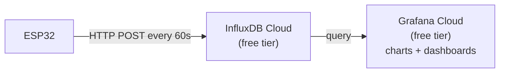

The ESP32 sends an HTTP POST like:

```
POST /api/v2/write?org=your-org&bucket=hydroponics
Authorization: Token your-api-token

solution_temp,node=hydro-1 value=20.3
air_temp,node=hydro-1 value=22.1
humidity,node=hydro-1 value=68.2
water_level,node=hydro-1 value=72.0
pump_current,node=hydro-1 value=0.12
```

InfluxDB stores this as time-series data. Grafana queries it and renders charts.

### 11.4 Local-Only Option (No Cloud, No Internet)

If you don't want cloud services or internet dependency:

1. ESP32 hosts a local web server (built into ESPHome or custom firmware).
2. Access it at `http://hydro-node.local` on your home WiFi.
3. Current sensor values displayed as a simple web page.
4. Optional: ESP32 logs data to a microSD card (using an SD card breakout board, ~$3). You can pull the card periodically and import into a spreadsheet.

This option provides 100% local operation — no cloud accounts, no subscriptions, no privacy concerns.

---


[↑ Back to TOC](#table-of-contents)

## 12. Data Storage and Dashboards

### 12.1 Options Comparison

| Option | Cost | Retention | Access | Skill | Best for |
|---|---|---|---|---|---|
| **Paper logbook** | $0 | Forever (physical) | Physical only | None | Manual-only Tier 0 |
| **Spreadsheet (manual entry)** | $0 | Forever | Your computer | Basic | Tier 0–1 |
| **Google Sheets (auto-populated via IFTTT)** | $0 | Forever | Any browser | Basic | Tier 1 with Govee |
| **InfluxDB Cloud + Grafana Cloud** | $0 (free tier) | 30 days | Any browser | Moderate | Tier 2–4 |
| **Home Assistant + InfluxDB (local)** | $35–$75 (Pi) | Forever | Local network | Moderate | Tier 2–4, privacy-first |
| **SD card on ESP32** | $3 | Until card full | Physical card | Basic | Offline sites |

### 12.2 Google Sheets — Simplest Auto-Logging

If you're using Tier 1 Govee devices, you can export data to Google Sheets via the Govee app's export feature (CSV). This gives you spreadsheet-based charts and historical analysis at zero cost.

For ESP32 data, you can push readings directly to Google Sheets using the Google Sheets API (via a Google Apps Script webhook). The ESP32 sends an HTTP GET to a script URL, which appends the data to a spreadsheet row. Many tutorials exist for this — search "ESP32 Google Sheets logging".

### 12.3 InfluxDB + Grafana — The Power Combo

This is the recommended stack for Tier 2+ because:
- InfluxDB is purpose-built for time-series sensor data (fast writes, efficient queries)
- Grafana provides beautiful, configurable dashboards with alerting built in
- Both have generous free tiers that exceed our needs

**Setup steps (cloud, ~20 minutes):**

```
SETUP: INFLUXDB CLOUD + GRAFANA CLOUD

Step 1: Create free InfluxDB Cloud account
  → https://cloud2.influxdata.com/signup
  → Create a bucket called "hydroponics"
  → Generate an API token (write access)
  → Note your org name and bucket name

Step 2: Configure ESP32 to POST data
  → In firmware, set the InfluxDB URL, org, bucket, and token
  → Data should appear in InfluxDB within 60 seconds of first POST

Step 3: Create free Grafana Cloud account
  → https://grafana.com/auth/sign-up
  → Add InfluxDB as a data source (use your cloud URL + token)
  → Create a new dashboard

Step 4: Build dashboard panels
  → Panel 1: Solution temperature (line chart, last 7 days)
  → Panel 2: Air temperature + humidity (dual-axis chart)
  → Panel 3: pH history (line chart with threshold bands)
  → Panel 4: EC history (line chart with threshold bands)
  → Panel 5: Water level (gauge, current %)
  → Panel 6: Pump status (stat panel, current/previous state)

Step 5: Configure alerts in Grafana
  → Alert: Solution temp > 24°C → notification
  → Alert: Pump current = 0 for > 2 min → notification
  → Alert: Water level < 25% → notification
  → Notification channel: Email, Telegram, or Slack (all free)
```

### 12.4 Home Assistant — The Local Hub

If you want to keep everything local (no cloud), Home Assistant running on a Raspberry Pi provides:
- Auto-discovery of ESPHome devices
- Beautiful dashboard (Lovelace UI)
- Automation engine (if temp > X, turn on relay Y)
- Long-term data storage (built-in recorder)
- Notifications via Telegram, email, or phone push

**Home Assistant setup:**
1. Install Home Assistant OS on a Raspberry Pi 4 (4 GB RAM recommended) — ~$50–$75 for the Pi
2. Install the ESPHome add-on from the HA Add-on Store
3. Flash your ESP32 via ESPHome
4. The ESP32 appears automatically in Home Assistant
5. Add sensor entities to your dashboard

---


[↑ Back to TOC](#table-of-contents)

## 13. Alerts and Notifications

### 13.1 Alert Priority Matrix

Not all alerts are equal. Structure your notifications to avoid alert fatigue:

```
ALERT PRIORITIES

🔴 CRITICAL (immediate action required — wake you up at night)
  • Pump current = 0A (pump failure)           → roots dry in 30 min
  • Solution temp < 2°C (freeze imminent)      → system damage risk
  • Water level < 10% (nearly empty)            → pump dry run risk
  • pH outside 4.0–8.0 (extreme drift)          → system malfunction

🟡 WARNING (action within 2–4 hours)
  • Solution temp > 24°C (heat stress)          → deploy shade/ice
  • Solution temp < 10°C (cold stress)          → deploy heater/fleece
  • Air temp < 3°C (frost warning)              → deploy fleece
  • pH outside 5.5–6.5                          → adjust pH
  • EC outside target range by >20%             → top up / dilute
  • Water level < 30%                           → top up reservoir
  • Humidity > 85% for 6+ hours                 → disease risk

🟢 INFORMATIONAL (check at convenience)
  • Daily summary: min/max temp, avg pH, avg EC, water consumed
  • Weekly trend: is pH drifting steadily?
  • Reservoir top-up reminder
  • Calibration due reminder
```

### 13.2 Notification Channels

| Channel | Cost | Latency | Setup effort | Best for |
|---|---|---|---|---|
| **Telegram bot** | Free | Instant | 10 min | All alert levels — best overall |
| **Email (Gmail SMTP)** | Free | 1–5 min | 15 min | Non-urgent alerts, daily summaries |
| **Pushover** | $5 one-time | Instant | 5 min | Push notifications with priority levels |
| **Home Assistant Companion** | Free | Instant | 5 min (if using HA) | Phone push notifications |
| **Slack webhook** | Free | Instant | 10 min | If you already use Slack |
| **Discord webhook** | Free | Instant | 5 min | If you already use Discord |

### 13.3 Telegram Bot — Recommended Setup

Telegram is the best free notification channel for hydroponic alerts because:
- Free, no message limits, instant delivery
- Works on phone + desktop
- Supports images (you could send a dashboard screenshot daily)
- Bot setup takes 10 minutes

**Setup:**
1. Open Telegram, search for `@BotFather`
2. Send `/newbot`, follow the prompts, name it "HydroAlert" or similar
3. Save the bot token (a long string like `123456:ABC-DEF1234ghIkl-zyx57W2v1u123ew11`)
4. Start a chat with your new bot and send any message
5. Get your chat ID: visit `https://api.telegram.org/bot<YOUR_TOKEN>/getUpdates`
6. In ESP32 firmware, send alerts via HTTP GET:
   ```
   https://api.telegram.org/bot<TOKEN>/sendMessage?chat_id=<CHAT_ID>&text=ALERT: Pump failure detected!
   ```

**Example alert messages:**

```
🔴 PUMP FAILURE
Pump current: 0.00A (expected >0.05A)
Duration: 3 minutes
Action required: Check pump immediately

🟡 HEAT WARNING
Solution temp: 25.2°C (threshold: 24°C)
Air temp: 31.4°C
Recommendation: Deploy shade cloth, add ice bottles

🟢 DAILY SUMMARY — Feb 28
Solution temp: min 16.8°C / max 22.3°C
Air temp: min 8.2°C / max 19.7°C
pH: avg 5.92 (range 5.78–6.08)
EC: avg 1.38 (range 1.31–1.44)
Water consumed: ~6.2 L
Pump uptime: 100%
No alerts triggered today.
```

---


[↑ Back to TOC](#table-of-contents)

## 14. Using Your Data — Pattern Recognition

Data is only valuable if you use it. Here's how to read your logs and dashboards to make better growing decisions.

### 14.1 Temperature Patterns

```
WHAT TO LOOK FOR IN TEMPERATURE CHARTS

Pattern: Solution temp peaks at 2–3 PM daily, reaching 24°C+
Meaning: Reservoir is receiving direct afternoon sun
Action:  Install shade structure or move reservoir to north side of frame

Pattern: Solution temp drops sharply overnight (20°C → 12°C)
Meaning: Large diurnal swing — reservoir is poorly insulated
Action:  Insulate reservoir walls and lid; consider burying reservoir

Pattern: Air temp regularly below solution temp at night
Meaning: Normal — reservoir acts as thermal mass (retains heat)
Action:  None required — this is beneficial in cool weather

Pattern: Solution temp consistently 3–5°C above air temp in daytime
Meaning: Pump and plumbing are absorbing heat (dark pipes in sun)
Action:  Insulate or shade supply pipes; use white or reflective pipe cover
```

### 14.2 pH Patterns

```
WHAT TO LOOK FOR IN pH CHARTS

Pattern: pH rises 0.2–0.4 during daylight, drops overnight
Meaning: Normal — plants take up more nitrate during photosynthesis,
         raising pH. At night, respiration reverses slightly.
Action:  None if within 5.5–6.5. Add pH Down in morning if it regularly
         exceeds 6.5 by afternoon.

Pattern: pH steadily rising by 0.1/day, never comes back down
Meaning: Solution is alkaline-drifting — possibly high carbonate source water,
         or algae blooms consuming CO₂
Action:  Check for light leaks (algae), test source water KH/alkalinity,
         consider pre-treating with acid or using RO water

Pattern: pH crashes suddenly (drops from 6.0 to 4.5 in hours)
Meaning: Possible over-dosing of pH Down (manual or auto), or organic acid
         from decaying roots (Pythium)
Action:  Inspect roots immediately. If dosing — check peristaltic pump for
         stuck relay. Dilute reservoir with plain water to raise pH.

Pattern: pH stable for days, then swings wildly for a day
Meaning: Possible meter calibration drift, or reservoir was changed/topped up
         with different source water
Action:  Recalibrate meter. Check water source consistency.
```

### 14.3 EC Patterns

```
WHAT TO LOOK FOR IN EC CHARTS

Pattern: EC rises 0.1–0.3/day even without adding nutrients
Meaning: Plants are taking up more water than nutrients (transpiration-heavy).
         Common in hot, windy weather.
Action:  Top up with plain water more frequently. Lower target EC slightly.

Pattern: EC drops 0.1–0.2/day
Meaning: Plants are actively consuming nutrients — they're growing well.
Action:  Good sign. Top up nutrients to maintain target EC.

Pattern: EC stable, not rising or falling
Meaning: Nutrient uptake matches water uptake — balanced.
Action:  None — ideal situation.

Pattern: EC suddenly drops by 0.5+ overnight
Meaning: Possible rain dilution (reservoir lid not sealed), or a large
         top-up was made with plain water
Action:  Check reservoir cover seal. Re-dose nutrients if needed.
```

### 14.4 Correlation Analysis

The real power of continuous data is seeing how variables interact:

```
EXAMPLE CORRELATION: Reservoir temp vs. pH drift rate

If your data shows:
  Day 1: avg solution temp 18°C → pH changed +0.05
  Day 2: avg solution temp 20°C → pH changed +0.08
  Day 3: avg solution temp 24°C → pH changed +0.18
  Day 4: avg solution temp 26°C → pH changed +0.31

Conclusion: Every 2°C rise in solution temp roughly doubles pH drift rate.
Action:     Prioritise temperature control (shade, insulation) over
            pH dosing — treating the cause, not the symptom.
```

After 4–6 weeks of continuous data, patterns like this become clearly visible in your Grafana charts. This is knowledge that paper logs and twice-daily checks simply cannot provide.

---

### 14.5 VPD — Vapour Pressure Deficit as a Derived Metric

VPD (Vapour Pressure Deficit) quantifies the "drying power" of the air: how hard the air is pulling moisture from plant leaves. High VPD causes plants to close stomata, reducing CO₂ uptake and slowing growth. Very high VPD causes wilting. Low VPD encourages disease (Botrytis, mildew).

You already log air temperature and humidity with your DHT22/SHT30 — VPD can be calculated from these two values in firmware and logged as a derived sensor.

**Target VPD range:**
| Growth stage | Target VPD |
|---|---|
| Seedling / cutting | 0.4–0.8 kPa |
| Vegetative growth | 0.8–1.2 kPa |
| Fruiting / flowering | 1.0–1.5 kPa |
| Above 1.8 kPa | Wilting risk — shade or mist |
| Below 0.4 kPa | Disease risk — improve ventilation |

**ESPHome YAML — VPD as a lambda sensor:**

```yaml
sensor:
  # Air temperature (from DHT22 — already in your config)
  - platform: dht
    pin: GPIO4
    model: DHT22
    temperature:
      name: "Air Temperature"
      id: air_temp
    humidity:
      name: "Air Humidity"
      id: air_humidity
    update_interval: 60s

  # VPD — calculated from air temp + humidity
  - platform: template
    name: "VPD"
    id: vpd
    unit_of_measurement: "kPa"
    icon: "mdi:water-percent"
    update_interval: 60s
    lambda: |-
      // Tetens equation for saturation vapour pressure (kPa)
      // SVP = 0.6108 * exp(17.27 * T / (T + 237.3))
      float T  = id(air_temp).state;
      float RH = id(air_humidity).state;
      if (isnan(T) || isnan(RH)) return NAN;
      float svp = 0.6108f * expf(17.27f * T / (T + 237.3f));
      float vpd = svp * (1.0f - RH / 100.0f);
      return vpd;
    filters:
      - sliding_window_moving_average:
          window_size: 5   # smooth over 5 minutes
```

**VPD alerts — add to your alert config:**

```yaml
binary_sensor:
  - platform: template
    name: "VPD Too High"
    device_class: problem
    lambda: |-
      return id(vpd).state > 1.8;
    filters:
      - delayed_on: 15min   # only alert if consistently high for 15 min
    on_press:
      - logger.log: "ALERT: VPD above 1.8 kPa — wilting risk, check shade/ventilation"

  - platform: template
    name: "VPD Too Low"
    device_class: problem
    lambda: |-
      return id(vpd).state < 0.4 && id(vpd).state > 0.0;
    filters:
      - delayed_on: 30min
    on_press:
      - logger.log: "WARNING: VPD below 0.4 kPa — disease risk, check air circulation"
```

**Grafana panel — VPD over 24 hours:**

Create a time-series panel for `vpd` with colour-coded thresholds:
- Green band: 0.8–1.5 kPa (healthy range)
- Yellow band: 0.4–0.8 kPa or 1.5–1.8 kPa (caution)
- Red band: <0.4 kPa or >1.8 kPa (alert zones)

This gives an immediate visual of how many hours per day the crop is under heat or disease stress, and whether adding shade cloth or improving airflow made a measurable difference.

---


[↑ Back to TOC](#table-of-contents)

## 15. Weatherproofing and Power

### 15.1 Enclosure for ESP32 and Wiring

The ESP32 and its wiring must be protected from rain, splash, and UV degradation.

**Recommended enclosure: IP65 junction box** (~$5–$10)

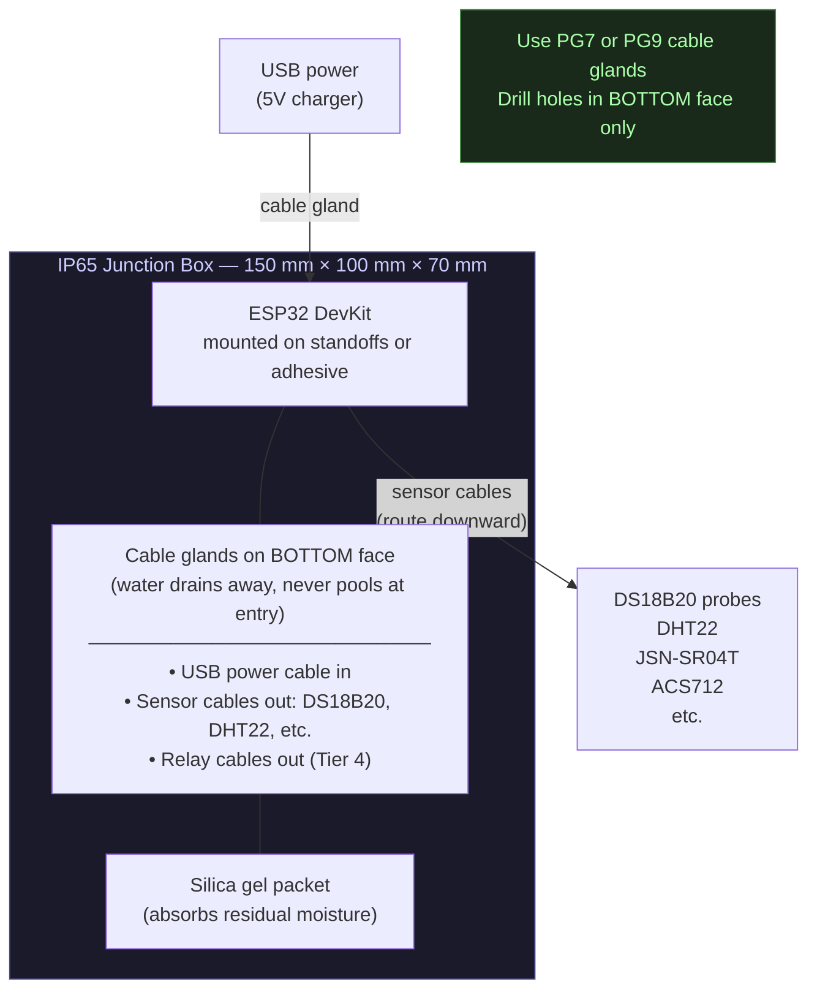

**Placement:**
- Mount the enclosure on the frame, above channel height (water falls away)
- Route sensor cables downward (gravity prevents water running along cables into the box)
- Keep USB power entry at the bottom
- Inspect enclosure monthly for condensation

### 15.2 Sensor Protection

| Sensor | Protection needed |
|---|---|
| DS18B20 waterproof probe | None — already sealed. Just ensure cable gland entry into box |
| DHT22 / SHT30 | Mount inside a radiation shield (small white louvred housing, $3) to prevent direct sun on the sensor. Needs airflow. |
| JSN-SR04T | Transducer is waterproof. Mount above reservoir, pointing down. Controller board goes in main box. |
| ACS712 | Inside main box — only the pump wire passes through the sensor |
| BH1750 | Mount outside box under a small clear polycarbonate cover — needs to see sky |
| pH/EC probes | Probes stay in the sensor cell (wet environment). Signal conditioning boards go in the main box. |

### 15.3 Power Options

| Power source | Cost | Runtime | Best for |
|---|---|---|---|
| USB wall charger + outdoor extension | $0 (existing) | Unlimited | Systems near mains power |
| USB power bank (20,000 mAh) | $15–$25 | ~4–7 days (ESP32 @ 120 mA average) | Remote locations, backup |
| 5W solar panel + LiPo battery | $15–$25 | Unlimited (with sun) | Off-grid sites |
| PoE splitter (if Ethernet available) | $10 | Unlimited | Wired setups |

**Solar power option:**
A 5W (5V/1A) solar panel with a TP4056 charge controller and a 3.7V 6000 mAh LiPo battery can run an ESP32 sensor node indefinitely in most climates. The ESP32 can deep-sleep between readings (waking every 60 seconds) to reduce average current to ~5 mA, extending battery life to weeks even without sun.

---


[↑ Back to TOC](#table-of-contents)

## 16. Automation BOM by Tier

### Tier 1 — Off-the-Shelf ($50–$75)

| Item | Cost |
|---|---|
| Govee H5075 temp/humidity logger | $15 |
| Govee H5179 water temp probe (or aquarium thermometer) | $20 |
| TP-Link Tapo P110 smart plug | $15 |
| WiFi camera (optional) | $25 |
| **Total** | **$50–$75** |

### Tier 2 — ESP32 Sensor Node ($26–$50)

| Item | Cost |
|---|---|
| ESP32-WROOM-32 DevKit | $6 |
| DS18B20 waterproof probe (solution temp) | $3 |
| DS18B20 TO-92 (air temp) | $2 |
| DHT22 module (humidity) | $4 |
| JSN-SR04T waterproof ultrasonic (water level) | $5 |
| ACS712 5A current sensor (pump monitor) | $4 |
| BH1750 light sensor | $3 |
| 4.7kΩ + 10kΩ resistors (assorted pack) | $2 |
| Dupont jumper wires (40-pack) | $3 |
| Breadboard or proto board | $3 |
| IP65 junction box | $6 |
| Cable glands PG7 (10-pack) | $2 |
| USB charger 5V/2A | $5 |
| Micro-USB cable (2m) | $3 |
| **Total** | **$51** |

### Tier 3 — Full Monitoring ($80–$160, adds to Tier 2)

| Item | Add to Tier 2 cost |
|---|---|
| DFRobot Gravity pH Sensor Kit (SEN0161-V2) | $35 |
| DFRobot Gravity EC Sensor Kit (DFR0300) | $45 |
| Capacitive soil moisture sensor (Zone C) × 2 | $4 |
| BME280 weather sensor (temp/humidity/pressure) | $4 |
| pH calibration buffers (4.0 + 7.0 sachets × 3) | $6 |
| EC calibration solution (1413 µS/cm, 250 mL) | $5 |
| Raspberry Pi 4 (4 GB) for local dashboard (optional) | $55 |
| **Tier 3 total (Tier 2 + additions)** | **$100–$160** |

### Tier 4 — Automated Control ($150–$300, adds to Tier 3)

| Item | Add to Tier 3 cost |
|---|---|
| 4-channel relay module (5V, optocoupled) | $5 |
| 12V DC peristaltic pump × 3 (pH, Stock A, Stock B) | $30 |
| 12V / 2A power supply (for pumps) | $8 |
| Silicone tubing (2m × 3 lines) | $6 |
| Non-return valves (3×) | $5 |
| Stock solution bottles (3× 1L opaque HDPE) | $5 |
| 12V cooling fan (80mm, brushless) | $6 |
| Physical kill switch (toggle, inline) | $3 |
| **Tier 4 total (Tier 3 + additions)** | **$168–$230** |

### Combined Tier Totals

| Tier | Standalone cost | Cumulative (if building up from Tier 1) |
|---|---|---|
| Tier 1 | $50–$75 | $50–$75 |
| Tier 2 | $51 | $101–$126 |
| Tier 3 | $100–$160 | $150–$235 |
| Tier 4 | $168–$230 | $218–$305 |

---


[↑ Back to TOC](#table-of-contents)

## 17. Common Pitfalls

### Pitfall 1 — Skipping Calibration

**Problem:** pH and EC probes drift. If you don't calibrate them, your automated dosing system bases decisions on wrong data. A pH probe reading 6.0 when the actual pH is 5.2 means the system under-doses acid — or worse, adds acid when it shouldn't.

**Prevention:** Calibrate pH probes every 2–4 weeks, EC probes every 4–8 weeks. Set a calendar reminder. Log calibration dates. The dashboard should include a "days since last calibration" counter.

### Pitfall 2 — Alert Fatigue

**Problem:** You set alerts for everything and receive 30 notifications a day. After a week you start ignoring them. You miss the one that matters.

**Prevention:** Use the priority matrix in Section 13.1. Only push 🔴 CRITICAL alerts to your phone as notifications. Send 🟡 WARNINGs as a digest every 4 hours. 🟢 INFOs go to a daily summary email or dashboard log only.

### Pitfall 3 — WiFi Reliability and the Silent Blackout

**Problem:** The ESP32 loses WiFi connection. Data stops flowing. No alerts are sent. You think everything is fine — but the system is completely unmonitored. If the pump then fails while the ESP32 is offline, you won't know until you walk out and find wilting plants.

This is sometimes called the "dead-man problem": the alerting system itself can go silent, and you have no way to know from the phone alerts alone whether silence means "all is well" or "the node has gone offline."

**Prevention — two layers:**

**Layer 1: ESP32 firmware auto-reconnect (ESPHome handles this automatically)**

ESPHome's WiFi component includes exponential-backoff reconnect by default. Add a reboot safeguard for the case where reconnect keeps failing:

```yaml
wifi:
  ssid: "YourWiFiNetwork"
  password: "YourWiFiPassword"
  fast_connect: true
  reboot_timeout: 15min   # reboot ESP32 if WiFi not recovered within 15 min
  ap:
    ssid: "Hydro-Fallback"   # creates a local access point as fallback
    password: "hydro1234"

# Also log last-seen time as a sensor so InfluxDB can track it
text_sensor:
  - platform: wifi_info
    ip_address:
      name: "IP Address"
    ssid:
      name: "Connected SSID"
    bssid:
      name: "Connected BSSID"
```

**Layer 2: Server-side watchdog (the most important part)**

The ESP32 cannot alert you about its own silence — if it's offline, it can't send anything. The watchdog must run on the **server side** (your InfluxDB/Grafana instance, a Raspberry Pi, or a free cloud function).

**Option A — Grafana alert on data staleness (recommended if using Grafana):**

In Grafana, create an alert rule on any sensor (e.g., solution temperature):

```
Alert rule: "ESP32 Node Offline"
  Query: last value of solution_temp WHERE time > now()-10m
  Condition: IS NULL  (no data in last 10 minutes)
  Alert: send Telegram + email
  Message: "⚠️ Hydro node has not reported for 10+ minutes — check WiFi"
```

This fires if the ESP32 hasn't sent *any* data in 10 minutes. It costs nothing extra if you're already using Grafana.

**Option B — Python watchdog script on a Raspberry Pi or always-on server:**

```python
#!/usr/bin/env python3
"""
hydro_watchdog.py — server-side dead-man monitor for ESP32 sensor node.
Run as a cron job or systemd service every 5 minutes.
Sends a Telegram alert if the ESP32 has not reported in TIMEOUT_MINUTES.
"""

import time
import requests
from influxdb_client import InfluxDBClient

# ── Configuration ──────────────────────────────────────────────────────────────
INFLUX_URL    = "https://us-east-1-1.aws.cloud2.influxdata.com"
INFLUX_TOKEN  = "your-influx-api-token"
INFLUX_ORG    = "your-org"
INFLUX_BUCKET = "hydroponics"

TELEGRAM_TOKEN  = "your-bot-token"
TELEGRAM_CHAT_ID = "your-chat-id"

TIMEOUT_MINUTES = 10   # alert if no data for this long
NODE_NAME       = "hydro-1"

# State file — prevents repeat alerts every 5 minutes
STATE_FILE = "/tmp/hydro_watchdog_alerted.flag"

# ── Query last data timestamp ───────────────────────────────────────────────────
def get_last_data_age_minutes():
    client = InfluxDBClient(url=INFLUX_URL, token=INFLUX_TOKEN, org=INFLUX_ORG)
    query_api = client.query_api()
    query = f'''
        from(bucket: "{INFLUX_BUCKET}")
          |> range(start: -1h)
          |> filter(fn: (r) => r["node"] == "{NODE_NAME}")
          |> last()
    '''
    tables = query_api.query(query)
    client.close()

    if not tables or not tables[0].records:
        return 999   # no data at all — definitely alert

    last_time = tables[0].records[-1].get_time()
    age_seconds = (time.time() - last_time.timestamp())
    return age_seconds / 60.0

# ── Send Telegram alert ────────────────────────────────────────────────────────
def send_telegram(message):
    url = f"https://api.telegram.org/bot{TELEGRAM_TOKEN}/sendMessage"
    requests.post(url, data={"chat_id": TELEGRAM_CHAT_ID, "text": message})

# ── Main ───────────────────────────────────────────────────────────────────────
def main():
    import os
    age = get_last_data_age_minutes()

    if age > TIMEOUT_MINUTES:
        # Only alert once until data resumes (state file prevents spam)
        if not os.path.exists(STATE_FILE):
            send_telegram(
                f"⚠️ HYDRO WATCHDOG\n"
                f"Node '{NODE_NAME}' has not reported for {age:.0f} minutes.\n"
                f"Last data: {age:.0f} min ago\n"
                f"Check WiFi connection and power to ESP32."
            )
            open(STATE_FILE, "w").close()
    else:
        # Data is fresh — clear the alert flag so next outage triggers a new alert
        if os.path.exists(STATE_FILE):
            os.remove(STATE_FILE)
            send_telegram(
                f"✅ HYDRO WATCHDOG — RECOVERED\n"
                f"Node '{NODE_NAME}' is back online. Last data {age:.1f} min ago."
            )

if __name__ == "__main__":
    main()
```

**Run it every 5 minutes via cron:**

```bash
# crontab -e
*/5 * * * * /usr/bin/python3 /home/pi/hydro_watchdog.py >> /var/log/hydro_watchdog.log 2>&1
```

**Or as a systemd timer (preferred):**

```ini
# /etc/systemd/system/hydro-watchdog.service
[Unit]
Description=Hydroponics ESP32 watchdog
After=network.target

[Service]
Type=oneshot
ExecStart=/usr/bin/python3 /home/pi/hydro_watchdog.py
```

```ini
# /etc/systemd/system/hydro-watchdog.timer
[Unit]
Description=Run hydroponics watchdog every 5 minutes

[Timer]
OnBootSec=2min
OnUnitActiveSec=5min

[Install]
WantedBy=timers.target
```

```bash
systemctl enable --now hydro-watchdog.timer
```

**Option C — InfluxDB task (no extra server needed):**

If you use InfluxDB Cloud, you can write a Flux task that runs every 5 minutes and sends an alert via a webhook if no data has arrived:

```flux
// InfluxDB task: hydro-watchdog
// Runs every 5 minutes; alerts if ESP32 node goes silent

option task = {name: "hydro-watchdog", every: 5m}

last_point = from(bucket: "hydroponics")
  |> range(start: -15m)
  |> filter(fn: (r) => r["node"] == "hydro-1")
  |> last()

count = last_point |> count()

// If no records, send HTTP POST to Telegram webhook
// (use InfluxDB's http.post() function)
```

> **Minimum viable watchdog:** Even if you skip all of the above, set a Grafana alert on any sensor panel to "Alert when no data for 10 minutes." This takes 2 minutes to configure and eliminates the silent blackout problem entirely.

- The ESP32 firmware should auto-reconnect to WiFi with exponential backoff (ESPHome `reboot_timeout` handles this)
- Consider a local SD card logger as backup (writes data even when WiFi is down, readable later via USB)
- Place the ESP32 within strong WiFi range (test signal strength with a phone at the mounting location before installing)

### Pitfall 4 — Analog Sensor Noise on ESP32

**Problem:** The ESP32's built-in ADC (analog-to-digital converter) is notoriously noisy. Raw readings from pH and EC probes fluctuate by ±10–20% reading-to-reading, making data unusable and causing false dosing triggers in Tier 4.

**Prevention — software filtering (always apply these first):**
- Use software filtering: take 20 readings, discard the top and bottom 5, average the middle 10 (median filter)
- Use `multisampling` in ESPHome (set `attenuation: 11db` and `samples: 20`):

```yaml
sensor:
  - platform: adc
    pin: GPIO34
    name: "pH Sensor"
    id: ph_sensor
    attenuation: 11db
    samples: 20             # average 20 ADC readings per update
    update_interval: 30s
    filters:
      - sliding_window_moving_average:
          window_size: 5    # average last 5 readings (over 2.5 min)
          send_every: 1
      - calibrate_linear:
          - 2.03 -> 4.0     # calibrate with pH 4.0 buffer
          - 2.46 -> 7.0     # calibrate with pH 7.0 buffer
```

**Prevention — hardware upgrade: ADS1115 external ADC ($3)**

For Tier 3–4 where pH and EC readings drive automated dosing decisions, the ESP32's internal ADC is not adequate. The ADS1115 is a 16-bit I2C ADC that provides dramatically cleaner readings.

| | ESP32 internal ADC | ADS1115 external ADC |
|---|---|---|
| Resolution | 12-bit (4096 steps) | 16-bit (65536 steps) |
| Noise (typical) | ±15–30 mV | ±0.1–0.5 mV |
| Cost | Free (already on ESP32) | $2–$4 |
| Interface | Dedicated GPIO pin | I2C (shared with other sensors) |
| Max channels | 2 usable (GPIO35, GPIO34) | 4 channels per module |

**ADS1115 wiring:**

```
ADS1115 module    →  ESP32
─────────────────────────────────────
VDD               →  3.3V
GND               →  GND
SCL               →  GPIO 22  (shared I2C bus)
SDA               →  GPIO 21  (shared I2C bus)
ADDR              →  GND      (sets I2C address 0x48)

ADS1115 inputs:
  A0  →  pH probe signal board OUT
  A1  →  EC probe signal board OUT
  A2  →  spare (e.g., soil moisture)
  A3  →  spare

Probe signal boards still powered from 5V; their OUT voltage is
0–3.3V (within ADS1115 input range with default ±4.096V gain).
```

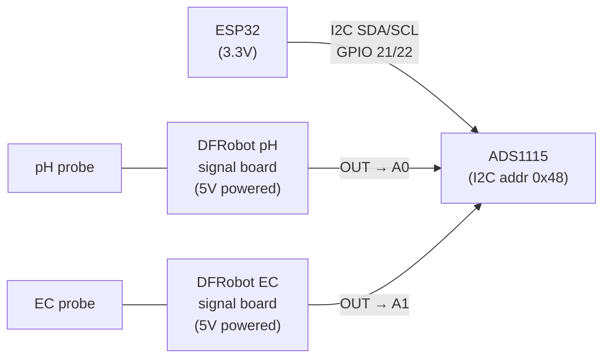

**ESPHome YAML — ADS1115 with pH and EC:**

```yaml
i2c:
  sda: GPIO21
  scl: GPIO22
  scan: true

ads1115:
  - address: 0x48

sensor:
  # pH via ADS1115 channel A0
  - platform: ads1115
    multiplexer: "A0_GND"
    gain: 4.096         # ±4.096V range (covers 0–3.3V signal board output)
    name: "pH Raw Voltage"
    id: ph_raw
    update_interval: 15s
    filters:
      - sliding_window_moving_average:
          window_size: 4
      - calibrate_linear:
          - 2.03 -> 4.0   # pH 4.0 buffer reading
          - 2.46 -> 7.0   # pH 7.0 buffer reading
    unit_of_measurement: "pH"

  # EC via ADS1115 channel A1
  - platform: ads1115
    multiplexer: "A1_GND"
    gain: 4.096
    name: "EC Raw Voltage"
    id: ec_raw
    update_interval: 15s
    filters:
      - sliding_window_moving_average:
          window_size: 4
      - calibrate_linear:
          - 0.33 -> 0.0       # distilled water (0 mS/cm)
          - 1.20 -> 1.413     # standard 1413 µS/cm solution
      - multiply: 1.0         # already in mS/cm after calibration
    unit_of_measurement: "mS/cm"
```

> **Calibration note:** The `calibrate_linear` values shown are examples only. You must perform a two-point calibration with your actual buffer solutions and record the measured voltage at each point to fill in the correct values.

### Pitfall 5 — Over-Engineering Too Early

**Problem:** You spend 3 weekends building a Tier 4 auto-dosing system before you've grown a single plant. The system breaks, you don't understand why, and you can't tell if it's a hardware problem or a plant problem.

**Prevention:** Start at Tier 0 (manual) for your first 4–6 weeks. Understand how the system behaves. Then add Tier 1 (off-the-shelf). Add Tier 2 after your first harvest. Add Tier 3–4 in your second growing season. Each tier builds on knowledge from the previous one.

### Pitfall 6 — Corrosion

**Problem:** Metal contacts, bare copper wire, and cheap connectors corrode in the humid, acidic environment near a hydroponic reservoir. Connections fail silently.

**Prevention:**
- Use silicone-sealed connectors or heat-shrink-covered solder joints
- Keep all electronics in IP65 enclosures
- Use stainless steel or gold-plated sensor probes (pH probes have glass tips specifically for this reason)
- Inspect wiring connections every 2–3 months

### Pitfall 7 — Sensor Reading Garbage

**Problem:** A sensor returns obviously wrong values — pH reads -1 or 14, EC reads 0 despite nutrients being present, temperature reads -127°C, or the ultrasonic distance sensor reads its maximum range constantly. The dashboard shows nonsense data, and if automation is running, dosing pumps may react to phantom readings.

**Diagnosis:**

| Symptom | Likely Cause | Fix |
|---------|-------------|-----|
| **pH reads -1 or 14** | Probe disconnected, cable break, or BNC connector corroded | Check BNC connection is fully seated; inspect cable for breaks; clean connector pins with isopropyl alcohol; replace probe if glass tip is cracked or dry-stored without storage solution |
| **pH reads fixed at 7.0 and never changes** | Probe dead (exhausted reference electrode) or signal wire shorted to ground | Try recalibrating with pH 4.0 and 7.0 buffers — if the probe cannot distinguish them, replace it. Typical probe lifespan: 12–18 months |
| **EC reads 0 despite nutrient solution present** | Probe not submerged, probe plates corroded/fouled, or cable break | Clean probe plates with soft brush + vinegar; ensure probe is fully submerged; check cable continuity with a multimeter |
| **EC reads extremely high (>10 mS/cm)** | Probe plates shorted (mineral deposit bridging them), or calibration lost | Clean probe plates thoroughly; recalibrate with standard solution; if persistent, replace probe |
| **Temperature reads -127°C** | DS18B20 sensor disconnected or wiring fault (this is the DS18B20 error code) | Check the 3-wire connection (VCC, GND, Data); ensure 4.7 kΩ pull-up resistor is present on Data line; try a different GPIO pin; replace sensor if wiring is confirmed correct |
| **Temperature reads +85°C constantly** | DS18B20 returning power-on reset value — not being read properly | Firmware is not completing the read cycle; check OneWire library initialisation; ensure adequate delay between requesting temperature and reading it (750 ms for 12-bit) |
| **Ultrasonic reads max range (e.g., 400 cm)** | No echo received — sensor misaligned, obstructed, or wiring fault | Check sensor is pointing straight down at water surface; ensure no foam or turbulence; verify TRIG and ECHO wires are not swapped; test sensor outside the reservoir to confirm it works |
| **Ultrasonic reads 0 or near-0** | Echo returning immediately — obstruction directly in front of sensor | Check for objects within 2 cm of sensor face; ensure mounting bracket is not reflecting the signal back |
| **All sensors reading 0 or NaN simultaneously** | Power supply issue, I2C bus locked up, or ESP32 crash/reboot loop | Check 3.3V and 5V power rails with a multimeter; power-cycle the ESP32; check serial log for crash traces; if I2C, add `Wire.begin()` recovery in firmware |

> **General rule:** If a sensor reads a physically impossible value, the problem is almost always **wiring, connectors, or a dead probe** — not your nutrient solution. Check the hardware before changing anything in your reservoir.

---


[↑ Back to TOC](#table-of-contents)

## 18. Upgrade Path — From Tier 1 to Tier 4

You don't need to commit to a tier upfront. The system is designed to grow incrementally.

```
RECOMMENDED UPGRADE TIMELINE

MONTH 1 (FIRST GROW):
  Start with Tier 0 (manual)
  → Learn the system, understand pH drift, EC behaviour, pump reliability
  → Record data in paper logbook

MONTH 2:
  Add Tier 1 (Govee + smart plug)
  → Get 24/7 temperature alerts
  → Get pump failure alerts
  → Start seeing temperature patterns on your phone
  Cost: +$50

MONTH 3–4 (CONFIDENT GROWER):
  Build Tier 2 ESP32 node
  → Continuous logging of temp, humidity, water level, pump current
  → Set up InfluxDB + Grafana dashboard (free cloud)
  → Start sending alerts via Telegram
  Cost: +$51

SEASON 2:
  Upgrade to Tier 3 (add pH + EC probes)
  → Continuous water quality monitoring
  → Full dashboard with all critical parameters
  → Historical trend analysis — compare this season to last
  Cost: +$80–$110

SEASON 2–3 (WHEN YOU'RE TIRED OF DAILY pH ADJUSTMENTS):
  Upgrade to Tier 4 (automated dosing)
  → pH and EC maintain themselves
  → You check the dashboard once a day and top up stock bottles weekly
  → The system runs itself with human oversight
  Cost: +$70–$100

TOTAL INVESTED OVER 2+ SEASONS: $250–$310
  → Equivalent to a mid-range commercial hydroponic controller
  → But fully customisable, repairable, and you understand every component
```

---


[↑ Back to TOC](#table-of-contents)

## Summary — What Each Tier Gives You

| Capability | Tier 0 | Tier 1 | Tier 2 | Tier 3 | Tier 4 |
|---|---|---|---|---|---|
| Temperature monitoring | 2×/day | 24/7 ✅ | 24/7 ✅ | 24/7 ✅ | 24/7 ✅ |
| Humidity monitoring | ❌ | 24/7 ✅ | 24/7 ✅ | 24/7 ✅ | 24/7 ✅ |
| pH monitoring | 2×/day | 2×/day | 2×/day | 24/7 ✅ | 24/7 ✅ |
| EC monitoring | 2×/day | 2×/day | 2×/day | 24/7 ✅ | 24/7 ✅ |
| Water level monitoring | Visual | Visual | 24/7 ✅ | 24/7 ✅ | 24/7 ✅ |
| Pump failure detection | Next check | 24/7 ✅ | 24/7 ✅ | 24/7 ✅ | 24/7 ✅ |
| Light level tracking | ❌ | ❌ | 24/7 ✅ | 24/7 ✅ | 24/7 ✅ |
| Phone alerts | ❌ | ✅ | ✅ | ✅ | ✅ |
| Dashboard | ❌ | App only | Basic web | Full Grafana | Full Grafana |
| Historical data | Paper log | 20 days (app) | 30+ days | 30+ days | 30+ days |
| Automated pH dosing | ❌ | ❌ | ❌ | ❌ | ✅ |
| Automated EC dosing | ❌ | ❌ | ❌ | ❌ | ✅ |
| Automated cooling | ❌ | ❌ | ❌ | ❌ | ✅ |
| Daily time required | 10–15 min | 5–10 min | 5 min | 3–5 min | 1–2 min |

> The best automation system is the one you actually build. Start simple, learn, upgrade.

---

> **Previous:** [Guide 12 — Budget and Sourcing](./12-budget-and-sourcing.md)
> **Back to:** [README — Hydroponics Guide Index](../../README.md)

---

<!-- copyright -->
*Copyright (c) 2026 UncleJS. Licensed under [CC BY-NC 4.0](https://creativecommons.org/licenses/by-nc/4.0/) — free to share and adapt for non-commercial purposes with attribution.*
