# Zone Layout & Spatial Design
## Outdoor Hybrid Hydroponics Station

---

## Overview

The hybrid growing station is designed to occupy a **backyard footprint of approximately 4m × 3m** (12m²). This is enough for the full three-zone system with clearance for maintenance access on all sides and a comfortable working aisle.

The station is oriented with the **long axis running east–west** so that the south-facing side of the channels receives maximum sun exposure in the Northern Hemisphere. Adjust to north-facing if you are in the Southern Hemisphere.

---

## Full Site Layout Map (Top-Down View)

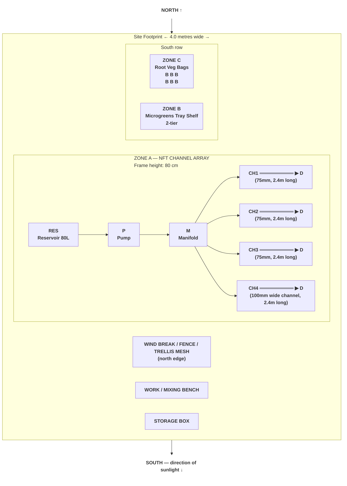
> **Legend:** RES = Reservoir · P = Pump · M = Manifold · D = Drain return · CH1–4 = NFT channels · B = Grow bag · ══ = NFT channel with net pot holes

---

## Dimensions & Clearances

| Area | Dimensions | Notes |
|------|-----------|-------|
| Total site footprint | 4.0m × 3.0m | Includes all 3 zones and work area |
| Zone A (NFT array) | 2.6m × 1.2m | Frame + reservoir beside it |
| Zone B (microgreens shelf) | 0.6m × 0.5m | 2-tier shelf, fits 3 trays per tier |
| Zone C (grow bags) | 1.2m × 0.6m | 6 bags, 2 rows of 3 |
| Working aisle | 0.6m | Front access to all zones |
| Work/mixing bench | 0.8m × 0.5m | Optional — a table or board on sawhorses |
| Wind break clearance | 0.3m | From fence/wall to system |

**Minimum workable footprint:** 3.5m × 2.5m if space is tight — compress Zone B/C side by side under a shelf.

---

## Zone A — NFT Channel Array (Detailed)

### Frame Side-View Diagram

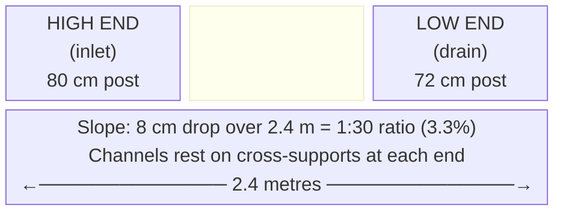

### Channel Spacing (Front-View Cross Section)

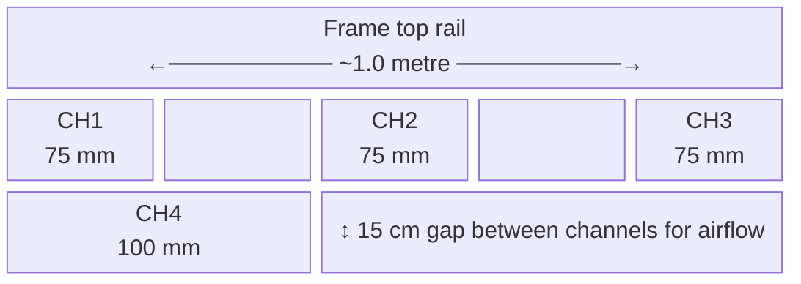

### Net Pot Hole Layout Per Channel

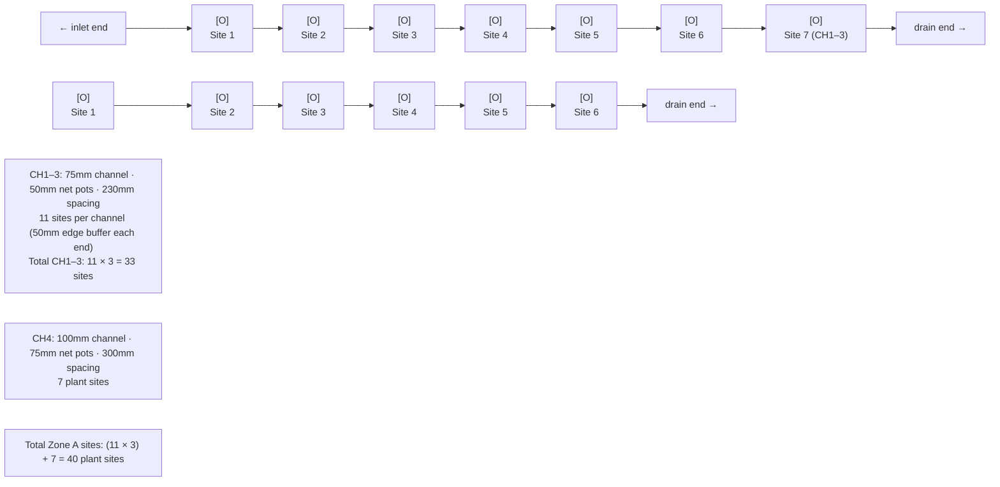

### Reservoir Placement

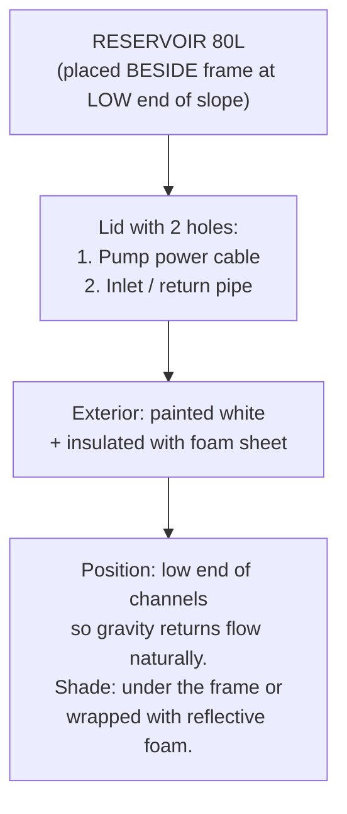

### Plumbing Route

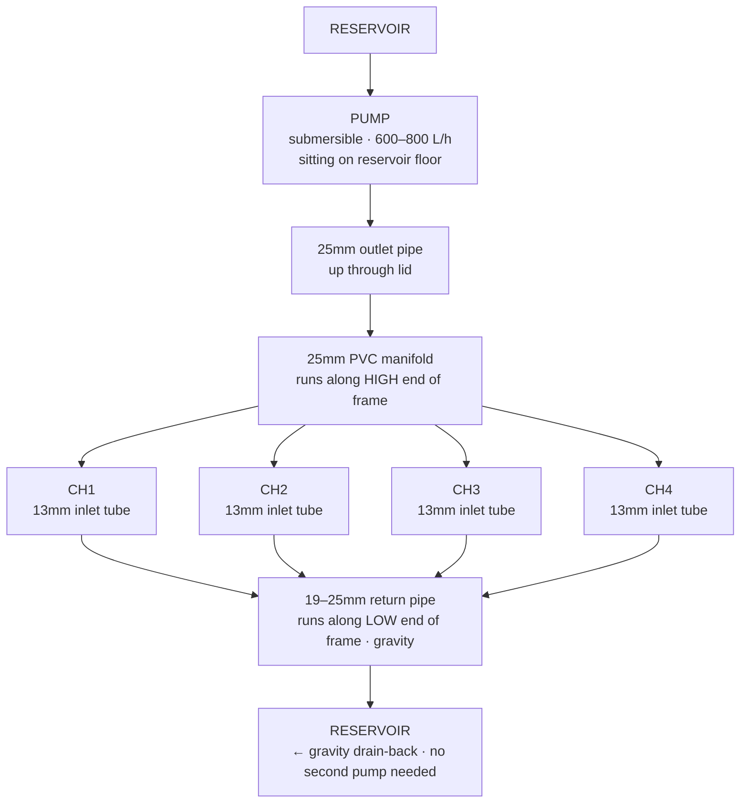

---

## Zone B — Microgreens Tray Station (Detailed)

### Shelf Structure

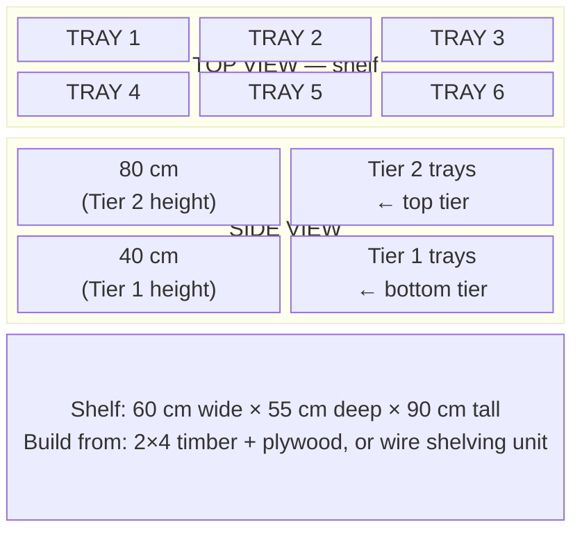

### Tray Configuration

| Tray | Crop | Sow Date Rotation |
|------|------|-------------------|
| Tray 1 | Sunflower shoots | Week 1 |
| Tray 2 | Pea shoots | Week 1 |
| Tray 3 | Radish microgreens | Week 2 |
| Tray 4 | Broccoli microgreens | Week 2 |
| Tray 5 | Amaranth | Week 3 |
| Tray 6 | Wheatgrass | Week 3 |

**Rotation cycle:** Sow a new tray every 3–5 days to maintain continuous harvest.

### Microgreens Protocol Summary

1. **Fill tray** with 2–3cm of moistened coco coir
2. **Broadcast seeds** evenly (no spacing — dense mat)
3. **Press seeds** gently into media with a flat board
4. **Blackout phase:** Cover with empty tray + weight for 2–4 days (germination)
5. **Light phase:** Uncover when shoots reach 2–3cm, place in full outdoor light (or partial shade in peak summer)
6. **Water:** Mist surface 2× daily during blackout, bottom-water after uncovering
7. **Harvest:** Cut at soil level when first true leaves appear (7–14 days depending on variety)

---

## Zone C — Root Vegetable Grow Bags (Detailed)

### Bag Layout

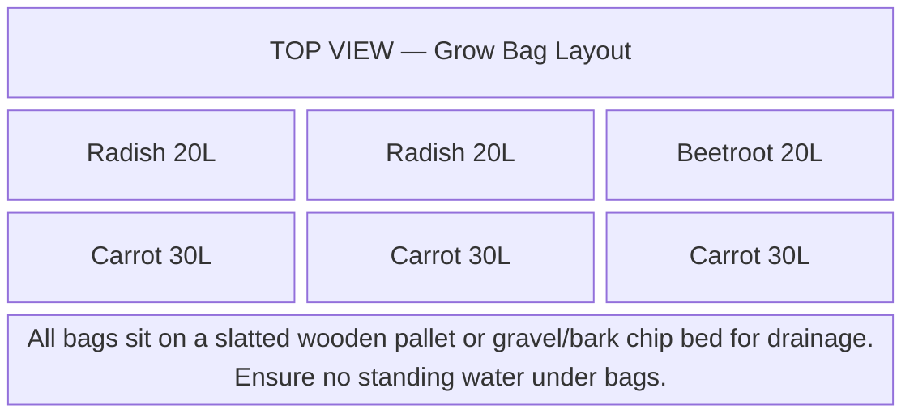

### Bag Sizes and Depths

| Crop | Bag Size | Depth Needed | Why |
|------|----------|-------------|-----|
| Radishes | 20L (round, wide) | 20–25cm | Short tap root, wide spread |
| Beetroot | 20L (round, wide) | 20–25cm | Moderate root depth |
| Carrots | 30L (tall/deep bag) | 30–40cm | Long tap root needs depth |

### Media Mix for Grow Bags

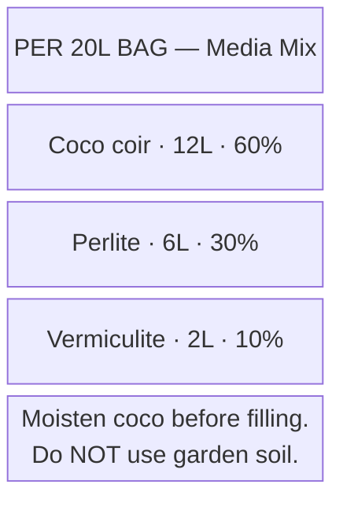

### Fertigation Schedule (Zone C)

| Crop Stage | Frequency | Solution EC | pH |
|------------|-----------|-------------|-----|
| Seedling (0–2 weeks) | 1× daily | 0.8–1.0 mS/cm | 6.0–6.5 |
| Vegetative (2–6 weeks) | 2× daily | 1.2–1.6 mS/cm | 6.0–6.5 |
| Root bulking (6+ weeks) | 2× daily | 1.6–2.0 mS/cm | 6.0–6.5 |

**Method:** Mix nutrient solution in a watering can. Water until runoff drains from bag bottom (20% runoff recommended to prevent salt buildup).

---

## Shade Cloth & Environmental Controls

### Shade Cloth Positioning

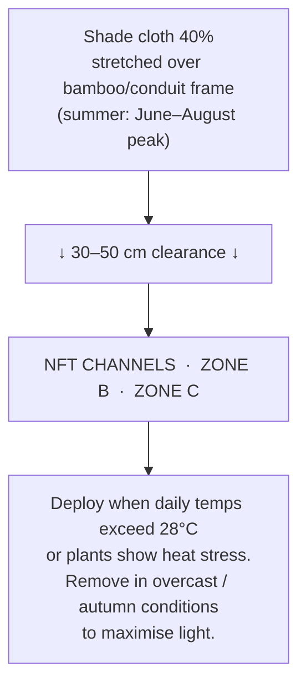

### Frost Fleece Deployment

```
  Autumn / cold nights (below 5°C):
  
  Drape horticultural fleece (30–50g/m²) over entire zone.
  Anchor edges with clips or stones.
  Remove during warm sunny days — fleece traps heat and humidity.
  
  Do NOT leave fleece on during heavy rain — weight can damage plants.
```

### Wind Break

- Install mesh fencing or slatted timber on the **north and east** sides
- Leave south and west open for sunlight and gentle air movement
- Secure all channels and the reservoir to the frame with cable ties or straps in high-wind conditions
- Taller plants (tomatoes, peppers) need individual staking/trellis regardless

---

## Maintenance Access Map

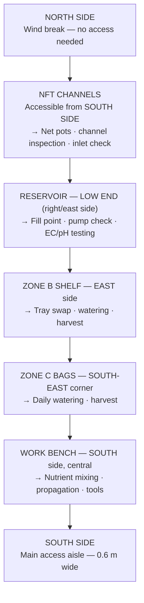

---

## Utility Requirements

| Utility | Requirement | Notes |
|---------|------------|-------|
| **Electricity** | 1 outdoor socket within ~3m | For submersible pump (5–15W). Use outdoor-rated extension lead and waterproof socket cover |
| **Water** | Garden hose or tap within ~5m | For topping up reservoir and mixing nutrient solution |
| **Drainage** | Ground drainage or drain slab | Overflow from reservoir and runoff from grow bags must drain away |
| **Storage** | Weatherproof box (optional) | For pH/EC meters, nutrients, spare fittings — keep out of sunlight |

---

*See [`guide/nft/11-build-guide.md`](guide/nft/11-build-guide.md) for NFT construction instructions*

---

<!-- copyright -->
*Copyright (c) 2026 UncleJS. Licensed under [CC BY-NC 4.0](https://creativecommons.org/licenses/by-nc/4.0/) — free to share and adapt for non-commercial purposes with attribution.*
