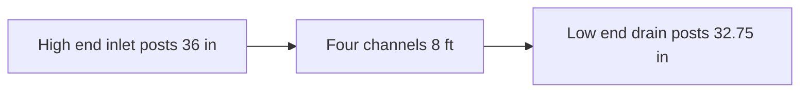
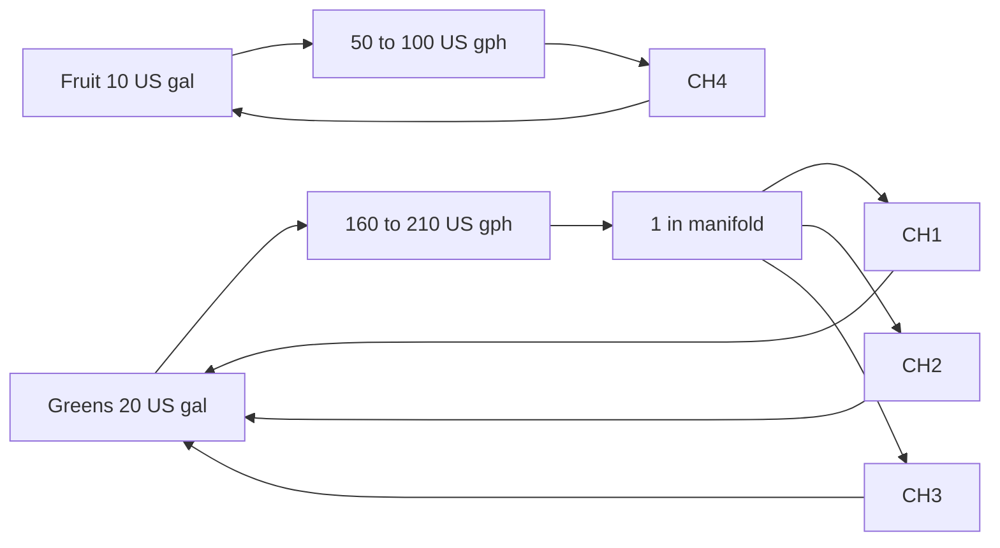
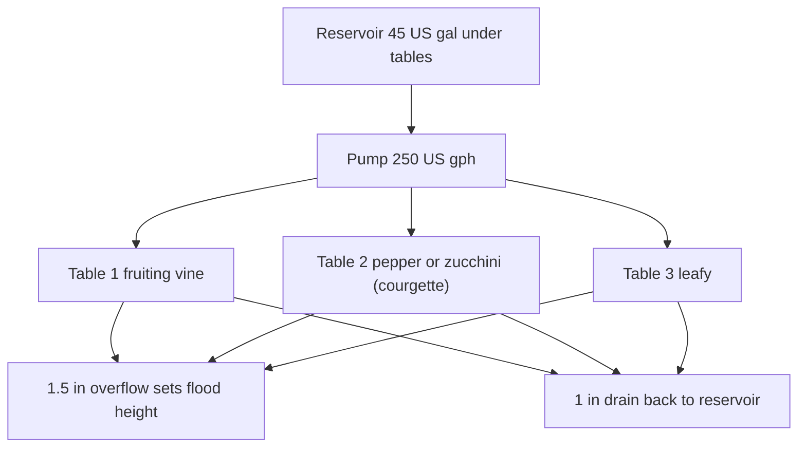

# Zone Layout and Spatial Design
## Outdoor Hybrid Hydroponics Station — Inland Mid-USA, about 38°N

Numbers in this file match [guide/design-constants.md](guide/design-constants.md). If they disagree, the constants file wins.

Build **one** Zone A: the NFT channel array **or** the Ebb and Flow tables. Zone B and Zone C are the same either way.

---

## Table of Contents

- [Overview](#overview)
- [Dimensions and clearances](#dimensions-and-clearances)
- [Zone A — NFT channel array](#zone-a-nft-channel-array)
- [Zone A — Ebb and Flow tables](#zone-a-ebb-and-flow-tables)
- [Zone B — Microgreens](#zone-b-microgreens)
- [Zone C — Root-vegetable grow bags](#zone-c-root-vegetable-grow-bags)
- [Shade, frost, and wind](#shade-frost-and-wind)
- [Maintenance access](#maintenance-access)
- [Utility requirements](#utility-requirements)

---

## Overview

The station occupies about **13 ft × 10 ft (4.0 m × 3.0 m)**. The long axis runs east–west so the south face takes the sun at about **38°N** (Kansas City, St. Louis, Louisville, Richmond — USDA zones 6b–7a). In South Africa, face the long axis **north**.

Planning season: **mid-April through mid-October** (SA: mid-October through mid-April). Last spring frost about **April 15** (SA: October 15). First fall frost about **October 20** (SA: April 20). These are planning dates, not a guarantee.

[↑ Back to TOC](#table-of-contents)

---

## Dimensions and clearances

| Area | Dimensions | Notes |
|------|------------|-------|
| Whole site | 13 ft × 10 ft (4.0 m × 3.0 m) | Zones, aisle, and bench |
| Zone A, NFT | 9 ft × 4 ft (2.7 m × 1.2 m) | Frame plus both reservoirs at the low end |
| Zone A, Ebb and Flow | 9 ft × 6 ft (2.7 m × 1.8 m) | Three 4 ft × 2 ft tables and the reservoir underneath |
| Zone B | 24 in × 20 in (61 cm × 51 cm) | Two-tier shelf, six trays |
| Zone C | 4 ft × 2 ft (1.22 m × 0.61 m) | Six bags, two rows of three |
| Working aisle | 24 in (61 cm) | South side, in front of every zone |
| Work bench | 32 in × 20 in (81 cm × 51 cm) | Optional mixing table |
| Wind-break gap | 12 in (30 cm) | Fence or mesh to the frame |

A tight yard can drop to about **12 ft × 8 ft (3.7 m × 2.4 m)** by putting Zone B and Zone C under one shelf. Do not shrink the south aisle below **18 in (46 cm)**.

[↑ Back to TOC](#table-of-contents)

---

## Zone A — NFT channel array

Four channels, **two reservoirs**. CH1–CH3 share the greens tank. CH4 has its own tank and pump so tomatoes and peppers can run a higher EC than lettuce.

### Frame, side view

The drop is **3¼ in (83 mm)** over **8 ft (2.44 m)**, a **1:30** slope. Channels sit on cross-supports at each end. Do not use a steeper A-frame. A slope near 1:15 drains too fast and leaves dry roots.

### Channel spacing

Leave about **6 in (15 cm)** of air between channels. CH1–CH3 are **3 in (76 mm)** square tube. CH4 is **4 in (102 mm)** square tube.

### Plant sites

| Channel | Tube | Net pot | Spacing | Sites | Crop |
|---------|------|---------|---------|-------|------|
| CH1 | 3 in (76 mm) | 2 in (51 mm) | 9 in (229 mm) | 11 | Lettuce |
| CH2 | 3 in (76 mm) | 2 in (51 mm) | 9 in (229 mm) | 11 | Basil, cilantro, parsley, chives |
| CH3 | 3 in (76 mm) | 2 in (51 mm) | 9 in (229 mm) | 11 | Spinach, kale, mint, and 3–4 strawberry sites |
| CH4 | 4 in (102 mm) | 3 in (76 mm) | 12 in (305 mm) | 7 | Cherry tomato and pepper only |

Total: **40 sites**. Keep about **2 in (51 mm)** of tube past the first and last hole. On CH4, plant **4–5** indeterminate cherries and skip holes, or up to **7** compact determinate plants. Strawberries stay on CH3. They cannot share the tomato tank.

### Reservoirs and plumbing

Both tanks sit at the **low** end so the return is gravity. Paint the body black and the outside white, or wrap with reflective foam, and keep them out of the sun.

| Loop | Reservoir | Pump | Feeds |
|------|-----------|------|-------|
| Greens | 20 US gal (76 L) | 160–210 US gph (600–800 L/h), 24 hours a day | 1 in (25 mm) manifold, then ½ in (13 mm) into CH1, CH2, CH3 |
| Fruiting | 10 US gal (38 L) | 50–100 US gph (200–400 L/h), 24 hours a day | Own ½ in (13 mm) line into CH4 only |

Each lid needs two holes: the pump cord, and the return pipe. An air stone in each tank is worth fitting. Flow per greens channel is **0.26–0.53 US gpm (1–2 L/min)**.

Both pumps run **continuously**. A timer is not part of normal NFT operation. Roots in a stopped channel dry in **15–30 minutes** in warm weather.

[↑ Back to TOC](#table-of-contents)

---

## Zone A — Ebb and Flow tables

Use this section instead of the NFT section if you are building flood tables. Do not plumb both Zone A designs into one reservoir.

### Tables

Three tables, each **4 ft × 2 ft (1.22 m × 0.61 m)**, built dead level. A **3/16 in (5 mm)** tilt floods one side and starves the other.

| Table | Crop | Plants |
|-------|------|--------|
| Table 1 | Indeterminate tomato or cucumber | 1 |
| Table 2 | Pepper, eggplant (aubergine), or zucchini (courgette) | 1–2 |
| Table 3 | Lettuce, herbs, pak choi, strawberries, or a later fruiting crop | Several |

### Media and flood

Fill each table with **5 in (13 cm)** of rinsed LECA: **25 US gal (95 L)** per table, **75 US gal (284 L)** for three. Buy **90 US gal (340 L)** so rinsing and settling do not leave you short.

The overflow standpipe stops the flood about **¾ in (2 cm)** below the top of the LECA. Water does not sit on the surface.

| Crop stage | Floods per day | Duration |
|------------|----------------|----------|
| Vegetative | 3 | 15–30 minutes |
| Fruiting, and hot afternoons | 4 | 15–30 minutes, shorter if the tank is warming |

Four floods is the ceiling. A fifth flood keeps the root zone too wet. In a 90–100°F (32–38°C) afternoon, add **40% shade** and keep four floods. Do not cut back to two.

### Reservoir and fittings

| Item | Value |
|------|-------|
| Reservoir | 45 US gal (170 L), under the tables, below the drain outlets. Acceptable range 40–50 US gal (151–189 L) |
| Pump | 250 US gph (950 L/h). Acceptable range 200–300 US gph (760–1,140 L/h) |
| Timer | Digital, 1-minute steps, in a weatherproof box on a GFCI |
| Overflow | 1½ in (40 mm) bulkhead and standpipe, one per table |
| Drain | 1 in (25 mm) bulkhead, one per table, gravity back to the reservoir |

A timer that sticks **on** rots roots in **2–4 hours**. A float that confirms the table has drained is the safety device to fit before the first crop: if the float is still up after pump-off, **open the pump relay (cut power)** and alert. Do not start the pump again until the table is empty. Moist LECA still buffers a missed flood for **8–24 hours**.

Build steps: [guide/ebb-and-flow/11-build-guide.md](guide/ebb-and-flow/11-build-guide.md).

[↑ Back to TOC](#table-of-contents)

---

## Zone B — Microgreens

### Shelf

Two tiers, **24 in wide × 20 in deep (61 cm × 51 cm)**, about **36 in (91 cm)** tall. Tier heights about **16 in (41 cm)** and **32 in (81 cm)**. Six trays, each **10 in × 20 in (25 cm × 50 cm)**.

### Protocol

1. Fill with **1–1¼ in (2.5–3 cm)** of moist coco coir.
2. Broadcast seed. Press it in with a flat board.
3. Blackout: an empty tray plus a light weight for 2–4 days.
4. Uncover when shoots are about **1 in (2.5 cm)**. Full sun, or 40% shade in June–August (SA: December–February).
5. Mist twice a day. Bottom-water after the blackout.
6. Standard crops get **pH 5.8–6.2 water only**. Sunflower and pea may take EC **0.4–0.8 mS/cm** if the grow runs long. No other nutrients.
7. Cut at the coco when the first true leaves show, usually 7–14 days.

| Tray | Crop | Sow rhythm |
|------|------|------------|
| 1 | Sunflower | Week 1 |
| 2 | Pea | Week 1 |
| 3 | Radish | Week 2 |
| 4 | Broccoli | Week 2 |
| 5 | Amaranth | Week 3 |
| 6 | Wheatgrass | Week 3 |

Sow a fresh tray every 3–5 days.

[↑ Back to TOC](#table-of-contents)

---

## Zone C — Root-vegetable grow bags

Six bags on a pallet or gravel so they cannot stand in water. Two rows of three.

| Bags | Size | Crop | Root depth to allow |
|------|------|------|---------------------|
| 2 | 5 US gal (19 L) | Radish | 8–10 in (20–25 cm) |
| 1 | 5 US gal (19 L) | Beet (beetroot) | 8–10 in (20–25 cm) |
| 3 | 10 US gal (38 L) | Carrot | 12–16 in (30–41 cm) |

Media by volume: **60% coco, 30% perlite, 10% vermiculite**. No garden soil. For a 5 US gal (19 L) bag that is about **3 US gal (11 L)** coco, **1.5 US gal (6 L)** perlite, and **0.5 US gal (2 L)** vermiculite. Double those scoops for a 10 US gal bag.

| Stage | How often | EC | pH |
|-------|-----------|----|----|
| Seedling, 0–2 weeks | Once a day | 0.8–1.0 mS/cm | 6.0–6.5 |
| Vegetative | Twice a day | 1.2–1.6 mS/cm | 6.0–6.5 |
| Root fill | Twice a day | 1.6–2.0 mS/cm | 6.0–6.5 |

Water until about 20% of the volume runs out the bottom. The EC ceiling is **2.0 mS/cm** for every Zone C crop, including beet (beetroot).

One-season planning yields, used by both budget guides: radish **15 lb (6.8 kg)**, beet (beetroot) **8 lb (3.6 kg)**, carrot **20 lb (9.1 kg)**.

[↑ Back to TOC](#table-of-contents)

---

## Shade, frost, and wind

**Shade.** 40% cloth on a conduit or bamboo frame, with **12–20 in (30–51 cm)** of air under the cloth. Put it on when afternoon highs stay above **85°F (29°C)** — normal in June–August (SA: December–February) at 38°N. Take it off in a cloudy spell so the DLI does not collapse.

**Frost.** Below **40°F (4°C)** at night, drape horticultural fleece over the zone and clip the edges. Take it off on a mild sunny day. Do not leave it on in heavy rain. Outdoor NFT does not stay out through deep winter here: lows of **0–15°F (−18 to −9°C)** will freeze both tanks.

**Wind.** Mesh or slatted timber on the **north** and **east**. Leave the south and west open. Strap channels, tables, and tanks to the frame. Stake tomatoes and peppers even behind a wind break. Place the break far enough that it does not dump turbulence onto the tables — a rough rule is several times the break’s own height.

[↑ Back to TOC](#table-of-contents)

---

## Maintenance access

| Side | What you do there |
|------|-------------------|
| South aisle, 24 in (61 cm) | Net pots, flood-table surface, harvest, the main working side |
| Low end (east) | Both NFT reservoirs, or the Ebb and Flow tank: fill, pump, EC and pH |
| East | Zone B tray swaps |
| South-east | Zone C watering and harvest |
| North | Wind break. Do not rely on this side for daily access |

[↑ Back to TOC](#table-of-contents)

---

## Utility requirements

| Utility | Requirement | Notes |
|---------|-------------|-------|
| Electricity | One outdoor receptacle within **10 ft (3 m)** | **120 V GFCI** (SA: **230 V**, **30 mA earth-leakage**). Weatherproof cover. NFT: two pumps, about 15 W and 8 W. Ebb and Flow: one pump, about 35 W, on a digital timer |
| Water | Hose bib within **16 ft (5 m)** | Top-up and mixing |
| Drainage | Ground that sheds water | Tank overflow and bag runoff must leave the site |
| Storage | Latched weatherproof box | Meters, dry salts, acids, pesticides. Out of the sun. Away from children and pets |

NFT build: [guide/nft/11-build-guide.md](guide/nft/11-build-guide.md). Ebb and Flow build: [guide/ebb-and-flow/11-build-guide.md](guide/ebb-and-flow/11-build-guide.md).

[↑ Back to TOC](#table-of-contents)

---

<!-- copyright -->
*Copyright (c) 2026 UncleJS. Licensed under [CC BY-NC-SA 4.0](https://creativecommons.org/licenses/by-nc-sa/4.0/) — free to share and adapt for non-commercial purposes with attribution and ShareAlike.*
